cola Report for GDS2547
==================

**Date**: 2019-12-25 20:17:16 CET, **cola version**: 1.3.2

----------------------------------------------------------------

<style type='text/css'>

body, td, th {
   font-family: Arial,Helvetica,sans-serif;
   background-color: white;
   font-size: 13px;
  max-width: 800px;
  margin: auto;
  margin-left:210px;
  padding: 0px 10px 0px 10px;
  border-left: 1px solid #EEEEEE;
  line-height: 150%;
}

tt, code, pre {
   font-family: 'DejaVu Sans Mono', 'Droid Sans Mono', 'Lucida Console', Consolas, Monaco, 

monospace;
}

h1 {
   font-size:2.2em;
}

h2 {
   font-size:1.8em;
}

h3 {
   font-size:1.4em;
}

h4 {
   font-size:1.0em;
}

h5 {
   font-size:0.9em;
}

h6 {
   font-size:0.8em;
}

a {
  text-decoration: none;
  color: #0366d6;
}

a:hover {
  text-decoration: underline;
}

a:visited {
   color: #0366d6;
}

pre, img {
  max-width: 100%;
}
pre {
  overflow-x: auto;
}
pre code {
   display: block; padding: 0.5em;
}

code {
  font-size: 92%;
  border: 1px solid #ccc;
}

code[class] {
  background-color: #F8F8F8;
}

table, td, th {
  border: 1px solid #ccc;
}

blockquote {
   color:#666666;
   margin:0;
   padding-left: 1em;
   border-left: 0.5em #EEE solid;
}

hr {
   height: 0px;
   border-bottom: none;
   border-top-width: thin;
   border-top-style: dotted;
   border-top-color: #999999;
}

@media print {
   * {
      background: transparent !important;
      color: black !important;
      filter:none !important;
      -ms-filter: none !important;
   }

   body {
      font-size:12pt;
      max-width:100%;
   }

   a, a:visited {
      text-decoration: underline;
   }

   hr {
      visibility: hidden;
      page-break-before: always;
   }

   pre, blockquote {
      padding-right: 1em;
      page-break-inside: avoid;
   }

   tr, img {
      page-break-inside: avoid;
   }

   img {
      max-width: 100% !important;
   }

   @page :left {
      margin: 15mm 20mm 15mm 10mm;
   }

   @page :right {
      margin: 15mm 10mm 15mm 20mm;
   }

   p, h2, h3 {
      orphans: 3; widows: 3;
   }

   h2, h3 {
      page-break-after: avoid;
   }
}
</style>


## Summary


All available functions which can be applied to this `res_list` object:


```r
res_list
```

```
#> A 'ConsensusPartitionList' object with 24 methods.
#>   On a matrix with 12013 rows and 164 columns.
#>   Top rows are extracted by 'SD, CV, MAD, ATC' methods.
#>   Subgroups are detected by 'hclust, kmeans, skmeans, pam, mclust, NMF' method.
#>   Number of partitions are tried for k = 2, 3, 4, 5, 6.
#>   Performed in total 30000 partitions by row resampling.
#> 
#> Following methods can be applied to this 'ConsensusPartitionList' object:
#>  [1] "cola_report"           "collect_classes"       "collect_plots"         "collect_stats"        
#>  [5] "colnames"              "functional_enrichment" "get_anno_col"          "get_anno"             
#>  [9] "get_classes"           "get_matrix"            "get_membership"        "get_stats"            
#> [13] "is_best_k"             "is_stable_k"           "ncol"                  "nrow"                 
#> [17] "rownames"              "show"                  "suggest_best_k"        "test_to_known_factors"
#> [21] "top_rows_heatmap"      "top_rows_overlap"     
#> 
#> You can get result for a single method by, e.g. object["SD", "hclust"] or object["SD:hclust"]
#> or a subset of methods by object[c("SD", "CV")], c("hclust", "kmeans")]
```

The call of `run_all_consensus_partition_methods()` was:


```
#> run_all_consensus_partition_methods(data = mat, mc.cores = 4, anno = anno)
```

Dimension of the input matrix:


```r
mat = get_matrix(res_list)
dim(mat)
```

```
#> [1] 12013   164
```

### Density distribution

The density distribution for each sample is visualized as in one column in the
following heatmap. The clustering is based on the distance which is the
Kolmogorov-Smirnov statistic between two distributions.


```r
library(ComplexHeatmap)
densityHeatmap(mat, top_annotation = HeatmapAnnotation(df = get_anno(res_list), 
    col = get_anno_col(res_list)), ylab = "value", cluster_columns = TRUE, show_column_names = FALSE,
    mc.cores = 4)
```

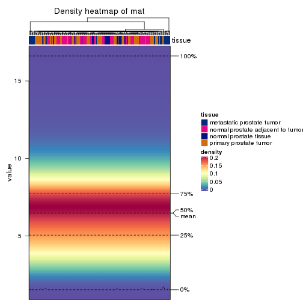


### Suggest the best k


Folowing table shows the best `k` (number of partitions) for each combination
of top-value methods and partition methods. Clicking on the method name in
the table goes to the section for a single combination of methods.

[The cola vignette](http://bioconductor.org/packages/devel/bioc/vignettes/cola/inst/doc/cola.html#toc_13)
explains the definition of the metrics used for determining the best
number of partitions.


```r
suggest_best_k(res_list)
```


|                            | The best k| 1-PAC| Mean silhouette| Concordance|   |
|:---------------------------|----------:|-----:|---------------:|-----------:|:--|
|[SD:mclust](#SD-mclust)     |          2| 1.000|           0.977|       0.990|** |
|[MAD:mclust](#MAD-mclust)   |          2| 1.000|           0.973|       0.988|** |
|[ATC:hclust](#ATC-hclust)   |          2| 1.000|           0.983|       0.992|** |
|[ATC:kmeans](#ATC-kmeans)   |          2| 1.000|           0.999|       1.000|** |
|[ATC:pam](#ATC-pam)         |          2| 1.000|           0.989|       0.995|** |
|[ATC:mclust](#ATC-mclust)   |          2| 1.000|           0.986|       0.994|** |
|[SD:pam](#SD-pam)           |          2| 0.999|           0.973|       0.988|** |
|[CV:mclust](#CV-mclust)     |          2| 0.996|           0.949|       0.966|** |
|[CV:kmeans](#CV-kmeans)     |          3| 0.989|           0.958|       0.978|** |
|[SD:kmeans](#SD-kmeans)     |          3| 0.958|           0.936|       0.956|** |
|[ATC:NMF](#ATC-NMF)         |          2| 0.949|           0.950|       0.978|*  |
|[ATC:skmeans](#ATC-skmeans) |          2| 0.936|           0.914|       0.967|*  |
|[MAD:pam](#MAD-pam)         |          2| 0.908|           0.936|       0.969|*  |
|[MAD:kmeans](#MAD-kmeans)   |          3| 0.902|           0.913|       0.954|*  |
|[SD:skmeans](#SD-skmeans)   |          3| 0.836|           0.888|       0.945|   |
|[MAD:NMF](#MAD-NMF)         |          2| 0.788|           0.877|       0.948|   |
|[SD:hclust](#SD-hclust)     |          4| 0.742|           0.826|       0.902|   |
|[CV:skmeans](#CV-skmeans)   |          3| 0.673|           0.821|       0.912|   |
|[MAD:skmeans](#MAD-skmeans) |          2| 0.647|           0.839|       0.928|   |
|[CV:NMF](#CV-NMF)           |          3| 0.631|           0.811|       0.898|   |
|[SD:NMF](#SD-NMF)           |          3| 0.594|           0.781|       0.881|   |
|[CV:hclust](#CV-hclust)     |          6| 0.512|           0.692|       0.864|   |
|[MAD:hclust](#MAD-hclust)   |          3| 0.479|           0.863|       0.843|   |
|[CV:pam](#CV-pam)           |          3| 0.307|           0.677|       0.798|   |

\*\*: 1-PAC > 0.95, \*: 1-PAC > 0.9


### CDF of consensus matrices

Cumulative distribution function curves of consensus matrix for all methods.


```r
collect_plots(res_list, fun = plot_ecdf)
```

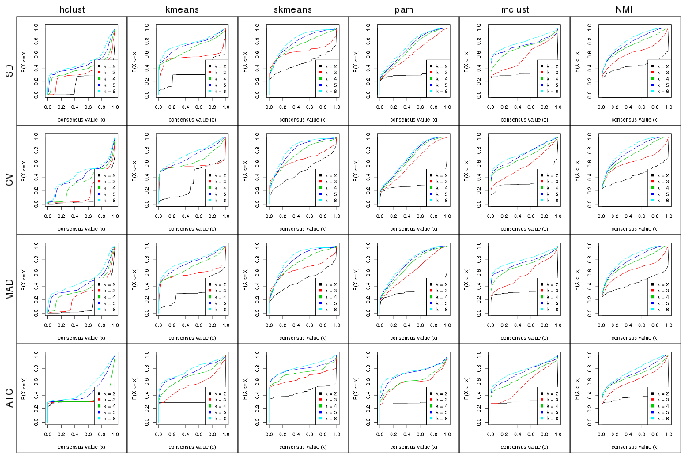


### Consensus heatmap

Consensus heatmaps for all methods. ([What is a consensus heatmap?](http://bioconductor.org/packages/devel/bioc/vignettes/cola/inst/doc/cola.html#toc_9))


<style type='text/css'>


.ui-helper-hidden {
	display: none;
}
.ui-helper-hidden-accessible {
	border: 0;
	clip: rect(0 0 0 0);
	height: 1px;
	margin: -1px;
	overflow: hidden;
	padding: 0;
	position: absolute;
	width: 1px;
}
.ui-helper-reset {
	margin: 0;
	padding: 0;
	border: 0;
	outline: 0;
	line-height: 1.3;
	text-decoration: none;
	font-size: 100%;
	list-style: none;
}
.ui-helper-clearfix:before,
.ui-helper-clearfix:after {
	content: "";
	display: table;
	border-collapse: collapse;
}
.ui-helper-clearfix:after {
	clear: both;
}
.ui-helper-zfix {
	width: 100%;
	height: 100%;
	top: 0;
	left: 0;
	position: absolute;
	opacity: 0;
	filter:Alpha(Opacity=0); 
}

.ui-front {
	z-index: 100;
}


.ui-state-disabled {
	cursor: default !important;
	pointer-events: none;
}


.ui-icon {
	display: inline-block;
	vertical-align: middle;
	margin-top: -.25em;
	position: relative;
	text-indent: -99999px;
	overflow: hidden;
	background-repeat: no-repeat;
}

.ui-widget-icon-block {
	left: 50%;
	margin-left: -8px;
	display: block;
}


.ui-widget-overlay {
	position: fixed;
	top: 0;
	left: 0;
	width: 100%;
	height: 100%;
}
.ui-accordion .ui-accordion-header {
	display: block;
	cursor: pointer;
	position: relative;
	margin: 2px 0 0 0;
	padding: .5em .5em .5em .7em;
	font-size: 100%;
}
.ui-accordion .ui-accordion-content {
	padding: 1em 2.2em;
	border-top: 0;
	overflow: auto;
}
.ui-autocomplete {
	position: absolute;
	top: 0;
	left: 0;
	cursor: default;
}
.ui-menu {
	list-style: none;
	padding: 0;
	margin: 0;
	display: block;
	outline: 0;
}
.ui-menu .ui-menu {
	position: absolute;
}
.ui-menu .ui-menu-item {
	margin: 0;
	cursor: pointer;
	
	list-style-image: url("data:image/gif;base64,R0lGODlhAQABAIAAAAAAAP///yH5BAEAAAAALAAAAAABAAEAAAIBRAA7");
}
.ui-menu .ui-menu-item-wrapper {
	position: relative;
	padding: 3px 1em 3px .4em;
}
.ui-menu .ui-menu-divider {
	margin: 5px 0;
	height: 0;
	font-size: 0;
	line-height: 0;
	border-width: 1px 0 0 0;
}
.ui-menu .ui-state-focus,
.ui-menu .ui-state-active {
	margin: -1px;
}


.ui-menu-icons {
	position: relative;
}
.ui-menu-icons .ui-menu-item-wrapper {
	padding-left: 2em;
}


.ui-menu .ui-icon {
	position: absolute;
	top: 0;
	bottom: 0;
	left: .2em;
	margin: auto 0;
}


.ui-menu .ui-menu-icon {
	left: auto;
	right: 0;
}
.ui-button {
	padding: .4em 1em;
	display: inline-block;
	position: relative;
	line-height: normal;
	margin-right: .1em;
	cursor: pointer;
	vertical-align: middle;
	text-align: center;
	-webkit-user-select: none;
	-moz-user-select: none;
	-ms-user-select: none;
	user-select: none;

	
	overflow: visible;
}

.ui-button,
.ui-button:link,
.ui-button:visited,
.ui-button:hover,
.ui-button:active {
	text-decoration: none;
}


.ui-button-icon-only {
	width: 2em;
	box-sizing: border-box;
	text-indent: -9999px;
	white-space: nowrap;
}


input.ui-button.ui-button-icon-only {
	text-indent: 0;
}


.ui-button-icon-only .ui-icon {
	position: absolute;
	top: 50%;
	left: 50%;
	margin-top: -8px;
	margin-left: -8px;
}

.ui-button.ui-icon-notext .ui-icon {
	padding: 0;
	width: 2.1em;
	height: 2.1em;
	text-indent: -9999px;
	white-space: nowrap;

}

input.ui-button.ui-icon-notext .ui-icon {
	width: auto;
	height: auto;
	text-indent: 0;
	white-space: normal;
	padding: .4em 1em;
}


input.ui-button::-moz-focus-inner,
button.ui-button::-moz-focus-inner {
	border: 0;
	padding: 0;
}
.ui-controlgroup {
	vertical-align: middle;
	display: inline-block;
}
.ui-controlgroup > .ui-controlgroup-item {
	float: left;
	margin-left: 0;
	margin-right: 0;
}
.ui-controlgroup > .ui-controlgroup-item:focus,
.ui-controlgroup > .ui-controlgroup-item.ui-visual-focus {
	z-index: 9999;
}
.ui-controlgroup-vertical > .ui-controlgroup-item {
	display: block;
	float: none;
	width: 100%;
	margin-top: 0;
	margin-bottom: 0;
	text-align: left;
}
.ui-controlgroup-vertical .ui-controlgroup-item {
	box-sizing: border-box;
}
.ui-controlgroup .ui-controlgroup-label {
	padding: .4em 1em;
}
.ui-controlgroup .ui-controlgroup-label span {
	font-size: 80%;
}
.ui-controlgroup-horizontal .ui-controlgroup-label + .ui-controlgroup-item {
	border-left: none;
}
.ui-controlgroup-vertical .ui-controlgroup-label + .ui-controlgroup-item {
	border-top: none;
}
.ui-controlgroup-horizontal .ui-controlgroup-label.ui-widget-content {
	border-right: none;
}
.ui-controlgroup-vertical .ui-controlgroup-label.ui-widget-content {
	border-bottom: none;
}


.ui-controlgroup-vertical .ui-spinner-input {

	
	width: 75%;
	width: calc( 100% - 2.4em );
}
.ui-controlgroup-vertical .ui-spinner .ui-spinner-up {
	border-top-style: solid;
}

.ui-checkboxradio-label .ui-icon-background {
	box-shadow: inset 1px 1px 1px #ccc;
	border-radius: .12em;
	border: none;
}
.ui-checkboxradio-radio-label .ui-icon-background {
	width: 16px;
	height: 16px;
	border-radius: 1em;
	overflow: visible;
	border: none;
}
.ui-checkboxradio-radio-label.ui-checkboxradio-checked .ui-icon,
.ui-checkboxradio-radio-label.ui-checkboxradio-checked:hover .ui-icon {
	background-image: none;
	width: 8px;
	height: 8px;
	border-width: 4px;
	border-style: solid;
}
.ui-checkboxradio-disabled {
	pointer-events: none;
}
.ui-datepicker {
	width: 17em;
	padding: .2em .2em 0;
	display: none;
}
.ui-datepicker .ui-datepicker-header {
	position: relative;
	padding: .2em 0;
}
.ui-datepicker .ui-datepicker-prev,
.ui-datepicker .ui-datepicker-next {
	position: absolute;
	top: 2px;
	width: 1.8em;
	height: 1.8em;
}
.ui-datepicker .ui-datepicker-prev-hover,
.ui-datepicker .ui-datepicker-next-hover {
	top: 1px;
}
.ui-datepicker .ui-datepicker-prev {
	left: 2px;
}
.ui-datepicker .ui-datepicker-next {
	right: 2px;
}
.ui-datepicker .ui-datepicker-prev-hover {
	left: 1px;
}
.ui-datepicker .ui-datepicker-next-hover {
	right: 1px;
}
.ui-datepicker .ui-datepicker-prev span,
.ui-datepicker .ui-datepicker-next span {
	display: block;
	position: absolute;
	left: 50%;
	margin-left: -8px;
	top: 50%;
	margin-top: -8px;
}
.ui-datepicker .ui-datepicker-title {
	margin: 0 2.3em;
	line-height: 1.8em;
	text-align: center;
}
.ui-datepicker .ui-datepicker-title select {
	font-size: 1em;
	margin: 1px 0;
}
.ui-datepicker select.ui-datepicker-month,
.ui-datepicker select.ui-datepicker-year {
	width: 45%;
}
.ui-datepicker table {
	width: 100%;
	font-size: .9em;
	border-collapse: collapse;
	margin: 0 0 .4em;
}
.ui-datepicker th {
	padding: .7em .3em;
	text-align: center;
	font-weight: bold;
	border: 0;
}
.ui-datepicker td {
	border: 0;
	padding: 1px;
}
.ui-datepicker td span,
.ui-datepicker td a {
	display: block;
	padding: .2em;
	text-align: right;
	text-decoration: none;
}
.ui-datepicker .ui-datepicker-buttonpane {
	background-image: none;
	margin: .7em 0 0 0;
	padding: 0 .2em;
	border-left: 0;
	border-right: 0;
	border-bottom: 0;
}
.ui-datepicker .ui-datepicker-buttonpane button {
	float: right;
	margin: .5em .2em .4em;
	cursor: pointer;
	padding: .2em .6em .3em .6em;
	width: auto;
	overflow: visible;
}
.ui-datepicker .ui-datepicker-buttonpane button.ui-datepicker-current {
	float: left;
}


.ui-datepicker.ui-datepicker-multi {
	width: auto;
}
.ui-datepicker-multi .ui-datepicker-group {
	float: left;
}
.ui-datepicker-multi .ui-datepicker-group table {
	width: 95%;
	margin: 0 auto .4em;
}
.ui-datepicker-multi-2 .ui-datepicker-group {
	width: 50%;
}
.ui-datepicker-multi-3 .ui-datepicker-group {
	width: 33.3%;
}
.ui-datepicker-multi-4 .ui-datepicker-group {
	width: 25%;
}
.ui-datepicker-multi .ui-datepicker-group-last .ui-datepicker-header,
.ui-datepicker-multi .ui-datepicker-group-middle .ui-datepicker-header {
	border-left-width: 0;
}
.ui-datepicker-multi .ui-datepicker-buttonpane {
	clear: left;
}
.ui-datepicker-row-break {
	clear: both;
	width: 100%;
	font-size: 0;
}


.ui-datepicker-rtl {
	direction: rtl;
}
.ui-datepicker-rtl .ui-datepicker-prev {
	right: 2px;
	left: auto;
}
.ui-datepicker-rtl .ui-datepicker-next {
	left: 2px;
	right: auto;
}
.ui-datepicker-rtl .ui-datepicker-prev:hover {
	right: 1px;
	left: auto;
}
.ui-datepicker-rtl .ui-datepicker-next:hover {
	left: 1px;
	right: auto;
}
.ui-datepicker-rtl .ui-datepicker-buttonpane {
	clear: right;
}
.ui-datepicker-rtl .ui-datepicker-buttonpane button {
	float: left;
}
.ui-datepicker-rtl .ui-datepicker-buttonpane button.ui-datepicker-current,
.ui-datepicker-rtl .ui-datepicker-group {
	float: right;
}
.ui-datepicker-rtl .ui-datepicker-group-last .ui-datepicker-header,
.ui-datepicker-rtl .ui-datepicker-group-middle .ui-datepicker-header {
	border-right-width: 0;
	border-left-width: 1px;
}


.ui-datepicker .ui-icon {
	display: block;
	text-indent: -99999px;
	overflow: hidden;
	background-repeat: no-repeat;
	left: .5em;
	top: .3em;
}
.ui-dialog {
	position: absolute;
	top: 0;
	left: 0;
	padding: .2em;
	outline: 0;
}
.ui-dialog .ui-dialog-titlebar {
	padding: .4em 1em;
	position: relative;
}
.ui-dialog .ui-dialog-title {
	float: left;
	margin: .1em 0;
	white-space: nowrap;
	width: 90%;
	overflow: hidden;
	text-overflow: ellipsis;
}
.ui-dialog .ui-dialog-titlebar-close {
	position: absolute;
	right: .3em;
	top: 50%;
	width: 20px;
	margin: -10px 0 0 0;
	padding: 1px;
	height: 20px;
}
.ui-dialog .ui-dialog-content {
	position: relative;
	border: 0;
	padding: .5em 1em;
	background: none;
	overflow: auto;
}
.ui-dialog .ui-dialog-buttonpane {
	text-align: left;
	border-width: 1px 0 0 0;
	background-image: none;
	margin-top: .5em;
	padding: .3em 1em .5em .4em;
}
.ui-dialog .ui-dialog-buttonpane .ui-dialog-buttonset {
	float: right;
}
.ui-dialog .ui-dialog-buttonpane button {
	margin: .5em .4em .5em 0;
	cursor: pointer;
}
.ui-dialog .ui-resizable-n {
	height: 2px;
	top: 0;
}
.ui-dialog .ui-resizable-e {
	width: 2px;
	right: 0;
}
.ui-dialog .ui-resizable-s {
	height: 2px;
	bottom: 0;
}
.ui-dialog .ui-resizable-w {
	width: 2px;
	left: 0;
}
.ui-dialog .ui-resizable-se,
.ui-dialog .ui-resizable-sw,
.ui-dialog .ui-resizable-ne,
.ui-dialog .ui-resizable-nw {
	width: 7px;
	height: 7px;
}
.ui-dialog .ui-resizable-se {
	right: 0;
	bottom: 0;
}
.ui-dialog .ui-resizable-sw {
	left: 0;
	bottom: 0;
}
.ui-dialog .ui-resizable-ne {
	right: 0;
	top: 0;
}
.ui-dialog .ui-resizable-nw {
	left: 0;
	top: 0;
}
.ui-draggable .ui-dialog-titlebar {
	cursor: move;
}
.ui-draggable-handle {
	-ms-touch-action: none;
	touch-action: none;
}
.ui-resizable {
	position: relative;
}
.ui-resizable-handle {
	position: absolute;
	font-size: 0.1px;
	display: block;
	-ms-touch-action: none;
	touch-action: none;
}
.ui-resizable-disabled .ui-resizable-handle,
.ui-resizable-autohide .ui-resizable-handle {
	display: none;
}
.ui-resizable-n {
	cursor: n-resize;
	height: 7px;
	width: 100%;
	top: -5px;
	left: 0;
}
.ui-resizable-s {
	cursor: s-resize;
	height: 7px;
	width: 100%;
	bottom: -5px;
	left: 0;
}
.ui-resizable-e {
	cursor: e-resize;
	width: 7px;
	right: -5px;
	top: 0;
	height: 100%;
}
.ui-resizable-w {
	cursor: w-resize;
	width: 7px;
	left: -5px;
	top: 0;
	height: 100%;
}
.ui-resizable-se {
	cursor: se-resize;
	width: 12px;
	height: 12px;
	right: 1px;
	bottom: 1px;
}
.ui-resizable-sw {
	cursor: sw-resize;
	width: 9px;
	height: 9px;
	left: -5px;
	bottom: -5px;
}
.ui-resizable-nw {
	cursor: nw-resize;
	width: 9px;
	height: 9px;
	left: -5px;
	top: -5px;
}
.ui-resizable-ne {
	cursor: ne-resize;
	width: 9px;
	height: 9px;
	right: -5px;
	top: -5px;
}
.ui-progressbar {
	height: 2em;
	text-align: left;
	overflow: hidden;
}
.ui-progressbar .ui-progressbar-value {
	margin: -1px;
	height: 100%;
}
.ui-progressbar .ui-progressbar-overlay {
	background: url("");
	height: 100%;
	filter: alpha(opacity=25); 
	opacity: 0.25;
}
.ui-progressbar-indeterminate .ui-progressbar-value {
	background-image: none;
}
.ui-selectable {
	-ms-touch-action: none;
	touch-action: none;
}
.ui-selectable-helper {
	position: absolute;
	z-index: 100;
	border: 1px dotted black;
}
.ui-selectmenu-menu {
	padding: 0;
	margin: 0;
	position: absolute;
	top: 0;
	left: 0;
	display: none;
}
.ui-selectmenu-menu .ui-menu {
	overflow: auto;
	overflow-x: hidden;
	padding-bottom: 1px;
}
.ui-selectmenu-menu .ui-menu .ui-selectmenu-optgroup {
	font-size: 1em;
	font-weight: bold;
	line-height: 1.5;
	padding: 2px 0.4em;
	margin: 0.5em 0 0 0;
	height: auto;
	border: 0;
}
.ui-selectmenu-open {
	display: block;
}
.ui-selectmenu-text {
	display: block;
	margin-right: 20px;
	overflow: hidden;
	text-overflow: ellipsis;
}
.ui-selectmenu-button.ui-button {
	text-align: left;
	white-space: nowrap;
	width: 14em;
}
.ui-selectmenu-icon.ui-icon {
	float: right;
	margin-top: 0;
}
.ui-slider {
	position: relative;
	text-align: left;
}
.ui-slider .ui-slider-handle {
	position: absolute;
	z-index: 2;
	width: 1.2em;
	height: 1.2em;
	cursor: default;
	-ms-touch-action: none;
	touch-action: none;
}
.ui-slider .ui-slider-range {
	position: absolute;
	z-index: 1;
	font-size: .7em;
	display: block;
	border: 0;
	background-position: 0 0;
}


.ui-slider.ui-state-disabled .ui-slider-handle,
.ui-slider.ui-state-disabled .ui-slider-range {
	filter: inherit;
}

.ui-slider-horizontal {
	height: .8em;
}
.ui-slider-horizontal .ui-slider-handle {
	top: -.3em;
	margin-left: -.6em;
}
.ui-slider-horizontal .ui-slider-range {
	top: 0;
	height: 100%;
}
.ui-slider-horizontal .ui-slider-range-min {
	left: 0;
}
.ui-slider-horizontal .ui-slider-range-max {
	right: 0;
}

.ui-slider-vertical {
	width: .8em;
	height: 100px;
}
.ui-slider-vertical .ui-slider-handle {
	left: -.3em;
	margin-left: 0;
	margin-bottom: -.6em;
}
.ui-slider-vertical .ui-slider-range {
	left: 0;
	width: 100%;
}
.ui-slider-vertical .ui-slider-range-min {
	bottom: 0;
}
.ui-slider-vertical .ui-slider-range-max {
	top: 0;
}
.ui-sortable-handle {
	-ms-touch-action: none;
	touch-action: none;
}
.ui-spinner {
	position: relative;
	display: inline-block;
	overflow: hidden;
	padding: 0;
	vertical-align: middle;
}
.ui-spinner-input {
	border: none;
	background: none;
	color: inherit;
	padding: .222em 0;
	margin: .2em 0;
	vertical-align: middle;
	margin-left: .4em;
	margin-right: 2em;
}
.ui-spinner-button {
	width: 1.6em;
	height: 50%;
	font-size: .5em;
	padding: 0;
	margin: 0;
	text-align: center;
	position: absolute;
	cursor: default;
	display: block;
	overflow: hidden;
	right: 0;
}

.ui-spinner a.ui-spinner-button {
	border-top-style: none;
	border-bottom-style: none;
	border-right-style: none;
}
.ui-spinner-up {
	top: 0;
}
.ui-spinner-down {
	bottom: 0;
}
.ui-tabs {
	position: relative;
	padding: .2em;
}
.ui-tabs .ui-tabs-nav {
	margin: 0;
	padding: .2em .2em 0;
}
.ui-tabs .ui-tabs-nav li {
	list-style: none;
	float: left;
	position: relative;
	top: 0;
	margin: 1px .2em 0 0;
	border-bottom-width: 0;
	padding: 0;
	white-space: nowrap;
}
.ui-tabs .ui-tabs-nav .ui-tabs-anchor {
	float: left;
	padding: .5em 1em;
	text-decoration: none;
}
.ui-tabs .ui-tabs-nav li.ui-tabs-active {
	margin-bottom: -1px;
	padding-bottom: 1px;
}
.ui-tabs .ui-tabs-nav li.ui-tabs-active .ui-tabs-anchor,
.ui-tabs .ui-tabs-nav li.ui-state-disabled .ui-tabs-anchor,
.ui-tabs .ui-tabs-nav li.ui-tabs-loading .ui-tabs-anchor {
	cursor: text;
}
.ui-tabs-collapsible .ui-tabs-nav li.ui-tabs-active .ui-tabs-anchor {
	cursor: pointer;
}
.ui-tabs .ui-tabs-panel {
	display: block;
	border-width: 0;
	padding: 1em 1.4em;
	background: none;
}
.ui-tooltip {
	padding: 8px;
	position: absolute;
	z-index: 9999;
	max-width: 300px;
}
body .ui-tooltip {
	border-width: 2px;
}

.ui-widget {
	font-family: Arial,Helvetica,sans-serif;
	font-size: 1em;
}
.ui-widget .ui-widget {
	font-size: 1em;
}
.ui-widget input,
.ui-widget select,
.ui-widget textarea,
.ui-widget button {
	font-family: Arial,Helvetica,sans-serif;
	font-size: 1em;
}
.ui-widget.ui-widget-content {
	border: 1px solid #c5c5c5;
}
.ui-widget-content {
	border: 1px solid #dddddd;
	background: #ffffff;
	color: #333333;
}
.ui-widget-content a {
	color: #333333;
}
.ui-widget-header {
	border: 1px solid #dddddd;
	background: #e9e9e9;
	color: #333333;
	font-weight: bold;
}
.ui-widget-header a {
	color: #333333;
}


.ui-state-default,
.ui-widget-content .ui-state-default,
.ui-widget-header .ui-state-default,
.ui-button,


html .ui-button.ui-state-disabled:hover,
html .ui-button.ui-state-disabled:active {
	border: 1px solid #c5c5c5;
	background: #f6f6f6;
	font-weight: normal;
	color: #454545;
}
.ui-state-default a,
.ui-state-default a:link,
.ui-state-default a:visited,
a.ui-button,
a:link.ui-button,
a:visited.ui-button,
.ui-button {
	color: #454545;
	text-decoration: none;
}
.ui-state-hover,
.ui-widget-content .ui-state-hover,
.ui-widget-header .ui-state-hover,
.ui-state-focus,
.ui-widget-content .ui-state-focus,
.ui-widget-header .ui-state-focus,
.ui-button:hover,
.ui-button:focus {
	border: 1px solid #cccccc;
	background: #ededed;
	font-weight: normal;
	color: #2b2b2b;
}
.ui-state-hover a,
.ui-state-hover a:hover,
.ui-state-hover a:link,
.ui-state-hover a:visited,
.ui-state-focus a,
.ui-state-focus a:hover,
.ui-state-focus a:link,
.ui-state-focus a:visited,
a.ui-button:hover,
a.ui-button:focus {
	color: #2b2b2b;
	text-decoration: none;
}

.ui-visual-focus {
	box-shadow: 0 0 3px 1px rgb(94, 158, 214);
}
.ui-state-active,
.ui-widget-content .ui-state-active,
.ui-widget-header .ui-state-active,
a.ui-button:active,
.ui-button:active,
.ui-button.ui-state-active:hover {
	border: 1px solid #003eff;
	background: #007fff;
	font-weight: normal;
	color: #ffffff;
}
.ui-icon-background,
.ui-state-active .ui-icon-background {
	border: #003eff;
	background-color: #ffffff;
}
.ui-state-active a,
.ui-state-active a:link,
.ui-state-active a:visited {
	color: #ffffff;
	text-decoration: none;
}


.ui-state-highlight,
.ui-widget-content .ui-state-highlight,
.ui-widget-header .ui-state-highlight {
	border: 1px solid #dad55e;
	background: #fffa90;
	color: #777620;
}
.ui-state-checked {
	border: 1px solid #dad55e;
	background: #fffa90;
}
.ui-state-highlight a,
.ui-widget-content .ui-state-highlight a,
.ui-widget-header .ui-state-highlight a {
	color: #777620;
}
.ui-state-error,
.ui-widget-content .ui-state-error,
.ui-widget-header .ui-state-error {
	border: 1px solid #f1a899;
	background: #fddfdf;
	color: #5f3f3f;
}
.ui-state-error a,
.ui-widget-content .ui-state-error a,
.ui-widget-header .ui-state-error a {
	color: #5f3f3f;
}
.ui-state-error-text,
.ui-widget-content .ui-state-error-text,
.ui-widget-header .ui-state-error-text {
	color: #5f3f3f;
}
.ui-priority-primary,
.ui-widget-content .ui-priority-primary,
.ui-widget-header .ui-priority-primary {
	font-weight: bold;
}
.ui-priority-secondary,
.ui-widget-content .ui-priority-secondary,
.ui-widget-header .ui-priority-secondary {
	opacity: .7;
	filter:Alpha(Opacity=70); 
	font-weight: normal;
}
.ui-state-disabled,
.ui-widget-content .ui-state-disabled,
.ui-widget-header .ui-state-disabled {
	opacity: .35;
	filter:Alpha(Opacity=35); 
	background-image: none;
}
.ui-state-disabled .ui-icon {
	filter:Alpha(Opacity=35); 
}


.ui-icon {
	width: 16px;
	height: 16px;
}
.ui-icon,
.ui-widget-content .ui-icon {
	background-image: url("images/ui-icons_444444_256x240.png");
}
.ui-widget-header .ui-icon {
	background-image: url("images/ui-icons_444444_256x240.png");
}
.ui-state-hover .ui-icon,
.ui-state-focus .ui-icon,
.ui-button:hover .ui-icon,
.ui-button:focus .ui-icon {
	background-image: url("images/ui-icons_555555_256x240.png");
}
.ui-state-active .ui-icon,
.ui-button:active .ui-icon {
	background-image: url("images/ui-icons_ffffff_256x240.png");
}
.ui-state-highlight .ui-icon,
.ui-button .ui-state-highlight.ui-icon {
	background-image: url("images/ui-icons_777620_256x240.png");
}
.ui-state-error .ui-icon,
.ui-state-error-text .ui-icon {
	background-image: url("images/ui-icons_cc0000_256x240.png");
}
.ui-button .ui-icon {
	background-image: url("images/ui-icons_777777_256x240.png");
}


.ui-icon-blank { background-position: 16px 16px; }
.ui-icon-caret-1-n { background-position: 0 0; }
.ui-icon-caret-1-ne { background-position: -16px 0; }
.ui-icon-caret-1-e { background-position: -32px 0; }
.ui-icon-caret-1-se { background-position: -48px 0; }
.ui-icon-caret-1-s { background-position: -65px 0; }
.ui-icon-caret-1-sw { background-position: -80px 0; }
.ui-icon-caret-1-w { background-position: -96px 0; }
.ui-icon-caret-1-nw { background-position: -112px 0; }
.ui-icon-caret-2-n-s { background-position: -128px 0; }
.ui-icon-caret-2-e-w { background-position: -144px 0; }
.ui-icon-triangle-1-n { background-position: 0 -16px; }
.ui-icon-triangle-1-ne { background-position: -16px -16px; }
.ui-icon-triangle-1-e { background-position: -32px -16px; }
.ui-icon-triangle-1-se { background-position: -48px -16px; }
.ui-icon-triangle-1-s { background-position: -65px -16px; }
.ui-icon-triangle-1-sw { background-position: -80px -16px; }
.ui-icon-triangle-1-w { background-position: -96px -16px; }
.ui-icon-triangle-1-nw { background-position: -112px -16px; }
.ui-icon-triangle-2-n-s { background-position: -128px -16px; }
.ui-icon-triangle-2-e-w { background-position: -144px -16px; }
.ui-icon-arrow-1-n { background-position: 0 -32px; }
.ui-icon-arrow-1-ne { background-position: -16px -32px; }
.ui-icon-arrow-1-e { background-position: -32px -32px; }
.ui-icon-arrow-1-se { background-position: -48px -32px; }
.ui-icon-arrow-1-s { background-position: -65px -32px; }
.ui-icon-arrow-1-sw { background-position: -80px -32px; }
.ui-icon-arrow-1-w { background-position: -96px -32px; }
.ui-icon-arrow-1-nw { background-position: -112px -32px; }
.ui-icon-arrow-2-n-s { background-position: -128px -32px; }
.ui-icon-arrow-2-ne-sw { background-position: -144px -32px; }
.ui-icon-arrow-2-e-w { background-position: -160px -32px; }
.ui-icon-arrow-2-se-nw { background-position: -176px -32px; }
.ui-icon-arrowstop-1-n { background-position: -192px -32px; }
.ui-icon-arrowstop-1-e { background-position: -208px -32px; }
.ui-icon-arrowstop-1-s { background-position: -224px -32px; }
.ui-icon-arrowstop-1-w { background-position: -240px -32px; }
.ui-icon-arrowthick-1-n { background-position: 1px -48px; }
.ui-icon-arrowthick-1-ne { background-position: -16px -48px; }
.ui-icon-arrowthick-1-e { background-position: -32px -48px; }
.ui-icon-arrowthick-1-se { background-position: -48px -48px; }
.ui-icon-arrowthick-1-s { background-position: -64px -48px; }
.ui-icon-arrowthick-1-sw { background-position: -80px -48px; }
.ui-icon-arrowthick-1-w { background-position: -96px -48px; }
.ui-icon-arrowthick-1-nw { background-position: -112px -48px; }
.ui-icon-arrowthick-2-n-s { background-position: -128px -48px; }
.ui-icon-arrowthick-2-ne-sw { background-position: -144px -48px; }
.ui-icon-arrowthick-2-e-w { background-position: -160px -48px; }
.ui-icon-arrowthick-2-se-nw { background-position: -176px -48px; }
.ui-icon-arrowthickstop-1-n { background-position: -192px -48px; }
.ui-icon-arrowthickstop-1-e { background-position: -208px -48px; }
.ui-icon-arrowthickstop-1-s { background-position: -224px -48px; }
.ui-icon-arrowthickstop-1-w { background-position: -240px -48px; }
.ui-icon-arrowreturnthick-1-w { background-position: 0 -64px; }
.ui-icon-arrowreturnthick-1-n { background-position: -16px -64px; }
.ui-icon-arrowreturnthick-1-e { background-position: -32px -64px; }
.ui-icon-arrowreturnthick-1-s { background-position: -48px -64px; }
.ui-icon-arrowreturn-1-w { background-position: -64px -64px; }
.ui-icon-arrowreturn-1-n { background-position: -80px -64px; }
.ui-icon-arrowreturn-1-e { background-position: -96px -64px; }
.ui-icon-arrowreturn-1-s { background-position: -112px -64px; }
.ui-icon-arrowrefresh-1-w { background-position: -128px -64px; }
.ui-icon-arrowrefresh-1-n { background-position: -144px -64px; }
.ui-icon-arrowrefresh-1-e { background-position: -160px -64px; }
.ui-icon-arrowrefresh-1-s { background-position: -176px -64px; }
.ui-icon-arrow-4 { background-position: 0 -80px; }
.ui-icon-arrow-4-diag { background-position: -16px -80px; }
.ui-icon-extlink { background-position: -32px -80px; }
.ui-icon-newwin { background-position: -48px -80px; }
.ui-icon-refresh { background-position: -64px -80px; }
.ui-icon-shuffle { background-position: -80px -80px; }
.ui-icon-transfer-e-w { background-position: -96px -80px; }
.ui-icon-transferthick-e-w { background-position: -112px -80px; }
.ui-icon-folder-collapsed { background-position: 0 -96px; }
.ui-icon-folder-open { background-position: -16px -96px; }
.ui-icon-document { background-position: -32px -96px; }
.ui-icon-document-b { background-position: -48px -96px; }
.ui-icon-note { background-position: -64px -96px; }
.ui-icon-mail-closed { background-position: -80px -96px; }
.ui-icon-mail-open { background-position: -96px -96px; }
.ui-icon-suitcase { background-position: -112px -96px; }
.ui-icon-comment { background-position: -128px -96px; }
.ui-icon-person { background-position: -144px -96px; }
.ui-icon-print { background-position: -160px -96px; }
.ui-icon-trash { background-position: -176px -96px; }
.ui-icon-locked { background-position: -192px -96px; }
.ui-icon-unlocked { background-position: -208px -96px; }
.ui-icon-bookmark { background-position: -224px -96px; }
.ui-icon-tag { background-position: -240px -96px; }
.ui-icon-home { background-position: 0 -112px; }
.ui-icon-flag { background-position: -16px -112px; }
.ui-icon-calendar { background-position: -32px -112px; }
.ui-icon-cart { background-position: -48px -112px; }
.ui-icon-pencil { background-position: -64px -112px; }
.ui-icon-clock { background-position: -80px -112px; }
.ui-icon-disk { background-position: -96px -112px; }
.ui-icon-calculator { background-position: -112px -112px; }
.ui-icon-zoomin { background-position: -128px -112px; }
.ui-icon-zoomout { background-position: -144px -112px; }
.ui-icon-search { background-position: -160px -112px; }
.ui-icon-wrench { background-position: -176px -112px; }
.ui-icon-gear { background-position: -192px -112px; }
.ui-icon-heart { background-position: -208px -112px; }
.ui-icon-star { background-position: -224px -112px; }
.ui-icon-link { background-position: -240px -112px; }
.ui-icon-cancel { background-position: 0 -128px; }
.ui-icon-plus { background-position: -16px -128px; }
.ui-icon-plusthick { background-position: -32px -128px; }
.ui-icon-minus { background-position: -48px -128px; }
.ui-icon-minusthick { background-position: -64px -128px; }
.ui-icon-close { background-position: -80px -128px; }
.ui-icon-closethick { background-position: -96px -128px; }
.ui-icon-key { background-position: -112px -128px; }
.ui-icon-lightbulb { background-position: -128px -128px; }
.ui-icon-scissors { background-position: -144px -128px; }
.ui-icon-clipboard { background-position: -160px -128px; }
.ui-icon-copy { background-position: -176px -128px; }
.ui-icon-contact { background-position: -192px -128px; }
.ui-icon-image { background-position: -208px -128px; }
.ui-icon-video { background-position: -224px -128px; }
.ui-icon-script { background-position: -240px -128px; }
.ui-icon-alert { background-position: 0 -144px; }
.ui-icon-info { background-position: -16px -144px; }
.ui-icon-notice { background-position: -32px -144px; }
.ui-icon-help { background-position: -48px -144px; }
.ui-icon-check { background-position: -64px -144px; }
.ui-icon-bullet { background-position: -80px -144px; }
.ui-icon-radio-on { background-position: -96px -144px; }
.ui-icon-radio-off { background-position: -112px -144px; }
.ui-icon-pin-w { background-position: -128px -144px; }
.ui-icon-pin-s { background-position: -144px -144px; }
.ui-icon-play { background-position: 0 -160px; }
.ui-icon-pause { background-position: -16px -160px; }
.ui-icon-seek-next { background-position: -32px -160px; }
.ui-icon-seek-prev { background-position: -48px -160px; }
.ui-icon-seek-end { background-position: -64px -160px; }
.ui-icon-seek-start { background-position: -80px -160px; }

.ui-icon-seek-first { background-position: -80px -160px; }
.ui-icon-stop { background-position: -96px -160px; }
.ui-icon-eject { background-position: -112px -160px; }
.ui-icon-volume-off { background-position: -128px -160px; }
.ui-icon-volume-on { background-position: -144px -160px; }
.ui-icon-power { background-position: 0 -176px; }
.ui-icon-signal-diag { background-position: -16px -176px; }
.ui-icon-signal { background-position: -32px -176px; }
.ui-icon-battery-0 { background-position: -48px -176px; }
.ui-icon-battery-1 { background-position: -64px -176px; }
.ui-icon-battery-2 { background-position: -80px -176px; }
.ui-icon-battery-3 { background-position: -96px -176px; }
.ui-icon-circle-plus { background-position: 0 -192px; }
.ui-icon-circle-minus { background-position: -16px -192px; }
.ui-icon-circle-close { background-position: -32px -192px; }
.ui-icon-circle-triangle-e { background-position: -48px -192px; }
.ui-icon-circle-triangle-s { background-position: -64px -192px; }
.ui-icon-circle-triangle-w { background-position: -80px -192px; }
.ui-icon-circle-triangle-n { background-position: -96px -192px; }
.ui-icon-circle-arrow-e { background-position: -112px -192px; }
.ui-icon-circle-arrow-s { background-position: -128px -192px; }
.ui-icon-circle-arrow-w { background-position: -144px -192px; }
.ui-icon-circle-arrow-n { background-position: -160px -192px; }
.ui-icon-circle-zoomin { background-position: -176px -192px; }
.ui-icon-circle-zoomout { background-position: -192px -192px; }
.ui-icon-circle-check { background-position: -208px -192px; }
.ui-icon-circlesmall-plus { background-position: 0 -208px; }
.ui-icon-circlesmall-minus { background-position: -16px -208px; }
.ui-icon-circlesmall-close { background-position: -32px -208px; }
.ui-icon-squaresmall-plus { background-position: -48px -208px; }
.ui-icon-squaresmall-minus { background-position: -64px -208px; }
.ui-icon-squaresmall-close { background-position: -80px -208px; }
.ui-icon-grip-dotted-vertical { background-position: 0 -224px; }
.ui-icon-grip-dotted-horizontal { background-position: -16px -224px; }
.ui-icon-grip-solid-vertical { background-position: -32px -224px; }
.ui-icon-grip-solid-horizontal { background-position: -48px -224px; }
.ui-icon-gripsmall-diagonal-se { background-position: -64px -224px; }
.ui-icon-grip-diagonal-se { background-position: -80px -224px; }


.ui-corner-all,
.ui-corner-top,
.ui-corner-left,
.ui-corner-tl {
	border-top-left-radius: 3px;
}
.ui-corner-all,
.ui-corner-top,
.ui-corner-right,
.ui-corner-tr {
	border-top-right-radius: 3px;
}
.ui-corner-all,
.ui-corner-bottom,
.ui-corner-left,
.ui-corner-bl {
	border-bottom-left-radius: 3px;
}
.ui-corner-all,
.ui-corner-bottom,
.ui-corner-right,
.ui-corner-br {
	border-bottom-right-radius: 3px;
}


.ui-widget-overlay {
	background: #aaaaaa;
	opacity: .3;
	filter: Alpha(Opacity=30); 
}
.ui-widget-shadow {
	-webkit-box-shadow: 0px 0px 5px #666666;
	box-shadow: 0px 0px 5px #666666;
} 
</style>
<script src='js/jquery-1.12.4.js'></script>
<script src='js/jquery-ui.js'></script>

<script>
$( function() {
	$( '#tabs-collect-consensus-heatmap' ).tabs();
} );
</script>
<div id='tabs-collect-consensus-heatmap'>
<ul>
<li><a href='#tab-collect-consensus-heatmap-1'>k = 2</a></li>
<li><a href='#tab-collect-consensus-heatmap-2'>k = 3</a></li>
<li><a href='#tab-collect-consensus-heatmap-3'>k = 4</a></li>
<li><a href='#tab-collect-consensus-heatmap-4'>k = 5</a></li>
<li><a href='#tab-collect-consensus-heatmap-5'>k = 6</a></li>
</ul>
<div id='tab-collect-consensus-heatmap-1'>
<pre><code class="r">collect_plots(res_list, k = 2, fun = consensus_heatmap, mc.cores = 4)
</code></pre>

<p>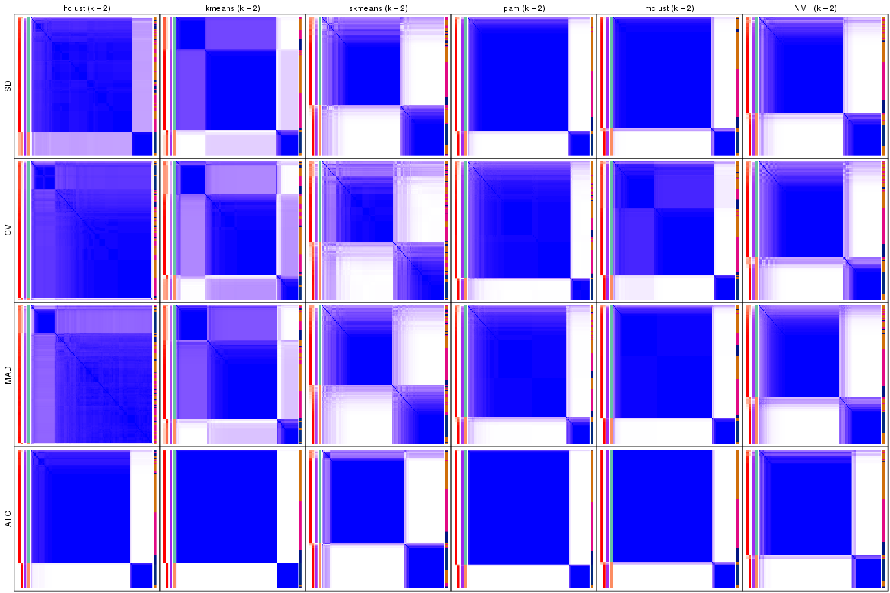</p>

</div>
<div id='tab-collect-consensus-heatmap-2'>
<pre><code class="r">collect_plots(res_list, k = 3, fun = consensus_heatmap, mc.cores = 4)
</code></pre>

<p>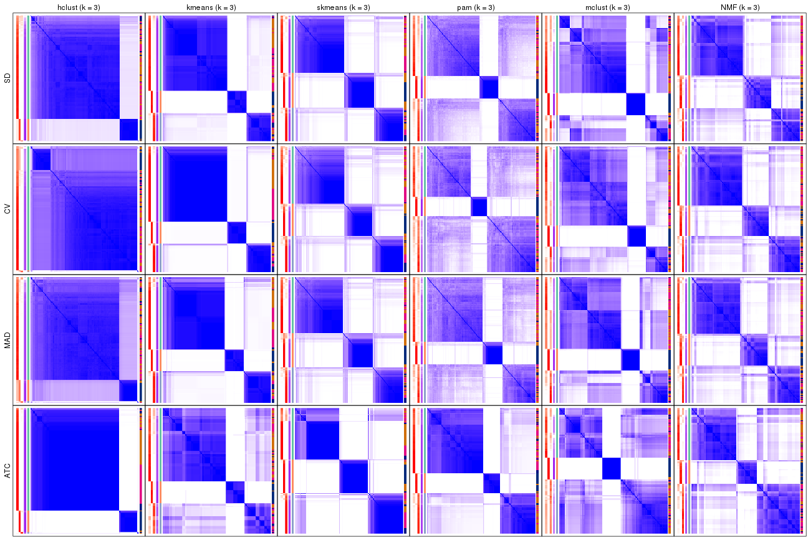</p>

</div>
<div id='tab-collect-consensus-heatmap-3'>
<pre><code class="r">collect_plots(res_list, k = 4, fun = consensus_heatmap, mc.cores = 4)
</code></pre>

<p>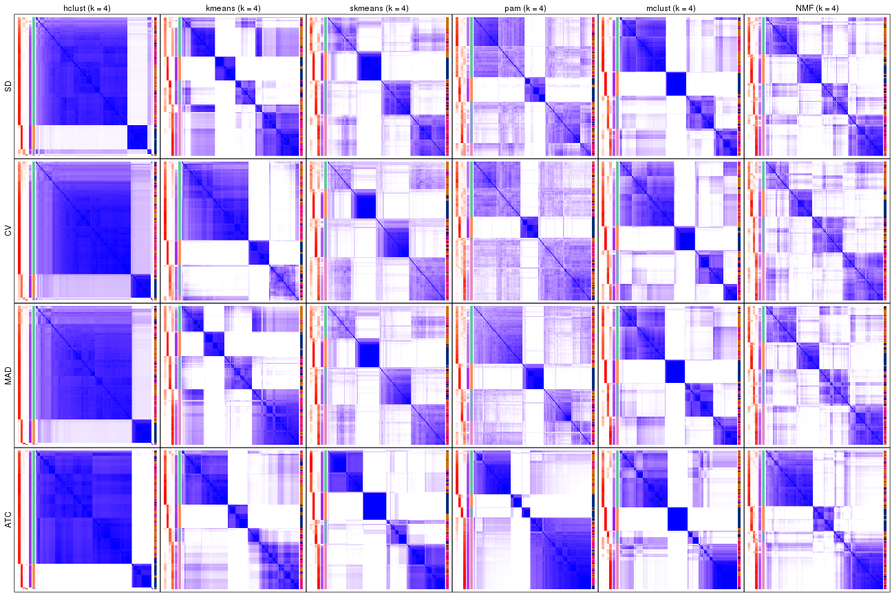</p>

</div>
<div id='tab-collect-consensus-heatmap-4'>
<pre><code class="r">collect_plots(res_list, k = 5, fun = consensus_heatmap, mc.cores = 4)
</code></pre>

<p>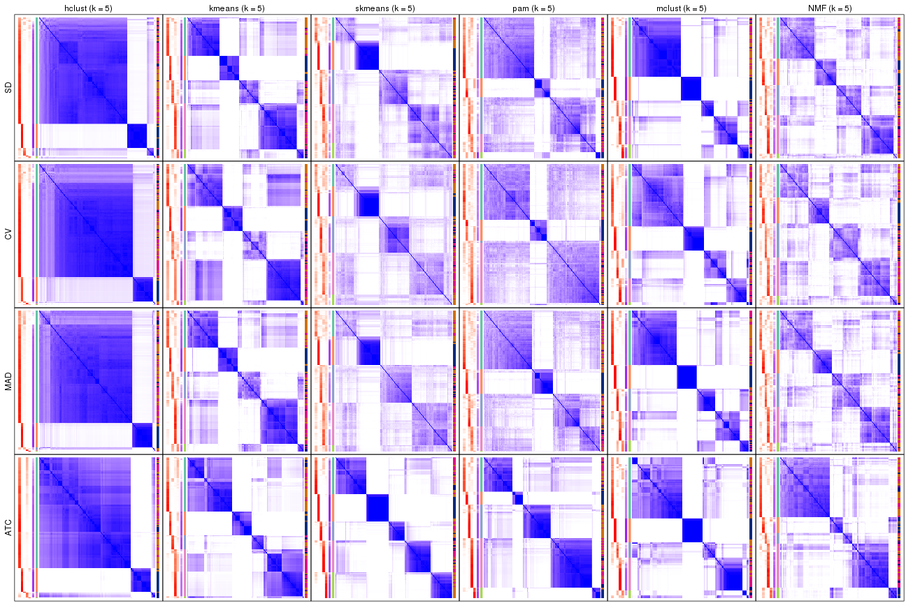</p>

</div>
<div id='tab-collect-consensus-heatmap-5'>
<pre><code class="r">collect_plots(res_list, k = 6, fun = consensus_heatmap, mc.cores = 4)
</code></pre>

<p>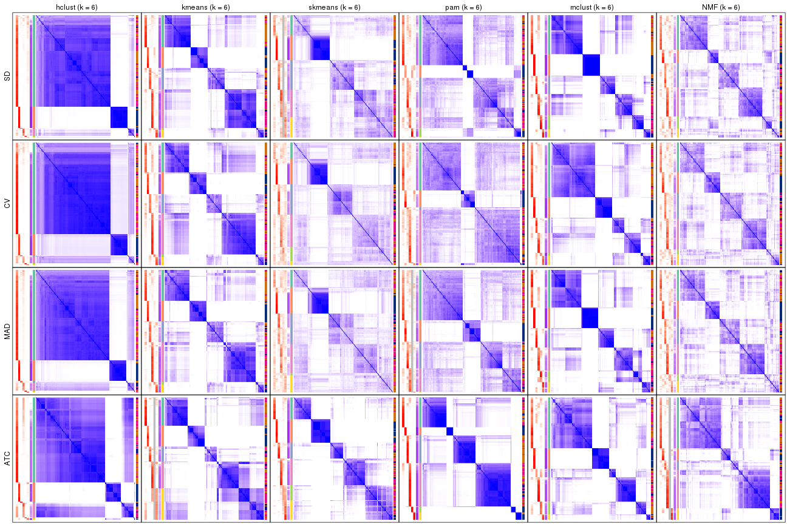</p>

</div>
</div>


### Membership heatmap

Membership heatmaps for all methods. ([What is a membership heatmap?](http://bioconductor.org/packages/devel/bioc/vignettes/cola/inst/doc/cola.html#toc_12))


<script>
$( function() {
	$( '#tabs-collect-membership-heatmap' ).tabs();
} );
</script>
<div id='tabs-collect-membership-heatmap'>
<ul>
<li><a href='#tab-collect-membership-heatmap-1'>k = 2</a></li>
<li><a href='#tab-collect-membership-heatmap-2'>k = 3</a></li>
<li><a href='#tab-collect-membership-heatmap-3'>k = 4</a></li>
<li><a href='#tab-collect-membership-heatmap-4'>k = 5</a></li>
<li><a href='#tab-collect-membership-heatmap-5'>k = 6</a></li>
</ul>
<div id='tab-collect-membership-heatmap-1'>
<pre><code class="r">collect_plots(res_list, k = 2, fun = membership_heatmap, mc.cores = 4)
</code></pre>

<p>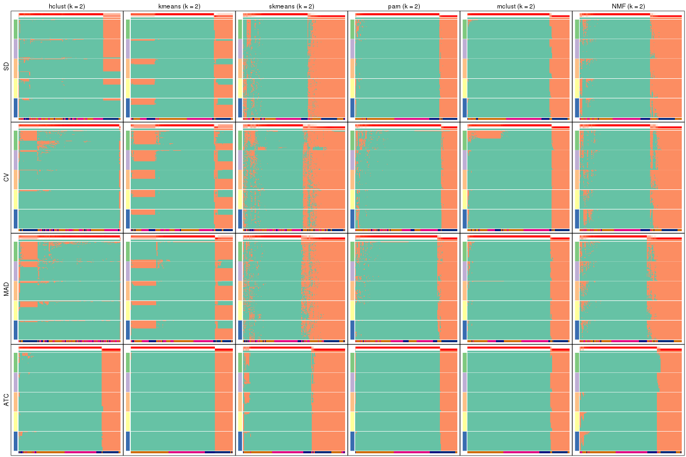</p>

</div>
<div id='tab-collect-membership-heatmap-2'>
<pre><code class="r">collect_plots(res_list, k = 3, fun = membership_heatmap, mc.cores = 4)
</code></pre>

<p>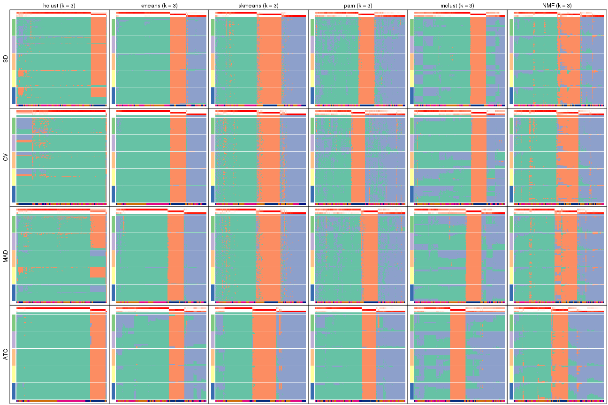</p>

</div>
<div id='tab-collect-membership-heatmap-3'>
<pre><code class="r">collect_plots(res_list, k = 4, fun = membership_heatmap, mc.cores = 4)
</code></pre>

<p>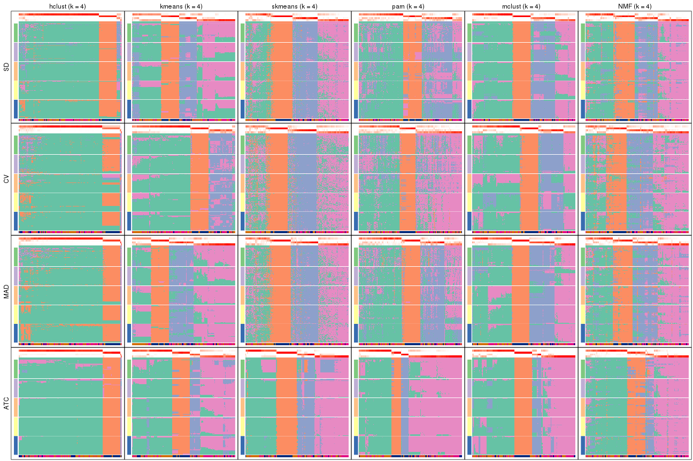</p>

</div>
<div id='tab-collect-membership-heatmap-4'>
<pre><code class="r">collect_plots(res_list, k = 5, fun = membership_heatmap, mc.cores = 4)
</code></pre>

<p>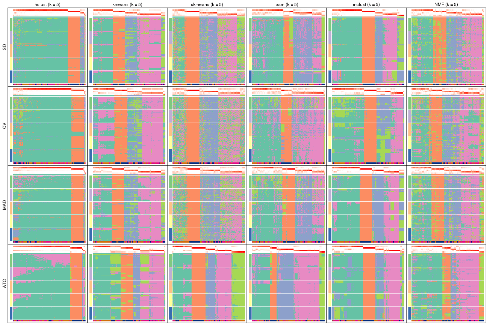</p>

</div>
<div id='tab-collect-membership-heatmap-5'>
<pre><code class="r">collect_plots(res_list, k = 6, fun = membership_heatmap, mc.cores = 4)
</code></pre>

<p>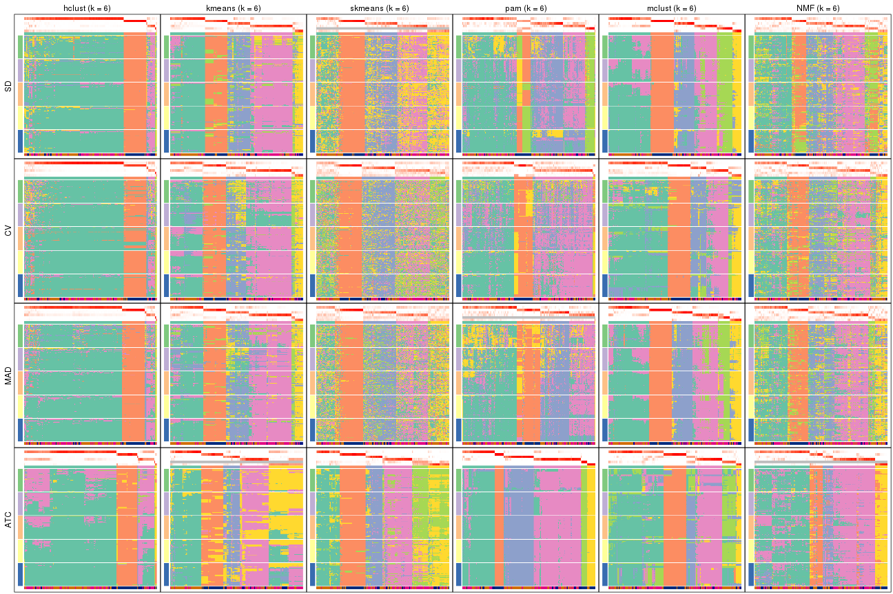</p>

</div>
</div>


### Signature heatmap

Signature heatmaps for all methods. ([What is a signature heatmap?](http://bioconductor.org/packages/devel/bioc/vignettes/cola/inst/doc/cola.html#toc_22))


Note in following heatmaps, rows are scaled.


<script>
$( function() {
	$( '#tabs-collect-get-signatures' ).tabs();
} );
</script>
<div id='tabs-collect-get-signatures'>
<ul>
<li><a href='#tab-collect-get-signatures-1'>k = 2</a></li>
<li><a href='#tab-collect-get-signatures-2'>k = 3</a></li>
<li><a href='#tab-collect-get-signatures-3'>k = 4</a></li>
<li><a href='#tab-collect-get-signatures-4'>k = 5</a></li>
<li><a href='#tab-collect-get-signatures-5'>k = 6</a></li>
</ul>
<div id='tab-collect-get-signatures-1'>
<pre><code class="r">collect_plots(res_list, k = 2, fun = get_signatures, mc.cores = 4)
</code></pre>

<p>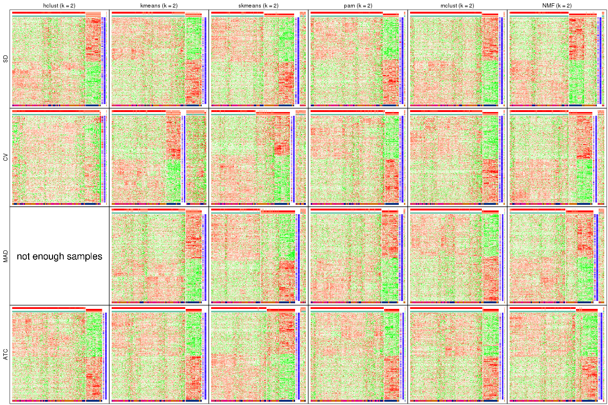</p>

</div>
<div id='tab-collect-get-signatures-2'>
<pre><code class="r">collect_plots(res_list, k = 3, fun = get_signatures, mc.cores = 4)
</code></pre>

<p>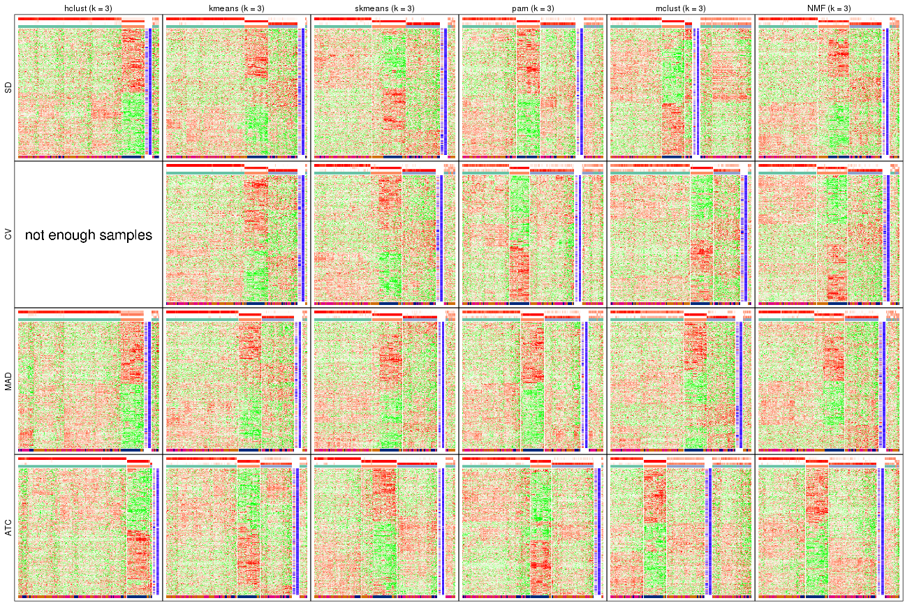</p>

</div>
<div id='tab-collect-get-signatures-3'>
<pre><code class="r">collect_plots(res_list, k = 4, fun = get_signatures, mc.cores = 4)
</code></pre>

<p>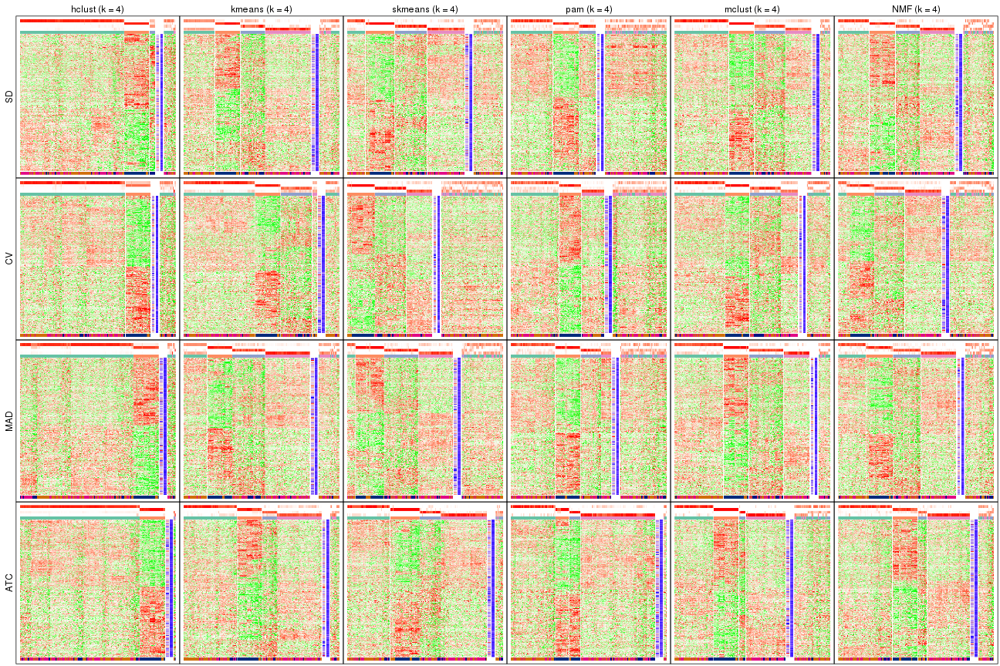</p>

</div>
<div id='tab-collect-get-signatures-4'>
<pre><code class="r">collect_plots(res_list, k = 5, fun = get_signatures, mc.cores = 4)
</code></pre>

<p>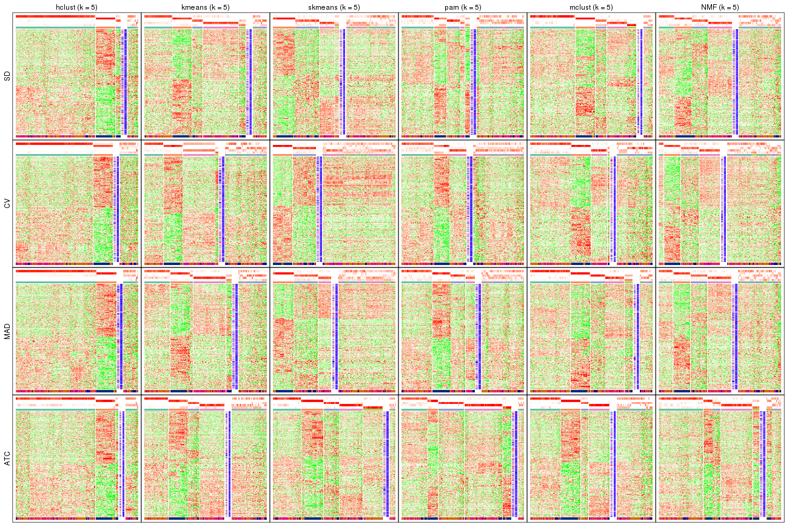</p>

</div>
<div id='tab-collect-get-signatures-5'>
<pre><code class="r">collect_plots(res_list, k = 6, fun = get_signatures, mc.cores = 4)
</code></pre>

<p>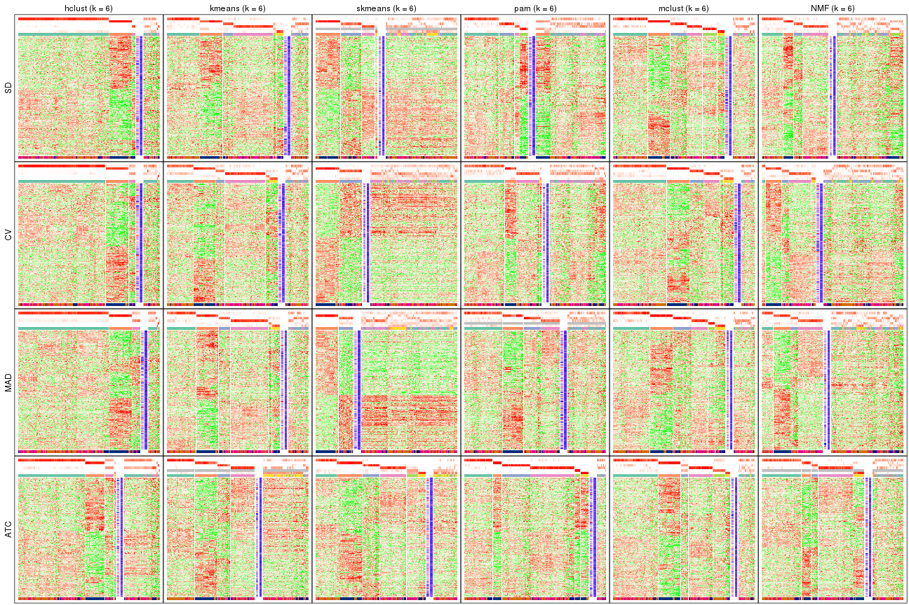</p>

</div>
</div>


### Statistics table

The statistics used for measuring the stability of consensus partitioning.
([How are they
defined?](http://bioconductor.org/packages/devel/bioc/vignettes/cola/inst/doc/cola.html#toc_13))


<script>
$( function() {
	$( '#tabs-get-stats-from-consensus-partition-list' ).tabs();
} );
</script>
<div id='tabs-get-stats-from-consensus-partition-list'>
<ul>
<li><a href='#tab-get-stats-from-consensus-partition-list-1'>k = 2</a></li>
<li><a href='#tab-get-stats-from-consensus-partition-list-2'>k = 3</a></li>
<li><a href='#tab-get-stats-from-consensus-partition-list-3'>k = 4</a></li>
<li><a href='#tab-get-stats-from-consensus-partition-list-4'>k = 5</a></li>
<li><a href='#tab-get-stats-from-consensus-partition-list-5'>k = 6</a></li>
</ul>
<div id='tab-get-stats-from-consensus-partition-list-1'>
<pre><code class="r">get_stats(res_list, k = 2)
</code></pre>

<pre><code>#&gt;             k 1-PAC mean_silhouette concordance area_increased  Rand Jaccard
#&gt; SD:NMF      2 0.858           0.923       0.965          0.438 0.569   0.569
#&gt; CV:NMF      2 0.734           0.862       0.942          0.432 0.569   0.569
#&gt; MAD:NMF     2 0.788           0.877       0.948          0.451 0.548   0.548
#&gt; ATC:NMF     2 0.949           0.950       0.978          0.374 0.629   0.629
#&gt; SD:skmeans  2 0.740           0.868       0.943          0.477 0.533   0.533
#&gt; CV:skmeans  2 0.573           0.803       0.909          0.492 0.512   0.512
#&gt; MAD:skmeans 2 0.647           0.839       0.928          0.490 0.508   0.508
#&gt; ATC:skmeans 2 0.936           0.914       0.967          0.455 0.556   0.556
#&gt; SD:mclust   2 1.000           0.977       0.990          0.310 0.684   0.684
#&gt; CV:mclust   2 0.996           0.949       0.966          0.317 0.707   0.707
#&gt; MAD:mclust  2 1.000           0.973       0.988          0.315 0.692   0.692
#&gt; ATC:mclust  2 1.000           0.986       0.994          0.302 0.692   0.692
#&gt; SD:kmeans   2 0.518           0.904       0.919          0.318 0.699   0.699
#&gt; CV:kmeans   2 0.444           0.680       0.811          0.345 0.699   0.699
#&gt; MAD:kmeans  2 0.490           0.860       0.892          0.328 0.707   0.707
#&gt; ATC:kmeans  2 1.000           0.999       1.000          0.294 0.707   0.707
#&gt; SD:pam      2 0.999           0.973       0.988          0.302 0.707   0.707
#&gt; CV:pam      2 0.885           0.937       0.969          0.295 0.732   0.732
#&gt; MAD:pam     2 0.908           0.936       0.969          0.328 0.684   0.684
#&gt; ATC:pam     2 1.000           0.989       0.995          0.287 0.715   0.715
#&gt; SD:hclust   2 0.703           0.950       0.912          0.195 0.715   0.715
#&gt; CV:hclust   2 0.694           0.908       0.953          0.091 0.976   0.976
#&gt; MAD:hclust  2 0.639           0.824       0.911          0.143 0.988   0.988
#&gt; ATC:hclust  2 1.000           0.983       0.992          0.308 0.699   0.699
</code></pre>

</div>
<div id='tab-get-stats-from-consensus-partition-list-2'>
<pre><code class="r">get_stats(res_list, k = 3)
</code></pre>

<pre><code>#&gt;             k 1-PAC mean_silhouette concordance area_increased  Rand Jaccard
#&gt; SD:NMF      3 0.594           0.781       0.881         0.4403 0.749   0.575
#&gt; CV:NMF      3 0.631           0.811       0.898         0.4756 0.709   0.523
#&gt; MAD:NMF     3 0.626           0.783       0.884         0.4216 0.720   0.525
#&gt; ATC:NMF     3 0.585           0.759       0.878         0.6662 0.648   0.476
#&gt; SD:skmeans  3 0.836           0.888       0.945         0.3655 0.745   0.553
#&gt; CV:skmeans  3 0.673           0.821       0.912         0.3289 0.746   0.545
#&gt; MAD:skmeans 3 0.683           0.831       0.916         0.3379 0.762   0.565
#&gt; ATC:skmeans 3 0.835           0.867       0.943         0.4552 0.710   0.511
#&gt; SD:mclust   3 0.516           0.528       0.819         0.8417 0.722   0.607
#&gt; CV:mclust   3 0.477           0.724       0.801         0.8186 0.738   0.634
#&gt; MAD:mclust  3 0.546           0.676       0.808         0.8429 0.696   0.569
#&gt; ATC:mclust  3 0.424           0.536       0.731         0.8756 0.648   0.502
#&gt; SD:kmeans   3 0.958           0.936       0.956         0.7764 0.731   0.617
#&gt; CV:kmeans   3 0.989           0.958       0.978         0.6327 0.731   0.617
#&gt; MAD:kmeans  3 0.902           0.913       0.954         0.7788 0.712   0.592
#&gt; ATC:kmeans  3 0.544           0.809       0.870         0.8955 0.715   0.598
#&gt; SD:pam      3 0.399           0.728       0.843         1.0683 0.669   0.532
#&gt; CV:pam      3 0.307           0.677       0.798         1.0915 0.638   0.509
#&gt; MAD:pam     3 0.342           0.722       0.817         0.9089 0.687   0.547
#&gt; ATC:pam     3 0.689           0.885       0.923         1.0854 0.664   0.535
#&gt; SD:hclust   3 0.543           0.886       0.923         0.7011 0.990   0.986
#&gt; CV:hclust   3 0.504           0.796       0.888         1.1371 1.000   1.000
#&gt; MAD:hclust  3 0.479           0.863       0.843         0.9107 0.707   0.703
#&gt; ATC:hclust  3 1.000           0.977       0.990         0.0262 0.996   0.994
</code></pre>

</div>
<div id='tab-get-stats-from-consensus-partition-list-3'>
<pre><code class="r">get_stats(res_list, k = 4)
</code></pre>

<pre><code>#&gt;             k 1-PAC mean_silhouette concordance area_increased  Rand Jaccard
#&gt; SD:NMF      4 0.590           0.660       0.819         0.1768 0.805   0.516
#&gt; CV:NMF      4 0.496           0.583       0.751         0.1590 0.850   0.609
#&gt; MAD:NMF     4 0.543           0.642       0.799         0.1619 0.808   0.517
#&gt; ATC:NMF     4 0.654           0.728       0.851         0.1191 0.851   0.636
#&gt; SD:skmeans  4 0.592           0.684       0.825         0.1447 0.833   0.565
#&gt; CV:skmeans  4 0.520           0.530       0.736         0.1426 0.872   0.651
#&gt; MAD:skmeans 4 0.516           0.623       0.780         0.1405 0.846   0.591
#&gt; ATC:skmeans 4 0.745           0.830       0.901         0.1143 0.791   0.484
#&gt; SD:mclust   4 0.642           0.786       0.856         0.2342 0.729   0.456
#&gt; CV:mclust   4 0.622           0.693       0.798         0.2058 0.815   0.615
#&gt; MAD:mclust  4 0.647           0.767       0.856         0.2293 0.789   0.530
#&gt; ATC:mclust  4 0.660           0.684       0.867         0.2097 0.851   0.641
#&gt; SD:kmeans   4 0.617           0.624       0.759         0.2198 0.787   0.538
#&gt; CV:kmeans   4 0.699           0.694       0.829         0.1511 0.965   0.920
#&gt; MAD:kmeans  4 0.635           0.663       0.789         0.1860 0.852   0.649
#&gt; ATC:kmeans  4 0.596           0.776       0.847         0.2241 0.761   0.507
#&gt; SD:pam      4 0.395           0.504       0.711         0.1134 0.914   0.778
#&gt; CV:pam      4 0.320           0.518       0.710         0.1065 0.954   0.885
#&gt; MAD:pam     4 0.387           0.556       0.746         0.1382 0.870   0.675
#&gt; ATC:pam     4 0.676           0.846       0.914         0.0456 0.973   0.933
#&gt; SD:hclust   4 0.742           0.826       0.902         0.2171 0.932   0.904
#&gt; CV:hclust   4 0.434           0.804       0.863         0.6884 0.709   0.702
#&gt; MAD:hclust  4 0.380           0.849       0.893         0.3673 1.000   1.000
#&gt; ATC:hclust  4 0.884           0.933       0.953         0.1131 1.000   1.000
</code></pre>

</div>
<div id='tab-get-stats-from-consensus-partition-list-4'>
<pre><code class="r">get_stats(res_list, k = 5)
</code></pre>

<pre><code>#&gt;             k 1-PAC mean_silhouette concordance area_increased  Rand Jaccard
#&gt; SD:NMF      5 0.552           0.507       0.726         0.0577 0.935   0.767
#&gt; CV:NMF      5 0.509           0.472       0.640         0.0668 0.896   0.646
#&gt; MAD:NMF     5 0.536           0.507       0.707         0.0610 0.933   0.754
#&gt; ATC:NMF     5 0.584           0.671       0.792         0.0507 0.947   0.841
#&gt; SD:skmeans  5 0.549           0.523       0.689         0.0637 0.951   0.807
#&gt; CV:skmeans  5 0.493           0.384       0.631         0.0642 0.931   0.749
#&gt; MAD:skmeans 5 0.487           0.441       0.644         0.0643 0.957   0.836
#&gt; ATC:skmeans 5 0.825           0.844       0.913         0.0761 0.834   0.475
#&gt; SD:mclust   5 0.774           0.790       0.867         0.0490 0.928   0.763
#&gt; CV:mclust   5 0.565           0.548       0.738         0.0656 0.905   0.727
#&gt; MAD:mclust  5 0.730           0.743       0.855         0.0536 0.955   0.841
#&gt; ATC:mclust  5 0.656           0.593       0.811         0.0848 0.830   0.552
#&gt; SD:kmeans   5 0.630           0.733       0.815         0.0860 0.884   0.631
#&gt; CV:kmeans   5 0.608           0.581       0.707         0.1018 0.810   0.545
#&gt; MAD:kmeans  5 0.592           0.658       0.783         0.0830 0.876   0.613
#&gt; ATC:kmeans  5 0.705           0.553       0.795         0.0901 0.991   0.971
#&gt; SD:pam      5 0.401           0.497       0.713         0.0385 0.951   0.850
#&gt; CV:pam      5 0.318           0.443       0.680         0.0312 0.993   0.980
#&gt; MAD:pam     5 0.407           0.520       0.708         0.0450 0.974   0.913
#&gt; ATC:pam     5 0.703           0.811       0.879         0.1712 0.819   0.553
#&gt; SD:hclust   5 0.590           0.804       0.896         0.1549 0.961   0.939
#&gt; CV:hclust   5 0.408           0.745       0.878         0.2463 0.990   0.985
#&gt; MAD:hclust  5 0.571           0.732       0.881         0.1796 0.971   0.958
#&gt; ATC:hclust  5 0.518           0.743       0.856         0.2990 0.952   0.931
</code></pre>

</div>
<div id='tab-get-stats-from-consensus-partition-list-5'>
<pre><code class="r">get_stats(res_list, k = 6)
</code></pre>

<pre><code>#&gt;             k 1-PAC mean_silhouette concordance area_increased  Rand Jaccard
#&gt; SD:NMF      6 0.550           0.447       0.647         0.0403 0.921   0.694
#&gt; CV:NMF      6 0.527           0.420       0.608         0.0425 0.929   0.713
#&gt; MAD:NMF     6 0.555           0.441       0.652         0.0401 0.952   0.797
#&gt; ATC:NMF     6 0.581           0.592       0.737         0.0519 0.967   0.894
#&gt; SD:skmeans  6 0.566           0.483       0.632         0.0404 0.952   0.792
#&gt; CV:skmeans  6 0.516           0.328       0.568         0.0395 0.937   0.742
#&gt; MAD:skmeans 6 0.506           0.323       0.580         0.0404 0.912   0.665
#&gt; ATC:skmeans 6 0.762           0.689       0.777         0.0371 0.955   0.786
#&gt; SD:mclust   6 0.734           0.695       0.845         0.0721 0.880   0.586
#&gt; CV:mclust   6 0.637           0.713       0.804         0.0267 0.941   0.809
#&gt; MAD:mclust  6 0.732           0.687       0.839         0.0616 0.907   0.652
#&gt; ATC:mclust  6 0.696           0.704       0.806         0.0414 0.874   0.619
#&gt; SD:kmeans   6 0.709           0.719       0.821         0.0409 0.967   0.867
#&gt; CV:kmeans   6 0.607           0.666       0.737         0.0539 0.923   0.719
#&gt; MAD:kmeans  6 0.650           0.687       0.770         0.0433 0.978   0.908
#&gt; ATC:kmeans  6 0.702           0.623       0.712         0.0502 0.831   0.495
#&gt; SD:pam      6 0.433           0.435       0.661         0.0365 0.944   0.816
#&gt; CV:pam      6 0.300           0.441       0.657         0.0233 0.985   0.959
#&gt; MAD:pam     6 0.416           0.534       0.687         0.0255 0.983   0.942
#&gt; ATC:pam     6 0.813           0.830       0.919         0.0317 0.986   0.944
#&gt; SD:hclust   6 0.492           0.780       0.871         0.0848 0.990   0.983
#&gt; CV:hclust   6 0.512           0.692       0.864         0.0995 0.899   0.852
#&gt; MAD:hclust  6 0.444           0.761       0.864         0.1352 0.909   0.863
#&gt; ATC:hclust  6 0.460           0.565       0.806         0.1128 0.863   0.789
</code></pre>

</div>
</div>

Following heatmap plots the partition for each combination of methods and the
lightness correspond to the silhouette scores for samples in each method. On
top the consensus subgroup is inferred from all methods by taking the mean
silhouette scores as weight.


<script>
$( function() {
	$( '#tabs-collect-stats-from-consensus-partition-list' ).tabs();
} );
</script>
<div id='tabs-collect-stats-from-consensus-partition-list'>
<ul>
<li><a href='#tab-collect-stats-from-consensus-partition-list-1'>k = 2</a></li>
<li><a href='#tab-collect-stats-from-consensus-partition-list-2'>k = 3</a></li>
<li><a href='#tab-collect-stats-from-consensus-partition-list-3'>k = 4</a></li>
<li><a href='#tab-collect-stats-from-consensus-partition-list-4'>k = 5</a></li>
<li><a href='#tab-collect-stats-from-consensus-partition-list-5'>k = 6</a></li>
</ul>
<div id='tab-collect-stats-from-consensus-partition-list-1'>
<pre><code class="r">collect_stats(res_list, k = 2)
</code></pre>

<p>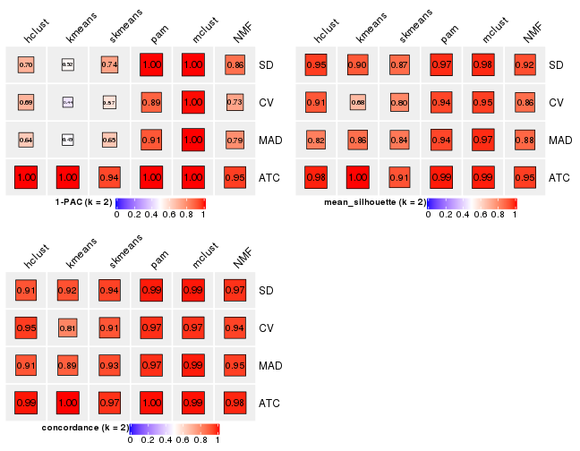</p>

</div>
<div id='tab-collect-stats-from-consensus-partition-list-2'>
<pre><code class="r">collect_stats(res_list, k = 3)
</code></pre>

<p>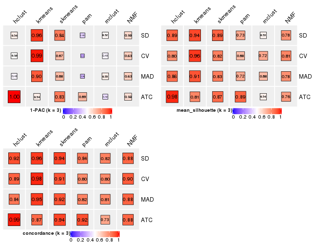</p>

</div>
<div id='tab-collect-stats-from-consensus-partition-list-3'>
<pre><code class="r">collect_stats(res_list, k = 4)
</code></pre>

<p>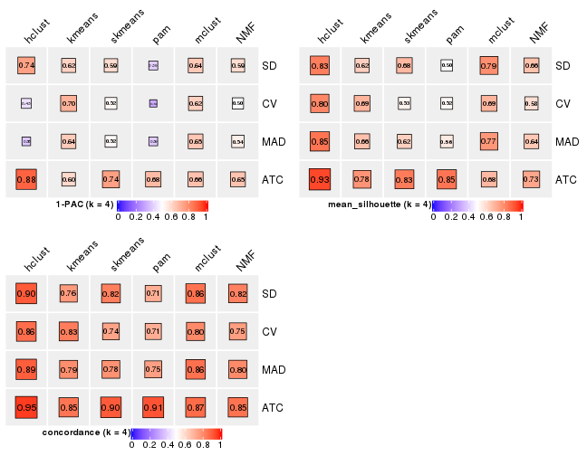</p>

</div>
<div id='tab-collect-stats-from-consensus-partition-list-4'>
<pre><code class="r">collect_stats(res_list, k = 5)
</code></pre>

<p>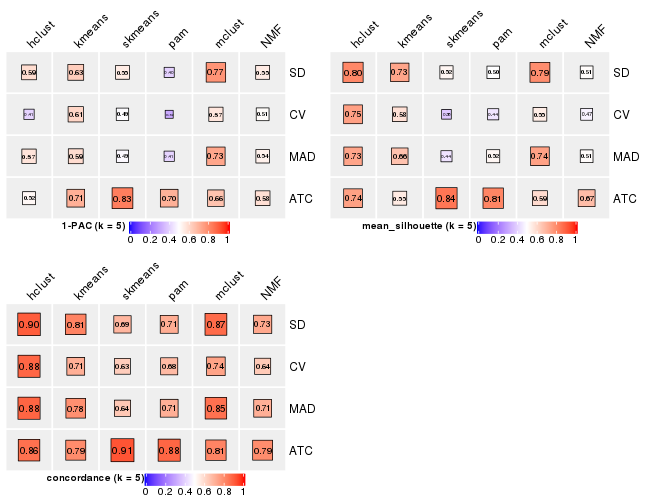</p>

</div>
<div id='tab-collect-stats-from-consensus-partition-list-5'>
<pre><code class="r">collect_stats(res_list, k = 6)
</code></pre>

<p>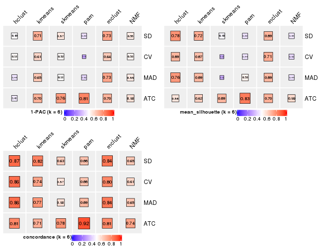</p>

</div>
</div>

### Partition from all methods


Collect partitions from all methods:


<script>
$( function() {
	$( '#tabs-collect-classes-from-consensus-partition-list' ).tabs();
} );
</script>
<div id='tabs-collect-classes-from-consensus-partition-list'>
<ul>
<li><a href='#tab-collect-classes-from-consensus-partition-list-1'>k = 2</a></li>
<li><a href='#tab-collect-classes-from-consensus-partition-list-2'>k = 3</a></li>
<li><a href='#tab-collect-classes-from-consensus-partition-list-3'>k = 4</a></li>
<li><a href='#tab-collect-classes-from-consensus-partition-list-4'>k = 5</a></li>
<li><a href='#tab-collect-classes-from-consensus-partition-list-5'>k = 6</a></li>
</ul>
<div id='tab-collect-classes-from-consensus-partition-list-1'>
<pre><code class="r">collect_classes(res_list, k = 2)
</code></pre>

<p>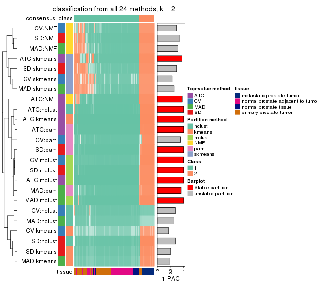</p>

</div>
<div id='tab-collect-classes-from-consensus-partition-list-2'>
<pre><code class="r">collect_classes(res_list, k = 3)
</code></pre>

<p>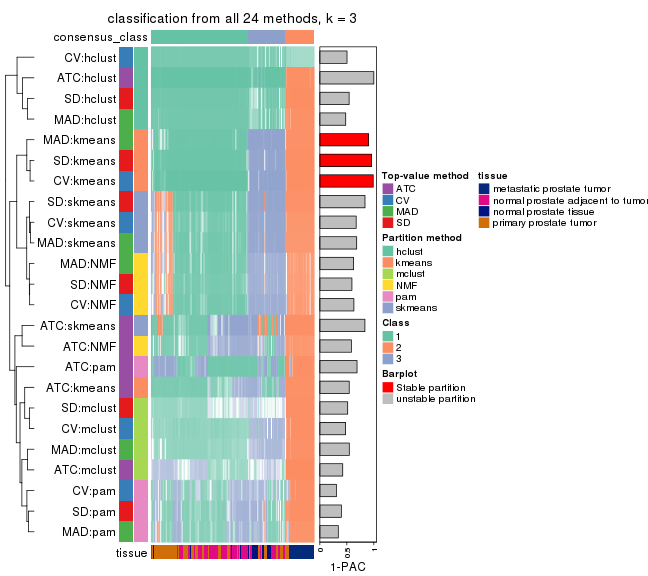</p>

</div>
<div id='tab-collect-classes-from-consensus-partition-list-3'>
<pre><code class="r">collect_classes(res_list, k = 4)
</code></pre>

<p>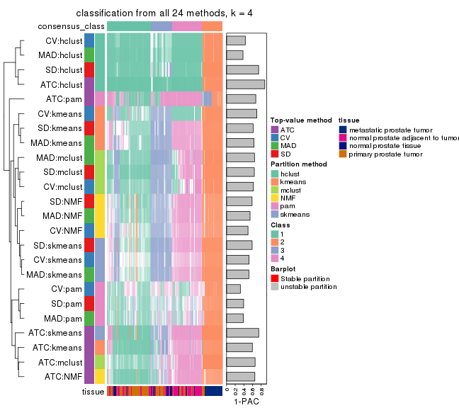</p>

</div>
<div id='tab-collect-classes-from-consensus-partition-list-4'>
<pre><code class="r">collect_classes(res_list, k = 5)
</code></pre>

<p>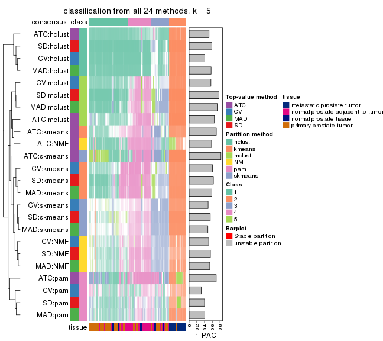</p>

</div>
<div id='tab-collect-classes-from-consensus-partition-list-5'>
<pre><code class="r">collect_classes(res_list, k = 6)
</code></pre>

<p>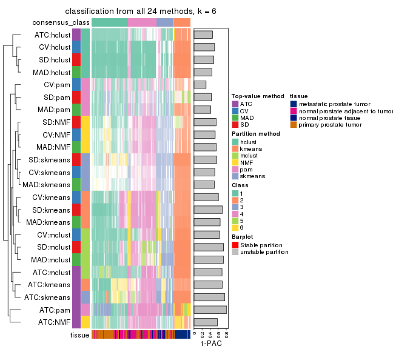</p>

</div>
</div>


### Top rows overlap


Overlap of top rows from different top-row methods:


<script>
$( function() {
	$( '#tabs-top-rows-overlap-by-euler' ).tabs();
} );
</script>
<div id='tabs-top-rows-overlap-by-euler'>
<ul>
<li><a href='#tab-top-rows-overlap-by-euler-1'>top_n = 1000</a></li>
<li><a href='#tab-top-rows-overlap-by-euler-2'>top_n = 2000</a></li>
<li><a href='#tab-top-rows-overlap-by-euler-3'>top_n = 3000</a></li>
<li><a href='#tab-top-rows-overlap-by-euler-4'>top_n = 4000</a></li>
<li><a href='#tab-top-rows-overlap-by-euler-5'>top_n = 5000</a></li>
</ul>
<div id='tab-top-rows-overlap-by-euler-1'>
<pre><code class="r">top_rows_overlap(res_list, top_n = 1000, method = &quot;euler&quot;)
</code></pre>

<p>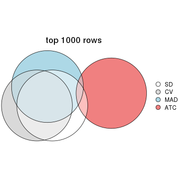</p>

</div>
<div id='tab-top-rows-overlap-by-euler-2'>
<pre><code class="r">top_rows_overlap(res_list, top_n = 2000, method = &quot;euler&quot;)
</code></pre>

<p>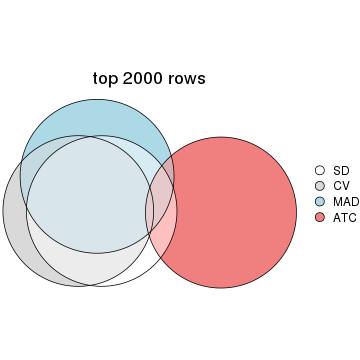</p>

</div>
<div id='tab-top-rows-overlap-by-euler-3'>
<pre><code class="r">top_rows_overlap(res_list, top_n = 3000, method = &quot;euler&quot;)
</code></pre>

<p>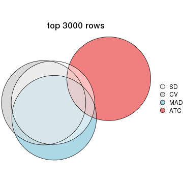</p>

</div>
<div id='tab-top-rows-overlap-by-euler-4'>
<pre><code class="r">top_rows_overlap(res_list, top_n = 4000, method = &quot;euler&quot;)
</code></pre>

<p>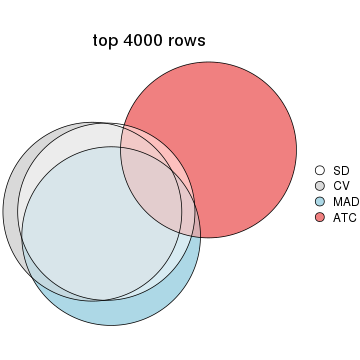</p>

</div>
<div id='tab-top-rows-overlap-by-euler-5'>
<pre><code class="r">top_rows_overlap(res_list, top_n = 5000, method = &quot;euler&quot;)
</code></pre>

<p>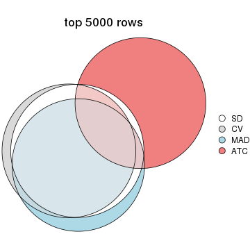</p>

</div>
</div>

Also visualize the correspondance of rankings between different top-row methods:


<script>
$( function() {
	$( '#tabs-top-rows-overlap-by-correspondance' ).tabs();
} );
</script>
<div id='tabs-top-rows-overlap-by-correspondance'>
<ul>
<li><a href='#tab-top-rows-overlap-by-correspondance-1'>top_n = 1000</a></li>
<li><a href='#tab-top-rows-overlap-by-correspondance-2'>top_n = 2000</a></li>
<li><a href='#tab-top-rows-overlap-by-correspondance-3'>top_n = 3000</a></li>
<li><a href='#tab-top-rows-overlap-by-correspondance-4'>top_n = 4000</a></li>
<li><a href='#tab-top-rows-overlap-by-correspondance-5'>top_n = 5000</a></li>
</ul>
<div id='tab-top-rows-overlap-by-correspondance-1'>
<pre><code class="r">top_rows_overlap(res_list, top_n = 1000, method = &quot;correspondance&quot;)
</code></pre>

<p>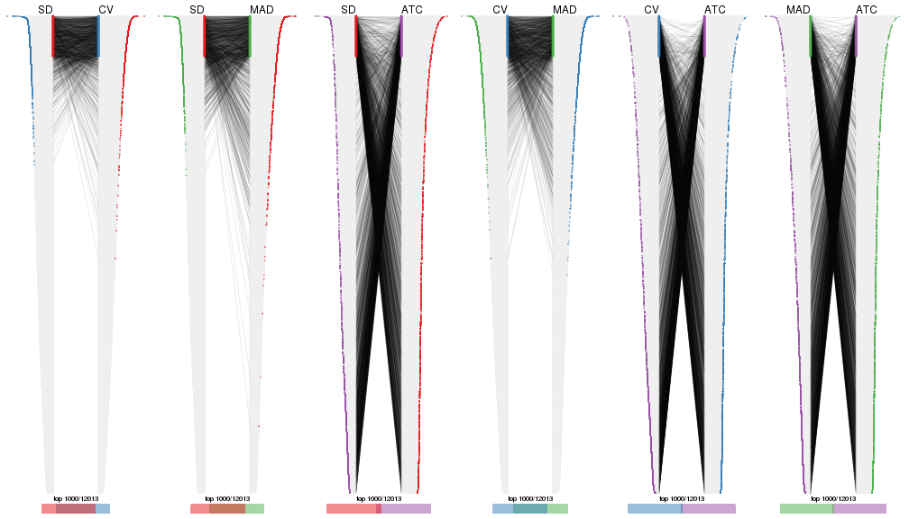</p>

</div>
<div id='tab-top-rows-overlap-by-correspondance-2'>
<pre><code class="r">top_rows_overlap(res_list, top_n = 2000, method = &quot;correspondance&quot;)
</code></pre>

<p>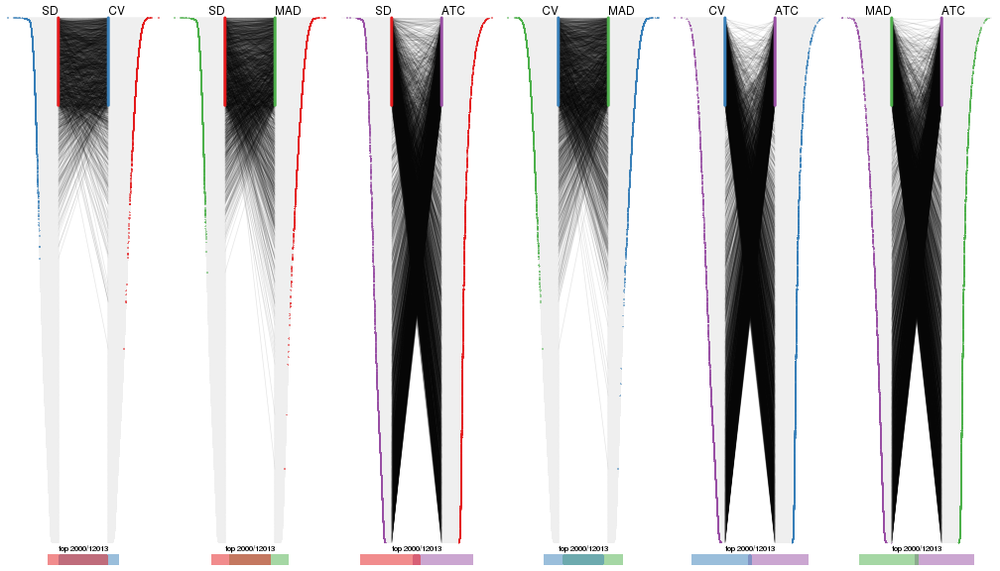</p>

</div>
<div id='tab-top-rows-overlap-by-correspondance-3'>
<pre><code class="r">top_rows_overlap(res_list, top_n = 3000, method = &quot;correspondance&quot;)
</code></pre>

<p>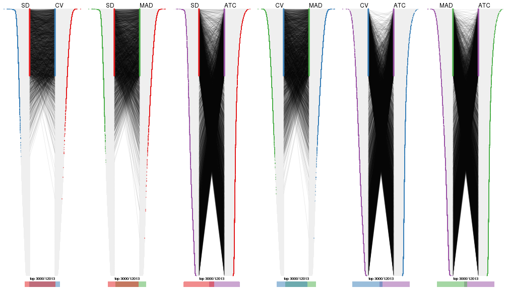</p>

</div>
<div id='tab-top-rows-overlap-by-correspondance-4'>
<pre><code class="r">top_rows_overlap(res_list, top_n = 4000, method = &quot;correspondance&quot;)
</code></pre>

<p>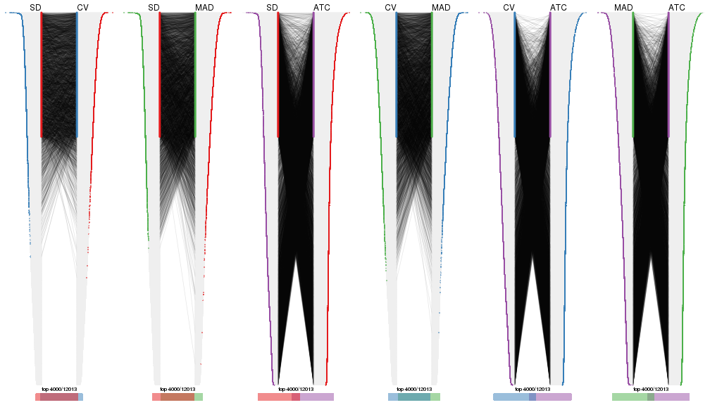</p>

</div>
<div id='tab-top-rows-overlap-by-correspondance-5'>
<pre><code class="r">top_rows_overlap(res_list, top_n = 5000, method = &quot;correspondance&quot;)
</code></pre>

<p>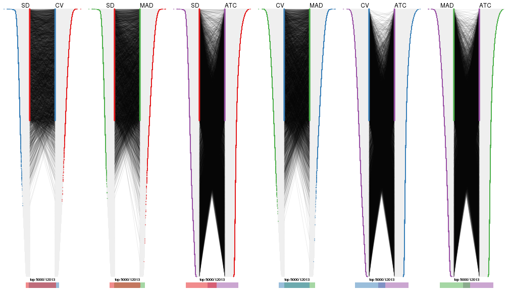</p>

</div>
</div>


Heatmaps of the top rows:


<script>
$( function() {
	$( '#tabs-top-rows-heatmap' ).tabs();
} );
</script>
<div id='tabs-top-rows-heatmap'>
<ul>
<li><a href='#tab-top-rows-heatmap-1'>top_n = 1000</a></li>
<li><a href='#tab-top-rows-heatmap-2'>top_n = 2000</a></li>
<li><a href='#tab-top-rows-heatmap-3'>top_n = 3000</a></li>
<li><a href='#tab-top-rows-heatmap-4'>top_n = 4000</a></li>
<li><a href='#tab-top-rows-heatmap-5'>top_n = 5000</a></li>
</ul>
<div id='tab-top-rows-heatmap-1'>
<pre><code class="r">top_rows_heatmap(res_list, top_n = 1000)
</code></pre>

<p>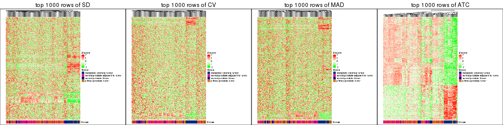</p>

</div>
<div id='tab-top-rows-heatmap-2'>
<pre><code class="r">top_rows_heatmap(res_list, top_n = 2000)
</code></pre>

<p>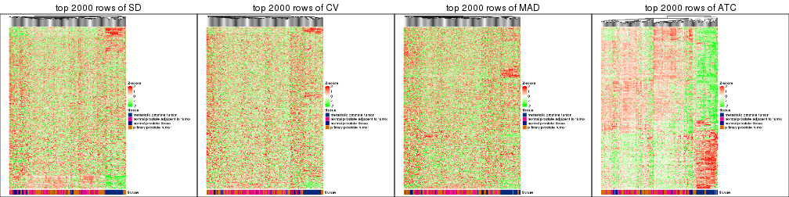</p>

</div>
<div id='tab-top-rows-heatmap-3'>
<pre><code class="r">top_rows_heatmap(res_list, top_n = 3000)
</code></pre>

<p>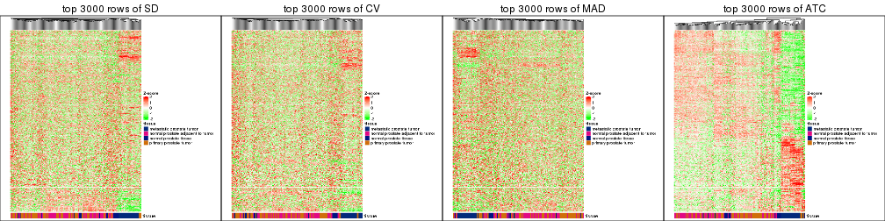</p>

</div>
<div id='tab-top-rows-heatmap-4'>
<pre><code class="r">top_rows_heatmap(res_list, top_n = 4000)
</code></pre>

<p>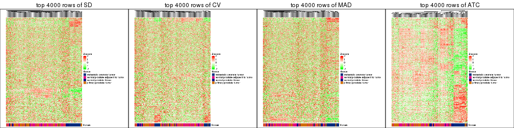</p>

</div>
<div id='tab-top-rows-heatmap-5'>
<pre><code class="r">top_rows_heatmap(res_list, top_n = 5000)
</code></pre>

<p>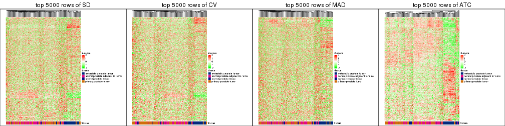</p>

</div>
</div>


### Test to known annotations


Test correlation between subgroups and known annotations. If the known
annotation is numeric, one-way ANOVA test is applied, and if the known
annotation is discrete, chi-squared contingency table test is applied.


<script>
$( function() {
	$( '#tabs-test-to-known-factors-from-consensus-partition-list' ).tabs();
} );
</script>
<div id='tabs-test-to-known-factors-from-consensus-partition-list'>
<ul>
<li><a href='#tab-test-to-known-factors-from-consensus-partition-list-1'>k = 2</a></li>
<li><a href='#tab-test-to-known-factors-from-consensus-partition-list-2'>k = 3</a></li>
<li><a href='#tab-test-to-known-factors-from-consensus-partition-list-3'>k = 4</a></li>
<li><a href='#tab-test-to-known-factors-from-consensus-partition-list-4'>k = 5</a></li>
<li><a href='#tab-test-to-known-factors-from-consensus-partition-list-5'>k = 6</a></li>
</ul>
<div id='tab-test-to-known-factors-from-consensus-partition-list-1'>
<pre><code class="r">test_to_known_factors(res_list, k = 2)
</code></pre>

<pre><code>#&gt;               n tissue(p) k
#&gt; SD:NMF      160  2.84e-17 2
#&gt; CV:NMF      152  9.03e-20 2
#&gt; MAD:NMF     154  6.80e-16 2
#&gt; ATC:NMF     162  2.59e-20 2
#&gt; SD:skmeans  153  7.04e-16 2
#&gt; CV:skmeans  145  2.41e-11 2
#&gt; MAD:skmeans 154  1.42e-13 2
#&gt; ATC:skmeans 154  6.47e-14 2
#&gt; SD:mclust   162  2.52e-28 2
#&gt; CV:mclust   162  2.11e-29 2
#&gt; MAD:mclust  163  1.65e-27 2
#&gt; ATC:mclust  163  1.69e-28 2
#&gt; SD:kmeans   164  1.13e-28 2
#&gt; CV:kmeans   127  1.04e-23 2
#&gt; MAD:kmeans  164  9.07e-30 2
#&gt; ATC:kmeans  164  1.08e-29 2
#&gt; SD:pam      162  2.11e-29 2
#&gt; CV:pam      162  6.78e-35 2
#&gt; MAD:pam     161  3.77e-28 2
#&gt; ATC:pam     163  8.95e-31 2
#&gt; SD:hclust   163  8.88e-31 2
#&gt; CV:hclust   163  8.71e-01 2
#&gt; MAD:hclust  160        NA 2
#&gt; ATC:hclust  164  1.48e-28 2
</code></pre>

</div>
<div id='tab-test-to-known-factors-from-consensus-partition-list-2'>
<pre><code class="r">test_to_known_factors(res_list, k = 3)
</code></pre>

<pre><code>#&gt;               n tissue(p) k
#&gt; SD:NMF      152  1.20e-23 3
#&gt; CV:NMF      153  3.86e-23 3
#&gt; MAD:NMF     148  3.75e-23 3
#&gt; ATC:NMF     146  1.08e-29 3
#&gt; SD:skmeans  155  1.30e-23 3
#&gt; CV:skmeans  150  2.73e-25 3
#&gt; MAD:skmeans 152  4.40e-25 3
#&gt; ATC:skmeans 152  1.74e-17 3
#&gt; SD:mclust   101  3.32e-24 3
#&gt; CV:mclust   160  1.60e-32 3
#&gt; MAD:mclust  154  1.31e-32 3
#&gt; ATC:mclust  116  2.03e-24 3
#&gt; SD:kmeans   162  2.03e-32 3
#&gt; CV:kmeans   162  8.65e-32 3
#&gt; MAD:kmeans  158  1.15e-33 3
#&gt; ATC:kmeans  155  5.49e-29 3
#&gt; SD:pam      140  2.22e-24 3
#&gt; CV:pam      138  7.78e-28 3
#&gt; MAD:pam     146  9.94e-26 3
#&gt; ATC:pam     162  2.66e-31 3
#&gt; SD:hclust   156  2.04e-29 3
#&gt; CV:hclust   159        NA 3
#&gt; MAD:hclust  156  2.63e-27 3
#&gt; ATC:hclust  164  2.47e-29 3
</code></pre>

</div>
<div id='tab-test-to-known-factors-from-consensus-partition-list-3'>
<pre><code class="r">test_to_known_factors(res_list, k = 4)
</code></pre>

<pre><code>#&gt;               n tissue(p) k
#&gt; SD:NMF      130  7.88e-25 4
#&gt; CV:NMF      115  5.29e-20 4
#&gt; MAD:NMF     132  4.45e-23 4
#&gt; ATC:NMF     147  9.00e-28 4
#&gt; SD:skmeans  131  1.20e-23 4
#&gt; CV:skmeans   95  1.50e-18 4
#&gt; MAD:skmeans 118  1.91e-20 4
#&gt; ATC:skmeans 156  2.10e-24 4
#&gt; SD:mclust   153  4.45e-34 4
#&gt; CV:mclust   138  1.65e-31 4
#&gt; MAD:mclust  151  1.96e-33 4
#&gt; ATC:mclust  124  4.61e-25 4
#&gt; SD:kmeans   142  2.48e-34 4
#&gt; CV:kmeans   149  5.89e-29 4
#&gt; MAD:kmeans  141  1.39e-34 4
#&gt; ATC:kmeans  154  2.31e-30 4
#&gt; SD:pam       96  2.26e-15 4
#&gt; CV:pam      104  7.81e-21 4
#&gt; MAD:pam     112  4.41e-19 4
#&gt; ATC:pam     161  8.41e-34 4
#&gt; SD:hclust   151  5.36e-37 4
#&gt; CV:hclust   146  1.71e-27 4
#&gt; MAD:hclust  155  3.15e-29 4
#&gt; ATC:hclust  162  1.39e-30 4
</code></pre>

</div>
<div id='tab-test-to-known-factors-from-consensus-partition-list-4'>
<pre><code class="r">test_to_known_factors(res_list, k = 5)
</code></pre>

<pre><code>#&gt;               n tissue(p) k
#&gt; SD:NMF      104  4.81e-20 5
#&gt; CV:NMF       88  1.27e-15 5
#&gt; MAD:NMF     103  2.76e-20 5
#&gt; ATC:NMF     143  3.75e-24 5
#&gt; SD:skmeans   94  7.96e-16 5
#&gt; CV:skmeans   61  3.46e-11 5
#&gt; MAD:skmeans  83  1.50e-15 5
#&gt; ATC:skmeans 156  7.48e-25 5
#&gt; SD:mclust   151  1.71e-33 5
#&gt; CV:mclust   113  1.86e-35 5
#&gt; MAD:mclust  146  4.05e-32 5
#&gt; ATC:mclust  113  6.43e-21 5
#&gt; SD:kmeans   144  1.64e-37 5
#&gt; CV:kmeans   105  6.44e-22 5
#&gt; MAD:kmeans  124  1.20e-34 5
#&gt; ATC:kmeans  114  2.22e-25 5
#&gt; SD:pam       97  1.98e-17 5
#&gt; CV:pam       92  4.76e-19 5
#&gt; MAD:pam     104  3.14e-20 5
#&gt; ATC:pam     156  1.57e-31 5
#&gt; SD:hclust   149  2.80e-35 5
#&gt; CV:hclust   138  6.14e-26 5
#&gt; MAD:hclust  144  4.87e-25 5
#&gt; ATC:hclust  146  7.83e-34 5
</code></pre>

</div>
<div id='tab-test-to-known-factors-from-consensus-partition-list-5'>
<pre><code class="r">test_to_known_factors(res_list, k = 6)
</code></pre>

<pre><code>#&gt;               n tissue(p) k
#&gt; SD:NMF       82  4.72e-18 6
#&gt; CV:NMF       66  1.16e-12 6
#&gt; MAD:NMF      75  1.15e-15 6
#&gt; ATC:NMF     126  2.60e-22 6
#&gt; SD:skmeans   76  4.58e-13 6
#&gt; CV:skmeans   57  4.83e-10 6
#&gt; MAD:skmeans  46  2.66e-08 6
#&gt; ATC:skmeans 135  2.30e-30 6
#&gt; SD:mclust   137  2.03e-29 6
#&gt; CV:mclust   148  2.16e-32 6
#&gt; MAD:mclust  138  7.04e-31 6
#&gt; ATC:mclust  144  5.57e-27 6
#&gt; SD:kmeans   143  5.24e-35 6
#&gt; CV:kmeans   136  7.64e-35 6
#&gt; MAD:kmeans  139  4.66e-36 6
#&gt; ATC:kmeans  108  1.03e-22 6
#&gt; SD:pam       78  3.06e-12 6
#&gt; CV:pam       95  1.12e-17 6
#&gt; MAD:pam     117  1.59e-22 6
#&gt; ATC:pam     153  1.45e-29 6
#&gt; SD:hclust   144  2.47e-33 6
#&gt; CV:hclust   144  2.86e-33 6
#&gt; MAD:hclust  150  2.74e-32 6
#&gt; ATC:hclust  120  1.33e-22 6
</code></pre>

</div>
</div>


 
## Results for each method


---------------------------------------------------


### SD:hclust


The object with results only for a single top-value method and a single partition method 
can be extracted as:

```r
res = res_list["SD", "hclust"]
# you can also extract it by
# res = res_list["SD:hclust"]
```

A summary of `res` and all the functions that can be applied to it:

```r
res
```

```
#> A 'ConsensusPartition' object with k = 2, 3, 4, 5, 6.
#>   On a matrix with 12013 rows and 164 columns.
#>   Top rows (1000, 2000, 3000, 4000, 5000) are extracted by 'SD' method.
#>   Subgroups are detected by 'hclust' method.
#>   Performed in total 1250 partitions by row resampling.
#>   Best k for subgroups seems to be 4.
#> 
#> Following methods can be applied to this 'ConsensusPartition' object:
#>  [1] "cola_report"             "collect_classes"         "collect_plots"          
#>  [4] "collect_stats"           "colnames"                "compare_signatures"     
#>  [7] "consensus_heatmap"       "dimension_reduction"     "functional_enrichment"  
#> [10] "get_anno_col"            "get_anno"                "get_classes"            
#> [13] "get_consensus"           "get_matrix"              "get_membership"         
#> [16] "get_param"               "get_signatures"          "get_stats"              
#> [19] "is_best_k"               "is_stable_k"             "membership_heatmap"     
#> [22] "ncol"                    "nrow"                    "plot_ecdf"              
#> [25] "rownames"                "select_partition_number" "show"                   
#> [28] "suggest_best_k"          "test_to_known_factors"
```

`collect_plots()` function collects all the plots made from `res` for all `k` (number of partitions)
into one single page to provide an easy and fast comparison between different `k`.

```r
collect_plots(res)
```

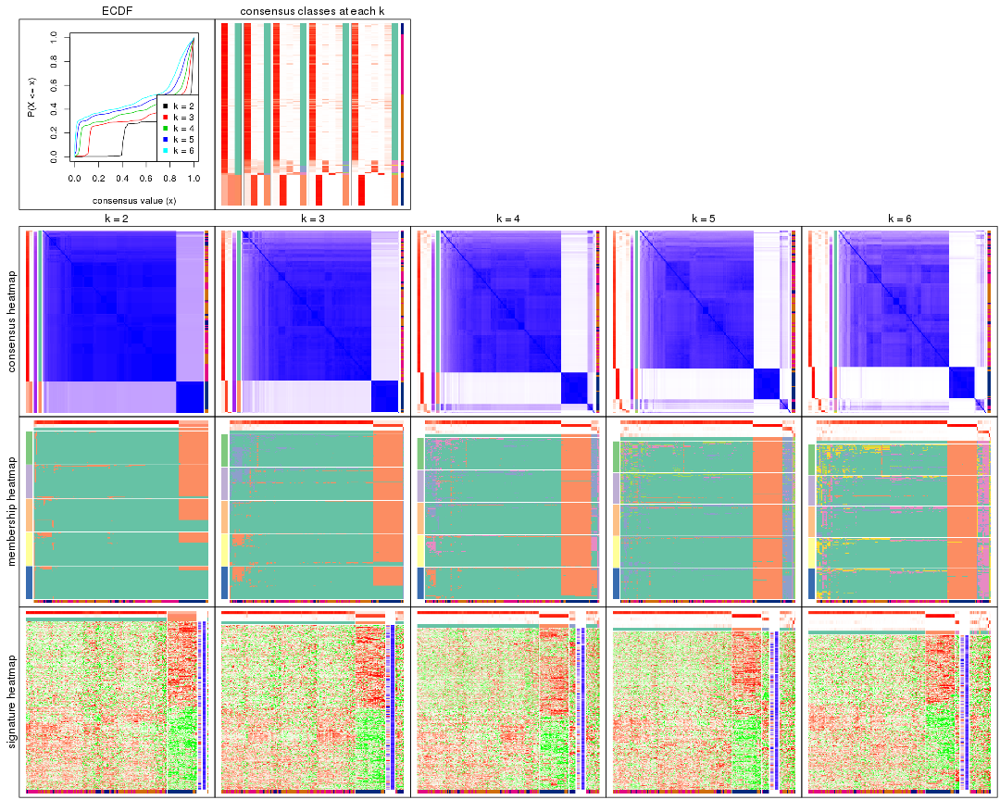

The plots are:

- The first row: a plot of the ECDF (empirical cumulative distribution
  function) curves of the consensus matrix for each `k` and the heatmap of
  predicted classes for each `k`.
- The second row: heatmaps of the consensus matrix for each `k`.
- The third row: heatmaps of the membership matrix for each `k`.
- The fouth row: heatmaps of the signatures for each `k`.

All the plots in panels can be made by individual functions and they are
plotted later in this section.

`select_partition_number()` produces several plots showing different
statistics for choosing "optimized" `k`. There are following statistics:

- ECDF curves of the consensus matrix for each `k`;
- 1-PAC. [The PAC
  score](https://en.wikipedia.org/wiki/Consensus_clustering#Over-interpretation_potential_of_consensus_clustering)
  measures the proportion of the ambiguous subgrouping.
- Mean silhouette score.
- Concordance. The mean probability of fiting the consensus class ids in all
  partitions.
- Area increased. Denote $A_k$ as the area under the ECDF curve for current
  `k`, the area increased is defined as $A_k - A_{k-1}$.
- Rand index. The percent of pairs of samples that are both in a same cluster
  or both are not in a same cluster in the partition of k and k-1.
- Jaccard index. The ratio of pairs of samples are both in a same cluster in
  the partition of k and k-1 and the pairs of samples are both in a same
  cluster in the partition k or k-1.

The detailed explanations of these statistics can be found in [the _cola_
vignette](http://bioconductor.org/packages/devel/bioc/vignettes/cola/inst/doc/cola.html#toc_13).

Generally speaking, lower PAC score, higher mean silhouette score or higher
concordance corresponds to better partition. Rand index and Jaccard index
measure how similar the current partition is compared to partition with `k-1`.
If they are too similar, we won't accept `k` is better than `k-1`.

```r
select_partition_number(res)
```

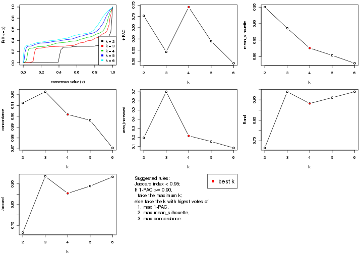

The numeric values for all these statistics can be obtained by `get_stats()`.

```r
get_stats(res)
```

```
#>   k 1-PAC mean_silhouette concordance area_increased  Rand Jaccard
#> 2 2 0.703           0.950       0.912         0.1952 0.715   0.715
#> 3 3 0.543           0.886       0.923         0.7011 0.990   0.986
#> 4 4 0.742           0.826       0.902         0.2171 0.932   0.904
#> 5 5 0.590           0.804       0.896         0.1549 0.961   0.939
#> 6 6 0.492           0.780       0.871         0.0848 0.990   0.983
```

`suggest_best_k()` suggests the best $k$ based on these statistics. The rules are as follows:

- All $k$ with Jaccard index larger than 0.95 are removed because increasing
  $k$ does not provide enough extra information. If all $k$ are removed, it is
  marked as no subgroup is detected.
- For all $k$ with 1-PAC score larger than 0.9, the maximal $k$ is taken as
  the best $k$, and other $k$ are marked as optional $k$.
- If it does not fit the second rule. The $k$ with the maximal vote of the
  highest 1-PAC score, highest mean silhouette, and highest concordance is
  taken as the best $k$.

```r
suggest_best_k(res)
```

```
#> [1] 4
```


Following shows the table of the partitions (You need to click the **show/hide
code output** link to see it). The membership matrix (columns with name `p*`)
is inferred by
[`clue::cl_consensus()`](https://www.rdocumentation.org/link/cl_consensus?package=clue)
function with the `SE` method. Basically the value in the membership matrix
represents the probability to belong to a certain group. The finall class
label for an item is determined with the group with highest probability it
belongs to.

In `get_classes()` function, the entropy is calculated from the membership
matrix and the silhouette score is calculated from the consensus matrix.


<script>
$( function() {
	$( '#tabs-SD-hclust-get-classes' ).tabs();
} );
</script>
<div id='tabs-SD-hclust-get-classes'>
<ul>
<li><a href='#tab-SD-hclust-get-classes-1'>k = 2</a></li>
<li><a href='#tab-SD-hclust-get-classes-2'>k = 3</a></li>
<li><a href='#tab-SD-hclust-get-classes-3'>k = 4</a></li>
<li><a href='#tab-SD-hclust-get-classes-4'>k = 5</a></li>
<li><a href='#tab-SD-hclust-get-classes-5'>k = 6</a></li>
</ul>

<div id='tab-SD-hclust-get-classes-1'>
<p><a id='tab-SD-hclust-get-classes-1-a' style='color:#0366d6' href='#'>show/hide code output</a></p>
<pre><code class="r">cbind(get_classes(res, k = 2), get_membership(res, k = 2))
</code></pre>

<pre><code>#&gt;           class entropy silhouette    p1    p2
#&gt; GSM152839     1  0.0376    0.96261 0.996 0.004
#&gt; GSM152840     1  0.3584    0.89164 0.932 0.068
#&gt; GSM152841     1  0.0672    0.96400 0.992 0.008
#&gt; GSM152842     1  0.1414    0.94864 0.980 0.020
#&gt; GSM152843     1  0.0672    0.96446 0.992 0.008
#&gt; GSM152844     1  0.3733    0.88512 0.928 0.072
#&gt; GSM152845     1  0.5629    0.76767 0.868 0.132
#&gt; GSM152846     1  0.4298    0.85622 0.912 0.088
#&gt; GSM152847     1  0.0672    0.96030 0.992 0.008
#&gt; GSM152848     1  0.0376    0.96261 0.996 0.004
#&gt; GSM152849     1  0.0672    0.96359 0.992 0.008
#&gt; GSM152850     1  0.0938    0.96494 0.988 0.012
#&gt; GSM152851     1  0.0672    0.96543 0.992 0.008
#&gt; GSM152852     1  0.3733    0.88512 0.928 0.072
#&gt; GSM152853     1  0.3733    0.88512 0.928 0.072
#&gt; GSM152854     1  0.3879    0.88376 0.924 0.076
#&gt; GSM152855     1  0.1414    0.96018 0.980 0.020
#&gt; GSM153238     1  0.2778    0.92625 0.952 0.048
#&gt; GSM153239     1  0.3584    0.89222 0.932 0.068
#&gt; GSM153240     1  0.0000    0.96474 1.000 0.000
#&gt; GSM153241     1  0.0376    0.96261 0.996 0.004
#&gt; GSM153242     1  0.3879    0.88673 0.924 0.076
#&gt; GSM153243     1  0.1414    0.96229 0.980 0.020
#&gt; GSM153244     1  0.0672    0.96543 0.992 0.008
#&gt; GSM153245     1  0.2778    0.92007 0.952 0.048
#&gt; GSM153246     1  0.5294    0.77761 0.880 0.120
#&gt; GSM153247     1  0.1414    0.95909 0.980 0.020
#&gt; GSM153248     1  0.0672    0.96518 0.992 0.008
#&gt; GSM153249     1  0.0000    0.96474 1.000 0.000
#&gt; GSM153250     1  0.0376    0.96551 0.996 0.004
#&gt; GSM153251     1  0.2778    0.92434 0.952 0.048
#&gt; GSM153252     1  0.0000    0.96474 1.000 0.000
#&gt; GSM153253     1  0.0376    0.96518 0.996 0.004
#&gt; GSM153254     1  0.0376    0.96548 0.996 0.004
#&gt; GSM153255     1  0.0000    0.96474 1.000 0.000
#&gt; GSM153256     1  0.0000    0.96474 1.000 0.000
#&gt; GSM153257     1  0.0000    0.96474 1.000 0.000
#&gt; GSM153258     1  0.0672    0.96507 0.992 0.008
#&gt; GSM153259     1  0.0938    0.96430 0.988 0.012
#&gt; GSM153260     1  0.2423    0.94064 0.960 0.040
#&gt; GSM153261     1  0.2236    0.94423 0.964 0.036
#&gt; GSM153262     1  0.0376    0.96518 0.996 0.004
#&gt; GSM153263     1  0.0672    0.96507 0.992 0.008
#&gt; GSM153264     1  0.0672    0.96507 0.992 0.008
#&gt; GSM153265     1  0.0376    0.96518 0.996 0.004
#&gt; GSM153266     1  0.0938    0.96363 0.988 0.012
#&gt; GSM153267     1  0.0000    0.96474 1.000 0.000
#&gt; GSM153268     1  0.1414    0.95309 0.980 0.020
#&gt; GSM153269     1  0.0376    0.96551 0.996 0.004
#&gt; GSM153270     1  0.0376    0.96548 0.996 0.004
#&gt; GSM153271     1  0.0376    0.96551 0.996 0.004
#&gt; GSM153272     1  0.0000    0.96474 1.000 0.000
#&gt; GSM153273     1  0.0938    0.96363 0.988 0.012
#&gt; GSM153274     1  0.0000    0.96474 1.000 0.000
#&gt; GSM153275     1  0.0000    0.96474 1.000 0.000
#&gt; GSM153276     1  0.0376    0.96551 0.996 0.004
#&gt; GSM153277     1  0.0376    0.96518 0.996 0.004
#&gt; GSM153278     1  0.0938    0.96440 0.988 0.012
#&gt; GSM153279     1  0.0672    0.96543 0.992 0.008
#&gt; GSM153280     1  0.0376    0.96518 0.996 0.004
#&gt; GSM153281     1  0.0000    0.96474 1.000 0.000
#&gt; GSM153282     1  0.0376    0.96518 0.996 0.004
#&gt; GSM153283     1  0.0672    0.96507 0.992 0.008
#&gt; GSM153284     1  0.0000    0.96474 1.000 0.000
#&gt; GSM153285     1  0.0376    0.96518 0.996 0.004
#&gt; GSM153286     1  0.0000    0.96474 1.000 0.000
#&gt; GSM153287     1  0.0376    0.96518 0.996 0.004
#&gt; GSM153288     1  0.0000    0.96474 1.000 0.000
#&gt; GSM153289     1  0.1414    0.96018 0.980 0.020
#&gt; GSM153290     1  0.0376    0.96518 0.996 0.004
#&gt; GSM153291     1  0.0000    0.96474 1.000 0.000
#&gt; GSM153292     1  0.0376    0.96518 0.996 0.004
#&gt; GSM153293     1  0.0000    0.96474 1.000 0.000
#&gt; GSM153294     1  0.0672    0.96518 0.992 0.008
#&gt; GSM153295     1  0.0376    0.96261 0.996 0.004
#&gt; GSM153054     1  0.1414    0.96240 0.980 0.020
#&gt; GSM153055     1  0.0672    0.96507 0.992 0.008
#&gt; GSM153056     1  0.0376    0.96261 0.996 0.004
#&gt; GSM153057     1  0.1414    0.96089 0.980 0.020
#&gt; GSM153058     1  0.3114    0.91257 0.944 0.056
#&gt; GSM153059     1  0.1633    0.95773 0.976 0.024
#&gt; GSM153060     1  0.3584    0.87575 0.932 0.068
#&gt; GSM153061     1  0.1633    0.94401 0.976 0.024
#&gt; GSM153062     1  0.9922   -0.00395 0.552 0.448
#&gt; GSM153063     1  0.2423    0.93643 0.960 0.040
#&gt; GSM153064     1  0.0938    0.96363 0.988 0.012
#&gt; GSM153065     1  0.2603    0.93730 0.956 0.044
#&gt; GSM153066     1  0.7299    0.54875 0.796 0.204
#&gt; GSM153067     1  0.0000    0.96474 1.000 0.000
#&gt; GSM153068     1  0.2043    0.95086 0.968 0.032
#&gt; GSM153069     1  0.0000    0.96474 1.000 0.000
#&gt; GSM153070     1  0.0376    0.96551 0.996 0.004
#&gt; GSM153071     1  0.1184    0.96238 0.984 0.016
#&gt; GSM153072     1  0.1184    0.96238 0.984 0.016
#&gt; GSM153073     1  0.0000    0.96474 1.000 0.000
#&gt; GSM153074     1  0.0000    0.96474 1.000 0.000
#&gt; GSM153075     1  0.0672    0.96507 0.992 0.008
#&gt; GSM153076     1  0.0000    0.96474 1.000 0.000
#&gt; GSM153077     1  0.1184    0.96238 0.984 0.016
#&gt; GSM153078     1  0.0672    0.96446 0.992 0.008
#&gt; GSM153079     1  0.1414    0.96018 0.980 0.020
#&gt; GSM153080     1  0.2043    0.95161 0.968 0.032
#&gt; GSM153081     1  0.1184    0.96238 0.984 0.016
#&gt; GSM153082     1  0.1414    0.96061 0.980 0.020
#&gt; GSM153083     1  0.1184    0.96238 0.984 0.016
#&gt; GSM153084     1  0.2423    0.94000 0.960 0.040
#&gt; GSM153085     1  0.1184    0.96238 0.984 0.016
#&gt; GSM153086     1  0.1184    0.96238 0.984 0.016
#&gt; GSM153087     1  0.0000    0.96474 1.000 0.000
#&gt; GSM153088     1  0.0000    0.96474 1.000 0.000
#&gt; GSM153089     1  0.3274    0.90530 0.940 0.060
#&gt; GSM153090     1  0.0000    0.96474 1.000 0.000
#&gt; GSM153091     1  0.0938    0.96363 0.988 0.012
#&gt; GSM153092     1  0.0672    0.96507 0.992 0.008
#&gt; GSM153093     1  0.0000    0.96474 1.000 0.000
#&gt; GSM153094     1  0.0938    0.96363 0.988 0.012
#&gt; GSM153095     1  0.1414    0.96031 0.980 0.020
#&gt; GSM153096     1  0.0938    0.96363 0.988 0.012
#&gt; GSM153097     1  0.0938    0.96363 0.988 0.012
#&gt; GSM153098     1  0.0376    0.96548 0.996 0.004
#&gt; GSM153099     1  0.0376    0.96551 0.996 0.004
#&gt; GSM153100     1  0.0672    0.96507 0.992 0.008
#&gt; GSM153101     1  0.1184    0.96238 0.984 0.016
#&gt; GSM153102     1  0.1184    0.96196 0.984 0.016
#&gt; GSM153103     1  0.1184    0.96238 0.984 0.016
#&gt; GSM153104     1  0.0376    0.96518 0.996 0.004
#&gt; GSM153106     1  0.1414    0.96018 0.980 0.020
#&gt; GSM153107     1  0.1414    0.96018 0.980 0.020
#&gt; GSM153108     1  0.0376    0.96518 0.996 0.004
#&gt; GSM153109     1  0.1184    0.96196 0.984 0.016
#&gt; GSM153110     1  0.0672    0.96507 0.992 0.008
#&gt; GSM153111     1  0.1184    0.96238 0.984 0.016
#&gt; GSM153112     1  0.0938    0.96363 0.988 0.012
#&gt; GSM153113     1  0.1414    0.96057 0.980 0.020
#&gt; GSM153114     1  0.1414    0.96018 0.980 0.020
#&gt; GSM187532     2  0.9710    0.99868 0.400 0.600
#&gt; GSM187533     2  0.9710    0.99868 0.400 0.600
#&gt; GSM187534     2  0.9710    0.99868 0.400 0.600
#&gt; GSM187535     1  0.5737    0.73807 0.864 0.136
#&gt; GSM152906     2  0.9710    0.99868 0.400 0.600
#&gt; GSM152907     2  0.9754    0.98633 0.408 0.592
#&gt; GSM152908     2  0.9710    0.99868 0.400 0.600
#&gt; GSM152909     2  0.9710    0.99868 0.400 0.600
#&gt; GSM152910     2  0.9710    0.99868 0.400 0.600
#&gt; GSM152911     2  0.9710    0.99868 0.400 0.600
#&gt; GSM152912     2  0.9710    0.99868 0.400 0.600
#&gt; GSM152913     2  0.9710    0.99868 0.400 0.600
#&gt; GSM152914     2  0.9710    0.99868 0.400 0.600
#&gt; GSM152915     2  0.9710    0.99868 0.400 0.600
#&gt; GSM152916     2  0.9710    0.99868 0.400 0.600
#&gt; GSM152917     2  0.9710    0.99868 0.400 0.600
#&gt; GSM152918     2  0.9710    0.99868 0.400 0.600
#&gt; GSM152919     2  0.9710    0.99868 0.400 0.600
#&gt; GSM152920     2  0.9710    0.99868 0.400 0.600
#&gt; GSM152921     2  0.9710    0.99868 0.400 0.600
#&gt; GSM152922     2  0.9710    0.99868 0.400 0.600
#&gt; GSM152923     2  0.9710    0.99868 0.400 0.600
#&gt; GSM152924     2  0.9710    0.99868 0.400 0.600
#&gt; GSM152925     2  0.9710    0.99868 0.400 0.600
#&gt; GSM152926     2  0.9754    0.98633 0.408 0.592
#&gt; GSM152927     2  0.9710    0.99868 0.400 0.600
#&gt; GSM152928     2  0.9732    0.99277 0.404 0.596
#&gt; GSM152929     2  0.9710    0.99868 0.400 0.600
#&gt; GSM152930     2  0.9710    0.99868 0.400 0.600
</code></pre>

<script>
$('#tab-SD-hclust-get-classes-1-a').parent().next().next().hide();
$('#tab-SD-hclust-get-classes-1-a').click(function(){
  $('#tab-SD-hclust-get-classes-1-a').parent().next().next().toggle();
  return(false);
});
</script>
</div>

<div id='tab-SD-hclust-get-classes-2'>
<p><a id='tab-SD-hclust-get-classes-2-a' style='color:#0366d6' href='#'>show/hide code output</a></p>
<pre><code class="r">cbind(get_classes(res, k = 3), get_membership(res, k = 3))
</code></pre>

<pre><code>#&gt;           class entropy silhouette    p1    p2    p3
#&gt; GSM152839     1  0.1015     0.9283 0.980 0.012 0.008
#&gt; GSM152840     1  0.8410     0.4107 0.620 0.164 0.216
#&gt; GSM152841     1  0.3129     0.8828 0.904 0.008 0.088
#&gt; GSM152842     1  0.3889     0.8585 0.884 0.032 0.084
#&gt; GSM152843     1  0.1919     0.9202 0.956 0.024 0.020
#&gt; GSM152844     1  0.8587     0.3689 0.604 0.176 0.220
#&gt; GSM152845     1  0.9591    -0.0593 0.472 0.296 0.232
#&gt; GSM152846     1  0.8878     0.2874 0.576 0.208 0.216
#&gt; GSM152847     1  0.2443     0.9090 0.940 0.028 0.032
#&gt; GSM152848     1  0.1170     0.9261 0.976 0.016 0.008
#&gt; GSM152849     1  0.1751     0.9247 0.960 0.012 0.028
#&gt; GSM152850     1  0.1751     0.9265 0.960 0.012 0.028
#&gt; GSM152851     1  0.1315     0.9286 0.972 0.020 0.008
#&gt; GSM152852     1  0.8350     0.4266 0.628 0.176 0.196
#&gt; GSM152853     1  0.8473     0.3966 0.616 0.176 0.208
#&gt; GSM152854     1  0.7160     0.6154 0.720 0.148 0.132
#&gt; GSM152855     1  0.1163     0.9280 0.972 0.028 0.000
#&gt; GSM153238     1  0.3742     0.8844 0.892 0.072 0.036
#&gt; GSM153239     1  0.7633     0.5583 0.684 0.132 0.184
#&gt; GSM153240     1  0.0475     0.9291 0.992 0.004 0.004
#&gt; GSM153241     1  0.1999     0.9172 0.952 0.012 0.036
#&gt; GSM153242     1  0.7451     0.5899 0.700 0.156 0.144
#&gt; GSM153243     1  0.1919     0.9236 0.956 0.024 0.020
#&gt; GSM153244     1  0.1182     0.9294 0.976 0.012 0.012
#&gt; GSM153245     1  0.5883     0.7599 0.796 0.092 0.112
#&gt; GSM153246     1  0.8394     0.1460 0.576 0.108 0.316
#&gt; GSM153247     1  0.2569     0.9147 0.936 0.032 0.032
#&gt; GSM153248     1  0.1182     0.9307 0.976 0.012 0.012
#&gt; GSM153249     1  0.0661     0.9295 0.988 0.004 0.008
#&gt; GSM153250     1  0.0848     0.9303 0.984 0.008 0.008
#&gt; GSM153251     1  0.5020     0.7950 0.836 0.108 0.056
#&gt; GSM153252     1  0.0661     0.9299 0.988 0.004 0.008
#&gt; GSM153253     1  0.1585     0.9238 0.964 0.008 0.028
#&gt; GSM153254     1  0.1015     0.9304 0.980 0.008 0.012
#&gt; GSM153255     1  0.0829     0.9291 0.984 0.004 0.012
#&gt; GSM153256     1  0.0661     0.9289 0.988 0.004 0.008
#&gt; GSM153257     1  0.0829     0.9291 0.984 0.004 0.012
#&gt; GSM153258     1  0.1015     0.9302 0.980 0.012 0.008
#&gt; GSM153259     1  0.1129     0.9290 0.976 0.020 0.004
#&gt; GSM153260     1  0.4194     0.8595 0.876 0.064 0.060
#&gt; GSM153261     1  0.2903     0.9038 0.924 0.048 0.028
#&gt; GSM153262     1  0.1453     0.9259 0.968 0.008 0.024
#&gt; GSM153263     1  0.0829     0.9295 0.984 0.012 0.004
#&gt; GSM153264     1  0.1170     0.9292 0.976 0.016 0.008
#&gt; GSM153265     1  0.1711     0.9220 0.960 0.008 0.032
#&gt; GSM153266     1  0.1129     0.9289 0.976 0.020 0.004
#&gt; GSM153267     1  0.0661     0.9299 0.988 0.004 0.008
#&gt; GSM153268     1  0.4256     0.8442 0.868 0.036 0.096
#&gt; GSM153269     1  0.0424     0.9297 0.992 0.008 0.000
#&gt; GSM153270     1  0.0661     0.9299 0.988 0.008 0.004
#&gt; GSM153271     1  0.0661     0.9295 0.988 0.008 0.004
#&gt; GSM153272     1  0.0661     0.9289 0.988 0.004 0.008
#&gt; GSM153273     1  0.1315     0.9277 0.972 0.020 0.008
#&gt; GSM153274     1  0.0661     0.9292 0.988 0.004 0.008
#&gt; GSM153275     1  0.0829     0.9291 0.984 0.004 0.012
#&gt; GSM153276     1  0.0424     0.9297 0.992 0.008 0.000
#&gt; GSM153277     1  0.1585     0.9239 0.964 0.008 0.028
#&gt; GSM153278     1  0.1774     0.9286 0.960 0.016 0.024
#&gt; GSM153279     1  0.1182     0.9294 0.976 0.012 0.012
#&gt; GSM153280     1  0.1585     0.9239 0.964 0.008 0.028
#&gt; GSM153281     1  0.0661     0.9299 0.988 0.004 0.008
#&gt; GSM153282     1  0.1585     0.9240 0.964 0.008 0.028
#&gt; GSM153283     1  0.1129     0.9297 0.976 0.020 0.004
#&gt; GSM153284     1  0.0475     0.9291 0.992 0.004 0.004
#&gt; GSM153285     1  0.1453     0.9254 0.968 0.008 0.024
#&gt; GSM153286     1  0.0661     0.9297 0.988 0.004 0.008
#&gt; GSM153287     1  0.1015     0.9296 0.980 0.008 0.012
#&gt; GSM153288     1  0.0829     0.9300 0.984 0.004 0.012
#&gt; GSM153289     1  0.1163     0.9280 0.972 0.028 0.000
#&gt; GSM153290     1  0.0848     0.9298 0.984 0.008 0.008
#&gt; GSM153291     1  0.0983     0.9291 0.980 0.004 0.016
#&gt; GSM153292     1  0.1315     0.9286 0.972 0.008 0.020
#&gt; GSM153293     1  0.0661     0.9289 0.988 0.004 0.008
#&gt; GSM153294     1  0.1337     0.9306 0.972 0.012 0.016
#&gt; GSM153295     1  0.1774     0.9234 0.960 0.024 0.016
#&gt; GSM153054     1  0.2443     0.9212 0.940 0.032 0.028
#&gt; GSM153055     1  0.0592     0.9295 0.988 0.012 0.000
#&gt; GSM153056     1  0.1751     0.9251 0.960 0.012 0.028
#&gt; GSM153057     1  0.1751     0.9244 0.960 0.028 0.012
#&gt; GSM153058     1  0.5915     0.7358 0.792 0.128 0.080
#&gt; GSM153059     1  0.2443     0.9146 0.940 0.032 0.028
#&gt; GSM153060     1  0.5678     0.7134 0.776 0.032 0.192
#&gt; GSM153061     1  0.5455     0.7474 0.788 0.028 0.184
#&gt; GSM153062     3  0.3686     0.0000 0.140 0.000 0.860
#&gt; GSM153063     1  0.4288     0.8546 0.872 0.060 0.068
#&gt; GSM153064     1  0.1170     0.9284 0.976 0.016 0.008
#&gt; GSM153065     1  0.4379     0.8512 0.868 0.060 0.072
#&gt; GSM153066     1  0.6556     0.5708 0.692 0.276 0.032
#&gt; GSM153067     1  0.0829     0.9291 0.984 0.004 0.012
#&gt; GSM153068     1  0.4423     0.8542 0.864 0.048 0.088
#&gt; GSM153069     1  0.0829     0.9291 0.984 0.004 0.012
#&gt; GSM153070     1  0.0848     0.9303 0.984 0.008 0.008
#&gt; GSM153071     1  0.1774     0.9288 0.960 0.024 0.016
#&gt; GSM153072     1  0.1620     0.9284 0.964 0.024 0.012
#&gt; GSM153073     1  0.0475     0.9291 0.992 0.004 0.004
#&gt; GSM153074     1  0.0475     0.9291 0.992 0.004 0.004
#&gt; GSM153075     1  0.0592     0.9295 0.988 0.012 0.000
#&gt; GSM153076     1  0.0661     0.9292 0.988 0.004 0.008
#&gt; GSM153077     1  0.1453     0.9287 0.968 0.024 0.008
#&gt; GSM153078     1  0.1636     0.9261 0.964 0.020 0.016
#&gt; GSM153079     1  0.1163     0.9280 0.972 0.028 0.000
#&gt; GSM153080     1  0.2527     0.9164 0.936 0.044 0.020
#&gt; GSM153081     1  0.1267     0.9289 0.972 0.024 0.004
#&gt; GSM153082     1  0.1453     0.9276 0.968 0.024 0.008
#&gt; GSM153083     1  0.1129     0.9287 0.976 0.020 0.004
#&gt; GSM153084     1  0.3183     0.8850 0.908 0.076 0.016
#&gt; GSM153085     1  0.0892     0.9286 0.980 0.020 0.000
#&gt; GSM153086     1  0.1315     0.9278 0.972 0.020 0.008
#&gt; GSM153087     1  0.0661     0.9304 0.988 0.008 0.004
#&gt; GSM153088     1  0.0475     0.9291 0.992 0.004 0.004
#&gt; GSM153089     1  0.6039     0.7430 0.788 0.104 0.108
#&gt; GSM153090     1  0.0661     0.9289 0.988 0.004 0.008
#&gt; GSM153091     1  0.1170     0.9284 0.976 0.016 0.008
#&gt; GSM153092     1  0.1170     0.9303 0.976 0.016 0.008
#&gt; GSM153093     1  0.0661     0.9289 0.988 0.004 0.008
#&gt; GSM153094     1  0.1315     0.9277 0.972 0.020 0.008
#&gt; GSM153095     1  0.2050     0.9227 0.952 0.020 0.028
#&gt; GSM153096     1  0.1315     0.9277 0.972 0.020 0.008
#&gt; GSM153097     1  0.1315     0.9277 0.972 0.020 0.008
#&gt; GSM153098     1  0.1015     0.9308 0.980 0.012 0.008
#&gt; GSM153099     1  0.0829     0.9300 0.984 0.012 0.004
#&gt; GSM153100     1  0.0829     0.9294 0.984 0.012 0.004
#&gt; GSM153101     1  0.1315     0.9281 0.972 0.020 0.008
#&gt; GSM153102     1  0.0892     0.9289 0.980 0.020 0.000
#&gt; GSM153103     1  0.1129     0.9287 0.976 0.020 0.004
#&gt; GSM153104     1  0.1015     0.9289 0.980 0.008 0.012
#&gt; GSM153106     1  0.1163     0.9280 0.972 0.028 0.000
#&gt; GSM153107     1  0.1163     0.9280 0.972 0.028 0.000
#&gt; GSM153108     1  0.0661     0.9299 0.988 0.008 0.004
#&gt; GSM153109     1  0.0892     0.9289 0.980 0.020 0.000
#&gt; GSM153110     1  0.1170     0.9285 0.976 0.016 0.008
#&gt; GSM153111     1  0.1315     0.9278 0.972 0.020 0.008
#&gt; GSM153112     1  0.1170     0.9284 0.976 0.016 0.008
#&gt; GSM153113     1  0.1315     0.9282 0.972 0.020 0.008
#&gt; GSM153114     1  0.1163     0.9280 0.972 0.028 0.000
#&gt; GSM187532     2  0.3192     0.9931 0.112 0.888 0.000
#&gt; GSM187533     2  0.3340     0.9867 0.120 0.880 0.000
#&gt; GSM187534     2  0.3340     0.9867 0.120 0.880 0.000
#&gt; GSM187535     1  0.3752     0.8187 0.856 0.144 0.000
#&gt; GSM152906     2  0.3267     0.9933 0.116 0.884 0.000
#&gt; GSM152907     2  0.3412     0.9811 0.124 0.876 0.000
#&gt; GSM152908     2  0.3192     0.9931 0.112 0.888 0.000
#&gt; GSM152909     2  0.3192     0.9931 0.112 0.888 0.000
#&gt; GSM152910     2  0.3192     0.9931 0.112 0.888 0.000
#&gt; GSM152911     2  0.3267     0.9933 0.116 0.884 0.000
#&gt; GSM152912     2  0.3192     0.9931 0.112 0.888 0.000
#&gt; GSM152913     2  0.3192     0.9931 0.112 0.888 0.000
#&gt; GSM152914     2  0.3267     0.9933 0.116 0.884 0.000
#&gt; GSM152915     2  0.3267     0.9933 0.116 0.884 0.000
#&gt; GSM152916     2  0.3192     0.9931 0.112 0.888 0.000
#&gt; GSM152917     2  0.3267     0.9933 0.116 0.884 0.000
#&gt; GSM152918     2  0.3267     0.9933 0.116 0.884 0.000
#&gt; GSM152919     2  0.3267     0.9933 0.116 0.884 0.000
#&gt; GSM152920     2  0.3192     0.9931 0.112 0.888 0.000
#&gt; GSM152921     2  0.3192     0.9931 0.112 0.888 0.000
#&gt; GSM152922     2  0.3192     0.9931 0.112 0.888 0.000
#&gt; GSM152923     2  0.3267     0.9933 0.116 0.884 0.000
#&gt; GSM152924     2  0.3192     0.9931 0.112 0.888 0.000
#&gt; GSM152925     2  0.3192     0.9931 0.112 0.888 0.000
#&gt; GSM152926     2  0.3412     0.9811 0.124 0.876 0.000
#&gt; GSM152927     2  0.3192     0.9931 0.112 0.888 0.000
#&gt; GSM152928     2  0.3267     0.9911 0.116 0.884 0.000
#&gt; GSM152929     2  0.3267     0.9933 0.116 0.884 0.000
#&gt; GSM152930     2  0.3267     0.9933 0.116 0.884 0.000
</code></pre>

<script>
$('#tab-SD-hclust-get-classes-2-a').parent().next().next().hide();
$('#tab-SD-hclust-get-classes-2-a').click(function(){
  $('#tab-SD-hclust-get-classes-2-a').parent().next().next().toggle();
  return(false);
});
</script>
</div>

<div id='tab-SD-hclust-get-classes-3'>
<p><a id='tab-SD-hclust-get-classes-3-a' style='color:#0366d6' href='#'>show/hide code output</a></p>
<pre><code class="r">cbind(get_classes(res, k = 4), get_membership(res, k = 4))
</code></pre>

<pre><code>#&gt;           class entropy silhouette    p1    p2    p3    p4
#&gt; GSM152839     1  0.1388     0.8947 0.960 0.000 0.012 0.028
#&gt; GSM152840     3  0.7164     0.8108 0.384 0.108 0.500 0.008
#&gt; GSM152841     1  0.3808     0.7263 0.824 0.012 0.160 0.004
#&gt; GSM152842     1  0.4284     0.6343 0.780 0.000 0.020 0.200
#&gt; GSM152843     1  0.2234     0.8672 0.924 0.004 0.008 0.064
#&gt; GSM152844     3  0.7038     0.8727 0.336 0.120 0.540 0.004
#&gt; GSM152845     3  0.8136     0.6047 0.248 0.240 0.488 0.024
#&gt; GSM152846     3  0.7659     0.8484 0.324 0.152 0.508 0.016
#&gt; GSM152847     1  0.3160     0.8020 0.872 0.000 0.020 0.108
#&gt; GSM152848     1  0.1151     0.8919 0.968 0.000 0.008 0.024
#&gt; GSM152849     1  0.2408     0.8703 0.920 0.004 0.016 0.060
#&gt; GSM152850     1  0.2307     0.8827 0.928 0.008 0.016 0.048
#&gt; GSM152851     1  0.2032     0.8835 0.936 0.028 0.036 0.000
#&gt; GSM152852     3  0.6941     0.8637 0.360 0.120 0.520 0.000
#&gt; GSM152853     3  0.6894     0.8759 0.344 0.120 0.536 0.000
#&gt; GSM152854     1  0.7527    -0.5134 0.516 0.112 0.348 0.024
#&gt; GSM152855     1  0.1648     0.8927 0.956 0.016 0.016 0.012
#&gt; GSM153238     1  0.4343     0.7665 0.840 0.044 0.032 0.084
#&gt; GSM153239     1  0.7324    -0.7118 0.456 0.108 0.424 0.012
#&gt; GSM153240     1  0.0859     0.8955 0.980 0.008 0.008 0.004
#&gt; GSM153241     1  0.2797     0.8623 0.908 0.008 0.028 0.056
#&gt; GSM153242     1  0.8054    -0.5552 0.500 0.132 0.324 0.044
#&gt; GSM153243     1  0.2807     0.8760 0.912 0.020 0.024 0.044
#&gt; GSM153244     1  0.1593     0.8928 0.956 0.016 0.024 0.004
#&gt; GSM153245     1  0.7137    -0.0473 0.620 0.068 0.256 0.056
#&gt; GSM153246     4  0.5759     0.0973 0.276 0.020 0.028 0.676
#&gt; GSM153247     1  0.3030     0.8500 0.900 0.020 0.020 0.060
#&gt; GSM153248     1  0.1271     0.8986 0.968 0.012 0.012 0.008
#&gt; GSM153249     1  0.1114     0.8965 0.972 0.008 0.016 0.004
#&gt; GSM153250     1  0.0992     0.8973 0.976 0.012 0.004 0.008
#&gt; GSM153251     1  0.6266     0.3635 0.700 0.080 0.192 0.028
#&gt; GSM153252     1  0.1174     0.8939 0.968 0.012 0.020 0.000
#&gt; GSM153253     1  0.2125     0.8749 0.932 0.012 0.052 0.004
#&gt; GSM153254     1  0.1821     0.8961 0.948 0.012 0.032 0.008
#&gt; GSM153255     1  0.1042     0.8939 0.972 0.008 0.020 0.000
#&gt; GSM153256     1  0.0672     0.8956 0.984 0.008 0.008 0.000
#&gt; GSM153257     1  0.0992     0.8949 0.976 0.008 0.012 0.004
#&gt; GSM153258     1  0.1262     0.8979 0.968 0.016 0.008 0.008
#&gt; GSM153259     1  0.1124     0.8962 0.972 0.012 0.004 0.012
#&gt; GSM153260     1  0.4692     0.7186 0.812 0.044 0.024 0.120
#&gt; GSM153261     1  0.3491     0.8439 0.884 0.044 0.044 0.028
#&gt; GSM153262     1  0.1771     0.8874 0.948 0.012 0.036 0.004
#&gt; GSM153263     1  0.1114     0.8974 0.972 0.016 0.008 0.004
#&gt; GSM153264     1  0.1394     0.8981 0.964 0.012 0.008 0.016
#&gt; GSM153265     1  0.2207     0.8760 0.928 0.012 0.056 0.004
#&gt; GSM153266     1  0.1526     0.8955 0.960 0.012 0.012 0.016
#&gt; GSM153267     1  0.0804     0.8958 0.980 0.008 0.012 0.000
#&gt; GSM153268     1  0.4900     0.4904 0.732 0.032 0.236 0.000
#&gt; GSM153269     1  0.0992     0.8968 0.976 0.012 0.008 0.004
#&gt; GSM153270     1  0.0937     0.8979 0.976 0.012 0.012 0.000
#&gt; GSM153271     1  0.0804     0.8963 0.980 0.012 0.008 0.000
#&gt; GSM153272     1  0.0804     0.8946 0.980 0.008 0.012 0.000
#&gt; GSM153273     1  0.1394     0.8931 0.964 0.012 0.008 0.016
#&gt; GSM153274     1  0.1229     0.8957 0.968 0.008 0.020 0.004
#&gt; GSM153275     1  0.0859     0.8962 0.980 0.008 0.008 0.004
#&gt; GSM153276     1  0.1124     0.8970 0.972 0.012 0.012 0.004
#&gt; GSM153277     1  0.1909     0.8812 0.940 0.008 0.048 0.004
#&gt; GSM153278     1  0.1917     0.8923 0.944 0.008 0.012 0.036
#&gt; GSM153279     1  0.1484     0.8954 0.960 0.016 0.020 0.004
#&gt; GSM153280     1  0.1953     0.8811 0.940 0.012 0.044 0.004
#&gt; GSM153281     1  0.1584     0.8867 0.952 0.012 0.036 0.000
#&gt; GSM153282     1  0.2040     0.8778 0.936 0.012 0.048 0.004
#&gt; GSM153283     1  0.0992     0.8981 0.976 0.012 0.004 0.008
#&gt; GSM153284     1  0.0992     0.8964 0.976 0.008 0.012 0.004
#&gt; GSM153285     1  0.1863     0.8835 0.944 0.012 0.040 0.004
#&gt; GSM153286     1  0.0927     0.8951 0.976 0.008 0.016 0.000
#&gt; GSM153287     1  0.1151     0.8937 0.968 0.008 0.024 0.000
#&gt; GSM153288     1  0.1042     0.8942 0.972 0.008 0.020 0.000
#&gt; GSM153289     1  0.1648     0.8927 0.956 0.016 0.016 0.012
#&gt; GSM153290     1  0.1674     0.8893 0.952 0.012 0.032 0.004
#&gt; GSM153291     1  0.1256     0.8915 0.964 0.008 0.028 0.000
#&gt; GSM153292     1  0.1356     0.8910 0.960 0.008 0.032 0.000
#&gt; GSM153293     1  0.0672     0.8950 0.984 0.008 0.008 0.000
#&gt; GSM153294     1  0.1404     0.8984 0.964 0.012 0.012 0.012
#&gt; GSM153295     1  0.1510     0.8880 0.956 0.000 0.016 0.028
#&gt; GSM153054     1  0.2694     0.8746 0.916 0.016 0.024 0.044
#&gt; GSM153055     1  0.1182     0.8983 0.968 0.016 0.016 0.000
#&gt; GSM153056     1  0.1771     0.8888 0.948 0.004 0.012 0.036
#&gt; GSM153057     1  0.2616     0.8756 0.920 0.036 0.028 0.016
#&gt; GSM153058     1  0.7577    -0.0333 0.620 0.112 0.196 0.072
#&gt; GSM153059     1  0.3301     0.8534 0.892 0.040 0.044 0.024
#&gt; GSM153060     1  0.5873     0.1923 0.632 0.004 0.044 0.320
#&gt; GSM153061     1  0.5137     0.3835 0.680 0.000 0.024 0.296
#&gt; GSM153062     4  0.6606     0.3597 0.052 0.012 0.440 0.496
#&gt; GSM153063     1  0.5619     0.5752 0.756 0.056 0.152 0.036
#&gt; GSM153064     1  0.1271     0.8936 0.968 0.012 0.008 0.012
#&gt; GSM153065     1  0.4846     0.7135 0.804 0.044 0.028 0.124
#&gt; GSM153066     1  0.6457     0.1487 0.640 0.276 0.020 0.064
#&gt; GSM153067     1  0.1042     0.8939 0.972 0.008 0.020 0.000
#&gt; GSM153068     1  0.4687     0.6812 0.796 0.028 0.020 0.156
#&gt; GSM153069     1  0.1042     0.8939 0.972 0.008 0.020 0.000
#&gt; GSM153070     1  0.0992     0.8973 0.976 0.012 0.004 0.008
#&gt; GSM153071     1  0.1975     0.8928 0.944 0.012 0.016 0.028
#&gt; GSM153072     1  0.1853     0.8921 0.948 0.012 0.012 0.028
#&gt; GSM153073     1  0.0336     0.8957 0.992 0.008 0.000 0.000
#&gt; GSM153074     1  0.1114     0.8956 0.972 0.008 0.016 0.004
#&gt; GSM153075     1  0.1059     0.8976 0.972 0.016 0.012 0.000
#&gt; GSM153076     1  0.1139     0.8971 0.972 0.008 0.012 0.008
#&gt; GSM153077     1  0.1526     0.8961 0.960 0.012 0.012 0.016
#&gt; GSM153078     1  0.2040     0.8816 0.936 0.004 0.012 0.048
#&gt; GSM153079     1  0.1648     0.8927 0.956 0.016 0.016 0.012
#&gt; GSM153080     1  0.3250     0.8420 0.888 0.024 0.072 0.016
#&gt; GSM153081     1  0.1526     0.8962 0.960 0.012 0.012 0.016
#&gt; GSM153082     1  0.1884     0.8913 0.948 0.016 0.016 0.020
#&gt; GSM153083     1  0.1648     0.8934 0.956 0.012 0.016 0.016
#&gt; GSM153084     1  0.3740     0.8077 0.864 0.088 0.020 0.028
#&gt; GSM153085     1  0.1404     0.8948 0.964 0.012 0.012 0.012
#&gt; GSM153086     1  0.1762     0.8918 0.952 0.012 0.016 0.020
#&gt; GSM153087     1  0.0712     0.8984 0.984 0.004 0.008 0.004
#&gt; GSM153088     1  0.0672     0.8951 0.984 0.008 0.008 0.000
#&gt; GSM153089     1  0.6330     0.3192 0.692 0.088 0.196 0.024
#&gt; GSM153090     1  0.0672     0.8956 0.984 0.008 0.008 0.000
#&gt; GSM153091     1  0.1271     0.8936 0.968 0.012 0.008 0.012
#&gt; GSM153092     1  0.1271     0.8987 0.968 0.012 0.008 0.012
#&gt; GSM153093     1  0.0672     0.8950 0.984 0.008 0.008 0.000
#&gt; GSM153094     1  0.1394     0.8931 0.964 0.012 0.008 0.016
#&gt; GSM153095     1  0.2730     0.8779 0.916 0.020 0.028 0.036
#&gt; GSM153096     1  0.1394     0.8931 0.964 0.012 0.008 0.016
#&gt; GSM153097     1  0.1394     0.8931 0.964 0.012 0.008 0.016
#&gt; GSM153098     1  0.1271     0.8991 0.968 0.012 0.008 0.012
#&gt; GSM153099     1  0.0992     0.8970 0.976 0.012 0.004 0.008
#&gt; GSM153100     1  0.0992     0.8973 0.976 0.012 0.004 0.008
#&gt; GSM153101     1  0.1884     0.8930 0.948 0.020 0.016 0.016
#&gt; GSM153102     1  0.1648     0.8937 0.956 0.016 0.016 0.012
#&gt; GSM153103     1  0.1640     0.8937 0.956 0.012 0.020 0.012
#&gt; GSM153104     1  0.1575     0.8901 0.956 0.012 0.028 0.004
#&gt; GSM153106     1  0.1648     0.8927 0.956 0.016 0.016 0.012
#&gt; GSM153107     1  0.1648     0.8927 0.956 0.016 0.016 0.012
#&gt; GSM153108     1  0.0992     0.8976 0.976 0.008 0.012 0.004
#&gt; GSM153109     1  0.1648     0.8937 0.956 0.016 0.016 0.012
#&gt; GSM153110     1  0.1262     0.8947 0.968 0.008 0.008 0.016
#&gt; GSM153111     1  0.1762     0.8918 0.952 0.012 0.016 0.020
#&gt; GSM153112     1  0.1271     0.8936 0.968 0.012 0.008 0.012
#&gt; GSM153113     1  0.1998     0.8913 0.944 0.020 0.016 0.020
#&gt; GSM153114     1  0.1648     0.8927 0.956 0.016 0.016 0.012
#&gt; GSM187532     2  0.1022     0.9891 0.032 0.968 0.000 0.000
#&gt; GSM187533     2  0.1389     0.9759 0.048 0.952 0.000 0.000
#&gt; GSM187534     2  0.1389     0.9759 0.048 0.952 0.000 0.000
#&gt; GSM187535     1  0.3726     0.7479 0.844 0.132 0.012 0.012
#&gt; GSM152906     2  0.1211     0.9886 0.040 0.960 0.000 0.000
#&gt; GSM152907     2  0.1389     0.9784 0.048 0.952 0.000 0.000
#&gt; GSM152908     2  0.1022     0.9891 0.032 0.968 0.000 0.000
#&gt; GSM152909     2  0.1022     0.9891 0.032 0.968 0.000 0.000
#&gt; GSM152910     2  0.1022     0.9891 0.032 0.968 0.000 0.000
#&gt; GSM152911     2  0.1118     0.9907 0.036 0.964 0.000 0.000
#&gt; GSM152912     2  0.1022     0.9891 0.032 0.968 0.000 0.000
#&gt; GSM152913     2  0.1022     0.9891 0.032 0.968 0.000 0.000
#&gt; GSM152914     2  0.1118     0.9907 0.036 0.964 0.000 0.000
#&gt; GSM152915     2  0.1118     0.9907 0.036 0.964 0.000 0.000
#&gt; GSM152916     2  0.1118     0.9902 0.036 0.964 0.000 0.000
#&gt; GSM152917     2  0.1118     0.9907 0.036 0.964 0.000 0.000
#&gt; GSM152918     2  0.1118     0.9907 0.036 0.964 0.000 0.000
#&gt; GSM152919     2  0.1118     0.9907 0.036 0.964 0.000 0.000
#&gt; GSM152920     2  0.1022     0.9891 0.032 0.968 0.000 0.000
#&gt; GSM152921     2  0.1022     0.9891 0.032 0.968 0.000 0.000
#&gt; GSM152922     2  0.1022     0.9891 0.032 0.968 0.000 0.000
#&gt; GSM152923     2  0.1211     0.9886 0.040 0.960 0.000 0.000
#&gt; GSM152924     2  0.1118     0.9902 0.036 0.964 0.000 0.000
#&gt; GSM152925     2  0.1118     0.9902 0.036 0.964 0.000 0.000
#&gt; GSM152926     2  0.1389     0.9784 0.048 0.952 0.000 0.000
#&gt; GSM152927     2  0.1118     0.9902 0.036 0.964 0.000 0.000
#&gt; GSM152928     2  0.1211     0.9874 0.040 0.960 0.000 0.000
#&gt; GSM152929     2  0.1211     0.9886 0.040 0.960 0.000 0.000
#&gt; GSM152930     2  0.1211     0.9886 0.040 0.960 0.000 0.000
</code></pre>

<script>
$('#tab-SD-hclust-get-classes-3-a').parent().next().next().hide();
$('#tab-SD-hclust-get-classes-3-a').click(function(){
  $('#tab-SD-hclust-get-classes-3-a').parent().next().next().toggle();
  return(false);
});
</script>
</div>

<div id='tab-SD-hclust-get-classes-4'>
<p><a id='tab-SD-hclust-get-classes-4-a' style='color:#0366d6' href='#'>show/hide code output</a></p>
<pre><code class="r">cbind(get_classes(res, k = 5), get_membership(res, k = 5))
</code></pre>

<pre><code>#&gt;           class entropy silhouette    p1    p2    p3    p4    p5
#&gt; GSM152839     1  0.2103    0.88478 0.920 0.000 0.020 0.004 0.056
#&gt; GSM152840     3  0.3933    0.70997 0.196 0.000 0.776 0.008 0.020
#&gt; GSM152841     1  0.4301    0.70199 0.768 0.004 0.188 0.012 0.028
#&gt; GSM152842     1  0.4891    0.14081 0.564 0.004 0.008 0.008 0.416
#&gt; GSM152843     1  0.3422    0.81225 0.832 0.004 0.020 0.004 0.140
#&gt; GSM152844     3  0.3124    0.68000 0.144 0.000 0.840 0.008 0.008
#&gt; GSM152845     3  0.5867    0.43439 0.104 0.116 0.716 0.036 0.028
#&gt; GSM152846     3  0.4352    0.61448 0.132 0.032 0.800 0.020 0.016
#&gt; GSM152847     1  0.4153    0.65529 0.736 0.000 0.020 0.004 0.240
#&gt; GSM152848     1  0.1701    0.88428 0.936 0.000 0.016 0.000 0.048
#&gt; GSM152849     1  0.3281    0.82074 0.840 0.004 0.016 0.004 0.136
#&gt; GSM152850     1  0.2574    0.86889 0.896 0.008 0.012 0.004 0.080
#&gt; GSM152851     1  0.2569    0.87133 0.904 0.008 0.056 0.004 0.028
#&gt; GSM152852     3  0.3320    0.70409 0.164 0.000 0.820 0.004 0.012
#&gt; GSM152853     3  0.3044    0.68980 0.148 0.000 0.840 0.004 0.008
#&gt; GSM152854     3  0.5740    0.50738 0.328 0.004 0.596 0.016 0.056
#&gt; GSM152855     1  0.1913    0.88245 0.932 0.016 0.008 0.000 0.044
#&gt; GSM153238     1  0.4860    0.66512 0.744 0.040 0.016 0.012 0.188
#&gt; GSM153239     3  0.5321    0.58113 0.296 0.016 0.648 0.008 0.032
#&gt; GSM153240     1  0.1173    0.88984 0.964 0.004 0.012 0.000 0.020
#&gt; GSM153241     1  0.3479    0.83080 0.852 0.004 0.040 0.012 0.092
#&gt; GSM153242     3  0.6556    0.49248 0.324 0.024 0.556 0.020 0.076
#&gt; GSM153243     1  0.2951    0.86273 0.880 0.016 0.016 0.004 0.084
#&gt; GSM153244     1  0.1977    0.88522 0.936 0.008 0.024 0.008 0.024
#&gt; GSM153245     1  0.6764   -0.47990 0.432 0.000 0.432 0.056 0.080
#&gt; GSM153246     5  0.5323   -0.70612 0.024 0.004 0.096 0.152 0.724
#&gt; GSM153247     1  0.3623    0.80242 0.828 0.020 0.008 0.008 0.136
#&gt; GSM153248     1  0.1280    0.88906 0.960 0.008 0.000 0.008 0.024
#&gt; GSM153249     1  0.1533    0.88674 0.952 0.004 0.016 0.004 0.024
#&gt; GSM153250     1  0.1087    0.88849 0.968 0.008 0.008 0.000 0.016
#&gt; GSM153251     1  0.6103    0.22347 0.604 0.028 0.304 0.020 0.044
#&gt; GSM153252     1  0.1808    0.87998 0.936 0.004 0.040 0.000 0.020
#&gt; GSM153253     1  0.2853    0.85450 0.888 0.004 0.068 0.008 0.032
#&gt; GSM153254     1  0.2026    0.88860 0.932 0.004 0.032 0.008 0.024
#&gt; GSM153255     1  0.1721    0.88201 0.944 0.004 0.028 0.004 0.020
#&gt; GSM153256     1  0.1121    0.88726 0.968 0.004 0.008 0.004 0.016
#&gt; GSM153257     1  0.1347    0.88590 0.960 0.004 0.020 0.008 0.008
#&gt; GSM153258     1  0.1299    0.88912 0.960 0.012 0.008 0.000 0.020
#&gt; GSM153259     1  0.1364    0.88505 0.952 0.012 0.000 0.000 0.036
#&gt; GSM153260     1  0.5684    0.53385 0.684 0.036 0.028 0.028 0.224
#&gt; GSM153261     1  0.4431    0.78529 0.808 0.040 0.040 0.012 0.100
#&gt; GSM153262     1  0.2386    0.87450 0.912 0.004 0.048 0.004 0.032
#&gt; GSM153263     1  0.1200    0.89086 0.964 0.012 0.016 0.000 0.008
#&gt; GSM153264     1  0.1569    0.88833 0.948 0.008 0.012 0.000 0.032
#&gt; GSM153265     1  0.2816    0.85868 0.892 0.004 0.064 0.012 0.028
#&gt; GSM153266     1  0.1921    0.88498 0.932 0.012 0.012 0.000 0.044
#&gt; GSM153267     1  0.1074    0.88620 0.968 0.004 0.016 0.000 0.012
#&gt; GSM153268     1  0.4821    0.45351 0.660 0.004 0.308 0.008 0.020
#&gt; GSM153269     1  0.1200    0.88737 0.964 0.008 0.012 0.000 0.016
#&gt; GSM153270     1  0.1362    0.89006 0.960 0.008 0.012 0.004 0.016
#&gt; GSM153271     1  0.1095    0.88657 0.968 0.008 0.012 0.000 0.012
#&gt; GSM153272     1  0.1334    0.88850 0.960 0.004 0.012 0.004 0.020
#&gt; GSM153273     1  0.1522    0.88129 0.944 0.012 0.000 0.000 0.044
#&gt; GSM153274     1  0.1334    0.88700 0.960 0.004 0.020 0.004 0.012
#&gt; GSM153275     1  0.1143    0.88667 0.968 0.004 0.008 0.008 0.012
#&gt; GSM153276     1  0.1200    0.88894 0.964 0.008 0.016 0.000 0.012
#&gt; GSM153277     1  0.2388    0.87303 0.912 0.004 0.056 0.008 0.020
#&gt; GSM153278     1  0.2400    0.87910 0.908 0.008 0.008 0.008 0.068
#&gt; GSM153279     1  0.1884    0.88645 0.940 0.008 0.020 0.008 0.024
#&gt; GSM153280     1  0.2411    0.87033 0.912 0.004 0.052 0.008 0.024
#&gt; GSM153281     1  0.2264    0.86713 0.912 0.004 0.060 0.000 0.024
#&gt; GSM153282     1  0.2616    0.86021 0.900 0.004 0.064 0.008 0.024
#&gt; GSM153283     1  0.1059    0.88858 0.968 0.008 0.004 0.000 0.020
#&gt; GSM153284     1  0.1016    0.88793 0.972 0.004 0.008 0.004 0.012
#&gt; GSM153285     1  0.2569    0.86517 0.904 0.004 0.056 0.008 0.028
#&gt; GSM153286     1  0.1278    0.88758 0.960 0.004 0.020 0.000 0.016
#&gt; GSM153287     1  0.1814    0.88112 0.940 0.004 0.028 0.004 0.024
#&gt; GSM153288     1  0.1646    0.88175 0.944 0.004 0.032 0.000 0.020
#&gt; GSM153289     1  0.1913    0.88245 0.932 0.016 0.008 0.000 0.044
#&gt; GSM153290     1  0.2386    0.87249 0.912 0.004 0.048 0.004 0.032
#&gt; GSM153291     1  0.1603    0.88285 0.948 0.004 0.032 0.004 0.012
#&gt; GSM153292     1  0.2071    0.87637 0.928 0.004 0.036 0.004 0.028
#&gt; GSM153293     1  0.1121    0.88691 0.968 0.004 0.008 0.004 0.016
#&gt; GSM153294     1  0.1369    0.88857 0.956 0.008 0.000 0.008 0.028
#&gt; GSM153295     1  0.2331    0.86934 0.908 0.000 0.024 0.004 0.064
#&gt; GSM153054     1  0.3340    0.84742 0.860 0.016 0.028 0.004 0.092
#&gt; GSM153055     1  0.1419    0.89097 0.956 0.012 0.016 0.000 0.016
#&gt; GSM153056     1  0.2388    0.87210 0.904 0.004 0.012 0.004 0.076
#&gt; GSM153057     1  0.3507    0.85236 0.864 0.024 0.036 0.012 0.064
#&gt; GSM153058     1  0.7226   -0.33382 0.472 0.024 0.372 0.088 0.044
#&gt; GSM153059     1  0.4049    0.81979 0.832 0.028 0.044 0.012 0.084
#&gt; GSM153060     5  0.6986   -0.14762 0.400 0.004 0.060 0.084 0.452
#&gt; GSM153061     1  0.6789   -0.00299 0.544 0.004 0.024 0.168 0.260
#&gt; GSM153062     4  0.1074    0.00000 0.004 0.000 0.012 0.968 0.016
#&gt; GSM153063     1  0.6076    0.48570 0.656 0.020 0.208 0.016 0.100
#&gt; GSM153064     1  0.1444    0.88171 0.948 0.012 0.000 0.000 0.040
#&gt; GSM153065     1  0.5841    0.53739 0.688 0.036 0.032 0.040 0.204
#&gt; GSM153066     1  0.6786    0.02502 0.540 0.284 0.012 0.016 0.148
#&gt; GSM153067     1  0.1721    0.88144 0.944 0.004 0.028 0.004 0.020
#&gt; GSM153068     1  0.6051    0.36561 0.620 0.028 0.016 0.052 0.284
#&gt; GSM153069     1  0.1622    0.88302 0.948 0.004 0.028 0.004 0.016
#&gt; GSM153070     1  0.0854    0.88814 0.976 0.008 0.004 0.000 0.012
#&gt; GSM153071     1  0.2387    0.87868 0.908 0.012 0.004 0.008 0.068
#&gt; GSM153072     1  0.2388    0.87824 0.904 0.012 0.004 0.004 0.076
#&gt; GSM153073     1  0.0775    0.88854 0.980 0.004 0.004 0.004 0.008
#&gt; GSM153074     1  0.1538    0.88596 0.952 0.004 0.020 0.004 0.020
#&gt; GSM153075     1  0.1413    0.89123 0.956 0.012 0.012 0.000 0.020
#&gt; GSM153076     1  0.1517    0.88888 0.952 0.004 0.012 0.004 0.028
#&gt; GSM153077     1  0.1925    0.88653 0.936 0.012 0.012 0.004 0.036
#&gt; GSM153078     1  0.2612    0.86879 0.892 0.004 0.016 0.004 0.084
#&gt; GSM153079     1  0.1913    0.88245 0.932 0.016 0.008 0.000 0.044
#&gt; GSM153080     1  0.3842    0.82087 0.836 0.012 0.084 0.008 0.060
#&gt; GSM153081     1  0.1844    0.88642 0.936 0.012 0.012 0.000 0.040
#&gt; GSM153082     1  0.2005    0.88270 0.924 0.016 0.004 0.000 0.056
#&gt; GSM153083     1  0.1757    0.88219 0.936 0.012 0.004 0.000 0.048
#&gt; GSM153084     1  0.4194    0.76548 0.808 0.092 0.012 0.004 0.084
#&gt; GSM153085     1  0.1892    0.88552 0.936 0.012 0.008 0.004 0.040
#&gt; GSM153086     1  0.1970    0.87782 0.924 0.012 0.004 0.000 0.060
#&gt; GSM153087     1  0.1173    0.89157 0.964 0.000 0.012 0.004 0.020
#&gt; GSM153088     1  0.0968    0.88530 0.972 0.004 0.012 0.000 0.012
#&gt; GSM153089     1  0.6624    0.28452 0.608 0.048 0.256 0.028 0.060
#&gt; GSM153090     1  0.1016    0.88584 0.972 0.004 0.008 0.004 0.012
#&gt; GSM153091     1  0.1364    0.88238 0.952 0.012 0.000 0.000 0.036
#&gt; GSM153092     1  0.1087    0.88929 0.968 0.008 0.008 0.000 0.016
#&gt; GSM153093     1  0.1016    0.88585 0.972 0.004 0.012 0.004 0.008
#&gt; GSM153094     1  0.1444    0.88224 0.948 0.012 0.000 0.000 0.040
#&gt; GSM153095     1  0.3258    0.85401 0.864 0.020 0.020 0.004 0.092
#&gt; GSM153096     1  0.1364    0.88299 0.952 0.012 0.000 0.000 0.036
#&gt; GSM153097     1  0.1597    0.88028 0.940 0.012 0.000 0.000 0.048
#&gt; GSM153098     1  0.1441    0.89050 0.956 0.008 0.004 0.008 0.024
#&gt; GSM153099     1  0.0960    0.88864 0.972 0.008 0.004 0.000 0.016
#&gt; GSM153100     1  0.0960    0.88726 0.972 0.008 0.004 0.000 0.016
#&gt; GSM153101     1  0.2457    0.87968 0.908 0.020 0.008 0.004 0.060
#&gt; GSM153102     1  0.1836    0.88246 0.936 0.016 0.008 0.000 0.040
#&gt; GSM153103     1  0.1996    0.88068 0.928 0.012 0.012 0.000 0.048
#&gt; GSM153104     1  0.1996    0.87879 0.932 0.004 0.040 0.008 0.016
#&gt; GSM153106     1  0.1913    0.88245 0.932 0.016 0.008 0.000 0.044
#&gt; GSM153107     1  0.1913    0.88245 0.932 0.016 0.008 0.000 0.044
#&gt; GSM153108     1  0.1533    0.88838 0.952 0.004 0.016 0.004 0.024
#&gt; GSM153109     1  0.1836    0.88246 0.936 0.016 0.008 0.000 0.040
#&gt; GSM153110     1  0.1408    0.88319 0.948 0.008 0.000 0.000 0.044
#&gt; GSM153111     1  0.1830    0.88054 0.932 0.012 0.004 0.000 0.052
#&gt; GSM153112     1  0.1444    0.88171 0.948 0.012 0.000 0.000 0.040
#&gt; GSM153113     1  0.2457    0.87842 0.908 0.020 0.008 0.004 0.060
#&gt; GSM153114     1  0.1913    0.88245 0.932 0.016 0.008 0.000 0.044
#&gt; GSM187532     2  0.0290    0.98861 0.008 0.992 0.000 0.000 0.000
#&gt; GSM187533     2  0.0703    0.97459 0.024 0.976 0.000 0.000 0.000
#&gt; GSM187534     2  0.0703    0.97459 0.024 0.976 0.000 0.000 0.000
#&gt; GSM187535     1  0.3635    0.77625 0.824 0.132 0.008 0.000 0.036
#&gt; GSM152906     2  0.0510    0.98812 0.016 0.984 0.000 0.000 0.000
#&gt; GSM152907     2  0.0703    0.97735 0.024 0.976 0.000 0.000 0.000
#&gt; GSM152908     2  0.0290    0.98861 0.008 0.992 0.000 0.000 0.000
#&gt; GSM152909     2  0.0290    0.98861 0.008 0.992 0.000 0.000 0.000
#&gt; GSM152910     2  0.0290    0.98861 0.008 0.992 0.000 0.000 0.000
#&gt; GSM152911     2  0.0404    0.99081 0.012 0.988 0.000 0.000 0.000
#&gt; GSM152912     2  0.0290    0.98861 0.008 0.992 0.000 0.000 0.000
#&gt; GSM152913     2  0.0290    0.98861 0.008 0.992 0.000 0.000 0.000
#&gt; GSM152914     2  0.0404    0.99081 0.012 0.988 0.000 0.000 0.000
#&gt; GSM152915     2  0.0404    0.99081 0.012 0.988 0.000 0.000 0.000
#&gt; GSM152916     2  0.0404    0.99049 0.012 0.988 0.000 0.000 0.000
#&gt; GSM152917     2  0.0404    0.99081 0.012 0.988 0.000 0.000 0.000
#&gt; GSM152918     2  0.0404    0.99081 0.012 0.988 0.000 0.000 0.000
#&gt; GSM152919     2  0.0404    0.99081 0.012 0.988 0.000 0.000 0.000
#&gt; GSM152920     2  0.0290    0.98861 0.008 0.992 0.000 0.000 0.000
#&gt; GSM152921     2  0.0290    0.98861 0.008 0.992 0.000 0.000 0.000
#&gt; GSM152922     2  0.0290    0.98861 0.008 0.992 0.000 0.000 0.000
#&gt; GSM152923     2  0.0510    0.98812 0.016 0.984 0.000 0.000 0.000
#&gt; GSM152924     2  0.0404    0.99049 0.012 0.988 0.000 0.000 0.000
#&gt; GSM152925     2  0.0404    0.99049 0.012 0.988 0.000 0.000 0.000
#&gt; GSM152926     2  0.0703    0.97735 0.024 0.976 0.000 0.000 0.000
#&gt; GSM152927     2  0.0404    0.99049 0.012 0.988 0.000 0.000 0.000
#&gt; GSM152928     2  0.0510    0.98710 0.016 0.984 0.000 0.000 0.000
#&gt; GSM152929     2  0.0510    0.98812 0.016 0.984 0.000 0.000 0.000
#&gt; GSM152930     2  0.0510    0.98812 0.016 0.984 0.000 0.000 0.000
</code></pre>

<script>
$('#tab-SD-hclust-get-classes-4-a').parent().next().next().hide();
$('#tab-SD-hclust-get-classes-4-a').click(function(){
  $('#tab-SD-hclust-get-classes-4-a').parent().next().next().toggle();
  return(false);
});
</script>
</div>

<div id='tab-SD-hclust-get-classes-5'>
<p><a id='tab-SD-hclust-get-classes-5-a' style='color:#0366d6' href='#'>show/hide code output</a></p>
<pre><code class="r">cbind(get_classes(res, k = 6), get_membership(res, k = 6))
</code></pre>

<pre><code>#&gt;           class entropy silhouette    p1    p2    p3    p4    p5    p6
#&gt; GSM152839     1  0.2468     0.8720 0.880 0.000 0.008 0.016 0.000 0.096
#&gt; GSM152840     4  0.3451     0.5529 0.156 0.000 0.012 0.804 0.000 0.028
#&gt; GSM152841     1  0.3867     0.7015 0.748 0.000 0.000 0.200 0.000 0.052
#&gt; GSM152842     1  0.6406    -0.0488 0.460 0.000 0.240 0.012 0.008 0.280
#&gt; GSM152843     1  0.3988     0.7919 0.776 0.000 0.060 0.016 0.000 0.148
#&gt; GSM152844     4  0.2020     0.5537 0.096 0.000 0.008 0.896 0.000 0.000
#&gt; GSM152845     4  0.5985     0.1189 0.024 0.072 0.036 0.672 0.032 0.164
#&gt; GSM152846     4  0.4388     0.3465 0.048 0.016 0.024 0.796 0.020 0.096
#&gt; GSM152847     1  0.4864     0.5185 0.624 0.000 0.056 0.012 0.000 0.308
#&gt; GSM152848     1  0.2269     0.8715 0.896 0.000 0.012 0.012 0.000 0.080
#&gt; GSM152849     1  0.3764     0.7874 0.784 0.000 0.044 0.012 0.000 0.160
#&gt; GSM152850     1  0.2793     0.8477 0.856 0.000 0.028 0.000 0.004 0.112
#&gt; GSM152851     1  0.2796     0.8466 0.872 0.004 0.004 0.064 0.000 0.056
#&gt; GSM152852     4  0.3377     0.5538 0.104 0.000 0.020 0.836 0.004 0.036
#&gt; GSM152853     4  0.2051     0.5553 0.096 0.000 0.004 0.896 0.000 0.004
#&gt; GSM152854     4  0.5957     0.4224 0.260 0.000 0.040 0.592 0.012 0.096
#&gt; GSM152855     1  0.2356     0.8625 0.884 0.008 0.004 0.004 0.000 0.100
#&gt; GSM153238     1  0.5044     0.5614 0.640 0.020 0.036 0.008 0.004 0.292
#&gt; GSM153239     4  0.4932     0.4581 0.240 0.000 0.012 0.660 0.000 0.088
#&gt; GSM153240     1  0.1225     0.8731 0.952 0.000 0.000 0.012 0.000 0.036
#&gt; GSM153241     1  0.3900     0.8093 0.808 0.000 0.032 0.044 0.008 0.108
#&gt; GSM153242     4  0.6411     0.4148 0.232 0.004 0.040 0.564 0.012 0.148
#&gt; GSM153243     1  0.3460     0.8394 0.824 0.004 0.028 0.012 0.004 0.128
#&gt; GSM153244     1  0.2010     0.8673 0.920 0.004 0.004 0.036 0.000 0.036
#&gt; GSM153245     4  0.6953     0.1774 0.376 0.000 0.048 0.428 0.040 0.108
#&gt; GSM153246     3  0.3306     0.0000 0.004 0.000 0.828 0.004 0.120 0.044
#&gt; GSM153247     1  0.3896     0.7700 0.768 0.012 0.024 0.008 0.000 0.188
#&gt; GSM153248     1  0.1901     0.8731 0.912 0.004 0.000 0.008 0.000 0.076
#&gt; GSM153249     1  0.1092     0.8697 0.960 0.000 0.000 0.020 0.000 0.020
#&gt; GSM153250     1  0.1036     0.8724 0.964 0.000 0.008 0.004 0.000 0.024
#&gt; GSM153251     1  0.6545     0.0684 0.524 0.016 0.020 0.296 0.016 0.128
#&gt; GSM153252     1  0.1616     0.8650 0.932 0.000 0.000 0.048 0.000 0.020
#&gt; GSM153253     1  0.2672     0.8338 0.868 0.000 0.000 0.080 0.000 0.052
#&gt; GSM153254     1  0.2138     0.8718 0.908 0.004 0.000 0.036 0.000 0.052
#&gt; GSM153255     1  0.1575     0.8648 0.936 0.000 0.000 0.032 0.000 0.032
#&gt; GSM153256     1  0.1151     0.8702 0.956 0.000 0.000 0.012 0.000 0.032
#&gt; GSM153257     1  0.1257     0.8690 0.952 0.000 0.000 0.028 0.000 0.020
#&gt; GSM153258     1  0.1410     0.8742 0.944 0.004 0.008 0.000 0.000 0.044
#&gt; GSM153259     1  0.1812     0.8658 0.912 0.008 0.000 0.000 0.000 0.080
#&gt; GSM153260     1  0.5565     0.2887 0.540 0.004 0.088 0.008 0.004 0.356
#&gt; GSM153261     1  0.4516     0.7668 0.756 0.024 0.024 0.028 0.004 0.164
#&gt; GSM153262     1  0.2401     0.8529 0.892 0.000 0.004 0.060 0.000 0.044
#&gt; GSM153263     1  0.1598     0.8776 0.940 0.004 0.008 0.008 0.000 0.040
#&gt; GSM153264     1  0.1888     0.8747 0.916 0.004 0.012 0.000 0.000 0.068
#&gt; GSM153265     1  0.2672     0.8392 0.868 0.000 0.000 0.080 0.000 0.052
#&gt; GSM153266     1  0.2144     0.8722 0.896 0.004 0.004 0.004 0.000 0.092
#&gt; GSM153267     1  0.1092     0.8687 0.960 0.000 0.000 0.020 0.000 0.020
#&gt; GSM153268     1  0.4563     0.4327 0.628 0.000 0.000 0.316 0.000 0.056
#&gt; GSM153269     1  0.1036     0.8727 0.964 0.000 0.004 0.008 0.000 0.024
#&gt; GSM153270     1  0.1464     0.8744 0.944 0.004 0.000 0.016 0.000 0.036
#&gt; GSM153271     1  0.1251     0.8704 0.956 0.000 0.008 0.012 0.000 0.024
#&gt; GSM153272     1  0.1245     0.8710 0.952 0.000 0.000 0.016 0.000 0.032
#&gt; GSM153273     1  0.1806     0.8628 0.908 0.004 0.000 0.000 0.000 0.088
#&gt; GSM153274     1  0.1257     0.8716 0.952 0.000 0.000 0.020 0.000 0.028
#&gt; GSM153275     1  0.1074     0.8692 0.960 0.000 0.000 0.012 0.000 0.028
#&gt; GSM153276     1  0.1053     0.8724 0.964 0.000 0.004 0.012 0.000 0.020
#&gt; GSM153277     1  0.2318     0.8550 0.892 0.000 0.000 0.064 0.000 0.044
#&gt; GSM153278     1  0.2923     0.8604 0.856 0.000 0.024 0.004 0.008 0.108
#&gt; GSM153279     1  0.1788     0.8679 0.928 0.004 0.000 0.028 0.000 0.040
#&gt; GSM153280     1  0.2250     0.8501 0.896 0.000 0.000 0.064 0.000 0.040
#&gt; GSM153281     1  0.2294     0.8473 0.892 0.000 0.000 0.072 0.000 0.036
#&gt; GSM153282     1  0.2488     0.8393 0.880 0.000 0.000 0.076 0.000 0.044
#&gt; GSM153283     1  0.1477     0.8748 0.940 0.004 0.008 0.000 0.000 0.048
#&gt; GSM153284     1  0.1194     0.8724 0.956 0.000 0.004 0.008 0.000 0.032
#&gt; GSM153285     1  0.2506     0.8426 0.880 0.000 0.000 0.068 0.000 0.052
#&gt; GSM153286     1  0.1485     0.8710 0.944 0.000 0.004 0.024 0.000 0.028
#&gt; GSM153287     1  0.1572     0.8645 0.936 0.000 0.000 0.036 0.000 0.028
#&gt; GSM153288     1  0.1644     0.8651 0.932 0.000 0.000 0.040 0.000 0.028
#&gt; GSM153289     1  0.2356     0.8625 0.884 0.008 0.004 0.004 0.000 0.100
#&gt; GSM153290     1  0.2407     0.8516 0.892 0.000 0.004 0.056 0.000 0.048
#&gt; GSM153291     1  0.1636     0.8688 0.936 0.000 0.004 0.036 0.000 0.024
#&gt; GSM153292     1  0.1713     0.8617 0.928 0.000 0.000 0.044 0.000 0.028
#&gt; GSM153293     1  0.1168     0.8711 0.956 0.000 0.000 0.016 0.000 0.028
#&gt; GSM153294     1  0.2009     0.8715 0.904 0.004 0.000 0.008 0.000 0.084
#&gt; GSM153295     1  0.2840     0.8514 0.868 0.000 0.016 0.020 0.004 0.092
#&gt; GSM153054     1  0.3534     0.8308 0.816 0.008 0.012 0.020 0.004 0.140
#&gt; GSM153055     1  0.1476     0.8758 0.948 0.004 0.008 0.012 0.000 0.028
#&gt; GSM153056     1  0.3067     0.8507 0.852 0.000 0.024 0.016 0.004 0.104
#&gt; GSM153057     1  0.3612     0.8373 0.824 0.012 0.004 0.040 0.008 0.112
#&gt; GSM153058     1  0.7253    -0.4597 0.384 0.004 0.012 0.376 0.100 0.124
#&gt; GSM153059     1  0.4290     0.8011 0.780 0.016 0.012 0.048 0.008 0.136
#&gt; GSM153060     6  0.7447     0.0000 0.128 0.000 0.288 0.048 0.084 0.452
#&gt; GSM153061     1  0.6933    -0.3568 0.388 0.000 0.088 0.000 0.160 0.364
#&gt; GSM153062     5  0.0622     0.0000 0.000 0.000 0.008 0.000 0.980 0.012
#&gt; GSM153063     1  0.6254     0.3938 0.588 0.004 0.028 0.188 0.016 0.176
#&gt; GSM153064     1  0.1700     0.8650 0.916 0.004 0.000 0.000 0.000 0.080
#&gt; GSM153065     1  0.5700     0.2955 0.548 0.004 0.068 0.012 0.016 0.352
#&gt; GSM153066     1  0.6713    -0.1232 0.440 0.252 0.020 0.004 0.008 0.276
#&gt; GSM153067     1  0.1498     0.8648 0.940 0.000 0.000 0.032 0.000 0.028
#&gt; GSM153068     1  0.6229     0.1784 0.516 0.004 0.112 0.004 0.036 0.328
#&gt; GSM153069     1  0.1418     0.8664 0.944 0.000 0.000 0.032 0.000 0.024
#&gt; GSM153070     1  0.1049     0.8728 0.960 0.000 0.008 0.000 0.000 0.032
#&gt; GSM153071     1  0.2543     0.8603 0.868 0.004 0.008 0.000 0.004 0.116
#&gt; GSM153072     1  0.2587     0.8625 0.864 0.004 0.008 0.000 0.004 0.120
#&gt; GSM153073     1  0.1138     0.8738 0.960 0.000 0.004 0.012 0.000 0.024
#&gt; GSM153074     1  0.1092     0.8688 0.960 0.000 0.000 0.020 0.000 0.020
#&gt; GSM153075     1  0.1476     0.8762 0.948 0.004 0.008 0.012 0.000 0.028
#&gt; GSM153076     1  0.1605     0.8739 0.936 0.000 0.004 0.016 0.000 0.044
#&gt; GSM153077     1  0.2113     0.8715 0.896 0.004 0.008 0.000 0.000 0.092
#&gt; GSM153078     1  0.3281     0.8449 0.828 0.000 0.036 0.012 0.000 0.124
#&gt; GSM153079     1  0.2356     0.8625 0.884 0.008 0.004 0.004 0.000 0.100
#&gt; GSM153080     1  0.3905     0.8151 0.792 0.008 0.004 0.088 0.000 0.108
#&gt; GSM153081     1  0.2504     0.8667 0.876 0.004 0.012 0.004 0.000 0.104
#&gt; GSM153082     1  0.2163     0.8655 0.892 0.008 0.000 0.004 0.000 0.096
#&gt; GSM153083     1  0.2356     0.8601 0.884 0.004 0.008 0.004 0.000 0.100
#&gt; GSM153084     1  0.3946     0.7612 0.768 0.076 0.000 0.004 0.000 0.152
#&gt; GSM153085     1  0.2001     0.8732 0.900 0.004 0.000 0.004 0.000 0.092
#&gt; GSM153086     1  0.2386     0.8572 0.876 0.004 0.004 0.004 0.000 0.112
#&gt; GSM153087     1  0.1320     0.8763 0.948 0.000 0.000 0.016 0.000 0.036
#&gt; GSM153088     1  0.1346     0.8693 0.952 0.000 0.008 0.016 0.000 0.024
#&gt; GSM153089     1  0.6909     0.1505 0.536 0.028 0.024 0.220 0.020 0.172
#&gt; GSM153090     1  0.1138     0.8694 0.960 0.000 0.004 0.012 0.000 0.024
#&gt; GSM153091     1  0.1531     0.8678 0.928 0.004 0.000 0.000 0.000 0.068
#&gt; GSM153092     1  0.1413     0.8746 0.948 0.004 0.008 0.004 0.000 0.036
#&gt; GSM153093     1  0.1003     0.8681 0.964 0.000 0.000 0.020 0.000 0.016
#&gt; GSM153094     1  0.1753     0.8644 0.912 0.004 0.000 0.000 0.000 0.084
#&gt; GSM153095     1  0.3185     0.8416 0.836 0.008 0.016 0.012 0.000 0.128
#&gt; GSM153096     1  0.1949     0.8643 0.904 0.004 0.004 0.000 0.000 0.088
#&gt; GSM153097     1  0.1908     0.8604 0.900 0.004 0.000 0.000 0.000 0.096
#&gt; GSM153098     1  0.1410     0.8769 0.944 0.004 0.000 0.008 0.000 0.044
#&gt; GSM153099     1  0.0790     0.8744 0.968 0.000 0.000 0.000 0.000 0.032
#&gt; GSM153100     1  0.1750     0.8732 0.928 0.004 0.004 0.008 0.000 0.056
#&gt; GSM153101     1  0.2261     0.8649 0.884 0.008 0.000 0.004 0.000 0.104
#&gt; GSM153102     1  0.2306     0.8613 0.888 0.008 0.004 0.004 0.000 0.096
#&gt; GSM153103     1  0.2476     0.8575 0.868 0.004 0.004 0.004 0.000 0.120
#&gt; GSM153104     1  0.1995     0.8576 0.912 0.000 0.000 0.052 0.000 0.036
#&gt; GSM153106     1  0.2356     0.8625 0.884 0.008 0.004 0.004 0.000 0.100
#&gt; GSM153107     1  0.2356     0.8625 0.884 0.008 0.004 0.004 0.000 0.100
#&gt; GSM153108     1  0.1592     0.8740 0.940 0.000 0.008 0.020 0.000 0.032
#&gt; GSM153109     1  0.2306     0.8613 0.888 0.008 0.004 0.004 0.000 0.096
#&gt; GSM153110     1  0.1753     0.8648 0.912 0.004 0.000 0.000 0.000 0.084
#&gt; GSM153111     1  0.2356     0.8588 0.884 0.004 0.008 0.004 0.000 0.100
#&gt; GSM153112     1  0.1700     0.8650 0.916 0.004 0.000 0.000 0.000 0.080
#&gt; GSM153113     1  0.2308     0.8618 0.880 0.008 0.000 0.004 0.000 0.108
#&gt; GSM153114     1  0.2356     0.8625 0.884 0.008 0.004 0.004 0.000 0.100
#&gt; GSM187532     2  0.0000     0.9907 0.000 1.000 0.000 0.000 0.000 0.000
#&gt; GSM187533     2  0.0820     0.9707 0.012 0.972 0.000 0.000 0.000 0.016
#&gt; GSM187534     2  0.0820     0.9707 0.012 0.972 0.000 0.000 0.000 0.016
#&gt; GSM187535     1  0.3622     0.7904 0.800 0.124 0.000 0.004 0.000 0.072
#&gt; GSM152906     2  0.0291     0.9901 0.004 0.992 0.000 0.000 0.000 0.004
#&gt; GSM152907     2  0.0508     0.9800 0.012 0.984 0.000 0.000 0.000 0.004
#&gt; GSM152908     2  0.0000     0.9907 0.000 1.000 0.000 0.000 0.000 0.000
#&gt; GSM152909     2  0.0146     0.9895 0.000 0.996 0.000 0.000 0.000 0.004
#&gt; GSM152910     2  0.0000     0.9907 0.000 1.000 0.000 0.000 0.000 0.000
#&gt; GSM152911     2  0.0146     0.9908 0.000 0.996 0.000 0.000 0.000 0.004
#&gt; GSM152912     2  0.0000     0.9907 0.000 1.000 0.000 0.000 0.000 0.000
#&gt; GSM152913     2  0.0146     0.9892 0.000 0.996 0.000 0.000 0.000 0.004
#&gt; GSM152914     2  0.0146     0.9908 0.000 0.996 0.000 0.000 0.000 0.004
#&gt; GSM152915     2  0.0146     0.9908 0.000 0.996 0.000 0.000 0.000 0.004
#&gt; GSM152916     2  0.0146     0.9905 0.004 0.996 0.000 0.000 0.000 0.000
#&gt; GSM152917     2  0.0146     0.9908 0.000 0.996 0.000 0.000 0.000 0.004
#&gt; GSM152918     2  0.0146     0.9908 0.000 0.996 0.000 0.000 0.000 0.004
#&gt; GSM152919     2  0.0146     0.9908 0.000 0.996 0.000 0.000 0.000 0.004
#&gt; GSM152920     2  0.0000     0.9907 0.000 1.000 0.000 0.000 0.000 0.000
#&gt; GSM152921     2  0.0000     0.9907 0.000 1.000 0.000 0.000 0.000 0.000
#&gt; GSM152922     2  0.0000     0.9907 0.000 1.000 0.000 0.000 0.000 0.000
#&gt; GSM152923     2  0.0291     0.9901 0.004 0.992 0.000 0.000 0.000 0.004
#&gt; GSM152924     2  0.0146     0.9905 0.004 0.996 0.000 0.000 0.000 0.000
#&gt; GSM152925     2  0.0146     0.9905 0.004 0.996 0.000 0.000 0.000 0.000
#&gt; GSM152926     2  0.0508     0.9800 0.012 0.984 0.000 0.000 0.000 0.004
#&gt; GSM152927     2  0.0146     0.9905 0.004 0.996 0.000 0.000 0.000 0.000
#&gt; GSM152928     2  0.0260     0.9854 0.008 0.992 0.000 0.000 0.000 0.000
#&gt; GSM152929     2  0.0291     0.9901 0.004 0.992 0.000 0.000 0.000 0.004
#&gt; GSM152930     2  0.0291     0.9901 0.004 0.992 0.000 0.000 0.000 0.004
</code></pre>

<script>
$('#tab-SD-hclust-get-classes-5-a').parent().next().next().hide();
$('#tab-SD-hclust-get-classes-5-a').click(function(){
  $('#tab-SD-hclust-get-classes-5-a').parent().next().next().toggle();
  return(false);
});
</script>
</div>
</div>

Heatmaps for the consensus matrix. It visualizes the probability of two
samples to be in a same group.


<script>
$( function() {
	$( '#tabs-SD-hclust-consensus-heatmap' ).tabs();
} );
</script>
<div id='tabs-SD-hclust-consensus-heatmap'>
<ul>
<li><a href='#tab-SD-hclust-consensus-heatmap-1'>k = 2</a></li>
<li><a href='#tab-SD-hclust-consensus-heatmap-2'>k = 3</a></li>
<li><a href='#tab-SD-hclust-consensus-heatmap-3'>k = 4</a></li>
<li><a href='#tab-SD-hclust-consensus-heatmap-4'>k = 5</a></li>
<li><a href='#tab-SD-hclust-consensus-heatmap-5'>k = 6</a></li>
</ul>
<div id='tab-SD-hclust-consensus-heatmap-1'>
<pre><code class="r">consensus_heatmap(res, k = 2)
</code></pre>

<p>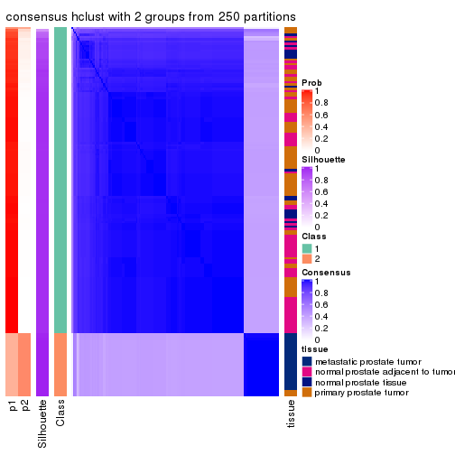</p>

</div>
<div id='tab-SD-hclust-consensus-heatmap-2'>
<pre><code class="r">consensus_heatmap(res, k = 3)
</code></pre>

<p>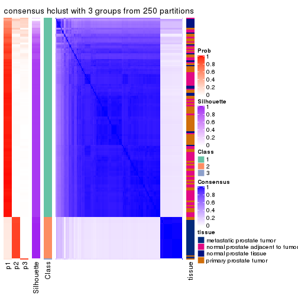</p>

</div>
<div id='tab-SD-hclust-consensus-heatmap-3'>
<pre><code class="r">consensus_heatmap(res, k = 4)
</code></pre>

<p>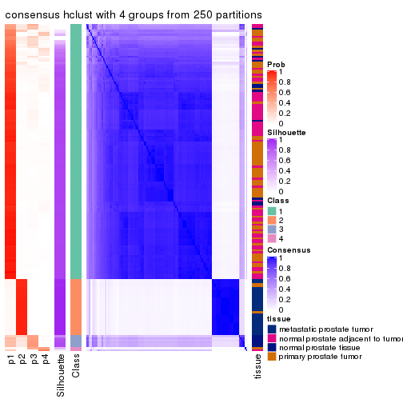</p>

</div>
<div id='tab-SD-hclust-consensus-heatmap-4'>
<pre><code class="r">consensus_heatmap(res, k = 5)
</code></pre>

<p>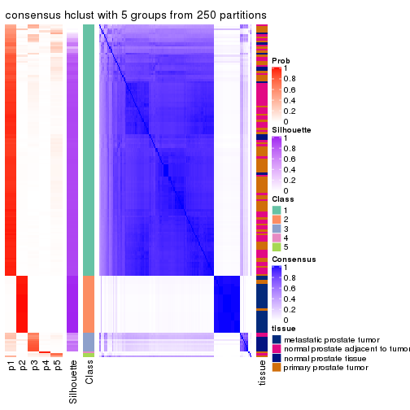</p>

</div>
<div id='tab-SD-hclust-consensus-heatmap-5'>
<pre><code class="r">consensus_heatmap(res, k = 6)
</code></pre>

<p>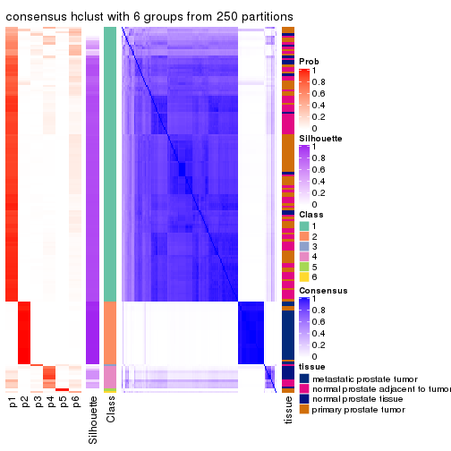</p>

</div>
</div>

Heatmaps for the membership of samples in all partitions to see how consistent they are:


<script>
$( function() {
	$( '#tabs-SD-hclust-membership-heatmap' ).tabs();
} );
</script>
<div id='tabs-SD-hclust-membership-heatmap'>
<ul>
<li><a href='#tab-SD-hclust-membership-heatmap-1'>k = 2</a></li>
<li><a href='#tab-SD-hclust-membership-heatmap-2'>k = 3</a></li>
<li><a href='#tab-SD-hclust-membership-heatmap-3'>k = 4</a></li>
<li><a href='#tab-SD-hclust-membership-heatmap-4'>k = 5</a></li>
<li><a href='#tab-SD-hclust-membership-heatmap-5'>k = 6</a></li>
</ul>
<div id='tab-SD-hclust-membership-heatmap-1'>
<pre><code class="r">membership_heatmap(res, k = 2)
</code></pre>

<p>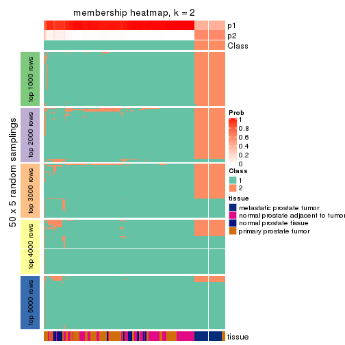</p>

</div>
<div id='tab-SD-hclust-membership-heatmap-2'>
<pre><code class="r">membership_heatmap(res, k = 3)
</code></pre>

<p>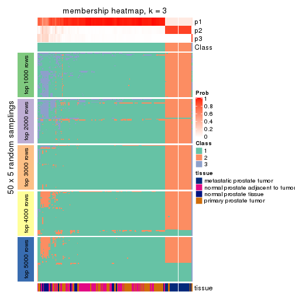</p>

</div>
<div id='tab-SD-hclust-membership-heatmap-3'>
<pre><code class="r">membership_heatmap(res, k = 4)
</code></pre>

<p>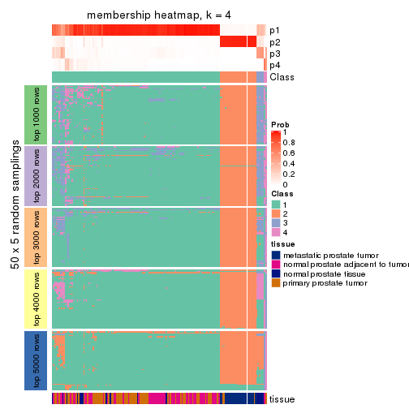</p>

</div>
<div id='tab-SD-hclust-membership-heatmap-4'>
<pre><code class="r">membership_heatmap(res, k = 5)
</code></pre>

<p>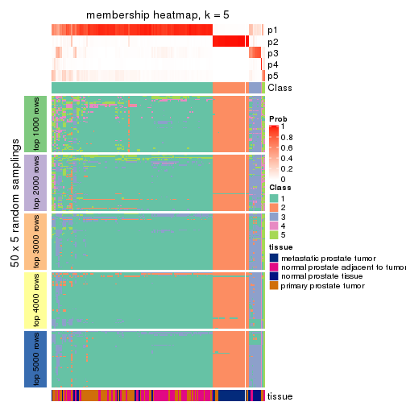</p>

</div>
<div id='tab-SD-hclust-membership-heatmap-5'>
<pre><code class="r">membership_heatmap(res, k = 6)
</code></pre>

<p>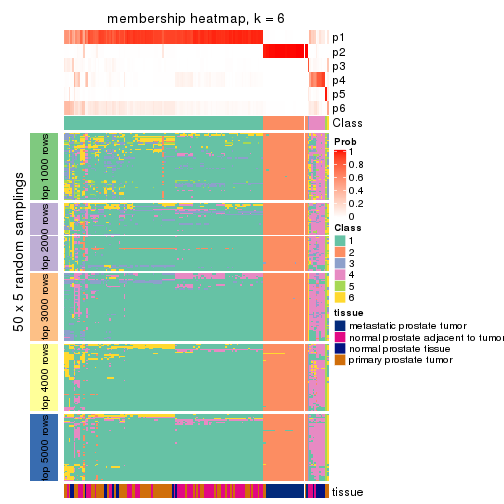</p>

</div>
</div>

As soon as we have had the classes for columns, we can look for signatures
which are significantly different between classes which can be candidate marks
for certain classes. Following are the heatmaps for signatures.


Signature heatmaps where rows are scaled:


<script>
$( function() {
	$( '#tabs-SD-hclust-get-signatures' ).tabs();
} );
</script>
<div id='tabs-SD-hclust-get-signatures'>
<ul>
<li><a href='#tab-SD-hclust-get-signatures-1'>k = 2</a></li>
<li><a href='#tab-SD-hclust-get-signatures-2'>k = 3</a></li>
<li><a href='#tab-SD-hclust-get-signatures-3'>k = 4</a></li>
<li><a href='#tab-SD-hclust-get-signatures-4'>k = 5</a></li>
<li><a href='#tab-SD-hclust-get-signatures-5'>k = 6</a></li>
</ul>
<div id='tab-SD-hclust-get-signatures-1'>
<pre><code class="r">get_signatures(res, k = 2)
</code></pre>

<pre><code>#&gt; Error in mat[ceiling(1:nr/h_ratio), ceiling(1:nc/w_ratio), drop = FALSE]: subscript out of bounds
</code></pre>

<p>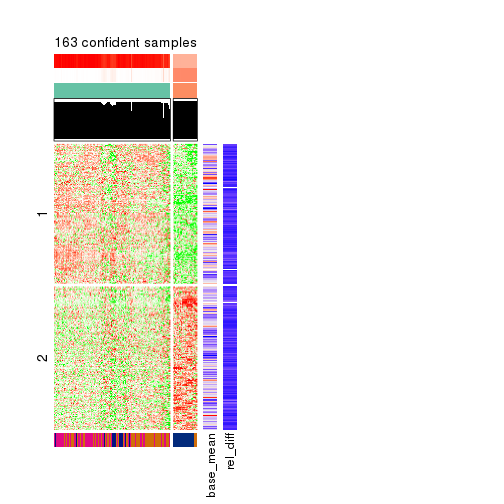</p>

</div>
<div id='tab-SD-hclust-get-signatures-2'>
<pre><code class="r">get_signatures(res, k = 3)
</code></pre>

<p>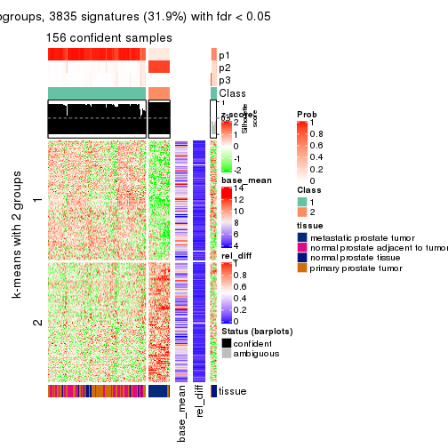</p>

</div>
<div id='tab-SD-hclust-get-signatures-3'>
<pre><code class="r">get_signatures(res, k = 4)
</code></pre>

<p>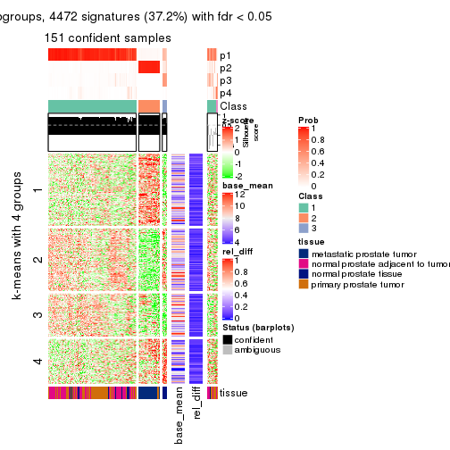</p>

</div>
<div id='tab-SD-hclust-get-signatures-4'>
<pre><code class="r">get_signatures(res, k = 5)
</code></pre>

<p>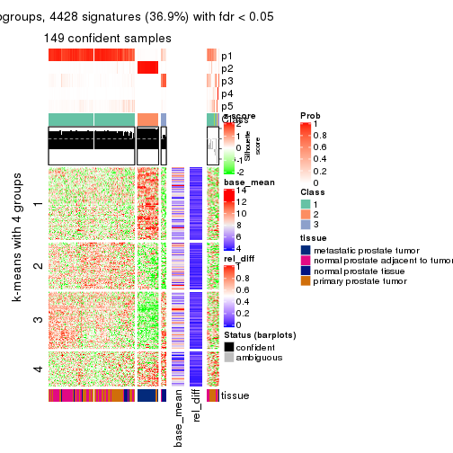</p>

</div>
<div id='tab-SD-hclust-get-signatures-5'>
<pre><code class="r">get_signatures(res, k = 6)
</code></pre>

<p>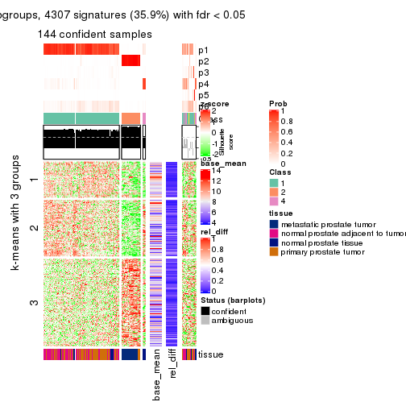</p>

</div>
</div>


Signature heatmaps where rows are not scaled:


<script>
$( function() {
	$( '#tabs-SD-hclust-get-signatures-no-scale' ).tabs();
} );
</script>
<div id='tabs-SD-hclust-get-signatures-no-scale'>
<ul>
<li><a href='#tab-SD-hclust-get-signatures-no-scale-1'>k = 2</a></li>
<li><a href='#tab-SD-hclust-get-signatures-no-scale-2'>k = 3</a></li>
<li><a href='#tab-SD-hclust-get-signatures-no-scale-3'>k = 4</a></li>
<li><a href='#tab-SD-hclust-get-signatures-no-scale-4'>k = 5</a></li>
<li><a href='#tab-SD-hclust-get-signatures-no-scale-5'>k = 6</a></li>
</ul>
<div id='tab-SD-hclust-get-signatures-no-scale-1'>
<pre><code class="r">get_signatures(res, k = 2, scale_rows = FALSE)
</code></pre>

<p>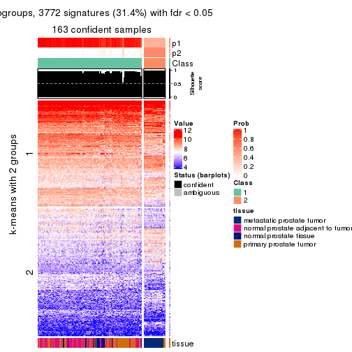</p>

</div>
<div id='tab-SD-hclust-get-signatures-no-scale-2'>
<pre><code class="r">get_signatures(res, k = 3, scale_rows = FALSE)
</code></pre>

<p>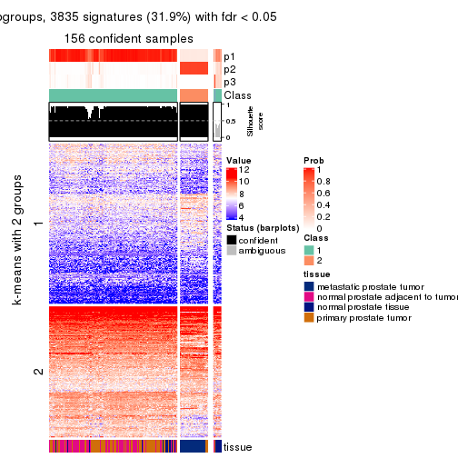</p>

</div>
<div id='tab-SD-hclust-get-signatures-no-scale-3'>
<pre><code class="r">get_signatures(res, k = 4, scale_rows = FALSE)
</code></pre>

<p>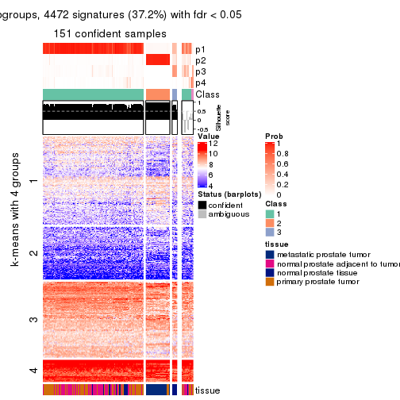</p>

</div>
<div id='tab-SD-hclust-get-signatures-no-scale-4'>
<pre><code class="r">get_signatures(res, k = 5, scale_rows = FALSE)
</code></pre>

<p>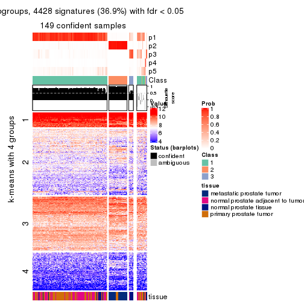</p>

</div>
<div id='tab-SD-hclust-get-signatures-no-scale-5'>
<pre><code class="r">get_signatures(res, k = 6, scale_rows = FALSE)
</code></pre>

<p>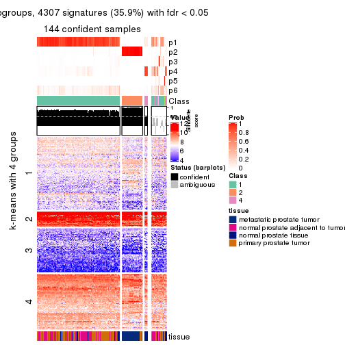</p>

</div>
</div>


Compare the overlap of signatures from different k:

```r
compare_signatures(res)
```

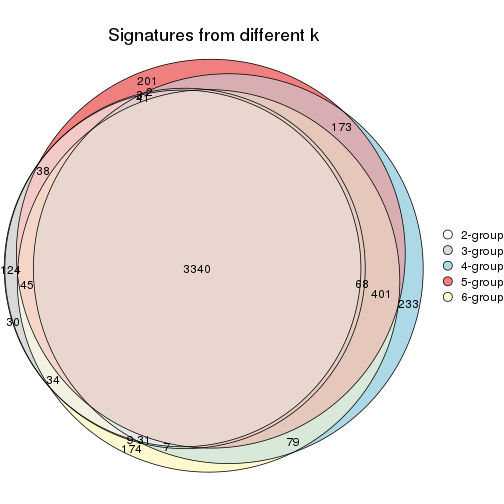

`get_signature()` returns a data frame invisibly. TO get the list of signatures, the function
call should be assigned to a variable explicitly. In following code, if `plot` argument is set
to `FALSE`, no heatmap is plotted while only the differential analysis is performed.

```r
# code only for demonstration
tb = get_signature(res, k = ..., plot = FALSE)
```

An example of the output of `tb` is:

```
#>   which_row         fdr    mean_1    mean_2 scaled_mean_1 scaled_mean_2 km
#> 1        38 0.042760348  8.373488  9.131774    -0.5533452     0.5164555  1
#> 2        40 0.018707592  7.106213  8.469186    -0.6173731     0.5762149  1
#> 3        55 0.019134737 10.221463 11.207825    -0.6159697     0.5749050  1
#> 4        59 0.006059896  5.921854  7.869574    -0.6899429     0.6439467  1
#> 5        60 0.018055526  8.928898 10.211722    -0.6204761     0.5791110  1
#> 6        98 0.009384629 15.714769 14.887706     0.6635654    -0.6193277  2
...
```

The columns in `tb` are:

1. `which_row`: row indices corresponding to the input matrix.
2. `fdr`: FDR for the differential test. 
3. `mean_x`: The mean value in group x.
4. `scaled_mean_x`: The mean value in group x after rows are scaled.
5. `km`: Row groups if k-means clustering is applied to rows.


UMAP plot which shows how samples are separated.


<script>
$( function() {
	$( '#tabs-SD-hclust-dimension-reduction' ).tabs();
} );
</script>
<div id='tabs-SD-hclust-dimension-reduction'>
<ul>
<li><a href='#tab-SD-hclust-dimension-reduction-1'>k = 2</a></li>
<li><a href='#tab-SD-hclust-dimension-reduction-2'>k = 3</a></li>
<li><a href='#tab-SD-hclust-dimension-reduction-3'>k = 4</a></li>
<li><a href='#tab-SD-hclust-dimension-reduction-4'>k = 5</a></li>
<li><a href='#tab-SD-hclust-dimension-reduction-5'>k = 6</a></li>
</ul>
<div id='tab-SD-hclust-dimension-reduction-1'>
<pre><code class="r">dimension_reduction(res, k = 2, method = &quot;UMAP&quot;)
</code></pre>

<p>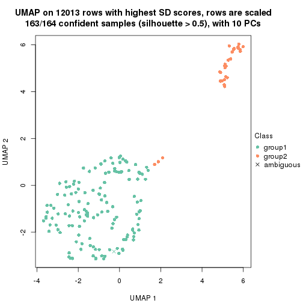</p>

</div>
<div id='tab-SD-hclust-dimension-reduction-2'>
<pre><code class="r">dimension_reduction(res, k = 3, method = &quot;UMAP&quot;)
</code></pre>

<p>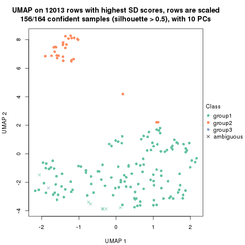</p>

</div>
<div id='tab-SD-hclust-dimension-reduction-3'>
<pre><code class="r">dimension_reduction(res, k = 4, method = &quot;UMAP&quot;)
</code></pre>

<p>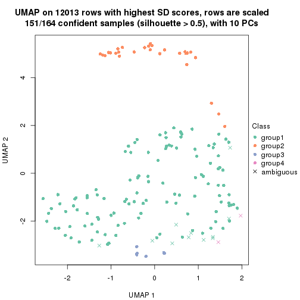</p>

</div>
<div id='tab-SD-hclust-dimension-reduction-4'>
<pre><code class="r">dimension_reduction(res, k = 5, method = &quot;UMAP&quot;)
</code></pre>

<p>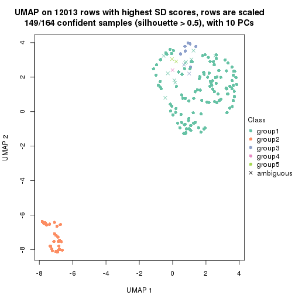</p>

</div>
<div id='tab-SD-hclust-dimension-reduction-5'>
<pre><code class="r">dimension_reduction(res, k = 6, method = &quot;UMAP&quot;)
</code></pre>

<p>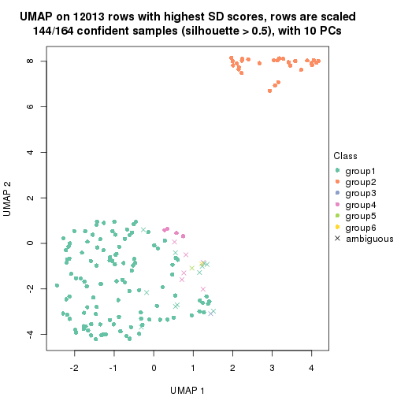</p>

</div>
</div>


Following heatmap shows how subgroups are split when increasing `k`:

```r
collect_classes(res)
```

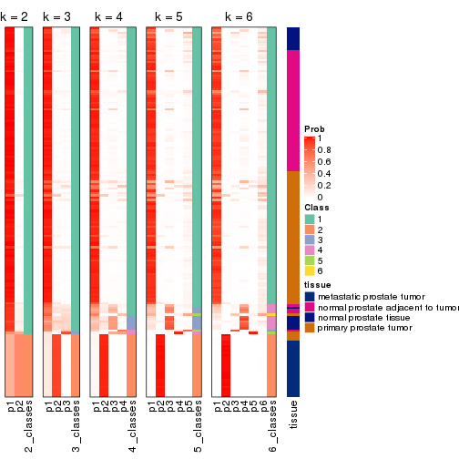


Test correlation between subgroups and known annotations. If the known
annotation is numeric, one-way ANOVA test is applied, and if the known
annotation is discrete, chi-squared contingency table test is applied.

```r
test_to_known_factors(res)
```

```
#>             n tissue(p) k
#> SD:hclust 163  8.88e-31 2
#> SD:hclust 156  2.04e-29 3
#> SD:hclust 151  5.36e-37 4
#> SD:hclust 149  2.80e-35 5
#> SD:hclust 144  2.47e-33 6
```


If matrix rows can be associated to genes, consider to use `functional_enrichment(res,
...)` to perform function enrichment for the signature genes. See [this vignette](http://bioconductor.org/packages/devel/bioc/vignettes/cola/inst/doc/functional_enrichment.html) for more detailed explanations.


 

---------------------------------------------------


### SD:kmeans**


The object with results only for a single top-value method and a single partition method 
can be extracted as:

```r
res = res_list["SD", "kmeans"]
# you can also extract it by
# res = res_list["SD:kmeans"]
```

A summary of `res` and all the functions that can be applied to it:

```r
res
```

```
#> A 'ConsensusPartition' object with k = 2, 3, 4, 5, 6.
#>   On a matrix with 12013 rows and 164 columns.
#>   Top rows (1000, 2000, 3000, 4000, 5000) are extracted by 'SD' method.
#>   Subgroups are detected by 'kmeans' method.
#>   Performed in total 1250 partitions by row resampling.
#>   Best k for subgroups seems to be 3.
#> 
#> Following methods can be applied to this 'ConsensusPartition' object:
#>  [1] "cola_report"             "collect_classes"         "collect_plots"          
#>  [4] "collect_stats"           "colnames"                "compare_signatures"     
#>  [7] "consensus_heatmap"       "dimension_reduction"     "functional_enrichment"  
#> [10] "get_anno_col"            "get_anno"                "get_classes"            
#> [13] "get_consensus"           "get_matrix"              "get_membership"         
#> [16] "get_param"               "get_signatures"          "get_stats"              
#> [19] "is_best_k"               "is_stable_k"             "membership_heatmap"     
#> [22] "ncol"                    "nrow"                    "plot_ecdf"              
#> [25] "rownames"                "select_partition_number" "show"                   
#> [28] "suggest_best_k"          "test_to_known_factors"
```

`collect_plots()` function collects all the plots made from `res` for all `k` (number of partitions)
into one single page to provide an easy and fast comparison between different `k`.

```r
collect_plots(res)
```

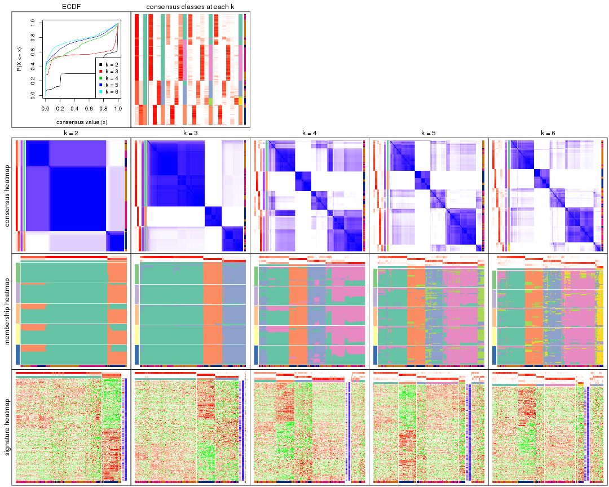

The plots are:

- The first row: a plot of the ECDF (empirical cumulative distribution
  function) curves of the consensus matrix for each `k` and the heatmap of
  predicted classes for each `k`.
- The second row: heatmaps of the consensus matrix for each `k`.
- The third row: heatmaps of the membership matrix for each `k`.
- The fouth row: heatmaps of the signatures for each `k`.

All the plots in panels can be made by individual functions and they are
plotted later in this section.

`select_partition_number()` produces several plots showing different
statistics for choosing "optimized" `k`. There are following statistics:

- ECDF curves of the consensus matrix for each `k`;
- 1-PAC. [The PAC
  score](https://en.wikipedia.org/wiki/Consensus_clustering#Over-interpretation_potential_of_consensus_clustering)
  measures the proportion of the ambiguous subgrouping.
- Mean silhouette score.
- Concordance. The mean probability of fiting the consensus class ids in all
  partitions.
- Area increased. Denote $A_k$ as the area under the ECDF curve for current
  `k`, the area increased is defined as $A_k - A_{k-1}$.
- Rand index. The percent of pairs of samples that are both in a same cluster
  or both are not in a same cluster in the partition of k and k-1.
- Jaccard index. The ratio of pairs of samples are both in a same cluster in
  the partition of k and k-1 and the pairs of samples are both in a same
  cluster in the partition k or k-1.

The detailed explanations of these statistics can be found in [the _cola_
vignette](http://bioconductor.org/packages/devel/bioc/vignettes/cola/inst/doc/cola.html#toc_13).

Generally speaking, lower PAC score, higher mean silhouette score or higher
concordance corresponds to better partition. Rand index and Jaccard index
measure how similar the current partition is compared to partition with `k-1`.
If they are too similar, we won't accept `k` is better than `k-1`.

```r
select_partition_number(res)
```

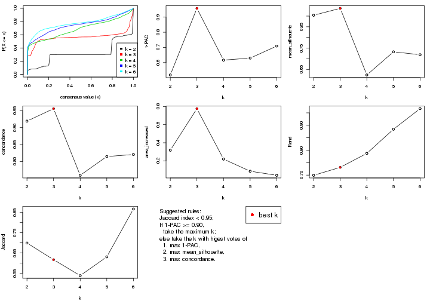

The numeric values for all these statistics can be obtained by `get_stats()`.

```r
get_stats(res)
```

```
#>   k 1-PAC mean_silhouette concordance area_increased  Rand Jaccard
#> 2 2 0.518           0.904       0.919         0.3178 0.699   0.699
#> 3 3 0.958           0.936       0.956         0.7764 0.731   0.617
#> 4 4 0.617           0.624       0.759         0.2198 0.787   0.538
#> 5 5 0.630           0.733       0.815         0.0860 0.884   0.631
#> 6 6 0.709           0.719       0.821         0.0409 0.967   0.867
```

`suggest_best_k()` suggests the best $k$ based on these statistics. The rules are as follows:

- All $k$ with Jaccard index larger than 0.95 are removed because increasing
  $k$ does not provide enough extra information. If all $k$ are removed, it is
  marked as no subgroup is detected.
- For all $k$ with 1-PAC score larger than 0.9, the maximal $k$ is taken as
  the best $k$, and other $k$ are marked as optional $k$.
- If it does not fit the second rule. The $k$ with the maximal vote of the
  highest 1-PAC score, highest mean silhouette, and highest concordance is
  taken as the best $k$.

```r
suggest_best_k(res)
```

```
#> [1] 3
```


Following shows the table of the partitions (You need to click the **show/hide
code output** link to see it). The membership matrix (columns with name `p*`)
is inferred by
[`clue::cl_consensus()`](https://www.rdocumentation.org/link/cl_consensus?package=clue)
function with the `SE` method. Basically the value in the membership matrix
represents the probability to belong to a certain group. The finall class
label for an item is determined with the group with highest probability it
belongs to.

In `get_classes()` function, the entropy is calculated from the membership
matrix and the silhouette score is calculated from the consensus matrix.


<script>
$( function() {
	$( '#tabs-SD-kmeans-get-classes' ).tabs();
} );
</script>
<div id='tabs-SD-kmeans-get-classes'>
<ul>
<li><a href='#tab-SD-kmeans-get-classes-1'>k = 2</a></li>
<li><a href='#tab-SD-kmeans-get-classes-2'>k = 3</a></li>
<li><a href='#tab-SD-kmeans-get-classes-3'>k = 4</a></li>
<li><a href='#tab-SD-kmeans-get-classes-4'>k = 5</a></li>
<li><a href='#tab-SD-kmeans-get-classes-5'>k = 6</a></li>
</ul>

<div id='tab-SD-kmeans-get-classes-1'>
<p><a id='tab-SD-kmeans-get-classes-1-a' style='color:#0366d6' href='#'>show/hide code output</a></p>
<pre><code class="r">cbind(get_classes(res, k = 2), get_membership(res, k = 2))
</code></pre>

<pre><code>#&gt;           class entropy silhouette    p1    p2
#&gt; GSM152839     1  0.7056      0.823 0.808 0.192
#&gt; GSM152840     1  0.7299      0.816 0.796 0.204
#&gt; GSM152841     1  0.0000      0.928 1.000 0.000
#&gt; GSM152842     1  0.7299      0.816 0.796 0.204
#&gt; GSM152843     1  0.7299      0.816 0.796 0.204
#&gt; GSM152844     1  0.7299      0.816 0.796 0.204
#&gt; GSM152845     1  0.7299      0.816 0.796 0.204
#&gt; GSM152846     1  0.7299      0.816 0.796 0.204
#&gt; GSM152847     1  0.7299      0.816 0.796 0.204
#&gt; GSM152848     1  0.0000      0.928 1.000 0.000
#&gt; GSM152849     1  0.7299      0.816 0.796 0.204
#&gt; GSM152850     1  0.7299      0.816 0.796 0.204
#&gt; GSM152851     1  0.4562      0.878 0.904 0.096
#&gt; GSM152852     1  0.7299      0.816 0.796 0.204
#&gt; GSM152853     1  0.7299      0.816 0.796 0.204
#&gt; GSM152854     1  0.7299      0.816 0.796 0.204
#&gt; GSM152855     1  0.0000      0.928 1.000 0.000
#&gt; GSM153238     1  0.7299      0.816 0.796 0.204
#&gt; GSM153239     1  0.7299      0.816 0.796 0.204
#&gt; GSM153240     1  0.0000      0.928 1.000 0.000
#&gt; GSM153241     1  0.7299      0.816 0.796 0.204
#&gt; GSM153242     1  0.7299      0.816 0.796 0.204
#&gt; GSM153243     1  0.7299      0.816 0.796 0.204
#&gt; GSM153244     1  0.0000      0.928 1.000 0.000
#&gt; GSM153245     1  0.7299      0.816 0.796 0.204
#&gt; GSM153246     1  0.7299      0.816 0.796 0.204
#&gt; GSM153247     1  0.6887      0.828 0.816 0.184
#&gt; GSM153248     1  0.0000      0.928 1.000 0.000
#&gt; GSM153249     1  0.0000      0.928 1.000 0.000
#&gt; GSM153250     1  0.0000      0.928 1.000 0.000
#&gt; GSM153251     1  0.7299      0.816 0.796 0.204
#&gt; GSM153252     1  0.0000      0.928 1.000 0.000
#&gt; GSM153253     1  0.0000      0.928 1.000 0.000
#&gt; GSM153254     1  0.3114      0.899 0.944 0.056
#&gt; GSM153255     1  0.0000      0.928 1.000 0.000
#&gt; GSM153256     1  0.0000      0.928 1.000 0.000
#&gt; GSM153257     1  0.0000      0.928 1.000 0.000
#&gt; GSM153258     1  0.0000      0.928 1.000 0.000
#&gt; GSM153259     1  0.0000      0.928 1.000 0.000
#&gt; GSM153260     1  0.7299      0.816 0.796 0.204
#&gt; GSM153261     1  0.7299      0.816 0.796 0.204
#&gt; GSM153262     1  0.0000      0.928 1.000 0.000
#&gt; GSM153263     1  0.0000      0.928 1.000 0.000
#&gt; GSM153264     1  0.0000      0.928 1.000 0.000
#&gt; GSM153265     1  0.0000      0.928 1.000 0.000
#&gt; GSM153266     1  0.0000      0.928 1.000 0.000
#&gt; GSM153267     1  0.0000      0.928 1.000 0.000
#&gt; GSM153268     1  0.6343      0.842 0.840 0.160
#&gt; GSM153269     1  0.0000      0.928 1.000 0.000
#&gt; GSM153270     1  0.0000      0.928 1.000 0.000
#&gt; GSM153271     1  0.0000      0.928 1.000 0.000
#&gt; GSM153272     1  0.0000      0.928 1.000 0.000
#&gt; GSM153273     1  0.0000      0.928 1.000 0.000
#&gt; GSM153274     1  0.0000      0.928 1.000 0.000
#&gt; GSM153275     1  0.0000      0.928 1.000 0.000
#&gt; GSM153276     1  0.0000      0.928 1.000 0.000
#&gt; GSM153277     1  0.0000      0.928 1.000 0.000
#&gt; GSM153278     1  0.7299      0.816 0.796 0.204
#&gt; GSM153279     1  0.0376      0.927 0.996 0.004
#&gt; GSM153280     1  0.0000      0.928 1.000 0.000
#&gt; GSM153281     1  0.0000      0.928 1.000 0.000
#&gt; GSM153282     1  0.0376      0.927 0.996 0.004
#&gt; GSM153283     1  0.0000      0.928 1.000 0.000
#&gt; GSM153284     1  0.0000      0.928 1.000 0.000
#&gt; GSM153285     1  0.0000      0.928 1.000 0.000
#&gt; GSM153286     1  0.0000      0.928 1.000 0.000
#&gt; GSM153287     1  0.0000      0.928 1.000 0.000
#&gt; GSM153288     1  0.0000      0.928 1.000 0.000
#&gt; GSM153289     1  0.0000      0.928 1.000 0.000
#&gt; GSM153290     1  0.0000      0.928 1.000 0.000
#&gt; GSM153291     1  0.0000      0.928 1.000 0.000
#&gt; GSM153292     1  0.0000      0.928 1.000 0.000
#&gt; GSM153293     1  0.0000      0.928 1.000 0.000
#&gt; GSM153294     1  0.0000      0.928 1.000 0.000
#&gt; GSM153295     1  0.0376      0.927 0.996 0.004
#&gt; GSM153054     1  0.0000      0.928 1.000 0.000
#&gt; GSM153055     1  0.0000      0.928 1.000 0.000
#&gt; GSM153056     1  0.7299      0.816 0.796 0.204
#&gt; GSM153057     1  0.6801      0.830 0.820 0.180
#&gt; GSM153058     1  0.7299      0.816 0.796 0.204
#&gt; GSM153059     1  0.7139      0.820 0.804 0.196
#&gt; GSM153060     1  0.7299      0.816 0.796 0.204
#&gt; GSM153061     1  0.7299      0.816 0.796 0.204
#&gt; GSM153062     1  0.7299      0.816 0.796 0.204
#&gt; GSM153063     1  0.7299      0.816 0.796 0.204
#&gt; GSM153064     1  0.0000      0.928 1.000 0.000
#&gt; GSM153065     1  0.7299      0.816 0.796 0.204
#&gt; GSM153066     2  0.5946      0.778 0.144 0.856
#&gt; GSM153067     1  0.0000      0.928 1.000 0.000
#&gt; GSM153068     1  0.7299      0.816 0.796 0.204
#&gt; GSM153069     1  0.0000      0.928 1.000 0.000
#&gt; GSM153070     1  0.0000      0.928 1.000 0.000
#&gt; GSM153071     1  0.0376      0.927 0.996 0.004
#&gt; GSM153072     1  0.0000      0.928 1.000 0.000
#&gt; GSM153073     1  0.0000      0.928 1.000 0.000
#&gt; GSM153074     1  0.0000      0.928 1.000 0.000
#&gt; GSM153075     1  0.0000      0.928 1.000 0.000
#&gt; GSM153076     1  0.0000      0.928 1.000 0.000
#&gt; GSM153077     1  0.0000      0.928 1.000 0.000
#&gt; GSM153078     1  0.1184      0.921 0.984 0.016
#&gt; GSM153079     1  0.0000      0.928 1.000 0.000
#&gt; GSM153080     1  0.7299      0.816 0.796 0.204
#&gt; GSM153081     1  0.0000      0.928 1.000 0.000
#&gt; GSM153082     1  0.0000      0.928 1.000 0.000
#&gt; GSM153083     1  0.0000      0.928 1.000 0.000
#&gt; GSM153084     1  0.0000      0.928 1.000 0.000
#&gt; GSM153085     1  0.0000      0.928 1.000 0.000
#&gt; GSM153086     1  0.0000      0.928 1.000 0.000
#&gt; GSM153087     1  0.0000      0.928 1.000 0.000
#&gt; GSM153088     1  0.0000      0.928 1.000 0.000
#&gt; GSM153089     1  0.7299      0.816 0.796 0.204
#&gt; GSM153090     1  0.0000      0.928 1.000 0.000
#&gt; GSM153091     1  0.0000      0.928 1.000 0.000
#&gt; GSM153092     1  0.0000      0.928 1.000 0.000
#&gt; GSM153093     1  0.0000      0.928 1.000 0.000
#&gt; GSM153094     1  0.0000      0.928 1.000 0.000
#&gt; GSM153095     1  0.0000      0.928 1.000 0.000
#&gt; GSM153096     1  0.0000      0.928 1.000 0.000
#&gt; GSM153097     1  0.0000      0.928 1.000 0.000
#&gt; GSM153098     1  0.0000      0.928 1.000 0.000
#&gt; GSM153099     1  0.0000      0.928 1.000 0.000
#&gt; GSM153100     1  0.0000      0.928 1.000 0.000
#&gt; GSM153101     1  0.0376      0.927 0.996 0.004
#&gt; GSM153102     1  0.0000      0.928 1.000 0.000
#&gt; GSM153103     1  0.0000      0.928 1.000 0.000
#&gt; GSM153104     1  0.0000      0.928 1.000 0.000
#&gt; GSM153106     1  0.0000      0.928 1.000 0.000
#&gt; GSM153107     1  0.0000      0.928 1.000 0.000
#&gt; GSM153108     1  0.0000      0.928 1.000 0.000
#&gt; GSM153109     1  0.0000      0.928 1.000 0.000
#&gt; GSM153110     1  0.0000      0.928 1.000 0.000
#&gt; GSM153111     1  0.0000      0.928 1.000 0.000
#&gt; GSM153112     1  0.0000      0.928 1.000 0.000
#&gt; GSM153113     1  0.0000      0.928 1.000 0.000
#&gt; GSM153114     1  0.0000      0.928 1.000 0.000
#&gt; GSM187532     2  0.0376      0.789 0.004 0.996
#&gt; GSM187533     2  0.7299      0.964 0.204 0.796
#&gt; GSM187534     2  0.7299      0.964 0.204 0.796
#&gt; GSM187535     2  0.7299      0.964 0.204 0.796
#&gt; GSM152906     2  0.7299      0.964 0.204 0.796
#&gt; GSM152907     2  0.7299      0.964 0.204 0.796
#&gt; GSM152908     2  0.7299      0.964 0.204 0.796
#&gt; GSM152909     2  0.1843      0.814 0.028 0.972
#&gt; GSM152910     2  0.5178      0.897 0.116 0.884
#&gt; GSM152911     2  0.7299      0.964 0.204 0.796
#&gt; GSM152912     2  0.7299      0.964 0.204 0.796
#&gt; GSM152913     2  0.4562      0.879 0.096 0.904
#&gt; GSM152914     2  0.7299      0.964 0.204 0.796
#&gt; GSM152915     2  0.7299      0.964 0.204 0.796
#&gt; GSM152916     2  0.7299      0.964 0.204 0.796
#&gt; GSM152917     2  0.7299      0.964 0.204 0.796
#&gt; GSM152918     2  0.7299      0.964 0.204 0.796
#&gt; GSM152919     2  0.7299      0.964 0.204 0.796
#&gt; GSM152920     2  0.7299      0.964 0.204 0.796
#&gt; GSM152921     2  0.7299      0.964 0.204 0.796
#&gt; GSM152922     2  0.7219      0.962 0.200 0.800
#&gt; GSM152923     2  0.7299      0.964 0.204 0.796
#&gt; GSM152924     2  0.7299      0.964 0.204 0.796
#&gt; GSM152925     2  0.7299      0.964 0.204 0.796
#&gt; GSM152926     2  0.7299      0.964 0.204 0.796
#&gt; GSM152927     2  0.5408      0.903 0.124 0.876
#&gt; GSM152928     2  0.7299      0.964 0.204 0.796
#&gt; GSM152929     2  0.7299      0.964 0.204 0.796
#&gt; GSM152930     2  0.7299      0.964 0.204 0.796
</code></pre>

<script>
$('#tab-SD-kmeans-get-classes-1-a').parent().next().next().hide();
$('#tab-SD-kmeans-get-classes-1-a').click(function(){
  $('#tab-SD-kmeans-get-classes-1-a').parent().next().next().toggle();
  return(false);
});
</script>
</div>

<div id='tab-SD-kmeans-get-classes-2'>
<p><a id='tab-SD-kmeans-get-classes-2-a' style='color:#0366d6' href='#'>show/hide code output</a></p>
<pre><code class="r">cbind(get_classes(res, k = 3), get_membership(res, k = 3))
</code></pre>

<pre><code>#&gt;           class entropy silhouette    p1    p2    p3
#&gt; GSM152839     1  0.6062      0.403 0.616 0.000 0.384
#&gt; GSM152840     3  0.2165      0.936 0.064 0.000 0.936
#&gt; GSM152841     1  0.1031      0.952 0.976 0.000 0.024
#&gt; GSM152842     3  0.1411      0.944 0.036 0.000 0.964
#&gt; GSM152843     3  0.1289      0.945 0.032 0.000 0.968
#&gt; GSM152844     3  0.2165      0.936 0.064 0.000 0.936
#&gt; GSM152845     3  0.1289      0.945 0.032 0.000 0.968
#&gt; GSM152846     3  0.2165      0.936 0.064 0.000 0.936
#&gt; GSM152847     3  0.1411      0.944 0.036 0.000 0.964
#&gt; GSM152848     1  0.1289      0.959 0.968 0.000 0.032
#&gt; GSM152849     3  0.1411      0.944 0.036 0.000 0.964
#&gt; GSM152850     3  0.3267      0.878 0.116 0.000 0.884
#&gt; GSM152851     1  0.5465      0.592 0.712 0.000 0.288
#&gt; GSM152852     3  0.2165      0.936 0.064 0.000 0.936
#&gt; GSM152853     3  0.2165      0.936 0.064 0.000 0.936
#&gt; GSM152854     3  0.2165      0.936 0.064 0.000 0.936
#&gt; GSM152855     1  0.0237      0.959 0.996 0.000 0.004
#&gt; GSM153238     3  0.2261      0.925 0.068 0.000 0.932
#&gt; GSM153239     3  0.2261      0.934 0.068 0.000 0.932
#&gt; GSM153240     1  0.0424      0.958 0.992 0.000 0.008
#&gt; GSM153241     3  0.1289      0.945 0.032 0.000 0.968
#&gt; GSM153242     3  0.2165      0.936 0.064 0.000 0.936
#&gt; GSM153243     3  0.1753      0.938 0.048 0.000 0.952
#&gt; GSM153244     1  0.1411      0.946 0.964 0.000 0.036
#&gt; GSM153245     3  0.2165      0.936 0.064 0.000 0.936
#&gt; GSM153246     3  0.1289      0.945 0.032 0.000 0.968
#&gt; GSM153247     3  0.4796      0.742 0.220 0.000 0.780
#&gt; GSM153248     1  0.1289      0.959 0.968 0.000 0.032
#&gt; GSM153249     1  0.0424      0.958 0.992 0.000 0.008
#&gt; GSM153250     1  0.1163      0.960 0.972 0.000 0.028
#&gt; GSM153251     3  0.2066      0.938 0.060 0.000 0.940
#&gt; GSM153252     1  0.0424      0.958 0.992 0.000 0.008
#&gt; GSM153253     1  0.1289      0.948 0.968 0.000 0.032
#&gt; GSM153254     1  0.4887      0.727 0.772 0.000 0.228
#&gt; GSM153255     1  0.0424      0.958 0.992 0.000 0.008
#&gt; GSM153256     1  0.0237      0.959 0.996 0.000 0.004
#&gt; GSM153257     1  0.0424      0.958 0.992 0.000 0.008
#&gt; GSM153258     1  0.1289      0.959 0.968 0.000 0.032
#&gt; GSM153259     1  0.1289      0.959 0.968 0.000 0.032
#&gt; GSM153260     3  0.1753      0.938 0.048 0.000 0.952
#&gt; GSM153261     3  0.1529      0.942 0.040 0.000 0.960
#&gt; GSM153262     1  0.1031      0.952 0.976 0.000 0.024
#&gt; GSM153263     1  0.1289      0.959 0.968 0.000 0.032
#&gt; GSM153264     1  0.1289      0.959 0.968 0.000 0.032
#&gt; GSM153265     1  0.1163      0.950 0.972 0.000 0.028
#&gt; GSM153266     1  0.1289      0.959 0.968 0.000 0.032
#&gt; GSM153267     1  0.0424      0.960 0.992 0.000 0.008
#&gt; GSM153268     1  0.5733      0.509 0.676 0.000 0.324
#&gt; GSM153269     1  0.0592      0.960 0.988 0.000 0.012
#&gt; GSM153270     1  0.0592      0.959 0.988 0.000 0.012
#&gt; GSM153271     1  0.0747      0.960 0.984 0.000 0.016
#&gt; GSM153272     1  0.0424      0.958 0.992 0.000 0.008
#&gt; GSM153273     1  0.1289      0.959 0.968 0.000 0.032
#&gt; GSM153274     1  0.0592      0.960 0.988 0.000 0.012
#&gt; GSM153275     1  0.0592      0.959 0.988 0.000 0.012
#&gt; GSM153276     1  0.0747      0.960 0.984 0.000 0.016
#&gt; GSM153277     1  0.1163      0.950 0.972 0.000 0.028
#&gt; GSM153278     3  0.1964      0.935 0.056 0.000 0.944
#&gt; GSM153279     1  0.1031      0.952 0.976 0.000 0.024
#&gt; GSM153280     1  0.1163      0.950 0.972 0.000 0.028
#&gt; GSM153281     1  0.1163      0.950 0.972 0.000 0.028
#&gt; GSM153282     1  0.1163      0.950 0.972 0.000 0.028
#&gt; GSM153283     1  0.1289      0.959 0.968 0.000 0.032
#&gt; GSM153284     1  0.0424      0.958 0.992 0.000 0.008
#&gt; GSM153285     1  0.1411      0.946 0.964 0.000 0.036
#&gt; GSM153286     1  0.0424      0.958 0.992 0.000 0.008
#&gt; GSM153287     1  0.0747      0.956 0.984 0.000 0.016
#&gt; GSM153288     1  0.0424      0.958 0.992 0.000 0.008
#&gt; GSM153289     1  0.0000      0.959 1.000 0.000 0.000
#&gt; GSM153290     1  0.1163      0.951 0.972 0.000 0.028
#&gt; GSM153291     1  0.0424      0.958 0.992 0.000 0.008
#&gt; GSM153292     1  0.0892      0.954 0.980 0.000 0.020
#&gt; GSM153293     1  0.0237      0.959 0.996 0.000 0.004
#&gt; GSM153294     1  0.1289      0.959 0.968 0.000 0.032
#&gt; GSM153295     1  0.0592      0.957 0.988 0.000 0.012
#&gt; GSM153054     1  0.2711      0.923 0.912 0.000 0.088
#&gt; GSM153055     1  0.0592      0.960 0.988 0.000 0.012
#&gt; GSM153056     3  0.1643      0.942 0.044 0.000 0.956
#&gt; GSM153057     3  0.5016      0.706 0.240 0.000 0.760
#&gt; GSM153058     3  0.1411      0.945 0.036 0.000 0.964
#&gt; GSM153059     3  0.2625      0.912 0.084 0.000 0.916
#&gt; GSM153060     3  0.1289      0.945 0.032 0.000 0.968
#&gt; GSM153061     3  0.1529      0.942 0.040 0.000 0.960
#&gt; GSM153062     3  0.1289      0.945 0.032 0.000 0.968
#&gt; GSM153063     3  0.1964      0.939 0.056 0.000 0.944
#&gt; GSM153064     1  0.1289      0.959 0.968 0.000 0.032
#&gt; GSM153065     3  0.1643      0.940 0.044 0.000 0.956
#&gt; GSM153066     3  0.6952      0.053 0.016 0.480 0.504
#&gt; GSM153067     1  0.0424      0.958 0.992 0.000 0.008
#&gt; GSM153068     3  0.1411      0.944 0.036 0.000 0.964
#&gt; GSM153069     1  0.0747      0.956 0.984 0.000 0.016
#&gt; GSM153070     1  0.1289      0.959 0.968 0.000 0.032
#&gt; GSM153071     1  0.2448      0.934 0.924 0.000 0.076
#&gt; GSM153072     1  0.2537      0.930 0.920 0.000 0.080
#&gt; GSM153073     1  0.1289      0.959 0.968 0.000 0.032
#&gt; GSM153074     1  0.0424      0.958 0.992 0.000 0.008
#&gt; GSM153075     1  0.0424      0.958 0.992 0.000 0.008
#&gt; GSM153076     1  0.1163      0.960 0.972 0.000 0.028
#&gt; GSM153077     1  0.1289      0.959 0.968 0.000 0.032
#&gt; GSM153078     1  0.4002      0.840 0.840 0.000 0.160
#&gt; GSM153079     1  0.1289      0.959 0.968 0.000 0.032
#&gt; GSM153080     3  0.2711      0.921 0.088 0.000 0.912
#&gt; GSM153081     1  0.1289      0.959 0.968 0.000 0.032
#&gt; GSM153082     1  0.1289      0.959 0.968 0.000 0.032
#&gt; GSM153083     1  0.1860      0.950 0.948 0.000 0.052
#&gt; GSM153084     1  0.4802      0.823 0.824 0.020 0.156
#&gt; GSM153085     1  0.1289      0.959 0.968 0.000 0.032
#&gt; GSM153086     1  0.2066      0.945 0.940 0.000 0.060
#&gt; GSM153087     1  0.0424      0.958 0.992 0.000 0.008
#&gt; GSM153088     1  0.1163      0.960 0.972 0.000 0.028
#&gt; GSM153089     3  0.2066      0.938 0.060 0.000 0.940
#&gt; GSM153090     1  0.1163      0.960 0.972 0.000 0.028
#&gt; GSM153091     1  0.1289      0.959 0.968 0.000 0.032
#&gt; GSM153092     1  0.1163      0.960 0.972 0.000 0.028
#&gt; GSM153093     1  0.0424      0.958 0.992 0.000 0.008
#&gt; GSM153094     1  0.1289      0.959 0.968 0.000 0.032
#&gt; GSM153095     1  0.2165      0.943 0.936 0.000 0.064
#&gt; GSM153096     1  0.1289      0.959 0.968 0.000 0.032
#&gt; GSM153097     1  0.1289      0.959 0.968 0.000 0.032
#&gt; GSM153098     1  0.1289      0.959 0.968 0.000 0.032
#&gt; GSM153099     1  0.0424      0.958 0.992 0.000 0.008
#&gt; GSM153100     1  0.1289      0.959 0.968 0.000 0.032
#&gt; GSM153101     1  0.2356      0.937 0.928 0.000 0.072
#&gt; GSM153102     1  0.1860      0.950 0.948 0.000 0.052
#&gt; GSM153103     1  0.1964      0.947 0.944 0.000 0.056
#&gt; GSM153104     1  0.1031      0.952 0.976 0.000 0.024
#&gt; GSM153106     1  0.1031      0.960 0.976 0.000 0.024
#&gt; GSM153107     1  0.1289      0.959 0.968 0.000 0.032
#&gt; GSM153108     1  0.0592      0.960 0.988 0.000 0.012
#&gt; GSM153109     1  0.1860      0.950 0.948 0.000 0.052
#&gt; GSM153110     1  0.1289      0.959 0.968 0.000 0.032
#&gt; GSM153111     1  0.1289      0.959 0.968 0.000 0.032
#&gt; GSM153112     1  0.1289      0.959 0.968 0.000 0.032
#&gt; GSM153113     1  0.1411      0.958 0.964 0.000 0.036
#&gt; GSM153114     1  0.0424      0.958 0.992 0.000 0.008
#&gt; GSM187532     2  0.0000      0.986 0.000 1.000 0.000
#&gt; GSM187533     2  0.0000      0.986 0.000 1.000 0.000
#&gt; GSM187534     2  0.0000      0.986 0.000 1.000 0.000
#&gt; GSM187535     2  0.3845      0.825 0.116 0.872 0.012
#&gt; GSM152906     2  0.0592      0.985 0.000 0.988 0.012
#&gt; GSM152907     2  0.0592      0.985 0.000 0.988 0.012
#&gt; GSM152908     2  0.0892      0.983 0.000 0.980 0.020
#&gt; GSM152909     2  0.0747      0.985 0.000 0.984 0.016
#&gt; GSM152910     2  0.0892      0.983 0.000 0.980 0.020
#&gt; GSM152911     2  0.0424      0.986 0.000 0.992 0.008
#&gt; GSM152912     2  0.0892      0.983 0.000 0.980 0.020
#&gt; GSM152913     2  0.0424      0.986 0.000 0.992 0.008
#&gt; GSM152914     2  0.0424      0.986 0.000 0.992 0.008
#&gt; GSM152915     2  0.0424      0.986 0.000 0.992 0.008
#&gt; GSM152916     2  0.0592      0.985 0.000 0.988 0.012
#&gt; GSM152917     2  0.0424      0.986 0.000 0.992 0.008
#&gt; GSM152918     2  0.0424      0.986 0.000 0.992 0.008
#&gt; GSM152919     2  0.0424      0.986 0.000 0.992 0.008
#&gt; GSM152920     2  0.0892      0.983 0.000 0.980 0.020
#&gt; GSM152921     2  0.0892      0.983 0.000 0.980 0.020
#&gt; GSM152922     2  0.0892      0.983 0.000 0.980 0.020
#&gt; GSM152923     2  0.0592      0.985 0.000 0.988 0.012
#&gt; GSM152924     2  0.0592      0.985 0.000 0.988 0.012
#&gt; GSM152925     2  0.0592      0.985 0.000 0.988 0.012
#&gt; GSM152926     2  0.0592      0.985 0.000 0.988 0.012
#&gt; GSM152927     2  0.0592      0.985 0.000 0.988 0.012
#&gt; GSM152928     2  0.0592      0.985 0.000 0.988 0.012
#&gt; GSM152929     2  0.0592      0.985 0.000 0.988 0.012
#&gt; GSM152930     2  0.0592      0.985 0.000 0.988 0.012
</code></pre>

<script>
$('#tab-SD-kmeans-get-classes-2-a').parent().next().next().hide();
$('#tab-SD-kmeans-get-classes-2-a').click(function(){
  $('#tab-SD-kmeans-get-classes-2-a').parent().next().next().toggle();
  return(false);
});
</script>
</div>

<div id='tab-SD-kmeans-get-classes-3'>
<p><a id='tab-SD-kmeans-get-classes-3-a' style='color:#0366d6' href='#'>show/hide code output</a></p>
<pre><code class="r">cbind(get_classes(res, k = 4), get_membership(res, k = 4))
</code></pre>

<pre><code>#&gt;           class entropy silhouette    p1    p2    p3    p4
#&gt; GSM152839     1  0.6739     0.2496 0.612 0.000 0.216 0.172
#&gt; GSM152840     3  0.0895     0.7726 0.004 0.000 0.976 0.020
#&gt; GSM152841     4  0.4008     0.6350 0.000 0.000 0.244 0.756
#&gt; GSM152842     3  0.4713     0.8528 0.360 0.000 0.640 0.000
#&gt; GSM152843     3  0.4936     0.8327 0.372 0.000 0.624 0.004
#&gt; GSM152844     3  0.0524     0.7820 0.004 0.000 0.988 0.008
#&gt; GSM152845     3  0.3942     0.8667 0.236 0.000 0.764 0.000
#&gt; GSM152846     3  0.1576     0.8112 0.048 0.000 0.948 0.004
#&gt; GSM152847     3  0.4920     0.8355 0.368 0.000 0.628 0.004
#&gt; GSM152848     1  0.4996     0.6077 0.516 0.000 0.000 0.484
#&gt; GSM152849     3  0.4872     0.8443 0.356 0.000 0.640 0.004
#&gt; GSM152850     1  0.5420    -0.3568 0.624 0.000 0.352 0.024
#&gt; GSM152851     4  0.5182     0.5382 0.028 0.000 0.288 0.684
#&gt; GSM152852     3  0.0376     0.7850 0.004 0.000 0.992 0.004
#&gt; GSM152853     3  0.0779     0.7760 0.004 0.000 0.980 0.016
#&gt; GSM152854     3  0.3791     0.8639 0.200 0.000 0.796 0.004
#&gt; GSM152855     4  0.0592     0.7470 0.016 0.000 0.000 0.984
#&gt; GSM153238     1  0.4632    -0.3236 0.688 0.000 0.308 0.004
#&gt; GSM153239     3  0.0657     0.7791 0.004 0.000 0.984 0.012
#&gt; GSM153240     4  0.2589     0.7191 0.000 0.000 0.116 0.884
#&gt; GSM153241     3  0.4837     0.8539 0.348 0.000 0.648 0.004
#&gt; GSM153242     3  0.2466     0.8301 0.096 0.000 0.900 0.004
#&gt; GSM153243     1  0.5088    -0.5619 0.572 0.000 0.424 0.004
#&gt; GSM153244     4  0.3539     0.6851 0.004 0.000 0.176 0.820
#&gt; GSM153245     3  0.1305     0.8038 0.036 0.000 0.960 0.004
#&gt; GSM153246     3  0.4564     0.8656 0.328 0.000 0.672 0.000
#&gt; GSM153247     1  0.5343    -0.0608 0.708 0.000 0.240 0.052
#&gt; GSM153248     1  0.4992     0.6208 0.524 0.000 0.000 0.476
#&gt; GSM153249     4  0.2921     0.7106 0.000 0.000 0.140 0.860
#&gt; GSM153250     4  0.2760     0.6117 0.128 0.000 0.000 0.872
#&gt; GSM153251     3  0.4372     0.8718 0.268 0.000 0.728 0.004
#&gt; GSM153252     4  0.0592     0.7512 0.000 0.000 0.016 0.984
#&gt; GSM153253     4  0.3764     0.6633 0.000 0.000 0.216 0.784
#&gt; GSM153254     1  0.7859     0.1511 0.376 0.000 0.272 0.352
#&gt; GSM153255     4  0.0336     0.7517 0.000 0.000 0.008 0.992
#&gt; GSM153256     4  0.0817     0.7422 0.024 0.000 0.000 0.976
#&gt; GSM153257     4  0.0469     0.7518 0.000 0.000 0.012 0.988
#&gt; GSM153258     4  0.4996    -0.5509 0.484 0.000 0.000 0.516
#&gt; GSM153259     1  0.4985     0.6323 0.532 0.000 0.000 0.468
#&gt; GSM153260     1  0.5143    -0.6234 0.540 0.000 0.456 0.004
#&gt; GSM153261     3  0.5163     0.7113 0.480 0.000 0.516 0.004
#&gt; GSM153262     4  0.3400     0.6893 0.000 0.000 0.180 0.820
#&gt; GSM153263     4  0.3975     0.3419 0.240 0.000 0.000 0.760
#&gt; GSM153264     1  0.4981     0.6381 0.536 0.000 0.000 0.464
#&gt; GSM153265     4  0.3726     0.6669 0.000 0.000 0.212 0.788
#&gt; GSM153266     1  0.4989     0.6291 0.528 0.000 0.000 0.472
#&gt; GSM153267     4  0.0817     0.7422 0.024 0.000 0.000 0.976
#&gt; GSM153268     4  0.4964     0.4524 0.004 0.000 0.380 0.616
#&gt; GSM153269     4  0.0817     0.7422 0.024 0.000 0.000 0.976
#&gt; GSM153270     4  0.1118     0.7320 0.036 0.000 0.000 0.964
#&gt; GSM153271     4  0.2216     0.6679 0.092 0.000 0.000 0.908
#&gt; GSM153272     4  0.0336     0.7517 0.000 0.000 0.008 0.992
#&gt; GSM153273     1  0.4985     0.6323 0.532 0.000 0.000 0.468
#&gt; GSM153274     4  0.0707     0.7448 0.020 0.000 0.000 0.980
#&gt; GSM153275     4  0.0592     0.7469 0.016 0.000 0.000 0.984
#&gt; GSM153276     4  0.0707     0.7460 0.020 0.000 0.000 0.980
#&gt; GSM153277     4  0.3172     0.7017 0.000 0.000 0.160 0.840
#&gt; GSM153278     1  0.5112    -0.5643 0.560 0.000 0.436 0.004
#&gt; GSM153279     4  0.3400     0.6893 0.000 0.000 0.180 0.820
#&gt; GSM153280     4  0.3726     0.6669 0.000 0.000 0.212 0.788
#&gt; GSM153281     4  0.3569     0.6781 0.000 0.000 0.196 0.804
#&gt; GSM153282     4  0.3764     0.6637 0.000 0.000 0.216 0.784
#&gt; GSM153283     1  0.4996     0.6099 0.516 0.000 0.000 0.484
#&gt; GSM153284     4  0.0524     0.7505 0.008 0.000 0.004 0.988
#&gt; GSM153285     4  0.3726     0.6669 0.000 0.000 0.212 0.788
#&gt; GSM153286     4  0.0707     0.7451 0.020 0.000 0.000 0.980
#&gt; GSM153287     4  0.3123     0.7034 0.000 0.000 0.156 0.844
#&gt; GSM153288     4  0.0336     0.7496 0.008 0.000 0.000 0.992
#&gt; GSM153289     4  0.0921     0.7400 0.028 0.000 0.000 0.972
#&gt; GSM153290     4  0.3688     0.6697 0.000 0.000 0.208 0.792
#&gt; GSM153291     4  0.0592     0.7511 0.000 0.000 0.016 0.984
#&gt; GSM153292     4  0.3486     0.6840 0.000 0.000 0.188 0.812
#&gt; GSM153293     4  0.0707     0.7451 0.020 0.000 0.000 0.980
#&gt; GSM153294     1  0.4998     0.5971 0.512 0.000 0.000 0.488
#&gt; GSM153295     4  0.0895     0.7474 0.020 0.000 0.004 0.976
#&gt; GSM153054     1  0.5070     0.6471 0.580 0.000 0.004 0.416
#&gt; GSM153055     4  0.2216     0.6702 0.092 0.000 0.000 0.908
#&gt; GSM153056     3  0.5376     0.7953 0.396 0.000 0.588 0.016
#&gt; GSM153057     1  0.6097    -0.4081 0.580 0.000 0.364 0.056
#&gt; GSM153058     3  0.4331     0.8686 0.288 0.000 0.712 0.000
#&gt; GSM153059     1  0.4950    -0.4625 0.620 0.000 0.376 0.004
#&gt; GSM153060     3  0.4564     0.8664 0.328 0.000 0.672 0.000
#&gt; GSM153061     3  0.4855     0.8605 0.352 0.000 0.644 0.004
#&gt; GSM153062     3  0.4477     0.8638 0.312 0.000 0.688 0.000
#&gt; GSM153063     3  0.4103     0.8718 0.256 0.000 0.744 0.000
#&gt; GSM153064     1  0.4994     0.6139 0.520 0.000 0.000 0.480
#&gt; GSM153065     3  0.4920     0.8481 0.368 0.000 0.628 0.004
#&gt; GSM153066     1  0.5031    -0.0210 0.768 0.092 0.140 0.000
#&gt; GSM153067     4  0.0188     0.7515 0.000 0.000 0.004 0.996
#&gt; GSM153068     3  0.4585     0.8622 0.332 0.000 0.668 0.000
#&gt; GSM153069     4  0.3123     0.7034 0.000 0.000 0.156 0.844
#&gt; GSM153070     4  0.4907    -0.3803 0.420 0.000 0.000 0.580
#&gt; GSM153071     1  0.4978     0.5995 0.664 0.000 0.012 0.324
#&gt; GSM153072     1  0.5050     0.6456 0.588 0.000 0.004 0.408
#&gt; GSM153073     1  0.4996     0.6100 0.516 0.000 0.000 0.484
#&gt; GSM153074     4  0.0188     0.7515 0.000 0.000 0.004 0.996
#&gt; GSM153075     4  0.0779     0.7487 0.016 0.000 0.004 0.980
#&gt; GSM153076     4  0.4643    -0.0688 0.344 0.000 0.000 0.656
#&gt; GSM153077     1  0.4972     0.6439 0.544 0.000 0.000 0.456
#&gt; GSM153078     1  0.5697     0.5585 0.664 0.000 0.056 0.280
#&gt; GSM153079     1  0.4967     0.6463 0.548 0.000 0.000 0.452
#&gt; GSM153080     3  0.5389     0.7375 0.308 0.000 0.660 0.032
#&gt; GSM153081     1  0.4981     0.6381 0.536 0.000 0.000 0.464
#&gt; GSM153082     1  0.4989     0.6248 0.528 0.000 0.000 0.472
#&gt; GSM153083     1  0.5112     0.6507 0.560 0.000 0.004 0.436
#&gt; GSM153084     1  0.4332     0.5148 0.792 0.000 0.032 0.176
#&gt; GSM153085     1  0.4933     0.6499 0.568 0.000 0.000 0.432
#&gt; GSM153086     1  0.5088     0.6504 0.572 0.000 0.004 0.424
#&gt; GSM153087     4  0.0336     0.7520 0.000 0.000 0.008 0.992
#&gt; GSM153088     4  0.2814     0.6046 0.132 0.000 0.000 0.868
#&gt; GSM153089     3  0.4018     0.8679 0.224 0.000 0.772 0.004
#&gt; GSM153090     4  0.2081     0.6785 0.084 0.000 0.000 0.916
#&gt; GSM153091     1  0.4989     0.6248 0.528 0.000 0.000 0.472
#&gt; GSM153092     4  0.4999    -0.5726 0.492 0.000 0.000 0.508
#&gt; GSM153093     4  0.0469     0.7516 0.000 0.000 0.012 0.988
#&gt; GSM153094     1  0.4977     0.6393 0.540 0.000 0.000 0.460
#&gt; GSM153095     1  0.4964     0.6307 0.616 0.000 0.004 0.380
#&gt; GSM153096     1  0.4992     0.6208 0.524 0.000 0.000 0.476
#&gt; GSM153097     1  0.4961     0.6479 0.552 0.000 0.000 0.448
#&gt; GSM153098     4  0.4941    -0.4040 0.436 0.000 0.000 0.564
#&gt; GSM153099     4  0.0707     0.7451 0.020 0.000 0.000 0.980
#&gt; GSM153100     1  0.5000     0.5854 0.504 0.000 0.000 0.496
#&gt; GSM153101     1  0.4964     0.6335 0.616 0.000 0.004 0.380
#&gt; GSM153102     1  0.5126     0.6491 0.552 0.000 0.004 0.444
#&gt; GSM153103     1  0.5028     0.6439 0.596 0.000 0.004 0.400
#&gt; GSM153104     4  0.3172     0.7017 0.000 0.000 0.160 0.840
#&gt; GSM153106     4  0.4955    -0.4313 0.444 0.000 0.000 0.556
#&gt; GSM153107     4  0.4998    -0.5575 0.488 0.000 0.000 0.512
#&gt; GSM153108     4  0.2999     0.6053 0.132 0.000 0.004 0.864
#&gt; GSM153109     1  0.5126     0.6494 0.552 0.000 0.004 0.444
#&gt; GSM153110     1  0.4972     0.6435 0.544 0.000 0.000 0.456
#&gt; GSM153111     1  0.4961     0.6479 0.552 0.000 0.000 0.448
#&gt; GSM153112     4  0.4981    -0.4876 0.464 0.000 0.000 0.536
#&gt; GSM153113     1  0.4955     0.6496 0.556 0.000 0.000 0.444
#&gt; GSM153114     4  0.0779     0.7487 0.016 0.000 0.004 0.980
#&gt; GSM187532     2  0.1489     0.9456 0.044 0.952 0.004 0.000
#&gt; GSM187533     2  0.1022     0.9467 0.032 0.968 0.000 0.000
#&gt; GSM187534     2  0.1356     0.9461 0.032 0.960 0.008 0.000
#&gt; GSM187535     2  0.7120     0.4014 0.284 0.572 0.008 0.136
#&gt; GSM152906     2  0.2675     0.9371 0.100 0.892 0.008 0.000
#&gt; GSM152907     2  0.2675     0.9371 0.100 0.892 0.008 0.000
#&gt; GSM152908     2  0.0336     0.9461 0.008 0.992 0.000 0.000
#&gt; GSM152909     2  0.0707     0.9419 0.020 0.980 0.000 0.000
#&gt; GSM152910     2  0.0336     0.9461 0.008 0.992 0.000 0.000
#&gt; GSM152911     2  0.0000     0.9475 0.000 1.000 0.000 0.000
#&gt; GSM152912     2  0.0336     0.9461 0.008 0.992 0.000 0.000
#&gt; GSM152913     2  0.0188     0.9469 0.004 0.996 0.000 0.000
#&gt; GSM152914     2  0.0000     0.9475 0.000 1.000 0.000 0.000
#&gt; GSM152915     2  0.0000     0.9475 0.000 1.000 0.000 0.000
#&gt; GSM152916     2  0.2611     0.9376 0.096 0.896 0.008 0.000
#&gt; GSM152917     2  0.0000     0.9475 0.000 1.000 0.000 0.000
#&gt; GSM152918     2  0.0000     0.9475 0.000 1.000 0.000 0.000
#&gt; GSM152919     2  0.0000     0.9475 0.000 1.000 0.000 0.000
#&gt; GSM152920     2  0.0336     0.9461 0.008 0.992 0.000 0.000
#&gt; GSM152921     2  0.0336     0.9461 0.008 0.992 0.000 0.000
#&gt; GSM152922     2  0.0336     0.9461 0.008 0.992 0.000 0.000
#&gt; GSM152923     2  0.2675     0.9371 0.100 0.892 0.008 0.000
#&gt; GSM152924     2  0.2675     0.9371 0.100 0.892 0.008 0.000
#&gt; GSM152925     2  0.2675     0.9371 0.100 0.892 0.008 0.000
#&gt; GSM152926     2  0.2675     0.9371 0.100 0.892 0.008 0.000
#&gt; GSM152927     2  0.2675     0.9371 0.100 0.892 0.008 0.000
#&gt; GSM152928     2  0.2675     0.9371 0.100 0.892 0.008 0.000
#&gt; GSM152929     2  0.2675     0.9371 0.100 0.892 0.008 0.000
#&gt; GSM152930     2  0.2675     0.9371 0.100 0.892 0.008 0.000
</code></pre>

<script>
$('#tab-SD-kmeans-get-classes-3-a').parent().next().next().hide();
$('#tab-SD-kmeans-get-classes-3-a').click(function(){
  $('#tab-SD-kmeans-get-classes-3-a').parent().next().next().toggle();
  return(false);
});
</script>
</div>

<div id='tab-SD-kmeans-get-classes-4'>
<p><a id='tab-SD-kmeans-get-classes-4-a' style='color:#0366d6' href='#'>show/hide code output</a></p>
<pre><code class="r">cbind(get_classes(res, k = 5), get_membership(res, k = 5))
</code></pre>

<pre><code>#&gt;           class entropy silhouette    p1    p2    p3    p4    p5
#&gt; GSM152839     3  0.6683     0.4509 0.332 0.000 0.528 0.072 0.068
#&gt; GSM152840     5  0.5177     0.8070 0.000 0.000 0.220 0.104 0.676
#&gt; GSM152841     4  0.2929     0.7089 0.000 0.000 0.000 0.820 0.180
#&gt; GSM152842     3  0.3339     0.5571 0.040 0.000 0.836 0.000 0.124
#&gt; GSM152843     3  0.4316     0.5988 0.080 0.000 0.784 0.008 0.128
#&gt; GSM152844     5  0.5013     0.8480 0.000 0.000 0.240 0.080 0.680
#&gt; GSM152845     5  0.4375     0.6368 0.004 0.000 0.420 0.000 0.576
#&gt; GSM152846     5  0.4622     0.8315 0.000 0.000 0.264 0.044 0.692
#&gt; GSM152847     3  0.3888     0.5968 0.076 0.000 0.804 0.000 0.120
#&gt; GSM152848     1  0.5201     0.7666 0.712 0.000 0.052 0.200 0.036
#&gt; GSM152849     3  0.3934     0.5917 0.076 0.000 0.800 0.000 0.124
#&gt; GSM152850     3  0.5124     0.5817 0.260 0.000 0.668 0.004 0.068
#&gt; GSM152851     4  0.3366     0.7073 0.000 0.000 0.032 0.828 0.140
#&gt; GSM152852     5  0.4959     0.8471 0.000 0.000 0.240 0.076 0.684
#&gt; GSM152853     5  0.4960     0.8470 0.000 0.000 0.232 0.080 0.688
#&gt; GSM152854     5  0.4291     0.5230 0.000 0.000 0.464 0.000 0.536
#&gt; GSM152855     4  0.2707     0.8519 0.100 0.000 0.000 0.876 0.024
#&gt; GSM153238     3  0.4473     0.4615 0.412 0.000 0.580 0.000 0.008
#&gt; GSM153239     5  0.5117     0.8443 0.000 0.000 0.240 0.088 0.672
#&gt; GSM153240     4  0.1568     0.8535 0.036 0.000 0.000 0.944 0.020
#&gt; GSM153241     3  0.3493     0.5877 0.060 0.000 0.832 0.000 0.108
#&gt; GSM153242     5  0.5264     0.7442 0.000 0.000 0.392 0.052 0.556
#&gt; GSM153243     3  0.3455     0.6234 0.208 0.000 0.784 0.000 0.008
#&gt; GSM153244     4  0.1883     0.8205 0.012 0.000 0.008 0.932 0.048
#&gt; GSM153245     5  0.5422     0.8120 0.004 0.000 0.308 0.072 0.616
#&gt; GSM153246     3  0.3882     0.2834 0.020 0.000 0.756 0.000 0.224
#&gt; GSM153247     3  0.4950     0.4781 0.384 0.000 0.588 0.008 0.020
#&gt; GSM153248     1  0.1965     0.8518 0.904 0.000 0.000 0.096 0.000
#&gt; GSM153249     4  0.1668     0.8434 0.028 0.000 0.000 0.940 0.032
#&gt; GSM153250     4  0.4706     0.5156 0.316 0.000 0.008 0.656 0.020
#&gt; GSM153251     3  0.4244     0.2670 0.012 0.000 0.728 0.012 0.248
#&gt; GSM153252     4  0.2233     0.8573 0.080 0.000 0.000 0.904 0.016
#&gt; GSM153253     4  0.2516     0.7504 0.000 0.000 0.000 0.860 0.140
#&gt; GSM153254     4  0.7549    -0.0834 0.228 0.000 0.296 0.424 0.052
#&gt; GSM153255     4  0.2130     0.8576 0.080 0.000 0.000 0.908 0.012
#&gt; GSM153256     4  0.2616     0.8491 0.100 0.000 0.000 0.880 0.020
#&gt; GSM153257     4  0.2233     0.8573 0.080 0.000 0.000 0.904 0.016
#&gt; GSM153258     1  0.4352     0.7590 0.732 0.000 0.012 0.236 0.020
#&gt; GSM153259     1  0.1965     0.8518 0.904 0.000 0.000 0.096 0.000
#&gt; GSM153260     3  0.3805     0.6286 0.184 0.000 0.784 0.000 0.032
#&gt; GSM153261     3  0.4021     0.6246 0.200 0.000 0.764 0.000 0.036
#&gt; GSM153262     4  0.1357     0.8239 0.004 0.000 0.000 0.948 0.048
#&gt; GSM153263     4  0.4888    -0.0284 0.472 0.000 0.004 0.508 0.016
#&gt; GSM153264     1  0.4231     0.8069 0.776 0.000 0.028 0.176 0.020
#&gt; GSM153265     4  0.2424     0.7581 0.000 0.000 0.000 0.868 0.132
#&gt; GSM153266     1  0.3900     0.8139 0.788 0.000 0.012 0.180 0.020
#&gt; GSM153267     4  0.2616     0.8491 0.100 0.000 0.000 0.880 0.020
#&gt; GSM153268     4  0.4384     0.4219 0.000 0.000 0.016 0.660 0.324
#&gt; GSM153269     4  0.2932     0.8400 0.112 0.000 0.004 0.864 0.020
#&gt; GSM153270     4  0.2304     0.8532 0.100 0.000 0.000 0.892 0.008
#&gt; GSM153271     4  0.4245     0.6825 0.236 0.000 0.008 0.736 0.020
#&gt; GSM153272     4  0.1892     0.8576 0.080 0.000 0.000 0.916 0.004
#&gt; GSM153273     1  0.1965     0.8518 0.904 0.000 0.000 0.096 0.000
#&gt; GSM153274     4  0.2880     0.8426 0.108 0.000 0.004 0.868 0.020
#&gt; GSM153275     4  0.2616     0.8495 0.100 0.000 0.000 0.880 0.020
#&gt; GSM153276     4  0.3166     0.8417 0.104 0.000 0.016 0.860 0.020
#&gt; GSM153277     4  0.1701     0.8317 0.016 0.000 0.000 0.936 0.048
#&gt; GSM153278     3  0.5030     0.6044 0.220 0.000 0.696 0.004 0.080
#&gt; GSM153279     4  0.1544     0.8047 0.000 0.000 0.000 0.932 0.068
#&gt; GSM153280     4  0.2230     0.7689 0.000 0.000 0.000 0.884 0.116
#&gt; GSM153281     4  0.1544     0.8062 0.000 0.000 0.000 0.932 0.068
#&gt; GSM153282     4  0.2605     0.7423 0.000 0.000 0.000 0.852 0.148
#&gt; GSM153283     1  0.4097     0.7867 0.756 0.000 0.008 0.216 0.020
#&gt; GSM153284     4  0.2249     0.8541 0.096 0.000 0.000 0.896 0.008
#&gt; GSM153285     4  0.2648     0.7402 0.000 0.000 0.000 0.848 0.152
#&gt; GSM153286     4  0.2464     0.8521 0.096 0.000 0.000 0.888 0.016
#&gt; GSM153287     4  0.1469     0.8360 0.016 0.000 0.000 0.948 0.036
#&gt; GSM153288     4  0.2361     0.8531 0.096 0.000 0.000 0.892 0.012
#&gt; GSM153289     4  0.3152     0.8267 0.136 0.000 0.000 0.840 0.024
#&gt; GSM153290     4  0.2230     0.7693 0.000 0.000 0.000 0.884 0.116
#&gt; GSM153291     4  0.2172     0.8573 0.076 0.000 0.000 0.908 0.016
#&gt; GSM153292     4  0.1197     0.8200 0.000 0.000 0.000 0.952 0.048
#&gt; GSM153293     4  0.2179     0.8537 0.100 0.000 0.000 0.896 0.004
#&gt; GSM153294     1  0.2377     0.8444 0.872 0.000 0.000 0.128 0.000
#&gt; GSM153295     4  0.2859     0.8509 0.096 0.000 0.012 0.876 0.016
#&gt; GSM153054     1  0.2554     0.8393 0.892 0.000 0.036 0.072 0.000
#&gt; GSM153055     4  0.3678     0.7841 0.168 0.000 0.008 0.804 0.020
#&gt; GSM153056     3  0.4754     0.6104 0.112 0.000 0.760 0.016 0.112
#&gt; GSM153057     3  0.4761     0.5841 0.256 0.000 0.700 0.024 0.020
#&gt; GSM153058     3  0.4329     0.0880 0.016 0.000 0.672 0.000 0.312
#&gt; GSM153059     3  0.4169     0.5961 0.256 0.000 0.724 0.004 0.016
#&gt; GSM153060     3  0.4132     0.2121 0.020 0.000 0.720 0.000 0.260
#&gt; GSM153061     3  0.2873     0.4648 0.020 0.000 0.860 0.000 0.120
#&gt; GSM153062     3  0.4626    -0.2047 0.020 0.000 0.616 0.000 0.364
#&gt; GSM153063     3  0.4408     0.2699 0.008 0.000 0.736 0.032 0.224
#&gt; GSM153064     1  0.2127     0.8501 0.892 0.000 0.000 0.108 0.000
#&gt; GSM153065     3  0.2580     0.5997 0.064 0.000 0.892 0.000 0.044
#&gt; GSM153066     1  0.5241    -0.1622 0.528 0.016 0.436 0.000 0.020
#&gt; GSM153067     4  0.2233     0.8573 0.080 0.000 0.000 0.904 0.016
#&gt; GSM153068     3  0.2305     0.5180 0.012 0.000 0.896 0.000 0.092
#&gt; GSM153069     4  0.1549     0.8343 0.016 0.000 0.000 0.944 0.040
#&gt; GSM153070     1  0.4879     0.5165 0.612 0.000 0.008 0.360 0.020
#&gt; GSM153071     1  0.5116     0.4274 0.640 0.000 0.304 0.052 0.004
#&gt; GSM153072     1  0.2790     0.8256 0.880 0.000 0.052 0.068 0.000
#&gt; GSM153073     1  0.3899     0.8072 0.780 0.000 0.008 0.192 0.020
#&gt; GSM153074     4  0.1732     0.8575 0.080 0.000 0.000 0.920 0.000
#&gt; GSM153075     4  0.2124     0.8558 0.096 0.000 0.004 0.900 0.000
#&gt; GSM153076     1  0.5035     0.3276 0.548 0.000 0.008 0.424 0.020
#&gt; GSM153077     1  0.4119     0.8170 0.792 0.000 0.032 0.156 0.020
#&gt; GSM153078     1  0.6568     0.1672 0.500 0.000 0.372 0.088 0.040
#&gt; GSM153079     1  0.2354     0.8461 0.904 0.000 0.008 0.076 0.012
#&gt; GSM153080     3  0.6624     0.4834 0.164 0.000 0.612 0.064 0.160
#&gt; GSM153081     1  0.3992     0.8242 0.812 0.000 0.028 0.128 0.032
#&gt; GSM153082     1  0.2011     0.8503 0.908 0.000 0.004 0.088 0.000
#&gt; GSM153083     1  0.2460     0.8407 0.900 0.000 0.024 0.072 0.004
#&gt; GSM153084     1  0.3851     0.5747 0.768 0.000 0.212 0.016 0.004
#&gt; GSM153085     1  0.3334     0.8257 0.852 0.000 0.064 0.080 0.004
#&gt; GSM153086     1  0.2535     0.8363 0.892 0.000 0.032 0.076 0.000
#&gt; GSM153087     4  0.2642     0.8584 0.084 0.000 0.004 0.888 0.024
#&gt; GSM153088     4  0.4630     0.5544 0.300 0.000 0.008 0.672 0.020
#&gt; GSM153089     3  0.4984    -0.1156 0.008 0.000 0.620 0.028 0.344
#&gt; GSM153090     4  0.4158     0.7017 0.224 0.000 0.008 0.748 0.020
#&gt; GSM153091     1  0.1965     0.8518 0.904 0.000 0.000 0.096 0.000
#&gt; GSM153092     1  0.3912     0.7770 0.752 0.000 0.000 0.228 0.020
#&gt; GSM153093     4  0.1892     0.8575 0.080 0.000 0.000 0.916 0.004
#&gt; GSM153094     1  0.2124     0.8519 0.900 0.000 0.004 0.096 0.000
#&gt; GSM153095     1  0.3169     0.7927 0.856 0.000 0.084 0.060 0.000
#&gt; GSM153096     1  0.1965     0.8518 0.904 0.000 0.000 0.096 0.000
#&gt; GSM153097     1  0.2077     0.8483 0.908 0.000 0.008 0.084 0.000
#&gt; GSM153098     1  0.3210     0.7745 0.788 0.000 0.000 0.212 0.000
#&gt; GSM153099     4  0.2773     0.8425 0.112 0.000 0.000 0.868 0.020
#&gt; GSM153100     1  0.3048     0.8262 0.820 0.000 0.000 0.176 0.004
#&gt; GSM153101     1  0.2927     0.8068 0.872 0.000 0.068 0.060 0.000
#&gt; GSM153102     1  0.3018     0.8375 0.872 0.000 0.036 0.084 0.008
#&gt; GSM153103     1  0.2949     0.8221 0.876 0.000 0.052 0.068 0.004
#&gt; GSM153104     4  0.1626     0.8334 0.016 0.000 0.000 0.940 0.044
#&gt; GSM153106     1  0.3427     0.8049 0.796 0.000 0.000 0.192 0.012
#&gt; GSM153107     1  0.3399     0.8259 0.812 0.000 0.000 0.168 0.020
#&gt; GSM153108     4  0.4029     0.5632 0.316 0.000 0.000 0.680 0.004
#&gt; GSM153109     1  0.2824     0.8455 0.880 0.000 0.024 0.088 0.008
#&gt; GSM153110     1  0.1965     0.8518 0.904 0.000 0.000 0.096 0.000
#&gt; GSM153111     1  0.2193     0.8505 0.900 0.000 0.008 0.092 0.000
#&gt; GSM153112     1  0.3003     0.8003 0.812 0.000 0.000 0.188 0.000
#&gt; GSM153113     1  0.2569     0.8301 0.892 0.000 0.040 0.068 0.000
#&gt; GSM153114     4  0.2561     0.8546 0.096 0.000 0.000 0.884 0.020
#&gt; GSM187532     2  0.2756     0.9190 0.024 0.880 0.004 0.000 0.092
#&gt; GSM187533     2  0.2331     0.9227 0.020 0.900 0.000 0.000 0.080
#&gt; GSM187534     2  0.2236     0.9250 0.024 0.908 0.000 0.000 0.068
#&gt; GSM187535     1  0.5966     0.1773 0.544 0.368 0.000 0.020 0.068
#&gt; GSM152906     2  0.3051     0.9145 0.028 0.852 0.000 0.000 0.120
#&gt; GSM152907     2  0.3051     0.9145 0.028 0.852 0.000 0.000 0.120
#&gt; GSM152908     2  0.1965     0.9112 0.024 0.924 0.000 0.000 0.052
#&gt; GSM152909     2  0.1981     0.9076 0.016 0.920 0.000 0.000 0.064
#&gt; GSM152910     2  0.1965     0.9112 0.024 0.924 0.000 0.000 0.052
#&gt; GSM152911     2  0.0000     0.9271 0.000 1.000 0.000 0.000 0.000
#&gt; GSM152912     2  0.1965     0.9112 0.024 0.924 0.000 0.000 0.052
#&gt; GSM152913     2  0.0794     0.9233 0.000 0.972 0.000 0.000 0.028
#&gt; GSM152914     2  0.0000     0.9271 0.000 1.000 0.000 0.000 0.000
#&gt; GSM152915     2  0.0000     0.9271 0.000 1.000 0.000 0.000 0.000
#&gt; GSM152916     2  0.3099     0.9138 0.028 0.848 0.000 0.000 0.124
#&gt; GSM152917     2  0.0162     0.9275 0.000 0.996 0.000 0.000 0.004
#&gt; GSM152918     2  0.0162     0.9275 0.000 0.996 0.000 0.000 0.004
#&gt; GSM152919     2  0.0162     0.9275 0.000 0.996 0.000 0.000 0.004
#&gt; GSM152920     2  0.1965     0.9112 0.024 0.924 0.000 0.000 0.052
#&gt; GSM152921     2  0.1965     0.9112 0.024 0.924 0.000 0.000 0.052
#&gt; GSM152922     2  0.1965     0.9112 0.024 0.924 0.000 0.000 0.052
#&gt; GSM152923     2  0.3051     0.9145 0.028 0.852 0.000 0.000 0.120
#&gt; GSM152924     2  0.3099     0.9138 0.028 0.848 0.000 0.000 0.124
#&gt; GSM152925     2  0.3099     0.9138 0.028 0.848 0.000 0.000 0.124
#&gt; GSM152926     2  0.3051     0.9145 0.028 0.852 0.000 0.000 0.120
#&gt; GSM152927     2  0.3099     0.9138 0.028 0.848 0.000 0.000 0.124
#&gt; GSM152928     2  0.3099     0.9138 0.028 0.848 0.000 0.000 0.124
#&gt; GSM152929     2  0.3051     0.9145 0.028 0.852 0.000 0.000 0.120
#&gt; GSM152930     2  0.3051     0.9145 0.028 0.852 0.000 0.000 0.120
</code></pre>

<script>
$('#tab-SD-kmeans-get-classes-4-a').parent().next().next().hide();
$('#tab-SD-kmeans-get-classes-4-a').click(function(){
  $('#tab-SD-kmeans-get-classes-4-a').parent().next().next().toggle();
  return(false);
});
</script>
</div>

<div id='tab-SD-kmeans-get-classes-5'>
<p><a id='tab-SD-kmeans-get-classes-5-a' style='color:#0366d6' href='#'>show/hide code output</a></p>
<pre><code class="r">cbind(get_classes(res, k = 6), get_membership(res, k = 6))
</code></pre>

<pre><code>#&gt;           class entropy silhouette    p1    p2    p3    p4    p5    p6
#&gt; GSM152839     3  0.5280     0.4998 0.140 0.000 0.704 0.020 0.104 0.032
#&gt; GSM152840     6  0.2257     0.8053 0.000 0.000 0.040 0.048 0.008 0.904
#&gt; GSM152841     4  0.3122     0.7155 0.000 0.000 0.000 0.804 0.020 0.176
#&gt; GSM152842     3  0.3852     0.4723 0.020 0.000 0.796 0.000 0.120 0.064
#&gt; GSM152843     3  0.4394     0.5210 0.044 0.000 0.772 0.004 0.112 0.068
#&gt; GSM152844     6  0.2009     0.8172 0.000 0.000 0.040 0.040 0.004 0.916
#&gt; GSM152845     6  0.4371     0.6468 0.008 0.000 0.120 0.000 0.132 0.740
#&gt; GSM152846     6  0.2519     0.8009 0.000 0.000 0.044 0.016 0.048 0.892
#&gt; GSM152847     3  0.4131     0.5141 0.036 0.000 0.784 0.000 0.108 0.072
#&gt; GSM152848     1  0.6589     0.5755 0.580 0.000 0.132 0.156 0.120 0.012
#&gt; GSM152849     3  0.4239     0.5174 0.036 0.000 0.784 0.004 0.096 0.080
#&gt; GSM152850     3  0.4634     0.5397 0.100 0.000 0.756 0.008 0.100 0.036
#&gt; GSM152851     4  0.3562     0.7411 0.000 0.000 0.036 0.824 0.040 0.100
#&gt; GSM152852     6  0.2255     0.8150 0.000 0.000 0.044 0.024 0.024 0.908
#&gt; GSM152853     6  0.2009     0.8172 0.000 0.000 0.040 0.040 0.004 0.916
#&gt; GSM152854     6  0.4107     0.4808 0.000 0.000 0.280 0.000 0.036 0.684
#&gt; GSM152855     4  0.2442     0.8542 0.048 0.000 0.000 0.884 0.068 0.000
#&gt; GSM153238     3  0.4246     0.4134 0.268 0.000 0.692 0.000 0.028 0.012
#&gt; GSM153239     6  0.2815     0.8090 0.000 0.000 0.056 0.044 0.024 0.876
#&gt; GSM153240     4  0.1732     0.8543 0.004 0.000 0.004 0.920 0.072 0.000
#&gt; GSM153241     3  0.3730     0.5156 0.028 0.000 0.812 0.000 0.100 0.060
#&gt; GSM153242     6  0.4691     0.6087 0.000 0.000 0.196 0.008 0.100 0.696
#&gt; GSM153243     3  0.2571     0.5580 0.064 0.000 0.876 0.000 0.060 0.000
#&gt; GSM153244     4  0.2613     0.8302 0.016 0.000 0.028 0.896 0.044 0.016
#&gt; GSM153245     6  0.4409     0.6932 0.000 0.000 0.156 0.028 0.068 0.748
#&gt; GSM153246     5  0.6101     0.8250 0.020 0.000 0.388 0.000 0.440 0.152
#&gt; GSM153247     3  0.3791     0.4944 0.200 0.000 0.760 0.000 0.032 0.008
#&gt; GSM153248     1  0.0865     0.8539 0.964 0.000 0.000 0.036 0.000 0.000
#&gt; GSM153249     4  0.1350     0.8431 0.008 0.000 0.000 0.952 0.020 0.020
#&gt; GSM153250     4  0.5422     0.2263 0.376 0.000 0.008 0.520 0.096 0.000
#&gt; GSM153251     3  0.4710     0.2130 0.004 0.000 0.688 0.000 0.112 0.196
#&gt; GSM153252     4  0.1232     0.8539 0.024 0.000 0.000 0.956 0.016 0.004
#&gt; GSM153253     4  0.2445     0.7853 0.000 0.000 0.000 0.872 0.020 0.108
#&gt; GSM153254     3  0.6024     0.1344 0.084 0.000 0.508 0.360 0.044 0.004
#&gt; GSM153255     4  0.1261     0.8587 0.024 0.000 0.000 0.952 0.024 0.000
#&gt; GSM153256     4  0.3073     0.8365 0.080 0.000 0.000 0.840 0.080 0.000
#&gt; GSM153257     4  0.1261     0.8590 0.024 0.000 0.000 0.952 0.024 0.000
#&gt; GSM153258     1  0.4988     0.6965 0.688 0.000 0.028 0.192 0.092 0.000
#&gt; GSM153259     1  0.0937     0.8540 0.960 0.000 0.000 0.040 0.000 0.000
#&gt; GSM153260     3  0.2760     0.5382 0.052 0.000 0.868 0.000 0.076 0.004
#&gt; GSM153261     3  0.2860     0.5658 0.068 0.000 0.872 0.000 0.028 0.032
#&gt; GSM153262     4  0.1257     0.8359 0.000 0.000 0.000 0.952 0.020 0.028
#&gt; GSM153263     1  0.5190     0.2897 0.524 0.000 0.004 0.392 0.080 0.000
#&gt; GSM153264     1  0.5172     0.7224 0.704 0.000 0.076 0.124 0.096 0.000
#&gt; GSM153265     4  0.2301     0.7943 0.000 0.000 0.000 0.884 0.020 0.096
#&gt; GSM153266     1  0.4445     0.7611 0.756 0.000 0.032 0.116 0.096 0.000
#&gt; GSM153267     4  0.3054     0.8404 0.072 0.000 0.004 0.848 0.076 0.000
#&gt; GSM153268     4  0.4241     0.3959 0.000 0.000 0.004 0.628 0.020 0.348
#&gt; GSM153269     4  0.3366     0.8263 0.092 0.000 0.004 0.824 0.080 0.000
#&gt; GSM153270     4  0.2803     0.8522 0.064 0.000 0.012 0.872 0.052 0.000
#&gt; GSM153271     4  0.5059     0.5107 0.284 0.000 0.008 0.620 0.088 0.000
#&gt; GSM153272     4  0.2119     0.8575 0.036 0.000 0.000 0.904 0.060 0.000
#&gt; GSM153273     1  0.0865     0.8539 0.964 0.000 0.000 0.036 0.000 0.000
#&gt; GSM153274     4  0.3272     0.8352 0.076 0.000 0.008 0.836 0.080 0.000
#&gt; GSM153275     4  0.2994     0.8432 0.064 0.000 0.004 0.852 0.080 0.000
#&gt; GSM153276     4  0.3430     0.8385 0.060 0.000 0.028 0.836 0.076 0.000
#&gt; GSM153277     4  0.1268     0.8411 0.004 0.000 0.000 0.952 0.008 0.036
#&gt; GSM153278     3  0.3760     0.5687 0.076 0.000 0.820 0.004 0.068 0.032
#&gt; GSM153279     4  0.1774     0.8361 0.004 0.000 0.016 0.936 0.020 0.024
#&gt; GSM153280     4  0.2147     0.8024 0.000 0.000 0.000 0.896 0.020 0.084
#&gt; GSM153281     4  0.1408     0.8318 0.000 0.000 0.000 0.944 0.020 0.036
#&gt; GSM153282     4  0.2491     0.7792 0.000 0.000 0.000 0.868 0.020 0.112
#&gt; GSM153283     1  0.4717     0.7346 0.724 0.000 0.028 0.152 0.096 0.000
#&gt; GSM153284     4  0.2451     0.8537 0.056 0.000 0.000 0.884 0.060 0.000
#&gt; GSM153285     4  0.2581     0.7742 0.000 0.000 0.000 0.860 0.020 0.120
#&gt; GSM153286     4  0.2910     0.8424 0.068 0.000 0.000 0.852 0.080 0.000
#&gt; GSM153287     4  0.1092     0.8392 0.000 0.000 0.000 0.960 0.020 0.020
#&gt; GSM153288     4  0.2442     0.8537 0.048 0.000 0.000 0.884 0.068 0.000
#&gt; GSM153289     4  0.3575     0.7962 0.128 0.000 0.000 0.796 0.076 0.000
#&gt; GSM153290     4  0.1983     0.8093 0.000 0.000 0.000 0.908 0.020 0.072
#&gt; GSM153291     4  0.1321     0.8548 0.024 0.000 0.000 0.952 0.020 0.004
#&gt; GSM153292     4  0.1408     0.8315 0.000 0.000 0.000 0.944 0.020 0.036
#&gt; GSM153293     4  0.2745     0.8474 0.068 0.000 0.000 0.864 0.068 0.000
#&gt; GSM153294     1  0.0937     0.8541 0.960 0.000 0.000 0.040 0.000 0.000
#&gt; GSM153295     4  0.2852     0.8451 0.064 0.000 0.000 0.856 0.080 0.000
#&gt; GSM153054     1  0.2507     0.8339 0.892 0.000 0.056 0.036 0.016 0.000
#&gt; GSM153055     4  0.4200     0.7831 0.128 0.000 0.028 0.772 0.072 0.000
#&gt; GSM153056     3  0.3942     0.5574 0.048 0.000 0.816 0.012 0.076 0.048
#&gt; GSM153057     3  0.3533     0.5475 0.104 0.000 0.820 0.016 0.060 0.000
#&gt; GSM153058     3  0.4756     0.1607 0.000 0.000 0.664 0.000 0.112 0.224
#&gt; GSM153059     3  0.3402     0.5360 0.104 0.000 0.820 0.000 0.072 0.004
#&gt; GSM153060     5  0.6224     0.8521 0.016 0.000 0.372 0.000 0.420 0.192
#&gt; GSM153061     3  0.5506    -0.5954 0.016 0.000 0.524 0.000 0.372 0.088
#&gt; GSM153062     5  0.6216     0.7466 0.016 0.000 0.276 0.000 0.476 0.232
#&gt; GSM153063     3  0.5204     0.1404 0.000 0.000 0.660 0.020 0.128 0.192
#&gt; GSM153064     1  0.1007     0.8539 0.956 0.000 0.000 0.044 0.000 0.000
#&gt; GSM153065     3  0.3161     0.4053 0.008 0.000 0.828 0.000 0.136 0.028
#&gt; GSM153066     3  0.5477     0.2455 0.392 0.012 0.528 0.000 0.048 0.020
#&gt; GSM153067     4  0.1334     0.8555 0.032 0.000 0.000 0.948 0.020 0.000
#&gt; GSM153068     3  0.3283     0.3505 0.000 0.000 0.804 0.000 0.160 0.036
#&gt; GSM153069     4  0.1092     0.8392 0.000 0.000 0.000 0.960 0.020 0.020
#&gt; GSM153070     1  0.5727     0.3965 0.536 0.000 0.028 0.340 0.096 0.000
#&gt; GSM153071     3  0.4574     0.1888 0.464 0.000 0.508 0.012 0.016 0.000
#&gt; GSM153072     1  0.2669     0.7988 0.864 0.000 0.108 0.024 0.004 0.000
#&gt; GSM153073     1  0.4363     0.7548 0.752 0.000 0.020 0.140 0.088 0.000
#&gt; GSM153074     4  0.1124     0.8582 0.036 0.000 0.000 0.956 0.008 0.000
#&gt; GSM153075     4  0.1873     0.8602 0.048 0.000 0.008 0.924 0.020 0.000
#&gt; GSM153076     1  0.5246     0.5095 0.592 0.000 0.012 0.308 0.088 0.000
#&gt; GSM153077     1  0.5142     0.7277 0.708 0.000 0.080 0.116 0.096 0.000
#&gt; GSM153078     3  0.6124     0.3235 0.276 0.000 0.560 0.040 0.116 0.008
#&gt; GSM153079     1  0.1464     0.8511 0.944 0.000 0.016 0.036 0.004 0.000
#&gt; GSM153080     3  0.4859     0.5073 0.072 0.000 0.756 0.080 0.020 0.072
#&gt; GSM153081     1  0.4930     0.7475 0.728 0.000 0.088 0.084 0.100 0.000
#&gt; GSM153082     1  0.1320     0.8507 0.948 0.000 0.016 0.036 0.000 0.000
#&gt; GSM153083     1  0.1320     0.8507 0.948 0.000 0.016 0.036 0.000 0.000
#&gt; GSM153084     1  0.3534     0.5308 0.740 0.000 0.244 0.000 0.016 0.000
#&gt; GSM153085     1  0.3092     0.8229 0.852 0.000 0.088 0.044 0.016 0.000
#&gt; GSM153086     1  0.1334     0.8487 0.948 0.000 0.020 0.032 0.000 0.000
#&gt; GSM153087     4  0.2325     0.8605 0.044 0.000 0.008 0.900 0.048 0.000
#&gt; GSM153088     4  0.5560     0.3094 0.344 0.000 0.016 0.540 0.100 0.000
#&gt; GSM153089     3  0.5248    -0.0486 0.004 0.000 0.568 0.004 0.084 0.340
#&gt; GSM153090     4  0.4815     0.6133 0.236 0.000 0.008 0.668 0.088 0.000
#&gt; GSM153091     1  0.0865     0.8539 0.964 0.000 0.000 0.036 0.000 0.000
#&gt; GSM153092     1  0.3821     0.7659 0.776 0.000 0.004 0.156 0.064 0.000
#&gt; GSM153093     4  0.1829     0.8590 0.024 0.000 0.000 0.920 0.056 0.000
#&gt; GSM153094     1  0.1225     0.8520 0.952 0.000 0.012 0.036 0.000 0.000
#&gt; GSM153095     1  0.2745     0.7769 0.860 0.000 0.112 0.020 0.008 0.000
#&gt; GSM153096     1  0.0937     0.8540 0.960 0.000 0.000 0.040 0.000 0.000
#&gt; GSM153097     1  0.1320     0.8507 0.948 0.000 0.016 0.036 0.000 0.000
#&gt; GSM153098     1  0.1663     0.8380 0.912 0.000 0.000 0.088 0.000 0.000
#&gt; GSM153099     4  0.3054     0.8409 0.076 0.000 0.004 0.848 0.072 0.000
#&gt; GSM153100     1  0.2618     0.8191 0.860 0.000 0.000 0.116 0.024 0.000
#&gt; GSM153101     1  0.1889     0.8250 0.920 0.000 0.056 0.020 0.004 0.000
#&gt; GSM153102     1  0.1794     0.8427 0.924 0.000 0.040 0.036 0.000 0.000
#&gt; GSM153103     1  0.1780     0.8395 0.924 0.000 0.048 0.028 0.000 0.000
#&gt; GSM153104     4  0.1257     0.8359 0.000 0.000 0.000 0.952 0.020 0.028
#&gt; GSM153106     1  0.2214     0.8416 0.892 0.000 0.004 0.092 0.012 0.000
#&gt; GSM153107     1  0.2398     0.8404 0.888 0.000 0.004 0.080 0.028 0.000
#&gt; GSM153108     4  0.3653     0.5822 0.300 0.000 0.000 0.692 0.008 0.000
#&gt; GSM153109     1  0.1492     0.8488 0.940 0.000 0.024 0.036 0.000 0.000
#&gt; GSM153110     1  0.0865     0.8539 0.964 0.000 0.000 0.036 0.000 0.000
#&gt; GSM153111     1  0.1124     0.8528 0.956 0.000 0.008 0.036 0.000 0.000
#&gt; GSM153112     1  0.1501     0.8432 0.924 0.000 0.000 0.076 0.000 0.000
#&gt; GSM153113     1  0.1682     0.8282 0.928 0.000 0.052 0.020 0.000 0.000
#&gt; GSM153114     4  0.2136     0.8583 0.048 0.000 0.000 0.904 0.048 0.000
#&gt; GSM187532     2  0.3544     0.8379 0.012 0.816 0.008 0.000 0.132 0.032
#&gt; GSM187533     2  0.2755     0.8584 0.008 0.864 0.004 0.000 0.108 0.016
#&gt; GSM187534     2  0.2800     0.8601 0.008 0.860 0.004 0.000 0.112 0.016
#&gt; GSM187535     1  0.5265     0.5185 0.656 0.216 0.004 0.020 0.104 0.000
#&gt; GSM152906     2  0.3151     0.8397 0.000 0.748 0.000 0.000 0.252 0.000
#&gt; GSM152907     2  0.3151     0.8397 0.000 0.748 0.000 0.000 0.252 0.000
#&gt; GSM152908     2  0.1625     0.8520 0.000 0.928 0.000 0.000 0.060 0.012
#&gt; GSM152909     2  0.2815     0.8236 0.012 0.864 0.000 0.000 0.096 0.028
#&gt; GSM152910     2  0.1625     0.8520 0.000 0.928 0.000 0.000 0.060 0.012
#&gt; GSM152911     2  0.0363     0.8696 0.000 0.988 0.000 0.000 0.000 0.012
#&gt; GSM152912     2  0.1625     0.8520 0.000 0.928 0.000 0.000 0.060 0.012
#&gt; GSM152913     2  0.0984     0.8672 0.008 0.968 0.000 0.000 0.012 0.012
#&gt; GSM152914     2  0.0508     0.8702 0.000 0.984 0.000 0.000 0.004 0.012
#&gt; GSM152915     2  0.0363     0.8696 0.000 0.988 0.000 0.000 0.000 0.012
#&gt; GSM152916     2  0.3175     0.8386 0.000 0.744 0.000 0.000 0.256 0.000
#&gt; GSM152917     2  0.0508     0.8702 0.000 0.984 0.000 0.000 0.004 0.012
#&gt; GSM152918     2  0.0508     0.8702 0.000 0.984 0.000 0.000 0.004 0.012
#&gt; GSM152919     2  0.0508     0.8702 0.000 0.984 0.000 0.000 0.004 0.012
#&gt; GSM152920     2  0.1625     0.8520 0.000 0.928 0.000 0.000 0.060 0.012
#&gt; GSM152921     2  0.1625     0.8520 0.000 0.928 0.000 0.000 0.060 0.012
#&gt; GSM152922     2  0.1625     0.8520 0.000 0.928 0.000 0.000 0.060 0.012
#&gt; GSM152923     2  0.3151     0.8397 0.000 0.748 0.000 0.000 0.252 0.000
#&gt; GSM152924     2  0.3175     0.8386 0.000 0.744 0.000 0.000 0.256 0.000
#&gt; GSM152925     2  0.3198     0.8372 0.000 0.740 0.000 0.000 0.260 0.000
#&gt; GSM152926     2  0.3151     0.8397 0.000 0.748 0.000 0.000 0.252 0.000
#&gt; GSM152927     2  0.3175     0.8386 0.000 0.744 0.000 0.000 0.256 0.000
#&gt; GSM152928     2  0.3198     0.8372 0.000 0.740 0.000 0.000 0.260 0.000
#&gt; GSM152929     2  0.3151     0.8397 0.000 0.748 0.000 0.000 0.252 0.000
#&gt; GSM152930     2  0.3151     0.8397 0.000 0.748 0.000 0.000 0.252 0.000
</code></pre>

<script>
$('#tab-SD-kmeans-get-classes-5-a').parent().next().next().hide();
$('#tab-SD-kmeans-get-classes-5-a').click(function(){
  $('#tab-SD-kmeans-get-classes-5-a').parent().next().next().toggle();
  return(false);
});
</script>
</div>
</div>

Heatmaps for the consensus matrix. It visualizes the probability of two
samples to be in a same group.


<script>
$( function() {
	$( '#tabs-SD-kmeans-consensus-heatmap' ).tabs();
} );
</script>
<div id='tabs-SD-kmeans-consensus-heatmap'>
<ul>
<li><a href='#tab-SD-kmeans-consensus-heatmap-1'>k = 2</a></li>
<li><a href='#tab-SD-kmeans-consensus-heatmap-2'>k = 3</a></li>
<li><a href='#tab-SD-kmeans-consensus-heatmap-3'>k = 4</a></li>
<li><a href='#tab-SD-kmeans-consensus-heatmap-4'>k = 5</a></li>
<li><a href='#tab-SD-kmeans-consensus-heatmap-5'>k = 6</a></li>
</ul>
<div id='tab-SD-kmeans-consensus-heatmap-1'>
<pre><code class="r">consensus_heatmap(res, k = 2)
</code></pre>

<p>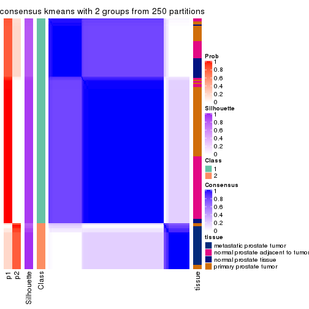</p>

</div>
<div id='tab-SD-kmeans-consensus-heatmap-2'>
<pre><code class="r">consensus_heatmap(res, k = 3)
</code></pre>

<p>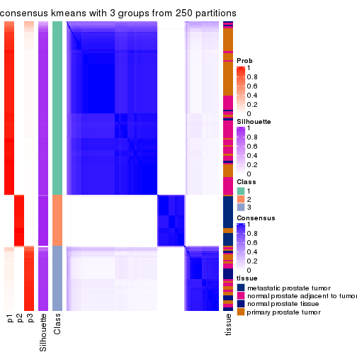</p>

</div>
<div id='tab-SD-kmeans-consensus-heatmap-3'>
<pre><code class="r">consensus_heatmap(res, k = 4)
</code></pre>

<p>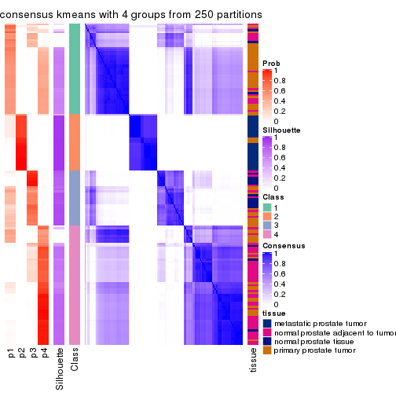</p>

</div>
<div id='tab-SD-kmeans-consensus-heatmap-4'>
<pre><code class="r">consensus_heatmap(res, k = 5)
</code></pre>

<p>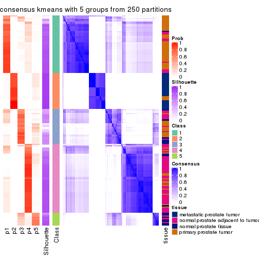</p>

</div>
<div id='tab-SD-kmeans-consensus-heatmap-5'>
<pre><code class="r">consensus_heatmap(res, k = 6)
</code></pre>

<p>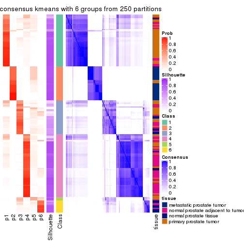</p>

</div>
</div>

Heatmaps for the membership of samples in all partitions to see how consistent they are:


<script>
$( function() {
	$( '#tabs-SD-kmeans-membership-heatmap' ).tabs();
} );
</script>
<div id='tabs-SD-kmeans-membership-heatmap'>
<ul>
<li><a href='#tab-SD-kmeans-membership-heatmap-1'>k = 2</a></li>
<li><a href='#tab-SD-kmeans-membership-heatmap-2'>k = 3</a></li>
<li><a href='#tab-SD-kmeans-membership-heatmap-3'>k = 4</a></li>
<li><a href='#tab-SD-kmeans-membership-heatmap-4'>k = 5</a></li>
<li><a href='#tab-SD-kmeans-membership-heatmap-5'>k = 6</a></li>
</ul>
<div id='tab-SD-kmeans-membership-heatmap-1'>
<pre><code class="r">membership_heatmap(res, k = 2)
</code></pre>

<p>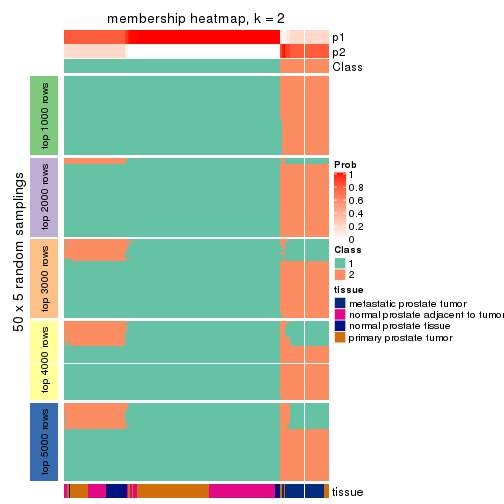</p>

</div>
<div id='tab-SD-kmeans-membership-heatmap-2'>
<pre><code class="r">membership_heatmap(res, k = 3)
</code></pre>

<p>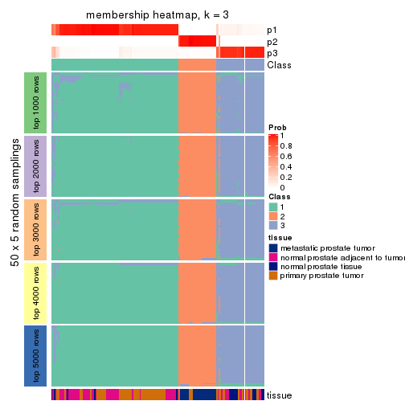</p>

</div>
<div id='tab-SD-kmeans-membership-heatmap-3'>
<pre><code class="r">membership_heatmap(res, k = 4)
</code></pre>

<p>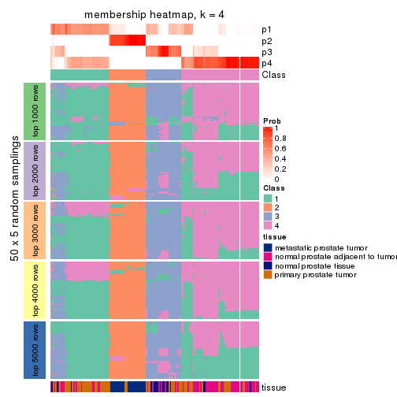</p>

</div>
<div id='tab-SD-kmeans-membership-heatmap-4'>
<pre><code class="r">membership_heatmap(res, k = 5)
</code></pre>

<p>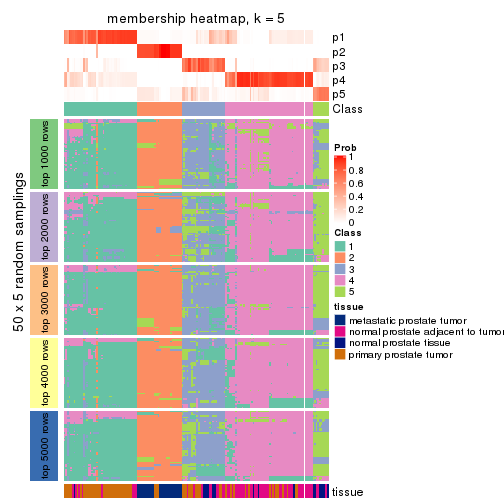</p>

</div>
<div id='tab-SD-kmeans-membership-heatmap-5'>
<pre><code class="r">membership_heatmap(res, k = 6)
</code></pre>

<p>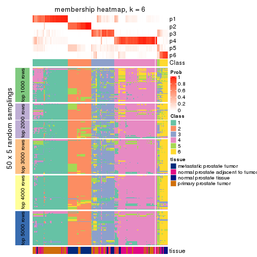</p>

</div>
</div>

As soon as we have had the classes for columns, we can look for signatures
which are significantly different between classes which can be candidate marks
for certain classes. Following are the heatmaps for signatures.


Signature heatmaps where rows are scaled:


<script>
$( function() {
	$( '#tabs-SD-kmeans-get-signatures' ).tabs();
} );
</script>
<div id='tabs-SD-kmeans-get-signatures'>
<ul>
<li><a href='#tab-SD-kmeans-get-signatures-1'>k = 2</a></li>
<li><a href='#tab-SD-kmeans-get-signatures-2'>k = 3</a></li>
<li><a href='#tab-SD-kmeans-get-signatures-3'>k = 4</a></li>
<li><a href='#tab-SD-kmeans-get-signatures-4'>k = 5</a></li>
<li><a href='#tab-SD-kmeans-get-signatures-5'>k = 6</a></li>
</ul>
<div id='tab-SD-kmeans-get-signatures-1'>
<pre><code class="r">get_signatures(res, k = 2)
</code></pre>

<p>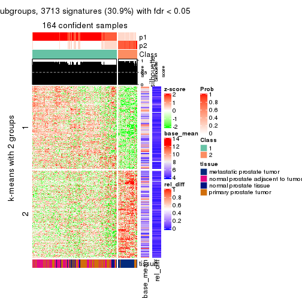</p>

</div>
<div id='tab-SD-kmeans-get-signatures-2'>
<pre><code class="r">get_signatures(res, k = 3)
</code></pre>

<p>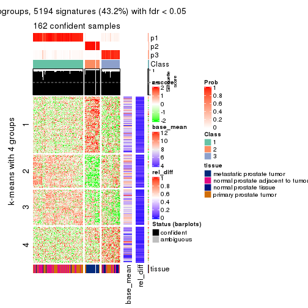</p>

</div>
<div id='tab-SD-kmeans-get-signatures-3'>
<pre><code class="r">get_signatures(res, k = 4)
</code></pre>

<p>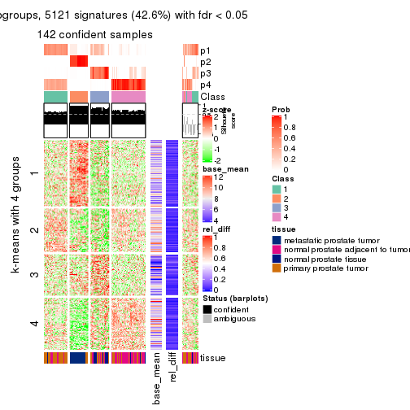</p>

</div>
<div id='tab-SD-kmeans-get-signatures-4'>
<pre><code class="r">get_signatures(res, k = 5)
</code></pre>

<p>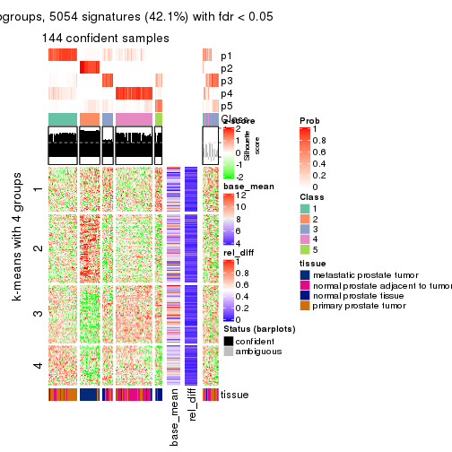</p>

</div>
<div id='tab-SD-kmeans-get-signatures-5'>
<pre><code class="r">get_signatures(res, k = 6)
</code></pre>

<p>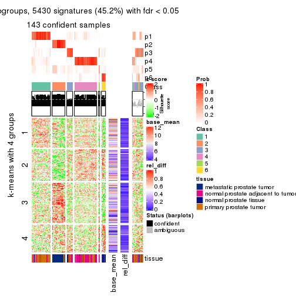</p>

</div>
</div>


Signature heatmaps where rows are not scaled:


<script>
$( function() {
	$( '#tabs-SD-kmeans-get-signatures-no-scale' ).tabs();
} );
</script>
<div id='tabs-SD-kmeans-get-signatures-no-scale'>
<ul>
<li><a href='#tab-SD-kmeans-get-signatures-no-scale-1'>k = 2</a></li>
<li><a href='#tab-SD-kmeans-get-signatures-no-scale-2'>k = 3</a></li>
<li><a href='#tab-SD-kmeans-get-signatures-no-scale-3'>k = 4</a></li>
<li><a href='#tab-SD-kmeans-get-signatures-no-scale-4'>k = 5</a></li>
<li><a href='#tab-SD-kmeans-get-signatures-no-scale-5'>k = 6</a></li>
</ul>
<div id='tab-SD-kmeans-get-signatures-no-scale-1'>
<pre><code class="r">get_signatures(res, k = 2, scale_rows = FALSE)
</code></pre>

<p>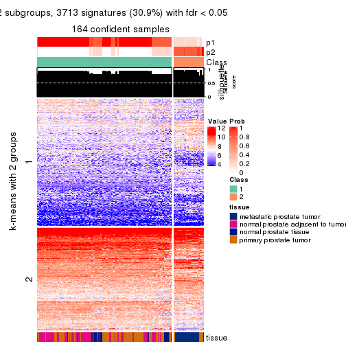</p>

</div>
<div id='tab-SD-kmeans-get-signatures-no-scale-2'>
<pre><code class="r">get_signatures(res, k = 3, scale_rows = FALSE)
</code></pre>

<p>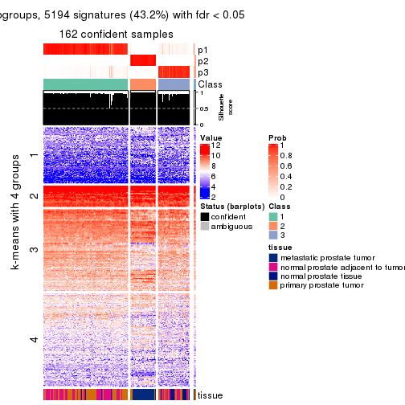</p>

</div>
<div id='tab-SD-kmeans-get-signatures-no-scale-3'>
<pre><code class="r">get_signatures(res, k = 4, scale_rows = FALSE)
</code></pre>

<p>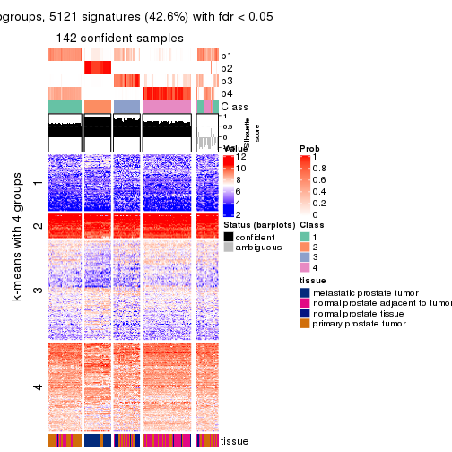</p>

</div>
<div id='tab-SD-kmeans-get-signatures-no-scale-4'>
<pre><code class="r">get_signatures(res, k = 5, scale_rows = FALSE)
</code></pre>

<p>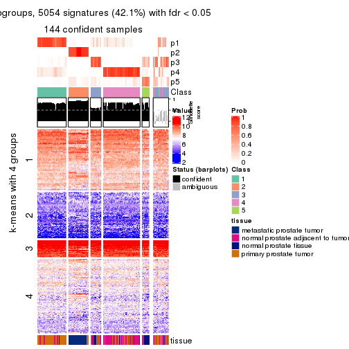</p>

</div>
<div id='tab-SD-kmeans-get-signatures-no-scale-5'>
<pre><code class="r">get_signatures(res, k = 6, scale_rows = FALSE)
</code></pre>

<p>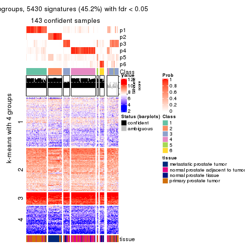</p>

</div>
</div>


Compare the overlap of signatures from different k:

```r
compare_signatures(res)
```

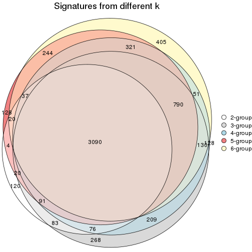

`get_signature()` returns a data frame invisibly. TO get the list of signatures, the function
call should be assigned to a variable explicitly. In following code, if `plot` argument is set
to `FALSE`, no heatmap is plotted while only the differential analysis is performed.

```r
# code only for demonstration
tb = get_signature(res, k = ..., plot = FALSE)
```

An example of the output of `tb` is:

```
#>   which_row         fdr    mean_1    mean_2 scaled_mean_1 scaled_mean_2 km
#> 1        38 0.042760348  8.373488  9.131774    -0.5533452     0.5164555  1
#> 2        40 0.018707592  7.106213  8.469186    -0.6173731     0.5762149  1
#> 3        55 0.019134737 10.221463 11.207825    -0.6159697     0.5749050  1
#> 4        59 0.006059896  5.921854  7.869574    -0.6899429     0.6439467  1
#> 5        60 0.018055526  8.928898 10.211722    -0.6204761     0.5791110  1
#> 6        98 0.009384629 15.714769 14.887706     0.6635654    -0.6193277  2
...
```

The columns in `tb` are:

1. `which_row`: row indices corresponding to the input matrix.
2. `fdr`: FDR for the differential test. 
3. `mean_x`: The mean value in group x.
4. `scaled_mean_x`: The mean value in group x after rows are scaled.
5. `km`: Row groups if k-means clustering is applied to rows.


UMAP plot which shows how samples are separated.


<script>
$( function() {
	$( '#tabs-SD-kmeans-dimension-reduction' ).tabs();
} );
</script>
<div id='tabs-SD-kmeans-dimension-reduction'>
<ul>
<li><a href='#tab-SD-kmeans-dimension-reduction-1'>k = 2</a></li>
<li><a href='#tab-SD-kmeans-dimension-reduction-2'>k = 3</a></li>
<li><a href='#tab-SD-kmeans-dimension-reduction-3'>k = 4</a></li>
<li><a href='#tab-SD-kmeans-dimension-reduction-4'>k = 5</a></li>
<li><a href='#tab-SD-kmeans-dimension-reduction-5'>k = 6</a></li>
</ul>
<div id='tab-SD-kmeans-dimension-reduction-1'>
<pre><code class="r">dimension_reduction(res, k = 2, method = &quot;UMAP&quot;)
</code></pre>

<p>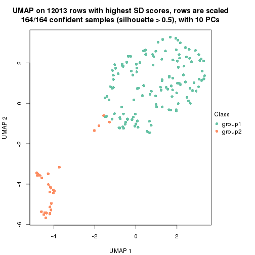</p>

</div>
<div id='tab-SD-kmeans-dimension-reduction-2'>
<pre><code class="r">dimension_reduction(res, k = 3, method = &quot;UMAP&quot;)
</code></pre>

<p>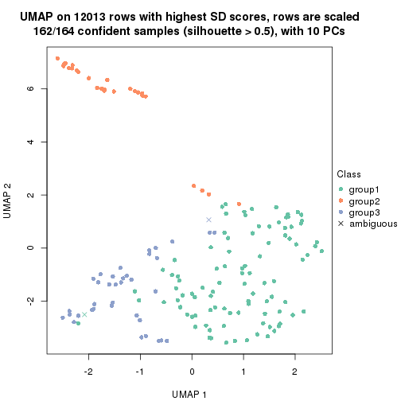</p>

</div>
<div id='tab-SD-kmeans-dimension-reduction-3'>
<pre><code class="r">dimension_reduction(res, k = 4, method = &quot;UMAP&quot;)
</code></pre>

<p>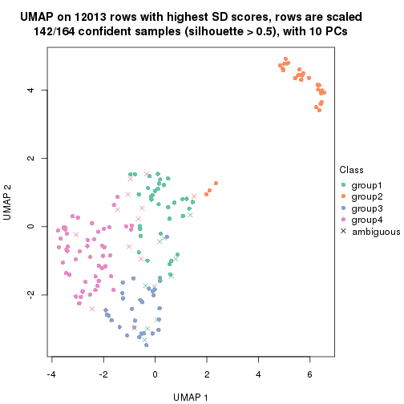</p>

</div>
<div id='tab-SD-kmeans-dimension-reduction-4'>
<pre><code class="r">dimension_reduction(res, k = 5, method = &quot;UMAP&quot;)
</code></pre>

<p>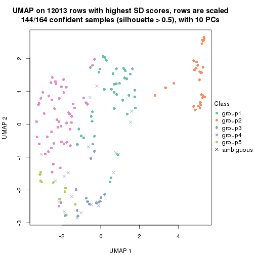</p>

</div>
<div id='tab-SD-kmeans-dimension-reduction-5'>
<pre><code class="r">dimension_reduction(res, k = 6, method = &quot;UMAP&quot;)
</code></pre>

<p>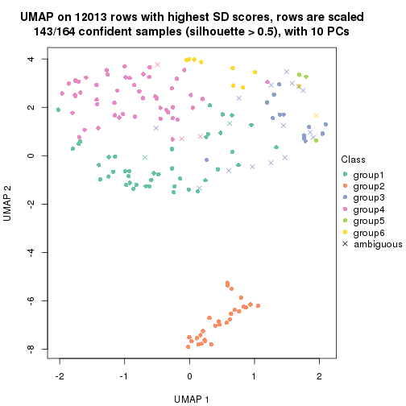</p>

</div>
</div>


Following heatmap shows how subgroups are split when increasing `k`:

```r
collect_classes(res)
```

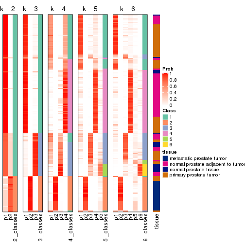


Test correlation between subgroups and known annotations. If the known
annotation is numeric, one-way ANOVA test is applied, and if the known
annotation is discrete, chi-squared contingency table test is applied.

```r
test_to_known_factors(res)
```

```
#>             n tissue(p) k
#> SD:kmeans 164  1.13e-28 2
#> SD:kmeans 162  2.03e-32 3
#> SD:kmeans 142  2.48e-34 4
#> SD:kmeans 144  1.64e-37 5
#> SD:kmeans 143  5.24e-35 6
```


If matrix rows can be associated to genes, consider to use `functional_enrichment(res,
...)` to perform function enrichment for the signature genes. See [this vignette](http://bioconductor.org/packages/devel/bioc/vignettes/cola/inst/doc/functional_enrichment.html) for more detailed explanations.


 

---------------------------------------------------


### SD:skmeans


The object with results only for a single top-value method and a single partition method 
can be extracted as:

```r
res = res_list["SD", "skmeans"]
# you can also extract it by
# res = res_list["SD:skmeans"]
```

A summary of `res` and all the functions that can be applied to it:

```r
res
```

```
#> A 'ConsensusPartition' object with k = 2, 3, 4, 5, 6.
#>   On a matrix with 12013 rows and 164 columns.
#>   Top rows (1000, 2000, 3000, 4000, 5000) are extracted by 'SD' method.
#>   Subgroups are detected by 'skmeans' method.
#>   Performed in total 1250 partitions by row resampling.
#>   Best k for subgroups seems to be 3.
#> 
#> Following methods can be applied to this 'ConsensusPartition' object:
#>  [1] "cola_report"             "collect_classes"         "collect_plots"          
#>  [4] "collect_stats"           "colnames"                "compare_signatures"     
#>  [7] "consensus_heatmap"       "dimension_reduction"     "functional_enrichment"  
#> [10] "get_anno_col"            "get_anno"                "get_classes"            
#> [13] "get_consensus"           "get_matrix"              "get_membership"         
#> [16] "get_param"               "get_signatures"          "get_stats"              
#> [19] "is_best_k"               "is_stable_k"             "membership_heatmap"     
#> [22] "ncol"                    "nrow"                    "plot_ecdf"              
#> [25] "rownames"                "select_partition_number" "show"                   
#> [28] "suggest_best_k"          "test_to_known_factors"
```

`collect_plots()` function collects all the plots made from `res` for all `k` (number of partitions)
into one single page to provide an easy and fast comparison between different `k`.

```r
collect_plots(res)
```

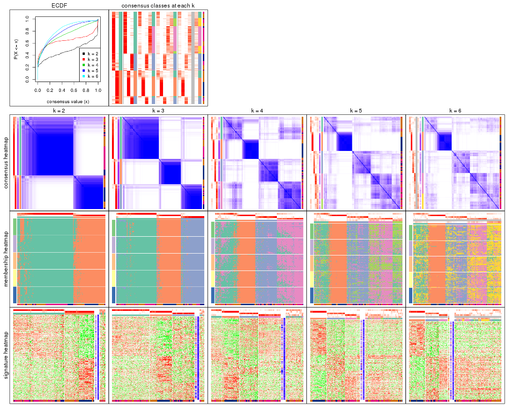

The plots are:

- The first row: a plot of the ECDF (empirical cumulative distribution
  function) curves of the consensus matrix for each `k` and the heatmap of
  predicted classes for each `k`.
- The second row: heatmaps of the consensus matrix for each `k`.
- The third row: heatmaps of the membership matrix for each `k`.
- The fouth row: heatmaps of the signatures for each `k`.

All the plots in panels can be made by individual functions and they are
plotted later in this section.

`select_partition_number()` produces several plots showing different
statistics for choosing "optimized" `k`. There are following statistics:

- ECDF curves of the consensus matrix for each `k`;
- 1-PAC. [The PAC
  score](https://en.wikipedia.org/wiki/Consensus_clustering#Over-interpretation_potential_of_consensus_clustering)
  measures the proportion of the ambiguous subgrouping.
- Mean silhouette score.
- Concordance. The mean probability of fiting the consensus class ids in all
  partitions.
- Area increased. Denote $A_k$ as the area under the ECDF curve for current
  `k`, the area increased is defined as $A_k - A_{k-1}$.
- Rand index. The percent of pairs of samples that are both in a same cluster
  or both are not in a same cluster in the partition of k and k-1.
- Jaccard index. The ratio of pairs of samples are both in a same cluster in
  the partition of k and k-1 and the pairs of samples are both in a same
  cluster in the partition k or k-1.

The detailed explanations of these statistics can be found in [the _cola_
vignette](http://bioconductor.org/packages/devel/bioc/vignettes/cola/inst/doc/cola.html#toc_13).

Generally speaking, lower PAC score, higher mean silhouette score or higher
concordance corresponds to better partition. Rand index and Jaccard index
measure how similar the current partition is compared to partition with `k-1`.
If they are too similar, we won't accept `k` is better than `k-1`.

```r
select_partition_number(res)
```

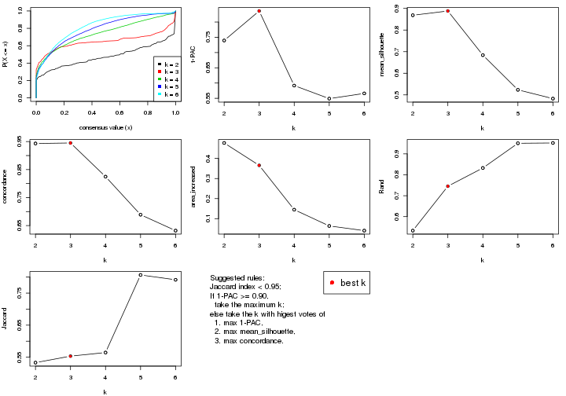

The numeric values for all these statistics can be obtained by `get_stats()`.

```r
get_stats(res)
```

```
#>   k 1-PAC mean_silhouette concordance area_increased  Rand Jaccard
#> 2 2 0.740           0.868       0.943         0.4771 0.533   0.533
#> 3 3 0.836           0.888       0.945         0.3655 0.745   0.553
#> 4 4 0.592           0.684       0.825         0.1447 0.833   0.565
#> 5 5 0.549           0.523       0.689         0.0637 0.951   0.807
#> 6 6 0.566           0.483       0.632         0.0404 0.952   0.792
```

`suggest_best_k()` suggests the best $k$ based on these statistics. The rules are as follows:

- All $k$ with Jaccard index larger than 0.95 are removed because increasing
  $k$ does not provide enough extra information. If all $k$ are removed, it is
  marked as no subgroup is detected.
- For all $k$ with 1-PAC score larger than 0.9, the maximal $k$ is taken as
  the best $k$, and other $k$ are marked as optional $k$.
- If it does not fit the second rule. The $k$ with the maximal vote of the
  highest 1-PAC score, highest mean silhouette, and highest concordance is
  taken as the best $k$.

```r
suggest_best_k(res)
```

```
#> [1] 3
```


Following shows the table of the partitions (You need to click the **show/hide
code output** link to see it). The membership matrix (columns with name `p*`)
is inferred by
[`clue::cl_consensus()`](https://www.rdocumentation.org/link/cl_consensus?package=clue)
function with the `SE` method. Basically the value in the membership matrix
represents the probability to belong to a certain group. The finall class
label for an item is determined with the group with highest probability it
belongs to.

In `get_classes()` function, the entropy is calculated from the membership
matrix and the silhouette score is calculated from the consensus matrix.


<script>
$( function() {
	$( '#tabs-SD-skmeans-get-classes' ).tabs();
} );
</script>
<div id='tabs-SD-skmeans-get-classes'>
<ul>
<li><a href='#tab-SD-skmeans-get-classes-1'>k = 2</a></li>
<li><a href='#tab-SD-skmeans-get-classes-2'>k = 3</a></li>
<li><a href='#tab-SD-skmeans-get-classes-3'>k = 4</a></li>
<li><a href='#tab-SD-skmeans-get-classes-4'>k = 5</a></li>
<li><a href='#tab-SD-skmeans-get-classes-5'>k = 6</a></li>
</ul>

<div id='tab-SD-skmeans-get-classes-1'>
<p><a id='tab-SD-skmeans-get-classes-1-a' style='color:#0366d6' href='#'>show/hide code output</a></p>
<pre><code class="r">cbind(get_classes(res, k = 2), get_membership(res, k = 2))
</code></pre>

<pre><code>#&gt;           class entropy silhouette    p1    p2
#&gt; GSM152839     1  0.0000     0.9333 1.000 0.000
#&gt; GSM152840     1  0.0000     0.9333 1.000 0.000
#&gt; GSM152841     1  0.0000     0.9333 1.000 0.000
#&gt; GSM152842     1  0.1633     0.9198 0.976 0.024
#&gt; GSM152843     1  0.0000     0.9333 1.000 0.000
#&gt; GSM152844     1  0.0376     0.9311 0.996 0.004
#&gt; GSM152845     2  0.0000     0.9449 0.000 1.000
#&gt; GSM152846     1  0.6343     0.7983 0.840 0.160
#&gt; GSM152847     1  0.0000     0.9333 1.000 0.000
#&gt; GSM152848     1  0.0000     0.9333 1.000 0.000
#&gt; GSM152849     1  0.0000     0.9333 1.000 0.000
#&gt; GSM152850     1  0.2423     0.9096 0.960 0.040
#&gt; GSM152851     1  0.0000     0.9333 1.000 0.000
#&gt; GSM152852     1  0.5842     0.8199 0.860 0.140
#&gt; GSM152853     1  0.0000     0.9333 1.000 0.000
#&gt; GSM152854     1  0.6801     0.7732 0.820 0.180
#&gt; GSM152855     1  0.0000     0.9333 1.000 0.000
#&gt; GSM153238     2  0.0376     0.9430 0.004 0.996
#&gt; GSM153239     1  0.0000     0.9333 1.000 0.000
#&gt; GSM153240     1  0.0000     0.9333 1.000 0.000
#&gt; GSM153241     1  0.0000     0.9333 1.000 0.000
#&gt; GSM153242     1  0.9909     0.2130 0.556 0.444
#&gt; GSM153243     2  0.0000     0.9449 0.000 1.000
#&gt; GSM153244     1  0.3584     0.8885 0.932 0.068
#&gt; GSM153245     1  0.0000     0.9333 1.000 0.000
#&gt; GSM153246     1  0.9983     0.0959 0.524 0.476
#&gt; GSM153247     1  0.9710     0.3476 0.600 0.400
#&gt; GSM153248     2  0.9970     0.0776 0.468 0.532
#&gt; GSM153249     1  0.0000     0.9333 1.000 0.000
#&gt; GSM153250     1  0.0000     0.9333 1.000 0.000
#&gt; GSM153251     2  0.9491     0.4179 0.368 0.632
#&gt; GSM153252     1  0.0000     0.9333 1.000 0.000
#&gt; GSM153253     1  0.0000     0.9333 1.000 0.000
#&gt; GSM153254     1  0.6801     0.7738 0.820 0.180
#&gt; GSM153255     1  0.0000     0.9333 1.000 0.000
#&gt; GSM153256     1  0.0000     0.9333 1.000 0.000
#&gt; GSM153257     1  0.0000     0.9333 1.000 0.000
#&gt; GSM153258     1  0.0376     0.9312 0.996 0.004
#&gt; GSM153259     1  0.7883     0.6917 0.764 0.236
#&gt; GSM153260     2  0.6343     0.7931 0.160 0.840
#&gt; GSM153261     2  0.9460     0.4303 0.364 0.636
#&gt; GSM153262     1  0.0000     0.9333 1.000 0.000
#&gt; GSM153263     1  0.0000     0.9333 1.000 0.000
#&gt; GSM153264     1  0.0376     0.9311 0.996 0.004
#&gt; GSM153265     1  0.0000     0.9333 1.000 0.000
#&gt; GSM153266     1  0.0000     0.9333 1.000 0.000
#&gt; GSM153267     1  0.0000     0.9333 1.000 0.000
#&gt; GSM153268     1  0.0000     0.9333 1.000 0.000
#&gt; GSM153269     1  0.0000     0.9333 1.000 0.000
#&gt; GSM153270     1  0.0000     0.9333 1.000 0.000
#&gt; GSM153271     1  0.0000     0.9333 1.000 0.000
#&gt; GSM153272     1  0.0000     0.9333 1.000 0.000
#&gt; GSM153273     1  0.8608     0.6145 0.716 0.284
#&gt; GSM153274     1  0.0000     0.9333 1.000 0.000
#&gt; GSM153275     1  0.0000     0.9333 1.000 0.000
#&gt; GSM153276     1  0.0000     0.9333 1.000 0.000
#&gt; GSM153277     1  0.0000     0.9333 1.000 0.000
#&gt; GSM153278     1  0.1414     0.9225 0.980 0.020
#&gt; GSM153279     1  0.0000     0.9333 1.000 0.000
#&gt; GSM153280     1  0.0000     0.9333 1.000 0.000
#&gt; GSM153281     1  0.0000     0.9333 1.000 0.000
#&gt; GSM153282     1  0.0000     0.9333 1.000 0.000
#&gt; GSM153283     1  0.0000     0.9333 1.000 0.000
#&gt; GSM153284     1  0.0000     0.9333 1.000 0.000
#&gt; GSM153285     1  0.0000     0.9333 1.000 0.000
#&gt; GSM153286     1  0.0000     0.9333 1.000 0.000
#&gt; GSM153287     1  0.0000     0.9333 1.000 0.000
#&gt; GSM153288     1  0.0000     0.9333 1.000 0.000
#&gt; GSM153289     1  0.0000     0.9333 1.000 0.000
#&gt; GSM153290     1  0.0000     0.9333 1.000 0.000
#&gt; GSM153291     1  0.0000     0.9333 1.000 0.000
#&gt; GSM153292     1  0.0000     0.9333 1.000 0.000
#&gt; GSM153293     1  0.0000     0.9333 1.000 0.000
#&gt; GSM153294     1  0.8713     0.6061 0.708 0.292
#&gt; GSM153295     1  0.0000     0.9333 1.000 0.000
#&gt; GSM153054     1  0.8499     0.6320 0.724 0.276
#&gt; GSM153055     1  0.0000     0.9333 1.000 0.000
#&gt; GSM153056     1  0.0000     0.9333 1.000 0.000
#&gt; GSM153057     1  0.9491     0.4349 0.632 0.368
#&gt; GSM153058     1  0.8909     0.5657 0.692 0.308
#&gt; GSM153059     2  0.4690     0.8645 0.100 0.900
#&gt; GSM153060     1  0.9393     0.4629 0.644 0.356
#&gt; GSM153061     2  0.4298     0.8793 0.088 0.912
#&gt; GSM153062     2  0.2043     0.9257 0.032 0.968
#&gt; GSM153063     1  0.6438     0.7922 0.836 0.164
#&gt; GSM153064     1  0.4562     0.8610 0.904 0.096
#&gt; GSM153065     2  0.0000     0.9449 0.000 1.000
#&gt; GSM153066     2  0.0000     0.9449 0.000 1.000
#&gt; GSM153067     1  0.0000     0.9333 1.000 0.000
#&gt; GSM153068     2  0.8267     0.6436 0.260 0.740
#&gt; GSM153069     1  0.0000     0.9333 1.000 0.000
#&gt; GSM153070     1  0.0000     0.9333 1.000 0.000
#&gt; GSM153071     1  0.3879     0.8828 0.924 0.076
#&gt; GSM153072     2  0.6712     0.7827 0.176 0.824
#&gt; GSM153073     1  0.0000     0.9333 1.000 0.000
#&gt; GSM153074     1  0.0000     0.9333 1.000 0.000
#&gt; GSM153075     1  0.0000     0.9333 1.000 0.000
#&gt; GSM153076     1  0.0000     0.9333 1.000 0.000
#&gt; GSM153077     1  0.3431     0.8912 0.936 0.064
#&gt; GSM153078     1  0.3584     0.8901 0.932 0.068
#&gt; GSM153079     2  0.2948     0.9102 0.052 0.948
#&gt; GSM153080     1  0.0000     0.9333 1.000 0.000
#&gt; GSM153081     1  0.0000     0.9333 1.000 0.000
#&gt; GSM153082     2  0.0376     0.9430 0.004 0.996
#&gt; GSM153083     2  0.0000     0.9449 0.000 1.000
#&gt; GSM153084     2  0.0000     0.9449 0.000 1.000
#&gt; GSM153085     2  0.3431     0.9033 0.064 0.936
#&gt; GSM153086     2  0.0938     0.9391 0.012 0.988
#&gt; GSM153087     1  0.0000     0.9333 1.000 0.000
#&gt; GSM153088     1  0.0000     0.9333 1.000 0.000
#&gt; GSM153089     2  0.9866     0.2317 0.432 0.568
#&gt; GSM153090     1  0.0000     0.9333 1.000 0.000
#&gt; GSM153091     2  0.3879     0.8891 0.076 0.924
#&gt; GSM153092     1  0.3274     0.8965 0.940 0.060
#&gt; GSM153093     1  0.0000     0.9333 1.000 0.000
#&gt; GSM153094     2  0.0672     0.9411 0.008 0.992
#&gt; GSM153095     2  0.5842     0.8205 0.140 0.860
#&gt; GSM153096     1  0.9522     0.4337 0.628 0.372
#&gt; GSM153097     2  0.1184     0.9365 0.016 0.984
#&gt; GSM153098     1  0.8443     0.6363 0.728 0.272
#&gt; GSM153099     1  0.0000     0.9333 1.000 0.000
#&gt; GSM153100     1  0.2948     0.9009 0.948 0.052
#&gt; GSM153101     2  0.4815     0.8645 0.104 0.896
#&gt; GSM153102     2  0.0000     0.9449 0.000 1.000
#&gt; GSM153103     2  0.2236     0.9227 0.036 0.964
#&gt; GSM153104     1  0.0000     0.9333 1.000 0.000
#&gt; GSM153106     1  0.5737     0.8280 0.864 0.136
#&gt; GSM153107     1  0.3114     0.8990 0.944 0.056
#&gt; GSM153108     1  0.0672     0.9290 0.992 0.008
#&gt; GSM153109     2  0.0000     0.9449 0.000 1.000
#&gt; GSM153110     1  0.9732     0.3533 0.596 0.404
#&gt; GSM153111     2  0.0672     0.9411 0.008 0.992
#&gt; GSM153112     1  0.8207     0.6618 0.744 0.256
#&gt; GSM153113     2  0.0000     0.9449 0.000 1.000
#&gt; GSM153114     1  0.0000     0.9333 1.000 0.000
#&gt; GSM187532     2  0.0000     0.9449 0.000 1.000
#&gt; GSM187533     2  0.0000     0.9449 0.000 1.000
#&gt; GSM187534     2  0.0000     0.9449 0.000 1.000
#&gt; GSM187535     2  0.0000     0.9449 0.000 1.000
#&gt; GSM152906     2  0.0000     0.9449 0.000 1.000
#&gt; GSM152907     2  0.0000     0.9449 0.000 1.000
#&gt; GSM152908     2  0.0000     0.9449 0.000 1.000
#&gt; GSM152909     2  0.0000     0.9449 0.000 1.000
#&gt; GSM152910     2  0.0000     0.9449 0.000 1.000
#&gt; GSM152911     2  0.0000     0.9449 0.000 1.000
#&gt; GSM152912     2  0.0000     0.9449 0.000 1.000
#&gt; GSM152913     2  0.0000     0.9449 0.000 1.000
#&gt; GSM152914     2  0.0000     0.9449 0.000 1.000
#&gt; GSM152915     2  0.0000     0.9449 0.000 1.000
#&gt; GSM152916     2  0.0000     0.9449 0.000 1.000
#&gt; GSM152917     2  0.0000     0.9449 0.000 1.000
#&gt; GSM152918     2  0.0000     0.9449 0.000 1.000
#&gt; GSM152919     2  0.0000     0.9449 0.000 1.000
#&gt; GSM152920     2  0.0000     0.9449 0.000 1.000
#&gt; GSM152921     2  0.0000     0.9449 0.000 1.000
#&gt; GSM152922     2  0.0000     0.9449 0.000 1.000
#&gt; GSM152923     2  0.0000     0.9449 0.000 1.000
#&gt; GSM152924     2  0.0000     0.9449 0.000 1.000
#&gt; GSM152925     2  0.0000     0.9449 0.000 1.000
#&gt; GSM152926     2  0.0000     0.9449 0.000 1.000
#&gt; GSM152927     2  0.0000     0.9449 0.000 1.000
#&gt; GSM152928     2  0.0000     0.9449 0.000 1.000
#&gt; GSM152929     2  0.0000     0.9449 0.000 1.000
#&gt; GSM152930     2  0.0000     0.9449 0.000 1.000
</code></pre>

<script>
$('#tab-SD-skmeans-get-classes-1-a').parent().next().next().hide();
$('#tab-SD-skmeans-get-classes-1-a').click(function(){
  $('#tab-SD-skmeans-get-classes-1-a').parent().next().next().toggle();
  return(false);
});
</script>
</div>

<div id='tab-SD-skmeans-get-classes-2'>
<p><a id='tab-SD-skmeans-get-classes-2-a' style='color:#0366d6' href='#'>show/hide code output</a></p>
<pre><code class="r">cbind(get_classes(res, k = 3), get_membership(res, k = 3))
</code></pre>

<pre><code>#&gt;           class entropy silhouette    p1    p2    p3
#&gt; GSM152839     3  0.4291     0.7776 0.180 0.000 0.820
#&gt; GSM152840     3  0.0592     0.9349 0.012 0.000 0.988
#&gt; GSM152841     1  0.2537     0.9024 0.920 0.000 0.080
#&gt; GSM152842     3  0.0000     0.9398 0.000 0.000 1.000
#&gt; GSM152843     3  0.0424     0.9370 0.008 0.000 0.992
#&gt; GSM152844     3  0.0000     0.9398 0.000 0.000 1.000
#&gt; GSM152845     3  0.0237     0.9380 0.000 0.004 0.996
#&gt; GSM152846     3  0.0000     0.9398 0.000 0.000 1.000
#&gt; GSM152847     3  0.0000     0.9398 0.000 0.000 1.000
#&gt; GSM152848     1  0.5178     0.6680 0.744 0.000 0.256
#&gt; GSM152849     3  0.0000     0.9398 0.000 0.000 1.000
#&gt; GSM152850     3  0.0892     0.9302 0.020 0.000 0.980
#&gt; GSM152851     3  0.3752     0.8221 0.144 0.000 0.856
#&gt; GSM152852     3  0.0000     0.9398 0.000 0.000 1.000
#&gt; GSM152853     3  0.0000     0.9398 0.000 0.000 1.000
#&gt; GSM152854     3  0.0000     0.9398 0.000 0.000 1.000
#&gt; GSM152855     1  0.0000     0.9381 1.000 0.000 0.000
#&gt; GSM153238     3  0.0592     0.9345 0.000 0.012 0.988
#&gt; GSM153239     3  0.0237     0.9385 0.004 0.000 0.996
#&gt; GSM153240     1  0.0237     0.9373 0.996 0.000 0.004
#&gt; GSM153241     3  0.0000     0.9398 0.000 0.000 1.000
#&gt; GSM153242     3  0.0000     0.9398 0.000 0.000 1.000
#&gt; GSM153243     3  0.2165     0.8959 0.000 0.064 0.936
#&gt; GSM153244     1  0.7074     0.0559 0.500 0.020 0.480
#&gt; GSM153245     3  0.0000     0.9398 0.000 0.000 1.000
#&gt; GSM153246     3  0.0000     0.9398 0.000 0.000 1.000
#&gt; GSM153247     3  0.1129     0.9303 0.020 0.004 0.976
#&gt; GSM153248     1  0.4062     0.8024 0.836 0.164 0.000
#&gt; GSM153249     1  0.0000     0.9381 1.000 0.000 0.000
#&gt; GSM153250     1  0.0000     0.9381 1.000 0.000 0.000
#&gt; GSM153251     3  0.0000     0.9398 0.000 0.000 1.000
#&gt; GSM153252     1  0.0000     0.9381 1.000 0.000 0.000
#&gt; GSM153253     1  0.2448     0.9064 0.924 0.000 0.076
#&gt; GSM153254     3  0.4174     0.8543 0.092 0.036 0.872
#&gt; GSM153255     1  0.0000     0.9381 1.000 0.000 0.000
#&gt; GSM153256     1  0.0000     0.9381 1.000 0.000 0.000
#&gt; GSM153257     1  0.0000     0.9381 1.000 0.000 0.000
#&gt; GSM153258     1  0.0237     0.9377 0.996 0.000 0.004
#&gt; GSM153259     1  0.2356     0.8990 0.928 0.072 0.000
#&gt; GSM153260     3  0.0892     0.9300 0.000 0.020 0.980
#&gt; GSM153261     3  0.0000     0.9398 0.000 0.000 1.000
#&gt; GSM153262     1  0.1529     0.9265 0.960 0.000 0.040
#&gt; GSM153263     1  0.0000     0.9381 1.000 0.000 0.000
#&gt; GSM153264     1  0.2711     0.8913 0.912 0.000 0.088
#&gt; GSM153265     1  0.2625     0.9006 0.916 0.000 0.084
#&gt; GSM153266     1  0.3340     0.8611 0.880 0.000 0.120
#&gt; GSM153267     1  0.0000     0.9381 1.000 0.000 0.000
#&gt; GSM153268     1  0.6062     0.4165 0.616 0.000 0.384
#&gt; GSM153269     1  0.0000     0.9381 1.000 0.000 0.000
#&gt; GSM153270     1  0.3192     0.8715 0.888 0.000 0.112
#&gt; GSM153271     1  0.0000     0.9381 1.000 0.000 0.000
#&gt; GSM153272     1  0.0000     0.9381 1.000 0.000 0.000
#&gt; GSM153273     1  0.4033     0.8312 0.856 0.136 0.008
#&gt; GSM153274     1  0.0592     0.9362 0.988 0.000 0.012
#&gt; GSM153275     1  0.0000     0.9381 1.000 0.000 0.000
#&gt; GSM153276     1  0.0747     0.9353 0.984 0.000 0.016
#&gt; GSM153277     1  0.1529     0.9271 0.960 0.000 0.040
#&gt; GSM153278     3  0.0000     0.9398 0.000 0.000 1.000
#&gt; GSM153279     1  0.6168     0.3318 0.588 0.000 0.412
#&gt; GSM153280     1  0.2356     0.9098 0.928 0.000 0.072
#&gt; GSM153281     1  0.1411     0.9281 0.964 0.000 0.036
#&gt; GSM153282     1  0.2796     0.8939 0.908 0.000 0.092
#&gt; GSM153283     1  0.0000     0.9381 1.000 0.000 0.000
#&gt; GSM153284     1  0.0000     0.9381 1.000 0.000 0.000
#&gt; GSM153285     1  0.2711     0.8968 0.912 0.000 0.088
#&gt; GSM153286     1  0.0000     0.9381 1.000 0.000 0.000
#&gt; GSM153287     1  0.0000     0.9381 1.000 0.000 0.000
#&gt; GSM153288     1  0.0000     0.9381 1.000 0.000 0.000
#&gt; GSM153289     1  0.0000     0.9381 1.000 0.000 0.000
#&gt; GSM153290     1  0.2796     0.8945 0.908 0.000 0.092
#&gt; GSM153291     1  0.0000     0.9381 1.000 0.000 0.000
#&gt; GSM153292     1  0.0237     0.9373 0.996 0.000 0.004
#&gt; GSM153293     1  0.0000     0.9381 1.000 0.000 0.000
#&gt; GSM153294     1  0.1753     0.9173 0.952 0.048 0.000
#&gt; GSM153295     1  0.0000     0.9381 1.000 0.000 0.000
#&gt; GSM153054     3  0.7959     0.5305 0.288 0.092 0.620
#&gt; GSM153055     1  0.2165     0.9130 0.936 0.000 0.064
#&gt; GSM153056     3  0.0592     0.9350 0.012 0.000 0.988
#&gt; GSM153057     3  0.2383     0.9080 0.044 0.016 0.940
#&gt; GSM153058     3  0.0000     0.9398 0.000 0.000 1.000
#&gt; GSM153059     3  0.2165     0.8973 0.000 0.064 0.936
#&gt; GSM153060     3  0.0000     0.9398 0.000 0.000 1.000
#&gt; GSM153061     3  0.0000     0.9398 0.000 0.000 1.000
#&gt; GSM153062     3  0.0000     0.9398 0.000 0.000 1.000
#&gt; GSM153063     3  0.0000     0.9398 0.000 0.000 1.000
#&gt; GSM153064     1  0.0237     0.9372 0.996 0.004 0.000
#&gt; GSM153065     3  0.2066     0.8996 0.000 0.060 0.940
#&gt; GSM153066     2  0.0747     0.9409 0.000 0.984 0.016
#&gt; GSM153067     1  0.0000     0.9381 1.000 0.000 0.000
#&gt; GSM153068     3  0.0000     0.9398 0.000 0.000 1.000
#&gt; GSM153069     1  0.0000     0.9381 1.000 0.000 0.000
#&gt; GSM153070     1  0.1031     0.9325 0.976 0.000 0.024
#&gt; GSM153071     3  0.5070     0.7170 0.224 0.004 0.772
#&gt; GSM153072     3  0.8607     0.4878 0.152 0.256 0.592
#&gt; GSM153073     1  0.0000     0.9381 1.000 0.000 0.000
#&gt; GSM153074     1  0.0000     0.9381 1.000 0.000 0.000
#&gt; GSM153075     1  0.1860     0.9215 0.948 0.000 0.052
#&gt; GSM153076     1  0.0000     0.9381 1.000 0.000 0.000
#&gt; GSM153077     1  0.4342     0.8438 0.856 0.024 0.120
#&gt; GSM153078     3  0.5378     0.6969 0.236 0.008 0.756
#&gt; GSM153079     2  0.6915     0.7036 0.140 0.736 0.124
#&gt; GSM153080     3  0.0000     0.9398 0.000 0.000 1.000
#&gt; GSM153081     1  0.3879     0.8228 0.848 0.000 0.152
#&gt; GSM153082     2  0.0892     0.9383 0.020 0.980 0.000
#&gt; GSM153083     2  0.0000     0.9518 0.000 1.000 0.000
#&gt; GSM153084     2  0.0000     0.9518 0.000 1.000 0.000
#&gt; GSM153085     2  0.8464     0.4699 0.132 0.596 0.272
#&gt; GSM153086     2  0.2116     0.9177 0.040 0.948 0.012
#&gt; GSM153087     1  0.1529     0.9270 0.960 0.000 0.040
#&gt; GSM153088     1  0.0000     0.9381 1.000 0.000 0.000
#&gt; GSM153089     3  0.0000     0.9398 0.000 0.000 1.000
#&gt; GSM153090     1  0.0000     0.9381 1.000 0.000 0.000
#&gt; GSM153091     2  0.4062     0.7900 0.164 0.836 0.000
#&gt; GSM153092     1  0.2173     0.9149 0.944 0.048 0.008
#&gt; GSM153093     1  0.0000     0.9381 1.000 0.000 0.000
#&gt; GSM153094     2  0.1643     0.9194 0.044 0.956 0.000
#&gt; GSM153095     2  0.8212     0.4561 0.104 0.600 0.296
#&gt; GSM153096     1  0.4351     0.7948 0.828 0.168 0.004
#&gt; GSM153097     2  0.1964     0.9085 0.056 0.944 0.000
#&gt; GSM153098     1  0.2261     0.9029 0.932 0.068 0.000
#&gt; GSM153099     1  0.0000     0.9381 1.000 0.000 0.000
#&gt; GSM153100     1  0.0237     0.9372 0.996 0.004 0.000
#&gt; GSM153101     3  0.8464     0.4687 0.128 0.280 0.592
#&gt; GSM153102     2  0.6673     0.6580 0.056 0.720 0.224
#&gt; GSM153103     2  0.7425     0.4611 0.052 0.620 0.328
#&gt; GSM153104     1  0.2066     0.9171 0.940 0.000 0.060
#&gt; GSM153106     1  0.0747     0.9337 0.984 0.016 0.000
#&gt; GSM153107     1  0.0424     0.9364 0.992 0.008 0.000
#&gt; GSM153108     1  0.2400     0.9115 0.932 0.004 0.064
#&gt; GSM153109     2  0.0000     0.9518 0.000 1.000 0.000
#&gt; GSM153110     1  0.7209     0.3917 0.604 0.360 0.036
#&gt; GSM153111     2  0.1860     0.9125 0.052 0.948 0.000
#&gt; GSM153112     1  0.1411     0.9237 0.964 0.036 0.000
#&gt; GSM153113     2  0.0000     0.9518 0.000 1.000 0.000
#&gt; GSM153114     1  0.0000     0.9381 1.000 0.000 0.000
#&gt; GSM187532     2  0.0000     0.9518 0.000 1.000 0.000
#&gt; GSM187533     2  0.0000     0.9518 0.000 1.000 0.000
#&gt; GSM187534     2  0.0000     0.9518 0.000 1.000 0.000
#&gt; GSM187535     2  0.0000     0.9518 0.000 1.000 0.000
#&gt; GSM152906     2  0.0000     0.9518 0.000 1.000 0.000
#&gt; GSM152907     2  0.0000     0.9518 0.000 1.000 0.000
#&gt; GSM152908     2  0.0000     0.9518 0.000 1.000 0.000
#&gt; GSM152909     2  0.0000     0.9518 0.000 1.000 0.000
#&gt; GSM152910     2  0.0000     0.9518 0.000 1.000 0.000
#&gt; GSM152911     2  0.0000     0.9518 0.000 1.000 0.000
#&gt; GSM152912     2  0.0000     0.9518 0.000 1.000 0.000
#&gt; GSM152913     2  0.0000     0.9518 0.000 1.000 0.000
#&gt; GSM152914     2  0.0000     0.9518 0.000 1.000 0.000
#&gt; GSM152915     2  0.0000     0.9518 0.000 1.000 0.000
#&gt; GSM152916     2  0.0000     0.9518 0.000 1.000 0.000
#&gt; GSM152917     2  0.0000     0.9518 0.000 1.000 0.000
#&gt; GSM152918     2  0.0000     0.9518 0.000 1.000 0.000
#&gt; GSM152919     2  0.0000     0.9518 0.000 1.000 0.000
#&gt; GSM152920     2  0.0000     0.9518 0.000 1.000 0.000
#&gt; GSM152921     2  0.0000     0.9518 0.000 1.000 0.000
#&gt; GSM152922     2  0.0000     0.9518 0.000 1.000 0.000
#&gt; GSM152923     2  0.0000     0.9518 0.000 1.000 0.000
#&gt; GSM152924     2  0.0000     0.9518 0.000 1.000 0.000
#&gt; GSM152925     2  0.0000     0.9518 0.000 1.000 0.000
#&gt; GSM152926     2  0.0000     0.9518 0.000 1.000 0.000
#&gt; GSM152927     2  0.0000     0.9518 0.000 1.000 0.000
#&gt; GSM152928     2  0.0000     0.9518 0.000 1.000 0.000
#&gt; GSM152929     2  0.0000     0.9518 0.000 1.000 0.000
#&gt; GSM152930     2  0.0000     0.9518 0.000 1.000 0.000
</code></pre>

<script>
$('#tab-SD-skmeans-get-classes-2-a').parent().next().next().hide();
$('#tab-SD-skmeans-get-classes-2-a').click(function(){
  $('#tab-SD-skmeans-get-classes-2-a').parent().next().next().toggle();
  return(false);
});
</script>
</div>

<div id='tab-SD-skmeans-get-classes-3'>
<p><a id='tab-SD-skmeans-get-classes-3-a' style='color:#0366d6' href='#'>show/hide code output</a></p>
<pre><code class="r">cbind(get_classes(res, k = 4), get_membership(res, k = 4))
</code></pre>

<pre><code>#&gt;           class entropy silhouette    p1    p2    p3    p4
#&gt; GSM152839     3  0.6871     0.4449 0.240 0.000 0.592 0.168
#&gt; GSM152840     3  0.4372     0.6929 0.004 0.000 0.728 0.268
#&gt; GSM152841     4  0.1305     0.7580 0.004 0.000 0.036 0.960
#&gt; GSM152842     3  0.0707     0.8617 0.020 0.000 0.980 0.000
#&gt; GSM152843     3  0.3732     0.8175 0.092 0.000 0.852 0.056
#&gt; GSM152844     3  0.2197     0.8544 0.004 0.000 0.916 0.080
#&gt; GSM152845     3  0.1139     0.8635 0.008 0.012 0.972 0.008
#&gt; GSM152846     3  0.1824     0.8597 0.004 0.000 0.936 0.060
#&gt; GSM152847     3  0.1978     0.8499 0.068 0.000 0.928 0.004
#&gt; GSM152848     1  0.6916     0.4663 0.588 0.000 0.176 0.236
#&gt; GSM152849     3  0.1109     0.8620 0.028 0.000 0.968 0.004
#&gt; GSM152850     3  0.4399     0.7168 0.212 0.000 0.768 0.020
#&gt; GSM152851     4  0.5097     0.1138 0.004 0.000 0.428 0.568
#&gt; GSM152852     3  0.1867     0.8584 0.000 0.000 0.928 0.072
#&gt; GSM152853     3  0.3355     0.8094 0.004 0.000 0.836 0.160
#&gt; GSM152854     3  0.0779     0.8633 0.004 0.000 0.980 0.016
#&gt; GSM152855     4  0.4040     0.6851 0.248 0.000 0.000 0.752
#&gt; GSM153238     3  0.3495     0.8037 0.140 0.016 0.844 0.000
#&gt; GSM153239     3  0.3257     0.8158 0.004 0.000 0.844 0.152
#&gt; GSM153240     4  0.2799     0.7731 0.108 0.000 0.008 0.884
#&gt; GSM153241     3  0.1059     0.8655 0.016 0.000 0.972 0.012
#&gt; GSM153242     3  0.1635     0.8634 0.008 0.000 0.948 0.044
#&gt; GSM153243     3  0.3320     0.8227 0.056 0.068 0.876 0.000
#&gt; GSM153244     4  0.6629     0.4824 0.076 0.028 0.244 0.652
#&gt; GSM153245     3  0.2773     0.8395 0.004 0.000 0.880 0.116
#&gt; GSM153246     3  0.0000     0.8610 0.000 0.000 1.000 0.000
#&gt; GSM153247     3  0.4521     0.8145 0.092 0.024 0.828 0.056
#&gt; GSM153248     1  0.1743     0.6354 0.940 0.004 0.000 0.056
#&gt; GSM153249     4  0.1109     0.7724 0.028 0.000 0.004 0.968
#&gt; GSM153250     1  0.4941     0.1407 0.564 0.000 0.000 0.436
#&gt; GSM153251     3  0.0895     0.8637 0.004 0.000 0.976 0.020
#&gt; GSM153252     4  0.1890     0.7776 0.056 0.000 0.008 0.936
#&gt; GSM153253     4  0.1356     0.7637 0.008 0.000 0.032 0.960
#&gt; GSM153254     3  0.7696     0.4555 0.084 0.060 0.552 0.304
#&gt; GSM153255     4  0.2149     0.7697 0.088 0.000 0.000 0.912
#&gt; GSM153256     4  0.4697     0.5201 0.356 0.000 0.000 0.644
#&gt; GSM153257     4  0.2944     0.7696 0.128 0.000 0.004 0.868
#&gt; GSM153258     1  0.5105     0.5165 0.696 0.000 0.028 0.276
#&gt; GSM153259     1  0.1489     0.6334 0.952 0.004 0.000 0.044
#&gt; GSM153260     3  0.2928     0.8311 0.108 0.012 0.880 0.000
#&gt; GSM153261     3  0.1118     0.8598 0.036 0.000 0.964 0.000
#&gt; GSM153262     4  0.1406     0.7680 0.016 0.000 0.024 0.960
#&gt; GSM153263     1  0.4977     0.0867 0.540 0.000 0.000 0.460
#&gt; GSM153264     1  0.4257     0.6214 0.812 0.000 0.048 0.140
#&gt; GSM153265     4  0.2053     0.7465 0.004 0.000 0.072 0.924
#&gt; GSM153266     1  0.5766     0.5844 0.704 0.000 0.104 0.192
#&gt; GSM153267     4  0.4522     0.5826 0.320 0.000 0.000 0.680
#&gt; GSM153268     4  0.3088     0.6893 0.008 0.000 0.128 0.864
#&gt; GSM153269     4  0.4898     0.3831 0.416 0.000 0.000 0.584
#&gt; GSM153270     4  0.6815     0.4206 0.284 0.000 0.136 0.580
#&gt; GSM153271     1  0.4992    -0.0325 0.524 0.000 0.000 0.476
#&gt; GSM153272     4  0.3219     0.7484 0.164 0.000 0.000 0.836
#&gt; GSM153273     1  0.2401     0.6369 0.904 0.000 0.004 0.092
#&gt; GSM153274     4  0.5252     0.5368 0.336 0.000 0.020 0.644
#&gt; GSM153275     4  0.4164     0.6605 0.264 0.000 0.000 0.736
#&gt; GSM153276     4  0.5417     0.6284 0.240 0.000 0.056 0.704
#&gt; GSM153277     4  0.3216     0.7636 0.076 0.000 0.044 0.880
#&gt; GSM153278     3  0.3172     0.8009 0.160 0.000 0.840 0.000
#&gt; GSM153279     4  0.4919     0.5803 0.048 0.000 0.200 0.752
#&gt; GSM153280     4  0.1677     0.7555 0.012 0.000 0.040 0.948
#&gt; GSM153281     4  0.1406     0.7704 0.024 0.000 0.016 0.960
#&gt; GSM153282     4  0.1661     0.7504 0.004 0.000 0.052 0.944
#&gt; GSM153283     1  0.4008     0.5423 0.756 0.000 0.000 0.244
#&gt; GSM153284     4  0.3311     0.7404 0.172 0.000 0.000 0.828
#&gt; GSM153285     4  0.1854     0.7562 0.012 0.000 0.048 0.940
#&gt; GSM153286     4  0.4134     0.6673 0.260 0.000 0.000 0.740
#&gt; GSM153287     4  0.0779     0.7688 0.016 0.000 0.004 0.980
#&gt; GSM153288     4  0.3219     0.7498 0.164 0.000 0.000 0.836
#&gt; GSM153289     4  0.4746     0.4759 0.368 0.000 0.000 0.632
#&gt; GSM153290     4  0.1677     0.7567 0.012 0.000 0.040 0.948
#&gt; GSM153291     4  0.1940     0.7729 0.076 0.000 0.000 0.924
#&gt; GSM153292     4  0.0524     0.7678 0.008 0.000 0.004 0.988
#&gt; GSM153293     4  0.4164     0.6621 0.264 0.000 0.000 0.736
#&gt; GSM153294     1  0.4855     0.5522 0.712 0.020 0.000 0.268
#&gt; GSM153295     4  0.4644     0.6919 0.228 0.000 0.024 0.748
#&gt; GSM153054     1  0.6504     0.4374 0.632 0.020 0.284 0.064
#&gt; GSM153055     4  0.6495     0.3744 0.356 0.000 0.084 0.560
#&gt; GSM153056     3  0.3647     0.8269 0.040 0.000 0.852 0.108
#&gt; GSM153057     3  0.6327     0.7003 0.116 0.032 0.712 0.140
#&gt; GSM153058     3  0.0804     0.8638 0.008 0.000 0.980 0.012
#&gt; GSM153059     3  0.5035     0.7507 0.068 0.136 0.784 0.012
#&gt; GSM153060     3  0.0188     0.8616 0.000 0.000 0.996 0.004
#&gt; GSM153061     3  0.0469     0.8596 0.012 0.000 0.988 0.000
#&gt; GSM153062     3  0.0000     0.8610 0.000 0.000 1.000 0.000
#&gt; GSM153063     3  0.1978     0.8615 0.004 0.000 0.928 0.068
#&gt; GSM153064     1  0.2469     0.6317 0.892 0.000 0.000 0.108
#&gt; GSM153065     3  0.3144     0.8242 0.044 0.072 0.884 0.000
#&gt; GSM153066     2  0.2255     0.8805 0.012 0.920 0.068 0.000
#&gt; GSM153067     4  0.2999     0.7672 0.132 0.000 0.004 0.864
#&gt; GSM153068     3  0.0000     0.8610 0.000 0.000 1.000 0.000
#&gt; GSM153069     4  0.0657     0.7692 0.012 0.000 0.004 0.984
#&gt; GSM153070     1  0.6069     0.3397 0.588 0.000 0.056 0.356
#&gt; GSM153071     3  0.7685     0.1068 0.288 0.000 0.456 0.256
#&gt; GSM153072     1  0.7568     0.4320 0.588 0.076 0.264 0.072
#&gt; GSM153073     1  0.4053     0.5681 0.768 0.000 0.004 0.228
#&gt; GSM153074     4  0.2760     0.7648 0.128 0.000 0.000 0.872
#&gt; GSM153075     4  0.4656     0.7350 0.136 0.000 0.072 0.792
#&gt; GSM153076     1  0.4477     0.4483 0.688 0.000 0.000 0.312
#&gt; GSM153077     1  0.4644     0.6249 0.800 0.004 0.064 0.132
#&gt; GSM153078     3  0.7470     0.2394 0.344 0.012 0.508 0.136
#&gt; GSM153079     1  0.5644     0.5557 0.712 0.220 0.060 0.008
#&gt; GSM153080     3  0.3443     0.8184 0.016 0.000 0.848 0.136
#&gt; GSM153081     1  0.4093     0.6321 0.832 0.000 0.072 0.096
#&gt; GSM153082     2  0.5367     0.4945 0.304 0.664 0.000 0.032
#&gt; GSM153083     1  0.4981     0.0415 0.536 0.464 0.000 0.000
#&gt; GSM153084     2  0.2255     0.8898 0.068 0.920 0.012 0.000
#&gt; GSM153085     1  0.9291     0.3261 0.400 0.272 0.228 0.100
#&gt; GSM153086     1  0.4387     0.5508 0.752 0.236 0.012 0.000
#&gt; GSM153087     4  0.4617     0.7150 0.204 0.000 0.032 0.764
#&gt; GSM153088     1  0.4877     0.2053 0.592 0.000 0.000 0.408
#&gt; GSM153089     3  0.2140     0.8639 0.008 0.008 0.932 0.052
#&gt; GSM153090     4  0.4994     0.1697 0.480 0.000 0.000 0.520
#&gt; GSM153091     1  0.3813     0.6217 0.828 0.148 0.000 0.024
#&gt; GSM153092     1  0.5309     0.5215 0.688 0.028 0.004 0.280
#&gt; GSM153093     4  0.2149     0.7740 0.088 0.000 0.000 0.912
#&gt; GSM153094     1  0.4817     0.2941 0.612 0.388 0.000 0.000
#&gt; GSM153095     2  0.9279    -0.0412 0.268 0.404 0.228 0.100
#&gt; GSM153096     1  0.2457     0.6387 0.912 0.008 0.004 0.076
#&gt; GSM153097     1  0.3032     0.6219 0.868 0.124 0.008 0.000
#&gt; GSM153098     1  0.5906     0.1907 0.528 0.036 0.000 0.436
#&gt; GSM153099     4  0.5736     0.5340 0.328 0.000 0.044 0.628
#&gt; GSM153100     1  0.4866     0.2935 0.596 0.000 0.000 0.404
#&gt; GSM153101     1  0.8869     0.1527 0.412 0.148 0.352 0.088
#&gt; GSM153102     1  0.9395     0.2659 0.376 0.312 0.192 0.120
#&gt; GSM153103     1  0.6623     0.4447 0.620 0.148 0.232 0.000
#&gt; GSM153104     4  0.1406     0.7691 0.016 0.000 0.024 0.960
#&gt; GSM153106     1  0.5399     0.0774 0.520 0.012 0.000 0.468
#&gt; GSM153107     1  0.4677     0.4780 0.680 0.004 0.000 0.316
#&gt; GSM153108     4  0.5579     0.5708 0.252 0.000 0.060 0.688
#&gt; GSM153109     2  0.4543     0.5320 0.324 0.676 0.000 0.000
#&gt; GSM153110     1  0.1911     0.6342 0.944 0.032 0.004 0.020
#&gt; GSM153111     1  0.5148     0.3662 0.640 0.348 0.008 0.004
#&gt; GSM153112     1  0.4452     0.5589 0.732 0.008 0.000 0.260
#&gt; GSM153113     2  0.2281     0.8677 0.096 0.904 0.000 0.000
#&gt; GSM153114     4  0.3172     0.7519 0.160 0.000 0.000 0.840
#&gt; GSM187532     2  0.0336     0.9460 0.000 0.992 0.008 0.000
#&gt; GSM187533     2  0.0188     0.9514 0.004 0.996 0.000 0.000
#&gt; GSM187534     2  0.0188     0.9514 0.004 0.996 0.000 0.000
#&gt; GSM187535     2  0.0817     0.9356 0.024 0.976 0.000 0.000
#&gt; GSM152906     2  0.0000     0.9511 0.000 1.000 0.000 0.000
#&gt; GSM152907     2  0.0000     0.9511 0.000 1.000 0.000 0.000
#&gt; GSM152908     2  0.0188     0.9514 0.004 0.996 0.000 0.000
#&gt; GSM152909     2  0.0188     0.9514 0.004 0.996 0.000 0.000
#&gt; GSM152910     2  0.0188     0.9514 0.004 0.996 0.000 0.000
#&gt; GSM152911     2  0.0188     0.9514 0.004 0.996 0.000 0.000
#&gt; GSM152912     2  0.0188     0.9514 0.004 0.996 0.000 0.000
#&gt; GSM152913     2  0.0000     0.9511 0.000 1.000 0.000 0.000
#&gt; GSM152914     2  0.0188     0.9514 0.004 0.996 0.000 0.000
#&gt; GSM152915     2  0.0188     0.9514 0.004 0.996 0.000 0.000
#&gt; GSM152916     2  0.0000     0.9511 0.000 1.000 0.000 0.000
#&gt; GSM152917     2  0.0188     0.9514 0.004 0.996 0.000 0.000
#&gt; GSM152918     2  0.0188     0.9514 0.004 0.996 0.000 0.000
#&gt; GSM152919     2  0.0188     0.9514 0.004 0.996 0.000 0.000
#&gt; GSM152920     2  0.0188     0.9514 0.004 0.996 0.000 0.000
#&gt; GSM152921     2  0.0188     0.9514 0.004 0.996 0.000 0.000
#&gt; GSM152922     2  0.0188     0.9514 0.004 0.996 0.000 0.000
#&gt; GSM152923     2  0.0000     0.9511 0.000 1.000 0.000 0.000
#&gt; GSM152924     2  0.0000     0.9511 0.000 1.000 0.000 0.000
#&gt; GSM152925     2  0.0000     0.9511 0.000 1.000 0.000 0.000
#&gt; GSM152926     2  0.0000     0.9511 0.000 1.000 0.000 0.000
#&gt; GSM152927     2  0.0000     0.9511 0.000 1.000 0.000 0.000
#&gt; GSM152928     2  0.0000     0.9511 0.000 1.000 0.000 0.000
#&gt; GSM152929     2  0.0000     0.9511 0.000 1.000 0.000 0.000
#&gt; GSM152930     2  0.0000     0.9511 0.000 1.000 0.000 0.000
</code></pre>

<script>
$('#tab-SD-skmeans-get-classes-3-a').parent().next().next().hide();
$('#tab-SD-skmeans-get-classes-3-a').click(function(){
  $('#tab-SD-skmeans-get-classes-3-a').parent().next().next().toggle();
  return(false);
});
</script>
</div>

<div id='tab-SD-skmeans-get-classes-4'>
<p><a id='tab-SD-skmeans-get-classes-4-a' style='color:#0366d6' href='#'>show/hide code output</a></p>
<pre><code class="r">cbind(get_classes(res, k = 5), get_membership(res, k = 5))
</code></pre>

<pre><code>#&gt;           class entropy silhouette    p1    p2    p3    p4    p5
#&gt; GSM152839     3  0.7979     0.3590 0.124 0.000 0.412 0.168 0.296
#&gt; GSM152840     3  0.5483     0.3947 0.004 0.000 0.504 0.440 0.052
#&gt; GSM152841     4  0.0912     0.5943 0.000 0.000 0.012 0.972 0.016
#&gt; GSM152842     3  0.3398     0.7284 0.024 0.000 0.828 0.004 0.144
#&gt; GSM152843     3  0.6418     0.6374 0.076 0.000 0.612 0.076 0.236
#&gt; GSM152844     3  0.4284     0.6945 0.000 0.000 0.736 0.224 0.040
#&gt; GSM152845     3  0.2018     0.7427 0.008 0.008 0.932 0.012 0.040
#&gt; GSM152846     3  0.3319     0.7392 0.008 0.000 0.852 0.100 0.040
#&gt; GSM152847     3  0.5013     0.7041 0.056 0.000 0.728 0.028 0.188
#&gt; GSM152848     5  0.7635     0.2837 0.208 0.000 0.176 0.116 0.500
#&gt; GSM152849     3  0.3350     0.7358 0.040 0.000 0.844 0.004 0.112
#&gt; GSM152850     3  0.6148     0.4925 0.096 0.000 0.544 0.016 0.344
#&gt; GSM152851     4  0.5847     0.3350 0.028 0.000 0.268 0.628 0.076
#&gt; GSM152852     3  0.4184     0.7199 0.004 0.000 0.772 0.176 0.048
#&gt; GSM152853     3  0.5128     0.5749 0.000 0.000 0.604 0.344 0.052
#&gt; GSM152854     3  0.2609     0.7450 0.004 0.000 0.896 0.052 0.048
#&gt; GSM152855     4  0.5783     0.3231 0.100 0.000 0.000 0.540 0.360
#&gt; GSM153238     3  0.5360     0.6366 0.196 0.020 0.704 0.004 0.076
#&gt; GSM153239     3  0.5301     0.6472 0.004 0.000 0.648 0.272 0.076
#&gt; GSM153240     4  0.4863     0.4676 0.048 0.000 0.000 0.656 0.296
#&gt; GSM153241     3  0.4682     0.7321 0.036 0.000 0.760 0.040 0.164
#&gt; GSM153242     3  0.3523     0.7378 0.004 0.000 0.832 0.120 0.044
#&gt; GSM153243     3  0.5741     0.6607 0.080 0.072 0.700 0.000 0.148
#&gt; GSM153244     4  0.7950     0.1841 0.068 0.028 0.256 0.484 0.164
#&gt; GSM153245     3  0.4681     0.7048 0.004 0.000 0.728 0.204 0.064
#&gt; GSM153246     3  0.1205     0.7358 0.004 0.000 0.956 0.000 0.040
#&gt; GSM153247     3  0.7927     0.5515 0.132 0.052 0.552 0.100 0.164
#&gt; GSM153248     1  0.4649     0.3386 0.720 0.012 0.000 0.036 0.232
#&gt; GSM153249     4  0.3116     0.6038 0.064 0.000 0.000 0.860 0.076
#&gt; GSM153250     5  0.6030     0.5908 0.196 0.000 0.000 0.224 0.580
#&gt; GSM153251     3  0.2916     0.7476 0.012 0.000 0.884 0.048 0.056
#&gt; GSM153252     4  0.4031     0.5865 0.044 0.000 0.000 0.772 0.184
#&gt; GSM153253     4  0.1568     0.5967 0.000 0.000 0.020 0.944 0.036
#&gt; GSM153254     3  0.9091     0.2088 0.124 0.060 0.352 0.280 0.184
#&gt; GSM153255     4  0.3690     0.5595 0.020 0.000 0.000 0.780 0.200
#&gt; GSM153256     4  0.6373    -0.2024 0.164 0.000 0.000 0.420 0.416
#&gt; GSM153257     4  0.4708     0.5321 0.068 0.000 0.000 0.712 0.220
#&gt; GSM153258     5  0.6755     0.5057 0.320 0.000 0.020 0.164 0.496
#&gt; GSM153259     1  0.3912     0.3730 0.768 0.000 0.004 0.020 0.208
#&gt; GSM153260     3  0.5157     0.6727 0.128 0.008 0.712 0.000 0.152
#&gt; GSM153261     3  0.3507     0.7362 0.060 0.000 0.844 0.008 0.088
#&gt; GSM153262     4  0.3631     0.6014 0.012 0.000 0.024 0.820 0.144
#&gt; GSM153263     5  0.6751     0.4616 0.296 0.000 0.000 0.296 0.408
#&gt; GSM153264     5  0.6209     0.4101 0.312 0.000 0.040 0.072 0.576
#&gt; GSM153265     4  0.3646     0.5661 0.020 0.000 0.064 0.844 0.072
#&gt; GSM153266     5  0.6988     0.2984 0.356 0.000 0.052 0.116 0.476
#&gt; GSM153267     4  0.6037    -0.0757 0.116 0.000 0.000 0.444 0.440
#&gt; GSM153268     4  0.3270     0.5403 0.004 0.000 0.100 0.852 0.044
#&gt; GSM153269     5  0.6194     0.3990 0.156 0.000 0.000 0.328 0.516
#&gt; GSM153270     4  0.8108    -0.0778 0.188 0.000 0.124 0.372 0.316
#&gt; GSM153271     5  0.6396     0.4341 0.188 0.000 0.000 0.324 0.488
#&gt; GSM153272     4  0.4817     0.4532 0.044 0.000 0.000 0.656 0.300
#&gt; GSM153273     1  0.4392     0.3866 0.748 0.004 0.000 0.048 0.200
#&gt; GSM153274     4  0.6989    -0.0531 0.116 0.000 0.048 0.424 0.412
#&gt; GSM153275     4  0.6282     0.0331 0.156 0.000 0.000 0.476 0.368
#&gt; GSM153276     4  0.7102    -0.1008 0.112 0.000 0.060 0.436 0.392
#&gt; GSM153277     4  0.5802     0.5325 0.084 0.000 0.060 0.688 0.168
#&gt; GSM153278     3  0.6296     0.5978 0.120 0.000 0.604 0.032 0.244
#&gt; GSM153279     4  0.6931     0.3443 0.104 0.000 0.212 0.580 0.104
#&gt; GSM153280     4  0.2804     0.5694 0.008 0.000 0.056 0.888 0.048
#&gt; GSM153281     4  0.2362     0.6099 0.008 0.000 0.008 0.900 0.084
#&gt; GSM153282     4  0.2456     0.5821 0.008 0.000 0.064 0.904 0.024
#&gt; GSM153283     5  0.6404     0.4966 0.360 0.000 0.008 0.140 0.492
#&gt; GSM153284     4  0.5687     0.3550 0.104 0.000 0.000 0.580 0.316
#&gt; GSM153285     4  0.1997     0.5984 0.016 0.000 0.024 0.932 0.028
#&gt; GSM153286     4  0.5691     0.2114 0.088 0.000 0.000 0.536 0.376
#&gt; GSM153287     4  0.2233     0.5989 0.016 0.000 0.000 0.904 0.080
#&gt; GSM153288     4  0.5027     0.4251 0.056 0.000 0.000 0.640 0.304
#&gt; GSM153289     4  0.6150     0.1227 0.132 0.000 0.000 0.464 0.404
#&gt; GSM153290     4  0.2591     0.5907 0.020 0.000 0.044 0.904 0.032
#&gt; GSM153291     4  0.4170     0.5694 0.048 0.000 0.000 0.760 0.192
#&gt; GSM153292     4  0.1981     0.6068 0.016 0.000 0.000 0.920 0.064
#&gt; GSM153293     4  0.6180     0.0161 0.136 0.000 0.000 0.460 0.404
#&gt; GSM153294     1  0.5948     0.2165 0.632 0.012 0.000 0.172 0.184
#&gt; GSM153295     5  0.6722    -0.0861 0.076 0.000 0.056 0.432 0.436
#&gt; GSM153054     1  0.7642     0.2872 0.524 0.024 0.184 0.056 0.212
#&gt; GSM153055     4  0.7350    -0.0845 0.120 0.000 0.076 0.404 0.400
#&gt; GSM153056     3  0.6827     0.6001 0.072 0.000 0.588 0.140 0.200
#&gt; GSM153057     3  0.7638     0.5248 0.108 0.016 0.532 0.116 0.228
#&gt; GSM153058     3  0.3027     0.7492 0.012 0.000 0.876 0.040 0.072
#&gt; GSM153059     3  0.6825     0.6142 0.088 0.108 0.644 0.024 0.136
#&gt; GSM153060     3  0.1757     0.7394 0.004 0.000 0.936 0.012 0.048
#&gt; GSM153061     3  0.2141     0.7388 0.016 0.000 0.916 0.004 0.064
#&gt; GSM153062     3  0.0865     0.7339 0.000 0.000 0.972 0.004 0.024
#&gt; GSM153063     3  0.4650     0.7337 0.036 0.000 0.772 0.140 0.052
#&gt; GSM153064     1  0.4096     0.3546 0.772 0.000 0.000 0.052 0.176
#&gt; GSM153065     3  0.4755     0.6915 0.084 0.056 0.780 0.000 0.080
#&gt; GSM153066     2  0.4045     0.7730 0.064 0.824 0.076 0.000 0.036
#&gt; GSM153067     4  0.4734     0.5531 0.108 0.000 0.000 0.732 0.160
#&gt; GSM153068     3  0.1571     0.7389 0.004 0.000 0.936 0.000 0.060
#&gt; GSM153069     4  0.2390     0.6030 0.020 0.000 0.000 0.896 0.084
#&gt; GSM153070     5  0.6762     0.5654 0.256 0.000 0.024 0.188 0.532
#&gt; GSM153071     3  0.8377     0.1080 0.244 0.000 0.368 0.188 0.200
#&gt; GSM153072     1  0.8296     0.3614 0.492 0.072 0.156 0.064 0.216
#&gt; GSM153073     5  0.6461     0.4961 0.344 0.000 0.008 0.152 0.496
#&gt; GSM153074     4  0.4528     0.5454 0.060 0.000 0.000 0.728 0.212
#&gt; GSM153075     4  0.7381     0.1906 0.124 0.000 0.080 0.448 0.348
#&gt; GSM153076     5  0.6503     0.5749 0.300 0.000 0.000 0.220 0.480
#&gt; GSM153077     5  0.6071     0.3299 0.352 0.000 0.048 0.044 0.556
#&gt; GSM153078     3  0.8004     0.1104 0.184 0.004 0.372 0.092 0.348
#&gt; GSM153079     1  0.6873     0.4188 0.568 0.112 0.060 0.004 0.256
#&gt; GSM153080     3  0.6593     0.5989 0.068 0.000 0.584 0.260 0.088
#&gt; GSM153081     5  0.5667     0.2860 0.296 0.000 0.040 0.040 0.624
#&gt; GSM153082     2  0.6743    -0.0756 0.384 0.476 0.016 0.012 0.112
#&gt; GSM153083     1  0.6380     0.3900 0.520 0.336 0.012 0.000 0.132
#&gt; GSM153084     2  0.5181     0.6196 0.188 0.720 0.048 0.000 0.044
#&gt; GSM153085     1  0.9682     0.2485 0.272 0.224 0.148 0.108 0.248
#&gt; GSM153086     1  0.5445     0.4796 0.712 0.140 0.020 0.004 0.124
#&gt; GSM153087     4  0.6918     0.3145 0.100 0.000 0.072 0.536 0.292
#&gt; GSM153088     5  0.6033     0.6106 0.220 0.000 0.000 0.200 0.580
#&gt; GSM153089     3  0.5454     0.7080 0.036 0.008 0.724 0.156 0.076
#&gt; GSM153090     5  0.5939     0.5349 0.148 0.000 0.000 0.276 0.576
#&gt; GSM153091     1  0.4944     0.4637 0.724 0.156 0.000 0.004 0.116
#&gt; GSM153092     1  0.7352    -0.1380 0.452 0.008 0.040 0.156 0.344
#&gt; GSM153093     4  0.4823     0.4895 0.052 0.000 0.000 0.672 0.276
#&gt; GSM153094     1  0.5956     0.4299 0.608 0.256 0.004 0.004 0.128
#&gt; GSM153095     1  0.9359     0.3296 0.344 0.248 0.196 0.092 0.120
#&gt; GSM153096     1  0.4743     0.3688 0.728 0.004 0.004 0.056 0.208
#&gt; GSM153097     1  0.4578     0.4648 0.772 0.068 0.012 0.004 0.144
#&gt; GSM153098     1  0.6631    -0.0763 0.476 0.012 0.000 0.352 0.160
#&gt; GSM153099     5  0.6959     0.1733 0.136 0.000 0.036 0.392 0.436
#&gt; GSM153100     1  0.6714    -0.2491 0.424 0.000 0.000 0.296 0.280
#&gt; GSM153101     1  0.8879     0.2846 0.408 0.092 0.268 0.084 0.148
#&gt; GSM153102     1  0.9019     0.3781 0.436 0.188 0.144 0.096 0.136
#&gt; GSM153103     1  0.7608     0.4061 0.528 0.100 0.164 0.008 0.200
#&gt; GSM153104     4  0.3189     0.6099 0.020 0.000 0.032 0.868 0.080
#&gt; GSM153106     1  0.6928    -0.1766 0.380 0.004 0.000 0.316 0.300
#&gt; GSM153107     1  0.6688    -0.1026 0.452 0.000 0.012 0.164 0.372
#&gt; GSM153108     4  0.7364     0.3172 0.204 0.000 0.108 0.536 0.152
#&gt; GSM153109     2  0.6514    -0.0229 0.392 0.488 0.012 0.012 0.096
#&gt; GSM153110     1  0.3426     0.4187 0.836 0.008 0.008 0.012 0.136
#&gt; GSM153111     1  0.5886     0.4141 0.588 0.288 0.000 0.004 0.120
#&gt; GSM153112     1  0.5998     0.0676 0.604 0.004 0.000 0.192 0.200
#&gt; GSM153113     2  0.3535     0.7472 0.164 0.808 0.000 0.000 0.028
#&gt; GSM153114     4  0.5491     0.4396 0.088 0.000 0.000 0.600 0.312
#&gt; GSM187532     2  0.1205     0.9052 0.000 0.956 0.040 0.000 0.004
#&gt; GSM187533     2  0.0324     0.9360 0.004 0.992 0.000 0.000 0.004
#&gt; GSM187534     2  0.0451     0.9339 0.008 0.988 0.000 0.000 0.004
#&gt; GSM187535     2  0.2304     0.8666 0.048 0.908 0.000 0.000 0.044
#&gt; GSM152906     2  0.0162     0.9374 0.000 0.996 0.000 0.000 0.004
#&gt; GSM152907     2  0.0000     0.9384 0.000 1.000 0.000 0.000 0.000
#&gt; GSM152908     2  0.0000     0.9384 0.000 1.000 0.000 0.000 0.000
#&gt; GSM152909     2  0.0162     0.9374 0.000 0.996 0.000 0.000 0.004
#&gt; GSM152910     2  0.0162     0.9374 0.000 0.996 0.000 0.000 0.004
#&gt; GSM152911     2  0.0000     0.9384 0.000 1.000 0.000 0.000 0.000
#&gt; GSM152912     2  0.0162     0.9374 0.000 0.996 0.000 0.000 0.004
#&gt; GSM152913     2  0.0000     0.9384 0.000 1.000 0.000 0.000 0.000
#&gt; GSM152914     2  0.0000     0.9384 0.000 1.000 0.000 0.000 0.000
#&gt; GSM152915     2  0.0000     0.9384 0.000 1.000 0.000 0.000 0.000
#&gt; GSM152916     2  0.0000     0.9384 0.000 1.000 0.000 0.000 0.000
#&gt; GSM152917     2  0.0000     0.9384 0.000 1.000 0.000 0.000 0.000
#&gt; GSM152918     2  0.0000     0.9384 0.000 1.000 0.000 0.000 0.000
#&gt; GSM152919     2  0.0000     0.9384 0.000 1.000 0.000 0.000 0.000
#&gt; GSM152920     2  0.0162     0.9374 0.000 0.996 0.000 0.000 0.004
#&gt; GSM152921     2  0.0000     0.9384 0.000 1.000 0.000 0.000 0.000
#&gt; GSM152922     2  0.0162     0.9374 0.000 0.996 0.000 0.000 0.004
#&gt; GSM152923     2  0.0000     0.9384 0.000 1.000 0.000 0.000 0.000
#&gt; GSM152924     2  0.0162     0.9374 0.000 0.996 0.000 0.000 0.004
#&gt; GSM152925     2  0.0290     0.9370 0.000 0.992 0.000 0.000 0.008
#&gt; GSM152926     2  0.0162     0.9374 0.000 0.996 0.000 0.000 0.004
#&gt; GSM152927     2  0.0290     0.9370 0.000 0.992 0.000 0.000 0.008
#&gt; GSM152928     2  0.0324     0.9357 0.004 0.992 0.000 0.000 0.004
#&gt; GSM152929     2  0.0162     0.9374 0.000 0.996 0.000 0.000 0.004
#&gt; GSM152930     2  0.0162     0.9374 0.000 0.996 0.000 0.000 0.004
</code></pre>

<script>
$('#tab-SD-skmeans-get-classes-4-a').parent().next().next().hide();
$('#tab-SD-skmeans-get-classes-4-a').click(function(){
  $('#tab-SD-skmeans-get-classes-4-a').parent().next().next().toggle();
  return(false);
});
</script>
</div>

<div id='tab-SD-skmeans-get-classes-5'>
<p><a id='tab-SD-skmeans-get-classes-5-a' style='color:#0366d6' href='#'>show/hide code output</a></p>
<pre><code class="r">cbind(get_classes(res, k = 6), get_membership(res, k = 6))
</code></pre>

<pre><code>#&gt;           class entropy silhouette    p1    p2    p3    p4 p5    p6
#&gt; GSM152839     3  0.8606    0.17276 0.140 0.000 0.300 0.100 NA 0.216
#&gt; GSM152840     3  0.6010    0.23745 0.008 0.000 0.436 0.432 NA 0.020
#&gt; GSM152841     4  0.3145    0.56177 0.008 0.000 0.060 0.864 NA 0.036
#&gt; GSM152842     3  0.3744    0.65187 0.004 0.000 0.784 0.008 NA 0.036
#&gt; GSM152843     3  0.7150    0.51396 0.056 0.000 0.500 0.044 NA 0.160
#&gt; GSM152844     3  0.4730    0.60059 0.004 0.000 0.680 0.232 NA 0.004
#&gt; GSM152845     3  0.3536    0.65607 0.008 0.040 0.840 0.024 NA 0.004
#&gt; GSM152846     3  0.4309    0.64141 0.004 0.000 0.748 0.140 NA 0.004
#&gt; GSM152847     3  0.6604    0.56664 0.056 0.000 0.572 0.028 NA 0.148
#&gt; GSM152848     6  0.8249    0.22058 0.140 0.000 0.140 0.108 NA 0.412
#&gt; GSM152849     3  0.5442    0.63194 0.032 0.000 0.648 0.020 NA 0.056
#&gt; GSM152850     3  0.7528    0.34507 0.096 0.000 0.388 0.016 NA 0.224
#&gt; GSM152851     4  0.6973    0.34105 0.016 0.000 0.188 0.528 NA 0.104
#&gt; GSM152852     3  0.4732    0.63245 0.012 0.000 0.716 0.160 NA 0.004
#&gt; GSM152853     3  0.5616    0.47009 0.004 0.000 0.548 0.332 NA 0.012
#&gt; GSM152854     3  0.4230    0.66612 0.004 0.000 0.756 0.076 NA 0.008
#&gt; GSM152855     4  0.6940   -0.02286 0.124 0.000 0.000 0.396 NA 0.364
#&gt; GSM153238     3  0.6736    0.49740 0.164 0.020 0.544 0.004 NA 0.048
#&gt; GSM153239     3  0.6001    0.54606 0.012 0.000 0.564 0.260 NA 0.016
#&gt; GSM153240     4  0.5811    0.34211 0.036 0.000 0.008 0.564 NA 0.316
#&gt; GSM153241     3  0.6703    0.59105 0.028 0.000 0.560 0.076 NA 0.112
#&gt; GSM153242     3  0.4250    0.65130 0.004 0.000 0.744 0.108 NA 0.000
#&gt; GSM153243     3  0.6279    0.55689 0.068 0.064 0.580 0.000 NA 0.028
#&gt; GSM153244     4  0.8267    0.22288 0.056 0.016 0.196 0.408 NA 0.104
#&gt; GSM153245     3  0.5802    0.54479 0.008 0.000 0.568 0.276 NA 0.012
#&gt; GSM153246     3  0.2149    0.65219 0.004 0.000 0.888 0.000 NA 0.004
#&gt; GSM153247     3  0.8198    0.38638 0.124 0.016 0.424 0.076 NA 0.104
#&gt; GSM153248     1  0.5878    0.32354 0.564 0.008 0.000 0.028 NA 0.300
#&gt; GSM153249     4  0.4330    0.54436 0.056 0.000 0.000 0.764 NA 0.136
#&gt; GSM153250     6  0.5481    0.52331 0.124 0.000 0.000 0.156 NA 0.664
#&gt; GSM153251     3  0.4791    0.66329 0.020 0.012 0.740 0.064 NA 0.008
#&gt; GSM153252     4  0.5340    0.48781 0.056 0.000 0.004 0.652 NA 0.236
#&gt; GSM153253     4  0.2532    0.56988 0.000 0.000 0.036 0.892 NA 0.020
#&gt; GSM153254     3  0.8951    0.23342 0.076 0.048 0.296 0.224 NA 0.088
#&gt; GSM153255     4  0.4733    0.44035 0.024 0.000 0.000 0.668 NA 0.264
#&gt; GSM153256     6  0.6290    0.36980 0.112 0.000 0.000 0.296 NA 0.524
#&gt; GSM153257     4  0.5713    0.34591 0.052 0.000 0.000 0.564 NA 0.316
#&gt; GSM153258     6  0.7445    0.31732 0.216 0.000 0.020 0.124 NA 0.460
#&gt; GSM153259     1  0.5309    0.34602 0.632 0.000 0.000 0.028 NA 0.252
#&gt; GSM153260     3  0.6260    0.55644 0.092 0.012 0.592 0.004 NA 0.064
#&gt; GSM153261     3  0.5720    0.62256 0.056 0.000 0.644 0.020 NA 0.060
#&gt; GSM153262     4  0.5216    0.54368 0.044 0.000 0.024 0.720 NA 0.128
#&gt; GSM153263     6  0.7288    0.40103 0.244 0.000 0.000 0.236 NA 0.400
#&gt; GSM153264     6  0.6400    0.23617 0.212 0.000 0.048 0.016 NA 0.572
#&gt; GSM153265     4  0.4958    0.53792 0.028 0.000 0.080 0.752 NA 0.064
#&gt; GSM153266     6  0.7571    0.19725 0.232 0.000 0.040 0.096 NA 0.456
#&gt; GSM153267     6  0.6369    0.36288 0.092 0.000 0.008 0.268 NA 0.552
#&gt; GSM153268     4  0.4170    0.50514 0.004 0.000 0.132 0.776 NA 0.020
#&gt; GSM153269     6  0.5459    0.41268 0.052 0.000 0.000 0.236 NA 0.636
#&gt; GSM153270     4  0.8492   -0.11835 0.176 0.000 0.076 0.316 NA 0.252
#&gt; GSM153271     6  0.5549    0.44321 0.096 0.000 0.000 0.244 NA 0.620
#&gt; GSM153272     4  0.5278    0.20048 0.040 0.000 0.000 0.516 NA 0.412
#&gt; GSM153273     1  0.5657    0.35300 0.632 0.000 0.008 0.068 NA 0.236
#&gt; GSM153274     6  0.7173    0.33599 0.064 0.000 0.032 0.284 NA 0.468
#&gt; GSM153275     6  0.6780    0.18508 0.116 0.000 0.008 0.368 NA 0.432
#&gt; GSM153276     6  0.7356    0.14524 0.028 0.000 0.056 0.340 NA 0.376
#&gt; GSM153277     4  0.6752    0.42302 0.068 0.000 0.064 0.596 NA 0.132
#&gt; GSM153278     3  0.7510    0.46085 0.080 0.000 0.436 0.040 NA 0.164
#&gt; GSM153279     4  0.7218    0.37509 0.048 0.000 0.096 0.532 NA 0.140
#&gt; GSM153280     4  0.4399    0.55953 0.020 0.000 0.068 0.788 NA 0.044
#&gt; GSM153281     4  0.4130    0.56516 0.008 0.000 0.024 0.784 NA 0.132
#&gt; GSM153282     4  0.3313    0.56901 0.004 0.000 0.040 0.852 NA 0.044
#&gt; GSM153283     6  0.6305    0.39622 0.212 0.000 0.008 0.096 NA 0.588
#&gt; GSM153284     4  0.6842    0.14929 0.092 0.000 0.004 0.460 NA 0.316
#&gt; GSM153285     4  0.3689    0.56539 0.020 0.000 0.064 0.836 NA 0.036
#&gt; GSM153286     6  0.5414   -0.02783 0.032 0.000 0.000 0.448 NA 0.472
#&gt; GSM153287     4  0.3507    0.55581 0.020 0.000 0.000 0.820 NA 0.116
#&gt; GSM153288     4  0.5972    0.27203 0.076 0.000 0.000 0.524 NA 0.340
#&gt; GSM153289     6  0.7082    0.16192 0.156 0.000 0.000 0.340 NA 0.392
#&gt; GSM153290     4  0.3693    0.57557 0.004 0.000 0.052 0.828 NA 0.064
#&gt; GSM153291     4  0.4956    0.51058 0.072 0.000 0.000 0.704 NA 0.176
#&gt; GSM153292     4  0.2722    0.57058 0.016 0.000 0.008 0.876 NA 0.088
#&gt; GSM153293     6  0.6385    0.03242 0.096 0.000 0.000 0.416 NA 0.416
#&gt; GSM153294     1  0.6836    0.11681 0.496 0.000 0.000 0.168 NA 0.228
#&gt; GSM153295     4  0.7441   -0.08667 0.060 0.000 0.052 0.384 NA 0.364
#&gt; GSM153054     1  0.8320    0.21303 0.368 0.004 0.220 0.052 NA 0.188
#&gt; GSM153055     6  0.8024    0.32987 0.116 0.000 0.064 0.256 NA 0.400
#&gt; GSM153056     3  0.7679    0.45795 0.036 0.000 0.432 0.116 NA 0.164
#&gt; GSM153057     3  0.8177    0.46566 0.056 0.028 0.432 0.096 NA 0.132
#&gt; GSM153058     3  0.3657    0.66439 0.004 0.000 0.788 0.012 NA 0.024
#&gt; GSM153059     3  0.7687    0.45271 0.084 0.112 0.516 0.024 NA 0.060
#&gt; GSM153060     3  0.2446    0.66010 0.000 0.000 0.864 0.012 NA 0.000
#&gt; GSM153061     3  0.2544    0.65098 0.012 0.000 0.864 0.000 NA 0.004
#&gt; GSM153062     3  0.2001    0.65120 0.000 0.000 0.900 0.004 NA 0.004
#&gt; GSM153063     3  0.5658    0.63397 0.016 0.000 0.644 0.152 NA 0.020
#&gt; GSM153064     1  0.5270    0.32087 0.644 0.000 0.000 0.056 NA 0.248
#&gt; GSM153065     3  0.5469    0.60625 0.048 0.068 0.692 0.000 NA 0.028
#&gt; GSM153066     2  0.4840    0.67987 0.052 0.744 0.092 0.000 NA 0.008
#&gt; GSM153067     4  0.6064    0.35486 0.132 0.000 0.000 0.588 NA 0.216
#&gt; GSM153068     3  0.3419    0.65182 0.020 0.000 0.820 0.004 NA 0.020
#&gt; GSM153069     4  0.2393    0.56619 0.004 0.000 0.000 0.884 NA 0.092
#&gt; GSM153070     6  0.6913    0.40073 0.216 0.000 0.020 0.116 NA 0.536
#&gt; GSM153071     3  0.8845   -0.00177 0.188 0.000 0.256 0.148 NA 0.160
#&gt; GSM153072     1  0.8426    0.31863 0.400 0.040 0.152 0.032 NA 0.144
#&gt; GSM153073     6  0.6358    0.37761 0.172 0.000 0.004 0.088 NA 0.584
#&gt; GSM153074     4  0.5964    0.38348 0.076 0.000 0.000 0.576 NA 0.268
#&gt; GSM153075     4  0.8007    0.10698 0.104 0.000 0.060 0.388 NA 0.264
#&gt; GSM153076     6  0.6194    0.36302 0.272 0.000 0.000 0.128 NA 0.544
#&gt; GSM153077     6  0.6175    0.28588 0.184 0.004 0.024 0.028 NA 0.612
#&gt; GSM153078     3  0.8198    0.13485 0.112 0.000 0.316 0.056 NA 0.272
#&gt; GSM153079     1  0.7765    0.37450 0.468 0.128 0.028 0.012 NA 0.192
#&gt; GSM153080     3  0.7447    0.46673 0.036 0.000 0.440 0.256 NA 0.068
#&gt; GSM153081     6  0.7513    0.15095 0.224 0.000 0.088 0.036 NA 0.456
#&gt; GSM153082     2  0.7944   -0.38518 0.336 0.364 0.012 0.032 NA 0.120
#&gt; GSM153083     1  0.6757    0.43385 0.532 0.236 0.012 0.000 NA 0.088
#&gt; GSM153084     2  0.6135    0.46070 0.164 0.632 0.060 0.000 NA 0.024
#&gt; GSM153085     1  0.9383    0.29209 0.288 0.176 0.108 0.048 NA 0.184
#&gt; GSM153086     1  0.5886    0.47448 0.676 0.096 0.032 0.000 NA 0.092
#&gt; GSM153087     4  0.7379    0.11184 0.068 0.000 0.044 0.448 NA 0.292
#&gt; GSM153088     6  0.4813    0.51546 0.072 0.000 0.000 0.112 NA 0.736
#&gt; GSM153089     3  0.5584    0.64152 0.032 0.020 0.684 0.124 NA 0.004
#&gt; GSM153090     6  0.5368    0.52830 0.088 0.000 0.000 0.156 NA 0.680
#&gt; GSM153091     1  0.6238    0.43208 0.616 0.116 0.004 0.012 NA 0.184
#&gt; GSM153092     6  0.7979    0.16615 0.300 0.012 0.028 0.120 NA 0.380
#&gt; GSM153093     4  0.5673    0.40857 0.044 0.000 0.012 0.616 NA 0.264
#&gt; GSM153094     1  0.7156    0.41517 0.496 0.244 0.008 0.008 NA 0.128
#&gt; GSM153095     1  0.9017    0.36055 0.356 0.232 0.096 0.052 NA 0.108
#&gt; GSM153096     1  0.6150    0.36112 0.608 0.000 0.012 0.072 NA 0.208
#&gt; GSM153097     1  0.5886    0.45898 0.644 0.072 0.008 0.000 NA 0.160
#&gt; GSM153098     1  0.7529   -0.08943 0.368 0.012 0.000 0.312 NA 0.196
#&gt; GSM153099     6  0.7987    0.32563 0.156 0.000 0.048 0.268 NA 0.388
#&gt; GSM153100     1  0.7257   -0.01291 0.428 0.000 0.004 0.212 NA 0.248
#&gt; GSM153101     1  0.9151    0.28322 0.368 0.084 0.188 0.092 NA 0.100
#&gt; GSM153102     1  0.9060    0.35862 0.364 0.156 0.132 0.076 NA 0.064
#&gt; GSM153103     1  0.8013    0.34226 0.404 0.064 0.116 0.000 NA 0.164
#&gt; GSM153104     4  0.5036    0.56204 0.036 0.000 0.028 0.732 NA 0.136
#&gt; GSM153106     1  0.7958   -0.02206 0.344 0.012 0.004 0.232 NA 0.232
#&gt; GSM153107     1  0.7215    0.07428 0.440 0.008 0.000 0.136 NA 0.288
#&gt; GSM153108     4  0.7907    0.21824 0.192 0.004 0.060 0.456 NA 0.176
#&gt; GSM153109     1  0.6855    0.35424 0.448 0.360 0.028 0.004 NA 0.036
#&gt; GSM153110     1  0.4377    0.41887 0.740 0.004 0.004 0.004 NA 0.176
#&gt; GSM153111     1  0.6722    0.43453 0.532 0.216 0.004 0.000 NA 0.140
#&gt; GSM153112     1  0.6291    0.22499 0.556 0.000 0.000 0.156 NA 0.224
#&gt; GSM153113     2  0.4568    0.61458 0.188 0.720 0.000 0.000 NA 0.020
#&gt; GSM153114     4  0.6879    0.17422 0.124 0.000 0.000 0.456 NA 0.300
#&gt; GSM187532     2  0.1649    0.88263 0.000 0.932 0.036 0.000 NA 0.000
#&gt; GSM187533     2  0.0405    0.93002 0.004 0.988 0.000 0.000 NA 0.000
#&gt; GSM187534     2  0.0547    0.93067 0.000 0.980 0.000 0.000 NA 0.000
#&gt; GSM187535     2  0.3177    0.81475 0.072 0.852 0.000 0.000 NA 0.024
#&gt; GSM152906     2  0.0777    0.92883 0.004 0.972 0.000 0.000 NA 0.000
#&gt; GSM152907     2  0.0692    0.92942 0.004 0.976 0.000 0.000 NA 0.000
#&gt; GSM152908     2  0.0000    0.93146 0.000 1.000 0.000 0.000 NA 0.000
#&gt; GSM152909     2  0.0405    0.92800 0.000 0.988 0.004 0.000 NA 0.000
#&gt; GSM152910     2  0.0000    0.93146 0.000 1.000 0.000 0.000 NA 0.000
#&gt; GSM152911     2  0.0146    0.93101 0.000 0.996 0.000 0.000 NA 0.000
#&gt; GSM152912     2  0.0000    0.93146 0.000 1.000 0.000 0.000 NA 0.000
#&gt; GSM152913     2  0.0260    0.93146 0.000 0.992 0.000 0.000 NA 0.000
#&gt; GSM152914     2  0.0146    0.93101 0.000 0.996 0.000 0.000 NA 0.000
#&gt; GSM152915     2  0.0146    0.93101 0.000 0.996 0.000 0.000 NA 0.000
#&gt; GSM152916     2  0.0603    0.93044 0.004 0.980 0.000 0.000 NA 0.000
#&gt; GSM152917     2  0.0146    0.93101 0.000 0.996 0.000 0.000 NA 0.000
#&gt; GSM152918     2  0.0260    0.93146 0.000 0.992 0.000 0.000 NA 0.000
#&gt; GSM152919     2  0.0146    0.93101 0.000 0.996 0.000 0.000 NA 0.000
#&gt; GSM152920     2  0.0000    0.93146 0.000 1.000 0.000 0.000 NA 0.000
#&gt; GSM152921     2  0.0000    0.93146 0.000 1.000 0.000 0.000 NA 0.000
#&gt; GSM152922     2  0.0000    0.93146 0.000 1.000 0.000 0.000 NA 0.000
#&gt; GSM152923     2  0.0777    0.92883 0.004 0.972 0.000 0.000 NA 0.000
#&gt; GSM152924     2  0.0692    0.92951 0.004 0.976 0.000 0.000 NA 0.000
#&gt; GSM152925     2  0.0777    0.92883 0.004 0.972 0.000 0.000 NA 0.000
#&gt; GSM152926     2  0.0777    0.92883 0.004 0.972 0.000 0.000 NA 0.000
#&gt; GSM152927     2  0.0777    0.92883 0.004 0.972 0.000 0.000 NA 0.000
#&gt; GSM152928     2  0.1124    0.92231 0.008 0.956 0.000 0.000 NA 0.000
#&gt; GSM152929     2  0.0777    0.92883 0.004 0.972 0.000 0.000 NA 0.000
#&gt; GSM152930     2  0.0777    0.92883 0.004 0.972 0.000 0.000 NA 0.000
</code></pre>

<script>
$('#tab-SD-skmeans-get-classes-5-a').parent().next().next().hide();
$('#tab-SD-skmeans-get-classes-5-a').click(function(){
  $('#tab-SD-skmeans-get-classes-5-a').parent().next().next().toggle();
  return(false);
});
</script>
</div>
</div>

Heatmaps for the consensus matrix. It visualizes the probability of two
samples to be in a same group.


<script>
$( function() {
	$( '#tabs-SD-skmeans-consensus-heatmap' ).tabs();
} );
</script>
<div id='tabs-SD-skmeans-consensus-heatmap'>
<ul>
<li><a href='#tab-SD-skmeans-consensus-heatmap-1'>k = 2</a></li>
<li><a href='#tab-SD-skmeans-consensus-heatmap-2'>k = 3</a></li>
<li><a href='#tab-SD-skmeans-consensus-heatmap-3'>k = 4</a></li>
<li><a href='#tab-SD-skmeans-consensus-heatmap-4'>k = 5</a></li>
<li><a href='#tab-SD-skmeans-consensus-heatmap-5'>k = 6</a></li>
</ul>
<div id='tab-SD-skmeans-consensus-heatmap-1'>
<pre><code class="r">consensus_heatmap(res, k = 2)
</code></pre>

<p>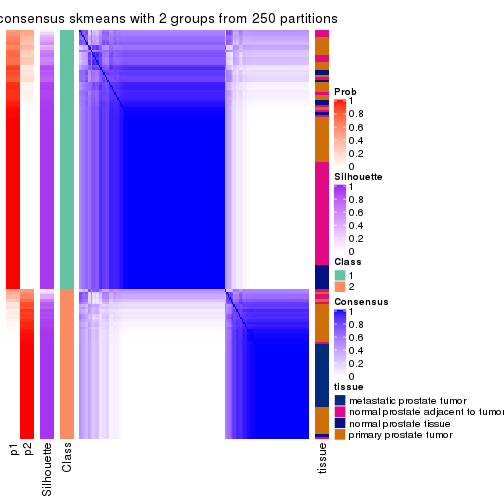</p>

</div>
<div id='tab-SD-skmeans-consensus-heatmap-2'>
<pre><code class="r">consensus_heatmap(res, k = 3)
</code></pre>

<p>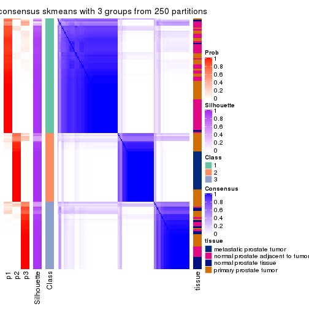</p>

</div>
<div id='tab-SD-skmeans-consensus-heatmap-3'>
<pre><code class="r">consensus_heatmap(res, k = 4)
</code></pre>

<p>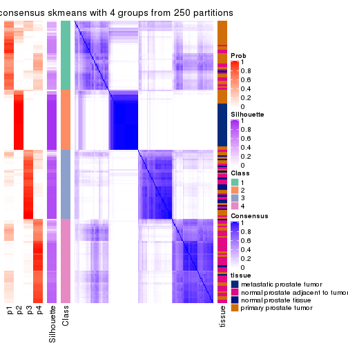</p>

</div>
<div id='tab-SD-skmeans-consensus-heatmap-4'>
<pre><code class="r">consensus_heatmap(res, k = 5)
</code></pre>

<p>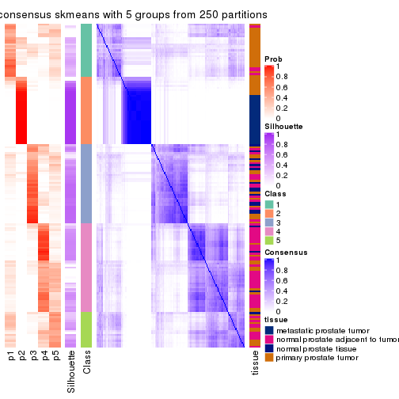</p>

</div>
<div id='tab-SD-skmeans-consensus-heatmap-5'>
<pre><code class="r">consensus_heatmap(res, k = 6)
</code></pre>

<p>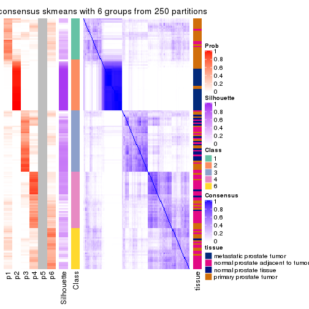</p>

</div>
</div>

Heatmaps for the membership of samples in all partitions to see how consistent they are:


<script>
$( function() {
	$( '#tabs-SD-skmeans-membership-heatmap' ).tabs();
} );
</script>
<div id='tabs-SD-skmeans-membership-heatmap'>
<ul>
<li><a href='#tab-SD-skmeans-membership-heatmap-1'>k = 2</a></li>
<li><a href='#tab-SD-skmeans-membership-heatmap-2'>k = 3</a></li>
<li><a href='#tab-SD-skmeans-membership-heatmap-3'>k = 4</a></li>
<li><a href='#tab-SD-skmeans-membership-heatmap-4'>k = 5</a></li>
<li><a href='#tab-SD-skmeans-membership-heatmap-5'>k = 6</a></li>
</ul>
<div id='tab-SD-skmeans-membership-heatmap-1'>
<pre><code class="r">membership_heatmap(res, k = 2)
</code></pre>

<p>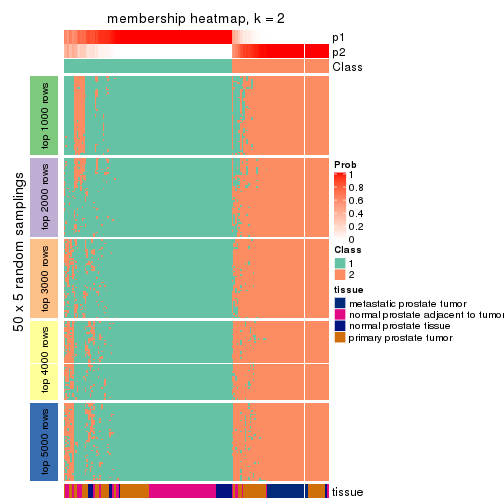</p>

</div>
<div id='tab-SD-skmeans-membership-heatmap-2'>
<pre><code class="r">membership_heatmap(res, k = 3)
</code></pre>

<p>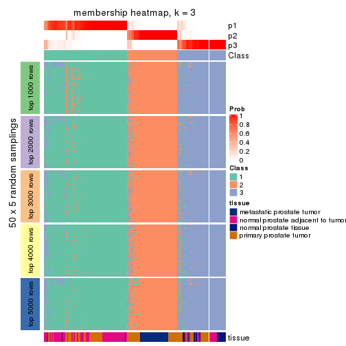</p>

</div>
<div id='tab-SD-skmeans-membership-heatmap-3'>
<pre><code class="r">membership_heatmap(res, k = 4)
</code></pre>

<p>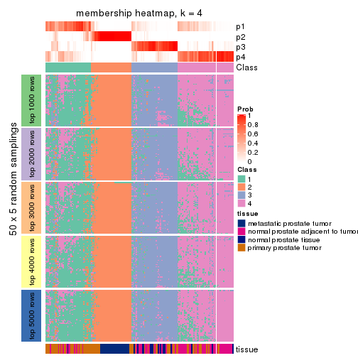</p>

</div>
<div id='tab-SD-skmeans-membership-heatmap-4'>
<pre><code class="r">membership_heatmap(res, k = 5)
</code></pre>

<p>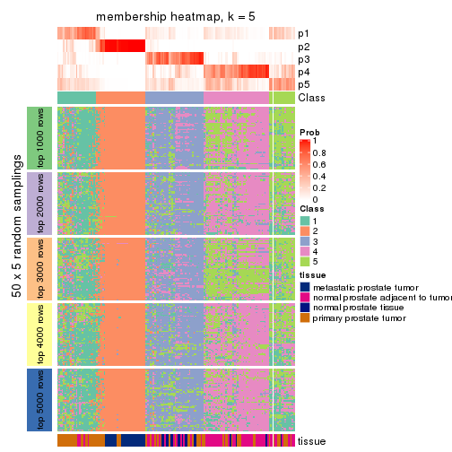</p>

</div>
<div id='tab-SD-skmeans-membership-heatmap-5'>
<pre><code class="r">membership_heatmap(res, k = 6)
</code></pre>

<p>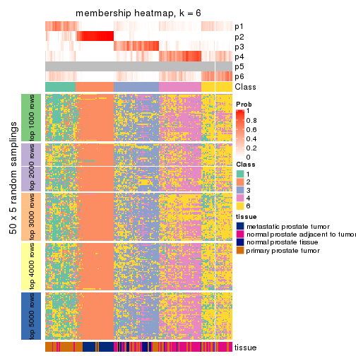</p>

</div>
</div>

As soon as we have had the classes for columns, we can look for signatures
which are significantly different between classes which can be candidate marks
for certain classes. Following are the heatmaps for signatures.


Signature heatmaps where rows are scaled:


<script>
$( function() {
	$( '#tabs-SD-skmeans-get-signatures' ).tabs();
} );
</script>
<div id='tabs-SD-skmeans-get-signatures'>
<ul>
<li><a href='#tab-SD-skmeans-get-signatures-1'>k = 2</a></li>
<li><a href='#tab-SD-skmeans-get-signatures-2'>k = 3</a></li>
<li><a href='#tab-SD-skmeans-get-signatures-3'>k = 4</a></li>
<li><a href='#tab-SD-skmeans-get-signatures-4'>k = 5</a></li>
<li><a href='#tab-SD-skmeans-get-signatures-5'>k = 6</a></li>
</ul>
<div id='tab-SD-skmeans-get-signatures-1'>
<pre><code class="r">get_signatures(res, k = 2)
</code></pre>

<p>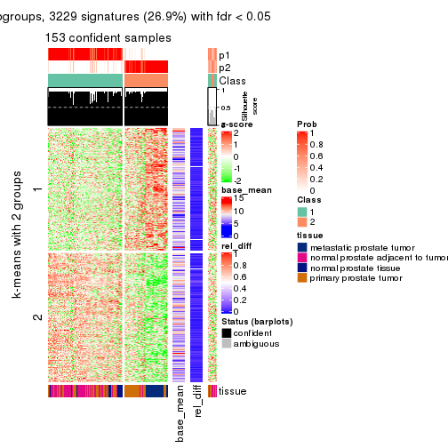</p>

</div>
<div id='tab-SD-skmeans-get-signatures-2'>
<pre><code class="r">get_signatures(res, k = 3)
</code></pre>

<p>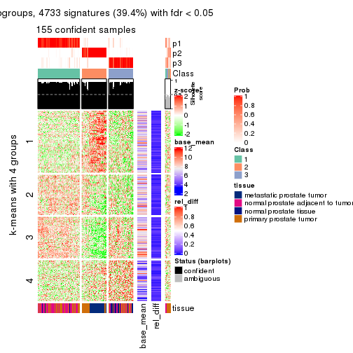</p>

</div>
<div id='tab-SD-skmeans-get-signatures-3'>
<pre><code class="r">get_signatures(res, k = 4)
</code></pre>

<p>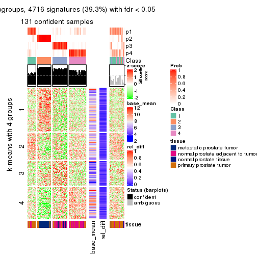</p>

</div>
<div id='tab-SD-skmeans-get-signatures-4'>
<pre><code class="r">get_signatures(res, k = 5)
</code></pre>

<p>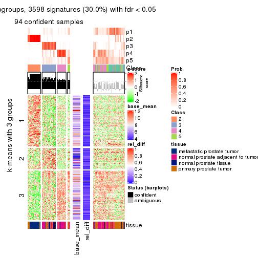</p>

</div>
<div id='tab-SD-skmeans-get-signatures-5'>
<pre><code class="r">get_signatures(res, k = 6)
</code></pre>

<p>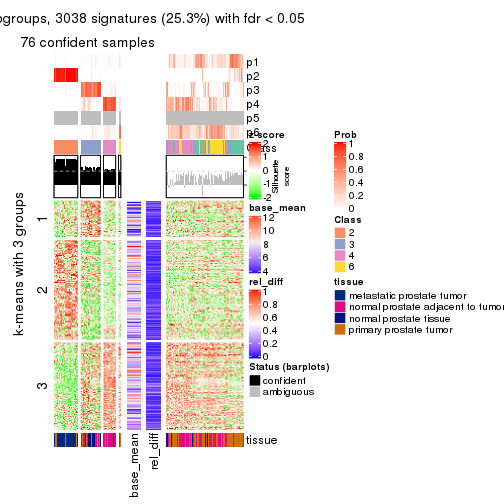</p>

</div>
</div>


Signature heatmaps where rows are not scaled:


<script>
$( function() {
	$( '#tabs-SD-skmeans-get-signatures-no-scale' ).tabs();
} );
</script>
<div id='tabs-SD-skmeans-get-signatures-no-scale'>
<ul>
<li><a href='#tab-SD-skmeans-get-signatures-no-scale-1'>k = 2</a></li>
<li><a href='#tab-SD-skmeans-get-signatures-no-scale-2'>k = 3</a></li>
<li><a href='#tab-SD-skmeans-get-signatures-no-scale-3'>k = 4</a></li>
<li><a href='#tab-SD-skmeans-get-signatures-no-scale-4'>k = 5</a></li>
<li><a href='#tab-SD-skmeans-get-signatures-no-scale-5'>k = 6</a></li>
</ul>
<div id='tab-SD-skmeans-get-signatures-no-scale-1'>
<pre><code class="r">get_signatures(res, k = 2, scale_rows = FALSE)
</code></pre>

<p>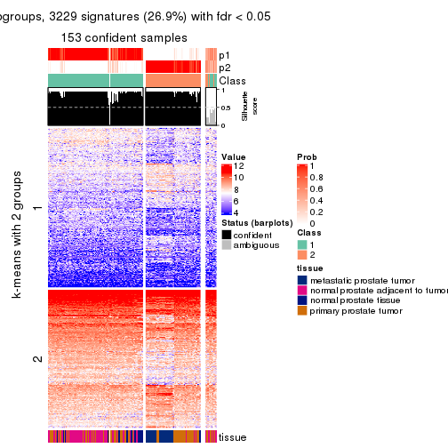</p>

</div>
<div id='tab-SD-skmeans-get-signatures-no-scale-2'>
<pre><code class="r">get_signatures(res, k = 3, scale_rows = FALSE)
</code></pre>

<p>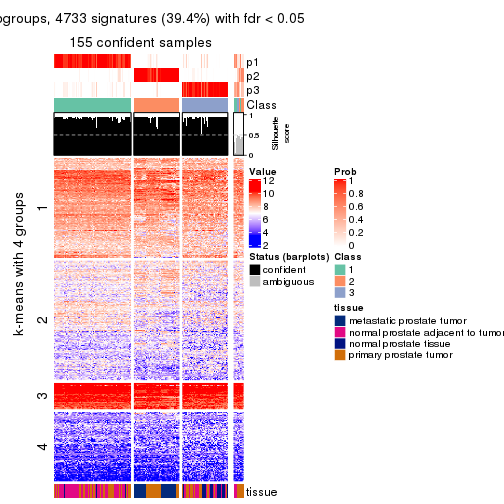</p>

</div>
<div id='tab-SD-skmeans-get-signatures-no-scale-3'>
<pre><code class="r">get_signatures(res, k = 4, scale_rows = FALSE)
</code></pre>

<p>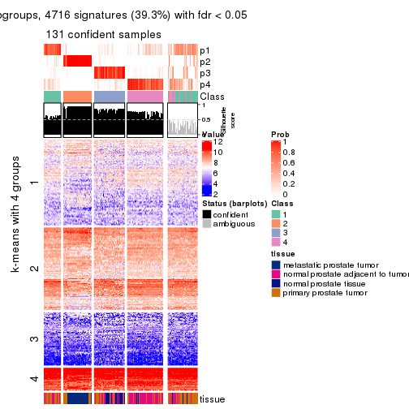</p>

</div>
<div id='tab-SD-skmeans-get-signatures-no-scale-4'>
<pre><code class="r">get_signatures(res, k = 5, scale_rows = FALSE)
</code></pre>

<p>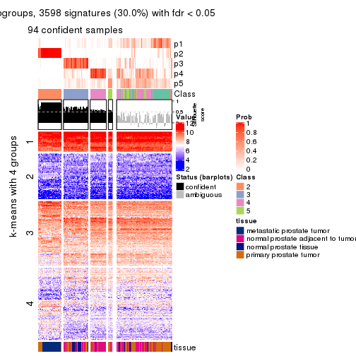</p>

</div>
<div id='tab-SD-skmeans-get-signatures-no-scale-5'>
<pre><code class="r">get_signatures(res, k = 6, scale_rows = FALSE)
</code></pre>

<p>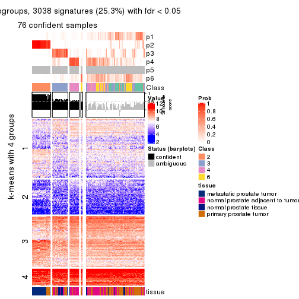</p>

</div>
</div>


Compare the overlap of signatures from different k:

```r
compare_signatures(res)
```

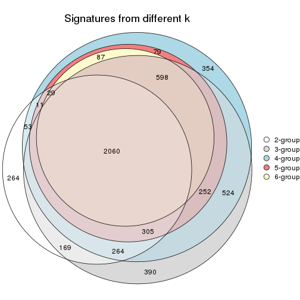

`get_signature()` returns a data frame invisibly. TO get the list of signatures, the function
call should be assigned to a variable explicitly. In following code, if `plot` argument is set
to `FALSE`, no heatmap is plotted while only the differential analysis is performed.

```r
# code only for demonstration
tb = get_signature(res, k = ..., plot = FALSE)
```

An example of the output of `tb` is:

```
#>   which_row         fdr    mean_1    mean_2 scaled_mean_1 scaled_mean_2 km
#> 1        38 0.042760348  8.373488  9.131774    -0.5533452     0.5164555  1
#> 2        40 0.018707592  7.106213  8.469186    -0.6173731     0.5762149  1
#> 3        55 0.019134737 10.221463 11.207825    -0.6159697     0.5749050  1
#> 4        59 0.006059896  5.921854  7.869574    -0.6899429     0.6439467  1
#> 5        60 0.018055526  8.928898 10.211722    -0.6204761     0.5791110  1
#> 6        98 0.009384629 15.714769 14.887706     0.6635654    -0.6193277  2
...
```

The columns in `tb` are:

1. `which_row`: row indices corresponding to the input matrix.
2. `fdr`: FDR for the differential test. 
3. `mean_x`: The mean value in group x.
4. `scaled_mean_x`: The mean value in group x after rows are scaled.
5. `km`: Row groups if k-means clustering is applied to rows.


UMAP plot which shows how samples are separated.


<script>
$( function() {
	$( '#tabs-SD-skmeans-dimension-reduction' ).tabs();
} );
</script>
<div id='tabs-SD-skmeans-dimension-reduction'>
<ul>
<li><a href='#tab-SD-skmeans-dimension-reduction-1'>k = 2</a></li>
<li><a href='#tab-SD-skmeans-dimension-reduction-2'>k = 3</a></li>
<li><a href='#tab-SD-skmeans-dimension-reduction-3'>k = 4</a></li>
<li><a href='#tab-SD-skmeans-dimension-reduction-4'>k = 5</a></li>
<li><a href='#tab-SD-skmeans-dimension-reduction-5'>k = 6</a></li>
</ul>
<div id='tab-SD-skmeans-dimension-reduction-1'>
<pre><code class="r">dimension_reduction(res, k = 2, method = &quot;UMAP&quot;)
</code></pre>

<p>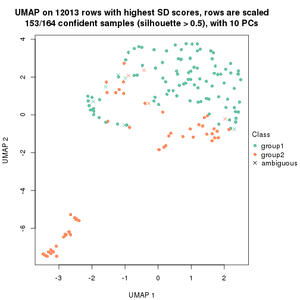</p>

</div>
<div id='tab-SD-skmeans-dimension-reduction-2'>
<pre><code class="r">dimension_reduction(res, k = 3, method = &quot;UMAP&quot;)
</code></pre>

<p>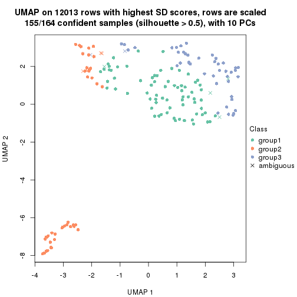</p>

</div>
<div id='tab-SD-skmeans-dimension-reduction-3'>
<pre><code class="r">dimension_reduction(res, k = 4, method = &quot;UMAP&quot;)
</code></pre>

<p>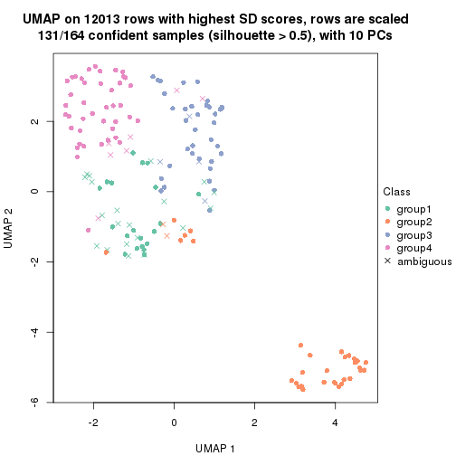</p>

</div>
<div id='tab-SD-skmeans-dimension-reduction-4'>
<pre><code class="r">dimension_reduction(res, k = 5, method = &quot;UMAP&quot;)
</code></pre>

<p>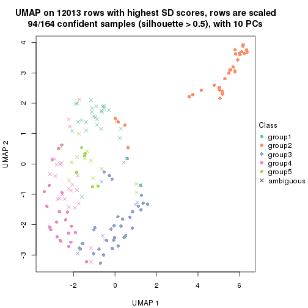</p>

</div>
<div id='tab-SD-skmeans-dimension-reduction-5'>
<pre><code class="r">dimension_reduction(res, k = 6, method = &quot;UMAP&quot;)
</code></pre>

<p>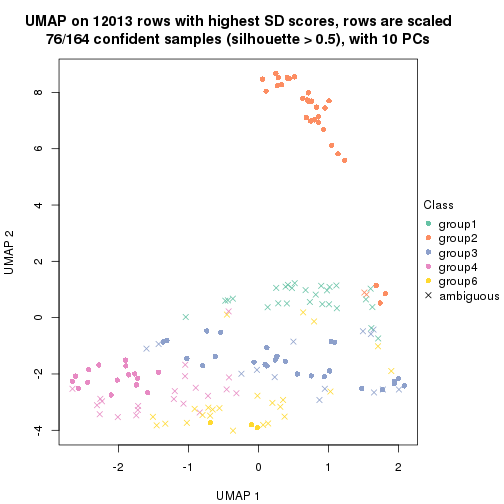</p>

</div>
</div>


Following heatmap shows how subgroups are split when increasing `k`:

```r
collect_classes(res)
```

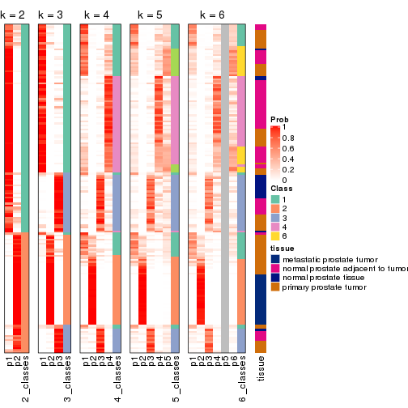


Test correlation between subgroups and known annotations. If the known
annotation is numeric, one-way ANOVA test is applied, and if the known
annotation is discrete, chi-squared contingency table test is applied.

```r
test_to_known_factors(res)
```

```
#>              n tissue(p) k
#> SD:skmeans 153  7.04e-16 2
#> SD:skmeans 155  1.30e-23 3
#> SD:skmeans 131  1.20e-23 4
#> SD:skmeans  94  7.96e-16 5
#> SD:skmeans  76  4.58e-13 6
```


If matrix rows can be associated to genes, consider to use `functional_enrichment(res,
...)` to perform function enrichment for the signature genes. See [this vignette](http://bioconductor.org/packages/devel/bioc/vignettes/cola/inst/doc/functional_enrichment.html) for more detailed explanations.


 

---------------------------------------------------


### SD:pam**


The object with results only for a single top-value method and a single partition method 
can be extracted as:

```r
res = res_list["SD", "pam"]
# you can also extract it by
# res = res_list["SD:pam"]
```

A summary of `res` and all the functions that can be applied to it:

```r
res
```

```
#> A 'ConsensusPartition' object with k = 2, 3, 4, 5, 6.
#>   On a matrix with 12013 rows and 164 columns.
#>   Top rows (1000, 2000, 3000, 4000, 5000) are extracted by 'SD' method.
#>   Subgroups are detected by 'pam' method.
#>   Performed in total 1250 partitions by row resampling.
#>   Best k for subgroups seems to be 2.
#> 
#> Following methods can be applied to this 'ConsensusPartition' object:
#>  [1] "cola_report"             "collect_classes"         "collect_plots"          
#>  [4] "collect_stats"           "colnames"                "compare_signatures"     
#>  [7] "consensus_heatmap"       "dimension_reduction"     "functional_enrichment"  
#> [10] "get_anno_col"            "get_anno"                "get_classes"            
#> [13] "get_consensus"           "get_matrix"              "get_membership"         
#> [16] "get_param"               "get_signatures"          "get_stats"              
#> [19] "is_best_k"               "is_stable_k"             "membership_heatmap"     
#> [22] "ncol"                    "nrow"                    "plot_ecdf"              
#> [25] "rownames"                "select_partition_number" "show"                   
#> [28] "suggest_best_k"          "test_to_known_factors"
```

`collect_plots()` function collects all the plots made from `res` for all `k` (number of partitions)
into one single page to provide an easy and fast comparison between different `k`.

```r
collect_plots(res)
```

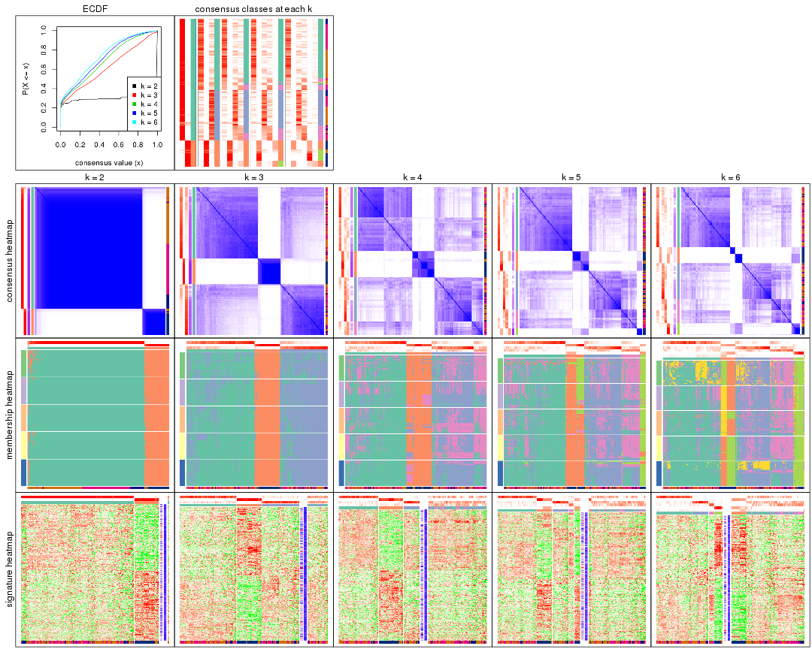

The plots are:

- The first row: a plot of the ECDF (empirical cumulative distribution
  function) curves of the consensus matrix for each `k` and the heatmap of
  predicted classes for each `k`.
- The second row: heatmaps of the consensus matrix for each `k`.
- The third row: heatmaps of the membership matrix for each `k`.
- The fouth row: heatmaps of the signatures for each `k`.

All the plots in panels can be made by individual functions and they are
plotted later in this section.

`select_partition_number()` produces several plots showing different
statistics for choosing "optimized" `k`. There are following statistics:

- ECDF curves of the consensus matrix for each `k`;
- 1-PAC. [The PAC
  score](https://en.wikipedia.org/wiki/Consensus_clustering#Over-interpretation_potential_of_consensus_clustering)
  measures the proportion of the ambiguous subgrouping.
- Mean silhouette score.
- Concordance. The mean probability of fiting the consensus class ids in all
  partitions.
- Area increased. Denote $A_k$ as the area under the ECDF curve for current
  `k`, the area increased is defined as $A_k - A_{k-1}$.
- Rand index. The percent of pairs of samples that are both in a same cluster
  or both are not in a same cluster in the partition of k and k-1.
- Jaccard index. The ratio of pairs of samples are both in a same cluster in
  the partition of k and k-1 and the pairs of samples are both in a same
  cluster in the partition k or k-1.

The detailed explanations of these statistics can be found in [the _cola_
vignette](http://bioconductor.org/packages/devel/bioc/vignettes/cola/inst/doc/cola.html#toc_13).

Generally speaking, lower PAC score, higher mean silhouette score or higher
concordance corresponds to better partition. Rand index and Jaccard index
measure how similar the current partition is compared to partition with `k-1`.
If they are too similar, we won't accept `k` is better than `k-1`.

```r
select_partition_number(res)
```

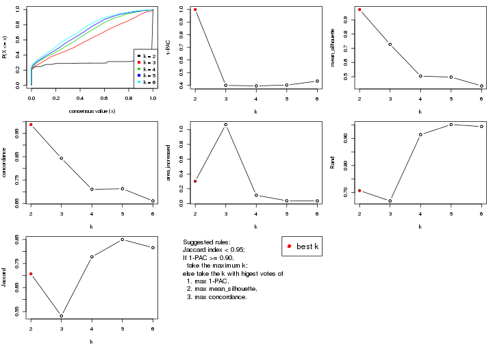

The numeric values for all these statistics can be obtained by `get_stats()`.

```r
get_stats(res)
```

```
#>   k 1-PAC mean_silhouette concordance area_increased  Rand Jaccard
#> 2 2 0.999           0.973       0.988         0.3025 0.707   0.707
#> 3 3 0.399           0.728       0.843         1.0683 0.669   0.532
#> 4 4 0.395           0.504       0.711         0.1134 0.914   0.778
#> 5 5 0.401           0.497       0.713         0.0385 0.951   0.850
#> 6 6 0.433           0.435       0.661         0.0365 0.944   0.816
```

`suggest_best_k()` suggests the best $k$ based on these statistics. The rules are as follows:

- All $k$ with Jaccard index larger than 0.95 are removed because increasing
  $k$ does not provide enough extra information. If all $k$ are removed, it is
  marked as no subgroup is detected.
- For all $k$ with 1-PAC score larger than 0.9, the maximal $k$ is taken as
  the best $k$, and other $k$ are marked as optional $k$.
- If it does not fit the second rule. The $k$ with the maximal vote of the
  highest 1-PAC score, highest mean silhouette, and highest concordance is
  taken as the best $k$.

```r
suggest_best_k(res)
```

```
#> [1] 2
```


Following shows the table of the partitions (You need to click the **show/hide
code output** link to see it). The membership matrix (columns with name `p*`)
is inferred by
[`clue::cl_consensus()`](https://www.rdocumentation.org/link/cl_consensus?package=clue)
function with the `SE` method. Basically the value in the membership matrix
represents the probability to belong to a certain group. The finall class
label for an item is determined with the group with highest probability it
belongs to.

In `get_classes()` function, the entropy is calculated from the membership
matrix and the silhouette score is calculated from the consensus matrix.


<script>
$( function() {
	$( '#tabs-SD-pam-get-classes' ).tabs();
} );
</script>
<div id='tabs-SD-pam-get-classes'>
<ul>
<li><a href='#tab-SD-pam-get-classes-1'>k = 2</a></li>
<li><a href='#tab-SD-pam-get-classes-2'>k = 3</a></li>
<li><a href='#tab-SD-pam-get-classes-3'>k = 4</a></li>
<li><a href='#tab-SD-pam-get-classes-4'>k = 5</a></li>
<li><a href='#tab-SD-pam-get-classes-5'>k = 6</a></li>
</ul>

<div id='tab-SD-pam-get-classes-1'>
<p><a id='tab-SD-pam-get-classes-1-a' style='color:#0366d6' href='#'>show/hide code output</a></p>
<pre><code class="r">cbind(get_classes(res, k = 2), get_membership(res, k = 2))
</code></pre>

<pre><code>#&gt;           class entropy silhouette    p1    p2
#&gt; GSM152839     1  0.0000      0.988 1.000 0.000
#&gt; GSM152840     1  0.0000      0.988 1.000 0.000
#&gt; GSM152841     1  0.0000      0.988 1.000 0.000
#&gt; GSM152842     1  0.0000      0.988 1.000 0.000
#&gt; GSM152843     1  0.0000      0.988 1.000 0.000
#&gt; GSM152844     1  0.0000      0.988 1.000 0.000
#&gt; GSM152845     1  0.0376      0.985 0.996 0.004
#&gt; GSM152846     1  0.0000      0.988 1.000 0.000
#&gt; GSM152847     1  0.0000      0.988 1.000 0.000
#&gt; GSM152848     1  0.0000      0.988 1.000 0.000
#&gt; GSM152849     1  0.0000      0.988 1.000 0.000
#&gt; GSM152850     1  0.0000      0.988 1.000 0.000
#&gt; GSM152851     1  0.0000      0.988 1.000 0.000
#&gt; GSM152852     1  0.0000      0.988 1.000 0.000
#&gt; GSM152853     1  0.0000      0.988 1.000 0.000
#&gt; GSM152854     1  0.0000      0.988 1.000 0.000
#&gt; GSM152855     1  0.0000      0.988 1.000 0.000
#&gt; GSM153238     1  0.0000      0.988 1.000 0.000
#&gt; GSM153239     1  0.0000      0.988 1.000 0.000
#&gt; GSM153240     1  0.0000      0.988 1.000 0.000
#&gt; GSM153241     1  0.0000      0.988 1.000 0.000
#&gt; GSM153242     1  0.0000      0.988 1.000 0.000
#&gt; GSM153243     1  0.1414      0.972 0.980 0.020
#&gt; GSM153244     1  0.0000      0.988 1.000 0.000
#&gt; GSM153245     1  0.0000      0.988 1.000 0.000
#&gt; GSM153246     1  0.0000      0.988 1.000 0.000
#&gt; GSM153247     1  0.0000      0.988 1.000 0.000
#&gt; GSM153248     1  0.0000      0.988 1.000 0.000
#&gt; GSM153249     1  0.0000      0.988 1.000 0.000
#&gt; GSM153250     1  0.0000      0.988 1.000 0.000
#&gt; GSM153251     1  0.0000      0.988 1.000 0.000
#&gt; GSM153252     1  0.0000      0.988 1.000 0.000
#&gt; GSM153253     1  0.0000      0.988 1.000 0.000
#&gt; GSM153254     1  0.0000      0.988 1.000 0.000
#&gt; GSM153255     1  0.0000      0.988 1.000 0.000
#&gt; GSM153256     1  0.0000      0.988 1.000 0.000
#&gt; GSM153257     1  0.0000      0.988 1.000 0.000
#&gt; GSM153258     1  0.0000      0.988 1.000 0.000
#&gt; GSM153259     1  0.0000      0.988 1.000 0.000
#&gt; GSM153260     1  0.0000      0.988 1.000 0.000
#&gt; GSM153261     1  0.0000      0.988 1.000 0.000
#&gt; GSM153262     1  0.0000      0.988 1.000 0.000
#&gt; GSM153263     1  0.0000      0.988 1.000 0.000
#&gt; GSM153264     1  0.0000      0.988 1.000 0.000
#&gt; GSM153265     1  0.0000      0.988 1.000 0.000
#&gt; GSM153266     1  0.0000      0.988 1.000 0.000
#&gt; GSM153267     1  0.0000      0.988 1.000 0.000
#&gt; GSM153268     1  0.0000      0.988 1.000 0.000
#&gt; GSM153269     1  0.0000      0.988 1.000 0.000
#&gt; GSM153270     1  0.0000      0.988 1.000 0.000
#&gt; GSM153271     1  0.0000      0.988 1.000 0.000
#&gt; GSM153272     1  0.0000      0.988 1.000 0.000
#&gt; GSM153273     1  0.0000      0.988 1.000 0.000
#&gt; GSM153274     1  0.0000      0.988 1.000 0.000
#&gt; GSM153275     1  0.0000      0.988 1.000 0.000
#&gt; GSM153276     1  0.0000      0.988 1.000 0.000
#&gt; GSM153277     1  0.0000      0.988 1.000 0.000
#&gt; GSM153278     1  0.0000      0.988 1.000 0.000
#&gt; GSM153279     1  0.0000      0.988 1.000 0.000
#&gt; GSM153280     1  0.0000      0.988 1.000 0.000
#&gt; GSM153281     1  0.0000      0.988 1.000 0.000
#&gt; GSM153282     1  0.0000      0.988 1.000 0.000
#&gt; GSM153283     1  0.0000      0.988 1.000 0.000
#&gt; GSM153284     1  0.0000      0.988 1.000 0.000
#&gt; GSM153285     1  0.0000      0.988 1.000 0.000
#&gt; GSM153286     1  0.0000      0.988 1.000 0.000
#&gt; GSM153287     1  0.0000      0.988 1.000 0.000
#&gt; GSM153288     1  0.0000      0.988 1.000 0.000
#&gt; GSM153289     1  0.0000      0.988 1.000 0.000
#&gt; GSM153290     1  0.0000      0.988 1.000 0.000
#&gt; GSM153291     1  0.0000      0.988 1.000 0.000
#&gt; GSM153292     1  0.0000      0.988 1.000 0.000
#&gt; GSM153293     1  0.0000      0.988 1.000 0.000
#&gt; GSM153294     1  0.0376      0.985 0.996 0.004
#&gt; GSM153295     1  0.0000      0.988 1.000 0.000
#&gt; GSM153054     1  0.0000      0.988 1.000 0.000
#&gt; GSM153055     1  0.0000      0.988 1.000 0.000
#&gt; GSM153056     1  0.0000      0.988 1.000 0.000
#&gt; GSM153057     1  0.0000      0.988 1.000 0.000
#&gt; GSM153058     1  0.0000      0.988 1.000 0.000
#&gt; GSM153059     1  0.0000      0.988 1.000 0.000
#&gt; GSM153060     1  0.0000      0.988 1.000 0.000
#&gt; GSM153061     1  0.0000      0.988 1.000 0.000
#&gt; GSM153062     1  0.5178      0.870 0.884 0.116
#&gt; GSM153063     1  0.0000      0.988 1.000 0.000
#&gt; GSM153064     1  0.0000      0.988 1.000 0.000
#&gt; GSM153065     1  0.2778      0.945 0.952 0.048
#&gt; GSM153066     2  0.6887      0.780 0.184 0.816
#&gt; GSM153067     1  0.0000      0.988 1.000 0.000
#&gt; GSM153068     1  0.0000      0.988 1.000 0.000
#&gt; GSM153069     1  0.0000      0.988 1.000 0.000
#&gt; GSM153070     1  0.0000      0.988 1.000 0.000
#&gt; GSM153071     1  0.0000      0.988 1.000 0.000
#&gt; GSM153072     1  0.0000      0.988 1.000 0.000
#&gt; GSM153073     1  0.0000      0.988 1.000 0.000
#&gt; GSM153074     1  0.0000      0.988 1.000 0.000
#&gt; GSM153075     1  0.0000      0.988 1.000 0.000
#&gt; GSM153076     1  0.0000      0.988 1.000 0.000
#&gt; GSM153077     1  0.0000      0.988 1.000 0.000
#&gt; GSM153078     1  0.0000      0.988 1.000 0.000
#&gt; GSM153079     1  0.0672      0.982 0.992 0.008
#&gt; GSM153080     1  0.0000      0.988 1.000 0.000
#&gt; GSM153081     1  0.0000      0.988 1.000 0.000
#&gt; GSM153082     1  0.4815      0.884 0.896 0.104
#&gt; GSM153083     1  0.4161      0.907 0.916 0.084
#&gt; GSM153084     1  0.4939      0.881 0.892 0.108
#&gt; GSM153085     1  0.0000      0.988 1.000 0.000
#&gt; GSM153086     1  0.2043      0.960 0.968 0.032
#&gt; GSM153087     1  0.0000      0.988 1.000 0.000
#&gt; GSM153088     1  0.0000      0.988 1.000 0.000
#&gt; GSM153089     1  0.0000      0.988 1.000 0.000
#&gt; GSM153090     1  0.0000      0.988 1.000 0.000
#&gt; GSM153091     1  0.3584      0.924 0.932 0.068
#&gt; GSM153092     1  0.0000      0.988 1.000 0.000
#&gt; GSM153093     1  0.0000      0.988 1.000 0.000
#&gt; GSM153094     1  0.1843      0.964 0.972 0.028
#&gt; GSM153095     1  0.0000      0.988 1.000 0.000
#&gt; GSM153096     1  0.0000      0.988 1.000 0.000
#&gt; GSM153097     1  0.0376      0.985 0.996 0.004
#&gt; GSM153098     1  0.0376      0.985 0.996 0.004
#&gt; GSM153099     1  0.0000      0.988 1.000 0.000
#&gt; GSM153100     1  0.0000      0.988 1.000 0.000
#&gt; GSM153101     1  0.0000      0.988 1.000 0.000
#&gt; GSM153102     1  0.0000      0.988 1.000 0.000
#&gt; GSM153103     1  0.0000      0.988 1.000 0.000
#&gt; GSM153104     1  0.0000      0.988 1.000 0.000
#&gt; GSM153106     1  0.0000      0.988 1.000 0.000
#&gt; GSM153107     1  0.0000      0.988 1.000 0.000
#&gt; GSM153108     1  0.0000      0.988 1.000 0.000
#&gt; GSM153109     1  0.6438      0.808 0.836 0.164
#&gt; GSM153110     1  0.0938      0.978 0.988 0.012
#&gt; GSM153111     1  0.1414      0.971 0.980 0.020
#&gt; GSM153112     1  0.0000      0.988 1.000 0.000
#&gt; GSM153113     1  0.9580      0.388 0.620 0.380
#&gt; GSM153114     1  0.0000      0.988 1.000 0.000
#&gt; GSM187532     2  0.0672      0.980 0.008 0.992
#&gt; GSM187533     2  0.4161      0.908 0.084 0.916
#&gt; GSM187534     2  0.4815      0.887 0.104 0.896
#&gt; GSM187535     1  0.9580      0.386 0.620 0.380
#&gt; GSM152906     2  0.0000      0.985 0.000 1.000
#&gt; GSM152907     2  0.0000      0.985 0.000 1.000
#&gt; GSM152908     2  0.0000      0.985 0.000 1.000
#&gt; GSM152909     2  0.0000      0.985 0.000 1.000
#&gt; GSM152910     2  0.0000      0.985 0.000 1.000
#&gt; GSM152911     2  0.0000      0.985 0.000 1.000
#&gt; GSM152912     2  0.0000      0.985 0.000 1.000
#&gt; GSM152913     2  0.0000      0.985 0.000 1.000
#&gt; GSM152914     2  0.0000      0.985 0.000 1.000
#&gt; GSM152915     2  0.0000      0.985 0.000 1.000
#&gt; GSM152916     2  0.0000      0.985 0.000 1.000
#&gt; GSM152917     2  0.0000      0.985 0.000 1.000
#&gt; GSM152918     2  0.0000      0.985 0.000 1.000
#&gt; GSM152919     2  0.0000      0.985 0.000 1.000
#&gt; GSM152920     2  0.0000      0.985 0.000 1.000
#&gt; GSM152921     2  0.0000      0.985 0.000 1.000
#&gt; GSM152922     2  0.0000      0.985 0.000 1.000
#&gt; GSM152923     2  0.0000      0.985 0.000 1.000
#&gt; GSM152924     2  0.0000      0.985 0.000 1.000
#&gt; GSM152925     2  0.0000      0.985 0.000 1.000
#&gt; GSM152926     2  0.0376      0.982 0.004 0.996
#&gt; GSM152927     2  0.0000      0.985 0.000 1.000
#&gt; GSM152928     2  0.1633      0.967 0.024 0.976
#&gt; GSM152929     2  0.0000      0.985 0.000 1.000
#&gt; GSM152930     2  0.0000      0.985 0.000 1.000
</code></pre>

<script>
$('#tab-SD-pam-get-classes-1-a').parent().next().next().hide();
$('#tab-SD-pam-get-classes-1-a').click(function(){
  $('#tab-SD-pam-get-classes-1-a').parent().next().next().toggle();
  return(false);
});
</script>
</div>

<div id='tab-SD-pam-get-classes-2'>
<p><a id='tab-SD-pam-get-classes-2-a' style='color:#0366d6' href='#'>show/hide code output</a></p>
<pre><code class="r">cbind(get_classes(res, k = 3), get_membership(res, k = 3))
</code></pre>

<pre><code>#&gt;           class entropy silhouette    p1    p2    p3
#&gt; GSM152839     1  0.4842     0.7515 0.776 0.000 0.224
#&gt; GSM152840     3  0.3038     0.8009 0.104 0.000 0.896
#&gt; GSM152841     3  0.4504     0.7482 0.196 0.000 0.804
#&gt; GSM152842     1  0.3619     0.7946 0.864 0.000 0.136
#&gt; GSM152843     1  0.1411     0.7884 0.964 0.000 0.036
#&gt; GSM152844     3  0.2537     0.8083 0.080 0.000 0.920
#&gt; GSM152845     3  0.0892     0.8011 0.020 0.000 0.980
#&gt; GSM152846     3  0.1860     0.8073 0.052 0.000 0.948
#&gt; GSM152847     1  0.1529     0.7900 0.960 0.000 0.040
#&gt; GSM152848     1  0.6111     0.4863 0.604 0.000 0.396
#&gt; GSM152849     3  0.6168     0.2208 0.412 0.000 0.588
#&gt; GSM152850     1  0.5859     0.5970 0.656 0.000 0.344
#&gt; GSM152851     3  0.1163     0.7986 0.028 0.000 0.972
#&gt; GSM152852     3  0.1031     0.8000 0.024 0.000 0.976
#&gt; GSM152853     3  0.3686     0.7902 0.140 0.000 0.860
#&gt; GSM152854     3  0.3619     0.7935 0.136 0.000 0.864
#&gt; GSM152855     3  0.0592     0.8006 0.012 0.000 0.988
#&gt; GSM153238     1  0.3116     0.7902 0.892 0.000 0.108
#&gt; GSM153239     3  0.6180     0.3239 0.416 0.000 0.584
#&gt; GSM153240     1  0.6140     0.3364 0.596 0.000 0.404
#&gt; GSM153241     1  0.6280     0.0956 0.540 0.000 0.460
#&gt; GSM153242     3  0.5291     0.6797 0.268 0.000 0.732
#&gt; GSM153243     1  0.3192     0.7920 0.888 0.000 0.112
#&gt; GSM153244     3  0.4931     0.7086 0.232 0.000 0.768
#&gt; GSM153245     1  0.6168     0.3671 0.588 0.000 0.412
#&gt; GSM153246     1  0.5216     0.7143 0.740 0.000 0.260
#&gt; GSM153247     1  0.2625     0.7960 0.916 0.000 0.084
#&gt; GSM153248     1  0.4504     0.7703 0.804 0.000 0.196
#&gt; GSM153249     1  0.4121     0.7734 0.832 0.000 0.168
#&gt; GSM153250     1  0.1643     0.7871 0.956 0.000 0.044
#&gt; GSM153251     1  0.5327     0.6639 0.728 0.000 0.272
#&gt; GSM153252     1  0.6079     0.4994 0.612 0.000 0.388
#&gt; GSM153253     3  0.3816     0.7867 0.148 0.000 0.852
#&gt; GSM153254     3  0.5948     0.4356 0.360 0.000 0.640
#&gt; GSM153255     1  0.3192     0.7943 0.888 0.000 0.112
#&gt; GSM153256     1  0.2165     0.7972 0.936 0.000 0.064
#&gt; GSM153257     1  0.1529     0.7835 0.960 0.000 0.040
#&gt; GSM153258     1  0.3686     0.7920 0.860 0.000 0.140
#&gt; GSM153259     1  0.6111     0.4316 0.604 0.000 0.396
#&gt; GSM153260     1  0.4235     0.7795 0.824 0.000 0.176
#&gt; GSM153261     3  0.0747     0.8000 0.016 0.000 0.984
#&gt; GSM153262     3  0.4002     0.7590 0.160 0.000 0.840
#&gt; GSM153263     3  0.5706     0.4512 0.320 0.000 0.680
#&gt; GSM153264     1  0.5859     0.5549 0.656 0.000 0.344
#&gt; GSM153265     3  0.2878     0.8071 0.096 0.000 0.904
#&gt; GSM153266     1  0.4121     0.7780 0.832 0.000 0.168
#&gt; GSM153267     1  0.4750     0.7556 0.784 0.000 0.216
#&gt; GSM153268     3  0.3340     0.7938 0.120 0.000 0.880
#&gt; GSM153269     1  0.2959     0.8011 0.900 0.000 0.100
#&gt; GSM153270     1  0.2066     0.7907 0.940 0.000 0.060
#&gt; GSM153271     1  0.0892     0.7811 0.980 0.000 0.020
#&gt; GSM153272     1  0.5098     0.7111 0.752 0.000 0.248
#&gt; GSM153273     1  0.2537     0.8004 0.920 0.000 0.080
#&gt; GSM153274     1  0.2711     0.8001 0.912 0.000 0.088
#&gt; GSM153275     1  0.4750     0.6695 0.784 0.000 0.216
#&gt; GSM153276     1  0.2959     0.7987 0.900 0.000 0.100
#&gt; GSM153277     3  0.1753     0.8003 0.048 0.000 0.952
#&gt; GSM153278     1  0.6126     0.3094 0.600 0.000 0.400
#&gt; GSM153279     3  0.6062     0.3791 0.384 0.000 0.616
#&gt; GSM153280     3  0.2959     0.8016 0.100 0.000 0.900
#&gt; GSM153281     3  0.6154     0.3640 0.408 0.000 0.592
#&gt; GSM153282     3  0.3879     0.7781 0.152 0.000 0.848
#&gt; GSM153283     1  0.4504     0.7578 0.804 0.000 0.196
#&gt; GSM153284     1  0.4178     0.7814 0.828 0.000 0.172
#&gt; GSM153285     3  0.3879     0.7795 0.152 0.000 0.848
#&gt; GSM153286     1  0.1529     0.7832 0.960 0.000 0.040
#&gt; GSM153287     1  0.5291     0.6977 0.732 0.000 0.268
#&gt; GSM153288     1  0.5254     0.6868 0.736 0.000 0.264
#&gt; GSM153289     3  0.0592     0.7986 0.012 0.000 0.988
#&gt; GSM153290     3  0.2066     0.7966 0.060 0.000 0.940
#&gt; GSM153291     3  0.2448     0.8114 0.076 0.000 0.924
#&gt; GSM153292     3  0.5621     0.6119 0.308 0.000 0.692
#&gt; GSM153293     3  0.6192     0.1960 0.420 0.000 0.580
#&gt; GSM153294     1  0.1031     0.7853 0.976 0.000 0.024
#&gt; GSM153295     3  0.1643     0.8041 0.044 0.000 0.956
#&gt; GSM153054     1  0.0237     0.7788 0.996 0.000 0.004
#&gt; GSM153055     3  0.6267     0.2980 0.452 0.000 0.548
#&gt; GSM153056     1  0.5760     0.6263 0.672 0.000 0.328
#&gt; GSM153057     3  0.3619     0.7974 0.136 0.000 0.864
#&gt; GSM153058     1  0.6308    -0.0104 0.508 0.000 0.492
#&gt; GSM153059     3  0.2537     0.8040 0.080 0.000 0.920
#&gt; GSM153060     1  0.2711     0.8009 0.912 0.000 0.088
#&gt; GSM153061     3  0.5560     0.5729 0.300 0.000 0.700
#&gt; GSM153062     1  0.8295     0.2061 0.548 0.088 0.364
#&gt; GSM153063     1  0.5733     0.6442 0.676 0.000 0.324
#&gt; GSM153064     1  0.5926     0.5736 0.644 0.000 0.356
#&gt; GSM153065     3  0.4094     0.8027 0.100 0.028 0.872
#&gt; GSM153066     2  0.5696     0.7729 0.064 0.800 0.136
#&gt; GSM153067     1  0.2878     0.8026 0.904 0.000 0.096
#&gt; GSM153068     1  0.6267     0.3218 0.548 0.000 0.452
#&gt; GSM153069     3  0.6274     0.1445 0.456 0.000 0.544
#&gt; GSM153070     1  0.1031     0.7834 0.976 0.000 0.024
#&gt; GSM153071     1  0.3551     0.7846 0.868 0.000 0.132
#&gt; GSM153072     1  0.3412     0.7969 0.876 0.000 0.124
#&gt; GSM153073     1  0.0892     0.7836 0.980 0.000 0.020
#&gt; GSM153074     3  0.5988     0.4726 0.368 0.000 0.632
#&gt; GSM153075     3  0.1643     0.8062 0.044 0.000 0.956
#&gt; GSM153076     1  0.3619     0.7922 0.864 0.000 0.136
#&gt; GSM153077     1  0.2959     0.7932 0.900 0.000 0.100
#&gt; GSM153078     1  0.6305     0.1488 0.516 0.000 0.484
#&gt; GSM153079     3  0.1860     0.8006 0.052 0.000 0.948
#&gt; GSM153080     3  0.3686     0.7906 0.140 0.000 0.860
#&gt; GSM153081     3  0.4062     0.7540 0.164 0.000 0.836
#&gt; GSM153082     3  0.7076     0.5548 0.256 0.060 0.684
#&gt; GSM153083     1  0.3682     0.7908 0.876 0.008 0.116
#&gt; GSM153084     1  0.6948     0.2017 0.512 0.016 0.472
#&gt; GSM153085     1  0.5138     0.7368 0.748 0.000 0.252
#&gt; GSM153086     1  0.1860     0.7895 0.948 0.000 0.052
#&gt; GSM153087     1  0.2356     0.8003 0.928 0.000 0.072
#&gt; GSM153088     1  0.1031     0.7821 0.976 0.000 0.024
#&gt; GSM153089     3  0.3038     0.8065 0.104 0.000 0.896
#&gt; GSM153090     1  0.2261     0.7918 0.932 0.000 0.068
#&gt; GSM153091     1  0.2165     0.7863 0.936 0.000 0.064
#&gt; GSM153092     1  0.5327     0.6685 0.728 0.000 0.272
#&gt; GSM153093     1  0.2448     0.7949 0.924 0.000 0.076
#&gt; GSM153094     1  0.5882     0.5773 0.652 0.000 0.348
#&gt; GSM153095     1  0.5327     0.6783 0.728 0.000 0.272
#&gt; GSM153096     1  0.5397     0.6775 0.720 0.000 0.280
#&gt; GSM153097     1  0.5058     0.7325 0.756 0.000 0.244
#&gt; GSM153098     1  0.4931     0.7340 0.768 0.000 0.232
#&gt; GSM153099     1  0.2959     0.7972 0.900 0.000 0.100
#&gt; GSM153100     3  0.3482     0.8010 0.128 0.000 0.872
#&gt; GSM153101     3  0.2066     0.8071 0.060 0.000 0.940
#&gt; GSM153102     3  0.1964     0.8069 0.056 0.000 0.944
#&gt; GSM153103     1  0.1860     0.7922 0.948 0.000 0.052
#&gt; GSM153104     1  0.3816     0.7884 0.852 0.000 0.148
#&gt; GSM153106     3  0.0747     0.7988 0.016 0.000 0.984
#&gt; GSM153107     3  0.1643     0.8009 0.044 0.000 0.956
#&gt; GSM153108     3  0.2878     0.8093 0.096 0.000 0.904
#&gt; GSM153109     3  0.7839     0.2842 0.380 0.060 0.560
#&gt; GSM153110     1  0.1860     0.7841 0.948 0.000 0.052
#&gt; GSM153111     1  0.2878     0.7966 0.904 0.000 0.096
#&gt; GSM153112     1  0.5835     0.5989 0.660 0.000 0.340
#&gt; GSM153113     3  0.9964     0.0259 0.336 0.296 0.368
#&gt; GSM153114     3  0.1163     0.8028 0.028 0.000 0.972
#&gt; GSM187532     2  0.2165     0.9309 0.000 0.936 0.064
#&gt; GSM187533     2  0.3116     0.8754 0.000 0.892 0.108
#&gt; GSM187534     2  0.3482     0.8496 0.000 0.872 0.128
#&gt; GSM187535     3  0.2569     0.7885 0.032 0.032 0.936
#&gt; GSM152906     2  0.0000     0.9783 0.000 1.000 0.000
#&gt; GSM152907     2  0.0000     0.9783 0.000 1.000 0.000
#&gt; GSM152908     2  0.0000     0.9783 0.000 1.000 0.000
#&gt; GSM152909     2  0.0000     0.9783 0.000 1.000 0.000
#&gt; GSM152910     2  0.0000     0.9783 0.000 1.000 0.000
#&gt; GSM152911     2  0.0000     0.9783 0.000 1.000 0.000
#&gt; GSM152912     2  0.0000     0.9783 0.000 1.000 0.000
#&gt; GSM152913     2  0.0000     0.9783 0.000 1.000 0.000
#&gt; GSM152914     2  0.0000     0.9783 0.000 1.000 0.000
#&gt; GSM152915     2  0.0000     0.9783 0.000 1.000 0.000
#&gt; GSM152916     2  0.0000     0.9783 0.000 1.000 0.000
#&gt; GSM152917     2  0.0000     0.9783 0.000 1.000 0.000
#&gt; GSM152918     2  0.0000     0.9783 0.000 1.000 0.000
#&gt; GSM152919     2  0.0000     0.9783 0.000 1.000 0.000
#&gt; GSM152920     2  0.0000     0.9783 0.000 1.000 0.000
#&gt; GSM152921     2  0.0000     0.9783 0.000 1.000 0.000
#&gt; GSM152922     2  0.0000     0.9783 0.000 1.000 0.000
#&gt; GSM152923     2  0.0000     0.9783 0.000 1.000 0.000
#&gt; GSM152924     2  0.0000     0.9783 0.000 1.000 0.000
#&gt; GSM152925     2  0.0000     0.9783 0.000 1.000 0.000
#&gt; GSM152926     2  0.1031     0.9579 0.024 0.976 0.000
#&gt; GSM152927     2  0.0000     0.9783 0.000 1.000 0.000
#&gt; GSM152928     2  0.2527     0.9310 0.020 0.936 0.044
#&gt; GSM152929     2  0.0000     0.9783 0.000 1.000 0.000
#&gt; GSM152930     2  0.0000     0.9783 0.000 1.000 0.000
</code></pre>

<script>
$('#tab-SD-pam-get-classes-2-a').parent().next().next().hide();
$('#tab-SD-pam-get-classes-2-a').click(function(){
  $('#tab-SD-pam-get-classes-2-a').parent().next().next().toggle();
  return(false);
});
</script>
</div>

<div id='tab-SD-pam-get-classes-3'>
<p><a id='tab-SD-pam-get-classes-3-a' style='color:#0366d6' href='#'>show/hide code output</a></p>
<pre><code class="r">cbind(get_classes(res, k = 4), get_membership(res, k = 4))
</code></pre>

<pre><code>#&gt;           class entropy silhouette    p1    p2    p3    p4
#&gt; GSM152839     1  0.4671    0.63745 0.752 0.000 0.220 0.028
#&gt; GSM152840     3  0.5493   -0.06119 0.016 0.000 0.528 0.456
#&gt; GSM152841     3  0.6407   -0.04448 0.068 0.000 0.520 0.412
#&gt; GSM152842     1  0.5793    0.46221 0.628 0.000 0.048 0.324
#&gt; GSM152843     1  0.2048    0.69166 0.928 0.000 0.008 0.064
#&gt; GSM152844     4  0.5861    0.13786 0.032 0.000 0.480 0.488
#&gt; GSM152845     3  0.1545    0.56974 0.008 0.000 0.952 0.040
#&gt; GSM152846     3  0.4781    0.48560 0.036 0.000 0.752 0.212
#&gt; GSM152847     1  0.2124    0.69683 0.932 0.000 0.040 0.028
#&gt; GSM152848     1  0.7047    0.20693 0.444 0.000 0.436 0.120
#&gt; GSM152849     3  0.5060    0.11092 0.412 0.000 0.584 0.004
#&gt; GSM152850     1  0.5414    0.45908 0.604 0.000 0.376 0.020
#&gt; GSM152851     3  0.4304    0.36613 0.000 0.000 0.716 0.284
#&gt; GSM152852     3  0.2944    0.52322 0.004 0.000 0.868 0.128
#&gt; GSM152853     3  0.5805    0.12997 0.036 0.000 0.576 0.388
#&gt; GSM152854     3  0.4869    0.51383 0.132 0.000 0.780 0.088
#&gt; GSM152855     3  0.0188    0.56630 0.000 0.000 0.996 0.004
#&gt; GSM153238     1  0.5265    0.65095 0.748 0.000 0.160 0.092
#&gt; GSM153239     3  0.7863   -0.27958 0.276 0.000 0.380 0.344
#&gt; GSM153240     1  0.7659   -0.14998 0.460 0.000 0.244 0.296
#&gt; GSM153241     1  0.6901    0.14165 0.488 0.000 0.404 0.108
#&gt; GSM153242     3  0.6843    0.04072 0.112 0.000 0.532 0.356
#&gt; GSM153243     1  0.3441    0.69410 0.856 0.000 0.120 0.024
#&gt; GSM153244     3  0.5756    0.40921 0.224 0.000 0.692 0.084
#&gt; GSM153245     4  0.7512    0.48018 0.348 0.000 0.192 0.460
#&gt; GSM153246     1  0.7352    0.17400 0.496 0.000 0.176 0.328
#&gt; GSM153247     1  0.4188    0.68179 0.824 0.000 0.112 0.064
#&gt; GSM153248     1  0.4214    0.66023 0.780 0.000 0.204 0.016
#&gt; GSM153249     4  0.6607    0.23206 0.444 0.000 0.080 0.476
#&gt; GSM153250     1  0.1629    0.68622 0.952 0.000 0.024 0.024
#&gt; GSM153251     1  0.6116    0.56916 0.668 0.000 0.220 0.112
#&gt; GSM153252     4  0.7485    0.42879 0.336 0.000 0.192 0.472
#&gt; GSM153253     4  0.5775    0.30353 0.032 0.000 0.408 0.560
#&gt; GSM153254     3  0.6936    0.21720 0.224 0.000 0.588 0.188
#&gt; GSM153255     4  0.6082    0.00970 0.476 0.000 0.044 0.480
#&gt; GSM153256     1  0.5131    0.50933 0.692 0.000 0.028 0.280
#&gt; GSM153257     1  0.3032    0.67797 0.868 0.000 0.008 0.124
#&gt; GSM153258     1  0.2345    0.69728 0.900 0.000 0.100 0.000
#&gt; GSM153259     1  0.5600    0.41079 0.596 0.000 0.376 0.028
#&gt; GSM153260     1  0.5250    0.65600 0.744 0.000 0.176 0.080
#&gt; GSM153261     3  0.1489    0.56888 0.004 0.000 0.952 0.044
#&gt; GSM153262     3  0.5354    0.43215 0.056 0.000 0.712 0.232
#&gt; GSM153263     3  0.5977    0.34781 0.192 0.000 0.688 0.120
#&gt; GSM153264     1  0.6966    0.36693 0.540 0.000 0.328 0.132
#&gt; GSM153265     3  0.5630    0.19017 0.032 0.000 0.608 0.360
#&gt; GSM153266     1  0.6357    0.55707 0.656 0.000 0.184 0.160
#&gt; GSM153267     1  0.4524    0.65261 0.768 0.000 0.204 0.028
#&gt; GSM153268     4  0.5288    0.15879 0.008 0.000 0.472 0.520
#&gt; GSM153269     1  0.2611    0.70108 0.896 0.000 0.096 0.008
#&gt; GSM153270     1  0.1767    0.68857 0.944 0.000 0.012 0.044
#&gt; GSM153271     1  0.1151    0.68298 0.968 0.000 0.008 0.024
#&gt; GSM153272     1  0.6854    0.41513 0.596 0.000 0.172 0.232
#&gt; GSM153273     1  0.3497    0.68298 0.860 0.000 0.036 0.104
#&gt; GSM153274     1  0.2489    0.70074 0.912 0.000 0.068 0.020
#&gt; GSM153275     1  0.6936    0.15062 0.568 0.000 0.148 0.284
#&gt; GSM153276     1  0.3168    0.69651 0.884 0.000 0.056 0.060
#&gt; GSM153277     3  0.4661    0.24036 0.000 0.000 0.652 0.348
#&gt; GSM153278     1  0.5472    0.45550 0.676 0.000 0.280 0.044
#&gt; GSM153279     4  0.7666    0.25194 0.212 0.000 0.388 0.400
#&gt; GSM153280     3  0.5673    0.31620 0.052 0.000 0.660 0.288
#&gt; GSM153281     4  0.7253    0.45549 0.172 0.000 0.308 0.520
#&gt; GSM153282     4  0.5969    0.31307 0.044 0.000 0.392 0.564
#&gt; GSM153283     1  0.6546    0.53379 0.636 0.000 0.192 0.172
#&gt; GSM153284     1  0.6554    0.10776 0.520 0.000 0.080 0.400
#&gt; GSM153285     4  0.6340    0.30219 0.064 0.000 0.408 0.528
#&gt; GSM153286     1  0.2741    0.68366 0.892 0.000 0.012 0.096
#&gt; GSM153287     4  0.6468    0.40095 0.348 0.000 0.084 0.568
#&gt; GSM153288     4  0.6949    0.45216 0.348 0.000 0.124 0.528
#&gt; GSM153289     3  0.1151    0.56742 0.008 0.000 0.968 0.024
#&gt; GSM153290     3  0.5244   -0.00949 0.008 0.000 0.556 0.436
#&gt; GSM153291     3  0.4808    0.44835 0.028 0.000 0.736 0.236
#&gt; GSM153292     4  0.6784    0.39078 0.104 0.000 0.368 0.528
#&gt; GSM153293     3  0.7622   -0.01379 0.280 0.000 0.472 0.248
#&gt; GSM153294     1  0.1059    0.68849 0.972 0.000 0.012 0.016
#&gt; GSM153295     3  0.4095    0.51076 0.024 0.000 0.804 0.172
#&gt; GSM153054     1  0.0937    0.68603 0.976 0.000 0.012 0.012
#&gt; GSM153055     3  0.7901   -0.25125 0.312 0.000 0.372 0.316
#&gt; GSM153056     1  0.5367    0.54155 0.664 0.000 0.304 0.032
#&gt; GSM153057     3  0.3658    0.53074 0.144 0.000 0.836 0.020
#&gt; GSM153058     1  0.5517    0.24919 0.568 0.000 0.412 0.020
#&gt; GSM153059     3  0.1975    0.57064 0.048 0.000 0.936 0.016
#&gt; GSM153060     1  0.4985    0.66306 0.768 0.000 0.080 0.152
#&gt; GSM153061     3  0.6303    0.37184 0.192 0.000 0.660 0.148
#&gt; GSM153062     1  0.9112   -0.22700 0.380 0.092 0.180 0.348
#&gt; GSM153063     1  0.7556    0.11436 0.488 0.000 0.264 0.248
#&gt; GSM153064     1  0.6658    0.35747 0.532 0.000 0.376 0.092
#&gt; GSM153065     3  0.4676    0.55089 0.084 0.016 0.816 0.084
#&gt; GSM153066     2  0.7589    0.58112 0.056 0.600 0.232 0.112
#&gt; GSM153067     1  0.5735    0.19153 0.576 0.000 0.032 0.392
#&gt; GSM153068     1  0.7558    0.11497 0.444 0.000 0.360 0.196
#&gt; GSM153069     4  0.6964    0.50516 0.188 0.000 0.228 0.584
#&gt; GSM153070     1  0.0336    0.68286 0.992 0.000 0.008 0.000
#&gt; GSM153071     1  0.6796    0.46134 0.596 0.000 0.152 0.252
#&gt; GSM153072     1  0.3224    0.69929 0.864 0.000 0.120 0.016
#&gt; GSM153073     1  0.0672    0.68503 0.984 0.000 0.008 0.008
#&gt; GSM153074     3  0.7734   -0.11293 0.272 0.000 0.444 0.284
#&gt; GSM153075     3  0.2596    0.56487 0.024 0.000 0.908 0.068
#&gt; GSM153076     1  0.3404    0.69449 0.864 0.000 0.104 0.032
#&gt; GSM153077     1  0.3638    0.67867 0.848 0.000 0.120 0.032
#&gt; GSM153078     3  0.6268   -0.09518 0.448 0.000 0.496 0.056
#&gt; GSM153079     3  0.0895    0.56687 0.004 0.000 0.976 0.020
#&gt; GSM153080     3  0.6367    0.17986 0.080 0.000 0.584 0.336
#&gt; GSM153081     3  0.3266    0.53795 0.108 0.000 0.868 0.024
#&gt; GSM153082     3  0.6195    0.39232 0.188 0.024 0.704 0.084
#&gt; GSM153083     1  0.2899    0.69811 0.880 0.004 0.112 0.004
#&gt; GSM153084     3  0.5653   -0.03601 0.448 0.004 0.532 0.016
#&gt; GSM153085     1  0.5156    0.62268 0.720 0.000 0.236 0.044
#&gt; GSM153086     1  0.1109    0.69256 0.968 0.000 0.028 0.004
#&gt; GSM153087     1  0.3778    0.69249 0.848 0.000 0.052 0.100
#&gt; GSM153088     1  0.1059    0.68316 0.972 0.000 0.016 0.012
#&gt; GSM153089     3  0.5453    0.33604 0.036 0.000 0.660 0.304
#&gt; GSM153090     1  0.1488    0.69054 0.956 0.000 0.032 0.012
#&gt; GSM153091     1  0.1209    0.68664 0.964 0.000 0.032 0.004
#&gt; GSM153092     1  0.5074    0.61901 0.724 0.000 0.236 0.040
#&gt; GSM153093     1  0.4088    0.66751 0.820 0.000 0.040 0.140
#&gt; GSM153094     1  0.5313    0.45138 0.608 0.000 0.376 0.016
#&gt; GSM153095     1  0.5182    0.55137 0.684 0.000 0.288 0.028
#&gt; GSM153096     1  0.6572    0.45155 0.608 0.000 0.272 0.120
#&gt; GSM153097     1  0.5200    0.60229 0.700 0.000 0.264 0.036
#&gt; GSM153098     1  0.7164    0.39848 0.556 0.000 0.240 0.204
#&gt; GSM153099     1  0.5011    0.64007 0.764 0.000 0.076 0.160
#&gt; GSM153100     3  0.5851    0.33067 0.068 0.000 0.660 0.272
#&gt; GSM153101     3  0.3907    0.54411 0.032 0.000 0.828 0.140
#&gt; GSM153102     3  0.3760    0.53656 0.028 0.000 0.836 0.136
#&gt; GSM153103     1  0.1635    0.69573 0.948 0.000 0.044 0.008
#&gt; GSM153104     1  0.6412    0.24225 0.572 0.000 0.080 0.348
#&gt; GSM153106     3  0.0336    0.56590 0.000 0.000 0.992 0.008
#&gt; GSM153107     3  0.0469    0.56693 0.012 0.000 0.988 0.000
#&gt; GSM153108     3  0.4986    0.47792 0.044 0.000 0.740 0.216
#&gt; GSM153109     3  0.5841    0.18385 0.384 0.024 0.584 0.008
#&gt; GSM153110     1  0.1042    0.68559 0.972 0.000 0.020 0.008
#&gt; GSM153111     1  0.1970    0.69982 0.932 0.000 0.060 0.008
#&gt; GSM153112     1  0.7193    0.30427 0.508 0.000 0.340 0.152
#&gt; GSM153113     3  0.8611    0.04708 0.312 0.268 0.388 0.032
#&gt; GSM153114     3  0.0592    0.56780 0.016 0.000 0.984 0.000
#&gt; GSM187532     2  0.4424    0.84549 0.000 0.812 0.100 0.088
#&gt; GSM187533     2  0.3280    0.82165 0.000 0.860 0.124 0.016
#&gt; GSM187534     2  0.4070    0.80614 0.000 0.824 0.132 0.044
#&gt; GSM187535     3  0.1191    0.56406 0.004 0.004 0.968 0.024
#&gt; GSM152906     2  0.2704    0.88854 0.000 0.876 0.000 0.124
#&gt; GSM152907     2  0.0817    0.89491 0.000 0.976 0.000 0.024
#&gt; GSM152908     2  0.3873    0.82831 0.000 0.772 0.000 0.228
#&gt; GSM152909     2  0.4008    0.83026 0.000 0.756 0.000 0.244
#&gt; GSM152910     2  0.3873    0.82831 0.000 0.772 0.000 0.228
#&gt; GSM152911     2  0.0000    0.89438 0.000 1.000 0.000 0.000
#&gt; GSM152912     2  0.3873    0.82831 0.000 0.772 0.000 0.228
#&gt; GSM152913     2  0.0469    0.89451 0.000 0.988 0.000 0.012
#&gt; GSM152914     2  0.0000    0.89438 0.000 1.000 0.000 0.000
#&gt; GSM152915     2  0.0000    0.89438 0.000 1.000 0.000 0.000
#&gt; GSM152916     2  0.2704    0.88854 0.000 0.876 0.000 0.124
#&gt; GSM152917     2  0.0000    0.89438 0.000 1.000 0.000 0.000
#&gt; GSM152918     2  0.0000    0.89438 0.000 1.000 0.000 0.000
#&gt; GSM152919     2  0.0000    0.89438 0.000 1.000 0.000 0.000
#&gt; GSM152920     2  0.3873    0.82831 0.000 0.772 0.000 0.228
#&gt; GSM152921     2  0.3907    0.82884 0.000 0.768 0.000 0.232
#&gt; GSM152922     2  0.4008    0.82999 0.000 0.756 0.000 0.244
#&gt; GSM152923     2  0.2704    0.88854 0.000 0.876 0.000 0.124
#&gt; GSM152924     2  0.2704    0.88854 0.000 0.876 0.000 0.124
#&gt; GSM152925     2  0.2704    0.88854 0.000 0.876 0.000 0.124
#&gt; GSM152926     2  0.3280    0.88242 0.016 0.860 0.000 0.124
#&gt; GSM152927     2  0.2704    0.88854 0.000 0.876 0.000 0.124
#&gt; GSM152928     2  0.5287    0.83841 0.028 0.780 0.064 0.128
#&gt; GSM152929     2  0.2704    0.88854 0.000 0.876 0.000 0.124
#&gt; GSM152930     2  0.2704    0.88854 0.000 0.876 0.000 0.124
</code></pre>

<script>
$('#tab-SD-pam-get-classes-3-a').parent().next().next().hide();
$('#tab-SD-pam-get-classes-3-a').click(function(){
  $('#tab-SD-pam-get-classes-3-a').parent().next().next().toggle();
  return(false);
});
</script>
</div>

<div id='tab-SD-pam-get-classes-4'>
<p><a id='tab-SD-pam-get-classes-4-a' style='color:#0366d6' href='#'>show/hide code output</a></p>
<pre><code class="r">cbind(get_classes(res, k = 5), get_membership(res, k = 5))
</code></pre>

<pre><code>#&gt;           class entropy silhouette    p1    p2    p3    p4    p5
#&gt; GSM152839     1  0.4080    0.66031 0.760 0.000 0.212 0.012 0.016
#&gt; GSM152840     4  0.4552    0.22468 0.008 0.000 0.468 0.524 0.000
#&gt; GSM152841     4  0.5351    0.19995 0.052 0.000 0.464 0.484 0.000
#&gt; GSM152842     1  0.5355    0.42458 0.576 0.000 0.032 0.376 0.016
#&gt; GSM152843     1  0.2017    0.69636 0.912 0.000 0.008 0.080 0.000
#&gt; GSM152844     4  0.4588    0.39659 0.016 0.000 0.380 0.604 0.000
#&gt; GSM152845     3  0.1591    0.59301 0.004 0.000 0.940 0.052 0.004
#&gt; GSM152846     3  0.4564    0.44431 0.024 0.000 0.696 0.272 0.008
#&gt; GSM152847     1  0.2140    0.70281 0.924 0.000 0.040 0.024 0.012
#&gt; GSM152848     1  0.6734    0.20690 0.412 0.000 0.408 0.168 0.012
#&gt; GSM152849     3  0.4613    0.07889 0.408 0.000 0.580 0.008 0.004
#&gt; GSM152850     1  0.4994    0.49942 0.604 0.000 0.364 0.020 0.012
#&gt; GSM152851     3  0.3949    0.29512 0.000 0.000 0.668 0.332 0.000
#&gt; GSM152852     3  0.2753    0.52684 0.008 0.000 0.856 0.136 0.000
#&gt; GSM152853     3  0.4882   -0.06571 0.024 0.000 0.532 0.444 0.000
#&gt; GSM152854     3  0.4503    0.51463 0.124 0.000 0.756 0.120 0.000
#&gt; GSM152855     3  0.0290    0.58976 0.000 0.000 0.992 0.008 0.000
#&gt; GSM153238     1  0.5269    0.64648 0.708 0.000 0.144 0.136 0.012
#&gt; GSM153239     4  0.6597    0.32349 0.224 0.000 0.332 0.444 0.000
#&gt; GSM153240     1  0.6726   -0.05809 0.464 0.000 0.200 0.328 0.008
#&gt; GSM153241     1  0.6454    0.18220 0.456 0.000 0.396 0.140 0.008
#&gt; GSM153242     3  0.5684   -0.11712 0.080 0.000 0.488 0.432 0.000
#&gt; GSM153243     1  0.3680    0.69919 0.832 0.000 0.108 0.048 0.012
#&gt; GSM153244     3  0.5060    0.42199 0.224 0.000 0.684 0.092 0.000
#&gt; GSM153245     4  0.6040    0.51694 0.284 0.000 0.156 0.560 0.000
#&gt; GSM153246     1  0.6385    0.21764 0.472 0.000 0.132 0.388 0.008
#&gt; GSM153247     1  0.4298    0.68365 0.788 0.000 0.096 0.108 0.008
#&gt; GSM153248     1  0.4377    0.66558 0.756 0.000 0.192 0.044 0.008
#&gt; GSM153249     4  0.5375    0.35998 0.368 0.000 0.064 0.568 0.000
#&gt; GSM153250     1  0.1405    0.69010 0.956 0.000 0.016 0.020 0.008
#&gt; GSM153251     1  0.5437    0.58362 0.652 0.000 0.220 0.128 0.000
#&gt; GSM153252     4  0.6179    0.47643 0.268 0.000 0.164 0.564 0.004
#&gt; GSM153253     4  0.4297    0.49434 0.020 0.000 0.288 0.692 0.000
#&gt; GSM153254     3  0.6043    0.25742 0.176 0.000 0.572 0.252 0.000
#&gt; GSM153255     4  0.4920    0.24031 0.384 0.000 0.032 0.584 0.000
#&gt; GSM153256     1  0.4473    0.48779 0.656 0.000 0.020 0.324 0.000
#&gt; GSM153257     1  0.2561    0.68286 0.856 0.000 0.000 0.144 0.000
#&gt; GSM153258     1  0.2439    0.70011 0.876 0.000 0.120 0.004 0.000
#&gt; GSM153259     1  0.5261    0.47655 0.600 0.000 0.352 0.036 0.012
#&gt; GSM153260     1  0.5049    0.66942 0.732 0.000 0.148 0.104 0.016
#&gt; GSM153261     3  0.1970    0.59040 0.004 0.000 0.924 0.060 0.012
#&gt; GSM153262     3  0.4594    0.41191 0.036 0.000 0.680 0.284 0.000
#&gt; GSM153263     3  0.5420    0.40513 0.148 0.000 0.676 0.172 0.004
#&gt; GSM153264     1  0.6615    0.38200 0.504 0.000 0.312 0.172 0.012
#&gt; GSM153265     3  0.5077   -0.05052 0.036 0.000 0.536 0.428 0.000
#&gt; GSM153266     1  0.6056    0.55275 0.616 0.000 0.164 0.208 0.012
#&gt; GSM153267     1  0.4313    0.66219 0.752 0.000 0.208 0.028 0.012
#&gt; GSM153268     4  0.4354    0.41018 0.008 0.000 0.368 0.624 0.000
#&gt; GSM153269     1  0.2464    0.70575 0.892 0.000 0.092 0.012 0.004
#&gt; GSM153270     1  0.1662    0.69321 0.936 0.000 0.004 0.056 0.004
#&gt; GSM153271     1  0.0968    0.68658 0.972 0.000 0.004 0.012 0.012
#&gt; GSM153272     1  0.6172    0.46118 0.584 0.000 0.164 0.244 0.008
#&gt; GSM153273     1  0.3491    0.68746 0.836 0.000 0.028 0.124 0.012
#&gt; GSM153274     1  0.2476    0.70531 0.904 0.000 0.064 0.020 0.012
#&gt; GSM153275     1  0.6274    0.10800 0.532 0.000 0.120 0.336 0.012
#&gt; GSM153276     1  0.2867    0.70077 0.880 0.000 0.044 0.072 0.004
#&gt; GSM153277     3  0.4126    0.13838 0.000 0.000 0.620 0.380 0.000
#&gt; GSM153278     1  0.4843    0.50607 0.676 0.000 0.276 0.044 0.004
#&gt; GSM153279     4  0.6114    0.34912 0.152 0.000 0.312 0.536 0.000
#&gt; GSM153280     3  0.4851    0.19976 0.036 0.000 0.624 0.340 0.000
#&gt; GSM153281     4  0.5644    0.55180 0.144 0.000 0.228 0.628 0.000
#&gt; GSM153282     4  0.4252    0.48657 0.020 0.000 0.280 0.700 0.000
#&gt; GSM153283     1  0.6244    0.53853 0.596 0.000 0.160 0.228 0.016
#&gt; GSM153284     1  0.5491    0.09441 0.480 0.000 0.044 0.468 0.008
#&gt; GSM153285     4  0.4797    0.48758 0.044 0.000 0.296 0.660 0.000
#&gt; GSM153286     1  0.2295    0.69243 0.900 0.000 0.004 0.088 0.008
#&gt; GSM153287     4  0.4615    0.51236 0.252 0.000 0.048 0.700 0.000
#&gt; GSM153288     4  0.5213    0.51280 0.276 0.000 0.068 0.652 0.004
#&gt; GSM153289     3  0.1205    0.58982 0.004 0.000 0.956 0.040 0.000
#&gt; GSM153290     4  0.4450    0.18361 0.004 0.000 0.488 0.508 0.000
#&gt; GSM153291     3  0.4380    0.39129 0.020 0.000 0.676 0.304 0.000
#&gt; GSM153292     4  0.5105    0.53594 0.076 0.000 0.264 0.660 0.000
#&gt; GSM153293     3  0.6817    0.07448 0.248 0.000 0.464 0.280 0.008
#&gt; GSM153294     1  0.1588    0.69627 0.948 0.000 0.016 0.028 0.008
#&gt; GSM153295     3  0.3849    0.50602 0.016 0.000 0.752 0.232 0.000
#&gt; GSM153054     1  0.1200    0.69225 0.964 0.000 0.008 0.016 0.012
#&gt; GSM153055     4  0.7104    0.28178 0.276 0.000 0.344 0.368 0.012
#&gt; GSM153056     1  0.4957    0.56290 0.648 0.000 0.312 0.028 0.012
#&gt; GSM153057     3  0.3238    0.54711 0.136 0.000 0.836 0.028 0.000
#&gt; GSM153058     1  0.4817    0.30567 0.572 0.000 0.404 0.024 0.000
#&gt; GSM153059     3  0.1741    0.59541 0.040 0.000 0.936 0.024 0.000
#&gt; GSM153060     1  0.5037    0.65345 0.724 0.000 0.080 0.180 0.016
#&gt; GSM153061     3  0.6151    0.36917 0.176 0.000 0.604 0.208 0.012
#&gt; GSM153062     4  0.8158    0.24383 0.244 0.076 0.092 0.504 0.084
#&gt; GSM153063     1  0.6621    0.07536 0.448 0.000 0.240 0.312 0.000
#&gt; GSM153064     1  0.6260    0.40855 0.516 0.000 0.360 0.112 0.012
#&gt; GSM153065     3  0.5000    0.54956 0.076 0.020 0.764 0.124 0.016
#&gt; GSM153066     2  0.8066    0.20809 0.036 0.448 0.228 0.044 0.244
#&gt; GSM153067     1  0.4830   -0.02536 0.492 0.000 0.020 0.488 0.000
#&gt; GSM153068     1  0.6815    0.21642 0.432 0.000 0.304 0.260 0.004
#&gt; GSM153069     4  0.4680    0.56038 0.128 0.000 0.132 0.740 0.000
#&gt; GSM153070     1  0.0290    0.68732 0.992 0.000 0.008 0.000 0.000
#&gt; GSM153071     1  0.6225    0.37000 0.516 0.000 0.136 0.344 0.004
#&gt; GSM153072     1  0.2773    0.70567 0.868 0.000 0.112 0.020 0.000
#&gt; GSM153073     1  0.0981    0.68941 0.972 0.000 0.008 0.012 0.008
#&gt; GSM153074     3  0.6705   -0.19243 0.252 0.000 0.412 0.336 0.000
#&gt; GSM153075     3  0.2457    0.57716 0.016 0.000 0.900 0.076 0.008
#&gt; GSM153076     1  0.3293    0.70025 0.852 0.000 0.108 0.028 0.012
#&gt; GSM153077     1  0.3533    0.68391 0.840 0.000 0.108 0.040 0.012
#&gt; GSM153078     1  0.5904    0.19557 0.460 0.000 0.460 0.068 0.012
#&gt; GSM153079     3  0.0880    0.59044 0.000 0.000 0.968 0.032 0.000
#&gt; GSM153080     3  0.5562    0.00407 0.072 0.000 0.520 0.408 0.000
#&gt; GSM153081     3  0.3030    0.56596 0.088 0.000 0.868 0.040 0.004
#&gt; GSM153082     3  0.5812    0.43698 0.160 0.016 0.684 0.128 0.012
#&gt; GSM153083     1  0.2672    0.70309 0.872 0.000 0.116 0.008 0.004
#&gt; GSM153084     3  0.5484    0.00352 0.424 0.008 0.532 0.016 0.020
#&gt; GSM153085     1  0.4722    0.64399 0.716 0.000 0.232 0.040 0.012
#&gt; GSM153086     1  0.1493    0.69776 0.948 0.000 0.024 0.000 0.028
#&gt; GSM153087     1  0.3400    0.69978 0.840 0.000 0.040 0.116 0.004
#&gt; GSM153088     1  0.0981    0.68625 0.972 0.000 0.008 0.008 0.012
#&gt; GSM153089     3  0.5068    0.14492 0.032 0.000 0.580 0.384 0.004
#&gt; GSM153090     1  0.1507    0.69330 0.952 0.000 0.024 0.012 0.012
#&gt; GSM153091     1  0.1173    0.69042 0.964 0.000 0.020 0.004 0.012
#&gt; GSM153092     1  0.4820    0.62772 0.708 0.000 0.232 0.052 0.008
#&gt; GSM153093     1  0.3731    0.66546 0.800 0.000 0.040 0.160 0.000
#&gt; GSM153094     1  0.5039    0.46632 0.604 0.000 0.360 0.028 0.008
#&gt; GSM153095     1  0.5082    0.54840 0.656 0.000 0.292 0.040 0.012
#&gt; GSM153096     1  0.6162    0.47665 0.584 0.000 0.248 0.160 0.008
#&gt; GSM153097     1  0.5145    0.61345 0.676 0.000 0.256 0.056 0.012
#&gt; GSM153098     1  0.6696    0.39799 0.512 0.000 0.220 0.256 0.012
#&gt; GSM153099     1  0.4634    0.64543 0.740 0.000 0.072 0.184 0.004
#&gt; GSM153100     3  0.5331    0.13316 0.060 0.000 0.568 0.372 0.000
#&gt; GSM153101     3  0.4121    0.54855 0.036 0.000 0.784 0.168 0.012
#&gt; GSM153102     3  0.3757    0.53878 0.024 0.000 0.808 0.156 0.012
#&gt; GSM153103     1  0.1568    0.70137 0.944 0.000 0.036 0.020 0.000
#&gt; GSM153104     1  0.5551    0.03161 0.488 0.000 0.068 0.444 0.000
#&gt; GSM153106     3  0.0404    0.58838 0.000 0.000 0.988 0.012 0.000
#&gt; GSM153107     3  0.0162    0.58935 0.000 0.000 0.996 0.004 0.000
#&gt; GSM153108     3  0.4752    0.39638 0.036 0.000 0.648 0.316 0.000
#&gt; GSM153109     3  0.5644    0.15229 0.376 0.028 0.568 0.016 0.012
#&gt; GSM153110     1  0.0981    0.68896 0.972 0.000 0.008 0.008 0.012
#&gt; GSM153111     1  0.2074    0.70524 0.924 0.004 0.056 0.008 0.008
#&gt; GSM153112     1  0.6771    0.34753 0.484 0.000 0.300 0.204 0.012
#&gt; GSM153113     3  0.7986    0.04674 0.300 0.256 0.376 0.060 0.008
#&gt; GSM153114     3  0.0324    0.58840 0.004 0.000 0.992 0.004 0.000
#&gt; GSM187532     2  0.5452    0.58325 0.000 0.692 0.100 0.020 0.188
#&gt; GSM187533     2  0.4111    0.45707 0.000 0.816 0.100 0.036 0.048
#&gt; GSM187534     2  0.4834    0.46820 0.000 0.752 0.132 0.016 0.100
#&gt; GSM187535     3  0.1117    0.58912 0.000 0.000 0.964 0.020 0.016
#&gt; GSM152906     2  0.4201    0.70408 0.000 0.592 0.000 0.000 0.408
#&gt; GSM152907     2  0.1430    0.59066 0.000 0.944 0.000 0.004 0.052
#&gt; GSM152908     5  0.5548    0.97890 0.000 0.440 0.000 0.068 0.492
#&gt; GSM152909     5  0.5542    0.97833 0.000 0.432 0.000 0.068 0.500
#&gt; GSM152910     5  0.5538    0.97571 0.000 0.428 0.000 0.068 0.504
#&gt; GSM152911     2  0.0162    0.55760 0.000 0.996 0.000 0.004 0.000
#&gt; GSM152912     5  0.5546    0.97945 0.000 0.436 0.000 0.068 0.496
#&gt; GSM152913     2  0.1668    0.48569 0.000 0.940 0.000 0.032 0.028
#&gt; GSM152914     2  0.0162    0.55760 0.000 0.996 0.000 0.004 0.000
#&gt; GSM152915     2  0.0162    0.55760 0.000 0.996 0.000 0.004 0.000
#&gt; GSM152916     2  0.4192    0.70413 0.000 0.596 0.000 0.000 0.404
#&gt; GSM152917     2  0.0162    0.55760 0.000 0.996 0.000 0.004 0.000
#&gt; GSM152918     2  0.0162    0.55760 0.000 0.996 0.000 0.004 0.000
#&gt; GSM152919     2  0.0162    0.55760 0.000 0.996 0.000 0.004 0.000
#&gt; GSM152920     5  0.5548    0.97890 0.000 0.440 0.000 0.068 0.492
#&gt; GSM152921     5  0.5546    0.98006 0.000 0.436 0.000 0.068 0.496
#&gt; GSM152922     5  0.5476    0.92327 0.000 0.388 0.000 0.068 0.544
#&gt; GSM152923     2  0.4201    0.70408 0.000 0.592 0.000 0.000 0.408
#&gt; GSM152924     2  0.4201    0.70408 0.000 0.592 0.000 0.000 0.408
#&gt; GSM152925     2  0.4201    0.70408 0.000 0.592 0.000 0.000 0.408
#&gt; GSM152926     2  0.4658    0.69134 0.016 0.576 0.000 0.000 0.408
#&gt; GSM152927     2  0.4210    0.70237 0.000 0.588 0.000 0.000 0.412
#&gt; GSM152928     2  0.4582    0.68799 0.012 0.572 0.000 0.000 0.416
#&gt; GSM152929     2  0.4201    0.70408 0.000 0.592 0.000 0.000 0.408
#&gt; GSM152930     2  0.4201    0.70408 0.000 0.592 0.000 0.000 0.408
</code></pre>

<script>
$('#tab-SD-pam-get-classes-4-a').parent().next().next().hide();
$('#tab-SD-pam-get-classes-4-a').click(function(){
  $('#tab-SD-pam-get-classes-4-a').parent().next().next().toggle();
  return(false);
});
</script>
</div>

<div id='tab-SD-pam-get-classes-5'>
<p><a id='tab-SD-pam-get-classes-5-a' style='color:#0366d6' href='#'>show/hide code output</a></p>
<pre><code class="r">cbind(get_classes(res, k = 6), get_membership(res, k = 6))
</code></pre>

<pre><code>#&gt;           class entropy silhouette    p1    p2    p3    p4    p5    p6
#&gt; GSM152839     1  0.3504    0.65185 0.776 0.000 0.196 0.004 0.000 0.024
#&gt; GSM152840     4  0.4344    0.29689 0.008 0.000 0.412 0.568 0.000 0.012
#&gt; GSM152841     4  0.4576    0.31536 0.040 0.000 0.400 0.560 0.000 0.000
#&gt; GSM152842     1  0.5227    0.36889 0.536 0.000 0.024 0.392 0.000 0.048
#&gt; GSM152843     1  0.2554    0.67613 0.876 0.000 0.000 0.076 0.000 0.048
#&gt; GSM152844     4  0.3733    0.48323 0.008 0.000 0.288 0.700 0.000 0.004
#&gt; GSM152845     3  0.1549    0.61166 0.000 0.000 0.936 0.044 0.000 0.020
#&gt; GSM152846     3  0.4593    0.44769 0.008 0.000 0.660 0.280 0.000 0.052
#&gt; GSM152847     1  0.2183    0.68571 0.912 0.000 0.040 0.028 0.000 0.020
#&gt; GSM152848     1  0.6737    0.18599 0.396 0.000 0.376 0.164 0.000 0.064
#&gt; GSM152849     3  0.4662    0.00822 0.424 0.000 0.540 0.008 0.000 0.028
#&gt; GSM152850     1  0.5042    0.47412 0.588 0.000 0.344 0.020 0.000 0.048
#&gt; GSM152851     3  0.3940    0.31547 0.004 0.000 0.652 0.336 0.000 0.008
#&gt; GSM152852     3  0.2794    0.53199 0.004 0.000 0.840 0.144 0.000 0.012
#&gt; GSM152853     4  0.4096    0.13633 0.008 0.000 0.484 0.508 0.000 0.000
#&gt; GSM152854     3  0.4550    0.53719 0.116 0.000 0.744 0.112 0.000 0.028
#&gt; GSM152855     3  0.0260    0.60711 0.000 0.000 0.992 0.008 0.000 0.000
#&gt; GSM153238     1  0.6045    0.57501 0.616 0.000 0.108 0.156 0.000 0.120
#&gt; GSM153239     4  0.6213    0.33783 0.164 0.000 0.300 0.504 0.000 0.032
#&gt; GSM153240     1  0.6314   -0.08369 0.452 0.000 0.192 0.332 0.000 0.024
#&gt; GSM153241     1  0.6784    0.12773 0.396 0.000 0.384 0.132 0.000 0.088
#&gt; GSM153242     4  0.5302    0.19561 0.056 0.000 0.424 0.500 0.000 0.020
#&gt; GSM153243     1  0.3930    0.68048 0.812 0.004 0.068 0.056 0.000 0.060
#&gt; GSM153244     3  0.4741    0.47135 0.216 0.000 0.688 0.084 0.000 0.012
#&gt; GSM153245     4  0.4915    0.46438 0.260 0.000 0.108 0.632 0.000 0.000
#&gt; GSM153246     4  0.6642   -0.13316 0.316 0.008 0.120 0.488 0.000 0.068
#&gt; GSM153247     1  0.4878    0.64712 0.732 0.000 0.076 0.100 0.000 0.092
#&gt; GSM153248     1  0.5281    0.62920 0.680 0.000 0.140 0.044 0.000 0.136
#&gt; GSM153249     4  0.4569    0.37670 0.320 0.000 0.028 0.636 0.000 0.016
#&gt; GSM153250     1  0.0862    0.66481 0.972 0.000 0.004 0.008 0.000 0.016
#&gt; GSM153251     1  0.5847    0.54838 0.596 0.000 0.224 0.140 0.000 0.040
#&gt; GSM153252     4  0.5534    0.47094 0.220 0.000 0.156 0.608 0.000 0.016
#&gt; GSM153253     4  0.3136    0.53058 0.016 0.000 0.188 0.796 0.000 0.000
#&gt; GSM153254     3  0.5492    0.32428 0.140 0.000 0.580 0.272 0.000 0.008
#&gt; GSM153255     4  0.4308    0.39105 0.300 0.000 0.028 0.664 0.000 0.008
#&gt; GSM153256     1  0.4787    0.40041 0.608 0.000 0.020 0.340 0.000 0.032
#&gt; GSM153257     1  0.2402    0.66858 0.868 0.000 0.000 0.120 0.000 0.012
#&gt; GSM153258     1  0.2263    0.68037 0.884 0.000 0.100 0.000 0.000 0.016
#&gt; GSM153259     1  0.6024    0.46853 0.552 0.000 0.276 0.040 0.000 0.132
#&gt; GSM153260     1  0.5277    0.63797 0.696 0.000 0.116 0.104 0.000 0.084
#&gt; GSM153261     3  0.2240    0.60989 0.016 0.000 0.908 0.044 0.000 0.032
#&gt; GSM153262     3  0.4322    0.42767 0.032 0.000 0.672 0.288 0.000 0.008
#&gt; GSM153263     3  0.5780    0.42697 0.128 0.000 0.628 0.184 0.000 0.060
#&gt; GSM153264     1  0.6722    0.27215 0.436 0.000 0.336 0.160 0.000 0.068
#&gt; GSM153265     4  0.4701    0.12610 0.008 0.000 0.480 0.484 0.000 0.028
#&gt; GSM153266     1  0.6560    0.45717 0.532 0.000 0.172 0.212 0.000 0.084
#&gt; GSM153267     1  0.3916    0.64856 0.748 0.000 0.212 0.016 0.000 0.024
#&gt; GSM153268     4  0.3330    0.48508 0.000 0.000 0.284 0.716 0.000 0.000
#&gt; GSM153269     1  0.2121    0.68721 0.892 0.000 0.096 0.000 0.000 0.012
#&gt; GSM153270     1  0.1633    0.67107 0.932 0.000 0.000 0.044 0.000 0.024
#&gt; GSM153271     1  0.0603    0.66089 0.980 0.000 0.000 0.004 0.000 0.016
#&gt; GSM153272     1  0.5734    0.46029 0.576 0.000 0.172 0.236 0.000 0.016
#&gt; GSM153273     1  0.4090    0.65254 0.760 0.000 0.008 0.076 0.000 0.156
#&gt; GSM153274     1  0.2445    0.68564 0.896 0.000 0.056 0.020 0.000 0.028
#&gt; GSM153275     1  0.6445   -0.15579 0.440 0.000 0.100 0.384 0.000 0.076
#&gt; GSM153276     1  0.2687    0.68643 0.876 0.000 0.044 0.072 0.000 0.008
#&gt; GSM153277     3  0.3923    0.07153 0.000 0.000 0.580 0.416 0.000 0.004
#&gt; GSM153278     1  0.4854    0.48507 0.664 0.000 0.260 0.044 0.000 0.032
#&gt; GSM153279     4  0.4745    0.40766 0.088 0.000 0.268 0.644 0.000 0.000
#&gt; GSM153280     3  0.4364    0.17147 0.024 0.000 0.608 0.364 0.000 0.004
#&gt; GSM153281     4  0.4328    0.55589 0.092 0.000 0.192 0.716 0.000 0.000
#&gt; GSM153282     4  0.2664    0.51005 0.000 0.000 0.184 0.816 0.000 0.000
#&gt; GSM153283     1  0.6311    0.46049 0.536 0.000 0.152 0.256 0.000 0.056
#&gt; GSM153284     4  0.5355    0.04221 0.408 0.000 0.024 0.512 0.000 0.056
#&gt; GSM153285     4  0.3825    0.53589 0.032 0.000 0.220 0.744 0.000 0.004
#&gt; GSM153286     1  0.1926    0.67627 0.912 0.000 0.000 0.068 0.000 0.020
#&gt; GSM153287     4  0.3071    0.45842 0.180 0.000 0.016 0.804 0.000 0.000
#&gt; GSM153288     4  0.4098    0.44884 0.220 0.000 0.036 0.732 0.000 0.012
#&gt; GSM153289     3  0.0937    0.60870 0.000 0.000 0.960 0.040 0.000 0.000
#&gt; GSM153290     4  0.3765    0.33399 0.000 0.000 0.404 0.596 0.000 0.000
#&gt; GSM153291     3  0.4405    0.26623 0.020 0.000 0.604 0.368 0.000 0.008
#&gt; GSM153292     4  0.4147    0.54615 0.044 0.000 0.196 0.744 0.000 0.016
#&gt; GSM153293     3  0.6333    0.15927 0.232 0.000 0.456 0.292 0.000 0.020
#&gt; GSM153294     1  0.2237    0.67281 0.896 0.000 0.004 0.020 0.000 0.080
#&gt; GSM153295     3  0.3936    0.52961 0.012 0.000 0.736 0.228 0.000 0.024
#&gt; GSM153054     1  0.2655    0.66103 0.848 0.000 0.004 0.008 0.000 0.140
#&gt; GSM153055     4  0.6819    0.30573 0.248 0.000 0.284 0.416 0.000 0.052
#&gt; GSM153056     1  0.4986    0.55115 0.620 0.000 0.300 0.012 0.000 0.068
#&gt; GSM153057     3  0.3140    0.58961 0.096 0.000 0.848 0.020 0.000 0.036
#&gt; GSM153058     1  0.4652    0.29223 0.560 0.000 0.404 0.024 0.000 0.012
#&gt; GSM153059     3  0.1675    0.61420 0.032 0.000 0.936 0.024 0.000 0.008
#&gt; GSM153060     1  0.4969    0.63407 0.712 0.000 0.064 0.156 0.000 0.068
#&gt; GSM153061     3  0.6517    0.38229 0.148 0.000 0.544 0.212 0.000 0.096
#&gt; GSM153062     6  0.6277    0.00000 0.088 0.000 0.020 0.264 0.056 0.572
#&gt; GSM153063     1  0.6430   -0.03429 0.416 0.000 0.196 0.360 0.000 0.028
#&gt; GSM153064     1  0.6891    0.38919 0.448 0.000 0.304 0.100 0.000 0.148
#&gt; GSM153065     3  0.5199    0.54160 0.036 0.000 0.692 0.112 0.004 0.156
#&gt; GSM153066     5  0.8321    0.22670 0.040 0.208 0.212 0.028 0.404 0.108
#&gt; GSM153067     4  0.4158    0.29450 0.416 0.000 0.008 0.572 0.000 0.004
#&gt; GSM153068     1  0.6734    0.24190 0.404 0.000 0.276 0.280 0.000 0.040
#&gt; GSM153069     4  0.3112    0.50395 0.096 0.000 0.068 0.836 0.000 0.000
#&gt; GSM153070     1  0.1036    0.66663 0.964 0.000 0.008 0.004 0.000 0.024
#&gt; GSM153071     1  0.6560    0.26949 0.444 0.000 0.136 0.356 0.000 0.064
#&gt; GSM153072     1  0.3479    0.68741 0.820 0.000 0.084 0.008 0.000 0.088
#&gt; GSM153073     1  0.0717    0.66651 0.976 0.000 0.008 0.000 0.000 0.016
#&gt; GSM153074     3  0.6278   -0.17185 0.228 0.000 0.396 0.364 0.000 0.012
#&gt; GSM153075     3  0.3041    0.59171 0.012 0.000 0.856 0.068 0.000 0.064
#&gt; GSM153076     1  0.2844    0.68520 0.860 0.000 0.104 0.020 0.000 0.016
#&gt; GSM153077     1  0.3170    0.66153 0.840 0.000 0.112 0.032 0.000 0.016
#&gt; GSM153078     1  0.5870    0.17546 0.452 0.000 0.432 0.060 0.000 0.056
#&gt; GSM153079     3  0.0972    0.60953 0.000 0.000 0.964 0.028 0.000 0.008
#&gt; GSM153080     3  0.5559   -0.10391 0.060 0.000 0.456 0.452 0.000 0.032
#&gt; GSM153081     3  0.3097    0.59018 0.080 0.000 0.856 0.036 0.000 0.028
#&gt; GSM153082     3  0.6145    0.44793 0.140 0.000 0.620 0.084 0.008 0.148
#&gt; GSM153083     1  0.3096    0.68883 0.840 0.000 0.108 0.004 0.000 0.048
#&gt; GSM153084     3  0.5801    0.08193 0.348 0.000 0.508 0.008 0.004 0.132
#&gt; GSM153085     1  0.4224    0.64651 0.736 0.000 0.204 0.020 0.000 0.040
#&gt; GSM153086     1  0.2604    0.67991 0.884 0.008 0.020 0.008 0.000 0.080
#&gt; GSM153087     1  0.3559    0.68523 0.820 0.000 0.036 0.112 0.000 0.032
#&gt; GSM153088     1  0.0790    0.66315 0.968 0.000 0.000 0.000 0.000 0.032
#&gt; GSM153089     3  0.5346   -0.03642 0.028 0.000 0.488 0.436 0.000 0.048
#&gt; GSM153090     1  0.1138    0.67138 0.960 0.000 0.012 0.004 0.000 0.024
#&gt; GSM153091     1  0.2377    0.65844 0.868 0.000 0.004 0.004 0.000 0.124
#&gt; GSM153092     1  0.5115    0.61194 0.684 0.000 0.196 0.056 0.000 0.064
#&gt; GSM153093     1  0.3411    0.63965 0.804 0.000 0.024 0.160 0.000 0.012
#&gt; GSM153094     1  0.5265    0.42084 0.560 0.000 0.360 0.024 0.000 0.056
#&gt; GSM153095     1  0.5803    0.49312 0.588 0.000 0.256 0.040 0.000 0.116
#&gt; GSM153096     1  0.5985    0.44183 0.560 0.000 0.232 0.180 0.000 0.028
#&gt; GSM153097     1  0.5755    0.58083 0.612 0.000 0.232 0.056 0.000 0.100
#&gt; GSM153098     1  0.7118    0.36417 0.448 0.000 0.188 0.240 0.000 0.124
#&gt; GSM153099     1  0.4811    0.62556 0.704 0.000 0.064 0.196 0.000 0.036
#&gt; GSM153100     3  0.4983   -0.06217 0.036 0.000 0.492 0.456 0.000 0.016
#&gt; GSM153101     3  0.4861    0.53431 0.016 0.000 0.696 0.172 0.000 0.116
#&gt; GSM153102     3  0.4343    0.53442 0.020 0.000 0.748 0.160 0.000 0.072
#&gt; GSM153103     1  0.2463    0.68119 0.892 0.000 0.020 0.020 0.000 0.068
#&gt; GSM153104     4  0.5093    0.23206 0.420 0.000 0.052 0.516 0.000 0.012
#&gt; GSM153106     3  0.0603    0.60638 0.000 0.000 0.980 0.016 0.000 0.004
#&gt; GSM153107     3  0.0146    0.60801 0.000 0.000 0.996 0.004 0.000 0.000
#&gt; GSM153108     3  0.5045    0.33967 0.032 0.000 0.580 0.356 0.000 0.032
#&gt; GSM153109     3  0.5989    0.07263 0.356 0.000 0.512 0.016 0.016 0.100
#&gt; GSM153110     1  0.2482    0.65432 0.848 0.000 0.000 0.004 0.000 0.148
#&gt; GSM153111     1  0.3227    0.68619 0.840 0.000 0.052 0.012 0.000 0.096
#&gt; GSM153112     1  0.7416    0.31956 0.388 0.000 0.256 0.196 0.000 0.160
#&gt; GSM153113     3  0.8299   -0.13302 0.264 0.004 0.308 0.044 0.248 0.132
#&gt; GSM153114     3  0.0363    0.60463 0.000 0.000 0.988 0.012 0.000 0.000
#&gt; GSM187532     5  0.5765    0.47830 0.000 0.184 0.088 0.004 0.644 0.080
#&gt; GSM187533     5  0.4206    0.65222 0.000 0.020 0.080 0.004 0.776 0.120
#&gt; GSM187534     5  0.4431    0.58303 0.000 0.100 0.136 0.012 0.748 0.004
#&gt; GSM187535     3  0.1138    0.60950 0.000 0.012 0.960 0.024 0.000 0.004
#&gt; GSM152906     2  0.3851    0.18243 0.000 0.540 0.000 0.000 0.460 0.000
#&gt; GSM152907     5  0.1267    0.75043 0.000 0.060 0.000 0.000 0.940 0.000
#&gt; GSM152908     2  0.5894    0.18341 0.000 0.452 0.000 0.000 0.216 0.332
#&gt; GSM152909     2  0.5894    0.18341 0.000 0.452 0.000 0.000 0.216 0.332
#&gt; GSM152910     2  0.5841    0.18361 0.000 0.464 0.000 0.000 0.204 0.332
#&gt; GSM152911     5  0.0000    0.79959 0.000 0.000 0.000 0.000 1.000 0.000
#&gt; GSM152912     2  0.5859    0.18473 0.000 0.460 0.000 0.000 0.208 0.332
#&gt; GSM152913     5  0.2333    0.71520 0.000 0.024 0.000 0.000 0.884 0.092
#&gt; GSM152914     5  0.0000    0.79959 0.000 0.000 0.000 0.000 1.000 0.000
#&gt; GSM152915     5  0.0000    0.79959 0.000 0.000 0.000 0.000 1.000 0.000
#&gt; GSM152916     2  0.3867    0.12405 0.000 0.512 0.000 0.000 0.488 0.000
#&gt; GSM152917     5  0.0000    0.79959 0.000 0.000 0.000 0.000 1.000 0.000
#&gt; GSM152918     5  0.0000    0.79959 0.000 0.000 0.000 0.000 1.000 0.000
#&gt; GSM152919     5  0.0000    0.79959 0.000 0.000 0.000 0.000 1.000 0.000
#&gt; GSM152920     2  0.5894    0.18341 0.000 0.452 0.000 0.000 0.216 0.332
#&gt; GSM152921     2  0.5877    0.18377 0.000 0.456 0.000 0.000 0.212 0.332
#&gt; GSM152922     2  0.5600    0.16829 0.000 0.508 0.000 0.000 0.160 0.332
#&gt; GSM152923     2  0.3851    0.18243 0.000 0.540 0.000 0.000 0.460 0.000
#&gt; GSM152924     2  0.3851    0.18243 0.000 0.540 0.000 0.000 0.460 0.000
#&gt; GSM152925     2  0.3851    0.18243 0.000 0.540 0.000 0.000 0.460 0.000
#&gt; GSM152926     2  0.4161    0.16716 0.012 0.540 0.000 0.000 0.448 0.000
#&gt; GSM152927     2  0.3851    0.18243 0.000 0.540 0.000 0.000 0.460 0.000
#&gt; GSM152928     2  0.3851    0.18243 0.000 0.540 0.000 0.000 0.460 0.000
#&gt; GSM152929     2  0.3851    0.18243 0.000 0.540 0.000 0.000 0.460 0.000
#&gt; GSM152930     2  0.3851    0.18243 0.000 0.540 0.000 0.000 0.460 0.000
</code></pre>

<script>
$('#tab-SD-pam-get-classes-5-a').parent().next().next().hide();
$('#tab-SD-pam-get-classes-5-a').click(function(){
  $('#tab-SD-pam-get-classes-5-a').parent().next().next().toggle();
  return(false);
});
</script>
</div>
</div>

Heatmaps for the consensus matrix. It visualizes the probability of two
samples to be in a same group.


<script>
$( function() {
	$( '#tabs-SD-pam-consensus-heatmap' ).tabs();
} );
</script>
<div id='tabs-SD-pam-consensus-heatmap'>
<ul>
<li><a href='#tab-SD-pam-consensus-heatmap-1'>k = 2</a></li>
<li><a href='#tab-SD-pam-consensus-heatmap-2'>k = 3</a></li>
<li><a href='#tab-SD-pam-consensus-heatmap-3'>k = 4</a></li>
<li><a href='#tab-SD-pam-consensus-heatmap-4'>k = 5</a></li>
<li><a href='#tab-SD-pam-consensus-heatmap-5'>k = 6</a></li>
</ul>
<div id='tab-SD-pam-consensus-heatmap-1'>
<pre><code class="r">consensus_heatmap(res, k = 2)
</code></pre>

<p>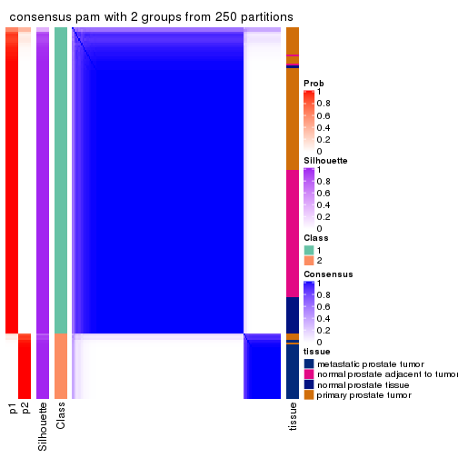</p>

</div>
<div id='tab-SD-pam-consensus-heatmap-2'>
<pre><code class="r">consensus_heatmap(res, k = 3)
</code></pre>

<p>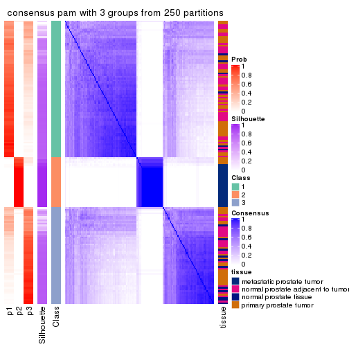</p>

</div>
<div id='tab-SD-pam-consensus-heatmap-3'>
<pre><code class="r">consensus_heatmap(res, k = 4)
</code></pre>

<p>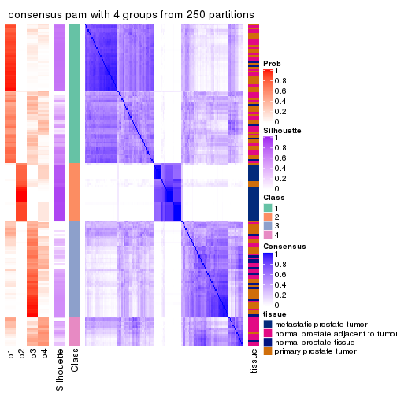</p>

</div>
<div id='tab-SD-pam-consensus-heatmap-4'>
<pre><code class="r">consensus_heatmap(res, k = 5)
</code></pre>

<p>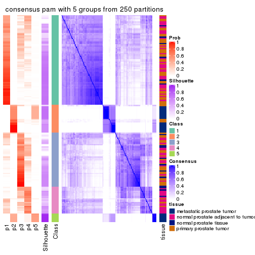</p>

</div>
<div id='tab-SD-pam-consensus-heatmap-5'>
<pre><code class="r">consensus_heatmap(res, k = 6)
</code></pre>

<p>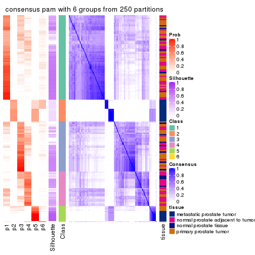</p>

</div>
</div>

Heatmaps for the membership of samples in all partitions to see how consistent they are:


<script>
$( function() {
	$( '#tabs-SD-pam-membership-heatmap' ).tabs();
} );
</script>
<div id='tabs-SD-pam-membership-heatmap'>
<ul>
<li><a href='#tab-SD-pam-membership-heatmap-1'>k = 2</a></li>
<li><a href='#tab-SD-pam-membership-heatmap-2'>k = 3</a></li>
<li><a href='#tab-SD-pam-membership-heatmap-3'>k = 4</a></li>
<li><a href='#tab-SD-pam-membership-heatmap-4'>k = 5</a></li>
<li><a href='#tab-SD-pam-membership-heatmap-5'>k = 6</a></li>
</ul>
<div id='tab-SD-pam-membership-heatmap-1'>
<pre><code class="r">membership_heatmap(res, k = 2)
</code></pre>

<p>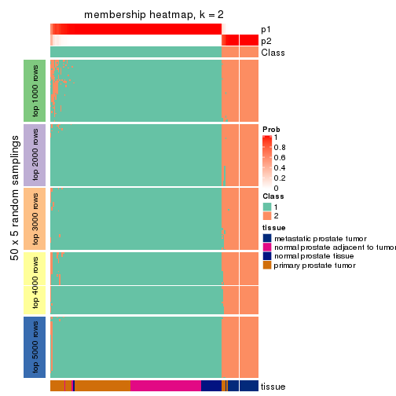</p>

</div>
<div id='tab-SD-pam-membership-heatmap-2'>
<pre><code class="r">membership_heatmap(res, k = 3)
</code></pre>

<p>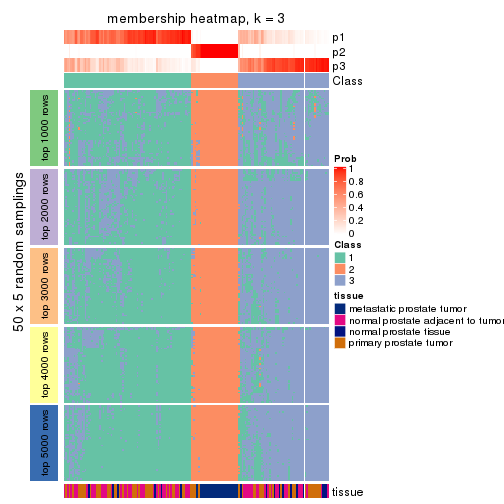</p>

</div>
<div id='tab-SD-pam-membership-heatmap-3'>
<pre><code class="r">membership_heatmap(res, k = 4)
</code></pre>

<p>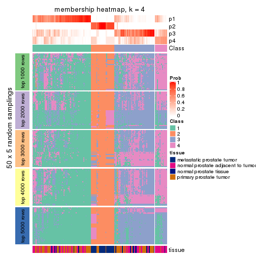</p>

</div>
<div id='tab-SD-pam-membership-heatmap-4'>
<pre><code class="r">membership_heatmap(res, k = 5)
</code></pre>

<p>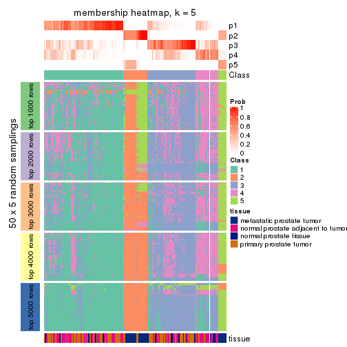</p>

</div>
<div id='tab-SD-pam-membership-heatmap-5'>
<pre><code class="r">membership_heatmap(res, k = 6)
</code></pre>

<p>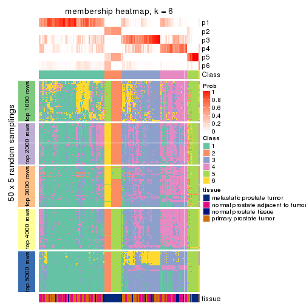</p>

</div>
</div>

As soon as we have had the classes for columns, we can look for signatures
which are significantly different between classes which can be candidate marks
for certain classes. Following are the heatmaps for signatures.


Signature heatmaps where rows are scaled:


<script>
$( function() {
	$( '#tabs-SD-pam-get-signatures' ).tabs();
} );
</script>
<div id='tabs-SD-pam-get-signatures'>
<ul>
<li><a href='#tab-SD-pam-get-signatures-1'>k = 2</a></li>
<li><a href='#tab-SD-pam-get-signatures-2'>k = 3</a></li>
<li><a href='#tab-SD-pam-get-signatures-3'>k = 4</a></li>
<li><a href='#tab-SD-pam-get-signatures-4'>k = 5</a></li>
<li><a href='#tab-SD-pam-get-signatures-5'>k = 6</a></li>
</ul>
<div id='tab-SD-pam-get-signatures-1'>
<pre><code class="r">get_signatures(res, k = 2)
</code></pre>

<p>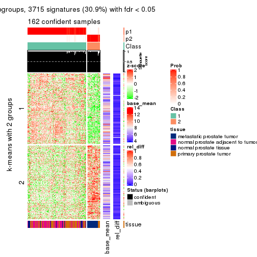</p>

</div>
<div id='tab-SD-pam-get-signatures-2'>
<pre><code class="r">get_signatures(res, k = 3)
</code></pre>

<p>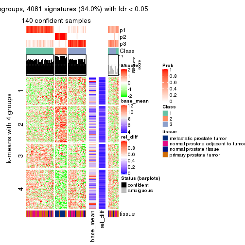</p>

</div>
<div id='tab-SD-pam-get-signatures-3'>
<pre><code class="r">get_signatures(res, k = 4)
</code></pre>

<p>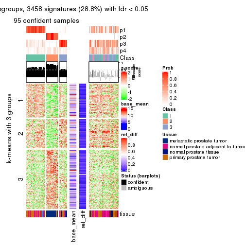</p>

</div>
<div id='tab-SD-pam-get-signatures-4'>
<pre><code class="r">get_signatures(res, k = 5)
</code></pre>

<p>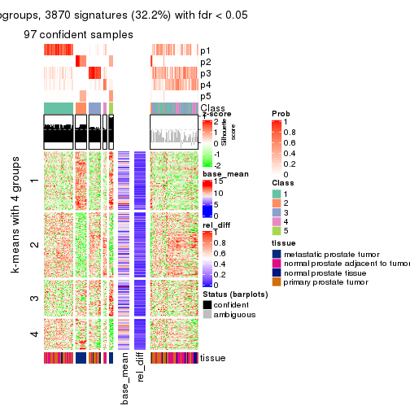</p>

</div>
<div id='tab-SD-pam-get-signatures-5'>
<pre><code class="r">get_signatures(res, k = 6)
</code></pre>

<p>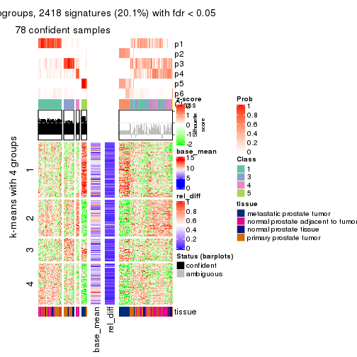</p>

</div>
</div>


Signature heatmaps where rows are not scaled:


<script>
$( function() {
	$( '#tabs-SD-pam-get-signatures-no-scale' ).tabs();
} );
</script>
<div id='tabs-SD-pam-get-signatures-no-scale'>
<ul>
<li><a href='#tab-SD-pam-get-signatures-no-scale-1'>k = 2</a></li>
<li><a href='#tab-SD-pam-get-signatures-no-scale-2'>k = 3</a></li>
<li><a href='#tab-SD-pam-get-signatures-no-scale-3'>k = 4</a></li>
<li><a href='#tab-SD-pam-get-signatures-no-scale-4'>k = 5</a></li>
<li><a href='#tab-SD-pam-get-signatures-no-scale-5'>k = 6</a></li>
</ul>
<div id='tab-SD-pam-get-signatures-no-scale-1'>
<pre><code class="r">get_signatures(res, k = 2, scale_rows = FALSE)
</code></pre>

<p>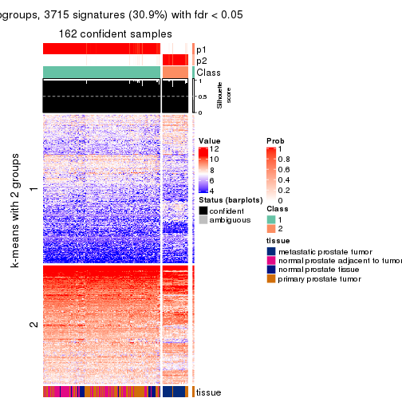</p>

</div>
<div id='tab-SD-pam-get-signatures-no-scale-2'>
<pre><code class="r">get_signatures(res, k = 3, scale_rows = FALSE)
</code></pre>

<p>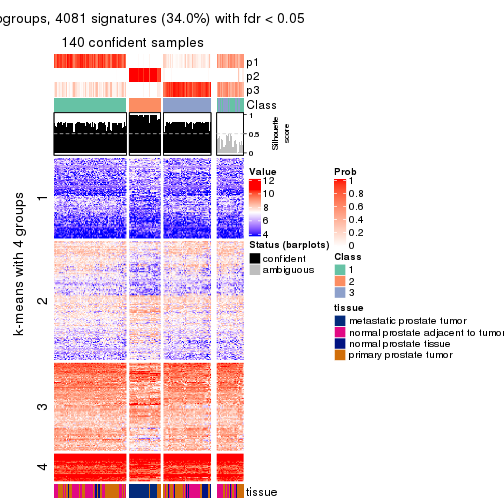</p>

</div>
<div id='tab-SD-pam-get-signatures-no-scale-3'>
<pre><code class="r">get_signatures(res, k = 4, scale_rows = FALSE)
</code></pre>

<p>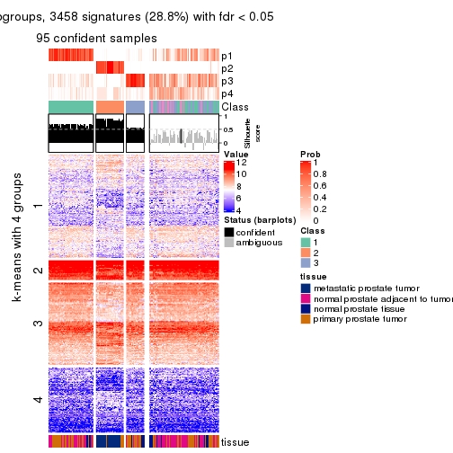</p>

</div>
<div id='tab-SD-pam-get-signatures-no-scale-4'>
<pre><code class="r">get_signatures(res, k = 5, scale_rows = FALSE)
</code></pre>

<p>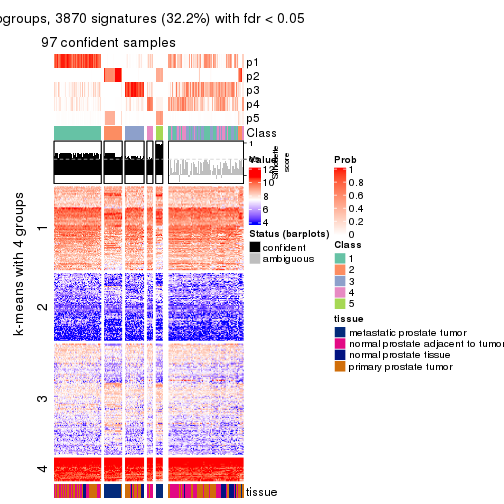</p>

</div>
<div id='tab-SD-pam-get-signatures-no-scale-5'>
<pre><code class="r">get_signatures(res, k = 6, scale_rows = FALSE)
</code></pre>

<p>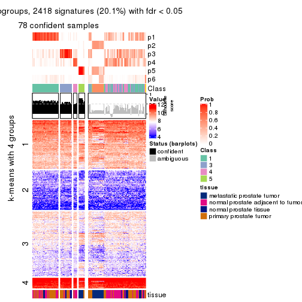</p>

</div>
</div>


Compare the overlap of signatures from different k:

```r
compare_signatures(res)
```

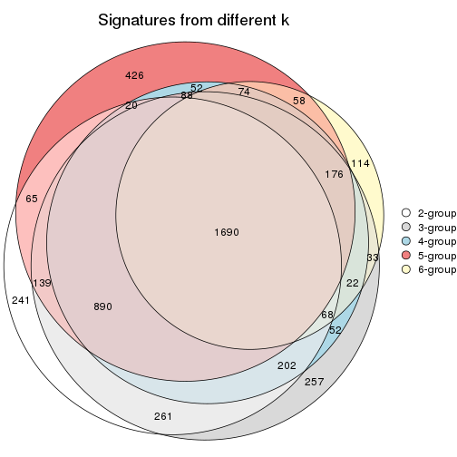

`get_signature()` returns a data frame invisibly. TO get the list of signatures, the function
call should be assigned to a variable explicitly. In following code, if `plot` argument is set
to `FALSE`, no heatmap is plotted while only the differential analysis is performed.

```r
# code only for demonstration
tb = get_signature(res, k = ..., plot = FALSE)
```

An example of the output of `tb` is:

```
#>   which_row         fdr    mean_1    mean_2 scaled_mean_1 scaled_mean_2 km
#> 1        38 0.042760348  8.373488  9.131774    -0.5533452     0.5164555  1
#> 2        40 0.018707592  7.106213  8.469186    -0.6173731     0.5762149  1
#> 3        55 0.019134737 10.221463 11.207825    -0.6159697     0.5749050  1
#> 4        59 0.006059896  5.921854  7.869574    -0.6899429     0.6439467  1
#> 5        60 0.018055526  8.928898 10.211722    -0.6204761     0.5791110  1
#> 6        98 0.009384629 15.714769 14.887706     0.6635654    -0.6193277  2
...
```

The columns in `tb` are:

1. `which_row`: row indices corresponding to the input matrix.
2. `fdr`: FDR for the differential test. 
3. `mean_x`: The mean value in group x.
4. `scaled_mean_x`: The mean value in group x after rows are scaled.
5. `km`: Row groups if k-means clustering is applied to rows.


UMAP plot which shows how samples are separated.


<script>
$( function() {
	$( '#tabs-SD-pam-dimension-reduction' ).tabs();
} );
</script>
<div id='tabs-SD-pam-dimension-reduction'>
<ul>
<li><a href='#tab-SD-pam-dimension-reduction-1'>k = 2</a></li>
<li><a href='#tab-SD-pam-dimension-reduction-2'>k = 3</a></li>
<li><a href='#tab-SD-pam-dimension-reduction-3'>k = 4</a></li>
<li><a href='#tab-SD-pam-dimension-reduction-4'>k = 5</a></li>
<li><a href='#tab-SD-pam-dimension-reduction-5'>k = 6</a></li>
</ul>
<div id='tab-SD-pam-dimension-reduction-1'>
<pre><code class="r">dimension_reduction(res, k = 2, method = &quot;UMAP&quot;)
</code></pre>

<p>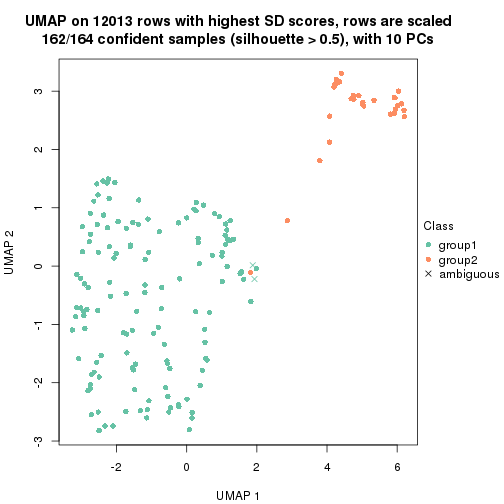</p>

</div>
<div id='tab-SD-pam-dimension-reduction-2'>
<pre><code class="r">dimension_reduction(res, k = 3, method = &quot;UMAP&quot;)
</code></pre>

<p>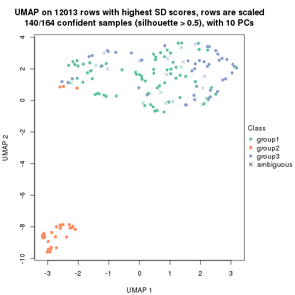</p>

</div>
<div id='tab-SD-pam-dimension-reduction-3'>
<pre><code class="r">dimension_reduction(res, k = 4, method = &quot;UMAP&quot;)
</code></pre>

<p>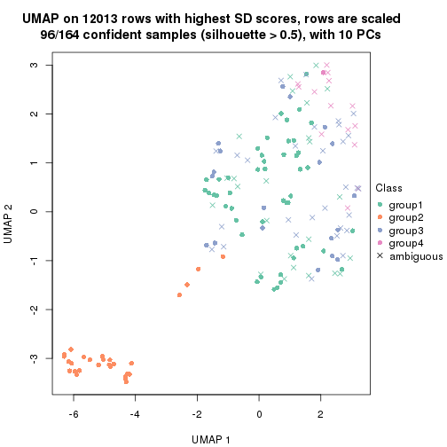</p>

</div>
<div id='tab-SD-pam-dimension-reduction-4'>
<pre><code class="r">dimension_reduction(res, k = 5, method = &quot;UMAP&quot;)
</code></pre>

<p>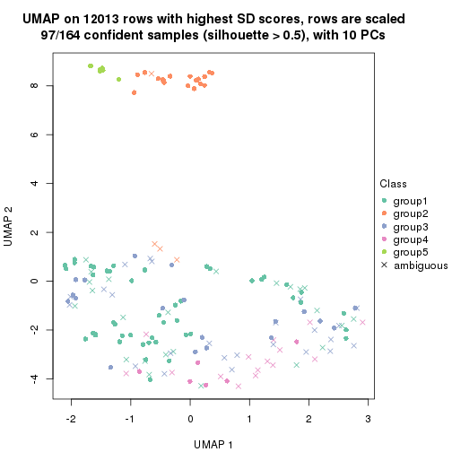</p>

</div>
<div id='tab-SD-pam-dimension-reduction-5'>
<pre><code class="r">dimension_reduction(res, k = 6, method = &quot;UMAP&quot;)
</code></pre>

<p>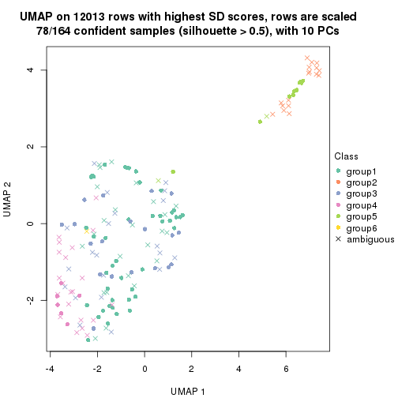</p>

</div>
</div>


Following heatmap shows how subgroups are split when increasing `k`:

```r
collect_classes(res)
```

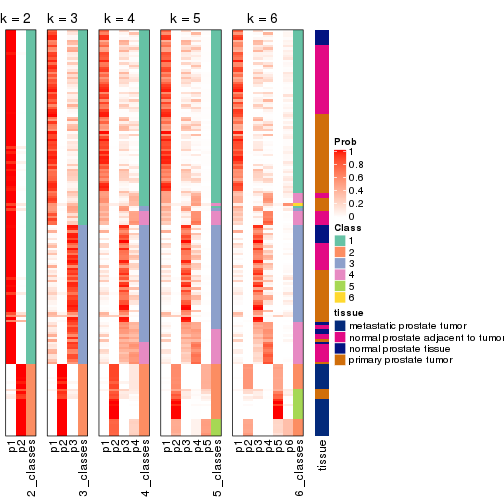


Test correlation between subgroups and known annotations. If the known
annotation is numeric, one-way ANOVA test is applied, and if the known
annotation is discrete, chi-squared contingency table test is applied.

```r
test_to_known_factors(res)
```

```
#>          n tissue(p) k
#> SD:pam 162  2.11e-29 2
#> SD:pam 140  2.22e-24 3
#> SD:pam  96  2.26e-15 4
#> SD:pam  97  1.98e-17 5
#> SD:pam  78  3.06e-12 6
```


If matrix rows can be associated to genes, consider to use `functional_enrichment(res,
...)` to perform function enrichment for the signature genes. See [this vignette](http://bioconductor.org/packages/devel/bioc/vignettes/cola/inst/doc/functional_enrichment.html) for more detailed explanations.


 

---------------------------------------------------


### SD:mclust**


The object with results only for a single top-value method and a single partition method 
can be extracted as:

```r
res = res_list["SD", "mclust"]
# you can also extract it by
# res = res_list["SD:mclust"]
```

A summary of `res` and all the functions that can be applied to it:

```r
res
```

```
#> A 'ConsensusPartition' object with k = 2, 3, 4, 5, 6.
#>   On a matrix with 12013 rows and 164 columns.
#>   Top rows (1000, 2000, 3000, 4000, 5000) are extracted by 'SD' method.
#>   Subgroups are detected by 'mclust' method.
#>   Performed in total 1250 partitions by row resampling.
#>   Best k for subgroups seems to be 2.
#> 
#> Following methods can be applied to this 'ConsensusPartition' object:
#>  [1] "cola_report"             "collect_classes"         "collect_plots"          
#>  [4] "collect_stats"           "colnames"                "compare_signatures"     
#>  [7] "consensus_heatmap"       "dimension_reduction"     "functional_enrichment"  
#> [10] "get_anno_col"            "get_anno"                "get_classes"            
#> [13] "get_consensus"           "get_matrix"              "get_membership"         
#> [16] "get_param"               "get_signatures"          "get_stats"              
#> [19] "is_best_k"               "is_stable_k"             "membership_heatmap"     
#> [22] "ncol"                    "nrow"                    "plot_ecdf"              
#> [25] "rownames"                "select_partition_number" "show"                   
#> [28] "suggest_best_k"          "test_to_known_factors"
```

`collect_plots()` function collects all the plots made from `res` for all `k` (number of partitions)
into one single page to provide an easy and fast comparison between different `k`.

```r
collect_plots(res)
```

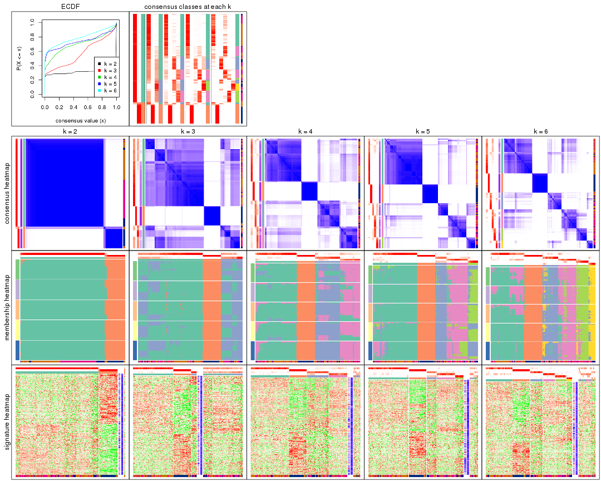

The plots are:

- The first row: a plot of the ECDF (empirical cumulative distribution
  function) curves of the consensus matrix for each `k` and the heatmap of
  predicted classes for each `k`.
- The second row: heatmaps of the consensus matrix for each `k`.
- The third row: heatmaps of the membership matrix for each `k`.
- The fouth row: heatmaps of the signatures for each `k`.

All the plots in panels can be made by individual functions and they are
plotted later in this section.

`select_partition_number()` produces several plots showing different
statistics for choosing "optimized" `k`. There are following statistics:

- ECDF curves of the consensus matrix for each `k`;
- 1-PAC. [The PAC
  score](https://en.wikipedia.org/wiki/Consensus_clustering#Over-interpretation_potential_of_consensus_clustering)
  measures the proportion of the ambiguous subgrouping.
- Mean silhouette score.
- Concordance. The mean probability of fiting the consensus class ids in all
  partitions.
- Area increased. Denote $A_k$ as the area under the ECDF curve for current
  `k`, the area increased is defined as $A_k - A_{k-1}$.
- Rand index. The percent of pairs of samples that are both in a same cluster
  or both are not in a same cluster in the partition of k and k-1.
- Jaccard index. The ratio of pairs of samples are both in a same cluster in
  the partition of k and k-1 and the pairs of samples are both in a same
  cluster in the partition k or k-1.

The detailed explanations of these statistics can be found in [the _cola_
vignette](http://bioconductor.org/packages/devel/bioc/vignettes/cola/inst/doc/cola.html#toc_13).

Generally speaking, lower PAC score, higher mean silhouette score or higher
concordance corresponds to better partition. Rand index and Jaccard index
measure how similar the current partition is compared to partition with `k-1`.
If they are too similar, we won't accept `k` is better than `k-1`.

```r
select_partition_number(res)
```

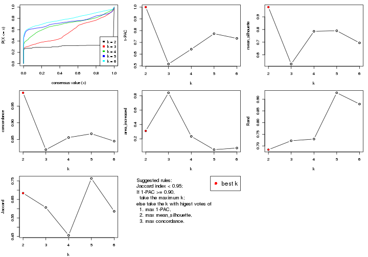

The numeric values for all these statistics can be obtained by `get_stats()`.

```r
get_stats(res)
```

```
#>   k 1-PAC mean_silhouette concordance area_increased  Rand Jaccard
#> 2 2 1.000           0.977       0.990         0.3103 0.684   0.684
#> 3 3 0.516           0.528       0.819         0.8417 0.722   0.607
#> 4 4 0.642           0.786       0.856         0.2342 0.729   0.456
#> 5 5 0.774           0.790       0.867         0.0490 0.928   0.763
#> 6 6 0.734           0.695       0.845         0.0721 0.880   0.586
```

`suggest_best_k()` suggests the best $k$ based on these statistics. The rules are as follows:

- All $k$ with Jaccard index larger than 0.95 are removed because increasing
  $k$ does not provide enough extra information. If all $k$ are removed, it is
  marked as no subgroup is detected.
- For all $k$ with 1-PAC score larger than 0.9, the maximal $k$ is taken as
  the best $k$, and other $k$ are marked as optional $k$.
- If it does not fit the second rule. The $k$ with the maximal vote of the
  highest 1-PAC score, highest mean silhouette, and highest concordance is
  taken as the best $k$.

```r
suggest_best_k(res)
```

```
#> [1] 2
```


Following shows the table of the partitions (You need to click the **show/hide
code output** link to see it). The membership matrix (columns with name `p*`)
is inferred by
[`clue::cl_consensus()`](https://www.rdocumentation.org/link/cl_consensus?package=clue)
function with the `SE` method. Basically the value in the membership matrix
represents the probability to belong to a certain group. The finall class
label for an item is determined with the group with highest probability it
belongs to.

In `get_classes()` function, the entropy is calculated from the membership
matrix and the silhouette score is calculated from the consensus matrix.


<script>
$( function() {
	$( '#tabs-SD-mclust-get-classes' ).tabs();
} );
</script>
<div id='tabs-SD-mclust-get-classes'>
<ul>
<li><a href='#tab-SD-mclust-get-classes-1'>k = 2</a></li>
<li><a href='#tab-SD-mclust-get-classes-2'>k = 3</a></li>
<li><a href='#tab-SD-mclust-get-classes-3'>k = 4</a></li>
<li><a href='#tab-SD-mclust-get-classes-4'>k = 5</a></li>
<li><a href='#tab-SD-mclust-get-classes-5'>k = 6</a></li>
</ul>

<div id='tab-SD-mclust-get-classes-1'>
<p><a id='tab-SD-mclust-get-classes-1-a' style='color:#0366d6' href='#'>show/hide code output</a></p>
<pre><code class="r">cbind(get_classes(res, k = 2), get_membership(res, k = 2))
</code></pre>

<pre><code>#&gt;           class entropy silhouette    p1    p2
#&gt; GSM152839     1  0.0000      0.997 1.000 0.000
#&gt; GSM152840     1  0.0000      0.997 1.000 0.000
#&gt; GSM152841     1  0.0000      0.997 1.000 0.000
#&gt; GSM152842     1  0.0376      0.993 0.996 0.004
#&gt; GSM152843     1  0.0376      0.993 0.996 0.004
#&gt; GSM152844     1  0.0000      0.997 1.000 0.000
#&gt; GSM152845     1  0.4815      0.880 0.896 0.104
#&gt; GSM152846     1  0.0000      0.997 1.000 0.000
#&gt; GSM152847     1  0.0376      0.993 0.996 0.004
#&gt; GSM152848     1  0.0000      0.997 1.000 0.000
#&gt; GSM152849     1  0.0000      0.997 1.000 0.000
#&gt; GSM152850     1  0.0000      0.997 1.000 0.000
#&gt; GSM152851     1  0.0000      0.997 1.000 0.000
#&gt; GSM152852     1  0.0000      0.997 1.000 0.000
#&gt; GSM152853     1  0.0000      0.997 1.000 0.000
#&gt; GSM152854     1  0.0000      0.997 1.000 0.000
#&gt; GSM152855     1  0.0000      0.997 1.000 0.000
#&gt; GSM153238     1  0.0000      0.997 1.000 0.000
#&gt; GSM153239     1  0.0000      0.997 1.000 0.000
#&gt; GSM153240     1  0.0000      0.997 1.000 0.000
#&gt; GSM153241     1  0.0000      0.997 1.000 0.000
#&gt; GSM153242     1  0.0000      0.997 1.000 0.000
#&gt; GSM153243     1  0.1184      0.982 0.984 0.016
#&gt; GSM153244     1  0.0000      0.997 1.000 0.000
#&gt; GSM153245     1  0.0000      0.997 1.000 0.000
#&gt; GSM153246     1  0.0000      0.997 1.000 0.000
#&gt; GSM153247     1  0.0000      0.997 1.000 0.000
#&gt; GSM153248     1  0.0000      0.997 1.000 0.000
#&gt; GSM153249     1  0.0000      0.997 1.000 0.000
#&gt; GSM153250     1  0.0000      0.997 1.000 0.000
#&gt; GSM153251     1  0.0000      0.997 1.000 0.000
#&gt; GSM153252     1  0.0000      0.997 1.000 0.000
#&gt; GSM153253     1  0.0000      0.997 1.000 0.000
#&gt; GSM153254     1  0.0000      0.997 1.000 0.000
#&gt; GSM153255     1  0.0000      0.997 1.000 0.000
#&gt; GSM153256     1  0.0000      0.997 1.000 0.000
#&gt; GSM153257     1  0.0000      0.997 1.000 0.000
#&gt; GSM153258     1  0.0000      0.997 1.000 0.000
#&gt; GSM153259     1  0.0000      0.997 1.000 0.000
#&gt; GSM153260     1  0.0000      0.997 1.000 0.000
#&gt; GSM153261     1  0.0000      0.997 1.000 0.000
#&gt; GSM153262     1  0.0000      0.997 1.000 0.000
#&gt; GSM153263     1  0.0000      0.997 1.000 0.000
#&gt; GSM153264     1  0.0000      0.997 1.000 0.000
#&gt; GSM153265     1  0.0000      0.997 1.000 0.000
#&gt; GSM153266     1  0.0000      0.997 1.000 0.000
#&gt; GSM153267     1  0.0000      0.997 1.000 0.000
#&gt; GSM153268     1  0.0000      0.997 1.000 0.000
#&gt; GSM153269     1  0.0000      0.997 1.000 0.000
#&gt; GSM153270     1  0.0000      0.997 1.000 0.000
#&gt; GSM153271     1  0.0000      0.997 1.000 0.000
#&gt; GSM153272     1  0.0000      0.997 1.000 0.000
#&gt; GSM153273     1  0.0000      0.997 1.000 0.000
#&gt; GSM153274     1  0.0000      0.997 1.000 0.000
#&gt; GSM153275     1  0.0000      0.997 1.000 0.000
#&gt; GSM153276     1  0.0000      0.997 1.000 0.000
#&gt; GSM153277     1  0.0000      0.997 1.000 0.000
#&gt; GSM153278     1  0.0000      0.997 1.000 0.000
#&gt; GSM153279     1  0.0000      0.997 1.000 0.000
#&gt; GSM153280     1  0.0000      0.997 1.000 0.000
#&gt; GSM153281     1  0.0000      0.997 1.000 0.000
#&gt; GSM153282     1  0.0000      0.997 1.000 0.000
#&gt; GSM153283     1  0.0000      0.997 1.000 0.000
#&gt; GSM153284     1  0.0000      0.997 1.000 0.000
#&gt; GSM153285     1  0.0000      0.997 1.000 0.000
#&gt; GSM153286     1  0.0000      0.997 1.000 0.000
#&gt; GSM153287     1  0.0000      0.997 1.000 0.000
#&gt; GSM153288     1  0.0000      0.997 1.000 0.000
#&gt; GSM153289     1  0.0000      0.997 1.000 0.000
#&gt; GSM153290     1  0.0000      0.997 1.000 0.000
#&gt; GSM153291     1  0.0000      0.997 1.000 0.000
#&gt; GSM153292     1  0.0000      0.997 1.000 0.000
#&gt; GSM153293     1  0.0000      0.997 1.000 0.000
#&gt; GSM153294     1  0.0000      0.997 1.000 0.000
#&gt; GSM153295     1  0.0000      0.997 1.000 0.000
#&gt; GSM153054     1  0.0000      0.997 1.000 0.000
#&gt; GSM153055     1  0.0000      0.997 1.000 0.000
#&gt; GSM153056     1  0.0000      0.997 1.000 0.000
#&gt; GSM153057     1  0.0000      0.997 1.000 0.000
#&gt; GSM153058     1  0.0000      0.997 1.000 0.000
#&gt; GSM153059     1  0.0000      0.997 1.000 0.000
#&gt; GSM153060     1  0.0000      0.997 1.000 0.000
#&gt; GSM153061     1  0.0000      0.997 1.000 0.000
#&gt; GSM153062     1  0.0000      0.997 1.000 0.000
#&gt; GSM153063     1  0.0000      0.997 1.000 0.000
#&gt; GSM153064     1  0.0000      0.997 1.000 0.000
#&gt; GSM153065     1  0.0000      0.997 1.000 0.000
#&gt; GSM153066     2  0.9661      0.392 0.392 0.608
#&gt; GSM153067     1  0.0000      0.997 1.000 0.000
#&gt; GSM153068     1  0.0000      0.997 1.000 0.000
#&gt; GSM153069     1  0.0000      0.997 1.000 0.000
#&gt; GSM153070     1  0.0000      0.997 1.000 0.000
#&gt; GSM153071     1  0.0000      0.997 1.000 0.000
#&gt; GSM153072     1  0.0000      0.997 1.000 0.000
#&gt; GSM153073     1  0.0000      0.997 1.000 0.000
#&gt; GSM153074     1  0.0000      0.997 1.000 0.000
#&gt; GSM153075     1  0.0000      0.997 1.000 0.000
#&gt; GSM153076     1  0.0000      0.997 1.000 0.000
#&gt; GSM153077     1  0.0000      0.997 1.000 0.000
#&gt; GSM153078     1  0.0000      0.997 1.000 0.000
#&gt; GSM153079     1  0.0672      0.990 0.992 0.008
#&gt; GSM153080     1  0.0000      0.997 1.000 0.000
#&gt; GSM153081     1  0.0000      0.997 1.000 0.000
#&gt; GSM153082     1  0.2043      0.966 0.968 0.032
#&gt; GSM153083     1  0.2423      0.958 0.960 0.040
#&gt; GSM153084     2  0.9815      0.315 0.420 0.580
#&gt; GSM153085     1  0.0000      0.997 1.000 0.000
#&gt; GSM153086     1  0.0376      0.993 0.996 0.004
#&gt; GSM153087     1  0.0000      0.997 1.000 0.000
#&gt; GSM153088     1  0.0000      0.997 1.000 0.000
#&gt; GSM153089     1  0.0000      0.997 1.000 0.000
#&gt; GSM153090     1  0.0000      0.997 1.000 0.000
#&gt; GSM153091     1  0.0672      0.990 0.992 0.008
#&gt; GSM153092     1  0.0000      0.997 1.000 0.000
#&gt; GSM153093     1  0.0000      0.997 1.000 0.000
#&gt; GSM153094     1  0.1633      0.974 0.976 0.024
#&gt; GSM153095     1  0.0000      0.997 1.000 0.000
#&gt; GSM153096     1  0.0000      0.997 1.000 0.000
#&gt; GSM153097     1  0.0376      0.993 0.996 0.004
#&gt; GSM153098     1  0.0376      0.993 0.996 0.004
#&gt; GSM153099     1  0.0000      0.997 1.000 0.000
#&gt; GSM153100     1  0.0000      0.997 1.000 0.000
#&gt; GSM153101     1  0.0000      0.997 1.000 0.000
#&gt; GSM153102     1  0.0672      0.990 0.992 0.008
#&gt; GSM153103     1  0.0000      0.997 1.000 0.000
#&gt; GSM153104     1  0.0000      0.997 1.000 0.000
#&gt; GSM153106     1  0.0000      0.997 1.000 0.000
#&gt; GSM153107     1  0.0000      0.997 1.000 0.000
#&gt; GSM153108     1  0.0000      0.997 1.000 0.000
#&gt; GSM153109     1  0.5519      0.850 0.872 0.128
#&gt; GSM153110     1  0.0376      0.993 0.996 0.004
#&gt; GSM153111     1  0.1414      0.979 0.980 0.020
#&gt; GSM153112     1  0.0000      0.997 1.000 0.000
#&gt; GSM153113     2  0.8861      0.582 0.304 0.696
#&gt; GSM153114     1  0.0000      0.997 1.000 0.000
#&gt; GSM187532     2  0.0000      0.961 0.000 1.000
#&gt; GSM187533     2  0.0000      0.961 0.000 1.000
#&gt; GSM187534     2  0.0000      0.961 0.000 1.000
#&gt; GSM187535     2  0.4431      0.877 0.092 0.908
#&gt; GSM152906     2  0.0000      0.961 0.000 1.000
#&gt; GSM152907     2  0.0000      0.961 0.000 1.000
#&gt; GSM152908     2  0.0000      0.961 0.000 1.000
#&gt; GSM152909     2  0.0000      0.961 0.000 1.000
#&gt; GSM152910     2  0.0000      0.961 0.000 1.000
#&gt; GSM152911     2  0.0000      0.961 0.000 1.000
#&gt; GSM152912     2  0.0000      0.961 0.000 1.000
#&gt; GSM152913     2  0.0000      0.961 0.000 1.000
#&gt; GSM152914     2  0.0000      0.961 0.000 1.000
#&gt; GSM152915     2  0.0000      0.961 0.000 1.000
#&gt; GSM152916     2  0.0000      0.961 0.000 1.000
#&gt; GSM152917     2  0.0000      0.961 0.000 1.000
#&gt; GSM152918     2  0.0000      0.961 0.000 1.000
#&gt; GSM152919     2  0.0000      0.961 0.000 1.000
#&gt; GSM152920     2  0.0000      0.961 0.000 1.000
#&gt; GSM152921     2  0.0000      0.961 0.000 1.000
#&gt; GSM152922     2  0.0000      0.961 0.000 1.000
#&gt; GSM152923     2  0.0000      0.961 0.000 1.000
#&gt; GSM152924     2  0.0000      0.961 0.000 1.000
#&gt; GSM152925     2  0.0000      0.961 0.000 1.000
#&gt; GSM152926     2  0.0000      0.961 0.000 1.000
#&gt; GSM152927     2  0.0000      0.961 0.000 1.000
#&gt; GSM152928     2  0.0000      0.961 0.000 1.000
#&gt; GSM152929     2  0.0000      0.961 0.000 1.000
#&gt; GSM152930     2  0.0000      0.961 0.000 1.000
</code></pre>

<script>
$('#tab-SD-mclust-get-classes-1-a').parent().next().next().hide();
$('#tab-SD-mclust-get-classes-1-a').click(function(){
  $('#tab-SD-mclust-get-classes-1-a').parent().next().next().toggle();
  return(false);
});
</script>
</div>

<div id='tab-SD-mclust-get-classes-2'>
<p><a id='tab-SD-mclust-get-classes-2-a' style='color:#0366d6' href='#'>show/hide code output</a></p>
<pre><code class="r">cbind(get_classes(res, k = 3), get_membership(res, k = 3))
</code></pre>

<pre><code>#&gt;           class entropy silhouette    p1    p2    p3
#&gt; GSM152839     1  0.3879     0.5640 0.848 0.000 0.152
#&gt; GSM152840     3  0.0747     0.5193 0.016 0.000 0.984
#&gt; GSM152841     3  0.6215     0.4041 0.428 0.000 0.572
#&gt; GSM152842     1  0.6274     0.0914 0.544 0.000 0.456
#&gt; GSM152843     1  0.6267     0.0978 0.548 0.000 0.452
#&gt; GSM152844     3  0.0747     0.5193 0.016 0.000 0.984
#&gt; GSM152845     3  0.6033     0.2344 0.336 0.004 0.660
#&gt; GSM152846     3  0.0747     0.5193 0.016 0.000 0.984
#&gt; GSM152847     1  0.6274     0.0914 0.544 0.000 0.456
#&gt; GSM152848     1  0.0237     0.6900 0.996 0.000 0.004
#&gt; GSM152849     1  0.6291     0.0735 0.532 0.000 0.468
#&gt; GSM152850     1  0.6008     0.2201 0.628 0.000 0.372
#&gt; GSM152851     3  0.6215     0.4041 0.428 0.000 0.572
#&gt; GSM152852     3  0.0747     0.5193 0.016 0.000 0.984
#&gt; GSM152853     3  0.0747     0.5193 0.016 0.000 0.984
#&gt; GSM152854     3  0.5591     0.2795 0.304 0.000 0.696
#&gt; GSM152855     1  0.5905     0.2153 0.648 0.000 0.352
#&gt; GSM153238     1  0.6235     0.1234 0.564 0.000 0.436
#&gt; GSM153239     3  0.1163     0.5192 0.028 0.000 0.972
#&gt; GSM153240     1  0.6168     0.0207 0.588 0.000 0.412
#&gt; GSM153241     1  0.6235     0.1246 0.564 0.000 0.436
#&gt; GSM153242     3  0.0747     0.5193 0.016 0.000 0.984
#&gt; GSM153243     1  0.6252     0.1105 0.556 0.000 0.444
#&gt; GSM153244     3  0.6235     0.3912 0.436 0.000 0.564
#&gt; GSM153245     3  0.0747     0.5193 0.016 0.000 0.984
#&gt; GSM153246     3  0.6295     0.0262 0.472 0.000 0.528
#&gt; GSM153247     1  0.4121     0.5455 0.832 0.000 0.168
#&gt; GSM153248     1  0.0000     0.6905 1.000 0.000 0.000
#&gt; GSM153249     3  0.6309     0.2644 0.500 0.000 0.500
#&gt; GSM153250     1  0.1289     0.6857 0.968 0.000 0.032
#&gt; GSM153251     3  0.5138     0.3451 0.252 0.000 0.748
#&gt; GSM153252     1  0.6140     0.0697 0.596 0.000 0.404
#&gt; GSM153253     3  0.6215     0.4041 0.428 0.000 0.572
#&gt; GSM153254     1  0.4702     0.5374 0.788 0.000 0.212
#&gt; GSM153255     1  0.6192     0.0177 0.580 0.000 0.420
#&gt; GSM153256     1  0.4002     0.5845 0.840 0.000 0.160
#&gt; GSM153257     1  0.6140     0.0703 0.596 0.000 0.404
#&gt; GSM153258     1  0.0424     0.6908 0.992 0.000 0.008
#&gt; GSM153259     1  0.0237     0.6910 0.996 0.000 0.004
#&gt; GSM153260     1  0.6274     0.0914 0.544 0.000 0.456
#&gt; GSM153261     1  0.6299     0.0584 0.524 0.000 0.476
#&gt; GSM153262     1  0.6267    -0.1108 0.548 0.000 0.452
#&gt; GSM153263     1  0.1964     0.6775 0.944 0.000 0.056
#&gt; GSM153264     1  0.0000     0.6905 1.000 0.000 0.000
#&gt; GSM153265     3  0.6215     0.4041 0.428 0.000 0.572
#&gt; GSM153266     1  0.0237     0.6900 0.996 0.000 0.004
#&gt; GSM153267     1  0.3038     0.6474 0.896 0.000 0.104
#&gt; GSM153268     3  0.6126     0.4168 0.400 0.000 0.600
#&gt; GSM153269     1  0.3412     0.6262 0.876 0.000 0.124
#&gt; GSM153270     1  0.3816     0.5995 0.852 0.000 0.148
#&gt; GSM153271     1  0.2448     0.6666 0.924 0.000 0.076
#&gt; GSM153272     1  0.6168     0.0449 0.588 0.000 0.412
#&gt; GSM153273     1  0.0237     0.6910 0.996 0.000 0.004
#&gt; GSM153274     1  0.2878     0.6543 0.904 0.000 0.096
#&gt; GSM153275     1  0.5058     0.4572 0.756 0.000 0.244
#&gt; GSM153276     1  0.4504     0.5293 0.804 0.000 0.196
#&gt; GSM153277     3  0.6309     0.2537 0.496 0.000 0.504
#&gt; GSM153278     1  0.6180     0.1540 0.584 0.000 0.416
#&gt; GSM153279     3  0.6286     0.3357 0.464 0.000 0.536
#&gt; GSM153280     3  0.6215     0.4041 0.428 0.000 0.572
#&gt; GSM153281     3  0.6299     0.3099 0.476 0.000 0.524
#&gt; GSM153282     3  0.6215     0.4041 0.428 0.000 0.572
#&gt; GSM153283     1  0.0237     0.6900 0.996 0.000 0.004
#&gt; GSM153284     1  0.6126     0.0829 0.600 0.000 0.400
#&gt; GSM153285     3  0.6225     0.3992 0.432 0.000 0.568
#&gt; GSM153286     1  0.6111     0.0938 0.604 0.000 0.396
#&gt; GSM153287     1  0.6309    -0.2820 0.504 0.000 0.496
#&gt; GSM153288     1  0.5859     0.2374 0.656 0.000 0.344
#&gt; GSM153289     1  0.4346     0.5533 0.816 0.000 0.184
#&gt; GSM153290     3  0.6215     0.4041 0.428 0.000 0.572
#&gt; GSM153291     1  0.6180     0.0209 0.584 0.000 0.416
#&gt; GSM153292     3  0.6244     0.3874 0.440 0.000 0.560
#&gt; GSM153293     1  0.5058     0.4573 0.756 0.000 0.244
#&gt; GSM153294     1  0.0237     0.6910 0.996 0.000 0.004
#&gt; GSM153295     1  0.2625     0.6562 0.916 0.000 0.084
#&gt; GSM153054     1  0.0592     0.6874 0.988 0.000 0.012
#&gt; GSM153055     1  0.2066     0.6704 0.940 0.000 0.060
#&gt; GSM153056     1  0.6180     0.1528 0.584 0.000 0.416
#&gt; GSM153057     1  0.3267     0.6470 0.884 0.000 0.116
#&gt; GSM153058     3  0.6204     0.0888 0.424 0.000 0.576
#&gt; GSM153059     1  0.3941     0.5607 0.844 0.000 0.156
#&gt; GSM153060     3  0.6267     0.0680 0.452 0.000 0.548
#&gt; GSM153061     1  0.6302     0.0496 0.520 0.000 0.480
#&gt; GSM153062     3  0.6111     0.1651 0.396 0.000 0.604
#&gt; GSM153063     3  0.4121     0.4315 0.168 0.000 0.832
#&gt; GSM153064     1  0.0237     0.6910 0.996 0.000 0.004
#&gt; GSM153065     1  0.6274     0.0914 0.544 0.000 0.456
#&gt; GSM153066     1  0.6860     0.4109 0.732 0.176 0.092
#&gt; GSM153067     1  0.6140     0.0266 0.596 0.000 0.404
#&gt; GSM153068     1  0.6302     0.0496 0.520 0.000 0.480
#&gt; GSM153069     3  0.6309     0.2753 0.496 0.000 0.504
#&gt; GSM153070     1  0.1411     0.6841 0.964 0.000 0.036
#&gt; GSM153071     1  0.1289     0.6762 0.968 0.000 0.032
#&gt; GSM153072     1  0.0000     0.6905 1.000 0.000 0.000
#&gt; GSM153073     1  0.0424     0.6906 0.992 0.000 0.008
#&gt; GSM153074     1  0.6126     0.0415 0.600 0.000 0.400
#&gt; GSM153075     1  0.5810     0.2372 0.664 0.000 0.336
#&gt; GSM153076     1  0.1163     0.6862 0.972 0.000 0.028
#&gt; GSM153077     1  0.0000     0.6905 1.000 0.000 0.000
#&gt; GSM153078     1  0.1163     0.6785 0.972 0.000 0.028
#&gt; GSM153079     1  0.0000     0.6905 1.000 0.000 0.000
#&gt; GSM153080     1  0.6308     0.0408 0.508 0.000 0.492
#&gt; GSM153081     1  0.0237     0.6909 0.996 0.000 0.004
#&gt; GSM153082     1  0.0000     0.6905 1.000 0.000 0.000
#&gt; GSM153083     1  0.0000     0.6905 1.000 0.000 0.000
#&gt; GSM153084     1  0.2569     0.6567 0.936 0.032 0.032
#&gt; GSM153085     1  0.0892     0.6827 0.980 0.000 0.020
#&gt; GSM153086     1  0.0000     0.6905 1.000 0.000 0.000
#&gt; GSM153087     1  0.5621     0.3127 0.692 0.000 0.308
#&gt; GSM153088     1  0.0747     0.6878 0.984 0.000 0.016
#&gt; GSM153089     3  0.2165     0.5026 0.064 0.000 0.936
#&gt; GSM153090     1  0.1753     0.6813 0.952 0.000 0.048
#&gt; GSM153091     1  0.0000     0.6905 1.000 0.000 0.000
#&gt; GSM153092     1  0.1860     0.6744 0.948 0.000 0.052
#&gt; GSM153093     1  0.6192     0.0177 0.580 0.000 0.420
#&gt; GSM153094     1  0.0000     0.6905 1.000 0.000 0.000
#&gt; GSM153095     1  0.0747     0.6847 0.984 0.000 0.016
#&gt; GSM153096     1  0.0237     0.6910 0.996 0.000 0.004
#&gt; GSM153097     1  0.0000     0.6905 1.000 0.000 0.000
#&gt; GSM153098     1  0.2878     0.6429 0.904 0.000 0.096
#&gt; GSM153099     1  0.2796     0.6578 0.908 0.000 0.092
#&gt; GSM153100     1  0.1860     0.6744 0.948 0.000 0.052
#&gt; GSM153101     1  0.1529     0.6703 0.960 0.000 0.040
#&gt; GSM153102     1  0.2711     0.6631 0.912 0.000 0.088
#&gt; GSM153103     1  0.0424     0.6883 0.992 0.000 0.008
#&gt; GSM153104     3  0.6307     0.2821 0.488 0.000 0.512
#&gt; GSM153106     1  0.2066     0.6704 0.940 0.000 0.060
#&gt; GSM153107     1  0.0747     0.6894 0.984 0.000 0.016
#&gt; GSM153108     1  0.4291     0.5558 0.820 0.000 0.180
#&gt; GSM153109     1  0.0237     0.6897 0.996 0.000 0.004
#&gt; GSM153110     1  0.0000     0.6905 1.000 0.000 0.000
#&gt; GSM153111     1  0.0000     0.6905 1.000 0.000 0.000
#&gt; GSM153112     1  0.1411     0.6826 0.964 0.000 0.036
#&gt; GSM153113     1  0.2749     0.6393 0.924 0.064 0.012
#&gt; GSM153114     1  0.6168     0.0243 0.588 0.000 0.412
#&gt; GSM187532     2  0.0000     0.9796 0.000 1.000 0.000
#&gt; GSM187533     2  0.0000     0.9796 0.000 1.000 0.000
#&gt; GSM187534     2  0.0000     0.9796 0.000 1.000 0.000
#&gt; GSM187535     2  0.6267     0.1871 0.452 0.548 0.000
#&gt; GSM152906     2  0.0000     0.9796 0.000 1.000 0.000
#&gt; GSM152907     2  0.0000     0.9796 0.000 1.000 0.000
#&gt; GSM152908     2  0.0000     0.9796 0.000 1.000 0.000
#&gt; GSM152909     2  0.0000     0.9796 0.000 1.000 0.000
#&gt; GSM152910     2  0.0000     0.9796 0.000 1.000 0.000
#&gt; GSM152911     2  0.0000     0.9796 0.000 1.000 0.000
#&gt; GSM152912     2  0.0000     0.9796 0.000 1.000 0.000
#&gt; GSM152913     2  0.0000     0.9796 0.000 1.000 0.000
#&gt; GSM152914     2  0.0000     0.9796 0.000 1.000 0.000
#&gt; GSM152915     2  0.0000     0.9796 0.000 1.000 0.000
#&gt; GSM152916     2  0.0000     0.9796 0.000 1.000 0.000
#&gt; GSM152917     2  0.0000     0.9796 0.000 1.000 0.000
#&gt; GSM152918     2  0.0000     0.9796 0.000 1.000 0.000
#&gt; GSM152919     2  0.0000     0.9796 0.000 1.000 0.000
#&gt; GSM152920     2  0.0000     0.9796 0.000 1.000 0.000
#&gt; GSM152921     2  0.0000     0.9796 0.000 1.000 0.000
#&gt; GSM152922     2  0.0000     0.9796 0.000 1.000 0.000
#&gt; GSM152923     2  0.0000     0.9796 0.000 1.000 0.000
#&gt; GSM152924     2  0.0000     0.9796 0.000 1.000 0.000
#&gt; GSM152925     2  0.0000     0.9796 0.000 1.000 0.000
#&gt; GSM152926     2  0.0000     0.9796 0.000 1.000 0.000
#&gt; GSM152927     2  0.0000     0.9796 0.000 1.000 0.000
#&gt; GSM152928     2  0.0424     0.9712 0.008 0.992 0.000
#&gt; GSM152929     2  0.0000     0.9796 0.000 1.000 0.000
#&gt; GSM152930     2  0.0000     0.9796 0.000 1.000 0.000
</code></pre>

<script>
$('#tab-SD-mclust-get-classes-2-a').parent().next().next().hide();
$('#tab-SD-mclust-get-classes-2-a').click(function(){
  $('#tab-SD-mclust-get-classes-2-a').parent().next().next().toggle();
  return(false);
});
</script>
</div>

<div id='tab-SD-mclust-get-classes-3'>
<p><a id='tab-SD-mclust-get-classes-3-a' style='color:#0366d6' href='#'>show/hide code output</a></p>
<pre><code class="r">cbind(get_classes(res, k = 4), get_membership(res, k = 4))
</code></pre>

<pre><code>#&gt;           class entropy silhouette    p1    p2    p3    p4
#&gt; GSM152839     1  0.4936     0.5036 0.652 0.000 0.340 0.008
#&gt; GSM152840     3  0.4585     0.7197 0.000 0.000 0.668 0.332
#&gt; GSM152841     4  0.2773     0.8064 0.116 0.000 0.004 0.880
#&gt; GSM152842     3  0.1792     0.8198 0.068 0.000 0.932 0.000
#&gt; GSM152843     3  0.1867     0.8198 0.072 0.000 0.928 0.000
#&gt; GSM152844     3  0.4477     0.7327 0.000 0.000 0.688 0.312
#&gt; GSM152845     3  0.5111     0.7961 0.056 0.000 0.740 0.204
#&gt; GSM152846     3  0.4608     0.7394 0.004 0.000 0.692 0.304
#&gt; GSM152847     3  0.1867     0.8195 0.072 0.000 0.928 0.000
#&gt; GSM152848     1  0.2466     0.8301 0.900 0.000 0.096 0.004
#&gt; GSM152849     3  0.1792     0.8198 0.068 0.000 0.932 0.000
#&gt; GSM152850     3  0.4134     0.6556 0.260 0.000 0.740 0.000
#&gt; GSM152851     4  0.7034    -0.0284 0.120 0.000 0.412 0.468
#&gt; GSM152852     3  0.4454     0.7354 0.000 0.000 0.692 0.308
#&gt; GSM152853     3  0.4477     0.7327 0.000 0.000 0.688 0.312
#&gt; GSM152854     3  0.5109     0.7986 0.060 0.000 0.744 0.196
#&gt; GSM152855     1  0.6222    -0.2087 0.532 0.000 0.056 0.412
#&gt; GSM153238     3  0.2868     0.7930 0.136 0.000 0.864 0.000
#&gt; GSM153239     3  0.4661     0.7075 0.000 0.000 0.652 0.348
#&gt; GSM153240     4  0.4576     0.8176 0.260 0.000 0.012 0.728
#&gt; GSM153241     3  0.2469     0.8088 0.108 0.000 0.892 0.000
#&gt; GSM153242     3  0.4608     0.7394 0.004 0.000 0.692 0.304
#&gt; GSM153243     3  0.2408     0.8104 0.104 0.000 0.896 0.000
#&gt; GSM153244     4  0.4336     0.7694 0.128 0.000 0.060 0.812
#&gt; GSM153245     3  0.4477     0.7327 0.000 0.000 0.688 0.312
#&gt; GSM153246     3  0.2363     0.8209 0.056 0.000 0.920 0.024
#&gt; GSM153247     3  0.5040     0.4528 0.364 0.000 0.628 0.008
#&gt; GSM153248     1  0.0188     0.8675 0.996 0.000 0.000 0.004
#&gt; GSM153249     4  0.3726     0.8432 0.212 0.000 0.000 0.788
#&gt; GSM153250     1  0.1706     0.8500 0.948 0.000 0.016 0.036
#&gt; GSM153251     3  0.5432     0.7920 0.068 0.000 0.716 0.216
#&gt; GSM153252     4  0.6158     0.6275 0.384 0.000 0.056 0.560
#&gt; GSM153253     4  0.2589     0.8074 0.116 0.000 0.000 0.884
#&gt; GSM153254     3  0.6906     0.4180 0.408 0.000 0.484 0.108
#&gt; GSM153255     4  0.4868     0.8156 0.256 0.000 0.024 0.720
#&gt; GSM153256     1  0.2926     0.8115 0.896 0.000 0.048 0.056
#&gt; GSM153257     4  0.6179     0.6095 0.392 0.000 0.056 0.552
#&gt; GSM153258     1  0.0336     0.8673 0.992 0.000 0.000 0.008
#&gt; GSM153259     1  0.0188     0.8675 0.996 0.000 0.000 0.004
#&gt; GSM153260     3  0.2216     0.8149 0.092 0.000 0.908 0.000
#&gt; GSM153261     3  0.1792     0.8209 0.068 0.000 0.932 0.000
#&gt; GSM153262     4  0.4018     0.8411 0.224 0.000 0.004 0.772
#&gt; GSM153263     1  0.1820     0.8479 0.944 0.000 0.020 0.036
#&gt; GSM153264     1  0.0336     0.8674 0.992 0.000 0.000 0.008
#&gt; GSM153265     4  0.2773     0.8066 0.116 0.000 0.004 0.880
#&gt; GSM153266     1  0.2198     0.8461 0.920 0.000 0.072 0.008
#&gt; GSM153267     1  0.2751     0.8169 0.904 0.000 0.056 0.040
#&gt; GSM153268     4  0.6110     0.4503 0.100 0.000 0.240 0.660
#&gt; GSM153269     1  0.2411     0.8314 0.920 0.000 0.040 0.040
#&gt; GSM153270     1  0.3521     0.7823 0.864 0.000 0.052 0.084
#&gt; GSM153271     1  0.2319     0.8338 0.924 0.000 0.040 0.036
#&gt; GSM153272     4  0.5937     0.7049 0.340 0.000 0.052 0.608
#&gt; GSM153273     1  0.0336     0.8673 0.992 0.000 0.000 0.008
#&gt; GSM153274     1  0.2670     0.8206 0.908 0.000 0.052 0.040
#&gt; GSM153275     1  0.5184     0.5380 0.732 0.000 0.056 0.212
#&gt; GSM153276     1  0.4010     0.6980 0.816 0.000 0.028 0.156
#&gt; GSM153277     4  0.3870     0.8432 0.208 0.000 0.004 0.788
#&gt; GSM153278     3  0.3172     0.7727 0.160 0.000 0.840 0.000
#&gt; GSM153279     4  0.3597     0.8121 0.148 0.000 0.016 0.836
#&gt; GSM153280     4  0.2589     0.8074 0.116 0.000 0.000 0.884
#&gt; GSM153281     4  0.3945     0.8428 0.216 0.000 0.004 0.780
#&gt; GSM153282     4  0.2589     0.8074 0.116 0.000 0.000 0.884
#&gt; GSM153283     1  0.0921     0.8607 0.972 0.000 0.000 0.028
#&gt; GSM153284     4  0.6235     0.5488 0.420 0.000 0.056 0.524
#&gt; GSM153285     4  0.2647     0.8106 0.120 0.000 0.000 0.880
#&gt; GSM153286     4  0.6257     0.5083 0.436 0.000 0.056 0.508
#&gt; GSM153287     4  0.3837     0.8414 0.224 0.000 0.000 0.776
#&gt; GSM153288     1  0.6222    -0.2123 0.532 0.000 0.056 0.412
#&gt; GSM153289     1  0.3533     0.7779 0.864 0.000 0.056 0.080
#&gt; GSM153290     4  0.2589     0.8074 0.116 0.000 0.000 0.884
#&gt; GSM153291     4  0.4228     0.8370 0.232 0.000 0.008 0.760
#&gt; GSM153292     4  0.2814     0.8175 0.132 0.000 0.000 0.868
#&gt; GSM153293     1  0.3732     0.7599 0.852 0.000 0.056 0.092
#&gt; GSM153294     1  0.0524     0.8679 0.988 0.000 0.008 0.004
#&gt; GSM153295     1  0.3219     0.8309 0.868 0.000 0.112 0.020
#&gt; GSM153054     1  0.3356     0.7615 0.824 0.000 0.176 0.000
#&gt; GSM153055     1  0.0817     0.8631 0.976 0.000 0.000 0.024
#&gt; GSM153056     3  0.2345     0.8132 0.100 0.000 0.900 0.000
#&gt; GSM153057     3  0.6077     0.2466 0.460 0.000 0.496 0.044
#&gt; GSM153058     3  0.4898     0.8089 0.072 0.000 0.772 0.156
#&gt; GSM153059     3  0.5143     0.7740 0.172 0.000 0.752 0.076
#&gt; GSM153060     3  0.2926     0.8192 0.056 0.000 0.896 0.048
#&gt; GSM153061     3  0.1902     0.8207 0.064 0.000 0.932 0.004
#&gt; GSM153062     3  0.4415     0.8069 0.056 0.000 0.804 0.140
#&gt; GSM153063     3  0.5219     0.7793 0.044 0.000 0.712 0.244
#&gt; GSM153064     1  0.0592     0.8653 0.984 0.000 0.000 0.016
#&gt; GSM153065     3  0.1792     0.8198 0.068 0.000 0.932 0.000
#&gt; GSM153066     3  0.5088     0.7958 0.128 0.040 0.792 0.040
#&gt; GSM153067     4  0.3873     0.8404 0.228 0.000 0.000 0.772
#&gt; GSM153068     3  0.2179     0.8213 0.064 0.000 0.924 0.012
#&gt; GSM153069     4  0.3837     0.8414 0.224 0.000 0.000 0.776
#&gt; GSM153070     1  0.0707     0.8647 0.980 0.000 0.000 0.020
#&gt; GSM153071     1  0.3219     0.7734 0.836 0.000 0.164 0.000
#&gt; GSM153072     1  0.2704     0.8104 0.876 0.000 0.124 0.000
#&gt; GSM153073     1  0.0469     0.8663 0.988 0.000 0.000 0.012
#&gt; GSM153074     4  0.4122     0.8361 0.236 0.000 0.004 0.760
#&gt; GSM153075     4  0.5288     0.4576 0.472 0.000 0.008 0.520
#&gt; GSM153076     1  0.1929     0.8455 0.940 0.000 0.024 0.036
#&gt; GSM153077     1  0.0376     0.8679 0.992 0.000 0.004 0.004
#&gt; GSM153078     1  0.3837     0.7045 0.776 0.000 0.224 0.000
#&gt; GSM153079     1  0.2216     0.8289 0.908 0.000 0.092 0.000
#&gt; GSM153080     3  0.5375     0.7727 0.140 0.000 0.744 0.116
#&gt; GSM153081     1  0.1174     0.8674 0.968 0.000 0.020 0.012
#&gt; GSM153082     1  0.2589     0.8107 0.884 0.000 0.116 0.000
#&gt; GSM153083     1  0.1474     0.8525 0.948 0.000 0.052 0.000
#&gt; GSM153084     3  0.5372     0.2831 0.444 0.000 0.544 0.012
#&gt; GSM153085     1  0.2704     0.8054 0.876 0.000 0.124 0.000
#&gt; GSM153086     1  0.0336     0.8672 0.992 0.000 0.008 0.000
#&gt; GSM153087     1  0.6168    -0.1131 0.556 0.000 0.056 0.388
#&gt; GSM153088     1  0.1118     0.8565 0.964 0.000 0.000 0.036
#&gt; GSM153089     3  0.4908     0.7498 0.016 0.000 0.692 0.292
#&gt; GSM153090     1  0.1820     0.8481 0.944 0.000 0.020 0.036
#&gt; GSM153091     1  0.2530     0.8139 0.888 0.000 0.112 0.000
#&gt; GSM153092     1  0.0592     0.8657 0.984 0.000 0.000 0.016
#&gt; GSM153093     4  0.5697     0.7756 0.280 0.000 0.056 0.664
#&gt; GSM153094     1  0.2589     0.8107 0.884 0.000 0.116 0.000
#&gt; GSM153095     1  0.2918     0.8125 0.876 0.000 0.116 0.008
#&gt; GSM153096     1  0.0000     0.8676 1.000 0.000 0.000 0.000
#&gt; GSM153097     1  0.0921     0.8613 0.972 0.000 0.028 0.000
#&gt; GSM153098     1  0.0469     0.8679 0.988 0.000 0.000 0.012
#&gt; GSM153099     1  0.2589     0.8254 0.912 0.000 0.044 0.044
#&gt; GSM153100     1  0.0336     0.8679 0.992 0.000 0.000 0.008
#&gt; GSM153101     1  0.3688     0.7189 0.792 0.000 0.208 0.000
#&gt; GSM153102     1  0.2670     0.8301 0.908 0.000 0.052 0.040
#&gt; GSM153103     1  0.3172     0.7762 0.840 0.000 0.160 0.000
#&gt; GSM153104     4  0.3494     0.8371 0.172 0.000 0.004 0.824
#&gt; GSM153106     1  0.0469     0.8666 0.988 0.000 0.000 0.012
#&gt; GSM153107     1  0.0336     0.8673 0.992 0.000 0.000 0.008
#&gt; GSM153108     1  0.3257     0.7409 0.844 0.000 0.004 0.152
#&gt; GSM153109     1  0.2647     0.8078 0.880 0.000 0.120 0.000
#&gt; GSM153110     1  0.0188     0.8673 0.996 0.000 0.004 0.000
#&gt; GSM153111     1  0.0921     0.8615 0.972 0.000 0.028 0.000
#&gt; GSM153112     1  0.0188     0.8676 0.996 0.000 0.004 0.000
#&gt; GSM153113     1  0.2868     0.7996 0.864 0.000 0.136 0.000
#&gt; GSM153114     4  0.4857     0.7950 0.284 0.000 0.016 0.700
#&gt; GSM187532     2  0.2408     0.8512 0.000 0.896 0.104 0.000
#&gt; GSM187533     2  0.0000     0.9730 0.000 1.000 0.000 0.000
#&gt; GSM187534     2  0.0000     0.9730 0.000 1.000 0.000 0.000
#&gt; GSM187535     2  0.7044    -0.0330 0.428 0.452 0.120 0.000
#&gt; GSM152906     2  0.0000     0.9730 0.000 1.000 0.000 0.000
#&gt; GSM152907     2  0.0000     0.9730 0.000 1.000 0.000 0.000
#&gt; GSM152908     2  0.0000     0.9730 0.000 1.000 0.000 0.000
#&gt; GSM152909     2  0.0000     0.9730 0.000 1.000 0.000 0.000
#&gt; GSM152910     2  0.0000     0.9730 0.000 1.000 0.000 0.000
#&gt; GSM152911     2  0.0000     0.9730 0.000 1.000 0.000 0.000
#&gt; GSM152912     2  0.0000     0.9730 0.000 1.000 0.000 0.000
#&gt; GSM152913     2  0.0000     0.9730 0.000 1.000 0.000 0.000
#&gt; GSM152914     2  0.0000     0.9730 0.000 1.000 0.000 0.000
#&gt; GSM152915     2  0.0000     0.9730 0.000 1.000 0.000 0.000
#&gt; GSM152916     2  0.0000     0.9730 0.000 1.000 0.000 0.000
#&gt; GSM152917     2  0.0000     0.9730 0.000 1.000 0.000 0.000
#&gt; GSM152918     2  0.0000     0.9730 0.000 1.000 0.000 0.000
#&gt; GSM152919     2  0.0000     0.9730 0.000 1.000 0.000 0.000
#&gt; GSM152920     2  0.0000     0.9730 0.000 1.000 0.000 0.000
#&gt; GSM152921     2  0.0000     0.9730 0.000 1.000 0.000 0.000
#&gt; GSM152922     2  0.0000     0.9730 0.000 1.000 0.000 0.000
#&gt; GSM152923     2  0.0000     0.9730 0.000 1.000 0.000 0.000
#&gt; GSM152924     2  0.0000     0.9730 0.000 1.000 0.000 0.000
#&gt; GSM152925     2  0.0000     0.9730 0.000 1.000 0.000 0.000
#&gt; GSM152926     2  0.0000     0.9730 0.000 1.000 0.000 0.000
#&gt; GSM152927     2  0.0000     0.9730 0.000 1.000 0.000 0.000
#&gt; GSM152928     2  0.0188     0.9681 0.004 0.996 0.000 0.000
#&gt; GSM152929     2  0.0000     0.9730 0.000 1.000 0.000 0.000
#&gt; GSM152930     2  0.0000     0.9730 0.000 1.000 0.000 0.000
</code></pre>

<script>
$('#tab-SD-mclust-get-classes-3-a').parent().next().next().hide();
$('#tab-SD-mclust-get-classes-3-a').click(function(){
  $('#tab-SD-mclust-get-classes-3-a').parent().next().next().toggle();
  return(false);
});
</script>
</div>

<div id='tab-SD-mclust-get-classes-4'>
<p><a id='tab-SD-mclust-get-classes-4-a' style='color:#0366d6' href='#'>show/hide code output</a></p>
<pre><code class="r">cbind(get_classes(res, k = 5), get_membership(res, k = 5))
</code></pre>

<pre><code>#&gt;           class entropy silhouette    p1    p2    p3    p4    p5
#&gt; GSM152839     1  0.3772     0.7294 0.792 0.000 0.036 0.000 0.172
#&gt; GSM152840     5  0.0000     0.8296 0.000 0.000 0.000 0.000 1.000
#&gt; GSM152841     4  0.3266     0.7666 0.000 0.000 0.200 0.796 0.004
#&gt; GSM152842     3  0.3684     0.8310 0.000 0.000 0.720 0.000 0.280
#&gt; GSM152843     3  0.5598     0.6954 0.112 0.000 0.612 0.000 0.276
#&gt; GSM152844     5  0.0000     0.8296 0.000 0.000 0.000 0.000 1.000
#&gt; GSM152845     5  0.2179     0.7481 0.000 0.000 0.112 0.000 0.888
#&gt; GSM152846     5  0.0000     0.8296 0.000 0.000 0.000 0.000 1.000
#&gt; GSM152847     3  0.3661     0.8333 0.000 0.000 0.724 0.000 0.276
#&gt; GSM152848     1  0.0671     0.8893 0.980 0.000 0.016 0.004 0.000
#&gt; GSM152849     3  0.4229     0.8283 0.020 0.000 0.704 0.000 0.276
#&gt; GSM152850     3  0.6405     0.4495 0.252 0.000 0.512 0.000 0.236
#&gt; GSM152851     4  0.3929     0.5985 0.000 0.000 0.028 0.764 0.208
#&gt; GSM152852     5  0.0000     0.8296 0.000 0.000 0.000 0.000 1.000
#&gt; GSM152853     5  0.0000     0.8296 0.000 0.000 0.000 0.000 1.000
#&gt; GSM152854     5  0.2605     0.6988 0.000 0.000 0.148 0.000 0.852
#&gt; GSM152855     1  0.5450     0.2176 0.496 0.000 0.060 0.444 0.000
#&gt; GSM153238     3  0.4276     0.8224 0.028 0.000 0.716 0.000 0.256
#&gt; GSM153239     5  0.1270     0.7809 0.000 0.000 0.000 0.052 0.948
#&gt; GSM153240     4  0.1012     0.7709 0.012 0.000 0.020 0.968 0.000
#&gt; GSM153241     3  0.4691     0.8067 0.044 0.000 0.680 0.000 0.276
#&gt; GSM153242     5  0.0000     0.8296 0.000 0.000 0.000 0.000 1.000
#&gt; GSM153243     3  0.3790     0.8341 0.004 0.000 0.724 0.000 0.272
#&gt; GSM153244     4  0.3769     0.6360 0.000 0.000 0.032 0.788 0.180
#&gt; GSM153245     5  0.0000     0.8296 0.000 0.000 0.000 0.000 1.000
#&gt; GSM153246     3  0.3876     0.7971 0.000 0.000 0.684 0.000 0.316
#&gt; GSM153247     1  0.6049     0.3075 0.576 0.000 0.192 0.000 0.232
#&gt; GSM153248     1  0.0162     0.8884 0.996 0.000 0.004 0.000 0.000
#&gt; GSM153249     4  0.2605     0.7808 0.000 0.000 0.148 0.852 0.000
#&gt; GSM153250     1  0.1469     0.8804 0.948 0.000 0.036 0.016 0.000
#&gt; GSM153251     5  0.1410     0.8001 0.000 0.000 0.060 0.000 0.940
#&gt; GSM153252     4  0.4985     0.5457 0.244 0.000 0.076 0.680 0.000
#&gt; GSM153253     4  0.3266     0.7666 0.000 0.000 0.200 0.796 0.004
#&gt; GSM153254     1  0.5361     0.5733 0.664 0.000 0.016 0.064 0.256
#&gt; GSM153255     4  0.1408     0.7628 0.008 0.000 0.044 0.948 0.000
#&gt; GSM153256     1  0.4649     0.7152 0.720 0.000 0.068 0.212 0.000
#&gt; GSM153257     4  0.4879     0.5710 0.228 0.000 0.076 0.696 0.000
#&gt; GSM153258     1  0.0510     0.8894 0.984 0.000 0.000 0.016 0.000
#&gt; GSM153259     1  0.0671     0.8895 0.980 0.000 0.004 0.016 0.000
#&gt; GSM153260     3  0.3790     0.8341 0.004 0.000 0.724 0.000 0.272
#&gt; GSM153261     3  0.3661     0.8333 0.000 0.000 0.724 0.000 0.276
#&gt; GSM153262     4  0.0510     0.7790 0.000 0.000 0.016 0.984 0.000
#&gt; GSM153263     1  0.1403     0.8829 0.952 0.000 0.024 0.024 0.000
#&gt; GSM153264     1  0.0324     0.8893 0.992 0.000 0.004 0.004 0.000
#&gt; GSM153265     4  0.3074     0.7701 0.000 0.000 0.196 0.804 0.000
#&gt; GSM153266     1  0.0671     0.8896 0.980 0.000 0.016 0.004 0.000
#&gt; GSM153267     1  0.4421     0.7456 0.748 0.000 0.068 0.184 0.000
#&gt; GSM153268     4  0.3829     0.7560 0.000 0.000 0.196 0.776 0.028
#&gt; GSM153269     1  0.4649     0.7152 0.720 0.000 0.068 0.212 0.000
#&gt; GSM153270     1  0.3875     0.7834 0.792 0.000 0.048 0.160 0.000
#&gt; GSM153271     1  0.1907     0.8728 0.928 0.000 0.044 0.028 0.000
#&gt; GSM153272     4  0.4113     0.6587 0.140 0.000 0.076 0.784 0.000
#&gt; GSM153273     1  0.0290     0.8903 0.992 0.000 0.000 0.008 0.000
#&gt; GSM153274     1  0.3970     0.7812 0.788 0.000 0.056 0.156 0.000
#&gt; GSM153275     1  0.4930     0.6676 0.684 0.000 0.072 0.244 0.000
#&gt; GSM153276     1  0.4104     0.7385 0.748 0.000 0.032 0.220 0.000
#&gt; GSM153277     4  0.1197     0.7829 0.000 0.000 0.048 0.952 0.000
#&gt; GSM153278     3  0.5577     0.6964 0.120 0.000 0.624 0.000 0.256
#&gt; GSM153279     4  0.4618     0.7403 0.032 0.000 0.116 0.780 0.072
#&gt; GSM153280     4  0.3109     0.7687 0.000 0.000 0.200 0.800 0.000
#&gt; GSM153281     4  0.2424     0.7826 0.000 0.000 0.132 0.868 0.000
#&gt; GSM153282     4  0.3109     0.7687 0.000 0.000 0.200 0.800 0.000
#&gt; GSM153283     1  0.0162     0.8884 0.996 0.000 0.004 0.000 0.000
#&gt; GSM153284     4  0.5192     0.4701 0.280 0.000 0.076 0.644 0.000
#&gt; GSM153285     4  0.3231     0.7685 0.000 0.000 0.196 0.800 0.004
#&gt; GSM153286     4  0.5290     0.4241 0.300 0.000 0.076 0.624 0.000
#&gt; GSM153287     4  0.2773     0.7778 0.000 0.000 0.164 0.836 0.000
#&gt; GSM153288     4  0.5648    -0.0900 0.448 0.000 0.076 0.476 0.000
#&gt; GSM153289     1  0.4795     0.6957 0.704 0.000 0.072 0.224 0.000
#&gt; GSM153290     4  0.3109     0.7687 0.000 0.000 0.200 0.800 0.000
#&gt; GSM153291     4  0.0794     0.7701 0.000 0.000 0.028 0.972 0.000
#&gt; GSM153292     4  0.3109     0.7687 0.000 0.000 0.200 0.800 0.000
#&gt; GSM153293     1  0.5028     0.6455 0.668 0.000 0.072 0.260 0.000
#&gt; GSM153294     1  0.0290     0.8893 0.992 0.000 0.008 0.000 0.000
#&gt; GSM153295     1  0.4094     0.7318 0.780 0.000 0.020 0.020 0.180
#&gt; GSM153054     1  0.0798     0.8895 0.976 0.000 0.016 0.008 0.000
#&gt; GSM153055     1  0.2361     0.8530 0.892 0.000 0.012 0.096 0.000
#&gt; GSM153056     3  0.6712     0.3324 0.300 0.000 0.424 0.000 0.276
#&gt; GSM153057     1  0.4315     0.6510 0.728 0.000 0.012 0.016 0.244
#&gt; GSM153058     5  0.4768    -0.0280 0.024 0.000 0.384 0.000 0.592
#&gt; GSM153059     1  0.6920    -0.2305 0.424 0.000 0.316 0.008 0.252
#&gt; GSM153060     3  0.4283     0.5370 0.000 0.000 0.544 0.000 0.456
#&gt; GSM153061     3  0.3684     0.8310 0.000 0.000 0.720 0.000 0.280
#&gt; GSM153062     5  0.3857     0.3285 0.000 0.000 0.312 0.000 0.688
#&gt; GSM153063     5  0.1121     0.8095 0.000 0.000 0.044 0.000 0.956
#&gt; GSM153064     1  0.0671     0.8892 0.980 0.000 0.004 0.016 0.000
#&gt; GSM153065     3  0.3684     0.8310 0.000 0.000 0.720 0.000 0.280
#&gt; GSM153066     3  0.5246     0.7896 0.024 0.040 0.664 0.000 0.272
#&gt; GSM153067     4  0.0609     0.7719 0.000 0.000 0.020 0.980 0.000
#&gt; GSM153068     3  0.3684     0.8310 0.000 0.000 0.720 0.000 0.280
#&gt; GSM153069     4  0.2773     0.7778 0.000 0.000 0.164 0.836 0.000
#&gt; GSM153070     1  0.0510     0.8894 0.984 0.000 0.000 0.016 0.000
#&gt; GSM153071     1  0.0671     0.8895 0.980 0.000 0.004 0.016 0.000
#&gt; GSM153072     1  0.0912     0.8898 0.972 0.000 0.012 0.016 0.000
#&gt; GSM153073     1  0.0510     0.8894 0.984 0.000 0.000 0.016 0.000
#&gt; GSM153074     4  0.1331     0.7651 0.008 0.000 0.040 0.952 0.000
#&gt; GSM153075     4  0.4835     0.2368 0.380 0.000 0.028 0.592 0.000
#&gt; GSM153076     1  0.1469     0.8804 0.948 0.000 0.036 0.016 0.000
#&gt; GSM153077     1  0.0451     0.8899 0.988 0.000 0.004 0.008 0.000
#&gt; GSM153078     1  0.2338     0.8213 0.884 0.000 0.112 0.004 0.000
#&gt; GSM153079     1  0.0579     0.8901 0.984 0.000 0.008 0.008 0.000
#&gt; GSM153080     5  0.6987    -0.0271 0.344 0.000 0.140 0.040 0.476
#&gt; GSM153081     1  0.0162     0.8884 0.996 0.000 0.004 0.000 0.000
#&gt; GSM153082     1  0.0162     0.8884 0.996 0.000 0.004 0.000 0.000
#&gt; GSM153083     1  0.0162     0.8884 0.996 0.000 0.004 0.000 0.000
#&gt; GSM153084     1  0.3628     0.6913 0.772 0.000 0.012 0.000 0.216
#&gt; GSM153085     1  0.0693     0.8900 0.980 0.000 0.008 0.012 0.000
#&gt; GSM153086     1  0.0451     0.8892 0.988 0.000 0.008 0.004 0.000
#&gt; GSM153087     1  0.5488     0.2653 0.508 0.000 0.064 0.428 0.000
#&gt; GSM153088     1  0.0566     0.8898 0.984 0.000 0.012 0.004 0.000
#&gt; GSM153089     5  0.0162     0.8284 0.000 0.000 0.004 0.000 0.996
#&gt; GSM153090     1  0.1568     0.8789 0.944 0.000 0.036 0.020 0.000
#&gt; GSM153091     1  0.0162     0.8884 0.996 0.000 0.004 0.000 0.000
#&gt; GSM153092     1  0.0912     0.8879 0.972 0.000 0.012 0.016 0.000
#&gt; GSM153093     4  0.2989     0.7237 0.060 0.000 0.072 0.868 0.000
#&gt; GSM153094     1  0.0162     0.8884 0.996 0.000 0.004 0.000 0.000
#&gt; GSM153095     1  0.0671     0.8895 0.980 0.000 0.004 0.016 0.000
#&gt; GSM153096     1  0.0404     0.8901 0.988 0.000 0.000 0.012 0.000
#&gt; GSM153097     1  0.0162     0.8884 0.996 0.000 0.004 0.000 0.000
#&gt; GSM153098     1  0.2462     0.8378 0.880 0.000 0.008 0.112 0.000
#&gt; GSM153099     1  0.3291     0.8215 0.840 0.000 0.040 0.120 0.000
#&gt; GSM153100     1  0.0671     0.8897 0.980 0.000 0.004 0.016 0.000
#&gt; GSM153101     1  0.0992     0.8871 0.968 0.000 0.024 0.008 0.000
#&gt; GSM153102     1  0.1179     0.8878 0.964 0.000 0.004 0.016 0.016
#&gt; GSM153103     1  0.0898     0.8885 0.972 0.000 0.020 0.008 0.000
#&gt; GSM153104     4  0.0880     0.7813 0.000 0.000 0.032 0.968 0.000
#&gt; GSM153106     1  0.1444     0.8775 0.948 0.000 0.012 0.040 0.000
#&gt; GSM153107     1  0.0510     0.8894 0.984 0.000 0.000 0.016 0.000
#&gt; GSM153108     1  0.3970     0.7462 0.752 0.000 0.024 0.224 0.000
#&gt; GSM153109     1  0.0162     0.8884 0.996 0.000 0.004 0.000 0.000
#&gt; GSM153110     1  0.0451     0.8899 0.988 0.000 0.004 0.008 0.000
#&gt; GSM153111     1  0.0162     0.8884 0.996 0.000 0.004 0.000 0.000
#&gt; GSM153112     1  0.0162     0.8893 0.996 0.000 0.004 0.000 0.000
#&gt; GSM153113     1  0.0566     0.8871 0.984 0.000 0.004 0.000 0.012
#&gt; GSM153114     4  0.2149     0.7503 0.036 0.000 0.048 0.916 0.000
#&gt; GSM187532     2  0.0794     0.9632 0.000 0.972 0.000 0.000 0.028
#&gt; GSM187533     2  0.0000     0.9971 0.000 1.000 0.000 0.000 0.000
#&gt; GSM187534     2  0.0162     0.9942 0.004 0.996 0.000 0.000 0.000
#&gt; GSM187535     1  0.3989     0.6634 0.728 0.260 0.004 0.000 0.008
#&gt; GSM152906     2  0.0000     0.9971 0.000 1.000 0.000 0.000 0.000
#&gt; GSM152907     2  0.0510     0.9837 0.016 0.984 0.000 0.000 0.000
#&gt; GSM152908     2  0.0000     0.9971 0.000 1.000 0.000 0.000 0.000
#&gt; GSM152909     2  0.0000     0.9971 0.000 1.000 0.000 0.000 0.000
#&gt; GSM152910     2  0.0000     0.9971 0.000 1.000 0.000 0.000 0.000
#&gt; GSM152911     2  0.0000     0.9971 0.000 1.000 0.000 0.000 0.000
#&gt; GSM152912     2  0.0000     0.9971 0.000 1.000 0.000 0.000 0.000
#&gt; GSM152913     2  0.0000     0.9971 0.000 1.000 0.000 0.000 0.000
#&gt; GSM152914     2  0.0000     0.9971 0.000 1.000 0.000 0.000 0.000
#&gt; GSM152915     2  0.0000     0.9971 0.000 1.000 0.000 0.000 0.000
#&gt; GSM152916     2  0.0000     0.9971 0.000 1.000 0.000 0.000 0.000
#&gt; GSM152917     2  0.0000     0.9971 0.000 1.000 0.000 0.000 0.000
#&gt; GSM152918     2  0.0000     0.9971 0.000 1.000 0.000 0.000 0.000
#&gt; GSM152919     2  0.0000     0.9971 0.000 1.000 0.000 0.000 0.000
#&gt; GSM152920     2  0.0000     0.9971 0.000 1.000 0.000 0.000 0.000
#&gt; GSM152921     2  0.0000     0.9971 0.000 1.000 0.000 0.000 0.000
#&gt; GSM152922     2  0.0000     0.9971 0.000 1.000 0.000 0.000 0.000
#&gt; GSM152923     2  0.0000     0.9971 0.000 1.000 0.000 0.000 0.000
#&gt; GSM152924     2  0.0000     0.9971 0.000 1.000 0.000 0.000 0.000
#&gt; GSM152925     2  0.0000     0.9971 0.000 1.000 0.000 0.000 0.000
#&gt; GSM152926     2  0.0510     0.9837 0.016 0.984 0.000 0.000 0.000
#&gt; GSM152927     2  0.0000     0.9971 0.000 1.000 0.000 0.000 0.000
#&gt; GSM152928     2  0.0162     0.9942 0.004 0.996 0.000 0.000 0.000
#&gt; GSM152929     2  0.0000     0.9971 0.000 1.000 0.000 0.000 0.000
#&gt; GSM152930     2  0.0000     0.9971 0.000 1.000 0.000 0.000 0.000
</code></pre>

<script>
$('#tab-SD-mclust-get-classes-4-a').parent().next().next().hide();
$('#tab-SD-mclust-get-classes-4-a').click(function(){
  $('#tab-SD-mclust-get-classes-4-a').parent().next().next().toggle();
  return(false);
});
</script>
</div>

<div id='tab-SD-mclust-get-classes-5'>
<p><a id='tab-SD-mclust-get-classes-5-a' style='color:#0366d6' href='#'>show/hide code output</a></p>
<pre><code class="r">cbind(get_classes(res, k = 6), get_membership(res, k = 6))
</code></pre>

<pre><code>#&gt;           class entropy silhouette    p1    p2    p3    p4    p5    p6
#&gt; GSM152839     1  0.5310    0.61647 0.616 0.000 0.184 0.196 0.000 0.004
#&gt; GSM152840     6  0.0260    0.83956 0.000 0.000 0.008 0.000 0.000 0.992
#&gt; GSM152841     5  0.0000    0.85875 0.000 0.000 0.000 0.000 1.000 0.000
#&gt; GSM152842     3  0.0405    0.73375 0.004 0.000 0.988 0.000 0.000 0.008
#&gt; GSM152843     3  0.4207    0.60910 0.176 0.000 0.744 0.072 0.000 0.008
#&gt; GSM152844     6  0.0260    0.83956 0.000 0.000 0.008 0.000 0.000 0.992
#&gt; GSM152845     3  0.3810    0.13638 0.000 0.000 0.572 0.000 0.000 0.428
#&gt; GSM152846     6  0.0363    0.84002 0.000 0.000 0.012 0.000 0.000 0.988
#&gt; GSM152847     3  0.0146    0.73237 0.004 0.000 0.996 0.000 0.000 0.000
#&gt; GSM152848     1  0.2854    0.75073 0.792 0.000 0.000 0.208 0.000 0.000
#&gt; GSM152849     3  0.1970    0.71814 0.092 0.000 0.900 0.000 0.000 0.008
#&gt; GSM152850     3  0.3997    0.60924 0.216 0.000 0.736 0.044 0.000 0.004
#&gt; GSM152851     5  0.4378    0.60673 0.000 0.000 0.040 0.016 0.704 0.240
#&gt; GSM152852     6  0.0260    0.83956 0.000 0.000 0.008 0.000 0.000 0.992
#&gt; GSM152853     6  0.0260    0.83956 0.000 0.000 0.008 0.000 0.000 0.992
#&gt; GSM152854     3  0.3857   -0.00839 0.000 0.000 0.532 0.000 0.000 0.468
#&gt; GSM152855     4  0.1088    0.75571 0.016 0.000 0.000 0.960 0.024 0.000
#&gt; GSM153238     3  0.1471    0.73160 0.064 0.000 0.932 0.000 0.000 0.004
#&gt; GSM153239     6  0.2744    0.79216 0.000 0.000 0.072 0.000 0.064 0.864
#&gt; GSM153240     4  0.3937    0.11807 0.004 0.000 0.000 0.572 0.424 0.000
#&gt; GSM153241     3  0.2619    0.71471 0.072 0.000 0.880 0.040 0.000 0.008
#&gt; GSM153242     6  0.0632    0.83868 0.000 0.000 0.024 0.000 0.000 0.976
#&gt; GSM153243     3  0.1010    0.73546 0.036 0.000 0.960 0.000 0.000 0.004
#&gt; GSM153244     5  0.4427    0.71119 0.008 0.000 0.020 0.060 0.752 0.160
#&gt; GSM153245     6  0.1556    0.81188 0.000 0.000 0.080 0.000 0.000 0.920
#&gt; GSM153246     3  0.1349    0.71384 0.000 0.000 0.940 0.004 0.000 0.056
#&gt; GSM153247     1  0.5540    0.09506 0.504 0.000 0.392 0.092 0.004 0.008
#&gt; GSM153248     1  0.2300    0.76615 0.856 0.000 0.000 0.144 0.000 0.000
#&gt; GSM153249     5  0.1327    0.85510 0.000 0.000 0.000 0.064 0.936 0.000
#&gt; GSM153250     1  0.3847    0.48312 0.544 0.000 0.000 0.456 0.000 0.000
#&gt; GSM153251     6  0.3810    0.25941 0.000 0.000 0.428 0.000 0.000 0.572
#&gt; GSM153252     4  0.1367    0.74049 0.012 0.000 0.000 0.944 0.044 0.000
#&gt; GSM153253     5  0.0000    0.85875 0.000 0.000 0.000 0.000 1.000 0.000
#&gt; GSM153254     3  0.8022    0.17307 0.300 0.000 0.320 0.180 0.028 0.172
#&gt; GSM153255     4  0.3742    0.31243 0.004 0.000 0.000 0.648 0.348 0.000
#&gt; GSM153256     4  0.1327    0.73931 0.064 0.000 0.000 0.936 0.000 0.000
#&gt; GSM153257     4  0.0717    0.75177 0.008 0.000 0.000 0.976 0.016 0.000
#&gt; GSM153258     1  0.3266    0.71962 0.728 0.000 0.000 0.272 0.000 0.000
#&gt; GSM153259     1  0.2562    0.76111 0.828 0.000 0.000 0.172 0.000 0.000
#&gt; GSM153260     3  0.0405    0.73375 0.004 0.000 0.988 0.000 0.000 0.008
#&gt; GSM153261     3  0.0291    0.73324 0.004 0.000 0.992 0.000 0.000 0.004
#&gt; GSM153262     5  0.3899    0.40504 0.004 0.000 0.000 0.404 0.592 0.000
#&gt; GSM153263     1  0.3823    0.51977 0.564 0.000 0.000 0.436 0.000 0.000
#&gt; GSM153264     1  0.1910    0.76603 0.892 0.000 0.000 0.108 0.000 0.000
#&gt; GSM153265     5  0.0363    0.86086 0.000 0.000 0.000 0.012 0.988 0.000
#&gt; GSM153266     1  0.2854    0.75003 0.792 0.000 0.000 0.208 0.000 0.000
#&gt; GSM153267     4  0.2762    0.57089 0.196 0.000 0.000 0.804 0.000 0.000
#&gt; GSM153268     5  0.0632    0.84727 0.000 0.000 0.000 0.000 0.976 0.024
#&gt; GSM153269     4  0.1387    0.73961 0.068 0.000 0.000 0.932 0.000 0.000
#&gt; GSM153270     4  0.3499    0.29372 0.320 0.000 0.000 0.680 0.000 0.000
#&gt; GSM153271     1  0.3869    0.37330 0.500 0.000 0.000 0.500 0.000 0.000
#&gt; GSM153272     4  0.1333    0.72999 0.008 0.000 0.000 0.944 0.048 0.000
#&gt; GSM153273     1  0.3198    0.72796 0.740 0.000 0.000 0.260 0.000 0.000
#&gt; GSM153274     4  0.3446    0.31043 0.308 0.000 0.000 0.692 0.000 0.000
#&gt; GSM153275     4  0.0458    0.75526 0.016 0.000 0.000 0.984 0.000 0.000
#&gt; GSM153276     4  0.2340    0.66258 0.148 0.000 0.000 0.852 0.000 0.000
#&gt; GSM153277     5  0.3565    0.62136 0.004 0.000 0.000 0.304 0.692 0.000
#&gt; GSM153278     3  0.3539    0.63796 0.208 0.000 0.768 0.016 0.000 0.008
#&gt; GSM153279     5  0.5342    0.63328 0.016 0.000 0.012 0.216 0.656 0.100
#&gt; GSM153280     5  0.0000    0.85875 0.000 0.000 0.000 0.000 1.000 0.000
#&gt; GSM153281     5  0.2730    0.76861 0.000 0.000 0.000 0.192 0.808 0.000
#&gt; GSM153282     5  0.0000    0.85875 0.000 0.000 0.000 0.000 1.000 0.000
#&gt; GSM153283     1  0.3221    0.72122 0.736 0.000 0.000 0.264 0.000 0.000
#&gt; GSM153284     4  0.0508    0.75192 0.004 0.000 0.000 0.984 0.012 0.000
#&gt; GSM153285     5  0.0458    0.86088 0.000 0.000 0.000 0.016 0.984 0.000
#&gt; GSM153286     4  0.0717    0.75101 0.008 0.000 0.000 0.976 0.016 0.000
#&gt; GSM153287     5  0.1267    0.85627 0.000 0.000 0.000 0.060 0.940 0.000
#&gt; GSM153288     4  0.0405    0.75372 0.008 0.000 0.000 0.988 0.004 0.000
#&gt; GSM153289     4  0.1204    0.74702 0.056 0.000 0.000 0.944 0.000 0.000
#&gt; GSM153290     5  0.0000    0.85875 0.000 0.000 0.000 0.000 1.000 0.000
#&gt; GSM153291     4  0.3966   -0.00398 0.004 0.000 0.000 0.552 0.444 0.000
#&gt; GSM153292     5  0.0000    0.85875 0.000 0.000 0.000 0.000 1.000 0.000
#&gt; GSM153293     4  0.0632    0.75603 0.024 0.000 0.000 0.976 0.000 0.000
#&gt; GSM153294     1  0.3756    0.58059 0.600 0.000 0.000 0.400 0.000 0.000
#&gt; GSM153295     1  0.4367    0.60757 0.604 0.000 0.032 0.364 0.000 0.000
#&gt; GSM153054     1  0.2070    0.76633 0.896 0.000 0.012 0.092 0.000 0.000
#&gt; GSM153055     1  0.3866    0.38592 0.516 0.000 0.000 0.484 0.000 0.000
#&gt; GSM153056     3  0.4700    0.57066 0.180 0.000 0.700 0.112 0.000 0.008
#&gt; GSM153057     1  0.5660    0.39857 0.572 0.000 0.288 0.124 0.008 0.008
#&gt; GSM153058     3  0.3245    0.56666 0.008 0.000 0.764 0.000 0.000 0.228
#&gt; GSM153059     3  0.4691    0.47489 0.388 0.000 0.576 0.008 0.008 0.020
#&gt; GSM153060     3  0.2100    0.67812 0.000 0.000 0.884 0.004 0.000 0.112
#&gt; GSM153061     3  0.0508    0.73098 0.000 0.000 0.984 0.004 0.000 0.012
#&gt; GSM153062     3  0.2902    0.59436 0.000 0.000 0.800 0.004 0.000 0.196
#&gt; GSM153063     6  0.3684    0.39565 0.000 0.000 0.372 0.000 0.000 0.628
#&gt; GSM153064     1  0.3747    0.59023 0.604 0.000 0.000 0.396 0.000 0.000
#&gt; GSM153065     3  0.0508    0.73344 0.004 0.000 0.984 0.000 0.000 0.012
#&gt; GSM153066     3  0.4292    0.59312 0.244 0.020 0.712 0.000 0.008 0.016
#&gt; GSM153067     4  0.3747    0.20161 0.000 0.000 0.000 0.604 0.396 0.000
#&gt; GSM153068     3  0.0363    0.73141 0.000 0.000 0.988 0.000 0.000 0.012
#&gt; GSM153069     5  0.1267    0.85627 0.000 0.000 0.000 0.060 0.940 0.000
#&gt; GSM153070     1  0.3563    0.66494 0.664 0.000 0.000 0.336 0.000 0.000
#&gt; GSM153071     1  0.2706    0.76249 0.832 0.000 0.008 0.160 0.000 0.000
#&gt; GSM153072     1  0.1010    0.75356 0.960 0.000 0.004 0.036 0.000 0.000
#&gt; GSM153073     1  0.3076    0.73777 0.760 0.000 0.000 0.240 0.000 0.000
#&gt; GSM153074     4  0.3052    0.56655 0.004 0.000 0.000 0.780 0.216 0.000
#&gt; GSM153075     4  0.3841    0.66398 0.068 0.000 0.000 0.764 0.168 0.000
#&gt; GSM153076     1  0.3847    0.48234 0.544 0.000 0.000 0.456 0.000 0.000
#&gt; GSM153077     1  0.1444    0.76219 0.928 0.000 0.000 0.072 0.000 0.000
#&gt; GSM153078     1  0.3655    0.73231 0.792 0.000 0.112 0.096 0.000 0.000
#&gt; GSM153079     1  0.0458    0.74361 0.984 0.000 0.000 0.016 0.000 0.000
#&gt; GSM153080     3  0.6396    0.48085 0.124 0.000 0.584 0.112 0.004 0.176
#&gt; GSM153081     1  0.2260    0.76547 0.860 0.000 0.000 0.140 0.000 0.000
#&gt; GSM153082     1  0.0363    0.74487 0.988 0.000 0.000 0.012 0.000 0.000
#&gt; GSM153083     1  0.0458    0.74361 0.984 0.000 0.000 0.016 0.000 0.000
#&gt; GSM153084     1  0.3741    0.37752 0.740 0.004 0.240 0.004 0.008 0.004
#&gt; GSM153085     1  0.0363    0.74521 0.988 0.000 0.000 0.012 0.000 0.000
#&gt; GSM153086     1  0.0458    0.74361 0.984 0.000 0.000 0.016 0.000 0.000
#&gt; GSM153087     4  0.1088    0.75791 0.024 0.000 0.000 0.960 0.016 0.000
#&gt; GSM153088     1  0.3684    0.62089 0.628 0.000 0.000 0.372 0.000 0.000
#&gt; GSM153089     6  0.3266    0.59066 0.000 0.000 0.272 0.000 0.000 0.728
#&gt; GSM153090     1  0.3857    0.45733 0.532 0.000 0.000 0.468 0.000 0.000
#&gt; GSM153091     1  0.0790    0.75216 0.968 0.000 0.000 0.032 0.000 0.000
#&gt; GSM153092     1  0.3351    0.70517 0.712 0.000 0.000 0.288 0.000 0.000
#&gt; GSM153093     4  0.1918    0.70655 0.008 0.000 0.000 0.904 0.088 0.000
#&gt; GSM153094     1  0.0363    0.74539 0.988 0.000 0.000 0.012 0.000 0.000
#&gt; GSM153095     1  0.0713    0.75297 0.972 0.000 0.000 0.028 0.000 0.000
#&gt; GSM153096     1  0.2793    0.75422 0.800 0.000 0.000 0.200 0.000 0.000
#&gt; GSM153097     1  0.0547    0.74550 0.980 0.000 0.000 0.020 0.000 0.000
#&gt; GSM153098     4  0.3823   -0.12452 0.436 0.000 0.000 0.564 0.000 0.000
#&gt; GSM153099     4  0.3828   -0.21302 0.440 0.000 0.000 0.560 0.000 0.000
#&gt; GSM153100     1  0.3717    0.60592 0.616 0.000 0.000 0.384 0.000 0.000
#&gt; GSM153101     1  0.1219    0.75895 0.948 0.000 0.004 0.048 0.000 0.000
#&gt; GSM153102     1  0.1116    0.75364 0.960 0.000 0.004 0.028 0.008 0.000
#&gt; GSM153103     1  0.0603    0.74377 0.980 0.000 0.004 0.016 0.000 0.000
#&gt; GSM153104     5  0.3076    0.71837 0.000 0.000 0.000 0.240 0.760 0.000
#&gt; GSM153106     1  0.3866    0.39472 0.516 0.000 0.000 0.484 0.000 0.000
#&gt; GSM153107     1  0.3515    0.67606 0.676 0.000 0.000 0.324 0.000 0.000
#&gt; GSM153108     4  0.4310    0.10209 0.396 0.000 0.000 0.580 0.024 0.000
#&gt; GSM153109     1  0.0000    0.73803 1.000 0.000 0.000 0.000 0.000 0.000
#&gt; GSM153110     1  0.1814    0.76631 0.900 0.000 0.000 0.100 0.000 0.000
#&gt; GSM153111     1  0.0458    0.74361 0.984 0.000 0.000 0.016 0.000 0.000
#&gt; GSM153112     1  0.3695    0.61520 0.624 0.000 0.000 0.376 0.000 0.000
#&gt; GSM153113     1  0.0363    0.74024 0.988 0.000 0.000 0.012 0.000 0.000
#&gt; GSM153114     4  0.2996    0.54084 0.000 0.000 0.000 0.772 0.228 0.000
#&gt; GSM187532     2  0.0520    0.96332 0.000 0.984 0.008 0.000 0.000 0.008
#&gt; GSM187533     2  0.0000    0.97986 0.000 1.000 0.000 0.000 0.000 0.000
#&gt; GSM187534     2  0.0000    0.97986 0.000 1.000 0.000 0.000 0.000 0.000
#&gt; GSM187535     2  0.3937    0.36307 0.424 0.572 0.000 0.004 0.000 0.000
#&gt; GSM152906     2  0.0000    0.97986 0.000 1.000 0.000 0.000 0.000 0.000
#&gt; GSM152907     2  0.0508    0.96786 0.012 0.984 0.000 0.004 0.000 0.000
#&gt; GSM152908     2  0.0000    0.97986 0.000 1.000 0.000 0.000 0.000 0.000
#&gt; GSM152909     2  0.0000    0.97986 0.000 1.000 0.000 0.000 0.000 0.000
#&gt; GSM152910     2  0.0000    0.97986 0.000 1.000 0.000 0.000 0.000 0.000
#&gt; GSM152911     2  0.0000    0.97986 0.000 1.000 0.000 0.000 0.000 0.000
#&gt; GSM152912     2  0.0000    0.97986 0.000 1.000 0.000 0.000 0.000 0.000
#&gt; GSM152913     2  0.0000    0.97986 0.000 1.000 0.000 0.000 0.000 0.000
#&gt; GSM152914     2  0.0000    0.97986 0.000 1.000 0.000 0.000 0.000 0.000
#&gt; GSM152915     2  0.0000    0.97986 0.000 1.000 0.000 0.000 0.000 0.000
#&gt; GSM152916     2  0.0000    0.97986 0.000 1.000 0.000 0.000 0.000 0.000
#&gt; GSM152917     2  0.0000    0.97986 0.000 1.000 0.000 0.000 0.000 0.000
#&gt; GSM152918     2  0.0000    0.97986 0.000 1.000 0.000 0.000 0.000 0.000
#&gt; GSM152919     2  0.0000    0.97986 0.000 1.000 0.000 0.000 0.000 0.000
#&gt; GSM152920     2  0.0000    0.97986 0.000 1.000 0.000 0.000 0.000 0.000
#&gt; GSM152921     2  0.0000    0.97986 0.000 1.000 0.000 0.000 0.000 0.000
#&gt; GSM152922     2  0.0000    0.97986 0.000 1.000 0.000 0.000 0.000 0.000
#&gt; GSM152923     2  0.0000    0.97986 0.000 1.000 0.000 0.000 0.000 0.000
#&gt; GSM152924     2  0.0000    0.97986 0.000 1.000 0.000 0.000 0.000 0.000
#&gt; GSM152925     2  0.0000    0.97986 0.000 1.000 0.000 0.000 0.000 0.000
#&gt; GSM152926     2  0.0508    0.96786 0.012 0.984 0.000 0.004 0.000 0.000
#&gt; GSM152927     2  0.0000    0.97986 0.000 1.000 0.000 0.000 0.000 0.000
#&gt; GSM152928     2  0.0146    0.97611 0.004 0.996 0.000 0.000 0.000 0.000
#&gt; GSM152929     2  0.0000    0.97986 0.000 1.000 0.000 0.000 0.000 0.000
#&gt; GSM152930     2  0.0000    0.97986 0.000 1.000 0.000 0.000 0.000 0.000
</code></pre>

<script>
$('#tab-SD-mclust-get-classes-5-a').parent().next().next().hide();
$('#tab-SD-mclust-get-classes-5-a').click(function(){
  $('#tab-SD-mclust-get-classes-5-a').parent().next().next().toggle();
  return(false);
});
</script>
</div>
</div>

Heatmaps for the consensus matrix. It visualizes the probability of two
samples to be in a same group.


<script>
$( function() {
	$( '#tabs-SD-mclust-consensus-heatmap' ).tabs();
} );
</script>
<div id='tabs-SD-mclust-consensus-heatmap'>
<ul>
<li><a href='#tab-SD-mclust-consensus-heatmap-1'>k = 2</a></li>
<li><a href='#tab-SD-mclust-consensus-heatmap-2'>k = 3</a></li>
<li><a href='#tab-SD-mclust-consensus-heatmap-3'>k = 4</a></li>
<li><a href='#tab-SD-mclust-consensus-heatmap-4'>k = 5</a></li>
<li><a href='#tab-SD-mclust-consensus-heatmap-5'>k = 6</a></li>
</ul>
<div id='tab-SD-mclust-consensus-heatmap-1'>
<pre><code class="r">consensus_heatmap(res, k = 2)
</code></pre>

<p>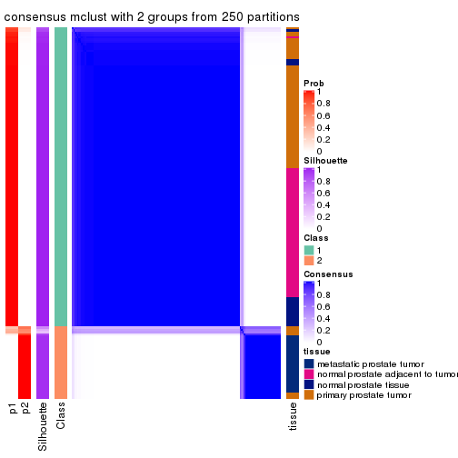</p>

</div>
<div id='tab-SD-mclust-consensus-heatmap-2'>
<pre><code class="r">consensus_heatmap(res, k = 3)
</code></pre>

<p>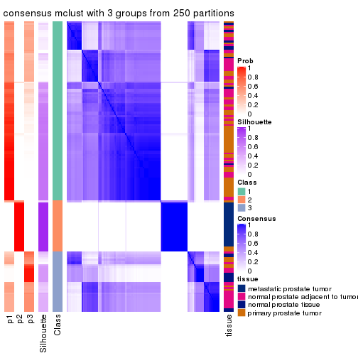</p>

</div>
<div id='tab-SD-mclust-consensus-heatmap-3'>
<pre><code class="r">consensus_heatmap(res, k = 4)
</code></pre>

<p>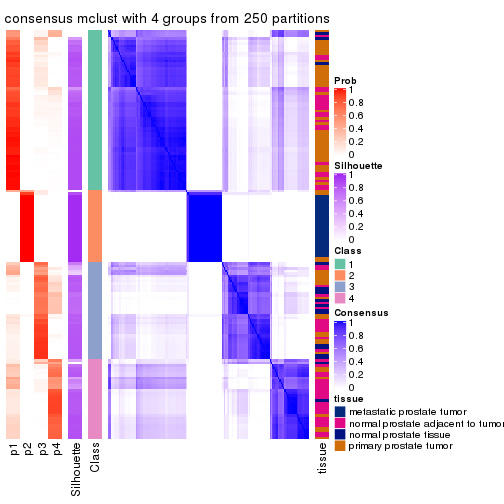</p>

</div>
<div id='tab-SD-mclust-consensus-heatmap-4'>
<pre><code class="r">consensus_heatmap(res, k = 5)
</code></pre>

<p>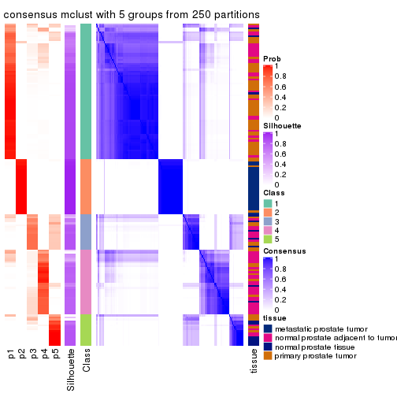</p>

</div>
<div id='tab-SD-mclust-consensus-heatmap-5'>
<pre><code class="r">consensus_heatmap(res, k = 6)
</code></pre>

<p>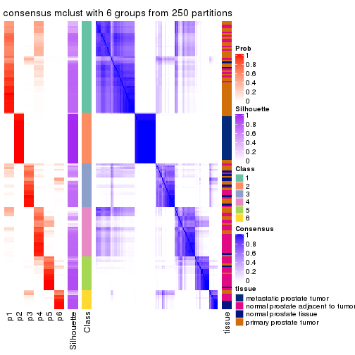</p>

</div>
</div>

Heatmaps for the membership of samples in all partitions to see how consistent they are:


<script>
$( function() {
	$( '#tabs-SD-mclust-membership-heatmap' ).tabs();
} );
</script>
<div id='tabs-SD-mclust-membership-heatmap'>
<ul>
<li><a href='#tab-SD-mclust-membership-heatmap-1'>k = 2</a></li>
<li><a href='#tab-SD-mclust-membership-heatmap-2'>k = 3</a></li>
<li><a href='#tab-SD-mclust-membership-heatmap-3'>k = 4</a></li>
<li><a href='#tab-SD-mclust-membership-heatmap-4'>k = 5</a></li>
<li><a href='#tab-SD-mclust-membership-heatmap-5'>k = 6</a></li>
</ul>
<div id='tab-SD-mclust-membership-heatmap-1'>
<pre><code class="r">membership_heatmap(res, k = 2)
</code></pre>

<p>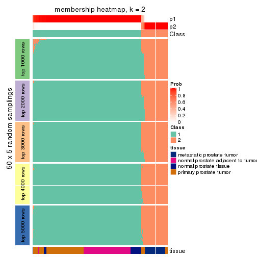</p>

</div>
<div id='tab-SD-mclust-membership-heatmap-2'>
<pre><code class="r">membership_heatmap(res, k = 3)
</code></pre>

<p>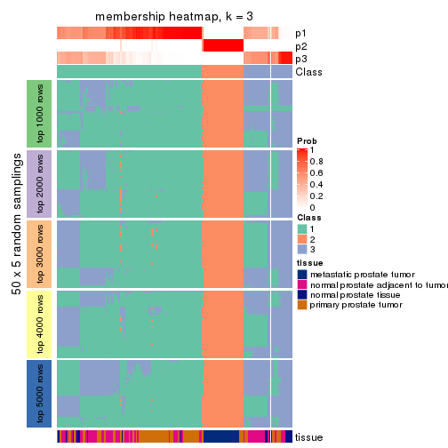</p>

</div>
<div id='tab-SD-mclust-membership-heatmap-3'>
<pre><code class="r">membership_heatmap(res, k = 4)
</code></pre>

<p>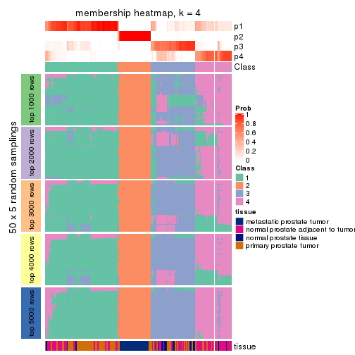</p>

</div>
<div id='tab-SD-mclust-membership-heatmap-4'>
<pre><code class="r">membership_heatmap(res, k = 5)
</code></pre>

<p>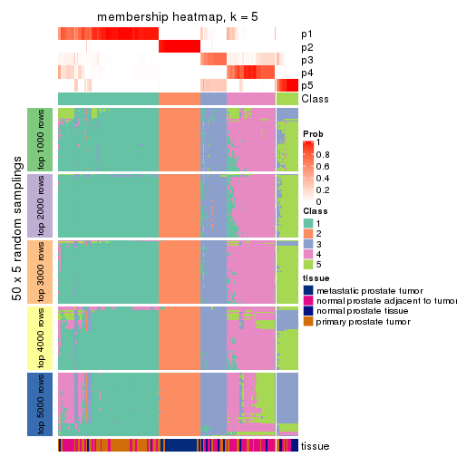</p>

</div>
<div id='tab-SD-mclust-membership-heatmap-5'>
<pre><code class="r">membership_heatmap(res, k = 6)
</code></pre>

<p>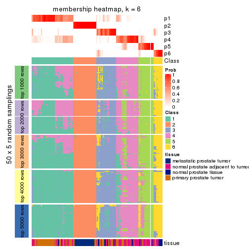</p>

</div>
</div>

As soon as we have had the classes for columns, we can look for signatures
which are significantly different between classes which can be candidate marks
for certain classes. Following are the heatmaps for signatures.


Signature heatmaps where rows are scaled:


<script>
$( function() {
	$( '#tabs-SD-mclust-get-signatures' ).tabs();
} );
</script>
<div id='tabs-SD-mclust-get-signatures'>
<ul>
<li><a href='#tab-SD-mclust-get-signatures-1'>k = 2</a></li>
<li><a href='#tab-SD-mclust-get-signatures-2'>k = 3</a></li>
<li><a href='#tab-SD-mclust-get-signatures-3'>k = 4</a></li>
<li><a href='#tab-SD-mclust-get-signatures-4'>k = 5</a></li>
<li><a href='#tab-SD-mclust-get-signatures-5'>k = 6</a></li>
</ul>
<div id='tab-SD-mclust-get-signatures-1'>
<pre><code class="r">get_signatures(res, k = 2)
</code></pre>

<p>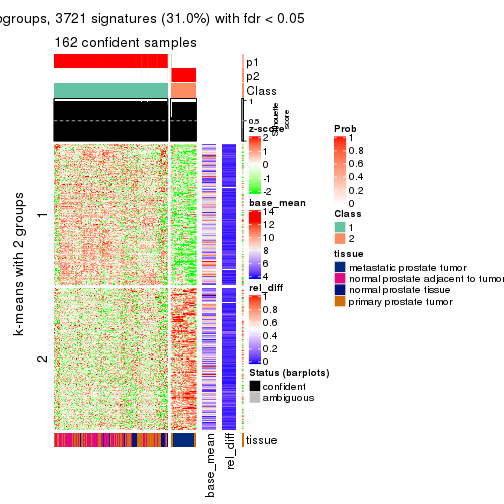</p>

</div>
<div id='tab-SD-mclust-get-signatures-2'>
<pre><code class="r">get_signatures(res, k = 3)
</code></pre>

<p>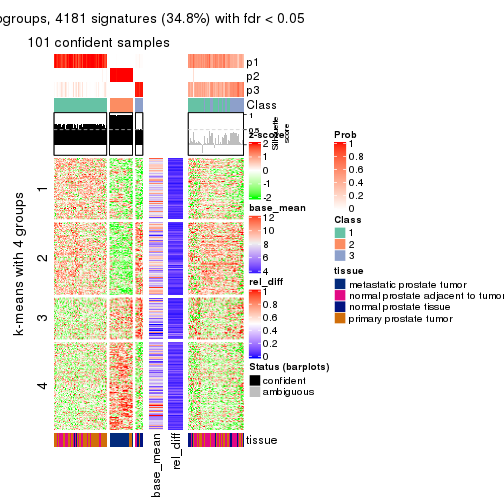</p>

</div>
<div id='tab-SD-mclust-get-signatures-3'>
<pre><code class="r">get_signatures(res, k = 4)
</code></pre>

<p>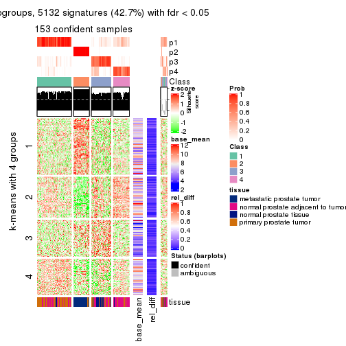</p>

</div>
<div id='tab-SD-mclust-get-signatures-4'>
<pre><code class="r">get_signatures(res, k = 5)
</code></pre>

<p>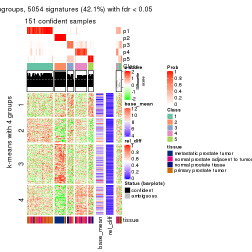</p>

</div>
<div id='tab-SD-mclust-get-signatures-5'>
<pre><code class="r">get_signatures(res, k = 6)
</code></pre>

<p>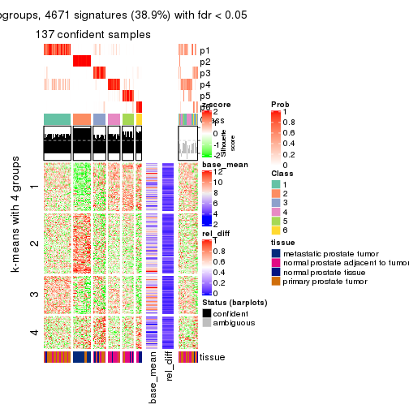</p>

</div>
</div>


Signature heatmaps where rows are not scaled:


<script>
$( function() {
	$( '#tabs-SD-mclust-get-signatures-no-scale' ).tabs();
} );
</script>
<div id='tabs-SD-mclust-get-signatures-no-scale'>
<ul>
<li><a href='#tab-SD-mclust-get-signatures-no-scale-1'>k = 2</a></li>
<li><a href='#tab-SD-mclust-get-signatures-no-scale-2'>k = 3</a></li>
<li><a href='#tab-SD-mclust-get-signatures-no-scale-3'>k = 4</a></li>
<li><a href='#tab-SD-mclust-get-signatures-no-scale-4'>k = 5</a></li>
<li><a href='#tab-SD-mclust-get-signatures-no-scale-5'>k = 6</a></li>
</ul>
<div id='tab-SD-mclust-get-signatures-no-scale-1'>
<pre><code class="r">get_signatures(res, k = 2, scale_rows = FALSE)
</code></pre>

<p>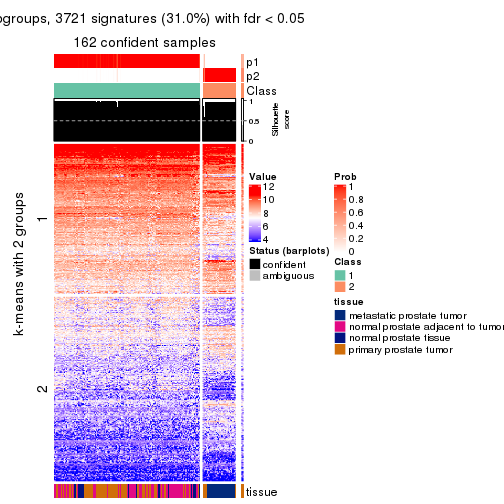</p>

</div>
<div id='tab-SD-mclust-get-signatures-no-scale-2'>
<pre><code class="r">get_signatures(res, k = 3, scale_rows = FALSE)
</code></pre>

<p>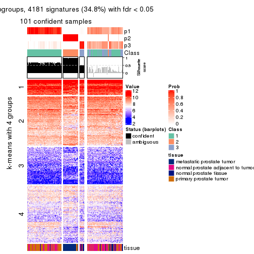</p>

</div>
<div id='tab-SD-mclust-get-signatures-no-scale-3'>
<pre><code class="r">get_signatures(res, k = 4, scale_rows = FALSE)
</code></pre>

<p>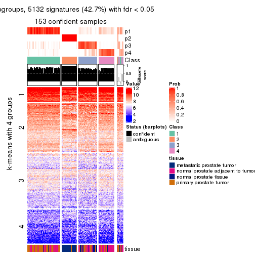</p>

</div>
<div id='tab-SD-mclust-get-signatures-no-scale-4'>
<pre><code class="r">get_signatures(res, k = 5, scale_rows = FALSE)
</code></pre>

<p>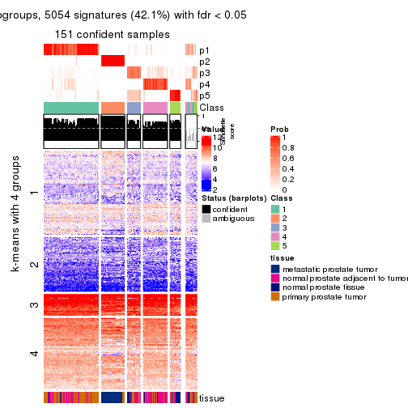</p>

</div>
<div id='tab-SD-mclust-get-signatures-no-scale-5'>
<pre><code class="r">get_signatures(res, k = 6, scale_rows = FALSE)
</code></pre>

<p>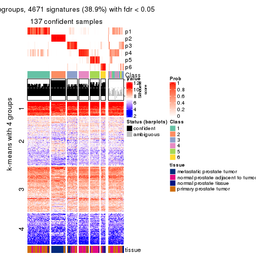</p>

</div>
</div>


Compare the overlap of signatures from different k:

```r
compare_signatures(res)
```

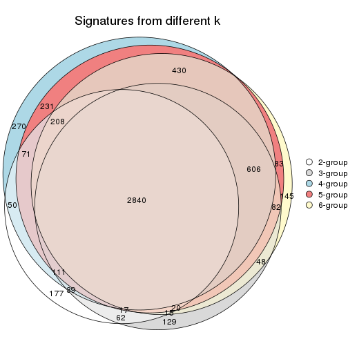

`get_signature()` returns a data frame invisibly. TO get the list of signatures, the function
call should be assigned to a variable explicitly. In following code, if `plot` argument is set
to `FALSE`, no heatmap is plotted while only the differential analysis is performed.

```r
# code only for demonstration
tb = get_signature(res, k = ..., plot = FALSE)
```

An example of the output of `tb` is:

```
#>   which_row         fdr    mean_1    mean_2 scaled_mean_1 scaled_mean_2 km
#> 1        38 0.042760348  8.373488  9.131774    -0.5533452     0.5164555  1
#> 2        40 0.018707592  7.106213  8.469186    -0.6173731     0.5762149  1
#> 3        55 0.019134737 10.221463 11.207825    -0.6159697     0.5749050  1
#> 4        59 0.006059896  5.921854  7.869574    -0.6899429     0.6439467  1
#> 5        60 0.018055526  8.928898 10.211722    -0.6204761     0.5791110  1
#> 6        98 0.009384629 15.714769 14.887706     0.6635654    -0.6193277  2
...
```

The columns in `tb` are:

1. `which_row`: row indices corresponding to the input matrix.
2. `fdr`: FDR for the differential test. 
3. `mean_x`: The mean value in group x.
4. `scaled_mean_x`: The mean value in group x after rows are scaled.
5. `km`: Row groups if k-means clustering is applied to rows.


UMAP plot which shows how samples are separated.


<script>
$( function() {
	$( '#tabs-SD-mclust-dimension-reduction' ).tabs();
} );
</script>
<div id='tabs-SD-mclust-dimension-reduction'>
<ul>
<li><a href='#tab-SD-mclust-dimension-reduction-1'>k = 2</a></li>
<li><a href='#tab-SD-mclust-dimension-reduction-2'>k = 3</a></li>
<li><a href='#tab-SD-mclust-dimension-reduction-3'>k = 4</a></li>
<li><a href='#tab-SD-mclust-dimension-reduction-4'>k = 5</a></li>
<li><a href='#tab-SD-mclust-dimension-reduction-5'>k = 6</a></li>
</ul>
<div id='tab-SD-mclust-dimension-reduction-1'>
<pre><code class="r">dimension_reduction(res, k = 2, method = &quot;UMAP&quot;)
</code></pre>

<p>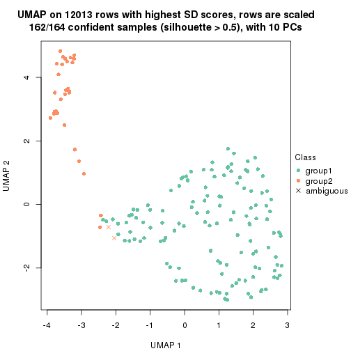</p>

</div>
<div id='tab-SD-mclust-dimension-reduction-2'>
<pre><code class="r">dimension_reduction(res, k = 3, method = &quot;UMAP&quot;)
</code></pre>

<p>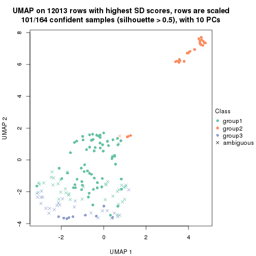</p>

</div>
<div id='tab-SD-mclust-dimension-reduction-3'>
<pre><code class="r">dimension_reduction(res, k = 4, method = &quot;UMAP&quot;)
</code></pre>

<p></p>

</div>
<div id='tab-SD-mclust-dimension-reduction-4'>
<pre><code class="r">dimension_reduction(res, k = 5, method = &quot;UMAP&quot;)
</code></pre>

<p>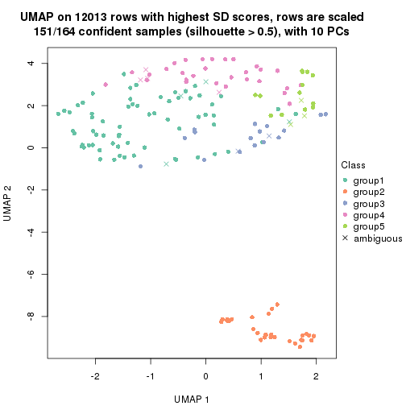</p>

</div>
<div id='tab-SD-mclust-dimension-reduction-5'>
<pre><code class="r">dimension_reduction(res, k = 6, method = &quot;UMAP&quot;)
</code></pre>

<p>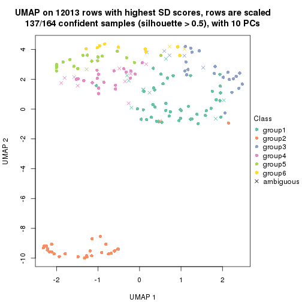</p>

</div>
</div>


Following heatmap shows how subgroups are split when increasing `k`:

```r
collect_classes(res)
```

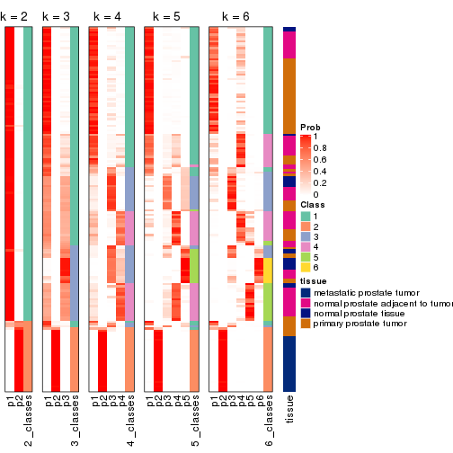


Test correlation between subgroups and known annotations. If the known
annotation is numeric, one-way ANOVA test is applied, and if the known
annotation is discrete, chi-squared contingency table test is applied.

```r
test_to_known_factors(res)
```

```
#>             n tissue(p) k
#> SD:mclust 162  2.52e-28 2
#> SD:mclust 101  3.32e-24 3
#> SD:mclust 153  4.45e-34 4
#> SD:mclust 151  1.71e-33 5
#> SD:mclust 137  2.03e-29 6
```


If matrix rows can be associated to genes, consider to use `functional_enrichment(res,
...)` to perform function enrichment for the signature genes. See [this vignette](http://bioconductor.org/packages/devel/bioc/vignettes/cola/inst/doc/functional_enrichment.html) for more detailed explanations.


 

---------------------------------------------------


### SD:NMF


The object with results only for a single top-value method and a single partition method 
can be extracted as:

```r
res = res_list["SD", "NMF"]
# you can also extract it by
# res = res_list["SD:NMF"]
```

A summary of `res` and all the functions that can be applied to it:

```r
res
```

```
#> A 'ConsensusPartition' object with k = 2, 3, 4, 5, 6.
#>   On a matrix with 12013 rows and 164 columns.
#>   Top rows (1000, 2000, 3000, 4000, 5000) are extracted by 'SD' method.
#>   Subgroups are detected by 'NMF' method.
#>   Performed in total 1250 partitions by row resampling.
#>   Best k for subgroups seems to be 3.
#> 
#> Following methods can be applied to this 'ConsensusPartition' object:
#>  [1] "cola_report"             "collect_classes"         "collect_plots"          
#>  [4] "collect_stats"           "colnames"                "compare_signatures"     
#>  [7] "consensus_heatmap"       "dimension_reduction"     "functional_enrichment"  
#> [10] "get_anno_col"            "get_anno"                "get_classes"            
#> [13] "get_consensus"           "get_matrix"              "get_membership"         
#> [16] "get_param"               "get_signatures"          "get_stats"              
#> [19] "is_best_k"               "is_stable_k"             "membership_heatmap"     
#> [22] "ncol"                    "nrow"                    "plot_ecdf"              
#> [25] "rownames"                "select_partition_number" "show"                   
#> [28] "suggest_best_k"          "test_to_known_factors"
```

`collect_plots()` function collects all the plots made from `res` for all `k` (number of partitions)
into one single page to provide an easy and fast comparison between different `k`.

```r
collect_plots(res)
```

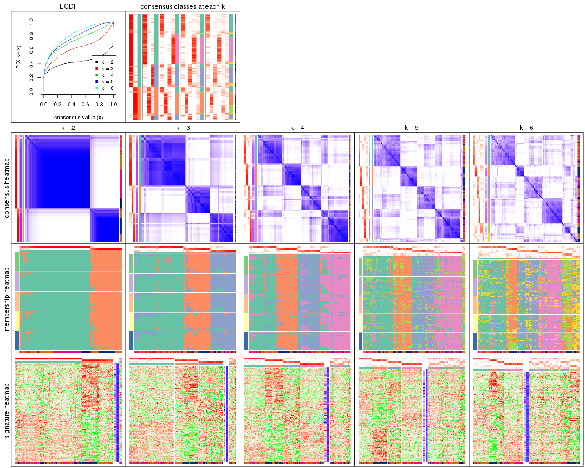

The plots are:

- The first row: a plot of the ECDF (empirical cumulative distribution
  function) curves of the consensus matrix for each `k` and the heatmap of
  predicted classes for each `k`.
- The second row: heatmaps of the consensus matrix for each `k`.
- The third row: heatmaps of the membership matrix for each `k`.
- The fouth row: heatmaps of the signatures for each `k`.

All the plots in panels can be made by individual functions and they are
plotted later in this section.

`select_partition_number()` produces several plots showing different
statistics for choosing "optimized" `k`. There are following statistics:

- ECDF curves of the consensus matrix for each `k`;
- 1-PAC. [The PAC
  score](https://en.wikipedia.org/wiki/Consensus_clustering#Over-interpretation_potential_of_consensus_clustering)
  measures the proportion of the ambiguous subgrouping.
- Mean silhouette score.
- Concordance. The mean probability of fiting the consensus class ids in all
  partitions.
- Area increased. Denote $A_k$ as the area under the ECDF curve for current
  `k`, the area increased is defined as $A_k - A_{k-1}$.
- Rand index. The percent of pairs of samples that are both in a same cluster
  or both are not in a same cluster in the partition of k and k-1.
- Jaccard index. The ratio of pairs of samples are both in a same cluster in
  the partition of k and k-1 and the pairs of samples are both in a same
  cluster in the partition k or k-1.

The detailed explanations of these statistics can be found in [the _cola_
vignette](http://bioconductor.org/packages/devel/bioc/vignettes/cola/inst/doc/cola.html#toc_13).

Generally speaking, lower PAC score, higher mean silhouette score or higher
concordance corresponds to better partition. Rand index and Jaccard index
measure how similar the current partition is compared to partition with `k-1`.
If they are too similar, we won't accept `k` is better than `k-1`.

```r
select_partition_number(res)
```

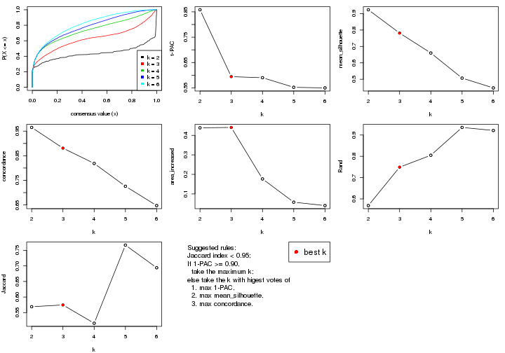

The numeric values for all these statistics can be obtained by `get_stats()`.

```r
get_stats(res)
```

```
#>   k 1-PAC mean_silhouette concordance area_increased  Rand Jaccard
#> 2 2 0.858           0.923       0.965         0.4385 0.569   0.569
#> 3 3 0.594           0.781       0.881         0.4403 0.749   0.575
#> 4 4 0.590           0.660       0.819         0.1768 0.805   0.516
#> 5 5 0.552           0.507       0.726         0.0577 0.935   0.767
#> 6 6 0.550           0.447       0.647         0.0403 0.921   0.694
```

`suggest_best_k()` suggests the best $k$ based on these statistics. The rules are as follows:

- All $k$ with Jaccard index larger than 0.95 are removed because increasing
  $k$ does not provide enough extra information. If all $k$ are removed, it is
  marked as no subgroup is detected.
- For all $k$ with 1-PAC score larger than 0.9, the maximal $k$ is taken as
  the best $k$, and other $k$ are marked as optional $k$.
- If it does not fit the second rule. The $k$ with the maximal vote of the
  highest 1-PAC score, highest mean silhouette, and highest concordance is
  taken as the best $k$.

```r
suggest_best_k(res)
```

```
#> [1] 3
```


Following shows the table of the partitions (You need to click the **show/hide
code output** link to see it). The membership matrix (columns with name `p*`)
is inferred by
[`clue::cl_consensus()`](https://www.rdocumentation.org/link/cl_consensus?package=clue)
function with the `SE` method. Basically the value in the membership matrix
represents the probability to belong to a certain group. The finall class
label for an item is determined with the group with highest probability it
belongs to.

In `get_classes()` function, the entropy is calculated from the membership
matrix and the silhouette score is calculated from the consensus matrix.


<script>
$( function() {
	$( '#tabs-SD-NMF-get-classes' ).tabs();
} );
</script>
<div id='tabs-SD-NMF-get-classes'>
<ul>
<li><a href='#tab-SD-NMF-get-classes-1'>k = 2</a></li>
<li><a href='#tab-SD-NMF-get-classes-2'>k = 3</a></li>
<li><a href='#tab-SD-NMF-get-classes-3'>k = 4</a></li>
<li><a href='#tab-SD-NMF-get-classes-4'>k = 5</a></li>
<li><a href='#tab-SD-NMF-get-classes-5'>k = 6</a></li>
</ul>

<div id='tab-SD-NMF-get-classes-1'>
<p><a id='tab-SD-NMF-get-classes-1-a' style='color:#0366d6' href='#'>show/hide code output</a></p>
<pre><code class="r">cbind(get_classes(res, k = 2), get_membership(res, k = 2))
</code></pre>

<pre><code>#&gt;           class entropy silhouette    p1    p2
#&gt; GSM152839     1  0.0000      0.964 1.000 0.000
#&gt; GSM152840     1  0.0000      0.964 1.000 0.000
#&gt; GSM152841     1  0.0000      0.964 1.000 0.000
#&gt; GSM152842     1  0.0000      0.964 1.000 0.000
#&gt; GSM152843     1  0.0000      0.964 1.000 0.000
#&gt; GSM152844     1  0.0000      0.964 1.000 0.000
#&gt; GSM152845     2  0.0672      0.957 0.008 0.992
#&gt; GSM152846     1  0.0672      0.960 0.992 0.008
#&gt; GSM152847     1  0.0000      0.964 1.000 0.000
#&gt; GSM152848     1  0.0000      0.964 1.000 0.000
#&gt; GSM152849     1  0.0000      0.964 1.000 0.000
#&gt; GSM152850     1  0.0000      0.964 1.000 0.000
#&gt; GSM152851     1  0.0000      0.964 1.000 0.000
#&gt; GSM152852     1  0.0000      0.964 1.000 0.000
#&gt; GSM152853     1  0.0000      0.964 1.000 0.000
#&gt; GSM152854     1  0.0000      0.964 1.000 0.000
#&gt; GSM152855     1  0.0000      0.964 1.000 0.000
#&gt; GSM153238     2  0.8499      0.639 0.276 0.724
#&gt; GSM153239     1  0.0000      0.964 1.000 0.000
#&gt; GSM153240     1  0.0000      0.964 1.000 0.000
#&gt; GSM153241     1  0.0000      0.964 1.000 0.000
#&gt; GSM153242     1  0.5842      0.836 0.860 0.140
#&gt; GSM153243     2  0.3114      0.925 0.056 0.944
#&gt; GSM153244     1  0.4431      0.892 0.908 0.092
#&gt; GSM153245     1  0.0000      0.964 1.000 0.000
#&gt; GSM153246     1  0.0000      0.964 1.000 0.000
#&gt; GSM153247     1  0.4815      0.880 0.896 0.104
#&gt; GSM153248     1  0.7602      0.734 0.780 0.220
#&gt; GSM153249     1  0.0000      0.964 1.000 0.000
#&gt; GSM153250     1  0.0000      0.964 1.000 0.000
#&gt; GSM153251     1  0.9944      0.167 0.544 0.456
#&gt; GSM153252     1  0.0000      0.964 1.000 0.000
#&gt; GSM153253     1  0.0000      0.964 1.000 0.000
#&gt; GSM153254     1  0.3274      0.922 0.940 0.060
#&gt; GSM153255     1  0.0000      0.964 1.000 0.000
#&gt; GSM153256     1  0.0000      0.964 1.000 0.000
#&gt; GSM153257     1  0.0000      0.964 1.000 0.000
#&gt; GSM153258     1  0.0000      0.964 1.000 0.000
#&gt; GSM153259     1  0.0672      0.959 0.992 0.008
#&gt; GSM153260     1  0.9286      0.486 0.656 0.344
#&gt; GSM153261     1  0.1184      0.954 0.984 0.016
#&gt; GSM153262     1  0.0000      0.964 1.000 0.000
#&gt; GSM153263     1  0.0000      0.964 1.000 0.000
#&gt; GSM153264     1  0.0000      0.964 1.000 0.000
#&gt; GSM153265     1  0.0000      0.964 1.000 0.000
#&gt; GSM153266     1  0.0000      0.964 1.000 0.000
#&gt; GSM153267     1  0.0000      0.964 1.000 0.000
#&gt; GSM153268     1  0.0000      0.964 1.000 0.000
#&gt; GSM153269     1  0.0000      0.964 1.000 0.000
#&gt; GSM153270     1  0.0000      0.964 1.000 0.000
#&gt; GSM153271     1  0.0000      0.964 1.000 0.000
#&gt; GSM153272     1  0.0000      0.964 1.000 0.000
#&gt; GSM153273     1  0.4022      0.902 0.920 0.080
#&gt; GSM153274     1  0.0000      0.964 1.000 0.000
#&gt; GSM153275     1  0.0000      0.964 1.000 0.000
#&gt; GSM153276     1  0.0000      0.964 1.000 0.000
#&gt; GSM153277     1  0.0000      0.964 1.000 0.000
#&gt; GSM153278     1  0.0000      0.964 1.000 0.000
#&gt; GSM153279     1  0.0000      0.964 1.000 0.000
#&gt; GSM153280     1  0.0000      0.964 1.000 0.000
#&gt; GSM153281     1  0.0000      0.964 1.000 0.000
#&gt; GSM153282     1  0.0000      0.964 1.000 0.000
#&gt; GSM153283     1  0.0000      0.964 1.000 0.000
#&gt; GSM153284     1  0.0000      0.964 1.000 0.000
#&gt; GSM153285     1  0.0000      0.964 1.000 0.000
#&gt; GSM153286     1  0.0000      0.964 1.000 0.000
#&gt; GSM153287     1  0.0000      0.964 1.000 0.000
#&gt; GSM153288     1  0.0000      0.964 1.000 0.000
#&gt; GSM153289     1  0.0000      0.964 1.000 0.000
#&gt; GSM153290     1  0.0000      0.964 1.000 0.000
#&gt; GSM153291     1  0.0000      0.964 1.000 0.000
#&gt; GSM153292     1  0.0000      0.964 1.000 0.000
#&gt; GSM153293     1  0.0000      0.964 1.000 0.000
#&gt; GSM153294     1  0.6438      0.812 0.836 0.164
#&gt; GSM153295     1  0.0000      0.964 1.000 0.000
#&gt; GSM153054     1  0.2043      0.943 0.968 0.032
#&gt; GSM153055     1  0.0000      0.964 1.000 0.000
#&gt; GSM153056     1  0.0000      0.964 1.000 0.000
#&gt; GSM153057     1  0.3114      0.925 0.944 0.056
#&gt; GSM153058     1  0.1414      0.952 0.980 0.020
#&gt; GSM153059     2  0.6887      0.784 0.184 0.816
#&gt; GSM153060     1  0.0376      0.962 0.996 0.004
#&gt; GSM153061     1  0.4431      0.893 0.908 0.092
#&gt; GSM153062     2  0.3431      0.917 0.064 0.936
#&gt; GSM153063     1  0.0376      0.962 0.996 0.004
#&gt; GSM153064     1  0.0000      0.964 1.000 0.000
#&gt; GSM153065     2  0.0000      0.961 0.000 1.000
#&gt; GSM153066     2  0.0000      0.961 0.000 1.000
#&gt; GSM153067     1  0.0000      0.964 1.000 0.000
#&gt; GSM153068     1  0.9922      0.189 0.552 0.448
#&gt; GSM153069     1  0.0000      0.964 1.000 0.000
#&gt; GSM153070     1  0.0000      0.964 1.000 0.000
#&gt; GSM153071     1  0.0376      0.962 0.996 0.004
#&gt; GSM153072     1  0.6247      0.821 0.844 0.156
#&gt; GSM153073     1  0.0000      0.964 1.000 0.000
#&gt; GSM153074     1  0.0000      0.964 1.000 0.000
#&gt; GSM153075     1  0.0000      0.964 1.000 0.000
#&gt; GSM153076     1  0.0000      0.964 1.000 0.000
#&gt; GSM153077     1  0.1184      0.954 0.984 0.016
#&gt; GSM153078     1  0.0672      0.959 0.992 0.008
#&gt; GSM153079     2  0.5629      0.850 0.132 0.868
#&gt; GSM153080     1  0.0000      0.964 1.000 0.000
#&gt; GSM153081     1  0.0000      0.964 1.000 0.000
#&gt; GSM153082     2  0.0672      0.957 0.008 0.992
#&gt; GSM153083     2  0.0000      0.961 0.000 1.000
#&gt; GSM153084     2  0.0000      0.961 0.000 1.000
#&gt; GSM153085     2  0.9087      0.538 0.324 0.676
#&gt; GSM153086     2  0.3879      0.907 0.076 0.924
#&gt; GSM153087     1  0.0000      0.964 1.000 0.000
#&gt; GSM153088     1  0.0000      0.964 1.000 0.000
#&gt; GSM153089     1  0.9358      0.466 0.648 0.352
#&gt; GSM153090     1  0.0000      0.964 1.000 0.000
#&gt; GSM153091     2  0.2043      0.942 0.032 0.968
#&gt; GSM153092     1  0.2603      0.934 0.956 0.044
#&gt; GSM153093     1  0.0000      0.964 1.000 0.000
#&gt; GSM153094     2  0.0000      0.961 0.000 1.000
#&gt; GSM153095     2  0.8608      0.618 0.284 0.716
#&gt; GSM153096     1  0.4161      0.900 0.916 0.084
#&gt; GSM153097     2  0.3274      0.921 0.060 0.940
#&gt; GSM153098     1  0.7602      0.730 0.780 0.220
#&gt; GSM153099     1  0.0000      0.964 1.000 0.000
#&gt; GSM153100     1  0.0672      0.959 0.992 0.008
#&gt; GSM153101     1  0.8386      0.652 0.732 0.268
#&gt; GSM153102     2  0.4939      0.876 0.108 0.892
#&gt; GSM153103     2  0.7602      0.733 0.220 0.780
#&gt; GSM153104     1  0.0000      0.964 1.000 0.000
#&gt; GSM153106     1  0.4022      0.904 0.920 0.080
#&gt; GSM153107     1  0.0376      0.962 0.996 0.004
#&gt; GSM153108     1  0.0000      0.964 1.000 0.000
#&gt; GSM153109     2  0.0000      0.961 0.000 1.000
#&gt; GSM153110     1  0.5737      0.840 0.864 0.136
#&gt; GSM153111     2  0.1414      0.950 0.020 0.980
#&gt; GSM153112     1  0.6247      0.820 0.844 0.156
#&gt; GSM153113     2  0.0000      0.961 0.000 1.000
#&gt; GSM153114     1  0.0000      0.964 1.000 0.000
#&gt; GSM187532     2  0.0000      0.961 0.000 1.000
#&gt; GSM187533     2  0.0000      0.961 0.000 1.000
#&gt; GSM187534     2  0.0000      0.961 0.000 1.000
#&gt; GSM187535     2  0.0000      0.961 0.000 1.000
#&gt; GSM152906     2  0.0000      0.961 0.000 1.000
#&gt; GSM152907     2  0.0000      0.961 0.000 1.000
#&gt; GSM152908     2  0.0000      0.961 0.000 1.000
#&gt; GSM152909     2  0.0000      0.961 0.000 1.000
#&gt; GSM152910     2  0.0000      0.961 0.000 1.000
#&gt; GSM152911     2  0.0000      0.961 0.000 1.000
#&gt; GSM152912     2  0.0000      0.961 0.000 1.000
#&gt; GSM152913     2  0.0000      0.961 0.000 1.000
#&gt; GSM152914     2  0.0000      0.961 0.000 1.000
#&gt; GSM152915     2  0.0000      0.961 0.000 1.000
#&gt; GSM152916     2  0.0000      0.961 0.000 1.000
#&gt; GSM152917     2  0.0000      0.961 0.000 1.000
#&gt; GSM152918     2  0.0000      0.961 0.000 1.000
#&gt; GSM152919     2  0.0000      0.961 0.000 1.000
#&gt; GSM152920     2  0.0000      0.961 0.000 1.000
#&gt; GSM152921     2  0.0000      0.961 0.000 1.000
#&gt; GSM152922     2  0.0000      0.961 0.000 1.000
#&gt; GSM152923     2  0.0000      0.961 0.000 1.000
#&gt; GSM152924     2  0.0000      0.961 0.000 1.000
#&gt; GSM152925     2  0.0000      0.961 0.000 1.000
#&gt; GSM152926     2  0.0000      0.961 0.000 1.000
#&gt; GSM152927     2  0.0000      0.961 0.000 1.000
#&gt; GSM152928     2  0.0000      0.961 0.000 1.000
#&gt; GSM152929     2  0.0000      0.961 0.000 1.000
#&gt; GSM152930     2  0.0000      0.961 0.000 1.000
</code></pre>

<script>
$('#tab-SD-NMF-get-classes-1-a').parent().next().next().hide();
$('#tab-SD-NMF-get-classes-1-a').click(function(){
  $('#tab-SD-NMF-get-classes-1-a').parent().next().next().toggle();
  return(false);
});
</script>
</div>

<div id='tab-SD-NMF-get-classes-2'>
<p><a id='tab-SD-NMF-get-classes-2-a' style='color:#0366d6' href='#'>show/hide code output</a></p>
<pre><code class="r">cbind(get_classes(res, k = 3), get_membership(res, k = 3))
</code></pre>

<pre><code>#&gt;           class entropy silhouette    p1    p2    p3
#&gt; GSM152839     3  0.6280     0.1432 0.460 0.000 0.540
#&gt; GSM152840     3  0.4062     0.8033 0.164 0.000 0.836
#&gt; GSM152841     1  0.3192     0.8627 0.888 0.000 0.112
#&gt; GSM152842     3  0.2711     0.8320 0.088 0.000 0.912
#&gt; GSM152843     3  0.4931     0.7274 0.232 0.000 0.768
#&gt; GSM152844     3  0.1643     0.8341 0.044 0.000 0.956
#&gt; GSM152845     3  0.2711     0.7465 0.000 0.088 0.912
#&gt; GSM152846     3  0.0424     0.8219 0.000 0.008 0.992
#&gt; GSM152847     3  0.4399     0.7815 0.188 0.000 0.812
#&gt; GSM152848     1  0.3941     0.8306 0.844 0.000 0.156
#&gt; GSM152849     3  0.2261     0.8346 0.068 0.000 0.932
#&gt; GSM152850     3  0.4654     0.7601 0.208 0.000 0.792
#&gt; GSM152851     3  0.5138     0.7009 0.252 0.000 0.748
#&gt; GSM152852     3  0.0892     0.8303 0.020 0.000 0.980
#&gt; GSM152853     3  0.2356     0.8339 0.072 0.000 0.928
#&gt; GSM152854     3  0.0747     0.8290 0.016 0.000 0.984
#&gt; GSM152855     1  0.0424     0.8820 0.992 0.008 0.000
#&gt; GSM153238     3  0.1411     0.8033 0.000 0.036 0.964
#&gt; GSM153239     3  0.4062     0.8056 0.164 0.000 0.836
#&gt; GSM153240     1  0.2796     0.8728 0.908 0.000 0.092
#&gt; GSM153241     3  0.4062     0.8050 0.164 0.000 0.836
#&gt; GSM153242     3  0.1170     0.8182 0.008 0.016 0.976
#&gt; GSM153243     3  0.2448     0.7642 0.000 0.076 0.924
#&gt; GSM153244     1  0.5737     0.6912 0.732 0.012 0.256
#&gt; GSM153245     3  0.3267     0.8260 0.116 0.000 0.884
#&gt; GSM153246     3  0.0475     0.8239 0.004 0.004 0.992
#&gt; GSM153247     3  0.3412     0.8251 0.124 0.000 0.876
#&gt; GSM153248     1  0.5378     0.6390 0.756 0.236 0.008
#&gt; GSM153249     1  0.0424     0.8819 0.992 0.000 0.008
#&gt; GSM153250     1  0.0424     0.8820 0.992 0.008 0.000
#&gt; GSM153251     3  0.1411     0.8015 0.000 0.036 0.964
#&gt; GSM153252     1  0.2796     0.8731 0.908 0.000 0.092
#&gt; GSM153253     1  0.3879     0.8344 0.848 0.000 0.152
#&gt; GSM153254     3  0.4796     0.7467 0.220 0.000 0.780
#&gt; GSM153255     1  0.0424     0.8872 0.992 0.000 0.008
#&gt; GSM153256     1  0.0892     0.8871 0.980 0.000 0.020
#&gt; GSM153257     1  0.1529     0.8894 0.960 0.000 0.040
#&gt; GSM153258     1  0.0424     0.8879 0.992 0.000 0.008
#&gt; GSM153259     1  0.0661     0.8821 0.988 0.008 0.004
#&gt; GSM153260     3  0.1482     0.8211 0.012 0.020 0.968
#&gt; GSM153261     3  0.0983     0.8295 0.016 0.004 0.980
#&gt; GSM153262     1  0.3941     0.8314 0.844 0.000 0.156
#&gt; GSM153263     1  0.0424     0.8874 0.992 0.000 0.008
#&gt; GSM153264     1  0.1753     0.8887 0.952 0.000 0.048
#&gt; GSM153265     1  0.5291     0.6847 0.732 0.000 0.268
#&gt; GSM153266     1  0.4002     0.8280 0.840 0.000 0.160
#&gt; GSM153267     1  0.0892     0.8894 0.980 0.000 0.020
#&gt; GSM153268     1  0.6168     0.3484 0.588 0.000 0.412
#&gt; GSM153269     1  0.0237     0.8860 0.996 0.000 0.004
#&gt; GSM153270     1  0.3686     0.8435 0.860 0.000 0.140
#&gt; GSM153271     1  0.0661     0.8799 0.988 0.004 0.008
#&gt; GSM153272     1  0.1411     0.8894 0.964 0.000 0.036
#&gt; GSM153273     1  0.2774     0.8371 0.920 0.072 0.008
#&gt; GSM153274     1  0.2711     0.8752 0.912 0.000 0.088
#&gt; GSM153275     1  0.1643     0.8889 0.956 0.000 0.044
#&gt; GSM153276     1  0.3192     0.8626 0.888 0.000 0.112
#&gt; GSM153277     1  0.4121     0.8197 0.832 0.000 0.168
#&gt; GSM153278     3  0.4002     0.8062 0.160 0.000 0.840
#&gt; GSM153279     1  0.6045     0.4390 0.620 0.000 0.380
#&gt; GSM153280     1  0.5254     0.6902 0.736 0.000 0.264
#&gt; GSM153281     1  0.3752     0.8403 0.856 0.000 0.144
#&gt; GSM153282     1  0.4931     0.7407 0.768 0.000 0.232
#&gt; GSM153283     1  0.1031     0.8899 0.976 0.000 0.024
#&gt; GSM153284     1  0.1163     0.8898 0.972 0.000 0.028
#&gt; GSM153285     1  0.4399     0.8003 0.812 0.000 0.188
#&gt; GSM153286     1  0.1163     0.8895 0.972 0.000 0.028
#&gt; GSM153287     1  0.1529     0.8893 0.960 0.000 0.040
#&gt; GSM153288     1  0.0747     0.8888 0.984 0.000 0.016
#&gt; GSM153289     1  0.0661     0.8799 0.988 0.008 0.004
#&gt; GSM153290     1  0.4121     0.8193 0.832 0.000 0.168
#&gt; GSM153291     1  0.0892     0.8892 0.980 0.000 0.020
#&gt; GSM153292     1  0.2165     0.8843 0.936 0.000 0.064
#&gt; GSM153293     1  0.0424     0.8852 0.992 0.000 0.008
#&gt; GSM153294     1  0.5831     0.5506 0.708 0.284 0.008
#&gt; GSM153295     1  0.3686     0.8435 0.860 0.000 0.140
#&gt; GSM153054     1  0.6225     0.2848 0.568 0.000 0.432
#&gt; GSM153055     1  0.2261     0.8834 0.932 0.000 0.068
#&gt; GSM153056     3  0.5465     0.6359 0.288 0.000 0.712
#&gt; GSM153057     3  0.4235     0.7963 0.176 0.000 0.824
#&gt; GSM153058     3  0.1163     0.8325 0.028 0.000 0.972
#&gt; GSM153059     3  0.2902     0.7897 0.016 0.064 0.920
#&gt; GSM153060     3  0.0829     0.8262 0.012 0.004 0.984
#&gt; GSM153061     3  0.0424     0.8219 0.000 0.008 0.992
#&gt; GSM153062     3  0.1753     0.7899 0.000 0.048 0.952
#&gt; GSM153063     3  0.1529     0.8340 0.040 0.000 0.960
#&gt; GSM153064     1  0.0424     0.8820 0.992 0.008 0.000
#&gt; GSM153065     3  0.2711     0.7477 0.000 0.088 0.912
#&gt; GSM153066     2  0.6274     0.3633 0.000 0.544 0.456
#&gt; GSM153067     1  0.1315     0.8704 0.972 0.020 0.008
#&gt; GSM153068     3  0.1289     0.8051 0.000 0.032 0.968
#&gt; GSM153069     1  0.1289     0.8897 0.968 0.000 0.032
#&gt; GSM153070     1  0.1411     0.8901 0.964 0.000 0.036
#&gt; GSM153071     1  0.5948     0.4843 0.640 0.000 0.360
#&gt; GSM153072     1  0.5406     0.7456 0.764 0.012 0.224
#&gt; GSM153073     1  0.0237     0.8840 0.996 0.004 0.000
#&gt; GSM153074     1  0.0592     0.8840 0.988 0.000 0.012
#&gt; GSM153075     1  0.2959     0.8697 0.900 0.000 0.100
#&gt; GSM153076     1  0.0424     0.8819 0.992 0.000 0.008
#&gt; GSM153077     1  0.0475     0.8852 0.992 0.004 0.004
#&gt; GSM153078     3  0.5621     0.5937 0.308 0.000 0.692
#&gt; GSM153079     2  0.5580     0.6538 0.256 0.736 0.008
#&gt; GSM153080     3  0.4062     0.8037 0.164 0.000 0.836
#&gt; GSM153081     1  0.2261     0.8842 0.932 0.000 0.068
#&gt; GSM153082     2  0.3129     0.8178 0.088 0.904 0.008
#&gt; GSM153083     2  0.1129     0.8549 0.020 0.976 0.004
#&gt; GSM153084     2  0.3752     0.8267 0.000 0.856 0.144
#&gt; GSM153085     2  0.9967    -0.1029 0.340 0.364 0.296
#&gt; GSM153086     2  0.4994     0.7629 0.160 0.816 0.024
#&gt; GSM153087     1  0.2356     0.8815 0.928 0.000 0.072
#&gt; GSM153088     1  0.0424     0.8874 0.992 0.000 0.008
#&gt; GSM153089     3  0.1129     0.8150 0.004 0.020 0.976
#&gt; GSM153090     1  0.1289     0.8895 0.968 0.000 0.032
#&gt; GSM153091     2  0.4912     0.7237 0.196 0.796 0.008
#&gt; GSM153092     1  0.1315     0.8859 0.972 0.008 0.020
#&gt; GSM153093     1  0.1643     0.8889 0.956 0.000 0.044
#&gt; GSM153094     2  0.3349     0.8067 0.108 0.888 0.004
#&gt; GSM153095     2  0.9970    -0.0383 0.348 0.356 0.296
#&gt; GSM153096     1  0.2680     0.8412 0.924 0.068 0.008
#&gt; GSM153097     2  0.4473     0.7586 0.164 0.828 0.008
#&gt; GSM153098     1  0.5928     0.5268 0.696 0.296 0.008
#&gt; GSM153099     1  0.3412     0.8549 0.876 0.000 0.124
#&gt; GSM153100     1  0.1129     0.8747 0.976 0.020 0.004
#&gt; GSM153101     3  0.6539     0.6176 0.288 0.028 0.684
#&gt; GSM153102     2  0.8376     0.2296 0.084 0.496 0.420
#&gt; GSM153103     3  0.9560     0.2392 0.212 0.324 0.464
#&gt; GSM153104     1  0.3482     0.8527 0.872 0.000 0.128
#&gt; GSM153106     1  0.3896     0.7818 0.864 0.128 0.008
#&gt; GSM153107     1  0.0983     0.8771 0.980 0.016 0.004
#&gt; GSM153108     1  0.2356     0.8835 0.928 0.000 0.072
#&gt; GSM153109     2  0.2187     0.8565 0.028 0.948 0.024
#&gt; GSM153110     1  0.2711     0.8306 0.912 0.088 0.000
#&gt; GSM153111     2  0.3454     0.8067 0.104 0.888 0.008
#&gt; GSM153112     1  0.5378     0.6392 0.756 0.236 0.008
#&gt; GSM153113     2  0.0237     0.8583 0.000 0.996 0.004
#&gt; GSM153114     1  0.0237     0.8865 0.996 0.000 0.004
#&gt; GSM187532     3  0.6302    -0.2198 0.000 0.480 0.520
#&gt; GSM187533     2  0.3340     0.8401 0.000 0.880 0.120
#&gt; GSM187534     2  0.2261     0.8585 0.000 0.932 0.068
#&gt; GSM187535     2  0.2063     0.8409 0.044 0.948 0.008
#&gt; GSM152906     2  0.0237     0.8597 0.000 0.996 0.004
#&gt; GSM152907     2  0.0592     0.8584 0.000 0.988 0.012
#&gt; GSM152908     2  0.1289     0.8635 0.000 0.968 0.032
#&gt; GSM152909     2  0.6180     0.4586 0.000 0.584 0.416
#&gt; GSM152910     2  0.4750     0.7671 0.000 0.784 0.216
#&gt; GSM152911     2  0.2066     0.8598 0.000 0.940 0.060
#&gt; GSM152912     2  0.2261     0.8580 0.000 0.932 0.068
#&gt; GSM152913     2  0.5058     0.7367 0.000 0.756 0.244
#&gt; GSM152914     2  0.1411     0.8632 0.000 0.964 0.036
#&gt; GSM152915     2  0.1289     0.8635 0.000 0.968 0.032
#&gt; GSM152916     2  0.3686     0.8290 0.000 0.860 0.140
#&gt; GSM152917     2  0.0747     0.8621 0.000 0.984 0.016
#&gt; GSM152918     2  0.0424     0.8572 0.000 0.992 0.008
#&gt; GSM152919     2  0.0747     0.8621 0.000 0.984 0.016
#&gt; GSM152920     2  0.1643     0.8624 0.000 0.956 0.044
#&gt; GSM152921     2  0.1289     0.8635 0.000 0.968 0.032
#&gt; GSM152922     2  0.3267     0.8422 0.000 0.884 0.116
#&gt; GSM152923     2  0.1163     0.8634 0.000 0.972 0.028
#&gt; GSM152924     2  0.2878     0.8499 0.000 0.904 0.096
#&gt; GSM152925     2  0.3482     0.8359 0.000 0.872 0.128
#&gt; GSM152926     2  0.0000     0.8590 0.000 1.000 0.000
#&gt; GSM152927     2  0.4504     0.7862 0.000 0.804 0.196
#&gt; GSM152928     2  0.3551     0.8345 0.000 0.868 0.132
#&gt; GSM152929     2  0.1163     0.8634 0.000 0.972 0.028
#&gt; GSM152930     2  0.1031     0.8631 0.000 0.976 0.024
</code></pre>

<script>
$('#tab-SD-NMF-get-classes-2-a').parent().next().next().hide();
$('#tab-SD-NMF-get-classes-2-a').click(function(){
  $('#tab-SD-NMF-get-classes-2-a').parent().next().next().toggle();
  return(false);
});
</script>
</div>

<div id='tab-SD-NMF-get-classes-3'>
<p><a id='tab-SD-NMF-get-classes-3-a' style='color:#0366d6' href='#'>show/hide code output</a></p>
<pre><code class="r">cbind(get_classes(res, k = 4), get_membership(res, k = 4))
</code></pre>

<pre><code>#&gt;           class entropy silhouette    p1    p2    p3    p4
#&gt; GSM152839     1  0.6070     0.1340 0.548 0.000 0.404 0.048
#&gt; GSM152840     4  0.4994     0.0339 0.000 0.000 0.480 0.520
#&gt; GSM152841     4  0.2081     0.7743 0.000 0.000 0.084 0.916
#&gt; GSM152842     3  0.4950     0.4406 0.376 0.004 0.620 0.000
#&gt; GSM152843     3  0.4877     0.5087 0.328 0.000 0.664 0.008
#&gt; GSM152844     3  0.5038     0.4990 0.000 0.020 0.684 0.296
#&gt; GSM152845     3  0.2383     0.6980 0.004 0.048 0.924 0.024
#&gt; GSM152846     3  0.4050     0.6532 0.000 0.024 0.808 0.168
#&gt; GSM152847     3  0.4981     0.2240 0.464 0.000 0.536 0.000
#&gt; GSM152848     1  0.3128     0.7745 0.884 0.000 0.040 0.076
#&gt; GSM152849     3  0.3688     0.6579 0.208 0.000 0.792 0.000
#&gt; GSM152850     1  0.4509     0.4713 0.708 0.004 0.288 0.000
#&gt; GSM152851     4  0.5766     0.2128 0.000 0.032 0.404 0.564
#&gt; GSM152852     3  0.4579     0.6125 0.004 0.020 0.764 0.212
#&gt; GSM152853     3  0.5339     0.3223 0.000 0.016 0.600 0.384
#&gt; GSM152854     3  0.2884     0.7049 0.004 0.028 0.900 0.068
#&gt; GSM152855     4  0.3052     0.7543 0.136 0.004 0.000 0.860
#&gt; GSM153238     3  0.4422     0.6123 0.256 0.008 0.736 0.000
#&gt; GSM153239     3  0.5024     0.3947 0.000 0.008 0.632 0.360
#&gt; GSM153240     4  0.1042     0.8101 0.020 0.000 0.008 0.972
#&gt; GSM153241     3  0.3172     0.6881 0.160 0.000 0.840 0.000
#&gt; GSM153242     3  0.4551     0.6589 0.004 0.044 0.796 0.156
#&gt; GSM153243     3  0.5384     0.5161 0.324 0.028 0.648 0.000
#&gt; GSM153244     4  0.4482     0.6868 0.000 0.068 0.128 0.804
#&gt; GSM153245     3  0.4917     0.4561 0.004 0.004 0.664 0.328
#&gt; GSM153246     3  0.1637     0.7189 0.060 0.000 0.940 0.000
#&gt; GSM153247     3  0.4560     0.5687 0.296 0.004 0.700 0.000
#&gt; GSM153248     1  0.1913     0.7739 0.940 0.040 0.000 0.020
#&gt; GSM153249     4  0.0188     0.8076 0.004 0.000 0.000 0.996
#&gt; GSM153250     1  0.3710     0.7146 0.804 0.004 0.000 0.192
#&gt; GSM153251     3  0.3648     0.6902 0.004 0.056 0.864 0.076
#&gt; GSM153252     4  0.2480     0.7914 0.088 0.000 0.008 0.904
#&gt; GSM153253     4  0.2345     0.7661 0.000 0.000 0.100 0.900
#&gt; GSM153254     3  0.6087     0.2167 0.000 0.048 0.540 0.412
#&gt; GSM153255     4  0.0817     0.8091 0.024 0.000 0.000 0.976
#&gt; GSM153256     4  0.4992     0.0835 0.476 0.000 0.000 0.524
#&gt; GSM153257     4  0.1305     0.8087 0.036 0.000 0.004 0.960
#&gt; GSM153258     1  0.2831     0.7701 0.876 0.004 0.000 0.120
#&gt; GSM153259     1  0.1807     0.7802 0.940 0.008 0.000 0.052
#&gt; GSM153260     3  0.5292     0.1972 0.480 0.008 0.512 0.000
#&gt; GSM153261     3  0.2654     0.7076 0.108 0.004 0.888 0.000
#&gt; GSM153262     4  0.1545     0.8013 0.008 0.000 0.040 0.952
#&gt; GSM153263     1  0.3219     0.7408 0.836 0.000 0.000 0.164
#&gt; GSM153264     1  0.1452     0.7656 0.956 0.000 0.036 0.008
#&gt; GSM153265     4  0.2760     0.7435 0.000 0.000 0.128 0.872
#&gt; GSM153266     1  0.2089     0.7652 0.932 0.000 0.048 0.020
#&gt; GSM153267     4  0.4907     0.2653 0.420 0.000 0.000 0.580
#&gt; GSM153268     4  0.3356     0.6982 0.000 0.000 0.176 0.824
#&gt; GSM153269     1  0.4916     0.2408 0.576 0.000 0.000 0.424
#&gt; GSM153270     4  0.5113     0.6164 0.252 0.000 0.036 0.712
#&gt; GSM153271     1  0.4964     0.3867 0.616 0.004 0.000 0.380
#&gt; GSM153272     4  0.1716     0.7987 0.064 0.000 0.000 0.936
#&gt; GSM153273     1  0.3215     0.7729 0.876 0.032 0.000 0.092
#&gt; GSM153274     4  0.5295     0.0290 0.488 0.000 0.008 0.504
#&gt; GSM153275     4  0.4188     0.6399 0.244 0.000 0.004 0.752
#&gt; GSM153276     4  0.4744     0.6478 0.240 0.000 0.024 0.736
#&gt; GSM153277     4  0.1824     0.7921 0.004 0.000 0.060 0.936
#&gt; GSM153278     3  0.4961     0.2854 0.448 0.000 0.552 0.000
#&gt; GSM153279     4  0.3486     0.6828 0.000 0.000 0.188 0.812
#&gt; GSM153280     4  0.3428     0.7216 0.000 0.012 0.144 0.844
#&gt; GSM153281     4  0.1661     0.7955 0.004 0.000 0.052 0.944
#&gt; GSM153282     4  0.2589     0.7545 0.000 0.000 0.116 0.884
#&gt; GSM153283     1  0.2198     0.7796 0.920 0.000 0.008 0.072
#&gt; GSM153284     4  0.1211     0.8074 0.040 0.000 0.000 0.960
#&gt; GSM153285     4  0.2647     0.7535 0.000 0.000 0.120 0.880
#&gt; GSM153286     4  0.2530     0.7731 0.112 0.000 0.000 0.888
#&gt; GSM153287     4  0.0336     0.8066 0.000 0.000 0.008 0.992
#&gt; GSM153288     4  0.2760     0.7609 0.128 0.000 0.000 0.872
#&gt; GSM153289     4  0.4761     0.3944 0.372 0.000 0.000 0.628
#&gt; GSM153290     4  0.2530     0.7599 0.000 0.000 0.112 0.888
#&gt; GSM153291     4  0.0707     0.8094 0.020 0.000 0.000 0.980
#&gt; GSM153292     4  0.1151     0.8006 0.000 0.008 0.024 0.968
#&gt; GSM153293     4  0.4250     0.5818 0.276 0.000 0.000 0.724
#&gt; GSM153294     1  0.7325     0.4568 0.528 0.264 0.000 0.208
#&gt; GSM153295     1  0.5496     0.5281 0.652 0.000 0.036 0.312
#&gt; GSM153054     1  0.3402     0.6695 0.832 0.000 0.164 0.004
#&gt; GSM153055     4  0.4905     0.4390 0.364 0.000 0.004 0.632
#&gt; GSM153056     3  0.5453     0.5335 0.320 0.000 0.648 0.032
#&gt; GSM153057     3  0.4730     0.6659 0.188 0.004 0.772 0.036
#&gt; GSM153058     3  0.2392     0.7242 0.052 0.008 0.924 0.016
#&gt; GSM153059     3  0.2739     0.7162 0.060 0.036 0.904 0.000
#&gt; GSM153060     3  0.1209     0.7218 0.032 0.000 0.964 0.004
#&gt; GSM153061     3  0.3157     0.6925 0.144 0.004 0.852 0.000
#&gt; GSM153062     3  0.1394     0.7179 0.016 0.012 0.964 0.008
#&gt; GSM153063     3  0.3900     0.6585 0.000 0.020 0.816 0.164
#&gt; GSM153064     1  0.3893     0.7086 0.796 0.008 0.000 0.196
#&gt; GSM153065     3  0.4706     0.6177 0.248 0.020 0.732 0.000
#&gt; GSM153066     3  0.6664     0.5239 0.216 0.164 0.620 0.000
#&gt; GSM153067     4  0.0817     0.8089 0.024 0.000 0.000 0.976
#&gt; GSM153068     3  0.2197     0.7138 0.080 0.004 0.916 0.000
#&gt; GSM153069     4  0.0336     0.8068 0.000 0.000 0.008 0.992
#&gt; GSM153070     1  0.3142     0.7673 0.860 0.000 0.008 0.132
#&gt; GSM153071     1  0.4074     0.6254 0.792 0.004 0.196 0.008
#&gt; GSM153072     1  0.2796     0.7263 0.892 0.008 0.096 0.004
#&gt; GSM153073     1  0.1545     0.7802 0.952 0.008 0.000 0.040
#&gt; GSM153074     4  0.0817     0.8089 0.024 0.000 0.000 0.976
#&gt; GSM153075     4  0.1059     0.8074 0.012 0.000 0.016 0.972
#&gt; GSM153076     1  0.2589     0.7705 0.884 0.000 0.000 0.116
#&gt; GSM153077     1  0.1674     0.7657 0.952 0.012 0.032 0.004
#&gt; GSM153078     1  0.4850     0.4584 0.696 0.008 0.292 0.004
#&gt; GSM153079     1  0.2499     0.7586 0.920 0.032 0.044 0.004
#&gt; GSM153080     3  0.4136     0.6499 0.016 0.000 0.788 0.196
#&gt; GSM153081     1  0.1545     0.7645 0.952 0.000 0.040 0.008
#&gt; GSM153082     2  0.5276     0.2743 0.432 0.560 0.004 0.004
#&gt; GSM153083     1  0.3398     0.7307 0.872 0.068 0.060 0.000
#&gt; GSM153084     2  0.7159     0.4591 0.244 0.556 0.200 0.000
#&gt; GSM153085     1  0.4063     0.6532 0.808 0.016 0.172 0.004
#&gt; GSM153086     1  0.2623     0.7410 0.908 0.028 0.064 0.000
#&gt; GSM153087     4  0.2412     0.7931 0.084 0.000 0.008 0.908
#&gt; GSM153088     1  0.2197     0.7789 0.916 0.000 0.004 0.080
#&gt; GSM153089     3  0.4171     0.6723 0.000 0.060 0.824 0.116
#&gt; GSM153090     1  0.3032     0.7691 0.868 0.000 0.008 0.124
#&gt; GSM153091     1  0.4482     0.5691 0.728 0.264 0.000 0.008
#&gt; GSM153092     1  0.5716     0.5655 0.668 0.060 0.000 0.272
#&gt; GSM153093     4  0.1022     0.8091 0.032 0.000 0.000 0.968
#&gt; GSM153094     2  0.4936     0.4278 0.372 0.624 0.000 0.004
#&gt; GSM153095     1  0.8086     0.1415 0.444 0.288 0.256 0.012
#&gt; GSM153096     1  0.2984     0.7752 0.888 0.028 0.000 0.084
#&gt; GSM153097     1  0.1913     0.7617 0.940 0.040 0.020 0.000
#&gt; GSM153098     4  0.7743     0.1527 0.256 0.308 0.000 0.436
#&gt; GSM153099     4  0.5271     0.4601 0.340 0.000 0.020 0.640
#&gt; GSM153100     1  0.6014     0.3664 0.588 0.052 0.000 0.360
#&gt; GSM153101     1  0.4567     0.5550 0.748 0.012 0.236 0.004
#&gt; GSM153102     2  0.7274     0.1918 0.068 0.488 0.412 0.032
#&gt; GSM153103     1  0.4036     0.6615 0.816 0.020 0.160 0.004
#&gt; GSM153104     4  0.1389     0.7955 0.000 0.000 0.048 0.952
#&gt; GSM153106     4  0.7120     0.4107 0.224 0.212 0.000 0.564
#&gt; GSM153107     1  0.3862     0.7397 0.824 0.024 0.000 0.152
#&gt; GSM153108     4  0.1443     0.8053 0.004 0.008 0.028 0.960
#&gt; GSM153109     2  0.3447     0.8174 0.128 0.852 0.020 0.000
#&gt; GSM153110     1  0.1271     0.7716 0.968 0.012 0.012 0.008
#&gt; GSM153111     1  0.2909     0.7395 0.888 0.092 0.020 0.000
#&gt; GSM153112     1  0.7293     0.4575 0.536 0.248 0.000 0.216
#&gt; GSM153113     2  0.2281     0.8488 0.096 0.904 0.000 0.000
#&gt; GSM153114     4  0.1022     0.8096 0.032 0.000 0.000 0.968
#&gt; GSM187532     3  0.5310     0.0721 0.012 0.412 0.576 0.000
#&gt; GSM187533     2  0.2300     0.8710 0.016 0.920 0.064 0.000
#&gt; GSM187534     2  0.1584     0.8812 0.036 0.952 0.012 0.000
#&gt; GSM187535     2  0.1389     0.8713 0.048 0.952 0.000 0.000
#&gt; GSM152906     2  0.1389     0.8746 0.048 0.952 0.000 0.000
#&gt; GSM152907     2  0.1297     0.8723 0.000 0.964 0.020 0.016
#&gt; GSM152908     2  0.0469     0.8788 0.000 0.988 0.012 0.000
#&gt; GSM152909     2  0.5125     0.4656 0.004 0.616 0.376 0.004
#&gt; GSM152910     2  0.3306     0.8074 0.004 0.840 0.156 0.000
#&gt; GSM152911     2  0.1305     0.8765 0.004 0.960 0.036 0.000
#&gt; GSM152912     2  0.1022     0.8760 0.000 0.968 0.032 0.000
#&gt; GSM152913     2  0.3486     0.7745 0.000 0.812 0.188 0.000
#&gt; GSM152914     2  0.0804     0.8814 0.012 0.980 0.008 0.000
#&gt; GSM152915     2  0.0376     0.8790 0.000 0.992 0.004 0.004
#&gt; GSM152916     2  0.2796     0.8569 0.016 0.892 0.092 0.000
#&gt; GSM152917     2  0.0469     0.8806 0.012 0.988 0.000 0.000
#&gt; GSM152918     2  0.1209     0.8778 0.032 0.964 0.000 0.004
#&gt; GSM152919     2  0.0921     0.8799 0.028 0.972 0.000 0.000
#&gt; GSM152920     2  0.0707     0.8788 0.000 0.980 0.020 0.000
#&gt; GSM152921     2  0.0469     0.8788 0.000 0.988 0.012 0.000
#&gt; GSM152922     2  0.1867     0.8621 0.000 0.928 0.072 0.000
#&gt; GSM152923     2  0.0921     0.8799 0.028 0.972 0.000 0.000
#&gt; GSM152924     2  0.2882     0.8596 0.024 0.892 0.084 0.000
#&gt; GSM152925     2  0.2635     0.8645 0.020 0.904 0.076 0.000
#&gt; GSM152926     2  0.1109     0.8797 0.028 0.968 0.000 0.004
#&gt; GSM152927     2  0.3946     0.7980 0.020 0.812 0.168 0.000
#&gt; GSM152928     2  0.4227     0.8221 0.060 0.820 0.120 0.000
#&gt; GSM152929     2  0.1118     0.8776 0.036 0.964 0.000 0.000
#&gt; GSM152930     2  0.1022     0.8788 0.032 0.968 0.000 0.000
</code></pre>

<script>
$('#tab-SD-NMF-get-classes-3-a').parent().next().next().hide();
$('#tab-SD-NMF-get-classes-3-a').click(function(){
  $('#tab-SD-NMF-get-classes-3-a').parent().next().next().toggle();
  return(false);
});
</script>
</div>

<div id='tab-SD-NMF-get-classes-4'>
<p><a id='tab-SD-NMF-get-classes-4-a' style='color:#0366d6' href='#'>show/hide code output</a></p>
<pre><code class="r">cbind(get_classes(res, k = 5), get_membership(res, k = 5))
</code></pre>

<pre><code>#&gt;           class entropy silhouette    p1    p2    p3    p4    p5
#&gt; GSM152839     1  0.5872   0.232103 0.548 0.000 0.376 0.032 0.044
#&gt; GSM152840     4  0.5306   0.350201 0.000 0.000 0.316 0.612 0.072
#&gt; GSM152841     4  0.1830   0.739078 0.000 0.000 0.028 0.932 0.040
#&gt; GSM152842     3  0.4629   0.526761 0.244 0.000 0.704 0.000 0.052
#&gt; GSM152843     3  0.4457   0.572859 0.208 0.000 0.740 0.004 0.048
#&gt; GSM152844     3  0.6220   0.327187 0.000 0.004 0.508 0.356 0.132
#&gt; GSM152845     3  0.4953   0.536209 0.000 0.024 0.688 0.028 0.260
#&gt; GSM152846     3  0.6233   0.474099 0.000 0.012 0.592 0.180 0.216
#&gt; GSM152847     3  0.5066   0.395929 0.344 0.000 0.608 0.000 0.048
#&gt; GSM152848     1  0.3528   0.588379 0.848 0.000 0.084 0.016 0.052
#&gt; GSM152849     3  0.4637   0.605903 0.160 0.000 0.748 0.004 0.088
#&gt; GSM152850     1  0.5193   0.286859 0.584 0.000 0.364 0.000 0.052
#&gt; GSM152851     4  0.5067   0.532421 0.000 0.008 0.224 0.696 0.072
#&gt; GSM152852     3  0.6517   0.436151 0.000 0.012 0.548 0.220 0.220
#&gt; GSM152853     4  0.5895  -0.096482 0.000 0.000 0.440 0.460 0.100
#&gt; GSM152854     3  0.4619   0.606560 0.012 0.012 0.776 0.056 0.144
#&gt; GSM152855     4  0.6678   0.228140 0.292 0.004 0.000 0.472 0.232
#&gt; GSM153238     3  0.4891   0.569341 0.112 0.000 0.716 0.000 0.172
#&gt; GSM153239     3  0.5414   0.244644 0.000 0.000 0.528 0.412 0.060
#&gt; GSM153240     4  0.2972   0.744602 0.084 0.000 0.004 0.872 0.040
#&gt; GSM153241     3  0.2830   0.640096 0.080 0.000 0.876 0.000 0.044
#&gt; GSM153242     3  0.5752   0.538648 0.004 0.024 0.680 0.184 0.108
#&gt; GSM153243     3  0.4999   0.552574 0.216 0.012 0.708 0.000 0.064
#&gt; GSM153244     4  0.4854   0.666134 0.004 0.076 0.056 0.780 0.084
#&gt; GSM153245     3  0.5297   0.370795 0.000 0.000 0.580 0.360 0.060
#&gt; GSM153246     3  0.1356   0.642768 0.012 0.000 0.956 0.004 0.028
#&gt; GSM153247     3  0.5634   0.484801 0.116 0.000 0.648 0.008 0.228
#&gt; GSM153248     1  0.4411   0.507536 0.724 0.012 0.008 0.008 0.248
#&gt; GSM153249     4  0.1300   0.751198 0.016 0.000 0.000 0.956 0.028
#&gt; GSM153250     1  0.3085   0.576087 0.852 0.000 0.000 0.116 0.032
#&gt; GSM153251     3  0.4872   0.599888 0.004 0.044 0.776 0.088 0.088
#&gt; GSM153252     4  0.3806   0.703446 0.152 0.000 0.004 0.804 0.040
#&gt; GSM153253     4  0.1661   0.739522 0.000 0.000 0.036 0.940 0.024
#&gt; GSM153254     4  0.7607  -0.000679 0.004 0.060 0.340 0.424 0.172
#&gt; GSM153255     4  0.1502   0.749275 0.056 0.000 0.000 0.940 0.004
#&gt; GSM153256     1  0.4969   0.282039 0.588 0.000 0.000 0.376 0.036
#&gt; GSM153257     4  0.2754   0.743316 0.080 0.000 0.004 0.884 0.032
#&gt; GSM153258     1  0.2965   0.592732 0.884 0.004 0.008 0.052 0.052
#&gt; GSM153259     1  0.4098   0.471285 0.716 0.004 0.004 0.004 0.272
#&gt; GSM153260     3  0.5579   0.431109 0.300 0.000 0.600 0.000 0.100
#&gt; GSM153261     3  0.5148   0.564006 0.072 0.008 0.684 0.000 0.236
#&gt; GSM153262     4  0.2519   0.750737 0.036 0.000 0.004 0.900 0.060
#&gt; GSM153263     1  0.3967   0.572373 0.808 0.000 0.004 0.088 0.100
#&gt; GSM153264     1  0.2344   0.594719 0.904 0.000 0.064 0.000 0.032
#&gt; GSM153265     4  0.2504   0.724382 0.000 0.000 0.064 0.896 0.040
#&gt; GSM153266     1  0.2659   0.599076 0.888 0.000 0.060 0.000 0.052
#&gt; GSM153267     1  0.4875   0.208312 0.576 0.000 0.004 0.400 0.020
#&gt; GSM153268     4  0.3037   0.697834 0.000 0.000 0.100 0.860 0.040
#&gt; GSM153269     1  0.4562   0.406787 0.676 0.000 0.000 0.292 0.032
#&gt; GSM153270     4  0.5935   0.462005 0.288 0.000 0.020 0.604 0.088
#&gt; GSM153271     1  0.4847   0.471161 0.692 0.000 0.000 0.240 0.068
#&gt; GSM153272     4  0.3055   0.715452 0.144 0.000 0.000 0.840 0.016
#&gt; GSM153273     1  0.3790   0.584539 0.816 0.012 0.000 0.036 0.136
#&gt; GSM153274     1  0.5980   0.356465 0.584 0.000 0.044 0.324 0.048
#&gt; GSM153275     4  0.5047   0.379885 0.376 0.000 0.004 0.588 0.032
#&gt; GSM153276     4  0.5958   0.305846 0.384 0.000 0.036 0.536 0.044
#&gt; GSM153277     4  0.3455   0.725696 0.020 0.000 0.024 0.844 0.112
#&gt; GSM153278     3  0.5825   0.344179 0.360 0.000 0.536 0.000 0.104
#&gt; GSM153279     4  0.3599   0.706149 0.004 0.000 0.104 0.832 0.060
#&gt; GSM153280     4  0.3209   0.708510 0.000 0.004 0.060 0.860 0.076
#&gt; GSM153281     4  0.0854   0.750336 0.004 0.000 0.012 0.976 0.008
#&gt; GSM153282     4  0.1872   0.734335 0.000 0.000 0.052 0.928 0.020
#&gt; GSM153283     1  0.1485   0.604568 0.948 0.000 0.020 0.000 0.032
#&gt; GSM153284     4  0.3131   0.734611 0.104 0.000 0.008 0.860 0.028
#&gt; GSM153285     4  0.2228   0.733123 0.000 0.000 0.048 0.912 0.040
#&gt; GSM153286     4  0.4026   0.620772 0.244 0.000 0.000 0.736 0.020
#&gt; GSM153287     4  0.1281   0.751336 0.012 0.000 0.000 0.956 0.032
#&gt; GSM153288     4  0.3671   0.634492 0.236 0.000 0.000 0.756 0.008
#&gt; GSM153289     1  0.6823   0.059187 0.448 0.008 0.000 0.320 0.224
#&gt; GSM153290     4  0.2491   0.730303 0.000 0.000 0.036 0.896 0.068
#&gt; GSM153291     4  0.3058   0.732921 0.096 0.000 0.000 0.860 0.044
#&gt; GSM153292     4  0.0671   0.747083 0.000 0.000 0.004 0.980 0.016
#&gt; GSM153293     4  0.5213   0.302448 0.396 0.000 0.000 0.556 0.048
#&gt; GSM153294     1  0.7504   0.146140 0.484 0.144 0.004 0.076 0.292
#&gt; GSM153295     1  0.5250   0.481409 0.708 0.000 0.020 0.188 0.084
#&gt; GSM153054     1  0.6654   0.268083 0.480 0.004 0.232 0.000 0.284
#&gt; GSM153055     1  0.6689   0.083381 0.492 0.020 0.040 0.396 0.052
#&gt; GSM153056     3  0.5425   0.462844 0.308 0.000 0.628 0.024 0.040
#&gt; GSM153057     3  0.6525   0.515049 0.204 0.008 0.604 0.024 0.160
#&gt; GSM153058     3  0.4030   0.644227 0.064 0.004 0.832 0.040 0.060
#&gt; GSM153059     3  0.5518   0.601734 0.056 0.044 0.720 0.012 0.168
#&gt; GSM153060     3  0.1914   0.642389 0.008 0.000 0.928 0.008 0.056
#&gt; GSM153061     3  0.3390   0.622664 0.060 0.000 0.840 0.000 0.100
#&gt; GSM153062     3  0.1442   0.639367 0.000 0.004 0.952 0.012 0.032
#&gt; GSM153063     3  0.5010   0.526525 0.000 0.000 0.688 0.224 0.088
#&gt; GSM153064     1  0.3731   0.578044 0.816 0.000 0.000 0.072 0.112
#&gt; GSM153065     3  0.4971   0.571185 0.176 0.000 0.708 0.000 0.116
#&gt; GSM153066     3  0.6223   0.424713 0.052 0.080 0.616 0.000 0.252
#&gt; GSM153067     4  0.2074   0.749052 0.036 0.000 0.000 0.920 0.044
#&gt; GSM153068     3  0.1739   0.643741 0.032 0.000 0.940 0.004 0.024
#&gt; GSM153069     4  0.0404   0.749838 0.012 0.000 0.000 0.988 0.000
#&gt; GSM153070     1  0.3611   0.604155 0.856 0.004 0.036 0.044 0.060
#&gt; GSM153071     1  0.7511   0.147264 0.408 0.016 0.304 0.016 0.256
#&gt; GSM153072     1  0.6503   0.379534 0.580 0.024 0.192 0.000 0.204
#&gt; GSM153073     1  0.3194   0.602567 0.868 0.008 0.028 0.008 0.088
#&gt; GSM153074     4  0.2077   0.741609 0.084 0.000 0.000 0.908 0.008
#&gt; GSM153075     4  0.6063   0.562450 0.108 0.032 0.004 0.652 0.204
#&gt; GSM153076     1  0.2390   0.605871 0.908 0.000 0.004 0.044 0.044
#&gt; GSM153077     1  0.2616   0.583946 0.880 0.000 0.100 0.000 0.020
#&gt; GSM153078     1  0.5037   0.341227 0.616 0.000 0.336 0.000 0.048
#&gt; GSM153079     1  0.5834   0.096670 0.536 0.028 0.044 0.000 0.392
#&gt; GSM153080     3  0.5005   0.549751 0.008 0.000 0.708 0.208 0.076
#&gt; GSM153081     1  0.3507   0.567180 0.828 0.000 0.052 0.000 0.120
#&gt; GSM153082     2  0.7472  -0.156322 0.308 0.388 0.036 0.000 0.268
#&gt; GSM153083     1  0.5358   0.474884 0.684 0.024 0.064 0.000 0.228
#&gt; GSM153084     2  0.8099  -0.104791 0.120 0.400 0.216 0.000 0.264
#&gt; GSM153085     1  0.6631   0.341534 0.564 0.020 0.244 0.004 0.168
#&gt; GSM153086     1  0.4696   0.525693 0.736 0.000 0.108 0.000 0.156
#&gt; GSM153087     4  0.5511   0.640647 0.148 0.000 0.044 0.712 0.096
#&gt; GSM153088     1  0.2095   0.607955 0.928 0.000 0.024 0.028 0.020
#&gt; GSM153089     3  0.6152   0.519427 0.000 0.032 0.636 0.140 0.192
#&gt; GSM153090     1  0.2341   0.604354 0.912 0.000 0.020 0.056 0.012
#&gt; GSM153091     1  0.4935   0.484450 0.724 0.160 0.000 0.004 0.112
#&gt; GSM153092     1  0.5040   0.511013 0.744 0.020 0.004 0.148 0.084
#&gt; GSM153093     4  0.1914   0.750684 0.060 0.000 0.000 0.924 0.016
#&gt; GSM153094     1  0.5884  -0.141444 0.480 0.420 0.000 0.000 0.100
#&gt; GSM153095     5  0.8345   0.259010 0.204 0.132 0.224 0.012 0.428
#&gt; GSM153096     1  0.3056   0.588419 0.860 0.008 0.000 0.020 0.112
#&gt; GSM153097     1  0.4132   0.549457 0.760 0.004 0.032 0.000 0.204
#&gt; GSM153098     4  0.8111  -0.185993 0.264 0.096 0.000 0.332 0.308
#&gt; GSM153099     4  0.5481   0.103892 0.456 0.000 0.032 0.496 0.016
#&gt; GSM153100     1  0.6096   0.376437 0.620 0.024 0.000 0.236 0.120
#&gt; GSM153101     1  0.6717   0.088809 0.416 0.000 0.264 0.000 0.320
#&gt; GSM153102     5  0.7173   0.276977 0.024 0.168 0.204 0.036 0.568
#&gt; GSM153103     1  0.5480   0.442134 0.656 0.000 0.176 0.000 0.168
#&gt; GSM153104     4  0.1787   0.749637 0.004 0.000 0.016 0.936 0.044
#&gt; GSM153106     5  0.7683   0.368981 0.248 0.096 0.000 0.184 0.472
#&gt; GSM153107     5  0.6135   0.095447 0.440 0.024 0.008 0.048 0.480
#&gt; GSM153108     4  0.4706   0.695040 0.112 0.000 0.016 0.764 0.108
#&gt; GSM153109     5  0.6669  -0.003289 0.144 0.404 0.016 0.000 0.436
#&gt; GSM153110     1  0.2825   0.590709 0.860 0.000 0.016 0.000 0.124
#&gt; GSM153111     1  0.5816   0.379342 0.608 0.056 0.032 0.000 0.304
#&gt; GSM153112     1  0.7298   0.302824 0.536 0.092 0.000 0.156 0.216
#&gt; GSM153113     2  0.4387   0.616384 0.028 0.732 0.008 0.000 0.232
#&gt; GSM153114     4  0.6426   0.374053 0.188 0.008 0.000 0.544 0.260
#&gt; GSM187532     3  0.6811   0.029687 0.000 0.256 0.432 0.004 0.308
#&gt; GSM187533     2  0.4696   0.344240 0.000 0.556 0.016 0.000 0.428
#&gt; GSM187534     2  0.3774   0.600982 0.000 0.704 0.000 0.000 0.296
#&gt; GSM187535     2  0.5607   0.331568 0.064 0.524 0.000 0.004 0.408
#&gt; GSM152906     2  0.3863   0.659637 0.012 0.740 0.000 0.000 0.248
#&gt; GSM152907     2  0.2112   0.714175 0.000 0.908 0.004 0.004 0.084
#&gt; GSM152908     2  0.1671   0.694167 0.000 0.924 0.000 0.000 0.076
#&gt; GSM152909     2  0.6358   0.267743 0.000 0.540 0.192 0.004 0.264
#&gt; GSM152910     2  0.3681   0.637378 0.000 0.808 0.044 0.000 0.148
#&gt; GSM152911     2  0.1282   0.706277 0.000 0.952 0.004 0.000 0.044
#&gt; GSM152912     2  0.2127   0.682698 0.000 0.892 0.000 0.000 0.108
#&gt; GSM152913     2  0.3806   0.658012 0.000 0.812 0.084 0.000 0.104
#&gt; GSM152914     2  0.0290   0.713332 0.000 0.992 0.000 0.000 0.008
#&gt; GSM152915     2  0.0794   0.710433 0.000 0.972 0.000 0.000 0.028
#&gt; GSM152916     2  0.3659   0.680359 0.000 0.768 0.012 0.000 0.220
#&gt; GSM152917     2  0.0963   0.714425 0.000 0.964 0.000 0.000 0.036
#&gt; GSM152918     2  0.1638   0.711349 0.004 0.932 0.000 0.000 0.064
#&gt; GSM152919     2  0.1121   0.715245 0.000 0.956 0.000 0.000 0.044
#&gt; GSM152920     2  0.1965   0.686764 0.000 0.904 0.000 0.000 0.096
#&gt; GSM152921     2  0.1732   0.695263 0.000 0.920 0.000 0.000 0.080
#&gt; GSM152922     2  0.3106   0.653712 0.000 0.840 0.020 0.000 0.140
#&gt; GSM152923     2  0.3461   0.675477 0.004 0.772 0.000 0.000 0.224
#&gt; GSM152924     2  0.4518   0.614004 0.004 0.660 0.016 0.000 0.320
#&gt; GSM152925     2  0.4639   0.588562 0.000 0.632 0.024 0.000 0.344
#&gt; GSM152926     2  0.4066   0.613334 0.004 0.672 0.000 0.000 0.324
#&gt; GSM152927     2  0.5308   0.572404 0.000 0.620 0.076 0.000 0.304
#&gt; GSM152928     2  0.5892   0.345946 0.016 0.472 0.060 0.000 0.452
#&gt; GSM152929     2  0.4003   0.633816 0.008 0.704 0.000 0.000 0.288
#&gt; GSM152930     2  0.3231   0.685043 0.004 0.800 0.000 0.000 0.196
</code></pre>

<script>
$('#tab-SD-NMF-get-classes-4-a').parent().next().next().hide();
$('#tab-SD-NMF-get-classes-4-a').click(function(){
  $('#tab-SD-NMF-get-classes-4-a').parent().next().next().toggle();
  return(false);
});
</script>
</div>

<div id='tab-SD-NMF-get-classes-5'>
<p><a id='tab-SD-NMF-get-classes-5-a' style='color:#0366d6' href='#'>show/hide code output</a></p>
<pre><code class="r">cbind(get_classes(res, k = 6), get_membership(res, k = 6))
</code></pre>

<pre><code>#&gt;           class entropy silhouette    p1    p2    p3    p4    p5    p6
#&gt; GSM152839     1  0.5708     0.1480 0.528 0.000 0.368 0.008 0.024 0.072
#&gt; GSM152840     4  0.6311     0.2609 0.000 0.000 0.236 0.516 0.036 0.212
#&gt; GSM152841     4  0.2408     0.7174 0.000 0.000 0.012 0.876 0.004 0.108
#&gt; GSM152842     3  0.4158     0.5369 0.204 0.000 0.740 0.000 0.020 0.036
#&gt; GSM152843     3  0.5314     0.5020 0.244 0.000 0.652 0.012 0.028 0.064
#&gt; GSM152844     3  0.6797     0.0413 0.000 0.000 0.368 0.248 0.044 0.340
#&gt; GSM152845     6  0.5631    -0.1020 0.000 0.024 0.380 0.012 0.056 0.528
#&gt; GSM152846     6  0.6203    -0.1544 0.000 0.000 0.416 0.100 0.052 0.432
#&gt; GSM152847     3  0.5481     0.4171 0.324 0.000 0.580 0.004 0.032 0.060
#&gt; GSM152848     1  0.3880     0.6219 0.816 0.000 0.080 0.016 0.020 0.068
#&gt; GSM152849     3  0.6737     0.4414 0.180 0.004 0.516 0.008 0.052 0.240
#&gt; GSM152850     1  0.5153     0.2238 0.564 0.000 0.372 0.004 0.028 0.032
#&gt; GSM152851     4  0.5228     0.5650 0.000 0.032 0.172 0.700 0.020 0.076
#&gt; GSM152852     6  0.6435    -0.0577 0.000 0.008 0.340 0.124 0.044 0.484
#&gt; GSM152853     4  0.6516    -0.0128 0.000 0.000 0.312 0.408 0.024 0.256
#&gt; GSM152854     3  0.5921     0.3310 0.012 0.036 0.556 0.040 0.016 0.340
#&gt; GSM152855     6  0.7365     0.1701 0.264 0.024 0.000 0.260 0.056 0.396
#&gt; GSM153238     3  0.5872     0.4716 0.052 0.000 0.612 0.000 0.184 0.152
#&gt; GSM153239     3  0.6279     0.1170 0.000 0.000 0.436 0.364 0.024 0.176
#&gt; GSM153240     4  0.5024     0.6438 0.156 0.000 0.016 0.692 0.004 0.132
#&gt; GSM153241     3  0.4535     0.5573 0.104 0.004 0.760 0.012 0.012 0.108
#&gt; GSM153242     3  0.6215     0.3313 0.000 0.032 0.560 0.112 0.020 0.276
#&gt; GSM153243     3  0.6302     0.4687 0.256 0.024 0.568 0.000 0.036 0.116
#&gt; GSM153244     4  0.6228     0.5340 0.016 0.168 0.060 0.636 0.012 0.108
#&gt; GSM153245     3  0.5773     0.2678 0.000 0.004 0.576 0.292 0.032 0.096
#&gt; GSM153246     3  0.2136     0.5536 0.016 0.000 0.908 0.000 0.012 0.064
#&gt; GSM153247     3  0.6675     0.4307 0.052 0.008 0.588 0.036 0.200 0.116
#&gt; GSM153248     1  0.5711     0.4276 0.536 0.000 0.012 0.016 0.356 0.080
#&gt; GSM153249     4  0.1819     0.7355 0.008 0.000 0.004 0.932 0.032 0.024
#&gt; GSM153250     1  0.3014     0.6382 0.864 0.000 0.024 0.080 0.004 0.028
#&gt; GSM153251     3  0.5500     0.4800 0.008 0.036 0.700 0.056 0.036 0.164
#&gt; GSM153252     4  0.3951     0.7112 0.072 0.000 0.012 0.816 0.048 0.052
#&gt; GSM153253     4  0.2402     0.7227 0.000 0.000 0.032 0.896 0.012 0.060
#&gt; GSM153254     6  0.7864     0.1083 0.008 0.180 0.220 0.232 0.004 0.356
#&gt; GSM153255     4  0.2493     0.7244 0.076 0.000 0.000 0.884 0.004 0.036
#&gt; GSM153256     1  0.5164     0.4358 0.612 0.000 0.004 0.312 0.036 0.036
#&gt; GSM153257     4  0.3121     0.7269 0.044 0.000 0.012 0.868 0.028 0.048
#&gt; GSM153258     1  0.3369     0.6336 0.852 0.000 0.016 0.024 0.040 0.068
#&gt; GSM153259     1  0.5543     0.4975 0.588 0.000 0.000 0.012 0.256 0.144
#&gt; GSM153260     3  0.6599     0.4601 0.264 0.016 0.536 0.000 0.064 0.120
#&gt; GSM153261     3  0.5971     0.3525 0.032 0.012 0.528 0.000 0.080 0.348
#&gt; GSM153262     4  0.4229     0.7032 0.032 0.000 0.016 0.792 0.056 0.104
#&gt; GSM153263     1  0.4762     0.6208 0.740 0.000 0.000 0.076 0.112 0.072
#&gt; GSM153264     1  0.2485     0.6314 0.884 0.000 0.084 0.000 0.024 0.008
#&gt; GSM153265     4  0.3720     0.6778 0.000 0.000 0.052 0.788 0.008 0.152
#&gt; GSM153266     1  0.2880     0.6469 0.872 0.000 0.056 0.000 0.048 0.024
#&gt; GSM153267     1  0.5334     0.4266 0.616 0.004 0.020 0.304 0.016 0.040
#&gt; GSM153268     4  0.3822     0.6671 0.000 0.000 0.060 0.788 0.012 0.140
#&gt; GSM153269     1  0.4149     0.5864 0.764 0.000 0.012 0.172 0.012 0.040
#&gt; GSM153270     4  0.7461     0.2450 0.272 0.000 0.096 0.472 0.088 0.072
#&gt; GSM153271     1  0.4896     0.5835 0.704 0.000 0.016 0.204 0.056 0.020
#&gt; GSM153272     4  0.3578     0.6749 0.160 0.000 0.000 0.796 0.016 0.028
#&gt; GSM153273     1  0.5326     0.6094 0.672 0.000 0.004 0.052 0.200 0.072
#&gt; GSM153274     1  0.6938     0.3041 0.480 0.004 0.124 0.316 0.028 0.048
#&gt; GSM153275     4  0.5698     0.1874 0.404 0.000 0.024 0.504 0.016 0.052
#&gt; GSM153276     1  0.6702     0.0432 0.424 0.004 0.076 0.400 0.008 0.088
#&gt; GSM153277     4  0.4869     0.5521 0.032 0.000 0.012 0.628 0.012 0.316
#&gt; GSM153278     3  0.5892     0.2981 0.376 0.008 0.496 0.000 0.016 0.104
#&gt; GSM153279     4  0.3798     0.6957 0.000 0.004 0.072 0.820 0.044 0.060
#&gt; GSM153280     4  0.3393     0.6813 0.000 0.000 0.020 0.784 0.004 0.192
#&gt; GSM153281     4  0.1655     0.7373 0.008 0.000 0.008 0.932 0.000 0.052
#&gt; GSM153282     4  0.2182     0.7233 0.000 0.000 0.020 0.900 0.004 0.076
#&gt; GSM153283     1  0.2295     0.6484 0.908 0.000 0.016 0.004 0.048 0.024
#&gt; GSM153284     4  0.4610     0.6383 0.192 0.004 0.008 0.724 0.008 0.064
#&gt; GSM153285     4  0.2339     0.7284 0.000 0.000 0.020 0.896 0.012 0.072
#&gt; GSM153286     4  0.4933     0.5202 0.276 0.000 0.000 0.636 0.008 0.080
#&gt; GSM153287     4  0.1570     0.7329 0.004 0.000 0.008 0.944 0.016 0.028
#&gt; GSM153288     4  0.4436     0.5894 0.236 0.000 0.000 0.704 0.020 0.040
#&gt; GSM153289     1  0.7268    -0.0263 0.360 0.008 0.000 0.208 0.080 0.344
#&gt; GSM153290     4  0.2700     0.7092 0.000 0.000 0.004 0.836 0.004 0.156
#&gt; GSM153291     4  0.4029     0.6872 0.068 0.000 0.000 0.784 0.024 0.124
#&gt; GSM153292     4  0.1511     0.7331 0.000 0.000 0.004 0.940 0.012 0.044
#&gt; GSM153293     4  0.6102     0.1495 0.368 0.000 0.000 0.488 0.056 0.088
#&gt; GSM153294     5  0.7443     0.1009 0.248 0.036 0.008 0.136 0.488 0.084
#&gt; GSM153295     1  0.6509     0.4970 0.596 0.000 0.028 0.188 0.084 0.104
#&gt; GSM153054     1  0.6996     0.2025 0.372 0.000 0.224 0.004 0.344 0.056
#&gt; GSM153055     1  0.7975     0.3154 0.452 0.104 0.100 0.256 0.016 0.072
#&gt; GSM153056     3  0.5912     0.4799 0.284 0.000 0.580 0.028 0.016 0.092
#&gt; GSM153057     3  0.6736     0.5057 0.180 0.036 0.596 0.020 0.040 0.128
#&gt; GSM153058     3  0.4064     0.5428 0.040 0.016 0.792 0.008 0.008 0.136
#&gt; GSM153059     3  0.6136     0.4506 0.072 0.072 0.580 0.000 0.012 0.264
#&gt; GSM153060     3  0.2702     0.5489 0.008 0.004 0.892 0.024 0.020 0.052
#&gt; GSM153061     3  0.4094     0.5387 0.036 0.000 0.788 0.000 0.076 0.100
#&gt; GSM153062     3  0.2518     0.5354 0.000 0.012 0.880 0.000 0.016 0.092
#&gt; GSM153063     3  0.5788     0.3955 0.000 0.008 0.644 0.188 0.064 0.096
#&gt; GSM153064     1  0.5419     0.6018 0.668 0.000 0.000 0.056 0.168 0.108
#&gt; GSM153065     3  0.6319     0.5104 0.160 0.016 0.592 0.000 0.052 0.180
#&gt; GSM153066     3  0.6600     0.3691 0.024 0.048 0.560 0.000 0.176 0.192
#&gt; GSM153067     4  0.3029     0.7230 0.028 0.000 0.004 0.868 0.060 0.040
#&gt; GSM153068     3  0.2345     0.5656 0.036 0.000 0.904 0.000 0.024 0.036
#&gt; GSM153069     4  0.1320     0.7358 0.016 0.000 0.000 0.948 0.000 0.036
#&gt; GSM153070     1  0.4781     0.6190 0.776 0.008 0.072 0.032 0.048 0.064
#&gt; GSM153071     3  0.8121     0.2641 0.148 0.008 0.408 0.064 0.264 0.108
#&gt; GSM153072     1  0.7267     0.1671 0.388 0.000 0.264 0.012 0.272 0.064
#&gt; GSM153073     1  0.3954     0.6403 0.808 0.000 0.076 0.016 0.084 0.016
#&gt; GSM153074     4  0.2350     0.7273 0.076 0.000 0.000 0.888 0.000 0.036
#&gt; GSM153075     4  0.7397     0.2130 0.116 0.096 0.008 0.448 0.024 0.308
#&gt; GSM153076     1  0.2929     0.6503 0.868 0.000 0.008 0.040 0.076 0.008
#&gt; GSM153077     1  0.3939     0.5944 0.796 0.008 0.132 0.000 0.040 0.024
#&gt; GSM153078     1  0.5745     0.3667 0.612 0.008 0.272 0.008 0.040 0.060
#&gt; GSM153079     1  0.6658     0.1295 0.432 0.032 0.024 0.000 0.128 0.384
#&gt; GSM153080     3  0.6376     0.3638 0.000 0.000 0.564 0.172 0.084 0.180
#&gt; GSM153081     1  0.4809     0.5683 0.720 0.000 0.048 0.000 0.068 0.164
#&gt; GSM153082     5  0.8463     0.2965 0.176 0.204 0.060 0.040 0.424 0.096
#&gt; GSM153083     1  0.5586     0.5680 0.640 0.008 0.060 0.000 0.232 0.060
#&gt; GSM153084     2  0.8485    -0.1139 0.060 0.284 0.212 0.000 0.248 0.196
#&gt; GSM153085     3  0.7696     0.1115 0.312 0.016 0.332 0.008 0.256 0.076
#&gt; GSM153086     1  0.5826     0.5438 0.624 0.000 0.116 0.000 0.192 0.068
#&gt; GSM153087     4  0.6248     0.5610 0.148 0.000 0.096 0.636 0.032 0.088
#&gt; GSM153088     1  0.2852     0.6367 0.880 0.000 0.064 0.016 0.020 0.020
#&gt; GSM153089     3  0.6856     0.2713 0.000 0.052 0.500 0.076 0.060 0.312
#&gt; GSM153090     1  0.3786     0.6378 0.832 0.000 0.056 0.052 0.032 0.028
#&gt; GSM153091     1  0.5380     0.5853 0.680 0.088 0.000 0.016 0.184 0.032
#&gt; GSM153092     1  0.5453     0.5853 0.724 0.040 0.012 0.068 0.040 0.116
#&gt; GSM153093     4  0.2288     0.7307 0.072 0.000 0.000 0.896 0.004 0.028
#&gt; GSM153094     1  0.5670     0.3586 0.568 0.324 0.004 0.000 0.052 0.052
#&gt; GSM153095     5  0.7279     0.2107 0.076 0.016 0.172 0.032 0.540 0.164
#&gt; GSM153096     1  0.3878     0.6371 0.792 0.000 0.000 0.020 0.128 0.060
#&gt; GSM153097     1  0.4348     0.6025 0.732 0.000 0.028 0.000 0.200 0.040
#&gt; GSM153098     5  0.7275     0.1736 0.128 0.036 0.004 0.256 0.496 0.080
#&gt; GSM153099     1  0.5854     0.1324 0.484 0.000 0.024 0.416 0.024 0.052
#&gt; GSM153100     1  0.6178     0.4652 0.592 0.000 0.000 0.176 0.084 0.148
#&gt; GSM153101     5  0.7766    -0.0135 0.236 0.000 0.232 0.008 0.348 0.176
#&gt; GSM153102     6  0.5518     0.3753 0.048 0.052 0.060 0.020 0.088 0.732
#&gt; GSM153103     1  0.6069     0.5276 0.608 0.000 0.136 0.000 0.168 0.088
#&gt; GSM153104     4  0.2535     0.7253 0.000 0.000 0.012 0.888 0.036 0.064
#&gt; GSM153106     6  0.7518     0.3243 0.204 0.092 0.000 0.084 0.116 0.504
#&gt; GSM153107     6  0.7269     0.2216 0.268 0.036 0.008 0.052 0.152 0.484
#&gt; GSM153108     4  0.6340     0.3933 0.072 0.012 0.004 0.540 0.064 0.308
#&gt; GSM153109     6  0.6653     0.2548 0.152 0.176 0.004 0.000 0.116 0.552
#&gt; GSM153110     1  0.4272     0.6271 0.772 0.008 0.016 0.000 0.124 0.080
#&gt; GSM153111     1  0.5059     0.4707 0.592 0.004 0.020 0.000 0.344 0.040
#&gt; GSM153112     1  0.7103     0.3087 0.444 0.028 0.000 0.128 0.332 0.068
#&gt; GSM153113     2  0.6741    -0.0311 0.020 0.424 0.016 0.012 0.384 0.144
#&gt; GSM153114     6  0.7521     0.1488 0.160 0.056 0.004 0.304 0.048 0.428
#&gt; GSM187532     6  0.7180     0.1104 0.000 0.280 0.272 0.000 0.084 0.364
#&gt; GSM187533     6  0.6358    -0.1118 0.004 0.400 0.020 0.000 0.176 0.400
#&gt; GSM187534     2  0.5701     0.2548 0.004 0.544 0.000 0.000 0.256 0.196
#&gt; GSM187535     5  0.7157     0.0726 0.056 0.272 0.000 0.008 0.368 0.296
#&gt; GSM152906     5  0.4847     0.3746 0.032 0.360 0.000 0.000 0.588 0.020
#&gt; GSM152907     2  0.4079     0.2129 0.000 0.608 0.000 0.004 0.380 0.008
#&gt; GSM152908     2  0.0717     0.6961 0.000 0.976 0.000 0.000 0.016 0.008
#&gt; GSM152909     2  0.5847     0.2993 0.000 0.580 0.128 0.000 0.036 0.256
#&gt; GSM152910     2  0.2255     0.6598 0.000 0.908 0.024 0.000 0.024 0.044
#&gt; GSM152911     2  0.1152     0.6918 0.000 0.952 0.000 0.000 0.044 0.004
#&gt; GSM152912     2  0.0692     0.6911 0.000 0.976 0.000 0.000 0.004 0.020
#&gt; GSM152913     2  0.3823     0.6495 0.000 0.808 0.052 0.000 0.100 0.040
#&gt; GSM152914     2  0.2473     0.6430 0.000 0.856 0.000 0.000 0.136 0.008
#&gt; GSM152915     2  0.1643     0.6843 0.000 0.924 0.000 0.000 0.068 0.008
#&gt; GSM152916     5  0.5057     0.2592 0.000 0.412 0.016 0.000 0.528 0.044
#&gt; GSM152917     2  0.2805     0.5975 0.000 0.812 0.000 0.000 0.184 0.004
#&gt; GSM152918     2  0.3136     0.5444 0.000 0.768 0.000 0.000 0.228 0.004
#&gt; GSM152919     2  0.3357     0.5464 0.004 0.764 0.000 0.000 0.224 0.008
#&gt; GSM152920     2  0.0717     0.6927 0.000 0.976 0.000 0.000 0.008 0.016
#&gt; GSM152921     2  0.0692     0.6957 0.000 0.976 0.000 0.000 0.020 0.004
#&gt; GSM152922     2  0.1265     0.6775 0.000 0.948 0.008 0.000 0.000 0.044
#&gt; GSM152923     5  0.4261     0.2982 0.008 0.416 0.000 0.000 0.568 0.008
#&gt; GSM152924     5  0.4634     0.4456 0.004 0.244 0.012 0.000 0.688 0.052
#&gt; GSM152925     5  0.4459     0.4287 0.000 0.276 0.024 0.000 0.676 0.024
#&gt; GSM152926     5  0.4226     0.4162 0.016 0.328 0.000 0.004 0.648 0.004
#&gt; GSM152927     5  0.5577     0.4088 0.004 0.272 0.052 0.000 0.612 0.060
#&gt; GSM152928     5  0.4835     0.4452 0.020 0.096 0.060 0.000 0.756 0.068
#&gt; GSM152929     5  0.4174     0.3931 0.016 0.352 0.000 0.000 0.628 0.004
#&gt; GSM152930     5  0.4471     0.2369 0.016 0.444 0.000 0.000 0.532 0.008
</code></pre>

<script>
$('#tab-SD-NMF-get-classes-5-a').parent().next().next().hide();
$('#tab-SD-NMF-get-classes-5-a').click(function(){
  $('#tab-SD-NMF-get-classes-5-a').parent().next().next().toggle();
  return(false);
});
</script>
</div>
</div>

Heatmaps for the consensus matrix. It visualizes the probability of two
samples to be in a same group.


<script>
$( function() {
	$( '#tabs-SD-NMF-consensus-heatmap' ).tabs();
} );
</script>
<div id='tabs-SD-NMF-consensus-heatmap'>
<ul>
<li><a href='#tab-SD-NMF-consensus-heatmap-1'>k = 2</a></li>
<li><a href='#tab-SD-NMF-consensus-heatmap-2'>k = 3</a></li>
<li><a href='#tab-SD-NMF-consensus-heatmap-3'>k = 4</a></li>
<li><a href='#tab-SD-NMF-consensus-heatmap-4'>k = 5</a></li>
<li><a href='#tab-SD-NMF-consensus-heatmap-5'>k = 6</a></li>
</ul>
<div id='tab-SD-NMF-consensus-heatmap-1'>
<pre><code class="r">consensus_heatmap(res, k = 2)
</code></pre>

<p>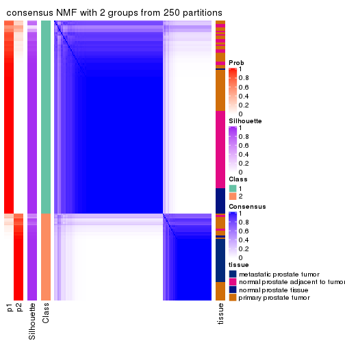</p>

</div>
<div id='tab-SD-NMF-consensus-heatmap-2'>
<pre><code class="r">consensus_heatmap(res, k = 3)
</code></pre>

<p>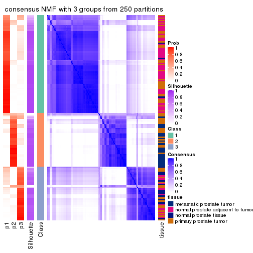</p>

</div>
<div id='tab-SD-NMF-consensus-heatmap-3'>
<pre><code class="r">consensus_heatmap(res, k = 4)
</code></pre>

<p>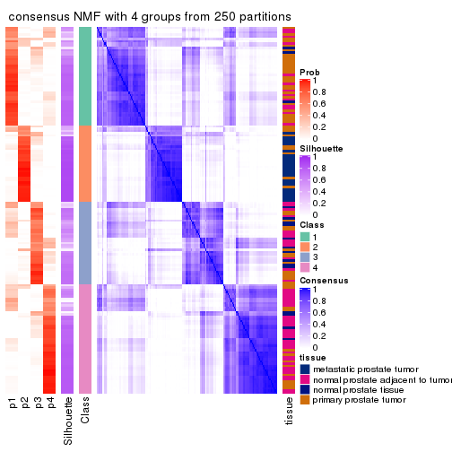</p>

</div>
<div id='tab-SD-NMF-consensus-heatmap-4'>
<pre><code class="r">consensus_heatmap(res, k = 5)
</code></pre>

<p>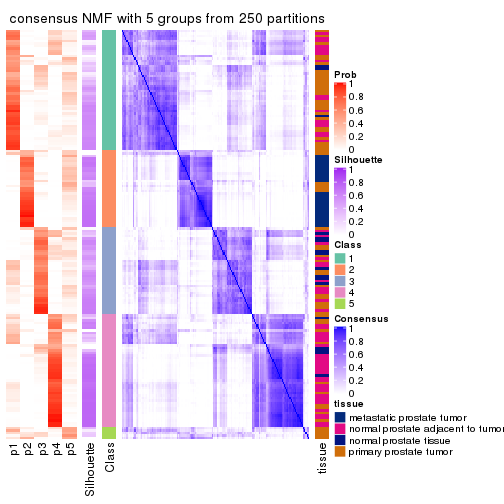</p>

</div>
<div id='tab-SD-NMF-consensus-heatmap-5'>
<pre><code class="r">consensus_heatmap(res, k = 6)
</code></pre>

<p>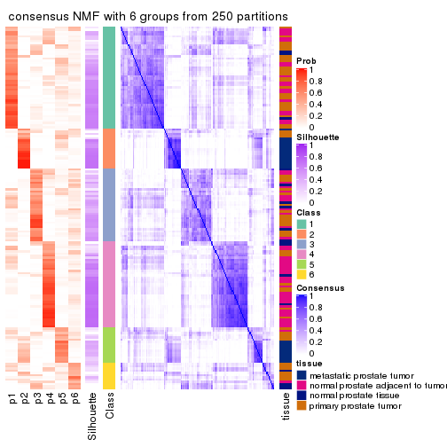</p>

</div>
</div>

Heatmaps for the membership of samples in all partitions to see how consistent they are:


<script>
$( function() {
	$( '#tabs-SD-NMF-membership-heatmap' ).tabs();
} );
</script>
<div id='tabs-SD-NMF-membership-heatmap'>
<ul>
<li><a href='#tab-SD-NMF-membership-heatmap-1'>k = 2</a></li>
<li><a href='#tab-SD-NMF-membership-heatmap-2'>k = 3</a></li>
<li><a href='#tab-SD-NMF-membership-heatmap-3'>k = 4</a></li>
<li><a href='#tab-SD-NMF-membership-heatmap-4'>k = 5</a></li>
<li><a href='#tab-SD-NMF-membership-heatmap-5'>k = 6</a></li>
</ul>
<div id='tab-SD-NMF-membership-heatmap-1'>
<pre><code class="r">membership_heatmap(res, k = 2)
</code></pre>

<p>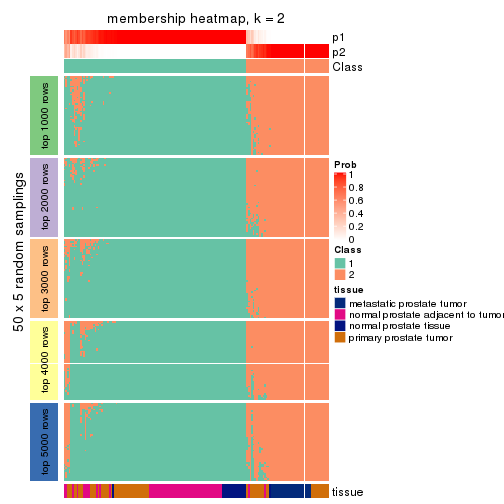</p>

</div>
<div id='tab-SD-NMF-membership-heatmap-2'>
<pre><code class="r">membership_heatmap(res, k = 3)
</code></pre>

<p>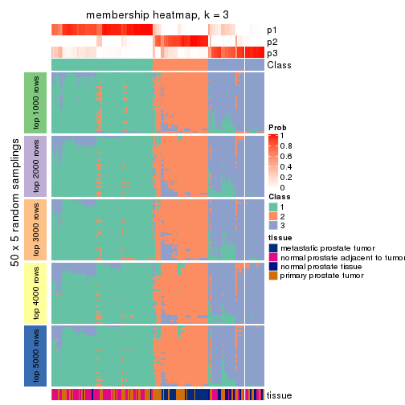</p>

</div>
<div id='tab-SD-NMF-membership-heatmap-3'>
<pre><code class="r">membership_heatmap(res, k = 4)
</code></pre>

<p>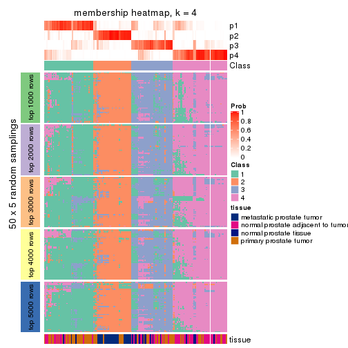</p>

</div>
<div id='tab-SD-NMF-membership-heatmap-4'>
<pre><code class="r">membership_heatmap(res, k = 5)
</code></pre>

<p>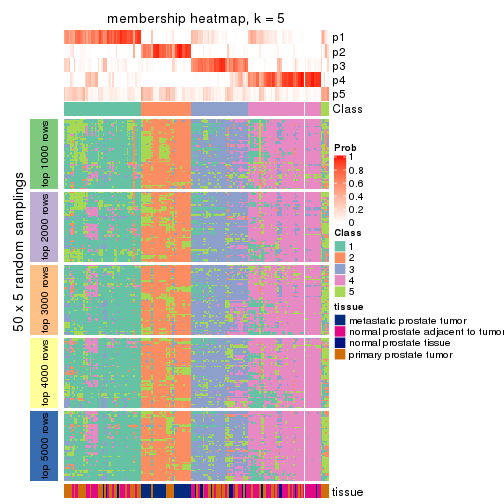</p>

</div>
<div id='tab-SD-NMF-membership-heatmap-5'>
<pre><code class="r">membership_heatmap(res, k = 6)
</code></pre>

<p>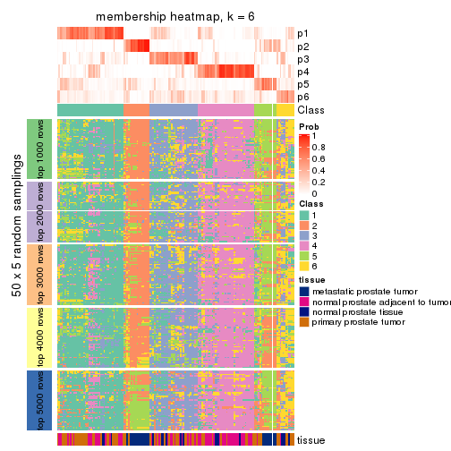</p>

</div>
</div>

As soon as we have had the classes for columns, we can look for signatures
which are significantly different between classes which can be candidate marks
for certain classes. Following are the heatmaps for signatures.


Signature heatmaps where rows are scaled:


<script>
$( function() {
	$( '#tabs-SD-NMF-get-signatures' ).tabs();
} );
</script>
<div id='tabs-SD-NMF-get-signatures'>
<ul>
<li><a href='#tab-SD-NMF-get-signatures-1'>k = 2</a></li>
<li><a href='#tab-SD-NMF-get-signatures-2'>k = 3</a></li>
<li><a href='#tab-SD-NMF-get-signatures-3'>k = 4</a></li>
<li><a href='#tab-SD-NMF-get-signatures-4'>k = 5</a></li>
<li><a href='#tab-SD-NMF-get-signatures-5'>k = 6</a></li>
</ul>
<div id='tab-SD-NMF-get-signatures-1'>
<pre><code class="r">get_signatures(res, k = 2)
</code></pre>

<p>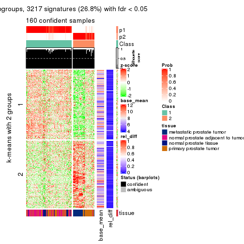</p>

</div>
<div id='tab-SD-NMF-get-signatures-2'>
<pre><code class="r">get_signatures(res, k = 3)
</code></pre>

<p>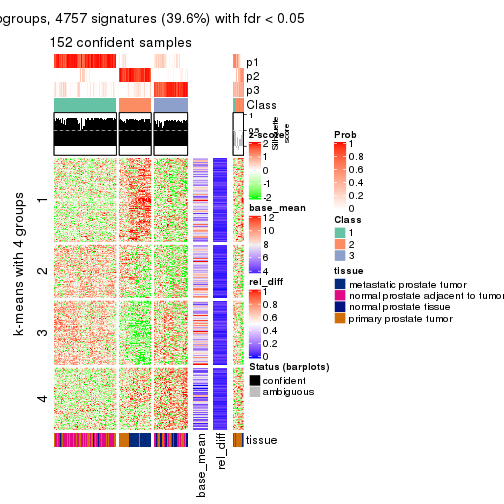</p>

</div>
<div id='tab-SD-NMF-get-signatures-3'>
<pre><code class="r">get_signatures(res, k = 4)
</code></pre>

<p>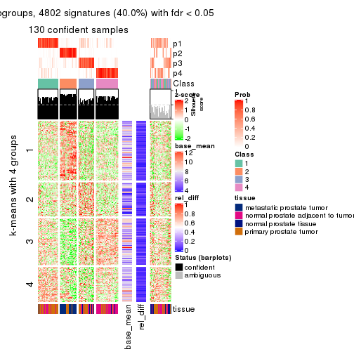</p>

</div>
<div id='tab-SD-NMF-get-signatures-4'>
<pre><code class="r">get_signatures(res, k = 5)
</code></pre>

<p>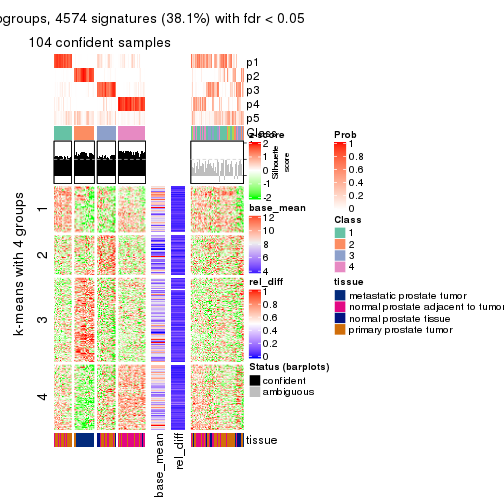</p>

</div>
<div id='tab-SD-NMF-get-signatures-5'>
<pre><code class="r">get_signatures(res, k = 6)
</code></pre>

<p>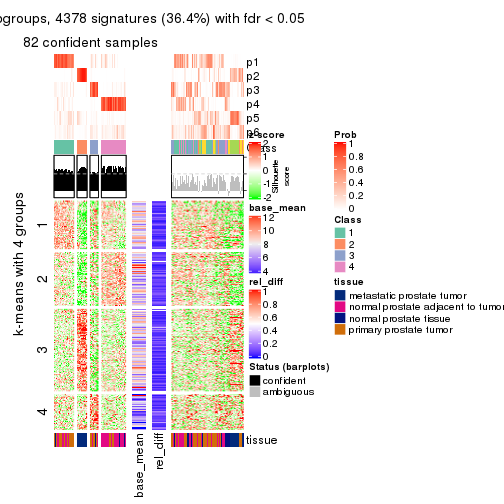</p>

</div>
</div>


Signature heatmaps where rows are not scaled:


<script>
$( function() {
	$( '#tabs-SD-NMF-get-signatures-no-scale' ).tabs();
} );
</script>
<div id='tabs-SD-NMF-get-signatures-no-scale'>
<ul>
<li><a href='#tab-SD-NMF-get-signatures-no-scale-1'>k = 2</a></li>
<li><a href='#tab-SD-NMF-get-signatures-no-scale-2'>k = 3</a></li>
<li><a href='#tab-SD-NMF-get-signatures-no-scale-3'>k = 4</a></li>
<li><a href='#tab-SD-NMF-get-signatures-no-scale-4'>k = 5</a></li>
<li><a href='#tab-SD-NMF-get-signatures-no-scale-5'>k = 6</a></li>
</ul>
<div id='tab-SD-NMF-get-signatures-no-scale-1'>
<pre><code class="r">get_signatures(res, k = 2, scale_rows = FALSE)
</code></pre>

<p>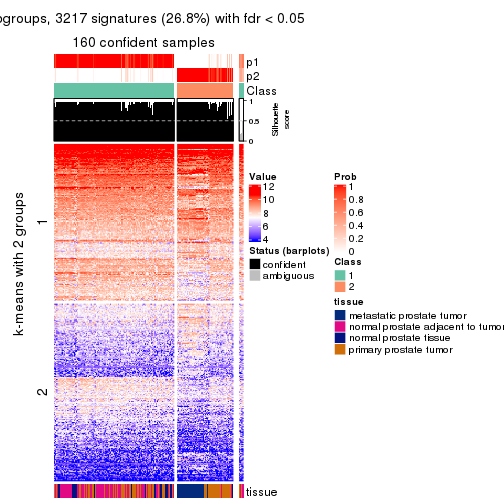</p>

</div>
<div id='tab-SD-NMF-get-signatures-no-scale-2'>
<pre><code class="r">get_signatures(res, k = 3, scale_rows = FALSE)
</code></pre>

<p>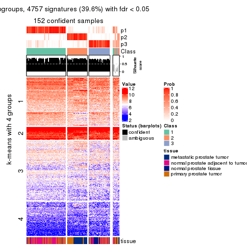</p>

</div>
<div id='tab-SD-NMF-get-signatures-no-scale-3'>
<pre><code class="r">get_signatures(res, k = 4, scale_rows = FALSE)
</code></pre>

<p>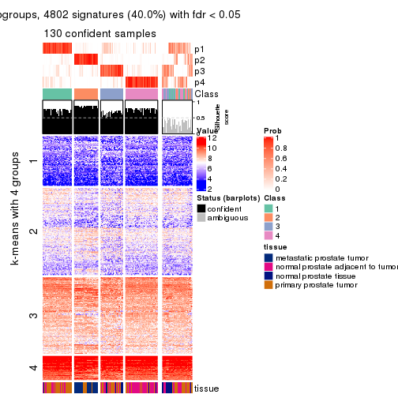</p>

</div>
<div id='tab-SD-NMF-get-signatures-no-scale-4'>
<pre><code class="r">get_signatures(res, k = 5, scale_rows = FALSE)
</code></pre>

<p>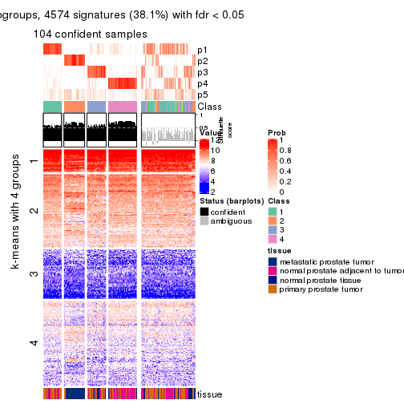</p>

</div>
<div id='tab-SD-NMF-get-signatures-no-scale-5'>
<pre><code class="r">get_signatures(res, k = 6, scale_rows = FALSE)
</code></pre>

<p>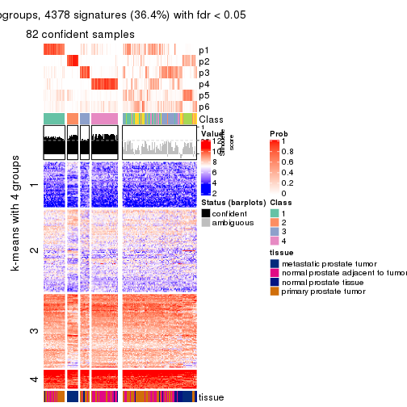</p>

</div>
</div>


Compare the overlap of signatures from different k:

```r
compare_signatures(res)
```

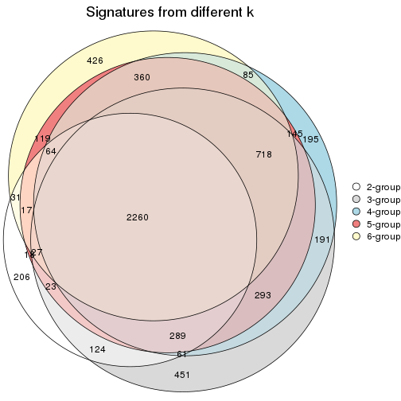

`get_signature()` returns a data frame invisibly. TO get the list of signatures, the function
call should be assigned to a variable explicitly. In following code, if `plot` argument is set
to `FALSE`, no heatmap is plotted while only the differential analysis is performed.

```r
# code only for demonstration
tb = get_signature(res, k = ..., plot = FALSE)
```

An example of the output of `tb` is:

```
#>   which_row         fdr    mean_1    mean_2 scaled_mean_1 scaled_mean_2 km
#> 1        38 0.042760348  8.373488  9.131774    -0.5533452     0.5164555  1
#> 2        40 0.018707592  7.106213  8.469186    -0.6173731     0.5762149  1
#> 3        55 0.019134737 10.221463 11.207825    -0.6159697     0.5749050  1
#> 4        59 0.006059896  5.921854  7.869574    -0.6899429     0.6439467  1
#> 5        60 0.018055526  8.928898 10.211722    -0.6204761     0.5791110  1
#> 6        98 0.009384629 15.714769 14.887706     0.6635654    -0.6193277  2
...
```

The columns in `tb` are:

1. `which_row`: row indices corresponding to the input matrix.
2. `fdr`: FDR for the differential test. 
3. `mean_x`: The mean value in group x.
4. `scaled_mean_x`: The mean value in group x after rows are scaled.
5. `km`: Row groups if k-means clustering is applied to rows.


UMAP plot which shows how samples are separated.


<script>
$( function() {
	$( '#tabs-SD-NMF-dimension-reduction' ).tabs();
} );
</script>
<div id='tabs-SD-NMF-dimension-reduction'>
<ul>
<li><a href='#tab-SD-NMF-dimension-reduction-1'>k = 2</a></li>
<li><a href='#tab-SD-NMF-dimension-reduction-2'>k = 3</a></li>
<li><a href='#tab-SD-NMF-dimension-reduction-3'>k = 4</a></li>
<li><a href='#tab-SD-NMF-dimension-reduction-4'>k = 5</a></li>
<li><a href='#tab-SD-NMF-dimension-reduction-5'>k = 6</a></li>
</ul>
<div id='tab-SD-NMF-dimension-reduction-1'>
<pre><code class="r">dimension_reduction(res, k = 2, method = &quot;UMAP&quot;)
</code></pre>

<p>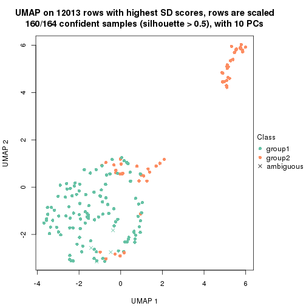</p>

</div>
<div id='tab-SD-NMF-dimension-reduction-2'>
<pre><code class="r">dimension_reduction(res, k = 3, method = &quot;UMAP&quot;)
</code></pre>

<p>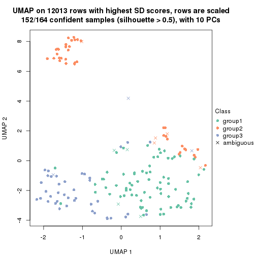</p>

</div>
<div id='tab-SD-NMF-dimension-reduction-3'>
<pre><code class="r">dimension_reduction(res, k = 4, method = &quot;UMAP&quot;)
</code></pre>

<p>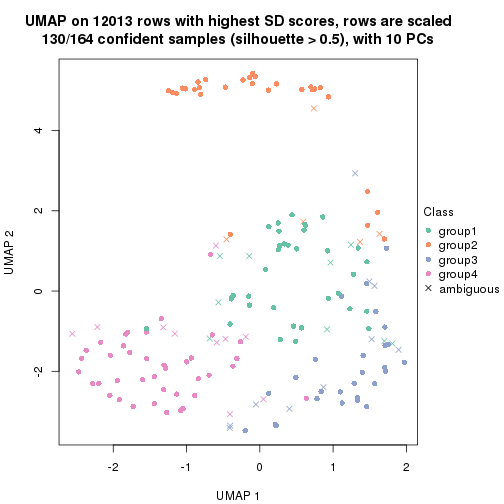</p>

</div>
<div id='tab-SD-NMF-dimension-reduction-4'>
<pre><code class="r">dimension_reduction(res, k = 5, method = &quot;UMAP&quot;)
</code></pre>

<p>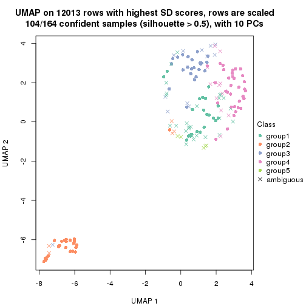</p>

</div>
<div id='tab-SD-NMF-dimension-reduction-5'>
<pre><code class="r">dimension_reduction(res, k = 6, method = &quot;UMAP&quot;)
</code></pre>

<p>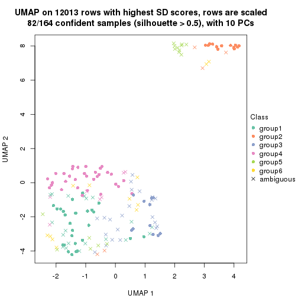</p>

</div>
</div>


Following heatmap shows how subgroups are split when increasing `k`:

```r
collect_classes(res)
```

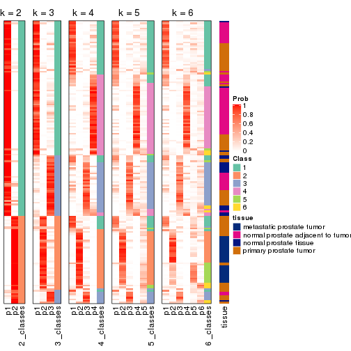


Test correlation between subgroups and known annotations. If the known
annotation is numeric, one-way ANOVA test is applied, and if the known
annotation is discrete, chi-squared contingency table test is applied.

```r
test_to_known_factors(res)
```

```
#>          n tissue(p) k
#> SD:NMF 160  2.84e-17 2
#> SD:NMF 152  1.20e-23 3
#> SD:NMF 130  7.88e-25 4
#> SD:NMF 104  4.81e-20 5
#> SD:NMF  82  4.72e-18 6
```


If matrix rows can be associated to genes, consider to use `functional_enrichment(res,
...)` to perform function enrichment for the signature genes. See [this vignette](http://bioconductor.org/packages/devel/bioc/vignettes/cola/inst/doc/functional_enrichment.html) for more detailed explanations.


 

---------------------------------------------------


### CV:hclust


The object with results only for a single top-value method and a single partition method 
can be extracted as:

```r
res = res_list["CV", "hclust"]
# you can also extract it by
# res = res_list["CV:hclust"]
```

A summary of `res` and all the functions that can be applied to it:

```r
res
```

```
#> A 'ConsensusPartition' object with k = 2, 3, 4, 5, 6.
#>   On a matrix with 12013 rows and 164 columns.
#>   Top rows (1000, 2000, 3000, 4000, 5000) are extracted by 'CV' method.
#>   Subgroups are detected by 'hclust' method.
#>   Performed in total 1250 partitions by row resampling.
#>   Best k for subgroups seems to be 6.
#> 
#> Following methods can be applied to this 'ConsensusPartition' object:
#>  [1] "cola_report"             "collect_classes"         "collect_plots"          
#>  [4] "collect_stats"           "colnames"                "compare_signatures"     
#>  [7] "consensus_heatmap"       "dimension_reduction"     "functional_enrichment"  
#> [10] "get_anno_col"            "get_anno"                "get_classes"            
#> [13] "get_consensus"           "get_matrix"              "get_membership"         
#> [16] "get_param"               "get_signatures"          "get_stats"              
#> [19] "is_best_k"               "is_stable_k"             "membership_heatmap"     
#> [22] "ncol"                    "nrow"                    "plot_ecdf"              
#> [25] "rownames"                "select_partition_number" "show"                   
#> [28] "suggest_best_k"          "test_to_known_factors"
```

`collect_plots()` function collects all the plots made from `res` for all `k` (number of partitions)
into one single page to provide an easy and fast comparison between different `k`.

```r
collect_plots(res)
```

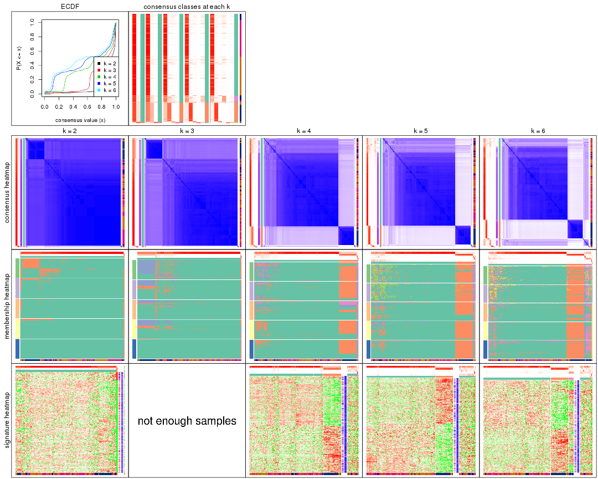

The plots are:

- The first row: a plot of the ECDF (empirical cumulative distribution
  function) curves of the consensus matrix for each `k` and the heatmap of
  predicted classes for each `k`.
- The second row: heatmaps of the consensus matrix for each `k`.
- The third row: heatmaps of the membership matrix for each `k`.
- The fouth row: heatmaps of the signatures for each `k`.

All the plots in panels can be made by individual functions and they are
plotted later in this section.

`select_partition_number()` produces several plots showing different
statistics for choosing "optimized" `k`. There are following statistics:

- ECDF curves of the consensus matrix for each `k`;
- 1-PAC. [The PAC
  score](https://en.wikipedia.org/wiki/Consensus_clustering#Over-interpretation_potential_of_consensus_clustering)
  measures the proportion of the ambiguous subgrouping.
- Mean silhouette score.
- Concordance. The mean probability of fiting the consensus class ids in all
  partitions.
- Area increased. Denote $A_k$ as the area under the ECDF curve for current
  `k`, the area increased is defined as $A_k - A_{k-1}$.
- Rand index. The percent of pairs of samples that are both in a same cluster
  or both are not in a same cluster in the partition of k and k-1.
- Jaccard index. The ratio of pairs of samples are both in a same cluster in
  the partition of k and k-1 and the pairs of samples are both in a same
  cluster in the partition k or k-1.

The detailed explanations of these statistics can be found in [the _cola_
vignette](http://bioconductor.org/packages/devel/bioc/vignettes/cola/inst/doc/cola.html#toc_13).

Generally speaking, lower PAC score, higher mean silhouette score or higher
concordance corresponds to better partition. Rand index and Jaccard index
measure how similar the current partition is compared to partition with `k-1`.
If they are too similar, we won't accept `k` is better than `k-1`.

```r
select_partition_number(res)
```

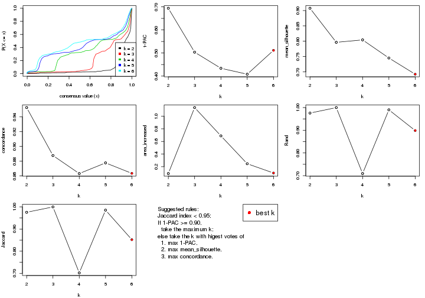

The numeric values for all these statistics can be obtained by `get_stats()`.

```r
get_stats(res)
```

```
#>   k 1-PAC mean_silhouette concordance area_increased  Rand Jaccard
#> 2 2 0.694           0.908       0.953         0.0910 0.976   0.976
#> 3 3 0.504           0.796       0.888         1.1371 1.000   1.000
#> 4 4 0.434           0.804       0.863         0.6884 0.709   0.702
#> 5 5 0.408           0.745       0.878         0.2463 0.990   0.985
#> 6 6 0.512           0.692       0.864         0.0995 0.899   0.852
```

`suggest_best_k()` suggests the best $k$ based on these statistics. The rules are as follows:

- All $k$ with Jaccard index larger than 0.95 are removed because increasing
  $k$ does not provide enough extra information. If all $k$ are removed, it is
  marked as no subgroup is detected.
- For all $k$ with 1-PAC score larger than 0.9, the maximal $k$ is taken as
  the best $k$, and other $k$ are marked as optional $k$.
- If it does not fit the second rule. The $k$ with the maximal vote of the
  highest 1-PAC score, highest mean silhouette, and highest concordance is
  taken as the best $k$.

```r
suggest_best_k(res)
```

```
#> [1] 6
```


Following shows the table of the partitions (You need to click the **show/hide
code output** link to see it). The membership matrix (columns with name `p*`)
is inferred by
[`clue::cl_consensus()`](https://www.rdocumentation.org/link/cl_consensus?package=clue)
function with the `SE` method. Basically the value in the membership matrix
represents the probability to belong to a certain group. The finall class
label for an item is determined with the group with highest probability it
belongs to.

In `get_classes()` function, the entropy is calculated from the membership
matrix and the silhouette score is calculated from the consensus matrix.


<script>
$( function() {
	$( '#tabs-CV-hclust-get-classes' ).tabs();
} );
</script>
<div id='tabs-CV-hclust-get-classes'>
<ul>
<li><a href='#tab-CV-hclust-get-classes-1'>k = 2</a></li>
<li><a href='#tab-CV-hclust-get-classes-2'>k = 3</a></li>
<li><a href='#tab-CV-hclust-get-classes-3'>k = 4</a></li>
<li><a href='#tab-CV-hclust-get-classes-4'>k = 5</a></li>
<li><a href='#tab-CV-hclust-get-classes-5'>k = 6</a></li>
</ul>

<div id='tab-CV-hclust-get-classes-1'>
<p><a id='tab-CV-hclust-get-classes-1-a' style='color:#0366d6' href='#'>show/hide code output</a></p>
<pre><code class="r">cbind(get_classes(res, k = 2), get_membership(res, k = 2))
</code></pre>

<pre><code>#&gt;           class entropy silhouette    p1    p2
#&gt; GSM152839     1  0.0672      0.943 0.992 0.008
#&gt; GSM152840     1  0.3274      0.919 0.940 0.060
#&gt; GSM152841     1  0.0000      0.944 1.000 0.000
#&gt; GSM152842     1  0.6247      0.781 0.844 0.156
#&gt; GSM152843     1  0.3274      0.913 0.940 0.060
#&gt; GSM152844     1  0.4690      0.883 0.900 0.100
#&gt; GSM152845     1  0.4939      0.886 0.892 0.108
#&gt; GSM152846     1  0.3879      0.901 0.924 0.076
#&gt; GSM152847     1  0.3431      0.910 0.936 0.064
#&gt; GSM152848     1  0.0376      0.944 0.996 0.004
#&gt; GSM152849     1  0.3114      0.922 0.944 0.056
#&gt; GSM152850     1  0.1843      0.939 0.972 0.028
#&gt; GSM152851     1  0.0938      0.943 0.988 0.012
#&gt; GSM152852     1  0.3584      0.914 0.932 0.068
#&gt; GSM152853     1  0.4161      0.897 0.916 0.084
#&gt; GSM152854     1  0.3431      0.918 0.936 0.064
#&gt; GSM152855     1  0.0000      0.944 1.000 0.000
#&gt; GSM153238     1  0.4298      0.896 0.912 0.088
#&gt; GSM153239     1  0.3584      0.910 0.932 0.068
#&gt; GSM153240     1  0.0376      0.944 0.996 0.004
#&gt; GSM153241     1  0.1843      0.934 0.972 0.028
#&gt; GSM153242     1  0.4562      0.892 0.904 0.096
#&gt; GSM153243     1  0.1184      0.943 0.984 0.016
#&gt; GSM153244     1  0.0376      0.944 0.996 0.004
#&gt; GSM153245     1  0.4690      0.875 0.900 0.100
#&gt; GSM153246     2  0.9522      0.583 0.372 0.628
#&gt; GSM153247     1  0.4161      0.898 0.916 0.084
#&gt; GSM153248     1  0.0000      0.944 1.000 0.000
#&gt; GSM153249     1  0.0672      0.943 0.992 0.008
#&gt; GSM153250     1  0.0000      0.944 1.000 0.000
#&gt; GSM153251     1  0.3733      0.915 0.928 0.072
#&gt; GSM153252     1  0.0000      0.944 1.000 0.000
#&gt; GSM153253     1  0.0376      0.944 0.996 0.004
#&gt; GSM153254     1  0.0376      0.944 0.996 0.004
#&gt; GSM153255     1  0.0000      0.944 1.000 0.000
#&gt; GSM153256     1  0.0000      0.944 1.000 0.000
#&gt; GSM153257     1  0.0000      0.944 1.000 0.000
#&gt; GSM153258     1  0.0000      0.944 1.000 0.000
#&gt; GSM153259     1  0.0376      0.944 0.996 0.004
#&gt; GSM153260     1  0.3879      0.910 0.924 0.076
#&gt; GSM153261     1  0.2043      0.934 0.968 0.032
#&gt; GSM153262     1  0.0376      0.944 0.996 0.004
#&gt; GSM153263     1  0.0000      0.944 1.000 0.000
#&gt; GSM153264     1  0.0376      0.944 0.996 0.004
#&gt; GSM153265     1  0.0000      0.944 1.000 0.000
#&gt; GSM153266     1  0.0000      0.944 1.000 0.000
#&gt; GSM153267     1  0.0000      0.944 1.000 0.000
#&gt; GSM153268     1  0.0672      0.944 0.992 0.008
#&gt; GSM153269     1  0.0000      0.944 1.000 0.000
#&gt; GSM153270     1  0.0000      0.944 1.000 0.000
#&gt; GSM153271     1  0.0000      0.944 1.000 0.000
#&gt; GSM153272     1  0.0000      0.944 1.000 0.000
#&gt; GSM153273     1  0.0376      0.944 0.996 0.004
#&gt; GSM153274     1  0.0672      0.943 0.992 0.008
#&gt; GSM153275     1  0.0376      0.944 0.996 0.004
#&gt; GSM153276     1  0.0672      0.944 0.992 0.008
#&gt; GSM153277     1  0.0376      0.944 0.996 0.004
#&gt; GSM153278     1  0.2423      0.927 0.960 0.040
#&gt; GSM153279     1  0.0376      0.944 0.996 0.004
#&gt; GSM153280     1  0.0000      0.944 1.000 0.000
#&gt; GSM153281     1  0.0376      0.944 0.996 0.004
#&gt; GSM153282     1  0.0376      0.944 0.996 0.004
#&gt; GSM153283     1  0.0000      0.944 1.000 0.000
#&gt; GSM153284     1  0.0376      0.944 0.996 0.004
#&gt; GSM153285     1  0.0376      0.944 0.996 0.004
#&gt; GSM153286     1  0.0000      0.944 1.000 0.000
#&gt; GSM153287     1  0.0376      0.944 0.996 0.004
#&gt; GSM153288     1  0.0000      0.944 1.000 0.000
#&gt; GSM153289     1  0.0000      0.944 1.000 0.000
#&gt; GSM153290     1  0.0000      0.944 1.000 0.000
#&gt; GSM153291     1  0.0000      0.944 1.000 0.000
#&gt; GSM153292     1  0.0376      0.944 0.996 0.004
#&gt; GSM153293     1  0.0376      0.944 0.996 0.004
#&gt; GSM153294     1  0.0376      0.944 0.996 0.004
#&gt; GSM153295     1  0.2778      0.920 0.952 0.048
#&gt; GSM153054     1  0.2423      0.931 0.960 0.040
#&gt; GSM153055     1  0.0000      0.944 1.000 0.000
#&gt; GSM153056     1  0.2423      0.928 0.960 0.040
#&gt; GSM153057     1  0.1184      0.943 0.984 0.016
#&gt; GSM153058     1  0.5408      0.861 0.876 0.124
#&gt; GSM153059     1  0.1633      0.939 0.976 0.024
#&gt; GSM153060     1  0.9209      0.287 0.664 0.336
#&gt; GSM153061     1  0.8555      0.500 0.720 0.280
#&gt; GSM153062     2  0.5178      0.703 0.116 0.884
#&gt; GSM153063     1  0.4022      0.896 0.920 0.080
#&gt; GSM153064     1  0.0376      0.944 0.996 0.004
#&gt; GSM153065     1  0.4022      0.906 0.920 0.080
#&gt; GSM153066     1  0.4562      0.891 0.904 0.096
#&gt; GSM153067     1  0.0376      0.944 0.996 0.004
#&gt; GSM153068     1  0.6247      0.799 0.844 0.156
#&gt; GSM153069     1  0.0376      0.944 0.996 0.004
#&gt; GSM153070     1  0.0000      0.944 1.000 0.000
#&gt; GSM153071     1  0.0376      0.944 0.996 0.004
#&gt; GSM153072     1  0.0672      0.943 0.992 0.008
#&gt; GSM153073     1  0.0000      0.944 1.000 0.000
#&gt; GSM153074     1  0.0376      0.944 0.996 0.004
#&gt; GSM153075     1  0.0000      0.944 1.000 0.000
#&gt; GSM153076     1  0.0000      0.944 1.000 0.000
#&gt; GSM153077     1  0.0000      0.944 1.000 0.000
#&gt; GSM153078     1  0.0672      0.944 0.992 0.008
#&gt; GSM153079     1  0.0000      0.944 1.000 0.000
#&gt; GSM153080     1  0.1414      0.941 0.980 0.020
#&gt; GSM153081     1  0.0000      0.944 1.000 0.000
#&gt; GSM153082     1  0.0376      0.944 0.996 0.004
#&gt; GSM153083     1  0.0000      0.944 1.000 0.000
#&gt; GSM153084     1  0.2236      0.934 0.964 0.036
#&gt; GSM153085     1  0.0672      0.944 0.992 0.008
#&gt; GSM153086     1  0.0672      0.943 0.992 0.008
#&gt; GSM153087     1  0.0376      0.944 0.996 0.004
#&gt; GSM153088     1  0.0000      0.944 1.000 0.000
#&gt; GSM153089     1  0.3584      0.917 0.932 0.068
#&gt; GSM153090     1  0.0000      0.944 1.000 0.000
#&gt; GSM153091     1  0.0376      0.944 0.996 0.004
#&gt; GSM153092     1  0.0000      0.944 1.000 0.000
#&gt; GSM153093     1  0.0376      0.944 0.996 0.004
#&gt; GSM153094     1  0.0376      0.944 0.996 0.004
#&gt; GSM153095     1  0.0938      0.943 0.988 0.012
#&gt; GSM153096     1  0.0376      0.944 0.996 0.004
#&gt; GSM153097     1  0.0000      0.944 1.000 0.000
#&gt; GSM153098     1  0.0672      0.943 0.992 0.008
#&gt; GSM153099     1  0.0000      0.944 1.000 0.000
#&gt; GSM153100     1  0.0000      0.944 1.000 0.000
#&gt; GSM153101     1  0.1633      0.939 0.976 0.024
#&gt; GSM153102     1  0.1184      0.940 0.984 0.016
#&gt; GSM153103     1  0.0672      0.943 0.992 0.008
#&gt; GSM153104     1  0.0672      0.943 0.992 0.008
#&gt; GSM153106     1  0.0000      0.944 1.000 0.000
#&gt; GSM153107     1  0.0000      0.944 1.000 0.000
#&gt; GSM153108     1  0.0000      0.944 1.000 0.000
#&gt; GSM153109     1  0.1184      0.940 0.984 0.016
#&gt; GSM153110     1  0.0000      0.944 1.000 0.000
#&gt; GSM153111     1  0.0000      0.944 1.000 0.000
#&gt; GSM153112     1  0.0376      0.944 0.996 0.004
#&gt; GSM153113     1  0.1414      0.939 0.980 0.020
#&gt; GSM153114     1  0.0000      0.944 1.000 0.000
#&gt; GSM187532     1  0.5178      0.868 0.884 0.116
#&gt; GSM187533     1  0.5737      0.847 0.864 0.136
#&gt; GSM187534     1  0.5737      0.847 0.864 0.136
#&gt; GSM187535     1  0.1184      0.940 0.984 0.016
#&gt; GSM152906     1  0.5946      0.836 0.856 0.144
#&gt; GSM152907     1  0.5946      0.836 0.856 0.144
#&gt; GSM152908     1  0.5842      0.838 0.860 0.140
#&gt; GSM152909     1  0.5946      0.837 0.856 0.144
#&gt; GSM152910     1  0.5946      0.834 0.856 0.144
#&gt; GSM152911     1  0.5842      0.838 0.860 0.140
#&gt; GSM152912     1  0.5842      0.838 0.860 0.140
#&gt; GSM152913     1  0.6048      0.829 0.852 0.148
#&gt; GSM152914     1  0.5842      0.838 0.860 0.140
#&gt; GSM152915     1  0.5842      0.838 0.860 0.140
#&gt; GSM152916     1  0.5842      0.838 0.860 0.140
#&gt; GSM152917     1  0.5842      0.838 0.860 0.140
#&gt; GSM152918     1  0.5842      0.838 0.860 0.140
#&gt; GSM152919     1  0.5737      0.843 0.864 0.136
#&gt; GSM152920     1  0.5842      0.838 0.860 0.140
#&gt; GSM152921     1  0.5842      0.838 0.860 0.140
#&gt; GSM152922     1  0.5946      0.834 0.856 0.144
#&gt; GSM152923     1  0.5946      0.836 0.856 0.144
#&gt; GSM152924     1  0.5842      0.838 0.860 0.140
#&gt; GSM152925     1  0.5842      0.838 0.860 0.140
#&gt; GSM152926     1  0.5946      0.836 0.856 0.144
#&gt; GSM152927     1  0.5629      0.847 0.868 0.132
#&gt; GSM152928     1  0.4562      0.885 0.904 0.096
#&gt; GSM152929     1  0.5946      0.836 0.856 0.144
#&gt; GSM152930     1  0.5946      0.836 0.856 0.144
</code></pre>

<script>
$('#tab-CV-hclust-get-classes-1-a').parent().next().next().hide();
$('#tab-CV-hclust-get-classes-1-a').click(function(){
  $('#tab-CV-hclust-get-classes-1-a').parent().next().next().toggle();
  return(false);
});
</script>
</div>

<div id='tab-CV-hclust-get-classes-2'>
<p><a id='tab-CV-hclust-get-classes-2-a' style='color:#0366d6' href='#'>show/hide code output</a></p>
<pre><code class="r">cbind(get_classes(res, k = 3), get_membership(res, k = 3))
</code></pre>

<pre><code>#&gt;           class entropy silhouette    p1    p2    p3
#&gt; GSM152839     1  0.1031     0.8839 0.976 0.024 0.000
#&gt; GSM152840     1  0.4915     0.8087 0.832 0.132 0.036
#&gt; GSM152841     1  0.0237     0.8848 0.996 0.000 0.004
#&gt; GSM152842     1  0.7557     0.4721 0.656 0.264 0.080
#&gt; GSM152843     1  0.3337     0.8508 0.908 0.060 0.032
#&gt; GSM152844     1  0.5852     0.7690 0.788 0.152 0.060
#&gt; GSM152845     1  0.6079     0.7449 0.748 0.216 0.036
#&gt; GSM152846     1  0.5581     0.7788 0.792 0.168 0.040
#&gt; GSM152847     1  0.4618     0.8015 0.840 0.136 0.024
#&gt; GSM152848     1  0.0747     0.8839 0.984 0.016 0.000
#&gt; GSM152849     1  0.3091     0.8580 0.912 0.072 0.016
#&gt; GSM152850     1  0.2173     0.8747 0.944 0.048 0.008
#&gt; GSM152851     1  0.1453     0.8824 0.968 0.024 0.008
#&gt; GSM152852     1  0.4575     0.8079 0.828 0.160 0.012
#&gt; GSM152853     1  0.5454     0.7848 0.804 0.152 0.044
#&gt; GSM152854     1  0.4805     0.7983 0.812 0.176 0.012
#&gt; GSM152855     1  0.0592     0.8851 0.988 0.012 0.000
#&gt; GSM153238     1  0.5519     0.7994 0.812 0.120 0.068
#&gt; GSM153239     1  0.5222     0.7963 0.816 0.144 0.040
#&gt; GSM153240     1  0.0237     0.8844 0.996 0.004 0.000
#&gt; GSM153241     1  0.2492     0.8672 0.936 0.048 0.016
#&gt; GSM153242     1  0.6119     0.7569 0.772 0.164 0.064
#&gt; GSM153243     1  0.1453     0.8828 0.968 0.024 0.008
#&gt; GSM153244     1  0.0747     0.8857 0.984 0.016 0.000
#&gt; GSM153245     1  0.6383     0.7326 0.768 0.128 0.104
#&gt; GSM153246     2  0.8549     0.0000 0.100 0.516 0.384
#&gt; GSM153247     1  0.5416     0.7989 0.820 0.100 0.080
#&gt; GSM153248     1  0.0424     0.8843 0.992 0.008 0.000
#&gt; GSM153249     1  0.0592     0.8855 0.988 0.012 0.000
#&gt; GSM153250     1  0.0424     0.8848 0.992 0.008 0.000
#&gt; GSM153251     1  0.5173     0.8012 0.816 0.148 0.036
#&gt; GSM153252     1  0.0237     0.8848 0.996 0.000 0.004
#&gt; GSM153253     1  0.0424     0.8842 0.992 0.008 0.000
#&gt; GSM153254     1  0.0592     0.8862 0.988 0.012 0.000
#&gt; GSM153255     1  0.0000     0.8839 1.000 0.000 0.000
#&gt; GSM153256     1  0.0424     0.8848 0.992 0.008 0.000
#&gt; GSM153257     1  0.0237     0.8839 0.996 0.004 0.000
#&gt; GSM153258     1  0.0424     0.8847 0.992 0.008 0.000
#&gt; GSM153259     1  0.0747     0.8849 0.984 0.016 0.000
#&gt; GSM153260     1  0.4748     0.8085 0.832 0.144 0.024
#&gt; GSM153261     1  0.3083     0.8650 0.916 0.060 0.024
#&gt; GSM153262     1  0.0424     0.8839 0.992 0.008 0.000
#&gt; GSM153263     1  0.0237     0.8846 0.996 0.004 0.000
#&gt; GSM153264     1  0.0424     0.8842 0.992 0.008 0.000
#&gt; GSM153265     1  0.0000     0.8839 1.000 0.000 0.000
#&gt; GSM153266     1  0.0237     0.8839 0.996 0.004 0.000
#&gt; GSM153267     1  0.0237     0.8839 0.996 0.004 0.000
#&gt; GSM153268     1  0.1399     0.8821 0.968 0.028 0.004
#&gt; GSM153269     1  0.0424     0.8848 0.992 0.008 0.000
#&gt; GSM153270     1  0.0424     0.8848 0.992 0.008 0.000
#&gt; GSM153271     1  0.0424     0.8848 0.992 0.008 0.000
#&gt; GSM153272     1  0.0000     0.8839 1.000 0.000 0.000
#&gt; GSM153273     1  0.0592     0.8848 0.988 0.012 0.000
#&gt; GSM153274     1  0.0892     0.8853 0.980 0.020 0.000
#&gt; GSM153275     1  0.0592     0.8851 0.988 0.012 0.000
#&gt; GSM153276     1  0.0424     0.8853 0.992 0.008 0.000
#&gt; GSM153277     1  0.0424     0.8852 0.992 0.008 0.000
#&gt; GSM153278     1  0.2663     0.8630 0.932 0.044 0.024
#&gt; GSM153279     1  0.0592     0.8857 0.988 0.012 0.000
#&gt; GSM153280     1  0.0237     0.8846 0.996 0.004 0.000
#&gt; GSM153281     1  0.0475     0.8849 0.992 0.004 0.004
#&gt; GSM153282     1  0.0475     0.8849 0.992 0.004 0.004
#&gt; GSM153283     1  0.0592     0.8845 0.988 0.012 0.000
#&gt; GSM153284     1  0.0424     0.8852 0.992 0.008 0.000
#&gt; GSM153285     1  0.0237     0.8844 0.996 0.004 0.000
#&gt; GSM153286     1  0.0237     0.8846 0.996 0.004 0.000
#&gt; GSM153287     1  0.0661     0.8852 0.988 0.008 0.004
#&gt; GSM153288     1  0.0000     0.8839 1.000 0.000 0.000
#&gt; GSM153289     1  0.0592     0.8851 0.988 0.012 0.000
#&gt; GSM153290     1  0.0237     0.8846 0.996 0.004 0.000
#&gt; GSM153291     1  0.0424     0.8848 0.992 0.008 0.000
#&gt; GSM153292     1  0.0661     0.8852 0.988 0.008 0.004
#&gt; GSM153293     1  0.0592     0.8855 0.988 0.012 0.000
#&gt; GSM153294     1  0.0747     0.8849 0.984 0.016 0.000
#&gt; GSM153295     1  0.3415     0.8430 0.900 0.080 0.020
#&gt; GSM153054     1  0.3009     0.8636 0.920 0.052 0.028
#&gt; GSM153055     1  0.0000     0.8839 1.000 0.000 0.000
#&gt; GSM153056     1  0.2434     0.8655 0.940 0.036 0.024
#&gt; GSM153057     1  0.1399     0.8835 0.968 0.028 0.004
#&gt; GSM153058     1  0.6530     0.7462 0.760 0.120 0.120
#&gt; GSM153059     1  0.2116     0.8766 0.948 0.040 0.012
#&gt; GSM153060     1  0.9646    -0.1548 0.468 0.272 0.260
#&gt; GSM153061     1  0.9386     0.0596 0.512 0.244 0.244
#&gt; GSM153062     3  0.0983     0.0000 0.004 0.016 0.980
#&gt; GSM153063     1  0.5662     0.7793 0.808 0.100 0.092
#&gt; GSM153064     1  0.0747     0.8849 0.984 0.016 0.000
#&gt; GSM153065     1  0.5634     0.7822 0.800 0.144 0.056
#&gt; GSM153066     1  0.5330     0.7974 0.812 0.144 0.044
#&gt; GSM153067     1  0.0237     0.8848 0.996 0.004 0.000
#&gt; GSM153068     1  0.7298     0.6430 0.700 0.200 0.100
#&gt; GSM153069     1  0.0237     0.8844 0.996 0.004 0.000
#&gt; GSM153070     1  0.0237     0.8839 0.996 0.004 0.000
#&gt; GSM153071     1  0.1129     0.8855 0.976 0.020 0.004
#&gt; GSM153072     1  0.1315     0.8838 0.972 0.020 0.008
#&gt; GSM153073     1  0.0424     0.8848 0.992 0.008 0.000
#&gt; GSM153074     1  0.0424     0.8848 0.992 0.008 0.000
#&gt; GSM153075     1  0.0424     0.8850 0.992 0.008 0.000
#&gt; GSM153076     1  0.0424     0.8847 0.992 0.008 0.000
#&gt; GSM153077     1  0.0424     0.8853 0.992 0.008 0.000
#&gt; GSM153078     1  0.1031     0.8847 0.976 0.024 0.000
#&gt; GSM153079     1  0.0592     0.8851 0.988 0.012 0.000
#&gt; GSM153080     1  0.1950     0.8796 0.952 0.040 0.008
#&gt; GSM153081     1  0.0592     0.8851 0.988 0.012 0.000
#&gt; GSM153082     1  0.0592     0.8860 0.988 0.012 0.000
#&gt; GSM153083     1  0.0747     0.8852 0.984 0.016 0.000
#&gt; GSM153084     1  0.3370     0.8585 0.904 0.072 0.024
#&gt; GSM153085     1  0.1182     0.8848 0.976 0.012 0.012
#&gt; GSM153086     1  0.1031     0.8842 0.976 0.024 0.000
#&gt; GSM153087     1  0.0424     0.8839 0.992 0.008 0.000
#&gt; GSM153088     1  0.0424     0.8848 0.992 0.008 0.000
#&gt; GSM153089     1  0.5058     0.8092 0.820 0.148 0.032
#&gt; GSM153090     1  0.0424     0.8848 0.992 0.008 0.000
#&gt; GSM153091     1  0.0747     0.8849 0.984 0.016 0.000
#&gt; GSM153092     1  0.0237     0.8846 0.996 0.004 0.000
#&gt; GSM153093     1  0.0424     0.8853 0.992 0.008 0.000
#&gt; GSM153094     1  0.0747     0.8856 0.984 0.016 0.000
#&gt; GSM153095     1  0.1267     0.8841 0.972 0.024 0.004
#&gt; GSM153096     1  0.0592     0.8848 0.988 0.012 0.000
#&gt; GSM153097     1  0.0592     0.8851 0.988 0.012 0.000
#&gt; GSM153098     1  0.0592     0.8856 0.988 0.012 0.000
#&gt; GSM153099     1  0.0424     0.8848 0.992 0.008 0.000
#&gt; GSM153100     1  0.0424     0.8843 0.992 0.008 0.000
#&gt; GSM153101     1  0.2339     0.8739 0.940 0.048 0.012
#&gt; GSM153102     1  0.1289     0.8820 0.968 0.032 0.000
#&gt; GSM153103     1  0.0747     0.8853 0.984 0.016 0.000
#&gt; GSM153104     1  0.0592     0.8834 0.988 0.012 0.000
#&gt; GSM153106     1  0.0592     0.8851 0.988 0.012 0.000
#&gt; GSM153107     1  0.0592     0.8851 0.988 0.012 0.000
#&gt; GSM153108     1  0.0237     0.8846 0.996 0.004 0.000
#&gt; GSM153109     1  0.1289     0.8816 0.968 0.032 0.000
#&gt; GSM153110     1  0.0424     0.8843 0.992 0.008 0.000
#&gt; GSM153111     1  0.0747     0.8852 0.984 0.016 0.000
#&gt; GSM153112     1  0.0747     0.8849 0.984 0.016 0.000
#&gt; GSM153113     1  0.2066     0.8712 0.940 0.060 0.000
#&gt; GSM153114     1  0.0592     0.8851 0.988 0.012 0.000
#&gt; GSM187532     1  0.5873     0.6602 0.684 0.312 0.004
#&gt; GSM187533     1  0.5905     0.6182 0.648 0.352 0.000
#&gt; GSM187534     1  0.5905     0.6182 0.648 0.352 0.000
#&gt; GSM187535     1  0.1411     0.8815 0.964 0.036 0.000
#&gt; GSM152906     1  0.6008     0.5911 0.628 0.372 0.000
#&gt; GSM152907     1  0.5988     0.5969 0.632 0.368 0.000
#&gt; GSM152908     1  0.5988     0.5954 0.632 0.368 0.000
#&gt; GSM152909     1  0.5926     0.6120 0.644 0.356 0.000
#&gt; GSM152910     1  0.6008     0.5897 0.628 0.372 0.000
#&gt; GSM152911     1  0.5988     0.5954 0.632 0.368 0.000
#&gt; GSM152912     1  0.5988     0.5954 0.632 0.368 0.000
#&gt; GSM152913     1  0.6228     0.5836 0.624 0.372 0.004
#&gt; GSM152914     1  0.5988     0.5954 0.632 0.368 0.000
#&gt; GSM152915     1  0.5988     0.5954 0.632 0.368 0.000
#&gt; GSM152916     1  0.5988     0.5954 0.632 0.368 0.000
#&gt; GSM152917     1  0.5988     0.5954 0.632 0.368 0.000
#&gt; GSM152918     1  0.5988     0.5954 0.632 0.368 0.000
#&gt; GSM152919     1  0.5968     0.6008 0.636 0.364 0.000
#&gt; GSM152920     1  0.5988     0.5954 0.632 0.368 0.000
#&gt; GSM152921     1  0.5988     0.5954 0.632 0.368 0.000
#&gt; GSM152922     1  0.6008     0.5897 0.628 0.372 0.000
#&gt; GSM152923     1  0.6008     0.5911 0.628 0.372 0.000
#&gt; GSM152924     1  0.5988     0.5954 0.632 0.368 0.000
#&gt; GSM152925     1  0.5968     0.6008 0.636 0.364 0.000
#&gt; GSM152926     1  0.6008     0.5911 0.628 0.372 0.000
#&gt; GSM152927     1  0.5948     0.6060 0.640 0.360 0.000
#&gt; GSM152928     1  0.6096     0.6821 0.704 0.280 0.016
#&gt; GSM152929     1  0.6008     0.5911 0.628 0.372 0.000
#&gt; GSM152930     1  0.6008     0.5911 0.628 0.372 0.000
</code></pre>

<script>
$('#tab-CV-hclust-get-classes-2-a').parent().next().next().hide();
$('#tab-CV-hclust-get-classes-2-a').click(function(){
  $('#tab-CV-hclust-get-classes-2-a').parent().next().next().toggle();
  return(false);
});
</script>
</div>

<div id='tab-CV-hclust-get-classes-3'>
<p><a id='tab-CV-hclust-get-classes-3-a' style='color:#0366d6' href='#'>show/hide code output</a></p>
<pre><code class="r">cbind(get_classes(res, k = 4), get_membership(res, k = 4))
</code></pre>

<pre><code>#&gt;           class entropy silhouette    p1    p2    p3    p4
#&gt; GSM152839     1  0.1406     0.8923 0.960 0.024 0.016 0.000
#&gt; GSM152840     1  0.6162     0.5622 0.708 0.192 0.068 0.032
#&gt; GSM152841     1  0.0376     0.8958 0.992 0.004 0.004 0.000
#&gt; GSM152842     1  0.6788    -0.0527 0.520 0.048 0.408 0.024
#&gt; GSM152843     1  0.3494     0.8249 0.876 0.028 0.080 0.016
#&gt; GSM152844     1  0.7002     0.4520 0.652 0.208 0.092 0.048
#&gt; GSM152845     1  0.7363    -0.0790 0.548 0.336 0.076 0.040
#&gt; GSM152846     1  0.6948     0.4086 0.644 0.224 0.096 0.036
#&gt; GSM152847     1  0.5451     0.6480 0.740 0.084 0.172 0.004
#&gt; GSM152848     1  0.1297     0.8935 0.964 0.016 0.020 0.000
#&gt; GSM152849     1  0.3769     0.8141 0.864 0.052 0.072 0.012
#&gt; GSM152850     1  0.2814     0.8535 0.908 0.032 0.052 0.008
#&gt; GSM152851     1  0.1697     0.8849 0.952 0.028 0.016 0.004
#&gt; GSM152852     1  0.5775     0.5367 0.696 0.212 0.092 0.000
#&gt; GSM152853     1  0.6610     0.4934 0.672 0.196 0.108 0.024
#&gt; GSM152854     1  0.5848     0.4922 0.684 0.228 0.088 0.000
#&gt; GSM152855     1  0.0895     0.8946 0.976 0.020 0.004 0.000
#&gt; GSM153238     1  0.6391     0.5862 0.708 0.160 0.092 0.040
#&gt; GSM153239     1  0.6502     0.5080 0.680 0.196 0.100 0.024
#&gt; GSM153240     1  0.0188     0.8955 0.996 0.000 0.004 0.000
#&gt; GSM153241     1  0.3455     0.8291 0.880 0.044 0.064 0.012
#&gt; GSM153242     1  0.7236     0.3322 0.628 0.220 0.108 0.044
#&gt; GSM153243     1  0.2328     0.8671 0.924 0.056 0.016 0.004
#&gt; GSM153244     1  0.1042     0.8955 0.972 0.020 0.008 0.000
#&gt; GSM153245     1  0.7445     0.4582 0.644 0.140 0.136 0.080
#&gt; GSM153246     3  0.6020    -0.6628 0.004 0.128 0.700 0.168
#&gt; GSM153247     1  0.6857     0.5402 0.680 0.140 0.132 0.048
#&gt; GSM153248     1  0.0524     0.8951 0.988 0.008 0.004 0.000
#&gt; GSM153249     1  0.0524     0.8963 0.988 0.008 0.004 0.000
#&gt; GSM153250     1  0.0376     0.8956 0.992 0.004 0.004 0.000
#&gt; GSM153251     1  0.6307     0.4528 0.676 0.236 0.060 0.028
#&gt; GSM153252     1  0.0188     0.8957 0.996 0.000 0.004 0.000
#&gt; GSM153253     1  0.0657     0.8953 0.984 0.004 0.012 0.000
#&gt; GSM153254     1  0.0657     0.8970 0.984 0.012 0.004 0.000
#&gt; GSM153255     1  0.0000     0.8946 1.000 0.000 0.000 0.000
#&gt; GSM153256     1  0.0376     0.8956 0.992 0.004 0.004 0.000
#&gt; GSM153257     1  0.0336     0.8956 0.992 0.000 0.008 0.000
#&gt; GSM153258     1  0.0336     0.8957 0.992 0.008 0.000 0.000
#&gt; GSM153259     1  0.0707     0.8954 0.980 0.020 0.000 0.000
#&gt; GSM153260     1  0.6233     0.5028 0.700 0.192 0.084 0.024
#&gt; GSM153261     1  0.4014     0.8053 0.852 0.084 0.048 0.016
#&gt; GSM153262     1  0.0336     0.8956 0.992 0.000 0.008 0.000
#&gt; GSM153263     1  0.0376     0.8959 0.992 0.004 0.004 0.000
#&gt; GSM153264     1  0.0804     0.8946 0.980 0.012 0.008 0.000
#&gt; GSM153265     1  0.0000     0.8946 1.000 0.000 0.000 0.000
#&gt; GSM153266     1  0.0524     0.8954 0.988 0.008 0.004 0.000
#&gt; GSM153267     1  0.0188     0.8950 0.996 0.000 0.004 0.000
#&gt; GSM153268     1  0.1913     0.8775 0.940 0.040 0.020 0.000
#&gt; GSM153269     1  0.0376     0.8956 0.992 0.004 0.004 0.000
#&gt; GSM153270     1  0.0657     0.8959 0.984 0.012 0.004 0.000
#&gt; GSM153271     1  0.0376     0.8956 0.992 0.004 0.004 0.000
#&gt; GSM153272     1  0.0000     0.8946 1.000 0.000 0.000 0.000
#&gt; GSM153273     1  0.0895     0.8938 0.976 0.020 0.004 0.000
#&gt; GSM153274     1  0.0937     0.8968 0.976 0.012 0.012 0.000
#&gt; GSM153275     1  0.0524     0.8958 0.988 0.008 0.004 0.000
#&gt; GSM153276     1  0.0524     0.8966 0.988 0.008 0.004 0.000
#&gt; GSM153277     1  0.0376     0.8961 0.992 0.004 0.004 0.000
#&gt; GSM153278     1  0.3465     0.8281 0.880 0.072 0.028 0.020
#&gt; GSM153279     1  0.0657     0.8967 0.984 0.012 0.004 0.000
#&gt; GSM153280     1  0.0188     0.8953 0.996 0.004 0.000 0.000
#&gt; GSM153281     1  0.0469     0.8963 0.988 0.000 0.012 0.000
#&gt; GSM153282     1  0.0336     0.8958 0.992 0.000 0.008 0.000
#&gt; GSM153283     1  0.0524     0.8963 0.988 0.008 0.004 0.000
#&gt; GSM153284     1  0.0524     0.8969 0.988 0.004 0.008 0.000
#&gt; GSM153285     1  0.0336     0.8964 0.992 0.000 0.008 0.000
#&gt; GSM153286     1  0.0188     0.8953 0.996 0.004 0.000 0.000
#&gt; GSM153287     1  0.0524     0.8962 0.988 0.004 0.008 0.000
#&gt; GSM153288     1  0.0000     0.8946 1.000 0.000 0.000 0.000
#&gt; GSM153289     1  0.0895     0.8946 0.976 0.020 0.004 0.000
#&gt; GSM153290     1  0.0188     0.8953 0.996 0.004 0.000 0.000
#&gt; GSM153291     1  0.0376     0.8956 0.992 0.004 0.004 0.000
#&gt; GSM153292     1  0.0524     0.8962 0.988 0.004 0.008 0.000
#&gt; GSM153293     1  0.0524     0.8961 0.988 0.008 0.004 0.000
#&gt; GSM153294     1  0.1004     0.8933 0.972 0.024 0.004 0.000
#&gt; GSM153295     1  0.3726     0.8100 0.864 0.032 0.088 0.016
#&gt; GSM153054     1  0.3599     0.8293 0.876 0.040 0.064 0.020
#&gt; GSM153055     1  0.0188     0.8955 0.996 0.004 0.000 0.000
#&gt; GSM153056     1  0.3178     0.8399 0.896 0.052 0.032 0.020
#&gt; GSM153057     1  0.2099     0.8780 0.936 0.040 0.020 0.004
#&gt; GSM153058     1  0.7611     0.3344 0.616 0.196 0.068 0.120
#&gt; GSM153059     1  0.3029     0.8393 0.896 0.068 0.028 0.008
#&gt; GSM153060     3  0.8588     0.0524 0.316 0.076 0.468 0.140
#&gt; GSM153061     1  0.8483    -0.4984 0.404 0.048 0.384 0.164
#&gt; GSM153062     4  0.0469     0.0000 0.000 0.000 0.012 0.988
#&gt; GSM153063     1  0.6856     0.5492 0.688 0.132 0.116 0.064
#&gt; GSM153064     1  0.0895     0.8949 0.976 0.020 0.004 0.000
#&gt; GSM153065     1  0.6847     0.3952 0.656 0.220 0.080 0.044
#&gt; GSM153066     1  0.6722     0.4257 0.648 0.240 0.084 0.028
#&gt; GSM153067     1  0.0188     0.8956 0.996 0.004 0.000 0.000
#&gt; GSM153068     1  0.7898     0.1307 0.548 0.152 0.260 0.040
#&gt; GSM153069     1  0.0188     0.8955 0.996 0.000 0.004 0.000
#&gt; GSM153070     1  0.0188     0.8950 0.996 0.000 0.004 0.000
#&gt; GSM153071     1  0.1443     0.8918 0.960 0.028 0.008 0.004
#&gt; GSM153072     1  0.1617     0.8907 0.956 0.024 0.012 0.008
#&gt; GSM153073     1  0.0524     0.8961 0.988 0.004 0.008 0.000
#&gt; GSM153074     1  0.0376     0.8958 0.992 0.004 0.004 0.000
#&gt; GSM153075     1  0.0376     0.8960 0.992 0.004 0.004 0.000
#&gt; GSM153076     1  0.0524     0.8957 0.988 0.008 0.004 0.000
#&gt; GSM153077     1  0.0524     0.8967 0.988 0.008 0.004 0.000
#&gt; GSM153078     1  0.1510     0.8898 0.956 0.028 0.016 0.000
#&gt; GSM153079     1  0.1042     0.8937 0.972 0.020 0.008 0.000
#&gt; GSM153080     1  0.2275     0.8726 0.928 0.048 0.020 0.004
#&gt; GSM153081     1  0.0937     0.8955 0.976 0.012 0.012 0.000
#&gt; GSM153082     1  0.0817     0.8952 0.976 0.024 0.000 0.000
#&gt; GSM153083     1  0.1004     0.8931 0.972 0.024 0.004 0.000
#&gt; GSM153084     1  0.4273     0.7511 0.820 0.136 0.036 0.008
#&gt; GSM153085     1  0.1443     0.8897 0.960 0.028 0.008 0.004
#&gt; GSM153086     1  0.1576     0.8808 0.948 0.048 0.004 0.000
#&gt; GSM153087     1  0.0524     0.8966 0.988 0.004 0.008 0.000
#&gt; GSM153088     1  0.0376     0.8956 0.992 0.004 0.004 0.000
#&gt; GSM153089     1  0.6295     0.3905 0.652 0.272 0.056 0.020
#&gt; GSM153090     1  0.0376     0.8956 0.992 0.004 0.004 0.000
#&gt; GSM153091     1  0.1004     0.8933 0.972 0.024 0.004 0.000
#&gt; GSM153092     1  0.0376     0.8959 0.992 0.004 0.004 0.000
#&gt; GSM153093     1  0.0376     0.8963 0.992 0.004 0.004 0.000
#&gt; GSM153094     1  0.0779     0.8964 0.980 0.016 0.004 0.000
#&gt; GSM153095     1  0.1677     0.8831 0.948 0.040 0.012 0.000
#&gt; GSM153096     1  0.0895     0.8938 0.976 0.020 0.004 0.000
#&gt; GSM153097     1  0.0895     0.8938 0.976 0.020 0.004 0.000
#&gt; GSM153098     1  0.0779     0.8954 0.980 0.016 0.004 0.000
#&gt; GSM153099     1  0.0376     0.8956 0.992 0.004 0.004 0.000
#&gt; GSM153100     1  0.0524     0.8951 0.988 0.008 0.004 0.000
#&gt; GSM153101     1  0.2363     0.8659 0.920 0.056 0.024 0.000
#&gt; GSM153102     1  0.1398     0.8859 0.956 0.040 0.004 0.000
#&gt; GSM153103     1  0.1004     0.8930 0.972 0.024 0.004 0.000
#&gt; GSM153104     1  0.0469     0.8953 0.988 0.000 0.012 0.000
#&gt; GSM153106     1  0.1042     0.8937 0.972 0.020 0.008 0.000
#&gt; GSM153107     1  0.1042     0.8937 0.972 0.020 0.008 0.000
#&gt; GSM153108     1  0.0188     0.8953 0.996 0.004 0.000 0.000
#&gt; GSM153109     1  0.1398     0.8849 0.956 0.040 0.004 0.000
#&gt; GSM153110     1  0.0469     0.8954 0.988 0.012 0.000 0.000
#&gt; GSM153111     1  0.1109     0.8919 0.968 0.028 0.004 0.000
#&gt; GSM153112     1  0.1004     0.8933 0.972 0.024 0.004 0.000
#&gt; GSM153113     1  0.2334     0.8417 0.908 0.088 0.004 0.000
#&gt; GSM153114     1  0.0895     0.8946 0.976 0.020 0.004 0.000
#&gt; GSM187532     2  0.5681     0.8082 0.360 0.612 0.016 0.012
#&gt; GSM187533     2  0.4431     0.9290 0.304 0.696 0.000 0.000
#&gt; GSM187534     2  0.4431     0.9290 0.304 0.696 0.000 0.000
#&gt; GSM187535     1  0.1635     0.8821 0.948 0.044 0.008 0.000
#&gt; GSM152906     2  0.4193     0.9642 0.268 0.732 0.000 0.000
#&gt; GSM152907     2  0.4250     0.9656 0.276 0.724 0.000 0.000
#&gt; GSM152908     2  0.4222     0.9676 0.272 0.728 0.000 0.000
#&gt; GSM152909     2  0.4899     0.9257 0.300 0.688 0.004 0.008
#&gt; GSM152910     2  0.4401     0.9673 0.272 0.724 0.000 0.004
#&gt; GSM152911     2  0.4250     0.9683 0.276 0.724 0.000 0.000
#&gt; GSM152912     2  0.4222     0.9676 0.272 0.728 0.000 0.000
#&gt; GSM152913     2  0.4511     0.9607 0.268 0.724 0.000 0.008
#&gt; GSM152914     2  0.4250     0.9683 0.276 0.724 0.000 0.000
#&gt; GSM152915     2  0.4250     0.9683 0.276 0.724 0.000 0.000
#&gt; GSM152916     2  0.4250     0.9672 0.276 0.724 0.000 0.000
#&gt; GSM152917     2  0.4250     0.9683 0.276 0.724 0.000 0.000
#&gt; GSM152918     2  0.4250     0.9683 0.276 0.724 0.000 0.000
#&gt; GSM152919     2  0.4356     0.9512 0.292 0.708 0.000 0.000
#&gt; GSM152920     2  0.4222     0.9676 0.272 0.728 0.000 0.000
#&gt; GSM152921     2  0.4222     0.9676 0.272 0.728 0.000 0.000
#&gt; GSM152922     2  0.4401     0.9673 0.272 0.724 0.000 0.004
#&gt; GSM152923     2  0.4193     0.9642 0.268 0.732 0.000 0.000
#&gt; GSM152924     2  0.4250     0.9672 0.276 0.724 0.000 0.000
#&gt; GSM152925     2  0.4277     0.9651 0.280 0.720 0.000 0.000
#&gt; GSM152926     2  0.4193     0.9642 0.268 0.732 0.000 0.000
#&gt; GSM152927     2  0.4456     0.9642 0.280 0.716 0.004 0.000
#&gt; GSM152928     2  0.5670     0.7596 0.392 0.584 0.016 0.008
#&gt; GSM152929     2  0.4193     0.9642 0.268 0.732 0.000 0.000
#&gt; GSM152930     2  0.4193     0.9642 0.268 0.732 0.000 0.000
</code></pre>

<script>
$('#tab-CV-hclust-get-classes-3-a').parent().next().next().hide();
$('#tab-CV-hclust-get-classes-3-a').click(function(){
  $('#tab-CV-hclust-get-classes-3-a').parent().next().next().toggle();
  return(false);
});
</script>
</div>

<div id='tab-CV-hclust-get-classes-4'>
<p><a id='tab-CV-hclust-get-classes-4-a' style='color:#0366d6' href='#'>show/hide code output</a></p>
<pre><code class="r">cbind(get_classes(res, k = 5), get_membership(res, k = 5))
</code></pre>

<pre><code>#&gt;           class entropy silhouette    p1    p2    p3    p4    p5
#&gt; GSM152839     1  0.1651    0.86437 0.944 0.012 0.008 0.000 0.036
#&gt; GSM152840     1  0.6203    0.25541 0.584 0.072 0.020 0.012 0.312
#&gt; GSM152841     1  0.0898    0.86843 0.972 0.008 0.000 0.000 0.020
#&gt; GSM152842     1  0.6620   -0.39378 0.452 0.008 0.404 0.008 0.128
#&gt; GSM152843     1  0.3736    0.74415 0.824 0.000 0.072 0.004 0.100
#&gt; GSM152844     1  0.6403    0.01404 0.516 0.080 0.012 0.016 0.376
#&gt; GSM152845     1  0.7678   -0.26537 0.416 0.296 0.028 0.016 0.244
#&gt; GSM152846     1  0.7110    0.15588 0.548 0.168 0.044 0.008 0.232
#&gt; GSM152847     1  0.5982    0.40065 0.644 0.012 0.124 0.008 0.212
#&gt; GSM152848     1  0.1471    0.86324 0.952 0.004 0.020 0.000 0.024
#&gt; GSM152849     1  0.4228    0.74058 0.812 0.028 0.052 0.004 0.104
#&gt; GSM152850     1  0.3135    0.80398 0.868 0.020 0.024 0.000 0.088
#&gt; GSM152851     1  0.1904    0.85303 0.936 0.020 0.016 0.000 0.028
#&gt; GSM152852     1  0.6742    0.16591 0.548 0.136 0.040 0.000 0.276
#&gt; GSM152853     1  0.6718    0.07430 0.532 0.076 0.056 0.004 0.332
#&gt; GSM152854     1  0.6784    0.22683 0.568 0.152 0.036 0.004 0.240
#&gt; GSM152855     1  0.0981    0.86698 0.972 0.012 0.008 0.000 0.008
#&gt; GSM153238     1  0.6737    0.38890 0.624 0.140 0.048 0.016 0.172
#&gt; GSM153239     1  0.6743    0.16442 0.556 0.104 0.032 0.012 0.296
#&gt; GSM153240     1  0.0451    0.86783 0.988 0.004 0.000 0.000 0.008
#&gt; GSM153241     1  0.3877    0.74673 0.816 0.016 0.040 0.000 0.128
#&gt; GSM153242     1  0.7903   -0.09499 0.488 0.180 0.060 0.028 0.244
#&gt; GSM153243     1  0.3089    0.81489 0.872 0.040 0.012 0.000 0.076
#&gt; GSM153244     1  0.1278    0.86821 0.960 0.020 0.004 0.000 0.016
#&gt; GSM153245     1  0.7181    0.15301 0.564 0.040 0.096 0.040 0.260
#&gt; GSM153246     5  0.6948    0.00000 0.000 0.052 0.376 0.108 0.464
#&gt; GSM153247     1  0.7313    0.32119 0.600 0.104 0.112 0.028 0.156
#&gt; GSM153248     1  0.0727    0.86744 0.980 0.004 0.012 0.000 0.004
#&gt; GSM153249     1  0.0854    0.86850 0.976 0.012 0.004 0.000 0.008
#&gt; GSM153250     1  0.0613    0.86730 0.984 0.008 0.004 0.000 0.004
#&gt; GSM153251     1  0.6958    0.19143 0.564 0.228 0.032 0.012 0.164
#&gt; GSM153252     1  0.0566    0.86870 0.984 0.004 0.000 0.000 0.012
#&gt; GSM153253     1  0.0740    0.86900 0.980 0.004 0.008 0.000 0.008
#&gt; GSM153254     1  0.1267    0.86740 0.960 0.024 0.004 0.000 0.012
#&gt; GSM153255     1  0.0324    0.86668 0.992 0.004 0.000 0.000 0.004
#&gt; GSM153256     1  0.0613    0.86730 0.984 0.008 0.004 0.000 0.004
#&gt; GSM153257     1  0.0740    0.86771 0.980 0.004 0.008 0.000 0.008
#&gt; GSM153258     1  0.0324    0.86794 0.992 0.004 0.004 0.000 0.000
#&gt; GSM153259     1  0.0854    0.86868 0.976 0.012 0.008 0.000 0.004
#&gt; GSM153260     1  0.6872    0.25185 0.596 0.180 0.052 0.008 0.164
#&gt; GSM153261     1  0.4605    0.71981 0.788 0.048 0.032 0.008 0.124
#&gt; GSM153262     1  0.0579    0.86858 0.984 0.000 0.008 0.000 0.008
#&gt; GSM153263     1  0.0740    0.86944 0.980 0.008 0.004 0.000 0.008
#&gt; GSM153264     1  0.1179    0.86738 0.964 0.004 0.016 0.000 0.016
#&gt; GSM153265     1  0.0451    0.86800 0.988 0.004 0.000 0.000 0.008
#&gt; GSM153266     1  0.0807    0.86787 0.976 0.000 0.012 0.000 0.012
#&gt; GSM153267     1  0.0613    0.86686 0.984 0.004 0.004 0.000 0.008
#&gt; GSM153268     1  0.2456    0.83404 0.904 0.024 0.008 0.000 0.064
#&gt; GSM153269     1  0.0613    0.86730 0.984 0.008 0.004 0.000 0.004
#&gt; GSM153270     1  0.0981    0.86957 0.972 0.012 0.008 0.000 0.008
#&gt; GSM153271     1  0.0613    0.86730 0.984 0.008 0.004 0.000 0.004
#&gt; GSM153272     1  0.0324    0.86668 0.992 0.004 0.000 0.000 0.004
#&gt; GSM153273     1  0.1306    0.86418 0.960 0.016 0.016 0.000 0.008
#&gt; GSM153274     1  0.1074    0.86988 0.968 0.016 0.012 0.000 0.004
#&gt; GSM153275     1  0.0854    0.86812 0.976 0.012 0.004 0.000 0.008
#&gt; GSM153276     1  0.0807    0.87011 0.976 0.012 0.000 0.000 0.012
#&gt; GSM153277     1  0.0451    0.86865 0.988 0.008 0.004 0.000 0.000
#&gt; GSM153278     1  0.3323    0.79340 0.864 0.028 0.020 0.004 0.084
#&gt; GSM153279     1  0.0898    0.86875 0.972 0.020 0.008 0.000 0.000
#&gt; GSM153280     1  0.0579    0.86825 0.984 0.008 0.000 0.000 0.008
#&gt; GSM153281     1  0.0727    0.86967 0.980 0.004 0.004 0.000 0.012
#&gt; GSM153282     1  0.0613    0.86866 0.984 0.004 0.004 0.000 0.008
#&gt; GSM153283     1  0.0727    0.86843 0.980 0.004 0.012 0.000 0.004
#&gt; GSM153284     1  0.0854    0.86917 0.976 0.008 0.004 0.000 0.012
#&gt; GSM153285     1  0.0613    0.86963 0.984 0.004 0.004 0.000 0.008
#&gt; GSM153286     1  0.0451    0.86706 0.988 0.008 0.000 0.000 0.004
#&gt; GSM153287     1  0.0854    0.86828 0.976 0.008 0.004 0.000 0.012
#&gt; GSM153288     1  0.0324    0.86668 0.992 0.004 0.000 0.000 0.004
#&gt; GSM153289     1  0.0981    0.86698 0.972 0.012 0.008 0.000 0.008
#&gt; GSM153290     1  0.0566    0.86821 0.984 0.012 0.000 0.000 0.004
#&gt; GSM153291     1  0.0613    0.86730 0.984 0.008 0.004 0.000 0.004
#&gt; GSM153292     1  0.0854    0.86828 0.976 0.008 0.004 0.000 0.012
#&gt; GSM153293     1  0.0727    0.86808 0.980 0.012 0.004 0.000 0.004
#&gt; GSM153294     1  0.1200    0.86705 0.964 0.016 0.012 0.000 0.008
#&gt; GSM153295     1  0.3688    0.73532 0.816 0.000 0.060 0.000 0.124
#&gt; GSM153054     1  0.3888    0.75820 0.828 0.020 0.040 0.004 0.108
#&gt; GSM153055     1  0.0671    0.86878 0.980 0.004 0.000 0.000 0.016
#&gt; GSM153056     1  0.2858    0.80269 0.876 0.008 0.012 0.004 0.100
#&gt; GSM153057     1  0.2756    0.83770 0.900 0.036 0.020 0.004 0.040
#&gt; GSM153058     1  0.8103   -0.00887 0.516 0.152 0.036 0.112 0.184
#&gt; GSM153059     1  0.3490    0.79383 0.856 0.068 0.028 0.000 0.048
#&gt; GSM153060     3  0.4673   -0.40596 0.096 0.008 0.784 0.092 0.020
#&gt; GSM153061     3  0.8260    0.30344 0.320 0.044 0.432 0.112 0.092
#&gt; GSM153062     4  0.0898    0.00000 0.000 0.000 0.020 0.972 0.008
#&gt; GSM153063     1  0.6988    0.30685 0.604 0.084 0.060 0.032 0.220
#&gt; GSM153064     1  0.0968    0.86747 0.972 0.012 0.012 0.000 0.004
#&gt; GSM153065     1  0.7603    0.06129 0.540 0.212 0.068 0.024 0.156
#&gt; GSM153066     1  0.7369    0.08934 0.532 0.240 0.056 0.012 0.160
#&gt; GSM153067     1  0.0451    0.86787 0.988 0.008 0.000 0.000 0.004
#&gt; GSM153068     1  0.8191   -0.33396 0.444 0.148 0.280 0.020 0.108
#&gt; GSM153069     1  0.0451    0.86783 0.988 0.004 0.000 0.000 0.008
#&gt; GSM153070     1  0.0486    0.86693 0.988 0.004 0.004 0.000 0.004
#&gt; GSM153071     1  0.1623    0.86342 0.948 0.016 0.016 0.000 0.020
#&gt; GSM153072     1  0.1904    0.85917 0.936 0.016 0.028 0.000 0.020
#&gt; GSM153073     1  0.0613    0.86850 0.984 0.004 0.008 0.000 0.004
#&gt; GSM153074     1  0.0740    0.86791 0.980 0.008 0.004 0.000 0.008
#&gt; GSM153075     1  0.0693    0.87043 0.980 0.012 0.000 0.000 0.008
#&gt; GSM153076     1  0.0613    0.86827 0.984 0.004 0.008 0.000 0.004
#&gt; GSM153077     1  0.0867    0.87011 0.976 0.008 0.008 0.000 0.008
#&gt; GSM153078     1  0.2124    0.85125 0.924 0.012 0.020 0.000 0.044
#&gt; GSM153079     1  0.1095    0.86622 0.968 0.012 0.012 0.000 0.008
#&gt; GSM153080     1  0.2971    0.81947 0.880 0.032 0.016 0.000 0.072
#&gt; GSM153081     1  0.0960    0.86759 0.972 0.008 0.016 0.000 0.004
#&gt; GSM153082     1  0.1299    0.86621 0.960 0.020 0.008 0.000 0.012
#&gt; GSM153083     1  0.1518    0.86180 0.952 0.020 0.016 0.000 0.012
#&gt; GSM153084     1  0.4820    0.66590 0.764 0.144 0.028 0.004 0.060
#&gt; GSM153085     1  0.1978    0.85321 0.932 0.032 0.012 0.000 0.024
#&gt; GSM153086     1  0.1913    0.85167 0.932 0.044 0.016 0.000 0.008
#&gt; GSM153087     1  0.0740    0.86995 0.980 0.008 0.008 0.000 0.004
#&gt; GSM153088     1  0.0486    0.86787 0.988 0.004 0.004 0.000 0.004
#&gt; GSM153089     1  0.6953    0.12408 0.536 0.268 0.028 0.008 0.160
#&gt; GSM153090     1  0.0740    0.86747 0.980 0.008 0.004 0.000 0.008
#&gt; GSM153091     1  0.1200    0.86705 0.964 0.016 0.012 0.000 0.008
#&gt; GSM153092     1  0.0486    0.86827 0.988 0.004 0.004 0.000 0.004
#&gt; GSM153093     1  0.0740    0.86812 0.980 0.008 0.004 0.000 0.008
#&gt; GSM153094     1  0.1200    0.86772 0.964 0.016 0.012 0.000 0.008
#&gt; GSM153095     1  0.2152    0.84823 0.920 0.032 0.004 0.000 0.044
#&gt; GSM153096     1  0.1179    0.86454 0.964 0.016 0.016 0.000 0.004
#&gt; GSM153097     1  0.1419    0.86284 0.956 0.016 0.016 0.000 0.012
#&gt; GSM153098     1  0.0833    0.86982 0.976 0.016 0.004 0.000 0.004
#&gt; GSM153099     1  0.0740    0.86837 0.980 0.008 0.008 0.000 0.004
#&gt; GSM153100     1  0.0566    0.86670 0.984 0.004 0.012 0.000 0.000
#&gt; GSM153101     1  0.2940    0.82310 0.888 0.040 0.040 0.000 0.032
#&gt; GSM153102     1  0.1836    0.85524 0.936 0.040 0.016 0.000 0.008
#&gt; GSM153103     1  0.1710    0.86138 0.944 0.024 0.012 0.000 0.020
#&gt; GSM153104     1  0.0613    0.86859 0.984 0.004 0.008 0.000 0.004
#&gt; GSM153106     1  0.1095    0.86622 0.968 0.012 0.012 0.000 0.008
#&gt; GSM153107     1  0.1095    0.86622 0.968 0.012 0.012 0.000 0.008
#&gt; GSM153108     1  0.0451    0.86899 0.988 0.008 0.000 0.000 0.004
#&gt; GSM153109     1  0.1836    0.85390 0.936 0.040 0.016 0.000 0.008
#&gt; GSM153110     1  0.0854    0.86716 0.976 0.008 0.012 0.000 0.004
#&gt; GSM153111     1  0.1612    0.86048 0.948 0.024 0.016 0.000 0.012
#&gt; GSM153112     1  0.1074    0.86613 0.968 0.016 0.012 0.000 0.004
#&gt; GSM153113     1  0.2747    0.81050 0.884 0.088 0.012 0.000 0.016
#&gt; GSM153114     1  0.0981    0.86698 0.972 0.012 0.008 0.000 0.008
#&gt; GSM187532     2  0.4895    0.75778 0.192 0.736 0.012 0.008 0.052
#&gt; GSM187533     2  0.2953    0.91697 0.144 0.844 0.000 0.000 0.012
#&gt; GSM187534     2  0.2953    0.91697 0.144 0.844 0.000 0.000 0.012
#&gt; GSM187535     1  0.1651    0.85947 0.944 0.036 0.012 0.000 0.008
#&gt; GSM152906     2  0.2389    0.96151 0.116 0.880 0.000 0.000 0.004
#&gt; GSM152907     2  0.2488    0.95532 0.124 0.872 0.000 0.000 0.004
#&gt; GSM152908     2  0.2074    0.95705 0.104 0.896 0.000 0.000 0.000
#&gt; GSM152909     2  0.3401    0.92170 0.116 0.844 0.004 0.004 0.032
#&gt; GSM152910     2  0.2392    0.95512 0.104 0.888 0.000 0.004 0.004
#&gt; GSM152911     2  0.2286    0.96026 0.108 0.888 0.000 0.000 0.004
#&gt; GSM152912     2  0.2074    0.95705 0.104 0.896 0.000 0.000 0.000
#&gt; GSM152913     2  0.2588    0.94537 0.100 0.884 0.000 0.008 0.008
#&gt; GSM152914     2  0.2286    0.96026 0.108 0.888 0.000 0.000 0.004
#&gt; GSM152915     2  0.2286    0.96026 0.108 0.888 0.000 0.000 0.004
#&gt; GSM152916     2  0.2280    0.95911 0.120 0.880 0.000 0.000 0.000
#&gt; GSM152917     2  0.2286    0.96026 0.108 0.888 0.000 0.000 0.004
#&gt; GSM152918     2  0.2286    0.96026 0.108 0.888 0.000 0.000 0.004
#&gt; GSM152919     2  0.2488    0.95201 0.124 0.872 0.000 0.000 0.004
#&gt; GSM152920     2  0.2074    0.95705 0.104 0.896 0.000 0.000 0.000
#&gt; GSM152921     2  0.2074    0.95705 0.104 0.896 0.000 0.000 0.000
#&gt; GSM152922     2  0.2392    0.95512 0.104 0.888 0.000 0.004 0.004
#&gt; GSM152923     2  0.2389    0.96151 0.116 0.880 0.000 0.000 0.004
#&gt; GSM152924     2  0.2280    0.95911 0.120 0.880 0.000 0.000 0.000
#&gt; GSM152925     2  0.2439    0.95901 0.120 0.876 0.000 0.000 0.004
#&gt; GSM152926     2  0.2389    0.96151 0.116 0.880 0.000 0.000 0.004
#&gt; GSM152927     2  0.2513    0.95871 0.116 0.876 0.000 0.000 0.008
#&gt; GSM152928     2  0.4668    0.72960 0.220 0.732 0.024 0.004 0.020
#&gt; GSM152929     2  0.2389    0.96151 0.116 0.880 0.000 0.000 0.004
#&gt; GSM152930     2  0.2389    0.96151 0.116 0.880 0.000 0.000 0.004
</code></pre>

<script>
$('#tab-CV-hclust-get-classes-4-a').parent().next().next().hide();
$('#tab-CV-hclust-get-classes-4-a').click(function(){
  $('#tab-CV-hclust-get-classes-4-a').parent().next().next().toggle();
  return(false);
});
</script>
</div>

<div id='tab-CV-hclust-get-classes-5'>
<p><a id='tab-CV-hclust-get-classes-5-a' style='color:#0366d6' href='#'>show/hide code output</a></p>
<pre><code class="r">cbind(get_classes(res, k = 6), get_membership(res, k = 6))
</code></pre>

<pre><code>#&gt;           class entropy silhouette    p1    p2    p3    p4    p5    p6
#&gt; GSM152839     1  0.1810      0.837 0.932 0.020 0.008 0.036 0.000 0.004
#&gt; GSM152840     4  0.5452      0.648 0.408 0.008 0.032 0.520 0.004 0.028
#&gt; GSM152841     1  0.0922      0.848 0.968 0.004 0.000 0.024 0.000 0.004
#&gt; GSM152842     3  0.6726     -0.504 0.404 0.028 0.416 0.112 0.000 0.040
#&gt; GSM152843     1  0.3841      0.620 0.804 0.008 0.064 0.112 0.000 0.012
#&gt; GSM152844     4  0.5913      0.630 0.324 0.016 0.028 0.568 0.012 0.052
#&gt; GSM152845     4  0.7269      0.437 0.252 0.204 0.016 0.460 0.008 0.060
#&gt; GSM152846     4  0.6540      0.667 0.376 0.092 0.020 0.468 0.004 0.040
#&gt; GSM152847     1  0.6836     -0.285 0.560 0.032 0.100 0.204 0.000 0.104
#&gt; GSM152848     1  0.1666      0.835 0.936 0.008 0.020 0.036 0.000 0.000
#&gt; GSM152849     1  0.4424      0.597 0.784 0.028 0.056 0.100 0.000 0.032
#&gt; GSM152850     1  0.3455      0.703 0.836 0.016 0.020 0.104 0.000 0.024
#&gt; GSM152851     1  0.1908      0.814 0.924 0.020 0.012 0.044 0.000 0.000
#&gt; GSM152852     4  0.5587      0.706 0.360 0.068 0.016 0.544 0.000 0.012
#&gt; GSM152853     4  0.5279      0.649 0.340 0.012 0.048 0.584 0.000 0.016
#&gt; GSM152854     4  0.6332      0.655 0.412 0.088 0.016 0.444 0.000 0.040
#&gt; GSM152855     1  0.0984      0.847 0.968 0.012 0.008 0.012 0.000 0.000
#&gt; GSM153238     1  0.7267     -0.197 0.560 0.132 0.032 0.152 0.020 0.104
#&gt; GSM153239     4  0.6678      0.665 0.396 0.056 0.036 0.456 0.012 0.044
#&gt; GSM153240     1  0.0405      0.848 0.988 0.004 0.000 0.008 0.000 0.000
#&gt; GSM153241     1  0.4100      0.578 0.776 0.016 0.040 0.156 0.000 0.012
#&gt; GSM153242     4  0.7708      0.564 0.304 0.108 0.036 0.440 0.020 0.092
#&gt; GSM153243     1  0.3241      0.744 0.852 0.044 0.008 0.080 0.000 0.016
#&gt; GSM153244     1  0.1401      0.844 0.948 0.020 0.000 0.028 0.000 0.004
#&gt; GSM153245     1  0.7232     -0.716 0.428 0.008 0.088 0.364 0.032 0.080
#&gt; GSM153246     6  0.4720      0.000 0.000 0.000 0.200 0.016 0.084 0.700
#&gt; GSM153247     1  0.7723     -0.247 0.548 0.104 0.092 0.124 0.032 0.100
#&gt; GSM153248     1  0.0964      0.848 0.968 0.004 0.012 0.016 0.000 0.000
#&gt; GSM153249     1  0.0767      0.849 0.976 0.012 0.004 0.008 0.000 0.000
#&gt; GSM153250     1  0.0665      0.847 0.980 0.008 0.004 0.008 0.000 0.000
#&gt; GSM153251     1  0.7406     -0.642 0.444 0.184 0.020 0.276 0.008 0.068
#&gt; GSM153252     1  0.0653      0.849 0.980 0.004 0.000 0.012 0.000 0.004
#&gt; GSM153253     1  0.0798      0.848 0.976 0.004 0.004 0.012 0.000 0.004
#&gt; GSM153254     1  0.1261      0.843 0.952 0.024 0.000 0.024 0.000 0.000
#&gt; GSM153255     1  0.0405      0.847 0.988 0.004 0.000 0.008 0.000 0.000
#&gt; GSM153256     1  0.0665      0.847 0.980 0.008 0.004 0.008 0.000 0.000
#&gt; GSM153257     1  0.0862      0.849 0.972 0.004 0.008 0.016 0.000 0.000
#&gt; GSM153258     1  0.0551      0.849 0.984 0.004 0.004 0.008 0.000 0.000
#&gt; GSM153259     1  0.0984      0.849 0.968 0.012 0.008 0.012 0.000 0.000
#&gt; GSM153260     1  0.7194     -0.553 0.492 0.156 0.032 0.244 0.000 0.076
#&gt; GSM153261     1  0.5112      0.455 0.720 0.044 0.032 0.168 0.004 0.032
#&gt; GSM153262     1  0.0622      0.849 0.980 0.000 0.008 0.012 0.000 0.000
#&gt; GSM153263     1  0.0862      0.850 0.972 0.008 0.004 0.016 0.000 0.000
#&gt; GSM153264     1  0.1419      0.846 0.952 0.012 0.016 0.016 0.000 0.004
#&gt; GSM153265     1  0.0405      0.848 0.988 0.004 0.000 0.008 0.000 0.000
#&gt; GSM153266     1  0.0993      0.847 0.964 0.000 0.012 0.024 0.000 0.000
#&gt; GSM153267     1  0.0748      0.848 0.976 0.004 0.004 0.016 0.000 0.000
#&gt; GSM153268     1  0.2382      0.787 0.896 0.020 0.004 0.072 0.000 0.008
#&gt; GSM153269     1  0.0665      0.847 0.980 0.008 0.004 0.008 0.000 0.000
#&gt; GSM153270     1  0.0984      0.851 0.968 0.012 0.008 0.012 0.000 0.000
#&gt; GSM153271     1  0.0665      0.847 0.980 0.008 0.004 0.008 0.000 0.000
#&gt; GSM153272     1  0.0291      0.846 0.992 0.004 0.000 0.004 0.000 0.000
#&gt; GSM153273     1  0.1542      0.840 0.944 0.016 0.016 0.024 0.000 0.000
#&gt; GSM153274     1  0.1173      0.849 0.960 0.016 0.008 0.016 0.000 0.000
#&gt; GSM153275     1  0.0870      0.848 0.972 0.012 0.004 0.012 0.000 0.000
#&gt; GSM153276     1  0.0725      0.851 0.976 0.012 0.000 0.012 0.000 0.000
#&gt; GSM153277     1  0.0520      0.849 0.984 0.008 0.000 0.008 0.000 0.000
#&gt; GSM153278     1  0.3876      0.646 0.808 0.024 0.020 0.120 0.000 0.028
#&gt; GSM153279     1  0.0837      0.849 0.972 0.020 0.004 0.004 0.000 0.000
#&gt; GSM153280     1  0.0622      0.849 0.980 0.008 0.000 0.012 0.000 0.000
#&gt; GSM153281     1  0.0665      0.850 0.980 0.004 0.000 0.008 0.000 0.008
#&gt; GSM153282     1  0.0653      0.849 0.980 0.004 0.000 0.012 0.000 0.004
#&gt; GSM153283     1  0.0870      0.849 0.972 0.004 0.012 0.012 0.000 0.000
#&gt; GSM153284     1  0.0767      0.850 0.976 0.008 0.004 0.012 0.000 0.000
#&gt; GSM153285     1  0.0696      0.850 0.980 0.004 0.004 0.008 0.000 0.004
#&gt; GSM153286     1  0.0405      0.847 0.988 0.008 0.000 0.004 0.000 0.000
#&gt; GSM153287     1  0.0810      0.849 0.976 0.008 0.004 0.008 0.000 0.004
#&gt; GSM153288     1  0.0405      0.847 0.988 0.004 0.000 0.008 0.000 0.000
#&gt; GSM153289     1  0.0984      0.847 0.968 0.012 0.008 0.012 0.000 0.000
#&gt; GSM153290     1  0.0622      0.849 0.980 0.012 0.000 0.008 0.000 0.000
#&gt; GSM153291     1  0.0665      0.847 0.980 0.008 0.004 0.008 0.000 0.000
#&gt; GSM153292     1  0.0810      0.849 0.976 0.008 0.004 0.008 0.000 0.004
#&gt; GSM153293     1  0.0767      0.848 0.976 0.012 0.004 0.008 0.000 0.000
#&gt; GSM153294     1  0.1275      0.847 0.956 0.016 0.012 0.016 0.000 0.000
#&gt; GSM153295     1  0.4086      0.600 0.796 0.008 0.056 0.108 0.000 0.032
#&gt; GSM153054     1  0.4273      0.633 0.800 0.028 0.044 0.052 0.000 0.076
#&gt; GSM153055     1  0.0767      0.850 0.976 0.008 0.000 0.012 0.000 0.004
#&gt; GSM153056     1  0.3291      0.691 0.832 0.004 0.016 0.124 0.000 0.024
#&gt; GSM153057     1  0.2949      0.781 0.876 0.036 0.020 0.056 0.000 0.012
#&gt; GSM153058     1  0.8005     -0.763 0.396 0.100 0.024 0.324 0.112 0.044
#&gt; GSM153059     1  0.3784      0.687 0.820 0.064 0.020 0.084 0.000 0.012
#&gt; GSM153060     3  0.2750     -0.725 0.020 0.000 0.880 0.012 0.076 0.012
#&gt; GSM153061     1  0.9380     -0.662 0.252 0.052 0.232 0.224 0.100 0.140
#&gt; GSM153062     5  0.0363      0.000 0.000 0.000 0.012 0.000 0.988 0.000
#&gt; GSM153063     1  0.7525     -0.437 0.528 0.076 0.044 0.220 0.036 0.096
#&gt; GSM153064     1  0.1180      0.847 0.960 0.012 0.012 0.016 0.000 0.000
#&gt; GSM153065     1  0.7927     -0.607 0.452 0.184 0.052 0.224 0.020 0.068
#&gt; GSM153066     1  0.7582     -0.393 0.492 0.236 0.044 0.124 0.012 0.092
#&gt; GSM153067     1  0.0622      0.850 0.980 0.008 0.000 0.012 0.000 0.000
#&gt; GSM153068     1  0.8317     -0.687 0.360 0.132 0.288 0.156 0.012 0.052
#&gt; GSM153069     1  0.0508      0.848 0.984 0.004 0.000 0.012 0.000 0.000
#&gt; GSM153070     1  0.0436      0.847 0.988 0.004 0.004 0.004 0.000 0.000
#&gt; GSM153071     1  0.1811      0.835 0.936 0.020 0.012 0.020 0.000 0.012
#&gt; GSM153072     1  0.2145      0.826 0.920 0.016 0.020 0.032 0.000 0.012
#&gt; GSM153073     1  0.0767      0.849 0.976 0.004 0.008 0.012 0.000 0.000
#&gt; GSM153074     1  0.0767      0.849 0.976 0.008 0.004 0.012 0.000 0.000
#&gt; GSM153075     1  0.0725      0.851 0.976 0.012 0.000 0.012 0.000 0.000
#&gt; GSM153076     1  0.0767      0.849 0.976 0.004 0.008 0.012 0.000 0.000
#&gt; GSM153077     1  0.1026      0.850 0.968 0.008 0.008 0.012 0.000 0.004
#&gt; GSM153078     1  0.2383      0.815 0.908 0.016 0.020 0.040 0.000 0.016
#&gt; GSM153079     1  0.1269      0.845 0.956 0.012 0.012 0.020 0.000 0.000
#&gt; GSM153080     1  0.2940      0.767 0.872 0.036 0.008 0.068 0.000 0.016
#&gt; GSM153081     1  0.0976      0.848 0.968 0.008 0.016 0.008 0.000 0.000
#&gt; GSM153082     1  0.1495      0.841 0.948 0.020 0.008 0.020 0.000 0.004
#&gt; GSM153083     1  0.1787      0.833 0.932 0.020 0.016 0.032 0.000 0.000
#&gt; GSM153084     1  0.5132      0.458 0.724 0.136 0.020 0.088 0.004 0.028
#&gt; GSM153085     1  0.2044      0.824 0.924 0.032 0.016 0.020 0.000 0.008
#&gt; GSM153086     1  0.1913      0.822 0.924 0.044 0.016 0.016 0.000 0.000
#&gt; GSM153087     1  0.0779      0.851 0.976 0.008 0.008 0.008 0.000 0.000
#&gt; GSM153088     1  0.0551      0.849 0.984 0.004 0.004 0.008 0.000 0.000
#&gt; GSM153089     1  0.7246     -0.642 0.420 0.224 0.024 0.288 0.004 0.040
#&gt; GSM153090     1  0.0870      0.849 0.972 0.012 0.004 0.012 0.000 0.000
#&gt; GSM153091     1  0.1275      0.847 0.956 0.016 0.012 0.016 0.000 0.000
#&gt; GSM153092     1  0.0653      0.849 0.980 0.004 0.004 0.012 0.000 0.000
#&gt; GSM153093     1  0.0665      0.848 0.980 0.008 0.004 0.008 0.000 0.000
#&gt; GSM153094     1  0.1364      0.846 0.952 0.016 0.012 0.020 0.000 0.000
#&gt; GSM153095     1  0.2315      0.810 0.908 0.032 0.004 0.040 0.000 0.016
#&gt; GSM153096     1  0.1458      0.840 0.948 0.016 0.016 0.020 0.000 0.000
#&gt; GSM153097     1  0.1766      0.834 0.936 0.016 0.016 0.028 0.000 0.004
#&gt; GSM153098     1  0.1059      0.850 0.964 0.016 0.004 0.016 0.000 0.000
#&gt; GSM153099     1  0.0665      0.848 0.980 0.008 0.008 0.004 0.000 0.000
#&gt; GSM153100     1  0.0767      0.847 0.976 0.004 0.012 0.008 0.000 0.000
#&gt; GSM153101     1  0.3070      0.768 0.872 0.044 0.024 0.044 0.000 0.016
#&gt; GSM153102     1  0.2239      0.817 0.912 0.040 0.016 0.028 0.000 0.004
#&gt; GSM153103     1  0.1882      0.831 0.928 0.024 0.020 0.028 0.000 0.000
#&gt; GSM153104     1  0.0653      0.848 0.980 0.004 0.004 0.012 0.000 0.000
#&gt; GSM153106     1  0.1086      0.846 0.964 0.012 0.012 0.012 0.000 0.000
#&gt; GSM153107     1  0.1086      0.846 0.964 0.012 0.012 0.012 0.000 0.000
#&gt; GSM153108     1  0.0520      0.851 0.984 0.008 0.000 0.008 0.000 0.000
#&gt; GSM153109     1  0.2239      0.814 0.912 0.040 0.016 0.028 0.000 0.004
#&gt; GSM153110     1  0.0984      0.847 0.968 0.008 0.012 0.012 0.000 0.000
#&gt; GSM153111     1  0.1794      0.831 0.932 0.024 0.016 0.028 0.000 0.000
#&gt; GSM153112     1  0.1275      0.845 0.956 0.016 0.012 0.016 0.000 0.000
#&gt; GSM153113     1  0.2610      0.763 0.880 0.088 0.012 0.016 0.000 0.004
#&gt; GSM153114     1  0.0984      0.847 0.968 0.012 0.008 0.012 0.000 0.000
#&gt; GSM187532     2  0.4652      0.772 0.140 0.748 0.008 0.068 0.000 0.036
#&gt; GSM187533     2  0.2742      0.910 0.128 0.852 0.000 0.012 0.000 0.008
#&gt; GSM187534     2  0.2742      0.910 0.128 0.852 0.000 0.012 0.000 0.008
#&gt; GSM187535     1  0.1585      0.836 0.940 0.036 0.012 0.012 0.000 0.000
#&gt; GSM152906     2  0.1908      0.960 0.096 0.900 0.000 0.000 0.000 0.004
#&gt; GSM152907     2  0.2006      0.953 0.104 0.892 0.000 0.000 0.000 0.004
#&gt; GSM152908     2  0.1610      0.956 0.084 0.916 0.000 0.000 0.000 0.000
#&gt; GSM152909     2  0.3152      0.910 0.084 0.852 0.000 0.032 0.000 0.032
#&gt; GSM152910     2  0.1913      0.946 0.080 0.908 0.000 0.000 0.000 0.012
#&gt; GSM152911     2  0.1918      0.958 0.088 0.904 0.000 0.000 0.000 0.008
#&gt; GSM152912     2  0.1610      0.956 0.084 0.916 0.000 0.000 0.000 0.000
#&gt; GSM152913     2  0.2265      0.932 0.076 0.896 0.000 0.004 0.000 0.024
#&gt; GSM152914     2  0.1806      0.959 0.088 0.908 0.000 0.000 0.000 0.004
#&gt; GSM152915     2  0.1806      0.959 0.088 0.908 0.000 0.000 0.000 0.004
#&gt; GSM152916     2  0.1814      0.957 0.100 0.900 0.000 0.000 0.000 0.000
#&gt; GSM152917     2  0.1806      0.959 0.088 0.908 0.000 0.000 0.000 0.004
#&gt; GSM152918     2  0.1806      0.959 0.088 0.908 0.000 0.000 0.000 0.004
#&gt; GSM152919     2  0.2006      0.950 0.104 0.892 0.000 0.000 0.000 0.004
#&gt; GSM152920     2  0.1610      0.956 0.084 0.916 0.000 0.000 0.000 0.000
#&gt; GSM152921     2  0.1610      0.956 0.084 0.916 0.000 0.000 0.000 0.000
#&gt; GSM152922     2  0.1913      0.946 0.080 0.908 0.000 0.000 0.000 0.012
#&gt; GSM152923     2  0.1908      0.960 0.096 0.900 0.000 0.000 0.000 0.004
#&gt; GSM152924     2  0.1814      0.957 0.100 0.900 0.000 0.000 0.000 0.000
#&gt; GSM152925     2  0.1958      0.957 0.100 0.896 0.000 0.004 0.000 0.000
#&gt; GSM152926     2  0.1908      0.960 0.096 0.900 0.000 0.000 0.000 0.004
#&gt; GSM152927     2  0.2020      0.957 0.096 0.896 0.000 0.008 0.000 0.000
#&gt; GSM152928     2  0.4330      0.739 0.188 0.748 0.020 0.028 0.000 0.016
#&gt; GSM152929     2  0.1908      0.960 0.096 0.900 0.000 0.000 0.000 0.004
#&gt; GSM152930     2  0.1908      0.960 0.096 0.900 0.000 0.000 0.000 0.004
</code></pre>

<script>
$('#tab-CV-hclust-get-classes-5-a').parent().next().next().hide();
$('#tab-CV-hclust-get-classes-5-a').click(function(){
  $('#tab-CV-hclust-get-classes-5-a').parent().next().next().toggle();
  return(false);
});
</script>
</div>
</div>

Heatmaps for the consensus matrix. It visualizes the probability of two
samples to be in a same group.


<script>
$( function() {
	$( '#tabs-CV-hclust-consensus-heatmap' ).tabs();
} );
</script>
<div id='tabs-CV-hclust-consensus-heatmap'>
<ul>
<li><a href='#tab-CV-hclust-consensus-heatmap-1'>k = 2</a></li>
<li><a href='#tab-CV-hclust-consensus-heatmap-2'>k = 3</a></li>
<li><a href='#tab-CV-hclust-consensus-heatmap-3'>k = 4</a></li>
<li><a href='#tab-CV-hclust-consensus-heatmap-4'>k = 5</a></li>
<li><a href='#tab-CV-hclust-consensus-heatmap-5'>k = 6</a></li>
</ul>
<div id='tab-CV-hclust-consensus-heatmap-1'>
<pre><code class="r">consensus_heatmap(res, k = 2)
</code></pre>

<p>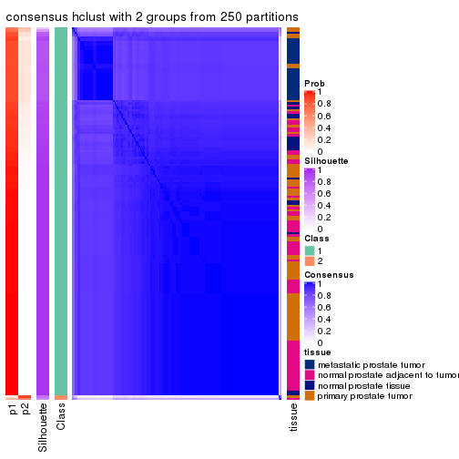</p>

</div>
<div id='tab-CV-hclust-consensus-heatmap-2'>
<pre><code class="r">consensus_heatmap(res, k = 3)
</code></pre>

<p>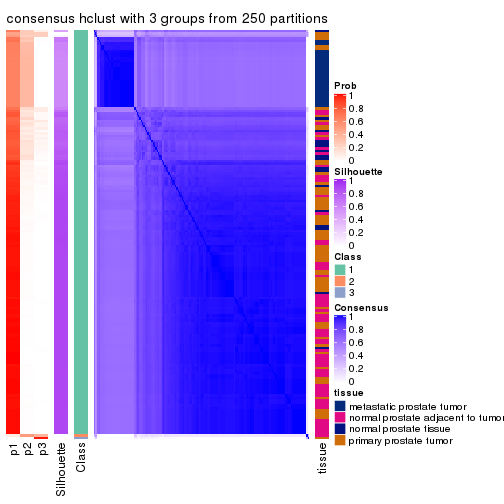</p>

</div>
<div id='tab-CV-hclust-consensus-heatmap-3'>
<pre><code class="r">consensus_heatmap(res, k = 4)
</code></pre>

<p>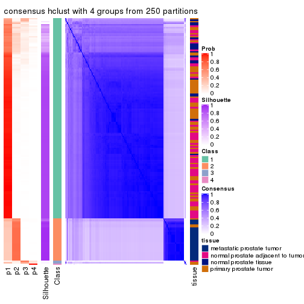</p>

</div>
<div id='tab-CV-hclust-consensus-heatmap-4'>
<pre><code class="r">consensus_heatmap(res, k = 5)
</code></pre>

<p>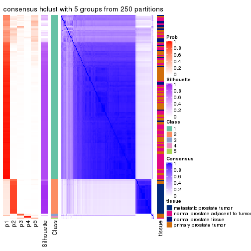</p>

</div>
<div id='tab-CV-hclust-consensus-heatmap-5'>
<pre><code class="r">consensus_heatmap(res, k = 6)
</code></pre>

<p>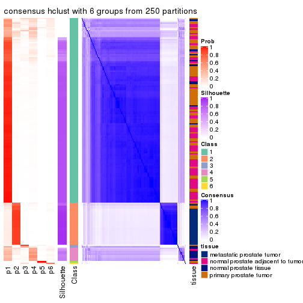</p>

</div>
</div>

Heatmaps for the membership of samples in all partitions to see how consistent they are:


<script>
$( function() {
	$( '#tabs-CV-hclust-membership-heatmap' ).tabs();
} );
</script>
<div id='tabs-CV-hclust-membership-heatmap'>
<ul>
<li><a href='#tab-CV-hclust-membership-heatmap-1'>k = 2</a></li>
<li><a href='#tab-CV-hclust-membership-heatmap-2'>k = 3</a></li>
<li><a href='#tab-CV-hclust-membership-heatmap-3'>k = 4</a></li>
<li><a href='#tab-CV-hclust-membership-heatmap-4'>k = 5</a></li>
<li><a href='#tab-CV-hclust-membership-heatmap-5'>k = 6</a></li>
</ul>
<div id='tab-CV-hclust-membership-heatmap-1'>
<pre><code class="r">membership_heatmap(res, k = 2)
</code></pre>

<p>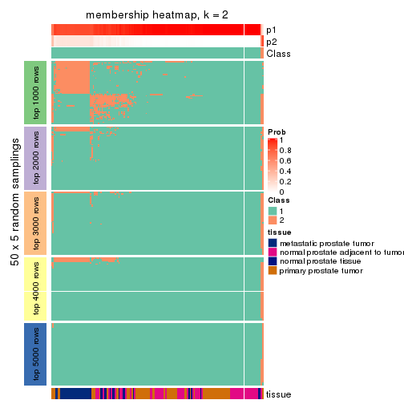</p>

</div>
<div id='tab-CV-hclust-membership-heatmap-2'>
<pre><code class="r">membership_heatmap(res, k = 3)
</code></pre>

<p>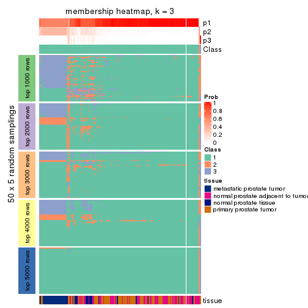</p>

</div>
<div id='tab-CV-hclust-membership-heatmap-3'>
<pre><code class="r">membership_heatmap(res, k = 4)
</code></pre>

<p>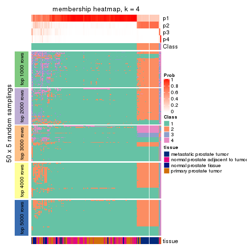</p>

</div>
<div id='tab-CV-hclust-membership-heatmap-4'>
<pre><code class="r">membership_heatmap(res, k = 5)
</code></pre>

<p>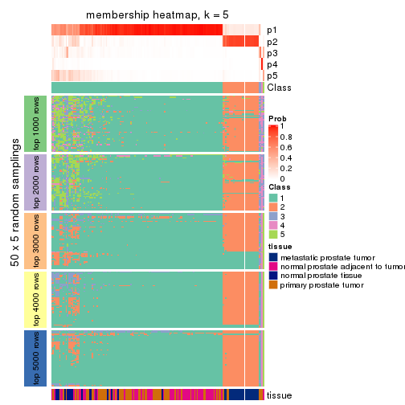</p>

</div>
<div id='tab-CV-hclust-membership-heatmap-5'>
<pre><code class="r">membership_heatmap(res, k = 6)
</code></pre>

<p>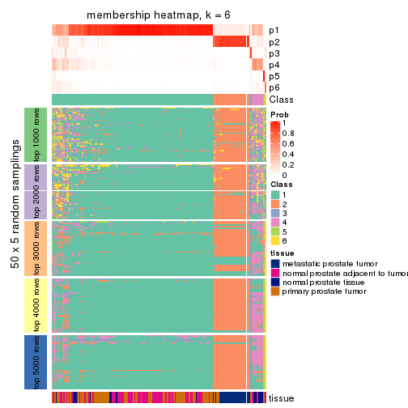</p>

</div>
</div>

As soon as we have had the classes for columns, we can look for signatures
which are significantly different between classes which can be candidate marks
for certain classes. Following are the heatmaps for signatures.


Signature heatmaps where rows are scaled:


<script>
$( function() {
	$( '#tabs-CV-hclust-get-signatures' ).tabs();
} );
</script>
<div id='tabs-CV-hclust-get-signatures'>
<ul>
<li><a href='#tab-CV-hclust-get-signatures-1'>k = 2</a></li>
<li><a href='#tab-CV-hclust-get-signatures-2'>k = 3</a></li>
<li><a href='#tab-CV-hclust-get-signatures-3'>k = 4</a></li>
<li><a href='#tab-CV-hclust-get-signatures-4'>k = 5</a></li>
<li><a href='#tab-CV-hclust-get-signatures-5'>k = 6</a></li>
</ul>
<div id='tab-CV-hclust-get-signatures-1'>
<pre><code class="r">get_signatures(res, k = 2)
</code></pre>

<pre><code>#&gt; Error in mat[ceiling(1:nr/h_ratio), ceiling(1:nc/w_ratio), drop = FALSE]: subscript out of bounds
</code></pre>

<p>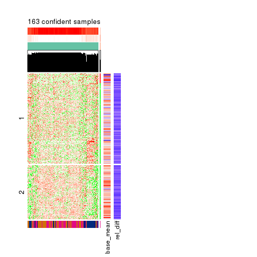</p>

</div>
<div id='tab-CV-hclust-get-signatures-2'>
<pre><code class="r">get_signatures(res, k = 3)
</code></pre>

<p></p>

</div>
<div id='tab-CV-hclust-get-signatures-3'>
<pre><code class="r">get_signatures(res, k = 4)
</code></pre>

<p>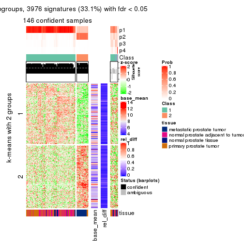</p>

</div>
<div id='tab-CV-hclust-get-signatures-4'>
<pre><code class="r">get_signatures(res, k = 5)
</code></pre>

<p>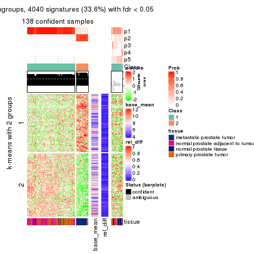</p>

</div>
<div id='tab-CV-hclust-get-signatures-5'>
<pre><code class="r">get_signatures(res, k = 6)
</code></pre>

<p>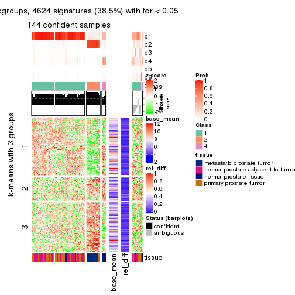</p>

</div>
</div>


Signature heatmaps where rows are not scaled:


<script>
$( function() {
	$( '#tabs-CV-hclust-get-signatures-no-scale' ).tabs();
} );
</script>
<div id='tabs-CV-hclust-get-signatures-no-scale'>
<ul>
<li><a href='#tab-CV-hclust-get-signatures-no-scale-1'>k = 2</a></li>
<li><a href='#tab-CV-hclust-get-signatures-no-scale-2'>k = 3</a></li>
<li><a href='#tab-CV-hclust-get-signatures-no-scale-3'>k = 4</a></li>
<li><a href='#tab-CV-hclust-get-signatures-no-scale-4'>k = 5</a></li>
<li><a href='#tab-CV-hclust-get-signatures-no-scale-5'>k = 6</a></li>
</ul>
<div id='tab-CV-hclust-get-signatures-no-scale-1'>
<pre><code class="r">get_signatures(res, k = 2, scale_rows = FALSE)
</code></pre>

<p>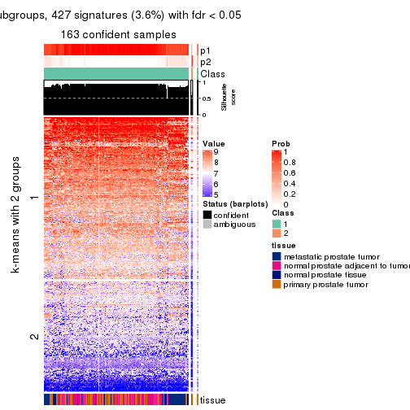</p>

</div>
<div id='tab-CV-hclust-get-signatures-no-scale-2'>
<pre><code class="r">get_signatures(res, k = 3, scale_rows = FALSE)
</code></pre>

<p></p>

</div>
<div id='tab-CV-hclust-get-signatures-no-scale-3'>
<pre><code class="r">get_signatures(res, k = 4, scale_rows = FALSE)
</code></pre>

<p>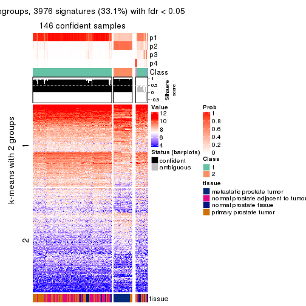</p>

</div>
<div id='tab-CV-hclust-get-signatures-no-scale-4'>
<pre><code class="r">get_signatures(res, k = 5, scale_rows = FALSE)
</code></pre>

<p>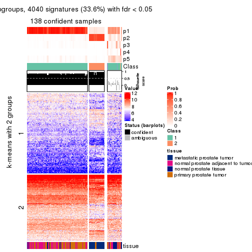</p>

</div>
<div id='tab-CV-hclust-get-signatures-no-scale-5'>
<pre><code class="r">get_signatures(res, k = 6, scale_rows = FALSE)
</code></pre>

<p>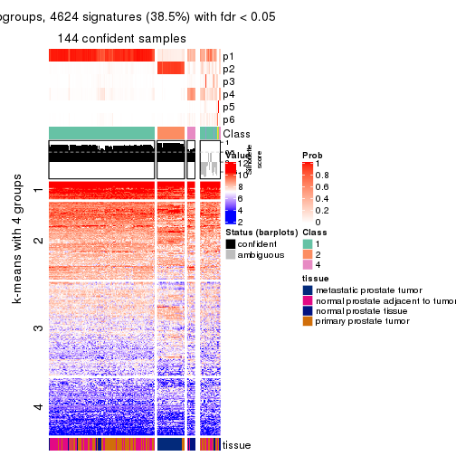</p>

</div>
</div>


Compare the overlap of signatures from different k:

```r
compare_signatures(res)
```

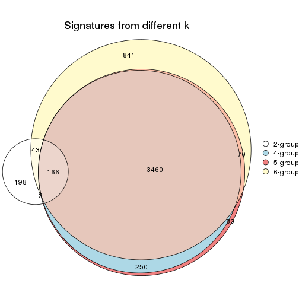

`get_signature()` returns a data frame invisibly. TO get the list of signatures, the function
call should be assigned to a variable explicitly. In following code, if `plot` argument is set
to `FALSE`, no heatmap is plotted while only the differential analysis is performed.

```r
# code only for demonstration
tb = get_signature(res, k = ..., plot = FALSE)
```

An example of the output of `tb` is:

```
#>   which_row         fdr    mean_1    mean_2 scaled_mean_1 scaled_mean_2 km
#> 1        38 0.042760348  8.373488  9.131774    -0.5533452     0.5164555  1
#> 2        40 0.018707592  7.106213  8.469186    -0.6173731     0.5762149  1
#> 3        55 0.019134737 10.221463 11.207825    -0.6159697     0.5749050  1
#> 4        59 0.006059896  5.921854  7.869574    -0.6899429     0.6439467  1
#> 5        60 0.018055526  8.928898 10.211722    -0.6204761     0.5791110  1
#> 6        98 0.009384629 15.714769 14.887706     0.6635654    -0.6193277  2
...
```

The columns in `tb` are:

1. `which_row`: row indices corresponding to the input matrix.
2. `fdr`: FDR for the differential test. 
3. `mean_x`: The mean value in group x.
4. `scaled_mean_x`: The mean value in group x after rows are scaled.
5. `km`: Row groups if k-means clustering is applied to rows.


UMAP plot which shows how samples are separated.


<script>
$( function() {
	$( '#tabs-CV-hclust-dimension-reduction' ).tabs();
} );
</script>
<div id='tabs-CV-hclust-dimension-reduction'>
<ul>
<li><a href='#tab-CV-hclust-dimension-reduction-1'>k = 2</a></li>
<li><a href='#tab-CV-hclust-dimension-reduction-2'>k = 3</a></li>
<li><a href='#tab-CV-hclust-dimension-reduction-3'>k = 4</a></li>
<li><a href='#tab-CV-hclust-dimension-reduction-4'>k = 5</a></li>
<li><a href='#tab-CV-hclust-dimension-reduction-5'>k = 6</a></li>
</ul>
<div id='tab-CV-hclust-dimension-reduction-1'>
<pre><code class="r">dimension_reduction(res, k = 2, method = &quot;UMAP&quot;)
</code></pre>

<p>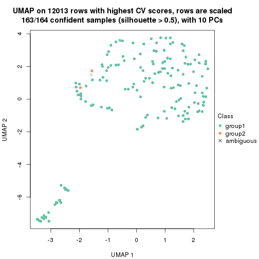</p>

</div>
<div id='tab-CV-hclust-dimension-reduction-2'>
<pre><code class="r">dimension_reduction(res, k = 3, method = &quot;UMAP&quot;)
</code></pre>

<p>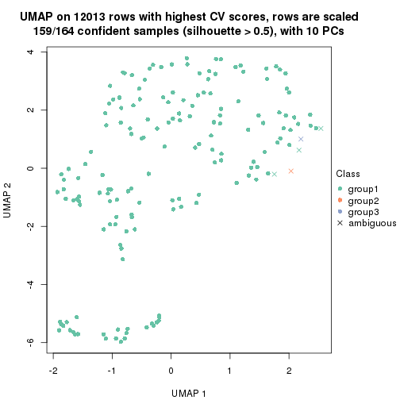</p>

</div>
<div id='tab-CV-hclust-dimension-reduction-3'>
<pre><code class="r">dimension_reduction(res, k = 4, method = &quot;UMAP&quot;)
</code></pre>

<p>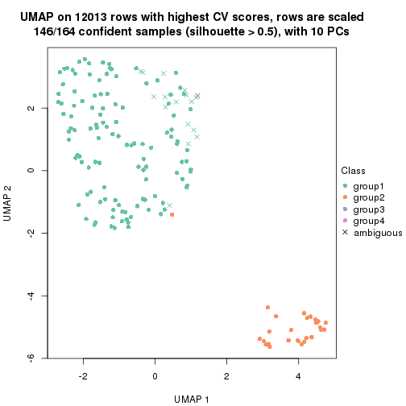</p>

</div>
<div id='tab-CV-hclust-dimension-reduction-4'>
<pre><code class="r">dimension_reduction(res, k = 5, method = &quot;UMAP&quot;)
</code></pre>

<p>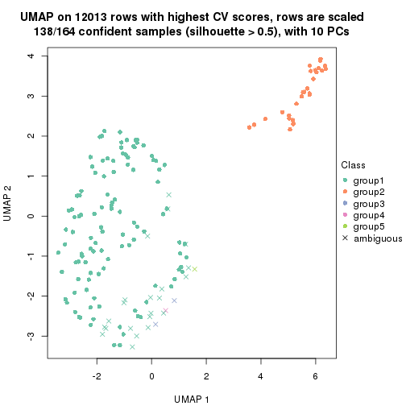</p>

</div>
<div id='tab-CV-hclust-dimension-reduction-5'>
<pre><code class="r">dimension_reduction(res, k = 6, method = &quot;UMAP&quot;)
</code></pre>

<p>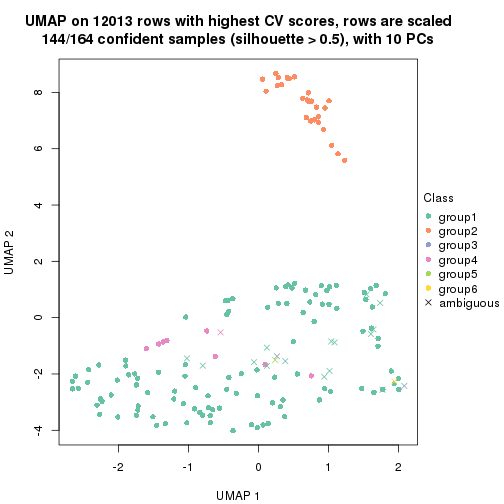</p>

</div>
</div>


Following heatmap shows how subgroups are split when increasing `k`:

```r
collect_classes(res)
```

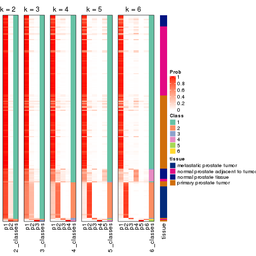


Test correlation between subgroups and known annotations. If the known
annotation is numeric, one-way ANOVA test is applied, and if the known
annotation is discrete, chi-squared contingency table test is applied.

```r
test_to_known_factors(res)
```

```
#>             n tissue(p) k
#> CV:hclust 163  8.71e-01 2
#> CV:hclust 159        NA 3
#> CV:hclust 146  1.71e-27 4
#> CV:hclust 138  6.14e-26 5
#> CV:hclust 144  2.86e-33 6
```


If matrix rows can be associated to genes, consider to use `functional_enrichment(res,
...)` to perform function enrichment for the signature genes. See [this vignette](http://bioconductor.org/packages/devel/bioc/vignettes/cola/inst/doc/functional_enrichment.html) for more detailed explanations.


 

---------------------------------------------------


### CV:kmeans**


The object with results only for a single top-value method and a single partition method 
can be extracted as:

```r
res = res_list["CV", "kmeans"]
# you can also extract it by
# res = res_list["CV:kmeans"]
```

A summary of `res` and all the functions that can be applied to it:

```r
res
```

```
#> A 'ConsensusPartition' object with k = 2, 3, 4, 5, 6.
#>   On a matrix with 12013 rows and 164 columns.
#>   Top rows (1000, 2000, 3000, 4000, 5000) are extracted by 'CV' method.
#>   Subgroups are detected by 'kmeans' method.
#>   Performed in total 1250 partitions by row resampling.
#>   Best k for subgroups seems to be 3.
#> 
#> Following methods can be applied to this 'ConsensusPartition' object:
#>  [1] "cola_report"             "collect_classes"         "collect_plots"          
#>  [4] "collect_stats"           "colnames"                "compare_signatures"     
#>  [7] "consensus_heatmap"       "dimension_reduction"     "functional_enrichment"  
#> [10] "get_anno_col"            "get_anno"                "get_classes"            
#> [13] "get_consensus"           "get_matrix"              "get_membership"         
#> [16] "get_param"               "get_signatures"          "get_stats"              
#> [19] "is_best_k"               "is_stable_k"             "membership_heatmap"     
#> [22] "ncol"                    "nrow"                    "plot_ecdf"              
#> [25] "rownames"                "select_partition_number" "show"                   
#> [28] "suggest_best_k"          "test_to_known_factors"
```

`collect_plots()` function collects all the plots made from `res` for all `k` (number of partitions)
into one single page to provide an easy and fast comparison between different `k`.

```r
collect_plots(res)
```

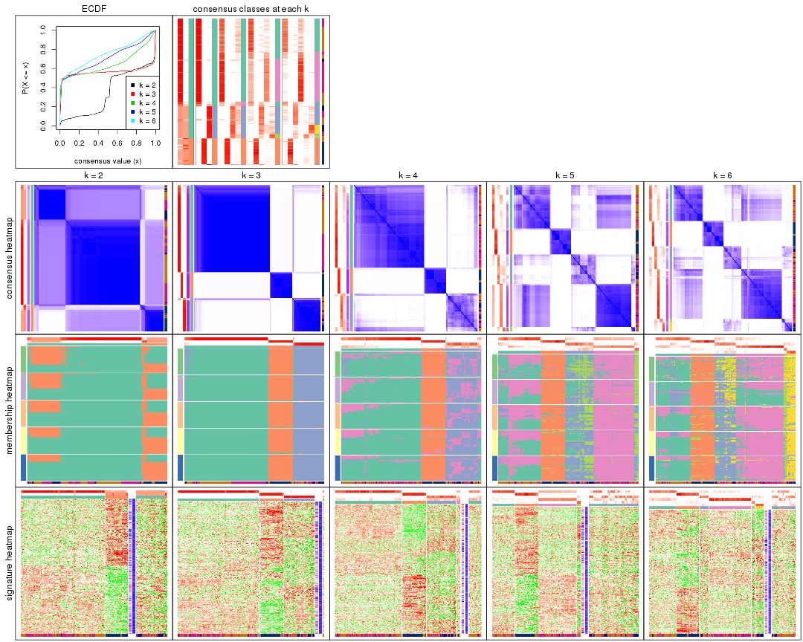

The plots are:

- The first row: a plot of the ECDF (empirical cumulative distribution
  function) curves of the consensus matrix for each `k` and the heatmap of
  predicted classes for each `k`.
- The second row: heatmaps of the consensus matrix for each `k`.
- The third row: heatmaps of the membership matrix for each `k`.
- The fouth row: heatmaps of the signatures for each `k`.

All the plots in panels can be made by individual functions and they are
plotted later in this section.

`select_partition_number()` produces several plots showing different
statistics for choosing "optimized" `k`. There are following statistics:

- ECDF curves of the consensus matrix for each `k`;
- 1-PAC. [The PAC
  score](https://en.wikipedia.org/wiki/Consensus_clustering#Over-interpretation_potential_of_consensus_clustering)
  measures the proportion of the ambiguous subgrouping.
- Mean silhouette score.
- Concordance. The mean probability of fiting the consensus class ids in all
  partitions.
- Area increased. Denote $A_k$ as the area under the ECDF curve for current
  `k`, the area increased is defined as $A_k - A_{k-1}$.
- Rand index. The percent of pairs of samples that are both in a same cluster
  or both are not in a same cluster in the partition of k and k-1.
- Jaccard index. The ratio of pairs of samples are both in a same cluster in
  the partition of k and k-1 and the pairs of samples are both in a same
  cluster in the partition k or k-1.

The detailed explanations of these statistics can be found in [the _cola_
vignette](http://bioconductor.org/packages/devel/bioc/vignettes/cola/inst/doc/cola.html#toc_13).

Generally speaking, lower PAC score, higher mean silhouette score or higher
concordance corresponds to better partition. Rand index and Jaccard index
measure how similar the current partition is compared to partition with `k-1`.
If they are too similar, we won't accept `k` is better than `k-1`.

```r
select_partition_number(res)
```

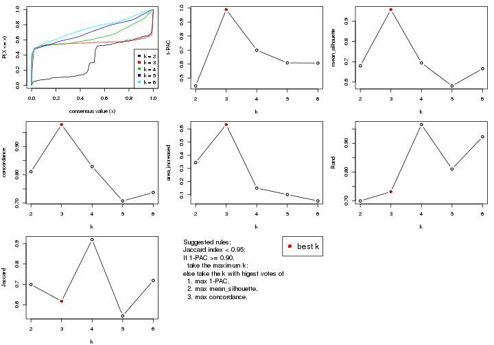

The numeric values for all these statistics can be obtained by `get_stats()`.

```r
get_stats(res)
```

```
#>   k 1-PAC mean_silhouette concordance area_increased  Rand Jaccard
#> 2 2 0.444           0.680       0.811         0.3447 0.699   0.699
#> 3 3 0.989           0.958       0.978         0.6327 0.731   0.617
#> 4 4 0.699           0.694       0.829         0.1511 0.965   0.920
#> 5 5 0.608           0.581       0.707         0.1018 0.810   0.545
#> 6 6 0.607           0.666       0.737         0.0539 0.923   0.719
```

`suggest_best_k()` suggests the best $k$ based on these statistics. The rules are as follows:

- All $k$ with Jaccard index larger than 0.95 are removed because increasing
  $k$ does not provide enough extra information. If all $k$ are removed, it is
  marked as no subgroup is detected.
- For all $k$ with 1-PAC score larger than 0.9, the maximal $k$ is taken as
  the best $k$, and other $k$ are marked as optional $k$.
- If it does not fit the second rule. The $k$ with the maximal vote of the
  highest 1-PAC score, highest mean silhouette, and highest concordance is
  taken as the best $k$.

```r
suggest_best_k(res)
```

```
#> [1] 3
```


Following shows the table of the partitions (You need to click the **show/hide
code output** link to see it). The membership matrix (columns with name `p*`)
is inferred by
[`clue::cl_consensus()`](https://www.rdocumentation.org/link/cl_consensus?package=clue)
function with the `SE` method. Basically the value in the membership matrix
represents the probability to belong to a certain group. The finall class
label for an item is determined with the group with highest probability it
belongs to.

In `get_classes()` function, the entropy is calculated from the membership
matrix and the silhouette score is calculated from the consensus matrix.


<script>
$( function() {
	$( '#tabs-CV-kmeans-get-classes' ).tabs();
} );
</script>
<div id='tabs-CV-kmeans-get-classes'>
<ul>
<li><a href='#tab-CV-kmeans-get-classes-1'>k = 2</a></li>
<li><a href='#tab-CV-kmeans-get-classes-2'>k = 3</a></li>
<li><a href='#tab-CV-kmeans-get-classes-3'>k = 4</a></li>
<li><a href='#tab-CV-kmeans-get-classes-4'>k = 5</a></li>
<li><a href='#tab-CV-kmeans-get-classes-5'>k = 6</a></li>
</ul>

<div id='tab-CV-kmeans-get-classes-1'>
<p><a id='tab-CV-kmeans-get-classes-1-a' style='color:#0366d6' href='#'>show/hide code output</a></p>
<pre><code class="r">cbind(get_classes(res, k = 2), get_membership(res, k = 2))
</code></pre>

<pre><code>#&gt;           class entropy silhouette    p1    p2
#&gt; GSM152839     1  0.8763      0.543 0.704 0.296
#&gt; GSM152840     1  0.9988      0.436 0.520 0.480
#&gt; GSM152841     1  0.0376      0.757 0.996 0.004
#&gt; GSM152842     1  0.9988      0.436 0.520 0.480
#&gt; GSM152843     1  0.9988      0.436 0.520 0.480
#&gt; GSM152844     1  0.9988      0.436 0.520 0.480
#&gt; GSM152845     1  0.9988      0.436 0.520 0.480
#&gt; GSM152846     1  0.9988      0.436 0.520 0.480
#&gt; GSM152847     1  0.9988      0.436 0.520 0.480
#&gt; GSM152848     1  0.0376      0.757 0.996 0.004
#&gt; GSM152849     1  0.9988      0.436 0.520 0.480
#&gt; GSM152850     1  0.9983      0.437 0.524 0.476
#&gt; GSM152851     1  0.7883      0.596 0.764 0.236
#&gt; GSM152852     1  0.9983      0.437 0.524 0.476
#&gt; GSM152853     1  0.9988      0.436 0.520 0.480
#&gt; GSM152854     1  0.9988      0.436 0.520 0.480
#&gt; GSM152855     1  0.0000      0.757 1.000 0.000
#&gt; GSM153238     1  0.9988      0.436 0.520 0.480
#&gt; GSM153239     1  0.9988      0.436 0.520 0.480
#&gt; GSM153240     1  0.0376      0.757 0.996 0.004
#&gt; GSM153241     1  0.9988      0.436 0.520 0.480
#&gt; GSM153242     1  0.9988      0.436 0.520 0.480
#&gt; GSM153243     1  0.9988      0.436 0.520 0.480
#&gt; GSM153244     1  0.0376      0.757 0.996 0.004
#&gt; GSM153245     1  0.9988      0.436 0.520 0.480
#&gt; GSM153246     1  0.9988      0.436 0.520 0.480
#&gt; GSM153247     1  0.9988      0.436 0.520 0.480
#&gt; GSM153248     1  0.0000      0.757 1.000 0.000
#&gt; GSM153249     1  0.0000      0.757 1.000 0.000
#&gt; GSM153250     1  0.0000      0.757 1.000 0.000
#&gt; GSM153251     1  0.9988      0.436 0.520 0.480
#&gt; GSM153252     1  0.0672      0.757 0.992 0.008
#&gt; GSM153253     1  0.1414      0.752 0.980 0.020
#&gt; GSM153254     1  0.1414      0.752 0.980 0.020
#&gt; GSM153255     1  0.0000      0.757 1.000 0.000
#&gt; GSM153256     1  0.0000      0.757 1.000 0.000
#&gt; GSM153257     1  0.0000      0.757 1.000 0.000
#&gt; GSM153258     1  0.0000      0.757 1.000 0.000
#&gt; GSM153259     1  0.0000      0.757 1.000 0.000
#&gt; GSM153260     1  0.9988      0.436 0.520 0.480
#&gt; GSM153261     1  0.9988      0.436 0.520 0.480
#&gt; GSM153262     1  0.0376      0.757 0.996 0.004
#&gt; GSM153263     1  0.0000      0.757 1.000 0.000
#&gt; GSM153264     1  0.0000      0.757 1.000 0.000
#&gt; GSM153265     1  0.0672      0.757 0.992 0.008
#&gt; GSM153266     1  0.0376      0.757 0.996 0.004
#&gt; GSM153267     1  0.0000      0.757 1.000 0.000
#&gt; GSM153268     1  0.6343      0.651 0.840 0.160
#&gt; GSM153269     1  0.0000      0.757 1.000 0.000
#&gt; GSM153270     1  0.0376      0.757 0.996 0.004
#&gt; GSM153271     1  0.0000      0.757 1.000 0.000
#&gt; GSM153272     1  0.0376      0.757 0.996 0.004
#&gt; GSM153273     1  0.0000      0.757 1.000 0.000
#&gt; GSM153274     1  0.0376      0.757 0.996 0.004
#&gt; GSM153275     1  0.0000      0.757 1.000 0.000
#&gt; GSM153276     1  0.1633      0.750 0.976 0.024
#&gt; GSM153277     1  0.0672      0.757 0.992 0.008
#&gt; GSM153278     1  0.9988      0.436 0.520 0.480
#&gt; GSM153279     1  0.1414      0.752 0.980 0.020
#&gt; GSM153280     1  0.0672      0.757 0.992 0.008
#&gt; GSM153281     1  0.1633      0.750 0.976 0.024
#&gt; GSM153282     1  0.0938      0.755 0.988 0.012
#&gt; GSM153283     1  0.0000      0.757 1.000 0.000
#&gt; GSM153284     1  0.0000      0.757 1.000 0.000
#&gt; GSM153285     1  0.0938      0.755 0.988 0.012
#&gt; GSM153286     1  0.0000      0.757 1.000 0.000
#&gt; GSM153287     1  0.0672      0.757 0.992 0.008
#&gt; GSM153288     1  0.0000      0.757 1.000 0.000
#&gt; GSM153289     1  0.0000      0.757 1.000 0.000
#&gt; GSM153290     1  0.1184      0.754 0.984 0.016
#&gt; GSM153291     1  0.0000      0.757 1.000 0.000
#&gt; GSM153292     1  0.0376      0.757 0.996 0.004
#&gt; GSM153293     1  0.0000      0.757 1.000 0.000
#&gt; GSM153294     1  0.0000      0.757 1.000 0.000
#&gt; GSM153295     1  0.6438      0.651 0.836 0.164
#&gt; GSM153054     1  0.5178      0.687 0.884 0.116
#&gt; GSM153055     1  0.0000      0.757 1.000 0.000
#&gt; GSM153056     1  0.9977      0.439 0.528 0.472
#&gt; GSM153057     1  0.8144      0.571 0.748 0.252
#&gt; GSM153058     1  0.9988      0.436 0.520 0.480
#&gt; GSM153059     1  0.9286      0.510 0.656 0.344
#&gt; GSM153060     1  0.9988      0.436 0.520 0.480
#&gt; GSM153061     1  0.9988      0.436 0.520 0.480
#&gt; GSM153062     1  0.9988      0.436 0.520 0.480
#&gt; GSM153063     1  0.9988      0.436 0.520 0.480
#&gt; GSM153064     1  0.0000      0.757 1.000 0.000
#&gt; GSM153065     1  0.9988      0.436 0.520 0.480
#&gt; GSM153066     2  0.9522     -0.177 0.372 0.628
#&gt; GSM153067     1  0.0000      0.757 1.000 0.000
#&gt; GSM153068     1  0.9988      0.436 0.520 0.480
#&gt; GSM153069     1  0.0376      0.757 0.996 0.004
#&gt; GSM153070     1  0.0000      0.757 1.000 0.000
#&gt; GSM153071     1  0.8081      0.584 0.752 0.248
#&gt; GSM153072     1  0.5842      0.669 0.860 0.140
#&gt; GSM153073     1  0.0000      0.757 1.000 0.000
#&gt; GSM153074     1  0.0000      0.757 1.000 0.000
#&gt; GSM153075     1  0.0000      0.757 1.000 0.000
#&gt; GSM153076     1  0.0000      0.757 1.000 0.000
#&gt; GSM153077     1  0.0000      0.757 1.000 0.000
#&gt; GSM153078     1  0.4690      0.700 0.900 0.100
#&gt; GSM153079     1  0.0000      0.757 1.000 0.000
#&gt; GSM153080     1  0.9988      0.436 0.520 0.480
#&gt; GSM153081     1  0.0000      0.757 1.000 0.000
#&gt; GSM153082     1  0.0000      0.757 1.000 0.000
#&gt; GSM153083     1  0.0376      0.755 0.996 0.004
#&gt; GSM153084     1  0.2236      0.740 0.964 0.036
#&gt; GSM153085     1  0.4022      0.714 0.920 0.080
#&gt; GSM153086     1  0.0672      0.753 0.992 0.008
#&gt; GSM153087     1  0.0376      0.757 0.996 0.004
#&gt; GSM153088     1  0.0000      0.757 1.000 0.000
#&gt; GSM153089     1  0.9988      0.436 0.520 0.480
#&gt; GSM153090     1  0.0000      0.757 1.000 0.000
#&gt; GSM153091     1  0.0000      0.757 1.000 0.000
#&gt; GSM153092     1  0.0000      0.757 1.000 0.000
#&gt; GSM153093     1  0.0000      0.757 1.000 0.000
#&gt; GSM153094     1  0.0000      0.757 1.000 0.000
#&gt; GSM153095     1  0.2603      0.736 0.956 0.044
#&gt; GSM153096     1  0.0000      0.757 1.000 0.000
#&gt; GSM153097     1  0.0000      0.757 1.000 0.000
#&gt; GSM153098     1  0.0000      0.757 1.000 0.000
#&gt; GSM153099     1  0.0376      0.757 0.996 0.004
#&gt; GSM153100     1  0.0000      0.757 1.000 0.000
#&gt; GSM153101     1  0.4562      0.701 0.904 0.096
#&gt; GSM153102     1  0.0000      0.757 1.000 0.000
#&gt; GSM153103     1  0.0938      0.752 0.988 0.012
#&gt; GSM153104     1  0.0938      0.755 0.988 0.012
#&gt; GSM153106     1  0.0000      0.757 1.000 0.000
#&gt; GSM153107     1  0.0000      0.757 1.000 0.000
#&gt; GSM153108     1  0.0000      0.757 1.000 0.000
#&gt; GSM153109     1  0.0376      0.755 0.996 0.004
#&gt; GSM153110     1  0.0000      0.757 1.000 0.000
#&gt; GSM153111     1  0.0376      0.755 0.996 0.004
#&gt; GSM153112     1  0.0000      0.757 1.000 0.000
#&gt; GSM153113     1  0.0672      0.753 0.992 0.008
#&gt; GSM153114     1  0.0000      0.757 1.000 0.000
#&gt; GSM187532     2  0.2778      0.413 0.048 0.952
#&gt; GSM187533     2  0.9954      0.842 0.460 0.540
#&gt; GSM187534     2  0.9970      0.845 0.468 0.532
#&gt; GSM187535     2  0.9988      0.834 0.480 0.520
#&gt; GSM152906     2  0.9977      0.846 0.472 0.528
#&gt; GSM152907     2  0.9977      0.846 0.472 0.528
#&gt; GSM152908     2  0.9977      0.846 0.472 0.528
#&gt; GSM152909     2  0.3733      0.489 0.072 0.928
#&gt; GSM152910     2  0.6438      0.572 0.164 0.836
#&gt; GSM152911     2  0.9977      0.846 0.472 0.528
#&gt; GSM152912     2  0.9970      0.846 0.468 0.532
#&gt; GSM152913     2  0.5294      0.533 0.120 0.880
#&gt; GSM152914     2  0.9977      0.846 0.472 0.528
#&gt; GSM152915     2  0.9977      0.846 0.472 0.528
#&gt; GSM152916     2  0.9881      0.824 0.436 0.564
#&gt; GSM152917     2  0.9977      0.846 0.472 0.528
#&gt; GSM152918     2  0.9977      0.846 0.472 0.528
#&gt; GSM152919     2  0.9977      0.846 0.472 0.528
#&gt; GSM152920     2  0.9977      0.846 0.472 0.528
#&gt; GSM152921     2  0.9977      0.846 0.472 0.528
#&gt; GSM152922     2  0.9963      0.844 0.464 0.536
#&gt; GSM152923     2  0.9977      0.846 0.472 0.528
#&gt; GSM152924     2  0.9954      0.842 0.460 0.540
#&gt; GSM152925     2  0.9866      0.820 0.432 0.568
#&gt; GSM152926     2  0.9977      0.846 0.472 0.528
#&gt; GSM152927     2  0.6343      0.568 0.160 0.840
#&gt; GSM152928     2  0.9881      0.824 0.436 0.564
#&gt; GSM152929     2  0.9977      0.846 0.472 0.528
#&gt; GSM152930     2  0.9977      0.846 0.472 0.528
</code></pre>

<script>
$('#tab-CV-kmeans-get-classes-1-a').parent().next().next().hide();
$('#tab-CV-kmeans-get-classes-1-a').click(function(){
  $('#tab-CV-kmeans-get-classes-1-a').parent().next().next().toggle();
  return(false);
});
</script>
</div>

<div id='tab-CV-kmeans-get-classes-2'>
<p><a id='tab-CV-kmeans-get-classes-2-a' style='color:#0366d6' href='#'>show/hide code output</a></p>
<pre><code class="r">cbind(get_classes(res, k = 3), get_membership(res, k = 3))
</code></pre>

<pre><code>#&gt;           class entropy silhouette    p1    p2    p3
#&gt; GSM152839     1  0.4452     0.7616 0.808 0.000 0.192
#&gt; GSM152840     3  0.0661     0.9622 0.008 0.004 0.988
#&gt; GSM152841     1  0.0000     0.9838 1.000 0.000 0.000
#&gt; GSM152842     3  0.0661     0.9617 0.008 0.004 0.988
#&gt; GSM152843     3  0.0424     0.9623 0.008 0.000 0.992
#&gt; GSM152844     3  0.0661     0.9622 0.008 0.004 0.988
#&gt; GSM152845     3  0.0661     0.9622 0.008 0.004 0.988
#&gt; GSM152846     3  0.0661     0.9622 0.008 0.004 0.988
#&gt; GSM152847     3  0.0424     0.9623 0.008 0.000 0.992
#&gt; GSM152848     1  0.0424     0.9777 0.992 0.000 0.008
#&gt; GSM152849     3  0.0424     0.9623 0.008 0.000 0.992
#&gt; GSM152850     3  0.2066     0.9035 0.060 0.000 0.940
#&gt; GSM152851     1  0.4346     0.7817 0.816 0.000 0.184
#&gt; GSM152852     3  0.0661     0.9622 0.008 0.004 0.988
#&gt; GSM152853     3  0.0661     0.9622 0.008 0.004 0.988
#&gt; GSM152854     3  0.0661     0.9622 0.008 0.004 0.988
#&gt; GSM152855     1  0.0000     0.9838 1.000 0.000 0.000
#&gt; GSM153238     3  0.0424     0.9623 0.008 0.000 0.992
#&gt; GSM153239     3  0.0661     0.9622 0.008 0.004 0.988
#&gt; GSM153240     1  0.0000     0.9838 1.000 0.000 0.000
#&gt; GSM153241     3  0.0661     0.9617 0.008 0.004 0.988
#&gt; GSM153242     3  0.0661     0.9622 0.008 0.004 0.988
#&gt; GSM153243     3  0.0424     0.9623 0.008 0.000 0.992
#&gt; GSM153244     1  0.0000     0.9838 1.000 0.000 0.000
#&gt; GSM153245     3  0.0661     0.9622 0.008 0.004 0.988
#&gt; GSM153246     3  0.1170     0.9577 0.008 0.016 0.976
#&gt; GSM153247     3  0.0661     0.9617 0.008 0.004 0.988
#&gt; GSM153248     1  0.0000     0.9838 1.000 0.000 0.000
#&gt; GSM153249     1  0.0000     0.9838 1.000 0.000 0.000
#&gt; GSM153250     1  0.0000     0.9838 1.000 0.000 0.000
#&gt; GSM153251     3  0.0424     0.9623 0.008 0.000 0.992
#&gt; GSM153252     1  0.0000     0.9838 1.000 0.000 0.000
#&gt; GSM153253     1  0.0000     0.9838 1.000 0.000 0.000
#&gt; GSM153254     1  0.0000     0.9838 1.000 0.000 0.000
#&gt; GSM153255     1  0.0000     0.9838 1.000 0.000 0.000
#&gt; GSM153256     1  0.0000     0.9838 1.000 0.000 0.000
#&gt; GSM153257     1  0.0000     0.9838 1.000 0.000 0.000
#&gt; GSM153258     1  0.0000     0.9838 1.000 0.000 0.000
#&gt; GSM153259     1  0.0000     0.9838 1.000 0.000 0.000
#&gt; GSM153260     3  0.0424     0.9623 0.008 0.000 0.992
#&gt; GSM153261     3  0.0424     0.9623 0.008 0.000 0.992
#&gt; GSM153262     1  0.0000     0.9838 1.000 0.000 0.000
#&gt; GSM153263     1  0.0000     0.9838 1.000 0.000 0.000
#&gt; GSM153264     1  0.0000     0.9838 1.000 0.000 0.000
#&gt; GSM153265     1  0.0000     0.9838 1.000 0.000 0.000
#&gt; GSM153266     1  0.0000     0.9838 1.000 0.000 0.000
#&gt; GSM153267     1  0.0000     0.9838 1.000 0.000 0.000
#&gt; GSM153268     1  0.0747     0.9709 0.984 0.000 0.016
#&gt; GSM153269     1  0.0000     0.9838 1.000 0.000 0.000
#&gt; GSM153270     1  0.0237     0.9807 0.996 0.000 0.004
#&gt; GSM153271     1  0.0000     0.9838 1.000 0.000 0.000
#&gt; GSM153272     1  0.0000     0.9838 1.000 0.000 0.000
#&gt; GSM153273     1  0.0000     0.9838 1.000 0.000 0.000
#&gt; GSM153274     1  0.0000     0.9838 1.000 0.000 0.000
#&gt; GSM153275     1  0.0000     0.9838 1.000 0.000 0.000
#&gt; GSM153276     1  0.0000     0.9838 1.000 0.000 0.000
#&gt; GSM153277     1  0.0000     0.9838 1.000 0.000 0.000
#&gt; GSM153278     3  0.0892     0.9521 0.020 0.000 0.980
#&gt; GSM153279     1  0.0237     0.9806 0.996 0.000 0.004
#&gt; GSM153280     1  0.0000     0.9838 1.000 0.000 0.000
#&gt; GSM153281     1  0.0237     0.9805 0.996 0.000 0.004
#&gt; GSM153282     1  0.0000     0.9838 1.000 0.000 0.000
#&gt; GSM153283     1  0.0000     0.9838 1.000 0.000 0.000
#&gt; GSM153284     1  0.0000     0.9838 1.000 0.000 0.000
#&gt; GSM153285     1  0.0000     0.9838 1.000 0.000 0.000
#&gt; GSM153286     1  0.0000     0.9838 1.000 0.000 0.000
#&gt; GSM153287     1  0.0000     0.9838 1.000 0.000 0.000
#&gt; GSM153288     1  0.0000     0.9838 1.000 0.000 0.000
#&gt; GSM153289     1  0.0000     0.9838 1.000 0.000 0.000
#&gt; GSM153290     1  0.0000     0.9838 1.000 0.000 0.000
#&gt; GSM153291     1  0.0000     0.9838 1.000 0.000 0.000
#&gt; GSM153292     1  0.0000     0.9838 1.000 0.000 0.000
#&gt; GSM153293     1  0.0000     0.9838 1.000 0.000 0.000
#&gt; GSM153294     1  0.0000     0.9838 1.000 0.000 0.000
#&gt; GSM153295     1  0.1529     0.9511 0.960 0.000 0.040
#&gt; GSM153054     1  0.3619     0.8470 0.864 0.000 0.136
#&gt; GSM153055     1  0.0000     0.9838 1.000 0.000 0.000
#&gt; GSM153056     3  0.1031     0.9479 0.024 0.000 0.976
#&gt; GSM153057     3  0.6305     0.0876 0.484 0.000 0.516
#&gt; GSM153058     3  0.0424     0.9623 0.008 0.000 0.992
#&gt; GSM153059     3  0.5497     0.5709 0.292 0.000 0.708
#&gt; GSM153060     3  0.1170     0.9577 0.008 0.016 0.976
#&gt; GSM153061     3  0.1015     0.9584 0.008 0.012 0.980
#&gt; GSM153062     3  0.1170     0.9577 0.008 0.016 0.976
#&gt; GSM153063     3  0.0661     0.9617 0.008 0.004 0.988
#&gt; GSM153064     1  0.0000     0.9838 1.000 0.000 0.000
#&gt; GSM153065     3  0.0661     0.9617 0.008 0.004 0.988
#&gt; GSM153066     3  0.0424     0.9623 0.008 0.000 0.992
#&gt; GSM153067     1  0.0000     0.9838 1.000 0.000 0.000
#&gt; GSM153068     3  0.0661     0.9617 0.008 0.004 0.988
#&gt; GSM153069     1  0.0000     0.9838 1.000 0.000 0.000
#&gt; GSM153070     1  0.0000     0.9838 1.000 0.000 0.000
#&gt; GSM153071     1  0.6026     0.3999 0.624 0.000 0.376
#&gt; GSM153072     1  0.4121     0.8043 0.832 0.000 0.168
#&gt; GSM153073     1  0.0000     0.9838 1.000 0.000 0.000
#&gt; GSM153074     1  0.0000     0.9838 1.000 0.000 0.000
#&gt; GSM153075     1  0.0000     0.9838 1.000 0.000 0.000
#&gt; GSM153076     1  0.0000     0.9838 1.000 0.000 0.000
#&gt; GSM153077     1  0.0000     0.9838 1.000 0.000 0.000
#&gt; GSM153078     1  0.3038     0.8854 0.896 0.000 0.104
#&gt; GSM153079     1  0.0000     0.9838 1.000 0.000 0.000
#&gt; GSM153080     3  0.1643     0.9230 0.044 0.000 0.956
#&gt; GSM153081     1  0.0237     0.9807 0.996 0.000 0.004
#&gt; GSM153082     1  0.0000     0.9838 1.000 0.000 0.000
#&gt; GSM153083     1  0.0000     0.9838 1.000 0.000 0.000
#&gt; GSM153084     1  0.2486     0.9251 0.932 0.008 0.060
#&gt; GSM153085     1  0.2448     0.9150 0.924 0.000 0.076
#&gt; GSM153086     1  0.0000     0.9838 1.000 0.000 0.000
#&gt; GSM153087     1  0.0000     0.9838 1.000 0.000 0.000
#&gt; GSM153088     1  0.0000     0.9838 1.000 0.000 0.000
#&gt; GSM153089     3  0.0661     0.9622 0.008 0.004 0.988
#&gt; GSM153090     1  0.0000     0.9838 1.000 0.000 0.000
#&gt; GSM153091     1  0.0000     0.9838 1.000 0.000 0.000
#&gt; GSM153092     1  0.0000     0.9838 1.000 0.000 0.000
#&gt; GSM153093     1  0.0000     0.9838 1.000 0.000 0.000
#&gt; GSM153094     1  0.0000     0.9838 1.000 0.000 0.000
#&gt; GSM153095     1  0.1529     0.9509 0.960 0.000 0.040
#&gt; GSM153096     1  0.0000     0.9838 1.000 0.000 0.000
#&gt; GSM153097     1  0.0000     0.9838 1.000 0.000 0.000
#&gt; GSM153098     1  0.0000     0.9838 1.000 0.000 0.000
#&gt; GSM153099     1  0.0000     0.9838 1.000 0.000 0.000
#&gt; GSM153100     1  0.0000     0.9838 1.000 0.000 0.000
#&gt; GSM153101     1  0.2959     0.8890 0.900 0.000 0.100
#&gt; GSM153102     1  0.0000     0.9838 1.000 0.000 0.000
#&gt; GSM153103     1  0.0424     0.9779 0.992 0.000 0.008
#&gt; GSM153104     1  0.0000     0.9838 1.000 0.000 0.000
#&gt; GSM153106     1  0.0000     0.9838 1.000 0.000 0.000
#&gt; GSM153107     1  0.0000     0.9838 1.000 0.000 0.000
#&gt; GSM153108     1  0.0000     0.9838 1.000 0.000 0.000
#&gt; GSM153109     1  0.0000     0.9838 1.000 0.000 0.000
#&gt; GSM153110     1  0.0000     0.9838 1.000 0.000 0.000
#&gt; GSM153111     1  0.0000     0.9838 1.000 0.000 0.000
#&gt; GSM153112     1  0.0000     0.9838 1.000 0.000 0.000
#&gt; GSM153113     1  0.0237     0.9808 0.996 0.004 0.000
#&gt; GSM153114     1  0.0000     0.9838 1.000 0.000 0.000
#&gt; GSM187532     2  0.4702     0.7283 0.000 0.788 0.212
#&gt; GSM187533     2  0.0747     0.9857 0.016 0.984 0.000
#&gt; GSM187534     2  0.0747     0.9857 0.016 0.984 0.000
#&gt; GSM187535     2  0.2584     0.9249 0.064 0.928 0.008
#&gt; GSM152906     2  0.1170     0.9850 0.016 0.976 0.008
#&gt; GSM152907     2  0.1170     0.9850 0.016 0.976 0.008
#&gt; GSM152908     2  0.0747     0.9857 0.016 0.984 0.000
#&gt; GSM152909     2  0.0661     0.9745 0.004 0.988 0.008
#&gt; GSM152910     2  0.0848     0.9787 0.008 0.984 0.008
#&gt; GSM152911     2  0.0747     0.9857 0.016 0.984 0.000
#&gt; GSM152912     2  0.0747     0.9857 0.016 0.984 0.000
#&gt; GSM152913     2  0.0475     0.9748 0.004 0.992 0.004
#&gt; GSM152914     2  0.0747     0.9857 0.016 0.984 0.000
#&gt; GSM152915     2  0.0747     0.9857 0.016 0.984 0.000
#&gt; GSM152916     2  0.1170     0.9850 0.016 0.976 0.008
#&gt; GSM152917     2  0.0747     0.9857 0.016 0.984 0.000
#&gt; GSM152918     2  0.0747     0.9857 0.016 0.984 0.000
#&gt; GSM152919     2  0.0747     0.9857 0.016 0.984 0.000
#&gt; GSM152920     2  0.0747     0.9857 0.016 0.984 0.000
#&gt; GSM152921     2  0.0747     0.9857 0.016 0.984 0.000
#&gt; GSM152922     2  0.0747     0.9857 0.016 0.984 0.000
#&gt; GSM152923     2  0.1170     0.9850 0.016 0.976 0.008
#&gt; GSM152924     2  0.1170     0.9850 0.016 0.976 0.008
#&gt; GSM152925     2  0.1170     0.9850 0.016 0.976 0.008
#&gt; GSM152926     2  0.1170     0.9850 0.016 0.976 0.008
#&gt; GSM152927     2  0.1170     0.9785 0.008 0.976 0.016
#&gt; GSM152928     2  0.1337     0.9832 0.016 0.972 0.012
#&gt; GSM152929     2  0.1170     0.9850 0.016 0.976 0.008
#&gt; GSM152930     2  0.1170     0.9850 0.016 0.976 0.008
</code></pre>

<script>
$('#tab-CV-kmeans-get-classes-2-a').parent().next().next().hide();
$('#tab-CV-kmeans-get-classes-2-a').click(function(){
  $('#tab-CV-kmeans-get-classes-2-a').parent().next().next().toggle();
  return(false);
});
</script>
</div>

<div id='tab-CV-kmeans-get-classes-3'>
<p><a id='tab-CV-kmeans-get-classes-3-a' style='color:#0366d6' href='#'>show/hide code output</a></p>
<pre><code class="r">cbind(get_classes(res, k = 4), get_membership(res, k = 4))
</code></pre>

<pre><code>#&gt;           class entropy silhouette    p1    p2    p3    p4
#&gt; GSM152839     4  0.7918     0.6462 0.332 0.000 0.316 0.352
#&gt; GSM152840     3  0.2921     0.7533 0.000 0.000 0.860 0.140
#&gt; GSM152841     1  0.1474     0.7416 0.948 0.000 0.000 0.052
#&gt; GSM152842     3  0.3942     0.7647 0.000 0.000 0.764 0.236
#&gt; GSM152843     3  0.3486     0.7685 0.000 0.000 0.812 0.188
#&gt; GSM152844     3  0.2589     0.7502 0.000 0.000 0.884 0.116
#&gt; GSM152845     3  0.3649     0.7736 0.000 0.000 0.796 0.204
#&gt; GSM152846     3  0.3356     0.7472 0.000 0.000 0.824 0.176
#&gt; GSM152847     3  0.3569     0.7763 0.000 0.000 0.804 0.196
#&gt; GSM152848     1  0.3444     0.6968 0.816 0.000 0.000 0.184
#&gt; GSM152849     3  0.3801     0.7517 0.000 0.000 0.780 0.220
#&gt; GSM152850     3  0.5138     0.5969 0.008 0.000 0.600 0.392
#&gt; GSM152851     1  0.7062    -0.3860 0.572 0.000 0.224 0.204
#&gt; GSM152852     3  0.3266     0.7555 0.000 0.000 0.832 0.168
#&gt; GSM152853     3  0.2589     0.7502 0.000 0.000 0.884 0.116
#&gt; GSM152854     3  0.2704     0.7688 0.000 0.000 0.876 0.124
#&gt; GSM152855     1  0.1022     0.7747 0.968 0.000 0.000 0.032
#&gt; GSM153238     3  0.4941     0.6888 0.000 0.000 0.564 0.436
#&gt; GSM153239     3  0.3074     0.7470 0.000 0.000 0.848 0.152
#&gt; GSM153240     1  0.0592     0.7678 0.984 0.000 0.000 0.016
#&gt; GSM153241     3  0.3266     0.7805 0.000 0.000 0.832 0.168
#&gt; GSM153242     3  0.3873     0.7656 0.000 0.000 0.772 0.228
#&gt; GSM153243     3  0.4866     0.6633 0.000 0.000 0.596 0.404
#&gt; GSM153244     1  0.1209     0.7631 0.964 0.000 0.004 0.032
#&gt; GSM153245     3  0.2704     0.7648 0.000 0.000 0.876 0.124
#&gt; GSM153246     3  0.4677     0.7053 0.000 0.004 0.680 0.316
#&gt; GSM153247     3  0.4877     0.7156 0.000 0.000 0.592 0.408
#&gt; GSM153248     1  0.3837     0.6389 0.776 0.000 0.000 0.224
#&gt; GSM153249     1  0.0592     0.7678 0.984 0.000 0.000 0.016
#&gt; GSM153250     1  0.1302     0.7744 0.956 0.000 0.000 0.044
#&gt; GSM153251     3  0.4008     0.7851 0.000 0.000 0.756 0.244
#&gt; GSM153252     1  0.1022     0.7622 0.968 0.000 0.000 0.032
#&gt; GSM153253     1  0.1489     0.7469 0.952 0.000 0.004 0.044
#&gt; GSM153254     1  0.5227     0.3057 0.704 0.000 0.040 0.256
#&gt; GSM153255     1  0.0469     0.7695 0.988 0.000 0.000 0.012
#&gt; GSM153256     1  0.0469     0.7747 0.988 0.000 0.000 0.012
#&gt; GSM153257     1  0.0707     0.7723 0.980 0.000 0.000 0.020
#&gt; GSM153258     1  0.2921     0.7322 0.860 0.000 0.000 0.140
#&gt; GSM153259     1  0.3873     0.6338 0.772 0.000 0.000 0.228
#&gt; GSM153260     3  0.4500     0.7609 0.000 0.000 0.684 0.316
#&gt; GSM153261     3  0.4679     0.7028 0.000 0.000 0.648 0.352
#&gt; GSM153262     1  0.1302     0.7670 0.956 0.000 0.000 0.044
#&gt; GSM153263     1  0.2647     0.7466 0.880 0.000 0.000 0.120
#&gt; GSM153264     1  0.3975     0.6186 0.760 0.000 0.000 0.240
#&gt; GSM153265     1  0.1302     0.7554 0.956 0.000 0.000 0.044
#&gt; GSM153266     1  0.4008     0.6099 0.756 0.000 0.000 0.244
#&gt; GSM153267     1  0.0000     0.7729 1.000 0.000 0.000 0.000
#&gt; GSM153268     1  0.5894     0.0934 0.692 0.000 0.200 0.108
#&gt; GSM153269     1  0.1118     0.7747 0.964 0.000 0.000 0.036
#&gt; GSM153270     1  0.1557     0.7758 0.944 0.000 0.000 0.056
#&gt; GSM153271     1  0.1211     0.7744 0.960 0.000 0.000 0.040
#&gt; GSM153272     1  0.0592     0.7678 0.984 0.000 0.000 0.016
#&gt; GSM153273     1  0.3801     0.6419 0.780 0.000 0.000 0.220
#&gt; GSM153274     1  0.1474     0.7739 0.948 0.000 0.000 0.052
#&gt; GSM153275     1  0.0469     0.7748 0.988 0.000 0.000 0.012
#&gt; GSM153276     1  0.1474     0.7735 0.948 0.000 0.000 0.052
#&gt; GSM153277     1  0.0921     0.7665 0.972 0.000 0.000 0.028
#&gt; GSM153278     3  0.4936     0.6196 0.004 0.000 0.624 0.372
#&gt; GSM153279     1  0.1557     0.7435 0.944 0.000 0.000 0.056
#&gt; GSM153280     1  0.1211     0.7526 0.960 0.000 0.000 0.040
#&gt; GSM153281     1  0.1302     0.7503 0.956 0.000 0.000 0.044
#&gt; GSM153282     1  0.1302     0.7495 0.956 0.000 0.000 0.044
#&gt; GSM153283     1  0.3024     0.7228 0.852 0.000 0.000 0.148
#&gt; GSM153284     1  0.0469     0.7754 0.988 0.000 0.000 0.012
#&gt; GSM153285     1  0.1398     0.7498 0.956 0.000 0.004 0.040
#&gt; GSM153286     1  0.0000     0.7729 1.000 0.000 0.000 0.000
#&gt; GSM153287     1  0.0921     0.7616 0.972 0.000 0.000 0.028
#&gt; GSM153288     1  0.0188     0.7716 0.996 0.000 0.000 0.004
#&gt; GSM153289     1  0.1557     0.7741 0.944 0.000 0.000 0.056
#&gt; GSM153290     1  0.1211     0.7526 0.960 0.000 0.000 0.040
#&gt; GSM153291     1  0.0469     0.7693 0.988 0.000 0.000 0.012
#&gt; GSM153292     1  0.1022     0.7589 0.968 0.000 0.000 0.032
#&gt; GSM153293     1  0.0188     0.7738 0.996 0.000 0.000 0.004
#&gt; GSM153294     1  0.3444     0.6846 0.816 0.000 0.000 0.184
#&gt; GSM153295     1  0.2408     0.7388 0.920 0.000 0.036 0.044
#&gt; GSM153054     1  0.6038    -0.3301 0.532 0.000 0.044 0.424
#&gt; GSM153055     1  0.1637     0.7742 0.940 0.000 0.000 0.060
#&gt; GSM153056     3  0.4718     0.7122 0.012 0.000 0.708 0.280
#&gt; GSM153057     3  0.7853    -0.4345 0.268 0.000 0.368 0.364
#&gt; GSM153058     3  0.3837     0.7876 0.000 0.000 0.776 0.224
#&gt; GSM153059     3  0.6887     0.3300 0.104 0.000 0.456 0.440
#&gt; GSM153060     3  0.4560     0.7146 0.000 0.004 0.700 0.296
#&gt; GSM153061     3  0.4608     0.7171 0.000 0.004 0.692 0.304
#&gt; GSM153062     3  0.4720     0.7017 0.000 0.004 0.672 0.324
#&gt; GSM153063     3  0.4103     0.7699 0.000 0.000 0.744 0.256
#&gt; GSM153064     1  0.3444     0.6844 0.816 0.000 0.000 0.184
#&gt; GSM153065     3  0.4040     0.7796 0.000 0.000 0.752 0.248
#&gt; GSM153066     3  0.4985     0.6445 0.000 0.000 0.532 0.468
#&gt; GSM153067     1  0.0592     0.7712 0.984 0.000 0.000 0.016
#&gt; GSM153068     3  0.4277     0.7558 0.000 0.000 0.720 0.280
#&gt; GSM153069     1  0.0707     0.7658 0.980 0.000 0.000 0.020
#&gt; GSM153070     1  0.2704     0.7429 0.876 0.000 0.000 0.124
#&gt; GSM153071     4  0.7648     0.7667 0.348 0.000 0.216 0.436
#&gt; GSM153072     4  0.6745     0.6735 0.428 0.000 0.092 0.480
#&gt; GSM153073     1  0.3649     0.6695 0.796 0.000 0.000 0.204
#&gt; GSM153074     1  0.0336     0.7705 0.992 0.000 0.000 0.008
#&gt; GSM153075     1  0.0469     0.7734 0.988 0.000 0.000 0.012
#&gt; GSM153076     1  0.2760     0.7414 0.872 0.000 0.000 0.128
#&gt; GSM153077     1  0.4356     0.5026 0.708 0.000 0.000 0.292
#&gt; GSM153078     4  0.7448     0.7421 0.400 0.000 0.172 0.428
#&gt; GSM153079     1  0.4250     0.5512 0.724 0.000 0.000 0.276
#&gt; GSM153080     3  0.5386     0.6555 0.024 0.000 0.632 0.344
#&gt; GSM153081     1  0.4222     0.5614 0.728 0.000 0.000 0.272
#&gt; GSM153082     1  0.3942     0.6202 0.764 0.000 0.000 0.236
#&gt; GSM153083     1  0.4564     0.4062 0.672 0.000 0.000 0.328
#&gt; GSM153084     4  0.7211     0.7688 0.352 0.004 0.132 0.512
#&gt; GSM153085     1  0.6323    -0.4998 0.500 0.000 0.060 0.440
#&gt; GSM153086     1  0.5183    -0.0175 0.584 0.000 0.008 0.408
#&gt; GSM153087     1  0.1302     0.7683 0.956 0.000 0.000 0.044
#&gt; GSM153088     1  0.1792     0.7678 0.932 0.000 0.000 0.068
#&gt; GSM153089     3  0.3907     0.7841 0.000 0.000 0.768 0.232
#&gt; GSM153090     1  0.1637     0.7701 0.940 0.000 0.000 0.060
#&gt; GSM153091     1  0.3873     0.6347 0.772 0.000 0.000 0.228
#&gt; GSM153092     1  0.3123     0.7148 0.844 0.000 0.000 0.156
#&gt; GSM153093     1  0.0336     0.7737 0.992 0.000 0.000 0.008
#&gt; GSM153094     1  0.3975     0.6197 0.760 0.000 0.000 0.240
#&gt; GSM153095     1  0.5586    -0.3721 0.528 0.000 0.020 0.452
#&gt; GSM153096     1  0.3801     0.6429 0.780 0.000 0.000 0.220
#&gt; GSM153097     1  0.4585     0.3882 0.668 0.000 0.000 0.332
#&gt; GSM153098     1  0.3123     0.7132 0.844 0.000 0.000 0.156
#&gt; GSM153099     1  0.0336     0.7713 0.992 0.000 0.000 0.008
#&gt; GSM153100     1  0.3024     0.7209 0.852 0.000 0.000 0.148
#&gt; GSM153101     1  0.6504    -0.5609 0.476 0.000 0.072 0.452
#&gt; GSM153102     1  0.4277     0.5188 0.720 0.000 0.000 0.280
#&gt; GSM153103     1  0.5750    -0.3259 0.532 0.000 0.028 0.440
#&gt; GSM153104     1  0.0921     0.7616 0.972 0.000 0.000 0.028
#&gt; GSM153106     1  0.2868     0.7393 0.864 0.000 0.000 0.136
#&gt; GSM153107     1  0.3172     0.7242 0.840 0.000 0.000 0.160
#&gt; GSM153108     1  0.2011     0.7656 0.920 0.000 0.000 0.080
#&gt; GSM153109     1  0.4250     0.5341 0.724 0.000 0.000 0.276
#&gt; GSM153110     1  0.3907     0.6245 0.768 0.000 0.000 0.232
#&gt; GSM153111     1  0.4454     0.4596 0.692 0.000 0.000 0.308
#&gt; GSM153112     1  0.3219     0.7086 0.836 0.000 0.000 0.164
#&gt; GSM153113     1  0.4804     0.0997 0.616 0.000 0.000 0.384
#&gt; GSM153114     1  0.1211     0.7749 0.960 0.000 0.000 0.040
#&gt; GSM187532     2  0.5700     0.6756 0.000 0.716 0.120 0.164
#&gt; GSM187533     2  0.1109     0.9626 0.004 0.968 0.000 0.028
#&gt; GSM187534     2  0.1004     0.9631 0.004 0.972 0.000 0.024
#&gt; GSM187535     2  0.4093     0.8109 0.072 0.832 0.000 0.096
#&gt; GSM152906     2  0.1109     0.9620 0.004 0.968 0.000 0.028
#&gt; GSM152907     2  0.1109     0.9620 0.004 0.968 0.000 0.028
#&gt; GSM152908     2  0.1109     0.9632 0.004 0.968 0.000 0.028
#&gt; GSM152909     2  0.1930     0.9530 0.004 0.936 0.004 0.056
#&gt; GSM152910     2  0.1305     0.9621 0.004 0.960 0.000 0.036
#&gt; GSM152911     2  0.0779     0.9649 0.004 0.980 0.000 0.016
#&gt; GSM152912     2  0.1109     0.9632 0.004 0.968 0.000 0.028
#&gt; GSM152913     2  0.1305     0.9631 0.004 0.960 0.000 0.036
#&gt; GSM152914     2  0.0779     0.9649 0.004 0.980 0.000 0.016
#&gt; GSM152915     2  0.0779     0.9649 0.004 0.980 0.000 0.016
#&gt; GSM152916     2  0.1305     0.9608 0.004 0.960 0.000 0.036
#&gt; GSM152917     2  0.0779     0.9649 0.004 0.980 0.000 0.016
#&gt; GSM152918     2  0.0779     0.9649 0.004 0.980 0.000 0.016
#&gt; GSM152919     2  0.0779     0.9649 0.004 0.980 0.000 0.016
#&gt; GSM152920     2  0.1109     0.9632 0.004 0.968 0.000 0.028
#&gt; GSM152921     2  0.1109     0.9632 0.004 0.968 0.000 0.028
#&gt; GSM152922     2  0.1109     0.9632 0.004 0.968 0.000 0.028
#&gt; GSM152923     2  0.1109     0.9620 0.004 0.968 0.000 0.028
#&gt; GSM152924     2  0.1398     0.9599 0.004 0.956 0.000 0.040
#&gt; GSM152925     2  0.1398     0.9599 0.004 0.956 0.000 0.040
#&gt; GSM152926     2  0.1109     0.9620 0.004 0.968 0.000 0.028
#&gt; GSM152927     2  0.1398     0.9599 0.004 0.956 0.000 0.040
#&gt; GSM152928     2  0.2164     0.9420 0.004 0.924 0.004 0.068
#&gt; GSM152929     2  0.1109     0.9620 0.004 0.968 0.000 0.028
#&gt; GSM152930     2  0.1109     0.9620 0.004 0.968 0.000 0.028
</code></pre>

<script>
$('#tab-CV-kmeans-get-classes-3-a').parent().next().next().hide();
$('#tab-CV-kmeans-get-classes-3-a').click(function(){
  $('#tab-CV-kmeans-get-classes-3-a').parent().next().next().toggle();
  return(false);
});
</script>
</div>

<div id='tab-CV-kmeans-get-classes-4'>
<p><a id='tab-CV-kmeans-get-classes-4-a' style='color:#0366d6' href='#'>show/hide code output</a></p>
<pre><code class="r">cbind(get_classes(res, k = 5), get_membership(res, k = 5))
</code></pre>

<pre><code>#&gt;           class entropy silhouette    p1    p2    p3    p4    p5
#&gt; GSM152839     3  0.6291     0.2028 0.392 0.000 0.492 0.100 0.016
#&gt; GSM152840     3  0.6315     0.1727 0.008 0.000 0.560 0.260 0.172
#&gt; GSM152841     4  0.3876     0.8620 0.316 0.000 0.000 0.684 0.000
#&gt; GSM152842     3  0.4582    -0.2914 0.000 0.000 0.572 0.012 0.416
#&gt; GSM152843     3  0.4755     0.3822 0.056 0.000 0.780 0.080 0.084
#&gt; GSM152844     3  0.6504     0.0639 0.000 0.000 0.488 0.240 0.272
#&gt; GSM152845     3  0.6233     0.0593 0.000 0.000 0.520 0.168 0.312
#&gt; GSM152846     3  0.6564    -0.0791 0.000 0.000 0.420 0.204 0.376
#&gt; GSM152847     3  0.4626     0.3706 0.044 0.000 0.784 0.064 0.108
#&gt; GSM152848     1  0.4130     0.4808 0.768 0.000 0.024 0.196 0.012
#&gt; GSM152849     3  0.3923     0.4109 0.064 0.000 0.832 0.036 0.068
#&gt; GSM152850     3  0.4986     0.3945 0.240 0.000 0.700 0.028 0.032
#&gt; GSM152851     4  0.6084     0.3066 0.188 0.000 0.200 0.604 0.008
#&gt; GSM152852     3  0.6243     0.1391 0.000 0.000 0.544 0.240 0.216
#&gt; GSM152853     3  0.6474     0.0697 0.000 0.000 0.496 0.240 0.264
#&gt; GSM152854     3  0.5476     0.2333 0.000 0.000 0.656 0.184 0.160
#&gt; GSM152855     4  0.4723     0.7865 0.448 0.000 0.000 0.536 0.016
#&gt; GSM153238     3  0.6112     0.3583 0.164 0.000 0.648 0.036 0.152
#&gt; GSM153239     3  0.6598    -0.0171 0.000 0.000 0.452 0.232 0.316
#&gt; GSM153240     4  0.4211     0.8940 0.360 0.000 0.000 0.636 0.004
#&gt; GSM153241     3  0.4848     0.3315 0.040 0.000 0.756 0.052 0.152
#&gt; GSM153242     3  0.6456    -0.0341 0.000 0.000 0.468 0.192 0.340
#&gt; GSM153243     3  0.4778     0.4044 0.188 0.000 0.740 0.020 0.052
#&gt; GSM153244     4  0.4225     0.8950 0.364 0.000 0.000 0.632 0.004
#&gt; GSM153245     3  0.6233     0.0155 0.000 0.000 0.520 0.168 0.312
#&gt; GSM153246     5  0.3282     0.7792 0.000 0.000 0.188 0.008 0.804
#&gt; GSM153247     3  0.5956     0.2864 0.128 0.000 0.628 0.016 0.228
#&gt; GSM153248     1  0.2011     0.6388 0.908 0.000 0.000 0.088 0.004
#&gt; GSM153249     4  0.4045     0.8926 0.356 0.000 0.000 0.644 0.000
#&gt; GSM153250     4  0.4306     0.7109 0.492 0.000 0.000 0.508 0.000
#&gt; GSM153251     3  0.4489     0.2710 0.000 0.000 0.740 0.068 0.192
#&gt; GSM153252     4  0.4347     0.8940 0.356 0.000 0.004 0.636 0.004
#&gt; GSM153253     4  0.4162     0.8589 0.312 0.000 0.004 0.680 0.004
#&gt; GSM153254     1  0.6780    -0.0258 0.408 0.000 0.196 0.388 0.008
#&gt; GSM153255     4  0.4074     0.8937 0.364 0.000 0.000 0.636 0.000
#&gt; GSM153256     4  0.4359     0.8664 0.412 0.000 0.000 0.584 0.004
#&gt; GSM153257     4  0.4238     0.8943 0.368 0.000 0.000 0.628 0.004
#&gt; GSM153258     1  0.3790     0.2879 0.724 0.000 0.000 0.272 0.004
#&gt; GSM153259     1  0.2249     0.6352 0.896 0.000 0.000 0.096 0.008
#&gt; GSM153260     3  0.5557     0.2384 0.052 0.000 0.652 0.032 0.264
#&gt; GSM153261     3  0.5214     0.4118 0.156 0.000 0.728 0.032 0.084
#&gt; GSM153262     4  0.4238     0.8924 0.368 0.000 0.000 0.628 0.004
#&gt; GSM153263     1  0.4252    -0.0777 0.652 0.000 0.000 0.340 0.008
#&gt; GSM153264     1  0.2589     0.6314 0.888 0.000 0.008 0.092 0.012
#&gt; GSM153265     4  0.4286     0.8829 0.340 0.000 0.004 0.652 0.004
#&gt; GSM153266     1  0.2589     0.6375 0.888 0.000 0.012 0.092 0.008
#&gt; GSM153267     4  0.4288     0.8890 0.384 0.000 0.000 0.612 0.004
#&gt; GSM153268     4  0.3839     0.4279 0.108 0.000 0.072 0.816 0.004
#&gt; GSM153269     4  0.4528     0.8179 0.444 0.000 0.000 0.548 0.008
#&gt; GSM153270     4  0.4645     0.8289 0.424 0.000 0.004 0.564 0.008
#&gt; GSM153271     4  0.4430     0.7932 0.456 0.000 0.000 0.540 0.004
#&gt; GSM153272     4  0.4225     0.8937 0.364 0.000 0.000 0.632 0.004
#&gt; GSM153273     1  0.2136     0.6402 0.904 0.000 0.000 0.088 0.008
#&gt; GSM153274     4  0.4684     0.8007 0.452 0.000 0.004 0.536 0.008
#&gt; GSM153275     4  0.4375     0.8599 0.420 0.000 0.000 0.576 0.004
#&gt; GSM153276     4  0.4709     0.8449 0.400 0.000 0.008 0.584 0.008
#&gt; GSM153277     4  0.4347     0.8926 0.356 0.000 0.004 0.636 0.004
#&gt; GSM153278     3  0.4716     0.4112 0.204 0.000 0.736 0.024 0.036
#&gt; GSM153279     4  0.4435     0.8594 0.336 0.000 0.016 0.648 0.000
#&gt; GSM153280     4  0.4135     0.8842 0.340 0.000 0.000 0.656 0.004
#&gt; GSM153281     4  0.4047     0.8690 0.320 0.000 0.004 0.676 0.000
#&gt; GSM153282     4  0.3895     0.8684 0.320 0.000 0.000 0.680 0.000
#&gt; GSM153283     1  0.3700     0.4013 0.752 0.000 0.000 0.240 0.008
#&gt; GSM153284     4  0.4235     0.8566 0.424 0.000 0.000 0.576 0.000
#&gt; GSM153285     4  0.4084     0.8773 0.328 0.000 0.000 0.668 0.004
#&gt; GSM153286     4  0.4171     0.8817 0.396 0.000 0.000 0.604 0.000
#&gt; GSM153287     4  0.4015     0.8911 0.348 0.000 0.000 0.652 0.000
#&gt; GSM153288     4  0.4192     0.8768 0.404 0.000 0.000 0.596 0.000
#&gt; GSM153289     1  0.4744    -0.6303 0.508 0.000 0.000 0.476 0.016
#&gt; GSM153290     4  0.4166     0.8889 0.348 0.000 0.000 0.648 0.004
#&gt; GSM153291     4  0.4211     0.8943 0.360 0.000 0.000 0.636 0.004
#&gt; GSM153292     4  0.4166     0.8913 0.348 0.000 0.000 0.648 0.004
#&gt; GSM153293     4  0.4350     0.8737 0.408 0.000 0.000 0.588 0.004
#&gt; GSM153294     1  0.2929     0.5903 0.840 0.000 0.000 0.152 0.008
#&gt; GSM153295     4  0.5407     0.8008 0.392 0.000 0.028 0.560 0.020
#&gt; GSM153054     1  0.4181     0.5659 0.780 0.000 0.172 0.032 0.016
#&gt; GSM153055     4  0.4560     0.7560 0.484 0.000 0.000 0.508 0.008
#&gt; GSM153056     3  0.4680     0.4313 0.124 0.000 0.776 0.060 0.040
#&gt; GSM153057     3  0.6143     0.2529 0.384 0.000 0.524 0.040 0.052
#&gt; GSM153058     3  0.5165     0.2478 0.008 0.000 0.696 0.088 0.208
#&gt; GSM153059     3  0.5968     0.3549 0.260 0.000 0.628 0.040 0.072
#&gt; GSM153060     5  0.3491     0.7890 0.000 0.000 0.228 0.004 0.768
#&gt; GSM153061     5  0.4029     0.7277 0.000 0.000 0.316 0.004 0.680
#&gt; GSM153062     5  0.3123     0.7689 0.000 0.000 0.184 0.004 0.812
#&gt; GSM153063     3  0.4871    -0.1319 0.004 0.000 0.604 0.024 0.368
#&gt; GSM153064     1  0.2886     0.5928 0.844 0.000 0.000 0.148 0.008
#&gt; GSM153065     3  0.4958    -0.0738 0.004 0.000 0.616 0.032 0.348
#&gt; GSM153066     3  0.6068     0.3661 0.216 0.000 0.640 0.036 0.108
#&gt; GSM153067     4  0.4211     0.8939 0.360 0.000 0.000 0.636 0.004
#&gt; GSM153068     5  0.4748     0.3533 0.000 0.000 0.492 0.016 0.492
#&gt; GSM153069     4  0.4015     0.8908 0.348 0.000 0.000 0.652 0.000
#&gt; GSM153070     1  0.4151    -0.0508 0.652 0.000 0.000 0.344 0.004
#&gt; GSM153071     1  0.6424    -0.2073 0.472 0.000 0.420 0.056 0.052
#&gt; GSM153072     1  0.5087     0.3393 0.692 0.000 0.244 0.028 0.036
#&gt; GSM153073     1  0.3087     0.5814 0.836 0.000 0.004 0.152 0.008
#&gt; GSM153074     4  0.4251     0.8931 0.372 0.000 0.000 0.624 0.004
#&gt; GSM153075     4  0.4359     0.8660 0.412 0.000 0.000 0.584 0.004
#&gt; GSM153076     1  0.3809     0.3294 0.736 0.000 0.000 0.256 0.008
#&gt; GSM153077     1  0.2886     0.6354 0.884 0.000 0.036 0.068 0.012
#&gt; GSM153078     1  0.5848     0.1418 0.556 0.000 0.364 0.060 0.020
#&gt; GSM153079     1  0.2312     0.6459 0.912 0.000 0.016 0.060 0.012
#&gt; GSM153080     3  0.5219     0.4332 0.152 0.000 0.724 0.100 0.024
#&gt; GSM153081     1  0.3059     0.6405 0.868 0.000 0.016 0.096 0.020
#&gt; GSM153082     1  0.2645     0.6418 0.884 0.000 0.008 0.096 0.012
#&gt; GSM153083     1  0.1483     0.6345 0.952 0.000 0.028 0.008 0.012
#&gt; GSM153084     1  0.5855    -0.0147 0.576 0.000 0.344 0.040 0.040
#&gt; GSM153085     1  0.4836     0.4309 0.724 0.000 0.212 0.044 0.020
#&gt; GSM153086     1  0.2589     0.5962 0.888 0.000 0.092 0.012 0.008
#&gt; GSM153087     4  0.4553     0.8728 0.384 0.000 0.008 0.604 0.004
#&gt; GSM153088     1  0.4522    -0.5405 0.552 0.000 0.000 0.440 0.008
#&gt; GSM153089     3  0.4490     0.3057 0.004 0.000 0.756 0.072 0.168
#&gt; GSM153090     1  0.4446    -0.6501 0.520 0.000 0.000 0.476 0.004
#&gt; GSM153091     1  0.2304     0.6323 0.892 0.000 0.000 0.100 0.008
#&gt; GSM153092     1  0.3177     0.4828 0.792 0.000 0.000 0.208 0.000
#&gt; GSM153093     4  0.4331     0.8786 0.400 0.000 0.000 0.596 0.004
#&gt; GSM153094     1  0.2228     0.6368 0.900 0.000 0.004 0.092 0.004
#&gt; GSM153095     1  0.5078     0.3475 0.692 0.000 0.244 0.040 0.024
#&gt; GSM153096     1  0.2179     0.6325 0.896 0.000 0.000 0.100 0.004
#&gt; GSM153097     1  0.1455     0.6310 0.952 0.000 0.032 0.008 0.008
#&gt; GSM153098     1  0.3196     0.5365 0.804 0.000 0.000 0.192 0.004
#&gt; GSM153099     4  0.4114     0.8928 0.376 0.000 0.000 0.624 0.000
#&gt; GSM153100     1  0.3366     0.4797 0.784 0.000 0.000 0.212 0.004
#&gt; GSM153101     1  0.3769     0.4886 0.796 0.000 0.176 0.016 0.012
#&gt; GSM153102     1  0.2409     0.6423 0.908 0.000 0.028 0.056 0.008
#&gt; GSM153103     1  0.3592     0.5159 0.808 0.000 0.168 0.012 0.012
#&gt; GSM153104     4  0.4286     0.8876 0.340 0.000 0.004 0.652 0.004
#&gt; GSM153106     1  0.4249     0.2164 0.688 0.000 0.000 0.296 0.016
#&gt; GSM153107     1  0.3759     0.4582 0.764 0.000 0.000 0.220 0.016
#&gt; GSM153108     1  0.4390    -0.4506 0.568 0.000 0.000 0.428 0.004
#&gt; GSM153109     1  0.1788     0.6459 0.932 0.000 0.004 0.056 0.008
#&gt; GSM153110     1  0.2077     0.6415 0.908 0.000 0.000 0.084 0.008
#&gt; GSM153111     1  0.1153     0.6343 0.964 0.000 0.024 0.004 0.008
#&gt; GSM153112     1  0.3388     0.5029 0.792 0.000 0.000 0.200 0.008
#&gt; GSM153113     1  0.4053     0.5600 0.812 0.004 0.128 0.036 0.020
#&gt; GSM153114     4  0.4727     0.7763 0.452 0.000 0.000 0.532 0.016
#&gt; GSM187532     2  0.6840     0.5960 0.020 0.624 0.168 0.056 0.132
#&gt; GSM187533     2  0.3096     0.9056 0.008 0.868 0.000 0.040 0.084
#&gt; GSM187534     2  0.2838     0.9094 0.008 0.884 0.000 0.036 0.072
#&gt; GSM187535     2  0.5995     0.4508 0.312 0.592 0.000 0.052 0.044
#&gt; GSM152906     2  0.1750     0.9193 0.000 0.936 0.000 0.036 0.028
#&gt; GSM152907     2  0.1750     0.9193 0.000 0.936 0.000 0.036 0.028
#&gt; GSM152908     2  0.1485     0.9145 0.000 0.948 0.000 0.020 0.032
#&gt; GSM152909     2  0.2894     0.8931 0.000 0.876 0.004 0.036 0.084
#&gt; GSM152910     2  0.1725     0.9140 0.000 0.936 0.000 0.020 0.044
#&gt; GSM152911     2  0.0451     0.9223 0.000 0.988 0.000 0.004 0.008
#&gt; GSM152912     2  0.1485     0.9145 0.000 0.948 0.000 0.020 0.032
#&gt; GSM152913     2  0.2264     0.9100 0.000 0.912 0.004 0.024 0.060
#&gt; GSM152914     2  0.0000     0.9235 0.000 1.000 0.000 0.000 0.000
#&gt; GSM152915     2  0.0000     0.9235 0.000 1.000 0.000 0.000 0.000
#&gt; GSM152916     2  0.2446     0.9137 0.000 0.900 0.000 0.044 0.056
#&gt; GSM152917     2  0.0000     0.9235 0.000 1.000 0.000 0.000 0.000
#&gt; GSM152918     2  0.0000     0.9235 0.000 1.000 0.000 0.000 0.000
#&gt; GSM152919     2  0.0000     0.9235 0.000 1.000 0.000 0.000 0.000
#&gt; GSM152920     2  0.1485     0.9145 0.000 0.948 0.000 0.020 0.032
#&gt; GSM152921     2  0.1485     0.9145 0.000 0.948 0.000 0.020 0.032
#&gt; GSM152922     2  0.1485     0.9145 0.000 0.948 0.000 0.020 0.032
#&gt; GSM152923     2  0.1750     0.9193 0.000 0.936 0.000 0.036 0.028
#&gt; GSM152924     2  0.2588     0.9115 0.000 0.892 0.000 0.048 0.060
#&gt; GSM152925     2  0.2654     0.9101 0.000 0.888 0.000 0.048 0.064
#&gt; GSM152926     2  0.1750     0.9193 0.000 0.936 0.000 0.036 0.028
#&gt; GSM152927     2  0.2446     0.9137 0.000 0.900 0.000 0.044 0.056
#&gt; GSM152928     2  0.4623     0.8526 0.048 0.808 0.024 0.052 0.068
#&gt; GSM152929     2  0.1750     0.9193 0.000 0.936 0.000 0.036 0.028
#&gt; GSM152930     2  0.1750     0.9193 0.000 0.936 0.000 0.036 0.028
</code></pre>

<script>
$('#tab-CV-kmeans-get-classes-4-a').parent().next().next().hide();
$('#tab-CV-kmeans-get-classes-4-a').click(function(){
  $('#tab-CV-kmeans-get-classes-4-a').parent().next().next().toggle();
  return(false);
});
</script>
</div>

<div id='tab-CV-kmeans-get-classes-5'>
<p><a id='tab-CV-kmeans-get-classes-5-a' style='color:#0366d6' href='#'>show/hide code output</a></p>
<pre><code class="r">cbind(get_classes(res, k = 6), get_membership(res, k = 6))
</code></pre>

<pre><code>#&gt;           class entropy silhouette    p1    p2    p3    p4    p5    p6
#&gt; GSM152839     3  0.7226     0.3724 0.320 0.000 0.440 0.120 0.024 0.096
#&gt; GSM152840     6  0.3239     0.7766 0.008 0.000 0.104 0.032 0.012 0.844
#&gt; GSM152841     4  0.1598     0.8036 0.004 0.000 0.008 0.940 0.008 0.040
#&gt; GSM152842     3  0.5726     0.0512 0.016 0.000 0.580 0.000 0.224 0.180
#&gt; GSM152843     3  0.5511     0.4403 0.084 0.000 0.560 0.004 0.016 0.336
#&gt; GSM152844     6  0.2730     0.7886 0.004 0.000 0.092 0.008 0.024 0.872
#&gt; GSM152845     6  0.4208     0.6951 0.024 0.000 0.200 0.000 0.036 0.740
#&gt; GSM152846     6  0.3237     0.7663 0.008 0.000 0.100 0.000 0.056 0.836
#&gt; GSM152847     3  0.5223     0.4790 0.072 0.000 0.628 0.000 0.028 0.272
#&gt; GSM152848     1  0.5092     0.5990 0.560 0.000 0.028 0.376 0.036 0.000
#&gt; GSM152849     3  0.5267     0.5224 0.096 0.000 0.616 0.000 0.016 0.272
#&gt; GSM152850     3  0.5515     0.5886 0.244 0.000 0.608 0.000 0.020 0.128
#&gt; GSM152851     4  0.5248     0.5646 0.076 0.000 0.112 0.724 0.024 0.064
#&gt; GSM152852     6  0.2169     0.7916 0.008 0.000 0.080 0.012 0.000 0.900
#&gt; GSM152853     6  0.2538     0.7900 0.004 0.000 0.076 0.012 0.020 0.888
#&gt; GSM152854     6  0.3633     0.7256 0.004 0.000 0.252 0.000 0.012 0.732
#&gt; GSM152855     4  0.3638     0.7156 0.172 0.000 0.000 0.784 0.036 0.008
#&gt; GSM153238     3  0.4445     0.5981 0.196 0.000 0.728 0.000 0.028 0.048
#&gt; GSM153239     6  0.4045     0.7461 0.004 0.000 0.136 0.008 0.076 0.776
#&gt; GSM153240     4  0.0767     0.8309 0.012 0.000 0.000 0.976 0.008 0.004
#&gt; GSM153241     3  0.5707     0.4789 0.080 0.000 0.588 0.008 0.032 0.292
#&gt; GSM153242     6  0.4663     0.6212 0.004 0.000 0.272 0.000 0.068 0.656
#&gt; GSM153243     3  0.4098     0.6048 0.220 0.000 0.732 0.000 0.012 0.036
#&gt; GSM153244     4  0.2135     0.8296 0.044 0.000 0.012 0.916 0.024 0.004
#&gt; GSM153245     6  0.5425     0.5915 0.008 0.000 0.264 0.012 0.100 0.616
#&gt; GSM153246     5  0.4923     0.7881 0.000 0.000 0.168 0.000 0.656 0.176
#&gt; GSM153247     3  0.5127     0.5310 0.144 0.000 0.696 0.000 0.116 0.044
#&gt; GSM153248     1  0.3265     0.7655 0.748 0.000 0.004 0.248 0.000 0.000
#&gt; GSM153249     4  0.0820     0.8293 0.016 0.000 0.000 0.972 0.000 0.012
#&gt; GSM153250     4  0.3894     0.5747 0.244 0.000 0.004 0.728 0.020 0.004
#&gt; GSM153251     3  0.4649     0.3296 0.020 0.000 0.656 0.000 0.036 0.288
#&gt; GSM153252     4  0.0653     0.8272 0.000 0.000 0.004 0.980 0.004 0.012
#&gt; GSM153253     4  0.1772     0.8127 0.020 0.000 0.008 0.936 0.008 0.028
#&gt; GSM153254     4  0.6050     0.2469 0.212 0.000 0.204 0.560 0.012 0.012
#&gt; GSM153255     4  0.0717     0.8302 0.016 0.000 0.000 0.976 0.000 0.008
#&gt; GSM153256     4  0.2445     0.7915 0.108 0.000 0.000 0.872 0.020 0.000
#&gt; GSM153257     4  0.1647     0.8316 0.032 0.000 0.008 0.940 0.016 0.004
#&gt; GSM153258     1  0.4764     0.3677 0.492 0.000 0.008 0.472 0.024 0.004
#&gt; GSM153259     1  0.3337     0.7629 0.736 0.000 0.000 0.260 0.004 0.000
#&gt; GSM153260     3  0.5131     0.4758 0.052 0.000 0.676 0.004 0.048 0.220
#&gt; GSM153261     3  0.4825     0.6102 0.184 0.000 0.692 0.000 0.012 0.112
#&gt; GSM153262     4  0.1699     0.8259 0.040 0.000 0.008 0.936 0.004 0.012
#&gt; GSM153263     4  0.4635    -0.3261 0.476 0.000 0.008 0.492 0.024 0.000
#&gt; GSM153264     1  0.4470     0.7158 0.660 0.000 0.016 0.296 0.028 0.000
#&gt; GSM153265     4  0.1375     0.8205 0.004 0.000 0.008 0.952 0.008 0.028
#&gt; GSM153266     1  0.4113     0.7341 0.668 0.000 0.008 0.308 0.016 0.000
#&gt; GSM153267     4  0.1988     0.8175 0.072 0.000 0.004 0.912 0.008 0.004
#&gt; GSM153268     4  0.3995     0.5672 0.016 0.000 0.012 0.740 0.008 0.224
#&gt; GSM153269     4  0.3053     0.7521 0.144 0.000 0.004 0.828 0.024 0.000
#&gt; GSM153270     4  0.3569     0.7418 0.152 0.000 0.016 0.804 0.024 0.004
#&gt; GSM153271     4  0.3277     0.6951 0.188 0.000 0.004 0.792 0.016 0.000
#&gt; GSM153272     4  0.0653     0.8301 0.012 0.000 0.000 0.980 0.004 0.004
#&gt; GSM153273     1  0.3198     0.7614 0.740 0.000 0.000 0.260 0.000 0.000
#&gt; GSM153274     4  0.3279     0.7568 0.148 0.000 0.008 0.816 0.028 0.000
#&gt; GSM153275     4  0.2320     0.7898 0.132 0.000 0.000 0.864 0.004 0.000
#&gt; GSM153276     4  0.2849     0.8123 0.084 0.000 0.020 0.872 0.016 0.008
#&gt; GSM153277     4  0.1293     0.8296 0.016 0.000 0.004 0.956 0.004 0.020
#&gt; GSM153278     3  0.5389     0.5993 0.224 0.000 0.636 0.004 0.016 0.120
#&gt; GSM153279     4  0.1604     0.8154 0.024 0.000 0.016 0.944 0.008 0.008
#&gt; GSM153280     4  0.1452     0.8191 0.004 0.000 0.008 0.948 0.008 0.032
#&gt; GSM153281     4  0.1936     0.8001 0.016 0.000 0.012 0.928 0.008 0.036
#&gt; GSM153282     4  0.1382     0.8099 0.000 0.000 0.008 0.948 0.008 0.036
#&gt; GSM153283     1  0.4630     0.5783 0.560 0.000 0.008 0.404 0.028 0.000
#&gt; GSM153284     4  0.2261     0.8031 0.104 0.000 0.004 0.884 0.008 0.000
#&gt; GSM153285     4  0.1261     0.8171 0.004 0.000 0.004 0.956 0.008 0.028
#&gt; GSM153286     4  0.1801     0.8219 0.056 0.000 0.000 0.924 0.016 0.004
#&gt; GSM153287     4  0.0862     0.8235 0.004 0.000 0.008 0.972 0.000 0.016
#&gt; GSM153288     4  0.1738     0.8232 0.052 0.000 0.000 0.928 0.016 0.004
#&gt; GSM153289     4  0.4178     0.5681 0.248 0.000 0.000 0.708 0.036 0.008
#&gt; GSM153290     4  0.1261     0.8224 0.004 0.000 0.008 0.956 0.004 0.028
#&gt; GSM153291     4  0.1168     0.8307 0.028 0.000 0.000 0.956 0.000 0.016
#&gt; GSM153292     4  0.1007     0.8223 0.004 0.000 0.008 0.968 0.004 0.016
#&gt; GSM153293     4  0.2146     0.7975 0.116 0.000 0.000 0.880 0.004 0.000
#&gt; GSM153294     1  0.3789     0.7132 0.668 0.000 0.000 0.324 0.004 0.004
#&gt; GSM153295     4  0.3110     0.8084 0.072 0.000 0.012 0.864 0.020 0.032
#&gt; GSM153054     1  0.4640     0.6060 0.728 0.000 0.140 0.116 0.004 0.012
#&gt; GSM153055     4  0.3806     0.7264 0.168 0.000 0.020 0.780 0.032 0.000
#&gt; GSM153056     3  0.5889     0.5721 0.144 0.000 0.616 0.024 0.016 0.200
#&gt; GSM153057     3  0.5198     0.4706 0.352 0.000 0.576 0.048 0.020 0.004
#&gt; GSM153058     3  0.5294     0.3025 0.028 0.000 0.612 0.000 0.072 0.288
#&gt; GSM153059     3  0.4511     0.5743 0.252 0.000 0.696 0.012 0.024 0.016
#&gt; GSM153060     5  0.5468     0.7925 0.004 0.000 0.276 0.000 0.572 0.148
#&gt; GSM153061     5  0.5838     0.6796 0.016 0.000 0.364 0.000 0.492 0.128
#&gt; GSM153062     5  0.5008     0.7859 0.008 0.000 0.172 0.000 0.668 0.152
#&gt; GSM153063     3  0.5158     0.3271 0.028 0.000 0.680 0.000 0.144 0.148
#&gt; GSM153064     1  0.3601     0.7293 0.684 0.000 0.000 0.312 0.004 0.000
#&gt; GSM153065     3  0.5031     0.3490 0.028 0.000 0.688 0.000 0.104 0.180
#&gt; GSM153066     3  0.5178     0.5723 0.244 0.000 0.652 0.000 0.040 0.064
#&gt; GSM153067     4  0.0806     0.8303 0.020 0.000 0.000 0.972 0.000 0.008
#&gt; GSM153068     3  0.5843    -0.1010 0.016 0.000 0.556 0.000 0.248 0.180
#&gt; GSM153069     4  0.0458     0.8254 0.000 0.000 0.000 0.984 0.000 0.016
#&gt; GSM153070     4  0.4387     0.0250 0.404 0.000 0.004 0.572 0.020 0.000
#&gt; GSM153071     3  0.5341     0.4034 0.388 0.000 0.532 0.052 0.028 0.000
#&gt; GSM153072     1  0.5073     0.3467 0.656 0.000 0.256 0.056 0.028 0.004
#&gt; GSM153073     1  0.4450     0.6880 0.628 0.000 0.008 0.336 0.028 0.000
#&gt; GSM153074     4  0.1141     0.8269 0.052 0.000 0.000 0.948 0.000 0.000
#&gt; GSM153075     4  0.2492     0.8183 0.080 0.000 0.004 0.888 0.020 0.008
#&gt; GSM153076     1  0.4433     0.5390 0.560 0.000 0.008 0.416 0.016 0.000
#&gt; GSM153077     1  0.4616     0.7369 0.692 0.000 0.036 0.240 0.032 0.000
#&gt; GSM153078     1  0.6174    -0.1928 0.436 0.000 0.432 0.088 0.024 0.020
#&gt; GSM153079     1  0.3973     0.7636 0.744 0.000 0.004 0.216 0.028 0.008
#&gt; GSM153080     3  0.6012     0.5591 0.144 0.000 0.572 0.020 0.012 0.252
#&gt; GSM153081     1  0.4788     0.7443 0.672 0.000 0.016 0.256 0.052 0.004
#&gt; GSM153082     1  0.3702     0.7636 0.720 0.000 0.004 0.264 0.012 0.000
#&gt; GSM153083     1  0.3463     0.7431 0.800 0.000 0.032 0.160 0.008 0.000
#&gt; GSM153084     1  0.4883    -0.0732 0.588 0.000 0.360 0.012 0.036 0.004
#&gt; GSM153085     1  0.5099     0.4034 0.672 0.000 0.216 0.076 0.036 0.000
#&gt; GSM153086     1  0.3469     0.6846 0.812 0.000 0.064 0.120 0.004 0.000
#&gt; GSM153087     4  0.2489     0.8182 0.052 0.000 0.016 0.900 0.020 0.012
#&gt; GSM153088     4  0.4375     0.3956 0.316 0.000 0.008 0.648 0.028 0.000
#&gt; GSM153089     3  0.5130     0.3714 0.048 0.000 0.624 0.000 0.036 0.292
#&gt; GSM153090     4  0.3905     0.5637 0.256 0.000 0.004 0.716 0.024 0.000
#&gt; GSM153091     1  0.3360     0.7608 0.732 0.000 0.000 0.264 0.004 0.000
#&gt; GSM153092     1  0.4262     0.5366 0.560 0.000 0.004 0.424 0.012 0.000
#&gt; GSM153093     4  0.2230     0.8114 0.084 0.000 0.000 0.892 0.024 0.000
#&gt; GSM153094     1  0.3337     0.7614 0.736 0.000 0.000 0.260 0.004 0.000
#&gt; GSM153095     1  0.5059     0.2768 0.660 0.000 0.260 0.040 0.028 0.012
#&gt; GSM153096     1  0.3314     0.7636 0.740 0.000 0.000 0.256 0.004 0.000
#&gt; GSM153097     1  0.3263     0.7565 0.800 0.000 0.020 0.176 0.004 0.000
#&gt; GSM153098     1  0.3634     0.6721 0.644 0.000 0.000 0.356 0.000 0.000
#&gt; GSM153099     4  0.1851     0.8252 0.056 0.000 0.004 0.924 0.012 0.004
#&gt; GSM153100     1  0.3706     0.6380 0.620 0.000 0.000 0.380 0.000 0.000
#&gt; GSM153101     1  0.4256     0.5618 0.772 0.000 0.132 0.072 0.012 0.012
#&gt; GSM153102     1  0.3892     0.7614 0.752 0.000 0.020 0.208 0.020 0.000
#&gt; GSM153103     1  0.4233     0.5763 0.760 0.000 0.140 0.088 0.008 0.004
#&gt; GSM153104     4  0.0914     0.8224 0.000 0.000 0.016 0.968 0.000 0.016
#&gt; GSM153106     4  0.4814    -0.2642 0.452 0.000 0.000 0.504 0.036 0.008
#&gt; GSM153107     1  0.4736     0.4737 0.528 0.000 0.000 0.432 0.032 0.008
#&gt; GSM153108     4  0.3632     0.6359 0.228 0.000 0.004 0.752 0.008 0.008
#&gt; GSM153109     1  0.3604     0.7633 0.760 0.000 0.012 0.216 0.012 0.000
#&gt; GSM153110     1  0.3198     0.7627 0.740 0.000 0.000 0.260 0.000 0.000
#&gt; GSM153111     1  0.3154     0.7594 0.800 0.000 0.012 0.184 0.004 0.000
#&gt; GSM153112     1  0.3945     0.6377 0.612 0.000 0.000 0.380 0.008 0.000
#&gt; GSM153113     1  0.4076     0.5706 0.776 0.000 0.124 0.088 0.008 0.004
#&gt; GSM153114     4  0.3672     0.7154 0.176 0.000 0.000 0.780 0.036 0.008
#&gt; GSM187532     2  0.7873     0.3287 0.084 0.452 0.212 0.000 0.156 0.096
#&gt; GSM187533     2  0.3941     0.8325 0.044 0.800 0.012 0.000 0.124 0.020
#&gt; GSM187534     2  0.3722     0.8396 0.036 0.812 0.012 0.000 0.124 0.016
#&gt; GSM187535     2  0.6089     0.2822 0.372 0.496 0.000 0.040 0.084 0.008
#&gt; GSM152906     2  0.2367     0.8615 0.016 0.888 0.000 0.000 0.088 0.008
#&gt; GSM152907     2  0.2367     0.8615 0.016 0.888 0.000 0.000 0.088 0.008
#&gt; GSM152908     2  0.1716     0.8566 0.028 0.932 0.004 0.000 0.036 0.000
#&gt; GSM152909     2  0.4875     0.7836 0.064 0.744 0.032 0.000 0.132 0.028
#&gt; GSM152910     2  0.2420     0.8517 0.032 0.888 0.004 0.000 0.076 0.000
#&gt; GSM152911     2  0.0405     0.8690 0.004 0.988 0.000 0.000 0.008 0.000
#&gt; GSM152912     2  0.1716     0.8566 0.028 0.932 0.004 0.000 0.036 0.000
#&gt; GSM152913     2  0.3522     0.8345 0.036 0.832 0.024 0.000 0.100 0.008
#&gt; GSM152914     2  0.0000     0.8706 0.000 1.000 0.000 0.000 0.000 0.000
#&gt; GSM152915     2  0.0000     0.8706 0.000 1.000 0.000 0.000 0.000 0.000
#&gt; GSM152916     2  0.3595     0.8407 0.036 0.796 0.000 0.000 0.156 0.012
#&gt; GSM152917     2  0.0146     0.8709 0.000 0.996 0.000 0.000 0.004 0.000
#&gt; GSM152918     2  0.0146     0.8709 0.000 0.996 0.000 0.000 0.004 0.000
#&gt; GSM152919     2  0.0146     0.8709 0.000 0.996 0.000 0.000 0.004 0.000
#&gt; GSM152920     2  0.1716     0.8566 0.028 0.932 0.004 0.000 0.036 0.000
#&gt; GSM152921     2  0.1716     0.8566 0.028 0.932 0.004 0.000 0.036 0.000
#&gt; GSM152922     2  0.1788     0.8554 0.028 0.928 0.004 0.000 0.040 0.000
#&gt; GSM152923     2  0.2367     0.8615 0.016 0.888 0.000 0.000 0.088 0.008
#&gt; GSM152924     2  0.3721     0.8385 0.036 0.788 0.000 0.000 0.160 0.016
#&gt; GSM152925     2  0.3757     0.8373 0.036 0.784 0.000 0.000 0.164 0.016
#&gt; GSM152926     2  0.2418     0.8610 0.016 0.884 0.000 0.000 0.092 0.008
#&gt; GSM152927     2  0.3595     0.8407 0.036 0.796 0.000 0.000 0.156 0.012
#&gt; GSM152928     2  0.4963     0.7792 0.092 0.712 0.020 0.000 0.164 0.012
#&gt; GSM152929     2  0.2418     0.8610 0.016 0.884 0.000 0.000 0.092 0.008
#&gt; GSM152930     2  0.2367     0.8615 0.016 0.888 0.000 0.000 0.088 0.008
</code></pre>

<script>
$('#tab-CV-kmeans-get-classes-5-a').parent().next().next().hide();
$('#tab-CV-kmeans-get-classes-5-a').click(function(){
  $('#tab-CV-kmeans-get-classes-5-a').parent().next().next().toggle();
  return(false);
});
</script>
</div>
</div>

Heatmaps for the consensus matrix. It visualizes the probability of two
samples to be in a same group.


<script>
$( function() {
	$( '#tabs-CV-kmeans-consensus-heatmap' ).tabs();
} );
</script>
<div id='tabs-CV-kmeans-consensus-heatmap'>
<ul>
<li><a href='#tab-CV-kmeans-consensus-heatmap-1'>k = 2</a></li>
<li><a href='#tab-CV-kmeans-consensus-heatmap-2'>k = 3</a></li>
<li><a href='#tab-CV-kmeans-consensus-heatmap-3'>k = 4</a></li>
<li><a href='#tab-CV-kmeans-consensus-heatmap-4'>k = 5</a></li>
<li><a href='#tab-CV-kmeans-consensus-heatmap-5'>k = 6</a></li>
</ul>
<div id='tab-CV-kmeans-consensus-heatmap-1'>
<pre><code class="r">consensus_heatmap(res, k = 2)
</code></pre>

<p>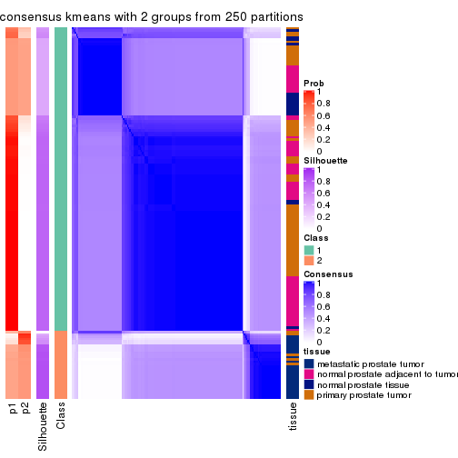</p>

</div>
<div id='tab-CV-kmeans-consensus-heatmap-2'>
<pre><code class="r">consensus_heatmap(res, k = 3)
</code></pre>

<p>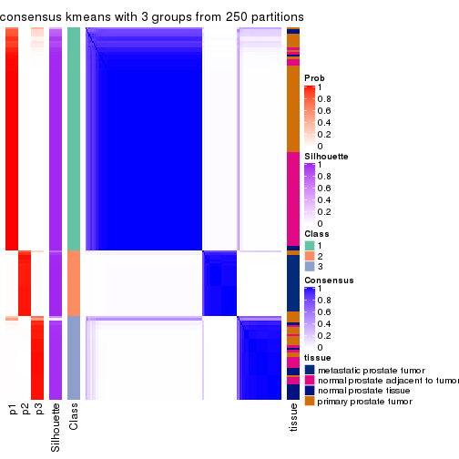</p>

</div>
<div id='tab-CV-kmeans-consensus-heatmap-3'>
<pre><code class="r">consensus_heatmap(res, k = 4)
</code></pre>

<p>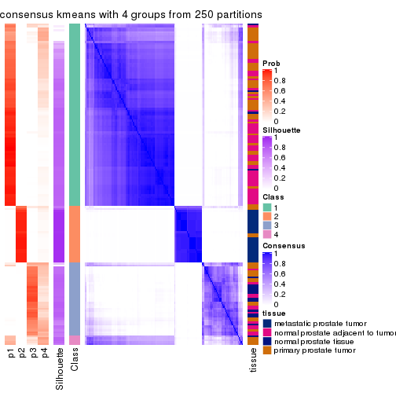</p>

</div>
<div id='tab-CV-kmeans-consensus-heatmap-4'>
<pre><code class="r">consensus_heatmap(res, k = 5)
</code></pre>

<p>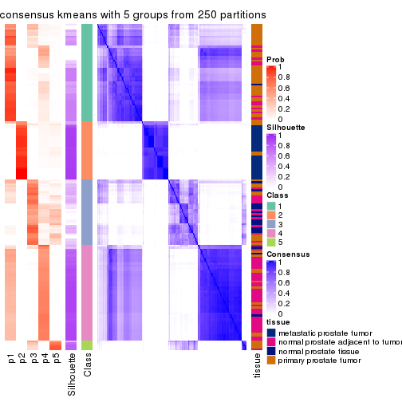</p>

</div>
<div id='tab-CV-kmeans-consensus-heatmap-5'>
<pre><code class="r">consensus_heatmap(res, k = 6)
</code></pre>

<p>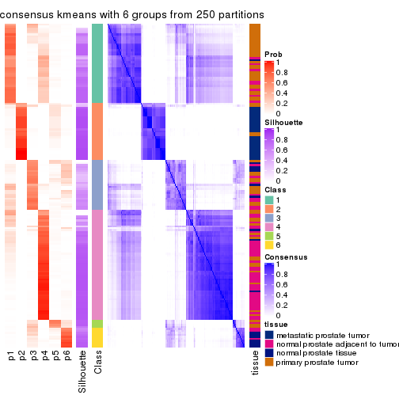</p>

</div>
</div>

Heatmaps for the membership of samples in all partitions to see how consistent they are:


<script>
$( function() {
	$( '#tabs-CV-kmeans-membership-heatmap' ).tabs();
} );
</script>
<div id='tabs-CV-kmeans-membership-heatmap'>
<ul>
<li><a href='#tab-CV-kmeans-membership-heatmap-1'>k = 2</a></li>
<li><a href='#tab-CV-kmeans-membership-heatmap-2'>k = 3</a></li>
<li><a href='#tab-CV-kmeans-membership-heatmap-3'>k = 4</a></li>
<li><a href='#tab-CV-kmeans-membership-heatmap-4'>k = 5</a></li>
<li><a href='#tab-CV-kmeans-membership-heatmap-5'>k = 6</a></li>
</ul>
<div id='tab-CV-kmeans-membership-heatmap-1'>
<pre><code class="r">membership_heatmap(res, k = 2)
</code></pre>

<p>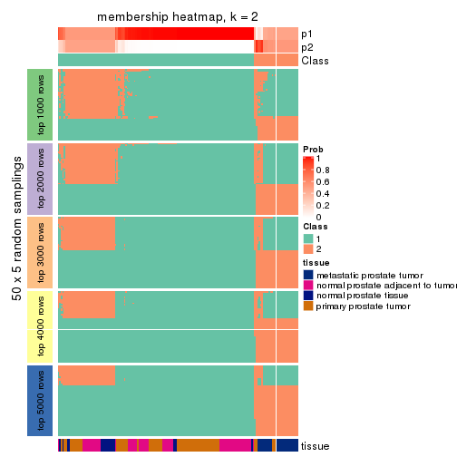</p>

</div>
<div id='tab-CV-kmeans-membership-heatmap-2'>
<pre><code class="r">membership_heatmap(res, k = 3)
</code></pre>

<p>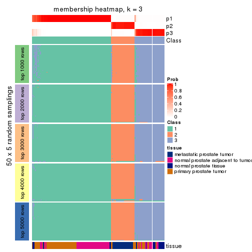</p>

</div>
<div id='tab-CV-kmeans-membership-heatmap-3'>
<pre><code class="r">membership_heatmap(res, k = 4)
</code></pre>

<p>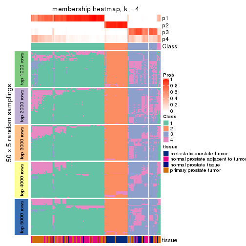</p>

</div>
<div id='tab-CV-kmeans-membership-heatmap-4'>
<pre><code class="r">membership_heatmap(res, k = 5)
</code></pre>

<p>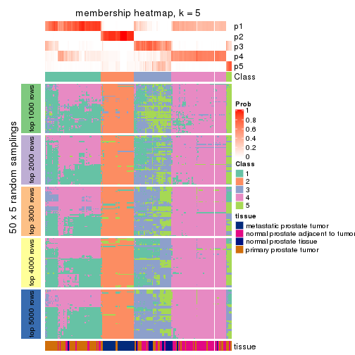</p>

</div>
<div id='tab-CV-kmeans-membership-heatmap-5'>
<pre><code class="r">membership_heatmap(res, k = 6)
</code></pre>

<p>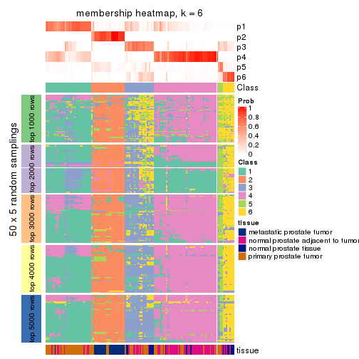</p>

</div>
</div>

As soon as we have had the classes for columns, we can look for signatures
which are significantly different between classes which can be candidate marks
for certain classes. Following are the heatmaps for signatures.


Signature heatmaps where rows are scaled:


<script>
$( function() {
	$( '#tabs-CV-kmeans-get-signatures' ).tabs();
} );
</script>
<div id='tabs-CV-kmeans-get-signatures'>
<ul>
<li><a href='#tab-CV-kmeans-get-signatures-1'>k = 2</a></li>
<li><a href='#tab-CV-kmeans-get-signatures-2'>k = 3</a></li>
<li><a href='#tab-CV-kmeans-get-signatures-3'>k = 4</a></li>
<li><a href='#tab-CV-kmeans-get-signatures-4'>k = 5</a></li>
<li><a href='#tab-CV-kmeans-get-signatures-5'>k = 6</a></li>
</ul>
<div id='tab-CV-kmeans-get-signatures-1'>
<pre><code class="r">get_signatures(res, k = 2)
</code></pre>

<p>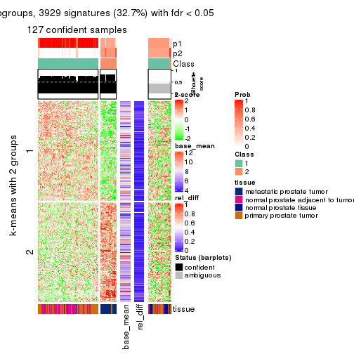</p>

</div>
<div id='tab-CV-kmeans-get-signatures-2'>
<pre><code class="r">get_signatures(res, k = 3)
</code></pre>

<p>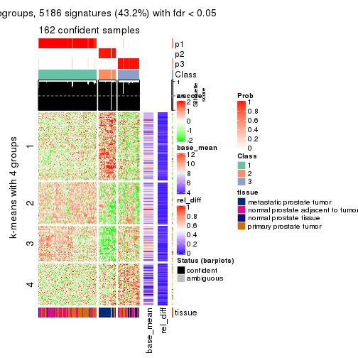</p>

</div>
<div id='tab-CV-kmeans-get-signatures-3'>
<pre><code class="r">get_signatures(res, k = 4)
</code></pre>

<p>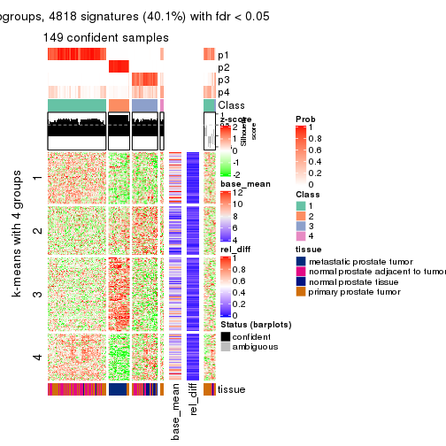</p>

</div>
<div id='tab-CV-kmeans-get-signatures-4'>
<pre><code class="r">get_signatures(res, k = 5)
</code></pre>

<p>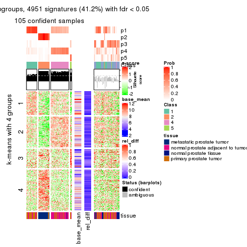</p>

</div>
<div id='tab-CV-kmeans-get-signatures-5'>
<pre><code class="r">get_signatures(res, k = 6)
</code></pre>

<p>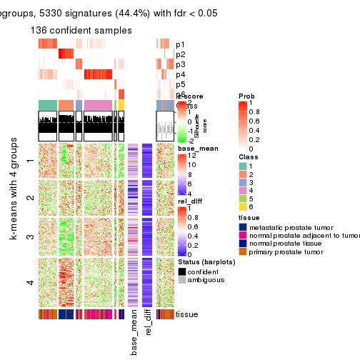</p>

</div>
</div>


Signature heatmaps where rows are not scaled:


<script>
$( function() {
	$( '#tabs-CV-kmeans-get-signatures-no-scale' ).tabs();
} );
</script>
<div id='tabs-CV-kmeans-get-signatures-no-scale'>
<ul>
<li><a href='#tab-CV-kmeans-get-signatures-no-scale-1'>k = 2</a></li>
<li><a href='#tab-CV-kmeans-get-signatures-no-scale-2'>k = 3</a></li>
<li><a href='#tab-CV-kmeans-get-signatures-no-scale-3'>k = 4</a></li>
<li><a href='#tab-CV-kmeans-get-signatures-no-scale-4'>k = 5</a></li>
<li><a href='#tab-CV-kmeans-get-signatures-no-scale-5'>k = 6</a></li>
</ul>
<div id='tab-CV-kmeans-get-signatures-no-scale-1'>
<pre><code class="r">get_signatures(res, k = 2, scale_rows = FALSE)
</code></pre>

<p>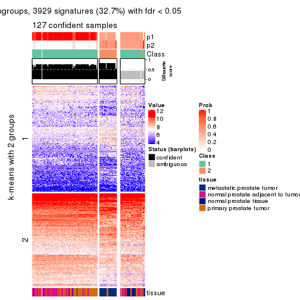</p>

</div>
<div id='tab-CV-kmeans-get-signatures-no-scale-2'>
<pre><code class="r">get_signatures(res, k = 3, scale_rows = FALSE)
</code></pre>

<p>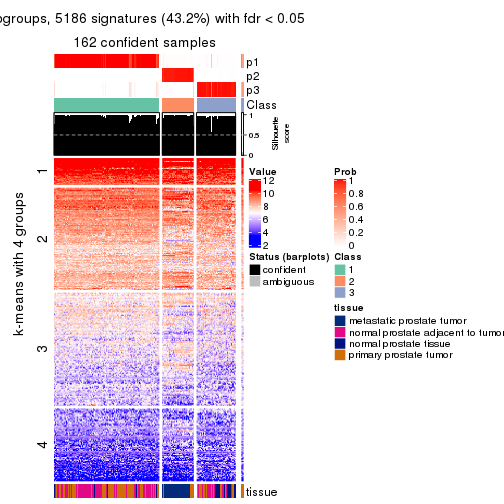</p>

</div>
<div id='tab-CV-kmeans-get-signatures-no-scale-3'>
<pre><code class="r">get_signatures(res, k = 4, scale_rows = FALSE)
</code></pre>

<p>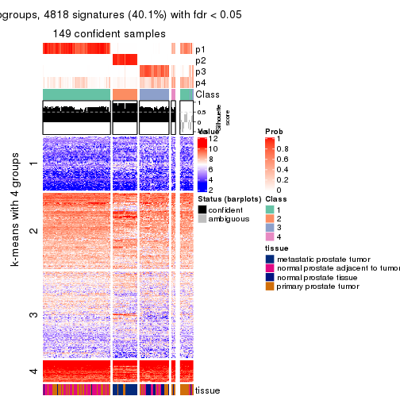</p>

</div>
<div id='tab-CV-kmeans-get-signatures-no-scale-4'>
<pre><code class="r">get_signatures(res, k = 5, scale_rows = FALSE)
</code></pre>

<p>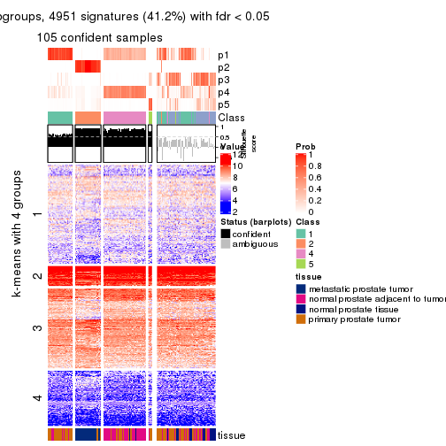</p>

</div>
<div id='tab-CV-kmeans-get-signatures-no-scale-5'>
<pre><code class="r">get_signatures(res, k = 6, scale_rows = FALSE)
</code></pre>

<p>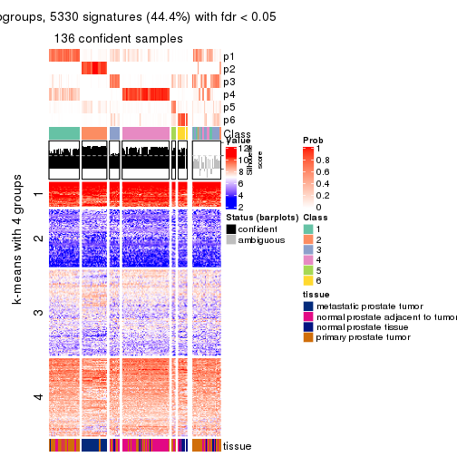</p>

</div>
</div>


Compare the overlap of signatures from different k:

```r
compare_signatures(res)
```

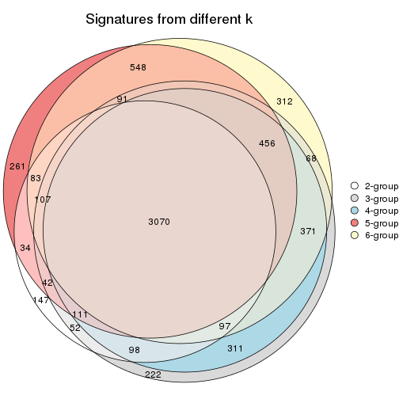

`get_signature()` returns a data frame invisibly. TO get the list of signatures, the function
call should be assigned to a variable explicitly. In following code, if `plot` argument is set
to `FALSE`, no heatmap is plotted while only the differential analysis is performed.

```r
# code only for demonstration
tb = get_signature(res, k = ..., plot = FALSE)
```

An example of the output of `tb` is:

```
#>   which_row         fdr    mean_1    mean_2 scaled_mean_1 scaled_mean_2 km
#> 1        38 0.042760348  8.373488  9.131774    -0.5533452     0.5164555  1
#> 2        40 0.018707592  7.106213  8.469186    -0.6173731     0.5762149  1
#> 3        55 0.019134737 10.221463 11.207825    -0.6159697     0.5749050  1
#> 4        59 0.006059896  5.921854  7.869574    -0.6899429     0.6439467  1
#> 5        60 0.018055526  8.928898 10.211722    -0.6204761     0.5791110  1
#> 6        98 0.009384629 15.714769 14.887706     0.6635654    -0.6193277  2
...
```

The columns in `tb` are:

1. `which_row`: row indices corresponding to the input matrix.
2. `fdr`: FDR for the differential test. 
3. `mean_x`: The mean value in group x.
4. `scaled_mean_x`: The mean value in group x after rows are scaled.
5. `km`: Row groups if k-means clustering is applied to rows.


UMAP plot which shows how samples are separated.


<script>
$( function() {
	$( '#tabs-CV-kmeans-dimension-reduction' ).tabs();
} );
</script>
<div id='tabs-CV-kmeans-dimension-reduction'>
<ul>
<li><a href='#tab-CV-kmeans-dimension-reduction-1'>k = 2</a></li>
<li><a href='#tab-CV-kmeans-dimension-reduction-2'>k = 3</a></li>
<li><a href='#tab-CV-kmeans-dimension-reduction-3'>k = 4</a></li>
<li><a href='#tab-CV-kmeans-dimension-reduction-4'>k = 5</a></li>
<li><a href='#tab-CV-kmeans-dimension-reduction-5'>k = 6</a></li>
</ul>
<div id='tab-CV-kmeans-dimension-reduction-1'>
<pre><code class="r">dimension_reduction(res, k = 2, method = &quot;UMAP&quot;)
</code></pre>

<p>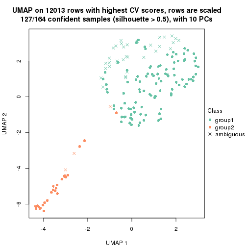</p>

</div>
<div id='tab-CV-kmeans-dimension-reduction-2'>
<pre><code class="r">dimension_reduction(res, k = 3, method = &quot;UMAP&quot;)
</code></pre>

<p>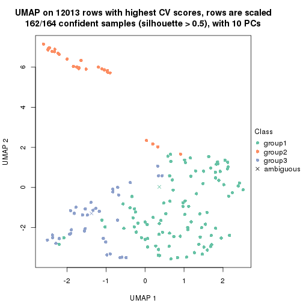</p>

</div>
<div id='tab-CV-kmeans-dimension-reduction-3'>
<pre><code class="r">dimension_reduction(res, k = 4, method = &quot;UMAP&quot;)
</code></pre>

<p>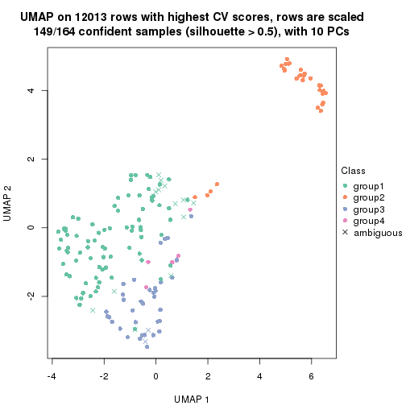</p>

</div>
<div id='tab-CV-kmeans-dimension-reduction-4'>
<pre><code class="r">dimension_reduction(res, k = 5, method = &quot;UMAP&quot;)
</code></pre>

<p>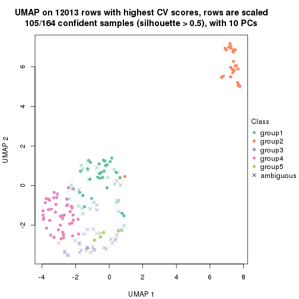</p>

</div>
<div id='tab-CV-kmeans-dimension-reduction-5'>
<pre><code class="r">dimension_reduction(res, k = 6, method = &quot;UMAP&quot;)
</code></pre>

<p>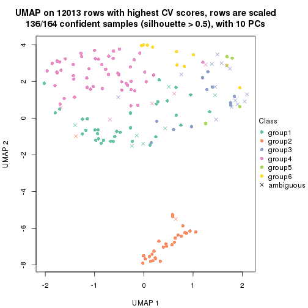</p>

</div>
</div>


Following heatmap shows how subgroups are split when increasing `k`:

```r
collect_classes(res)
```

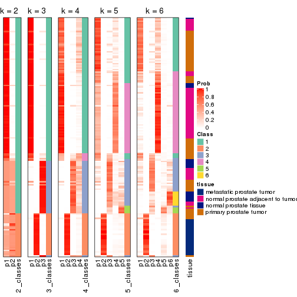


Test correlation between subgroups and known annotations. If the known
annotation is numeric, one-way ANOVA test is applied, and if the known
annotation is discrete, chi-squared contingency table test is applied.

```r
test_to_known_factors(res)
```

```
#>             n tissue(p) k
#> CV:kmeans 127  1.04e-23 2
#> CV:kmeans 162  8.65e-32 3
#> CV:kmeans 149  5.89e-29 4
#> CV:kmeans 105  6.44e-22 5
#> CV:kmeans 136  7.64e-35 6
```


If matrix rows can be associated to genes, consider to use `functional_enrichment(res,
...)` to perform function enrichment for the signature genes. See [this vignette](http://bioconductor.org/packages/devel/bioc/vignettes/cola/inst/doc/functional_enrichment.html) for more detailed explanations.


 

---------------------------------------------------


### CV:skmeans


The object with results only for a single top-value method and a single partition method 
can be extracted as:

```r
res = res_list["CV", "skmeans"]
# you can also extract it by
# res = res_list["CV:skmeans"]
```

A summary of `res` and all the functions that can be applied to it:

```r
res
```

```
#> A 'ConsensusPartition' object with k = 2, 3, 4, 5, 6.
#>   On a matrix with 12013 rows and 164 columns.
#>   Top rows (1000, 2000, 3000, 4000, 5000) are extracted by 'CV' method.
#>   Subgroups are detected by 'skmeans' method.
#>   Performed in total 1250 partitions by row resampling.
#>   Best k for subgroups seems to be 3.
#> 
#> Following methods can be applied to this 'ConsensusPartition' object:
#>  [1] "cola_report"             "collect_classes"         "collect_plots"          
#>  [4] "collect_stats"           "colnames"                "compare_signatures"     
#>  [7] "consensus_heatmap"       "dimension_reduction"     "functional_enrichment"  
#> [10] "get_anno_col"            "get_anno"                "get_classes"            
#> [13] "get_consensus"           "get_matrix"              "get_membership"         
#> [16] "get_param"               "get_signatures"          "get_stats"              
#> [19] "is_best_k"               "is_stable_k"             "membership_heatmap"     
#> [22] "ncol"                    "nrow"                    "plot_ecdf"              
#> [25] "rownames"                "select_partition_number" "show"                   
#> [28] "suggest_best_k"          "test_to_known_factors"
```

`collect_plots()` function collects all the plots made from `res` for all `k` (number of partitions)
into one single page to provide an easy and fast comparison between different `k`.

```r
collect_plots(res)
```

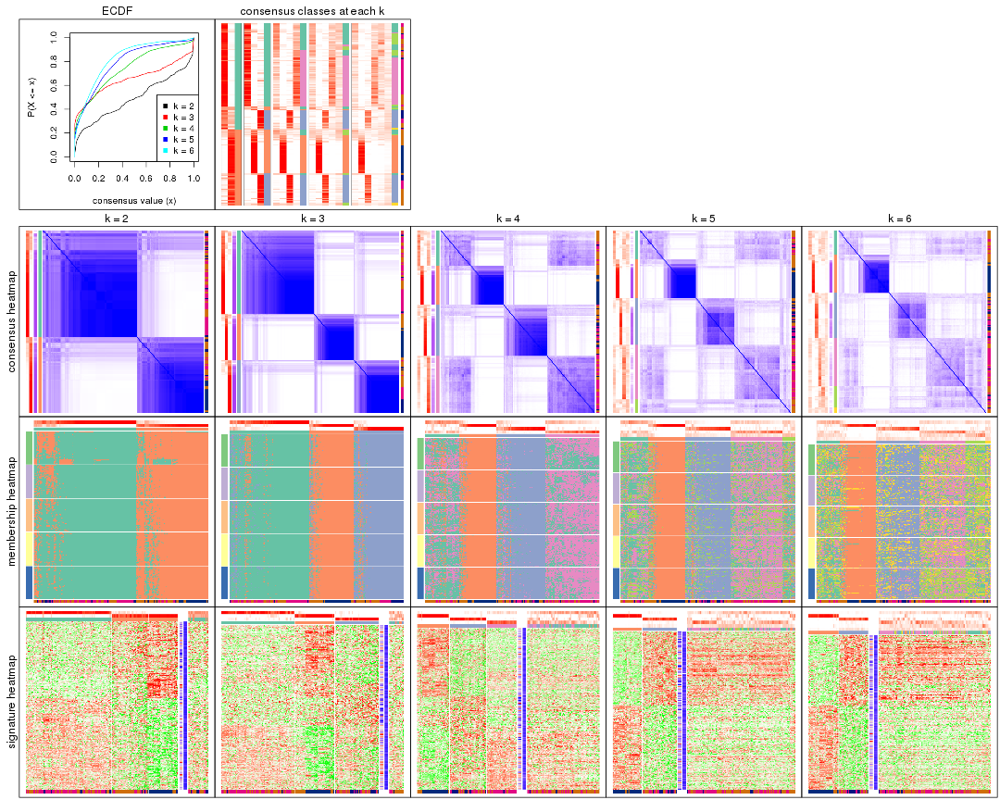

The plots are:

- The first row: a plot of the ECDF (empirical cumulative distribution
  function) curves of the consensus matrix for each `k` and the heatmap of
  predicted classes for each `k`.
- The second row: heatmaps of the consensus matrix for each `k`.
- The third row: heatmaps of the membership matrix for each `k`.
- The fouth row: heatmaps of the signatures for each `k`.

All the plots in panels can be made by individual functions and they are
plotted later in this section.

`select_partition_number()` produces several plots showing different
statistics for choosing "optimized" `k`. There are following statistics:

- ECDF curves of the consensus matrix for each `k`;
- 1-PAC. [The PAC
  score](https://en.wikipedia.org/wiki/Consensus_clustering#Over-interpretation_potential_of_consensus_clustering)
  measures the proportion of the ambiguous subgrouping.
- Mean silhouette score.
- Concordance. The mean probability of fiting the consensus class ids in all
  partitions.
- Area increased. Denote $A_k$ as the area under the ECDF curve for current
  `k`, the area increased is defined as $A_k - A_{k-1}$.
- Rand index. The percent of pairs of samples that are both in a same cluster
  or both are not in a same cluster in the partition of k and k-1.
- Jaccard index. The ratio of pairs of samples are both in a same cluster in
  the partition of k and k-1 and the pairs of samples are both in a same
  cluster in the partition k or k-1.

The detailed explanations of these statistics can be found in [the _cola_
vignette](http://bioconductor.org/packages/devel/bioc/vignettes/cola/inst/doc/cola.html#toc_13).

Generally speaking, lower PAC score, higher mean silhouette score or higher
concordance corresponds to better partition. Rand index and Jaccard index
measure how similar the current partition is compared to partition with `k-1`.
If they are too similar, we won't accept `k` is better than `k-1`.

```r
select_partition_number(res)
```

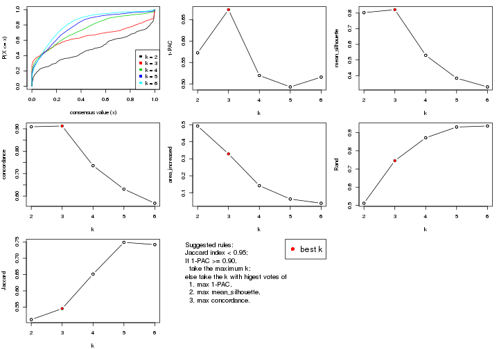

The numeric values for all these statistics can be obtained by `get_stats()`.

```r
get_stats(res)
```

```
#>   k 1-PAC mean_silhouette concordance area_increased  Rand Jaccard
#> 2 2 0.573           0.803       0.909         0.4923 0.512   0.512
#> 3 3 0.673           0.821       0.912         0.3289 0.746   0.545
#> 4 4 0.520           0.530       0.736         0.1426 0.872   0.651
#> 5 5 0.493           0.384       0.631         0.0642 0.931   0.749
#> 6 6 0.516           0.328       0.568         0.0395 0.937   0.742
```

`suggest_best_k()` suggests the best $k$ based on these statistics. The rules are as follows:

- All $k$ with Jaccard index larger than 0.95 are removed because increasing
  $k$ does not provide enough extra information. If all $k$ are removed, it is
  marked as no subgroup is detected.
- For all $k$ with 1-PAC score larger than 0.9, the maximal $k$ is taken as
  the best $k$, and other $k$ are marked as optional $k$.
- If it does not fit the second rule. The $k$ with the maximal vote of the
  highest 1-PAC score, highest mean silhouette, and highest concordance is
  taken as the best $k$.

```r
suggest_best_k(res)
```

```
#> [1] 3
```


Following shows the table of the partitions (You need to click the **show/hide
code output** link to see it). The membership matrix (columns with name `p*`)
is inferred by
[`clue::cl_consensus()`](https://www.rdocumentation.org/link/cl_consensus?package=clue)
function with the `SE` method. Basically the value in the membership matrix
represents the probability to belong to a certain group. The finall class
label for an item is determined with the group with highest probability it
belongs to.

In `get_classes()` function, the entropy is calculated from the membership
matrix and the silhouette score is calculated from the consensus matrix.


<script>
$( function() {
	$( '#tabs-CV-skmeans-get-classes' ).tabs();
} );
</script>
<div id='tabs-CV-skmeans-get-classes'>
<ul>
<li><a href='#tab-CV-skmeans-get-classes-1'>k = 2</a></li>
<li><a href='#tab-CV-skmeans-get-classes-2'>k = 3</a></li>
<li><a href='#tab-CV-skmeans-get-classes-3'>k = 4</a></li>
<li><a href='#tab-CV-skmeans-get-classes-4'>k = 5</a></li>
<li><a href='#tab-CV-skmeans-get-classes-5'>k = 6</a></li>
</ul>

<div id='tab-CV-skmeans-get-classes-1'>
<p><a id='tab-CV-skmeans-get-classes-1-a' style='color:#0366d6' href='#'>show/hide code output</a></p>
<pre><code class="r">cbind(get_classes(res, k = 2), get_membership(res, k = 2))
</code></pre>

<pre><code>#&gt;           class entropy silhouette    p1    p2
#&gt; GSM152839     1  0.0672     0.8960 0.992 0.008
#&gt; GSM152840     1  0.5408     0.8139 0.876 0.124
#&gt; GSM152841     1  0.0000     0.8982 1.000 0.000
#&gt; GSM152842     2  0.9522     0.4369 0.372 0.628
#&gt; GSM152843     1  0.6438     0.7736 0.836 0.164
#&gt; GSM152844     1  0.9580     0.4125 0.620 0.380
#&gt; GSM152845     2  0.0938     0.8966 0.012 0.988
#&gt; GSM152846     2  0.6712     0.7909 0.176 0.824
#&gt; GSM152847     1  0.8144     0.6610 0.748 0.252
#&gt; GSM152848     1  0.0000     0.8982 1.000 0.000
#&gt; GSM152849     1  0.9635     0.3955 0.612 0.388
#&gt; GSM152850     1  0.9661     0.3821 0.608 0.392
#&gt; GSM152851     1  0.9358     0.4837 0.648 0.352
#&gt; GSM152852     2  0.9922     0.2133 0.448 0.552
#&gt; GSM152853     1  0.7528     0.7106 0.784 0.216
#&gt; GSM152854     2  0.7056     0.7748 0.192 0.808
#&gt; GSM152855     1  0.0376     0.8975 0.996 0.004
#&gt; GSM153238     2  0.1414     0.8954 0.020 0.980
#&gt; GSM153239     1  0.9209     0.5155 0.664 0.336
#&gt; GSM153240     1  0.0000     0.8982 1.000 0.000
#&gt; GSM153241     1  0.9608     0.4057 0.616 0.384
#&gt; GSM153242     2  0.3584     0.8787 0.068 0.932
#&gt; GSM153243     2  0.1184     0.8963 0.016 0.984
#&gt; GSM153244     1  0.9129     0.5230 0.672 0.328
#&gt; GSM153245     1  0.9710     0.3597 0.600 0.400
#&gt; GSM153246     2  0.2603     0.8886 0.044 0.956
#&gt; GSM153247     2  0.5842     0.8287 0.140 0.860
#&gt; GSM153248     1  0.5737     0.8069 0.864 0.136
#&gt; GSM153249     1  0.0376     0.8975 0.996 0.004
#&gt; GSM153250     1  0.0000     0.8982 1.000 0.000
#&gt; GSM153251     2  0.2603     0.8885 0.044 0.956
#&gt; GSM153252     1  0.0376     0.8973 0.996 0.004
#&gt; GSM153253     1  0.0376     0.8974 0.996 0.004
#&gt; GSM153254     1  0.9754     0.3312 0.592 0.408
#&gt; GSM153255     1  0.0000     0.8982 1.000 0.000
#&gt; GSM153256     1  0.0376     0.8975 0.996 0.004
#&gt; GSM153257     1  0.0000     0.8982 1.000 0.000
#&gt; GSM153258     1  0.0672     0.8963 0.992 0.008
#&gt; GSM153259     1  0.2423     0.8802 0.960 0.040
#&gt; GSM153260     2  0.2948     0.8871 0.052 0.948
#&gt; GSM153261     2  0.4815     0.8598 0.104 0.896
#&gt; GSM153262     1  0.0000     0.8982 1.000 0.000
#&gt; GSM153263     1  0.0672     0.8963 0.992 0.008
#&gt; GSM153264     1  0.0672     0.8976 0.992 0.008
#&gt; GSM153265     1  0.0672     0.8960 0.992 0.008
#&gt; GSM153266     1  0.0672     0.8971 0.992 0.008
#&gt; GSM153267     1  0.0000     0.8982 1.000 0.000
#&gt; GSM153268     1  0.0672     0.8960 0.992 0.008
#&gt; GSM153269     1  0.0000     0.8982 1.000 0.000
#&gt; GSM153270     1  0.0376     0.8973 0.996 0.004
#&gt; GSM153271     1  0.0000     0.8982 1.000 0.000
#&gt; GSM153272     1  0.0000     0.8982 1.000 0.000
#&gt; GSM153273     1  0.3431     0.8702 0.936 0.064
#&gt; GSM153274     1  0.1184     0.8939 0.984 0.016
#&gt; GSM153275     1  0.0672     0.8965 0.992 0.008
#&gt; GSM153276     1  0.0672     0.8960 0.992 0.008
#&gt; GSM153277     1  0.0000     0.8982 1.000 0.000
#&gt; GSM153278     1  0.9815     0.3033 0.580 0.420
#&gt; GSM153279     1  0.3274     0.8707 0.940 0.060
#&gt; GSM153280     1  0.0376     0.8973 0.996 0.004
#&gt; GSM153281     1  0.0672     0.8960 0.992 0.008
#&gt; GSM153282     1  0.0376     0.8973 0.996 0.004
#&gt; GSM153283     1  0.0376     0.8975 0.996 0.004
#&gt; GSM153284     1  0.0000     0.8982 1.000 0.000
#&gt; GSM153285     1  0.0000     0.8982 1.000 0.000
#&gt; GSM153286     1  0.0000     0.8982 1.000 0.000
#&gt; GSM153287     1  0.0000     0.8982 1.000 0.000
#&gt; GSM153288     1  0.0000     0.8982 1.000 0.000
#&gt; GSM153289     1  0.0376     0.8975 0.996 0.004
#&gt; GSM153290     1  0.0376     0.8973 0.996 0.004
#&gt; GSM153291     1  0.0000     0.8982 1.000 0.000
#&gt; GSM153292     1  0.0376     0.8973 0.996 0.004
#&gt; GSM153293     1  0.0672     0.8964 0.992 0.008
#&gt; GSM153294     1  0.3431     0.8681 0.936 0.064
#&gt; GSM153295     1  0.0672     0.8960 0.992 0.008
#&gt; GSM153054     1  0.9833     0.2985 0.576 0.424
#&gt; GSM153055     1  0.3274     0.8704 0.940 0.060
#&gt; GSM153056     1  0.6048     0.7925 0.852 0.148
#&gt; GSM153057     2  0.9815     0.3322 0.420 0.580
#&gt; GSM153058     2  0.5946     0.8267 0.144 0.856
#&gt; GSM153059     2  0.3274     0.8864 0.060 0.940
#&gt; GSM153060     2  0.3431     0.8808 0.064 0.936
#&gt; GSM153061     2  0.2043     0.8917 0.032 0.968
#&gt; GSM153062     2  0.1843     0.8930 0.028 0.972
#&gt; GSM153063     2  0.7745     0.7237 0.228 0.772
#&gt; GSM153064     1  0.2043     0.8839 0.968 0.032
#&gt; GSM153065     2  0.1414     0.8955 0.020 0.980
#&gt; GSM153066     2  0.0672     0.8972 0.008 0.992
#&gt; GSM153067     1  0.0376     0.8975 0.996 0.004
#&gt; GSM153068     2  0.2043     0.8917 0.032 0.968
#&gt; GSM153069     1  0.0000     0.8982 1.000 0.000
#&gt; GSM153070     1  0.0000     0.8982 1.000 0.000
#&gt; GSM153071     2  0.9833     0.2557 0.424 0.576
#&gt; GSM153072     2  0.9635     0.4109 0.388 0.612
#&gt; GSM153073     1  0.0000     0.8982 1.000 0.000
#&gt; GSM153074     1  0.0376     0.8975 0.996 0.004
#&gt; GSM153075     1  0.0000     0.8982 1.000 0.000
#&gt; GSM153076     1  0.0376     0.8975 0.996 0.004
#&gt; GSM153077     1  0.6247     0.7897 0.844 0.156
#&gt; GSM153078     1  0.9608     0.4207 0.616 0.384
#&gt; GSM153079     1  0.9998     0.0101 0.508 0.492
#&gt; GSM153080     1  0.9608     0.4069 0.616 0.384
#&gt; GSM153081     1  0.0672     0.8963 0.992 0.008
#&gt; GSM153082     2  0.7219     0.7618 0.200 0.800
#&gt; GSM153083     2  0.4298     0.8599 0.088 0.912
#&gt; GSM153084     2  0.0000     0.8973 0.000 1.000
#&gt; GSM153085     2  0.6148     0.8251 0.152 0.848
#&gt; GSM153086     2  0.7528     0.7408 0.216 0.784
#&gt; GSM153087     1  0.0672     0.8960 0.992 0.008
#&gt; GSM153088     1  0.0000     0.8982 1.000 0.000
#&gt; GSM153089     2  0.2043     0.8939 0.032 0.968
#&gt; GSM153090     1  0.0000     0.8982 1.000 0.000
#&gt; GSM153091     1  0.9815     0.2798 0.580 0.420
#&gt; GSM153092     1  0.4562     0.8445 0.904 0.096
#&gt; GSM153093     1  0.0000     0.8982 1.000 0.000
#&gt; GSM153094     1  0.9998     0.0213 0.508 0.492
#&gt; GSM153095     2  0.7376     0.7499 0.208 0.792
#&gt; GSM153096     1  0.4298     0.8518 0.912 0.088
#&gt; GSM153097     2  0.8955     0.5784 0.312 0.688
#&gt; GSM153098     1  0.2603     0.8792 0.956 0.044
#&gt; GSM153099     1  0.0376     0.8974 0.996 0.004
#&gt; GSM153100     1  0.2603     0.8789 0.956 0.044
#&gt; GSM153101     2  0.7528     0.7401 0.216 0.784
#&gt; GSM153102     2  0.7815     0.7180 0.232 0.768
#&gt; GSM153103     2  0.8207     0.6759 0.256 0.744
#&gt; GSM153104     1  0.0672     0.8960 0.992 0.008
#&gt; GSM153106     1  0.1633     0.8912 0.976 0.024
#&gt; GSM153107     1  0.2423     0.8826 0.960 0.040
#&gt; GSM153108     1  0.2043     0.8886 0.968 0.032
#&gt; GSM153109     2  0.6343     0.8009 0.160 0.840
#&gt; GSM153110     1  0.7139     0.7426 0.804 0.196
#&gt; GSM153111     2  0.7453     0.7456 0.212 0.788
#&gt; GSM153112     1  0.3114     0.8730 0.944 0.056
#&gt; GSM153113     2  0.1633     0.8946 0.024 0.976
#&gt; GSM153114     1  0.0672     0.8963 0.992 0.008
#&gt; GSM187532     2  0.0000     0.8973 0.000 1.000
#&gt; GSM187533     2  0.0672     0.8989 0.008 0.992
#&gt; GSM187534     2  0.0376     0.8984 0.004 0.996
#&gt; GSM187535     2  0.7219     0.7477 0.200 0.800
#&gt; GSM152906     2  0.0672     0.8989 0.008 0.992
#&gt; GSM152907     2  0.0672     0.8989 0.008 0.992
#&gt; GSM152908     2  0.0672     0.8989 0.008 0.992
#&gt; GSM152909     2  0.0000     0.8973 0.000 1.000
#&gt; GSM152910     2  0.0000     0.8973 0.000 1.000
#&gt; GSM152911     2  0.0672     0.8989 0.008 0.992
#&gt; GSM152912     2  0.0672     0.8989 0.008 0.992
#&gt; GSM152913     2  0.0000     0.8973 0.000 1.000
#&gt; GSM152914     2  0.0672     0.8989 0.008 0.992
#&gt; GSM152915     2  0.0672     0.8989 0.008 0.992
#&gt; GSM152916     2  0.0376     0.8982 0.004 0.996
#&gt; GSM152917     2  0.0672     0.8989 0.008 0.992
#&gt; GSM152918     2  0.0672     0.8989 0.008 0.992
#&gt; GSM152919     2  0.0672     0.8989 0.008 0.992
#&gt; GSM152920     2  0.0672     0.8989 0.008 0.992
#&gt; GSM152921     2  0.0672     0.8989 0.008 0.992
#&gt; GSM152922     2  0.0376     0.8982 0.004 0.996
#&gt; GSM152923     2  0.0672     0.8989 0.008 0.992
#&gt; GSM152924     2  0.0672     0.8989 0.008 0.992
#&gt; GSM152925     2  0.0000     0.8973 0.000 1.000
#&gt; GSM152926     2  0.0672     0.8989 0.008 0.992
#&gt; GSM152927     2  0.0376     0.8982 0.004 0.996
#&gt; GSM152928     2  0.0000     0.8973 0.000 1.000
#&gt; GSM152929     2  0.0672     0.8989 0.008 0.992
#&gt; GSM152930     2  0.0672     0.8989 0.008 0.992
</code></pre>

<script>
$('#tab-CV-skmeans-get-classes-1-a').parent().next().next().hide();
$('#tab-CV-skmeans-get-classes-1-a').click(function(){
  $('#tab-CV-skmeans-get-classes-1-a').parent().next().next().toggle();
  return(false);
});
</script>
</div>

<div id='tab-CV-skmeans-get-classes-2'>
<p><a id='tab-CV-skmeans-get-classes-2-a' style='color:#0366d6' href='#'>show/hide code output</a></p>
<pre><code class="r">cbind(get_classes(res, k = 3), get_membership(res, k = 3))
</code></pre>

<pre><code>#&gt;           class entropy silhouette    p1    p2    p3
#&gt; GSM152839     3  0.4654    0.71895 0.208 0.000 0.792
#&gt; GSM152840     3  0.0000    0.91514 0.000 0.000 1.000
#&gt; GSM152841     1  0.0424    0.89776 0.992 0.000 0.008
#&gt; GSM152842     3  0.0000    0.91514 0.000 0.000 1.000
#&gt; GSM152843     3  0.0000    0.91514 0.000 0.000 1.000
#&gt; GSM152844     3  0.0000    0.91514 0.000 0.000 1.000
#&gt; GSM152845     3  0.0000    0.91514 0.000 0.000 1.000
#&gt; GSM152846     3  0.0000    0.91514 0.000 0.000 1.000
#&gt; GSM152847     3  0.0000    0.91514 0.000 0.000 1.000
#&gt; GSM152848     1  0.6095    0.40278 0.608 0.000 0.392
#&gt; GSM152849     3  0.0000    0.91514 0.000 0.000 1.000
#&gt; GSM152850     3  0.0000    0.91514 0.000 0.000 1.000
#&gt; GSM152851     3  0.4326    0.79851 0.144 0.012 0.844
#&gt; GSM152852     3  0.0000    0.91514 0.000 0.000 1.000
#&gt; GSM152853     3  0.0000    0.91514 0.000 0.000 1.000
#&gt; GSM152854     3  0.0000    0.91514 0.000 0.000 1.000
#&gt; GSM152855     1  0.0000    0.89826 1.000 0.000 0.000
#&gt; GSM153238     3  0.0000    0.91514 0.000 0.000 1.000
#&gt; GSM153239     3  0.0000    0.91514 0.000 0.000 1.000
#&gt; GSM153240     1  0.0000    0.89826 1.000 0.000 0.000
#&gt; GSM153241     3  0.0000    0.91514 0.000 0.000 1.000
#&gt; GSM153242     3  0.0000    0.91514 0.000 0.000 1.000
#&gt; GSM153243     3  0.0000    0.91514 0.000 0.000 1.000
#&gt; GSM153244     1  0.9783    0.14686 0.432 0.256 0.312
#&gt; GSM153245     3  0.0000    0.91514 0.000 0.000 1.000
#&gt; GSM153246     3  0.0000    0.91514 0.000 0.000 1.000
#&gt; GSM153247     3  0.0592    0.90805 0.000 0.012 0.988
#&gt; GSM153248     1  0.5115    0.70704 0.768 0.228 0.004
#&gt; GSM153249     1  0.0000    0.89826 1.000 0.000 0.000
#&gt; GSM153250     1  0.0000    0.89826 1.000 0.000 0.000
#&gt; GSM153251     3  0.0000    0.91514 0.000 0.000 1.000
#&gt; GSM153252     1  0.0000    0.89826 1.000 0.000 0.000
#&gt; GSM153253     1  0.1753    0.88864 0.952 0.000 0.048
#&gt; GSM153254     3  0.9283    0.31053 0.320 0.180 0.500
#&gt; GSM153255     1  0.0000    0.89826 1.000 0.000 0.000
#&gt; GSM153256     1  0.0000    0.89826 1.000 0.000 0.000
#&gt; GSM153257     1  0.0000    0.89826 1.000 0.000 0.000
#&gt; GSM153258     1  0.0237    0.89760 0.996 0.004 0.000
#&gt; GSM153259     1  0.2959    0.84993 0.900 0.100 0.000
#&gt; GSM153260     3  0.0000    0.91514 0.000 0.000 1.000
#&gt; GSM153261     3  0.0000    0.91514 0.000 0.000 1.000
#&gt; GSM153262     1  0.1411    0.89198 0.964 0.000 0.036
#&gt; GSM153263     1  0.0000    0.89826 1.000 0.000 0.000
#&gt; GSM153264     1  0.5536    0.74995 0.776 0.024 0.200
#&gt; GSM153265     1  0.2796    0.86635 0.908 0.000 0.092
#&gt; GSM153266     1  0.6284    0.58661 0.680 0.016 0.304
#&gt; GSM153267     1  0.0000    0.89826 1.000 0.000 0.000
#&gt; GSM153268     1  0.5397    0.64901 0.720 0.000 0.280
#&gt; GSM153269     1  0.0000    0.89826 1.000 0.000 0.000
#&gt; GSM153270     1  0.5254    0.67409 0.736 0.000 0.264
#&gt; GSM153271     1  0.0000    0.89826 1.000 0.000 0.000
#&gt; GSM153272     1  0.0000    0.89826 1.000 0.000 0.000
#&gt; GSM153273     1  0.5378    0.69626 0.756 0.236 0.008
#&gt; GSM153274     1  0.3607    0.84950 0.880 0.008 0.112
#&gt; GSM153275     1  0.0000    0.89826 1.000 0.000 0.000
#&gt; GSM153276     1  0.3686    0.82828 0.860 0.000 0.140
#&gt; GSM153277     1  0.0747    0.89688 0.984 0.000 0.016
#&gt; GSM153278     3  0.0000    0.91514 0.000 0.000 1.000
#&gt; GSM153279     1  0.6641    0.22722 0.544 0.008 0.448
#&gt; GSM153280     1  0.1031    0.89532 0.976 0.000 0.024
#&gt; GSM153281     1  0.2165    0.88164 0.936 0.000 0.064
#&gt; GSM153282     1  0.2448    0.87571 0.924 0.000 0.076
#&gt; GSM153283     1  0.0000    0.89826 1.000 0.000 0.000
#&gt; GSM153284     1  0.0000    0.89826 1.000 0.000 0.000
#&gt; GSM153285     1  0.2165    0.88198 0.936 0.000 0.064
#&gt; GSM153286     1  0.0000    0.89826 1.000 0.000 0.000
#&gt; GSM153287     1  0.0000    0.89826 1.000 0.000 0.000
#&gt; GSM153288     1  0.0000    0.89826 1.000 0.000 0.000
#&gt; GSM153289     1  0.0000    0.89826 1.000 0.000 0.000
#&gt; GSM153290     1  0.2448    0.87628 0.924 0.000 0.076
#&gt; GSM153291     1  0.0000    0.89826 1.000 0.000 0.000
#&gt; GSM153292     1  0.0424    0.89786 0.992 0.000 0.008
#&gt; GSM153293     1  0.0000    0.89826 1.000 0.000 0.000
#&gt; GSM153294     1  0.5254    0.65974 0.736 0.264 0.000
#&gt; GSM153295     1  0.5291    0.66957 0.732 0.000 0.268
#&gt; GSM153054     3  0.6174    0.73579 0.168 0.064 0.768
#&gt; GSM153055     1  0.6348    0.73403 0.752 0.060 0.188
#&gt; GSM153056     3  0.0424    0.91043 0.008 0.000 0.992
#&gt; GSM153057     3  0.4357    0.83346 0.080 0.052 0.868
#&gt; GSM153058     3  0.0000    0.91514 0.000 0.000 1.000
#&gt; GSM153059     3  0.4249    0.82100 0.028 0.108 0.864
#&gt; GSM153060     3  0.0000    0.91514 0.000 0.000 1.000
#&gt; GSM153061     3  0.0000    0.91514 0.000 0.000 1.000
#&gt; GSM153062     3  0.0000    0.91514 0.000 0.000 1.000
#&gt; GSM153063     3  0.0000    0.91514 0.000 0.000 1.000
#&gt; GSM153064     1  0.1643    0.88354 0.956 0.044 0.000
#&gt; GSM153065     3  0.0237    0.91275 0.000 0.004 0.996
#&gt; GSM153066     3  0.6126    0.33708 0.000 0.400 0.600
#&gt; GSM153067     1  0.0000    0.89826 1.000 0.000 0.000
#&gt; GSM153068     3  0.0000    0.91514 0.000 0.000 1.000
#&gt; GSM153069     1  0.0000    0.89826 1.000 0.000 0.000
#&gt; GSM153070     1  0.1399    0.89404 0.968 0.004 0.028
#&gt; GSM153071     3  0.4411    0.79920 0.140 0.016 0.844
#&gt; GSM153072     3  0.6920    0.70755 0.132 0.132 0.736
#&gt; GSM153073     1  0.0000    0.89826 1.000 0.000 0.000
#&gt; GSM153074     1  0.0000    0.89826 1.000 0.000 0.000
#&gt; GSM153075     1  0.4015    0.85235 0.876 0.028 0.096
#&gt; GSM153076     1  0.0000    0.89826 1.000 0.000 0.000
#&gt; GSM153077     1  0.8726    0.42805 0.564 0.140 0.296
#&gt; GSM153078     3  0.5412    0.75552 0.172 0.032 0.796
#&gt; GSM153079     2  0.9460    0.08861 0.396 0.424 0.180
#&gt; GSM153080     3  0.0237    0.91289 0.004 0.000 0.996
#&gt; GSM153081     1  0.4235    0.79049 0.824 0.000 0.176
#&gt; GSM153082     2  0.2680    0.87126 0.068 0.924 0.008
#&gt; GSM153083     2  0.1170    0.90765 0.008 0.976 0.016
#&gt; GSM153084     2  0.3412    0.81482 0.000 0.876 0.124
#&gt; GSM153085     3  0.8408    0.35457 0.100 0.344 0.556
#&gt; GSM153086     2  0.8455    0.41976 0.120 0.584 0.296
#&gt; GSM153087     1  0.4937    0.80973 0.824 0.028 0.148
#&gt; GSM153088     1  0.0424    0.89791 0.992 0.000 0.008
#&gt; GSM153089     3  0.0237    0.91297 0.000 0.004 0.996
#&gt; GSM153090     1  0.0000    0.89826 1.000 0.000 0.000
#&gt; GSM153091     2  0.5016    0.66767 0.240 0.760 0.000
#&gt; GSM153092     1  0.4291    0.80214 0.840 0.152 0.008
#&gt; GSM153093     1  0.0000    0.89826 1.000 0.000 0.000
#&gt; GSM153094     2  0.4235    0.76565 0.176 0.824 0.000
#&gt; GSM153095     3  0.8939   -0.00189 0.124 0.436 0.440
#&gt; GSM153096     1  0.7014    0.67015 0.712 0.208 0.080
#&gt; GSM153097     2  0.5058    0.78175 0.148 0.820 0.032
#&gt; GSM153098     1  0.2878    0.85465 0.904 0.096 0.000
#&gt; GSM153099     1  0.2878    0.86402 0.904 0.000 0.096
#&gt; GSM153100     1  0.2537    0.86540 0.920 0.080 0.000
#&gt; GSM153101     3  0.8593    0.49566 0.156 0.248 0.596
#&gt; GSM153102     2  0.9302    0.38145 0.236 0.524 0.240
#&gt; GSM153103     2  0.9431    0.02427 0.176 0.424 0.400
#&gt; GSM153104     1  0.2625    0.87170 0.916 0.000 0.084
#&gt; GSM153106     1  0.0592    0.89597 0.988 0.012 0.000
#&gt; GSM153107     1  0.2261    0.87176 0.932 0.068 0.000
#&gt; GSM153108     1  0.5060    0.82750 0.836 0.064 0.100
#&gt; GSM153109     2  0.1765    0.89301 0.040 0.956 0.004
#&gt; GSM153110     1  0.7690    0.22982 0.536 0.416 0.048
#&gt; GSM153111     2  0.3207    0.85507 0.084 0.904 0.012
#&gt; GSM153112     1  0.4235    0.77948 0.824 0.176 0.000
#&gt; GSM153113     2  0.0424    0.91501 0.000 0.992 0.008
#&gt; GSM153114     1  0.0000    0.89826 1.000 0.000 0.000
#&gt; GSM187532     2  0.4504    0.72176 0.000 0.804 0.196
#&gt; GSM187533     2  0.0000    0.91927 0.000 1.000 0.000
#&gt; GSM187534     2  0.0000    0.91927 0.000 1.000 0.000
#&gt; GSM187535     2  0.0000    0.91927 0.000 1.000 0.000
#&gt; GSM152906     2  0.0000    0.91927 0.000 1.000 0.000
#&gt; GSM152907     2  0.0000    0.91927 0.000 1.000 0.000
#&gt; GSM152908     2  0.0000    0.91927 0.000 1.000 0.000
#&gt; GSM152909     2  0.0424    0.91489 0.000 0.992 0.008
#&gt; GSM152910     2  0.0000    0.91927 0.000 1.000 0.000
#&gt; GSM152911     2  0.0000    0.91927 0.000 1.000 0.000
#&gt; GSM152912     2  0.0000    0.91927 0.000 1.000 0.000
#&gt; GSM152913     2  0.0237    0.91709 0.000 0.996 0.004
#&gt; GSM152914     2  0.0000    0.91927 0.000 1.000 0.000
#&gt; GSM152915     2  0.0000    0.91927 0.000 1.000 0.000
#&gt; GSM152916     2  0.0000    0.91927 0.000 1.000 0.000
#&gt; GSM152917     2  0.0000    0.91927 0.000 1.000 0.000
#&gt; GSM152918     2  0.0000    0.91927 0.000 1.000 0.000
#&gt; GSM152919     2  0.0000    0.91927 0.000 1.000 0.000
#&gt; GSM152920     2  0.0000    0.91927 0.000 1.000 0.000
#&gt; GSM152921     2  0.0000    0.91927 0.000 1.000 0.000
#&gt; GSM152922     2  0.0000    0.91927 0.000 1.000 0.000
#&gt; GSM152923     2  0.0000    0.91927 0.000 1.000 0.000
#&gt; GSM152924     2  0.0000    0.91927 0.000 1.000 0.000
#&gt; GSM152925     2  0.0000    0.91927 0.000 1.000 0.000
#&gt; GSM152926     2  0.0000    0.91927 0.000 1.000 0.000
#&gt; GSM152927     2  0.0000    0.91927 0.000 1.000 0.000
#&gt; GSM152928     2  0.0000    0.91927 0.000 1.000 0.000
#&gt; GSM152929     2  0.0000    0.91927 0.000 1.000 0.000
#&gt; GSM152930     2  0.0000    0.91927 0.000 1.000 0.000
</code></pre>

<script>
$('#tab-CV-skmeans-get-classes-2-a').parent().next().next().hide();
$('#tab-CV-skmeans-get-classes-2-a').click(function(){
  $('#tab-CV-skmeans-get-classes-2-a').parent().next().next().toggle();
  return(false);
});
</script>
</div>

<div id='tab-CV-skmeans-get-classes-3'>
<p><a id='tab-CV-skmeans-get-classes-3-a' style='color:#0366d6' href='#'>show/hide code output</a></p>
<pre><code class="r">cbind(get_classes(res, k = 4), get_membership(res, k = 4))
</code></pre>

<pre><code>#&gt;           class entropy silhouette    p1    p2    p3    p4
#&gt; GSM152839     3  0.7634    0.05374 0.300 0.000 0.464 0.236
#&gt; GSM152840     3  0.1970    0.81456 0.008 0.000 0.932 0.060
#&gt; GSM152841     4  0.1902    0.59800 0.064 0.000 0.004 0.932
#&gt; GSM152842     3  0.0000    0.82446 0.000 0.000 1.000 0.000
#&gt; GSM152843     3  0.2965    0.79928 0.072 0.000 0.892 0.036
#&gt; GSM152844     3  0.0469    0.82569 0.000 0.000 0.988 0.012
#&gt; GSM152845     3  0.0188    0.82492 0.000 0.000 0.996 0.004
#&gt; GSM152846     3  0.0376    0.82564 0.004 0.000 0.992 0.004
#&gt; GSM152847     3  0.1042    0.82597 0.020 0.000 0.972 0.008
#&gt; GSM152848     1  0.7605    0.14683 0.452 0.000 0.212 0.336
#&gt; GSM152849     3  0.1970    0.81681 0.060 0.000 0.932 0.008
#&gt; GSM152850     3  0.3443    0.76409 0.136 0.000 0.848 0.016
#&gt; GSM152851     3  0.6925    0.31440 0.080 0.016 0.560 0.344
#&gt; GSM152852     3  0.1004    0.82567 0.004 0.000 0.972 0.024
#&gt; GSM152853     3  0.1557    0.81744 0.000 0.000 0.944 0.056
#&gt; GSM152854     3  0.0524    0.82584 0.004 0.000 0.988 0.008
#&gt; GSM152855     4  0.4843    0.41204 0.396 0.000 0.000 0.604
#&gt; GSM153238     3  0.1398    0.82398 0.040 0.004 0.956 0.000
#&gt; GSM153239     3  0.1584    0.82309 0.012 0.000 0.952 0.036
#&gt; GSM153240     4  0.3764    0.59513 0.216 0.000 0.000 0.784
#&gt; GSM153241     3  0.2443    0.81288 0.060 0.000 0.916 0.024
#&gt; GSM153242     3  0.0188    0.82506 0.004 0.000 0.996 0.000
#&gt; GSM153243     3  0.1807    0.81898 0.052 0.008 0.940 0.000
#&gt; GSM153244     4  0.9737   -0.13523 0.268 0.172 0.208 0.352
#&gt; GSM153245     3  0.0937    0.82643 0.012 0.000 0.976 0.012
#&gt; GSM153246     3  0.0188    0.82497 0.004 0.000 0.996 0.000
#&gt; GSM153247     3  0.1871    0.82233 0.024 0.016 0.948 0.012
#&gt; GSM153248     1  0.6373    0.39906 0.648 0.136 0.000 0.216
#&gt; GSM153249     4  0.3024    0.59912 0.148 0.000 0.000 0.852
#&gt; GSM153250     4  0.4961    0.24843 0.448 0.000 0.000 0.552
#&gt; GSM153251     3  0.0000    0.82446 0.000 0.000 1.000 0.000
#&gt; GSM153252     4  0.4248    0.60022 0.220 0.000 0.012 0.768
#&gt; GSM153253     4  0.3810    0.59343 0.092 0.000 0.060 0.848
#&gt; GSM153254     3  0.9865   -0.26783 0.200 0.204 0.304 0.292
#&gt; GSM153255     4  0.2868    0.60235 0.136 0.000 0.000 0.864
#&gt; GSM153256     4  0.4830    0.41060 0.392 0.000 0.000 0.608
#&gt; GSM153257     4  0.4250    0.55294 0.276 0.000 0.000 0.724
#&gt; GSM153258     1  0.4866    0.07291 0.596 0.000 0.000 0.404
#&gt; GSM153259     1  0.5137    0.35924 0.716 0.040 0.000 0.244
#&gt; GSM153260     3  0.1109    0.82612 0.028 0.004 0.968 0.000
#&gt; GSM153261     3  0.1576    0.82288 0.048 0.000 0.948 0.004
#&gt; GSM153262     4  0.4576    0.57494 0.260 0.000 0.012 0.728
#&gt; GSM153263     1  0.4955   -0.10017 0.556 0.000 0.000 0.444
#&gt; GSM153264     1  0.6050    0.31451 0.664 0.004 0.076 0.256
#&gt; GSM153265     4  0.5798    0.52056 0.208 0.000 0.096 0.696
#&gt; GSM153266     1  0.7384    0.16678 0.476 0.000 0.172 0.352
#&gt; GSM153267     4  0.4543    0.52144 0.324 0.000 0.000 0.676
#&gt; GSM153268     4  0.5522    0.39604 0.080 0.000 0.204 0.716
#&gt; GSM153269     4  0.4855    0.39704 0.400 0.000 0.000 0.600
#&gt; GSM153270     4  0.7277    0.16425 0.360 0.000 0.156 0.484
#&gt; GSM153271     4  0.4961    0.25723 0.448 0.000 0.000 0.552
#&gt; GSM153272     4  0.3266    0.60582 0.168 0.000 0.000 0.832
#&gt; GSM153273     1  0.6639    0.32570 0.584 0.092 0.004 0.320
#&gt; GSM153274     4  0.7038    0.17672 0.416 0.004 0.104 0.476
#&gt; GSM153275     4  0.4761    0.48381 0.332 0.000 0.004 0.664
#&gt; GSM153276     4  0.6124    0.45041 0.276 0.000 0.084 0.640
#&gt; GSM153277     4  0.5161    0.50113 0.300 0.000 0.024 0.676
#&gt; GSM153278     3  0.3324    0.77110 0.136 0.000 0.852 0.012
#&gt; GSM153279     4  0.7177    0.23582 0.172 0.004 0.256 0.568
#&gt; GSM153280     4  0.4008    0.58677 0.148 0.000 0.032 0.820
#&gt; GSM153281     4  0.4440    0.59244 0.136 0.000 0.060 0.804
#&gt; GSM153282     4  0.3286    0.59752 0.080 0.000 0.044 0.876
#&gt; GSM153283     1  0.4907    0.02930 0.580 0.000 0.000 0.420
#&gt; GSM153284     4  0.4406    0.52943 0.300 0.000 0.000 0.700
#&gt; GSM153285     4  0.3958    0.60917 0.160 0.000 0.024 0.816
#&gt; GSM153286     4  0.4222    0.54761 0.272 0.000 0.000 0.728
#&gt; GSM153287     4  0.1792    0.59689 0.068 0.000 0.000 0.932
#&gt; GSM153288     4  0.4134    0.58359 0.260 0.000 0.000 0.740
#&gt; GSM153289     4  0.4985    0.25883 0.468 0.000 0.000 0.532
#&gt; GSM153290     4  0.4149    0.59253 0.152 0.000 0.036 0.812
#&gt; GSM153291     4  0.3356    0.59010 0.176 0.000 0.000 0.824
#&gt; GSM153292     4  0.1940    0.59834 0.076 0.000 0.000 0.924
#&gt; GSM153293     4  0.4304    0.54183 0.284 0.000 0.000 0.716
#&gt; GSM153294     1  0.7343    0.16719 0.424 0.156 0.000 0.420
#&gt; GSM153295     4  0.7469    0.16141 0.312 0.000 0.200 0.488
#&gt; GSM153054     3  0.8605    0.05861 0.304 0.056 0.456 0.184
#&gt; GSM153055     4  0.8069    0.04075 0.376 0.064 0.092 0.468
#&gt; GSM153056     3  0.4780    0.71243 0.116 0.000 0.788 0.096
#&gt; GSM153057     3  0.7685    0.46199 0.220 0.064 0.600 0.116
#&gt; GSM153058     3  0.0524    0.82655 0.008 0.000 0.988 0.004
#&gt; GSM153059     3  0.7537    0.52142 0.144 0.172 0.624 0.060
#&gt; GSM153060     3  0.0000    0.82446 0.000 0.000 1.000 0.000
#&gt; GSM153061     3  0.0000    0.82446 0.000 0.000 1.000 0.000
#&gt; GSM153062     3  0.0000    0.82446 0.000 0.000 1.000 0.000
#&gt; GSM153063     3  0.1406    0.82480 0.016 0.000 0.960 0.024
#&gt; GSM153064     1  0.5189    0.21725 0.616 0.012 0.000 0.372
#&gt; GSM153065     3  0.0469    0.82634 0.012 0.000 0.988 0.000
#&gt; GSM153066     3  0.5807    0.44426 0.044 0.344 0.612 0.000
#&gt; GSM153067     4  0.4134    0.54746 0.260 0.000 0.000 0.740
#&gt; GSM153068     3  0.0000    0.82446 0.000 0.000 1.000 0.000
#&gt; GSM153069     4  0.2149    0.60256 0.088 0.000 0.000 0.912
#&gt; GSM153070     1  0.6024    0.01558 0.540 0.000 0.044 0.416
#&gt; GSM153071     3  0.7265    0.48658 0.164 0.028 0.620 0.188
#&gt; GSM153072     3  0.9036    0.01601 0.332 0.132 0.416 0.120
#&gt; GSM153073     1  0.4998   -0.14749 0.512 0.000 0.000 0.488
#&gt; GSM153074     4  0.3942    0.57550 0.236 0.000 0.000 0.764
#&gt; GSM153075     4  0.6789    0.35549 0.352 0.012 0.076 0.560
#&gt; GSM153076     1  0.4925   -0.01603 0.572 0.000 0.000 0.428
#&gt; GSM153077     1  0.8239    0.33228 0.544 0.080 0.128 0.248
#&gt; GSM153078     3  0.8353    0.21924 0.300 0.056 0.492 0.152
#&gt; GSM153079     1  0.7513    0.39042 0.620 0.180 0.052 0.148
#&gt; GSM153080     3  0.3935    0.75822 0.060 0.000 0.840 0.100
#&gt; GSM153081     1  0.5596    0.30669 0.696 0.000 0.068 0.236
#&gt; GSM153082     2  0.7036    0.34665 0.276 0.600 0.020 0.104
#&gt; GSM153083     2  0.6326    0.31775 0.376 0.572 0.024 0.028
#&gt; GSM153084     2  0.6181    0.59708 0.120 0.700 0.168 0.012
#&gt; GSM153085     3  0.9658   -0.11624 0.260 0.276 0.332 0.132
#&gt; GSM153086     1  0.8469    0.36717 0.492 0.296 0.140 0.072
#&gt; GSM153087     4  0.7031    0.36190 0.248 0.012 0.136 0.604
#&gt; GSM153088     1  0.4941   -0.04067 0.564 0.000 0.000 0.436
#&gt; GSM153089     3  0.0804    0.82768 0.008 0.000 0.980 0.012
#&gt; GSM153090     4  0.4977    0.28239 0.460 0.000 0.000 0.540
#&gt; GSM153091     1  0.7200    0.35421 0.484 0.372 0.000 0.144
#&gt; GSM153092     1  0.6891    0.24811 0.548 0.092 0.008 0.352
#&gt; GSM153093     4  0.4072    0.57573 0.252 0.000 0.000 0.748
#&gt; GSM153094     2  0.6979    0.01073 0.376 0.504 0.000 0.120
#&gt; GSM153095     1  0.9929    0.25360 0.300 0.228 0.264 0.208
#&gt; GSM153096     1  0.7224    0.35708 0.584 0.108 0.024 0.284
#&gt; GSM153097     1  0.7017    0.35039 0.564 0.340 0.028 0.068
#&gt; GSM153098     4  0.6148    0.04994 0.468 0.048 0.000 0.484
#&gt; GSM153099     4  0.6585    0.38498 0.312 0.000 0.104 0.584
#&gt; GSM153100     1  0.6392   -0.00404 0.484 0.064 0.000 0.452
#&gt; GSM153101     3  0.9286   -0.12255 0.324 0.236 0.352 0.088
#&gt; GSM153102     1  0.9816    0.29120 0.312 0.292 0.172 0.224
#&gt; GSM153103     1  0.9361    0.31894 0.404 0.252 0.232 0.112
#&gt; GSM153104     4  0.4605    0.56928 0.132 0.000 0.072 0.796
#&gt; GSM153106     1  0.5163   -0.16095 0.516 0.004 0.000 0.480
#&gt; GSM153107     1  0.5237    0.14916 0.628 0.016 0.000 0.356
#&gt; GSM153108     4  0.6988    0.27380 0.384 0.036 0.048 0.532
#&gt; GSM153109     2  0.7211    0.16525 0.352 0.532 0.016 0.100
#&gt; GSM153110     1  0.7012    0.42263 0.652 0.160 0.032 0.156
#&gt; GSM153111     1  0.7053    0.09704 0.484 0.432 0.032 0.052
#&gt; GSM153112     1  0.6392    0.12017 0.528 0.068 0.000 0.404
#&gt; GSM153113     2  0.4238    0.72907 0.176 0.796 0.000 0.028
#&gt; GSM153114     4  0.4817    0.38630 0.388 0.000 0.000 0.612
#&gt; GSM187532     2  0.4054    0.68684 0.016 0.796 0.188 0.000
#&gt; GSM187533     2  0.0188    0.91079 0.004 0.996 0.000 0.000
#&gt; GSM187534     2  0.0188    0.91079 0.004 0.996 0.000 0.000
#&gt; GSM187535     2  0.2867    0.82120 0.104 0.884 0.000 0.012
#&gt; GSM152906     2  0.0000    0.91327 0.000 1.000 0.000 0.000
#&gt; GSM152907     2  0.0000    0.91327 0.000 1.000 0.000 0.000
#&gt; GSM152908     2  0.0000    0.91327 0.000 1.000 0.000 0.000
#&gt; GSM152909     2  0.0592    0.90142 0.000 0.984 0.016 0.000
#&gt; GSM152910     2  0.0000    0.91327 0.000 1.000 0.000 0.000
#&gt; GSM152911     2  0.0000    0.91327 0.000 1.000 0.000 0.000
#&gt; GSM152912     2  0.0000    0.91327 0.000 1.000 0.000 0.000
#&gt; GSM152913     2  0.0336    0.90771 0.000 0.992 0.008 0.000
#&gt; GSM152914     2  0.0000    0.91327 0.000 1.000 0.000 0.000
#&gt; GSM152915     2  0.0000    0.91327 0.000 1.000 0.000 0.000
#&gt; GSM152916     2  0.0000    0.91327 0.000 1.000 0.000 0.000
#&gt; GSM152917     2  0.0000    0.91327 0.000 1.000 0.000 0.000
#&gt; GSM152918     2  0.0000    0.91327 0.000 1.000 0.000 0.000
#&gt; GSM152919     2  0.0000    0.91327 0.000 1.000 0.000 0.000
#&gt; GSM152920     2  0.0000    0.91327 0.000 1.000 0.000 0.000
#&gt; GSM152921     2  0.0000    0.91327 0.000 1.000 0.000 0.000
#&gt; GSM152922     2  0.0000    0.91327 0.000 1.000 0.000 0.000
#&gt; GSM152923     2  0.0000    0.91327 0.000 1.000 0.000 0.000
#&gt; GSM152924     2  0.0000    0.91327 0.000 1.000 0.000 0.000
#&gt; GSM152925     2  0.0000    0.91327 0.000 1.000 0.000 0.000
#&gt; GSM152926     2  0.0000    0.91327 0.000 1.000 0.000 0.000
#&gt; GSM152927     2  0.0188    0.91057 0.000 0.996 0.004 0.000
#&gt; GSM152928     2  0.1042    0.89388 0.008 0.972 0.020 0.000
#&gt; GSM152929     2  0.0000    0.91327 0.000 1.000 0.000 0.000
#&gt; GSM152930     2  0.0000    0.91327 0.000 1.000 0.000 0.000
</code></pre>

<script>
$('#tab-CV-skmeans-get-classes-3-a').parent().next().next().hide();
$('#tab-CV-skmeans-get-classes-3-a').click(function(){
  $('#tab-CV-skmeans-get-classes-3-a').parent().next().next().toggle();
  return(false);
});
</script>
</div>

<div id='tab-CV-skmeans-get-classes-4'>
<p><a id='tab-CV-skmeans-get-classes-4-a' style='color:#0366d6' href='#'>show/hide code output</a></p>
<pre><code class="r">cbind(get_classes(res, k = 5), get_membership(res, k = 5))
</code></pre>

<pre><code>#&gt;           class entropy silhouette    p1    p2    p3    p4    p5
#&gt; GSM152839     3  0.8362   -0.13843 0.232 0.000 0.364 0.164 0.240
#&gt; GSM152840     3  0.4299    0.70904 0.016 0.000 0.796 0.100 0.088
#&gt; GSM152841     4  0.4160    0.41715 0.068 0.000 0.016 0.804 0.112
#&gt; GSM152842     3  0.1883    0.75537 0.012 0.000 0.932 0.008 0.048
#&gt; GSM152843     3  0.6050    0.59843 0.088 0.000 0.656 0.056 0.200
#&gt; GSM152844     3  0.2585    0.75177 0.004 0.000 0.896 0.036 0.064
#&gt; GSM152845     3  0.1285    0.74971 0.004 0.004 0.956 0.000 0.036
#&gt; GSM152846     3  0.1989    0.75409 0.016 0.000 0.932 0.020 0.032
#&gt; GSM152847     3  0.3906    0.73554 0.032 0.000 0.816 0.024 0.128
#&gt; GSM152848     1  0.8379    0.08141 0.368 0.000 0.180 0.220 0.232
#&gt; GSM152849     3  0.3895    0.73823 0.052 0.000 0.824 0.020 0.104
#&gt; GSM152850     3  0.6634    0.44715 0.160 0.000 0.576 0.036 0.228
#&gt; GSM152851     3  0.8407   -0.04052 0.112 0.020 0.400 0.296 0.172
#&gt; GSM152852     3  0.3481    0.73995 0.004 0.000 0.840 0.056 0.100
#&gt; GSM152853     3  0.3800    0.72050 0.000 0.000 0.812 0.108 0.080
#&gt; GSM152854     3  0.1956    0.75383 0.012 0.000 0.928 0.008 0.052
#&gt; GSM152855     1  0.5168    0.03277 0.508 0.000 0.000 0.452 0.040
#&gt; GSM153238     3  0.3189    0.74342 0.016 0.004 0.848 0.004 0.128
#&gt; GSM153239     3  0.3854    0.73400 0.012 0.000 0.824 0.068 0.096
#&gt; GSM153240     4  0.5768    0.35096 0.212 0.000 0.008 0.640 0.140
#&gt; GSM153241     3  0.4599    0.71472 0.048 0.000 0.784 0.052 0.116
#&gt; GSM153242     3  0.1845    0.75472 0.000 0.000 0.928 0.016 0.056
#&gt; GSM153243     3  0.4242    0.71003 0.028 0.024 0.792 0.004 0.152
#&gt; GSM153244     4  0.9578   -0.04703 0.216 0.124 0.176 0.340 0.144
#&gt; GSM153245     3  0.3429    0.75049 0.012 0.000 0.848 0.040 0.100
#&gt; GSM153246     3  0.0794    0.74500 0.000 0.000 0.972 0.000 0.028
#&gt; GSM153247     3  0.4828    0.69736 0.056 0.016 0.776 0.024 0.128
#&gt; GSM153248     1  0.7515    0.15686 0.440 0.072 0.000 0.160 0.328
#&gt; GSM153249     4  0.5502    0.37307 0.192 0.000 0.000 0.652 0.156
#&gt; GSM153250     4  0.6247    0.04509 0.428 0.000 0.000 0.428 0.144
#&gt; GSM153251     3  0.1822    0.75526 0.004 0.004 0.932 0.004 0.056
#&gt; GSM153252     4  0.5608    0.39543 0.168 0.000 0.012 0.672 0.148
#&gt; GSM153253     4  0.5525    0.41104 0.096 0.000 0.052 0.716 0.136
#&gt; GSM153254     4  0.9848   -0.25627 0.160 0.136 0.232 0.240 0.232
#&gt; GSM153255     4  0.3863    0.40304 0.152 0.000 0.000 0.796 0.052
#&gt; GSM153256     4  0.6322    0.18042 0.324 0.000 0.000 0.500 0.176
#&gt; GSM153257     4  0.5848    0.37603 0.224 0.000 0.008 0.628 0.140
#&gt; GSM153258     1  0.7147    0.26072 0.432 0.000 0.020 0.272 0.276
#&gt; GSM153259     1  0.6812    0.29006 0.504 0.020 0.000 0.188 0.288
#&gt; GSM153260     3  0.4019    0.72178 0.052 0.004 0.792 0.000 0.152
#&gt; GSM153261     3  0.3209    0.74373 0.028 0.000 0.848 0.004 0.120
#&gt; GSM153262     4  0.6973    0.16355 0.316 0.000 0.028 0.480 0.176
#&gt; GSM153263     1  0.6182    0.19671 0.520 0.000 0.000 0.324 0.156
#&gt; GSM153264     1  0.7395    0.22193 0.476 0.000 0.076 0.144 0.304
#&gt; GSM153265     4  0.7051    0.29591 0.164 0.000 0.076 0.564 0.196
#&gt; GSM153266     1  0.8261    0.14646 0.392 0.004 0.128 0.200 0.276
#&gt; GSM153267     4  0.6362    0.22716 0.320 0.000 0.000 0.496 0.184
#&gt; GSM153268     4  0.6666    0.29974 0.072 0.000 0.152 0.612 0.164
#&gt; GSM153269     4  0.6434    0.11961 0.368 0.000 0.000 0.452 0.180
#&gt; GSM153270     4  0.8210    0.00196 0.232 0.000 0.120 0.352 0.296
#&gt; GSM153271     4  0.6102    0.19773 0.340 0.000 0.000 0.520 0.140
#&gt; GSM153272     4  0.4800    0.39410 0.196 0.000 0.000 0.716 0.088
#&gt; GSM153273     5  0.7653   -0.24262 0.348 0.040 0.004 0.248 0.360
#&gt; GSM153274     4  0.8102    0.01851 0.280 0.000 0.096 0.348 0.276
#&gt; GSM153275     4  0.6653    0.16167 0.320 0.000 0.000 0.436 0.244
#&gt; GSM153276     4  0.7794    0.22397 0.244 0.000 0.092 0.448 0.216
#&gt; GSM153277     4  0.7188    0.26289 0.216 0.000 0.064 0.532 0.188
#&gt; GSM153278     3  0.6563    0.50642 0.108 0.000 0.592 0.056 0.244
#&gt; GSM153279     4  0.8012    0.15647 0.156 0.004 0.244 0.456 0.140
#&gt; GSM153280     4  0.6271    0.34686 0.120 0.000 0.068 0.652 0.160
#&gt; GSM153281     4  0.5685    0.40911 0.104 0.000 0.044 0.696 0.156
#&gt; GSM153282     4  0.5248    0.39910 0.068 0.000 0.064 0.740 0.128
#&gt; GSM153283     1  0.6891    0.18426 0.440 0.000 0.008 0.296 0.256
#&gt; GSM153284     4  0.6335    0.26025 0.276 0.000 0.000 0.520 0.204
#&gt; GSM153285     4  0.5538    0.39925 0.092 0.000 0.044 0.708 0.156
#&gt; GSM153286     4  0.5617    0.29559 0.256 0.000 0.000 0.620 0.124
#&gt; GSM153287     4  0.2482    0.41882 0.084 0.000 0.000 0.892 0.024
#&gt; GSM153288     4  0.5353    0.31417 0.272 0.000 0.000 0.636 0.092
#&gt; GSM153289     1  0.5215    0.15456 0.592 0.000 0.000 0.352 0.056
#&gt; GSM153290     4  0.6474    0.32164 0.192 0.000 0.056 0.620 0.132
#&gt; GSM153291     4  0.5325    0.28591 0.308 0.000 0.000 0.616 0.076
#&gt; GSM153292     4  0.4277    0.42432 0.100 0.000 0.004 0.784 0.112
#&gt; GSM153293     4  0.6004    0.22532 0.372 0.000 0.000 0.508 0.120
#&gt; GSM153294     4  0.7883   -0.09864 0.248 0.072 0.000 0.344 0.336
#&gt; GSM153295     4  0.8341    0.05306 0.224 0.000 0.216 0.380 0.180
#&gt; GSM153054     3  0.9108   -0.30910 0.192 0.048 0.356 0.156 0.248
#&gt; GSM153055     4  0.8909   -0.10470 0.264 0.084 0.052 0.324 0.276
#&gt; GSM153056     3  0.6308    0.56393 0.068 0.000 0.644 0.108 0.180
#&gt; GSM153057     3  0.8712    0.00811 0.184 0.060 0.424 0.088 0.244
#&gt; GSM153058     3  0.2416    0.75706 0.012 0.000 0.888 0.000 0.100
#&gt; GSM153059     3  0.8809   -0.03023 0.092 0.204 0.432 0.072 0.200
#&gt; GSM153060     3  0.1041    0.74852 0.004 0.000 0.964 0.000 0.032
#&gt; GSM153061     3  0.1041    0.74866 0.004 0.000 0.964 0.000 0.032
#&gt; GSM153062     3  0.0865    0.74568 0.004 0.000 0.972 0.000 0.024
#&gt; GSM153063     3  0.3110    0.75162 0.024 0.000 0.872 0.024 0.080
#&gt; GSM153064     5  0.6927   -0.30041 0.352 0.004 0.000 0.284 0.360
#&gt; GSM153065     3  0.1768    0.75284 0.004 0.000 0.924 0.000 0.072
#&gt; GSM153066     3  0.6872    0.02460 0.036 0.368 0.468 0.000 0.128
#&gt; GSM153067     4  0.5668    0.35159 0.172 0.000 0.000 0.632 0.196
#&gt; GSM153068     3  0.1197    0.75086 0.000 0.000 0.952 0.000 0.048
#&gt; GSM153069     4  0.3291    0.42426 0.088 0.000 0.000 0.848 0.064
#&gt; GSM153070     1  0.7333    0.11704 0.404 0.004 0.020 0.312 0.260
#&gt; GSM153071     3  0.8506    0.07678 0.144 0.028 0.448 0.176 0.204
#&gt; GSM153072     5  0.9056    0.26925 0.168 0.072 0.296 0.108 0.356
#&gt; GSM153073     1  0.6785    0.08402 0.376 0.000 0.000 0.340 0.284
#&gt; GSM153074     4  0.5530    0.34552 0.228 0.000 0.000 0.640 0.132
#&gt; GSM153075     1  0.7805    0.03337 0.380 0.012 0.048 0.360 0.200
#&gt; GSM153076     1  0.6659    0.08272 0.428 0.000 0.000 0.332 0.240
#&gt; GSM153077     5  0.8954   -0.10482 0.324 0.064 0.096 0.180 0.336
#&gt; GSM153078     3  0.9134   -0.29819 0.264 0.052 0.336 0.132 0.216
#&gt; GSM153079     1  0.7642   -0.05178 0.584 0.132 0.084 0.056 0.144
#&gt; GSM153080     3  0.6313    0.57423 0.060 0.000 0.644 0.132 0.164
#&gt; GSM153081     1  0.5871    0.27140 0.680 0.000 0.048 0.108 0.164
#&gt; GSM153082     2  0.8759   -0.41036 0.236 0.372 0.032 0.112 0.248
#&gt; GSM153083     2  0.8285   -0.40963 0.280 0.364 0.052 0.028 0.276
#&gt; GSM153084     2  0.7673    0.15090 0.088 0.548 0.160 0.024 0.180
#&gt; GSM153085     5  0.9143    0.34656 0.140 0.160 0.212 0.084 0.404
#&gt; GSM153086     5  0.9110    0.33336 0.252 0.208 0.128 0.056 0.356
#&gt; GSM153087     4  0.8054    0.14936 0.188 0.008 0.088 0.404 0.312
#&gt; GSM153088     1  0.6993    0.15317 0.428 0.000 0.012 0.312 0.248
#&gt; GSM153089     3  0.3139    0.75216 0.008 0.008 0.860 0.012 0.112
#&gt; GSM153090     1  0.6561    0.01255 0.424 0.000 0.000 0.372 0.204
#&gt; GSM153091     1  0.8318   -0.14230 0.344 0.220 0.000 0.144 0.292
#&gt; GSM153092     1  0.8147    0.25371 0.404 0.076 0.012 0.252 0.256
#&gt; GSM153093     4  0.6606    0.19868 0.336 0.000 0.008 0.480 0.176
#&gt; GSM153094     2  0.8188   -0.43594 0.236 0.356 0.000 0.116 0.292
#&gt; GSM153095     5  0.9579    0.31841 0.120 0.180 0.220 0.144 0.336
#&gt; GSM153096     1  0.8260    0.12284 0.360 0.048 0.040 0.196 0.356
#&gt; GSM153097     5  0.8353    0.23799 0.312 0.228 0.028 0.064 0.368
#&gt; GSM153098     4  0.7259   -0.06093 0.304 0.020 0.000 0.380 0.296
#&gt; GSM153099     4  0.7735    0.18853 0.232 0.000 0.084 0.452 0.232
#&gt; GSM153100     1  0.7628    0.12559 0.380 0.048 0.004 0.364 0.204
#&gt; GSM153101     5  0.9224    0.32847 0.176 0.172 0.296 0.052 0.304
#&gt; GSM153102     5  0.9852    0.18965 0.244 0.184 0.132 0.192 0.248
#&gt; GSM153103     5  0.9541    0.25967 0.284 0.152 0.140 0.120 0.304
#&gt; GSM153104     4  0.6659    0.36573 0.144 0.000 0.072 0.612 0.172
#&gt; GSM153106     1  0.5837    0.17753 0.532 0.004 0.000 0.376 0.088
#&gt; GSM153107     1  0.5516    0.31282 0.668 0.004 0.004 0.212 0.112
#&gt; GSM153108     4  0.8215   -0.00132 0.320 0.032 0.064 0.408 0.176
#&gt; GSM153109     2  0.8670   -0.27824 0.240 0.420 0.036 0.128 0.176
#&gt; GSM153110     1  0.7679   -0.03368 0.412 0.096 0.012 0.096 0.384
#&gt; GSM153111     5  0.8847    0.24547 0.280 0.280 0.040 0.092 0.308
#&gt; GSM153112     4  0.7858   -0.16928 0.324 0.064 0.000 0.324 0.288
#&gt; GSM153113     2  0.6155    0.45931 0.100 0.672 0.012 0.044 0.172
#&gt; GSM153114     1  0.5443    0.04615 0.504 0.000 0.000 0.436 0.060
#&gt; GSM187532     2  0.4370    0.49030 0.000 0.724 0.236 0.000 0.040
#&gt; GSM187533     2  0.0771    0.84837 0.020 0.976 0.000 0.000 0.004
#&gt; GSM187534     2  0.0566    0.85428 0.012 0.984 0.000 0.000 0.004
#&gt; GSM187535     2  0.4004    0.59910 0.216 0.760 0.000 0.008 0.016
#&gt; GSM152906     2  0.0000    0.86357 0.000 1.000 0.000 0.000 0.000
#&gt; GSM152907     2  0.0000    0.86357 0.000 1.000 0.000 0.000 0.000
#&gt; GSM152908     2  0.0000    0.86357 0.000 1.000 0.000 0.000 0.000
#&gt; GSM152909     2  0.0451    0.85615 0.000 0.988 0.008 0.000 0.004
#&gt; GSM152910     2  0.0000    0.86357 0.000 1.000 0.000 0.000 0.000
#&gt; GSM152911     2  0.0000    0.86357 0.000 1.000 0.000 0.000 0.000
#&gt; GSM152912     2  0.0000    0.86357 0.000 1.000 0.000 0.000 0.000
#&gt; GSM152913     2  0.1195    0.83221 0.000 0.960 0.028 0.000 0.012
#&gt; GSM152914     2  0.0000    0.86357 0.000 1.000 0.000 0.000 0.000
#&gt; GSM152915     2  0.0000    0.86357 0.000 1.000 0.000 0.000 0.000
#&gt; GSM152916     2  0.0000    0.86357 0.000 1.000 0.000 0.000 0.000
#&gt; GSM152917     2  0.0000    0.86357 0.000 1.000 0.000 0.000 0.000
#&gt; GSM152918     2  0.0000    0.86357 0.000 1.000 0.000 0.000 0.000
#&gt; GSM152919     2  0.0000    0.86357 0.000 1.000 0.000 0.000 0.000
#&gt; GSM152920     2  0.0000    0.86357 0.000 1.000 0.000 0.000 0.000
#&gt; GSM152921     2  0.0000    0.86357 0.000 1.000 0.000 0.000 0.000
#&gt; GSM152922     2  0.0000    0.86357 0.000 1.000 0.000 0.000 0.000
#&gt; GSM152923     2  0.0000    0.86357 0.000 1.000 0.000 0.000 0.000
#&gt; GSM152924     2  0.0000    0.86357 0.000 1.000 0.000 0.000 0.000
#&gt; GSM152925     2  0.0000    0.86357 0.000 1.000 0.000 0.000 0.000
#&gt; GSM152926     2  0.0000    0.86357 0.000 1.000 0.000 0.000 0.000
#&gt; GSM152927     2  0.0451    0.85648 0.000 0.988 0.008 0.000 0.004
#&gt; GSM152928     2  0.1471    0.82962 0.004 0.952 0.024 0.000 0.020
#&gt; GSM152929     2  0.0000    0.86357 0.000 1.000 0.000 0.000 0.000
#&gt; GSM152930     2  0.0000    0.86357 0.000 1.000 0.000 0.000 0.000
</code></pre>

<script>
$('#tab-CV-skmeans-get-classes-4-a').parent().next().next().hide();
$('#tab-CV-skmeans-get-classes-4-a').click(function(){
  $('#tab-CV-skmeans-get-classes-4-a').parent().next().next().toggle();
  return(false);
});
</script>
</div>

<div id='tab-CV-skmeans-get-classes-5'>
<p><a id='tab-CV-skmeans-get-classes-5-a' style='color:#0366d6' href='#'>show/hide code output</a></p>
<pre><code class="r">cbind(get_classes(res, k = 6), get_membership(res, k = 6))
</code></pre>

<pre><code>#&gt;           class entropy silhouette    p1    p2    p3    p4    p5    p6
#&gt; GSM152839     6  0.8737    0.27027 0.188 0.000 0.224 0.112 0.184 0.292
#&gt; GSM152840     3  0.5943    0.52335 0.020 0.000 0.636 0.116 0.044 0.184
#&gt; GSM152841     4  0.5262    0.40058 0.080 0.000 0.012 0.716 0.108 0.084
#&gt; GSM152842     3  0.3001    0.63147 0.020 0.000 0.860 0.008 0.016 0.096
#&gt; GSM152843     3  0.6887    0.41314 0.108 0.000 0.580 0.064 0.080 0.168
#&gt; GSM152844     3  0.4057    0.62250 0.004 0.000 0.776 0.064 0.012 0.144
#&gt; GSM152845     3  0.2846    0.63576 0.008 0.004 0.856 0.000 0.016 0.116
#&gt; GSM152846     3  0.2715    0.63458 0.000 0.000 0.860 0.024 0.004 0.112
#&gt; GSM152847     3  0.5398    0.56633 0.064 0.000 0.660 0.012 0.040 0.224
#&gt; GSM152848     5  0.8637   -0.10552 0.220 0.000 0.176 0.104 0.320 0.180
#&gt; GSM152849     3  0.5482    0.57671 0.060 0.000 0.680 0.020 0.056 0.184
#&gt; GSM152850     3  0.7768    0.03195 0.140 0.000 0.436 0.048 0.128 0.248
#&gt; GSM152851     3  0.8788   -0.30004 0.072 0.028 0.300 0.276 0.104 0.220
#&gt; GSM152852     3  0.4654    0.61167 0.024 0.000 0.752 0.056 0.024 0.144
#&gt; GSM152853     3  0.4677    0.58893 0.004 0.000 0.732 0.100 0.020 0.144
#&gt; GSM152854     3  0.3669    0.63200 0.008 0.004 0.784 0.000 0.028 0.176
#&gt; GSM152855     5  0.5740    0.09700 0.072 0.000 0.000 0.348 0.536 0.044
#&gt; GSM153238     3  0.5163    0.56762 0.084 0.012 0.712 0.004 0.032 0.156
#&gt; GSM153239     3  0.5263    0.56857 0.016 0.000 0.680 0.092 0.020 0.192
#&gt; GSM153240     4  0.6955    0.28445 0.128 0.000 0.016 0.524 0.220 0.112
#&gt; GSM153241     3  0.5835    0.54530 0.064 0.004 0.676 0.032 0.068 0.156
#&gt; GSM153242     3  0.3184    0.63681 0.012 0.000 0.824 0.012 0.004 0.148
#&gt; GSM153243     3  0.6359    0.47398 0.060 0.040 0.596 0.004 0.060 0.240
#&gt; GSM153244     4  0.9532   -0.01344 0.148 0.104 0.096 0.296 0.220 0.136
#&gt; GSM153245     3  0.4829    0.61319 0.020 0.000 0.744 0.064 0.036 0.136
#&gt; GSM153246     3  0.1075    0.62081 0.000 0.000 0.952 0.000 0.000 0.048
#&gt; GSM153247     3  0.6520    0.50573 0.064 0.028 0.636 0.040 0.064 0.168
#&gt; GSM153248     1  0.7675    0.21284 0.464 0.060 0.000 0.148 0.228 0.100
#&gt; GSM153249     4  0.5576    0.36044 0.196 0.000 0.000 0.636 0.128 0.040
#&gt; GSM153250     4  0.7061    0.04969 0.224 0.000 0.000 0.396 0.300 0.080
#&gt; GSM153251     3  0.3952    0.62838 0.016 0.016 0.792 0.016 0.008 0.152
#&gt; GSM153252     4  0.6693    0.33582 0.164 0.000 0.008 0.552 0.176 0.100
#&gt; GSM153253     4  0.6721    0.37609 0.080 0.000 0.044 0.592 0.140 0.144
#&gt; GSM153254     6  0.9670    0.23094 0.128 0.088 0.188 0.216 0.128 0.252
#&gt; GSM153255     4  0.4914    0.38858 0.104 0.000 0.000 0.724 0.116 0.056
#&gt; GSM153256     4  0.7065    0.10207 0.252 0.000 0.004 0.388 0.296 0.060
#&gt; GSM153257     4  0.6583    0.33120 0.136 0.000 0.004 0.560 0.184 0.116
#&gt; GSM153258     5  0.7698    0.13503 0.268 0.000 0.016 0.240 0.360 0.116
#&gt; GSM153259     1  0.7495    0.05550 0.448 0.020 0.012 0.152 0.284 0.084
#&gt; GSM153260     3  0.5114    0.57451 0.032 0.012 0.692 0.008 0.040 0.216
#&gt; GSM153261     3  0.5130    0.55407 0.040 0.000 0.672 0.008 0.048 0.232
#&gt; GSM153262     4  0.7246    0.24952 0.116 0.000 0.016 0.476 0.240 0.152
#&gt; GSM153263     5  0.7517    0.07040 0.288 0.000 0.000 0.284 0.292 0.136
#&gt; GSM153264     5  0.8046    0.06168 0.312 0.004 0.032 0.128 0.332 0.192
#&gt; GSM153265     4  0.8075    0.23189 0.116 0.000 0.100 0.440 0.168 0.176
#&gt; GSM153266     5  0.8835   -0.05586 0.244 0.012 0.088 0.136 0.260 0.260
#&gt; GSM153267     4  0.7223    0.20621 0.232 0.000 0.008 0.436 0.236 0.088
#&gt; GSM153268     4  0.7434    0.28688 0.096 0.000 0.112 0.528 0.096 0.168
#&gt; GSM153269     5  0.7389   -0.01317 0.236 0.000 0.004 0.312 0.348 0.100
#&gt; GSM153270     4  0.8889   -0.00998 0.184 0.004 0.136 0.292 0.160 0.224
#&gt; GSM153271     4  0.6795    0.14279 0.320 0.000 0.000 0.416 0.208 0.056
#&gt; GSM153272     4  0.5922    0.35302 0.112 0.000 0.004 0.616 0.208 0.060
#&gt; GSM153273     1  0.7557    0.19093 0.476 0.036 0.008 0.252 0.116 0.112
#&gt; GSM153274     1  0.8674   -0.07743 0.284 0.004 0.092 0.256 0.232 0.132
#&gt; GSM153275     4  0.7463    0.18865 0.256 0.000 0.020 0.428 0.200 0.096
#&gt; GSM153276     4  0.8014    0.17374 0.180 0.000 0.060 0.424 0.196 0.140
#&gt; GSM153277     4  0.7944    0.17852 0.156 0.000 0.040 0.404 0.232 0.168
#&gt; GSM153278     3  0.7269    0.18920 0.116 0.004 0.484 0.028 0.096 0.272
#&gt; GSM153279     4  0.8613   -0.01592 0.160 0.000 0.184 0.340 0.116 0.200
#&gt; GSM153280     4  0.6905    0.31590 0.076 0.000 0.040 0.548 0.220 0.116
#&gt; GSM153281     4  0.6729    0.36397 0.096 0.000 0.064 0.604 0.096 0.140
#&gt; GSM153282     4  0.7111    0.32841 0.108 0.000 0.092 0.568 0.088 0.144
#&gt; GSM153283     1  0.7370   -0.06619 0.376 0.000 0.004 0.256 0.264 0.100
#&gt; GSM153284     4  0.7025    0.25802 0.208 0.000 0.008 0.480 0.220 0.084
#&gt; GSM153285     4  0.6847    0.36308 0.112 0.000 0.036 0.576 0.120 0.156
#&gt; GSM153286     4  0.6570    0.29368 0.216 0.000 0.000 0.516 0.200 0.068
#&gt; GSM153287     4  0.3528    0.41418 0.076 0.000 0.000 0.832 0.044 0.048
#&gt; GSM153288     4  0.5874    0.35282 0.136 0.000 0.000 0.628 0.160 0.076
#&gt; GSM153289     5  0.5114    0.18570 0.072 0.000 0.000 0.280 0.628 0.020
#&gt; GSM153290     4  0.6944    0.27262 0.076 0.000 0.048 0.532 0.252 0.092
#&gt; GSM153291     4  0.5446    0.26136 0.064 0.000 0.000 0.564 0.340 0.032
#&gt; GSM153292     4  0.5487    0.41019 0.136 0.000 0.008 0.688 0.080 0.088
#&gt; GSM153293     4  0.6497    0.20169 0.156 0.000 0.000 0.468 0.324 0.052
#&gt; GSM153294     1  0.7855    0.12361 0.392 0.088 0.000 0.316 0.120 0.084
#&gt; GSM153295     5  0.8584    0.00579 0.084 0.000 0.192 0.268 0.284 0.172
#&gt; GSM153054     3  0.8997   -0.37349 0.244 0.028 0.316 0.096 0.132 0.184
#&gt; GSM153055     4  0.9328   -0.03031 0.192 0.072 0.064 0.284 0.224 0.164
#&gt; GSM153056     3  0.7333    0.27020 0.084 0.000 0.516 0.076 0.104 0.220
#&gt; GSM153057     3  0.8510   -0.09897 0.176 0.044 0.428 0.048 0.156 0.148
#&gt; GSM153058     3  0.3875    0.63141 0.016 0.000 0.772 0.008 0.020 0.184
#&gt; GSM153059     3  0.8722   -0.12394 0.088 0.140 0.388 0.028 0.140 0.216
#&gt; GSM153060     3  0.1757    0.62721 0.008 0.000 0.916 0.000 0.000 0.076
#&gt; GSM153061     3  0.1615    0.62526 0.004 0.000 0.928 0.000 0.004 0.064
#&gt; GSM153062     3  0.1007    0.61960 0.000 0.000 0.956 0.000 0.000 0.044
#&gt; GSM153063     3  0.4268    0.61830 0.024 0.000 0.788 0.044 0.028 0.116
#&gt; GSM153064     1  0.7052    0.14237 0.480 0.008 0.000 0.248 0.164 0.100
#&gt; GSM153065     3  0.3201    0.63138 0.008 0.000 0.824 0.000 0.028 0.140
#&gt; GSM153066     3  0.7325   -0.10549 0.036 0.360 0.404 0.008 0.044 0.148
#&gt; GSM153067     4  0.5806    0.35612 0.220 0.000 0.000 0.612 0.112 0.056
#&gt; GSM153068     3  0.2865    0.63432 0.012 0.000 0.840 0.000 0.008 0.140
#&gt; GSM153069     4  0.4347    0.40947 0.088 0.000 0.000 0.772 0.092 0.048
#&gt; GSM153070     5  0.7926    0.10252 0.304 0.000 0.036 0.244 0.316 0.100
#&gt; GSM153071     3  0.8789   -0.21827 0.132 0.020 0.368 0.192 0.100 0.188
#&gt; GSM153072     6  0.9431    0.32794 0.216 0.072 0.240 0.080 0.144 0.248
#&gt; GSM153073     1  0.7297   -0.07867 0.368 0.000 0.000 0.288 0.236 0.108
#&gt; GSM153074     4  0.6617    0.34549 0.208 0.000 0.000 0.520 0.192 0.080
#&gt; GSM153075     5  0.7688    0.03124 0.096 0.004 0.040 0.280 0.432 0.148
#&gt; GSM153076     1  0.6991   -0.04612 0.388 0.000 0.000 0.276 0.272 0.064
#&gt; GSM153077     1  0.8537   -0.03888 0.312 0.020 0.056 0.112 0.304 0.196
#&gt; GSM153078     3  0.9281   -0.45580 0.148 0.040 0.256 0.100 0.208 0.248
#&gt; GSM153079     5  0.7626    0.06873 0.156 0.068 0.044 0.052 0.544 0.136
#&gt; GSM153080     3  0.7099    0.31603 0.064 0.000 0.504 0.092 0.064 0.276
#&gt; GSM153081     5  0.6711    0.21284 0.168 0.000 0.028 0.092 0.580 0.132
#&gt; GSM153082     2  0.9141   -0.39684 0.260 0.316 0.048 0.116 0.112 0.148
#&gt; GSM153083     2  0.8255   -0.30775 0.292 0.348 0.032 0.016 0.180 0.132
#&gt; GSM153084     2  0.8142    0.06679 0.108 0.476 0.132 0.020 0.088 0.176
#&gt; GSM153085     6  0.9698    0.17979 0.204 0.136 0.136 0.100 0.152 0.272
#&gt; GSM153086     1  0.8885   -0.09220 0.392 0.104 0.124 0.044 0.136 0.200
#&gt; GSM153087     4  0.8386    0.18242 0.204 0.012 0.064 0.400 0.136 0.184
#&gt; GSM153088     5  0.7442    0.11192 0.296 0.000 0.000 0.232 0.340 0.132
#&gt; GSM153089     3  0.5410    0.58207 0.048 0.020 0.720 0.036 0.032 0.144
#&gt; GSM153090     5  0.7553    0.01355 0.268 0.000 0.004 0.300 0.308 0.120
#&gt; GSM153091     1  0.8208    0.23347 0.412 0.200 0.000 0.124 0.168 0.096
#&gt; GSM153092     1  0.8813    0.05036 0.288 0.076 0.016 0.192 0.276 0.152
#&gt; GSM153093     4  0.7181    0.28067 0.224 0.000 0.008 0.472 0.180 0.116
#&gt; GSM153094     1  0.8487    0.10001 0.300 0.288 0.000 0.092 0.188 0.132
#&gt; GSM153095     1  0.9649   -0.19448 0.260 0.192 0.132 0.104 0.100 0.212
#&gt; GSM153096     1  0.8774    0.12833 0.352 0.060 0.036 0.224 0.208 0.120
#&gt; GSM153097     1  0.8531    0.11138 0.416 0.160 0.032 0.056 0.176 0.160
#&gt; GSM153098     1  0.7357   -0.01899 0.368 0.028 0.008 0.356 0.204 0.036
#&gt; GSM153099     4  0.8460    0.09021 0.244 0.000 0.084 0.328 0.136 0.208
#&gt; GSM153100     4  0.7899   -0.05400 0.268 0.036 0.000 0.304 0.300 0.092
#&gt; GSM153101     6  0.9514    0.28674 0.216 0.084 0.212 0.068 0.192 0.228
#&gt; GSM153102     5  0.9792   -0.17033 0.216 0.164 0.100 0.136 0.232 0.152
#&gt; GSM153103     1  0.9531   -0.25228 0.240 0.116 0.152 0.060 0.196 0.236
#&gt; GSM153104     4  0.6379    0.38033 0.064 0.000 0.076 0.640 0.108 0.112
#&gt; GSM153106     5  0.5460    0.20092 0.084 0.004 0.000 0.264 0.620 0.028
#&gt; GSM153107     5  0.5313    0.22770 0.120 0.004 0.000 0.120 0.696 0.060
#&gt; GSM153108     4  0.8682   -0.03440 0.200 0.020 0.064 0.300 0.292 0.124
#&gt; GSM153109     2  0.8768   -0.36186 0.208 0.332 0.036 0.056 0.252 0.116
#&gt; GSM153110     1  0.7256    0.23583 0.560 0.092 0.020 0.060 0.196 0.072
#&gt; GSM153111     1  0.8937    0.07071 0.332 0.236 0.032 0.076 0.176 0.148
#&gt; GSM153112     1  0.7912    0.12361 0.408 0.072 0.000 0.256 0.184 0.080
#&gt; GSM153113     2  0.7999    0.16468 0.156 0.508 0.032 0.076 0.100 0.128
#&gt; GSM153114     5  0.5622    0.10526 0.060 0.000 0.000 0.336 0.556 0.048
#&gt; GSM187532     2  0.4848    0.51819 0.008 0.696 0.212 0.000 0.016 0.068
#&gt; GSM187533     2  0.1682    0.83065 0.000 0.928 0.000 0.000 0.052 0.020
#&gt; GSM187534     2  0.1480    0.83780 0.000 0.940 0.000 0.000 0.040 0.020
#&gt; GSM187535     2  0.5180    0.51204 0.048 0.664 0.000 0.016 0.244 0.028
#&gt; GSM152906     2  0.1049    0.85306 0.008 0.960 0.000 0.000 0.000 0.032
#&gt; GSM152907     2  0.0891    0.85452 0.008 0.968 0.000 0.000 0.000 0.024
#&gt; GSM152908     2  0.0146    0.85562 0.000 0.996 0.000 0.000 0.000 0.004
#&gt; GSM152909     2  0.1377    0.84326 0.004 0.952 0.016 0.000 0.004 0.024
#&gt; GSM152910     2  0.0692    0.85553 0.004 0.976 0.000 0.000 0.000 0.020
#&gt; GSM152911     2  0.0146    0.85617 0.000 0.996 0.000 0.000 0.000 0.004
#&gt; GSM152912     2  0.0260    0.85503 0.000 0.992 0.000 0.000 0.000 0.008
#&gt; GSM152913     2  0.1786    0.82930 0.004 0.932 0.032 0.000 0.004 0.028
#&gt; GSM152914     2  0.0260    0.85503 0.000 0.992 0.000 0.000 0.000 0.008
#&gt; GSM152915     2  0.0146    0.85557 0.000 0.996 0.000 0.000 0.000 0.004
#&gt; GSM152916     2  0.1074    0.85466 0.012 0.960 0.000 0.000 0.000 0.028
#&gt; GSM152917     2  0.0146    0.85557 0.000 0.996 0.000 0.000 0.000 0.004
#&gt; GSM152918     2  0.0508    0.85645 0.004 0.984 0.000 0.000 0.000 0.012
#&gt; GSM152919     2  0.0260    0.85610 0.000 0.992 0.000 0.000 0.000 0.008
#&gt; GSM152920     2  0.0146    0.85562 0.000 0.996 0.000 0.000 0.000 0.004
#&gt; GSM152921     2  0.0000    0.85593 0.000 1.000 0.000 0.000 0.000 0.000
#&gt; GSM152922     2  0.0291    0.85557 0.004 0.992 0.000 0.000 0.000 0.004
#&gt; GSM152923     2  0.1049    0.85306 0.008 0.960 0.000 0.000 0.000 0.032
#&gt; GSM152924     2  0.1367    0.85112 0.012 0.944 0.000 0.000 0.000 0.044
#&gt; GSM152925     2  0.1296    0.85240 0.012 0.952 0.000 0.000 0.004 0.032
#&gt; GSM152926     2  0.1245    0.85252 0.016 0.952 0.000 0.000 0.000 0.032
#&gt; GSM152927     2  0.1850    0.84507 0.016 0.924 0.008 0.000 0.000 0.052
#&gt; GSM152928     2  0.3388    0.78523 0.024 0.848 0.040 0.000 0.012 0.076
#&gt; GSM152929     2  0.1151    0.85256 0.012 0.956 0.000 0.000 0.000 0.032
#&gt; GSM152930     2  0.0972    0.85407 0.008 0.964 0.000 0.000 0.000 0.028
</code></pre>

<script>
$('#tab-CV-skmeans-get-classes-5-a').parent().next().next().hide();
$('#tab-CV-skmeans-get-classes-5-a').click(function(){
  $('#tab-CV-skmeans-get-classes-5-a').parent().next().next().toggle();
  return(false);
});
</script>
</div>
</div>

Heatmaps for the consensus matrix. It visualizes the probability of two
samples to be in a same group.


<script>
$( function() {
	$( '#tabs-CV-skmeans-consensus-heatmap' ).tabs();
} );
</script>
<div id='tabs-CV-skmeans-consensus-heatmap'>
<ul>
<li><a href='#tab-CV-skmeans-consensus-heatmap-1'>k = 2</a></li>
<li><a href='#tab-CV-skmeans-consensus-heatmap-2'>k = 3</a></li>
<li><a href='#tab-CV-skmeans-consensus-heatmap-3'>k = 4</a></li>
<li><a href='#tab-CV-skmeans-consensus-heatmap-4'>k = 5</a></li>
<li><a href='#tab-CV-skmeans-consensus-heatmap-5'>k = 6</a></li>
</ul>
<div id='tab-CV-skmeans-consensus-heatmap-1'>
<pre><code class="r">consensus_heatmap(res, k = 2)
</code></pre>

<p>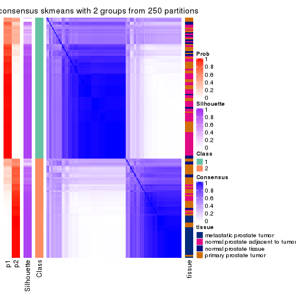</p>

</div>
<div id='tab-CV-skmeans-consensus-heatmap-2'>
<pre><code class="r">consensus_heatmap(res, k = 3)
</code></pre>

<p>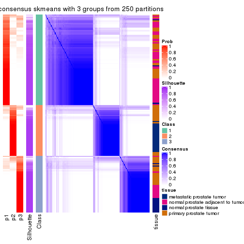</p>

</div>
<div id='tab-CV-skmeans-consensus-heatmap-3'>
<pre><code class="r">consensus_heatmap(res, k = 4)
</code></pre>

<p>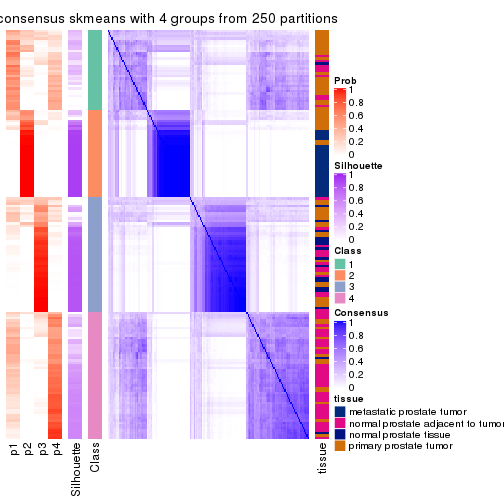</p>

</div>
<div id='tab-CV-skmeans-consensus-heatmap-4'>
<pre><code class="r">consensus_heatmap(res, k = 5)
</code></pre>

<p>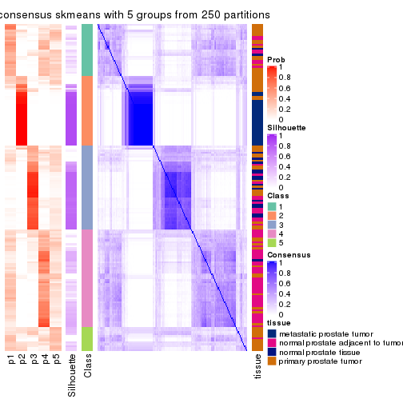</p>

</div>
<div id='tab-CV-skmeans-consensus-heatmap-5'>
<pre><code class="r">consensus_heatmap(res, k = 6)
</code></pre>

<p>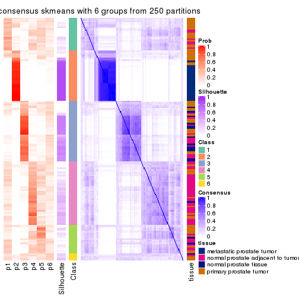</p>

</div>
</div>

Heatmaps for the membership of samples in all partitions to see how consistent they are:


<script>
$( function() {
	$( '#tabs-CV-skmeans-membership-heatmap' ).tabs();
} );
</script>
<div id='tabs-CV-skmeans-membership-heatmap'>
<ul>
<li><a href='#tab-CV-skmeans-membership-heatmap-1'>k = 2</a></li>
<li><a href='#tab-CV-skmeans-membership-heatmap-2'>k = 3</a></li>
<li><a href='#tab-CV-skmeans-membership-heatmap-3'>k = 4</a></li>
<li><a href='#tab-CV-skmeans-membership-heatmap-4'>k = 5</a></li>
<li><a href='#tab-CV-skmeans-membership-heatmap-5'>k = 6</a></li>
</ul>
<div id='tab-CV-skmeans-membership-heatmap-1'>
<pre><code class="r">membership_heatmap(res, k = 2)
</code></pre>

<p>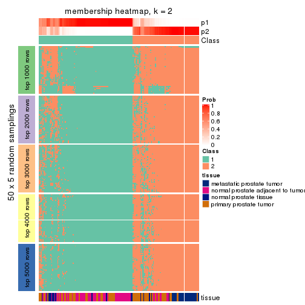</p>

</div>
<div id='tab-CV-skmeans-membership-heatmap-2'>
<pre><code class="r">membership_heatmap(res, k = 3)
</code></pre>

<p>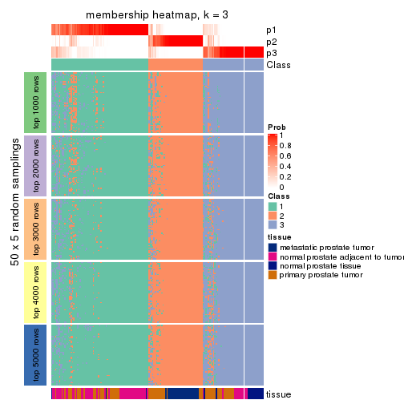</p>

</div>
<div id='tab-CV-skmeans-membership-heatmap-3'>
<pre><code class="r">membership_heatmap(res, k = 4)
</code></pre>

<p>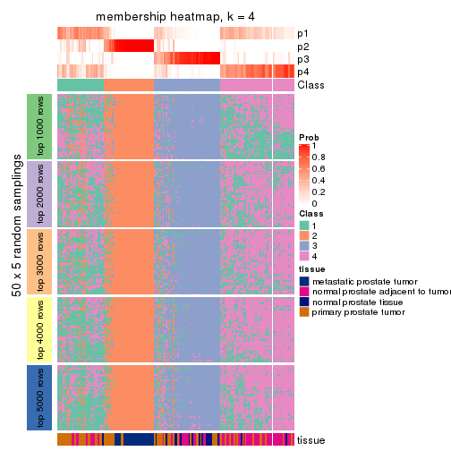</p>

</div>
<div id='tab-CV-skmeans-membership-heatmap-4'>
<pre><code class="r">membership_heatmap(res, k = 5)
</code></pre>

<p>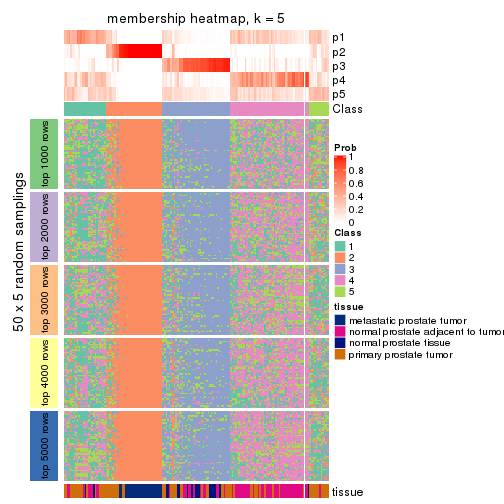</p>

</div>
<div id='tab-CV-skmeans-membership-heatmap-5'>
<pre><code class="r">membership_heatmap(res, k = 6)
</code></pre>

<p>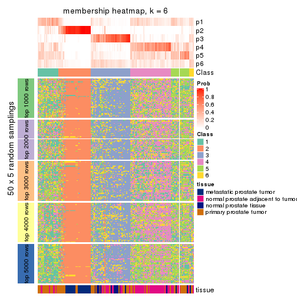</p>

</div>
</div>

As soon as we have had the classes for columns, we can look for signatures
which are significantly different between classes which can be candidate marks
for certain classes. Following are the heatmaps for signatures.


Signature heatmaps where rows are scaled:


<script>
$( function() {
	$( '#tabs-CV-skmeans-get-signatures' ).tabs();
} );
</script>
<div id='tabs-CV-skmeans-get-signatures'>
<ul>
<li><a href='#tab-CV-skmeans-get-signatures-1'>k = 2</a></li>
<li><a href='#tab-CV-skmeans-get-signatures-2'>k = 3</a></li>
<li><a href='#tab-CV-skmeans-get-signatures-3'>k = 4</a></li>
<li><a href='#tab-CV-skmeans-get-signatures-4'>k = 5</a></li>
<li><a href='#tab-CV-skmeans-get-signatures-5'>k = 6</a></li>
</ul>
<div id='tab-CV-skmeans-get-signatures-1'>
<pre><code class="r">get_signatures(res, k = 2)
</code></pre>

<p>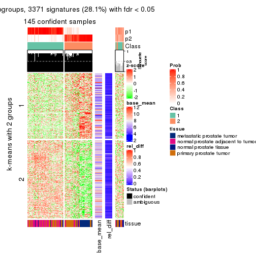</p>

</div>
<div id='tab-CV-skmeans-get-signatures-2'>
<pre><code class="r">get_signatures(res, k = 3)
</code></pre>

<p>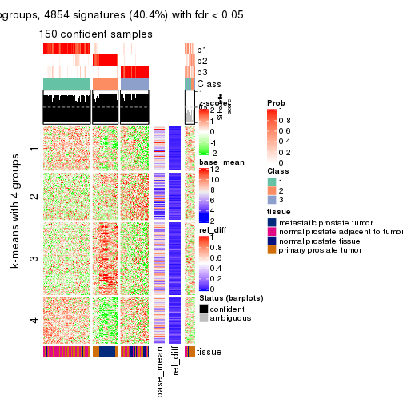</p>

</div>
<div id='tab-CV-skmeans-get-signatures-3'>
<pre><code class="r">get_signatures(res, k = 4)
</code></pre>

<p>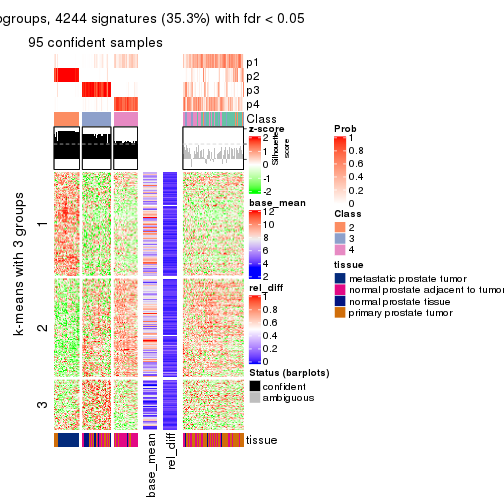</p>

</div>
<div id='tab-CV-skmeans-get-signatures-4'>
<pre><code class="r">get_signatures(res, k = 5)
</code></pre>

<p>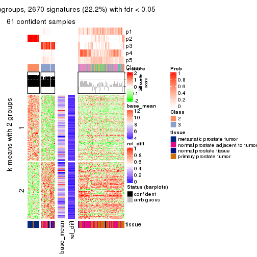</p>

</div>
<div id='tab-CV-skmeans-get-signatures-5'>
<pre><code class="r">get_signatures(res, k = 6)
</code></pre>

<p>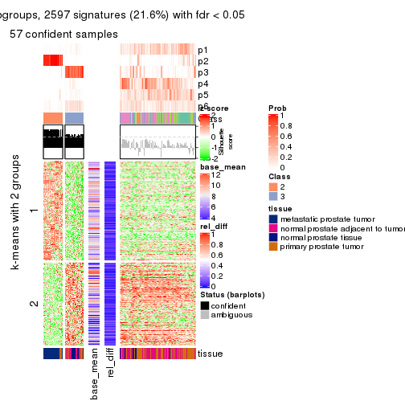</p>

</div>
</div>


Signature heatmaps where rows are not scaled:


<script>
$( function() {
	$( '#tabs-CV-skmeans-get-signatures-no-scale' ).tabs();
} );
</script>
<div id='tabs-CV-skmeans-get-signatures-no-scale'>
<ul>
<li><a href='#tab-CV-skmeans-get-signatures-no-scale-1'>k = 2</a></li>
<li><a href='#tab-CV-skmeans-get-signatures-no-scale-2'>k = 3</a></li>
<li><a href='#tab-CV-skmeans-get-signatures-no-scale-3'>k = 4</a></li>
<li><a href='#tab-CV-skmeans-get-signatures-no-scale-4'>k = 5</a></li>
<li><a href='#tab-CV-skmeans-get-signatures-no-scale-5'>k = 6</a></li>
</ul>
<div id='tab-CV-skmeans-get-signatures-no-scale-1'>
<pre><code class="r">get_signatures(res, k = 2, scale_rows = FALSE)
</code></pre>

<p>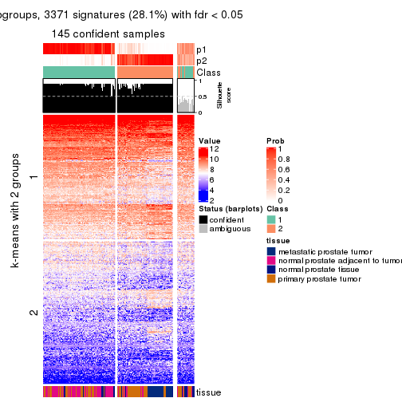</p>

</div>
<div id='tab-CV-skmeans-get-signatures-no-scale-2'>
<pre><code class="r">get_signatures(res, k = 3, scale_rows = FALSE)
</code></pre>

<p>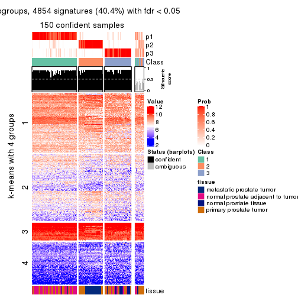</p>

</div>
<div id='tab-CV-skmeans-get-signatures-no-scale-3'>
<pre><code class="r">get_signatures(res, k = 4, scale_rows = FALSE)
</code></pre>

<p>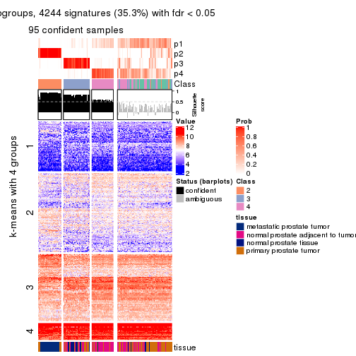</p>

</div>
<div id='tab-CV-skmeans-get-signatures-no-scale-4'>
<pre><code class="r">get_signatures(res, k = 5, scale_rows = FALSE)
</code></pre>

<p>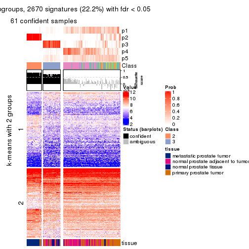</p>

</div>
<div id='tab-CV-skmeans-get-signatures-no-scale-5'>
<pre><code class="r">get_signatures(res, k = 6, scale_rows = FALSE)
</code></pre>

<p>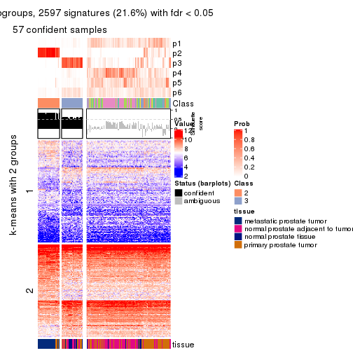</p>

</div>
</div>


Compare the overlap of signatures from different k:

```r
compare_signatures(res)
```

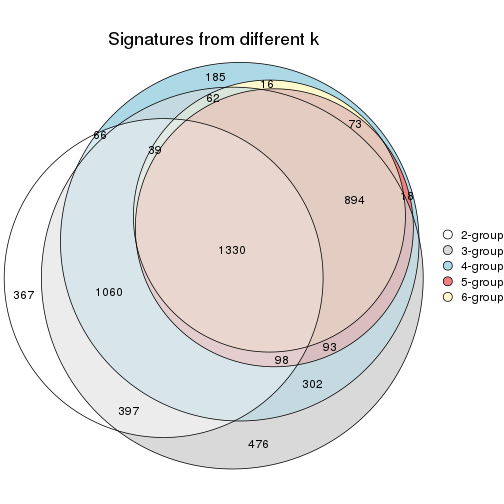

`get_signature()` returns a data frame invisibly. TO get the list of signatures, the function
call should be assigned to a variable explicitly. In following code, if `plot` argument is set
to `FALSE`, no heatmap is plotted while only the differential analysis is performed.

```r
# code only for demonstration
tb = get_signature(res, k = ..., plot = FALSE)
```

An example of the output of `tb` is:

```
#>   which_row         fdr    mean_1    mean_2 scaled_mean_1 scaled_mean_2 km
#> 1        38 0.042760348  8.373488  9.131774    -0.5533452     0.5164555  1
#> 2        40 0.018707592  7.106213  8.469186    -0.6173731     0.5762149  1
#> 3        55 0.019134737 10.221463 11.207825    -0.6159697     0.5749050  1
#> 4        59 0.006059896  5.921854  7.869574    -0.6899429     0.6439467  1
#> 5        60 0.018055526  8.928898 10.211722    -0.6204761     0.5791110  1
#> 6        98 0.009384629 15.714769 14.887706     0.6635654    -0.6193277  2
...
```

The columns in `tb` are:

1. `which_row`: row indices corresponding to the input matrix.
2. `fdr`: FDR for the differential test. 
3. `mean_x`: The mean value in group x.
4. `scaled_mean_x`: The mean value in group x after rows are scaled.
5. `km`: Row groups if k-means clustering is applied to rows.


UMAP plot which shows how samples are separated.


<script>
$( function() {
	$( '#tabs-CV-skmeans-dimension-reduction' ).tabs();
} );
</script>
<div id='tabs-CV-skmeans-dimension-reduction'>
<ul>
<li><a href='#tab-CV-skmeans-dimension-reduction-1'>k = 2</a></li>
<li><a href='#tab-CV-skmeans-dimension-reduction-2'>k = 3</a></li>
<li><a href='#tab-CV-skmeans-dimension-reduction-3'>k = 4</a></li>
<li><a href='#tab-CV-skmeans-dimension-reduction-4'>k = 5</a></li>
<li><a href='#tab-CV-skmeans-dimension-reduction-5'>k = 6</a></li>
</ul>
<div id='tab-CV-skmeans-dimension-reduction-1'>
<pre><code class="r">dimension_reduction(res, k = 2, method = &quot;UMAP&quot;)
</code></pre>

<p>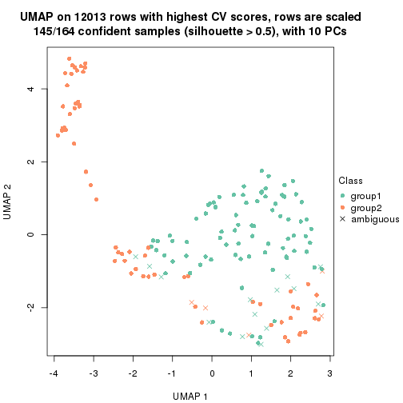</p>

</div>
<div id='tab-CV-skmeans-dimension-reduction-2'>
<pre><code class="r">dimension_reduction(res, k = 3, method = &quot;UMAP&quot;)
</code></pre>

<p>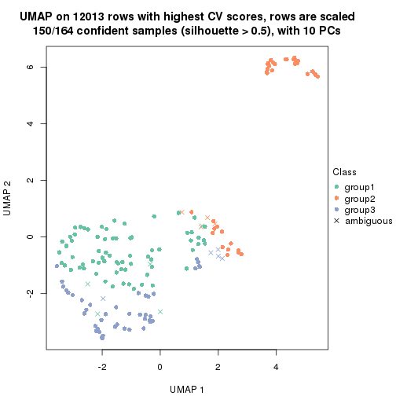</p>

</div>
<div id='tab-CV-skmeans-dimension-reduction-3'>
<pre><code class="r">dimension_reduction(res, k = 4, method = &quot;UMAP&quot;)
</code></pre>

<p>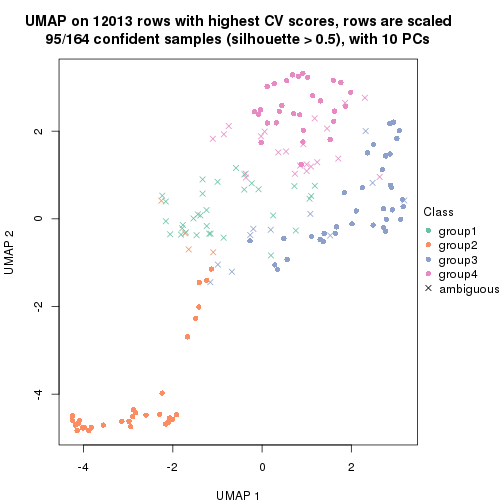</p>

</div>
<div id='tab-CV-skmeans-dimension-reduction-4'>
<pre><code class="r">dimension_reduction(res, k = 5, method = &quot;UMAP&quot;)
</code></pre>

<p>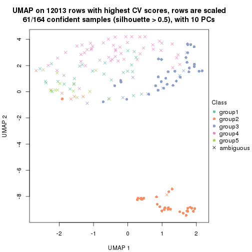</p>

</div>
<div id='tab-CV-skmeans-dimension-reduction-5'>
<pre><code class="r">dimension_reduction(res, k = 6, method = &quot;UMAP&quot;)
</code></pre>

<p>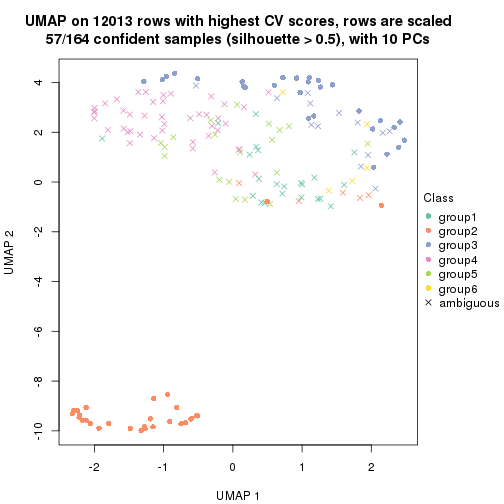</p>

</div>
</div>


Following heatmap shows how subgroups are split when increasing `k`:

```r
collect_classes(res)
```

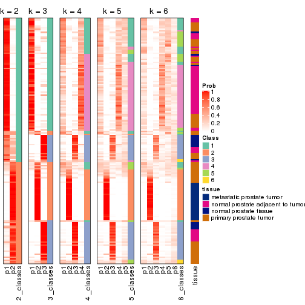


Test correlation between subgroups and known annotations. If the known
annotation is numeric, one-way ANOVA test is applied, and if the known
annotation is discrete, chi-squared contingency table test is applied.

```r
test_to_known_factors(res)
```

```
#>              n tissue(p) k
#> CV:skmeans 145  2.41e-11 2
#> CV:skmeans 150  2.73e-25 3
#> CV:skmeans  95  1.50e-18 4
#> CV:skmeans  61  3.46e-11 5
#> CV:skmeans  57  4.83e-10 6
```


If matrix rows can be associated to genes, consider to use `functional_enrichment(res,
...)` to perform function enrichment for the signature genes. See [this vignette](http://bioconductor.org/packages/devel/bioc/vignettes/cola/inst/doc/functional_enrichment.html) for more detailed explanations.


 

---------------------------------------------------


### CV:pam


The object with results only for a single top-value method and a single partition method 
can be extracted as:

```r
res = res_list["CV", "pam"]
# you can also extract it by
# res = res_list["CV:pam"]
```

A summary of `res` and all the functions that can be applied to it:

```r
res
```

```
#> A 'ConsensusPartition' object with k = 2, 3, 4, 5, 6.
#>   On a matrix with 12013 rows and 164 columns.
#>   Top rows (1000, 2000, 3000, 4000, 5000) are extracted by 'CV' method.
#>   Subgroups are detected by 'pam' method.
#>   Performed in total 1250 partitions by row resampling.
#>   Best k for subgroups seems to be 3.
#> 
#> Following methods can be applied to this 'ConsensusPartition' object:
#>  [1] "cola_report"             "collect_classes"         "collect_plots"          
#>  [4] "collect_stats"           "colnames"                "compare_signatures"     
#>  [7] "consensus_heatmap"       "dimension_reduction"     "functional_enrichment"  
#> [10] "get_anno_col"            "get_anno"                "get_classes"            
#> [13] "get_consensus"           "get_matrix"              "get_membership"         
#> [16] "get_param"               "get_signatures"          "get_stats"              
#> [19] "is_best_k"               "is_stable_k"             "membership_heatmap"     
#> [22] "ncol"                    "nrow"                    "plot_ecdf"              
#> [25] "rownames"                "select_partition_number" "show"                   
#> [28] "suggest_best_k"          "test_to_known_factors"
```

`collect_plots()` function collects all the plots made from `res` for all `k` (number of partitions)
into one single page to provide an easy and fast comparison between different `k`.

```r
collect_plots(res)
```

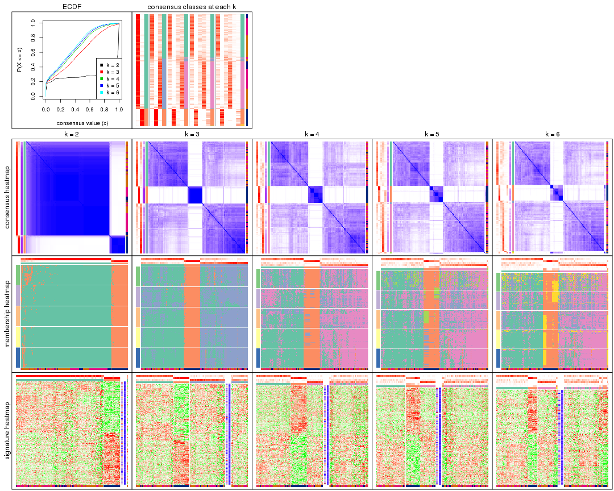

The plots are:

- The first row: a plot of the ECDF (empirical cumulative distribution
  function) curves of the consensus matrix for each `k` and the heatmap of
  predicted classes for each `k`.
- The second row: heatmaps of the consensus matrix for each `k`.
- The third row: heatmaps of the membership matrix for each `k`.
- The fouth row: heatmaps of the signatures for each `k`.

All the plots in panels can be made by individual functions and they are
plotted later in this section.

`select_partition_number()` produces several plots showing different
statistics for choosing "optimized" `k`. There are following statistics:

- ECDF curves of the consensus matrix for each `k`;
- 1-PAC. [The PAC
  score](https://en.wikipedia.org/wiki/Consensus_clustering#Over-interpretation_potential_of_consensus_clustering)
  measures the proportion of the ambiguous subgrouping.
- Mean silhouette score.
- Concordance. The mean probability of fiting the consensus class ids in all
  partitions.
- Area increased. Denote $A_k$ as the area under the ECDF curve for current
  `k`, the area increased is defined as $A_k - A_{k-1}$.
- Rand index. The percent of pairs of samples that are both in a same cluster
  or both are not in a same cluster in the partition of k and k-1.
- Jaccard index. The ratio of pairs of samples are both in a same cluster in
  the partition of k and k-1 and the pairs of samples are both in a same
  cluster in the partition k or k-1.

The detailed explanations of these statistics can be found in [the _cola_
vignette](http://bioconductor.org/packages/devel/bioc/vignettes/cola/inst/doc/cola.html#toc_13).

Generally speaking, lower PAC score, higher mean silhouette score or higher
concordance corresponds to better partition. Rand index and Jaccard index
measure how similar the current partition is compared to partition with `k-1`.
If they are too similar, we won't accept `k` is better than `k-1`.

```r
select_partition_number(res)
```

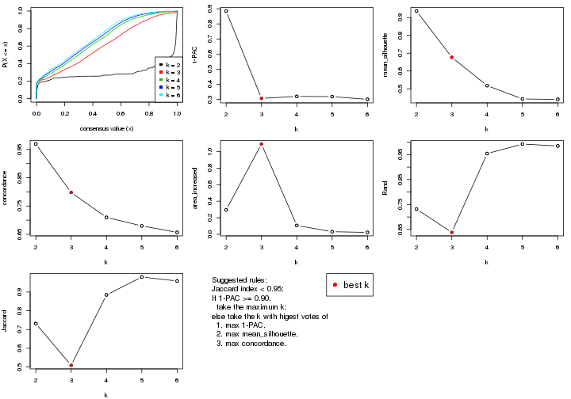

The numeric values for all these statistics can be obtained by `get_stats()`.

```r
get_stats(res)
```

```
#>   k 1-PAC mean_silhouette concordance area_increased  Rand Jaccard
#> 2 2 0.885           0.937       0.969         0.2950 0.732   0.732
#> 3 3 0.307           0.677       0.798         1.0915 0.638   0.509
#> 4 4 0.320           0.518       0.710         0.1065 0.954   0.885
#> 5 5 0.318           0.443       0.680         0.0312 0.993   0.980
#> 6 6 0.300           0.441       0.657         0.0233 0.985   0.959
```

`suggest_best_k()` suggests the best $k$ based on these statistics. The rules are as follows:

- All $k$ with Jaccard index larger than 0.95 are removed because increasing
  $k$ does not provide enough extra information. If all $k$ are removed, it is
  marked as no subgroup is detected.
- For all $k$ with 1-PAC score larger than 0.9, the maximal $k$ is taken as
  the best $k$, and other $k$ are marked as optional $k$.
- If it does not fit the second rule. The $k$ with the maximal vote of the
  highest 1-PAC score, highest mean silhouette, and highest concordance is
  taken as the best $k$.

```r
suggest_best_k(res)
```

```
#> [1] 3
```


Following shows the table of the partitions (You need to click the **show/hide
code output** link to see it). The membership matrix (columns with name `p*`)
is inferred by
[`clue::cl_consensus()`](https://www.rdocumentation.org/link/cl_consensus?package=clue)
function with the `SE` method. Basically the value in the membership matrix
represents the probability to belong to a certain group. The finall class
label for an item is determined with the group with highest probability it
belongs to.

In `get_classes()` function, the entropy is calculated from the membership
matrix and the silhouette score is calculated from the consensus matrix.


<script>
$( function() {
	$( '#tabs-CV-pam-get-classes' ).tabs();
} );
</script>
<div id='tabs-CV-pam-get-classes'>
<ul>
<li><a href='#tab-CV-pam-get-classes-1'>k = 2</a></li>
<li><a href='#tab-CV-pam-get-classes-2'>k = 3</a></li>
<li><a href='#tab-CV-pam-get-classes-3'>k = 4</a></li>
<li><a href='#tab-CV-pam-get-classes-4'>k = 5</a></li>
<li><a href='#tab-CV-pam-get-classes-5'>k = 6</a></li>
</ul>

<div id='tab-CV-pam-get-classes-1'>
<p><a id='tab-CV-pam-get-classes-1-a' style='color:#0366d6' href='#'>show/hide code output</a></p>
<pre><code class="r">cbind(get_classes(res, k = 2), get_membership(res, k = 2))
</code></pre>

<pre><code>#&gt;           class entropy silhouette    p1    p2
#&gt; GSM152839     1  0.0376     0.9689 0.996 0.004
#&gt; GSM152840     1  0.0376     0.9689 0.996 0.004
#&gt; GSM152841     1  0.0000     0.9687 1.000 0.000
#&gt; GSM152842     1  0.0376     0.9689 0.996 0.004
#&gt; GSM152843     1  0.0000     0.9687 1.000 0.000
#&gt; GSM152844     1  0.0000     0.9687 1.000 0.000
#&gt; GSM152845     1  0.0000     0.9687 1.000 0.000
#&gt; GSM152846     1  0.1633     0.9599 0.976 0.024
#&gt; GSM152847     1  0.0376     0.9680 0.996 0.004
#&gt; GSM152848     1  0.0938     0.9664 0.988 0.012
#&gt; GSM152849     1  0.0000     0.9687 1.000 0.000
#&gt; GSM152850     1  0.0672     0.9681 0.992 0.008
#&gt; GSM152851     1  0.1184     0.9642 0.984 0.016
#&gt; GSM152852     1  0.0376     0.9689 0.996 0.004
#&gt; GSM152853     1  0.0000     0.9687 1.000 0.000
#&gt; GSM152854     1  0.1843     0.9574 0.972 0.028
#&gt; GSM152855     1  0.0376     0.9689 0.996 0.004
#&gt; GSM153238     1  0.0000     0.9687 1.000 0.000
#&gt; GSM153239     1  0.0938     0.9668 0.988 0.012
#&gt; GSM153240     1  0.0376     0.9689 0.996 0.004
#&gt; GSM153241     1  0.0672     0.9682 0.992 0.008
#&gt; GSM153242     1  0.0672     0.9682 0.992 0.008
#&gt; GSM153243     1  0.2948     0.9348 0.948 0.052
#&gt; GSM153244     1  0.0938     0.9664 0.988 0.012
#&gt; GSM153245     1  0.0376     0.9689 0.996 0.004
#&gt; GSM153246     1  0.2423     0.9441 0.960 0.040
#&gt; GSM153247     1  0.0672     0.9664 0.992 0.008
#&gt; GSM153248     1  0.1184     0.9626 0.984 0.016
#&gt; GSM153249     1  0.0672     0.9664 0.992 0.008
#&gt; GSM153250     1  0.0000     0.9687 1.000 0.000
#&gt; GSM153251     1  0.0672     0.9666 0.992 0.008
#&gt; GSM153252     1  0.0376     0.9689 0.996 0.004
#&gt; GSM153253     1  0.0376     0.9689 0.996 0.004
#&gt; GSM153254     1  0.0000     0.9687 1.000 0.000
#&gt; GSM153255     1  0.0376     0.9689 0.996 0.004
#&gt; GSM153256     1  0.0000     0.9687 1.000 0.000
#&gt; GSM153257     1  0.0000     0.9687 1.000 0.000
#&gt; GSM153258     1  0.0000     0.9687 1.000 0.000
#&gt; GSM153259     1  0.0376     0.9680 0.996 0.004
#&gt; GSM153260     1  0.1633     0.9598 0.976 0.024
#&gt; GSM153261     1  0.0376     0.9689 0.996 0.004
#&gt; GSM153262     1  0.0376     0.9689 0.996 0.004
#&gt; GSM153263     1  0.0376     0.9689 0.996 0.004
#&gt; GSM153264     1  0.0376     0.9689 0.996 0.004
#&gt; GSM153265     1  0.0376     0.9689 0.996 0.004
#&gt; GSM153266     1  0.0376     0.9689 0.996 0.004
#&gt; GSM153267     1  0.0376     0.9689 0.996 0.004
#&gt; GSM153268     1  0.0000     0.9687 1.000 0.000
#&gt; GSM153269     1  0.0376     0.9689 0.996 0.004
#&gt; GSM153270     1  0.0000     0.9687 1.000 0.000
#&gt; GSM153271     1  0.0000     0.9687 1.000 0.000
#&gt; GSM153272     1  0.0376     0.9689 0.996 0.004
#&gt; GSM153273     1  0.1184     0.9624 0.984 0.016
#&gt; GSM153274     1  0.0000     0.9687 1.000 0.000
#&gt; GSM153275     1  0.0376     0.9689 0.996 0.004
#&gt; GSM153276     1  0.0376     0.9689 0.996 0.004
#&gt; GSM153277     1  0.0376     0.9689 0.996 0.004
#&gt; GSM153278     1  0.0000     0.9687 1.000 0.000
#&gt; GSM153279     1  0.0000     0.9687 1.000 0.000
#&gt; GSM153280     1  0.0376     0.9689 0.996 0.004
#&gt; GSM153281     1  0.0000     0.9687 1.000 0.000
#&gt; GSM153282     1  0.0672     0.9681 0.992 0.008
#&gt; GSM153283     1  0.0376     0.9689 0.996 0.004
#&gt; GSM153284     1  0.0672     0.9681 0.992 0.008
#&gt; GSM153285     1  0.0376     0.9689 0.996 0.004
#&gt; GSM153286     1  0.0000     0.9687 1.000 0.000
#&gt; GSM153287     1  0.0376     0.9689 0.996 0.004
#&gt; GSM153288     1  0.0376     0.9689 0.996 0.004
#&gt; GSM153289     1  0.0376     0.9689 0.996 0.004
#&gt; GSM153290     1  0.0376     0.9689 0.996 0.004
#&gt; GSM153291     1  0.0376     0.9689 0.996 0.004
#&gt; GSM153292     1  0.0376     0.9689 0.996 0.004
#&gt; GSM153293     1  0.0376     0.9689 0.996 0.004
#&gt; GSM153294     1  0.7528     0.7405 0.784 0.216
#&gt; GSM153295     1  0.0376     0.9689 0.996 0.004
#&gt; GSM153054     1  0.3733     0.9170 0.928 0.072
#&gt; GSM153055     1  0.0938     0.9666 0.988 0.012
#&gt; GSM153056     1  0.0376     0.9689 0.996 0.004
#&gt; GSM153057     1  0.0376     0.9689 0.996 0.004
#&gt; GSM153058     1  0.0000     0.9687 1.000 0.000
#&gt; GSM153059     1  0.0000     0.9687 1.000 0.000
#&gt; GSM153060     1  0.0000     0.9687 1.000 0.000
#&gt; GSM153061     1  0.0000     0.9687 1.000 0.000
#&gt; GSM153062     1  0.8555     0.6404 0.720 0.280
#&gt; GSM153063     1  0.1414     0.9597 0.980 0.020
#&gt; GSM153064     1  0.0672     0.9682 0.992 0.008
#&gt; GSM153065     1  0.4939     0.8871 0.892 0.108
#&gt; GSM153066     1  0.7528     0.7286 0.784 0.216
#&gt; GSM153067     1  0.1414     0.9600 0.980 0.020
#&gt; GSM153068     1  0.0000     0.9687 1.000 0.000
#&gt; GSM153069     1  0.0000     0.9687 1.000 0.000
#&gt; GSM153070     1  0.0000     0.9687 1.000 0.000
#&gt; GSM153071     1  0.0376     0.9679 0.996 0.004
#&gt; GSM153072     1  0.5178     0.8750 0.884 0.116
#&gt; GSM153073     1  0.0938     0.9644 0.988 0.012
#&gt; GSM153074     1  0.0000     0.9687 1.000 0.000
#&gt; GSM153075     1  0.0376     0.9689 0.996 0.004
#&gt; GSM153076     1  0.0376     0.9680 0.996 0.004
#&gt; GSM153077     1  0.1184     0.9622 0.984 0.016
#&gt; GSM153078     1  0.0000     0.9687 1.000 0.000
#&gt; GSM153079     1  0.0672     0.9681 0.992 0.008
#&gt; GSM153080     1  0.0376     0.9689 0.996 0.004
#&gt; GSM153081     1  0.0672     0.9681 0.992 0.008
#&gt; GSM153082     1  0.6531     0.8172 0.832 0.168
#&gt; GSM153083     1  0.5408     0.8670 0.876 0.124
#&gt; GSM153084     1  0.6531     0.8151 0.832 0.168
#&gt; GSM153085     1  0.0000     0.9687 1.000 0.000
#&gt; GSM153086     1  0.3584     0.9193 0.932 0.068
#&gt; GSM153087     1  0.0938     0.9643 0.988 0.012
#&gt; GSM153088     1  0.0000     0.9687 1.000 0.000
#&gt; GSM153089     1  0.0000     0.9687 1.000 0.000
#&gt; GSM153090     1  0.0000     0.9687 1.000 0.000
#&gt; GSM153091     2  0.9970     0.0907 0.468 0.532
#&gt; GSM153092     1  0.0000     0.9687 1.000 0.000
#&gt; GSM153093     1  0.1184     0.9647 0.984 0.016
#&gt; GSM153094     1  0.1843     0.9544 0.972 0.028
#&gt; GSM153095     1  0.0672     0.9667 0.992 0.008
#&gt; GSM153096     1  0.1633     0.9563 0.976 0.024
#&gt; GSM153097     1  0.3584     0.9208 0.932 0.068
#&gt; GSM153098     1  0.2043     0.9518 0.968 0.032
#&gt; GSM153099     1  0.0000     0.9687 1.000 0.000
#&gt; GSM153100     1  0.0376     0.9689 0.996 0.004
#&gt; GSM153101     1  0.0376     0.9689 0.996 0.004
#&gt; GSM153102     1  0.0376     0.9689 0.996 0.004
#&gt; GSM153103     1  0.0000     0.9687 1.000 0.000
#&gt; GSM153104     1  0.0000     0.9687 1.000 0.000
#&gt; GSM153106     1  0.0376     0.9689 0.996 0.004
#&gt; GSM153107     1  0.0376     0.9689 0.996 0.004
#&gt; GSM153108     1  0.0000     0.9687 1.000 0.000
#&gt; GSM153109     1  0.5059     0.8831 0.888 0.112
#&gt; GSM153110     1  0.3879     0.9133 0.924 0.076
#&gt; GSM153111     1  0.7376     0.7595 0.792 0.208
#&gt; GSM153112     1  0.4815     0.8918 0.896 0.104
#&gt; GSM153113     1  0.8861     0.5888 0.696 0.304
#&gt; GSM153114     1  0.0376     0.9689 0.996 0.004
#&gt; GSM187532     1  0.8813     0.5741 0.700 0.300
#&gt; GSM187533     1  0.8144     0.6864 0.748 0.252
#&gt; GSM187534     1  0.9944     0.1957 0.544 0.456
#&gt; GSM187535     1  0.5059     0.8810 0.888 0.112
#&gt; GSM152906     2  0.0376     0.9669 0.004 0.996
#&gt; GSM152907     2  0.0000     0.9673 0.000 1.000
#&gt; GSM152908     2  0.0000     0.9673 0.000 1.000
#&gt; GSM152909     2  0.0376     0.9669 0.004 0.996
#&gt; GSM152910     2  0.0000     0.9673 0.000 1.000
#&gt; GSM152911     2  0.0000     0.9673 0.000 1.000
#&gt; GSM152912     2  0.0376     0.9669 0.004 0.996
#&gt; GSM152913     2  0.0000     0.9673 0.000 1.000
#&gt; GSM152914     2  0.0000     0.9673 0.000 1.000
#&gt; GSM152915     2  0.0000     0.9673 0.000 1.000
#&gt; GSM152916     2  0.0376     0.9669 0.004 0.996
#&gt; GSM152917     2  0.0376     0.9669 0.004 0.996
#&gt; GSM152918     2  0.0376     0.9669 0.004 0.996
#&gt; GSM152919     2  0.0000     0.9673 0.000 1.000
#&gt; GSM152920     2  0.0000     0.9673 0.000 1.000
#&gt; GSM152921     2  0.0000     0.9673 0.000 1.000
#&gt; GSM152922     2  0.0000     0.9673 0.000 1.000
#&gt; GSM152923     2  0.0376     0.9669 0.004 0.996
#&gt; GSM152924     2  0.4431     0.8877 0.092 0.908
#&gt; GSM152925     2  0.0376     0.9669 0.004 0.996
#&gt; GSM152926     2  0.4022     0.9047 0.080 0.920
#&gt; GSM152927     2  0.0376     0.9669 0.004 0.996
#&gt; GSM152928     2  0.5178     0.8622 0.116 0.884
#&gt; GSM152929     2  0.0376     0.9669 0.004 0.996
#&gt; GSM152930     2  0.0000     0.9673 0.000 1.000
</code></pre>

<script>
$('#tab-CV-pam-get-classes-1-a').parent().next().next().hide();
$('#tab-CV-pam-get-classes-1-a').click(function(){
  $('#tab-CV-pam-get-classes-1-a').parent().next().next().toggle();
  return(false);
});
</script>
</div>

<div id='tab-CV-pam-get-classes-2'>
<p><a id='tab-CV-pam-get-classes-2-a' style='color:#0366d6' href='#'>show/hide code output</a></p>
<pre><code class="r">cbind(get_classes(res, k = 3), get_membership(res, k = 3))
</code></pre>

<pre><code>#&gt;           class entropy silhouette    p1    p2    p3
#&gt; GSM152839     1  0.5760     0.6209 0.672 0.000 0.328
#&gt; GSM152840     3  0.5254     0.6434 0.264 0.000 0.736
#&gt; GSM152841     1  0.5327     0.6838 0.728 0.000 0.272
#&gt; GSM152842     1  0.5810     0.5502 0.664 0.000 0.336
#&gt; GSM152843     1  0.2537     0.7656 0.920 0.000 0.080
#&gt; GSM152844     3  0.5968     0.5584 0.364 0.000 0.636
#&gt; GSM152845     3  0.1860     0.7358 0.052 0.000 0.948
#&gt; GSM152846     3  0.5650     0.6182 0.312 0.000 0.688
#&gt; GSM152847     1  0.3941     0.7754 0.844 0.000 0.156
#&gt; GSM152848     3  0.4974     0.5984 0.236 0.000 0.764
#&gt; GSM152849     3  0.4002     0.7221 0.160 0.000 0.840
#&gt; GSM152850     1  0.6298     0.5765 0.608 0.004 0.388
#&gt; GSM152851     3  0.3030     0.7365 0.092 0.004 0.904
#&gt; GSM152852     3  0.2356     0.7329 0.072 0.000 0.928
#&gt; GSM152853     3  0.5706     0.5861 0.320 0.000 0.680
#&gt; GSM152854     3  0.3031     0.7425 0.076 0.012 0.912
#&gt; GSM152855     3  0.1529     0.7290 0.040 0.000 0.960
#&gt; GSM153238     1  0.2959     0.7666 0.900 0.000 0.100
#&gt; GSM153239     3  0.6140     0.4665 0.404 0.000 0.596
#&gt; GSM153240     3  0.6008     0.4531 0.372 0.000 0.628
#&gt; GSM153241     3  0.5138     0.6645 0.252 0.000 0.748
#&gt; GSM153242     3  0.5591     0.5804 0.304 0.000 0.696
#&gt; GSM153243     1  0.5020     0.7139 0.796 0.012 0.192
#&gt; GSM153244     3  0.3686     0.7352 0.140 0.000 0.860
#&gt; GSM153245     1  0.6302     0.0409 0.520 0.000 0.480
#&gt; GSM153246     1  0.6410     0.1494 0.576 0.004 0.420
#&gt; GSM153247     1  0.1964     0.7428 0.944 0.000 0.056
#&gt; GSM153248     1  0.4293     0.7708 0.832 0.004 0.164
#&gt; GSM153249     1  0.2261     0.7503 0.932 0.000 0.068
#&gt; GSM153250     1  0.2959     0.7596 0.900 0.000 0.100
#&gt; GSM153251     1  0.4887     0.7162 0.772 0.000 0.228
#&gt; GSM153252     1  0.5859     0.6241 0.656 0.000 0.344
#&gt; GSM153253     3  0.4887     0.6740 0.228 0.000 0.772
#&gt; GSM153254     3  0.4750     0.7041 0.216 0.000 0.784
#&gt; GSM153255     1  0.4887     0.7371 0.772 0.000 0.228
#&gt; GSM153256     1  0.3038     0.7742 0.896 0.000 0.104
#&gt; GSM153257     1  0.2537     0.7568 0.920 0.000 0.080
#&gt; GSM153258     3  0.6008     0.3208 0.372 0.000 0.628
#&gt; GSM153259     3  0.5926     0.4999 0.356 0.000 0.644
#&gt; GSM153260     3  0.6667     0.4136 0.368 0.016 0.616
#&gt; GSM153261     3  0.3038     0.7358 0.104 0.000 0.896
#&gt; GSM153262     3  0.5098     0.6568 0.248 0.000 0.752
#&gt; GSM153263     3  0.5465     0.5250 0.288 0.000 0.712
#&gt; GSM153264     3  0.5706     0.4780 0.320 0.000 0.680
#&gt; GSM153265     3  0.1289     0.7334 0.032 0.000 0.968
#&gt; GSM153266     1  0.4931     0.7514 0.768 0.000 0.232
#&gt; GSM153267     1  0.5363     0.6899 0.724 0.000 0.276
#&gt; GSM153268     3  0.5016     0.6757 0.240 0.000 0.760
#&gt; GSM153269     1  0.5098     0.7412 0.752 0.000 0.248
#&gt; GSM153270     1  0.2711     0.7416 0.912 0.000 0.088
#&gt; GSM153271     1  0.2796     0.7499 0.908 0.000 0.092
#&gt; GSM153272     1  0.6045     0.5813 0.620 0.000 0.380
#&gt; GSM153273     1  0.5553     0.6724 0.724 0.004 0.272
#&gt; GSM153274     1  0.4887     0.7493 0.772 0.000 0.228
#&gt; GSM153275     3  0.5560     0.6209 0.300 0.000 0.700
#&gt; GSM153276     1  0.5835     0.6542 0.660 0.000 0.340
#&gt; GSM153277     3  0.1753     0.7359 0.048 0.000 0.952
#&gt; GSM153278     3  0.6154     0.4561 0.408 0.000 0.592
#&gt; GSM153279     3  0.6045     0.4275 0.380 0.000 0.620
#&gt; GSM153280     3  0.3412     0.7303 0.124 0.000 0.876
#&gt; GSM153281     1  0.6305     0.1070 0.516 0.000 0.484
#&gt; GSM153282     3  0.3879     0.7316 0.152 0.000 0.848
#&gt; GSM153283     1  0.5397     0.6814 0.720 0.000 0.280
#&gt; GSM153284     1  0.6192     0.4365 0.580 0.000 0.420
#&gt; GSM153285     3  0.6280     0.2193 0.460 0.000 0.540
#&gt; GSM153286     1  0.4750     0.7551 0.784 0.000 0.216
#&gt; GSM153287     1  0.3340     0.7728 0.880 0.000 0.120
#&gt; GSM153288     3  0.6309    -0.0793 0.500 0.000 0.500
#&gt; GSM153289     3  0.1289     0.7310 0.032 0.000 0.968
#&gt; GSM153290     3  0.1860     0.7357 0.052 0.000 0.948
#&gt; GSM153291     3  0.1411     0.7362 0.036 0.000 0.964
#&gt; GSM153292     3  0.5465     0.6392 0.288 0.000 0.712
#&gt; GSM153293     3  0.5327     0.5699 0.272 0.000 0.728
#&gt; GSM153294     1  0.6613     0.6898 0.740 0.072 0.188
#&gt; GSM153295     3  0.1031     0.7330 0.024 0.000 0.976
#&gt; GSM153054     1  0.2651     0.7285 0.928 0.012 0.060
#&gt; GSM153055     3  0.3482     0.7382 0.128 0.000 0.872
#&gt; GSM153056     1  0.5760     0.6454 0.672 0.000 0.328
#&gt; GSM153057     3  0.1860     0.7377 0.052 0.000 0.948
#&gt; GSM153058     1  0.5785     0.5148 0.668 0.000 0.332
#&gt; GSM153059     3  0.4504     0.7050 0.196 0.000 0.804
#&gt; GSM153060     1  0.2711     0.7594 0.912 0.000 0.088
#&gt; GSM153061     3  0.5785     0.6027 0.332 0.000 0.668
#&gt; GSM153062     3  0.9252     0.3245 0.372 0.160 0.468
#&gt; GSM153063     1  0.3752     0.7662 0.856 0.000 0.144
#&gt; GSM153064     1  0.5650     0.6794 0.688 0.000 0.312
#&gt; GSM153065     3  0.5566     0.7204 0.108 0.080 0.812
#&gt; GSM153066     3  0.9343     0.2873 0.348 0.176 0.476
#&gt; GSM153067     1  0.3686     0.7707 0.860 0.000 0.140
#&gt; GSM153068     3  0.6126     0.3394 0.400 0.000 0.600
#&gt; GSM153069     1  0.6008     0.4992 0.628 0.000 0.372
#&gt; GSM153070     1  0.4178     0.7630 0.828 0.000 0.172
#&gt; GSM153071     1  0.3941     0.7418 0.844 0.000 0.156
#&gt; GSM153072     1  0.3695     0.7698 0.880 0.012 0.108
#&gt; GSM153073     1  0.1964     0.7535 0.944 0.000 0.056
#&gt; GSM153074     1  0.6215     0.4681 0.572 0.000 0.428
#&gt; GSM153075     3  0.1411     0.7314 0.036 0.000 0.964
#&gt; GSM153076     1  0.3879     0.7665 0.848 0.000 0.152
#&gt; GSM153077     1  0.3412     0.7728 0.876 0.000 0.124
#&gt; GSM153078     3  0.4555     0.7148 0.200 0.000 0.800
#&gt; GSM153079     3  0.0592     0.7307 0.012 0.000 0.988
#&gt; GSM153080     3  0.4702     0.6923 0.212 0.000 0.788
#&gt; GSM153081     3  0.1753     0.7306 0.048 0.000 0.952
#&gt; GSM153082     3  0.7588     0.6422 0.196 0.120 0.684
#&gt; GSM153083     1  0.5778     0.7539 0.768 0.032 0.200
#&gt; GSM153084     3  0.8204     0.5196 0.316 0.096 0.588
#&gt; GSM153085     1  0.4702     0.7475 0.788 0.000 0.212
#&gt; GSM153086     1  0.5737     0.7093 0.732 0.012 0.256
#&gt; GSM153087     1  0.3112     0.7739 0.900 0.004 0.096
#&gt; GSM153088     1  0.3267     0.7633 0.884 0.000 0.116
#&gt; GSM153089     3  0.2796     0.7320 0.092 0.000 0.908
#&gt; GSM153090     1  0.3619     0.7632 0.864 0.000 0.136
#&gt; GSM153091     1  0.4399     0.7312 0.864 0.092 0.044
#&gt; GSM153092     3  0.5988     0.4551 0.368 0.000 0.632
#&gt; GSM153093     1  0.3619     0.7713 0.864 0.000 0.136
#&gt; GSM153094     3  0.6672    -0.1523 0.472 0.008 0.520
#&gt; GSM153095     1  0.5785     0.5292 0.668 0.000 0.332
#&gt; GSM153096     3  0.6154     0.4263 0.408 0.000 0.592
#&gt; GSM153097     1  0.7208     0.5509 0.620 0.040 0.340
#&gt; GSM153098     1  0.5797     0.6157 0.712 0.008 0.280
#&gt; GSM153099     1  0.6286     0.2512 0.536 0.000 0.464
#&gt; GSM153100     3  0.3116     0.7430 0.108 0.000 0.892
#&gt; GSM153101     3  0.2165     0.7299 0.064 0.000 0.936
#&gt; GSM153102     3  0.1289     0.7320 0.032 0.000 0.968
#&gt; GSM153103     1  0.4235     0.7608 0.824 0.000 0.176
#&gt; GSM153104     1  0.5835     0.4309 0.660 0.000 0.340
#&gt; GSM153106     3  0.0424     0.7305 0.008 0.000 0.992
#&gt; GSM153107     3  0.1031     0.7317 0.024 0.000 0.976
#&gt; GSM153108     3  0.3816     0.7361 0.148 0.000 0.852
#&gt; GSM153109     3  0.7184     0.5835 0.240 0.072 0.688
#&gt; GSM153110     1  0.3112     0.7468 0.916 0.028 0.056
#&gt; GSM153111     1  0.5236     0.7516 0.804 0.028 0.168
#&gt; GSM153112     1  0.7940     0.5458 0.592 0.076 0.332
#&gt; GSM153113     3  0.9425    -0.0668 0.392 0.176 0.432
#&gt; GSM153114     3  0.0592     0.7294 0.012 0.000 0.988
#&gt; GSM187532     3  0.7954     0.5763 0.148 0.192 0.660
#&gt; GSM187533     3  0.4731     0.6952 0.032 0.128 0.840
#&gt; GSM187534     3  0.6386     0.3373 0.004 0.412 0.584
#&gt; GSM187535     3  0.2152     0.7331 0.036 0.016 0.948
#&gt; GSM152906     2  0.0000     0.9793 0.000 1.000 0.000
#&gt; GSM152907     2  0.0000     0.9793 0.000 1.000 0.000
#&gt; GSM152908     2  0.0000     0.9793 0.000 1.000 0.000
#&gt; GSM152909     2  0.0424     0.9732 0.008 0.992 0.000
#&gt; GSM152910     2  0.0000     0.9793 0.000 1.000 0.000
#&gt; GSM152911     2  0.0000     0.9793 0.000 1.000 0.000
#&gt; GSM152912     2  0.0000     0.9793 0.000 1.000 0.000
#&gt; GSM152913     2  0.0000     0.9793 0.000 1.000 0.000
#&gt; GSM152914     2  0.0000     0.9793 0.000 1.000 0.000
#&gt; GSM152915     2  0.0000     0.9793 0.000 1.000 0.000
#&gt; GSM152916     2  0.0000     0.9793 0.000 1.000 0.000
#&gt; GSM152917     2  0.0000     0.9793 0.000 1.000 0.000
#&gt; GSM152918     2  0.0000     0.9793 0.000 1.000 0.000
#&gt; GSM152919     2  0.0000     0.9793 0.000 1.000 0.000
#&gt; GSM152920     2  0.0000     0.9793 0.000 1.000 0.000
#&gt; GSM152921     2  0.0000     0.9793 0.000 1.000 0.000
#&gt; GSM152922     2  0.0000     0.9793 0.000 1.000 0.000
#&gt; GSM152923     2  0.0000     0.9793 0.000 1.000 0.000
#&gt; GSM152924     2  0.4047     0.8150 0.004 0.848 0.148
#&gt; GSM152925     2  0.0237     0.9757 0.004 0.996 0.000
#&gt; GSM152926     2  0.4931     0.7974 0.140 0.828 0.032
#&gt; GSM152927     2  0.0000     0.9793 0.000 1.000 0.000
#&gt; GSM152928     2  0.4059     0.8393 0.012 0.860 0.128
#&gt; GSM152929     2  0.0000     0.9793 0.000 1.000 0.000
#&gt; GSM152930     2  0.0000     0.9793 0.000 1.000 0.000
</code></pre>

<script>
$('#tab-CV-pam-get-classes-2-a').parent().next().next().hide();
$('#tab-CV-pam-get-classes-2-a').click(function(){
  $('#tab-CV-pam-get-classes-2-a').parent().next().next().toggle();
  return(false);
});
</script>
</div>

<div id='tab-CV-pam-get-classes-3'>
<p><a id='tab-CV-pam-get-classes-3-a' style='color:#0366d6' href='#'>show/hide code output</a></p>
<pre><code class="r">cbind(get_classes(res, k = 4), get_membership(res, k = 4))
</code></pre>

<pre><code>#&gt;           class entropy silhouette    p1    p2    p3    p4
#&gt; GSM152839     1  0.6890    0.54177 0.580 0.000 0.152 0.268
#&gt; GSM152840     4  0.6650    0.37210 0.200 0.000 0.176 0.624
#&gt; GSM152841     1  0.6885    0.54009 0.588 0.000 0.164 0.248
#&gt; GSM152842     1  0.7441    0.40013 0.468 0.000 0.352 0.180
#&gt; GSM152843     1  0.3383    0.69451 0.872 0.000 0.052 0.076
#&gt; GSM152844     4  0.6315    0.17322 0.064 0.000 0.396 0.540
#&gt; GSM152845     4  0.4405    0.48326 0.048 0.000 0.152 0.800
#&gt; GSM152846     4  0.6587    0.25346 0.100 0.000 0.324 0.576
#&gt; GSM152847     1  0.3278    0.69251 0.864 0.000 0.020 0.116
#&gt; GSM152848     4  0.7196    0.23562 0.212 0.000 0.236 0.552
#&gt; GSM152849     4  0.3999    0.52738 0.140 0.000 0.036 0.824
#&gt; GSM152850     1  0.6264    0.50502 0.560 0.000 0.064 0.376
#&gt; GSM152851     4  0.4245    0.52550 0.064 0.000 0.116 0.820
#&gt; GSM152852     4  0.3335    0.52766 0.020 0.000 0.120 0.860
#&gt; GSM152853     4  0.6823    0.36090 0.196 0.000 0.200 0.604
#&gt; GSM152854     4  0.4108    0.53396 0.052 0.012 0.092 0.844
#&gt; GSM152855     4  0.2089    0.52298 0.020 0.000 0.048 0.932
#&gt; GSM153238     1  0.5404    0.65206 0.700 0.000 0.248 0.052
#&gt; GSM153239     4  0.7472    0.20331 0.264 0.000 0.232 0.504
#&gt; GSM153240     4  0.5632    0.30290 0.340 0.000 0.036 0.624
#&gt; GSM153241     4  0.6118    0.39051 0.208 0.000 0.120 0.672
#&gt; GSM153242     4  0.5910    0.32361 0.244 0.000 0.084 0.672
#&gt; GSM153243     1  0.6245    0.61438 0.668 0.000 0.164 0.168
#&gt; GSM153244     4  0.3745    0.52883 0.088 0.000 0.060 0.852
#&gt; GSM153245     4  0.7846   -0.01527 0.336 0.000 0.272 0.392
#&gt; GSM153246     4  0.7869   -0.08537 0.276 0.000 0.356 0.368
#&gt; GSM153247     1  0.2813    0.66723 0.896 0.000 0.080 0.024
#&gt; GSM153248     1  0.6513    0.64696 0.656 0.008 0.212 0.124
#&gt; GSM153249     1  0.4630    0.64949 0.768 0.000 0.196 0.036
#&gt; GSM153250     1  0.1661    0.66528 0.944 0.000 0.004 0.052
#&gt; GSM153251     1  0.5759    0.61649 0.688 0.000 0.080 0.232
#&gt; GSM153252     1  0.7093    0.59827 0.568 0.000 0.220 0.212
#&gt; GSM153253     4  0.7128    0.27248 0.184 0.000 0.260 0.556
#&gt; GSM153254     4  0.6346    0.41670 0.192 0.000 0.152 0.656
#&gt; GSM153255     1  0.5427    0.67591 0.736 0.000 0.100 0.164
#&gt; GSM153256     1  0.4636    0.69522 0.792 0.000 0.140 0.068
#&gt; GSM153257     1  0.1724    0.66324 0.948 0.000 0.020 0.032
#&gt; GSM153258     4  0.6135    0.16151 0.376 0.000 0.056 0.568
#&gt; GSM153259     4  0.7388    0.16966 0.304 0.000 0.192 0.504
#&gt; GSM153260     4  0.7550    0.15435 0.324 0.016 0.140 0.520
#&gt; GSM153261     4  0.5195    0.42423 0.032 0.000 0.276 0.692
#&gt; GSM153262     4  0.5891    0.44361 0.168 0.000 0.132 0.700
#&gt; GSM153263     4  0.6435    0.34265 0.224 0.000 0.136 0.640
#&gt; GSM153264     4  0.7079    0.24088 0.276 0.000 0.168 0.556
#&gt; GSM153265     4  0.2593    0.52229 0.016 0.000 0.080 0.904
#&gt; GSM153266     1  0.7054    0.56120 0.536 0.000 0.320 0.144
#&gt; GSM153267     1  0.6917    0.56518 0.568 0.000 0.144 0.288
#&gt; GSM153268     4  0.6056    0.42906 0.092 0.000 0.248 0.660
#&gt; GSM153269     1  0.5106    0.66221 0.720 0.000 0.040 0.240
#&gt; GSM153270     1  0.4153    0.66733 0.820 0.000 0.132 0.048
#&gt; GSM153271     1  0.1706    0.65484 0.948 0.000 0.016 0.036
#&gt; GSM153272     1  0.7002    0.57624 0.568 0.000 0.164 0.268
#&gt; GSM153273     1  0.6871    0.59315 0.592 0.000 0.240 0.168
#&gt; GSM153274     1  0.5346    0.67407 0.732 0.000 0.076 0.192
#&gt; GSM153275     4  0.5995    0.33772 0.256 0.000 0.084 0.660
#&gt; GSM153276     1  0.6079    0.61898 0.628 0.000 0.072 0.300
#&gt; GSM153277     4  0.3497    0.52268 0.024 0.000 0.124 0.852
#&gt; GSM153278     4  0.6784    0.11740 0.368 0.000 0.104 0.528
#&gt; GSM153279     4  0.7520    0.09880 0.280 0.000 0.228 0.492
#&gt; GSM153280     4  0.3732    0.53159 0.092 0.000 0.056 0.852
#&gt; GSM153281     1  0.7629    0.16906 0.404 0.000 0.204 0.392
#&gt; GSM153282     4  0.5857    0.34516 0.056 0.000 0.308 0.636
#&gt; GSM153283     1  0.7397    0.54243 0.508 0.000 0.292 0.200
#&gt; GSM153284     1  0.7324    0.52691 0.532 0.000 0.228 0.240
#&gt; GSM153285     4  0.7584    0.06174 0.348 0.000 0.204 0.448
#&gt; GSM153286     1  0.4387    0.69256 0.804 0.000 0.052 0.144
#&gt; GSM153287     1  0.5619    0.62686 0.676 0.000 0.268 0.056
#&gt; GSM153288     1  0.7619    0.08964 0.436 0.000 0.208 0.356
#&gt; GSM153289     4  0.2489    0.52228 0.020 0.000 0.068 0.912
#&gt; GSM153290     4  0.3082    0.53932 0.032 0.000 0.084 0.884
#&gt; GSM153291     4  0.3542    0.51007 0.028 0.000 0.120 0.852
#&gt; GSM153292     4  0.7212    0.16440 0.160 0.000 0.324 0.516
#&gt; GSM153293     4  0.6946    0.30003 0.200 0.000 0.212 0.588
#&gt; GSM153294     1  0.6219    0.65641 0.724 0.044 0.084 0.148
#&gt; GSM153295     4  0.1902    0.53480 0.004 0.000 0.064 0.932
#&gt; GSM153054     1  0.2402    0.65243 0.912 0.000 0.076 0.012
#&gt; GSM153055     4  0.5058    0.50583 0.104 0.000 0.128 0.768
#&gt; GSM153056     1  0.6309    0.54376 0.588 0.000 0.076 0.336
#&gt; GSM153057     4  0.2227    0.53630 0.036 0.000 0.036 0.928
#&gt; GSM153058     1  0.5830    0.36737 0.620 0.000 0.048 0.332
#&gt; GSM153059     4  0.6324    0.41253 0.168 0.000 0.172 0.660
#&gt; GSM153060     1  0.5021    0.65280 0.756 0.000 0.180 0.064
#&gt; GSM153061     3  0.6928   -0.22056 0.108 0.000 0.456 0.436
#&gt; GSM153062     3  0.8578    0.36175 0.144 0.128 0.540 0.188
#&gt; GSM153063     1  0.5851    0.61861 0.680 0.000 0.236 0.084
#&gt; GSM153064     1  0.7384    0.53702 0.476 0.000 0.352 0.172
#&gt; GSM153065     4  0.6714    0.33670 0.044 0.064 0.236 0.656
#&gt; GSM153066     3  0.9649    0.30225 0.204 0.152 0.352 0.292
#&gt; GSM153067     1  0.5351    0.67984 0.744 0.000 0.152 0.104
#&gt; GSM153068     4  0.7808   -0.00300 0.272 0.000 0.312 0.416
#&gt; GSM153069     1  0.7805    0.29043 0.420 0.000 0.280 0.300
#&gt; GSM153070     1  0.3694    0.68396 0.844 0.000 0.032 0.124
#&gt; GSM153071     1  0.6091    0.55846 0.596 0.000 0.344 0.060
#&gt; GSM153072     1  0.3962    0.69665 0.844 0.004 0.052 0.100
#&gt; GSM153073     1  0.2111    0.66984 0.932 0.000 0.044 0.024
#&gt; GSM153074     1  0.6314    0.40165 0.560 0.000 0.068 0.372
#&gt; GSM153075     4  0.2002    0.52890 0.020 0.000 0.044 0.936
#&gt; GSM153076     1  0.4605    0.69253 0.796 0.000 0.072 0.132
#&gt; GSM153077     1  0.5410    0.67332 0.728 0.000 0.192 0.080
#&gt; GSM153078     4  0.5375    0.45974 0.140 0.000 0.116 0.744
#&gt; GSM153079     4  0.2412    0.51347 0.008 0.000 0.084 0.908
#&gt; GSM153080     4  0.6435    0.37498 0.136 0.000 0.224 0.640
#&gt; GSM153081     4  0.3013    0.51628 0.032 0.000 0.080 0.888
#&gt; GSM153082     4  0.8050    0.09077 0.128 0.044 0.336 0.492
#&gt; GSM153083     1  0.5501    0.68055 0.748 0.020 0.056 0.176
#&gt; GSM153084     4  0.8475    0.18716 0.240 0.076 0.164 0.520
#&gt; GSM153085     1  0.6761    0.60394 0.608 0.000 0.168 0.224
#&gt; GSM153086     1  0.6036    0.64173 0.692 0.012 0.076 0.220
#&gt; GSM153087     1  0.4626    0.69633 0.804 0.004 0.120 0.072
#&gt; GSM153088     1  0.1978    0.67230 0.928 0.000 0.004 0.068
#&gt; GSM153089     4  0.4364    0.44416 0.016 0.000 0.220 0.764
#&gt; GSM153090     1  0.3674    0.69073 0.848 0.000 0.036 0.116
#&gt; GSM153091     1  0.5255    0.64844 0.788 0.064 0.112 0.036
#&gt; GSM153092     4  0.7095    0.15867 0.260 0.000 0.180 0.560
#&gt; GSM153093     1  0.3634    0.68687 0.856 0.000 0.048 0.096
#&gt; GSM153094     4  0.7523   -0.07994 0.392 0.008 0.144 0.456
#&gt; GSM153095     1  0.7102    0.32386 0.548 0.000 0.164 0.288
#&gt; GSM153096     4  0.7290    0.11458 0.328 0.000 0.168 0.504
#&gt; GSM153097     1  0.7427    0.54382 0.568 0.012 0.204 0.216
#&gt; GSM153098     1  0.7340    0.49144 0.580 0.012 0.208 0.200
#&gt; GSM153099     1  0.6980    0.30785 0.484 0.000 0.116 0.400
#&gt; GSM153100     4  0.4940    0.51945 0.096 0.000 0.128 0.776
#&gt; GSM153101     4  0.3708    0.47718 0.020 0.000 0.148 0.832
#&gt; GSM153102     4  0.2401    0.51048 0.004 0.000 0.092 0.904
#&gt; GSM153103     1  0.5010    0.68092 0.772 0.000 0.108 0.120
#&gt; GSM153104     1  0.6428    0.38798 0.624 0.000 0.112 0.264
#&gt; GSM153106     4  0.1576    0.51708 0.004 0.000 0.048 0.948
#&gt; GSM153107     4  0.1767    0.52509 0.012 0.000 0.044 0.944
#&gt; GSM153108     4  0.5369    0.50778 0.112 0.000 0.144 0.744
#&gt; GSM153109     4  0.7179    0.28916 0.224 0.072 0.068 0.636
#&gt; GSM153110     1  0.3768    0.65174 0.848 0.008 0.120 0.024
#&gt; GSM153111     1  0.7087    0.61655 0.588 0.008 0.256 0.148
#&gt; GSM153112     1  0.8567    0.42509 0.468 0.048 0.236 0.248
#&gt; GSM153113     4  0.9558   -0.18968 0.316 0.128 0.216 0.340
#&gt; GSM153114     4  0.0707    0.52042 0.000 0.000 0.020 0.980
#&gt; GSM187532     4  0.8362   -0.00506 0.120 0.172 0.144 0.564
#&gt; GSM187533     4  0.4241    0.43735 0.012 0.124 0.036 0.828
#&gt; GSM187534     4  0.6907   -0.13799 0.008 0.376 0.088 0.528
#&gt; GSM187535     4  0.2405    0.52416 0.020 0.016 0.036 0.928
#&gt; GSM152906     2  0.1302    0.93266 0.000 0.956 0.044 0.000
#&gt; GSM152907     2  0.0000    0.93736 0.000 1.000 0.000 0.000
#&gt; GSM152908     2  0.2281    0.91332 0.000 0.904 0.096 0.000
#&gt; GSM152909     2  0.2868    0.90804 0.000 0.864 0.136 0.000
#&gt; GSM152910     2  0.2281    0.91332 0.000 0.904 0.096 0.000
#&gt; GSM152911     2  0.0000    0.93736 0.000 1.000 0.000 0.000
#&gt; GSM152912     2  0.2281    0.91332 0.000 0.904 0.096 0.000
#&gt; GSM152913     2  0.1302    0.93694 0.000 0.956 0.044 0.000
#&gt; GSM152914     2  0.0000    0.93736 0.000 1.000 0.000 0.000
#&gt; GSM152915     2  0.0000    0.93736 0.000 1.000 0.000 0.000
#&gt; GSM152916     2  0.1557    0.93371 0.000 0.944 0.056 0.000
#&gt; GSM152917     2  0.0000    0.93736 0.000 1.000 0.000 0.000
#&gt; GSM152918     2  0.0000    0.93736 0.000 1.000 0.000 0.000
#&gt; GSM152919     2  0.0000    0.93736 0.000 1.000 0.000 0.000
#&gt; GSM152920     2  0.2281    0.91332 0.000 0.904 0.096 0.000
#&gt; GSM152921     2  0.2281    0.91332 0.000 0.904 0.096 0.000
#&gt; GSM152922     2  0.2704    0.91387 0.000 0.876 0.124 0.000
#&gt; GSM152923     2  0.1302    0.93266 0.000 0.956 0.044 0.000
#&gt; GSM152924     2  0.4387    0.75670 0.000 0.804 0.052 0.144
#&gt; GSM152925     2  0.1389    0.93155 0.000 0.952 0.048 0.000
#&gt; GSM152926     2  0.5432    0.74418 0.136 0.768 0.072 0.024
#&gt; GSM152927     2  0.0817    0.93613 0.000 0.976 0.024 0.000
#&gt; GSM152928     2  0.4683    0.78343 0.008 0.808 0.084 0.100
#&gt; GSM152929     2  0.1302    0.93266 0.000 0.956 0.044 0.000
#&gt; GSM152930     2  0.1302    0.93266 0.000 0.956 0.044 0.000
</code></pre>

<script>
$('#tab-CV-pam-get-classes-3-a').parent().next().next().hide();
$('#tab-CV-pam-get-classes-3-a').click(function(){
  $('#tab-CV-pam-get-classes-3-a').parent().next().next().toggle();
  return(false);
});
</script>
</div>

<div id='tab-CV-pam-get-classes-4'>
<p><a id='tab-CV-pam-get-classes-4-a' style='color:#0366d6' href='#'>show/hide code output</a></p>
<pre><code class="r">cbind(get_classes(res, k = 5), get_membership(res, k = 5))
</code></pre>

<pre><code>#&gt;           class entropy silhouette    p1    p2    p3    p4    p5
#&gt; GSM152839     1  0.7447     0.4512 0.504 0.000 0.152 0.252 0.092
#&gt; GSM152840     4  0.6381     0.3522 0.180 0.000 0.160 0.620 0.040
#&gt; GSM152841     1  0.6434     0.4737 0.556 0.000 0.180 0.252 0.012
#&gt; GSM152842     1  0.6637     0.3336 0.452 0.000 0.368 0.172 0.008
#&gt; GSM152843     1  0.3859     0.6732 0.836 0.000 0.060 0.068 0.036
#&gt; GSM152844     4  0.5526     0.2068 0.044 0.000 0.404 0.540 0.012
#&gt; GSM152845     4  0.4516     0.4877 0.024 0.000 0.144 0.776 0.056
#&gt; GSM152846     4  0.5943     0.2704 0.088 0.000 0.336 0.564 0.012
#&gt; GSM152847     1  0.2908     0.6664 0.868 0.000 0.008 0.108 0.016
#&gt; GSM152848     4  0.7396     0.1102 0.184 0.000 0.232 0.508 0.076
#&gt; GSM152849     4  0.4482     0.5266 0.112 0.000 0.048 0.792 0.048
#&gt; GSM152850     1  0.6742     0.4627 0.516 0.000 0.084 0.340 0.060
#&gt; GSM152851     4  0.4253     0.5201 0.052 0.000 0.112 0.804 0.032
#&gt; GSM152852     4  0.3550     0.5234 0.020 0.000 0.100 0.844 0.036
#&gt; GSM152853     4  0.6394     0.3595 0.188 0.000 0.192 0.596 0.024
#&gt; GSM152854     4  0.4665     0.5263 0.036 0.008 0.096 0.792 0.068
#&gt; GSM152855     4  0.1934     0.5192 0.016 0.000 0.052 0.928 0.004
#&gt; GSM153238     1  0.4750     0.6155 0.692 0.000 0.260 0.044 0.004
#&gt; GSM153239     4  0.7521     0.1788 0.224 0.000 0.196 0.496 0.084
#&gt; GSM153240     4  0.5662     0.2878 0.324 0.000 0.056 0.600 0.020
#&gt; GSM153241     4  0.5887     0.3973 0.188 0.000 0.124 0.660 0.028
#&gt; GSM153242     4  0.5509     0.3459 0.228 0.000 0.088 0.668 0.016
#&gt; GSM153243     1  0.5496     0.5895 0.668 0.000 0.168 0.160 0.004
#&gt; GSM153244     4  0.3281     0.5300 0.092 0.000 0.060 0.848 0.000
#&gt; GSM153245     4  0.7096    -0.1300 0.332 0.000 0.276 0.380 0.012
#&gt; GSM153246     3  0.7284     0.4016 0.160 0.000 0.536 0.216 0.088
#&gt; GSM153247     1  0.2786     0.6463 0.884 0.000 0.084 0.020 0.012
#&gt; GSM153248     1  0.6659     0.5944 0.604 0.000 0.212 0.100 0.084
#&gt; GSM153249     1  0.4285     0.6196 0.752 0.000 0.208 0.032 0.008
#&gt; GSM153250     1  0.1830     0.6433 0.932 0.000 0.000 0.040 0.028
#&gt; GSM153251     1  0.5802     0.5661 0.664 0.000 0.080 0.216 0.040
#&gt; GSM153252     1  0.6708     0.5485 0.532 0.000 0.256 0.192 0.020
#&gt; GSM153253     4  0.6867     0.2307 0.180 0.000 0.244 0.540 0.036
#&gt; GSM153254     4  0.5682     0.4166 0.172 0.000 0.164 0.656 0.008
#&gt; GSM153255     1  0.5082     0.6549 0.732 0.000 0.096 0.152 0.020
#&gt; GSM153256     1  0.4680     0.6688 0.772 0.000 0.132 0.064 0.032
#&gt; GSM153257     1  0.1623     0.6395 0.948 0.000 0.016 0.020 0.016
#&gt; GSM153258     4  0.5508     0.1330 0.384 0.000 0.060 0.552 0.004
#&gt; GSM153259     4  0.7748     0.1213 0.228 0.000 0.204 0.468 0.100
#&gt; GSM153260     4  0.7949     0.0590 0.304 0.008 0.128 0.440 0.120
#&gt; GSM153261     4  0.4987     0.4081 0.024 0.000 0.280 0.672 0.024
#&gt; GSM153262     4  0.5778     0.4256 0.140 0.000 0.140 0.684 0.036
#&gt; GSM153263     4  0.7089     0.2414 0.204 0.000 0.156 0.560 0.080
#&gt; GSM153264     4  0.7710     0.0962 0.248 0.000 0.164 0.476 0.112
#&gt; GSM153265     4  0.2642     0.5247 0.008 0.000 0.104 0.880 0.008
#&gt; GSM153266     1  0.7224     0.4865 0.492 0.000 0.312 0.120 0.076
#&gt; GSM153267     1  0.6619     0.5131 0.548 0.000 0.144 0.280 0.028
#&gt; GSM153268     4  0.5649     0.4416 0.068 0.000 0.252 0.652 0.028
#&gt; GSM153269     1  0.4583     0.6412 0.740 0.000 0.044 0.204 0.012
#&gt; GSM153270     1  0.3478     0.6452 0.844 0.000 0.108 0.032 0.016
#&gt; GSM153271     1  0.1405     0.6280 0.956 0.000 0.016 0.020 0.008
#&gt; GSM153272     1  0.7096     0.5362 0.536 0.000 0.164 0.240 0.060
#&gt; GSM153273     1  0.6374     0.5501 0.560 0.000 0.264 0.164 0.012
#&gt; GSM153274     1  0.4940     0.6504 0.732 0.000 0.088 0.168 0.012
#&gt; GSM153275     4  0.5795     0.3431 0.236 0.000 0.100 0.644 0.020
#&gt; GSM153276     1  0.5891     0.5953 0.616 0.000 0.052 0.288 0.044
#&gt; GSM153277     4  0.3547     0.5199 0.016 0.000 0.144 0.824 0.016
#&gt; GSM153278     4  0.6302     0.1451 0.356 0.000 0.108 0.520 0.016
#&gt; GSM153279     4  0.6944     0.0732 0.260 0.000 0.232 0.488 0.020
#&gt; GSM153280     4  0.3631     0.5287 0.080 0.000 0.068 0.840 0.012
#&gt; GSM153281     1  0.7006     0.0805 0.380 0.000 0.232 0.376 0.012
#&gt; GSM153282     4  0.4941     0.3533 0.044 0.000 0.328 0.628 0.000
#&gt; GSM153283     1  0.7748     0.4618 0.460 0.000 0.264 0.172 0.104
#&gt; GSM153284     1  0.7334     0.4856 0.500 0.000 0.204 0.236 0.060
#&gt; GSM153285     4  0.7073    -0.0222 0.324 0.000 0.220 0.436 0.020
#&gt; GSM153286     1  0.4236     0.6710 0.796 0.000 0.040 0.136 0.028
#&gt; GSM153287     1  0.4797     0.5919 0.660 0.000 0.296 0.044 0.000
#&gt; GSM153288     1  0.7370    -0.0139 0.408 0.000 0.204 0.348 0.040
#&gt; GSM153289     4  0.2568     0.5175 0.016 0.000 0.092 0.888 0.004
#&gt; GSM153290     4  0.3369     0.5385 0.028 0.000 0.092 0.856 0.024
#&gt; GSM153291     4  0.3694     0.5121 0.020 0.000 0.132 0.824 0.024
#&gt; GSM153292     4  0.6380     0.0814 0.156 0.000 0.344 0.496 0.004
#&gt; GSM153293     4  0.6197     0.2395 0.192 0.000 0.232 0.572 0.004
#&gt; GSM153294     1  0.5991     0.6324 0.716 0.056 0.072 0.120 0.036
#&gt; GSM153295     4  0.1831     0.5345 0.000 0.000 0.076 0.920 0.004
#&gt; GSM153054     1  0.2266     0.6341 0.912 0.000 0.064 0.008 0.016
#&gt; GSM153055     4  0.5249     0.5066 0.088 0.000 0.120 0.740 0.052
#&gt; GSM153056     1  0.6152     0.5009 0.572 0.000 0.076 0.320 0.032
#&gt; GSM153057     4  0.3086     0.5341 0.016 0.000 0.048 0.876 0.060
#&gt; GSM153058     1  0.5976     0.3055 0.584 0.000 0.052 0.324 0.040
#&gt; GSM153059     4  0.6454     0.4132 0.092 0.000 0.160 0.640 0.108
#&gt; GSM153060     1  0.4964     0.6224 0.728 0.000 0.192 0.056 0.024
#&gt; GSM153061     3  0.6628    -0.1020 0.060 0.000 0.460 0.416 0.064
#&gt; GSM153062     5  0.8307    -0.0802 0.056 0.120 0.312 0.076 0.436
#&gt; GSM153063     1  0.5670     0.5688 0.644 0.000 0.256 0.080 0.020
#&gt; GSM153064     1  0.7289     0.4567 0.436 0.000 0.356 0.156 0.052
#&gt; GSM153065     4  0.6501     0.2920 0.024 0.048 0.248 0.620 0.060
#&gt; GSM153066     3  0.9805     0.3324 0.132 0.216 0.284 0.172 0.196
#&gt; GSM153067     1  0.4964     0.6465 0.736 0.000 0.160 0.088 0.016
#&gt; GSM153068     4  0.7823    -0.1388 0.248 0.000 0.308 0.376 0.068
#&gt; GSM153069     1  0.7410     0.1839 0.396 0.000 0.296 0.276 0.032
#&gt; GSM153070     1  0.3647     0.6626 0.840 0.000 0.028 0.100 0.032
#&gt; GSM153071     1  0.5862     0.5065 0.560 0.000 0.360 0.056 0.024
#&gt; GSM153072     1  0.4128     0.6762 0.816 0.000 0.052 0.096 0.036
#&gt; GSM153073     1  0.2617     0.6505 0.904 0.000 0.036 0.028 0.032
#&gt; GSM153074     1  0.5571     0.3939 0.576 0.000 0.072 0.348 0.004
#&gt; GSM153075     4  0.2897     0.5310 0.020 0.000 0.040 0.888 0.052
#&gt; GSM153076     1  0.4697     0.6693 0.776 0.000 0.064 0.120 0.040
#&gt; GSM153077     1  0.6184     0.6269 0.656 0.000 0.180 0.084 0.080
#&gt; GSM153078     4  0.6069     0.4182 0.112 0.000 0.116 0.680 0.092
#&gt; GSM153079     4  0.2392     0.5116 0.004 0.000 0.104 0.888 0.004
#&gt; GSM153080     4  0.6091     0.3458 0.112 0.000 0.236 0.624 0.028
#&gt; GSM153081     4  0.2947     0.5088 0.020 0.000 0.088 0.876 0.016
#&gt; GSM153082     4  0.7787    -0.0641 0.104 0.032 0.340 0.456 0.068
#&gt; GSM153083     1  0.4548     0.6543 0.752 0.004 0.076 0.168 0.000
#&gt; GSM153084     4  0.7960     0.1660 0.220 0.064 0.188 0.496 0.032
#&gt; GSM153085     1  0.6138     0.5702 0.596 0.000 0.188 0.208 0.008
#&gt; GSM153086     1  0.5730     0.6188 0.680 0.012 0.080 0.208 0.020
#&gt; GSM153087     1  0.5312     0.6684 0.744 0.004 0.112 0.052 0.088
#&gt; GSM153088     1  0.1740     0.6476 0.932 0.000 0.000 0.056 0.012
#&gt; GSM153089     4  0.3888     0.4586 0.008 0.000 0.228 0.756 0.008
#&gt; GSM153090     1  0.3051     0.6619 0.852 0.000 0.028 0.120 0.000
#&gt; GSM153091     1  0.5444     0.6298 0.752 0.048 0.116 0.040 0.044
#&gt; GSM153092     4  0.6876     0.1329 0.264 0.000 0.168 0.532 0.036
#&gt; GSM153093     1  0.4103     0.6661 0.820 0.000 0.036 0.080 0.064
#&gt; GSM153094     4  0.7318    -0.0804 0.360 0.012 0.152 0.444 0.032
#&gt; GSM153095     1  0.6859     0.2762 0.540 0.000 0.176 0.248 0.036
#&gt; GSM153096     4  0.7007     0.0800 0.320 0.000 0.180 0.472 0.028
#&gt; GSM153097     1  0.6888     0.4873 0.536 0.008 0.256 0.180 0.020
#&gt; GSM153098     1  0.6712     0.4525 0.580 0.008 0.200 0.188 0.024
#&gt; GSM153099     1  0.7573     0.2446 0.432 0.000 0.124 0.344 0.100
#&gt; GSM153100     4  0.4814     0.5096 0.076 0.000 0.152 0.752 0.020
#&gt; GSM153101     4  0.4222     0.4708 0.012 0.000 0.156 0.784 0.048
#&gt; GSM153102     4  0.2628     0.5159 0.000 0.000 0.088 0.884 0.028
#&gt; GSM153103     1  0.5782     0.6523 0.704 0.000 0.112 0.100 0.084
#&gt; GSM153104     1  0.5617     0.3579 0.620 0.000 0.124 0.256 0.000
#&gt; GSM153106     4  0.1518     0.5207 0.004 0.000 0.048 0.944 0.004
#&gt; GSM153107     4  0.1740     0.5252 0.012 0.000 0.056 0.932 0.000
#&gt; GSM153108     4  0.5678     0.4949 0.084 0.000 0.148 0.704 0.064
#&gt; GSM153109     4  0.6762     0.2925 0.220 0.068 0.064 0.620 0.028
#&gt; GSM153110     1  0.4466     0.6244 0.788 0.004 0.136 0.028 0.044
#&gt; GSM153111     1  0.6621     0.5769 0.560 0.004 0.272 0.140 0.024
#&gt; GSM153112     1  0.8441     0.3676 0.420 0.016 0.240 0.188 0.136
#&gt; GSM153113     4  0.8901    -0.2596 0.296 0.100 0.232 0.328 0.044
#&gt; GSM153114     4  0.0703     0.5227 0.000 0.000 0.024 0.976 0.000
#&gt; GSM187532     4  0.8361     0.0451 0.116 0.152 0.104 0.524 0.104
#&gt; GSM187533     4  0.4187     0.4462 0.008 0.096 0.044 0.820 0.032
#&gt; GSM187534     4  0.7237    -0.0636 0.004 0.288 0.100 0.520 0.088
#&gt; GSM187535     4  0.2388     0.5213 0.016 0.020 0.044 0.916 0.004
#&gt; GSM152906     2  0.4227     0.6529 0.000 0.580 0.000 0.000 0.420
#&gt; GSM152907     2  0.3928     0.7111 0.000 0.700 0.004 0.000 0.296
#&gt; GSM152908     2  0.0000     0.5522 0.000 1.000 0.000 0.000 0.000
#&gt; GSM152909     2  0.2233     0.5137 0.000 0.904 0.016 0.000 0.080
#&gt; GSM152910     2  0.0000     0.5522 0.000 1.000 0.000 0.000 0.000
#&gt; GSM152911     2  0.3928     0.7111 0.000 0.700 0.004 0.000 0.296
#&gt; GSM152912     2  0.0000     0.5522 0.000 1.000 0.000 0.000 0.000
#&gt; GSM152913     2  0.3766     0.6837 0.000 0.728 0.004 0.000 0.268
#&gt; GSM152914     2  0.3928     0.7111 0.000 0.700 0.004 0.000 0.296
#&gt; GSM152915     2  0.3928     0.7111 0.000 0.700 0.004 0.000 0.296
#&gt; GSM152916     2  0.4138     0.6531 0.000 0.616 0.000 0.000 0.384
#&gt; GSM152917     2  0.3928     0.7111 0.000 0.700 0.004 0.000 0.296
#&gt; GSM152918     2  0.3928     0.7111 0.000 0.700 0.004 0.000 0.296
#&gt; GSM152919     2  0.3928     0.7111 0.000 0.700 0.004 0.000 0.296
#&gt; GSM152920     2  0.0000     0.5522 0.000 1.000 0.000 0.000 0.000
#&gt; GSM152921     2  0.0000     0.5522 0.000 1.000 0.000 0.000 0.000
#&gt; GSM152922     2  0.1732     0.5321 0.000 0.920 0.000 0.000 0.080
#&gt; GSM152923     2  0.4227     0.6529 0.000 0.580 0.000 0.000 0.420
#&gt; GSM152924     2  0.6267     0.3507 0.000 0.496 0.008 0.120 0.376
#&gt; GSM152925     2  0.4489     0.6435 0.000 0.572 0.008 0.000 0.420
#&gt; GSM152926     2  0.6364     0.4214 0.088 0.572 0.008 0.024 0.308
#&gt; GSM152927     2  0.3966     0.6996 0.000 0.664 0.000 0.000 0.336
#&gt; GSM152928     5  0.6049    -0.6429 0.000 0.452 0.024 0.060 0.464
#&gt; GSM152929     2  0.4227     0.6529 0.000 0.580 0.000 0.000 0.420
#&gt; GSM152930     2  0.4227     0.6529 0.000 0.580 0.000 0.000 0.420
</code></pre>

<script>
$('#tab-CV-pam-get-classes-4-a').parent().next().next().hide();
$('#tab-CV-pam-get-classes-4-a').click(function(){
  $('#tab-CV-pam-get-classes-4-a').parent().next().next().toggle();
  return(false);
});
</script>
</div>

<div id='tab-CV-pam-get-classes-5'>
<p><a id='tab-CV-pam-get-classes-5-a' style='color:#0366d6' href='#'>show/hide code output</a></p>
<pre><code class="r">cbind(get_classes(res, k = 6), get_membership(res, k = 6))
</code></pre>

<pre><code>#&gt;           class entropy silhouette    p1    p2    p3    p4    p5    p6
#&gt; GSM152839     1  0.7237    0.49671 0.488 0.000 0.148 0.244 0.092 0.028
#&gt; GSM152840     4  0.6232    0.47056 0.172 0.000 0.136 0.612 0.064 0.016
#&gt; GSM152841     1  0.6136    0.51619 0.532 0.000 0.196 0.244 0.028 0.000
#&gt; GSM152842     1  0.6118    0.40580 0.436 0.000 0.392 0.156 0.008 0.008
#&gt; GSM152843     1  0.3685    0.68456 0.832 0.000 0.060 0.068 0.024 0.016
#&gt; GSM152844     4  0.5554    0.33795 0.044 0.000 0.388 0.528 0.028 0.012
#&gt; GSM152845     4  0.4799    0.51572 0.020 0.000 0.176 0.724 0.064 0.016
#&gt; GSM152846     4  0.5816    0.38519 0.084 0.000 0.324 0.556 0.024 0.012
#&gt; GSM152847     1  0.2774    0.67947 0.864 0.000 0.012 0.108 0.008 0.008
#&gt; GSM152848     4  0.7326    0.25540 0.188 0.000 0.244 0.468 0.056 0.044
#&gt; GSM152849     4  0.4277    0.57197 0.104 0.000 0.040 0.788 0.056 0.012
#&gt; GSM152850     1  0.6641    0.49626 0.492 0.000 0.108 0.320 0.068 0.012
#&gt; GSM152851     4  0.4326    0.55782 0.040 0.000 0.112 0.780 0.060 0.008
#&gt; GSM152852     4  0.3925    0.55295 0.008 0.000 0.096 0.796 0.092 0.008
#&gt; GSM152853     4  0.6242    0.45287 0.172 0.000 0.208 0.568 0.048 0.004
#&gt; GSM152854     4  0.4761    0.56024 0.024 0.008 0.108 0.764 0.072 0.024
#&gt; GSM152855     4  0.2367    0.54697 0.012 0.000 0.064 0.900 0.020 0.004
#&gt; GSM153238     1  0.4255    0.63048 0.692 0.000 0.272 0.020 0.004 0.012
#&gt; GSM153239     4  0.7111    0.34630 0.200 0.000 0.196 0.500 0.084 0.020
#&gt; GSM153240     4  0.5852    0.41313 0.288 0.000 0.064 0.584 0.056 0.008
#&gt; GSM153241     4  0.5663    0.47857 0.180 0.000 0.120 0.652 0.036 0.012
#&gt; GSM153242     4  0.5347    0.42637 0.204 0.000 0.108 0.660 0.016 0.012
#&gt; GSM153243     1  0.5497    0.61144 0.640 0.000 0.176 0.160 0.020 0.004
#&gt; GSM153244     4  0.3356    0.56626 0.084 0.000 0.068 0.836 0.004 0.008
#&gt; GSM153245     4  0.6634    0.00569 0.332 0.000 0.260 0.384 0.016 0.008
#&gt; GSM153246     3  0.6129   -0.24842 0.068 0.000 0.628 0.056 0.044 0.204
#&gt; GSM153247     1  0.2670    0.65831 0.880 0.000 0.084 0.012 0.008 0.016
#&gt; GSM153248     1  0.6538    0.60688 0.580 0.000 0.228 0.092 0.056 0.044
#&gt; GSM153249     1  0.3888    0.63429 0.740 0.000 0.224 0.028 0.008 0.000
#&gt; GSM153250     1  0.1722    0.65292 0.936 0.000 0.004 0.036 0.016 0.008
#&gt; GSM153251     1  0.5463    0.59703 0.656 0.000 0.084 0.216 0.012 0.032
#&gt; GSM153252     1  0.6413    0.59356 0.520 0.000 0.256 0.184 0.032 0.008
#&gt; GSM153253     4  0.6486    0.36864 0.172 0.000 0.264 0.520 0.024 0.020
#&gt; GSM153254     4  0.5558    0.47371 0.164 0.000 0.192 0.624 0.004 0.016
#&gt; GSM153255     1  0.5172    0.66451 0.704 0.000 0.108 0.136 0.048 0.004
#&gt; GSM153256     1  0.4966    0.67761 0.728 0.000 0.140 0.060 0.064 0.008
#&gt; GSM153257     1  0.1508    0.64981 0.948 0.000 0.016 0.020 0.012 0.004
#&gt; GSM153258     4  0.5196    0.23098 0.372 0.000 0.072 0.548 0.004 0.004
#&gt; GSM153259     4  0.7552    0.29096 0.196 0.000 0.208 0.460 0.100 0.036
#&gt; GSM153260     4  0.7616    0.21096 0.280 0.000 0.132 0.404 0.164 0.020
#&gt; GSM153261     4  0.4927    0.48128 0.020 0.000 0.276 0.656 0.036 0.012
#&gt; GSM153262     4  0.5795    0.49414 0.120 0.000 0.128 0.664 0.076 0.012
#&gt; GSM153263     4  0.7079    0.30875 0.180 0.000 0.184 0.500 0.128 0.008
#&gt; GSM153264     4  0.7491    0.22703 0.236 0.000 0.192 0.440 0.112 0.020
#&gt; GSM153265     4  0.2935    0.55704 0.004 0.000 0.112 0.852 0.028 0.004
#&gt; GSM153266     1  0.7077    0.53328 0.480 0.000 0.300 0.116 0.064 0.040
#&gt; GSM153267     1  0.6374    0.53572 0.524 0.000 0.148 0.284 0.032 0.012
#&gt; GSM153268     4  0.5666    0.51304 0.064 0.000 0.240 0.632 0.052 0.012
#&gt; GSM153269     1  0.4741    0.65796 0.708 0.000 0.048 0.200 0.044 0.000
#&gt; GSM153270     1  0.3510    0.65597 0.824 0.000 0.120 0.032 0.016 0.008
#&gt; GSM153271     1  0.1148    0.63846 0.960 0.000 0.020 0.016 0.000 0.004
#&gt; GSM153272     1  0.6971    0.57261 0.516 0.000 0.164 0.216 0.088 0.016
#&gt; GSM153273     1  0.5899    0.59841 0.560 0.000 0.284 0.128 0.004 0.024
#&gt; GSM153274     1  0.4810    0.66613 0.712 0.000 0.088 0.176 0.020 0.004
#&gt; GSM153275     4  0.5726    0.43776 0.228 0.000 0.116 0.620 0.024 0.012
#&gt; GSM153276     1  0.5370    0.62883 0.616 0.000 0.044 0.288 0.048 0.004
#&gt; GSM153277     4  0.3350    0.55532 0.012 0.000 0.156 0.812 0.004 0.016
#&gt; GSM153278     4  0.5895    0.29032 0.348 0.000 0.120 0.512 0.008 0.012
#&gt; GSM153279     4  0.6461    0.19976 0.240 0.000 0.272 0.464 0.008 0.016
#&gt; GSM153280     4  0.3975    0.55955 0.068 0.000 0.064 0.812 0.048 0.008
#&gt; GSM153281     4  0.6641   -0.12597 0.364 0.000 0.240 0.368 0.024 0.004
#&gt; GSM153282     4  0.4708    0.41902 0.040 0.000 0.356 0.596 0.008 0.000
#&gt; GSM153283     1  0.7706    0.47781 0.412 0.000 0.288 0.168 0.076 0.056
#&gt; GSM153284     1  0.7097    0.54420 0.492 0.000 0.196 0.228 0.040 0.044
#&gt; GSM153285     4  0.6571    0.16608 0.308 0.000 0.236 0.424 0.032 0.000
#&gt; GSM153286     1  0.4249    0.68367 0.776 0.000 0.048 0.116 0.060 0.000
#&gt; GSM153287     1  0.4776    0.61042 0.636 0.000 0.300 0.052 0.012 0.000
#&gt; GSM153288     1  0.7077    0.07786 0.388 0.000 0.208 0.344 0.040 0.020
#&gt; GSM153289     4  0.2715    0.54594 0.012 0.000 0.104 0.868 0.012 0.004
#&gt; GSM153290     4  0.3580    0.57064 0.016 0.000 0.096 0.824 0.060 0.004
#&gt; GSM153291     4  0.3964    0.54192 0.020 0.000 0.136 0.792 0.044 0.008
#&gt; GSM153292     4  0.5933    0.28365 0.152 0.000 0.344 0.492 0.008 0.004
#&gt; GSM153293     4  0.6046    0.35078 0.188 0.000 0.236 0.552 0.020 0.004
#&gt; GSM153294     1  0.5847    0.65496 0.704 0.044 0.076 0.108 0.024 0.044
#&gt; GSM153295     4  0.1757    0.56642 0.000 0.000 0.076 0.916 0.008 0.000
#&gt; GSM153054     1  0.2412    0.64448 0.892 0.000 0.080 0.004 0.012 0.012
#&gt; GSM153055     4  0.5100    0.54348 0.072 0.000 0.132 0.716 0.076 0.004
#&gt; GSM153056     1  0.6294    0.51809 0.532 0.000 0.084 0.316 0.052 0.016
#&gt; GSM153057     4  0.3469    0.56661 0.008 0.000 0.064 0.844 0.032 0.052
#&gt; GSM153058     1  0.5676    0.37033 0.572 0.000 0.064 0.324 0.020 0.020
#&gt; GSM153059     4  0.6329    0.48568 0.076 0.000 0.164 0.632 0.060 0.068
#&gt; GSM153060     1  0.5392    0.60874 0.668 0.000 0.216 0.052 0.016 0.048
#&gt; GSM153061     3  0.6104   -0.28904 0.052 0.000 0.484 0.388 0.008 0.068
#&gt; GSM153062     5  0.4554    0.00000 0.040 0.104 0.040 0.016 0.784 0.016
#&gt; GSM153063     1  0.6052    0.57172 0.600 0.000 0.244 0.088 0.016 0.052
#&gt; GSM153064     1  0.7342    0.49199 0.408 0.000 0.348 0.140 0.056 0.048
#&gt; GSM153065     4  0.6187    0.38740 0.016 0.036 0.276 0.592 0.044 0.036
#&gt; GSM153066     3  0.9168    0.20558 0.120 0.116 0.308 0.124 0.056 0.276
#&gt; GSM153067     1  0.5139    0.65712 0.708 0.000 0.156 0.080 0.048 0.008
#&gt; GSM153068     4  0.7149    0.03850 0.256 0.000 0.344 0.344 0.020 0.036
#&gt; GSM153069     1  0.7370    0.26748 0.356 0.000 0.312 0.252 0.064 0.016
#&gt; GSM153070     1  0.3169    0.67317 0.852 0.000 0.024 0.096 0.020 0.008
#&gt; GSM153071     1  0.5731    0.53833 0.544 0.000 0.356 0.044 0.044 0.012
#&gt; GSM153072     1  0.3920    0.69028 0.804 0.000 0.052 0.092 0.052 0.000
#&gt; GSM153073     1  0.2946    0.66405 0.880 0.000 0.044 0.024 0.032 0.020
#&gt; GSM153074     1  0.5117    0.45858 0.580 0.000 0.076 0.336 0.008 0.000
#&gt; GSM153075     4  0.3065    0.56261 0.012 0.000 0.048 0.852 0.088 0.000
#&gt; GSM153076     1  0.4633    0.68343 0.768 0.000 0.060 0.108 0.040 0.024
#&gt; GSM153077     1  0.5931    0.64607 0.648 0.000 0.188 0.076 0.056 0.032
#&gt; GSM153078     4  0.6217    0.47484 0.120 0.000 0.120 0.644 0.080 0.036
#&gt; GSM153079     4  0.2519    0.54063 0.004 0.000 0.124 0.864 0.004 0.004
#&gt; GSM153080     4  0.5669    0.43448 0.104 0.000 0.264 0.600 0.028 0.004
#&gt; GSM153081     4  0.3447    0.53262 0.016 0.000 0.112 0.832 0.028 0.012
#&gt; GSM153082     4  0.7455    0.09970 0.100 0.044 0.368 0.416 0.024 0.048
#&gt; GSM153083     1  0.4724    0.66851 0.716 0.000 0.100 0.168 0.008 0.008
#&gt; GSM153084     4  0.7235    0.33494 0.216 0.060 0.204 0.488 0.004 0.028
#&gt; GSM153085     1  0.5577    0.59157 0.572 0.000 0.212 0.212 0.000 0.004
#&gt; GSM153086     1  0.5806    0.63808 0.656 0.012 0.100 0.188 0.028 0.016
#&gt; GSM153087     1  0.5445    0.67788 0.720 0.004 0.116 0.052 0.044 0.064
#&gt; GSM153088     1  0.1686    0.65769 0.932 0.000 0.004 0.052 0.004 0.008
#&gt; GSM153089     4  0.3938    0.49463 0.008 0.000 0.244 0.728 0.008 0.012
#&gt; GSM153090     1  0.3024    0.67576 0.844 0.000 0.032 0.116 0.008 0.000
#&gt; GSM153091     1  0.5352    0.64966 0.732 0.044 0.116 0.040 0.056 0.012
#&gt; GSM153092     4  0.6508    0.27785 0.252 0.000 0.168 0.528 0.040 0.012
#&gt; GSM153093     1  0.3898    0.67889 0.808 0.000 0.028 0.076 0.084 0.004
#&gt; GSM153094     4  0.6854   -0.09527 0.356 0.012 0.168 0.428 0.016 0.020
#&gt; GSM153095     1  0.6614    0.37401 0.532 0.000 0.180 0.228 0.016 0.044
#&gt; GSM153096     4  0.6500    0.24718 0.312 0.000 0.192 0.464 0.024 0.008
#&gt; GSM153097     1  0.6536    0.53353 0.512 0.012 0.268 0.172 0.000 0.036
#&gt; GSM153098     1  0.6607    0.48752 0.560 0.008 0.196 0.184 0.028 0.024
#&gt; GSM153099     1  0.7396    0.25649 0.396 0.000 0.124 0.340 0.120 0.020
#&gt; GSM153100     4  0.4895    0.54777 0.060 0.000 0.160 0.716 0.064 0.000
#&gt; GSM153101     4  0.3777    0.52153 0.008 0.000 0.164 0.784 0.040 0.004
#&gt; GSM153102     4  0.2833    0.54426 0.000 0.000 0.104 0.860 0.012 0.024
#&gt; GSM153103     1  0.5636    0.67077 0.696 0.000 0.112 0.092 0.068 0.032
#&gt; GSM153104     1  0.5348    0.41623 0.608 0.000 0.136 0.248 0.008 0.000
#&gt; GSM153106     4  0.1719    0.54949 0.000 0.000 0.056 0.928 0.008 0.008
#&gt; GSM153107     4  0.1668    0.55495 0.008 0.000 0.060 0.928 0.000 0.004
#&gt; GSM153108     4  0.5779    0.52876 0.072 0.000 0.164 0.672 0.052 0.040
#&gt; GSM153109     4  0.6479    0.40477 0.212 0.068 0.080 0.604 0.024 0.012
#&gt; GSM153110     1  0.4115    0.64002 0.784 0.000 0.140 0.024 0.012 0.040
#&gt; GSM153111     1  0.6140    0.61056 0.552 0.004 0.272 0.144 0.020 0.008
#&gt; GSM153112     1  0.8271    0.44036 0.396 0.016 0.256 0.164 0.116 0.052
#&gt; GSM153113     4  0.8155   -0.19272 0.276 0.104 0.256 0.324 0.020 0.020
#&gt; GSM153114     4  0.0858    0.55162 0.000 0.000 0.028 0.968 0.000 0.004
#&gt; GSM187532     4  0.8040    0.14240 0.104 0.164 0.112 0.504 0.032 0.084
#&gt; GSM187533     4  0.3627    0.50334 0.004 0.116 0.048 0.816 0.016 0.000
#&gt; GSM187534     4  0.6044    0.00105 0.004 0.344 0.124 0.504 0.000 0.024
#&gt; GSM187535     4  0.2695    0.54932 0.012 0.016 0.056 0.892 0.020 0.004
#&gt; GSM152906     2  0.3109    0.55550 0.000 0.772 0.004 0.000 0.000 0.224
#&gt; GSM152907     2  0.0000    0.56409 0.000 1.000 0.000 0.000 0.000 0.000
#&gt; GSM152908     2  0.3868   -0.75302 0.000 0.508 0.000 0.000 0.000 0.492
#&gt; GSM152909     6  0.4317    0.87508 0.000 0.408 0.016 0.000 0.004 0.572
#&gt; GSM152910     2  0.3868   -0.75935 0.000 0.504 0.000 0.000 0.000 0.496
#&gt; GSM152911     2  0.0000    0.56409 0.000 1.000 0.000 0.000 0.000 0.000
#&gt; GSM152912     2  0.3868   -0.75302 0.000 0.508 0.000 0.000 0.000 0.492
#&gt; GSM152913     2  0.2793    0.46577 0.000 0.800 0.000 0.000 0.000 0.200
#&gt; GSM152914     2  0.0000    0.56409 0.000 1.000 0.000 0.000 0.000 0.000
#&gt; GSM152915     2  0.0000    0.56409 0.000 1.000 0.000 0.000 0.000 0.000
#&gt; GSM152916     2  0.3136    0.53813 0.000 0.768 0.004 0.000 0.000 0.228
#&gt; GSM152917     2  0.0000    0.56409 0.000 1.000 0.000 0.000 0.000 0.000
#&gt; GSM152918     2  0.0000    0.56409 0.000 1.000 0.000 0.000 0.000 0.000
#&gt; GSM152919     2  0.0000    0.56409 0.000 1.000 0.000 0.000 0.000 0.000
#&gt; GSM152920     2  0.3868   -0.75302 0.000 0.508 0.000 0.000 0.000 0.492
#&gt; GSM152921     2  0.3868   -0.75302 0.000 0.508 0.000 0.000 0.000 0.492
#&gt; GSM152922     6  0.3737    0.87321 0.000 0.392 0.000 0.000 0.000 0.608
#&gt; GSM152923     2  0.3136    0.55407 0.000 0.768 0.004 0.000 0.000 0.228
#&gt; GSM152924     2  0.5125    0.41832 0.000 0.648 0.016 0.100 0.000 0.236
#&gt; GSM152925     2  0.3109    0.55550 0.000 0.772 0.004 0.000 0.000 0.224
#&gt; GSM152926     2  0.5423    0.36635 0.068 0.640 0.016 0.016 0.004 0.256
#&gt; GSM152927     2  0.1471    0.57367 0.000 0.932 0.004 0.000 0.000 0.064
#&gt; GSM152928     2  0.4680    0.49252 0.004 0.696 0.024 0.032 0.004 0.240
#&gt; GSM152929     2  0.3109    0.55550 0.000 0.772 0.004 0.000 0.000 0.224
#&gt; GSM152930     2  0.3023    0.55966 0.000 0.784 0.004 0.000 0.000 0.212
</code></pre>

<script>
$('#tab-CV-pam-get-classes-5-a').parent().next().next().hide();
$('#tab-CV-pam-get-classes-5-a').click(function(){
  $('#tab-CV-pam-get-classes-5-a').parent().next().next().toggle();
  return(false);
});
</script>
</div>
</div>

Heatmaps for the consensus matrix. It visualizes the probability of two
samples to be in a same group.


<script>
$( function() {
	$( '#tabs-CV-pam-consensus-heatmap' ).tabs();
} );
</script>
<div id='tabs-CV-pam-consensus-heatmap'>
<ul>
<li><a href='#tab-CV-pam-consensus-heatmap-1'>k = 2</a></li>
<li><a href='#tab-CV-pam-consensus-heatmap-2'>k = 3</a></li>
<li><a href='#tab-CV-pam-consensus-heatmap-3'>k = 4</a></li>
<li><a href='#tab-CV-pam-consensus-heatmap-4'>k = 5</a></li>
<li><a href='#tab-CV-pam-consensus-heatmap-5'>k = 6</a></li>
</ul>
<div id='tab-CV-pam-consensus-heatmap-1'>
<pre><code class="r">consensus_heatmap(res, k = 2)
</code></pre>

<p>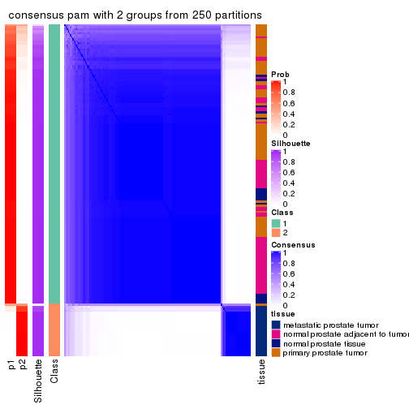</p>

</div>
<div id='tab-CV-pam-consensus-heatmap-2'>
<pre><code class="r">consensus_heatmap(res, k = 3)
</code></pre>

<p>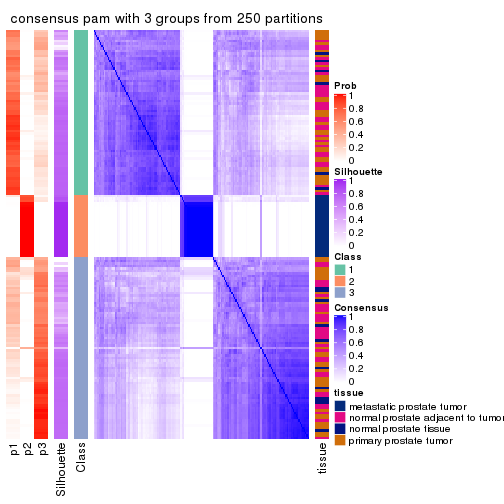</p>

</div>
<div id='tab-CV-pam-consensus-heatmap-3'>
<pre><code class="r">consensus_heatmap(res, k = 4)
</code></pre>

<p>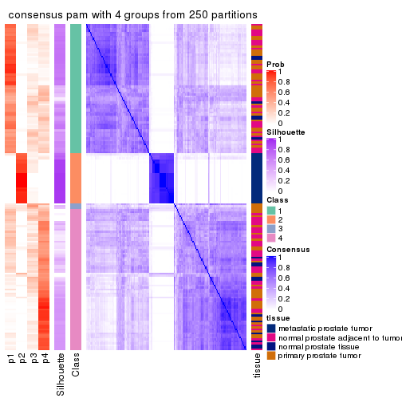</p>

</div>
<div id='tab-CV-pam-consensus-heatmap-4'>
<pre><code class="r">consensus_heatmap(res, k = 5)
</code></pre>

<p>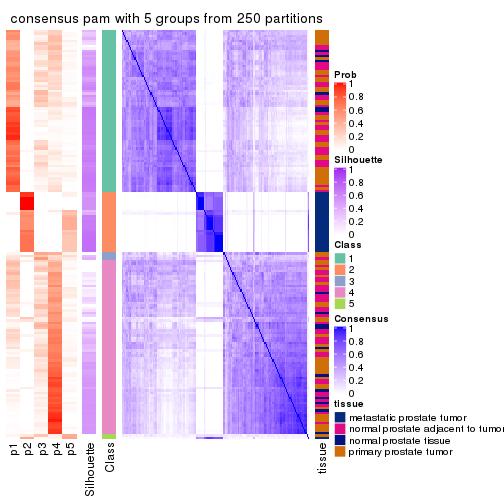</p>

</div>
<div id='tab-CV-pam-consensus-heatmap-5'>
<pre><code class="r">consensus_heatmap(res, k = 6)
</code></pre>

<p>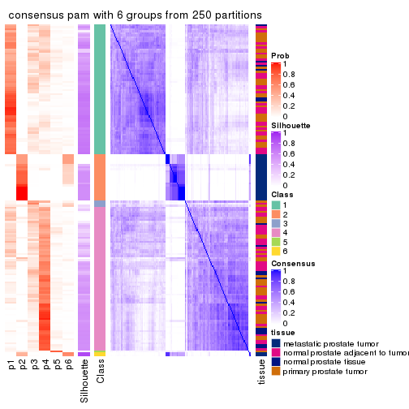</p>

</div>
</div>

Heatmaps for the membership of samples in all partitions to see how consistent they are:


<script>
$( function() {
	$( '#tabs-CV-pam-membership-heatmap' ).tabs();
} );
</script>
<div id='tabs-CV-pam-membership-heatmap'>
<ul>
<li><a href='#tab-CV-pam-membership-heatmap-1'>k = 2</a></li>
<li><a href='#tab-CV-pam-membership-heatmap-2'>k = 3</a></li>
<li><a href='#tab-CV-pam-membership-heatmap-3'>k = 4</a></li>
<li><a href='#tab-CV-pam-membership-heatmap-4'>k = 5</a></li>
<li><a href='#tab-CV-pam-membership-heatmap-5'>k = 6</a></li>
</ul>
<div id='tab-CV-pam-membership-heatmap-1'>
<pre><code class="r">membership_heatmap(res, k = 2)
</code></pre>

<p>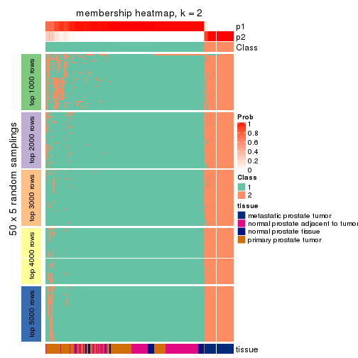</p>

</div>
<div id='tab-CV-pam-membership-heatmap-2'>
<pre><code class="r">membership_heatmap(res, k = 3)
</code></pre>

<p>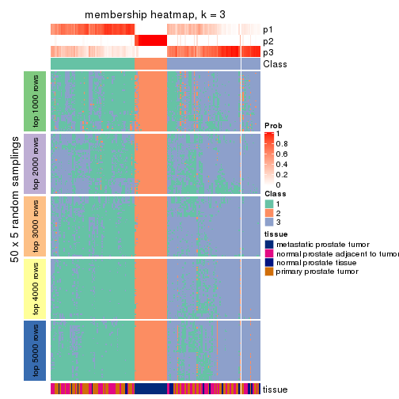</p>

</div>
<div id='tab-CV-pam-membership-heatmap-3'>
<pre><code class="r">membership_heatmap(res, k = 4)
</code></pre>

<p>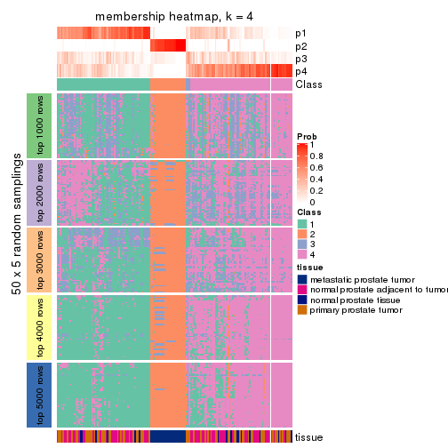</p>

</div>
<div id='tab-CV-pam-membership-heatmap-4'>
<pre><code class="r">membership_heatmap(res, k = 5)
</code></pre>

<p>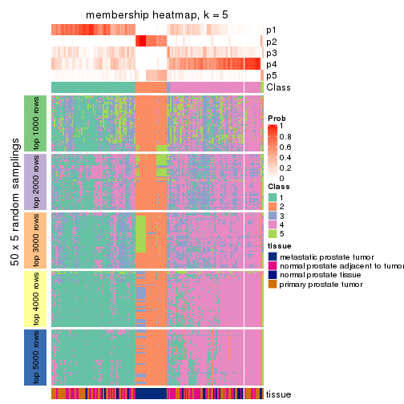</p>

</div>
<div id='tab-CV-pam-membership-heatmap-5'>
<pre><code class="r">membership_heatmap(res, k = 6)
</code></pre>

<p>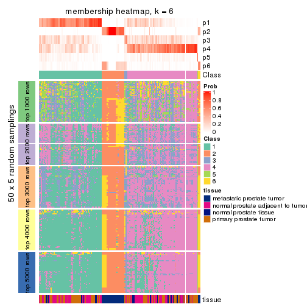</p>

</div>
</div>

As soon as we have had the classes for columns, we can look for signatures
which are significantly different between classes which can be candidate marks
for certain classes. Following are the heatmaps for signatures.


Signature heatmaps where rows are scaled:


<script>
$( function() {
	$( '#tabs-CV-pam-get-signatures' ).tabs();
} );
</script>
<div id='tabs-CV-pam-get-signatures'>
<ul>
<li><a href='#tab-CV-pam-get-signatures-1'>k = 2</a></li>
<li><a href='#tab-CV-pam-get-signatures-2'>k = 3</a></li>
<li><a href='#tab-CV-pam-get-signatures-3'>k = 4</a></li>
<li><a href='#tab-CV-pam-get-signatures-4'>k = 5</a></li>
<li><a href='#tab-CV-pam-get-signatures-5'>k = 6</a></li>
</ul>
<div id='tab-CV-pam-get-signatures-1'>
<pre><code class="r">get_signatures(res, k = 2)
</code></pre>

<p>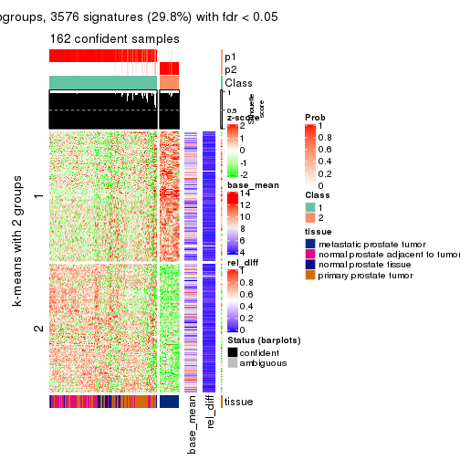</p>

</div>
<div id='tab-CV-pam-get-signatures-2'>
<pre><code class="r">get_signatures(res, k = 3)
</code></pre>

<p>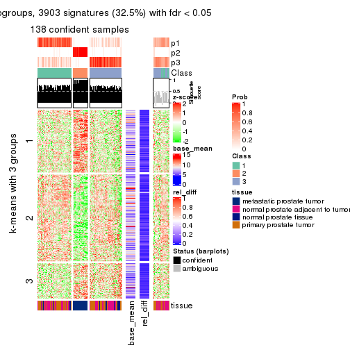</p>

</div>
<div id='tab-CV-pam-get-signatures-3'>
<pre><code class="r">get_signatures(res, k = 4)
</code></pre>

<p>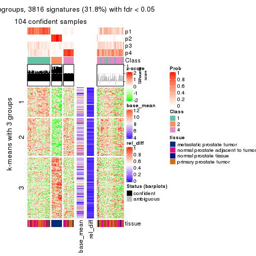</p>

</div>
<div id='tab-CV-pam-get-signatures-4'>
<pre><code class="r">get_signatures(res, k = 5)
</code></pre>

<p>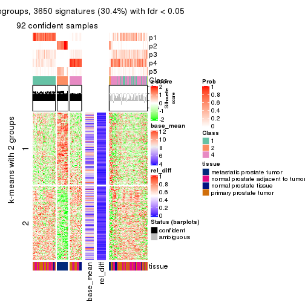</p>

</div>
<div id='tab-CV-pam-get-signatures-5'>
<pre><code class="r">get_signatures(res, k = 6)
</code></pre>

<p>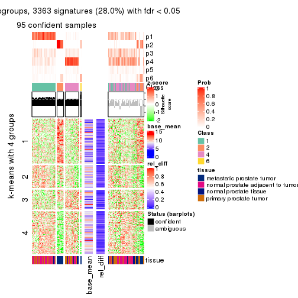</p>

</div>
</div>


Signature heatmaps where rows are not scaled:


<script>
$( function() {
	$( '#tabs-CV-pam-get-signatures-no-scale' ).tabs();
} );
</script>
<div id='tabs-CV-pam-get-signatures-no-scale'>
<ul>
<li><a href='#tab-CV-pam-get-signatures-no-scale-1'>k = 2</a></li>
<li><a href='#tab-CV-pam-get-signatures-no-scale-2'>k = 3</a></li>
<li><a href='#tab-CV-pam-get-signatures-no-scale-3'>k = 4</a></li>
<li><a href='#tab-CV-pam-get-signatures-no-scale-4'>k = 5</a></li>
<li><a href='#tab-CV-pam-get-signatures-no-scale-5'>k = 6</a></li>
</ul>
<div id='tab-CV-pam-get-signatures-no-scale-1'>
<pre><code class="r">get_signatures(res, k = 2, scale_rows = FALSE)
</code></pre>

<p>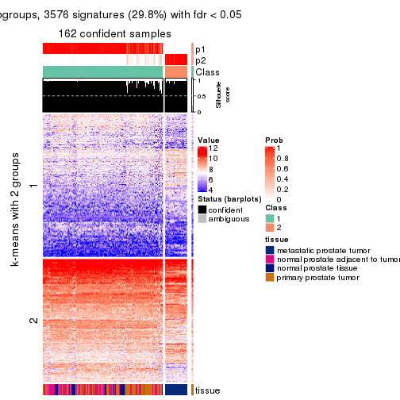</p>

</div>
<div id='tab-CV-pam-get-signatures-no-scale-2'>
<pre><code class="r">get_signatures(res, k = 3, scale_rows = FALSE)
</code></pre>

<p>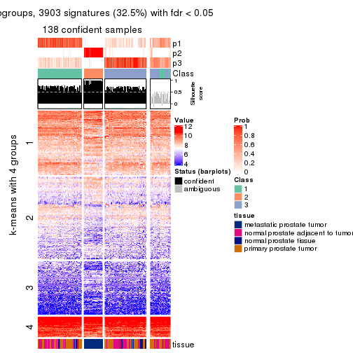</p>

</div>
<div id='tab-CV-pam-get-signatures-no-scale-3'>
<pre><code class="r">get_signatures(res, k = 4, scale_rows = FALSE)
</code></pre>

<p>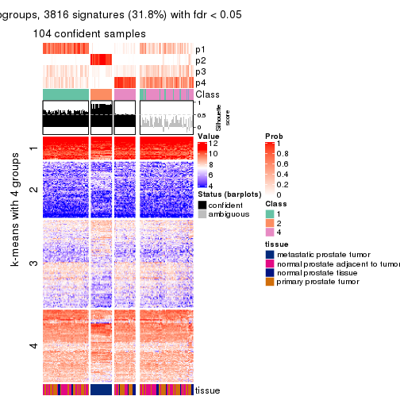</p>

</div>
<div id='tab-CV-pam-get-signatures-no-scale-4'>
<pre><code class="r">get_signatures(res, k = 5, scale_rows = FALSE)
</code></pre>

<p>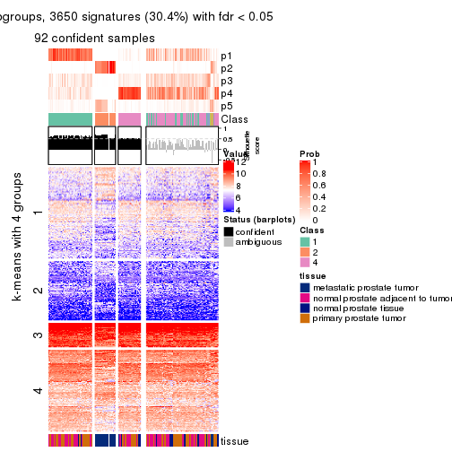</p>

</div>
<div id='tab-CV-pam-get-signatures-no-scale-5'>
<pre><code class="r">get_signatures(res, k = 6, scale_rows = FALSE)
</code></pre>

<p>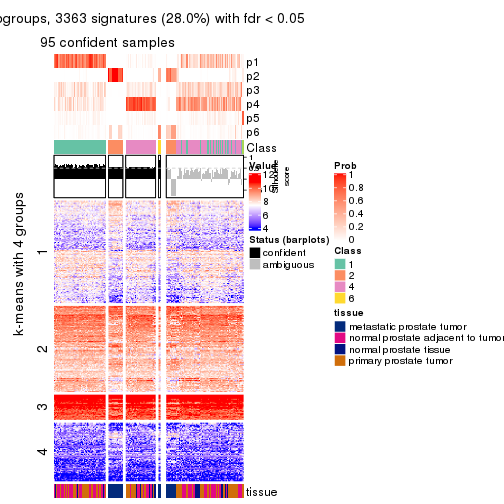</p>

</div>
</div>


Compare the overlap of signatures from different k:

```r
compare_signatures(res)
```

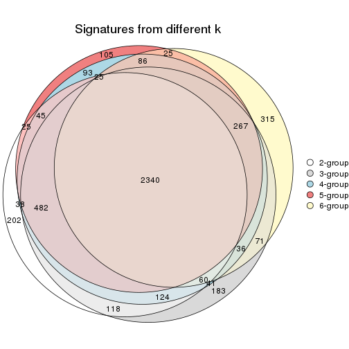

`get_signature()` returns a data frame invisibly. TO get the list of signatures, the function
call should be assigned to a variable explicitly. In following code, if `plot` argument is set
to `FALSE`, no heatmap is plotted while only the differential analysis is performed.

```r
# code only for demonstration
tb = get_signature(res, k = ..., plot = FALSE)
```

An example of the output of `tb` is:

```
#>   which_row         fdr    mean_1    mean_2 scaled_mean_1 scaled_mean_2 km
#> 1        38 0.042760348  8.373488  9.131774    -0.5533452     0.5164555  1
#> 2        40 0.018707592  7.106213  8.469186    -0.6173731     0.5762149  1
#> 3        55 0.019134737 10.221463 11.207825    -0.6159697     0.5749050  1
#> 4        59 0.006059896  5.921854  7.869574    -0.6899429     0.6439467  1
#> 5        60 0.018055526  8.928898 10.211722    -0.6204761     0.5791110  1
#> 6        98 0.009384629 15.714769 14.887706     0.6635654    -0.6193277  2
...
```

The columns in `tb` are:

1. `which_row`: row indices corresponding to the input matrix.
2. `fdr`: FDR for the differential test. 
3. `mean_x`: The mean value in group x.
4. `scaled_mean_x`: The mean value in group x after rows are scaled.
5. `km`: Row groups if k-means clustering is applied to rows.


UMAP plot which shows how samples are separated.


<script>
$( function() {
	$( '#tabs-CV-pam-dimension-reduction' ).tabs();
} );
</script>
<div id='tabs-CV-pam-dimension-reduction'>
<ul>
<li><a href='#tab-CV-pam-dimension-reduction-1'>k = 2</a></li>
<li><a href='#tab-CV-pam-dimension-reduction-2'>k = 3</a></li>
<li><a href='#tab-CV-pam-dimension-reduction-3'>k = 4</a></li>
<li><a href='#tab-CV-pam-dimension-reduction-4'>k = 5</a></li>
<li><a href='#tab-CV-pam-dimension-reduction-5'>k = 6</a></li>
</ul>
<div id='tab-CV-pam-dimension-reduction-1'>
<pre><code class="r">dimension_reduction(res, k = 2, method = &quot;UMAP&quot;)
</code></pre>

<p>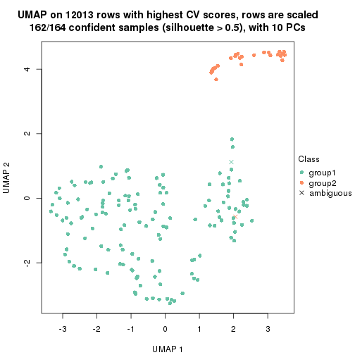</p>

</div>
<div id='tab-CV-pam-dimension-reduction-2'>
<pre><code class="r">dimension_reduction(res, k = 3, method = &quot;UMAP&quot;)
</code></pre>

<p>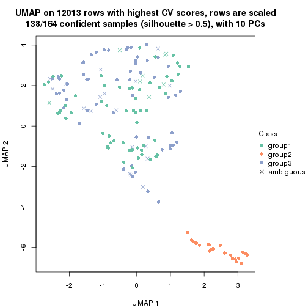</p>

</div>
<div id='tab-CV-pam-dimension-reduction-3'>
<pre><code class="r">dimension_reduction(res, k = 4, method = &quot;UMAP&quot;)
</code></pre>

<p>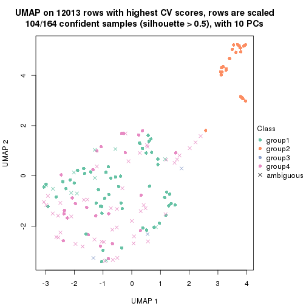</p>

</div>
<div id='tab-CV-pam-dimension-reduction-4'>
<pre><code class="r">dimension_reduction(res, k = 5, method = &quot;UMAP&quot;)
</code></pre>

<p>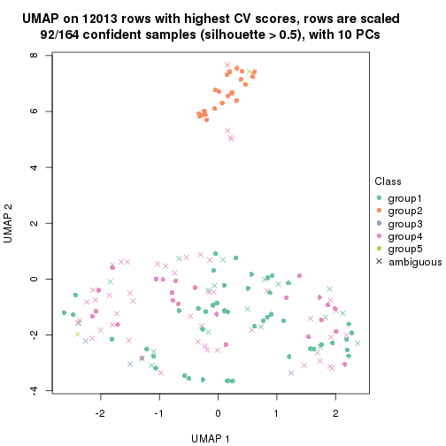</p>

</div>
<div id='tab-CV-pam-dimension-reduction-5'>
<pre><code class="r">dimension_reduction(res, k = 6, method = &quot;UMAP&quot;)
</code></pre>

<p>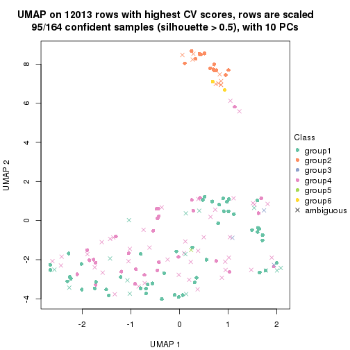</p>

</div>
</div>


Following heatmap shows how subgroups are split when increasing `k`:

```r
collect_classes(res)
```

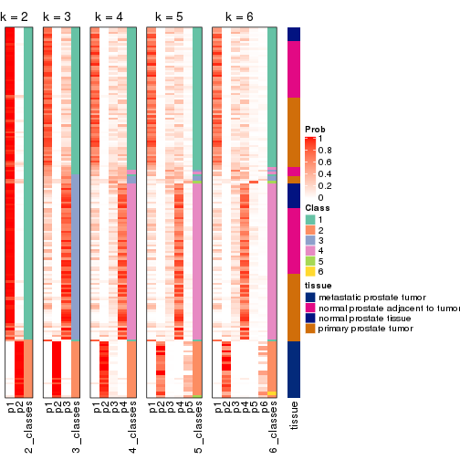


Test correlation between subgroups and known annotations. If the known
annotation is numeric, one-way ANOVA test is applied, and if the known
annotation is discrete, chi-squared contingency table test is applied.

```r
test_to_known_factors(res)
```

```
#>          n tissue(p) k
#> CV:pam 162  6.78e-35 2
#> CV:pam 138  7.78e-28 3
#> CV:pam 104  7.81e-21 4
#> CV:pam  92  4.76e-19 5
#> CV:pam  95  1.12e-17 6
```


If matrix rows can be associated to genes, consider to use `functional_enrichment(res,
...)` to perform function enrichment for the signature genes. See [this vignette](http://bioconductor.org/packages/devel/bioc/vignettes/cola/inst/doc/functional_enrichment.html) for more detailed explanations.


 

---------------------------------------------------


### CV:mclust**


The object with results only for a single top-value method and a single partition method 
can be extracted as:

```r
res = res_list["CV", "mclust"]
# you can also extract it by
# res = res_list["CV:mclust"]
```

A summary of `res` and all the functions that can be applied to it:

```r
res
```

```
#> A 'ConsensusPartition' object with k = 2, 3, 4, 5, 6.
#>   On a matrix with 12013 rows and 164 columns.
#>   Top rows (1000, 2000, 3000, 4000, 5000) are extracted by 'CV' method.
#>   Subgroups are detected by 'mclust' method.
#>   Performed in total 1250 partitions by row resampling.
#>   Best k for subgroups seems to be 2.
#> 
#> Following methods can be applied to this 'ConsensusPartition' object:
#>  [1] "cola_report"             "collect_classes"         "collect_plots"          
#>  [4] "collect_stats"           "colnames"                "compare_signatures"     
#>  [7] "consensus_heatmap"       "dimension_reduction"     "functional_enrichment"  
#> [10] "get_anno_col"            "get_anno"                "get_classes"            
#> [13] "get_consensus"           "get_matrix"              "get_membership"         
#> [16] "get_param"               "get_signatures"          "get_stats"              
#> [19] "is_best_k"               "is_stable_k"             "membership_heatmap"     
#> [22] "ncol"                    "nrow"                    "plot_ecdf"              
#> [25] "rownames"                "select_partition_number" "show"                   
#> [28] "suggest_best_k"          "test_to_known_factors"
```

`collect_plots()` function collects all the plots made from `res` for all `k` (number of partitions)
into one single page to provide an easy and fast comparison between different `k`.

```r
collect_plots(res)
```

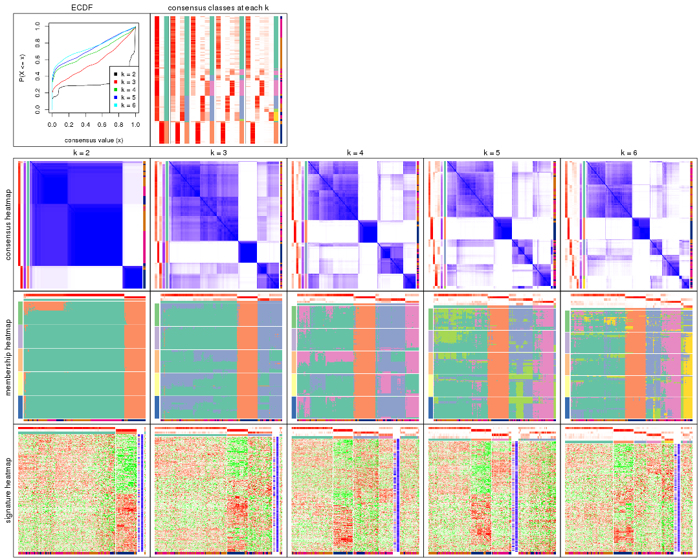

The plots are:

- The first row: a plot of the ECDF (empirical cumulative distribution
  function) curves of the consensus matrix for each `k` and the heatmap of
  predicted classes for each `k`.
- The second row: heatmaps of the consensus matrix for each `k`.
- The third row: heatmaps of the membership matrix for each `k`.
- The fouth row: heatmaps of the signatures for each `k`.

All the plots in panels can be made by individual functions and they are
plotted later in this section.

`select_partition_number()` produces several plots showing different
statistics for choosing "optimized" `k`. There are following statistics:

- ECDF curves of the consensus matrix for each `k`;
- 1-PAC. [The PAC
  score](https://en.wikipedia.org/wiki/Consensus_clustering#Over-interpretation_potential_of_consensus_clustering)
  measures the proportion of the ambiguous subgrouping.
- Mean silhouette score.
- Concordance. The mean probability of fiting the consensus class ids in all
  partitions.
- Area increased. Denote $A_k$ as the area under the ECDF curve for current
  `k`, the area increased is defined as $A_k - A_{k-1}$.
- Rand index. The percent of pairs of samples that are both in a same cluster
  or both are not in a same cluster in the partition of k and k-1.
- Jaccard index. The ratio of pairs of samples are both in a same cluster in
  the partition of k and k-1 and the pairs of samples are both in a same
  cluster in the partition k or k-1.

The detailed explanations of these statistics can be found in [the _cola_
vignette](http://bioconductor.org/packages/devel/bioc/vignettes/cola/inst/doc/cola.html#toc_13).

Generally speaking, lower PAC score, higher mean silhouette score or higher
concordance corresponds to better partition. Rand index and Jaccard index
measure how similar the current partition is compared to partition with `k-1`.
If they are too similar, we won't accept `k` is better than `k-1`.

```r
select_partition_number(res)
```

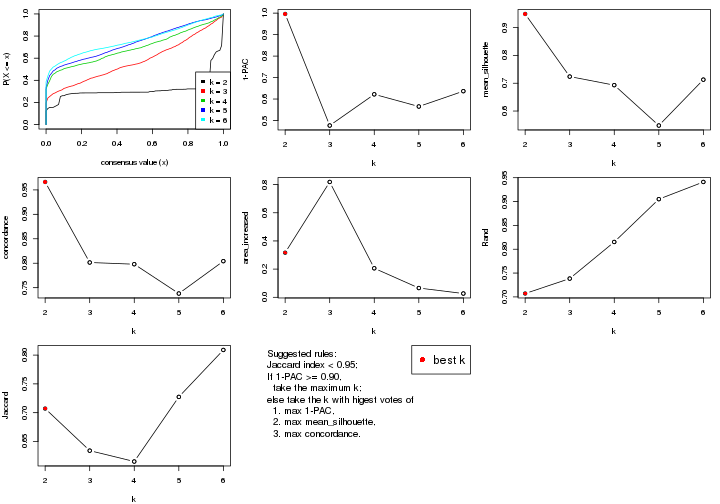

The numeric values for all these statistics can be obtained by `get_stats()`.

```r
get_stats(res)
```

```
#>   k 1-PAC mean_silhouette concordance area_increased  Rand Jaccard
#> 2 2 0.996           0.949       0.966         0.3165 0.707   0.707
#> 3 3 0.477           0.724       0.801         0.8186 0.738   0.634
#> 4 4 0.622           0.693       0.798         0.2058 0.815   0.615
#> 5 5 0.565           0.548       0.738         0.0656 0.905   0.727
#> 6 6 0.637           0.713       0.804         0.0267 0.941   0.809
```

`suggest_best_k()` suggests the best $k$ based on these statistics. The rules are as follows:

- All $k$ with Jaccard index larger than 0.95 are removed because increasing
  $k$ does not provide enough extra information. If all $k$ are removed, it is
  marked as no subgroup is detected.
- For all $k$ with 1-PAC score larger than 0.9, the maximal $k$ is taken as
  the best $k$, and other $k$ are marked as optional $k$.
- If it does not fit the second rule. The $k$ with the maximal vote of the
  highest 1-PAC score, highest mean silhouette, and highest concordance is
  taken as the best $k$.

```r
suggest_best_k(res)
```

```
#> [1] 2
```


Following shows the table of the partitions (You need to click the **show/hide
code output** link to see it). The membership matrix (columns with name `p*`)
is inferred by
[`clue::cl_consensus()`](https://www.rdocumentation.org/link/cl_consensus?package=clue)
function with the `SE` method. Basically the value in the membership matrix
represents the probability to belong to a certain group. The finall class
label for an item is determined with the group with highest probability it
belongs to.

In `get_classes()` function, the entropy is calculated from the membership
matrix and the silhouette score is calculated from the consensus matrix.


<script>
$( function() {
	$( '#tabs-CV-mclust-get-classes' ).tabs();
} );
</script>
<div id='tabs-CV-mclust-get-classes'>
<ul>
<li><a href='#tab-CV-mclust-get-classes-1'>k = 2</a></li>
<li><a href='#tab-CV-mclust-get-classes-2'>k = 3</a></li>
<li><a href='#tab-CV-mclust-get-classes-3'>k = 4</a></li>
<li><a href='#tab-CV-mclust-get-classes-4'>k = 5</a></li>
<li><a href='#tab-CV-mclust-get-classes-5'>k = 6</a></li>
</ul>

<div id='tab-CV-mclust-get-classes-1'>
<p><a id='tab-CV-mclust-get-classes-1-a' style='color:#0366d6' href='#'>show/hide code output</a></p>
<pre><code class="r">cbind(get_classes(res, k = 2), get_membership(res, k = 2))
</code></pre>

<pre><code>#&gt;           class entropy silhouette    p1    p2
#&gt; GSM152839     1  0.1414      0.957 0.980 0.020
#&gt; GSM152840     1  0.4022      0.940 0.920 0.080
#&gt; GSM152841     1  0.0000      0.960 1.000 0.000
#&gt; GSM152842     1  0.4022      0.940 0.920 0.080
#&gt; GSM152843     1  0.4022      0.940 0.920 0.080
#&gt; GSM152844     1  0.4022      0.940 0.920 0.080
#&gt; GSM152845     1  0.5059      0.915 0.888 0.112
#&gt; GSM152846     1  0.4022      0.940 0.920 0.080
#&gt; GSM152847     1  0.4022      0.940 0.920 0.080
#&gt; GSM152848     1  0.0000      0.960 1.000 0.000
#&gt; GSM152849     1  0.4022      0.940 0.920 0.080
#&gt; GSM152850     1  0.3879      0.941 0.924 0.076
#&gt; GSM152851     1  0.3274      0.947 0.940 0.060
#&gt; GSM152852     1  0.4022      0.940 0.920 0.080
#&gt; GSM152853     1  0.4022      0.940 0.920 0.080
#&gt; GSM152854     1  0.4022      0.940 0.920 0.080
#&gt; GSM152855     1  0.0000      0.960 1.000 0.000
#&gt; GSM153238     1  0.4022      0.940 0.920 0.080
#&gt; GSM153239     1  0.4022      0.940 0.920 0.080
#&gt; GSM153240     1  0.0000      0.960 1.000 0.000
#&gt; GSM153241     1  0.4022      0.940 0.920 0.080
#&gt; GSM153242     1  0.4022      0.940 0.920 0.080
#&gt; GSM153243     1  0.4022      0.940 0.920 0.080
#&gt; GSM153244     1  0.0000      0.960 1.000 0.000
#&gt; GSM153245     1  0.4022      0.940 0.920 0.080
#&gt; GSM153246     1  0.4022      0.940 0.920 0.080
#&gt; GSM153247     1  0.4022      0.940 0.920 0.080
#&gt; GSM153248     1  0.0000      0.960 1.000 0.000
#&gt; GSM153249     1  0.0000      0.960 1.000 0.000
#&gt; GSM153250     1  0.0000      0.960 1.000 0.000
#&gt; GSM153251     1  0.4022      0.940 0.920 0.080
#&gt; GSM153252     1  0.0000      0.960 1.000 0.000
#&gt; GSM153253     1  0.0000      0.960 1.000 0.000
#&gt; GSM153254     1  0.0376      0.960 0.996 0.004
#&gt; GSM153255     1  0.0000      0.960 1.000 0.000
#&gt; GSM153256     1  0.0000      0.960 1.000 0.000
#&gt; GSM153257     1  0.0000      0.960 1.000 0.000
#&gt; GSM153258     1  0.0000      0.960 1.000 0.000
#&gt; GSM153259     1  0.0000      0.960 1.000 0.000
#&gt; GSM153260     1  0.4022      0.940 0.920 0.080
#&gt; GSM153261     1  0.4022      0.940 0.920 0.080
#&gt; GSM153262     1  0.0000      0.960 1.000 0.000
#&gt; GSM153263     1  0.0000      0.960 1.000 0.000
#&gt; GSM153264     1  0.0000      0.960 1.000 0.000
#&gt; GSM153265     1  0.0000      0.960 1.000 0.000
#&gt; GSM153266     1  0.0000      0.960 1.000 0.000
#&gt; GSM153267     1  0.0000      0.960 1.000 0.000
#&gt; GSM153268     1  0.0376      0.960 0.996 0.004
#&gt; GSM153269     1  0.0000      0.960 1.000 0.000
#&gt; GSM153270     1  0.0000      0.960 1.000 0.000
#&gt; GSM153271     1  0.0000      0.960 1.000 0.000
#&gt; GSM153272     1  0.0000      0.960 1.000 0.000
#&gt; GSM153273     1  0.0938      0.959 0.988 0.012
#&gt; GSM153274     1  0.0000      0.960 1.000 0.000
#&gt; GSM153275     1  0.0000      0.960 1.000 0.000
#&gt; GSM153276     1  0.0000      0.960 1.000 0.000
#&gt; GSM153277     1  0.0000      0.960 1.000 0.000
#&gt; GSM153278     1  0.4022      0.940 0.920 0.080
#&gt; GSM153279     1  0.0000      0.960 1.000 0.000
#&gt; GSM153280     1  0.0000      0.960 1.000 0.000
#&gt; GSM153281     1  0.0000      0.960 1.000 0.000
#&gt; GSM153282     1  0.0000      0.960 1.000 0.000
#&gt; GSM153283     1  0.0000      0.960 1.000 0.000
#&gt; GSM153284     1  0.0000      0.960 1.000 0.000
#&gt; GSM153285     1  0.0000      0.960 1.000 0.000
#&gt; GSM153286     1  0.0000      0.960 1.000 0.000
#&gt; GSM153287     1  0.0000      0.960 1.000 0.000
#&gt; GSM153288     1  0.0000      0.960 1.000 0.000
#&gt; GSM153289     1  0.0000      0.960 1.000 0.000
#&gt; GSM153290     1  0.0000      0.960 1.000 0.000
#&gt; GSM153291     1  0.0000      0.960 1.000 0.000
#&gt; GSM153292     1  0.0000      0.960 1.000 0.000
#&gt; GSM153293     1  0.0000      0.960 1.000 0.000
#&gt; GSM153294     1  0.0000      0.960 1.000 0.000
#&gt; GSM153295     1  0.3879      0.941 0.924 0.076
#&gt; GSM153054     1  0.3584      0.944 0.932 0.068
#&gt; GSM153055     1  0.0000      0.960 1.000 0.000
#&gt; GSM153056     1  0.4022      0.940 0.920 0.080
#&gt; GSM153057     1  0.0376      0.960 0.996 0.004
#&gt; GSM153058     1  0.4022      0.940 0.920 0.080
#&gt; GSM153059     1  0.3274      0.947 0.940 0.060
#&gt; GSM153060     1  0.4022      0.940 0.920 0.080
#&gt; GSM153061     1  0.4022      0.940 0.920 0.080
#&gt; GSM153062     1  0.4022      0.940 0.920 0.080
#&gt; GSM153063     1  0.4022      0.940 0.920 0.080
#&gt; GSM153064     1  0.0000      0.960 1.000 0.000
#&gt; GSM153065     1  0.4022      0.940 0.920 0.080
#&gt; GSM153066     1  0.9608      0.468 0.616 0.384
#&gt; GSM153067     1  0.0000      0.960 1.000 0.000
#&gt; GSM153068     1  0.4022      0.940 0.920 0.080
#&gt; GSM153069     1  0.0000      0.960 1.000 0.000
#&gt; GSM153070     1  0.0000      0.960 1.000 0.000
#&gt; GSM153071     1  0.4022      0.940 0.920 0.080
#&gt; GSM153072     1  0.3879      0.941 0.924 0.076
#&gt; GSM153073     1  0.0000      0.960 1.000 0.000
#&gt; GSM153074     1  0.0000      0.960 1.000 0.000
#&gt; GSM153075     1  0.0000      0.960 1.000 0.000
#&gt; GSM153076     1  0.0000      0.960 1.000 0.000
#&gt; GSM153077     1  0.0376      0.960 0.996 0.004
#&gt; GSM153078     1  0.3274      0.947 0.940 0.060
#&gt; GSM153079     1  0.0000      0.960 1.000 0.000
#&gt; GSM153080     1  0.4022      0.940 0.920 0.080
#&gt; GSM153081     1  0.0000      0.960 1.000 0.000
#&gt; GSM153082     1  0.5059      0.914 0.888 0.112
#&gt; GSM153083     1  0.3733      0.943 0.928 0.072
#&gt; GSM153084     1  0.8713      0.667 0.708 0.292
#&gt; GSM153085     1  0.2948      0.949 0.948 0.052
#&gt; GSM153086     1  0.3879      0.942 0.924 0.076
#&gt; GSM153087     1  0.0000      0.960 1.000 0.000
#&gt; GSM153088     1  0.0000      0.960 1.000 0.000
#&gt; GSM153089     1  0.4022      0.940 0.920 0.080
#&gt; GSM153090     1  0.0000      0.960 1.000 0.000
#&gt; GSM153091     1  0.2778      0.951 0.952 0.048
#&gt; GSM153092     1  0.0000      0.960 1.000 0.000
#&gt; GSM153093     1  0.0000      0.960 1.000 0.000
#&gt; GSM153094     1  0.4815      0.920 0.896 0.104
#&gt; GSM153095     1  0.4298      0.934 0.912 0.088
#&gt; GSM153096     1  0.0000      0.960 1.000 0.000
#&gt; GSM153097     1  0.0938      0.959 0.988 0.012
#&gt; GSM153098     1  0.0376      0.960 0.996 0.004
#&gt; GSM153099     1  0.0000      0.960 1.000 0.000
#&gt; GSM153100     1  0.0000      0.960 1.000 0.000
#&gt; GSM153101     1  0.4022      0.940 0.920 0.080
#&gt; GSM153102     1  0.1414      0.957 0.980 0.020
#&gt; GSM153103     1  0.3584      0.944 0.932 0.068
#&gt; GSM153104     1  0.0000      0.960 1.000 0.000
#&gt; GSM153106     1  0.0000      0.960 1.000 0.000
#&gt; GSM153107     1  0.0000      0.960 1.000 0.000
#&gt; GSM153108     1  0.0000      0.960 1.000 0.000
#&gt; GSM153109     1  0.5737      0.891 0.864 0.136
#&gt; GSM153110     1  0.1184      0.958 0.984 0.016
#&gt; GSM153111     1  0.2778      0.951 0.952 0.048
#&gt; GSM153112     1  0.0376      0.959 0.996 0.004
#&gt; GSM153113     1  0.9833      0.367 0.576 0.424
#&gt; GSM153114     1  0.0000      0.960 1.000 0.000
#&gt; GSM187532     2  0.3431      0.930 0.064 0.936
#&gt; GSM187533     2  0.0376      0.988 0.004 0.996
#&gt; GSM187534     2  0.0672      0.985 0.008 0.992
#&gt; GSM187535     2  0.4815      0.879 0.104 0.896
#&gt; GSM152906     2  0.0000      0.991 0.000 1.000
#&gt; GSM152907     2  0.0000      0.991 0.000 1.000
#&gt; GSM152908     2  0.0000      0.991 0.000 1.000
#&gt; GSM152909     2  0.0000      0.991 0.000 1.000
#&gt; GSM152910     2  0.0000      0.991 0.000 1.000
#&gt; GSM152911     2  0.0000      0.991 0.000 1.000
#&gt; GSM152912     2  0.0000      0.991 0.000 1.000
#&gt; GSM152913     2  0.0000      0.991 0.000 1.000
#&gt; GSM152914     2  0.0000      0.991 0.000 1.000
#&gt; GSM152915     2  0.0000      0.991 0.000 1.000
#&gt; GSM152916     2  0.0000      0.991 0.000 1.000
#&gt; GSM152917     2  0.0000      0.991 0.000 1.000
#&gt; GSM152918     2  0.0000      0.991 0.000 1.000
#&gt; GSM152919     2  0.0000      0.991 0.000 1.000
#&gt; GSM152920     2  0.0000      0.991 0.000 1.000
#&gt; GSM152921     2  0.0000      0.991 0.000 1.000
#&gt; GSM152922     2  0.0000      0.991 0.000 1.000
#&gt; GSM152923     2  0.0000      0.991 0.000 1.000
#&gt; GSM152924     2  0.0000      0.991 0.000 1.000
#&gt; GSM152925     2  0.0000      0.991 0.000 1.000
#&gt; GSM152926     2  0.0000      0.991 0.000 1.000
#&gt; GSM152927     2  0.0000      0.991 0.000 1.000
#&gt; GSM152928     2  0.2778      0.947 0.048 0.952
#&gt; GSM152929     2  0.0000      0.991 0.000 1.000
#&gt; GSM152930     2  0.0000      0.991 0.000 1.000
</code></pre>

<script>
$('#tab-CV-mclust-get-classes-1-a').parent().next().next().hide();
$('#tab-CV-mclust-get-classes-1-a').click(function(){
  $('#tab-CV-mclust-get-classes-1-a').parent().next().next().toggle();
  return(false);
});
</script>
</div>

<div id='tab-CV-mclust-get-classes-2'>
<p><a id='tab-CV-mclust-get-classes-2-a' style='color:#0366d6' href='#'>show/hide code output</a></p>
<pre><code class="r">cbind(get_classes(res, k = 3), get_membership(res, k = 3))
</code></pre>

<pre><code>#&gt;           class entropy silhouette    p1    p2    p3
#&gt; GSM152839     1  0.4555     0.5830 0.800 0.000 0.200
#&gt; GSM152840     3  0.1989     0.6898 0.048 0.004 0.948
#&gt; GSM152841     1  0.6111     0.6529 0.604 0.000 0.396
#&gt; GSM152842     3  0.5905     0.7559 0.352 0.000 0.648
#&gt; GSM152843     3  0.6154     0.7123 0.408 0.000 0.592
#&gt; GSM152844     3  0.1989     0.6898 0.048 0.004 0.948
#&gt; GSM152845     3  0.3043     0.7033 0.084 0.008 0.908
#&gt; GSM152846     3  0.1989     0.6898 0.048 0.004 0.948
#&gt; GSM152847     3  0.6045     0.7422 0.380 0.000 0.620
#&gt; GSM152848     1  0.1753     0.7040 0.952 0.000 0.048
#&gt; GSM152849     3  0.6008     0.7484 0.372 0.000 0.628
#&gt; GSM152850     1  0.6291    -0.4685 0.532 0.000 0.468
#&gt; GSM152851     1  0.6252     0.6115 0.556 0.000 0.444
#&gt; GSM152852     3  0.2400     0.6778 0.064 0.004 0.932
#&gt; GSM152853     3  0.1989     0.6898 0.048 0.004 0.948
#&gt; GSM152854     3  0.2496     0.6994 0.068 0.004 0.928
#&gt; GSM152855     1  0.5291     0.7273 0.732 0.000 0.268
#&gt; GSM153238     3  0.5905     0.7559 0.352 0.000 0.648
#&gt; GSM153239     3  0.1989     0.6898 0.048 0.004 0.948
#&gt; GSM153240     1  0.5968     0.6748 0.636 0.000 0.364
#&gt; GSM153241     3  0.5988     0.7468 0.368 0.000 0.632
#&gt; GSM153242     3  0.1989     0.6898 0.048 0.004 0.948
#&gt; GSM153243     3  0.6235     0.6727 0.436 0.000 0.564
#&gt; GSM153244     1  0.6386     0.6472 0.584 0.004 0.412
#&gt; GSM153245     3  0.2096     0.6918 0.052 0.004 0.944
#&gt; GSM153246     3  0.6954     0.7509 0.352 0.028 0.620
#&gt; GSM153247     3  0.6008     0.7491 0.372 0.000 0.628
#&gt; GSM153248     1  0.1411     0.7028 0.964 0.000 0.036
#&gt; GSM153249     1  0.5926     0.6753 0.644 0.000 0.356
#&gt; GSM153250     1  0.1860     0.7377 0.948 0.000 0.052
#&gt; GSM153251     3  0.2772     0.6999 0.080 0.004 0.916
#&gt; GSM153252     1  0.5016     0.7472 0.760 0.000 0.240
#&gt; GSM153253     1  0.6026     0.6654 0.624 0.000 0.376
#&gt; GSM153254     1  0.6169     0.6831 0.636 0.004 0.360
#&gt; GSM153255     1  0.5882     0.6794 0.652 0.000 0.348
#&gt; GSM153256     1  0.4235     0.7539 0.824 0.000 0.176
#&gt; GSM153257     1  0.4974     0.7421 0.764 0.000 0.236
#&gt; GSM153258     1  0.3941     0.7554 0.844 0.000 0.156
#&gt; GSM153259     1  0.0892     0.7118 0.980 0.000 0.020
#&gt; GSM153260     3  0.5948     0.7548 0.360 0.000 0.640
#&gt; GSM153261     3  0.5785     0.7561 0.332 0.000 0.668
#&gt; GSM153262     1  0.5733     0.7044 0.676 0.000 0.324
#&gt; GSM153263     1  0.2066     0.7355 0.940 0.000 0.060
#&gt; GSM153264     1  0.2066     0.6876 0.940 0.000 0.060
#&gt; GSM153265     1  0.6079     0.6622 0.612 0.000 0.388
#&gt; GSM153266     1  0.2448     0.6823 0.924 0.000 0.076
#&gt; GSM153267     1  0.4235     0.7537 0.824 0.000 0.176
#&gt; GSM153268     1  0.6225     0.6221 0.568 0.000 0.432
#&gt; GSM153269     1  0.3752     0.7545 0.856 0.000 0.144
#&gt; GSM153270     1  0.4452     0.7542 0.808 0.000 0.192
#&gt; GSM153271     1  0.4062     0.7543 0.836 0.000 0.164
#&gt; GSM153272     1  0.5560     0.7126 0.700 0.000 0.300
#&gt; GSM153273     1  0.1163     0.7171 0.972 0.000 0.028
#&gt; GSM153274     1  0.3340     0.7532 0.880 0.000 0.120
#&gt; GSM153275     1  0.4605     0.7508 0.796 0.000 0.204
#&gt; GSM153276     1  0.4750     0.7496 0.784 0.000 0.216
#&gt; GSM153277     1  0.5988     0.6712 0.632 0.000 0.368
#&gt; GSM153278     1  0.6225    -0.3487 0.568 0.000 0.432
#&gt; GSM153279     1  0.6111     0.6689 0.604 0.000 0.396
#&gt; GSM153280     1  0.6154     0.6435 0.592 0.000 0.408
#&gt; GSM153281     1  0.6026     0.6655 0.624 0.000 0.376
#&gt; GSM153282     1  0.6154     0.6435 0.592 0.000 0.408
#&gt; GSM153283     1  0.1529     0.7108 0.960 0.000 0.040
#&gt; GSM153284     1  0.4931     0.7434 0.768 0.000 0.232
#&gt; GSM153285     1  0.6008     0.6675 0.628 0.000 0.372
#&gt; GSM153286     1  0.5678     0.7009 0.684 0.000 0.316
#&gt; GSM153287     1  0.5968     0.6732 0.636 0.000 0.364
#&gt; GSM153288     1  0.5058     0.7375 0.756 0.000 0.244
#&gt; GSM153289     1  0.4555     0.7506 0.800 0.000 0.200
#&gt; GSM153290     1  0.6079     0.6576 0.612 0.000 0.388
#&gt; GSM153291     1  0.5882     0.6794 0.652 0.000 0.348
#&gt; GSM153292     1  0.6008     0.6675 0.628 0.000 0.372
#&gt; GSM153293     1  0.4178     0.7542 0.828 0.000 0.172
#&gt; GSM153294     1  0.2165     0.7217 0.936 0.000 0.064
#&gt; GSM153295     1  0.4121     0.5567 0.832 0.000 0.168
#&gt; GSM153054     1  0.3412     0.6335 0.876 0.000 0.124
#&gt; GSM153055     1  0.4796     0.7480 0.780 0.000 0.220
#&gt; GSM153056     3  0.6280     0.6285 0.460 0.000 0.540
#&gt; GSM153057     1  0.5016     0.6748 0.760 0.000 0.240
#&gt; GSM153058     3  0.5254     0.7429 0.264 0.000 0.736
#&gt; GSM153059     1  0.5722     0.6347 0.704 0.004 0.292
#&gt; GSM153060     3  0.6448     0.7556 0.352 0.012 0.636
#&gt; GSM153061     3  0.6587     0.7548 0.352 0.016 0.632
#&gt; GSM153062     3  0.6978     0.7549 0.336 0.032 0.632
#&gt; GSM153063     3  0.4629     0.7271 0.188 0.004 0.808
#&gt; GSM153064     1  0.1964     0.7364 0.944 0.000 0.056
#&gt; GSM153065     3  0.6126     0.7562 0.352 0.004 0.644
#&gt; GSM153066     3  0.7665     0.6188 0.456 0.044 0.500
#&gt; GSM153067     1  0.5785     0.6894 0.668 0.000 0.332
#&gt; GSM153068     3  0.6297     0.7560 0.352 0.008 0.640
#&gt; GSM153069     1  0.5968     0.6732 0.636 0.000 0.364
#&gt; GSM153070     1  0.3482     0.7548 0.872 0.000 0.128
#&gt; GSM153071     1  0.5560     0.2105 0.700 0.000 0.300
#&gt; GSM153072     1  0.3752     0.5912 0.856 0.000 0.144
#&gt; GSM153073     1  0.0592     0.7197 0.988 0.000 0.012
#&gt; GSM153074     1  0.5733     0.6952 0.676 0.000 0.324
#&gt; GSM153075     1  0.5859     0.6900 0.656 0.000 0.344
#&gt; GSM153076     1  0.0747     0.7259 0.984 0.000 0.016
#&gt; GSM153077     1  0.1964     0.6912 0.944 0.000 0.056
#&gt; GSM153078     1  0.3340     0.6425 0.880 0.000 0.120
#&gt; GSM153079     1  0.2066     0.6860 0.940 0.000 0.060
#&gt; GSM153080     3  0.5070     0.6168 0.224 0.004 0.772
#&gt; GSM153081     1  0.2261     0.6869 0.932 0.000 0.068
#&gt; GSM153082     1  0.1964     0.6887 0.944 0.000 0.056
#&gt; GSM153083     1  0.2066     0.6866 0.940 0.000 0.060
#&gt; GSM153084     1  0.3539     0.6490 0.888 0.012 0.100
#&gt; GSM153085     1  0.2878     0.6618 0.904 0.000 0.096
#&gt; GSM153086     1  0.2165     0.6827 0.936 0.000 0.064
#&gt; GSM153087     1  0.4702     0.7514 0.788 0.000 0.212
#&gt; GSM153088     1  0.0892     0.7156 0.980 0.000 0.020
#&gt; GSM153089     3  0.2096     0.6920 0.052 0.004 0.944
#&gt; GSM153090     1  0.0747     0.7214 0.984 0.000 0.016
#&gt; GSM153091     1  0.1964     0.6887 0.944 0.000 0.056
#&gt; GSM153092     1  0.4452     0.7535 0.808 0.000 0.192
#&gt; GSM153093     1  0.5397     0.7244 0.720 0.000 0.280
#&gt; GSM153094     1  0.1964     0.6887 0.944 0.000 0.056
#&gt; GSM153095     1  0.2878     0.6810 0.904 0.000 0.096
#&gt; GSM153096     1  0.1753     0.7248 0.952 0.000 0.048
#&gt; GSM153097     1  0.1964     0.6887 0.944 0.000 0.056
#&gt; GSM153098     1  0.3412     0.7485 0.876 0.000 0.124
#&gt; GSM153099     1  0.4750     0.7499 0.784 0.000 0.216
#&gt; GSM153100     1  0.4504     0.7524 0.804 0.000 0.196
#&gt; GSM153101     1  0.3816     0.6037 0.852 0.000 0.148
#&gt; GSM153102     1  0.5588     0.7237 0.720 0.004 0.276
#&gt; GSM153103     1  0.2878     0.6627 0.904 0.000 0.096
#&gt; GSM153104     1  0.5968     0.6748 0.636 0.000 0.364
#&gt; GSM153106     1  0.4974     0.7467 0.764 0.000 0.236
#&gt; GSM153107     1  0.4235     0.7540 0.824 0.000 0.176
#&gt; GSM153108     1  0.5591     0.7192 0.696 0.000 0.304
#&gt; GSM153109     1  0.2448     0.7095 0.924 0.000 0.076
#&gt; GSM153110     1  0.1529     0.6993 0.960 0.000 0.040
#&gt; GSM153111     1  0.1964     0.6887 0.944 0.000 0.056
#&gt; GSM153112     1  0.2625     0.7305 0.916 0.000 0.084
#&gt; GSM153113     1  0.3129     0.6595 0.904 0.008 0.088
#&gt; GSM153114     1  0.5678     0.7003 0.684 0.000 0.316
#&gt; GSM187532     2  0.5236     0.7515 0.028 0.804 0.168
#&gt; GSM187533     2  0.1129     0.9526 0.020 0.976 0.004
#&gt; GSM187534     2  0.1453     0.9433 0.024 0.968 0.008
#&gt; GSM187535     1  0.7851    -0.0511 0.532 0.412 0.056
#&gt; GSM152906     2  0.0000     0.9786 0.000 1.000 0.000
#&gt; GSM152907     2  0.0000     0.9786 0.000 1.000 0.000
#&gt; GSM152908     2  0.0000     0.9786 0.000 1.000 0.000
#&gt; GSM152909     2  0.0000     0.9786 0.000 1.000 0.000
#&gt; GSM152910     2  0.0000     0.9786 0.000 1.000 0.000
#&gt; GSM152911     2  0.0000     0.9786 0.000 1.000 0.000
#&gt; GSM152912     2  0.0000     0.9786 0.000 1.000 0.000
#&gt; GSM152913     2  0.0000     0.9786 0.000 1.000 0.000
#&gt; GSM152914     2  0.0000     0.9786 0.000 1.000 0.000
#&gt; GSM152915     2  0.0000     0.9786 0.000 1.000 0.000
#&gt; GSM152916     2  0.0000     0.9786 0.000 1.000 0.000
#&gt; GSM152917     2  0.0000     0.9786 0.000 1.000 0.000
#&gt; GSM152918     2  0.0000     0.9786 0.000 1.000 0.000
#&gt; GSM152919     2  0.0000     0.9786 0.000 1.000 0.000
#&gt; GSM152920     2  0.0000     0.9786 0.000 1.000 0.000
#&gt; GSM152921     2  0.0000     0.9786 0.000 1.000 0.000
#&gt; GSM152922     2  0.0000     0.9786 0.000 1.000 0.000
#&gt; GSM152923     2  0.0000     0.9786 0.000 1.000 0.000
#&gt; GSM152924     2  0.0000     0.9786 0.000 1.000 0.000
#&gt; GSM152925     2  0.0000     0.9786 0.000 1.000 0.000
#&gt; GSM152926     2  0.0000     0.9786 0.000 1.000 0.000
#&gt; GSM152927     2  0.0000     0.9786 0.000 1.000 0.000
#&gt; GSM152928     2  0.5987     0.6287 0.208 0.756 0.036
#&gt; GSM152929     2  0.0000     0.9786 0.000 1.000 0.000
#&gt; GSM152930     2  0.0000     0.9786 0.000 1.000 0.000
</code></pre>

<script>
$('#tab-CV-mclust-get-classes-2-a').parent().next().next().hide();
$('#tab-CV-mclust-get-classes-2-a').click(function(){
  $('#tab-CV-mclust-get-classes-2-a').parent().next().next().toggle();
  return(false);
});
</script>
</div>

<div id='tab-CV-mclust-get-classes-3'>
<p><a id='tab-CV-mclust-get-classes-3-a' style='color:#0366d6' href='#'>show/hide code output</a></p>
<pre><code class="r">cbind(get_classes(res, k = 4), get_membership(res, k = 4))
</code></pre>

<pre><code>#&gt;           class entropy silhouette    p1    p2    p3    p4
#&gt; GSM152839     1  0.5320     0.3699 0.572 0.000 0.416 0.012
#&gt; GSM152840     3  0.4543     0.7829 0.000 0.000 0.676 0.324
#&gt; GSM152841     4  0.4331     0.9111 0.288 0.000 0.000 0.712
#&gt; GSM152842     3  0.0707     0.8166 0.000 0.000 0.980 0.020
#&gt; GSM152843     3  0.1256     0.8148 0.028 0.000 0.964 0.008
#&gt; GSM152844     3  0.4543     0.7829 0.000 0.000 0.676 0.324
#&gt; GSM152845     3  0.4477     0.7863 0.000 0.000 0.688 0.312
#&gt; GSM152846     3  0.4543     0.7829 0.000 0.000 0.676 0.324
#&gt; GSM152847     3  0.1174     0.8152 0.020 0.000 0.968 0.012
#&gt; GSM152848     1  0.3108     0.6964 0.872 0.000 0.112 0.016
#&gt; GSM152849     3  0.1406     0.8169 0.024 0.000 0.960 0.016
#&gt; GSM152850     3  0.2271     0.7767 0.076 0.000 0.916 0.008
#&gt; GSM152851     3  0.7327     0.1608 0.320 0.000 0.504 0.176
#&gt; GSM152852     3  0.4543     0.7829 0.000 0.000 0.676 0.324
#&gt; GSM152853     3  0.4543     0.7829 0.000 0.000 0.676 0.324
#&gt; GSM152854     3  0.4522     0.7839 0.000 0.000 0.680 0.320
#&gt; GSM152855     1  0.3400     0.5868 0.820 0.000 0.000 0.180
#&gt; GSM153238     3  0.0592     0.8161 0.000 0.000 0.984 0.016
#&gt; GSM153239     3  0.4543     0.7829 0.000 0.000 0.676 0.324
#&gt; GSM153240     4  0.4585     0.9065 0.332 0.000 0.000 0.668
#&gt; GSM153241     3  0.1733     0.8187 0.028 0.000 0.948 0.024
#&gt; GSM153242     3  0.4543     0.7829 0.000 0.000 0.676 0.324
#&gt; GSM153243     3  0.1151     0.8140 0.024 0.000 0.968 0.008
#&gt; GSM153244     1  0.6168    -0.2631 0.556 0.000 0.056 0.388
#&gt; GSM153245     3  0.4655     0.7866 0.004 0.000 0.684 0.312
#&gt; GSM153246     3  0.2081     0.8191 0.000 0.000 0.916 0.084
#&gt; GSM153247     3  0.1406     0.8147 0.024 0.000 0.960 0.016
#&gt; GSM153248     1  0.1488     0.7349 0.956 0.000 0.032 0.012
#&gt; GSM153249     4  0.4992     0.6027 0.476 0.000 0.000 0.524
#&gt; GSM153250     1  0.1004     0.7300 0.972 0.000 0.004 0.024
#&gt; GSM153251     3  0.4814     0.7858 0.008 0.000 0.676 0.316
#&gt; GSM153252     1  0.4522     0.2381 0.680 0.000 0.000 0.320
#&gt; GSM153253     4  0.4406     0.9207 0.300 0.000 0.000 0.700
#&gt; GSM153254     1  0.6946     0.1148 0.588 0.000 0.200 0.212
#&gt; GSM153255     4  0.4761     0.8436 0.372 0.000 0.000 0.628
#&gt; GSM153256     1  0.2589     0.6663 0.884 0.000 0.000 0.116
#&gt; GSM153257     1  0.4277     0.3713 0.720 0.000 0.000 0.280
#&gt; GSM153258     1  0.0469     0.7325 0.988 0.000 0.000 0.012
#&gt; GSM153259     1  0.0469     0.7323 0.988 0.000 0.000 0.012
#&gt; GSM153260     3  0.0524     0.8145 0.008 0.000 0.988 0.004
#&gt; GSM153261     3  0.2522     0.8246 0.016 0.000 0.908 0.076
#&gt; GSM153262     1  0.4776    -0.0221 0.624 0.000 0.000 0.376
#&gt; GSM153263     1  0.1174     0.7343 0.968 0.000 0.012 0.020
#&gt; GSM153264     1  0.1042     0.7337 0.972 0.000 0.020 0.008
#&gt; GSM153265     4  0.4356     0.9139 0.292 0.000 0.000 0.708
#&gt; GSM153266     1  0.2814     0.6900 0.868 0.000 0.132 0.000
#&gt; GSM153267     1  0.2921     0.6396 0.860 0.000 0.000 0.140
#&gt; GSM153268     4  0.6138     0.7707 0.260 0.000 0.092 0.648
#&gt; GSM153269     1  0.1474     0.7155 0.948 0.000 0.000 0.052
#&gt; GSM153270     1  0.2216     0.6901 0.908 0.000 0.000 0.092
#&gt; GSM153271     1  0.2530     0.6709 0.888 0.000 0.000 0.112
#&gt; GSM153272     4  0.4999     0.5478 0.492 0.000 0.000 0.508
#&gt; GSM153273     1  0.0672     0.7342 0.984 0.000 0.008 0.008
#&gt; GSM153274     1  0.1792     0.7070 0.932 0.000 0.000 0.068
#&gt; GSM153275     1  0.3764     0.5258 0.784 0.000 0.000 0.216
#&gt; GSM153276     1  0.3266     0.6089 0.832 0.000 0.000 0.168
#&gt; GSM153277     4  0.4477     0.9232 0.312 0.000 0.000 0.688
#&gt; GSM153278     3  0.1890     0.7984 0.056 0.000 0.936 0.008
#&gt; GSM153279     1  0.6276    -0.5360 0.480 0.000 0.056 0.464
#&gt; GSM153280     4  0.4304     0.9076 0.284 0.000 0.000 0.716
#&gt; GSM153281     4  0.4477     0.9232 0.312 0.000 0.000 0.688
#&gt; GSM153282     4  0.4250     0.8972 0.276 0.000 0.000 0.724
#&gt; GSM153283     1  0.1411     0.7340 0.960 0.000 0.020 0.020
#&gt; GSM153284     1  0.3907     0.4939 0.768 0.000 0.000 0.232
#&gt; GSM153285     4  0.4431     0.9222 0.304 0.000 0.000 0.696
#&gt; GSM153286     1  0.4933    -0.3382 0.568 0.000 0.000 0.432
#&gt; GSM153287     4  0.4477     0.9232 0.312 0.000 0.000 0.688
#&gt; GSM153288     1  0.3764     0.5284 0.784 0.000 0.000 0.216
#&gt; GSM153289     1  0.1902     0.7177 0.932 0.000 0.004 0.064
#&gt; GSM153290     4  0.4356     0.9145 0.292 0.000 0.000 0.708
#&gt; GSM153291     4  0.4643     0.8905 0.344 0.000 0.000 0.656
#&gt; GSM153292     4  0.4477     0.9232 0.312 0.000 0.000 0.688
#&gt; GSM153293     1  0.3024     0.6308 0.852 0.000 0.000 0.148
#&gt; GSM153294     1  0.1767     0.7271 0.944 0.000 0.012 0.044
#&gt; GSM153295     3  0.5256     0.2846 0.392 0.000 0.596 0.012
#&gt; GSM153054     1  0.5016     0.4298 0.600 0.000 0.396 0.004
#&gt; GSM153055     1  0.0707     0.7300 0.980 0.000 0.000 0.020
#&gt; GSM153056     3  0.1388     0.8154 0.028 0.000 0.960 0.012
#&gt; GSM153057     1  0.5564     0.3032 0.544 0.000 0.436 0.020
#&gt; GSM153058     3  0.4538     0.8108 0.024 0.000 0.760 0.216
#&gt; GSM153059     3  0.6494     0.4026 0.340 0.000 0.572 0.088
#&gt; GSM153060     3  0.2011     0.8196 0.000 0.000 0.920 0.080
#&gt; GSM153061     3  0.1211     0.8192 0.000 0.000 0.960 0.040
#&gt; GSM153062     3  0.2647     0.8162 0.000 0.000 0.880 0.120
#&gt; GSM153063     3  0.4706     0.8038 0.020 0.000 0.732 0.248
#&gt; GSM153064     1  0.1557     0.7134 0.944 0.000 0.000 0.056
#&gt; GSM153065     3  0.0592     0.8143 0.000 0.000 0.984 0.016
#&gt; GSM153066     3  0.1593     0.8153 0.004 0.016 0.956 0.024
#&gt; GSM153067     1  0.4925    -0.2749 0.572 0.000 0.000 0.428
#&gt; GSM153068     3  0.1389     0.8199 0.000 0.000 0.952 0.048
#&gt; GSM153069     4  0.4477     0.9232 0.312 0.000 0.000 0.688
#&gt; GSM153070     1  0.0469     0.7305 0.988 0.000 0.000 0.012
#&gt; GSM153071     3  0.5088     0.0985 0.424 0.000 0.572 0.004
#&gt; GSM153072     1  0.4776     0.4769 0.624 0.000 0.376 0.000
#&gt; GSM153073     1  0.0779     0.7319 0.980 0.000 0.004 0.016
#&gt; GSM153074     1  0.4888    -0.1946 0.588 0.000 0.000 0.412
#&gt; GSM153075     1  0.4608     0.2763 0.692 0.000 0.004 0.304
#&gt; GSM153076     1  0.1004     0.7301 0.972 0.000 0.004 0.024
#&gt; GSM153077     1  0.1284     0.7347 0.964 0.000 0.024 0.012
#&gt; GSM153078     1  0.4718     0.5668 0.708 0.000 0.280 0.012
#&gt; GSM153079     1  0.3718     0.6633 0.820 0.000 0.168 0.012
#&gt; GSM153080     3  0.5693     0.7729 0.072 0.000 0.688 0.240
#&gt; GSM153081     1  0.1767     0.7288 0.944 0.000 0.044 0.012
#&gt; GSM153082     1  0.4472     0.6268 0.760 0.000 0.220 0.020
#&gt; GSM153083     1  0.3591     0.6620 0.824 0.000 0.168 0.008
#&gt; GSM153084     3  0.5945     0.0202 0.428 0.024 0.540 0.008
#&gt; GSM153085     1  0.4560     0.5617 0.700 0.000 0.296 0.004
#&gt; GSM153086     1  0.3249     0.6824 0.852 0.000 0.140 0.008
#&gt; GSM153087     1  0.4008     0.4670 0.756 0.000 0.000 0.244
#&gt; GSM153088     1  0.1510     0.7343 0.956 0.000 0.016 0.028
#&gt; GSM153089     3  0.4543     0.7829 0.000 0.000 0.676 0.324
#&gt; GSM153090     1  0.0592     0.7317 0.984 0.000 0.000 0.016
#&gt; GSM153091     1  0.4011     0.6338 0.784 0.000 0.208 0.008
#&gt; GSM153092     1  0.1059     0.7353 0.972 0.000 0.012 0.016
#&gt; GSM153093     1  0.4134     0.4160 0.740 0.000 0.000 0.260
#&gt; GSM153094     1  0.3718     0.6621 0.820 0.000 0.168 0.012
#&gt; GSM153095     1  0.5167     0.5109 0.644 0.000 0.340 0.016
#&gt; GSM153096     1  0.0336     0.7336 0.992 0.000 0.008 0.000
#&gt; GSM153097     1  0.3402     0.6672 0.832 0.000 0.164 0.004
#&gt; GSM153098     1  0.1042     0.7328 0.972 0.000 0.008 0.020
#&gt; GSM153099     1  0.4252     0.4502 0.744 0.000 0.004 0.252
#&gt; GSM153100     1  0.0336     0.7318 0.992 0.000 0.000 0.008
#&gt; GSM153101     1  0.4978     0.5277 0.664 0.000 0.324 0.012
#&gt; GSM153102     1  0.1059     0.7349 0.972 0.000 0.016 0.012
#&gt; GSM153103     1  0.4319     0.6142 0.760 0.000 0.228 0.012
#&gt; GSM153104     4  0.4477     0.9224 0.312 0.000 0.000 0.688
#&gt; GSM153106     1  0.1854     0.7274 0.940 0.000 0.012 0.048
#&gt; GSM153107     1  0.0779     0.7327 0.980 0.000 0.004 0.016
#&gt; GSM153108     1  0.2760     0.6553 0.872 0.000 0.000 0.128
#&gt; GSM153109     1  0.3428     0.6768 0.844 0.000 0.144 0.012
#&gt; GSM153110     1  0.1545     0.7307 0.952 0.000 0.040 0.008
#&gt; GSM153111     1  0.3978     0.6405 0.796 0.000 0.192 0.012
#&gt; GSM153112     1  0.1706     0.7346 0.948 0.000 0.036 0.016
#&gt; GSM153113     1  0.4822     0.6122 0.756 0.024 0.212 0.008
#&gt; GSM153114     1  0.4382     0.2861 0.704 0.000 0.000 0.296
#&gt; GSM187532     2  0.5038     0.4378 0.000 0.652 0.336 0.012
#&gt; GSM187533     2  0.1082     0.9374 0.020 0.972 0.004 0.004
#&gt; GSM187534     2  0.1082     0.9373 0.020 0.972 0.004 0.004
#&gt; GSM187535     2  0.7543     0.3766 0.272 0.540 0.176 0.012
#&gt; GSM152906     2  0.0000     0.9555 0.000 1.000 0.000 0.000
#&gt; GSM152907     2  0.0000     0.9555 0.000 1.000 0.000 0.000
#&gt; GSM152908     2  0.0000     0.9555 0.000 1.000 0.000 0.000
#&gt; GSM152909     2  0.1706     0.9201 0.000 0.948 0.036 0.016
#&gt; GSM152910     2  0.0000     0.9555 0.000 1.000 0.000 0.000
#&gt; GSM152911     2  0.0000     0.9555 0.000 1.000 0.000 0.000
#&gt; GSM152912     2  0.0000     0.9555 0.000 1.000 0.000 0.000
#&gt; GSM152913     2  0.1488     0.9264 0.000 0.956 0.032 0.012
#&gt; GSM152914     2  0.0000     0.9555 0.000 1.000 0.000 0.000
#&gt; GSM152915     2  0.0000     0.9555 0.000 1.000 0.000 0.000
#&gt; GSM152916     2  0.0000     0.9555 0.000 1.000 0.000 0.000
#&gt; GSM152917     2  0.0000     0.9555 0.000 1.000 0.000 0.000
#&gt; GSM152918     2  0.0000     0.9555 0.000 1.000 0.000 0.000
#&gt; GSM152919     2  0.0000     0.9555 0.000 1.000 0.000 0.000
#&gt; GSM152920     2  0.0000     0.9555 0.000 1.000 0.000 0.000
#&gt; GSM152921     2  0.0000     0.9555 0.000 1.000 0.000 0.000
#&gt; GSM152922     2  0.0000     0.9555 0.000 1.000 0.000 0.000
#&gt; GSM152923     2  0.0000     0.9555 0.000 1.000 0.000 0.000
#&gt; GSM152924     2  0.0000     0.9555 0.000 1.000 0.000 0.000
#&gt; GSM152925     2  0.0000     0.9555 0.000 1.000 0.000 0.000
#&gt; GSM152926     2  0.0188     0.9532 0.000 0.996 0.004 0.000
#&gt; GSM152927     2  0.0817     0.9388 0.000 0.976 0.024 0.000
#&gt; GSM152928     2  0.4470     0.7533 0.032 0.792 0.172 0.004
#&gt; GSM152929     2  0.0000     0.9555 0.000 1.000 0.000 0.000
#&gt; GSM152930     2  0.0000     0.9555 0.000 1.000 0.000 0.000
</code></pre>

<script>
$('#tab-CV-mclust-get-classes-3-a').parent().next().next().hide();
$('#tab-CV-mclust-get-classes-3-a').click(function(){
  $('#tab-CV-mclust-get-classes-3-a').parent().next().next().toggle();
  return(false);
});
</script>
</div>

<div id='tab-CV-mclust-get-classes-4'>
<p><a id='tab-CV-mclust-get-classes-4-a' style='color:#0366d6' href='#'>show/hide code output</a></p>
<pre><code class="r">cbind(get_classes(res, k = 5), get_membership(res, k = 5))
</code></pre>

<pre><code>#&gt;           class entropy silhouette    p1    p2    p3    p4    p5
#&gt; GSM152839     1  0.4910    0.49065 0.672 0.000 0.276 0.004 0.048
#&gt; GSM152840     5  0.4304    0.98766 0.000 0.000 0.484 0.000 0.516
#&gt; GSM152841     4  0.0992    0.78364 0.008 0.000 0.000 0.968 0.024
#&gt; GSM152842     3  0.0794    0.21897 0.000 0.000 0.972 0.000 0.028
#&gt; GSM152843     3  0.4525    0.29973 0.360 0.000 0.624 0.000 0.016
#&gt; GSM152844     5  0.4305    0.98416 0.000 0.000 0.488 0.000 0.512
#&gt; GSM152845     3  0.4219   -0.73851 0.000 0.000 0.584 0.000 0.416
#&gt; GSM152846     3  0.4294   -0.86479 0.000 0.000 0.532 0.000 0.468
#&gt; GSM152847     3  0.2233    0.27214 0.080 0.000 0.904 0.000 0.016
#&gt; GSM152848     1  0.3814    0.75155 0.784 0.000 0.012 0.012 0.192
#&gt; GSM152849     3  0.4384    0.31448 0.324 0.000 0.660 0.000 0.016
#&gt; GSM152850     3  0.5288    0.27198 0.404 0.000 0.544 0.000 0.052
#&gt; GSM152851     4  0.5626   -0.02599 0.036 0.000 0.448 0.496 0.020
#&gt; GSM152852     3  0.4452   -0.94847 0.000 0.000 0.500 0.004 0.496
#&gt; GSM152853     5  0.4302    0.98410 0.000 0.000 0.480 0.000 0.520
#&gt; GSM152854     3  0.4242   -0.75447 0.000 0.000 0.572 0.000 0.428
#&gt; GSM152855     1  0.6771    0.19014 0.396 0.000 0.000 0.292 0.312
#&gt; GSM153238     3  0.0290    0.23332 0.000 0.000 0.992 0.000 0.008
#&gt; GSM153239     3  0.4306   -0.93080 0.000 0.000 0.508 0.000 0.492
#&gt; GSM153240     4  0.1914    0.78679 0.016 0.000 0.000 0.924 0.060
#&gt; GSM153241     3  0.4400    0.31352 0.308 0.000 0.672 0.000 0.020
#&gt; GSM153242     3  0.4291   -0.83344 0.000 0.000 0.536 0.000 0.464
#&gt; GSM153243     3  0.4135    0.31410 0.340 0.000 0.656 0.000 0.004
#&gt; GSM153244     4  0.6189    0.60763 0.192 0.000 0.144 0.632 0.032
#&gt; GSM153245     3  0.4551   -0.75897 0.004 0.000 0.556 0.004 0.436
#&gt; GSM153246     3  0.1608    0.20321 0.000 0.000 0.928 0.000 0.072
#&gt; GSM153247     3  0.4697    0.30757 0.304 0.000 0.660 0.000 0.036
#&gt; GSM153248     1  0.2291    0.74280 0.908 0.000 0.008 0.012 0.072
#&gt; GSM153249     4  0.4994    0.67897 0.096 0.000 0.000 0.696 0.208
#&gt; GSM153250     1  0.4697    0.70143 0.660 0.000 0.000 0.036 0.304
#&gt; GSM153251     3  0.4273   -0.78100 0.000 0.000 0.552 0.000 0.448
#&gt; GSM153252     1  0.6815    0.31635 0.424 0.000 0.004 0.324 0.248
#&gt; GSM153253     4  0.0693    0.77944 0.008 0.000 0.000 0.980 0.012
#&gt; GSM153254     1  0.7000    0.08940 0.396 0.000 0.232 0.360 0.012
#&gt; GSM153255     4  0.3409    0.76094 0.032 0.000 0.000 0.824 0.144
#&gt; GSM153256     1  0.5811    0.63092 0.568 0.000 0.000 0.116 0.316
#&gt; GSM153257     1  0.6767    0.24134 0.392 0.000 0.000 0.328 0.280
#&gt; GSM153258     1  0.3940    0.73909 0.756 0.000 0.000 0.024 0.220
#&gt; GSM153259     1  0.3438    0.75396 0.808 0.000 0.000 0.020 0.172
#&gt; GSM153260     3  0.1117    0.24536 0.016 0.000 0.964 0.000 0.020
#&gt; GSM153261     3  0.1836    0.24675 0.036 0.000 0.932 0.000 0.032
#&gt; GSM153262     4  0.6634    0.26469 0.260 0.000 0.000 0.452 0.288
#&gt; GSM153263     1  0.3757    0.74616 0.772 0.000 0.000 0.020 0.208
#&gt; GSM153264     1  0.2199    0.73191 0.916 0.000 0.016 0.008 0.060
#&gt; GSM153265     4  0.0510    0.78581 0.016 0.000 0.000 0.984 0.000
#&gt; GSM153266     1  0.3145    0.75624 0.844 0.000 0.012 0.008 0.136
#&gt; GSM153267     1  0.5831    0.64699 0.580 0.000 0.000 0.128 0.292
#&gt; GSM153268     4  0.1306    0.77048 0.008 0.000 0.016 0.960 0.016
#&gt; GSM153269     1  0.5197    0.67439 0.620 0.000 0.000 0.064 0.316
#&gt; GSM153270     1  0.4998    0.71669 0.700 0.000 0.000 0.104 0.196
#&gt; GSM153271     1  0.5452    0.67147 0.616 0.000 0.000 0.092 0.292
#&gt; GSM153272     4  0.5672    0.55002 0.188 0.000 0.000 0.632 0.180
#&gt; GSM153273     1  0.3203    0.75455 0.820 0.000 0.000 0.012 0.168
#&gt; GSM153274     1  0.5218    0.71268 0.672 0.000 0.004 0.084 0.240
#&gt; GSM153275     1  0.6301    0.55287 0.512 0.000 0.000 0.180 0.308
#&gt; GSM153276     1  0.6555    0.56159 0.512 0.000 0.008 0.188 0.292
#&gt; GSM153277     4  0.1648    0.78844 0.020 0.000 0.000 0.940 0.040
#&gt; GSM153278     3  0.5171    0.17829 0.456 0.000 0.504 0.000 0.040
#&gt; GSM153279     4  0.6041    0.53082 0.188 0.000 0.180 0.620 0.012
#&gt; GSM153280     4  0.0693    0.77914 0.008 0.000 0.000 0.980 0.012
#&gt; GSM153281     4  0.0451    0.78237 0.008 0.000 0.000 0.988 0.004
#&gt; GSM153282     4  0.0798    0.77706 0.008 0.000 0.000 0.976 0.016
#&gt; GSM153283     1  0.3829    0.74531 0.776 0.000 0.000 0.028 0.196
#&gt; GSM153284     1  0.6645    0.41716 0.448 0.000 0.000 0.260 0.292
#&gt; GSM153285     4  0.0451    0.78237 0.008 0.000 0.000 0.988 0.004
#&gt; GSM153286     4  0.5931    0.57933 0.164 0.000 0.000 0.588 0.248
#&gt; GSM153287     4  0.0798    0.78642 0.016 0.000 0.000 0.976 0.008
#&gt; GSM153288     1  0.6680    0.37500 0.428 0.000 0.000 0.252 0.320
#&gt; GSM153289     1  0.5180    0.67958 0.624 0.000 0.000 0.064 0.312
#&gt; GSM153290     4  0.1195    0.78610 0.012 0.000 0.000 0.960 0.028
#&gt; GSM153291     4  0.3060    0.77169 0.024 0.000 0.000 0.848 0.128
#&gt; GSM153292     4  0.0290    0.78369 0.008 0.000 0.000 0.992 0.000
#&gt; GSM153293     1  0.5873    0.61997 0.564 0.000 0.000 0.124 0.312
#&gt; GSM153294     1  0.4272    0.74443 0.780 0.000 0.008 0.060 0.152
#&gt; GSM153295     1  0.5494   -0.02305 0.496 0.000 0.456 0.020 0.028
#&gt; GSM153054     1  0.4163    0.60680 0.776 0.000 0.176 0.008 0.040
#&gt; GSM153055     1  0.4400    0.73323 0.744 0.000 0.000 0.060 0.196
#&gt; GSM153056     3  0.4594    0.29737 0.364 0.000 0.620 0.004 0.012
#&gt; GSM153057     1  0.4297    0.58081 0.756 0.000 0.200 0.008 0.036
#&gt; GSM153058     3  0.3847   -0.05105 0.036 0.000 0.784 0.000 0.180
#&gt; GSM153059     1  0.4924    0.29847 0.608 0.000 0.360 0.004 0.028
#&gt; GSM153060     3  0.1608    0.20321 0.000 0.000 0.928 0.000 0.072
#&gt; GSM153061     3  0.1544    0.20452 0.000 0.000 0.932 0.000 0.068
#&gt; GSM153062     3  0.1608    0.20321 0.000 0.000 0.928 0.000 0.072
#&gt; GSM153063     3  0.5929   -0.03571 0.156 0.000 0.584 0.000 0.260
#&gt; GSM153064     1  0.4967    0.69777 0.660 0.000 0.000 0.060 0.280
#&gt; GSM153065     3  0.0794    0.21897 0.000 0.000 0.972 0.000 0.028
#&gt; GSM153066     3  0.2079    0.25454 0.064 0.000 0.916 0.000 0.020
#&gt; GSM153067     4  0.5816    0.57277 0.164 0.000 0.000 0.608 0.228
#&gt; GSM153068     3  0.1043    0.21049 0.000 0.000 0.960 0.000 0.040
#&gt; GSM153069     4  0.0807    0.78774 0.012 0.000 0.000 0.976 0.012
#&gt; GSM153070     1  0.4420    0.71447 0.692 0.000 0.000 0.028 0.280
#&gt; GSM153071     1  0.4853    0.44100 0.664 0.000 0.296 0.008 0.032
#&gt; GSM153072     1  0.4109    0.62300 0.788 0.000 0.148 0.004 0.060
#&gt; GSM153073     1  0.3730    0.75647 0.808 0.000 0.004 0.036 0.152
#&gt; GSM153074     4  0.6176    0.49144 0.184 0.000 0.000 0.548 0.268
#&gt; GSM153075     4  0.6624    0.25703 0.280 0.000 0.000 0.456 0.264
#&gt; GSM153076     1  0.4276    0.72673 0.724 0.000 0.000 0.032 0.244
#&gt; GSM153077     1  0.2364    0.71198 0.908 0.000 0.020 0.008 0.064
#&gt; GSM153078     1  0.3327    0.67926 0.852 0.000 0.084 0.004 0.060
#&gt; GSM153079     1  0.2208    0.70953 0.916 0.000 0.012 0.012 0.060
#&gt; GSM153080     3  0.6468    0.25133 0.288 0.000 0.576 0.076 0.060
#&gt; GSM153081     1  0.3046    0.73578 0.876 0.000 0.028 0.020 0.076
#&gt; GSM153082     1  0.2523    0.73000 0.908 0.004 0.012 0.024 0.052
#&gt; GSM153083     1  0.1934    0.70903 0.928 0.000 0.016 0.004 0.052
#&gt; GSM153084     1  0.5026    0.60198 0.752 0.028 0.164 0.020 0.036
#&gt; GSM153085     1  0.3631    0.68009 0.840 0.000 0.080 0.012 0.068
#&gt; GSM153086     1  0.2144    0.70204 0.912 0.000 0.020 0.000 0.068
#&gt; GSM153087     1  0.6463    0.48616 0.496 0.000 0.000 0.276 0.228
#&gt; GSM153088     1  0.3696    0.74711 0.772 0.000 0.000 0.016 0.212
#&gt; GSM153089     3  0.4283   -0.81368 0.000 0.000 0.544 0.000 0.456
#&gt; GSM153090     1  0.3999    0.73240 0.740 0.000 0.000 0.020 0.240
#&gt; GSM153091     1  0.1492    0.72854 0.948 0.000 0.008 0.004 0.040
#&gt; GSM153092     1  0.3648    0.75213 0.812 0.000 0.008 0.024 0.156
#&gt; GSM153093     1  0.6808    0.14067 0.368 0.000 0.000 0.324 0.308
#&gt; GSM153094     1  0.1857    0.73194 0.928 0.000 0.008 0.004 0.060
#&gt; GSM153095     1  0.4142    0.67348 0.812 0.000 0.108 0.044 0.036
#&gt; GSM153096     1  0.2574    0.75485 0.876 0.000 0.000 0.012 0.112
#&gt; GSM153097     1  0.1444    0.71740 0.948 0.000 0.012 0.000 0.040
#&gt; GSM153098     1  0.3954    0.74552 0.772 0.000 0.000 0.036 0.192
#&gt; GSM153099     1  0.6577    0.53116 0.516 0.000 0.008 0.272 0.204
#&gt; GSM153100     1  0.4318    0.73713 0.736 0.000 0.004 0.032 0.228
#&gt; GSM153101     1  0.3520    0.66716 0.840 0.000 0.076 0.004 0.080
#&gt; GSM153102     1  0.3007    0.73462 0.884 0.000 0.028 0.044 0.044
#&gt; GSM153103     1  0.3053    0.69041 0.872 0.000 0.044 0.008 0.076
#&gt; GSM153104     4  0.1444    0.78880 0.012 0.000 0.000 0.948 0.040
#&gt; GSM153106     1  0.5549    0.65786 0.632 0.000 0.000 0.124 0.244
#&gt; GSM153107     1  0.3112    0.75246 0.856 0.000 0.000 0.044 0.100
#&gt; GSM153108     1  0.6640    0.39286 0.484 0.000 0.004 0.280 0.232
#&gt; GSM153109     1  0.1969    0.72354 0.932 0.008 0.012 0.004 0.044
#&gt; GSM153110     1  0.1788    0.73972 0.932 0.000 0.008 0.004 0.056
#&gt; GSM153111     1  0.1670    0.71353 0.936 0.000 0.012 0.000 0.052
#&gt; GSM153112     1  0.3689    0.75219 0.816 0.000 0.008 0.032 0.144
#&gt; GSM153113     1  0.2724    0.71674 0.900 0.020 0.024 0.004 0.052
#&gt; GSM153114     4  0.6586    0.38020 0.244 0.000 0.000 0.464 0.292
#&gt; GSM187532     2  0.4605    0.58944 0.004 0.708 0.248 0.000 0.040
#&gt; GSM187533     2  0.1554    0.92981 0.012 0.952 0.004 0.008 0.024
#&gt; GSM187534     2  0.1932    0.91950 0.020 0.936 0.004 0.008 0.032
#&gt; GSM187535     2  0.5910   -0.00251 0.436 0.500 0.024 0.012 0.028
#&gt; GSM152906     2  0.0000    0.94689 0.000 1.000 0.000 0.000 0.000
#&gt; GSM152907     2  0.0290    0.94346 0.008 0.992 0.000 0.000 0.000
#&gt; GSM152908     2  0.0000    0.94689 0.000 1.000 0.000 0.000 0.000
#&gt; GSM152909     2  0.2139    0.89597 0.000 0.916 0.052 0.000 0.032
#&gt; GSM152910     2  0.0703    0.94074 0.000 0.976 0.000 0.000 0.024
#&gt; GSM152911     2  0.0000    0.94689 0.000 1.000 0.000 0.000 0.000
#&gt; GSM152912     2  0.0000    0.94689 0.000 1.000 0.000 0.000 0.000
#&gt; GSM152913     2  0.2209    0.89188 0.000 0.912 0.056 0.000 0.032
#&gt; GSM152914     2  0.0000    0.94689 0.000 1.000 0.000 0.000 0.000
#&gt; GSM152915     2  0.0000    0.94689 0.000 1.000 0.000 0.000 0.000
#&gt; GSM152916     2  0.0703    0.94074 0.000 0.976 0.000 0.000 0.024
#&gt; GSM152917     2  0.0000    0.94689 0.000 1.000 0.000 0.000 0.000
#&gt; GSM152918     2  0.0000    0.94689 0.000 1.000 0.000 0.000 0.000
#&gt; GSM152919     2  0.0000    0.94689 0.000 1.000 0.000 0.000 0.000
#&gt; GSM152920     2  0.0000    0.94689 0.000 1.000 0.000 0.000 0.000
#&gt; GSM152921     2  0.0000    0.94689 0.000 1.000 0.000 0.000 0.000
#&gt; GSM152922     2  0.0000    0.94689 0.000 1.000 0.000 0.000 0.000
#&gt; GSM152923     2  0.0000    0.94689 0.000 1.000 0.000 0.000 0.000
#&gt; GSM152924     2  0.0703    0.94074 0.000 0.976 0.000 0.000 0.024
#&gt; GSM152925     2  0.0703    0.94074 0.000 0.976 0.000 0.000 0.024
#&gt; GSM152926     2  0.0451    0.94348 0.008 0.988 0.000 0.000 0.004
#&gt; GSM152927     2  0.1211    0.93264 0.000 0.960 0.016 0.000 0.024
#&gt; GSM152928     2  0.4303    0.79373 0.072 0.808 0.080 0.000 0.040
#&gt; GSM152929     2  0.0000    0.94689 0.000 1.000 0.000 0.000 0.000
#&gt; GSM152930     2  0.0000    0.94689 0.000 1.000 0.000 0.000 0.000
</code></pre>

<script>
$('#tab-CV-mclust-get-classes-4-a').parent().next().next().hide();
$('#tab-CV-mclust-get-classes-4-a').click(function(){
  $('#tab-CV-mclust-get-classes-4-a').parent().next().next().toggle();
  return(false);
});
</script>
</div>

<div id='tab-CV-mclust-get-classes-5'>
<p><a id='tab-CV-mclust-get-classes-5-a' style='color:#0366d6' href='#'>show/hide code output</a></p>
<pre><code class="r">cbind(get_classes(res, k = 6), get_membership(res, k = 6))
</code></pre>

<pre><code>#&gt;           class entropy silhouette    p1    p2    p3    p4    p5    p6
#&gt; GSM152839     1  0.5069     0.5003 0.644 0.000 0.280 0.008 0.032 0.036
#&gt; GSM152840     6  0.2416     0.8516 0.000 0.000 0.156 0.000 0.000 0.844
#&gt; GSM152841     4  0.1477     0.7358 0.008 0.000 0.000 0.940 0.048 0.004
#&gt; GSM152842     3  0.1908     0.5616 0.000 0.000 0.916 0.000 0.056 0.028
#&gt; GSM152843     3  0.2925     0.6945 0.148 0.000 0.832 0.000 0.004 0.016
#&gt; GSM152844     6  0.2491     0.8587 0.000 0.000 0.164 0.000 0.000 0.836
#&gt; GSM152845     6  0.4045     0.8043 0.000 0.000 0.312 0.000 0.024 0.664
#&gt; GSM152846     6  0.2941     0.8868 0.000 0.000 0.220 0.000 0.000 0.780
#&gt; GSM152847     3  0.1065     0.6532 0.020 0.000 0.964 0.000 0.008 0.008
#&gt; GSM152848     1  0.2345     0.7886 0.908 0.000 0.020 0.008 0.044 0.020
#&gt; GSM152849     3  0.2703     0.7064 0.116 0.000 0.860 0.000 0.008 0.016
#&gt; GSM152850     3  0.3873     0.6219 0.176 0.000 0.772 0.000 0.020 0.032
#&gt; GSM152851     4  0.5683     0.4515 0.064 0.000 0.188 0.648 0.004 0.096
#&gt; GSM152852     6  0.2631     0.8671 0.000 0.000 0.180 0.000 0.000 0.820
#&gt; GSM152853     6  0.2416     0.8516 0.000 0.000 0.156 0.000 0.000 0.844
#&gt; GSM152854     6  0.3672     0.7384 0.000 0.000 0.368 0.000 0.000 0.632
#&gt; GSM152855     1  0.5268     0.6075 0.656 0.000 0.004 0.152 0.176 0.012
#&gt; GSM153238     3  0.0632     0.6193 0.000 0.000 0.976 0.000 0.024 0.000
#&gt; GSM153239     6  0.2912     0.8859 0.000 0.000 0.216 0.000 0.000 0.784
#&gt; GSM153240     4  0.2752     0.7358 0.036 0.000 0.000 0.856 0.108 0.000
#&gt; GSM153241     3  0.2667     0.7060 0.128 0.000 0.852 0.000 0.000 0.020
#&gt; GSM153242     6  0.3023     0.8833 0.000 0.000 0.232 0.000 0.000 0.768
#&gt; GSM153243     3  0.3293     0.6835 0.128 0.000 0.824 0.000 0.040 0.008
#&gt; GSM153244     4  0.4765     0.6767 0.136 0.000 0.036 0.752 0.040 0.036
#&gt; GSM153245     6  0.3515     0.8151 0.000 0.000 0.324 0.000 0.000 0.676
#&gt; GSM153246     5  0.4575     0.9805 0.000 0.000 0.352 0.000 0.600 0.048
#&gt; GSM153247     3  0.3355     0.6996 0.116 0.000 0.828 0.000 0.016 0.040
#&gt; GSM153248     1  0.2302     0.7764 0.900 0.000 0.012 0.012 0.072 0.004
#&gt; GSM153249     4  0.4102     0.6956 0.116 0.000 0.000 0.760 0.120 0.004
#&gt; GSM153250     1  0.3124     0.7662 0.848 0.000 0.000 0.040 0.096 0.016
#&gt; GSM153251     6  0.3565     0.8245 0.000 0.000 0.304 0.000 0.004 0.692
#&gt; GSM153252     1  0.5323     0.5725 0.628 0.000 0.004 0.204 0.160 0.004
#&gt; GSM153253     4  0.1503     0.7287 0.008 0.000 0.000 0.944 0.032 0.016
#&gt; GSM153254     4  0.6737     0.1635 0.396 0.000 0.076 0.436 0.052 0.040
#&gt; GSM153255     4  0.3434     0.7198 0.048 0.000 0.000 0.808 0.140 0.004
#&gt; GSM153256     1  0.4747     0.6611 0.688 0.000 0.000 0.100 0.204 0.008
#&gt; GSM153257     1  0.5308     0.5648 0.616 0.000 0.000 0.200 0.180 0.004
#&gt; GSM153258     1  0.2507     0.7869 0.892 0.000 0.000 0.020 0.060 0.028
#&gt; GSM153259     1  0.1722     0.7886 0.936 0.000 0.008 0.004 0.036 0.016
#&gt; GSM153260     3  0.1426     0.6243 0.008 0.000 0.948 0.000 0.028 0.016
#&gt; GSM153261     3  0.1477     0.6254 0.004 0.000 0.940 0.000 0.008 0.048
#&gt; GSM153262     1  0.5694     0.2791 0.504 0.000 0.000 0.312 0.184 0.000
#&gt; GSM153263     1  0.2793     0.7872 0.876 0.000 0.000 0.020 0.060 0.044
#&gt; GSM153264     1  0.2959     0.7678 0.872 0.000 0.028 0.004 0.060 0.036
#&gt; GSM153265     4  0.1251     0.7385 0.012 0.000 0.000 0.956 0.024 0.008
#&gt; GSM153266     1  0.1764     0.7862 0.936 0.000 0.024 0.012 0.024 0.004
#&gt; GSM153267     1  0.4508     0.6929 0.716 0.000 0.000 0.116 0.164 0.004
#&gt; GSM153268     4  0.1426     0.7290 0.008 0.000 0.000 0.948 0.028 0.016
#&gt; GSM153269     1  0.4041     0.7140 0.764 0.000 0.000 0.060 0.164 0.012
#&gt; GSM153270     1  0.3732     0.7571 0.808 0.000 0.020 0.068 0.104 0.000
#&gt; GSM153271     1  0.3772     0.7409 0.792 0.000 0.000 0.072 0.128 0.008
#&gt; GSM153272     4  0.5595     0.1529 0.392 0.000 0.000 0.464 0.144 0.000
#&gt; GSM153273     1  0.1699     0.7875 0.936 0.000 0.008 0.012 0.040 0.004
#&gt; GSM153274     1  0.3600     0.7696 0.828 0.000 0.008 0.064 0.084 0.016
#&gt; GSM153275     1  0.4991     0.6206 0.656 0.000 0.000 0.136 0.204 0.004
#&gt; GSM153276     1  0.5082     0.6525 0.680 0.000 0.008 0.136 0.168 0.008
#&gt; GSM153277     4  0.2106     0.7450 0.032 0.000 0.000 0.904 0.064 0.000
#&gt; GSM153278     3  0.3771     0.6532 0.172 0.000 0.780 0.000 0.024 0.024
#&gt; GSM153279     4  0.5841     0.5824 0.240 0.000 0.048 0.628 0.044 0.040
#&gt; GSM153280     4  0.1332     0.7316 0.008 0.000 0.000 0.952 0.028 0.012
#&gt; GSM153281     4  0.1173     0.7416 0.008 0.000 0.000 0.960 0.016 0.016
#&gt; GSM153282     4  0.1409     0.7305 0.008 0.000 0.000 0.948 0.032 0.012
#&gt; GSM153283     1  0.2315     0.7891 0.908 0.000 0.004 0.040 0.032 0.016
#&gt; GSM153284     1  0.5197     0.5878 0.632 0.000 0.000 0.168 0.196 0.004
#&gt; GSM153285     4  0.1346     0.7326 0.008 0.000 0.000 0.952 0.024 0.016
#&gt; GSM153286     4  0.5783     0.2409 0.372 0.000 0.000 0.448 0.180 0.000
#&gt; GSM153287     4  0.1346     0.7469 0.016 0.000 0.000 0.952 0.024 0.008
#&gt; GSM153288     1  0.4845     0.6200 0.660 0.000 0.000 0.132 0.208 0.000
#&gt; GSM153289     1  0.4279     0.7176 0.756 0.000 0.000 0.064 0.156 0.024
#&gt; GSM153290     4  0.1552     0.7373 0.020 0.000 0.000 0.940 0.036 0.004
#&gt; GSM153291     4  0.3275     0.7224 0.036 0.000 0.000 0.816 0.144 0.004
#&gt; GSM153292     4  0.1268     0.7364 0.008 0.000 0.000 0.952 0.036 0.004
#&gt; GSM153293     1  0.4776     0.6530 0.688 0.000 0.000 0.108 0.196 0.008
#&gt; GSM153294     1  0.2670     0.7882 0.880 0.000 0.004 0.048 0.064 0.004
#&gt; GSM153295     1  0.5122     0.5602 0.636 0.000 0.288 0.012 0.040 0.024
#&gt; GSM153054     1  0.4940     0.4690 0.632 0.000 0.300 0.004 0.048 0.016
#&gt; GSM153055     1  0.3471     0.7712 0.824 0.000 0.004 0.056 0.108 0.008
#&gt; GSM153056     3  0.3168     0.6782 0.172 0.000 0.804 0.000 0.000 0.024
#&gt; GSM153057     1  0.5438    -0.0784 0.480 0.000 0.448 0.012 0.036 0.024
#&gt; GSM153058     3  0.3213     0.5306 0.008 0.000 0.784 0.000 0.004 0.204
#&gt; GSM153059     3  0.5429     0.4150 0.300 0.000 0.600 0.004 0.068 0.028
#&gt; GSM153060     5  0.4707     0.9790 0.000 0.000 0.360 0.000 0.584 0.056
#&gt; GSM153061     5  0.4563     0.9722 0.000 0.000 0.368 0.000 0.588 0.044
#&gt; GSM153062     5  0.4619     0.9809 0.000 0.000 0.348 0.000 0.600 0.052
#&gt; GSM153063     3  0.4507    -0.1715 0.012 0.000 0.544 0.004 0.008 0.432
#&gt; GSM153064     1  0.2866     0.7724 0.860 0.000 0.000 0.052 0.084 0.004
#&gt; GSM153065     3  0.1908     0.5633 0.000 0.000 0.916 0.000 0.056 0.028
#&gt; GSM153066     3  0.2955     0.6569 0.036 0.016 0.876 0.000 0.056 0.016
#&gt; GSM153067     4  0.5743     0.4302 0.308 0.000 0.004 0.532 0.152 0.004
#&gt; GSM153068     3  0.4400    -0.4591 0.000 0.000 0.592 0.000 0.376 0.032
#&gt; GSM153069     4  0.1442     0.7444 0.012 0.000 0.000 0.944 0.040 0.004
#&gt; GSM153070     1  0.2237     0.7797 0.896 0.000 0.000 0.020 0.080 0.004
#&gt; GSM153071     1  0.4313     0.0565 0.504 0.000 0.480 0.000 0.012 0.004
#&gt; GSM153072     1  0.5061     0.5953 0.668 0.000 0.212 0.000 0.100 0.020
#&gt; GSM153073     1  0.1857     0.7875 0.928 0.000 0.012 0.032 0.028 0.000
#&gt; GSM153074     4  0.5804     0.3379 0.332 0.000 0.000 0.492 0.172 0.004
#&gt; GSM153075     1  0.5715     0.0425 0.468 0.000 0.004 0.384 0.144 0.000
#&gt; GSM153076     1  0.2445     0.7839 0.896 0.000 0.000 0.028 0.056 0.020
#&gt; GSM153077     1  0.3432     0.7592 0.840 0.000 0.032 0.008 0.092 0.028
#&gt; GSM153078     1  0.4701     0.6532 0.728 0.000 0.180 0.008 0.052 0.032
#&gt; GSM153079     1  0.3306     0.7548 0.840 0.000 0.020 0.004 0.104 0.032
#&gt; GSM153080     3  0.6000     0.5088 0.128 0.000 0.640 0.032 0.036 0.164
#&gt; GSM153081     1  0.2701     0.7790 0.892 0.000 0.024 0.012 0.036 0.036
#&gt; GSM153082     1  0.3032     0.7656 0.860 0.004 0.020 0.016 0.096 0.004
#&gt; GSM153083     1  0.3278     0.7520 0.840 0.000 0.020 0.004 0.108 0.028
#&gt; GSM153084     1  0.5560     0.6385 0.684 0.032 0.164 0.016 0.096 0.008
#&gt; GSM153085     1  0.4732     0.7048 0.744 0.000 0.116 0.012 0.104 0.024
#&gt; GSM153086     1  0.3600     0.7435 0.820 0.000 0.028 0.004 0.116 0.032
#&gt; GSM153087     1  0.5084     0.5704 0.644 0.000 0.000 0.232 0.116 0.008
#&gt; GSM153088     1  0.2317     0.7896 0.908 0.000 0.004 0.016 0.036 0.036
#&gt; GSM153089     6  0.3126     0.8792 0.000 0.000 0.248 0.000 0.000 0.752
#&gt; GSM153090     1  0.2537     0.7829 0.888 0.000 0.000 0.028 0.068 0.016
#&gt; GSM153091     1  0.2518     0.7670 0.880 0.000 0.012 0.008 0.096 0.004
#&gt; GSM153092     1  0.2574     0.7878 0.884 0.000 0.008 0.024 0.080 0.004
#&gt; GSM153093     1  0.5173     0.5582 0.620 0.000 0.000 0.180 0.200 0.000
#&gt; GSM153094     1  0.2426     0.7679 0.884 0.000 0.012 0.000 0.092 0.012
#&gt; GSM153095     1  0.4756     0.7273 0.748 0.000 0.100 0.060 0.088 0.004
#&gt; GSM153096     1  0.1553     0.7877 0.944 0.000 0.008 0.012 0.032 0.004
#&gt; GSM153097     1  0.2443     0.7625 0.880 0.000 0.020 0.000 0.096 0.004
#&gt; GSM153098     1  0.2618     0.7817 0.876 0.000 0.004 0.024 0.092 0.004
#&gt; GSM153099     1  0.5162     0.5325 0.620 0.000 0.004 0.272 0.100 0.004
#&gt; GSM153100     1  0.2504     0.7782 0.876 0.000 0.004 0.012 0.104 0.004
#&gt; GSM153101     1  0.5578     0.4868 0.620 0.000 0.252 0.004 0.088 0.036
#&gt; GSM153102     1  0.3713     0.7647 0.832 0.000 0.044 0.048 0.064 0.012
#&gt; GSM153103     1  0.3765     0.7373 0.808 0.000 0.044 0.000 0.112 0.036
#&gt; GSM153104     4  0.2207     0.7430 0.008 0.000 0.000 0.900 0.076 0.016
#&gt; GSM153106     1  0.4434     0.7215 0.756 0.000 0.004 0.092 0.128 0.020
#&gt; GSM153107     1  0.2745     0.7871 0.888 0.000 0.008 0.044 0.032 0.028
#&gt; GSM153108     1  0.4996     0.5751 0.652 0.000 0.000 0.216 0.128 0.004
#&gt; GSM153109     1  0.2982     0.7593 0.856 0.000 0.032 0.000 0.096 0.016
#&gt; GSM153110     1  0.1644     0.7771 0.932 0.000 0.012 0.000 0.052 0.004
#&gt; GSM153111     1  0.2894     0.7567 0.860 0.000 0.020 0.004 0.104 0.012
#&gt; GSM153112     1  0.2574     0.7897 0.884 0.000 0.008 0.024 0.080 0.004
#&gt; GSM153113     1  0.3635     0.7565 0.832 0.008 0.032 0.016 0.100 0.012
#&gt; GSM153114     4  0.6108     0.3376 0.352 0.000 0.000 0.468 0.160 0.020
#&gt; GSM187532     2  0.4017     0.7367 0.004 0.776 0.152 0.000 0.012 0.056
#&gt; GSM187533     2  0.1904     0.9390 0.004 0.924 0.000 0.004 0.020 0.048
#&gt; GSM187534     2  0.2051     0.9337 0.012 0.920 0.000 0.004 0.020 0.044
#&gt; GSM187535     1  0.5428     0.5832 0.652 0.240 0.028 0.004 0.064 0.012
#&gt; GSM152906     2  0.0000     0.9645 0.000 1.000 0.000 0.000 0.000 0.000
#&gt; GSM152907     2  0.0837     0.9515 0.004 0.972 0.020 0.000 0.000 0.004
#&gt; GSM152908     2  0.0146     0.9643 0.000 0.996 0.000 0.000 0.000 0.004
#&gt; GSM152909     2  0.1391     0.9498 0.000 0.944 0.000 0.000 0.016 0.040
#&gt; GSM152910     2  0.1245     0.9531 0.000 0.952 0.000 0.000 0.016 0.032
#&gt; GSM152911     2  0.0000     0.9645 0.000 1.000 0.000 0.000 0.000 0.000
#&gt; GSM152912     2  0.0146     0.9643 0.000 0.996 0.000 0.000 0.000 0.004
#&gt; GSM152913     2  0.1391     0.9498 0.000 0.944 0.000 0.000 0.016 0.040
#&gt; GSM152914     2  0.0146     0.9643 0.000 0.996 0.000 0.000 0.000 0.004
#&gt; GSM152915     2  0.0146     0.9643 0.000 0.996 0.000 0.000 0.000 0.004
#&gt; GSM152916     2  0.1245     0.9531 0.000 0.952 0.000 0.000 0.016 0.032
#&gt; GSM152917     2  0.0146     0.9643 0.000 0.996 0.000 0.000 0.000 0.004
#&gt; GSM152918     2  0.0146     0.9643 0.000 0.996 0.000 0.000 0.000 0.004
#&gt; GSM152919     2  0.0000     0.9645 0.000 1.000 0.000 0.000 0.000 0.000
#&gt; GSM152920     2  0.0146     0.9643 0.000 0.996 0.000 0.000 0.000 0.004
#&gt; GSM152921     2  0.0146     0.9643 0.000 0.996 0.000 0.000 0.000 0.004
#&gt; GSM152922     2  0.0000     0.9645 0.000 1.000 0.000 0.000 0.000 0.000
#&gt; GSM152923     2  0.0000     0.9645 0.000 1.000 0.000 0.000 0.000 0.000
#&gt; GSM152924     2  0.1245     0.9531 0.000 0.952 0.000 0.000 0.016 0.032
#&gt; GSM152925     2  0.1245     0.9531 0.000 0.952 0.000 0.000 0.016 0.032
#&gt; GSM152926     2  0.0837     0.9530 0.004 0.972 0.020 0.000 0.004 0.000
#&gt; GSM152927     2  0.1245     0.9531 0.000 0.952 0.000 0.000 0.016 0.032
#&gt; GSM152928     2  0.4574     0.7800 0.048 0.784 0.064 0.000 0.048 0.056
#&gt; GSM152929     2  0.0000     0.9645 0.000 1.000 0.000 0.000 0.000 0.000
#&gt; GSM152930     2  0.0000     0.9645 0.000 1.000 0.000 0.000 0.000 0.000
</code></pre>

<script>
$('#tab-CV-mclust-get-classes-5-a').parent().next().next().hide();
$('#tab-CV-mclust-get-classes-5-a').click(function(){
  $('#tab-CV-mclust-get-classes-5-a').parent().next().next().toggle();
  return(false);
});
</script>
</div>
</div>

Heatmaps for the consensus matrix. It visualizes the probability of two
samples to be in a same group.


<script>
$( function() {
	$( '#tabs-CV-mclust-consensus-heatmap' ).tabs();
} );
</script>
<div id='tabs-CV-mclust-consensus-heatmap'>
<ul>
<li><a href='#tab-CV-mclust-consensus-heatmap-1'>k = 2</a></li>
<li><a href='#tab-CV-mclust-consensus-heatmap-2'>k = 3</a></li>
<li><a href='#tab-CV-mclust-consensus-heatmap-3'>k = 4</a></li>
<li><a href='#tab-CV-mclust-consensus-heatmap-4'>k = 5</a></li>
<li><a href='#tab-CV-mclust-consensus-heatmap-5'>k = 6</a></li>
</ul>
<div id='tab-CV-mclust-consensus-heatmap-1'>
<pre><code class="r">consensus_heatmap(res, k = 2)
</code></pre>

<p>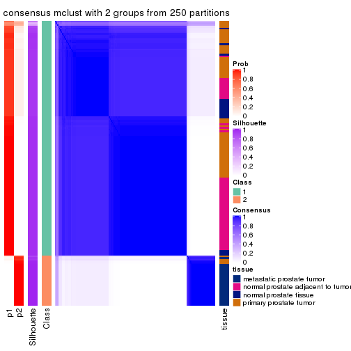</p>

</div>
<div id='tab-CV-mclust-consensus-heatmap-2'>
<pre><code class="r">consensus_heatmap(res, k = 3)
</code></pre>

<p>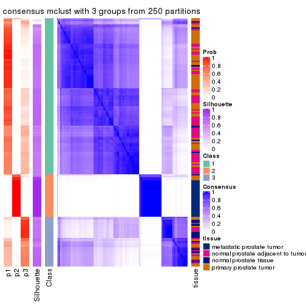</p>

</div>
<div id='tab-CV-mclust-consensus-heatmap-3'>
<pre><code class="r">consensus_heatmap(res, k = 4)
</code></pre>

<p>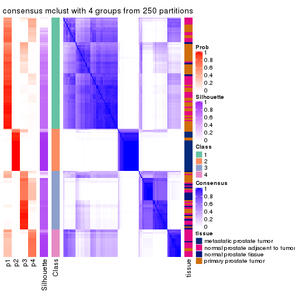</p>

</div>
<div id='tab-CV-mclust-consensus-heatmap-4'>
<pre><code class="r">consensus_heatmap(res, k = 5)
</code></pre>

<p>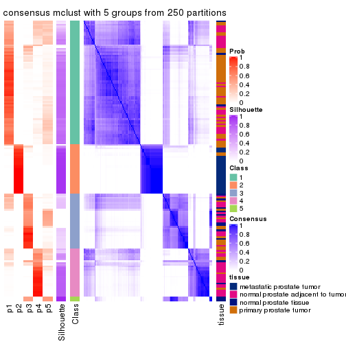</p>

</div>
<div id='tab-CV-mclust-consensus-heatmap-5'>
<pre><code class="r">consensus_heatmap(res, k = 6)
</code></pre>

<p>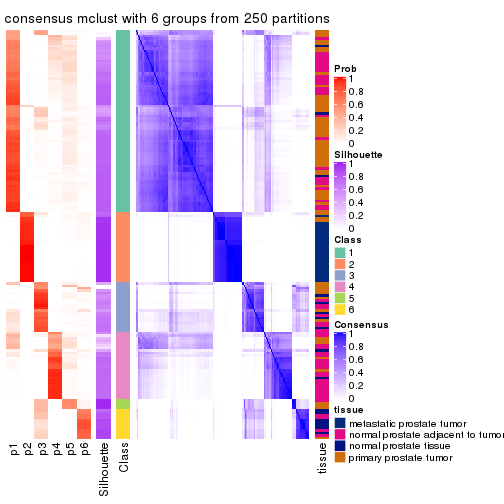</p>

</div>
</div>

Heatmaps for the membership of samples in all partitions to see how consistent they are:


<script>
$( function() {
	$( '#tabs-CV-mclust-membership-heatmap' ).tabs();
} );
</script>
<div id='tabs-CV-mclust-membership-heatmap'>
<ul>
<li><a href='#tab-CV-mclust-membership-heatmap-1'>k = 2</a></li>
<li><a href='#tab-CV-mclust-membership-heatmap-2'>k = 3</a></li>
<li><a href='#tab-CV-mclust-membership-heatmap-3'>k = 4</a></li>
<li><a href='#tab-CV-mclust-membership-heatmap-4'>k = 5</a></li>
<li><a href='#tab-CV-mclust-membership-heatmap-5'>k = 6</a></li>
</ul>
<div id='tab-CV-mclust-membership-heatmap-1'>
<pre><code class="r">membership_heatmap(res, k = 2)
</code></pre>

<p>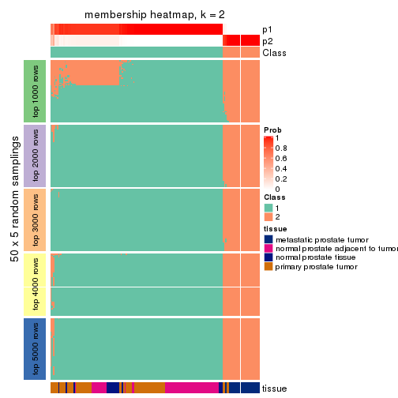</p>

</div>
<div id='tab-CV-mclust-membership-heatmap-2'>
<pre><code class="r">membership_heatmap(res, k = 3)
</code></pre>

<p>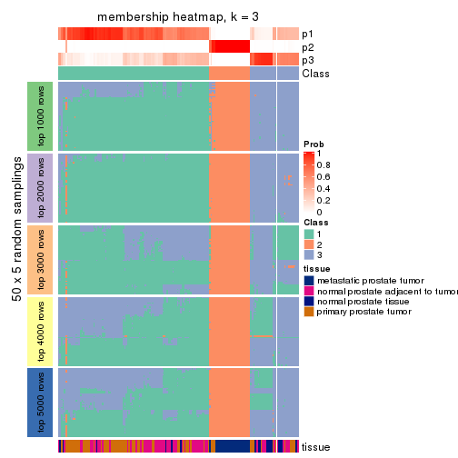</p>

</div>
<div id='tab-CV-mclust-membership-heatmap-3'>
<pre><code class="r">membership_heatmap(res, k = 4)
</code></pre>

<p>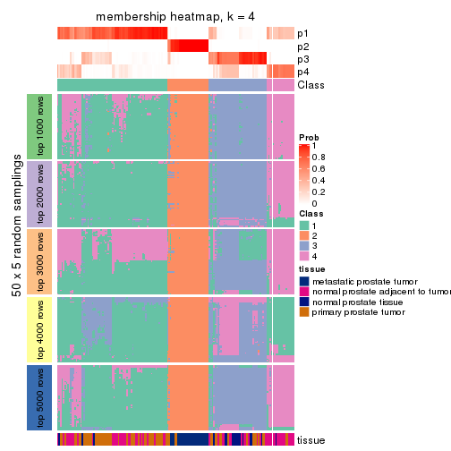</p>

</div>
<div id='tab-CV-mclust-membership-heatmap-4'>
<pre><code class="r">membership_heatmap(res, k = 5)
</code></pre>

<p>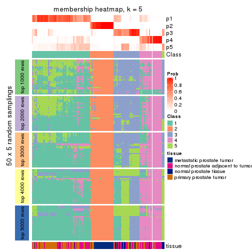</p>

</div>
<div id='tab-CV-mclust-membership-heatmap-5'>
<pre><code class="r">membership_heatmap(res, k = 6)
</code></pre>

<p>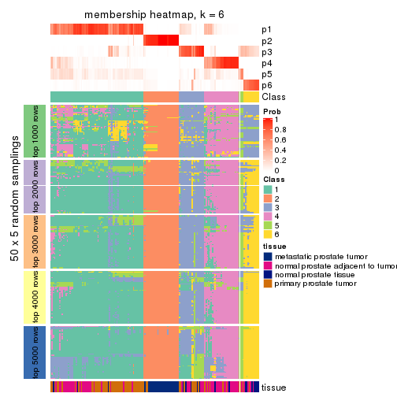</p>

</div>
</div>

As soon as we have had the classes for columns, we can look for signatures
which are significantly different between classes which can be candidate marks
for certain classes. Following are the heatmaps for signatures.


Signature heatmaps where rows are scaled:


<script>
$( function() {
	$( '#tabs-CV-mclust-get-signatures' ).tabs();
} );
</script>
<div id='tabs-CV-mclust-get-signatures'>
<ul>
<li><a href='#tab-CV-mclust-get-signatures-1'>k = 2</a></li>
<li><a href='#tab-CV-mclust-get-signatures-2'>k = 3</a></li>
<li><a href='#tab-CV-mclust-get-signatures-3'>k = 4</a></li>
<li><a href='#tab-CV-mclust-get-signatures-4'>k = 5</a></li>
<li><a href='#tab-CV-mclust-get-signatures-5'>k = 6</a></li>
</ul>
<div id='tab-CV-mclust-get-signatures-1'>
<pre><code class="r">get_signatures(res, k = 2)
</code></pre>

<p>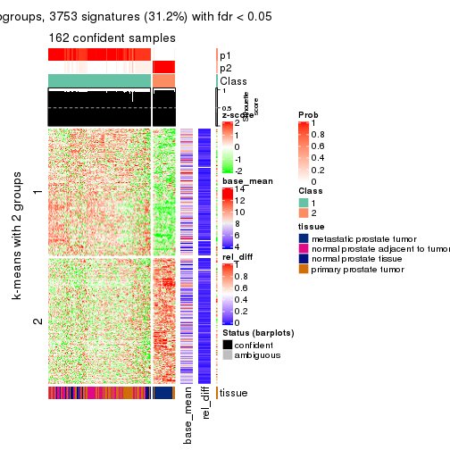</p>

</div>
<div id='tab-CV-mclust-get-signatures-2'>
<pre><code class="r">get_signatures(res, k = 3)
</code></pre>

<p>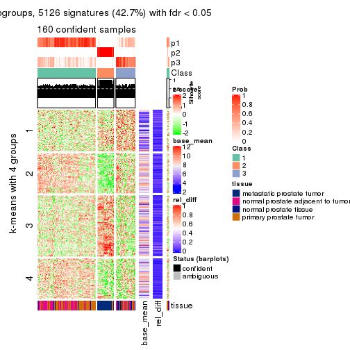</p>

</div>
<div id='tab-CV-mclust-get-signatures-3'>
<pre><code class="r">get_signatures(res, k = 4)
</code></pre>

<p>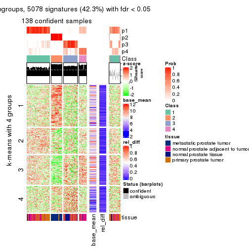</p>

</div>
<div id='tab-CV-mclust-get-signatures-4'>
<pre><code class="r">get_signatures(res, k = 5)
</code></pre>

<p>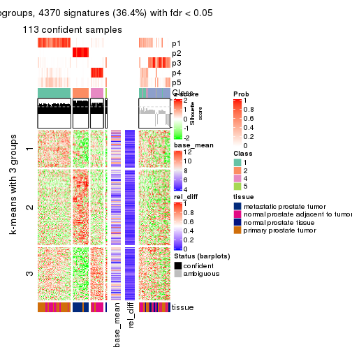</p>

</div>
<div id='tab-CV-mclust-get-signatures-5'>
<pre><code class="r">get_signatures(res, k = 6)
</code></pre>

<p>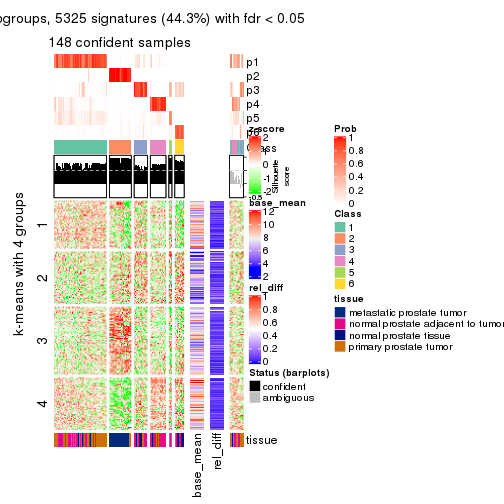</p>

</div>
</div>


Signature heatmaps where rows are not scaled:


<script>
$( function() {
	$( '#tabs-CV-mclust-get-signatures-no-scale' ).tabs();
} );
</script>
<div id='tabs-CV-mclust-get-signatures-no-scale'>
<ul>
<li><a href='#tab-CV-mclust-get-signatures-no-scale-1'>k = 2</a></li>
<li><a href='#tab-CV-mclust-get-signatures-no-scale-2'>k = 3</a></li>
<li><a href='#tab-CV-mclust-get-signatures-no-scale-3'>k = 4</a></li>
<li><a href='#tab-CV-mclust-get-signatures-no-scale-4'>k = 5</a></li>
<li><a href='#tab-CV-mclust-get-signatures-no-scale-5'>k = 6</a></li>
</ul>
<div id='tab-CV-mclust-get-signatures-no-scale-1'>
<pre><code class="r">get_signatures(res, k = 2, scale_rows = FALSE)
</code></pre>

<p>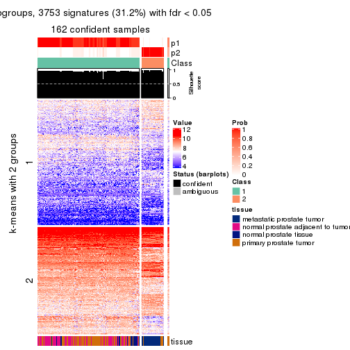</p>

</div>
<div id='tab-CV-mclust-get-signatures-no-scale-2'>
<pre><code class="r">get_signatures(res, k = 3, scale_rows = FALSE)
</code></pre>

<p>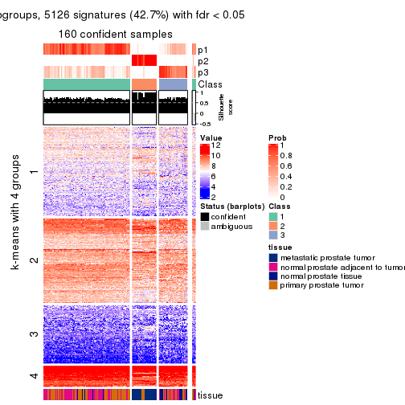</p>

</div>
<div id='tab-CV-mclust-get-signatures-no-scale-3'>
<pre><code class="r">get_signatures(res, k = 4, scale_rows = FALSE)
</code></pre>

<p>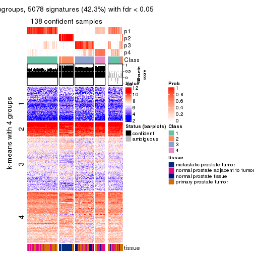</p>

</div>
<div id='tab-CV-mclust-get-signatures-no-scale-4'>
<pre><code class="r">get_signatures(res, k = 5, scale_rows = FALSE)
</code></pre>

<p>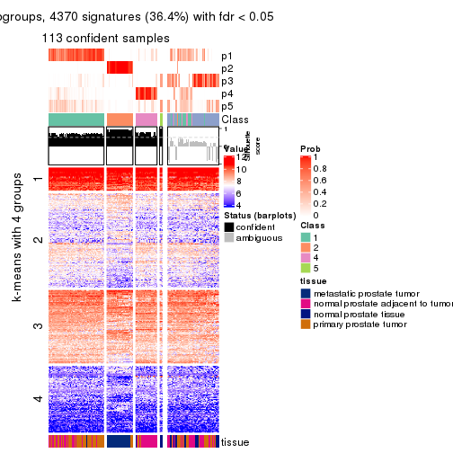</p>

</div>
<div id='tab-CV-mclust-get-signatures-no-scale-5'>
<pre><code class="r">get_signatures(res, k = 6, scale_rows = FALSE)
</code></pre>

<p>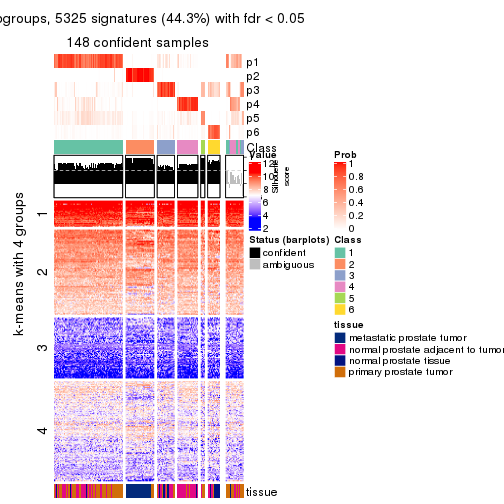</p>

</div>
</div>


Compare the overlap of signatures from different k:

```r
compare_signatures(res)
```

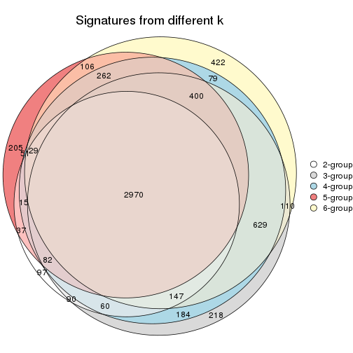

`get_signature()` returns a data frame invisibly. TO get the list of signatures, the function
call should be assigned to a variable explicitly. In following code, if `plot` argument is set
to `FALSE`, no heatmap is plotted while only the differential analysis is performed.

```r
# code only for demonstration
tb = get_signature(res, k = ..., plot = FALSE)
```

An example of the output of `tb` is:

```
#>   which_row         fdr    mean_1    mean_2 scaled_mean_1 scaled_mean_2 km
#> 1        38 0.042760348  8.373488  9.131774    -0.5533452     0.5164555  1
#> 2        40 0.018707592  7.106213  8.469186    -0.6173731     0.5762149  1
#> 3        55 0.019134737 10.221463 11.207825    -0.6159697     0.5749050  1
#> 4        59 0.006059896  5.921854  7.869574    -0.6899429     0.6439467  1
#> 5        60 0.018055526  8.928898 10.211722    -0.6204761     0.5791110  1
#> 6        98 0.009384629 15.714769 14.887706     0.6635654    -0.6193277  2
...
```

The columns in `tb` are:

1. `which_row`: row indices corresponding to the input matrix.
2. `fdr`: FDR for the differential test. 
3. `mean_x`: The mean value in group x.
4. `scaled_mean_x`: The mean value in group x after rows are scaled.
5. `km`: Row groups if k-means clustering is applied to rows.


UMAP plot which shows how samples are separated.


<script>
$( function() {
	$( '#tabs-CV-mclust-dimension-reduction' ).tabs();
} );
</script>
<div id='tabs-CV-mclust-dimension-reduction'>
<ul>
<li><a href='#tab-CV-mclust-dimension-reduction-1'>k = 2</a></li>
<li><a href='#tab-CV-mclust-dimension-reduction-2'>k = 3</a></li>
<li><a href='#tab-CV-mclust-dimension-reduction-3'>k = 4</a></li>
<li><a href='#tab-CV-mclust-dimension-reduction-4'>k = 5</a></li>
<li><a href='#tab-CV-mclust-dimension-reduction-5'>k = 6</a></li>
</ul>
<div id='tab-CV-mclust-dimension-reduction-1'>
<pre><code class="r">dimension_reduction(res, k = 2, method = &quot;UMAP&quot;)
</code></pre>

<p>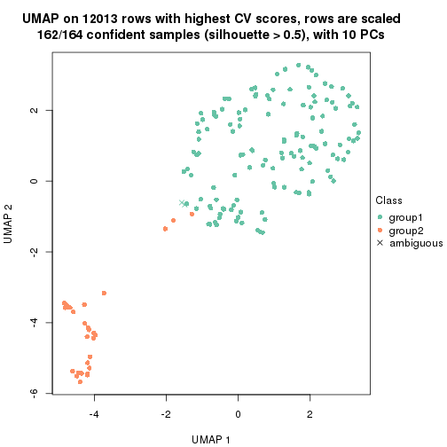</p>

</div>
<div id='tab-CV-mclust-dimension-reduction-2'>
<pre><code class="r">dimension_reduction(res, k = 3, method = &quot;UMAP&quot;)
</code></pre>

<p>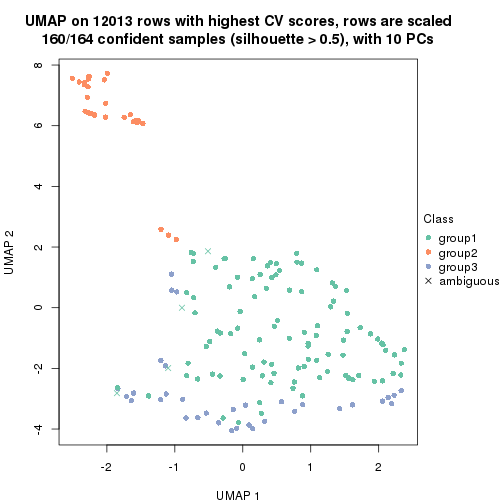</p>

</div>
<div id='tab-CV-mclust-dimension-reduction-3'>
<pre><code class="r">dimension_reduction(res, k = 4, method = &quot;UMAP&quot;)
</code></pre>

<p>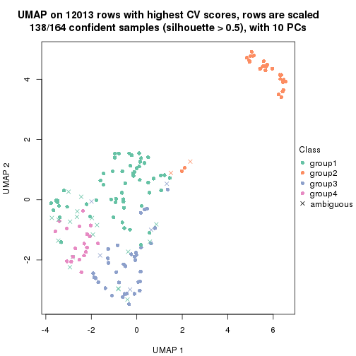</p>

</div>
<div id='tab-CV-mclust-dimension-reduction-4'>
<pre><code class="r">dimension_reduction(res, k = 5, method = &quot;UMAP&quot;)
</code></pre>

<p>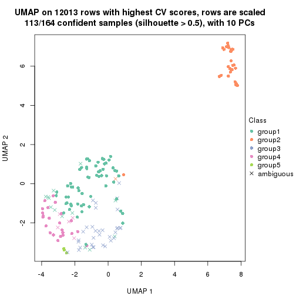</p>

</div>
<div id='tab-CV-mclust-dimension-reduction-5'>
<pre><code class="r">dimension_reduction(res, k = 6, method = &quot;UMAP&quot;)
</code></pre>

<p>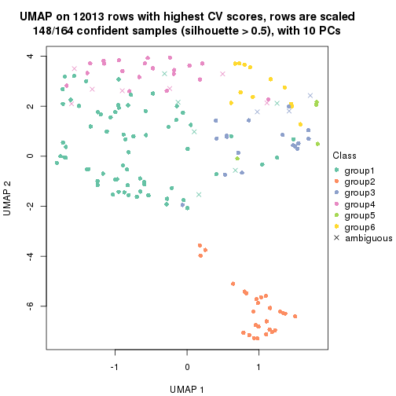</p>

</div>
</div>


Following heatmap shows how subgroups are split when increasing `k`:

```r
collect_classes(res)
```

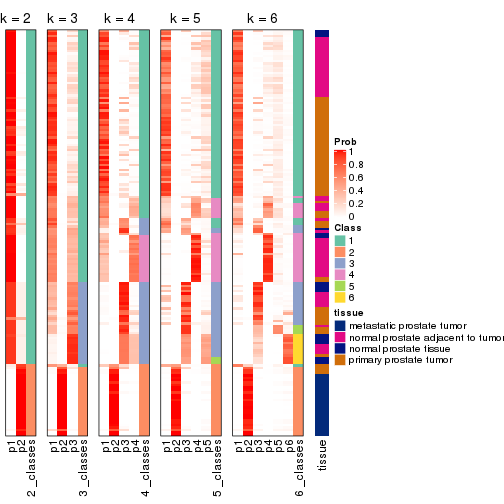


Test correlation between subgroups and known annotations. If the known
annotation is numeric, one-way ANOVA test is applied, and if the known
annotation is discrete, chi-squared contingency table test is applied.

```r
test_to_known_factors(res)
```

```
#>             n tissue(p) k
#> CV:mclust 162  2.11e-29 2
#> CV:mclust 160  1.60e-32 3
#> CV:mclust 138  1.65e-31 4
#> CV:mclust 113  1.86e-35 5
#> CV:mclust 148  2.16e-32 6
```


If matrix rows can be associated to genes, consider to use `functional_enrichment(res,
...)` to perform function enrichment for the signature genes. See [this vignette](http://bioconductor.org/packages/devel/bioc/vignettes/cola/inst/doc/functional_enrichment.html) for more detailed explanations.


 

---------------------------------------------------


### CV:NMF


The object with results only for a single top-value method and a single partition method 
can be extracted as:

```r
res = res_list["CV", "NMF"]
# you can also extract it by
# res = res_list["CV:NMF"]
```

A summary of `res` and all the functions that can be applied to it:

```r
res
```

```
#> A 'ConsensusPartition' object with k = 2, 3, 4, 5, 6.
#>   On a matrix with 12013 rows and 164 columns.
#>   Top rows (1000, 2000, 3000, 4000, 5000) are extracted by 'CV' method.
#>   Subgroups are detected by 'NMF' method.
#>   Performed in total 1250 partitions by row resampling.
#>   Best k for subgroups seems to be 3.
#> 
#> Following methods can be applied to this 'ConsensusPartition' object:
#>  [1] "cola_report"             "collect_classes"         "collect_plots"          
#>  [4] "collect_stats"           "colnames"                "compare_signatures"     
#>  [7] "consensus_heatmap"       "dimension_reduction"     "functional_enrichment"  
#> [10] "get_anno_col"            "get_anno"                "get_classes"            
#> [13] "get_consensus"           "get_matrix"              "get_membership"         
#> [16] "get_param"               "get_signatures"          "get_stats"              
#> [19] "is_best_k"               "is_stable_k"             "membership_heatmap"     
#> [22] "ncol"                    "nrow"                    "plot_ecdf"              
#> [25] "rownames"                "select_partition_number" "show"                   
#> [28] "suggest_best_k"          "test_to_known_factors"
```

`collect_plots()` function collects all the plots made from `res` for all `k` (number of partitions)
into one single page to provide an easy and fast comparison between different `k`.

```r
collect_plots(res)
```

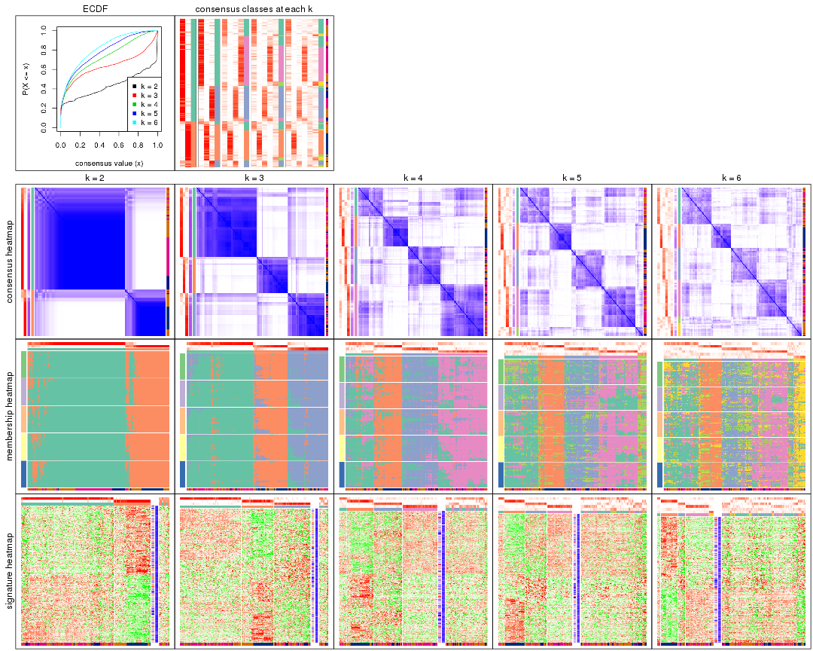

The plots are:

- The first row: a plot of the ECDF (empirical cumulative distribution
  function) curves of the consensus matrix for each `k` and the heatmap of
  predicted classes for each `k`.
- The second row: heatmaps of the consensus matrix for each `k`.
- The third row: heatmaps of the membership matrix for each `k`.
- The fouth row: heatmaps of the signatures for each `k`.

All the plots in panels can be made by individual functions and they are
plotted later in this section.

`select_partition_number()` produces several plots showing different
statistics for choosing "optimized" `k`. There are following statistics:

- ECDF curves of the consensus matrix for each `k`;
- 1-PAC. [The PAC
  score](https://en.wikipedia.org/wiki/Consensus_clustering#Over-interpretation_potential_of_consensus_clustering)
  measures the proportion of the ambiguous subgrouping.
- Mean silhouette score.
- Concordance. The mean probability of fiting the consensus class ids in all
  partitions.
- Area increased. Denote $A_k$ as the area under the ECDF curve for current
  `k`, the area increased is defined as $A_k - A_{k-1}$.
- Rand index. The percent of pairs of samples that are both in a same cluster
  or both are not in a same cluster in the partition of k and k-1.
- Jaccard index. The ratio of pairs of samples are both in a same cluster in
  the partition of k and k-1 and the pairs of samples are both in a same
  cluster in the partition k or k-1.

The detailed explanations of these statistics can be found in [the _cola_
vignette](http://bioconductor.org/packages/devel/bioc/vignettes/cola/inst/doc/cola.html#toc_13).

Generally speaking, lower PAC score, higher mean silhouette score or higher
concordance corresponds to better partition. Rand index and Jaccard index
measure how similar the current partition is compared to partition with `k-1`.
If they are too similar, we won't accept `k` is better than `k-1`.

```r
select_partition_number(res)
```

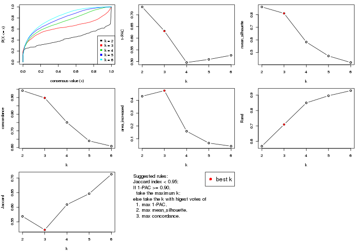

The numeric values for all these statistics can be obtained by `get_stats()`.

```r
get_stats(res)
```

```
#>   k 1-PAC mean_silhouette concordance area_increased  Rand Jaccard
#> 2 2 0.734           0.862       0.942         0.4318 0.569   0.569
#> 3 3 0.631           0.811       0.898         0.4756 0.709   0.523
#> 4 4 0.496           0.583       0.751         0.1590 0.850   0.609
#> 5 5 0.509           0.472       0.640         0.0668 0.896   0.646
#> 6 6 0.527           0.420       0.608         0.0425 0.929   0.713
```

`suggest_best_k()` suggests the best $k$ based on these statistics. The rules are as follows:

- All $k$ with Jaccard index larger than 0.95 are removed because increasing
  $k$ does not provide enough extra information. If all $k$ are removed, it is
  marked as no subgroup is detected.
- For all $k$ with 1-PAC score larger than 0.9, the maximal $k$ is taken as
  the best $k$, and other $k$ are marked as optional $k$.
- If it does not fit the second rule. The $k$ with the maximal vote of the
  highest 1-PAC score, highest mean silhouette, and highest concordance is
  taken as the best $k$.

```r
suggest_best_k(res)
```

```
#> [1] 3
```


Following shows the table of the partitions (You need to click the **show/hide
code output** link to see it). The membership matrix (columns with name `p*`)
is inferred by
[`clue::cl_consensus()`](https://www.rdocumentation.org/link/cl_consensus?package=clue)
function with the `SE` method. Basically the value in the membership matrix
represents the probability to belong to a certain group. The finall class
label for an item is determined with the group with highest probability it
belongs to.

In `get_classes()` function, the entropy is calculated from the membership
matrix and the silhouette score is calculated from the consensus matrix.


<script>
$( function() {
	$( '#tabs-CV-NMF-get-classes' ).tabs();
} );
</script>
<div id='tabs-CV-NMF-get-classes'>
<ul>
<li><a href='#tab-CV-NMF-get-classes-1'>k = 2</a></li>
<li><a href='#tab-CV-NMF-get-classes-2'>k = 3</a></li>
<li><a href='#tab-CV-NMF-get-classes-3'>k = 4</a></li>
<li><a href='#tab-CV-NMF-get-classes-4'>k = 5</a></li>
<li><a href='#tab-CV-NMF-get-classes-5'>k = 6</a></li>
</ul>

<div id='tab-CV-NMF-get-classes-1'>
<p><a id='tab-CV-NMF-get-classes-1-a' style='color:#0366d6' href='#'>show/hide code output</a></p>
<pre><code class="r">cbind(get_classes(res, k = 2), get_membership(res, k = 2))
</code></pre>

<pre><code>#&gt;           class entropy silhouette    p1    p2
#&gt; GSM152839     1  0.0000     0.9489 1.000 0.000
#&gt; GSM152840     1  0.0000     0.9489 1.000 0.000
#&gt; GSM152841     1  0.0000     0.9489 1.000 0.000
#&gt; GSM152842     1  0.0000     0.9489 1.000 0.000
#&gt; GSM152843     1  0.0000     0.9489 1.000 0.000
#&gt; GSM152844     1  0.0000     0.9489 1.000 0.000
#&gt; GSM152845     2  0.9795     0.3465 0.416 0.584
#&gt; GSM152846     1  0.0000     0.9489 1.000 0.000
#&gt; GSM152847     1  0.0000     0.9489 1.000 0.000
#&gt; GSM152848     1  0.0000     0.9489 1.000 0.000
#&gt; GSM152849     1  0.0000     0.9489 1.000 0.000
#&gt; GSM152850     1  0.0000     0.9489 1.000 0.000
#&gt; GSM152851     1  0.0376     0.9466 0.996 0.004
#&gt; GSM152852     1  0.0000     0.9489 1.000 0.000
#&gt; GSM152853     1  0.0000     0.9489 1.000 0.000
#&gt; GSM152854     1  0.0000     0.9489 1.000 0.000
#&gt; GSM152855     1  0.0000     0.9489 1.000 0.000
#&gt; GSM153238     1  0.7950     0.6737 0.760 0.240
#&gt; GSM153239     1  0.0000     0.9489 1.000 0.000
#&gt; GSM153240     1  0.0000     0.9489 1.000 0.000
#&gt; GSM153241     1  0.0000     0.9489 1.000 0.000
#&gt; GSM153242     1  0.3879     0.8878 0.924 0.076
#&gt; GSM153243     1  0.8016     0.6700 0.756 0.244
#&gt; GSM153244     1  0.9988     0.0195 0.520 0.480
#&gt; GSM153245     1  0.0000     0.9489 1.000 0.000
#&gt; GSM153246     1  0.0000     0.9489 1.000 0.000
#&gt; GSM153247     1  0.2778     0.9154 0.952 0.048
#&gt; GSM153248     2  0.9608     0.4077 0.384 0.616
#&gt; GSM153249     1  0.0000     0.9489 1.000 0.000
#&gt; GSM153250     1  0.0000     0.9489 1.000 0.000
#&gt; GSM153251     1  0.8955     0.5321 0.688 0.312
#&gt; GSM153252     1  0.0000     0.9489 1.000 0.000
#&gt; GSM153253     1  0.0000     0.9489 1.000 0.000
#&gt; GSM153254     1  0.3879     0.8908 0.924 0.076
#&gt; GSM153255     1  0.0000     0.9489 1.000 0.000
#&gt; GSM153256     1  0.0376     0.9466 0.996 0.004
#&gt; GSM153257     1  0.0000     0.9489 1.000 0.000
#&gt; GSM153258     1  0.0000     0.9489 1.000 0.000
#&gt; GSM153259     1  0.6438     0.7844 0.836 0.164
#&gt; GSM153260     1  0.5408     0.8372 0.876 0.124
#&gt; GSM153261     1  0.0672     0.9440 0.992 0.008
#&gt; GSM153262     1  0.0000     0.9489 1.000 0.000
#&gt; GSM153263     1  0.0000     0.9489 1.000 0.000
#&gt; GSM153264     1  0.0000     0.9489 1.000 0.000
#&gt; GSM153265     1  0.0000     0.9489 1.000 0.000
#&gt; GSM153266     1  0.0000     0.9489 1.000 0.000
#&gt; GSM153267     1  0.0000     0.9489 1.000 0.000
#&gt; GSM153268     1  0.0000     0.9489 1.000 0.000
#&gt; GSM153269     1  0.0000     0.9489 1.000 0.000
#&gt; GSM153270     1  0.0000     0.9489 1.000 0.000
#&gt; GSM153271     1  0.0000     0.9489 1.000 0.000
#&gt; GSM153272     1  0.0000     0.9489 1.000 0.000
#&gt; GSM153273     1  0.8327     0.6306 0.736 0.264
#&gt; GSM153274     1  0.0000     0.9489 1.000 0.000
#&gt; GSM153275     1  0.0000     0.9489 1.000 0.000
#&gt; GSM153276     1  0.0000     0.9489 1.000 0.000
#&gt; GSM153277     1  0.0000     0.9489 1.000 0.000
#&gt; GSM153278     1  0.0000     0.9489 1.000 0.000
#&gt; GSM153279     1  0.0000     0.9489 1.000 0.000
#&gt; GSM153280     1  0.0000     0.9489 1.000 0.000
#&gt; GSM153281     1  0.0000     0.9489 1.000 0.000
#&gt; GSM153282     1  0.0000     0.9489 1.000 0.000
#&gt; GSM153283     1  0.0000     0.9489 1.000 0.000
#&gt; GSM153284     1  0.0376     0.9466 0.996 0.004
#&gt; GSM153285     1  0.0000     0.9489 1.000 0.000
#&gt; GSM153286     1  0.0000     0.9489 1.000 0.000
#&gt; GSM153287     1  0.0000     0.9489 1.000 0.000
#&gt; GSM153288     1  0.0000     0.9489 1.000 0.000
#&gt; GSM153289     1  0.0000     0.9489 1.000 0.000
#&gt; GSM153290     1  0.0000     0.9489 1.000 0.000
#&gt; GSM153291     1  0.0000     0.9489 1.000 0.000
#&gt; GSM153292     1  0.0000     0.9489 1.000 0.000
#&gt; GSM153293     1  0.0000     0.9489 1.000 0.000
#&gt; GSM153294     2  0.9427     0.4623 0.360 0.640
#&gt; GSM153295     1  0.0000     0.9489 1.000 0.000
#&gt; GSM153054     1  0.0000     0.9489 1.000 0.000
#&gt; GSM153055     1  0.2236     0.9248 0.964 0.036
#&gt; GSM153056     1  0.0000     0.9489 1.000 0.000
#&gt; GSM153057     1  0.1184     0.9393 0.984 0.016
#&gt; GSM153058     1  0.0000     0.9489 1.000 0.000
#&gt; GSM153059     2  0.9944     0.2277 0.456 0.544
#&gt; GSM153060     1  0.0000     0.9489 1.000 0.000
#&gt; GSM153061     1  0.0000     0.9489 1.000 0.000
#&gt; GSM153062     1  0.8661     0.5826 0.712 0.288
#&gt; GSM153063     1  0.0376     0.9466 0.996 0.004
#&gt; GSM153064     1  0.3431     0.8995 0.936 0.064
#&gt; GSM153065     2  0.9963     0.2031 0.464 0.536
#&gt; GSM153066     2  0.6048     0.7912 0.148 0.852
#&gt; GSM153067     1  0.1843     0.9303 0.972 0.028
#&gt; GSM153068     1  0.6343     0.7930 0.840 0.160
#&gt; GSM153069     1  0.0000     0.9489 1.000 0.000
#&gt; GSM153070     1  0.0000     0.9489 1.000 0.000
#&gt; GSM153071     1  0.0000     0.9489 1.000 0.000
#&gt; GSM153072     1  0.3274     0.9030 0.940 0.060
#&gt; GSM153073     1  0.0376     0.9466 0.996 0.004
#&gt; GSM153074     1  0.0672     0.9443 0.992 0.008
#&gt; GSM153075     1  0.1414     0.9363 0.980 0.020
#&gt; GSM153076     1  0.0000     0.9489 1.000 0.000
#&gt; GSM153077     1  0.3733     0.8930 0.928 0.072
#&gt; GSM153078     1  0.0000     0.9489 1.000 0.000
#&gt; GSM153079     2  0.7299     0.7303 0.204 0.796
#&gt; GSM153080     1  0.0000     0.9489 1.000 0.000
#&gt; GSM153081     1  0.0000     0.9489 1.000 0.000
#&gt; GSM153082     2  0.0376     0.9025 0.004 0.996
#&gt; GSM153083     2  0.0672     0.9007 0.008 0.992
#&gt; GSM153084     2  0.0672     0.9006 0.008 0.992
#&gt; GSM153085     2  0.9954     0.2167 0.460 0.540
#&gt; GSM153086     2  0.5946     0.7958 0.144 0.856
#&gt; GSM153087     1  0.0000     0.9489 1.000 0.000
#&gt; GSM153088     1  0.0000     0.9489 1.000 0.000
#&gt; GSM153089     1  0.7528     0.7138 0.784 0.216
#&gt; GSM153090     1  0.0000     0.9489 1.000 0.000
#&gt; GSM153091     2  0.0000     0.9043 0.000 1.000
#&gt; GSM153092     1  0.9248     0.4703 0.660 0.340
#&gt; GSM153093     1  0.0000     0.9489 1.000 0.000
#&gt; GSM153094     2  0.0000     0.9043 0.000 1.000
#&gt; GSM153095     2  0.9866     0.2797 0.432 0.568
#&gt; GSM153096     1  0.6438     0.7916 0.836 0.164
#&gt; GSM153097     2  0.1633     0.8914 0.024 0.976
#&gt; GSM153098     1  0.9552     0.3741 0.624 0.376
#&gt; GSM153099     1  0.0000     0.9489 1.000 0.000
#&gt; GSM153100     1  0.9170     0.4897 0.668 0.332
#&gt; GSM153101     1  0.5294     0.8444 0.880 0.120
#&gt; GSM153102     2  0.6048     0.7928 0.148 0.852
#&gt; GSM153103     2  0.9896     0.2695 0.440 0.560
#&gt; GSM153104     1  0.0000     0.9489 1.000 0.000
#&gt; GSM153106     1  0.6712     0.7805 0.824 0.176
#&gt; GSM153107     1  0.7883     0.6838 0.764 0.236
#&gt; GSM153108     1  0.3431     0.9005 0.936 0.064
#&gt; GSM153109     2  0.0000     0.9043 0.000 1.000
#&gt; GSM153110     1  0.8661     0.5869 0.712 0.288
#&gt; GSM153111     2  0.1843     0.8888 0.028 0.972
#&gt; GSM153112     2  0.9044     0.5475 0.320 0.680
#&gt; GSM153113     2  0.0000     0.9043 0.000 1.000
#&gt; GSM153114     1  0.0000     0.9489 1.000 0.000
#&gt; GSM187532     2  0.0672     0.9006 0.008 0.992
#&gt; GSM187533     2  0.0000     0.9043 0.000 1.000
#&gt; GSM187534     2  0.0000     0.9043 0.000 1.000
#&gt; GSM187535     2  0.0000     0.9043 0.000 1.000
#&gt; GSM152906     2  0.0000     0.9043 0.000 1.000
#&gt; GSM152907     2  0.0000     0.9043 0.000 1.000
#&gt; GSM152908     2  0.0000     0.9043 0.000 1.000
#&gt; GSM152909     2  0.0000     0.9043 0.000 1.000
#&gt; GSM152910     2  0.0000     0.9043 0.000 1.000
#&gt; GSM152911     2  0.0000     0.9043 0.000 1.000
#&gt; GSM152912     2  0.0000     0.9043 0.000 1.000
#&gt; GSM152913     2  0.0000     0.9043 0.000 1.000
#&gt; GSM152914     2  0.0000     0.9043 0.000 1.000
#&gt; GSM152915     2  0.0000     0.9043 0.000 1.000
#&gt; GSM152916     2  0.0000     0.9043 0.000 1.000
#&gt; GSM152917     2  0.0000     0.9043 0.000 1.000
#&gt; GSM152918     2  0.0000     0.9043 0.000 1.000
#&gt; GSM152919     2  0.0000     0.9043 0.000 1.000
#&gt; GSM152920     2  0.0000     0.9043 0.000 1.000
#&gt; GSM152921     2  0.0000     0.9043 0.000 1.000
#&gt; GSM152922     2  0.0000     0.9043 0.000 1.000
#&gt; GSM152923     2  0.0000     0.9043 0.000 1.000
#&gt; GSM152924     2  0.0000     0.9043 0.000 1.000
#&gt; GSM152925     2  0.0000     0.9043 0.000 1.000
#&gt; GSM152926     2  0.0000     0.9043 0.000 1.000
#&gt; GSM152927     2  0.0000     0.9043 0.000 1.000
#&gt; GSM152928     2  0.0000     0.9043 0.000 1.000
#&gt; GSM152929     2  0.0000     0.9043 0.000 1.000
#&gt; GSM152930     2  0.0000     0.9043 0.000 1.000
</code></pre>

<script>
$('#tab-CV-NMF-get-classes-1-a').parent().next().next().hide();
$('#tab-CV-NMF-get-classes-1-a').click(function(){
  $('#tab-CV-NMF-get-classes-1-a').parent().next().next().toggle();
  return(false);
});
</script>
</div>

<div id='tab-CV-NMF-get-classes-2'>
<p><a id='tab-CV-NMF-get-classes-2-a' style='color:#0366d6' href='#'>show/hide code output</a></p>
<pre><code class="r">cbind(get_classes(res, k = 3), get_membership(res, k = 3))
</code></pre>

<pre><code>#&gt;           class entropy silhouette    p1    p2    p3
#&gt; GSM152839     3  0.6192     0.3392 0.420 0.000 0.580
#&gt; GSM152840     3  0.4235     0.7930 0.176 0.000 0.824
#&gt; GSM152841     1  0.0592     0.9095 0.988 0.000 0.012
#&gt; GSM152842     3  0.1031     0.8563 0.024 0.000 0.976
#&gt; GSM152843     3  0.4931     0.7309 0.232 0.000 0.768
#&gt; GSM152844     3  0.1411     0.8567 0.036 0.000 0.964
#&gt; GSM152845     3  0.1163     0.8321 0.000 0.028 0.972
#&gt; GSM152846     3  0.0592     0.8544 0.012 0.000 0.988
#&gt; GSM152847     3  0.3752     0.8173 0.144 0.000 0.856
#&gt; GSM152848     1  0.3941     0.8125 0.844 0.000 0.156
#&gt; GSM152849     3  0.2261     0.8516 0.068 0.000 0.932
#&gt; GSM152850     3  0.2878     0.8439 0.096 0.000 0.904
#&gt; GSM152851     3  0.6045     0.4541 0.380 0.000 0.620
#&gt; GSM152852     3  0.0892     0.8559 0.020 0.000 0.980
#&gt; GSM152853     3  0.3116     0.8389 0.108 0.000 0.892
#&gt; GSM152854     3  0.0424     0.8532 0.008 0.000 0.992
#&gt; GSM152855     1  0.0983     0.9030 0.980 0.016 0.004
#&gt; GSM153238     3  0.0237     0.8496 0.000 0.004 0.996
#&gt; GSM153239     3  0.2711     0.8471 0.088 0.000 0.912
#&gt; GSM153240     1  0.0747     0.9091 0.984 0.000 0.016
#&gt; GSM153241     3  0.3192     0.8370 0.112 0.000 0.888
#&gt; GSM153242     3  0.0237     0.8518 0.004 0.000 0.996
#&gt; GSM153243     3  0.0983     0.8438 0.004 0.016 0.980
#&gt; GSM153244     1  0.5894     0.7077 0.752 0.220 0.028
#&gt; GSM153245     3  0.2625     0.8484 0.084 0.000 0.916
#&gt; GSM153246     3  0.0237     0.8518 0.004 0.000 0.996
#&gt; GSM153247     3  0.0592     0.8544 0.012 0.000 0.988
#&gt; GSM153248     1  0.6247     0.4472 0.620 0.376 0.004
#&gt; GSM153249     1  0.0829     0.9049 0.984 0.012 0.004
#&gt; GSM153250     1  0.0661     0.9057 0.988 0.008 0.004
#&gt; GSM153251     3  0.0747     0.8426 0.000 0.016 0.984
#&gt; GSM153252     1  0.1411     0.9047 0.964 0.000 0.036
#&gt; GSM153253     1  0.0892     0.9086 0.980 0.000 0.020
#&gt; GSM153254     3  0.6318     0.5043 0.356 0.008 0.636
#&gt; GSM153255     1  0.0475     0.9070 0.992 0.004 0.004
#&gt; GSM153256     1  0.0475     0.9097 0.992 0.004 0.004
#&gt; GSM153257     1  0.0592     0.9095 0.988 0.000 0.012
#&gt; GSM153258     1  0.0592     0.9104 0.988 0.000 0.012
#&gt; GSM153259     1  0.3784     0.8379 0.864 0.132 0.004
#&gt; GSM153260     3  0.0424     0.8475 0.000 0.008 0.992
#&gt; GSM153261     3  0.0237     0.8518 0.004 0.000 0.996
#&gt; GSM153262     1  0.2165     0.8927 0.936 0.000 0.064
#&gt; GSM153263     1  0.0000     0.9086 1.000 0.000 0.000
#&gt; GSM153264     1  0.3412     0.8468 0.876 0.000 0.124
#&gt; GSM153265     1  0.4842     0.7184 0.776 0.000 0.224
#&gt; GSM153266     1  0.5363     0.6280 0.724 0.000 0.276
#&gt; GSM153267     1  0.0237     0.9079 0.996 0.000 0.004
#&gt; GSM153268     1  0.3551     0.8334 0.868 0.000 0.132
#&gt; GSM153269     1  0.0000     0.9086 1.000 0.000 0.000
#&gt; GSM153270     1  0.2625     0.8786 0.916 0.000 0.084
#&gt; GSM153271     1  0.0829     0.9044 0.984 0.012 0.004
#&gt; GSM153272     1  0.0237     0.9093 0.996 0.000 0.004
#&gt; GSM153273     1  0.3500     0.8506 0.880 0.116 0.004
#&gt; GSM153274     1  0.2537     0.8829 0.920 0.000 0.080
#&gt; GSM153275     1  0.0747     0.9091 0.984 0.000 0.016
#&gt; GSM153276     1  0.3116     0.8611 0.892 0.000 0.108
#&gt; GSM153277     1  0.2066     0.8956 0.940 0.000 0.060
#&gt; GSM153278     3  0.2537     0.8489 0.080 0.000 0.920
#&gt; GSM153279     1  0.5650     0.5321 0.688 0.000 0.312
#&gt; GSM153280     1  0.1529     0.9037 0.960 0.000 0.040
#&gt; GSM153281     1  0.1860     0.8988 0.948 0.000 0.052
#&gt; GSM153282     1  0.1643     0.9026 0.956 0.000 0.044
#&gt; GSM153283     1  0.0592     0.9095 0.988 0.000 0.012
#&gt; GSM153284     1  0.0237     0.9093 0.996 0.000 0.004
#&gt; GSM153285     1  0.1529     0.9037 0.960 0.000 0.040
#&gt; GSM153286     1  0.0000     0.9086 1.000 0.000 0.000
#&gt; GSM153287     1  0.0592     0.9095 0.988 0.000 0.012
#&gt; GSM153288     1  0.0237     0.9080 0.996 0.004 0.000
#&gt; GSM153289     1  0.1399     0.8977 0.968 0.028 0.004
#&gt; GSM153290     1  0.1163     0.9067 0.972 0.000 0.028
#&gt; GSM153291     1  0.0237     0.9079 0.996 0.000 0.004
#&gt; GSM153292     1  0.0424     0.9095 0.992 0.000 0.008
#&gt; GSM153293     1  0.0661     0.9064 0.988 0.008 0.004
#&gt; GSM153294     1  0.6330     0.4116 0.600 0.396 0.004
#&gt; GSM153295     1  0.2878     0.8705 0.904 0.000 0.096
#&gt; GSM153054     3  0.6309     0.0439 0.496 0.000 0.504
#&gt; GSM153055     1  0.3340     0.8505 0.880 0.000 0.120
#&gt; GSM153056     3  0.4654     0.7646 0.208 0.000 0.792
#&gt; GSM153057     3  0.4233     0.8075 0.160 0.004 0.836
#&gt; GSM153058     3  0.1289     0.8568 0.032 0.000 0.968
#&gt; GSM153059     3  0.1399     0.8365 0.004 0.028 0.968
#&gt; GSM153060     3  0.0592     0.8548 0.012 0.000 0.988
#&gt; GSM153061     3  0.0475     0.8519 0.004 0.004 0.992
#&gt; GSM153062     3  0.0747     0.8426 0.000 0.016 0.984
#&gt; GSM153063     3  0.1031     0.8567 0.024 0.000 0.976
#&gt; GSM153064     1  0.0983     0.9058 0.980 0.016 0.004
#&gt; GSM153065     3  0.1031     0.8355 0.000 0.024 0.976
#&gt; GSM153066     3  0.4121     0.6718 0.000 0.168 0.832
#&gt; GSM153067     1  0.1647     0.8934 0.960 0.036 0.004
#&gt; GSM153068     3  0.0592     0.8451 0.000 0.012 0.988
#&gt; GSM153069     1  0.0237     0.9093 0.996 0.000 0.004
#&gt; GSM153070     1  0.0747     0.9091 0.984 0.000 0.016
#&gt; GSM153071     1  0.6307    -0.0103 0.512 0.000 0.488
#&gt; GSM153072     1  0.7245     0.3494 0.596 0.036 0.368
#&gt; GSM153073     1  0.0848     0.9077 0.984 0.008 0.008
#&gt; GSM153074     1  0.0661     0.9057 0.988 0.008 0.004
#&gt; GSM153075     1  0.0892     0.9086 0.980 0.000 0.020
#&gt; GSM153076     1  0.0475     0.9093 0.992 0.004 0.004
#&gt; GSM153077     1  0.5092     0.7726 0.804 0.020 0.176
#&gt; GSM153078     3  0.4654     0.7639 0.208 0.000 0.792
#&gt; GSM153079     2  0.6794     0.5057 0.324 0.648 0.028
#&gt; GSM153080     3  0.3619     0.8223 0.136 0.000 0.864
#&gt; GSM153081     1  0.1753     0.9010 0.952 0.000 0.048
#&gt; GSM153082     2  0.1267     0.8693 0.024 0.972 0.004
#&gt; GSM153083     2  0.3482     0.8521 0.000 0.872 0.128
#&gt; GSM153084     2  0.5882     0.6211 0.000 0.652 0.348
#&gt; GSM153085     3  0.4966     0.7882 0.060 0.100 0.840
#&gt; GSM153086     2  0.8887     0.2413 0.124 0.488 0.388
#&gt; GSM153087     1  0.1163     0.9067 0.972 0.000 0.028
#&gt; GSM153088     1  0.0747     0.9104 0.984 0.000 0.016
#&gt; GSM153089     3  0.0592     0.8449 0.000 0.012 0.988
#&gt; GSM153090     1  0.0892     0.9086 0.980 0.000 0.020
#&gt; GSM153091     2  0.1989     0.8551 0.048 0.948 0.004
#&gt; GSM153092     1  0.3826     0.8380 0.868 0.124 0.008
#&gt; GSM153093     1  0.0592     0.9095 0.988 0.000 0.012
#&gt; GSM153094     2  0.2031     0.8698 0.032 0.952 0.016
#&gt; GSM153095     3  0.8821     0.5220 0.232 0.188 0.580
#&gt; GSM153096     1  0.1989     0.8957 0.948 0.048 0.004
#&gt; GSM153097     2  0.2486     0.8520 0.060 0.932 0.008
#&gt; GSM153098     1  0.4110     0.8154 0.844 0.152 0.004
#&gt; GSM153099     1  0.3340     0.8511 0.880 0.000 0.120
#&gt; GSM153100     1  0.3112     0.8620 0.900 0.096 0.004
#&gt; GSM153101     3  0.4755     0.7826 0.184 0.008 0.808
#&gt; GSM153102     2  0.7983     0.5601 0.108 0.636 0.256
#&gt; GSM153103     3  0.6322     0.7483 0.108 0.120 0.772
#&gt; GSM153104     1  0.1860     0.8995 0.948 0.000 0.052
#&gt; GSM153106     1  0.3918     0.8174 0.856 0.140 0.004
#&gt; GSM153107     1  0.2860     0.8664 0.912 0.084 0.004
#&gt; GSM153108     1  0.2564     0.8996 0.936 0.036 0.028
#&gt; GSM153109     2  0.0829     0.8776 0.012 0.984 0.004
#&gt; GSM153110     1  0.6054     0.7506 0.768 0.180 0.052
#&gt; GSM153111     2  0.3850     0.8505 0.028 0.884 0.088
#&gt; GSM153112     1  0.6282     0.4303 0.612 0.384 0.004
#&gt; GSM153113     2  0.2066     0.8809 0.000 0.940 0.060
#&gt; GSM153114     1  0.0983     0.9030 0.980 0.016 0.004
#&gt; GSM187532     3  0.5363     0.4575 0.000 0.276 0.724
#&gt; GSM187533     2  0.3619     0.8524 0.000 0.864 0.136
#&gt; GSM187534     2  0.2537     0.8753 0.000 0.920 0.080
#&gt; GSM187535     2  0.0829     0.8745 0.012 0.984 0.004
#&gt; GSM152906     2  0.0747     0.8837 0.000 0.984 0.016
#&gt; GSM152907     2  0.0237     0.8808 0.000 0.996 0.004
#&gt; GSM152908     2  0.1031     0.8841 0.000 0.976 0.024
#&gt; GSM152909     2  0.6299     0.3376 0.000 0.524 0.476
#&gt; GSM152910     2  0.5621     0.6867 0.000 0.692 0.308
#&gt; GSM152911     2  0.2066     0.8802 0.000 0.940 0.060
#&gt; GSM152912     2  0.2165     0.8791 0.000 0.936 0.064
#&gt; GSM152913     2  0.5497     0.7078 0.000 0.708 0.292
#&gt; GSM152914     2  0.1163     0.8842 0.000 0.972 0.028
#&gt; GSM152915     2  0.0592     0.8828 0.000 0.988 0.012
#&gt; GSM152916     2  0.4291     0.8232 0.000 0.820 0.180
#&gt; GSM152917     2  0.0424     0.8817 0.000 0.992 0.008
#&gt; GSM152918     2  0.0475     0.8772 0.004 0.992 0.004
#&gt; GSM152919     2  0.0747     0.8837 0.000 0.984 0.016
#&gt; GSM152920     2  0.1031     0.8841 0.000 0.976 0.024
#&gt; GSM152921     2  0.0592     0.8828 0.000 0.988 0.012
#&gt; GSM152922     2  0.2878     0.8693 0.000 0.904 0.096
#&gt; GSM152923     2  0.1031     0.8843 0.000 0.976 0.024
#&gt; GSM152924     2  0.3752     0.8470 0.000 0.856 0.144
#&gt; GSM152925     2  0.4346     0.8205 0.000 0.816 0.184
#&gt; GSM152926     2  0.0475     0.8799 0.004 0.992 0.004
#&gt; GSM152927     2  0.5650     0.6811 0.000 0.688 0.312
#&gt; GSM152928     2  0.4702     0.7954 0.000 0.788 0.212
#&gt; GSM152929     2  0.0747     0.8837 0.000 0.984 0.016
#&gt; GSM152930     2  0.0747     0.8837 0.000 0.984 0.016
</code></pre>

<script>
$('#tab-CV-NMF-get-classes-2-a').parent().next().next().hide();
$('#tab-CV-NMF-get-classes-2-a').click(function(){
  $('#tab-CV-NMF-get-classes-2-a').parent().next().next().toggle();
  return(false);
});
</script>
</div>

<div id='tab-CV-NMF-get-classes-3'>
<p><a id='tab-CV-NMF-get-classes-3-a' style='color:#0366d6' href='#'>show/hide code output</a></p>
<pre><code class="r">cbind(get_classes(res, k = 4), get_membership(res, k = 4))
</code></pre>

<pre><code>#&gt;           class entropy silhouette    p1    p2    p3    p4
#&gt; GSM152839     3  0.7045     0.3788 0.308 0.000 0.544 0.148
#&gt; GSM152840     3  0.6329     0.4245 0.064 0.004 0.588 0.344
#&gt; GSM152841     4  0.2360     0.6842 0.020 0.004 0.052 0.924
#&gt; GSM152842     3  0.3791     0.7255 0.200 0.000 0.796 0.004
#&gt; GSM152843     3  0.5267     0.7062 0.184 0.000 0.740 0.076
#&gt; GSM152844     3  0.5543     0.6276 0.048 0.012 0.720 0.220
#&gt; GSM152845     3  0.4542     0.7156 0.092 0.052 0.828 0.028
#&gt; GSM152846     3  0.5601     0.6794 0.092 0.020 0.756 0.132
#&gt; GSM152847     3  0.4538     0.7084 0.216 0.000 0.760 0.024
#&gt; GSM152848     1  0.6586     0.2959 0.544 0.000 0.088 0.368
#&gt; GSM152849     3  0.2773     0.7577 0.116 0.000 0.880 0.004
#&gt; GSM152850     3  0.5161     0.3089 0.476 0.000 0.520 0.004
#&gt; GSM152851     4  0.6947     0.0110 0.056 0.024 0.428 0.492
#&gt; GSM152852     3  0.6045     0.6306 0.076 0.020 0.708 0.196
#&gt; GSM152853     3  0.5930     0.4951 0.040 0.008 0.632 0.320
#&gt; GSM152854     3  0.4475     0.7139 0.076 0.016 0.828 0.080
#&gt; GSM152855     4  0.5161     0.4271 0.400 0.008 0.000 0.592
#&gt; GSM153238     3  0.3636     0.7376 0.172 0.008 0.820 0.000
#&gt; GSM153239     3  0.5643     0.6301 0.048 0.012 0.708 0.232
#&gt; GSM153240     4  0.0895     0.7037 0.020 0.000 0.004 0.976
#&gt; GSM153241     3  0.4046     0.7619 0.124 0.000 0.828 0.048
#&gt; GSM153242     3  0.5437     0.6862 0.068 0.036 0.776 0.120
#&gt; GSM153243     3  0.4054     0.7258 0.188 0.016 0.796 0.000
#&gt; GSM153244     4  0.7041     0.5065 0.080 0.144 0.100 0.676
#&gt; GSM153245     3  0.4375     0.6821 0.032 0.000 0.788 0.180
#&gt; GSM153246     3  0.2530     0.7550 0.100 0.004 0.896 0.000
#&gt; GSM153247     3  0.3901     0.7436 0.168 0.004 0.816 0.012
#&gt; GSM153248     1  0.5823     0.5754 0.704 0.176 0.000 0.120
#&gt; GSM153249     4  0.1970     0.7055 0.060 0.000 0.008 0.932
#&gt; GSM153250     4  0.4948     0.1529 0.440 0.000 0.000 0.560
#&gt; GSM153251     3  0.4277     0.7198 0.028 0.052 0.844 0.076
#&gt; GSM153252     4  0.3377     0.6875 0.140 0.000 0.012 0.848
#&gt; GSM153253     4  0.2174     0.6879 0.020 0.000 0.052 0.928
#&gt; GSM153254     4  0.8010     0.0530 0.092 0.060 0.376 0.472
#&gt; GSM153255     4  0.1637     0.7014 0.060 0.000 0.000 0.940
#&gt; GSM153256     4  0.4343     0.5635 0.264 0.000 0.004 0.732
#&gt; GSM153257     4  0.3105     0.6836 0.140 0.000 0.004 0.856
#&gt; GSM153258     4  0.5201     0.3135 0.400 0.004 0.004 0.592
#&gt; GSM153259     1  0.5486     0.5169 0.696 0.044 0.004 0.256
#&gt; GSM153260     3  0.4360     0.7001 0.248 0.008 0.744 0.000
#&gt; GSM153261     3  0.2654     0.7562 0.108 0.004 0.888 0.000
#&gt; GSM153262     4  0.4589     0.6906 0.168 0.000 0.048 0.784
#&gt; GSM153263     1  0.5313     0.3447 0.608 0.000 0.016 0.376
#&gt; GSM153264     1  0.4901     0.5967 0.780 0.000 0.112 0.108
#&gt; GSM153265     4  0.5632     0.5346 0.092 0.000 0.196 0.712
#&gt; GSM153266     1  0.6732     0.5251 0.612 0.000 0.220 0.168
#&gt; GSM153267     4  0.4283     0.5694 0.256 0.000 0.004 0.740
#&gt; GSM153268     4  0.4237     0.6150 0.040 0.000 0.152 0.808
#&gt; GSM153269     4  0.4713     0.4075 0.360 0.000 0.000 0.640
#&gt; GSM153270     4  0.5956     0.5486 0.220 0.000 0.100 0.680
#&gt; GSM153271     4  0.5419     0.3277 0.384 0.008 0.008 0.600
#&gt; GSM153272     4  0.2861     0.7088 0.096 0.000 0.016 0.888
#&gt; GSM153273     1  0.6412     0.4626 0.616 0.084 0.004 0.296
#&gt; GSM153274     4  0.6465     0.1694 0.412 0.000 0.072 0.516
#&gt; GSM153275     4  0.3172     0.6693 0.160 0.000 0.000 0.840
#&gt; GSM153276     4  0.3919     0.7015 0.104 0.000 0.056 0.840
#&gt; GSM153277     4  0.4093     0.6575 0.096 0.000 0.072 0.832
#&gt; GSM153278     3  0.3402     0.7411 0.164 0.000 0.832 0.004
#&gt; GSM153279     4  0.4883     0.4797 0.016 0.000 0.288 0.696
#&gt; GSM153280     4  0.5149     0.5974 0.092 0.008 0.124 0.776
#&gt; GSM153281     4  0.2563     0.6845 0.020 0.000 0.072 0.908
#&gt; GSM153282     4  0.3840     0.6449 0.052 0.000 0.104 0.844
#&gt; GSM153283     1  0.4964     0.3521 0.616 0.000 0.004 0.380
#&gt; GSM153284     4  0.2921     0.6877 0.140 0.000 0.000 0.860
#&gt; GSM153285     4  0.3486     0.6606 0.044 0.000 0.092 0.864
#&gt; GSM153286     4  0.2345     0.6949 0.100 0.000 0.000 0.900
#&gt; GSM153287     4  0.1284     0.7042 0.024 0.000 0.012 0.964
#&gt; GSM153288     4  0.2647     0.6869 0.120 0.000 0.000 0.880
#&gt; GSM153289     4  0.5290     0.2056 0.476 0.008 0.000 0.516
#&gt; GSM153290     4  0.3833     0.6494 0.072 0.000 0.080 0.848
#&gt; GSM153291     4  0.2149     0.7041 0.088 0.000 0.000 0.912
#&gt; GSM153292     4  0.2500     0.6857 0.044 0.000 0.040 0.916
#&gt; GSM153293     4  0.4277     0.5378 0.280 0.000 0.000 0.720
#&gt; GSM153294     1  0.7742     0.4087 0.480 0.264 0.004 0.252
#&gt; GSM153295     4  0.6292     0.1375 0.416 0.000 0.060 0.524
#&gt; GSM153054     1  0.5903     0.2872 0.616 0.000 0.332 0.052
#&gt; GSM153055     4  0.5591     0.6289 0.172 0.008 0.084 0.736
#&gt; GSM153056     3  0.5113     0.7272 0.152 0.000 0.760 0.088
#&gt; GSM153057     3  0.4986     0.6825 0.216 0.000 0.740 0.044
#&gt; GSM153058     3  0.3060     0.7621 0.088 0.008 0.888 0.016
#&gt; GSM153059     3  0.3862     0.7568 0.080 0.044 0.860 0.016
#&gt; GSM153060     3  0.3253     0.7599 0.100 0.008 0.876 0.016
#&gt; GSM153061     3  0.3208     0.7426 0.148 0.004 0.848 0.000
#&gt; GSM153062     3  0.1938     0.7563 0.052 0.012 0.936 0.000
#&gt; GSM153063     3  0.4085     0.7403 0.040 0.020 0.848 0.092
#&gt; GSM153064     4  0.5163     0.0411 0.480 0.004 0.000 0.516
#&gt; GSM153065     3  0.4019     0.7221 0.196 0.012 0.792 0.000
#&gt; GSM153066     3  0.5361     0.6753 0.208 0.068 0.724 0.000
#&gt; GSM153067     4  0.2654     0.6945 0.108 0.000 0.004 0.888
#&gt; GSM153068     3  0.2714     0.7521 0.112 0.004 0.884 0.000
#&gt; GSM153069     4  0.0707     0.7038 0.020 0.000 0.000 0.980
#&gt; GSM153070     4  0.5097     0.1935 0.428 0.000 0.004 0.568
#&gt; GSM153071     1  0.7147     0.0901 0.508 0.008 0.376 0.108
#&gt; GSM153072     1  0.5670     0.4604 0.704 0.008 0.232 0.056
#&gt; GSM153073     1  0.5085     0.4937 0.692 0.008 0.012 0.288
#&gt; GSM153074     4  0.1978     0.7012 0.068 0.000 0.004 0.928
#&gt; GSM153075     4  0.4647     0.6594 0.180 0.004 0.036 0.780
#&gt; GSM153076     1  0.4990     0.4072 0.640 0.000 0.008 0.352
#&gt; GSM153077     1  0.5309     0.5603 0.776 0.032 0.140 0.052
#&gt; GSM153078     3  0.4978     0.4718 0.384 0.000 0.612 0.004
#&gt; GSM153079     1  0.5906     0.5584 0.748 0.136 0.056 0.060
#&gt; GSM153080     3  0.3913     0.7080 0.028 0.000 0.824 0.148
#&gt; GSM153081     1  0.5029     0.5725 0.768 0.004 0.064 0.164
#&gt; GSM153082     1  0.5407    -0.1170 0.504 0.484 0.012 0.000
#&gt; GSM153083     1  0.5665     0.4774 0.716 0.176 0.108 0.000
#&gt; GSM153084     2  0.7583     0.3763 0.240 0.480 0.280 0.000
#&gt; GSM153085     3  0.6002     0.2996 0.440 0.032 0.524 0.004
#&gt; GSM153086     1  0.5532     0.4046 0.704 0.068 0.228 0.000
#&gt; GSM153087     4  0.4199     0.6768 0.164 0.000 0.032 0.804
#&gt; GSM153088     1  0.5186     0.4211 0.640 0.000 0.016 0.344
#&gt; GSM153089     3  0.5093     0.7048 0.068 0.048 0.804 0.080
#&gt; GSM153090     1  0.5070     0.3691 0.620 0.000 0.008 0.372
#&gt; GSM153091     1  0.5526     0.1567 0.564 0.416 0.000 0.020
#&gt; GSM153092     4  0.6587     0.4008 0.304 0.084 0.008 0.604
#&gt; GSM153093     4  0.3583     0.6680 0.180 0.000 0.004 0.816
#&gt; GSM153094     2  0.4786     0.6067 0.304 0.688 0.004 0.004
#&gt; GSM153095     3  0.7891     0.1746 0.420 0.100 0.436 0.044
#&gt; GSM153096     1  0.5649     0.2749 0.580 0.028 0.000 0.392
#&gt; GSM153097     1  0.5084     0.5347 0.764 0.180 0.044 0.012
#&gt; GSM153098     1  0.6921     0.0541 0.456 0.092 0.004 0.448
#&gt; GSM153099     4  0.4542     0.6795 0.088 0.000 0.108 0.804
#&gt; GSM153100     4  0.5695     0.4249 0.336 0.040 0.000 0.624
#&gt; GSM153101     1  0.4950     0.0785 0.620 0.000 0.376 0.004
#&gt; GSM153102     2  0.9221     0.3608 0.264 0.432 0.188 0.116
#&gt; GSM153103     1  0.5741    -0.1540 0.536 0.020 0.440 0.004
#&gt; GSM153104     4  0.3015     0.6738 0.024 0.000 0.092 0.884
#&gt; GSM153106     4  0.6318     0.3346 0.408 0.052 0.004 0.536
#&gt; GSM153107     1  0.5974     0.2197 0.608 0.036 0.008 0.348
#&gt; GSM153108     4  0.4476     0.6739 0.104 0.028 0.040 0.828
#&gt; GSM153109     2  0.5032     0.7590 0.220 0.744 0.020 0.016
#&gt; GSM153110     1  0.5656     0.6075 0.760 0.100 0.028 0.112
#&gt; GSM153111     1  0.5778     0.4271 0.684 0.256 0.052 0.008
#&gt; GSM153112     1  0.7783     0.2724 0.432 0.208 0.004 0.356
#&gt; GSM153113     2  0.4635     0.7726 0.216 0.756 0.028 0.000
#&gt; GSM153114     4  0.5026     0.5560 0.312 0.016 0.000 0.672
#&gt; GSM187532     3  0.6990     0.3221 0.124 0.312 0.560 0.004
#&gt; GSM187533     2  0.5160     0.7750 0.180 0.748 0.072 0.000
#&gt; GSM187534     2  0.4244     0.8099 0.160 0.804 0.036 0.000
#&gt; GSM187535     2  0.4746     0.7059 0.276 0.712 0.008 0.004
#&gt; GSM152906     2  0.2647     0.8330 0.120 0.880 0.000 0.000
#&gt; GSM152907     2  0.0779     0.8561 0.016 0.980 0.004 0.000
#&gt; GSM152908     2  0.0376     0.8564 0.004 0.992 0.004 0.000
#&gt; GSM152909     2  0.5806     0.6289 0.052 0.680 0.260 0.008
#&gt; GSM152910     2  0.3659     0.8007 0.024 0.840 0.136 0.000
#&gt; GSM152911     2  0.0524     0.8564 0.004 0.988 0.008 0.000
#&gt; GSM152912     2  0.0672     0.8560 0.008 0.984 0.008 0.000
#&gt; GSM152913     2  0.4916     0.7668 0.068 0.780 0.148 0.004
#&gt; GSM152914     2  0.0927     0.8585 0.016 0.976 0.008 0.000
#&gt; GSM152915     2  0.1042     0.8582 0.020 0.972 0.008 0.000
#&gt; GSM152916     2  0.2660     0.8503 0.036 0.908 0.056 0.000
#&gt; GSM152917     2  0.1489     0.8540 0.044 0.952 0.004 0.000
#&gt; GSM152918     2  0.1902     0.8500 0.064 0.932 0.004 0.000
#&gt; GSM152919     2  0.1474     0.8549 0.052 0.948 0.000 0.000
#&gt; GSM152920     2  0.0657     0.8572 0.012 0.984 0.004 0.000
#&gt; GSM152921     2  0.0592     0.8571 0.016 0.984 0.000 0.000
#&gt; GSM152922     2  0.1798     0.8487 0.016 0.944 0.040 0.000
#&gt; GSM152923     2  0.2048     0.8563 0.064 0.928 0.008 0.000
#&gt; GSM152924     2  0.3421     0.8465 0.088 0.868 0.044 0.000
#&gt; GSM152925     2  0.3687     0.8366 0.080 0.856 0.064 0.000
#&gt; GSM152926     2  0.1824     0.8522 0.060 0.936 0.004 0.000
#&gt; GSM152927     2  0.4920     0.7700 0.068 0.768 0.164 0.000
#&gt; GSM152928     2  0.6504     0.6644 0.216 0.636 0.148 0.000
#&gt; GSM152929     2  0.2081     0.8473 0.084 0.916 0.000 0.000
#&gt; GSM152930     2  0.2081     0.8505 0.084 0.916 0.000 0.000
</code></pre>

<script>
$('#tab-CV-NMF-get-classes-3-a').parent().next().next().hide();
$('#tab-CV-NMF-get-classes-3-a').click(function(){
  $('#tab-CV-NMF-get-classes-3-a').parent().next().next().toggle();
  return(false);
});
</script>
</div>

<div id='tab-CV-NMF-get-classes-4'>
<p><a id='tab-CV-NMF-get-classes-4-a' style='color:#0366d6' href='#'>show/hide code output</a></p>
<pre><code class="r">cbind(get_classes(res, k = 5), get_membership(res, k = 5))
</code></pre>

<pre><code>#&gt;           class entropy silhouette    p1    p2    p3    p4    p5
#&gt; GSM152839     3  0.6906     0.3110 0.360 0.000 0.460 0.028 0.152
#&gt; GSM152840     4  0.6059    -0.1131 0.004 0.000 0.412 0.480 0.104
#&gt; GSM152841     4  0.1461     0.6530 0.016 0.000 0.004 0.952 0.028
#&gt; GSM152842     3  0.4444     0.6222 0.180 0.000 0.748 0.000 0.072
#&gt; GSM152843     3  0.5808     0.6101 0.188 0.000 0.680 0.060 0.072
#&gt; GSM152844     3  0.6195     0.3469 0.004 0.000 0.508 0.360 0.128
#&gt; GSM152845     3  0.5902     0.3928 0.000 0.024 0.544 0.056 0.376
#&gt; GSM152846     3  0.6416     0.4423 0.000 0.008 0.552 0.212 0.228
#&gt; GSM152847     3  0.5309     0.5857 0.236 0.000 0.676 0.012 0.076
#&gt; GSM152848     1  0.7004     0.3990 0.564 0.000 0.076 0.140 0.220
#&gt; GSM152849     3  0.5029     0.6250 0.104 0.000 0.728 0.012 0.156
#&gt; GSM152850     3  0.5919     0.2416 0.416 0.000 0.480 0.000 0.104
#&gt; GSM152851     4  0.6093     0.2577 0.012 0.008 0.284 0.600 0.096
#&gt; GSM152852     3  0.6699     0.3462 0.004 0.000 0.472 0.256 0.268
#&gt; GSM152853     4  0.6207    -0.1676 0.004 0.000 0.420 0.456 0.120
#&gt; GSM152854     3  0.5749     0.4967 0.004 0.000 0.616 0.120 0.260
#&gt; GSM152855     5  0.6804     0.2742 0.304 0.012 0.000 0.208 0.476
#&gt; GSM153238     3  0.4680     0.6342 0.132 0.004 0.764 0.008 0.092
#&gt; GSM153239     3  0.6712     0.3851 0.040 0.000 0.508 0.344 0.108
#&gt; GSM153240     4  0.3130     0.6615 0.096 0.000 0.000 0.856 0.048
#&gt; GSM153241     3  0.4184     0.6511 0.068 0.000 0.816 0.040 0.076
#&gt; GSM153242     3  0.6057     0.4818 0.000 0.016 0.616 0.232 0.136
#&gt; GSM153243     3  0.5439     0.5906 0.204 0.016 0.692 0.004 0.084
#&gt; GSM153244     4  0.6775     0.4522 0.052 0.080 0.052 0.648 0.168
#&gt; GSM153245     3  0.5404     0.5096 0.008 0.000 0.652 0.260 0.080
#&gt; GSM153246     3  0.2940     0.6461 0.048 0.000 0.876 0.004 0.072
#&gt; GSM153247     3  0.5880     0.6039 0.140 0.012 0.692 0.028 0.128
#&gt; GSM153248     1  0.4698     0.4957 0.796 0.092 0.024 0.024 0.064
#&gt; GSM153249     4  0.3370     0.6452 0.148 0.000 0.000 0.824 0.028
#&gt; GSM153250     1  0.5068     0.2407 0.592 0.000 0.000 0.364 0.044
#&gt; GSM153251     3  0.6049     0.5201 0.016 0.016 0.656 0.204 0.108
#&gt; GSM153252     4  0.4960     0.5648 0.264 0.000 0.008 0.680 0.048
#&gt; GSM153253     4  0.2444     0.6587 0.036 0.000 0.024 0.912 0.028
#&gt; GSM153254     4  0.6940     0.2077 0.008 0.028 0.252 0.544 0.168
#&gt; GSM153255     4  0.3355     0.6287 0.184 0.000 0.000 0.804 0.012
#&gt; GSM153256     4  0.5291     0.1871 0.456 0.000 0.000 0.496 0.048
#&gt; GSM153257     4  0.4734     0.5243 0.312 0.000 0.000 0.652 0.036
#&gt; GSM153258     1  0.6557     0.3416 0.564 0.004 0.020 0.268 0.144
#&gt; GSM153259     1  0.5583     0.4118 0.696 0.028 0.012 0.060 0.204
#&gt; GSM153260     3  0.6120     0.5587 0.196 0.004 0.604 0.004 0.192
#&gt; GSM153261     3  0.5148     0.5028 0.032 0.000 0.616 0.012 0.340
#&gt; GSM153262     4  0.6685     0.4591 0.240 0.000 0.024 0.548 0.188
#&gt; GSM153263     1  0.4396     0.5014 0.772 0.000 0.008 0.152 0.068
#&gt; GSM153264     1  0.4711     0.4380 0.736 0.000 0.148 0.000 0.116
#&gt; GSM153265     4  0.4417     0.5358 0.000 0.000 0.148 0.760 0.092
#&gt; GSM153266     1  0.6438     0.3721 0.596 0.000 0.236 0.036 0.132
#&gt; GSM153267     4  0.5234     0.1629 0.460 0.000 0.000 0.496 0.044
#&gt; GSM153268     4  0.3384     0.5996 0.008 0.000 0.084 0.852 0.056
#&gt; GSM153269     1  0.5294     0.1178 0.564 0.000 0.000 0.380 0.056
#&gt; GSM153270     4  0.6869     0.2524 0.380 0.004 0.080 0.480 0.056
#&gt; GSM153271     1  0.5302     0.1148 0.564 0.012 0.000 0.392 0.032
#&gt; GSM153272     4  0.3847     0.6315 0.180 0.000 0.000 0.784 0.036
#&gt; GSM153273     1  0.5444     0.5198 0.748 0.092 0.016 0.092 0.052
#&gt; GSM153274     1  0.6534     0.3743 0.596 0.004 0.080 0.260 0.060
#&gt; GSM153275     4  0.5114     0.3745 0.404 0.000 0.004 0.560 0.032
#&gt; GSM153276     4  0.5561     0.5993 0.204 0.000 0.064 0.688 0.044
#&gt; GSM153277     4  0.4892     0.5696 0.044 0.000 0.024 0.724 0.208
#&gt; GSM153278     3  0.5587     0.6039 0.188 0.000 0.656 0.004 0.152
#&gt; GSM153279     4  0.4756     0.5597 0.040 0.000 0.164 0.756 0.040
#&gt; GSM153280     4  0.4366     0.5497 0.004 0.004 0.072 0.780 0.140
#&gt; GSM153281     4  0.2765     0.6530 0.036 0.000 0.044 0.896 0.024
#&gt; GSM153282     4  0.2664     0.6130 0.004 0.000 0.064 0.892 0.040
#&gt; GSM153283     1  0.4038     0.5278 0.800 0.000 0.008 0.136 0.056
#&gt; GSM153284     4  0.5518     0.4990 0.304 0.004 0.016 0.628 0.048
#&gt; GSM153285     4  0.2618     0.6321 0.012 0.000 0.052 0.900 0.036
#&gt; GSM153286     4  0.4572     0.5426 0.280 0.000 0.000 0.684 0.036
#&gt; GSM153287     4  0.2548     0.6611 0.072 0.000 0.004 0.896 0.028
#&gt; GSM153288     4  0.4712     0.5382 0.268 0.000 0.000 0.684 0.048
#&gt; GSM153289     5  0.6767     0.1441 0.368 0.008 0.000 0.196 0.428
#&gt; GSM153290     4  0.2965     0.6266 0.012 0.000 0.028 0.876 0.084
#&gt; GSM153291     4  0.4926     0.5819 0.176 0.000 0.000 0.712 0.112
#&gt; GSM153292     4  0.1731     0.6486 0.008 0.000 0.012 0.940 0.040
#&gt; GSM153293     4  0.5830     0.1324 0.436 0.004 0.000 0.480 0.080
#&gt; GSM153294     1  0.7599     0.2732 0.476 0.280 0.000 0.120 0.124
#&gt; GSM153295     1  0.7107     0.3144 0.524 0.000 0.048 0.204 0.224
#&gt; GSM153054     1  0.6667     0.1333 0.532 0.020 0.328 0.012 0.108
#&gt; GSM153055     4  0.7319     0.2420 0.380 0.024 0.056 0.460 0.080
#&gt; GSM153056     3  0.5719     0.6394 0.144 0.000 0.700 0.056 0.100
#&gt; GSM153057     3  0.6291     0.5197 0.172 0.000 0.580 0.012 0.236
#&gt; GSM153058     3  0.4673     0.6404 0.100 0.000 0.776 0.028 0.096
#&gt; GSM153059     3  0.6050     0.5950 0.072 0.032 0.692 0.036 0.168
#&gt; GSM153060     3  0.3791     0.6457 0.080 0.000 0.836 0.024 0.060
#&gt; GSM153061     3  0.3479     0.6423 0.084 0.000 0.836 0.000 0.080
#&gt; GSM153062     3  0.2434     0.6347 0.012 0.004 0.908 0.012 0.064
#&gt; GSM153063     3  0.6039     0.5226 0.016 0.008 0.636 0.232 0.108
#&gt; GSM153064     1  0.5587     0.4128 0.644 0.008 0.012 0.276 0.060
#&gt; GSM153065     3  0.5599     0.5828 0.144 0.008 0.664 0.000 0.184
#&gt; GSM153066     3  0.5764     0.5958 0.136 0.024 0.672 0.000 0.168
#&gt; GSM153067     4  0.4224     0.6082 0.216 0.000 0.000 0.744 0.040
#&gt; GSM153068     3  0.2592     0.6461 0.056 0.000 0.892 0.000 0.052
#&gt; GSM153069     4  0.2777     0.6563 0.120 0.000 0.000 0.864 0.016
#&gt; GSM153070     1  0.6426     0.3684 0.564 0.008 0.016 0.300 0.112
#&gt; GSM153071     1  0.7777    -0.0858 0.408 0.024 0.380 0.056 0.132
#&gt; GSM153072     1  0.5820     0.2693 0.628 0.024 0.268 0.000 0.080
#&gt; GSM153073     1  0.4324     0.5398 0.824 0.024 0.040 0.072 0.040
#&gt; GSM153074     4  0.3882     0.5935 0.224 0.000 0.000 0.756 0.020
#&gt; GSM153075     4  0.6348     0.1613 0.128 0.000 0.008 0.480 0.384
#&gt; GSM153076     1  0.3222     0.5310 0.852 0.000 0.004 0.108 0.036
#&gt; GSM153077     1  0.4221     0.4655 0.780 0.008 0.160 0.000 0.052
#&gt; GSM153078     3  0.5928     0.3453 0.388 0.000 0.520 0.008 0.084
#&gt; GSM153079     5  0.6796     0.3776 0.292 0.060 0.072 0.012 0.564
#&gt; GSM153080     3  0.5726     0.5076 0.016 0.000 0.632 0.264 0.088
#&gt; GSM153081     1  0.6581    -0.0984 0.456 0.012 0.076 0.024 0.432
#&gt; GSM153082     1  0.7737     0.0899 0.424 0.340 0.068 0.008 0.160
#&gt; GSM153083     1  0.6808     0.3325 0.604 0.092 0.164 0.000 0.140
#&gt; GSM153084     2  0.8714     0.0135 0.164 0.328 0.308 0.016 0.184
#&gt; GSM153085     3  0.7074     0.2376 0.380 0.036 0.456 0.008 0.120
#&gt; GSM153086     1  0.6116     0.2604 0.608 0.036 0.272 0.000 0.084
#&gt; GSM153087     4  0.6154     0.5495 0.184 0.008 0.060 0.668 0.080
#&gt; GSM153088     1  0.3943     0.5318 0.832 0.000 0.044 0.068 0.056
#&gt; GSM153089     3  0.6566     0.4813 0.008 0.024 0.600 0.172 0.196
#&gt; GSM153090     1  0.4732     0.5164 0.776 0.004 0.024 0.112 0.084
#&gt; GSM153091     1  0.5791     0.2882 0.600 0.308 0.008 0.004 0.080
#&gt; GSM153092     1  0.7772     0.1330 0.408 0.068 0.004 0.332 0.188
#&gt; GSM153093     4  0.5068     0.4174 0.388 0.000 0.000 0.572 0.040
#&gt; GSM153094     2  0.5425     0.4478 0.276 0.648 0.008 0.004 0.064
#&gt; GSM153095     3  0.8946     0.1789 0.296 0.084 0.360 0.072 0.188
#&gt; GSM153096     1  0.6067     0.4508 0.664 0.036 0.004 0.168 0.128
#&gt; GSM153097     1  0.5619     0.4252 0.716 0.072 0.108 0.000 0.104
#&gt; GSM153098     1  0.6499     0.4387 0.624 0.080 0.000 0.196 0.100
#&gt; GSM153099     4  0.5191     0.6316 0.168 0.000 0.064 0.728 0.040
#&gt; GSM153100     1  0.7393     0.1956 0.428 0.040 0.000 0.308 0.224
#&gt; GSM153101     1  0.6835    -0.0276 0.436 0.004 0.348 0.004 0.208
#&gt; GSM153102     5  0.6769     0.4077 0.024 0.160 0.112 0.064 0.640
#&gt; GSM153103     3  0.6902     0.1450 0.396 0.008 0.400 0.004 0.192
#&gt; GSM153104     4  0.2418     0.6529 0.020 0.000 0.044 0.912 0.024
#&gt; GSM153106     5  0.6825     0.5048 0.164 0.084 0.004 0.136 0.612
#&gt; GSM153107     5  0.6296     0.4748 0.232 0.052 0.016 0.060 0.640
#&gt; GSM153108     4  0.6011     0.5844 0.116 0.012 0.028 0.676 0.168
#&gt; GSM153109     2  0.6564     0.0869 0.096 0.476 0.004 0.024 0.400
#&gt; GSM153110     1  0.4490     0.4944 0.804 0.032 0.052 0.012 0.100
#&gt; GSM153111     1  0.6861     0.3020 0.592 0.192 0.088 0.000 0.128
#&gt; GSM153112     1  0.7347     0.3176 0.500 0.260 0.000 0.172 0.068
#&gt; GSM153113     2  0.6277     0.6315 0.108 0.656 0.040 0.012 0.184
#&gt; GSM153114     5  0.6672     0.3651 0.188 0.012 0.004 0.260 0.536
#&gt; GSM187532     5  0.6730    -0.0331 0.008 0.164 0.368 0.004 0.456
#&gt; GSM187533     5  0.5859     0.0791 0.012 0.356 0.076 0.000 0.556
#&gt; GSM187534     2  0.5438     0.3945 0.024 0.576 0.028 0.000 0.372
#&gt; GSM187535     5  0.6405     0.1699 0.124 0.380 0.000 0.012 0.484
#&gt; GSM152906     2  0.2819     0.7761 0.052 0.884 0.000 0.004 0.060
#&gt; GSM152907     2  0.2095     0.7916 0.008 0.920 0.000 0.012 0.060
#&gt; GSM152908     2  0.1671     0.7842 0.000 0.924 0.000 0.000 0.076
#&gt; GSM152909     2  0.6978     0.3261 0.004 0.520 0.212 0.024 0.240
#&gt; GSM152910     2  0.4641     0.6932 0.008 0.760 0.116 0.000 0.116
#&gt; GSM152911     2  0.1410     0.7878 0.000 0.940 0.000 0.000 0.060
#&gt; GSM152912     2  0.2052     0.7824 0.004 0.912 0.004 0.000 0.080
#&gt; GSM152913     2  0.5737     0.6411 0.012 0.696 0.156 0.020 0.116
#&gt; GSM152914     2  0.1124     0.7914 0.004 0.960 0.000 0.000 0.036
#&gt; GSM152915     2  0.1644     0.7909 0.004 0.940 0.000 0.008 0.048
#&gt; GSM152916     2  0.2562     0.7894 0.008 0.900 0.032 0.000 0.060
#&gt; GSM152917     2  0.0932     0.7921 0.004 0.972 0.000 0.004 0.020
#&gt; GSM152918     2  0.1267     0.7912 0.012 0.960 0.000 0.004 0.024
#&gt; GSM152919     2  0.1661     0.7928 0.024 0.940 0.000 0.000 0.036
#&gt; GSM152920     2  0.1952     0.7799 0.004 0.912 0.000 0.000 0.084
#&gt; GSM152921     2  0.1571     0.7848 0.004 0.936 0.000 0.000 0.060
#&gt; GSM152922     2  0.3052     0.7535 0.004 0.856 0.008 0.008 0.124
#&gt; GSM152923     2  0.1485     0.7909 0.020 0.948 0.000 0.000 0.032
#&gt; GSM152924     2  0.4017     0.7619 0.036 0.820 0.040 0.000 0.104
#&gt; GSM152925     2  0.4447     0.7435 0.036 0.792 0.056 0.000 0.116
#&gt; GSM152926     2  0.3008     0.7673 0.036 0.868 0.000 0.004 0.092
#&gt; GSM152927     2  0.5445     0.6589 0.036 0.712 0.156 0.000 0.096
#&gt; GSM152928     2  0.7269     0.4593 0.108 0.544 0.132 0.000 0.216
#&gt; GSM152929     2  0.2628     0.7755 0.028 0.884 0.000 0.000 0.088
#&gt; GSM152930     2  0.1626     0.7913 0.016 0.940 0.000 0.000 0.044
</code></pre>

<script>
$('#tab-CV-NMF-get-classes-4-a').parent().next().next().hide();
$('#tab-CV-NMF-get-classes-4-a').click(function(){
  $('#tab-CV-NMF-get-classes-4-a').parent().next().next().toggle();
  return(false);
});
</script>
</div>

<div id='tab-CV-NMF-get-classes-5'>
<p><a id='tab-CV-NMF-get-classes-5-a' style='color:#0366d6' href='#'>show/hide code output</a></p>
<pre><code class="r">cbind(get_classes(res, k = 6), get_membership(res, k = 6))
</code></pre>

<pre><code>#&gt;           class entropy silhouette    p1    p2    p3    p4    p5    p6
#&gt; GSM152839     1   0.710    0.05570 0.480 0.000 0.284 0.044 0.048 0.144
#&gt; GSM152840     4   0.669   -0.13918 0.012 0.000 0.392 0.424 0.112 0.060
#&gt; GSM152841     4   0.343    0.66321 0.024 0.000 0.056 0.852 0.044 0.024
#&gt; GSM152842     3   0.543    0.42520 0.244 0.000 0.636 0.004 0.084 0.032
#&gt; GSM152843     3   0.622    0.38294 0.308 0.000 0.552 0.044 0.064 0.032
#&gt; GSM152844     3   0.685    0.39432 0.012 0.004 0.512 0.268 0.132 0.072
#&gt; GSM152845     3   0.658    0.40519 0.004 0.020 0.504 0.024 0.148 0.300
#&gt; GSM152846     3   0.671    0.47331 0.000 0.016 0.572 0.128 0.144 0.140
#&gt; GSM152847     3   0.629    0.34732 0.324 0.000 0.528 0.016 0.068 0.064
#&gt; GSM152848     1   0.693    0.40084 0.564 0.000 0.092 0.080 0.064 0.200
#&gt; GSM152849     3   0.662    0.49601 0.148 0.000 0.568 0.008 0.120 0.156
#&gt; GSM152850     1   0.619    0.05577 0.532 0.000 0.320 0.008 0.060 0.080
#&gt; GSM152851     4   0.627    0.33042 0.012 0.016 0.260 0.584 0.092 0.036
#&gt; GSM152852     3   0.764    0.41275 0.016 0.008 0.460 0.152 0.184 0.180
#&gt; GSM152853     3   0.703    0.18852 0.020 0.004 0.428 0.360 0.132 0.056
#&gt; GSM152854     3   0.669    0.51126 0.028 0.008 0.600 0.076 0.156 0.132
#&gt; GSM152855     6   0.468    0.51210 0.132 0.004 0.000 0.128 0.012 0.724
#&gt; GSM153238     3   0.602    0.32725 0.116 0.000 0.548 0.008 0.300 0.028
#&gt; GSM153239     3   0.658    0.42826 0.060 0.000 0.548 0.276 0.076 0.040
#&gt; GSM153240     4   0.524    0.64484 0.128 0.000 0.028 0.720 0.044 0.080
#&gt; GSM153241     3   0.531    0.54393 0.088 0.000 0.724 0.036 0.100 0.052
#&gt; GSM153242     3   0.650    0.50573 0.016 0.016 0.620 0.140 0.136 0.072
#&gt; GSM153243     3   0.650    0.34167 0.300 0.012 0.512 0.004 0.140 0.032
#&gt; GSM153244     4   0.812    0.36714 0.048 0.128 0.092 0.500 0.068 0.164
#&gt; GSM153245     3   0.609    0.47081 0.024 0.000 0.608 0.196 0.144 0.028
#&gt; GSM153246     3   0.441    0.52021 0.064 0.000 0.756 0.008 0.152 0.020
#&gt; GSM153247     3   0.635    0.28304 0.100 0.004 0.540 0.052 0.296 0.008
#&gt; GSM153248     1   0.642    0.33343 0.592 0.072 0.000 0.044 0.228 0.064
#&gt; GSM153249     4   0.367    0.65849 0.064 0.008 0.000 0.832 0.056 0.040
#&gt; GSM153250     1   0.545    0.39511 0.620 0.004 0.008 0.284 0.028 0.056
#&gt; GSM153251     3   0.596    0.52206 0.012 0.032 0.668 0.116 0.140 0.032
#&gt; GSM153252     4   0.588    0.57724 0.180 0.000 0.016 0.648 0.084 0.072
#&gt; GSM153253     4   0.332    0.67473 0.044 0.000 0.044 0.860 0.024 0.028
#&gt; GSM153254     4   0.871   -0.07209 0.028 0.076 0.272 0.344 0.172 0.108
#&gt; GSM153255     4   0.344    0.64340 0.124 0.000 0.000 0.816 0.008 0.052
#&gt; GSM153256     1   0.541   -0.00285 0.488 0.000 0.000 0.424 0.016 0.072
#&gt; GSM153257     4   0.467    0.53511 0.256 0.000 0.000 0.676 0.048 0.020
#&gt; GSM153258     1   0.687    0.44296 0.556 0.008 0.016 0.160 0.076 0.184
#&gt; GSM153259     1   0.647    0.36116 0.524 0.008 0.004 0.032 0.164 0.268
#&gt; GSM153260     3   0.699    0.38616 0.220 0.000 0.504 0.008 0.112 0.156
#&gt; GSM153261     3   0.675    0.39189 0.040 0.000 0.492 0.016 0.188 0.264
#&gt; GSM153262     4   0.693    0.41575 0.100 0.000 0.024 0.532 0.116 0.228
#&gt; GSM153263     1   0.499    0.51348 0.704 0.000 0.000 0.112 0.036 0.148
#&gt; GSM153264     1   0.404    0.45129 0.788 0.000 0.056 0.000 0.036 0.120
#&gt; GSM153265     4   0.564    0.55107 0.012 0.000 0.148 0.676 0.076 0.088
#&gt; GSM153266     1   0.603    0.41812 0.656 0.000 0.120 0.032 0.064 0.128
#&gt; GSM153267     4   0.571    0.07052 0.432 0.000 0.004 0.468 0.028 0.068
#&gt; GSM153268     4   0.476    0.60175 0.024 0.000 0.116 0.756 0.068 0.036
#&gt; GSM153269     1   0.545    0.32602 0.588 0.000 0.000 0.288 0.016 0.108
#&gt; GSM153270     1   0.717    0.04783 0.428 0.000 0.084 0.348 0.112 0.028
#&gt; GSM153271     1   0.545    0.23555 0.556 0.004 0.008 0.360 0.060 0.012
#&gt; GSM153272     4   0.362    0.65145 0.124 0.000 0.000 0.812 0.028 0.036
#&gt; GSM153273     1   0.599    0.47775 0.672 0.032 0.008 0.096 0.136 0.056
#&gt; GSM153274     1   0.635    0.38447 0.580 0.000 0.080 0.228 0.100 0.012
#&gt; GSM153275     4   0.566    0.18285 0.408 0.000 0.000 0.492 0.056 0.044
#&gt; GSM153276     4   0.714    0.41481 0.252 0.000 0.100 0.512 0.088 0.048
#&gt; GSM153277     4   0.621    0.50359 0.020 0.000 0.076 0.612 0.088 0.204
#&gt; GSM153278     3   0.651    0.34467 0.296 0.000 0.504 0.000 0.100 0.100
#&gt; GSM153279     4   0.563    0.60567 0.028 0.000 0.164 0.676 0.092 0.040
#&gt; GSM153280     4   0.516    0.57229 0.004 0.000 0.100 0.712 0.064 0.120
#&gt; GSM153281     4   0.312    0.67411 0.040 0.000 0.056 0.864 0.036 0.004
#&gt; GSM153282     4   0.280    0.65285 0.000 0.000 0.064 0.876 0.036 0.024
#&gt; GSM153283     1   0.470    0.52209 0.748 0.000 0.008 0.056 0.052 0.136
#&gt; GSM153284     4   0.565    0.36412 0.332 0.004 0.004 0.568 0.056 0.036
#&gt; GSM153285     4   0.369    0.66631 0.016 0.000 0.048 0.832 0.076 0.028
#&gt; GSM153286     4   0.544    0.56122 0.228 0.000 0.004 0.648 0.048 0.072
#&gt; GSM153287     4   0.278    0.66833 0.044 0.000 0.000 0.880 0.044 0.032
#&gt; GSM153288     4   0.536    0.52122 0.248 0.000 0.000 0.632 0.032 0.088
#&gt; GSM153289     6   0.503    0.43017 0.196 0.000 0.000 0.124 0.012 0.668
#&gt; GSM153290     4   0.420    0.63720 0.008 0.000 0.036 0.788 0.056 0.112
#&gt; GSM153291     4   0.476    0.61585 0.096 0.000 0.000 0.708 0.020 0.176
#&gt; GSM153292     4   0.177    0.67104 0.000 0.000 0.012 0.932 0.036 0.020
#&gt; GSM153293     4   0.618    0.17961 0.360 0.000 0.000 0.464 0.028 0.148
#&gt; GSM153294     5   0.808    0.10181 0.272 0.188 0.004 0.156 0.352 0.028
#&gt; GSM153295     1   0.736    0.16714 0.412 0.000 0.040 0.148 0.064 0.336
#&gt; GSM153054     1   0.608   -0.02810 0.488 0.004 0.180 0.004 0.320 0.004
#&gt; GSM153055     4   0.829    0.05808 0.336 0.048 0.104 0.368 0.096 0.048
#&gt; GSM153056     3   0.637    0.47685 0.172 0.000 0.620 0.040 0.100 0.068
#&gt; GSM153057     3   0.743    0.29900 0.192 0.008 0.476 0.008 0.156 0.160
#&gt; GSM153058     3   0.505    0.54094 0.144 0.000 0.716 0.024 0.100 0.016
#&gt; GSM153059     3   0.741    0.46702 0.088 0.024 0.520 0.024 0.216 0.128
#&gt; GSM153060     3   0.497    0.48671 0.096 0.000 0.712 0.012 0.160 0.020
#&gt; GSM153061     3   0.502    0.46339 0.108 0.000 0.700 0.000 0.156 0.036
#&gt; GSM153062     3   0.315    0.52765 0.044 0.000 0.844 0.000 0.100 0.012
#&gt; GSM153063     3   0.617    0.45721 0.040 0.004 0.604 0.140 0.200 0.012
#&gt; GSM153064     1   0.637    0.46052 0.560 0.000 0.000 0.188 0.176 0.076
#&gt; GSM153065     3   0.618    0.46260 0.188 0.004 0.580 0.000 0.048 0.180
#&gt; GSM153066     3   0.719    0.24415 0.092 0.040 0.500 0.000 0.256 0.112
#&gt; GSM153067     4   0.503    0.61540 0.128 0.016 0.000 0.732 0.068 0.056
#&gt; GSM153068     3   0.477    0.51493 0.104 0.000 0.736 0.000 0.108 0.052
#&gt; GSM153069     4   0.266    0.67365 0.040 0.000 0.000 0.884 0.020 0.056
#&gt; GSM153070     1   0.651    0.48656 0.608 0.008 0.016 0.168 0.092 0.108
#&gt; GSM153071     5   0.786    0.25738 0.280 0.008 0.260 0.076 0.348 0.028
#&gt; GSM153072     1   0.604    0.01843 0.556 0.004 0.164 0.016 0.256 0.004
#&gt; GSM153073     1   0.437    0.47186 0.788 0.016 0.016 0.060 0.108 0.012
#&gt; GSM153074     4   0.417    0.62933 0.148 0.000 0.000 0.768 0.028 0.056
#&gt; GSM153075     6   0.727    0.10242 0.088 0.012 0.024 0.316 0.096 0.464
#&gt; GSM153076     1   0.464    0.51599 0.748 0.000 0.000 0.112 0.056 0.084
#&gt; GSM153077     1   0.537    0.33602 0.716 0.012 0.116 0.008 0.092 0.056
#&gt; GSM153078     1   0.696    0.05991 0.496 0.016 0.316 0.020 0.076 0.076
#&gt; GSM153079     6   0.490    0.50857 0.200 0.036 0.012 0.004 0.036 0.712
#&gt; GSM153080     3   0.611    0.50332 0.020 0.000 0.616 0.176 0.148 0.040
#&gt; GSM153081     6   0.488    0.24087 0.376 0.000 0.016 0.004 0.028 0.576
#&gt; GSM153082     5   0.827    0.40532 0.272 0.248 0.068 0.020 0.340 0.052
#&gt; GSM153083     1   0.712    0.21364 0.528 0.056 0.056 0.000 0.196 0.164
#&gt; GSM153084     5   0.882    0.32520 0.116 0.236 0.172 0.024 0.352 0.100
#&gt; GSM153085     5   0.724    0.22824 0.284 0.012 0.300 0.008 0.360 0.036
#&gt; GSM153086     1   0.622    0.17830 0.612 0.012 0.136 0.000 0.168 0.072
#&gt; GSM153087     4   0.683    0.46147 0.192 0.016 0.080 0.580 0.112 0.020
#&gt; GSM153088     1   0.335    0.49921 0.856 0.000 0.020 0.044 0.024 0.056
#&gt; GSM153089     3   0.685    0.48122 0.008 0.028 0.580 0.088 0.180 0.116
#&gt; GSM153090     1   0.468    0.51591 0.752 0.000 0.016 0.092 0.024 0.116
#&gt; GSM153091     1   0.586    0.18578 0.584 0.236 0.000 0.016 0.156 0.008
#&gt; GSM153092     1   0.883    0.23545 0.364 0.096 0.024 0.200 0.128 0.188
#&gt; GSM153093     4   0.515    0.44825 0.328 0.000 0.000 0.596 0.036 0.040
#&gt; GSM153094     2   0.680    0.16233 0.264 0.512 0.004 0.004 0.112 0.104
#&gt; GSM153095     5   0.794    0.35355 0.132 0.048 0.212 0.080 0.488 0.040
#&gt; GSM153096     1   0.671    0.47656 0.588 0.032 0.004 0.100 0.088 0.188
#&gt; GSM153097     1   0.587    0.30153 0.608 0.032 0.028 0.000 0.260 0.072
#&gt; GSM153098     1   0.798    0.21764 0.364 0.080 0.000 0.284 0.208 0.064
#&gt; GSM153099     4   0.567    0.61960 0.140 0.000 0.048 0.688 0.084 0.040
#&gt; GSM153100     1   0.763    0.15385 0.332 0.032 0.000 0.272 0.064 0.300
#&gt; GSM153101     6   0.773   -0.16595 0.288 0.000 0.176 0.004 0.228 0.304
#&gt; GSM153102     6   0.729    0.31754 0.012 0.084 0.124 0.048 0.184 0.548
#&gt; GSM153103     1   0.736    0.08965 0.456 0.000 0.184 0.008 0.180 0.172
#&gt; GSM153104     4   0.331    0.66870 0.008 0.000 0.040 0.852 0.072 0.028
#&gt; GSM153106     6   0.440    0.56359 0.096 0.024 0.000 0.068 0.028 0.784
#&gt; GSM153107     6   0.366    0.54979 0.108 0.028 0.000 0.016 0.024 0.824
#&gt; GSM153108     4   0.708    0.51029 0.052 0.020 0.032 0.548 0.128 0.220
#&gt; GSM153109     6   0.782    0.20839 0.108 0.336 0.032 0.012 0.128 0.384
#&gt; GSM153110     1   0.584    0.43538 0.672 0.020 0.036 0.012 0.148 0.112
#&gt; GSM153111     1   0.695    0.16070 0.516 0.112 0.024 0.000 0.256 0.092
#&gt; GSM153112     1   0.821    0.17722 0.368 0.168 0.000 0.192 0.220 0.052
#&gt; GSM153113     2   0.712    0.18248 0.036 0.444 0.040 0.012 0.356 0.112
#&gt; GSM153114     6   0.451    0.51666 0.108 0.000 0.000 0.140 0.016 0.736
#&gt; GSM187532     6   0.753    0.00285 0.008 0.168 0.284 0.000 0.152 0.388
#&gt; GSM187533     6   0.607    0.30799 0.004 0.252 0.056 0.000 0.108 0.580
#&gt; GSM187534     2   0.604    0.04115 0.004 0.440 0.024 0.000 0.112 0.420
#&gt; GSM187535     6   0.548    0.41776 0.052 0.216 0.000 0.004 0.076 0.652
#&gt; GSM152906     2   0.464    0.60773 0.056 0.672 0.000 0.000 0.260 0.012
#&gt; GSM152907     2   0.281    0.70661 0.000 0.840 0.000 0.008 0.144 0.008
#&gt; GSM152908     2   0.101    0.71045 0.000 0.960 0.000 0.000 0.036 0.004
#&gt; GSM152909     2   0.743    0.21673 0.008 0.484 0.196 0.012 0.152 0.148
#&gt; GSM152910     2   0.430    0.62391 0.004 0.784 0.072 0.000 0.088 0.052
#&gt; GSM152911     2   0.218    0.70881 0.004 0.912 0.012 0.000 0.052 0.020
#&gt; GSM152912     2   0.193    0.70160 0.000 0.920 0.004 0.000 0.044 0.032
#&gt; GSM152913     2   0.509    0.57670 0.000 0.732 0.092 0.024 0.112 0.040
#&gt; GSM152914     2   0.137    0.71947 0.000 0.944 0.000 0.000 0.044 0.012
#&gt; GSM152915     2   0.108    0.71773 0.000 0.956 0.000 0.000 0.040 0.004
#&gt; GSM152916     2   0.454    0.64150 0.000 0.696 0.040 0.000 0.240 0.024
#&gt; GSM152917     2   0.153    0.71589 0.004 0.928 0.000 0.000 0.068 0.000
#&gt; GSM152918     2   0.252    0.71025 0.012 0.872 0.000 0.000 0.108 0.008
#&gt; GSM152919     2   0.211    0.71570 0.004 0.900 0.000 0.000 0.084 0.012
#&gt; GSM152920     2   0.214    0.70088 0.000 0.904 0.000 0.000 0.048 0.048
#&gt; GSM152921     2   0.149    0.71215 0.000 0.940 0.000 0.000 0.036 0.024
#&gt; GSM152922     2   0.316    0.67389 0.000 0.852 0.020 0.004 0.092 0.032
#&gt; GSM152923     2   0.383    0.66729 0.012 0.744 0.000 0.000 0.224 0.020
#&gt; GSM152924     2   0.568    0.47296 0.008 0.528 0.036 0.000 0.376 0.052
#&gt; GSM152925     2   0.568    0.41948 0.020 0.532 0.048 0.000 0.376 0.024
#&gt; GSM152926     2   0.440    0.60130 0.028 0.660 0.000 0.000 0.300 0.012
#&gt; GSM152927     2   0.599    0.43553 0.020 0.528 0.096 0.000 0.340 0.016
#&gt; GSM152928     5   0.769    0.12678 0.064 0.240 0.092 0.004 0.472 0.128
#&gt; GSM152929     2   0.414    0.62360 0.024 0.688 0.000 0.000 0.280 0.008
#&gt; GSM152930     2   0.404    0.67531 0.024 0.752 0.000 0.000 0.196 0.028
</code></pre>

<script>
$('#tab-CV-NMF-get-classes-5-a').parent().next().next().hide();
$('#tab-CV-NMF-get-classes-5-a').click(function(){
  $('#tab-CV-NMF-get-classes-5-a').parent().next().next().toggle();
  return(false);
});
</script>
</div>
</div>

Heatmaps for the consensus matrix. It visualizes the probability of two
samples to be in a same group.


<script>
$( function() {
	$( '#tabs-CV-NMF-consensus-heatmap' ).tabs();
} );
</script>
<div id='tabs-CV-NMF-consensus-heatmap'>
<ul>
<li><a href='#tab-CV-NMF-consensus-heatmap-1'>k = 2</a></li>
<li><a href='#tab-CV-NMF-consensus-heatmap-2'>k = 3</a></li>
<li><a href='#tab-CV-NMF-consensus-heatmap-3'>k = 4</a></li>
<li><a href='#tab-CV-NMF-consensus-heatmap-4'>k = 5</a></li>
<li><a href='#tab-CV-NMF-consensus-heatmap-5'>k = 6</a></li>
</ul>
<div id='tab-CV-NMF-consensus-heatmap-1'>
<pre><code class="r">consensus_heatmap(res, k = 2)
</code></pre>

<p>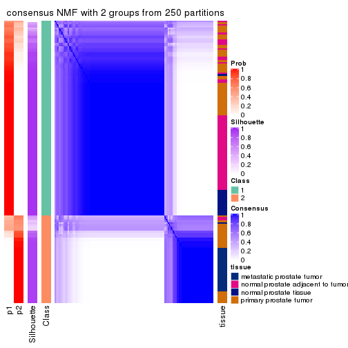</p>

</div>
<div id='tab-CV-NMF-consensus-heatmap-2'>
<pre><code class="r">consensus_heatmap(res, k = 3)
</code></pre>

<p>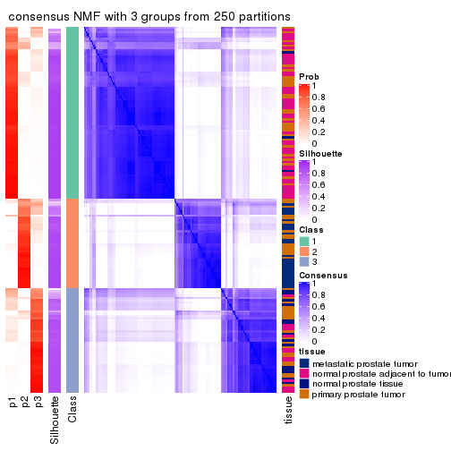</p>

</div>
<div id='tab-CV-NMF-consensus-heatmap-3'>
<pre><code class="r">consensus_heatmap(res, k = 4)
</code></pre>

<p>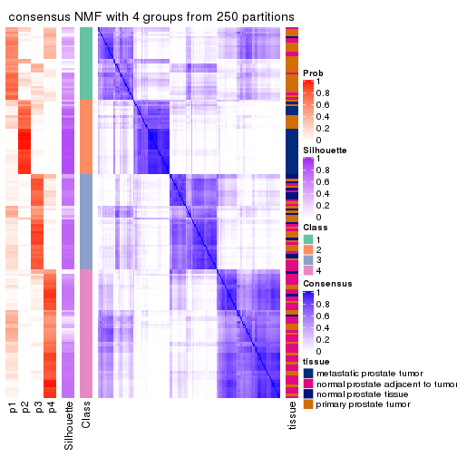</p>

</div>
<div id='tab-CV-NMF-consensus-heatmap-4'>
<pre><code class="r">consensus_heatmap(res, k = 5)
</code></pre>

<p>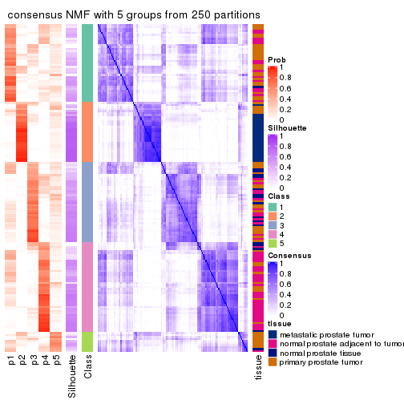</p>

</div>
<div id='tab-CV-NMF-consensus-heatmap-5'>
<pre><code class="r">consensus_heatmap(res, k = 6)
</code></pre>

<p>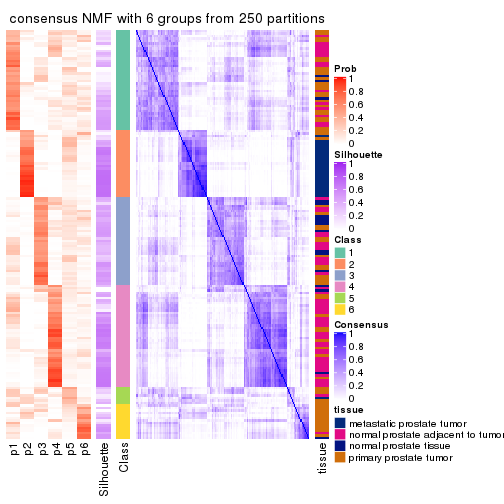</p>

</div>
</div>

Heatmaps for the membership of samples in all partitions to see how consistent they are:


<script>
$( function() {
	$( '#tabs-CV-NMF-membership-heatmap' ).tabs();
} );
</script>
<div id='tabs-CV-NMF-membership-heatmap'>
<ul>
<li><a href='#tab-CV-NMF-membership-heatmap-1'>k = 2</a></li>
<li><a href='#tab-CV-NMF-membership-heatmap-2'>k = 3</a></li>
<li><a href='#tab-CV-NMF-membership-heatmap-3'>k = 4</a></li>
<li><a href='#tab-CV-NMF-membership-heatmap-4'>k = 5</a></li>
<li><a href='#tab-CV-NMF-membership-heatmap-5'>k = 6</a></li>
</ul>
<div id='tab-CV-NMF-membership-heatmap-1'>
<pre><code class="r">membership_heatmap(res, k = 2)
</code></pre>

<p>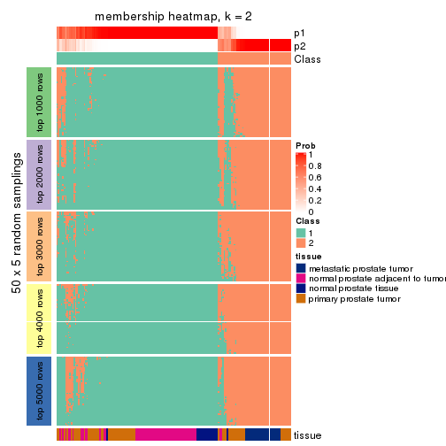</p>

</div>
<div id='tab-CV-NMF-membership-heatmap-2'>
<pre><code class="r">membership_heatmap(res, k = 3)
</code></pre>

<p>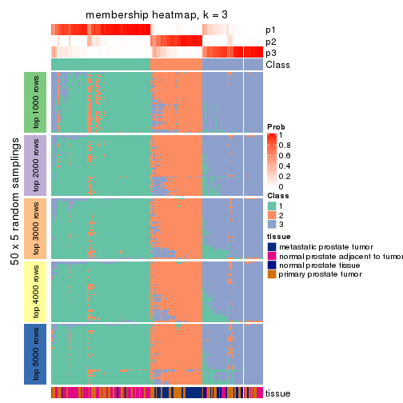</p>

</div>
<div id='tab-CV-NMF-membership-heatmap-3'>
<pre><code class="r">membership_heatmap(res, k = 4)
</code></pre>

<p>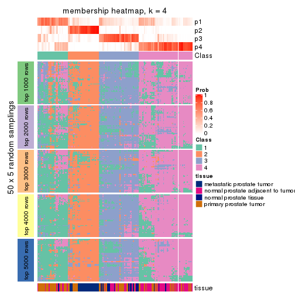</p>

</div>
<div id='tab-CV-NMF-membership-heatmap-4'>
<pre><code class="r">membership_heatmap(res, k = 5)
</code></pre>

<p>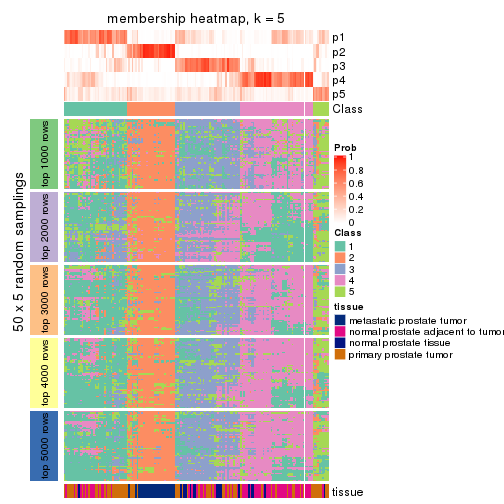</p>

</div>
<div id='tab-CV-NMF-membership-heatmap-5'>
<pre><code class="r">membership_heatmap(res, k = 6)
</code></pre>

<p>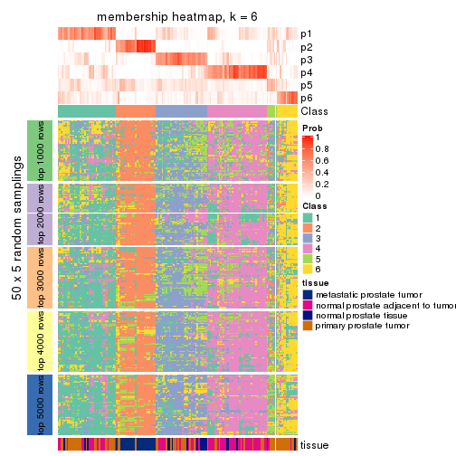</p>

</div>
</div>

As soon as we have had the classes for columns, we can look for signatures
which are significantly different between classes which can be candidate marks
for certain classes. Following are the heatmaps for signatures.


Signature heatmaps where rows are scaled:


<script>
$( function() {
	$( '#tabs-CV-NMF-get-signatures' ).tabs();
} );
</script>
<div id='tabs-CV-NMF-get-signatures'>
<ul>
<li><a href='#tab-CV-NMF-get-signatures-1'>k = 2</a></li>
<li><a href='#tab-CV-NMF-get-signatures-2'>k = 3</a></li>
<li><a href='#tab-CV-NMF-get-signatures-3'>k = 4</a></li>
<li><a href='#tab-CV-NMF-get-signatures-4'>k = 5</a></li>
<li><a href='#tab-CV-NMF-get-signatures-5'>k = 6</a></li>
</ul>
<div id='tab-CV-NMF-get-signatures-1'>
<pre><code class="r">get_signatures(res, k = 2)
</code></pre>

<p>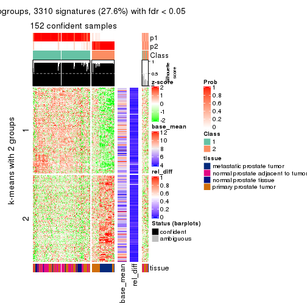</p>

</div>
<div id='tab-CV-NMF-get-signatures-2'>
<pre><code class="r">get_signatures(res, k = 3)
</code></pre>

<p>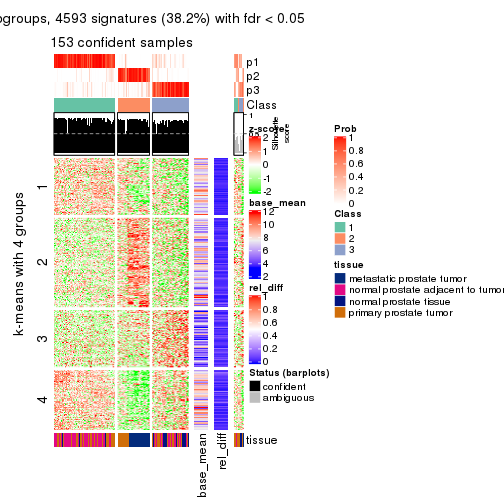</p>

</div>
<div id='tab-CV-NMF-get-signatures-3'>
<pre><code class="r">get_signatures(res, k = 4)
</code></pre>

<p>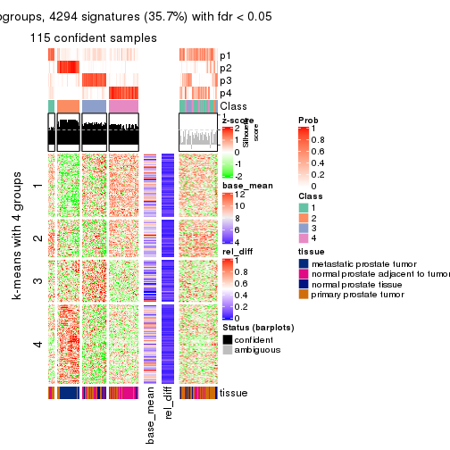</p>

</div>
<div id='tab-CV-NMF-get-signatures-4'>
<pre><code class="r">get_signatures(res, k = 5)
</code></pre>

<p>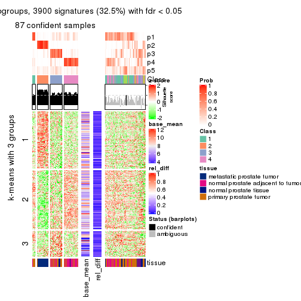</p>

</div>
<div id='tab-CV-NMF-get-signatures-5'>
<pre><code class="r">get_signatures(res, k = 6)
</code></pre>

<p>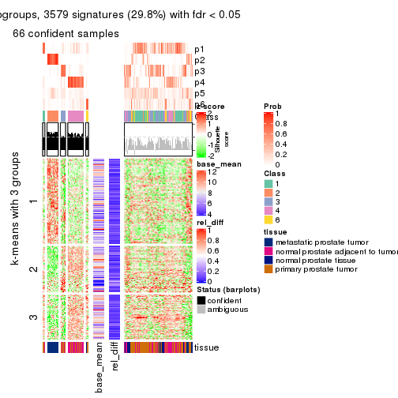</p>

</div>
</div>


Signature heatmaps where rows are not scaled:


<script>
$( function() {
	$( '#tabs-CV-NMF-get-signatures-no-scale' ).tabs();
} );
</script>
<div id='tabs-CV-NMF-get-signatures-no-scale'>
<ul>
<li><a href='#tab-CV-NMF-get-signatures-no-scale-1'>k = 2</a></li>
<li><a href='#tab-CV-NMF-get-signatures-no-scale-2'>k = 3</a></li>
<li><a href='#tab-CV-NMF-get-signatures-no-scale-3'>k = 4</a></li>
<li><a href='#tab-CV-NMF-get-signatures-no-scale-4'>k = 5</a></li>
<li><a href='#tab-CV-NMF-get-signatures-no-scale-5'>k = 6</a></li>
</ul>
<div id='tab-CV-NMF-get-signatures-no-scale-1'>
<pre><code class="r">get_signatures(res, k = 2, scale_rows = FALSE)
</code></pre>

<p>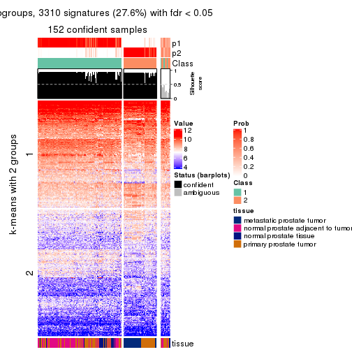</p>

</div>
<div id='tab-CV-NMF-get-signatures-no-scale-2'>
<pre><code class="r">get_signatures(res, k = 3, scale_rows = FALSE)
</code></pre>

<p>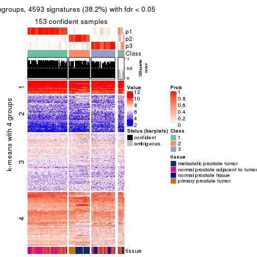</p>

</div>
<div id='tab-CV-NMF-get-signatures-no-scale-3'>
<pre><code class="r">get_signatures(res, k = 4, scale_rows = FALSE)
</code></pre>

<p>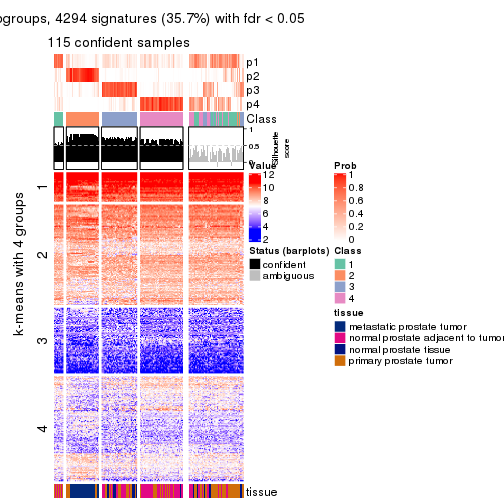</p>

</div>
<div id='tab-CV-NMF-get-signatures-no-scale-4'>
<pre><code class="r">get_signatures(res, k = 5, scale_rows = FALSE)
</code></pre>

<p>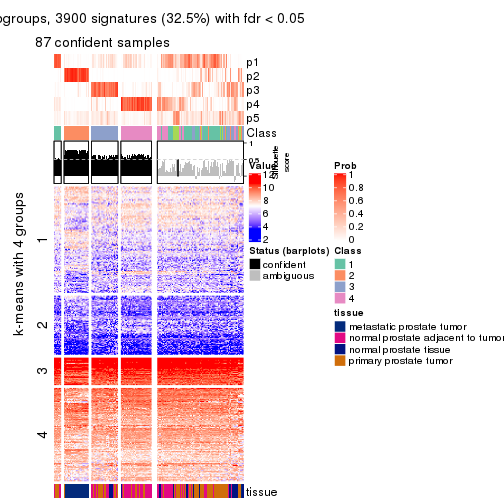</p>

</div>
<div id='tab-CV-NMF-get-signatures-no-scale-5'>
<pre><code class="r">get_signatures(res, k = 6, scale_rows = FALSE)
</code></pre>

<p>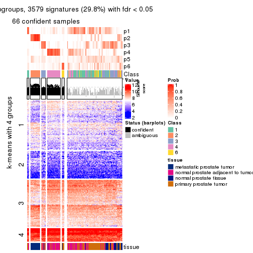</p>

</div>
</div>


Compare the overlap of signatures from different k:

```r
compare_signatures(res)
```

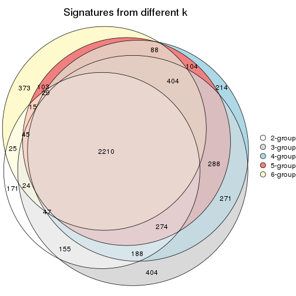

`get_signature()` returns a data frame invisibly. TO get the list of signatures, the function
call should be assigned to a variable explicitly. In following code, if `plot` argument is set
to `FALSE`, no heatmap is plotted while only the differential analysis is performed.

```r
# code only for demonstration
tb = get_signature(res, k = ..., plot = FALSE)
```

An example of the output of `tb` is:

```
#>   which_row         fdr    mean_1    mean_2 scaled_mean_1 scaled_mean_2 km
#> 1        38 0.042760348  8.373488  9.131774    -0.5533452     0.5164555  1
#> 2        40 0.018707592  7.106213  8.469186    -0.6173731     0.5762149  1
#> 3        55 0.019134737 10.221463 11.207825    -0.6159697     0.5749050  1
#> 4        59 0.006059896  5.921854  7.869574    -0.6899429     0.6439467  1
#> 5        60 0.018055526  8.928898 10.211722    -0.6204761     0.5791110  1
#> 6        98 0.009384629 15.714769 14.887706     0.6635654    -0.6193277  2
...
```

The columns in `tb` are:

1. `which_row`: row indices corresponding to the input matrix.
2. `fdr`: FDR for the differential test. 
3. `mean_x`: The mean value in group x.
4. `scaled_mean_x`: The mean value in group x after rows are scaled.
5. `km`: Row groups if k-means clustering is applied to rows.


UMAP plot which shows how samples are separated.


<script>
$( function() {
	$( '#tabs-CV-NMF-dimension-reduction' ).tabs();
} );
</script>
<div id='tabs-CV-NMF-dimension-reduction'>
<ul>
<li><a href='#tab-CV-NMF-dimension-reduction-1'>k = 2</a></li>
<li><a href='#tab-CV-NMF-dimension-reduction-2'>k = 3</a></li>
<li><a href='#tab-CV-NMF-dimension-reduction-3'>k = 4</a></li>
<li><a href='#tab-CV-NMF-dimension-reduction-4'>k = 5</a></li>
<li><a href='#tab-CV-NMF-dimension-reduction-5'>k = 6</a></li>
</ul>
<div id='tab-CV-NMF-dimension-reduction-1'>
<pre><code class="r">dimension_reduction(res, k = 2, method = &quot;UMAP&quot;)
</code></pre>

<p>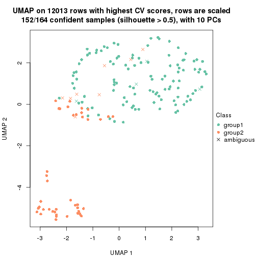</p>

</div>
<div id='tab-CV-NMF-dimension-reduction-2'>
<pre><code class="r">dimension_reduction(res, k = 3, method = &quot;UMAP&quot;)
</code></pre>

<p>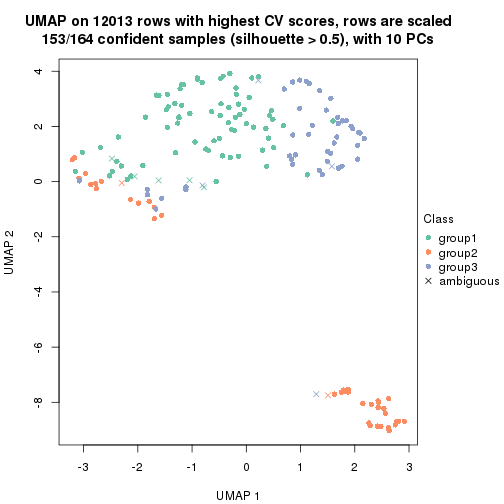</p>

</div>
<div id='tab-CV-NMF-dimension-reduction-3'>
<pre><code class="r">dimension_reduction(res, k = 4, method = &quot;UMAP&quot;)
</code></pre>

<p>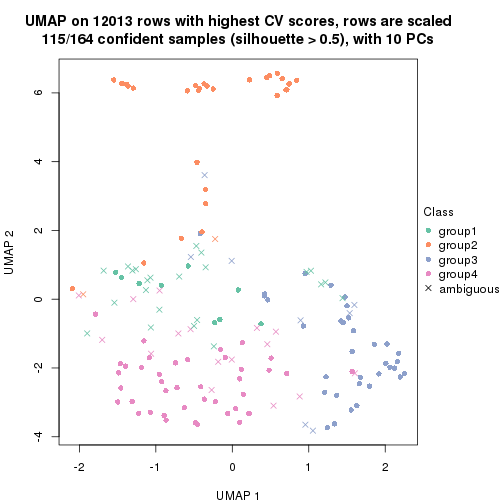</p>

</div>
<div id='tab-CV-NMF-dimension-reduction-4'>
<pre><code class="r">dimension_reduction(res, k = 5, method = &quot;UMAP&quot;)
</code></pre>

<p>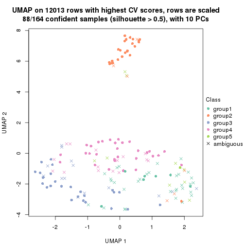</p>

</div>
<div id='tab-CV-NMF-dimension-reduction-5'>
<pre><code class="r">dimension_reduction(res, k = 6, method = &quot;UMAP&quot;)
</code></pre>

<p>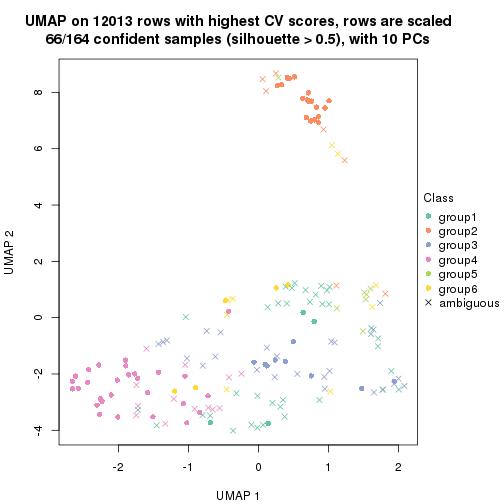</p>

</div>
</div>


Following heatmap shows how subgroups are split when increasing `k`:

```r
collect_classes(res)
```

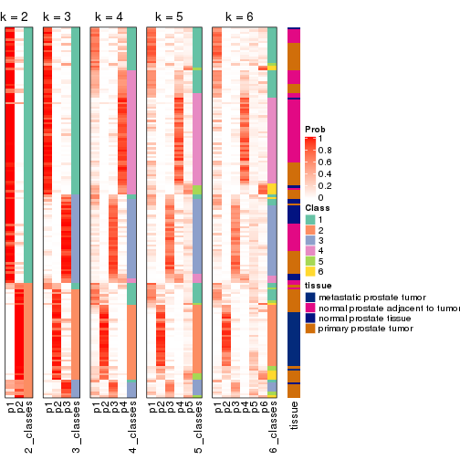


Test correlation between subgroups and known annotations. If the known
annotation is numeric, one-way ANOVA test is applied, and if the known
annotation is discrete, chi-squared contingency table test is applied.

```r
test_to_known_factors(res)
```

```
#>          n tissue(p) k
#> CV:NMF 152  9.03e-20 2
#> CV:NMF 153  3.86e-23 3
#> CV:NMF 115  5.29e-20 4
#> CV:NMF  88  1.27e-15 5
#> CV:NMF  66  1.16e-12 6
```


If matrix rows can be associated to genes, consider to use `functional_enrichment(res,
...)` to perform function enrichment for the signature genes. See [this vignette](http://bioconductor.org/packages/devel/bioc/vignettes/cola/inst/doc/functional_enrichment.html) for more detailed explanations.


 

---------------------------------------------------


### MAD:hclust


The object with results only for a single top-value method and a single partition method 
can be extracted as:

```r
res = res_list["MAD", "hclust"]
# you can also extract it by
# res = res_list["MAD:hclust"]
```

A summary of `res` and all the functions that can be applied to it:

```r
res
```

```
#> A 'ConsensusPartition' object with k = 2, 3, 4, 5, 6.
#>   On a matrix with 12013 rows and 164 columns.
#>   Top rows (1000, 2000, 3000, 4000, 5000) are extracted by 'MAD' method.
#>   Subgroups are detected by 'hclust' method.
#>   Performed in total 1250 partitions by row resampling.
#>   Best k for subgroups seems to be 3.
#> 
#> Following methods can be applied to this 'ConsensusPartition' object:
#>  [1] "cola_report"             "collect_classes"         "collect_plots"          
#>  [4] "collect_stats"           "colnames"                "compare_signatures"     
#>  [7] "consensus_heatmap"       "dimension_reduction"     "functional_enrichment"  
#> [10] "get_anno_col"            "get_anno"                "get_classes"            
#> [13] "get_consensus"           "get_matrix"              "get_membership"         
#> [16] "get_param"               "get_signatures"          "get_stats"              
#> [19] "is_best_k"               "is_stable_k"             "membership_heatmap"     
#> [22] "ncol"                    "nrow"                    "plot_ecdf"              
#> [25] "rownames"                "select_partition_number" "show"                   
#> [28] "suggest_best_k"          "test_to_known_factors"
```

`collect_plots()` function collects all the plots made from `res` for all `k` (number of partitions)
into one single page to provide an easy and fast comparison between different `k`.

```r
collect_plots(res)
```

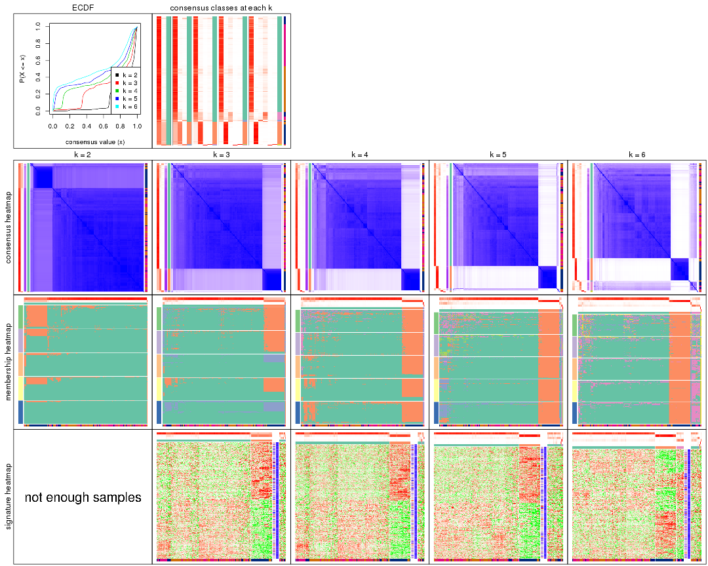

The plots are:

- The first row: a plot of the ECDF (empirical cumulative distribution
  function) curves of the consensus matrix for each `k` and the heatmap of
  predicted classes for each `k`.
- The second row: heatmaps of the consensus matrix for each `k`.
- The third row: heatmaps of the membership matrix for each `k`.
- The fouth row: heatmaps of the signatures for each `k`.

All the plots in panels can be made by individual functions and they are
plotted later in this section.

`select_partition_number()` produces several plots showing different
statistics for choosing "optimized" `k`. There are following statistics:

- ECDF curves of the consensus matrix for each `k`;
- 1-PAC. [The PAC
  score](https://en.wikipedia.org/wiki/Consensus_clustering#Over-interpretation_potential_of_consensus_clustering)
  measures the proportion of the ambiguous subgrouping.
- Mean silhouette score.
- Concordance. The mean probability of fiting the consensus class ids in all
  partitions.
- Area increased. Denote $A_k$ as the area under the ECDF curve for current
  `k`, the area increased is defined as $A_k - A_{k-1}$.
- Rand index. The percent of pairs of samples that are both in a same cluster
  or both are not in a same cluster in the partition of k and k-1.
- Jaccard index. The ratio of pairs of samples are both in a same cluster in
  the partition of k and k-1 and the pairs of samples are both in a same
  cluster in the partition k or k-1.

The detailed explanations of these statistics can be found in [the _cola_
vignette](http://bioconductor.org/packages/devel/bioc/vignettes/cola/inst/doc/cola.html#toc_13).

Generally speaking, lower PAC score, higher mean silhouette score or higher
concordance corresponds to better partition. Rand index and Jaccard index
measure how similar the current partition is compared to partition with `k-1`.
If they are too similar, we won't accept `k` is better than `k-1`.

```r
select_partition_number(res)
```

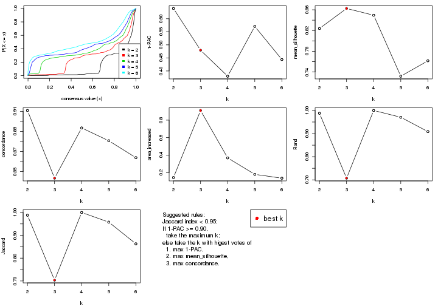

The numeric values for all these statistics can be obtained by `get_stats()`.

```r
get_stats(res)
```

```
#>   k 1-PAC mean_silhouette concordance area_increased  Rand Jaccard
#> 2 2 0.639           0.824       0.911          0.143 0.988   0.988
#> 3 3 0.479           0.863       0.843          0.911 0.707   0.703
#> 4 4 0.380           0.849       0.893          0.367 1.000   1.000
#> 5 5 0.571           0.732       0.881          0.180 0.971   0.958
#> 6 6 0.444           0.761       0.864          0.135 0.909   0.863
```

`suggest_best_k()` suggests the best $k$ based on these statistics. The rules are as follows:

- All $k$ with Jaccard index larger than 0.95 are removed because increasing
  $k$ does not provide enough extra information. If all $k$ are removed, it is
  marked as no subgroup is detected.
- For all $k$ with 1-PAC score larger than 0.9, the maximal $k$ is taken as
  the best $k$, and other $k$ are marked as optional $k$.
- If it does not fit the second rule. The $k$ with the maximal vote of the
  highest 1-PAC score, highest mean silhouette, and highest concordance is
  taken as the best $k$.

```r
suggest_best_k(res)
```

```
#> [1] 3
```


Following shows the table of the partitions (You need to click the **show/hide
code output** link to see it). The membership matrix (columns with name `p*`)
is inferred by
[`clue::cl_consensus()`](https://www.rdocumentation.org/link/cl_consensus?package=clue)
function with the `SE` method. Basically the value in the membership matrix
represents the probability to belong to a certain group. The finall class
label for an item is determined with the group with highest probability it
belongs to.

In `get_classes()` function, the entropy is calculated from the membership
matrix and the silhouette score is calculated from the consensus matrix.


<script>
$( function() {
	$( '#tabs-MAD-hclust-get-classes' ).tabs();
} );
</script>
<div id='tabs-MAD-hclust-get-classes'>
<ul>
<li><a href='#tab-MAD-hclust-get-classes-1'>k = 2</a></li>
<li><a href='#tab-MAD-hclust-get-classes-2'>k = 3</a></li>
<li><a href='#tab-MAD-hclust-get-classes-3'>k = 4</a></li>
<li><a href='#tab-MAD-hclust-get-classes-4'>k = 5</a></li>
<li><a href='#tab-MAD-hclust-get-classes-5'>k = 6</a></li>
</ul>

<div id='tab-MAD-hclust-get-classes-1'>
<p><a id='tab-MAD-hclust-get-classes-1-a' style='color:#0366d6' href='#'>show/hide code output</a></p>
<pre><code class="r">cbind(get_classes(res, k = 2), get_membership(res, k = 2))
</code></pre>

<pre><code>#&gt;           class entropy silhouette    p1    p2
#&gt; GSM152839     1  0.0938      0.900 0.988 0.012
#&gt; GSM152840     1  0.3879      0.875 0.924 0.076
#&gt; GSM152841     1  0.0672      0.899 0.992 0.008
#&gt; GSM152842     1  0.7056      0.716 0.808 0.192
#&gt; GSM152843     1  0.1184      0.896 0.984 0.016
#&gt; GSM152844     1  0.3733      0.876 0.928 0.072
#&gt; GSM152845     1  0.5178      0.841 0.884 0.116
#&gt; GSM152846     1  0.4298      0.864 0.912 0.088
#&gt; GSM152847     1  0.2043      0.897 0.968 0.032
#&gt; GSM152848     1  0.0672      0.900 0.992 0.008
#&gt; GSM152849     1  0.1843      0.901 0.972 0.028
#&gt; GSM152850     1  0.1633      0.902 0.976 0.024
#&gt; GSM152851     1  0.1184      0.900 0.984 0.016
#&gt; GSM152852     1  0.3584      0.879 0.932 0.068
#&gt; GSM152853     1  0.3584      0.877 0.932 0.068
#&gt; GSM152854     1  0.3733      0.880 0.928 0.072
#&gt; GSM152855     1  0.1633      0.901 0.976 0.024
#&gt; GSM153238     1  0.3584      0.883 0.932 0.068
#&gt; GSM153239     1  0.3431      0.884 0.936 0.064
#&gt; GSM153240     1  0.0938      0.901 0.988 0.012
#&gt; GSM153241     1  0.2948      0.892 0.948 0.052
#&gt; GSM153242     1  0.4690      0.860 0.900 0.100
#&gt; GSM153243     1  0.1414      0.902 0.980 0.020
#&gt; GSM153244     1  0.1184      0.902 0.984 0.016
#&gt; GSM153245     1  0.3274      0.883 0.940 0.060
#&gt; GSM153246     1  0.9954     -0.187 0.540 0.460
#&gt; GSM153247     1  0.3879      0.877 0.924 0.076
#&gt; GSM153248     1  0.1184      0.901 0.984 0.016
#&gt; GSM153249     1  0.0938      0.899 0.988 0.012
#&gt; GSM153250     1  0.0000      0.899 1.000 0.000
#&gt; GSM153251     1  0.5294      0.842 0.880 0.120
#&gt; GSM153252     1  0.0672      0.899 0.992 0.008
#&gt; GSM153253     1  0.1184      0.900 0.984 0.016
#&gt; GSM153254     1  0.1184      0.902 0.984 0.016
#&gt; GSM153255     1  0.1184      0.901 0.984 0.016
#&gt; GSM153256     1  0.0672      0.900 0.992 0.008
#&gt; GSM153257     1  0.0938      0.901 0.988 0.012
#&gt; GSM153258     1  0.1633      0.902 0.976 0.024
#&gt; GSM153259     1  0.1414      0.900 0.980 0.020
#&gt; GSM153260     1  0.2603      0.893 0.956 0.044
#&gt; GSM153261     1  0.1414      0.902 0.980 0.020
#&gt; GSM153262     1  0.0672      0.899 0.992 0.008
#&gt; GSM153263     1  0.1184      0.901 0.984 0.016
#&gt; GSM153264     1  0.0672      0.899 0.992 0.008
#&gt; GSM153265     1  0.0672      0.899 0.992 0.008
#&gt; GSM153266     1  0.1184      0.900 0.984 0.016
#&gt; GSM153267     1  0.0672      0.901 0.992 0.008
#&gt; GSM153268     1  0.1414      0.900 0.980 0.020
#&gt; GSM153269     1  0.0000      0.899 1.000 0.000
#&gt; GSM153270     1  0.0938      0.901 0.988 0.012
#&gt; GSM153271     1  0.0376      0.900 0.996 0.004
#&gt; GSM153272     1  0.1184      0.901 0.984 0.016
#&gt; GSM153273     1  0.1633      0.900 0.976 0.024
#&gt; GSM153274     1  0.0672      0.899 0.992 0.008
#&gt; GSM153275     1  0.1184      0.901 0.984 0.016
#&gt; GSM153276     1  0.1414      0.901 0.980 0.020
#&gt; GSM153277     1  0.0938      0.899 0.988 0.012
#&gt; GSM153278     1  0.1843      0.901 0.972 0.028
#&gt; GSM153279     1  0.1184      0.901 0.984 0.016
#&gt; GSM153280     1  0.0672      0.899 0.992 0.008
#&gt; GSM153281     1  0.0938      0.900 0.988 0.012
#&gt; GSM153282     1  0.0672      0.899 0.992 0.008
#&gt; GSM153283     1  0.1184      0.900 0.984 0.016
#&gt; GSM153284     1  0.0938      0.900 0.988 0.012
#&gt; GSM153285     1  0.0938      0.900 0.988 0.012
#&gt; GSM153286     1  0.0938      0.901 0.988 0.012
#&gt; GSM153287     1  0.0672      0.899 0.992 0.008
#&gt; GSM153288     1  0.1184      0.901 0.984 0.016
#&gt; GSM153289     1  0.1633      0.901 0.976 0.024
#&gt; GSM153290     1  0.0938      0.900 0.988 0.012
#&gt; GSM153291     1  0.1184      0.901 0.984 0.016
#&gt; GSM153292     1  0.0938      0.899 0.988 0.012
#&gt; GSM153293     1  0.1414      0.901 0.980 0.020
#&gt; GSM153294     1  0.1184      0.902 0.984 0.016
#&gt; GSM153295     1  0.1184      0.896 0.984 0.016
#&gt; GSM153054     1  0.2236      0.898 0.964 0.036
#&gt; GSM153055     1  0.0938      0.902 0.988 0.012
#&gt; GSM153056     1  0.1633      0.902 0.976 0.024
#&gt; GSM153057     1  0.3114      0.893 0.944 0.056
#&gt; GSM153058     1  0.3431      0.887 0.936 0.064
#&gt; GSM153059     1  0.3431      0.887 0.936 0.064
#&gt; GSM153060     1  0.9044      0.404 0.680 0.320
#&gt; GSM153061     1  0.8813      0.456 0.700 0.300
#&gt; GSM153062     2  0.7056      0.000 0.192 0.808
#&gt; GSM153063     1  0.3274      0.888 0.940 0.060
#&gt; GSM153064     1  0.1414      0.900 0.980 0.020
#&gt; GSM153065     1  0.4161      0.871 0.916 0.084
#&gt; GSM153066     1  0.4022      0.874 0.920 0.080
#&gt; GSM153067     1  0.0938      0.901 0.988 0.012
#&gt; GSM153068     1  0.4939      0.833 0.892 0.108
#&gt; GSM153069     1  0.0672      0.901 0.992 0.008
#&gt; GSM153070     1  0.0938      0.902 0.988 0.012
#&gt; GSM153071     1  0.2423      0.898 0.960 0.040
#&gt; GSM153072     1  0.2043      0.897 0.968 0.032
#&gt; GSM153073     1  0.0672      0.901 0.992 0.008
#&gt; GSM153074     1  0.0672      0.900 0.992 0.008
#&gt; GSM153075     1  0.1414      0.902 0.980 0.020
#&gt; GSM153076     1  0.0672      0.901 0.992 0.008
#&gt; GSM153077     1  0.0376      0.898 0.996 0.004
#&gt; GSM153078     1  0.0672      0.900 0.992 0.008
#&gt; GSM153079     1  0.1633      0.900 0.976 0.024
#&gt; GSM153080     1  0.1843      0.900 0.972 0.028
#&gt; GSM153081     1  0.0672      0.898 0.992 0.008
#&gt; GSM153082     1  0.3114      0.890 0.944 0.056
#&gt; GSM153083     1  0.1633      0.899 0.976 0.024
#&gt; GSM153084     1  0.3879      0.875 0.924 0.076
#&gt; GSM153085     1  0.2236      0.899 0.964 0.036
#&gt; GSM153086     1  0.2043      0.899 0.968 0.032
#&gt; GSM153087     1  0.0938      0.900 0.988 0.012
#&gt; GSM153088     1  0.0672      0.901 0.992 0.008
#&gt; GSM153089     1  0.3274      0.886 0.940 0.060
#&gt; GSM153090     1  0.0000      0.899 1.000 0.000
#&gt; GSM153091     1  0.1414      0.900 0.980 0.020
#&gt; GSM153092     1  0.1414      0.901 0.980 0.020
#&gt; GSM153093     1  0.0938      0.899 0.988 0.012
#&gt; GSM153094     1  0.1633      0.900 0.976 0.024
#&gt; GSM153095     1  0.1633      0.899 0.976 0.024
#&gt; GSM153096     1  0.1414      0.900 0.980 0.020
#&gt; GSM153097     1  0.2043      0.898 0.968 0.032
#&gt; GSM153098     1  0.0672      0.899 0.992 0.008
#&gt; GSM153099     1  0.1184      0.900 0.984 0.016
#&gt; GSM153100     1  0.1633      0.902 0.976 0.024
#&gt; GSM153101     1  0.3733      0.883 0.928 0.072
#&gt; GSM153102     1  0.2423      0.897 0.960 0.040
#&gt; GSM153103     1  0.2236      0.897 0.964 0.036
#&gt; GSM153104     1  0.0672      0.899 0.992 0.008
#&gt; GSM153106     1  0.1414      0.900 0.980 0.020
#&gt; GSM153107     1  0.1414      0.900 0.980 0.020
#&gt; GSM153108     1  0.0672      0.899 0.992 0.008
#&gt; GSM153109     1  0.2423      0.896 0.960 0.040
#&gt; GSM153110     1  0.1633      0.900 0.976 0.024
#&gt; GSM153111     1  0.1843      0.900 0.972 0.028
#&gt; GSM153112     1  0.1414      0.900 0.980 0.020
#&gt; GSM153113     1  0.5737      0.825 0.864 0.136
#&gt; GSM153114     1  0.1633      0.901 0.976 0.024
#&gt; GSM187532     1  0.8661      0.652 0.712 0.288
#&gt; GSM187533     1  0.8955      0.616 0.688 0.312
#&gt; GSM187534     1  0.8861      0.626 0.696 0.304
#&gt; GSM187535     1  0.3431      0.883 0.936 0.064
#&gt; GSM152906     1  0.9209      0.579 0.664 0.336
#&gt; GSM152907     1  0.9170      0.585 0.668 0.332
#&gt; GSM152908     1  0.9209      0.579 0.664 0.336
#&gt; GSM152909     1  0.9044      0.603 0.680 0.320
#&gt; GSM152910     1  0.9209      0.579 0.664 0.336
#&gt; GSM152911     1  0.9209      0.579 0.664 0.336
#&gt; GSM152912     1  0.9209      0.579 0.664 0.336
#&gt; GSM152913     1  0.9209      0.579 0.664 0.336
#&gt; GSM152914     1  0.9209      0.579 0.664 0.336
#&gt; GSM152915     1  0.9209      0.579 0.664 0.336
#&gt; GSM152916     1  0.9209      0.579 0.664 0.336
#&gt; GSM152917     1  0.9209      0.579 0.664 0.336
#&gt; GSM152918     1  0.9209      0.579 0.664 0.336
#&gt; GSM152919     1  0.9209      0.579 0.664 0.336
#&gt; GSM152920     1  0.9209      0.579 0.664 0.336
#&gt; GSM152921     1  0.9209      0.579 0.664 0.336
#&gt; GSM152922     1  0.9209      0.579 0.664 0.336
#&gt; GSM152923     1  0.9209      0.579 0.664 0.336
#&gt; GSM152924     1  0.9170      0.585 0.668 0.332
#&gt; GSM152925     1  0.9209      0.579 0.664 0.336
#&gt; GSM152926     1  0.9209      0.579 0.664 0.336
#&gt; GSM152927     1  0.9209      0.579 0.664 0.336
#&gt; GSM152928     1  0.7745      0.727 0.772 0.228
#&gt; GSM152929     1  0.9209      0.579 0.664 0.336
#&gt; GSM152930     1  0.9209      0.579 0.664 0.336
</code></pre>

<script>
$('#tab-MAD-hclust-get-classes-1-a').parent().next().next().hide();
$('#tab-MAD-hclust-get-classes-1-a').click(function(){
  $('#tab-MAD-hclust-get-classes-1-a').parent().next().next().toggle();
  return(false);
});
</script>
</div>

<div id='tab-MAD-hclust-get-classes-2'>
<p><a id='tab-MAD-hclust-get-classes-2-a' style='color:#0366d6' href='#'>show/hide code output</a></p>
<pre><code class="r">cbind(get_classes(res, k = 3), get_membership(res, k = 3))
</code></pre>

<pre><code>#&gt;           class entropy silhouette    p1    p2    p3
#&gt; GSM152839     1  0.1170      0.913 0.976 0.016 0.008
#&gt; GSM152840     1  0.5637      0.653 0.788 0.172 0.040
#&gt; GSM152841     1  0.1129      0.912 0.976 0.020 0.004
#&gt; GSM152842     1  0.6422      0.386 0.660 0.016 0.324
#&gt; GSM152843     1  0.2743      0.892 0.928 0.020 0.052
#&gt; GSM152844     1  0.5455      0.635 0.788 0.184 0.028
#&gt; GSM152845     1  0.6501      0.167 0.664 0.316 0.020
#&gt; GSM152846     1  0.6542      0.482 0.736 0.204 0.060
#&gt; GSM152847     1  0.3237      0.882 0.912 0.032 0.056
#&gt; GSM152848     1  0.1337      0.914 0.972 0.012 0.016
#&gt; GSM152849     1  0.2187      0.908 0.948 0.024 0.028
#&gt; GSM152850     1  0.2176      0.910 0.948 0.032 0.020
#&gt; GSM152851     1  0.1636      0.911 0.964 0.016 0.020
#&gt; GSM152852     1  0.4861      0.647 0.800 0.192 0.008
#&gt; GSM152853     1  0.5062      0.652 0.800 0.184 0.016
#&gt; GSM152854     1  0.5277      0.668 0.796 0.180 0.024
#&gt; GSM152855     1  0.1751      0.913 0.960 0.028 0.012
#&gt; GSM153238     1  0.3983      0.834 0.884 0.068 0.048
#&gt; GSM153239     1  0.5581      0.658 0.792 0.168 0.040
#&gt; GSM153240     1  0.0983      0.913 0.980 0.016 0.004
#&gt; GSM153241     1  0.3791      0.861 0.892 0.060 0.048
#&gt; GSM153242     1  0.6295      0.465 0.728 0.236 0.036
#&gt; GSM153243     1  0.2176      0.904 0.948 0.032 0.020
#&gt; GSM153244     1  0.1585      0.913 0.964 0.028 0.008
#&gt; GSM153245     1  0.6191      0.636 0.776 0.140 0.084
#&gt; GSM153246     3  0.7697      0.473 0.272 0.084 0.644
#&gt; GSM153247     1  0.3875      0.842 0.888 0.044 0.068
#&gt; GSM153248     1  0.1482      0.913 0.968 0.020 0.012
#&gt; GSM153249     1  0.0829      0.911 0.984 0.012 0.004
#&gt; GSM153250     1  0.0661      0.913 0.988 0.008 0.004
#&gt; GSM153251     1  0.5812      0.427 0.724 0.264 0.012
#&gt; GSM153252     1  0.0747      0.912 0.984 0.016 0.000
#&gt; GSM153253     1  0.1482      0.910 0.968 0.020 0.012
#&gt; GSM153254     1  0.1999      0.902 0.952 0.036 0.012
#&gt; GSM153255     1  0.0983      0.913 0.980 0.016 0.004
#&gt; GSM153256     1  0.1015      0.913 0.980 0.012 0.008
#&gt; GSM153257     1  0.0983      0.914 0.980 0.016 0.004
#&gt; GSM153258     1  0.1620      0.916 0.964 0.024 0.012
#&gt; GSM153259     1  0.1482      0.911 0.968 0.020 0.012
#&gt; GSM153260     1  0.4206      0.819 0.872 0.088 0.040
#&gt; GSM153261     1  0.2564      0.896 0.936 0.036 0.028
#&gt; GSM153262     1  0.0747      0.912 0.984 0.016 0.000
#&gt; GSM153263     1  0.0747      0.914 0.984 0.016 0.000
#&gt; GSM153264     1  0.0848      0.914 0.984 0.008 0.008
#&gt; GSM153265     1  0.1129      0.912 0.976 0.020 0.004
#&gt; GSM153266     1  0.1315      0.915 0.972 0.020 0.008
#&gt; GSM153267     1  0.0661      0.913 0.988 0.008 0.004
#&gt; GSM153268     1  0.1999      0.900 0.952 0.036 0.012
#&gt; GSM153269     1  0.0475      0.912 0.992 0.004 0.004
#&gt; GSM153270     1  0.0892      0.913 0.980 0.020 0.000
#&gt; GSM153271     1  0.0829      0.913 0.984 0.012 0.004
#&gt; GSM153272     1  0.0983      0.913 0.980 0.016 0.004
#&gt; GSM153273     1  0.1482      0.911 0.968 0.020 0.012
#&gt; GSM153274     1  0.0848      0.912 0.984 0.008 0.008
#&gt; GSM153275     1  0.1170      0.914 0.976 0.016 0.008
#&gt; GSM153276     1  0.1482      0.915 0.968 0.020 0.012
#&gt; GSM153277     1  0.0983      0.914 0.980 0.016 0.004
#&gt; GSM153278     1  0.1636      0.914 0.964 0.020 0.016
#&gt; GSM153279     1  0.1267      0.914 0.972 0.024 0.004
#&gt; GSM153280     1  0.1267      0.912 0.972 0.024 0.004
#&gt; GSM153281     1  0.1182      0.912 0.976 0.012 0.012
#&gt; GSM153282     1  0.0983      0.911 0.980 0.016 0.004
#&gt; GSM153283     1  0.1482      0.914 0.968 0.020 0.012
#&gt; GSM153284     1  0.0592      0.912 0.988 0.012 0.000
#&gt; GSM153285     1  0.1129      0.911 0.976 0.020 0.004
#&gt; GSM153286     1  0.1170      0.915 0.976 0.016 0.008
#&gt; GSM153287     1  0.0661      0.910 0.988 0.008 0.004
#&gt; GSM153288     1  0.0983      0.913 0.980 0.016 0.004
#&gt; GSM153289     1  0.1751      0.913 0.960 0.028 0.012
#&gt; GSM153290     1  0.1525      0.911 0.964 0.032 0.004
#&gt; GSM153291     1  0.0747      0.914 0.984 0.016 0.000
#&gt; GSM153292     1  0.0829      0.911 0.984 0.012 0.004
#&gt; GSM153293     1  0.1315      0.914 0.972 0.020 0.008
#&gt; GSM153294     1  0.1482      0.914 0.968 0.020 0.012
#&gt; GSM153295     1  0.2414      0.896 0.940 0.020 0.040
#&gt; GSM153054     1  0.3481      0.868 0.904 0.052 0.044
#&gt; GSM153055     1  0.0592      0.914 0.988 0.012 0.000
#&gt; GSM153056     1  0.2564      0.902 0.936 0.028 0.036
#&gt; GSM153057     1  0.3637      0.848 0.892 0.084 0.024
#&gt; GSM153058     1  0.5036      0.687 0.808 0.172 0.020
#&gt; GSM153059     1  0.3454      0.834 0.888 0.104 0.008
#&gt; GSM153060     1  0.6678     -0.117 0.512 0.008 0.480
#&gt; GSM153061     1  0.6713      0.128 0.572 0.012 0.416
#&gt; GSM153062     3  0.6501      0.542 0.020 0.316 0.664
#&gt; GSM153063     1  0.4742      0.783 0.848 0.104 0.048
#&gt; GSM153064     1  0.1482      0.911 0.968 0.020 0.012
#&gt; GSM153065     1  0.5618      0.671 0.796 0.156 0.048
#&gt; GSM153066     1  0.4665      0.785 0.852 0.100 0.048
#&gt; GSM153067     1  0.0829      0.913 0.984 0.012 0.004
#&gt; GSM153068     1  0.6128      0.651 0.780 0.084 0.136
#&gt; GSM153069     1  0.0661      0.912 0.988 0.008 0.004
#&gt; GSM153070     1  0.1129      0.915 0.976 0.020 0.004
#&gt; GSM153071     1  0.2383      0.901 0.940 0.044 0.016
#&gt; GSM153072     1  0.2297      0.903 0.944 0.020 0.036
#&gt; GSM153073     1  0.0892      0.914 0.980 0.020 0.000
#&gt; GSM153074     1  0.0661      0.912 0.988 0.008 0.004
#&gt; GSM153075     1  0.1399      0.915 0.968 0.028 0.004
#&gt; GSM153076     1  0.0747      0.914 0.984 0.016 0.000
#&gt; GSM153077     1  0.0983      0.914 0.980 0.004 0.016
#&gt; GSM153078     1  0.1267      0.912 0.972 0.004 0.024
#&gt; GSM153079     1  0.1620      0.912 0.964 0.024 0.012
#&gt; GSM153080     1  0.1832      0.908 0.956 0.036 0.008
#&gt; GSM153081     1  0.1015      0.913 0.980 0.008 0.012
#&gt; GSM153082     1  0.2599      0.895 0.932 0.052 0.016
#&gt; GSM153083     1  0.1620      0.911 0.964 0.024 0.012
#&gt; GSM153084     1  0.3528      0.844 0.892 0.092 0.016
#&gt; GSM153085     1  0.2313      0.904 0.944 0.032 0.024
#&gt; GSM153086     1  0.1751      0.911 0.960 0.028 0.012
#&gt; GSM153087     1  0.1170      0.915 0.976 0.016 0.008
#&gt; GSM153088     1  0.0592      0.914 0.988 0.012 0.000
#&gt; GSM153089     1  0.4802      0.718 0.824 0.156 0.020
#&gt; GSM153090     1  0.0237      0.912 0.996 0.004 0.000
#&gt; GSM153091     1  0.1315      0.912 0.972 0.020 0.008
#&gt; GSM153092     1  0.1482      0.914 0.968 0.020 0.012
#&gt; GSM153093     1  0.0829      0.911 0.984 0.012 0.004
#&gt; GSM153094     1  0.1774      0.911 0.960 0.024 0.016
#&gt; GSM153095     1  0.2313      0.907 0.944 0.032 0.024
#&gt; GSM153096     1  0.1636      0.912 0.964 0.020 0.016
#&gt; GSM153097     1  0.1905      0.908 0.956 0.028 0.016
#&gt; GSM153098     1  0.0829      0.912 0.984 0.004 0.012
#&gt; GSM153099     1  0.1031      0.913 0.976 0.024 0.000
#&gt; GSM153100     1  0.1620      0.914 0.964 0.024 0.012
#&gt; GSM153101     1  0.3850      0.847 0.884 0.088 0.028
#&gt; GSM153102     1  0.2116      0.903 0.948 0.040 0.012
#&gt; GSM153103     1  0.1999      0.905 0.952 0.036 0.012
#&gt; GSM153104     1  0.0983      0.911 0.980 0.016 0.004
#&gt; GSM153106     1  0.1620      0.912 0.964 0.024 0.012
#&gt; GSM153107     1  0.1620      0.912 0.964 0.024 0.012
#&gt; GSM153108     1  0.1315      0.915 0.972 0.020 0.008
#&gt; GSM153109     1  0.2269      0.903 0.944 0.040 0.016
#&gt; GSM153110     1  0.1774      0.911 0.960 0.024 0.016
#&gt; GSM153111     1  0.1751      0.911 0.960 0.028 0.012
#&gt; GSM153112     1  0.1482      0.911 0.968 0.020 0.012
#&gt; GSM153113     1  0.4953      0.692 0.808 0.176 0.016
#&gt; GSM153114     1  0.1751      0.913 0.960 0.028 0.012
#&gt; GSM187532     2  0.6373      0.861 0.408 0.588 0.004
#&gt; GSM187533     2  0.6026      0.920 0.376 0.624 0.000
#&gt; GSM187534     2  0.6062      0.907 0.384 0.616 0.000
#&gt; GSM187535     1  0.2939      0.879 0.916 0.072 0.012
#&gt; GSM152906     2  0.5810      0.974 0.336 0.664 0.000
#&gt; GSM152907     2  0.5882      0.960 0.348 0.652 0.000
#&gt; GSM152908     2  0.5810      0.974 0.336 0.664 0.000
#&gt; GSM152909     2  0.6126      0.954 0.352 0.644 0.004
#&gt; GSM152910     2  0.5810      0.974 0.336 0.664 0.000
#&gt; GSM152911     2  0.5810      0.974 0.336 0.664 0.000
#&gt; GSM152912     2  0.5810      0.974 0.336 0.664 0.000
#&gt; GSM152913     2  0.5810      0.974 0.336 0.664 0.000
#&gt; GSM152914     2  0.5810      0.974 0.336 0.664 0.000
#&gt; GSM152915     2  0.5810      0.974 0.336 0.664 0.000
#&gt; GSM152916     2  0.5810      0.974 0.336 0.664 0.000
#&gt; GSM152917     2  0.5810      0.974 0.336 0.664 0.000
#&gt; GSM152918     2  0.5810      0.974 0.336 0.664 0.000
#&gt; GSM152919     2  0.5810      0.974 0.336 0.664 0.000
#&gt; GSM152920     2  0.5810      0.974 0.336 0.664 0.000
#&gt; GSM152921     2  0.5810      0.974 0.336 0.664 0.000
#&gt; GSM152922     2  0.5810      0.974 0.336 0.664 0.000
#&gt; GSM152923     2  0.5810      0.974 0.336 0.664 0.000
#&gt; GSM152924     2  0.5835      0.970 0.340 0.660 0.000
#&gt; GSM152925     2  0.5835      0.970 0.340 0.660 0.000
#&gt; GSM152926     2  0.5810      0.974 0.336 0.664 0.000
#&gt; GSM152927     2  0.5810      0.974 0.336 0.664 0.000
#&gt; GSM152928     2  0.6954      0.671 0.484 0.500 0.016
#&gt; GSM152929     2  0.5810      0.974 0.336 0.664 0.000
#&gt; GSM152930     2  0.5810      0.974 0.336 0.664 0.000
</code></pre>

<script>
$('#tab-MAD-hclust-get-classes-2-a').parent().next().next().hide();
$('#tab-MAD-hclust-get-classes-2-a').click(function(){
  $('#tab-MAD-hclust-get-classes-2-a').parent().next().next().toggle();
  return(false);
});
</script>
</div>

<div id='tab-MAD-hclust-get-classes-3'>
<p><a id='tab-MAD-hclust-get-classes-3-a' style='color:#0366d6' href='#'>show/hide code output</a></p>
<pre><code class="r">cbind(get_classes(res, k = 4), get_membership(res, k = 4))
</code></pre>

<pre><code>#&gt;           class entropy silhouette    p1    p2    p3    p4
#&gt; GSM152839     1  0.1593    0.91040 0.956 0.024 0.004 0.016
#&gt; GSM152840     1  0.6072    0.57846 0.664 0.272 0.020 0.044
#&gt; GSM152841     1  0.1356    0.90752 0.960 0.032 0.000 0.008
#&gt; GSM152842     1  0.7457    0.49534 0.612 0.048 0.120 0.220
#&gt; GSM152843     1  0.2936    0.89341 0.908 0.036 0.032 0.024
#&gt; GSM152844     1  0.5852    0.56402 0.664 0.284 0.012 0.040
#&gt; GSM152845     1  0.6619    0.10593 0.492 0.440 0.008 0.060
#&gt; GSM152846     1  0.6979    0.39895 0.576 0.316 0.016 0.092
#&gt; GSM152847     1  0.3900    0.86248 0.860 0.060 0.016 0.064
#&gt; GSM152848     1  0.1406    0.91067 0.960 0.024 0.000 0.016
#&gt; GSM152849     1  0.2870    0.89485 0.908 0.044 0.012 0.036
#&gt; GSM152850     1  0.2814    0.89939 0.908 0.052 0.008 0.032
#&gt; GSM152851     1  0.2310    0.90641 0.932 0.032 0.016 0.020
#&gt; GSM152852     1  0.5745    0.55546 0.656 0.296 0.004 0.044
#&gt; GSM152853     1  0.5594    0.57978 0.672 0.284 0.004 0.040
#&gt; GSM152854     1  0.6067    0.60475 0.668 0.264 0.016 0.052
#&gt; GSM152855     1  0.1284    0.90841 0.964 0.024 0.000 0.012
#&gt; GSM153238     1  0.4412    0.83177 0.828 0.104 0.016 0.052
#&gt; GSM153239     1  0.5982    0.59259 0.668 0.268 0.012 0.052
#&gt; GSM153240     1  0.1543    0.90923 0.956 0.032 0.004 0.008
#&gt; GSM153241     1  0.4462    0.84986 0.828 0.100 0.020 0.052
#&gt; GSM153242     1  0.6722    0.38758 0.576 0.344 0.020 0.060
#&gt; GSM153243     1  0.2775    0.89837 0.912 0.044 0.012 0.032
#&gt; GSM153244     1  0.1888    0.90897 0.940 0.044 0.000 0.016
#&gt; GSM153245     1  0.6687    0.56363 0.648 0.240 0.024 0.088
#&gt; GSM153246     4  0.1970    0.00000 0.008 0.000 0.060 0.932
#&gt; GSM153247     1  0.4227    0.84533 0.844 0.076 0.020 0.060
#&gt; GSM153248     1  0.1677    0.90766 0.948 0.040 0.000 0.012
#&gt; GSM153249     1  0.1042    0.90811 0.972 0.020 0.000 0.008
#&gt; GSM153250     1  0.1042    0.90963 0.972 0.020 0.000 0.008
#&gt; GSM153251     1  0.6109    0.33929 0.568 0.388 0.008 0.036
#&gt; GSM153252     1  0.1151    0.90947 0.968 0.024 0.000 0.008
#&gt; GSM153253     1  0.1958    0.90437 0.944 0.028 0.008 0.020
#&gt; GSM153254     1  0.3120    0.89544 0.896 0.056 0.012 0.036
#&gt; GSM153255     1  0.1004    0.90909 0.972 0.024 0.000 0.004
#&gt; GSM153256     1  0.1004    0.90973 0.972 0.024 0.000 0.004
#&gt; GSM153257     1  0.1356    0.91027 0.960 0.032 0.000 0.008
#&gt; GSM153258     1  0.1356    0.91153 0.960 0.032 0.000 0.008
#&gt; GSM153259     1  0.1798    0.90505 0.944 0.040 0.000 0.016
#&gt; GSM153260     1  0.4879    0.81094 0.796 0.124 0.012 0.068
#&gt; GSM153261     1  0.3424    0.87869 0.880 0.072 0.012 0.036
#&gt; GSM153262     1  0.1042    0.90957 0.972 0.020 0.000 0.008
#&gt; GSM153263     1  0.1593    0.91097 0.956 0.024 0.004 0.016
#&gt; GSM153264     1  0.1247    0.91008 0.968 0.012 0.004 0.016
#&gt; GSM153265     1  0.1209    0.90805 0.964 0.032 0.000 0.004
#&gt; GSM153266     1  0.1174    0.91065 0.968 0.020 0.000 0.012
#&gt; GSM153267     1  0.0817    0.90848 0.976 0.024 0.000 0.000
#&gt; GSM153268     1  0.2587    0.88990 0.916 0.056 0.008 0.020
#&gt; GSM153269     1  0.0895    0.90841 0.976 0.020 0.000 0.004
#&gt; GSM153270     1  0.1452    0.90929 0.956 0.036 0.000 0.008
#&gt; GSM153271     1  0.1004    0.91006 0.972 0.024 0.000 0.004
#&gt; GSM153272     1  0.1151    0.90871 0.968 0.024 0.000 0.008
#&gt; GSM153273     1  0.1798    0.90471 0.944 0.040 0.000 0.016
#&gt; GSM153274     1  0.1042    0.90898 0.972 0.020 0.000 0.008
#&gt; GSM153275     1  0.0921    0.90950 0.972 0.028 0.000 0.000
#&gt; GSM153276     1  0.1297    0.91045 0.964 0.020 0.000 0.016
#&gt; GSM153277     1  0.0895    0.90953 0.976 0.020 0.000 0.004
#&gt; GSM153278     1  0.2499    0.90358 0.924 0.032 0.012 0.032
#&gt; GSM153279     1  0.1639    0.91066 0.952 0.036 0.004 0.008
#&gt; GSM153280     1  0.1209    0.90825 0.964 0.032 0.000 0.004
#&gt; GSM153281     1  0.1484    0.90723 0.960 0.020 0.004 0.016
#&gt; GSM153282     1  0.1284    0.90762 0.964 0.024 0.000 0.012
#&gt; GSM153283     1  0.1411    0.91095 0.960 0.020 0.000 0.020
#&gt; GSM153284     1  0.1174    0.90917 0.968 0.020 0.000 0.012
#&gt; GSM153285     1  0.1388    0.90746 0.960 0.028 0.000 0.012
#&gt; GSM153286     1  0.1305    0.91067 0.960 0.036 0.000 0.004
#&gt; GSM153287     1  0.0927    0.90666 0.976 0.016 0.000 0.008
#&gt; GSM153288     1  0.1151    0.90871 0.968 0.024 0.000 0.008
#&gt; GSM153289     1  0.1284    0.90841 0.964 0.024 0.000 0.012
#&gt; GSM153290     1  0.1545    0.90741 0.952 0.040 0.000 0.008
#&gt; GSM153291     1  0.1151    0.91002 0.968 0.024 0.000 0.008
#&gt; GSM153292     1  0.1042    0.90796 0.972 0.020 0.000 0.008
#&gt; GSM153293     1  0.1022    0.90995 0.968 0.032 0.000 0.000
#&gt; GSM153294     1  0.1488    0.90869 0.956 0.032 0.000 0.012
#&gt; GSM153295     1  0.2466    0.89319 0.916 0.028 0.000 0.056
#&gt; GSM153054     1  0.3798    0.86472 0.860 0.072 0.008 0.060
#&gt; GSM153055     1  0.1471    0.91117 0.960 0.024 0.004 0.012
#&gt; GSM153056     1  0.3135    0.89265 0.896 0.048 0.012 0.044
#&gt; GSM153057     1  0.3647    0.86099 0.860 0.096 0.004 0.040
#&gt; GSM153058     1  0.5542    0.62086 0.684 0.276 0.012 0.028
#&gt; GSM153059     1  0.3869    0.84402 0.844 0.120 0.008 0.028
#&gt; GSM153060     1  0.8919    0.00908 0.464 0.084 0.232 0.220
#&gt; GSM153061     1  0.8578    0.20482 0.516 0.080 0.192 0.212
#&gt; GSM153062     3  0.0376    0.00000 0.004 0.004 0.992 0.000
#&gt; GSM153063     1  0.5351    0.75650 0.756 0.172 0.016 0.056
#&gt; GSM153064     1  0.1888    0.90666 0.940 0.044 0.000 0.016
#&gt; GSM153065     1  0.5833    0.67593 0.712 0.204 0.012 0.072
#&gt; GSM153066     1  0.5052    0.77468 0.772 0.160 0.008 0.060
#&gt; GSM153067     1  0.1109    0.90906 0.968 0.028 0.000 0.004
#&gt; GSM153068     1  0.6636    0.68859 0.704 0.124 0.060 0.112
#&gt; GSM153069     1  0.1151    0.90827 0.968 0.024 0.000 0.008
#&gt; GSM153070     1  0.1706    0.91185 0.948 0.036 0.000 0.016
#&gt; GSM153071     1  0.2613    0.90008 0.916 0.052 0.008 0.024
#&gt; GSM153072     1  0.2676    0.90018 0.916 0.028 0.012 0.044
#&gt; GSM153073     1  0.1545    0.91175 0.952 0.040 0.000 0.008
#&gt; GSM153074     1  0.1151    0.90796 0.968 0.024 0.000 0.008
#&gt; GSM153075     1  0.1706    0.91213 0.948 0.036 0.000 0.016
#&gt; GSM153076     1  0.1443    0.91060 0.960 0.028 0.004 0.008
#&gt; GSM153077     1  0.1362    0.90980 0.964 0.012 0.004 0.020
#&gt; GSM153078     1  0.2089    0.90622 0.940 0.020 0.012 0.028
#&gt; GSM153079     1  0.1624    0.90779 0.952 0.028 0.000 0.020
#&gt; GSM153080     1  0.2231    0.90823 0.932 0.044 0.012 0.012
#&gt; GSM153081     1  0.1059    0.90920 0.972 0.016 0.000 0.012
#&gt; GSM153082     1  0.2563    0.89260 0.908 0.072 0.000 0.020
#&gt; GSM153083     1  0.1706    0.90564 0.948 0.036 0.000 0.016
#&gt; GSM153084     1  0.3781    0.84459 0.844 0.124 0.004 0.028
#&gt; GSM153085     1  0.2589    0.90142 0.912 0.044 0.000 0.044
#&gt; GSM153086     1  0.2099    0.90418 0.936 0.040 0.004 0.020
#&gt; GSM153087     1  0.1151    0.91047 0.968 0.024 0.000 0.008
#&gt; GSM153088     1  0.1191    0.90993 0.968 0.024 0.004 0.004
#&gt; GSM153089     1  0.5871    0.65258 0.684 0.252 0.012 0.052
#&gt; GSM153090     1  0.1362    0.91035 0.964 0.020 0.004 0.012
#&gt; GSM153091     1  0.1706    0.90784 0.948 0.036 0.000 0.016
#&gt; GSM153092     1  0.1510    0.91068 0.956 0.028 0.000 0.016
#&gt; GSM153093     1  0.1042    0.90711 0.972 0.020 0.000 0.008
#&gt; GSM153094     1  0.1913    0.90566 0.940 0.040 0.000 0.020
#&gt; GSM153095     1  0.2282    0.90267 0.924 0.052 0.000 0.024
#&gt; GSM153096     1  0.1545    0.90628 0.952 0.040 0.000 0.008
#&gt; GSM153097     1  0.2111    0.90331 0.932 0.044 0.000 0.024
#&gt; GSM153098     1  0.0895    0.90801 0.976 0.020 0.000 0.004
#&gt; GSM153099     1  0.1305    0.90982 0.960 0.036 0.000 0.004
#&gt; GSM153100     1  0.1706    0.91081 0.948 0.036 0.000 0.016
#&gt; GSM153101     1  0.3612    0.85872 0.856 0.100 0.000 0.044
#&gt; GSM153102     1  0.2669    0.89749 0.912 0.052 0.004 0.032
#&gt; GSM153103     1  0.2669    0.89723 0.912 0.052 0.004 0.032
#&gt; GSM153104     1  0.1151    0.90675 0.968 0.024 0.000 0.008
#&gt; GSM153106     1  0.1388    0.90765 0.960 0.028 0.000 0.012
#&gt; GSM153107     1  0.1388    0.90765 0.960 0.028 0.000 0.012
#&gt; GSM153108     1  0.1209    0.91151 0.964 0.032 0.000 0.004
#&gt; GSM153109     1  0.2282    0.90057 0.924 0.052 0.000 0.024
#&gt; GSM153110     1  0.1767    0.90477 0.944 0.044 0.000 0.012
#&gt; GSM153111     1  0.1913    0.90484 0.940 0.040 0.000 0.020
#&gt; GSM153112     1  0.1798    0.90505 0.944 0.040 0.000 0.016
#&gt; GSM153113     1  0.4361    0.74827 0.772 0.208 0.000 0.020
#&gt; GSM153114     1  0.1284    0.90841 0.964 0.024 0.000 0.012
#&gt; GSM187532     2  0.4018    0.83868 0.168 0.812 0.004 0.016
#&gt; GSM187533     2  0.3280    0.91320 0.124 0.860 0.000 0.016
#&gt; GSM187534     2  0.3390    0.90129 0.132 0.852 0.000 0.016
#&gt; GSM187535     1  0.2271    0.89609 0.916 0.076 0.000 0.008
#&gt; GSM152906     2  0.2216    0.97003 0.092 0.908 0.000 0.000
#&gt; GSM152907     2  0.2408    0.95898 0.104 0.896 0.000 0.000
#&gt; GSM152908     2  0.2216    0.97003 0.092 0.908 0.000 0.000
#&gt; GSM152909     2  0.2928    0.94753 0.108 0.880 0.000 0.012
#&gt; GSM152910     2  0.2216    0.97003 0.092 0.908 0.000 0.000
#&gt; GSM152911     2  0.2281    0.96939 0.096 0.904 0.000 0.000
#&gt; GSM152912     2  0.2216    0.97003 0.092 0.908 0.000 0.000
#&gt; GSM152913     2  0.2216    0.97003 0.092 0.908 0.000 0.000
#&gt; GSM152914     2  0.2281    0.96939 0.096 0.904 0.000 0.000
#&gt; GSM152915     2  0.2281    0.96939 0.096 0.904 0.000 0.000
#&gt; GSM152916     2  0.2216    0.97003 0.092 0.908 0.000 0.000
#&gt; GSM152917     2  0.2281    0.96939 0.096 0.904 0.000 0.000
#&gt; GSM152918     2  0.2281    0.96939 0.096 0.904 0.000 0.000
#&gt; GSM152919     2  0.2281    0.96939 0.096 0.904 0.000 0.000
#&gt; GSM152920     2  0.2216    0.97003 0.092 0.908 0.000 0.000
#&gt; GSM152921     2  0.2216    0.97003 0.092 0.908 0.000 0.000
#&gt; GSM152922     2  0.2216    0.97003 0.092 0.908 0.000 0.000
#&gt; GSM152923     2  0.2216    0.97003 0.092 0.908 0.000 0.000
#&gt; GSM152924     2  0.2281    0.96830 0.096 0.904 0.000 0.000
#&gt; GSM152925     2  0.2345    0.96460 0.100 0.900 0.000 0.000
#&gt; GSM152926     2  0.2216    0.97003 0.092 0.908 0.000 0.000
#&gt; GSM152927     2  0.2216    0.97003 0.092 0.908 0.000 0.000
#&gt; GSM152928     2  0.4922    0.70819 0.228 0.736 0.000 0.036
#&gt; GSM152929     2  0.2216    0.97003 0.092 0.908 0.000 0.000
#&gt; GSM152930     2  0.2216    0.97003 0.092 0.908 0.000 0.000
</code></pre>

<script>
$('#tab-MAD-hclust-get-classes-3-a').parent().next().next().hide();
$('#tab-MAD-hclust-get-classes-3-a').click(function(){
  $('#tab-MAD-hclust-get-classes-3-a').parent().next().next().toggle();
  return(false);
});
</script>
</div>

<div id='tab-MAD-hclust-get-classes-4'>
<p><a id='tab-MAD-hclust-get-classes-4-a' style='color:#0366d6' href='#'>show/hide code output</a></p>
<pre><code class="r">cbind(get_classes(res, k = 5), get_membership(res, k = 5))
</code></pre>

<pre><code>#&gt;           class entropy silhouette    p1    p2    p3    p4    p5
#&gt; GSM152839     1  0.2130     0.8425 0.920 0.012 0.060 0.004 0.004
#&gt; GSM152840     1  0.5811    -0.2443 0.516 0.052 0.416 0.012 0.004
#&gt; GSM152841     1  0.1557     0.8388 0.940 0.008 0.052 0.000 0.000
#&gt; GSM152842     1  0.7192    -0.1512 0.568 0.008 0.152 0.072 0.200
#&gt; GSM152843     1  0.3241     0.8020 0.872 0.012 0.076 0.012 0.028
#&gt; GSM152844     1  0.5843    -0.3620 0.476 0.052 0.456 0.012 0.004
#&gt; GSM152845     3  0.6433     0.4092 0.340 0.188 0.472 0.000 0.000
#&gt; GSM152846     1  0.7141    -0.4331 0.448 0.092 0.400 0.016 0.044
#&gt; GSM152847     1  0.4217     0.6489 0.772 0.012 0.188 0.004 0.024
#&gt; GSM152848     1  0.2095     0.8408 0.920 0.012 0.060 0.000 0.008
#&gt; GSM152849     1  0.3250     0.7948 0.856 0.008 0.112 0.012 0.012
#&gt; GSM152850     1  0.3471     0.7804 0.840 0.020 0.124 0.004 0.012
#&gt; GSM152851     1  0.2197     0.8337 0.916 0.004 0.064 0.004 0.012
#&gt; GSM152852     1  0.5501    -0.2993 0.492 0.064 0.444 0.000 0.000
#&gt; GSM152853     1  0.5493    -0.3148 0.488 0.052 0.456 0.004 0.000
#&gt; GSM152854     1  0.5559    -0.0928 0.548 0.052 0.392 0.004 0.004
#&gt; GSM152855     1  0.1300     0.8447 0.956 0.016 0.028 0.000 0.000
#&gt; GSM153238     1  0.5195     0.5866 0.740 0.080 0.144 0.004 0.032
#&gt; GSM153239     1  0.6403     0.0190 0.576 0.080 0.304 0.008 0.032
#&gt; GSM153240     1  0.1372     0.8473 0.956 0.016 0.024 0.004 0.000
#&gt; GSM153241     1  0.4544     0.6548 0.764 0.020 0.180 0.008 0.028
#&gt; GSM153242     1  0.6890    -0.3947 0.460 0.144 0.372 0.008 0.016
#&gt; GSM153243     1  0.3275     0.8077 0.864 0.024 0.092 0.012 0.008
#&gt; GSM153244     1  0.2012     0.8445 0.920 0.020 0.060 0.000 0.000
#&gt; GSM153245     1  0.6817    -0.1507 0.544 0.048 0.320 0.016 0.072
#&gt; GSM153246     5  0.0162     0.0000 0.000 0.000 0.000 0.004 0.996
#&gt; GSM153247     1  0.4549     0.6786 0.796 0.056 0.108 0.008 0.032
#&gt; GSM153248     1  0.1469     0.8440 0.948 0.016 0.036 0.000 0.000
#&gt; GSM153249     1  0.0898     0.8443 0.972 0.008 0.020 0.000 0.000
#&gt; GSM153250     1  0.1195     0.8484 0.960 0.012 0.028 0.000 0.000
#&gt; GSM153251     1  0.7030    -0.4169 0.456 0.228 0.300 0.004 0.012
#&gt; GSM153252     1  0.0992     0.8465 0.968 0.008 0.024 0.000 0.000
#&gt; GSM153253     1  0.2212     0.8221 0.908 0.004 0.080 0.004 0.004
#&gt; GSM153254     1  0.3416     0.8062 0.860 0.028 0.088 0.012 0.012
#&gt; GSM153255     1  0.0992     0.8461 0.968 0.008 0.024 0.000 0.000
#&gt; GSM153256     1  0.0898     0.8467 0.972 0.008 0.020 0.000 0.000
#&gt; GSM153257     1  0.1386     0.8483 0.952 0.016 0.032 0.000 0.000
#&gt; GSM153258     1  0.1630     0.8514 0.944 0.016 0.036 0.000 0.004
#&gt; GSM153259     1  0.1872     0.8380 0.928 0.020 0.052 0.000 0.000
#&gt; GSM153260     1  0.5116     0.5305 0.712 0.048 0.216 0.008 0.016
#&gt; GSM153261     1  0.3934     0.7516 0.828 0.036 0.108 0.008 0.020
#&gt; GSM153262     1  0.0955     0.8459 0.968 0.004 0.028 0.000 0.000
#&gt; GSM153263     1  0.1547     0.8494 0.948 0.016 0.032 0.004 0.000
#&gt; GSM153264     1  0.1517     0.8490 0.952 0.012 0.028 0.004 0.004
#&gt; GSM153265     1  0.1168     0.8442 0.960 0.008 0.032 0.000 0.000
#&gt; GSM153266     1  0.1356     0.8491 0.956 0.012 0.028 0.000 0.004
#&gt; GSM153267     1  0.0912     0.8464 0.972 0.012 0.016 0.000 0.000
#&gt; GSM153268     1  0.2676     0.7937 0.880 0.008 0.104 0.004 0.004
#&gt; GSM153269     1  0.1082     0.8471 0.964 0.008 0.028 0.000 0.000
#&gt; GSM153270     1  0.1399     0.8490 0.952 0.020 0.028 0.000 0.000
#&gt; GSM153271     1  0.1117     0.8492 0.964 0.016 0.020 0.000 0.000
#&gt; GSM153272     1  0.0898     0.8451 0.972 0.008 0.020 0.000 0.000
#&gt; GSM153273     1  0.1965     0.8366 0.924 0.024 0.052 0.000 0.000
#&gt; GSM153274     1  0.1251     0.8495 0.956 0.008 0.036 0.000 0.000
#&gt; GSM153275     1  0.1012     0.8472 0.968 0.012 0.020 0.000 0.000
#&gt; GSM153276     1  0.1518     0.8477 0.944 0.004 0.048 0.000 0.004
#&gt; GSM153277     1  0.0955     0.8473 0.968 0.004 0.028 0.000 0.000
#&gt; GSM153278     1  0.2728     0.8283 0.896 0.016 0.068 0.012 0.008
#&gt; GSM153279     1  0.1605     0.8483 0.944 0.012 0.040 0.004 0.000
#&gt; GSM153280     1  0.1205     0.8448 0.956 0.004 0.040 0.000 0.000
#&gt; GSM153281     1  0.1365     0.8423 0.952 0.004 0.040 0.000 0.004
#&gt; GSM153282     1  0.1124     0.8423 0.960 0.004 0.036 0.000 0.000
#&gt; GSM153283     1  0.1442     0.8491 0.952 0.012 0.032 0.000 0.004
#&gt; GSM153284     1  0.1041     0.8464 0.964 0.004 0.032 0.000 0.000
#&gt; GSM153285     1  0.1205     0.8413 0.956 0.004 0.040 0.000 0.000
#&gt; GSM153286     1  0.1106     0.8476 0.964 0.012 0.024 0.000 0.000
#&gt; GSM153287     1  0.0865     0.8426 0.972 0.004 0.024 0.000 0.000
#&gt; GSM153288     1  0.0898     0.8451 0.972 0.008 0.020 0.000 0.000
#&gt; GSM153289     1  0.1300     0.8447 0.956 0.016 0.028 0.000 0.000
#&gt; GSM153290     1  0.1331     0.8439 0.952 0.008 0.040 0.000 0.000
#&gt; GSM153291     1  0.0912     0.8469 0.972 0.012 0.016 0.000 0.000
#&gt; GSM153292     1  0.0898     0.8440 0.972 0.008 0.020 0.000 0.000
#&gt; GSM153293     1  0.0912     0.8465 0.972 0.012 0.016 0.000 0.000
#&gt; GSM153294     1  0.1331     0.8456 0.952 0.008 0.040 0.000 0.000
#&gt; GSM153295     1  0.2846     0.8069 0.884 0.012 0.076 0.000 0.028
#&gt; GSM153054     1  0.4345     0.7173 0.804 0.056 0.108 0.004 0.028
#&gt; GSM153055     1  0.1630     0.8503 0.944 0.016 0.036 0.004 0.000
#&gt; GSM153056     1  0.3464     0.7925 0.856 0.020 0.088 0.004 0.032
#&gt; GSM153057     1  0.4151     0.7404 0.816 0.040 0.112 0.008 0.024
#&gt; GSM153058     1  0.6169     0.1689 0.608 0.116 0.256 0.008 0.012
#&gt; GSM153059     1  0.4264     0.7119 0.796 0.072 0.120 0.008 0.004
#&gt; GSM153060     3  0.8319     0.4332 0.288 0.008 0.392 0.128 0.184
#&gt; GSM153061     3  0.7996     0.5551 0.348 0.008 0.388 0.088 0.168
#&gt; GSM153062     4  0.0290     0.0000 0.000 0.000 0.000 0.992 0.008
#&gt; GSM153063     1  0.5837     0.3546 0.652 0.060 0.252 0.016 0.020
#&gt; GSM153064     1  0.1872     0.8408 0.928 0.020 0.052 0.000 0.000
#&gt; GSM153065     1  0.6478     0.1521 0.612 0.116 0.232 0.012 0.028
#&gt; GSM153066     1  0.5429     0.5253 0.724 0.124 0.104 0.000 0.048
#&gt; GSM153067     1  0.0912     0.8452 0.972 0.016 0.012 0.000 0.000
#&gt; GSM153068     1  0.6786     0.1650 0.620 0.060 0.216 0.028 0.076
#&gt; GSM153069     1  0.1082     0.8457 0.964 0.008 0.028 0.000 0.000
#&gt; GSM153070     1  0.1710     0.8502 0.940 0.016 0.040 0.000 0.004
#&gt; GSM153071     1  0.2901     0.8236 0.888 0.044 0.048 0.000 0.020
#&gt; GSM153072     1  0.2727     0.8260 0.896 0.024 0.056 0.000 0.024
#&gt; GSM153073     1  0.1399     0.8503 0.952 0.020 0.028 0.000 0.000
#&gt; GSM153074     1  0.0912     0.8439 0.972 0.012 0.016 0.000 0.000
#&gt; GSM153075     1  0.1701     0.8509 0.936 0.016 0.048 0.000 0.000
#&gt; GSM153076     1  0.1377     0.8486 0.956 0.020 0.020 0.004 0.000
#&gt; GSM153077     1  0.1455     0.8491 0.952 0.008 0.032 0.000 0.008
#&gt; GSM153078     1  0.2447     0.8323 0.908 0.008 0.064 0.012 0.008
#&gt; GSM153079     1  0.1725     0.8436 0.936 0.020 0.044 0.000 0.000
#&gt; GSM153080     1  0.2579     0.8354 0.900 0.028 0.064 0.004 0.004
#&gt; GSM153081     1  0.1484     0.8484 0.944 0.008 0.048 0.000 0.000
#&gt; GSM153082     1  0.2987     0.8085 0.880 0.056 0.052 0.000 0.012
#&gt; GSM153083     1  0.1943     0.8373 0.924 0.020 0.056 0.000 0.000
#&gt; GSM153084     1  0.4658     0.6793 0.776 0.092 0.112 0.004 0.016
#&gt; GSM153085     1  0.2958     0.8223 0.880 0.024 0.076 0.000 0.020
#&gt; GSM153086     1  0.2304     0.8304 0.908 0.020 0.068 0.004 0.000
#&gt; GSM153087     1  0.1173     0.8479 0.964 0.012 0.020 0.000 0.004
#&gt; GSM153088     1  0.1267     0.8488 0.960 0.012 0.024 0.004 0.000
#&gt; GSM153089     1  0.6226     0.0934 0.580 0.148 0.260 0.012 0.000
#&gt; GSM153090     1  0.1173     0.8486 0.964 0.012 0.020 0.004 0.000
#&gt; GSM153091     1  0.1774     0.8440 0.932 0.016 0.052 0.000 0.000
#&gt; GSM153092     1  0.1628     0.8500 0.936 0.008 0.056 0.000 0.000
#&gt; GSM153093     1  0.0798     0.8427 0.976 0.008 0.016 0.000 0.000
#&gt; GSM153094     1  0.2103     0.8406 0.920 0.020 0.056 0.000 0.004
#&gt; GSM153095     1  0.2784     0.8189 0.888 0.028 0.072 0.000 0.012
#&gt; GSM153096     1  0.1648     0.8413 0.940 0.020 0.040 0.000 0.000
#&gt; GSM153097     1  0.2331     0.8319 0.908 0.024 0.064 0.000 0.004
#&gt; GSM153098     1  0.0912     0.8456 0.972 0.012 0.016 0.000 0.000
#&gt; GSM153099     1  0.1281     0.8487 0.956 0.012 0.032 0.000 0.000
#&gt; GSM153100     1  0.1628     0.8489 0.936 0.008 0.056 0.000 0.000
#&gt; GSM153101     1  0.3922     0.7405 0.820 0.076 0.092 0.000 0.012
#&gt; GSM153102     1  0.2829     0.8188 0.884 0.028 0.080 0.004 0.004
#&gt; GSM153103     1  0.2977     0.8155 0.880 0.032 0.076 0.004 0.008
#&gt; GSM153104     1  0.1041     0.8412 0.964 0.004 0.032 0.000 0.000
#&gt; GSM153106     1  0.1399     0.8434 0.952 0.020 0.028 0.000 0.000
#&gt; GSM153107     1  0.1399     0.8434 0.952 0.020 0.028 0.000 0.000
#&gt; GSM153108     1  0.1082     0.8498 0.964 0.008 0.028 0.000 0.000
#&gt; GSM153109     1  0.2548     0.8247 0.896 0.028 0.072 0.000 0.004
#&gt; GSM153110     1  0.1893     0.8373 0.928 0.024 0.048 0.000 0.000
#&gt; GSM153111     1  0.2144     0.8325 0.912 0.020 0.068 0.000 0.000
#&gt; GSM153112     1  0.1800     0.8387 0.932 0.020 0.048 0.000 0.000
#&gt; GSM153113     1  0.4510     0.5901 0.752 0.184 0.056 0.000 0.008
#&gt; GSM153114     1  0.1300     0.8447 0.956 0.016 0.028 0.000 0.000
#&gt; GSM187532     2  0.2813     0.8484 0.064 0.884 0.048 0.004 0.000
#&gt; GSM187533     2  0.2142     0.8965 0.048 0.920 0.028 0.000 0.004
#&gt; GSM187534     2  0.2299     0.8873 0.052 0.912 0.032 0.000 0.004
#&gt; GSM187535     1  0.2236     0.8268 0.908 0.068 0.024 0.000 0.000
#&gt; GSM152906     2  0.0404     0.9670 0.012 0.988 0.000 0.000 0.000
#&gt; GSM152907     2  0.0992     0.9507 0.024 0.968 0.008 0.000 0.000
#&gt; GSM152908     2  0.0290     0.9632 0.008 0.992 0.000 0.000 0.000
#&gt; GSM152909     2  0.1525     0.9391 0.012 0.948 0.036 0.000 0.004
#&gt; GSM152910     2  0.0290     0.9632 0.008 0.992 0.000 0.000 0.000
#&gt; GSM152911     2  0.0510     0.9663 0.016 0.984 0.000 0.000 0.000
#&gt; GSM152912     2  0.0290     0.9632 0.008 0.992 0.000 0.000 0.000
#&gt; GSM152913     2  0.0290     0.9632 0.008 0.992 0.000 0.000 0.000
#&gt; GSM152914     2  0.0510     0.9663 0.016 0.984 0.000 0.000 0.000
#&gt; GSM152915     2  0.0510     0.9663 0.016 0.984 0.000 0.000 0.000
#&gt; GSM152916     2  0.0404     0.9670 0.012 0.988 0.000 0.000 0.000
#&gt; GSM152917     2  0.0510     0.9663 0.016 0.984 0.000 0.000 0.000
#&gt; GSM152918     2  0.0510     0.9663 0.016 0.984 0.000 0.000 0.000
#&gt; GSM152919     2  0.0510     0.9663 0.016 0.984 0.000 0.000 0.000
#&gt; GSM152920     2  0.0290     0.9632 0.008 0.992 0.000 0.000 0.000
#&gt; GSM152921     2  0.0290     0.9632 0.008 0.992 0.000 0.000 0.000
#&gt; GSM152922     2  0.0290     0.9632 0.008 0.992 0.000 0.000 0.000
#&gt; GSM152923     2  0.0404     0.9670 0.012 0.988 0.000 0.000 0.000
#&gt; GSM152924     2  0.0510     0.9654 0.016 0.984 0.000 0.000 0.000
#&gt; GSM152925     2  0.0609     0.9613 0.020 0.980 0.000 0.000 0.000
#&gt; GSM152926     2  0.0404     0.9670 0.012 0.988 0.000 0.000 0.000
#&gt; GSM152927     2  0.0404     0.9670 0.012 0.988 0.000 0.000 0.000
#&gt; GSM152928     2  0.3895     0.6922 0.132 0.812 0.044 0.000 0.012
#&gt; GSM152929     2  0.0404     0.9670 0.012 0.988 0.000 0.000 0.000
#&gt; GSM152930     2  0.0404     0.9670 0.012 0.988 0.000 0.000 0.000
</code></pre>

<script>
$('#tab-MAD-hclust-get-classes-4-a').parent().next().next().hide();
$('#tab-MAD-hclust-get-classes-4-a').click(function(){
  $('#tab-MAD-hclust-get-classes-4-a').parent().next().next().toggle();
  return(false);
});
</script>
</div>

<div id='tab-MAD-hclust-get-classes-5'>
<p><a id='tab-MAD-hclust-get-classes-5-a' style='color:#0366d6' href='#'>show/hide code output</a></p>
<pre><code class="r">cbind(get_classes(res, k = 6), get_membership(res, k = 6))
</code></pre>

<pre><code>#&gt;           class entropy silhouette    p1    p2    p3    p4    p5    p6
#&gt; GSM152839     1  0.2383      0.850 0.880 0.000 0.024 0.096 0.000 0.000
#&gt; GSM152840     4  0.4866      0.660 0.336 0.000 0.028 0.612 0.008 0.016
#&gt; GSM152841     1  0.2121      0.836 0.892 0.000 0.012 0.096 0.000 0.000
#&gt; GSM152842     1  0.6863     -0.144 0.504 0.000 0.304 0.068 0.044 0.080
#&gt; GSM152843     1  0.3698      0.784 0.812 0.000 0.064 0.108 0.008 0.008
#&gt; GSM152844     4  0.4268      0.619 0.240 0.000 0.016 0.716 0.008 0.020
#&gt; GSM152845     4  0.5783      0.272 0.132 0.080 0.052 0.692 0.008 0.036
#&gt; GSM152846     4  0.5430      0.545 0.216 0.020 0.072 0.668 0.008 0.016
#&gt; GSM152847     1  0.4903      0.580 0.704 0.000 0.116 0.160 0.004 0.016
#&gt; GSM152848     1  0.2480      0.844 0.872 0.000 0.024 0.104 0.000 0.000
#&gt; GSM152849     1  0.3953      0.769 0.784 0.004 0.064 0.140 0.004 0.004
#&gt; GSM152850     1  0.4022      0.749 0.772 0.004 0.056 0.160 0.004 0.004
#&gt; GSM152851     1  0.2728      0.826 0.864 0.000 0.032 0.100 0.000 0.004
#&gt; GSM152852     4  0.4144      0.647 0.252 0.000 0.020 0.712 0.004 0.012
#&gt; GSM152853     4  0.3809      0.632 0.240 0.000 0.024 0.732 0.000 0.004
#&gt; GSM152854     4  0.5385      0.594 0.404 0.004 0.056 0.520 0.004 0.012
#&gt; GSM152855     1  0.1851      0.853 0.924 0.004 0.012 0.056 0.004 0.000
#&gt; GSM153238     1  0.5926      0.501 0.664 0.052 0.056 0.184 0.012 0.032
#&gt; GSM153239     4  0.5902      0.608 0.404 0.020 0.064 0.492 0.004 0.016
#&gt; GSM153240     1  0.1411      0.860 0.936 0.000 0.004 0.060 0.000 0.000
#&gt; GSM153241     1  0.5040      0.466 0.656 0.000 0.092 0.236 0.000 0.016
#&gt; GSM153242     4  0.6502      0.574 0.264 0.060 0.092 0.560 0.004 0.020
#&gt; GSM153243     1  0.3583      0.797 0.820 0.016 0.032 0.124 0.004 0.004
#&gt; GSM153244     1  0.2361      0.847 0.880 0.000 0.012 0.104 0.004 0.000
#&gt; GSM153245     4  0.5897      0.605 0.388 0.000 0.084 0.492 0.004 0.032
#&gt; GSM153246     6  0.1075      0.000 0.000 0.000 0.048 0.000 0.000 0.952
#&gt; GSM153247     1  0.5064      0.625 0.736 0.040 0.092 0.112 0.004 0.016
#&gt; GSM153248     1  0.1699      0.856 0.928 0.004 0.004 0.060 0.004 0.000
#&gt; GSM153249     1  0.1524      0.855 0.932 0.000 0.008 0.060 0.000 0.000
#&gt; GSM153250     1  0.1265      0.861 0.948 0.000 0.008 0.044 0.000 0.000
#&gt; GSM153251     4  0.6982      0.526 0.328 0.148 0.064 0.444 0.000 0.016
#&gt; GSM153252     1  0.1444      0.855 0.928 0.000 0.000 0.072 0.000 0.000
#&gt; GSM153253     1  0.2809      0.803 0.848 0.000 0.020 0.128 0.000 0.004
#&gt; GSM153254     1  0.3560      0.807 0.824 0.012 0.032 0.120 0.004 0.008
#&gt; GSM153255     1  0.1265      0.857 0.948 0.000 0.008 0.044 0.000 0.000
#&gt; GSM153256     1  0.1124      0.858 0.956 0.000 0.008 0.036 0.000 0.000
#&gt; GSM153257     1  0.1829      0.857 0.920 0.000 0.012 0.064 0.004 0.000
#&gt; GSM153258     1  0.1672      0.866 0.932 0.004 0.016 0.048 0.000 0.000
#&gt; GSM153259     1  0.1988      0.850 0.912 0.004 0.008 0.072 0.004 0.000
#&gt; GSM153260     1  0.5785      0.194 0.584 0.016 0.092 0.288 0.000 0.020
#&gt; GSM153261     1  0.4445      0.714 0.764 0.024 0.036 0.156 0.008 0.012
#&gt; GSM153262     1  0.1531      0.859 0.928 0.000 0.004 0.068 0.000 0.000
#&gt; GSM153263     1  0.1826      0.865 0.924 0.004 0.020 0.052 0.000 0.000
#&gt; GSM153264     1  0.1528      0.862 0.936 0.000 0.016 0.048 0.000 0.000
#&gt; GSM153265     1  0.1951      0.844 0.908 0.000 0.016 0.076 0.000 0.000
#&gt; GSM153266     1  0.1500      0.863 0.936 0.000 0.012 0.052 0.000 0.000
#&gt; GSM153267     1  0.0937      0.860 0.960 0.000 0.000 0.040 0.000 0.000
#&gt; GSM153268     1  0.3158      0.751 0.812 0.000 0.020 0.164 0.000 0.004
#&gt; GSM153269     1  0.1049      0.859 0.960 0.000 0.008 0.032 0.000 0.000
#&gt; GSM153270     1  0.2056      0.864 0.904 0.000 0.012 0.080 0.004 0.000
#&gt; GSM153271     1  0.1082      0.862 0.956 0.000 0.004 0.040 0.000 0.000
#&gt; GSM153272     1  0.1082      0.857 0.956 0.000 0.004 0.040 0.000 0.000
#&gt; GSM153273     1  0.2099      0.845 0.904 0.004 0.008 0.080 0.004 0.000
#&gt; GSM153274     1  0.1584      0.863 0.928 0.000 0.008 0.064 0.000 0.000
#&gt; GSM153275     1  0.1219      0.861 0.948 0.004 0.000 0.048 0.000 0.000
#&gt; GSM153276     1  0.1719      0.858 0.924 0.000 0.016 0.060 0.000 0.000
#&gt; GSM153277     1  0.1196      0.861 0.952 0.000 0.008 0.040 0.000 0.000
#&gt; GSM153278     1  0.3152      0.823 0.844 0.004 0.032 0.112 0.004 0.004
#&gt; GSM153279     1  0.1967      0.856 0.904 0.000 0.012 0.084 0.000 0.000
#&gt; GSM153280     1  0.1895      0.848 0.912 0.000 0.016 0.072 0.000 0.000
#&gt; GSM153281     1  0.2002      0.845 0.908 0.000 0.012 0.076 0.000 0.004
#&gt; GSM153282     1  0.1643      0.848 0.924 0.000 0.008 0.068 0.000 0.000
#&gt; GSM153283     1  0.1511      0.862 0.940 0.000 0.012 0.044 0.000 0.004
#&gt; GSM153284     1  0.1349      0.858 0.940 0.000 0.004 0.056 0.000 0.000
#&gt; GSM153285     1  0.1866      0.842 0.908 0.000 0.008 0.084 0.000 0.000
#&gt; GSM153286     1  0.1285      0.860 0.944 0.000 0.004 0.052 0.000 0.000
#&gt; GSM153287     1  0.1398      0.853 0.940 0.000 0.008 0.052 0.000 0.000
#&gt; GSM153288     1  0.1124      0.857 0.956 0.000 0.008 0.036 0.000 0.000
#&gt; GSM153289     1  0.1851      0.853 0.924 0.004 0.012 0.056 0.004 0.000
#&gt; GSM153290     1  0.1829      0.852 0.920 0.004 0.012 0.064 0.000 0.000
#&gt; GSM153291     1  0.1367      0.861 0.944 0.000 0.012 0.044 0.000 0.000
#&gt; GSM153292     1  0.1524      0.851 0.932 0.000 0.008 0.060 0.000 0.000
#&gt; GSM153293     1  0.1141      0.862 0.948 0.000 0.000 0.052 0.000 0.000
#&gt; GSM153294     1  0.1732      0.860 0.920 0.000 0.004 0.072 0.004 0.000
#&gt; GSM153295     1  0.3128      0.819 0.844 0.000 0.052 0.096 0.000 0.008
#&gt; GSM153054     1  0.4363      0.724 0.772 0.040 0.040 0.136 0.000 0.012
#&gt; GSM153055     1  0.1838      0.865 0.916 0.000 0.016 0.068 0.000 0.000
#&gt; GSM153056     1  0.3719      0.770 0.800 0.000 0.064 0.124 0.000 0.012
#&gt; GSM153057     1  0.4110      0.670 0.764 0.008 0.052 0.168 0.000 0.008
#&gt; GSM153058     1  0.6044     -0.501 0.468 0.036 0.072 0.412 0.000 0.012
#&gt; GSM153059     1  0.4611      0.659 0.744 0.036 0.048 0.164 0.004 0.004
#&gt; GSM153060     3  0.4278     -0.191 0.044 0.000 0.784 0.004 0.084 0.084
#&gt; GSM153061     3  0.6243      0.290 0.188 0.000 0.628 0.056 0.056 0.072
#&gt; GSM153062     5  0.0363      0.000 0.000 0.000 0.012 0.000 0.988 0.000
#&gt; GSM153063     1  0.5430     -0.120 0.556 0.008 0.080 0.348 0.000 0.008
#&gt; GSM153064     1  0.1932      0.855 0.912 0.004 0.004 0.076 0.004 0.000
#&gt; GSM153065     1  0.7061     -0.387 0.456 0.068 0.096 0.344 0.004 0.032
#&gt; GSM153066     1  0.6179      0.421 0.648 0.100 0.052 0.160 0.008 0.032
#&gt; GSM153067     1  0.1364      0.861 0.944 0.004 0.004 0.048 0.000 0.000
#&gt; GSM153068     1  0.6877     -0.118 0.524 0.032 0.176 0.232 0.008 0.028
#&gt; GSM153069     1  0.1219      0.856 0.948 0.000 0.004 0.048 0.000 0.000
#&gt; GSM153070     1  0.1807      0.865 0.920 0.000 0.020 0.060 0.000 0.000
#&gt; GSM153071     1  0.3246      0.836 0.860 0.024 0.020 0.076 0.004 0.016
#&gt; GSM153072     1  0.3059      0.838 0.868 0.016 0.032 0.068 0.000 0.016
#&gt; GSM153073     1  0.1413      0.864 0.948 0.004 0.008 0.036 0.004 0.000
#&gt; GSM153074     1  0.1152      0.856 0.952 0.000 0.004 0.044 0.000 0.000
#&gt; GSM153075     1  0.2207      0.862 0.900 0.008 0.016 0.076 0.000 0.000
#&gt; GSM153076     1  0.1440      0.862 0.944 0.004 0.004 0.044 0.004 0.000
#&gt; GSM153077     1  0.1624      0.862 0.936 0.000 0.020 0.040 0.000 0.004
#&gt; GSM153078     1  0.3029      0.831 0.852 0.000 0.032 0.104 0.004 0.008
#&gt; GSM153079     1  0.2032      0.851 0.912 0.004 0.012 0.068 0.004 0.000
#&gt; GSM153080     1  0.2830      0.849 0.868 0.012 0.024 0.092 0.004 0.000
#&gt; GSM153081     1  0.1901      0.857 0.912 0.000 0.008 0.076 0.004 0.000
#&gt; GSM153082     1  0.3192      0.820 0.852 0.028 0.016 0.096 0.004 0.004
#&gt; GSM153083     1  0.2253      0.845 0.896 0.004 0.012 0.084 0.004 0.000
#&gt; GSM153084     1  0.5091      0.640 0.716 0.080 0.024 0.160 0.004 0.016
#&gt; GSM153085     1  0.3377      0.820 0.836 0.008 0.024 0.116 0.008 0.008
#&gt; GSM153086     1  0.2662      0.832 0.868 0.008 0.012 0.108 0.004 0.000
#&gt; GSM153087     1  0.1615      0.858 0.928 0.000 0.004 0.064 0.000 0.004
#&gt; GSM153088     1  0.1152      0.862 0.952 0.000 0.004 0.044 0.000 0.000
#&gt; GSM153089     1  0.6685     -0.423 0.460 0.084 0.072 0.368 0.004 0.012
#&gt; GSM153090     1  0.1082      0.863 0.956 0.000 0.004 0.040 0.000 0.000
#&gt; GSM153091     1  0.1699      0.858 0.928 0.004 0.004 0.060 0.004 0.000
#&gt; GSM153092     1  0.1745      0.865 0.920 0.000 0.012 0.068 0.000 0.000
#&gt; GSM153093     1  0.1411      0.856 0.936 0.000 0.004 0.060 0.000 0.000
#&gt; GSM153094     1  0.2182      0.851 0.904 0.004 0.016 0.072 0.004 0.000
#&gt; GSM153095     1  0.3328      0.821 0.840 0.020 0.020 0.108 0.000 0.012
#&gt; GSM153096     1  0.1812      0.852 0.924 0.004 0.008 0.060 0.004 0.000
#&gt; GSM153097     1  0.2417      0.840 0.888 0.008 0.012 0.088 0.004 0.000
#&gt; GSM153098     1  0.1082      0.864 0.956 0.000 0.004 0.040 0.000 0.000
#&gt; GSM153099     1  0.1644      0.865 0.920 0.000 0.004 0.076 0.000 0.000
#&gt; GSM153100     1  0.1913      0.864 0.908 0.000 0.012 0.080 0.000 0.000
#&gt; GSM153101     1  0.4374      0.730 0.768 0.044 0.028 0.148 0.004 0.008
#&gt; GSM153102     1  0.3032      0.830 0.852 0.016 0.020 0.108 0.004 0.000
#&gt; GSM153103     1  0.3123      0.818 0.844 0.016 0.020 0.116 0.004 0.000
#&gt; GSM153104     1  0.1584      0.847 0.928 0.000 0.008 0.064 0.000 0.000
#&gt; GSM153106     1  0.1788      0.852 0.928 0.004 0.012 0.052 0.004 0.000
#&gt; GSM153107     1  0.1788      0.852 0.928 0.004 0.012 0.052 0.004 0.000
#&gt; GSM153108     1  0.1644      0.864 0.932 0.004 0.012 0.052 0.000 0.000
#&gt; GSM153109     1  0.2846      0.836 0.864 0.012 0.020 0.100 0.004 0.000
#&gt; GSM153110     1  0.2099      0.844 0.904 0.004 0.008 0.080 0.004 0.000
#&gt; GSM153111     1  0.2417      0.838 0.888 0.008 0.012 0.088 0.004 0.000
#&gt; GSM153112     1  0.1872      0.853 0.920 0.004 0.008 0.064 0.004 0.000
#&gt; GSM153113     1  0.4938      0.580 0.708 0.160 0.024 0.104 0.000 0.004
#&gt; GSM153114     1  0.1851      0.853 0.924 0.004 0.012 0.056 0.004 0.000
#&gt; GSM187532     2  0.2769      0.859 0.036 0.880 0.032 0.052 0.000 0.000
#&gt; GSM187533     2  0.2244      0.894 0.036 0.912 0.016 0.032 0.000 0.004
#&gt; GSM187534     2  0.2388      0.884 0.040 0.904 0.016 0.036 0.000 0.004
#&gt; GSM187535     1  0.2662      0.839 0.884 0.056 0.008 0.048 0.004 0.000
#&gt; GSM152906     2  0.0291      0.965 0.004 0.992 0.000 0.004 0.000 0.000
#&gt; GSM152907     2  0.0820      0.948 0.016 0.972 0.000 0.012 0.000 0.000
#&gt; GSM152908     2  0.0000      0.962 0.000 1.000 0.000 0.000 0.000 0.000
#&gt; GSM152909     2  0.1630      0.930 0.000 0.940 0.020 0.024 0.000 0.016
#&gt; GSM152910     2  0.0146      0.962 0.000 0.996 0.000 0.000 0.000 0.004
#&gt; GSM152911     2  0.0436      0.965 0.004 0.988 0.004 0.004 0.000 0.000
#&gt; GSM152912     2  0.0000      0.962 0.000 1.000 0.000 0.000 0.000 0.000
#&gt; GSM152913     2  0.0146      0.962 0.000 0.996 0.000 0.004 0.000 0.000
#&gt; GSM152914     2  0.0436      0.965 0.004 0.988 0.004 0.004 0.000 0.000
#&gt; GSM152915     2  0.0436      0.965 0.004 0.988 0.004 0.004 0.000 0.000
#&gt; GSM152916     2  0.0582      0.963 0.004 0.984 0.000 0.004 0.004 0.004
#&gt; GSM152917     2  0.0436      0.965 0.004 0.988 0.004 0.004 0.000 0.000
#&gt; GSM152918     2  0.0436      0.965 0.004 0.988 0.004 0.004 0.000 0.000
#&gt; GSM152919     2  0.0436      0.965 0.004 0.988 0.004 0.004 0.000 0.000
#&gt; GSM152920     2  0.0000      0.962 0.000 1.000 0.000 0.000 0.000 0.000
#&gt; GSM152921     2  0.0000      0.962 0.000 1.000 0.000 0.000 0.000 0.000
#&gt; GSM152922     2  0.0000      0.962 0.000 1.000 0.000 0.000 0.000 0.000
#&gt; GSM152923     2  0.0291      0.965 0.004 0.992 0.000 0.004 0.000 0.000
#&gt; GSM152924     2  0.0696      0.961 0.004 0.980 0.000 0.008 0.004 0.004
#&gt; GSM152925     2  0.0912      0.959 0.008 0.972 0.000 0.012 0.004 0.004
#&gt; GSM152926     2  0.0291      0.965 0.004 0.992 0.000 0.004 0.000 0.000
#&gt; GSM152927     2  0.0696      0.962 0.004 0.980 0.000 0.008 0.004 0.004
#&gt; GSM152928     2  0.4038      0.695 0.104 0.800 0.024 0.064 0.004 0.004
#&gt; GSM152929     2  0.0291      0.965 0.004 0.992 0.000 0.004 0.000 0.000
#&gt; GSM152930     2  0.0291      0.965 0.004 0.992 0.000 0.004 0.000 0.000
</code></pre>

<script>
$('#tab-MAD-hclust-get-classes-5-a').parent().next().next().hide();
$('#tab-MAD-hclust-get-classes-5-a').click(function(){
  $('#tab-MAD-hclust-get-classes-5-a').parent().next().next().toggle();
  return(false);
});
</script>
</div>
</div>

Heatmaps for the consensus matrix. It visualizes the probability of two
samples to be in a same group.


<script>
$( function() {
	$( '#tabs-MAD-hclust-consensus-heatmap' ).tabs();
} );
</script>
<div id='tabs-MAD-hclust-consensus-heatmap'>
<ul>
<li><a href='#tab-MAD-hclust-consensus-heatmap-1'>k = 2</a></li>
<li><a href='#tab-MAD-hclust-consensus-heatmap-2'>k = 3</a></li>
<li><a href='#tab-MAD-hclust-consensus-heatmap-3'>k = 4</a></li>
<li><a href='#tab-MAD-hclust-consensus-heatmap-4'>k = 5</a></li>
<li><a href='#tab-MAD-hclust-consensus-heatmap-5'>k = 6</a></li>
</ul>
<div id='tab-MAD-hclust-consensus-heatmap-1'>
<pre><code class="r">consensus_heatmap(res, k = 2)
</code></pre>

<p>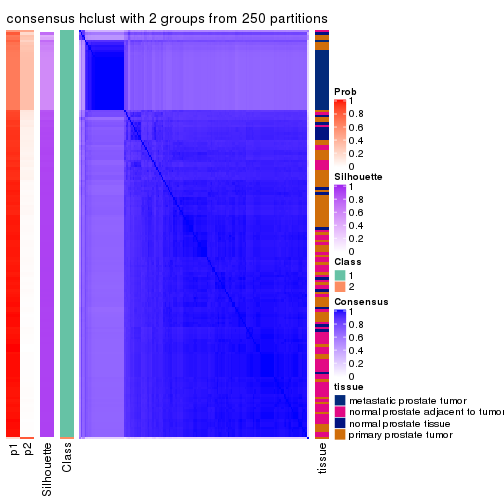</p>

</div>
<div id='tab-MAD-hclust-consensus-heatmap-2'>
<pre><code class="r">consensus_heatmap(res, k = 3)
</code></pre>

<p>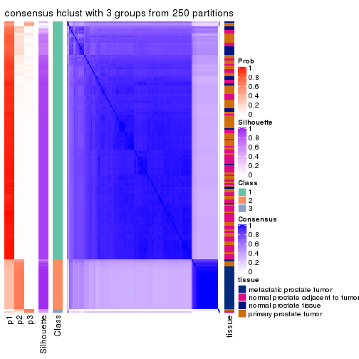</p>

</div>
<div id='tab-MAD-hclust-consensus-heatmap-3'>
<pre><code class="r">consensus_heatmap(res, k = 4)
</code></pre>

<p>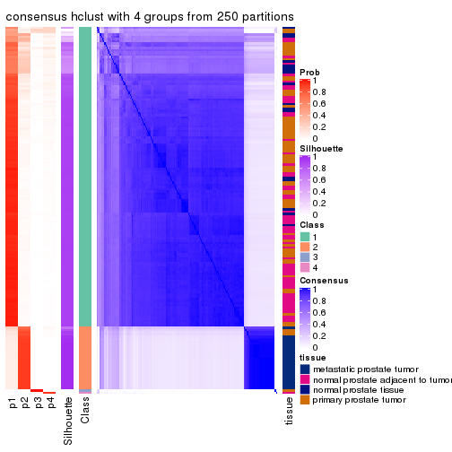</p>

</div>
<div id='tab-MAD-hclust-consensus-heatmap-4'>
<pre><code class="r">consensus_heatmap(res, k = 5)
</code></pre>

<p>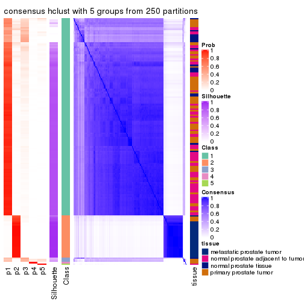</p>

</div>
<div id='tab-MAD-hclust-consensus-heatmap-5'>
<pre><code class="r">consensus_heatmap(res, k = 6)
</code></pre>

<p>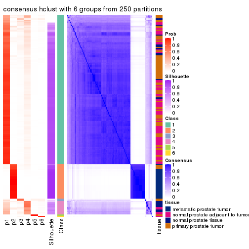</p>

</div>
</div>

Heatmaps for the membership of samples in all partitions to see how consistent they are:


<script>
$( function() {
	$( '#tabs-MAD-hclust-membership-heatmap' ).tabs();
} );
</script>
<div id='tabs-MAD-hclust-membership-heatmap'>
<ul>
<li><a href='#tab-MAD-hclust-membership-heatmap-1'>k = 2</a></li>
<li><a href='#tab-MAD-hclust-membership-heatmap-2'>k = 3</a></li>
<li><a href='#tab-MAD-hclust-membership-heatmap-3'>k = 4</a></li>
<li><a href='#tab-MAD-hclust-membership-heatmap-4'>k = 5</a></li>
<li><a href='#tab-MAD-hclust-membership-heatmap-5'>k = 6</a></li>
</ul>
<div id='tab-MAD-hclust-membership-heatmap-1'>
<pre><code class="r">membership_heatmap(res, k = 2)
</code></pre>

<p>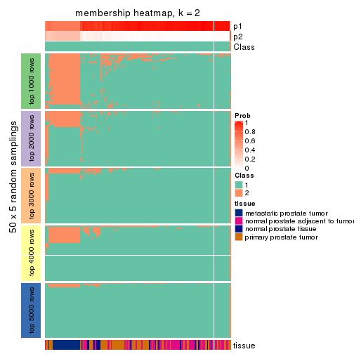</p>

</div>
<div id='tab-MAD-hclust-membership-heatmap-2'>
<pre><code class="r">membership_heatmap(res, k = 3)
</code></pre>

<p>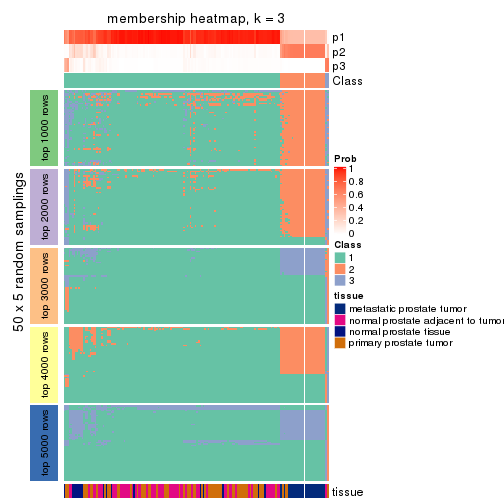</p>

</div>
<div id='tab-MAD-hclust-membership-heatmap-3'>
<pre><code class="r">membership_heatmap(res, k = 4)
</code></pre>

<p>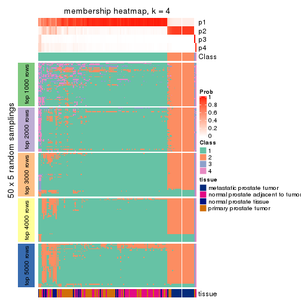</p>

</div>
<div id='tab-MAD-hclust-membership-heatmap-4'>
<pre><code class="r">membership_heatmap(res, k = 5)
</code></pre>

<p>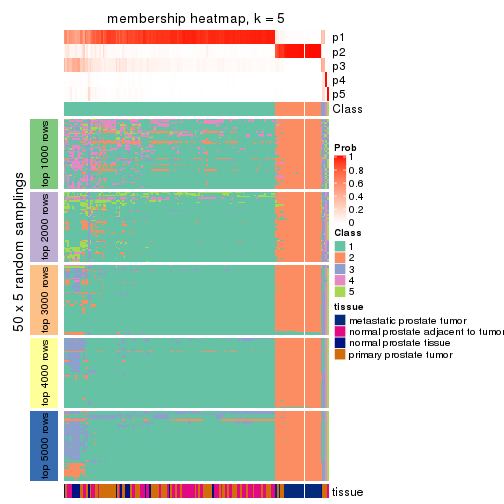</p>

</div>
<div id='tab-MAD-hclust-membership-heatmap-5'>
<pre><code class="r">membership_heatmap(res, k = 6)
</code></pre>

<p>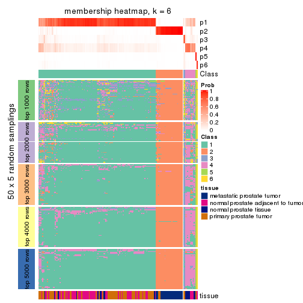</p>

</div>
</div>

As soon as we have had the classes for columns, we can look for signatures
which are significantly different between classes which can be candidate marks
for certain classes. Following are the heatmaps for signatures.


Signature heatmaps where rows are scaled:


<script>
$( function() {
	$( '#tabs-MAD-hclust-get-signatures' ).tabs();
} );
</script>
<div id='tabs-MAD-hclust-get-signatures'>
<ul>
<li><a href='#tab-MAD-hclust-get-signatures-1'>k = 2</a></li>
<li><a href='#tab-MAD-hclust-get-signatures-2'>k = 3</a></li>
<li><a href='#tab-MAD-hclust-get-signatures-3'>k = 4</a></li>
<li><a href='#tab-MAD-hclust-get-signatures-4'>k = 5</a></li>
<li><a href='#tab-MAD-hclust-get-signatures-5'>k = 6</a></li>
</ul>
<div id='tab-MAD-hclust-get-signatures-1'>
<pre><code class="r">get_signatures(res, k = 2)
</code></pre>

<p></p>

</div>
<div id='tab-MAD-hclust-get-signatures-2'>
<pre><code class="r">get_signatures(res, k = 3)
</code></pre>

<p>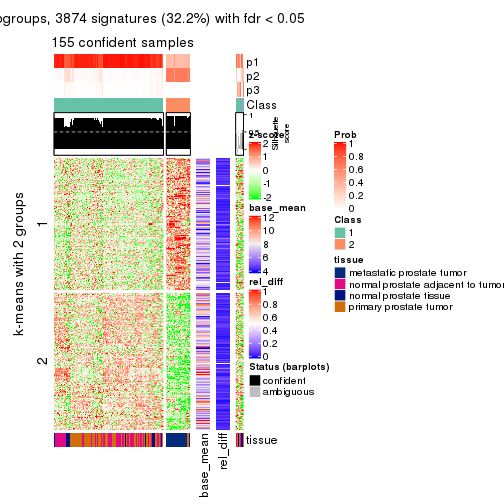</p>

</div>
<div id='tab-MAD-hclust-get-signatures-3'>
<pre><code class="r">get_signatures(res, k = 4)
</code></pre>

<p>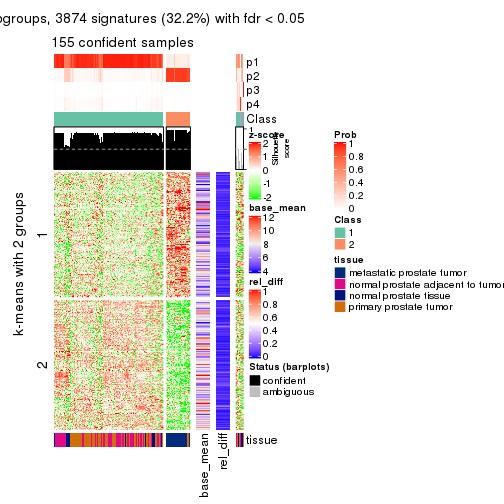</p>

</div>
<div id='tab-MAD-hclust-get-signatures-4'>
<pre><code class="r">get_signatures(res, k = 5)
</code></pre>

<p>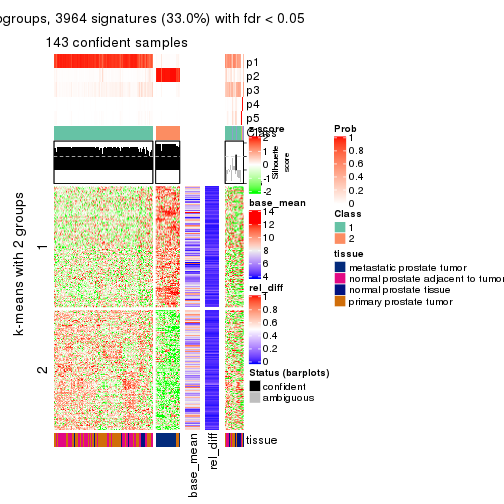</p>

</div>
<div id='tab-MAD-hclust-get-signatures-5'>
<pre><code class="r">get_signatures(res, k = 6)
</code></pre>

<p>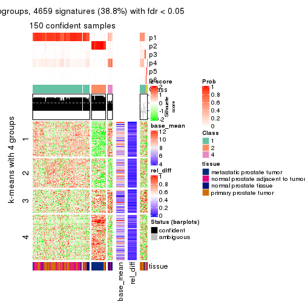</p>

</div>
</div>


Signature heatmaps where rows are not scaled:


<script>
$( function() {
	$( '#tabs-MAD-hclust-get-signatures-no-scale' ).tabs();
} );
</script>
<div id='tabs-MAD-hclust-get-signatures-no-scale'>
<ul>
<li><a href='#tab-MAD-hclust-get-signatures-no-scale-1'>k = 2</a></li>
<li><a href='#tab-MAD-hclust-get-signatures-no-scale-2'>k = 3</a></li>
<li><a href='#tab-MAD-hclust-get-signatures-no-scale-3'>k = 4</a></li>
<li><a href='#tab-MAD-hclust-get-signatures-no-scale-4'>k = 5</a></li>
<li><a href='#tab-MAD-hclust-get-signatures-no-scale-5'>k = 6</a></li>
</ul>
<div id='tab-MAD-hclust-get-signatures-no-scale-1'>
<pre><code class="r">get_signatures(res, k = 2, scale_rows = FALSE)
</code></pre>

<p></p>

</div>
<div id='tab-MAD-hclust-get-signatures-no-scale-2'>
<pre><code class="r">get_signatures(res, k = 3, scale_rows = FALSE)
</code></pre>

<p>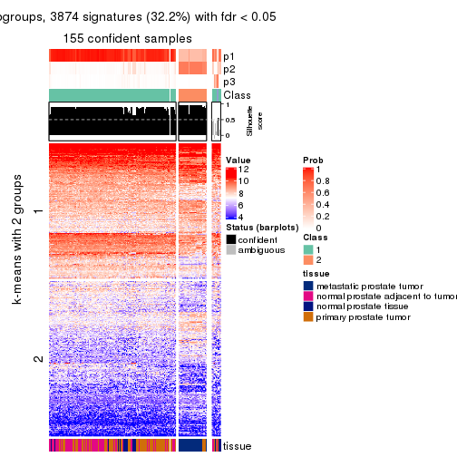</p>

</div>
<div id='tab-MAD-hclust-get-signatures-no-scale-3'>
<pre><code class="r">get_signatures(res, k = 4, scale_rows = FALSE)
</code></pre>

<p>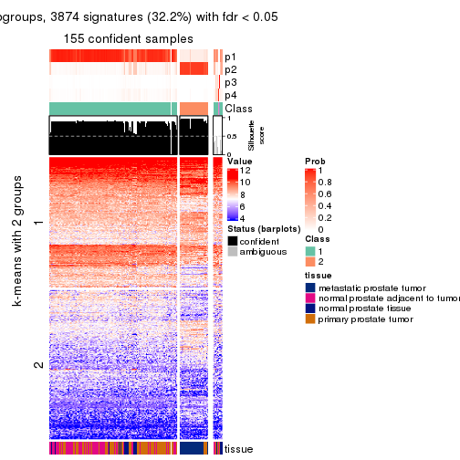</p>

</div>
<div id='tab-MAD-hclust-get-signatures-no-scale-4'>
<pre><code class="r">get_signatures(res, k = 5, scale_rows = FALSE)
</code></pre>

<p>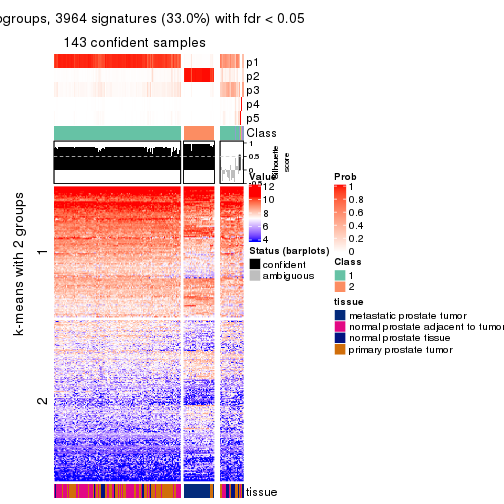</p>

</div>
<div id='tab-MAD-hclust-get-signatures-no-scale-5'>
<pre><code class="r">get_signatures(res, k = 6, scale_rows = FALSE)
</code></pre>

<p>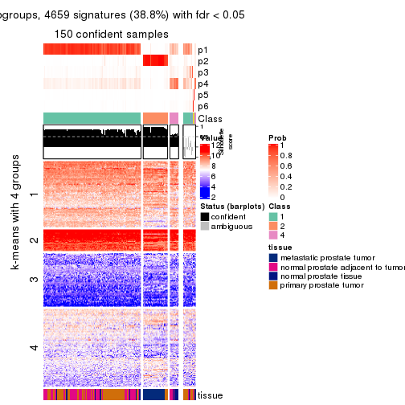</p>

</div>
</div>


Compare the overlap of signatures from different k:

```r
compare_signatures(res)
```

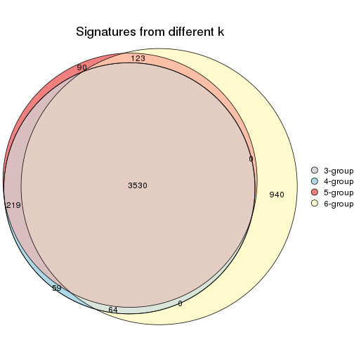

`get_signature()` returns a data frame invisibly. TO get the list of signatures, the function
call should be assigned to a variable explicitly. In following code, if `plot` argument is set
to `FALSE`, no heatmap is plotted while only the differential analysis is performed.

```r
# code only for demonstration
tb = get_signature(res, k = ..., plot = FALSE)
```

An example of the output of `tb` is:

```
#>   which_row         fdr    mean_1    mean_2 scaled_mean_1 scaled_mean_2 km
#> 1        38 0.042760348  8.373488  9.131774    -0.5533452     0.5164555  1
#> 2        40 0.018707592  7.106213  8.469186    -0.6173731     0.5762149  1
#> 3        55 0.019134737 10.221463 11.207825    -0.6159697     0.5749050  1
#> 4        59 0.006059896  5.921854  7.869574    -0.6899429     0.6439467  1
#> 5        60 0.018055526  8.928898 10.211722    -0.6204761     0.5791110  1
#> 6        98 0.009384629 15.714769 14.887706     0.6635654    -0.6193277  2
...
```

The columns in `tb` are:

1. `which_row`: row indices corresponding to the input matrix.
2. `fdr`: FDR for the differential test. 
3. `mean_x`: The mean value in group x.
4. `scaled_mean_x`: The mean value in group x after rows are scaled.
5. `km`: Row groups if k-means clustering is applied to rows.


UMAP plot which shows how samples are separated.


<script>
$( function() {
	$( '#tabs-MAD-hclust-dimension-reduction' ).tabs();
} );
</script>
<div id='tabs-MAD-hclust-dimension-reduction'>
<ul>
<li><a href='#tab-MAD-hclust-dimension-reduction-1'>k = 2</a></li>
<li><a href='#tab-MAD-hclust-dimension-reduction-2'>k = 3</a></li>
<li><a href='#tab-MAD-hclust-dimension-reduction-3'>k = 4</a></li>
<li><a href='#tab-MAD-hclust-dimension-reduction-4'>k = 5</a></li>
<li><a href='#tab-MAD-hclust-dimension-reduction-5'>k = 6</a></li>
</ul>
<div id='tab-MAD-hclust-dimension-reduction-1'>
<pre><code class="r">dimension_reduction(res, k = 2, method = &quot;UMAP&quot;)
</code></pre>

<p>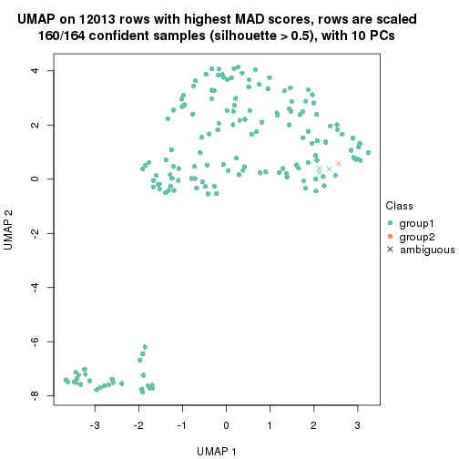</p>

</div>
<div id='tab-MAD-hclust-dimension-reduction-2'>
<pre><code class="r">dimension_reduction(res, k = 3, method = &quot;UMAP&quot;)
</code></pre>

<p>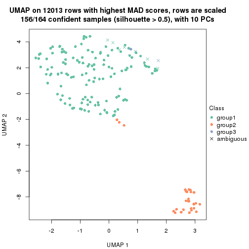</p>

</div>
<div id='tab-MAD-hclust-dimension-reduction-3'>
<pre><code class="r">dimension_reduction(res, k = 4, method = &quot;UMAP&quot;)
</code></pre>

<p>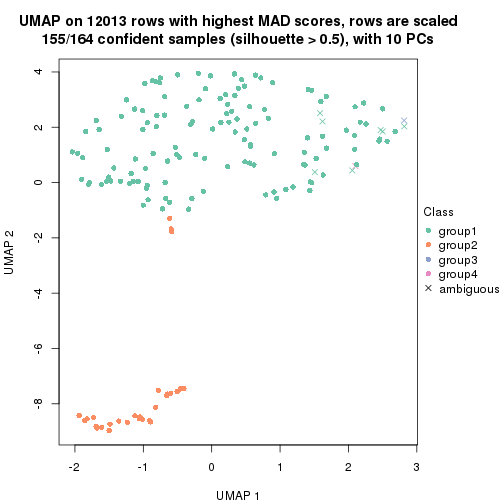</p>

</div>
<div id='tab-MAD-hclust-dimension-reduction-4'>
<pre><code class="r">dimension_reduction(res, k = 5, method = &quot;UMAP&quot;)
</code></pre>

<p>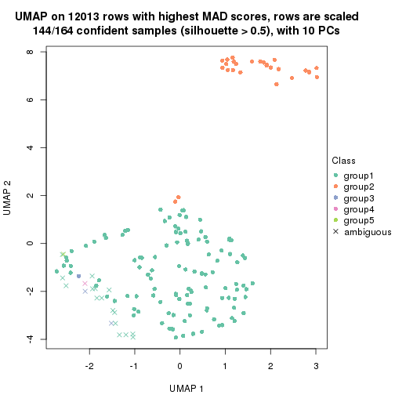</p>

</div>
<div id='tab-MAD-hclust-dimension-reduction-5'>
<pre><code class="r">dimension_reduction(res, k = 6, method = &quot;UMAP&quot;)
</code></pre>

<p>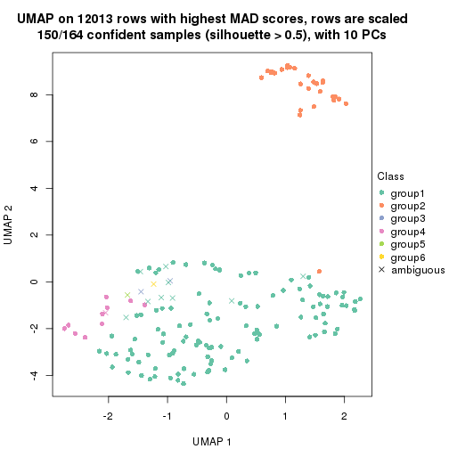</p>

</div>
</div>


Following heatmap shows how subgroups are split when increasing `k`:

```r
collect_classes(res)
```

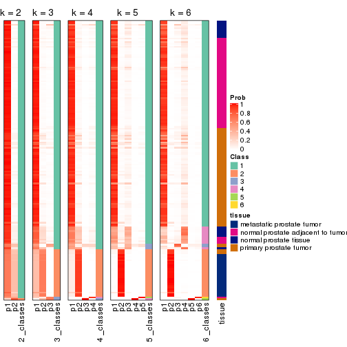


Test correlation between subgroups and known annotations. If the known
annotation is numeric, one-way ANOVA test is applied, and if the known
annotation is discrete, chi-squared contingency table test is applied.

```r
test_to_known_factors(res)
```

```
#>              n tissue(p) k
#> MAD:hclust 160        NA 2
#> MAD:hclust 156  2.63e-27 3
#> MAD:hclust 155  3.15e-29 4
#> MAD:hclust 144  4.87e-25 5
#> MAD:hclust 150  2.74e-32 6
```


If matrix rows can be associated to genes, consider to use `functional_enrichment(res,
...)` to perform function enrichment for the signature genes. See [this vignette](http://bioconductor.org/packages/devel/bioc/vignettes/cola/inst/doc/functional_enrichment.html) for more detailed explanations.


 

---------------------------------------------------


### MAD:kmeans*


The object with results only for a single top-value method and a single partition method 
can be extracted as:

```r
res = res_list["MAD", "kmeans"]
# you can also extract it by
# res = res_list["MAD:kmeans"]
```

A summary of `res` and all the functions that can be applied to it:

```r
res
```

```
#> A 'ConsensusPartition' object with k = 2, 3, 4, 5, 6.
#>   On a matrix with 12013 rows and 164 columns.
#>   Top rows (1000, 2000, 3000, 4000, 5000) are extracted by 'MAD' method.
#>   Subgroups are detected by 'kmeans' method.
#>   Performed in total 1250 partitions by row resampling.
#>   Best k for subgroups seems to be 3.
#> 
#> Following methods can be applied to this 'ConsensusPartition' object:
#>  [1] "cola_report"             "collect_classes"         "collect_plots"          
#>  [4] "collect_stats"           "colnames"                "compare_signatures"     
#>  [7] "consensus_heatmap"       "dimension_reduction"     "functional_enrichment"  
#> [10] "get_anno_col"            "get_anno"                "get_classes"            
#> [13] "get_consensus"           "get_matrix"              "get_membership"         
#> [16] "get_param"               "get_signatures"          "get_stats"              
#> [19] "is_best_k"               "is_stable_k"             "membership_heatmap"     
#> [22] "ncol"                    "nrow"                    "plot_ecdf"              
#> [25] "rownames"                "select_partition_number" "show"                   
#> [28] "suggest_best_k"          "test_to_known_factors"
```

`collect_plots()` function collects all the plots made from `res` for all `k` (number of partitions)
into one single page to provide an easy and fast comparison between different `k`.

```r
collect_plots(res)
```

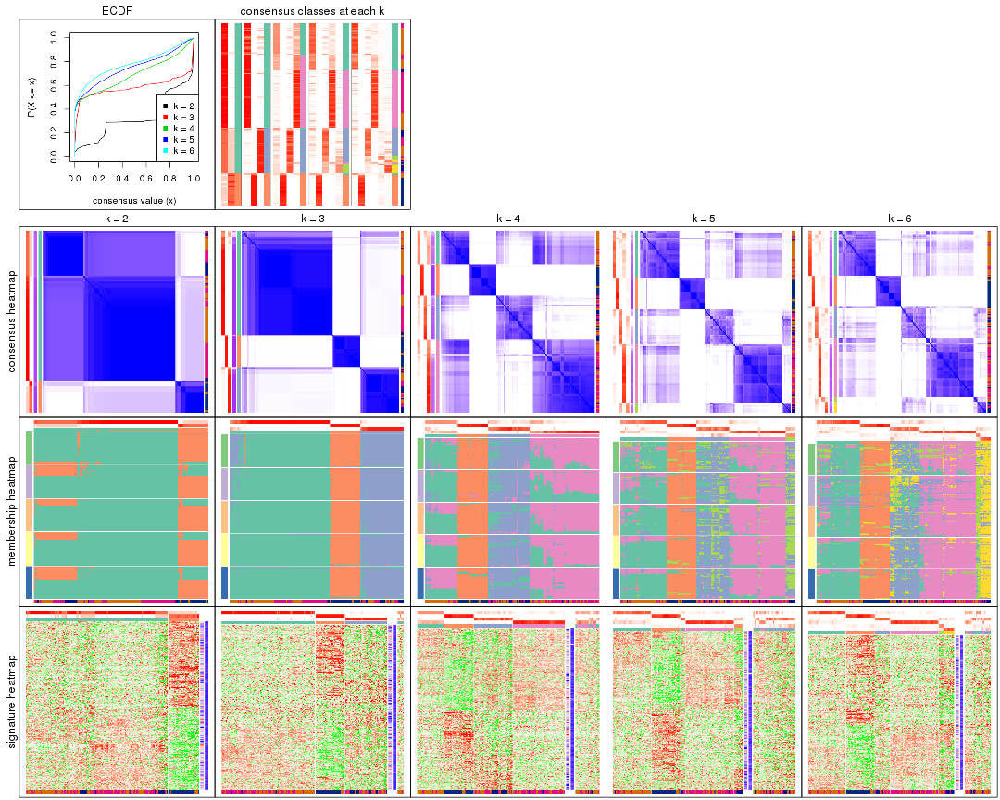

The plots are:

- The first row: a plot of the ECDF (empirical cumulative distribution
  function) curves of the consensus matrix for each `k` and the heatmap of
  predicted classes for each `k`.
- The second row: heatmaps of the consensus matrix for each `k`.
- The third row: heatmaps of the membership matrix for each `k`.
- The fouth row: heatmaps of the signatures for each `k`.

All the plots in panels can be made by individual functions and they are
plotted later in this section.

`select_partition_number()` produces several plots showing different
statistics for choosing "optimized" `k`. There are following statistics:

- ECDF curves of the consensus matrix for each `k`;
- 1-PAC. [The PAC
  score](https://en.wikipedia.org/wiki/Consensus_clustering#Over-interpretation_potential_of_consensus_clustering)
  measures the proportion of the ambiguous subgrouping.
- Mean silhouette score.
- Concordance. The mean probability of fiting the consensus class ids in all
  partitions.
- Area increased. Denote $A_k$ as the area under the ECDF curve for current
  `k`, the area increased is defined as $A_k - A_{k-1}$.
- Rand index. The percent of pairs of samples that are both in a same cluster
  or both are not in a same cluster in the partition of k and k-1.
- Jaccard index. The ratio of pairs of samples are both in a same cluster in
  the partition of k and k-1 and the pairs of samples are both in a same
  cluster in the partition k or k-1.

The detailed explanations of these statistics can be found in [the _cola_
vignette](http://bioconductor.org/packages/devel/bioc/vignettes/cola/inst/doc/cola.html#toc_13).

Generally speaking, lower PAC score, higher mean silhouette score or higher
concordance corresponds to better partition. Rand index and Jaccard index
measure how similar the current partition is compared to partition with `k-1`.
If they are too similar, we won't accept `k` is better than `k-1`.

```r
select_partition_number(res)
```

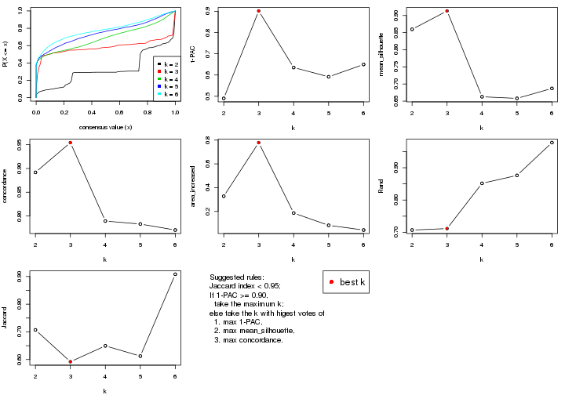

The numeric values for all these statistics can be obtained by `get_stats()`.

```r
get_stats(res)
```

```
#>   k 1-PAC mean_silhouette concordance area_increased  Rand Jaccard
#> 2 2 0.490           0.860       0.892         0.3277 0.707   0.707
#> 3 3 0.902           0.913       0.954         0.7788 0.712   0.592
#> 4 4 0.635           0.663       0.789         0.1860 0.852   0.649
#> 5 5 0.592           0.658       0.783         0.0830 0.876   0.613
#> 6 6 0.650           0.687       0.770         0.0433 0.978   0.908
```

`suggest_best_k()` suggests the best $k$ based on these statistics. The rules are as follows:

- All $k$ with Jaccard index larger than 0.95 are removed because increasing
  $k$ does not provide enough extra information. If all $k$ are removed, it is
  marked as no subgroup is detected.
- For all $k$ with 1-PAC score larger than 0.9, the maximal $k$ is taken as
  the best $k$, and other $k$ are marked as optional $k$.
- If it does not fit the second rule. The $k$ with the maximal vote of the
  highest 1-PAC score, highest mean silhouette, and highest concordance is
  taken as the best $k$.

```r
suggest_best_k(res)
```

```
#> [1] 3
```


Following shows the table of the partitions (You need to click the **show/hide
code output** link to see it). The membership matrix (columns with name `p*`)
is inferred by
[`clue::cl_consensus()`](https://www.rdocumentation.org/link/cl_consensus?package=clue)
function with the `SE` method. Basically the value in the membership matrix
represents the probability to belong to a certain group. The finall class
label for an item is determined with the group with highest probability it
belongs to.

In `get_classes()` function, the entropy is calculated from the membership
matrix and the silhouette score is calculated from the consensus matrix.


<script>
$( function() {
	$( '#tabs-MAD-kmeans-get-classes' ).tabs();
} );
</script>
<div id='tabs-MAD-kmeans-get-classes'>
<ul>
<li><a href='#tab-MAD-kmeans-get-classes-1'>k = 2</a></li>
<li><a href='#tab-MAD-kmeans-get-classes-2'>k = 3</a></li>
<li><a href='#tab-MAD-kmeans-get-classes-3'>k = 4</a></li>
<li><a href='#tab-MAD-kmeans-get-classes-4'>k = 5</a></li>
<li><a href='#tab-MAD-kmeans-get-classes-5'>k = 6</a></li>
</ul>

<div id='tab-MAD-kmeans-get-classes-1'>
<p><a id='tab-MAD-kmeans-get-classes-1-a' style='color:#0366d6' href='#'>show/hide code output</a></p>
<pre><code class="r">cbind(get_classes(res, k = 2), get_membership(res, k = 2))
</code></pre>

<pre><code>#&gt;           class entropy silhouette    p1    p2
#&gt; GSM152839     1  0.8016      0.773 0.756 0.244
#&gt; GSM152840     1  0.8267      0.765 0.740 0.260
#&gt; GSM152841     1  0.0000      0.892 1.000 0.000
#&gt; GSM152842     1  0.8267      0.765 0.740 0.260
#&gt; GSM152843     1  0.8267      0.765 0.740 0.260
#&gt; GSM152844     1  0.8267      0.765 0.740 0.260
#&gt; GSM152845     1  0.8267      0.765 0.740 0.260
#&gt; GSM152846     1  0.8267      0.765 0.740 0.260
#&gt; GSM152847     1  0.8267      0.765 0.740 0.260
#&gt; GSM152848     1  0.2603      0.879 0.956 0.044
#&gt; GSM152849     1  0.8267      0.765 0.740 0.260
#&gt; GSM152850     1  0.8267      0.765 0.740 0.260
#&gt; GSM152851     1  0.7883      0.779 0.764 0.236
#&gt; GSM152852     1  0.8267      0.765 0.740 0.260
#&gt; GSM152853     1  0.8267      0.765 0.740 0.260
#&gt; GSM152854     1  0.8267      0.765 0.740 0.260
#&gt; GSM152855     1  0.0000      0.892 1.000 0.000
#&gt; GSM153238     1  0.8267      0.765 0.740 0.260
#&gt; GSM153239     1  0.8267      0.765 0.740 0.260
#&gt; GSM153240     1  0.0000      0.892 1.000 0.000
#&gt; GSM153241     1  0.8267      0.765 0.740 0.260
#&gt; GSM153242     1  0.8267      0.765 0.740 0.260
#&gt; GSM153243     1  0.8267      0.765 0.740 0.260
#&gt; GSM153244     1  0.3431      0.869 0.936 0.064
#&gt; GSM153245     1  0.8267      0.765 0.740 0.260
#&gt; GSM153246     1  0.8267      0.765 0.740 0.260
#&gt; GSM153247     1  0.8267      0.765 0.740 0.260
#&gt; GSM153248     1  0.0000      0.892 1.000 0.000
#&gt; GSM153249     1  0.0000      0.892 1.000 0.000
#&gt; GSM153250     1  0.0000      0.892 1.000 0.000
#&gt; GSM153251     1  0.8267      0.765 0.740 0.260
#&gt; GSM153252     1  0.0376      0.892 0.996 0.004
#&gt; GSM153253     1  0.1184      0.889 0.984 0.016
#&gt; GSM153254     1  0.7139      0.801 0.804 0.196
#&gt; GSM153255     1  0.0000      0.892 1.000 0.000
#&gt; GSM153256     1  0.0000      0.892 1.000 0.000
#&gt; GSM153257     1  0.0000      0.892 1.000 0.000
#&gt; GSM153258     1  0.0000      0.892 1.000 0.000
#&gt; GSM153259     1  0.0000      0.892 1.000 0.000
#&gt; GSM153260     1  0.8267      0.765 0.740 0.260
#&gt; GSM153261     1  0.8267      0.765 0.740 0.260
#&gt; GSM153262     1  0.0376      0.892 0.996 0.004
#&gt; GSM153263     1  0.0000      0.892 1.000 0.000
#&gt; GSM153264     1  0.0000      0.892 1.000 0.000
#&gt; GSM153265     1  0.0376      0.892 0.996 0.004
#&gt; GSM153266     1  0.0000      0.892 1.000 0.000
#&gt; GSM153267     1  0.0000      0.892 1.000 0.000
#&gt; GSM153268     1  0.5842      0.831 0.860 0.140
#&gt; GSM153269     1  0.0000      0.892 1.000 0.000
#&gt; GSM153270     1  0.0000      0.892 1.000 0.000
#&gt; GSM153271     1  0.0000      0.892 1.000 0.000
#&gt; GSM153272     1  0.0000      0.892 1.000 0.000
#&gt; GSM153273     1  0.0000      0.892 1.000 0.000
#&gt; GSM153274     1  0.0000      0.892 1.000 0.000
#&gt; GSM153275     1  0.0000      0.892 1.000 0.000
#&gt; GSM153276     1  0.0000      0.892 1.000 0.000
#&gt; GSM153277     1  0.0376      0.892 0.996 0.004
#&gt; GSM153278     1  0.8207      0.767 0.744 0.256
#&gt; GSM153279     1  0.2778      0.878 0.952 0.048
#&gt; GSM153280     1  0.0376      0.892 0.996 0.004
#&gt; GSM153281     1  0.0672      0.891 0.992 0.008
#&gt; GSM153282     1  0.1184      0.889 0.984 0.016
#&gt; GSM153283     1  0.0000      0.892 1.000 0.000
#&gt; GSM153284     1  0.0000      0.892 1.000 0.000
#&gt; GSM153285     1  0.0000      0.892 1.000 0.000
#&gt; GSM153286     1  0.0000      0.892 1.000 0.000
#&gt; GSM153287     1  0.0000      0.892 1.000 0.000
#&gt; GSM153288     1  0.0000      0.892 1.000 0.000
#&gt; GSM153289     1  0.0000      0.892 1.000 0.000
#&gt; GSM153290     1  0.1414      0.888 0.980 0.020
#&gt; GSM153291     1  0.0000      0.892 1.000 0.000
#&gt; GSM153292     1  0.0000      0.892 1.000 0.000
#&gt; GSM153293     1  0.0000      0.892 1.000 0.000
#&gt; GSM153294     1  0.0000      0.892 1.000 0.000
#&gt; GSM153295     1  0.1184      0.889 0.984 0.016
#&gt; GSM153054     1  0.2423      0.880 0.960 0.040
#&gt; GSM153055     1  0.0000      0.892 1.000 0.000
#&gt; GSM153056     1  0.8267      0.765 0.740 0.260
#&gt; GSM153057     1  0.8267      0.765 0.740 0.260
#&gt; GSM153058     1  0.8267      0.765 0.740 0.260
#&gt; GSM153059     1  0.8207      0.767 0.744 0.256
#&gt; GSM153060     1  0.8267      0.765 0.740 0.260
#&gt; GSM153061     1  0.8267      0.765 0.740 0.260
#&gt; GSM153062     1  0.8267      0.765 0.740 0.260
#&gt; GSM153063     1  0.8267      0.765 0.740 0.260
#&gt; GSM153064     1  0.0000      0.892 1.000 0.000
#&gt; GSM153065     1  0.8267      0.765 0.740 0.260
#&gt; GSM153066     1  0.9795      0.517 0.584 0.416
#&gt; GSM153067     1  0.0000      0.892 1.000 0.000
#&gt; GSM153068     1  0.8267      0.765 0.740 0.260
#&gt; GSM153069     1  0.0000      0.892 1.000 0.000
#&gt; GSM153070     1  0.0000      0.892 1.000 0.000
#&gt; GSM153071     1  0.4815      0.851 0.896 0.104
#&gt; GSM153072     1  0.2423      0.881 0.960 0.040
#&gt; GSM153073     1  0.0000      0.892 1.000 0.000
#&gt; GSM153074     1  0.0000      0.892 1.000 0.000
#&gt; GSM153075     1  0.1184      0.889 0.984 0.016
#&gt; GSM153076     1  0.0000      0.892 1.000 0.000
#&gt; GSM153077     1  0.0000      0.892 1.000 0.000
#&gt; GSM153078     1  0.4690      0.853 0.900 0.100
#&gt; GSM153079     1  0.0000      0.892 1.000 0.000
#&gt; GSM153080     1  0.8267      0.765 0.740 0.260
#&gt; GSM153081     1  0.0000      0.892 1.000 0.000
#&gt; GSM153082     1  0.4562      0.784 0.904 0.096
#&gt; GSM153083     1  0.0000      0.892 1.000 0.000
#&gt; GSM153084     1  0.2423      0.880 0.960 0.040
#&gt; GSM153085     1  0.1633      0.886 0.976 0.024
#&gt; GSM153086     1  0.0938      0.890 0.988 0.012
#&gt; GSM153087     1  0.0000      0.892 1.000 0.000
#&gt; GSM153088     1  0.0000      0.892 1.000 0.000
#&gt; GSM153089     1  0.8267      0.765 0.740 0.260
#&gt; GSM153090     1  0.0000      0.892 1.000 0.000
#&gt; GSM153091     1  0.0000      0.892 1.000 0.000
#&gt; GSM153092     1  0.0000      0.892 1.000 0.000
#&gt; GSM153093     1  0.0000      0.892 1.000 0.000
#&gt; GSM153094     1  0.0000      0.892 1.000 0.000
#&gt; GSM153095     1  0.0938      0.890 0.988 0.012
#&gt; GSM153096     1  0.0000      0.892 1.000 0.000
#&gt; GSM153097     1  0.0000      0.892 1.000 0.000
#&gt; GSM153098     1  0.0000      0.892 1.000 0.000
#&gt; GSM153099     1  0.0000      0.892 1.000 0.000
#&gt; GSM153100     1  0.0000      0.892 1.000 0.000
#&gt; GSM153101     1  0.0376      0.892 0.996 0.004
#&gt; GSM153102     1  0.0672      0.891 0.992 0.008
#&gt; GSM153103     1  0.0938      0.890 0.988 0.012
#&gt; GSM153104     1  0.1184      0.889 0.984 0.016
#&gt; GSM153106     1  0.0000      0.892 1.000 0.000
#&gt; GSM153107     1  0.0000      0.892 1.000 0.000
#&gt; GSM153108     1  0.0000      0.892 1.000 0.000
#&gt; GSM153109     1  0.0000      0.892 1.000 0.000
#&gt; GSM153110     1  0.0000      0.892 1.000 0.000
#&gt; GSM153111     1  0.0000      0.892 1.000 0.000
#&gt; GSM153112     1  0.0000      0.892 1.000 0.000
#&gt; GSM153113     1  0.5842      0.715 0.860 0.140
#&gt; GSM153114     1  0.0000      0.892 1.000 0.000
#&gt; GSM187532     2  0.0938      0.744 0.012 0.988
#&gt; GSM187533     2  0.8081      0.936 0.248 0.752
#&gt; GSM187534     2  0.8267      0.940 0.260 0.740
#&gt; GSM187535     2  0.8327      0.936 0.264 0.736
#&gt; GSM152906     2  0.8267      0.940 0.260 0.740
#&gt; GSM152907     2  0.8267      0.940 0.260 0.740
#&gt; GSM152908     2  0.8267      0.940 0.260 0.740
#&gt; GSM152909     2  0.1414      0.752 0.020 0.980
#&gt; GSM152910     2  0.5737      0.858 0.136 0.864
#&gt; GSM152911     2  0.8267      0.940 0.260 0.740
#&gt; GSM152912     2  0.8267      0.940 0.260 0.740
#&gt; GSM152913     2  0.1633      0.756 0.024 0.976
#&gt; GSM152914     2  0.8267      0.940 0.260 0.740
#&gt; GSM152915     2  0.8267      0.940 0.260 0.740
#&gt; GSM152916     2  0.7453      0.920 0.212 0.788
#&gt; GSM152917     2  0.8267      0.940 0.260 0.740
#&gt; GSM152918     2  0.8267      0.940 0.260 0.740
#&gt; GSM152919     2  0.8267      0.940 0.260 0.740
#&gt; GSM152920     2  0.8267      0.940 0.260 0.740
#&gt; GSM152921     2  0.8267      0.940 0.260 0.740
#&gt; GSM152922     2  0.7376      0.917 0.208 0.792
#&gt; GSM152923     2  0.8267      0.940 0.260 0.740
#&gt; GSM152924     2  0.7674      0.926 0.224 0.776
#&gt; GSM152925     2  0.7453      0.920 0.212 0.788
#&gt; GSM152926     2  0.8267      0.940 0.260 0.740
#&gt; GSM152927     2  0.4431      0.819 0.092 0.908
#&gt; GSM152928     2  0.7139      0.909 0.196 0.804
#&gt; GSM152929     2  0.8267      0.940 0.260 0.740
#&gt; GSM152930     2  0.8267      0.940 0.260 0.740
</code></pre>

<script>
$('#tab-MAD-kmeans-get-classes-1-a').parent().next().next().hide();
$('#tab-MAD-kmeans-get-classes-1-a').click(function(){
  $('#tab-MAD-kmeans-get-classes-1-a').parent().next().next().toggle();
  return(false);
});
</script>
</div>

<div id='tab-MAD-kmeans-get-classes-2'>
<p><a id='tab-MAD-kmeans-get-classes-2-a' style='color:#0366d6' href='#'>show/hide code output</a></p>
<pre><code class="r">cbind(get_classes(res, k = 3), get_membership(res, k = 3))
</code></pre>

<pre><code>#&gt;           class entropy silhouette    p1    p2    p3
#&gt; GSM152839     3  0.4842      0.728 0.224 0.000 0.776
#&gt; GSM152840     3  0.1529      0.947 0.040 0.000 0.960
#&gt; GSM152841     1  0.0424      0.951 0.992 0.000 0.008
#&gt; GSM152842     3  0.1163      0.955 0.028 0.000 0.972
#&gt; GSM152843     3  0.1163      0.955 0.028 0.000 0.972
#&gt; GSM152844     3  0.1163      0.954 0.028 0.000 0.972
#&gt; GSM152845     3  0.1031      0.951 0.024 0.000 0.976
#&gt; GSM152846     3  0.1163      0.954 0.028 0.000 0.972
#&gt; GSM152847     3  0.1163      0.955 0.028 0.000 0.972
#&gt; GSM152848     1  0.2066      0.914 0.940 0.000 0.060
#&gt; GSM152849     3  0.1163      0.955 0.028 0.000 0.972
#&gt; GSM152850     3  0.1163      0.955 0.028 0.000 0.972
#&gt; GSM152851     3  0.3192      0.872 0.112 0.000 0.888
#&gt; GSM152852     3  0.1163      0.954 0.028 0.000 0.972
#&gt; GSM152853     3  0.1163      0.954 0.028 0.000 0.972
#&gt; GSM152854     3  0.1163      0.954 0.028 0.000 0.972
#&gt; GSM152855     1  0.0424      0.951 0.992 0.000 0.008
#&gt; GSM153238     3  0.1163      0.955 0.028 0.000 0.972
#&gt; GSM153239     3  0.1163      0.954 0.028 0.000 0.972
#&gt; GSM153240     1  0.0424      0.951 0.992 0.000 0.008
#&gt; GSM153241     3  0.1163      0.955 0.028 0.000 0.972
#&gt; GSM153242     3  0.1163      0.954 0.028 0.000 0.972
#&gt; GSM153243     3  0.1163      0.955 0.028 0.000 0.972
#&gt; GSM153244     1  0.6180      0.286 0.584 0.000 0.416
#&gt; GSM153245     3  0.1163      0.954 0.028 0.000 0.972
#&gt; GSM153246     3  0.1585      0.954 0.028 0.008 0.964
#&gt; GSM153247     3  0.1163      0.955 0.028 0.000 0.972
#&gt; GSM153248     1  0.0424      0.950 0.992 0.000 0.008
#&gt; GSM153249     1  0.0424      0.951 0.992 0.000 0.008
#&gt; GSM153250     1  0.0424      0.950 0.992 0.000 0.008
#&gt; GSM153251     3  0.1163      0.954 0.028 0.000 0.972
#&gt; GSM153252     1  0.0424      0.951 0.992 0.000 0.008
#&gt; GSM153253     1  0.0424      0.951 0.992 0.000 0.008
#&gt; GSM153254     3  0.4235      0.788 0.176 0.000 0.824
#&gt; GSM153255     1  0.0424      0.951 0.992 0.000 0.008
#&gt; GSM153256     1  0.0237      0.951 0.996 0.000 0.004
#&gt; GSM153257     1  0.0424      0.951 0.992 0.000 0.008
#&gt; GSM153258     1  0.0424      0.950 0.992 0.000 0.008
#&gt; GSM153259     1  0.0424      0.950 0.992 0.000 0.008
#&gt; GSM153260     3  0.1163      0.955 0.028 0.000 0.972
#&gt; GSM153261     3  0.1163      0.955 0.028 0.000 0.972
#&gt; GSM153262     1  0.0424      0.951 0.992 0.000 0.008
#&gt; GSM153263     1  0.0424      0.950 0.992 0.000 0.008
#&gt; GSM153264     1  0.0424      0.950 0.992 0.000 0.008
#&gt; GSM153265     1  0.0424      0.951 0.992 0.000 0.008
#&gt; GSM153266     1  0.0424      0.950 0.992 0.000 0.008
#&gt; GSM153267     1  0.0237      0.951 0.996 0.000 0.004
#&gt; GSM153268     1  0.2165      0.911 0.936 0.000 0.064
#&gt; GSM153269     1  0.0237      0.951 0.996 0.000 0.004
#&gt; GSM153270     1  0.0424      0.951 0.992 0.000 0.008
#&gt; GSM153271     1  0.0424      0.950 0.992 0.000 0.008
#&gt; GSM153272     1  0.0424      0.951 0.992 0.000 0.008
#&gt; GSM153273     1  0.0424      0.950 0.992 0.000 0.008
#&gt; GSM153274     1  0.0237      0.951 0.996 0.000 0.004
#&gt; GSM153275     1  0.0424      0.951 0.992 0.000 0.008
#&gt; GSM153276     1  0.0424      0.951 0.992 0.000 0.008
#&gt; GSM153277     1  0.0424      0.951 0.992 0.000 0.008
#&gt; GSM153278     3  0.2878      0.890 0.096 0.000 0.904
#&gt; GSM153279     1  0.3686      0.835 0.860 0.000 0.140
#&gt; GSM153280     1  0.0424      0.951 0.992 0.000 0.008
#&gt; GSM153281     1  0.0424      0.951 0.992 0.000 0.008
#&gt; GSM153282     1  0.0424      0.951 0.992 0.000 0.008
#&gt; GSM153283     1  0.0424      0.950 0.992 0.000 0.008
#&gt; GSM153284     1  0.0424      0.951 0.992 0.000 0.008
#&gt; GSM153285     1  0.0424      0.951 0.992 0.000 0.008
#&gt; GSM153286     1  0.0424      0.951 0.992 0.000 0.008
#&gt; GSM153287     1  0.0424      0.951 0.992 0.000 0.008
#&gt; GSM153288     1  0.0424      0.951 0.992 0.000 0.008
#&gt; GSM153289     1  0.0000      0.951 1.000 0.000 0.000
#&gt; GSM153290     1  0.0424      0.951 0.992 0.000 0.008
#&gt; GSM153291     1  0.0424      0.951 0.992 0.000 0.008
#&gt; GSM153292     1  0.0424      0.951 0.992 0.000 0.008
#&gt; GSM153293     1  0.0000      0.951 1.000 0.000 0.000
#&gt; GSM153294     1  0.0424      0.950 0.992 0.000 0.008
#&gt; GSM153295     1  0.0237      0.951 0.996 0.000 0.004
#&gt; GSM153054     1  0.5650      0.567 0.688 0.000 0.312
#&gt; GSM153055     1  0.0424      0.951 0.992 0.000 0.008
#&gt; GSM153056     3  0.1163      0.955 0.028 0.000 0.972
#&gt; GSM153057     3  0.1163      0.955 0.028 0.000 0.972
#&gt; GSM153058     3  0.1163      0.954 0.028 0.000 0.972
#&gt; GSM153059     3  0.1163      0.955 0.028 0.000 0.972
#&gt; GSM153060     3  0.1267      0.954 0.024 0.004 0.972
#&gt; GSM153061     3  0.1399      0.954 0.028 0.004 0.968
#&gt; GSM153062     3  0.1453      0.954 0.024 0.008 0.968
#&gt; GSM153063     3  0.1163      0.954 0.028 0.000 0.972
#&gt; GSM153064     1  0.0424      0.950 0.992 0.000 0.008
#&gt; GSM153065     3  0.1163      0.955 0.028 0.000 0.972
#&gt; GSM153066     3  0.1620      0.948 0.024 0.012 0.964
#&gt; GSM153067     1  0.0424      0.951 0.992 0.000 0.008
#&gt; GSM153068     3  0.1163      0.955 0.028 0.000 0.972
#&gt; GSM153069     1  0.0424      0.951 0.992 0.000 0.008
#&gt; GSM153070     1  0.0424      0.950 0.992 0.000 0.008
#&gt; GSM153071     3  0.6286      0.113 0.464 0.000 0.536
#&gt; GSM153072     1  0.6215      0.271 0.572 0.000 0.428
#&gt; GSM153073     1  0.0424      0.950 0.992 0.000 0.008
#&gt; GSM153074     1  0.0424      0.951 0.992 0.000 0.008
#&gt; GSM153075     1  0.2261      0.908 0.932 0.000 0.068
#&gt; GSM153076     1  0.0424      0.950 0.992 0.000 0.008
#&gt; GSM153077     1  0.0424      0.950 0.992 0.000 0.008
#&gt; GSM153078     1  0.6295      0.111 0.528 0.000 0.472
#&gt; GSM153079     1  0.0592      0.949 0.988 0.000 0.012
#&gt; GSM153080     3  0.3340      0.862 0.120 0.000 0.880
#&gt; GSM153081     1  0.0424      0.950 0.992 0.000 0.008
#&gt; GSM153082     1  0.2550      0.908 0.932 0.056 0.012
#&gt; GSM153083     1  0.0592      0.949 0.988 0.000 0.012
#&gt; GSM153084     1  0.6225      0.258 0.568 0.000 0.432
#&gt; GSM153085     1  0.4504      0.763 0.804 0.000 0.196
#&gt; GSM153086     1  0.4504      0.763 0.804 0.000 0.196
#&gt; GSM153087     1  0.0424      0.951 0.992 0.000 0.008
#&gt; GSM153088     1  0.0424      0.950 0.992 0.000 0.008
#&gt; GSM153089     3  0.1163      0.954 0.028 0.000 0.972
#&gt; GSM153090     1  0.0424      0.950 0.992 0.000 0.008
#&gt; GSM153091     1  0.0424      0.950 0.992 0.000 0.008
#&gt; GSM153092     1  0.0424      0.950 0.992 0.000 0.008
#&gt; GSM153093     1  0.0424      0.951 0.992 0.000 0.008
#&gt; GSM153094     1  0.0424      0.950 0.992 0.000 0.008
#&gt; GSM153095     1  0.4504      0.763 0.804 0.000 0.196
#&gt; GSM153096     1  0.0424      0.950 0.992 0.000 0.008
#&gt; GSM153097     1  0.0424      0.950 0.992 0.000 0.008
#&gt; GSM153098     1  0.0237      0.950 0.996 0.000 0.004
#&gt; GSM153099     1  0.0424      0.951 0.992 0.000 0.008
#&gt; GSM153100     1  0.0424      0.950 0.992 0.000 0.008
#&gt; GSM153101     1  0.1647      0.933 0.960 0.004 0.036
#&gt; GSM153102     1  0.4235      0.789 0.824 0.000 0.176
#&gt; GSM153103     1  0.5327      0.642 0.728 0.000 0.272
#&gt; GSM153104     1  0.0424      0.951 0.992 0.000 0.008
#&gt; GSM153106     1  0.0237      0.950 0.996 0.000 0.004
#&gt; GSM153107     1  0.0424      0.950 0.992 0.000 0.008
#&gt; GSM153108     1  0.0592      0.950 0.988 0.000 0.012
#&gt; GSM153109     1  0.2796      0.884 0.908 0.000 0.092
#&gt; GSM153110     1  0.0424      0.950 0.992 0.000 0.008
#&gt; GSM153111     1  0.0592      0.949 0.988 0.000 0.012
#&gt; GSM153112     1  0.0424      0.950 0.992 0.000 0.008
#&gt; GSM153113     1  0.5062      0.762 0.800 0.184 0.016
#&gt; GSM153114     1  0.0424      0.951 0.992 0.000 0.008
#&gt; GSM187532     2  0.2066      0.928 0.000 0.940 0.060
#&gt; GSM187533     2  0.0848      0.975 0.008 0.984 0.008
#&gt; GSM187534     2  0.0661      0.975 0.008 0.988 0.004
#&gt; GSM187535     2  0.6189      0.411 0.364 0.632 0.004
#&gt; GSM152906     2  0.0848      0.975 0.008 0.984 0.008
#&gt; GSM152907     2  0.0848      0.975 0.008 0.984 0.008
#&gt; GSM152908     2  0.0848      0.975 0.008 0.984 0.008
#&gt; GSM152909     2  0.0892      0.968 0.000 0.980 0.020
#&gt; GSM152910     2  0.0829      0.973 0.004 0.984 0.012
#&gt; GSM152911     2  0.0848      0.975 0.008 0.984 0.008
#&gt; GSM152912     2  0.0848      0.975 0.008 0.984 0.008
#&gt; GSM152913     2  0.0747      0.969 0.000 0.984 0.016
#&gt; GSM152914     2  0.0848      0.975 0.008 0.984 0.008
#&gt; GSM152915     2  0.0848      0.975 0.008 0.984 0.008
#&gt; GSM152916     2  0.0848      0.975 0.008 0.984 0.008
#&gt; GSM152917     2  0.0848      0.975 0.008 0.984 0.008
#&gt; GSM152918     2  0.0848      0.975 0.008 0.984 0.008
#&gt; GSM152919     2  0.0848      0.975 0.008 0.984 0.008
#&gt; GSM152920     2  0.1015      0.974 0.008 0.980 0.012
#&gt; GSM152921     2  0.0848      0.975 0.008 0.984 0.008
#&gt; GSM152922     2  0.0848      0.975 0.008 0.984 0.008
#&gt; GSM152923     2  0.0848      0.975 0.008 0.984 0.008
#&gt; GSM152924     2  0.0848      0.975 0.008 0.984 0.008
#&gt; GSM152925     2  0.0848      0.975 0.008 0.984 0.008
#&gt; GSM152926     2  0.0848      0.975 0.008 0.984 0.008
#&gt; GSM152927     2  0.0829      0.973 0.004 0.984 0.012
#&gt; GSM152928     2  0.1170      0.970 0.008 0.976 0.016
#&gt; GSM152929     2  0.0848      0.975 0.008 0.984 0.008
#&gt; GSM152930     2  0.0848      0.975 0.008 0.984 0.008
</code></pre>

<script>
$('#tab-MAD-kmeans-get-classes-2-a').parent().next().next().hide();
$('#tab-MAD-kmeans-get-classes-2-a').click(function(){
  $('#tab-MAD-kmeans-get-classes-2-a').parent().next().next().toggle();
  return(false);
});
</script>
</div>

<div id='tab-MAD-kmeans-get-classes-3'>
<p><a id='tab-MAD-kmeans-get-classes-3-a' style='color:#0366d6' href='#'>show/hide code output</a></p>
<pre><code class="r">cbind(get_classes(res, k = 4), get_membership(res, k = 4))
</code></pre>

<pre><code>#&gt;           class entropy silhouette    p1    p2    p3    p4
#&gt; GSM152839     3  0.6162     0.5089 0.304 0.000 0.620 0.076
#&gt; GSM152840     3  0.5050     0.7686 0.176 0.000 0.756 0.068
#&gt; GSM152841     4  0.2198     0.7181 0.072 0.000 0.008 0.920
#&gt; GSM152842     3  0.2216     0.8279 0.092 0.000 0.908 0.000
#&gt; GSM152843     3  0.0817     0.8342 0.024 0.000 0.976 0.000
#&gt; GSM152844     3  0.4238     0.7920 0.176 0.000 0.796 0.028
#&gt; GSM152845     3  0.3074     0.8216 0.152 0.000 0.848 0.000
#&gt; GSM152846     3  0.3444     0.8073 0.184 0.000 0.816 0.000
#&gt; GSM152847     3  0.1118     0.8350 0.036 0.000 0.964 0.000
#&gt; GSM152848     4  0.7006    -0.5250 0.428 0.000 0.116 0.456
#&gt; GSM152849     3  0.0707     0.8344 0.020 0.000 0.980 0.000
#&gt; GSM152850     3  0.3074     0.7927 0.152 0.000 0.848 0.000
#&gt; GSM152851     3  0.6712     0.4627 0.104 0.000 0.552 0.344
#&gt; GSM152852     3  0.3881     0.8002 0.172 0.000 0.812 0.016
#&gt; GSM152853     3  0.4332     0.7897 0.176 0.000 0.792 0.032
#&gt; GSM152854     3  0.2216     0.8334 0.092 0.000 0.908 0.000
#&gt; GSM152855     4  0.1118     0.7578 0.036 0.000 0.000 0.964
#&gt; GSM153238     3  0.4661     0.6196 0.348 0.000 0.652 0.000
#&gt; GSM153239     3  0.3937     0.7989 0.188 0.000 0.800 0.012
#&gt; GSM153240     4  0.0921     0.7527 0.028 0.000 0.000 0.972
#&gt; GSM153241     3  0.1389     0.8354 0.048 0.000 0.952 0.000
#&gt; GSM153242     3  0.2921     0.8202 0.140 0.000 0.860 0.000
#&gt; GSM153243     3  0.4008     0.7205 0.244 0.000 0.756 0.000
#&gt; GSM153244     4  0.5732     0.3660 0.064 0.000 0.264 0.672
#&gt; GSM153245     3  0.4136     0.7952 0.196 0.000 0.788 0.016
#&gt; GSM153246     3  0.3837     0.7935 0.224 0.000 0.776 0.000
#&gt; GSM153247     3  0.3837     0.7604 0.224 0.000 0.776 0.000
#&gt; GSM153248     1  0.4916     0.7289 0.576 0.000 0.000 0.424
#&gt; GSM153249     4  0.0817     0.7556 0.024 0.000 0.000 0.976
#&gt; GSM153250     4  0.3311     0.6046 0.172 0.000 0.000 0.828
#&gt; GSM153251     3  0.1557     0.8368 0.056 0.000 0.944 0.000
#&gt; GSM153252     4  0.0469     0.7586 0.012 0.000 0.000 0.988
#&gt; GSM153253     4  0.2773     0.6967 0.072 0.000 0.028 0.900
#&gt; GSM153254     3  0.5825     0.6481 0.268 0.000 0.664 0.068
#&gt; GSM153255     4  0.0592     0.7568 0.016 0.000 0.000 0.984
#&gt; GSM153256     4  0.1302     0.7523 0.044 0.000 0.000 0.956
#&gt; GSM153257     4  0.0336     0.7601 0.008 0.000 0.000 0.992
#&gt; GSM153258     4  0.4804    -0.1175 0.384 0.000 0.000 0.616
#&gt; GSM153259     1  0.4961     0.6935 0.552 0.000 0.000 0.448
#&gt; GSM153260     3  0.4967     0.3926 0.452 0.000 0.548 0.000
#&gt; GSM153261     3  0.4222     0.6881 0.272 0.000 0.728 0.000
#&gt; GSM153262     4  0.1118     0.7510 0.036 0.000 0.000 0.964
#&gt; GSM153263     4  0.4072     0.4263 0.252 0.000 0.000 0.748
#&gt; GSM153264     4  0.5165    -0.5378 0.484 0.000 0.004 0.512
#&gt; GSM153265     4  0.1867     0.7251 0.072 0.000 0.000 0.928
#&gt; GSM153266     4  0.4996    -0.5351 0.484 0.000 0.000 0.516
#&gt; GSM153267     4  0.1211     0.7543 0.040 0.000 0.000 0.960
#&gt; GSM153268     4  0.4931     0.5311 0.132 0.000 0.092 0.776
#&gt; GSM153269     4  0.1940     0.7296 0.076 0.000 0.000 0.924
#&gt; GSM153270     4  0.1389     0.7505 0.048 0.000 0.000 0.952
#&gt; GSM153271     4  0.3356     0.5979 0.176 0.000 0.000 0.824
#&gt; GSM153272     4  0.0707     0.7558 0.020 0.000 0.000 0.980
#&gt; GSM153273     1  0.4948     0.7085 0.560 0.000 0.000 0.440
#&gt; GSM153274     4  0.2469     0.6977 0.108 0.000 0.000 0.892
#&gt; GSM153275     4  0.1389     0.7505 0.048 0.000 0.000 0.952
#&gt; GSM153276     4  0.1637     0.7469 0.060 0.000 0.000 0.940
#&gt; GSM153277     4  0.1302     0.7463 0.044 0.000 0.000 0.956
#&gt; GSM153278     3  0.5331     0.5474 0.332 0.000 0.644 0.024
#&gt; GSM153279     4  0.3398     0.6653 0.068 0.000 0.060 0.872
#&gt; GSM153280     4  0.2522     0.7066 0.076 0.000 0.016 0.908
#&gt; GSM153281     4  0.1557     0.7354 0.056 0.000 0.000 0.944
#&gt; GSM153282     4  0.2198     0.7179 0.072 0.000 0.008 0.920
#&gt; GSM153283     4  0.4746    -0.0305 0.368 0.000 0.000 0.632
#&gt; GSM153284     4  0.1211     0.7540 0.040 0.000 0.000 0.960
#&gt; GSM153285     4  0.1940     0.7221 0.076 0.000 0.000 0.924
#&gt; GSM153286     4  0.0921     0.7601 0.028 0.000 0.000 0.972
#&gt; GSM153287     4  0.1118     0.7504 0.036 0.000 0.000 0.964
#&gt; GSM153288     4  0.0592     0.7601 0.016 0.000 0.000 0.984
#&gt; GSM153289     4  0.1302     0.7555 0.044 0.000 0.000 0.956
#&gt; GSM153290     4  0.2742     0.6975 0.076 0.000 0.024 0.900
#&gt; GSM153291     4  0.0188     0.7596 0.004 0.000 0.000 0.996
#&gt; GSM153292     4  0.1302     0.7462 0.044 0.000 0.000 0.956
#&gt; GSM153293     4  0.1211     0.7543 0.040 0.000 0.000 0.960
#&gt; GSM153294     1  0.4955     0.7020 0.556 0.000 0.000 0.444
#&gt; GSM153295     4  0.1022     0.7606 0.032 0.000 0.000 0.968
#&gt; GSM153054     1  0.7319     0.6249 0.532 0.000 0.220 0.248
#&gt; GSM153055     4  0.2589     0.6927 0.116 0.000 0.000 0.884
#&gt; GSM153056     3  0.2589     0.8147 0.116 0.000 0.884 0.000
#&gt; GSM153057     3  0.3105     0.8024 0.140 0.000 0.856 0.004
#&gt; GSM153058     3  0.1940     0.8366 0.076 0.000 0.924 0.000
#&gt; GSM153059     3  0.4356     0.6666 0.292 0.000 0.708 0.000
#&gt; GSM153060     3  0.3024     0.8116 0.148 0.000 0.852 0.000
#&gt; GSM153061     3  0.2973     0.8135 0.144 0.000 0.856 0.000
#&gt; GSM153062     3  0.3837     0.7895 0.224 0.000 0.776 0.000
#&gt; GSM153063     3  0.1792     0.8379 0.068 0.000 0.932 0.000
#&gt; GSM153064     1  0.4961     0.6940 0.552 0.000 0.000 0.448
#&gt; GSM153065     3  0.1302     0.8348 0.044 0.000 0.956 0.000
#&gt; GSM153066     1  0.4994    -0.2649 0.520 0.000 0.480 0.000
#&gt; GSM153067     4  0.0336     0.7591 0.008 0.000 0.000 0.992
#&gt; GSM153068     3  0.2345     0.8279 0.100 0.000 0.900 0.000
#&gt; GSM153069     4  0.1022     0.7509 0.032 0.000 0.000 0.968
#&gt; GSM153070     4  0.4855    -0.1944 0.400 0.000 0.000 0.600
#&gt; GSM153071     1  0.7091     0.3064 0.508 0.000 0.356 0.136
#&gt; GSM153072     1  0.6982     0.5582 0.576 0.000 0.252 0.172
#&gt; GSM153073     1  0.5000     0.5771 0.504 0.000 0.000 0.496
#&gt; GSM153074     4  0.0817     0.7588 0.024 0.000 0.000 0.976
#&gt; GSM153075     4  0.2002     0.7547 0.044 0.000 0.020 0.936
#&gt; GSM153076     4  0.4222     0.3680 0.272 0.000 0.000 0.728
#&gt; GSM153077     4  0.4989    -0.4950 0.472 0.000 0.000 0.528
#&gt; GSM153078     1  0.7332     0.3784 0.480 0.000 0.356 0.164
#&gt; GSM153079     1  0.5050     0.7395 0.588 0.000 0.004 0.408
#&gt; GSM153080     3  0.5359     0.6738 0.288 0.000 0.676 0.036
#&gt; GSM153081     1  0.4989     0.6343 0.528 0.000 0.000 0.472
#&gt; GSM153082     1  0.5329     0.7262 0.568 0.012 0.000 0.420
#&gt; GSM153083     1  0.5060     0.7384 0.584 0.000 0.004 0.412
#&gt; GSM153084     1  0.6808     0.4376 0.572 0.000 0.300 0.128
#&gt; GSM153085     1  0.6792     0.6882 0.588 0.000 0.140 0.272
#&gt; GSM153086     1  0.6295     0.7364 0.580 0.000 0.072 0.348
#&gt; GSM153087     4  0.0707     0.7606 0.020 0.000 0.000 0.980
#&gt; GSM153088     4  0.3528     0.5675 0.192 0.000 0.000 0.808
#&gt; GSM153089     3  0.2081     0.8382 0.084 0.000 0.916 0.000
#&gt; GSM153090     4  0.2868     0.6620 0.136 0.000 0.000 0.864
#&gt; GSM153091     1  0.4948     0.7129 0.560 0.000 0.000 0.440
#&gt; GSM153092     4  0.4992    -0.4981 0.476 0.000 0.000 0.524
#&gt; GSM153093     4  0.0817     0.7592 0.024 0.000 0.000 0.976
#&gt; GSM153094     1  0.4925     0.7250 0.572 0.000 0.000 0.428
#&gt; GSM153095     1  0.6616     0.7064 0.584 0.000 0.108 0.308
#&gt; GSM153096     1  0.4925     0.7250 0.572 0.000 0.000 0.428
#&gt; GSM153097     1  0.5290     0.7415 0.584 0.000 0.012 0.404
#&gt; GSM153098     4  0.4790    -0.0696 0.380 0.000 0.000 0.620
#&gt; GSM153099     4  0.1302     0.7523 0.044 0.000 0.000 0.956
#&gt; GSM153100     4  0.4992    -0.4907 0.476 0.000 0.000 0.524
#&gt; GSM153101     1  0.5913     0.7395 0.600 0.000 0.048 0.352
#&gt; GSM153102     1  0.6340     0.7317 0.580 0.000 0.076 0.344
#&gt; GSM153103     1  0.6814     0.6929 0.584 0.000 0.140 0.276
#&gt; GSM153104     4  0.1302     0.7463 0.044 0.000 0.000 0.956
#&gt; GSM153106     4  0.4730     0.0110 0.364 0.000 0.000 0.636
#&gt; GSM153107     4  0.4888    -0.2248 0.412 0.000 0.000 0.588
#&gt; GSM153108     4  0.2408     0.7023 0.104 0.000 0.000 0.896
#&gt; GSM153109     1  0.5699     0.7436 0.588 0.000 0.032 0.380
#&gt; GSM153110     1  0.4955     0.7020 0.556 0.000 0.000 0.444
#&gt; GSM153111     1  0.5060     0.7384 0.584 0.000 0.004 0.412
#&gt; GSM153112     4  0.4961    -0.3727 0.448 0.000 0.000 0.552
#&gt; GSM153113     1  0.6626     0.7240 0.580 0.048 0.024 0.348
#&gt; GSM153114     4  0.1118     0.7578 0.036 0.000 0.000 0.964
#&gt; GSM187532     2  0.3056     0.8989 0.072 0.888 0.040 0.000
#&gt; GSM187533     2  0.1118     0.9542 0.036 0.964 0.000 0.000
#&gt; GSM187534     2  0.1118     0.9542 0.036 0.964 0.000 0.000
#&gt; GSM187535     2  0.7415     0.1273 0.236 0.516 0.000 0.248
#&gt; GSM152906     2  0.1389     0.9513 0.048 0.952 0.000 0.000
#&gt; GSM152907     2  0.1389     0.9513 0.048 0.952 0.000 0.000
#&gt; GSM152908     2  0.0921     0.9508 0.028 0.972 0.000 0.000
#&gt; GSM152909     2  0.1211     0.9488 0.040 0.960 0.000 0.000
#&gt; GSM152910     2  0.0921     0.9508 0.028 0.972 0.000 0.000
#&gt; GSM152911     2  0.0188     0.9551 0.004 0.996 0.000 0.000
#&gt; GSM152912     2  0.0921     0.9508 0.028 0.972 0.000 0.000
#&gt; GSM152913     2  0.0592     0.9551 0.016 0.984 0.000 0.000
#&gt; GSM152914     2  0.0188     0.9551 0.004 0.996 0.000 0.000
#&gt; GSM152915     2  0.0188     0.9551 0.004 0.996 0.000 0.000
#&gt; GSM152916     2  0.1474     0.9507 0.052 0.948 0.000 0.000
#&gt; GSM152917     2  0.0188     0.9551 0.004 0.996 0.000 0.000
#&gt; GSM152918     2  0.0188     0.9551 0.004 0.996 0.000 0.000
#&gt; GSM152919     2  0.0188     0.9551 0.004 0.996 0.000 0.000
#&gt; GSM152920     2  0.1022     0.9499 0.032 0.968 0.000 0.000
#&gt; GSM152921     2  0.0921     0.9508 0.028 0.972 0.000 0.000
#&gt; GSM152922     2  0.0921     0.9508 0.028 0.972 0.000 0.000
#&gt; GSM152923     2  0.1389     0.9513 0.048 0.952 0.000 0.000
#&gt; GSM152924     2  0.1474     0.9507 0.052 0.948 0.000 0.000
#&gt; GSM152925     2  0.1474     0.9507 0.052 0.948 0.000 0.000
#&gt; GSM152926     2  0.1389     0.9513 0.048 0.952 0.000 0.000
#&gt; GSM152927     2  0.1474     0.9507 0.052 0.948 0.000 0.000
#&gt; GSM152928     2  0.2469     0.9113 0.108 0.892 0.000 0.000
#&gt; GSM152929     2  0.1389     0.9513 0.048 0.952 0.000 0.000
#&gt; GSM152930     2  0.1389     0.9513 0.048 0.952 0.000 0.000
</code></pre>

<script>
$('#tab-MAD-kmeans-get-classes-3-a').parent().next().next().hide();
$('#tab-MAD-kmeans-get-classes-3-a').click(function(){
  $('#tab-MAD-kmeans-get-classes-3-a').parent().next().next().toggle();
  return(false);
});
</script>
</div>

<div id='tab-MAD-kmeans-get-classes-4'>
<p><a id='tab-MAD-kmeans-get-classes-4-a' style='color:#0366d6' href='#'>show/hide code output</a></p>
<pre><code class="r">cbind(get_classes(res, k = 5), get_membership(res, k = 5))
</code></pre>

<pre><code>#&gt;           class entropy silhouette    p1    p2    p3    p4    p5
#&gt; GSM152839     3  0.4839     0.4469 0.304 0.000 0.660 0.024 0.012
#&gt; GSM152840     5  0.5870     0.6991 0.008 0.000 0.296 0.104 0.592
#&gt; GSM152841     4  0.2352     0.7978 0.004 0.000 0.008 0.896 0.092
#&gt; GSM152842     3  0.3919     0.3295 0.036 0.000 0.776 0.000 0.188
#&gt; GSM152843     3  0.3374     0.4223 0.044 0.000 0.844 0.004 0.108
#&gt; GSM152844     5  0.5186     0.7787 0.004 0.000 0.320 0.052 0.624
#&gt; GSM152845     5  0.4980     0.5512 0.028 0.000 0.484 0.000 0.488
#&gt; GSM152846     5  0.4594     0.7519 0.004 0.000 0.364 0.012 0.620
#&gt; GSM152847     3  0.3086     0.4322 0.040 0.000 0.864 0.004 0.092
#&gt; GSM152848     1  0.6560     0.5503 0.548 0.000 0.248 0.188 0.016
#&gt; GSM152849     3  0.3152     0.3704 0.024 0.000 0.840 0.000 0.136
#&gt; GSM152850     3  0.3495     0.5204 0.152 0.000 0.816 0.000 0.032
#&gt; GSM152851     4  0.7157    -0.2833 0.020 0.000 0.284 0.428 0.268
#&gt; GSM152852     5  0.5375     0.7543 0.008 0.000 0.380 0.044 0.568
#&gt; GSM152853     5  0.5249     0.7791 0.004 0.000 0.336 0.052 0.608
#&gt; GSM152854     3  0.4610    -0.3577 0.016 0.000 0.596 0.000 0.388
#&gt; GSM152855     4  0.2351     0.8235 0.088 0.000 0.000 0.896 0.016
#&gt; GSM153238     3  0.4546     0.4824 0.304 0.000 0.668 0.000 0.028
#&gt; GSM153239     5  0.4973     0.7601 0.004 0.000 0.376 0.028 0.592
#&gt; GSM153240     4  0.0451     0.8436 0.008 0.000 0.000 0.988 0.004
#&gt; GSM153241     3  0.3002     0.3793 0.028 0.000 0.856 0.000 0.116
#&gt; GSM153242     3  0.4802    -0.6168 0.012 0.000 0.504 0.004 0.480
#&gt; GSM153243     3  0.4203     0.5165 0.188 0.000 0.760 0.000 0.052
#&gt; GSM153244     4  0.6225     0.4217 0.040 0.000 0.204 0.632 0.124
#&gt; GSM153245     5  0.5524     0.7120 0.008 0.000 0.428 0.048 0.516
#&gt; GSM153246     3  0.5534    -0.1963 0.068 0.000 0.508 0.000 0.424
#&gt; GSM153247     3  0.3710     0.5123 0.144 0.000 0.808 0.000 0.048
#&gt; GSM153248     1  0.2970     0.8012 0.828 0.000 0.000 0.168 0.004
#&gt; GSM153249     4  0.1082     0.8384 0.008 0.000 0.000 0.964 0.028
#&gt; GSM153250     4  0.4306     0.3842 0.328 0.000 0.000 0.660 0.012
#&gt; GSM153251     3  0.4603    -0.0132 0.032 0.000 0.668 0.000 0.300
#&gt; GSM153252     4  0.1216     0.8427 0.020 0.000 0.000 0.960 0.020
#&gt; GSM153253     4  0.2789     0.7852 0.008 0.000 0.020 0.880 0.092
#&gt; GSM153254     3  0.6982     0.3485 0.192 0.000 0.580 0.092 0.136
#&gt; GSM153255     4  0.0798     0.8419 0.008 0.000 0.000 0.976 0.016
#&gt; GSM153256     4  0.2011     0.8243 0.088 0.000 0.000 0.908 0.004
#&gt; GSM153257     4  0.1012     0.8432 0.020 0.000 0.000 0.968 0.012
#&gt; GSM153258     1  0.5036     0.6010 0.592 0.000 0.016 0.376 0.016
#&gt; GSM153259     1  0.3086     0.8005 0.816 0.000 0.000 0.180 0.004
#&gt; GSM153260     3  0.4682     0.4535 0.356 0.000 0.620 0.000 0.024
#&gt; GSM153261     3  0.3835     0.5157 0.244 0.000 0.744 0.000 0.012
#&gt; GSM153262     4  0.1116     0.8364 0.004 0.000 0.004 0.964 0.028
#&gt; GSM153263     4  0.4787    -0.1597 0.456 0.000 0.004 0.528 0.012
#&gt; GSM153264     1  0.4976     0.7179 0.660 0.000 0.028 0.296 0.016
#&gt; GSM153265     4  0.2237     0.8038 0.004 0.000 0.008 0.904 0.084
#&gt; GSM153266     1  0.4560     0.7194 0.672 0.000 0.008 0.304 0.016
#&gt; GSM153267     4  0.2233     0.8148 0.104 0.000 0.000 0.892 0.004
#&gt; GSM153268     4  0.3648     0.7132 0.008 0.000 0.024 0.812 0.156
#&gt; GSM153269     4  0.3213     0.7617 0.144 0.000 0.004 0.836 0.016
#&gt; GSM153270     4  0.2646     0.7968 0.124 0.000 0.004 0.868 0.004
#&gt; GSM153271     4  0.4218     0.3848 0.332 0.000 0.000 0.660 0.008
#&gt; GSM153272     4  0.0912     0.8427 0.012 0.000 0.000 0.972 0.016
#&gt; GSM153273     1  0.3048     0.8016 0.820 0.000 0.000 0.176 0.004
#&gt; GSM153274     4  0.3399     0.7297 0.172 0.000 0.004 0.812 0.012
#&gt; GSM153275     4  0.2338     0.8095 0.112 0.000 0.000 0.884 0.004
#&gt; GSM153276     4  0.2694     0.8059 0.108 0.000 0.008 0.876 0.008
#&gt; GSM153277     4  0.1469     0.8391 0.016 0.000 0.000 0.948 0.036
#&gt; GSM153278     3  0.4536     0.4642 0.324 0.000 0.656 0.004 0.016
#&gt; GSM153279     4  0.3013     0.7913 0.016 0.000 0.044 0.880 0.060
#&gt; GSM153280     4  0.2588     0.7896 0.008 0.000 0.008 0.884 0.100
#&gt; GSM153281     4  0.1484     0.8249 0.000 0.000 0.008 0.944 0.048
#&gt; GSM153282     4  0.2295     0.8008 0.004 0.000 0.008 0.900 0.088
#&gt; GSM153283     1  0.4658     0.5403 0.576 0.000 0.000 0.408 0.016
#&gt; GSM153284     4  0.2179     0.8178 0.100 0.000 0.000 0.896 0.004
#&gt; GSM153285     4  0.2533     0.7924 0.008 0.000 0.008 0.888 0.096
#&gt; GSM153286     4  0.1831     0.8299 0.076 0.000 0.000 0.920 0.004
#&gt; GSM153287     4  0.0955     0.8372 0.004 0.000 0.000 0.968 0.028
#&gt; GSM153288     4  0.1704     0.8335 0.068 0.000 0.000 0.928 0.004
#&gt; GSM153289     4  0.2825     0.7920 0.124 0.000 0.000 0.860 0.016
#&gt; GSM153290     4  0.2588     0.7898 0.008 0.000 0.008 0.884 0.100
#&gt; GSM153291     4  0.1216     0.8425 0.020 0.000 0.000 0.960 0.020
#&gt; GSM153292     4  0.1124     0.8346 0.004 0.000 0.000 0.960 0.036
#&gt; GSM153293     4  0.1831     0.8294 0.076 0.000 0.000 0.920 0.004
#&gt; GSM153294     1  0.3455     0.7906 0.784 0.000 0.000 0.208 0.008
#&gt; GSM153295     4  0.1697     0.8356 0.060 0.000 0.000 0.932 0.008
#&gt; GSM153054     1  0.5234     0.5686 0.708 0.000 0.200 0.064 0.028
#&gt; GSM153055     4  0.4479     0.6604 0.200 0.000 0.040 0.748 0.012
#&gt; GSM153056     3  0.3421     0.4799 0.080 0.000 0.840 0.000 0.080
#&gt; GSM153057     3  0.4648     0.4837 0.156 0.000 0.740 0.000 0.104
#&gt; GSM153058     3  0.4506    -0.0370 0.028 0.000 0.676 0.000 0.296
#&gt; GSM153059     3  0.5037     0.4906 0.228 0.000 0.684 0.000 0.088
#&gt; GSM153060     3  0.5240     0.0121 0.056 0.000 0.584 0.000 0.360
#&gt; GSM153061     3  0.5160     0.0623 0.056 0.000 0.608 0.000 0.336
#&gt; GSM153062     5  0.5371     0.3165 0.056 0.000 0.420 0.000 0.524
#&gt; GSM153063     3  0.4605     0.1013 0.032 0.000 0.692 0.004 0.272
#&gt; GSM153064     1  0.3266     0.7930 0.796 0.000 0.000 0.200 0.004
#&gt; GSM153065     3  0.3565     0.3778 0.040 0.000 0.816 0.000 0.144
#&gt; GSM153066     3  0.5315     0.3618 0.456 0.004 0.500 0.000 0.040
#&gt; GSM153067     4  0.1568     0.8433 0.036 0.000 0.000 0.944 0.020
#&gt; GSM153068     3  0.4054     0.3254 0.036 0.000 0.760 0.000 0.204
#&gt; GSM153069     4  0.0963     0.8358 0.000 0.000 0.000 0.964 0.036
#&gt; GSM153070     1  0.5212     0.4943 0.548 0.000 0.020 0.416 0.016
#&gt; GSM153071     3  0.5166     0.3440 0.444 0.000 0.524 0.016 0.016
#&gt; GSM153072     1  0.4721     0.3121 0.672 0.000 0.296 0.016 0.016
#&gt; GSM153073     1  0.4265     0.7599 0.712 0.000 0.008 0.268 0.012
#&gt; GSM153074     4  0.1894     0.8360 0.072 0.000 0.000 0.920 0.008
#&gt; GSM153075     4  0.2005     0.8413 0.056 0.000 0.016 0.924 0.004
#&gt; GSM153076     1  0.4659     0.2853 0.500 0.000 0.000 0.488 0.012
#&gt; GSM153077     1  0.4915     0.7165 0.660 0.000 0.024 0.300 0.016
#&gt; GSM153078     1  0.6015    -0.1233 0.468 0.000 0.452 0.052 0.028
#&gt; GSM153079     1  0.3554     0.7905 0.828 0.000 0.016 0.136 0.020
#&gt; GSM153080     3  0.5352     0.4959 0.220 0.000 0.692 0.036 0.052
#&gt; GSM153081     1  0.4684     0.7699 0.712 0.000 0.020 0.244 0.024
#&gt; GSM153082     1  0.3362     0.7985 0.824 0.008 0.000 0.156 0.012
#&gt; GSM153083     1  0.2865     0.7862 0.856 0.000 0.008 0.132 0.004
#&gt; GSM153084     1  0.4704     0.3385 0.696 0.000 0.264 0.012 0.028
#&gt; GSM153085     1  0.5097     0.6713 0.728 0.000 0.148 0.108 0.016
#&gt; GSM153086     1  0.3523     0.7648 0.832 0.000 0.044 0.120 0.004
#&gt; GSM153087     4  0.1901     0.8417 0.056 0.000 0.004 0.928 0.012
#&gt; GSM153088     4  0.4893     0.2407 0.360 0.000 0.012 0.612 0.016
#&gt; GSM153089     3  0.4977     0.0785 0.040 0.000 0.660 0.008 0.292
#&gt; GSM153090     4  0.4033     0.6124 0.236 0.000 0.004 0.744 0.016
#&gt; GSM153091     1  0.3086     0.8017 0.816 0.000 0.000 0.180 0.004
#&gt; GSM153092     1  0.3838     0.7472 0.716 0.000 0.000 0.280 0.004
#&gt; GSM153093     4  0.1430     0.8391 0.052 0.000 0.000 0.944 0.004
#&gt; GSM153094     1  0.2732     0.7996 0.840 0.000 0.000 0.160 0.000
#&gt; GSM153095     1  0.4810     0.5786 0.732 0.000 0.192 0.064 0.012
#&gt; GSM153096     1  0.2852     0.8024 0.828 0.000 0.000 0.172 0.000
#&gt; GSM153097     1  0.3031     0.7805 0.852 0.000 0.016 0.128 0.004
#&gt; GSM153098     1  0.4135     0.6627 0.656 0.000 0.000 0.340 0.004
#&gt; GSM153099     4  0.2179     0.8173 0.100 0.000 0.000 0.896 0.004
#&gt; GSM153100     1  0.3790     0.7482 0.724 0.000 0.000 0.272 0.004
#&gt; GSM153101     1  0.3749     0.7547 0.828 0.000 0.052 0.108 0.012
#&gt; GSM153102     1  0.4519     0.7123 0.764 0.000 0.112 0.120 0.004
#&gt; GSM153103     1  0.4469     0.6725 0.776 0.000 0.132 0.080 0.012
#&gt; GSM153104     4  0.1329     0.8335 0.008 0.000 0.004 0.956 0.032
#&gt; GSM153106     1  0.4588     0.6033 0.604 0.000 0.000 0.380 0.016
#&gt; GSM153107     1  0.4467     0.6684 0.640 0.000 0.000 0.344 0.016
#&gt; GSM153108     4  0.3575     0.7201 0.180 0.000 0.004 0.800 0.016
#&gt; GSM153109     1  0.3985     0.7471 0.804 0.000 0.072 0.120 0.004
#&gt; GSM153110     1  0.2929     0.8012 0.820 0.000 0.000 0.180 0.000
#&gt; GSM153111     1  0.2865     0.7864 0.856 0.000 0.008 0.132 0.004
#&gt; GSM153112     1  0.3766     0.7457 0.728 0.000 0.000 0.268 0.004
#&gt; GSM153113     1  0.4971     0.7350 0.776 0.032 0.052 0.116 0.024
#&gt; GSM153114     4  0.2293     0.8276 0.084 0.000 0.000 0.900 0.016
#&gt; GSM187532     2  0.5054     0.8113 0.076 0.760 0.072 0.000 0.092
#&gt; GSM187533     2  0.2511     0.9302 0.028 0.892 0.000 0.000 0.080
#&gt; GSM187534     2  0.2388     0.9320 0.028 0.900 0.000 0.000 0.072
#&gt; GSM187535     1  0.7104     0.2070 0.448 0.376 0.000 0.120 0.056
#&gt; GSM152906     2  0.2388     0.9296 0.028 0.900 0.000 0.000 0.072
#&gt; GSM152907     2  0.2388     0.9296 0.028 0.900 0.000 0.000 0.072
#&gt; GSM152908     2  0.1626     0.9300 0.016 0.940 0.000 0.000 0.044
#&gt; GSM152909     2  0.2609     0.9170 0.028 0.896 0.008 0.000 0.068
#&gt; GSM152910     2  0.1701     0.9291 0.016 0.936 0.000 0.000 0.048
#&gt; GSM152911     2  0.0404     0.9379 0.000 0.988 0.000 0.000 0.012
#&gt; GSM152912     2  0.1626     0.9300 0.016 0.940 0.000 0.000 0.044
#&gt; GSM152913     2  0.1121     0.9366 0.000 0.956 0.000 0.000 0.044
#&gt; GSM152914     2  0.0290     0.9384 0.000 0.992 0.000 0.000 0.008
#&gt; GSM152915     2  0.0290     0.9384 0.000 0.992 0.000 0.000 0.008
#&gt; GSM152916     2  0.2676     0.9260 0.036 0.884 0.000 0.000 0.080
#&gt; GSM152917     2  0.0290     0.9384 0.000 0.992 0.000 0.000 0.008
#&gt; GSM152918     2  0.0290     0.9384 0.000 0.992 0.000 0.000 0.008
#&gt; GSM152919     2  0.0290     0.9384 0.000 0.992 0.000 0.000 0.008
#&gt; GSM152920     2  0.1626     0.9300 0.016 0.940 0.000 0.000 0.044
#&gt; GSM152921     2  0.1626     0.9300 0.016 0.940 0.000 0.000 0.044
#&gt; GSM152922     2  0.1701     0.9291 0.016 0.936 0.000 0.000 0.048
#&gt; GSM152923     2  0.2473     0.9290 0.032 0.896 0.000 0.000 0.072
#&gt; GSM152924     2  0.2793     0.9250 0.036 0.876 0.000 0.000 0.088
#&gt; GSM152925     2  0.2735     0.9251 0.036 0.880 0.000 0.000 0.084
#&gt; GSM152926     2  0.2473     0.9290 0.032 0.896 0.000 0.000 0.072
#&gt; GSM152927     2  0.2735     0.9259 0.036 0.880 0.000 0.000 0.084
#&gt; GSM152928     2  0.3859     0.8839 0.084 0.816 0.004 0.000 0.096
#&gt; GSM152929     2  0.2473     0.9290 0.032 0.896 0.000 0.000 0.072
#&gt; GSM152930     2  0.2388     0.9296 0.028 0.900 0.000 0.000 0.072
</code></pre>

<script>
$('#tab-MAD-kmeans-get-classes-4-a').parent().next().next().hide();
$('#tab-MAD-kmeans-get-classes-4-a').click(function(){
  $('#tab-MAD-kmeans-get-classes-4-a').parent().next().next().toggle();
  return(false);
});
</script>
</div>

<div id='tab-MAD-kmeans-get-classes-5'>
<p><a id='tab-MAD-kmeans-get-classes-5-a' style='color:#0366d6' href='#'>show/hide code output</a></p>
<pre><code class="r">cbind(get_classes(res, k = 6), get_membership(res, k = 6))
</code></pre>

<pre><code>#&gt;           class entropy silhouette    p1    p2    p3    p4    p5    p6
#&gt; GSM152839     3  0.5124     0.5138 0.196 0.000 0.700 0.032 0.040 0.032
#&gt; GSM152840     6  0.3571     0.6989 0.000 0.000 0.084 0.068 0.024 0.824
#&gt; GSM152841     4  0.3185     0.7718 0.000 0.000 0.004 0.832 0.048 0.116
#&gt; GSM152842     3  0.4749     0.0950 0.004 0.000 0.656 0.000 0.260 0.080
#&gt; GSM152843     3  0.4272     0.4950 0.020 0.000 0.772 0.004 0.096 0.108
#&gt; GSM152844     6  0.2505     0.7786 0.000 0.000 0.092 0.020 0.008 0.880
#&gt; GSM152845     6  0.4109     0.6947 0.012 0.000 0.212 0.000 0.040 0.736
#&gt; GSM152846     6  0.3017     0.7565 0.000 0.000 0.096 0.004 0.052 0.848
#&gt; GSM152847     3  0.4088     0.5042 0.020 0.000 0.788 0.004 0.096 0.092
#&gt; GSM152848     3  0.6869    -0.0883 0.364 0.000 0.388 0.196 0.044 0.008
#&gt; GSM152849     3  0.4153     0.5056 0.024 0.000 0.756 0.000 0.044 0.176
#&gt; GSM152850     3  0.3726     0.5719 0.080 0.000 0.816 0.000 0.072 0.032
#&gt; GSM152851     4  0.6854    -0.1398 0.004 0.000 0.184 0.408 0.056 0.348
#&gt; GSM152852     6  0.2678     0.7857 0.000 0.000 0.116 0.020 0.004 0.860
#&gt; GSM152853     6  0.2402     0.7776 0.000 0.000 0.084 0.020 0.008 0.888
#&gt; GSM152854     6  0.4323     0.5254 0.004 0.000 0.376 0.000 0.020 0.600
#&gt; GSM152855     4  0.2914     0.7992 0.084 0.000 0.000 0.860 0.048 0.008
#&gt; GSM153238     3  0.5186     0.4895 0.248 0.000 0.640 0.000 0.092 0.020
#&gt; GSM153239     6  0.3496     0.7539 0.000 0.000 0.140 0.004 0.052 0.804
#&gt; GSM153240     4  0.1176     0.8286 0.024 0.000 0.000 0.956 0.020 0.000
#&gt; GSM153241     3  0.3984     0.4477 0.008 0.000 0.776 0.000 0.124 0.092
#&gt; GSM153242     6  0.4407     0.6403 0.004 0.000 0.264 0.000 0.052 0.680
#&gt; GSM153243     3  0.3427     0.6024 0.100 0.000 0.828 0.000 0.016 0.056
#&gt; GSM153244     4  0.6323     0.4080 0.024 0.000 0.240 0.576 0.040 0.120
#&gt; GSM153245     6  0.4429     0.7082 0.000 0.000 0.168 0.016 0.080 0.736
#&gt; GSM153246     5  0.5011     0.7943 0.000 0.000 0.180 0.000 0.644 0.176
#&gt; GSM153247     3  0.4494     0.5477 0.108 0.000 0.752 0.000 0.108 0.032
#&gt; GSM153248     1  0.1701     0.7858 0.920 0.000 0.000 0.072 0.008 0.000
#&gt; GSM153249     4  0.2450     0.8250 0.016 0.000 0.004 0.900 0.048 0.032
#&gt; GSM153250     4  0.5092     0.2393 0.356 0.000 0.024 0.576 0.044 0.000
#&gt; GSM153251     3  0.5064     0.1506 0.004 0.000 0.552 0.000 0.072 0.372
#&gt; GSM153252     4  0.1862     0.8330 0.016 0.000 0.004 0.928 0.044 0.008
#&gt; GSM153253     4  0.3441     0.7530 0.000 0.000 0.008 0.812 0.044 0.136
#&gt; GSM153254     3  0.5296     0.5387 0.080 0.000 0.696 0.040 0.016 0.168
#&gt; GSM153255     4  0.1442     0.8312 0.004 0.000 0.000 0.944 0.040 0.012
#&gt; GSM153256     4  0.1951     0.8119 0.076 0.000 0.000 0.908 0.016 0.000
#&gt; GSM153257     4  0.1988     0.8331 0.024 0.000 0.004 0.920 0.048 0.004
#&gt; GSM153258     1  0.5421     0.5246 0.568 0.000 0.044 0.340 0.048 0.000
#&gt; GSM153259     1  0.1714     0.7864 0.908 0.000 0.000 0.092 0.000 0.000
#&gt; GSM153260     3  0.4125     0.5752 0.208 0.000 0.740 0.000 0.024 0.028
#&gt; GSM153261     3  0.4684     0.5811 0.184 0.000 0.720 0.000 0.052 0.044
#&gt; GSM153262     4  0.1988     0.8262 0.004 0.000 0.004 0.920 0.048 0.024
#&gt; GSM153263     4  0.5017    -0.1625 0.460 0.000 0.012 0.484 0.044 0.000
#&gt; GSM153264     1  0.5683     0.6386 0.616 0.000 0.112 0.228 0.044 0.000
#&gt; GSM153265     4  0.2750     0.7987 0.000 0.000 0.004 0.868 0.048 0.080
#&gt; GSM153266     1  0.4871     0.6774 0.668 0.000 0.032 0.252 0.048 0.000
#&gt; GSM153267     4  0.1913     0.8135 0.080 0.000 0.000 0.908 0.012 0.000
#&gt; GSM153268     4  0.3931     0.6840 0.000 0.000 0.008 0.756 0.044 0.192
#&gt; GSM153269     4  0.3608     0.7384 0.132 0.000 0.020 0.808 0.040 0.000
#&gt; GSM153270     4  0.2339     0.8131 0.072 0.000 0.012 0.896 0.020 0.000
#&gt; GSM153271     4  0.4985     0.2836 0.344 0.000 0.020 0.592 0.044 0.000
#&gt; GSM153272     4  0.0508     0.8330 0.004 0.000 0.000 0.984 0.012 0.000
#&gt; GSM153273     1  0.1663     0.7866 0.912 0.000 0.000 0.088 0.000 0.000
#&gt; GSM153274     4  0.3798     0.7357 0.128 0.000 0.032 0.800 0.040 0.000
#&gt; GSM153275     4  0.2170     0.8036 0.100 0.000 0.000 0.888 0.012 0.000
#&gt; GSM153276     4  0.3637     0.7620 0.080 0.000 0.056 0.824 0.040 0.000
#&gt; GSM153277     4  0.2475     0.8239 0.012 0.000 0.000 0.892 0.036 0.060
#&gt; GSM153278     3  0.4117     0.5871 0.164 0.000 0.772 0.012 0.032 0.020
#&gt; GSM153279     4  0.3665     0.7762 0.004 0.000 0.040 0.828 0.052 0.076
#&gt; GSM153280     4  0.3229     0.7688 0.000 0.000 0.004 0.828 0.048 0.120
#&gt; GSM153281     4  0.2471     0.8139 0.000 0.000 0.004 0.888 0.056 0.052
#&gt; GSM153282     4  0.2750     0.7953 0.000 0.000 0.004 0.868 0.048 0.080
#&gt; GSM153283     1  0.4883     0.5151 0.588 0.000 0.016 0.356 0.040 0.000
#&gt; GSM153284     4  0.1858     0.8134 0.076 0.000 0.000 0.912 0.012 0.000
#&gt; GSM153285     4  0.3096     0.7774 0.000 0.000 0.004 0.840 0.048 0.108
#&gt; GSM153286     4  0.2034     0.8153 0.060 0.000 0.004 0.912 0.024 0.000
#&gt; GSM153287     4  0.2279     0.8132 0.000 0.000 0.004 0.900 0.048 0.048
#&gt; GSM153288     4  0.1297     0.8267 0.040 0.000 0.000 0.948 0.012 0.000
#&gt; GSM153289     4  0.3527     0.7488 0.132 0.000 0.000 0.808 0.052 0.008
#&gt; GSM153290     4  0.3049     0.7808 0.000 0.000 0.004 0.844 0.048 0.104
#&gt; GSM153291     4  0.1974     0.8319 0.020 0.000 0.000 0.920 0.048 0.012
#&gt; GSM153292     4  0.2727     0.8042 0.004 0.000 0.004 0.876 0.048 0.068
#&gt; GSM153293     4  0.1327     0.8213 0.064 0.000 0.000 0.936 0.000 0.000
#&gt; GSM153294     1  0.1814     0.7858 0.900 0.000 0.000 0.100 0.000 0.000
#&gt; GSM153295     4  0.2314     0.8127 0.056 0.000 0.008 0.900 0.036 0.000
#&gt; GSM153054     1  0.4835     0.5731 0.716 0.000 0.192 0.020 0.052 0.020
#&gt; GSM153055     4  0.4834     0.6668 0.128 0.000 0.108 0.724 0.040 0.000
#&gt; GSM153056     3  0.3953     0.5413 0.048 0.000 0.800 0.000 0.100 0.052
#&gt; GSM153057     3  0.3648     0.5918 0.068 0.000 0.820 0.000 0.028 0.084
#&gt; GSM153058     3  0.4957     0.2064 0.004 0.000 0.580 0.000 0.068 0.348
#&gt; GSM153059     3  0.4702     0.5845 0.120 0.000 0.740 0.000 0.048 0.092
#&gt; GSM153060     5  0.5404     0.8053 0.000 0.000 0.312 0.000 0.548 0.140
#&gt; GSM153061     5  0.5475     0.7793 0.000 0.000 0.316 0.000 0.536 0.148
#&gt; GSM153062     5  0.5092     0.7333 0.000 0.000 0.144 0.000 0.624 0.232
#&gt; GSM153063     3  0.5663     0.1904 0.012 0.000 0.532 0.008 0.092 0.356
#&gt; GSM153064     1  0.1863     0.7851 0.896 0.000 0.000 0.104 0.000 0.000
#&gt; GSM153065     3  0.4994     0.3960 0.012 0.000 0.676 0.000 0.136 0.176
#&gt; GSM153066     3  0.5566     0.3507 0.388 0.000 0.500 0.000 0.100 0.012
#&gt; GSM153067     4  0.2231     0.8321 0.028 0.000 0.000 0.908 0.048 0.016
#&gt; GSM153068     3  0.4770     0.1233 0.004 0.000 0.652 0.000 0.264 0.080
#&gt; GSM153069     4  0.2136     0.8152 0.000 0.000 0.000 0.904 0.048 0.048
#&gt; GSM153070     1  0.5726     0.3831 0.504 0.000 0.064 0.388 0.044 0.000
#&gt; GSM153071     3  0.5185     0.4805 0.288 0.000 0.624 0.004 0.064 0.020
#&gt; GSM153072     1  0.4952     0.1476 0.568 0.000 0.376 0.004 0.044 0.008
#&gt; GSM153073     1  0.5076     0.6840 0.672 0.000 0.056 0.224 0.048 0.000
#&gt; GSM153074     4  0.1349     0.8266 0.056 0.000 0.000 0.940 0.004 0.000
#&gt; GSM153075     4  0.2288     0.8265 0.040 0.000 0.048 0.904 0.004 0.004
#&gt; GSM153076     1  0.5099     0.2991 0.508 0.000 0.020 0.432 0.040 0.000
#&gt; GSM153077     1  0.5311     0.6532 0.640 0.000 0.068 0.248 0.044 0.000
#&gt; GSM153078     3  0.5473     0.4432 0.284 0.000 0.616 0.056 0.032 0.012
#&gt; GSM153079     1  0.3192     0.7605 0.864 0.000 0.032 0.040 0.052 0.012
#&gt; GSM153080     3  0.4689     0.5945 0.116 0.000 0.764 0.032 0.040 0.048
#&gt; GSM153081     1  0.5580     0.6877 0.672 0.000 0.072 0.164 0.084 0.008
#&gt; GSM153082     1  0.2095     0.7778 0.916 0.000 0.016 0.052 0.012 0.004
#&gt; GSM153083     1  0.2217     0.7713 0.908 0.000 0.036 0.048 0.004 0.004
#&gt; GSM153084     1  0.5032     0.3981 0.656 0.000 0.256 0.004 0.064 0.020
#&gt; GSM153085     1  0.4469     0.5955 0.712 0.000 0.228 0.032 0.024 0.004
#&gt; GSM153086     1  0.2557     0.7492 0.892 0.000 0.056 0.036 0.012 0.004
#&gt; GSM153087     4  0.2430     0.8342 0.036 0.000 0.004 0.900 0.048 0.012
#&gt; GSM153088     4  0.5443     0.2151 0.348 0.000 0.048 0.560 0.044 0.000
#&gt; GSM153089     3  0.5296     0.1450 0.008 0.000 0.532 0.008 0.060 0.392
#&gt; GSM153090     4  0.4493     0.6337 0.192 0.000 0.036 0.728 0.044 0.000
#&gt; GSM153091     1  0.1501     0.7865 0.924 0.000 0.000 0.076 0.000 0.000
#&gt; GSM153092     1  0.3582     0.7082 0.732 0.000 0.000 0.252 0.016 0.000
#&gt; GSM153093     4  0.1682     0.8216 0.052 0.000 0.000 0.928 0.020 0.000
#&gt; GSM153094     1  0.1732     0.7858 0.920 0.000 0.004 0.072 0.004 0.000
#&gt; GSM153095     1  0.3909     0.6910 0.808 0.000 0.112 0.036 0.032 0.012
#&gt; GSM153096     1  0.1643     0.7851 0.924 0.000 0.000 0.068 0.008 0.000
#&gt; GSM153097     1  0.2150     0.7691 0.912 0.000 0.036 0.044 0.004 0.004
#&gt; GSM153098     1  0.2912     0.7306 0.784 0.000 0.000 0.216 0.000 0.000
#&gt; GSM153099     4  0.2060     0.8087 0.084 0.000 0.000 0.900 0.016 0.000
#&gt; GSM153100     1  0.2595     0.7671 0.836 0.000 0.000 0.160 0.004 0.000
#&gt; GSM153101     1  0.2640     0.7573 0.892 0.000 0.040 0.032 0.032 0.004
#&gt; GSM153102     1  0.3560     0.7272 0.836 0.000 0.084 0.044 0.012 0.024
#&gt; GSM153103     1  0.3495     0.7077 0.820 0.000 0.128 0.028 0.020 0.004
#&gt; GSM153104     4  0.2074     0.8191 0.000 0.000 0.004 0.912 0.048 0.036
#&gt; GSM153106     1  0.4704     0.6618 0.660 0.000 0.000 0.272 0.056 0.012
#&gt; GSM153107     1  0.4562     0.6994 0.692 0.000 0.000 0.236 0.060 0.012
#&gt; GSM153108     4  0.3529     0.7417 0.176 0.000 0.000 0.788 0.028 0.008
#&gt; GSM153109     1  0.2868     0.7520 0.876 0.000 0.060 0.044 0.012 0.008
#&gt; GSM153110     1  0.1501     0.7865 0.924 0.000 0.000 0.076 0.000 0.000
#&gt; GSM153111     1  0.2214     0.7713 0.912 0.000 0.028 0.044 0.012 0.004
#&gt; GSM153112     1  0.2416     0.7677 0.844 0.000 0.000 0.156 0.000 0.000
#&gt; GSM153113     1  0.3611     0.7187 0.840 0.008 0.064 0.032 0.052 0.004
#&gt; GSM153114     4  0.2808     0.8033 0.076 0.000 0.000 0.868 0.048 0.008
#&gt; GSM187532     2  0.5924     0.6797 0.020 0.644 0.120 0.000 0.168 0.048
#&gt; GSM187533     2  0.3819     0.8582 0.028 0.784 0.000 0.000 0.160 0.028
#&gt; GSM187534     2  0.3707     0.8622 0.024 0.792 0.000 0.000 0.156 0.028
#&gt; GSM187535     1  0.6587     0.4218 0.564 0.220 0.000 0.068 0.128 0.020
#&gt; GSM152906     2  0.2195     0.9095 0.012 0.904 0.000 0.000 0.068 0.016
#&gt; GSM152907     2  0.2195     0.9095 0.012 0.904 0.000 0.000 0.068 0.016
#&gt; GSM152908     2  0.1608     0.9022 0.016 0.940 0.004 0.000 0.036 0.004
#&gt; GSM152909     2  0.3632     0.8690 0.020 0.824 0.020 0.000 0.112 0.024
#&gt; GSM152910     2  0.1608     0.9022 0.016 0.940 0.004 0.000 0.036 0.004
#&gt; GSM152911     2  0.0405     0.9144 0.000 0.988 0.000 0.000 0.008 0.004
#&gt; GSM152912     2  0.1608     0.9022 0.016 0.940 0.004 0.000 0.036 0.004
#&gt; GSM152913     2  0.1500     0.9107 0.000 0.936 0.000 0.000 0.052 0.012
#&gt; GSM152914     2  0.0291     0.9147 0.000 0.992 0.000 0.000 0.004 0.004
#&gt; GSM152915     2  0.0520     0.9139 0.000 0.984 0.000 0.000 0.008 0.008
#&gt; GSM152916     2  0.2704     0.9015 0.012 0.868 0.000 0.000 0.100 0.020
#&gt; GSM152917     2  0.0291     0.9147 0.000 0.992 0.000 0.000 0.004 0.004
#&gt; GSM152918     2  0.0291     0.9147 0.000 0.992 0.000 0.000 0.004 0.004
#&gt; GSM152919     2  0.0291     0.9147 0.000 0.992 0.000 0.000 0.004 0.004
#&gt; GSM152920     2  0.1608     0.9022 0.016 0.940 0.004 0.000 0.036 0.004
#&gt; GSM152921     2  0.1608     0.9022 0.016 0.940 0.004 0.000 0.036 0.004
#&gt; GSM152922     2  0.1608     0.9022 0.016 0.940 0.004 0.000 0.036 0.004
#&gt; GSM152923     2  0.2195     0.9095 0.012 0.904 0.000 0.000 0.068 0.016
#&gt; GSM152924     2  0.2844     0.8989 0.016 0.860 0.000 0.000 0.104 0.020
#&gt; GSM152925     2  0.2981     0.8943 0.016 0.848 0.000 0.000 0.116 0.020
#&gt; GSM152926     2  0.2252     0.9089 0.012 0.900 0.000 0.000 0.072 0.016
#&gt; GSM152927     2  0.2844     0.8989 0.016 0.860 0.000 0.000 0.104 0.020
#&gt; GSM152928     2  0.4563     0.8139 0.096 0.756 0.012 0.000 0.116 0.020
#&gt; GSM152929     2  0.2195     0.9095 0.012 0.904 0.000 0.000 0.068 0.016
#&gt; GSM152930     2  0.2195     0.9095 0.012 0.904 0.000 0.000 0.068 0.016
</code></pre>

<script>
$('#tab-MAD-kmeans-get-classes-5-a').parent().next().next().hide();
$('#tab-MAD-kmeans-get-classes-5-a').click(function(){
  $('#tab-MAD-kmeans-get-classes-5-a').parent().next().next().toggle();
  return(false);
});
</script>
</div>
</div>

Heatmaps for the consensus matrix. It visualizes the probability of two
samples to be in a same group.


<script>
$( function() {
	$( '#tabs-MAD-kmeans-consensus-heatmap' ).tabs();
} );
</script>
<div id='tabs-MAD-kmeans-consensus-heatmap'>
<ul>
<li><a href='#tab-MAD-kmeans-consensus-heatmap-1'>k = 2</a></li>
<li><a href='#tab-MAD-kmeans-consensus-heatmap-2'>k = 3</a></li>
<li><a href='#tab-MAD-kmeans-consensus-heatmap-3'>k = 4</a></li>
<li><a href='#tab-MAD-kmeans-consensus-heatmap-4'>k = 5</a></li>
<li><a href='#tab-MAD-kmeans-consensus-heatmap-5'>k = 6</a></li>
</ul>
<div id='tab-MAD-kmeans-consensus-heatmap-1'>
<pre><code class="r">consensus_heatmap(res, k = 2)
</code></pre>

<p>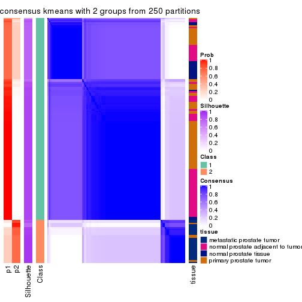</p>

</div>
<div id='tab-MAD-kmeans-consensus-heatmap-2'>
<pre><code class="r">consensus_heatmap(res, k = 3)
</code></pre>

<p>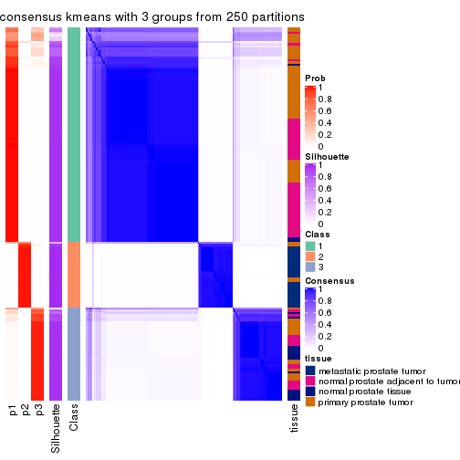</p>

</div>
<div id='tab-MAD-kmeans-consensus-heatmap-3'>
<pre><code class="r">consensus_heatmap(res, k = 4)
</code></pre>

<p>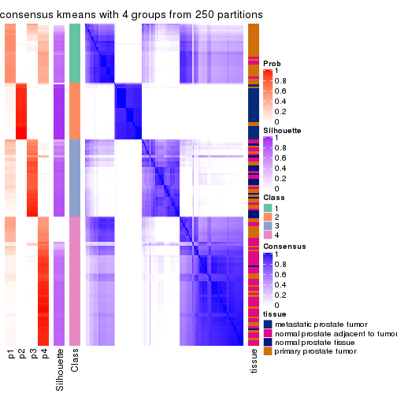</p>

</div>
<div id='tab-MAD-kmeans-consensus-heatmap-4'>
<pre><code class="r">consensus_heatmap(res, k = 5)
</code></pre>

<p>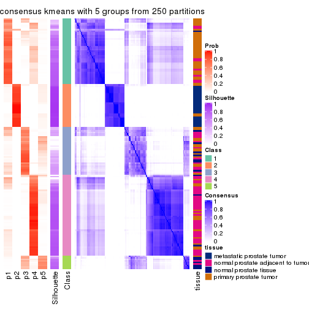</p>

</div>
<div id='tab-MAD-kmeans-consensus-heatmap-5'>
<pre><code class="r">consensus_heatmap(res, k = 6)
</code></pre>

<p>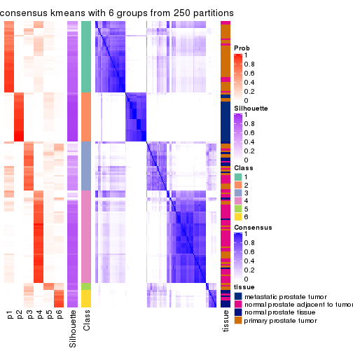</p>

</div>
</div>

Heatmaps for the membership of samples in all partitions to see how consistent they are:


<script>
$( function() {
	$( '#tabs-MAD-kmeans-membership-heatmap' ).tabs();
} );
</script>
<div id='tabs-MAD-kmeans-membership-heatmap'>
<ul>
<li><a href='#tab-MAD-kmeans-membership-heatmap-1'>k = 2</a></li>
<li><a href='#tab-MAD-kmeans-membership-heatmap-2'>k = 3</a></li>
<li><a href='#tab-MAD-kmeans-membership-heatmap-3'>k = 4</a></li>
<li><a href='#tab-MAD-kmeans-membership-heatmap-4'>k = 5</a></li>
<li><a href='#tab-MAD-kmeans-membership-heatmap-5'>k = 6</a></li>
</ul>
<div id='tab-MAD-kmeans-membership-heatmap-1'>
<pre><code class="r">membership_heatmap(res, k = 2)
</code></pre>

<p>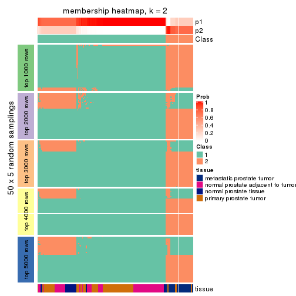</p>

</div>
<div id='tab-MAD-kmeans-membership-heatmap-2'>
<pre><code class="r">membership_heatmap(res, k = 3)
</code></pre>

<p>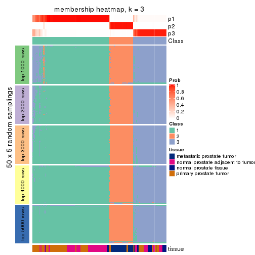</p>

</div>
<div id='tab-MAD-kmeans-membership-heatmap-3'>
<pre><code class="r">membership_heatmap(res, k = 4)
</code></pre>

<p>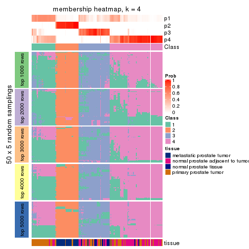</p>

</div>
<div id='tab-MAD-kmeans-membership-heatmap-4'>
<pre><code class="r">membership_heatmap(res, k = 5)
</code></pre>

<p>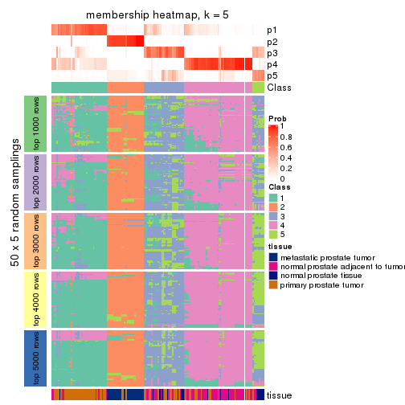</p>

</div>
<div id='tab-MAD-kmeans-membership-heatmap-5'>
<pre><code class="r">membership_heatmap(res, k = 6)
</code></pre>

<p>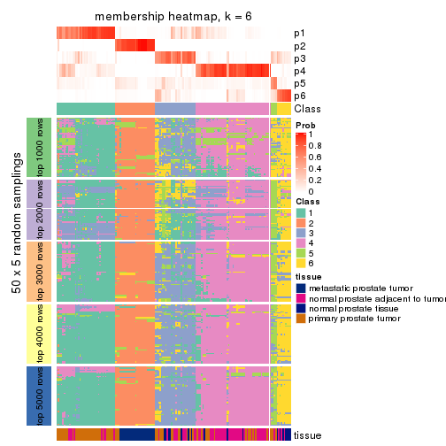</p>

</div>
</div>

As soon as we have had the classes for columns, we can look for signatures
which are significantly different between classes which can be candidate marks
for certain classes. Following are the heatmaps for signatures.


Signature heatmaps where rows are scaled:


<script>
$( function() {
	$( '#tabs-MAD-kmeans-get-signatures' ).tabs();
} );
</script>
<div id='tabs-MAD-kmeans-get-signatures'>
<ul>
<li><a href='#tab-MAD-kmeans-get-signatures-1'>k = 2</a></li>
<li><a href='#tab-MAD-kmeans-get-signatures-2'>k = 3</a></li>
<li><a href='#tab-MAD-kmeans-get-signatures-3'>k = 4</a></li>
<li><a href='#tab-MAD-kmeans-get-signatures-4'>k = 5</a></li>
<li><a href='#tab-MAD-kmeans-get-signatures-5'>k = 6</a></li>
</ul>
<div id='tab-MAD-kmeans-get-signatures-1'>
<pre><code class="r">get_signatures(res, k = 2)
</code></pre>

<p>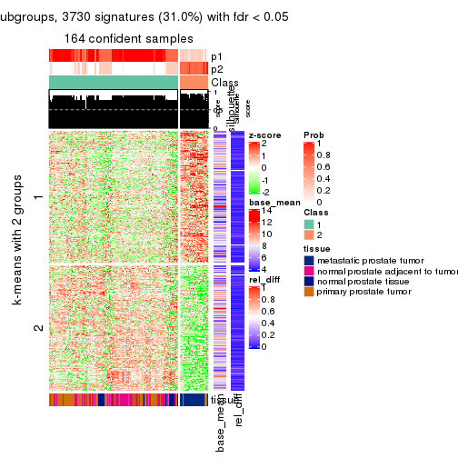</p>

</div>
<div id='tab-MAD-kmeans-get-signatures-2'>
<pre><code class="r">get_signatures(res, k = 3)
</code></pre>

<p>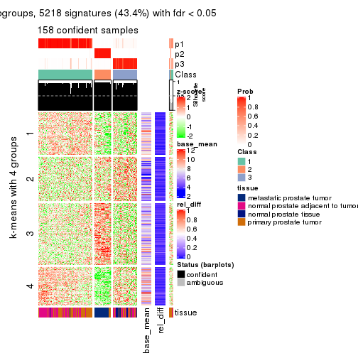</p>

</div>
<div id='tab-MAD-kmeans-get-signatures-3'>
<pre><code class="r">get_signatures(res, k = 4)
</code></pre>

<p>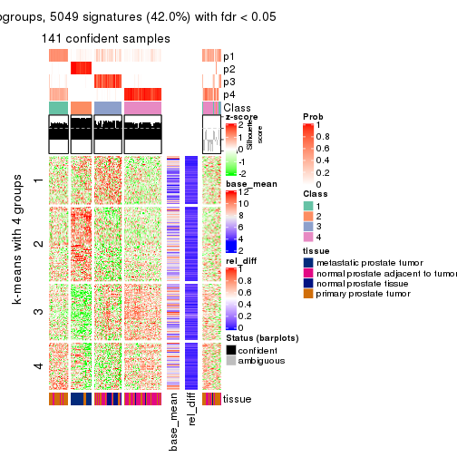</p>

</div>
<div id='tab-MAD-kmeans-get-signatures-4'>
<pre><code class="r">get_signatures(res, k = 5)
</code></pre>

<p>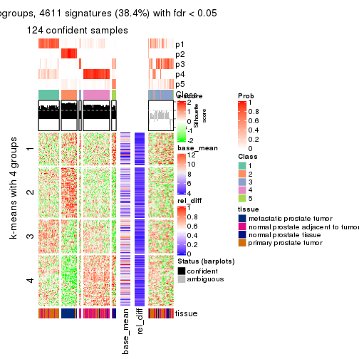</p>

</div>
<div id='tab-MAD-kmeans-get-signatures-5'>
<pre><code class="r">get_signatures(res, k = 6)
</code></pre>

<p>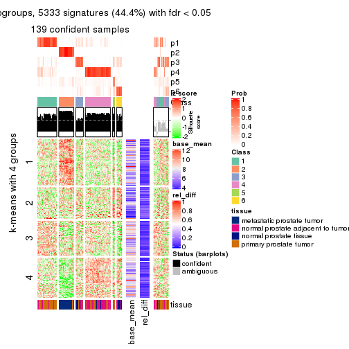</p>

</div>
</div>


Signature heatmaps where rows are not scaled:


<script>
$( function() {
	$( '#tabs-MAD-kmeans-get-signatures-no-scale' ).tabs();
} );
</script>
<div id='tabs-MAD-kmeans-get-signatures-no-scale'>
<ul>
<li><a href='#tab-MAD-kmeans-get-signatures-no-scale-1'>k = 2</a></li>
<li><a href='#tab-MAD-kmeans-get-signatures-no-scale-2'>k = 3</a></li>
<li><a href='#tab-MAD-kmeans-get-signatures-no-scale-3'>k = 4</a></li>
<li><a href='#tab-MAD-kmeans-get-signatures-no-scale-4'>k = 5</a></li>
<li><a href='#tab-MAD-kmeans-get-signatures-no-scale-5'>k = 6</a></li>
</ul>
<div id='tab-MAD-kmeans-get-signatures-no-scale-1'>
<pre><code class="r">get_signatures(res, k = 2, scale_rows = FALSE)
</code></pre>

<p>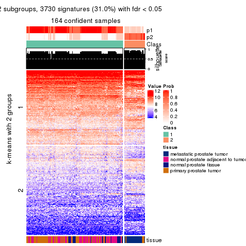</p>

</div>
<div id='tab-MAD-kmeans-get-signatures-no-scale-2'>
<pre><code class="r">get_signatures(res, k = 3, scale_rows = FALSE)
</code></pre>

<p>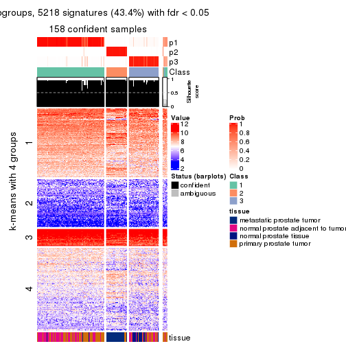</p>

</div>
<div id='tab-MAD-kmeans-get-signatures-no-scale-3'>
<pre><code class="r">get_signatures(res, k = 4, scale_rows = FALSE)
</code></pre>

<p>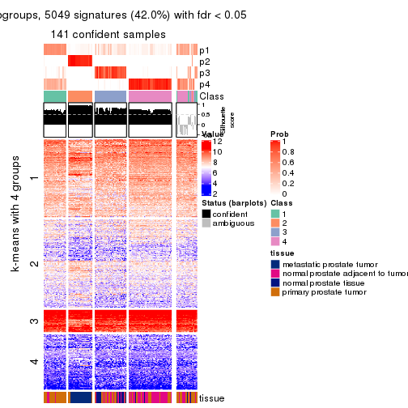</p>

</div>
<div id='tab-MAD-kmeans-get-signatures-no-scale-4'>
<pre><code class="r">get_signatures(res, k = 5, scale_rows = FALSE)
</code></pre>

<p>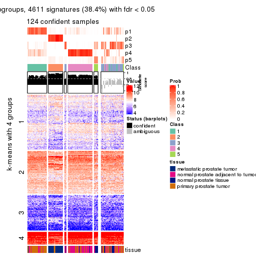</p>

</div>
<div id='tab-MAD-kmeans-get-signatures-no-scale-5'>
<pre><code class="r">get_signatures(res, k = 6, scale_rows = FALSE)
</code></pre>

<p>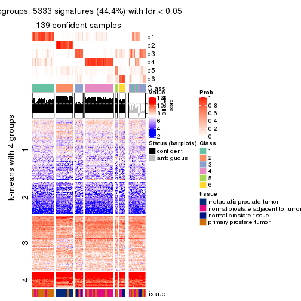</p>

</div>
</div>


Compare the overlap of signatures from different k:

```r
compare_signatures(res)
```

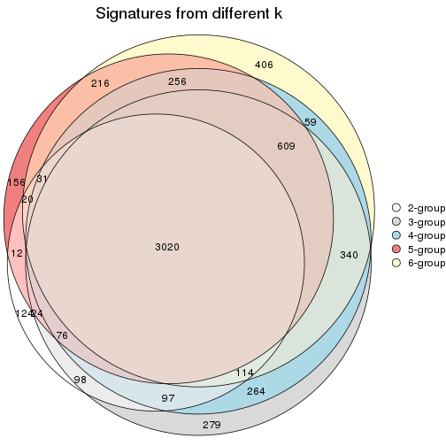

`get_signature()` returns a data frame invisibly. TO get the list of signatures, the function
call should be assigned to a variable explicitly. In following code, if `plot` argument is set
to `FALSE`, no heatmap is plotted while only the differential analysis is performed.

```r
# code only for demonstration
tb = get_signature(res, k = ..., plot = FALSE)
```

An example of the output of `tb` is:

```
#>   which_row         fdr    mean_1    mean_2 scaled_mean_1 scaled_mean_2 km
#> 1        38 0.042760348  8.373488  9.131774    -0.5533452     0.5164555  1
#> 2        40 0.018707592  7.106213  8.469186    -0.6173731     0.5762149  1
#> 3        55 0.019134737 10.221463 11.207825    -0.6159697     0.5749050  1
#> 4        59 0.006059896  5.921854  7.869574    -0.6899429     0.6439467  1
#> 5        60 0.018055526  8.928898 10.211722    -0.6204761     0.5791110  1
#> 6        98 0.009384629 15.714769 14.887706     0.6635654    -0.6193277  2
...
```

The columns in `tb` are:

1. `which_row`: row indices corresponding to the input matrix.
2. `fdr`: FDR for the differential test. 
3. `mean_x`: The mean value in group x.
4. `scaled_mean_x`: The mean value in group x after rows are scaled.
5. `km`: Row groups if k-means clustering is applied to rows.


UMAP plot which shows how samples are separated.


<script>
$( function() {
	$( '#tabs-MAD-kmeans-dimension-reduction' ).tabs();
} );
</script>
<div id='tabs-MAD-kmeans-dimension-reduction'>
<ul>
<li><a href='#tab-MAD-kmeans-dimension-reduction-1'>k = 2</a></li>
<li><a href='#tab-MAD-kmeans-dimension-reduction-2'>k = 3</a></li>
<li><a href='#tab-MAD-kmeans-dimension-reduction-3'>k = 4</a></li>
<li><a href='#tab-MAD-kmeans-dimension-reduction-4'>k = 5</a></li>
<li><a href='#tab-MAD-kmeans-dimension-reduction-5'>k = 6</a></li>
</ul>
<div id='tab-MAD-kmeans-dimension-reduction-1'>
<pre><code class="r">dimension_reduction(res, k = 2, method = &quot;UMAP&quot;)
</code></pre>

<p>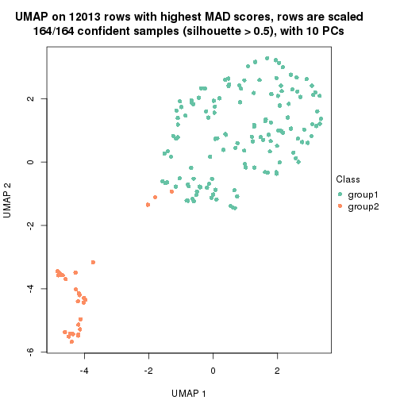</p>

</div>
<div id='tab-MAD-kmeans-dimension-reduction-2'>
<pre><code class="r">dimension_reduction(res, k = 3, method = &quot;UMAP&quot;)
</code></pre>

<p>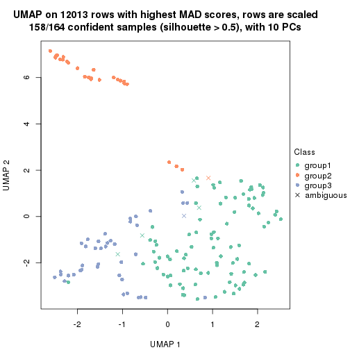</p>

</div>
<div id='tab-MAD-kmeans-dimension-reduction-3'>
<pre><code class="r">dimension_reduction(res, k = 4, method = &quot;UMAP&quot;)
</code></pre>

<p>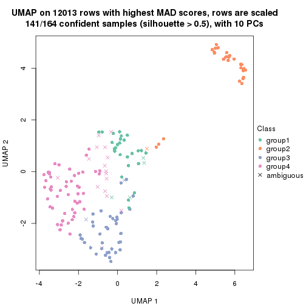</p>

</div>
<div id='tab-MAD-kmeans-dimension-reduction-4'>
<pre><code class="r">dimension_reduction(res, k = 5, method = &quot;UMAP&quot;)
</code></pre>

<p>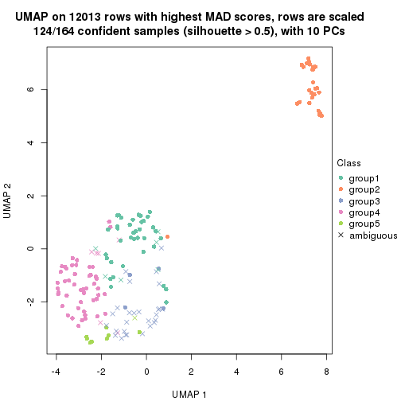</p>

</div>
<div id='tab-MAD-kmeans-dimension-reduction-5'>
<pre><code class="r">dimension_reduction(res, k = 6, method = &quot;UMAP&quot;)
</code></pre>

<p>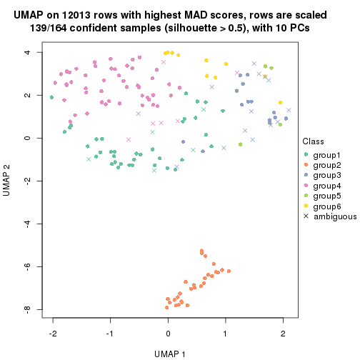</p>

</div>
</div>


Following heatmap shows how subgroups are split when increasing `k`:

```r
collect_classes(res)
```

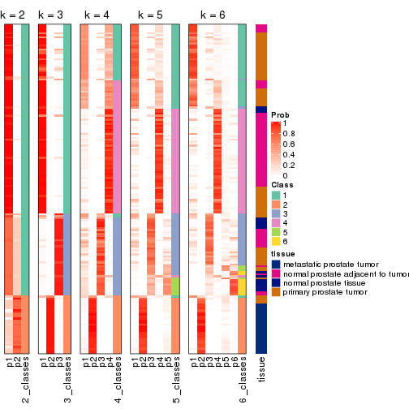


Test correlation between subgroups and known annotations. If the known
annotation is numeric, one-way ANOVA test is applied, and if the known
annotation is discrete, chi-squared contingency table test is applied.

```r
test_to_known_factors(res)
```

```
#>              n tissue(p) k
#> MAD:kmeans 164  9.07e-30 2
#> MAD:kmeans 158  1.15e-33 3
#> MAD:kmeans 141  1.39e-34 4
#> MAD:kmeans 124  1.20e-34 5
#> MAD:kmeans 139  4.66e-36 6
```


If matrix rows can be associated to genes, consider to use `functional_enrichment(res,
...)` to perform function enrichment for the signature genes. See [this vignette](http://bioconductor.org/packages/devel/bioc/vignettes/cola/inst/doc/functional_enrichment.html) for more detailed explanations.


 

---------------------------------------------------


### MAD:skmeans


The object with results only for a single top-value method and a single partition method 
can be extracted as:

```r
res = res_list["MAD", "skmeans"]
# you can also extract it by
# res = res_list["MAD:skmeans"]
```

A summary of `res` and all the functions that can be applied to it:

```r
res
```

```
#> A 'ConsensusPartition' object with k = 2, 3, 4, 5, 6.
#>   On a matrix with 12013 rows and 164 columns.
#>   Top rows (1000, 2000, 3000, 4000, 5000) are extracted by 'MAD' method.
#>   Subgroups are detected by 'skmeans' method.
#>   Performed in total 1250 partitions by row resampling.
#>   Best k for subgroups seems to be 2.
#> 
#> Following methods can be applied to this 'ConsensusPartition' object:
#>  [1] "cola_report"             "collect_classes"         "collect_plots"          
#>  [4] "collect_stats"           "colnames"                "compare_signatures"     
#>  [7] "consensus_heatmap"       "dimension_reduction"     "functional_enrichment"  
#> [10] "get_anno_col"            "get_anno"                "get_classes"            
#> [13] "get_consensus"           "get_matrix"              "get_membership"         
#> [16] "get_param"               "get_signatures"          "get_stats"              
#> [19] "is_best_k"               "is_stable_k"             "membership_heatmap"     
#> [22] "ncol"                    "nrow"                    "plot_ecdf"              
#> [25] "rownames"                "select_partition_number" "show"                   
#> [28] "suggest_best_k"          "test_to_known_factors"
```

`collect_plots()` function collects all the plots made from `res` for all `k` (number of partitions)
into one single page to provide an easy and fast comparison between different `k`.

```r
collect_plots(res)
```

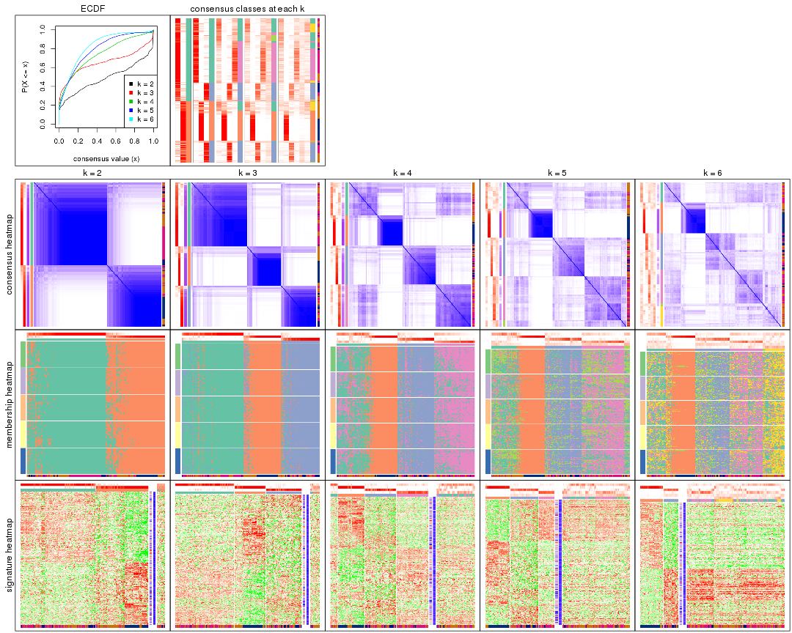

The plots are:

- The first row: a plot of the ECDF (empirical cumulative distribution
  function) curves of the consensus matrix for each `k` and the heatmap of
  predicted classes for each `k`.
- The second row: heatmaps of the consensus matrix for each `k`.
- The third row: heatmaps of the membership matrix for each `k`.
- The fouth row: heatmaps of the signatures for each `k`.

All the plots in panels can be made by individual functions and they are
plotted later in this section.

`select_partition_number()` produces several plots showing different
statistics for choosing "optimized" `k`. There are following statistics:

- ECDF curves of the consensus matrix for each `k`;
- 1-PAC. [The PAC
  score](https://en.wikipedia.org/wiki/Consensus_clustering#Over-interpretation_potential_of_consensus_clustering)
  measures the proportion of the ambiguous subgrouping.
- Mean silhouette score.
- Concordance. The mean probability of fiting the consensus class ids in all
  partitions.
- Area increased. Denote $A_k$ as the area under the ECDF curve for current
  `k`, the area increased is defined as $A_k - A_{k-1}$.
- Rand index. The percent of pairs of samples that are both in a same cluster
  or both are not in a same cluster in the partition of k and k-1.
- Jaccard index. The ratio of pairs of samples are both in a same cluster in
  the partition of k and k-1 and the pairs of samples are both in a same
  cluster in the partition k or k-1.

The detailed explanations of these statistics can be found in [the _cola_
vignette](http://bioconductor.org/packages/devel/bioc/vignettes/cola/inst/doc/cola.html#toc_13).

Generally speaking, lower PAC score, higher mean silhouette score or higher
concordance corresponds to better partition. Rand index and Jaccard index
measure how similar the current partition is compared to partition with `k-1`.
If they are too similar, we won't accept `k` is better than `k-1`.

```r
select_partition_number(res)
```

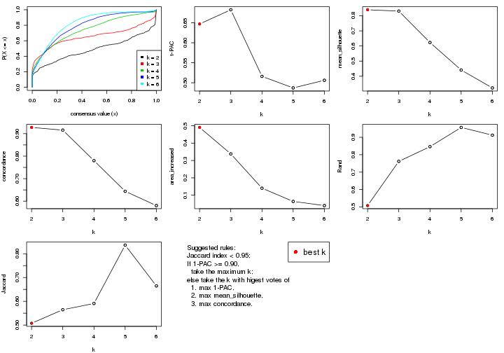

The numeric values for all these statistics can be obtained by `get_stats()`.

```r
get_stats(res)
```

```
#>   k 1-PAC mean_silhouette concordance area_increased  Rand Jaccard
#> 2 2 0.647           0.839       0.928         0.4902 0.508   0.508
#> 3 3 0.683           0.831       0.916         0.3379 0.762   0.565
#> 4 4 0.516           0.623       0.780         0.1405 0.846   0.591
#> 5 5 0.487           0.441       0.644         0.0643 0.957   0.836
#> 6 6 0.506           0.323       0.580         0.0404 0.912   0.665
```

`suggest_best_k()` suggests the best $k$ based on these statistics. The rules are as follows:

- All $k$ with Jaccard index larger than 0.95 are removed because increasing
  $k$ does not provide enough extra information. If all $k$ are removed, it is
  marked as no subgroup is detected.
- For all $k$ with 1-PAC score larger than 0.9, the maximal $k$ is taken as
  the best $k$, and other $k$ are marked as optional $k$.
- If it does not fit the second rule. The $k$ with the maximal vote of the
  highest 1-PAC score, highest mean silhouette, and highest concordance is
  taken as the best $k$.

```r
suggest_best_k(res)
```

```
#> [1] 2
```


Following shows the table of the partitions (You need to click the **show/hide
code output** link to see it). The membership matrix (columns with name `p*`)
is inferred by
[`clue::cl_consensus()`](https://www.rdocumentation.org/link/cl_consensus?package=clue)
function with the `SE` method. Basically the value in the membership matrix
represents the probability to belong to a certain group. The finall class
label for an item is determined with the group with highest probability it
belongs to.

In `get_classes()` function, the entropy is calculated from the membership
matrix and the silhouette score is calculated from the consensus matrix.


<script>
$( function() {
	$( '#tabs-MAD-skmeans-get-classes' ).tabs();
} );
</script>
<div id='tabs-MAD-skmeans-get-classes'>
<ul>
<li><a href='#tab-MAD-skmeans-get-classes-1'>k = 2</a></li>
<li><a href='#tab-MAD-skmeans-get-classes-2'>k = 3</a></li>
<li><a href='#tab-MAD-skmeans-get-classes-3'>k = 4</a></li>
<li><a href='#tab-MAD-skmeans-get-classes-4'>k = 5</a></li>
<li><a href='#tab-MAD-skmeans-get-classes-5'>k = 6</a></li>
</ul>

<div id='tab-MAD-skmeans-get-classes-1'>
<p><a id='tab-MAD-skmeans-get-classes-1-a' style='color:#0366d6' href='#'>show/hide code output</a></p>
<pre><code class="r">cbind(get_classes(res, k = 2), get_membership(res, k = 2))
</code></pre>

<pre><code>#&gt;           class entropy silhouette    p1    p2
#&gt; GSM152839     1  0.0000     0.9347 1.000 0.000
#&gt; GSM152840     1  0.0000     0.9347 1.000 0.000
#&gt; GSM152841     1  0.0000     0.9347 1.000 0.000
#&gt; GSM152842     1  0.8861     0.5517 0.696 0.304
#&gt; GSM152843     1  0.0376     0.9328 0.996 0.004
#&gt; GSM152844     1  0.2778     0.9075 0.952 0.048
#&gt; GSM152845     2  0.0000     0.9004 0.000 1.000
#&gt; GSM152846     2  0.9998     0.1028 0.492 0.508
#&gt; GSM152847     1  0.0000     0.9347 1.000 0.000
#&gt; GSM152848     1  0.0000     0.9347 1.000 0.000
#&gt; GSM152849     1  0.8713     0.5777 0.708 0.292
#&gt; GSM152850     1  0.5737     0.8270 0.864 0.136
#&gt; GSM152851     1  0.7299     0.7397 0.796 0.204
#&gt; GSM152852     1  0.7674     0.7084 0.776 0.224
#&gt; GSM152853     1  0.1633     0.9230 0.976 0.024
#&gt; GSM152854     2  0.9775     0.3704 0.412 0.588
#&gt; GSM152855     1  0.0000     0.9347 1.000 0.000
#&gt; GSM153238     2  0.0672     0.8984 0.008 0.992
#&gt; GSM153239     1  0.3274     0.8987 0.940 0.060
#&gt; GSM153240     1  0.0000     0.9347 1.000 0.000
#&gt; GSM153241     1  0.3733     0.8898 0.928 0.072
#&gt; GSM153242     2  0.7528     0.7396 0.216 0.784
#&gt; GSM153243     2  0.0376     0.8995 0.004 0.996
#&gt; GSM153244     2  0.9661     0.4303 0.392 0.608
#&gt; GSM153245     1  0.2948     0.9053 0.948 0.052
#&gt; GSM153246     2  0.6438     0.7963 0.164 0.836
#&gt; GSM153247     2  0.8499     0.6578 0.276 0.724
#&gt; GSM153248     1  0.9996    -0.0130 0.512 0.488
#&gt; GSM153249     1  0.0000     0.9347 1.000 0.000
#&gt; GSM153250     1  0.0000     0.9347 1.000 0.000
#&gt; GSM153251     2  0.5059     0.8418 0.112 0.888
#&gt; GSM153252     1  0.0000     0.9347 1.000 0.000
#&gt; GSM153253     1  0.0000     0.9347 1.000 0.000
#&gt; GSM153254     2  0.9954     0.2197 0.460 0.540
#&gt; GSM153255     1  0.0000     0.9347 1.000 0.000
#&gt; GSM153256     1  0.0000     0.9347 1.000 0.000
#&gt; GSM153257     1  0.0000     0.9347 1.000 0.000
#&gt; GSM153258     1  0.0376     0.9329 0.996 0.004
#&gt; GSM153259     1  0.3114     0.9005 0.944 0.056
#&gt; GSM153260     2  0.3114     0.8815 0.056 0.944
#&gt; GSM153261     2  0.9850     0.3037 0.428 0.572
#&gt; GSM153262     1  0.0000     0.9347 1.000 0.000
#&gt; GSM153263     1  0.0000     0.9347 1.000 0.000
#&gt; GSM153264     1  0.0000     0.9347 1.000 0.000
#&gt; GSM153265     1  0.0000     0.9347 1.000 0.000
#&gt; GSM153266     1  0.0000     0.9347 1.000 0.000
#&gt; GSM153267     1  0.0000     0.9347 1.000 0.000
#&gt; GSM153268     1  0.0000     0.9347 1.000 0.000
#&gt; GSM153269     1  0.0000     0.9347 1.000 0.000
#&gt; GSM153270     1  0.0000     0.9347 1.000 0.000
#&gt; GSM153271     1  0.0000     0.9347 1.000 0.000
#&gt; GSM153272     1  0.0000     0.9347 1.000 0.000
#&gt; GSM153273     1  0.6247     0.8075 0.844 0.156
#&gt; GSM153274     1  0.0000     0.9347 1.000 0.000
#&gt; GSM153275     1  0.0000     0.9347 1.000 0.000
#&gt; GSM153276     1  0.0000     0.9347 1.000 0.000
#&gt; GSM153277     1  0.0000     0.9347 1.000 0.000
#&gt; GSM153278     1  0.7056     0.7601 0.808 0.192
#&gt; GSM153279     1  0.2603     0.9113 0.956 0.044
#&gt; GSM153280     1  0.0000     0.9347 1.000 0.000
#&gt; GSM153281     1  0.0000     0.9347 1.000 0.000
#&gt; GSM153282     1  0.0000     0.9347 1.000 0.000
#&gt; GSM153283     1  0.0000     0.9347 1.000 0.000
#&gt; GSM153284     1  0.0000     0.9347 1.000 0.000
#&gt; GSM153285     1  0.0000     0.9347 1.000 0.000
#&gt; GSM153286     1  0.0000     0.9347 1.000 0.000
#&gt; GSM153287     1  0.0000     0.9347 1.000 0.000
#&gt; GSM153288     1  0.0000     0.9347 1.000 0.000
#&gt; GSM153289     1  0.0000     0.9347 1.000 0.000
#&gt; GSM153290     1  0.0000     0.9347 1.000 0.000
#&gt; GSM153291     1  0.0000     0.9347 1.000 0.000
#&gt; GSM153292     1  0.0000     0.9347 1.000 0.000
#&gt; GSM153293     1  0.0000     0.9347 1.000 0.000
#&gt; GSM153294     1  0.8386     0.6373 0.732 0.268
#&gt; GSM153295     1  0.0000     0.9347 1.000 0.000
#&gt; GSM153054     1  0.9996    -0.0393 0.512 0.488
#&gt; GSM153055     1  0.0000     0.9347 1.000 0.000
#&gt; GSM153056     1  0.0672     0.9309 0.992 0.008
#&gt; GSM153057     2  0.8207     0.6907 0.256 0.744
#&gt; GSM153058     2  0.9427     0.5014 0.360 0.640
#&gt; GSM153059     2  0.0376     0.8995 0.004 0.996
#&gt; GSM153060     2  0.9909     0.2786 0.444 0.556
#&gt; GSM153061     2  0.2236     0.8890 0.036 0.964
#&gt; GSM153062     2  0.1414     0.8946 0.020 0.980
#&gt; GSM153063     1  0.9977     0.0261 0.528 0.472
#&gt; GSM153064     1  0.3114     0.9012 0.944 0.056
#&gt; GSM153065     2  0.0000     0.9004 0.000 1.000
#&gt; GSM153066     2  0.0000     0.9004 0.000 1.000
#&gt; GSM153067     1  0.0000     0.9347 1.000 0.000
#&gt; GSM153068     2  0.1843     0.8915 0.028 0.972
#&gt; GSM153069     1  0.0000     0.9347 1.000 0.000
#&gt; GSM153070     1  0.1414     0.9254 0.980 0.020
#&gt; GSM153071     2  0.9850     0.3286 0.428 0.572
#&gt; GSM153072     2  0.5629     0.8292 0.132 0.868
#&gt; GSM153073     1  0.1414     0.9254 0.980 0.020
#&gt; GSM153074     1  0.0000     0.9347 1.000 0.000
#&gt; GSM153075     1  0.0376     0.9329 0.996 0.004
#&gt; GSM153076     1  0.0000     0.9347 1.000 0.000
#&gt; GSM153077     1  0.3274     0.9008 0.940 0.060
#&gt; GSM153078     1  0.7602     0.7187 0.780 0.220
#&gt; GSM153079     2  0.8144     0.6846 0.252 0.748
#&gt; GSM153080     1  0.7815     0.6941 0.768 0.232
#&gt; GSM153081     1  0.0000     0.9347 1.000 0.000
#&gt; GSM153082     2  0.2603     0.8855 0.044 0.956
#&gt; GSM153083     2  0.0672     0.8985 0.008 0.992
#&gt; GSM153084     2  0.0000     0.9004 0.000 1.000
#&gt; GSM153085     2  0.2778     0.8859 0.048 0.952
#&gt; GSM153086     2  0.6531     0.7917 0.168 0.832
#&gt; GSM153087     1  0.0000     0.9347 1.000 0.000
#&gt; GSM153088     1  0.0000     0.9347 1.000 0.000
#&gt; GSM153089     2  0.4562     0.8562 0.096 0.904
#&gt; GSM153090     1  0.0000     0.9347 1.000 0.000
#&gt; GSM153091     2  0.7139     0.7603 0.196 0.804
#&gt; GSM153092     1  0.4431     0.8762 0.908 0.092
#&gt; GSM153093     1  0.0000     0.9347 1.000 0.000
#&gt; GSM153094     2  0.5294     0.8349 0.120 0.880
#&gt; GSM153095     2  0.8608     0.6393 0.284 0.716
#&gt; GSM153096     1  0.6712     0.7833 0.824 0.176
#&gt; GSM153097     2  0.2603     0.8860 0.044 0.956
#&gt; GSM153098     1  0.4298     0.8762 0.912 0.088
#&gt; GSM153099     1  0.0000     0.9347 1.000 0.000
#&gt; GSM153100     1  0.2603     0.9112 0.956 0.044
#&gt; GSM153101     2  0.7056     0.7658 0.192 0.808
#&gt; GSM153102     2  0.3879     0.8679 0.076 0.924
#&gt; GSM153103     2  0.2948     0.8822 0.052 0.948
#&gt; GSM153104     1  0.0000     0.9347 1.000 0.000
#&gt; GSM153106     1  0.6712     0.7828 0.824 0.176
#&gt; GSM153107     1  0.6343     0.8027 0.840 0.160
#&gt; GSM153108     1  0.1843     0.9212 0.972 0.028
#&gt; GSM153109     2  0.0000     0.9004 0.000 1.000
#&gt; GSM153110     1  0.8386     0.6381 0.732 0.268
#&gt; GSM153111     2  0.4431     0.8575 0.092 0.908
#&gt; GSM153112     1  0.7376     0.7398 0.792 0.208
#&gt; GSM153113     2  0.0000     0.9004 0.000 1.000
#&gt; GSM153114     1  0.0000     0.9347 1.000 0.000
#&gt; GSM187532     2  0.0000     0.9004 0.000 1.000
#&gt; GSM187533     2  0.0000     0.9004 0.000 1.000
#&gt; GSM187534     2  0.0000     0.9004 0.000 1.000
#&gt; GSM187535     2  0.0938     0.8973 0.012 0.988
#&gt; GSM152906     2  0.0000     0.9004 0.000 1.000
#&gt; GSM152907     2  0.0000     0.9004 0.000 1.000
#&gt; GSM152908     2  0.0000     0.9004 0.000 1.000
#&gt; GSM152909     2  0.0000     0.9004 0.000 1.000
#&gt; GSM152910     2  0.0000     0.9004 0.000 1.000
#&gt; GSM152911     2  0.0000     0.9004 0.000 1.000
#&gt; GSM152912     2  0.0000     0.9004 0.000 1.000
#&gt; GSM152913     2  0.0000     0.9004 0.000 1.000
#&gt; GSM152914     2  0.0000     0.9004 0.000 1.000
#&gt; GSM152915     2  0.0000     0.9004 0.000 1.000
#&gt; GSM152916     2  0.0000     0.9004 0.000 1.000
#&gt; GSM152917     2  0.0000     0.9004 0.000 1.000
#&gt; GSM152918     2  0.0000     0.9004 0.000 1.000
#&gt; GSM152919     2  0.0000     0.9004 0.000 1.000
#&gt; GSM152920     2  0.0000     0.9004 0.000 1.000
#&gt; GSM152921     2  0.0000     0.9004 0.000 1.000
#&gt; GSM152922     2  0.0000     0.9004 0.000 1.000
#&gt; GSM152923     2  0.0000     0.9004 0.000 1.000
#&gt; GSM152924     2  0.0000     0.9004 0.000 1.000
#&gt; GSM152925     2  0.0000     0.9004 0.000 1.000
#&gt; GSM152926     2  0.0000     0.9004 0.000 1.000
#&gt; GSM152927     2  0.0000     0.9004 0.000 1.000
#&gt; GSM152928     2  0.0000     0.9004 0.000 1.000
#&gt; GSM152929     2  0.0000     0.9004 0.000 1.000
#&gt; GSM152930     2  0.0000     0.9004 0.000 1.000
</code></pre>

<script>
$('#tab-MAD-skmeans-get-classes-1-a').parent().next().next().hide();
$('#tab-MAD-skmeans-get-classes-1-a').click(function(){
  $('#tab-MAD-skmeans-get-classes-1-a').parent().next().next().toggle();
  return(false);
});
</script>
</div>

<div id='tab-MAD-skmeans-get-classes-2'>
<p><a id='tab-MAD-skmeans-get-classes-2-a' style='color:#0366d6' href='#'>show/hide code output</a></p>
<pre><code class="r">cbind(get_classes(res, k = 3), get_membership(res, k = 3))
</code></pre>

<pre><code>#&gt;           class entropy silhouette    p1    p2    p3
#&gt; GSM152839     3  0.4291    0.76319 0.180 0.000 0.820
#&gt; GSM152840     3  0.2537    0.86197 0.080 0.000 0.920
#&gt; GSM152841     1  0.1529    0.90955 0.960 0.000 0.040
#&gt; GSM152842     3  0.0237    0.91042 0.004 0.000 0.996
#&gt; GSM152843     3  0.0237    0.91119 0.004 0.000 0.996
#&gt; GSM152844     3  0.0000    0.91149 0.000 0.000 1.000
#&gt; GSM152845     3  0.0592    0.90918 0.000 0.012 0.988
#&gt; GSM152846     3  0.0000    0.91149 0.000 0.000 1.000
#&gt; GSM152847     3  0.0237    0.91042 0.004 0.000 0.996
#&gt; GSM152848     1  0.6305    0.07772 0.516 0.000 0.484
#&gt; GSM152849     3  0.0000    0.91149 0.000 0.000 1.000
#&gt; GSM152850     3  0.0592    0.90969 0.012 0.000 0.988
#&gt; GSM152851     3  0.3500    0.83178 0.116 0.004 0.880
#&gt; GSM152852     3  0.0000    0.91149 0.000 0.000 1.000
#&gt; GSM152853     3  0.0000    0.91149 0.000 0.000 1.000
#&gt; GSM152854     3  0.0000    0.91149 0.000 0.000 1.000
#&gt; GSM152855     1  0.0237    0.91551 0.996 0.000 0.004
#&gt; GSM153238     3  0.2165    0.87892 0.000 0.064 0.936
#&gt; GSM153239     3  0.0000    0.91149 0.000 0.000 1.000
#&gt; GSM153240     1  0.0424    0.91528 0.992 0.000 0.008
#&gt; GSM153241     3  0.0000    0.91149 0.000 0.000 1.000
#&gt; GSM153242     3  0.0000    0.91149 0.000 0.000 1.000
#&gt; GSM153243     3  0.1964    0.88483 0.000 0.056 0.944
#&gt; GSM153244     3  0.8858    0.31083 0.136 0.332 0.532
#&gt; GSM153245     3  0.0237    0.91093 0.004 0.000 0.996
#&gt; GSM153246     3  0.0000    0.91149 0.000 0.000 1.000
#&gt; GSM153247     3  0.2152    0.89460 0.016 0.036 0.948
#&gt; GSM153248     1  0.6577    0.27075 0.572 0.420 0.008
#&gt; GSM153249     1  0.0237    0.91551 0.996 0.000 0.004
#&gt; GSM153250     1  0.0000    0.91503 1.000 0.000 0.000
#&gt; GSM153251     3  0.0237    0.91125 0.000 0.004 0.996
#&gt; GSM153252     1  0.0747    0.91492 0.984 0.000 0.016
#&gt; GSM153253     1  0.3816    0.84069 0.852 0.000 0.148
#&gt; GSM153254     3  0.5042    0.81328 0.060 0.104 0.836
#&gt; GSM153255     1  0.0237    0.91551 0.996 0.000 0.004
#&gt; GSM153256     1  0.0000    0.91503 1.000 0.000 0.000
#&gt; GSM153257     1  0.0237    0.91551 0.996 0.000 0.004
#&gt; GSM153258     1  0.1647    0.90989 0.960 0.004 0.036
#&gt; GSM153259     1  0.0983    0.91257 0.980 0.016 0.004
#&gt; GSM153260     3  0.1267    0.90339 0.004 0.024 0.972
#&gt; GSM153261     3  0.0237    0.91049 0.000 0.004 0.996
#&gt; GSM153262     1  0.1529    0.91080 0.960 0.000 0.040
#&gt; GSM153263     1  0.0000    0.91503 1.000 0.000 0.000
#&gt; GSM153264     1  0.3551    0.85125 0.868 0.000 0.132
#&gt; GSM153265     1  0.1643    0.90881 0.956 0.000 0.044
#&gt; GSM153266     1  0.3816    0.83856 0.852 0.000 0.148
#&gt; GSM153267     1  0.0000    0.91503 1.000 0.000 0.000
#&gt; GSM153268     1  0.5733    0.57403 0.676 0.000 0.324
#&gt; GSM153269     1  0.0000    0.91503 1.000 0.000 0.000
#&gt; GSM153270     1  0.4062    0.82420 0.836 0.000 0.164
#&gt; GSM153271     1  0.0000    0.91503 1.000 0.000 0.000
#&gt; GSM153272     1  0.0237    0.91551 0.996 0.000 0.004
#&gt; GSM153273     1  0.4349    0.83128 0.852 0.128 0.020
#&gt; GSM153274     1  0.2796    0.88442 0.908 0.000 0.092
#&gt; GSM153275     1  0.0237    0.91551 0.996 0.000 0.004
#&gt; GSM153276     1  0.4002    0.82866 0.840 0.000 0.160
#&gt; GSM153277     1  0.1753    0.90759 0.952 0.000 0.048
#&gt; GSM153278     3  0.1163    0.90319 0.028 0.000 0.972
#&gt; GSM153279     3  0.6659    0.07719 0.460 0.008 0.532
#&gt; GSM153280     1  0.3340    0.86514 0.880 0.000 0.120
#&gt; GSM153281     1  0.1031    0.91342 0.976 0.000 0.024
#&gt; GSM153282     1  0.2959    0.87960 0.900 0.000 0.100
#&gt; GSM153283     1  0.0000    0.91503 1.000 0.000 0.000
#&gt; GSM153284     1  0.0237    0.91551 0.996 0.000 0.004
#&gt; GSM153285     1  0.1860    0.90503 0.948 0.000 0.052
#&gt; GSM153286     1  0.0000    0.91503 1.000 0.000 0.000
#&gt; GSM153287     1  0.0237    0.91551 0.996 0.000 0.004
#&gt; GSM153288     1  0.0237    0.91551 0.996 0.000 0.004
#&gt; GSM153289     1  0.0237    0.91551 0.996 0.000 0.004
#&gt; GSM153290     1  0.4931    0.73479 0.768 0.000 0.232
#&gt; GSM153291     1  0.0237    0.91551 0.996 0.000 0.004
#&gt; GSM153292     1  0.0237    0.91551 0.996 0.000 0.004
#&gt; GSM153293     1  0.0000    0.91503 1.000 0.000 0.000
#&gt; GSM153294     1  0.3879    0.81472 0.848 0.152 0.000
#&gt; GSM153295     1  0.0592    0.91537 0.988 0.000 0.012
#&gt; GSM153054     3  0.7930    0.61705 0.168 0.168 0.664
#&gt; GSM153055     1  0.5072    0.77545 0.792 0.012 0.196
#&gt; GSM153056     3  0.0892    0.90536 0.020 0.000 0.980
#&gt; GSM153057     3  0.2703    0.88041 0.016 0.056 0.928
#&gt; GSM153058     3  0.0000    0.91149 0.000 0.000 1.000
#&gt; GSM153059     3  0.4654    0.72039 0.000 0.208 0.792
#&gt; GSM153060     3  0.0000    0.91149 0.000 0.000 1.000
#&gt; GSM153061     3  0.0000    0.91149 0.000 0.000 1.000
#&gt; GSM153062     3  0.0237    0.91049 0.000 0.004 0.996
#&gt; GSM153063     3  0.0237    0.91093 0.004 0.000 0.996
#&gt; GSM153064     1  0.0000    0.91503 1.000 0.000 0.000
#&gt; GSM153065     3  0.1289    0.89999 0.000 0.032 0.968
#&gt; GSM153066     2  0.5835    0.48309 0.000 0.660 0.340
#&gt; GSM153067     1  0.0237    0.91551 0.996 0.000 0.004
#&gt; GSM153068     3  0.0237    0.91049 0.000 0.004 0.996
#&gt; GSM153069     1  0.0237    0.91551 0.996 0.000 0.004
#&gt; GSM153070     1  0.5117    0.83493 0.832 0.060 0.108
#&gt; GSM153071     3  0.6389    0.74988 0.124 0.108 0.768
#&gt; GSM153072     3  0.7421    0.59200 0.084 0.240 0.676
#&gt; GSM153073     1  0.2804    0.89561 0.924 0.016 0.060
#&gt; GSM153074     1  0.0237    0.91551 0.996 0.000 0.004
#&gt; GSM153075     1  0.5138    0.69364 0.748 0.000 0.252
#&gt; GSM153076     1  0.0000    0.91503 1.000 0.000 0.000
#&gt; GSM153077     1  0.5848    0.79812 0.796 0.080 0.124
#&gt; GSM153078     3  0.5346    0.77940 0.152 0.040 0.808
#&gt; GSM153079     2  0.9118    0.42774 0.232 0.548 0.220
#&gt; GSM153080     3  0.0892    0.90547 0.020 0.000 0.980
#&gt; GSM153081     1  0.4047    0.83256 0.848 0.004 0.148
#&gt; GSM153082     2  0.3192    0.82181 0.112 0.888 0.000
#&gt; GSM153083     2  0.0237    0.90337 0.004 0.996 0.000
#&gt; GSM153084     2  0.3116    0.82238 0.000 0.892 0.108
#&gt; GSM153085     2  0.8784    0.37234 0.136 0.548 0.316
#&gt; GSM153086     2  0.9267    0.15801 0.160 0.460 0.380
#&gt; GSM153087     1  0.3207    0.88762 0.904 0.012 0.084
#&gt; GSM153088     1  0.0000    0.91503 1.000 0.000 0.000
#&gt; GSM153089     3  0.0747    0.90804 0.000 0.016 0.984
#&gt; GSM153090     1  0.0000    0.91503 1.000 0.000 0.000
#&gt; GSM153091     2  0.5397    0.59908 0.280 0.720 0.000
#&gt; GSM153092     1  0.4745    0.85183 0.852 0.080 0.068
#&gt; GSM153093     1  0.0237    0.91551 0.996 0.000 0.004
#&gt; GSM153094     2  0.2878    0.83695 0.096 0.904 0.000
#&gt; GSM153095     3  0.9369   -0.00826 0.168 0.408 0.424
#&gt; GSM153096     1  0.6302    0.70011 0.744 0.208 0.048
#&gt; GSM153097     2  0.3415    0.84353 0.080 0.900 0.020
#&gt; GSM153098     1  0.0983    0.91373 0.980 0.016 0.004
#&gt; GSM153099     1  0.1289    0.91174 0.968 0.000 0.032
#&gt; GSM153100     1  0.1643    0.90260 0.956 0.044 0.000
#&gt; GSM153101     2  0.9207    0.30494 0.172 0.508 0.320
#&gt; GSM153102     2  0.9117    0.30204 0.160 0.512 0.328
#&gt; GSM153103     2  0.8457    0.22602 0.092 0.512 0.396
#&gt; GSM153104     1  0.2625    0.88971 0.916 0.000 0.084
#&gt; GSM153106     1  0.2860    0.87912 0.912 0.084 0.004
#&gt; GSM153107     1  0.3918    0.82982 0.856 0.140 0.004
#&gt; GSM153108     1  0.3921    0.85874 0.872 0.016 0.112
#&gt; GSM153109     2  0.0892    0.89415 0.000 0.980 0.020
#&gt; GSM153110     1  0.8109    0.50383 0.620 0.272 0.108
#&gt; GSM153111     2  0.2945    0.84272 0.088 0.908 0.004
#&gt; GSM153112     1  0.4555    0.75468 0.800 0.200 0.000
#&gt; GSM153113     2  0.0000    0.90583 0.000 1.000 0.000
#&gt; GSM153114     1  0.0237    0.91551 0.996 0.000 0.004
#&gt; GSM187532     2  0.1031    0.89124 0.000 0.976 0.024
#&gt; GSM187533     2  0.0000    0.90583 0.000 1.000 0.000
#&gt; GSM187534     2  0.0000    0.90583 0.000 1.000 0.000
#&gt; GSM187535     2  0.0000    0.90583 0.000 1.000 0.000
#&gt; GSM152906     2  0.0000    0.90583 0.000 1.000 0.000
#&gt; GSM152907     2  0.0000    0.90583 0.000 1.000 0.000
#&gt; GSM152908     2  0.0000    0.90583 0.000 1.000 0.000
#&gt; GSM152909     2  0.0000    0.90583 0.000 1.000 0.000
#&gt; GSM152910     2  0.0000    0.90583 0.000 1.000 0.000
#&gt; GSM152911     2  0.0000    0.90583 0.000 1.000 0.000
#&gt; GSM152912     2  0.0000    0.90583 0.000 1.000 0.000
#&gt; GSM152913     2  0.0000    0.90583 0.000 1.000 0.000
#&gt; GSM152914     2  0.0000    0.90583 0.000 1.000 0.000
#&gt; GSM152915     2  0.0000    0.90583 0.000 1.000 0.000
#&gt; GSM152916     2  0.0000    0.90583 0.000 1.000 0.000
#&gt; GSM152917     2  0.0000    0.90583 0.000 1.000 0.000
#&gt; GSM152918     2  0.0000    0.90583 0.000 1.000 0.000
#&gt; GSM152919     2  0.0000    0.90583 0.000 1.000 0.000
#&gt; GSM152920     2  0.0000    0.90583 0.000 1.000 0.000
#&gt; GSM152921     2  0.0000    0.90583 0.000 1.000 0.000
#&gt; GSM152922     2  0.0000    0.90583 0.000 1.000 0.000
#&gt; GSM152923     2  0.0000    0.90583 0.000 1.000 0.000
#&gt; GSM152924     2  0.0000    0.90583 0.000 1.000 0.000
#&gt; GSM152925     2  0.0000    0.90583 0.000 1.000 0.000
#&gt; GSM152926     2  0.0000    0.90583 0.000 1.000 0.000
#&gt; GSM152927     2  0.0000    0.90583 0.000 1.000 0.000
#&gt; GSM152928     2  0.0000    0.90583 0.000 1.000 0.000
#&gt; GSM152929     2  0.0000    0.90583 0.000 1.000 0.000
#&gt; GSM152930     2  0.0000    0.90583 0.000 1.000 0.000
</code></pre>

<script>
$('#tab-MAD-skmeans-get-classes-2-a').parent().next().next().hide();
$('#tab-MAD-skmeans-get-classes-2-a').click(function(){
  $('#tab-MAD-skmeans-get-classes-2-a').parent().next().next().toggle();
  return(false);
});
</script>
</div>

<div id='tab-MAD-skmeans-get-classes-3'>
<p><a id='tab-MAD-skmeans-get-classes-3-a' style='color:#0366d6' href='#'>show/hide code output</a></p>
<pre><code class="r">cbind(get_classes(res, k = 4), get_membership(res, k = 4))
</code></pre>

<pre><code>#&gt;           class entropy silhouette    p1    p2    p3    p4
#&gt; GSM152839     3  0.7128     0.3318 0.320 0.000 0.528 0.152
#&gt; GSM152840     3  0.5088     0.6004 0.024 0.000 0.688 0.288
#&gt; GSM152841     4  0.1488     0.7176 0.032 0.000 0.012 0.956
#&gt; GSM152842     3  0.0657     0.8149 0.012 0.000 0.984 0.004
#&gt; GSM152843     3  0.3004     0.8074 0.060 0.000 0.892 0.048
#&gt; GSM152844     3  0.2473     0.8080 0.012 0.000 0.908 0.080
#&gt; GSM152845     3  0.1884     0.8177 0.016 0.020 0.948 0.016
#&gt; GSM152846     3  0.0804     0.8144 0.008 0.000 0.980 0.012
#&gt; GSM152847     3  0.2563     0.8123 0.072 0.000 0.908 0.020
#&gt; GSM152848     1  0.7450     0.3189 0.504 0.000 0.280 0.216
#&gt; GSM152849     3  0.1256     0.8176 0.028 0.000 0.964 0.008
#&gt; GSM152850     3  0.3718     0.7552 0.168 0.000 0.820 0.012
#&gt; GSM152851     3  0.5709     0.4257 0.024 0.004 0.588 0.384
#&gt; GSM152852     3  0.2255     0.8116 0.012 0.000 0.920 0.068
#&gt; GSM152853     3  0.3428     0.7705 0.012 0.000 0.844 0.144
#&gt; GSM152854     3  0.1042     0.8171 0.020 0.000 0.972 0.008
#&gt; GSM152855     4  0.4356     0.6446 0.292 0.000 0.000 0.708
#&gt; GSM153238     3  0.4359     0.7571 0.100 0.084 0.816 0.000
#&gt; GSM153239     3  0.2450     0.8112 0.016 0.000 0.912 0.072
#&gt; GSM153240     4  0.4019     0.7209 0.196 0.000 0.012 0.792
#&gt; GSM153241     3  0.2060     0.8173 0.052 0.000 0.932 0.016
#&gt; GSM153242     3  0.0524     0.8137 0.004 0.000 0.988 0.008
#&gt; GSM153243     3  0.3486     0.7885 0.092 0.044 0.864 0.000
#&gt; GSM153244     3  0.9371     0.0463 0.100 0.276 0.376 0.248
#&gt; GSM153245     3  0.1902     0.8145 0.004 0.000 0.932 0.064
#&gt; GSM153246     3  0.0000     0.8116 0.000 0.000 1.000 0.000
#&gt; GSM153247     3  0.6681     0.6748 0.088 0.128 0.704 0.080
#&gt; GSM153248     1  0.4300     0.5521 0.820 0.092 0.000 0.088
#&gt; GSM153249     4  0.2408     0.7255 0.104 0.000 0.000 0.896
#&gt; GSM153250     1  0.4961    -0.0267 0.552 0.000 0.000 0.448
#&gt; GSM153251     3  0.1059     0.8160 0.000 0.016 0.972 0.012
#&gt; GSM153252     4  0.3306     0.7242 0.156 0.000 0.004 0.840
#&gt; GSM153253     4  0.2500     0.7129 0.040 0.000 0.044 0.916
#&gt; GSM153254     3  0.8107     0.5221 0.144 0.136 0.592 0.128
#&gt; GSM153255     4  0.2469     0.7272 0.108 0.000 0.000 0.892
#&gt; GSM153256     4  0.4843     0.4716 0.396 0.000 0.000 0.604
#&gt; GSM153257     4  0.3311     0.7250 0.172 0.000 0.000 0.828
#&gt; GSM153258     1  0.5557     0.3586 0.652 0.000 0.040 0.308
#&gt; GSM153259     1  0.3266     0.5101 0.832 0.000 0.000 0.168
#&gt; GSM153260     3  0.4648     0.7072 0.216 0.016 0.760 0.008
#&gt; GSM153261     3  0.2597     0.8110 0.084 0.004 0.904 0.008
#&gt; GSM153262     4  0.2730     0.7342 0.088 0.000 0.016 0.896
#&gt; GSM153263     1  0.4955     0.0509 0.556 0.000 0.000 0.444
#&gt; GSM153264     1  0.5371     0.4846 0.732 0.000 0.080 0.188
#&gt; GSM153265     4  0.2797     0.7213 0.068 0.000 0.032 0.900
#&gt; GSM153266     1  0.6525     0.4257 0.612 0.000 0.116 0.272
#&gt; GSM153267     4  0.4643     0.5709 0.344 0.000 0.000 0.656
#&gt; GSM153268     4  0.3946     0.6041 0.020 0.000 0.168 0.812
#&gt; GSM153269     4  0.5132     0.3568 0.448 0.000 0.004 0.548
#&gt; GSM153270     4  0.6664     0.4796 0.308 0.000 0.112 0.580
#&gt; GSM153271     1  0.4961     0.0242 0.552 0.000 0.000 0.448
#&gt; GSM153272     4  0.3219     0.7209 0.164 0.000 0.000 0.836
#&gt; GSM153273     1  0.4801     0.5324 0.764 0.048 0.000 0.188
#&gt; GSM153274     4  0.6514     0.2687 0.408 0.000 0.076 0.516
#&gt; GSM153275     4  0.4889     0.5228 0.360 0.000 0.004 0.636
#&gt; GSM153276     4  0.6681     0.4785 0.292 0.000 0.120 0.588
#&gt; GSM153277     4  0.5810     0.5643 0.256 0.000 0.072 0.672
#&gt; GSM153278     3  0.4957     0.7046 0.204 0.000 0.748 0.048
#&gt; GSM153279     4  0.6646     0.3162 0.112 0.000 0.304 0.584
#&gt; GSM153280     4  0.2111     0.7162 0.044 0.000 0.024 0.932
#&gt; GSM153281     4  0.2775     0.7316 0.084 0.000 0.020 0.896
#&gt; GSM153282     4  0.1936     0.7150 0.032 0.000 0.028 0.940
#&gt; GSM153283     1  0.4746     0.2612 0.632 0.000 0.000 0.368
#&gt; GSM153284     4  0.3942     0.6802 0.236 0.000 0.000 0.764
#&gt; GSM153285     4  0.1389     0.7187 0.048 0.000 0.000 0.952
#&gt; GSM153286     4  0.4277     0.6462 0.280 0.000 0.000 0.720
#&gt; GSM153287     4  0.1118     0.7168 0.036 0.000 0.000 0.964
#&gt; GSM153288     4  0.3569     0.7129 0.196 0.000 0.000 0.804
#&gt; GSM153289     4  0.4746     0.5301 0.368 0.000 0.000 0.632
#&gt; GSM153290     4  0.3301     0.6908 0.048 0.000 0.076 0.876
#&gt; GSM153291     4  0.2281     0.7279 0.096 0.000 0.000 0.904
#&gt; GSM153292     4  0.1557     0.7182 0.056 0.000 0.000 0.944
#&gt; GSM153293     4  0.4277     0.6265 0.280 0.000 0.000 0.720
#&gt; GSM153294     1  0.6259     0.4189 0.616 0.084 0.000 0.300
#&gt; GSM153295     4  0.5062     0.6269 0.284 0.000 0.024 0.692
#&gt; GSM153054     3  0.8385    -0.0771 0.408 0.076 0.412 0.104
#&gt; GSM153055     4  0.7533     0.2678 0.308 0.012 0.156 0.524
#&gt; GSM153056     3  0.4410     0.7631 0.128 0.000 0.808 0.064
#&gt; GSM153057     3  0.6105     0.7185 0.104 0.084 0.744 0.068
#&gt; GSM153058     3  0.0336     0.8134 0.008 0.000 0.992 0.000
#&gt; GSM153059     3  0.6077     0.6011 0.096 0.220 0.680 0.004
#&gt; GSM153060     3  0.0000     0.8116 0.000 0.000 1.000 0.000
#&gt; GSM153061     3  0.0000     0.8116 0.000 0.000 1.000 0.000
#&gt; GSM153062     3  0.0188     0.8121 0.000 0.000 0.996 0.004
#&gt; GSM153063     3  0.2466     0.8155 0.028 0.000 0.916 0.056
#&gt; GSM153064     1  0.4008     0.4701 0.756 0.000 0.000 0.244
#&gt; GSM153065     3  0.1936     0.8130 0.028 0.032 0.940 0.000
#&gt; GSM153066     2  0.6275     0.3682 0.076 0.596 0.328 0.000
#&gt; GSM153067     4  0.3837     0.6996 0.224 0.000 0.000 0.776
#&gt; GSM153068     3  0.0000     0.8116 0.000 0.000 1.000 0.000
#&gt; GSM153069     4  0.1940     0.7250 0.076 0.000 0.000 0.924
#&gt; GSM153070     1  0.6971     0.3369 0.588 0.020 0.088 0.304
#&gt; GSM153071     3  0.8413     0.4252 0.136 0.120 0.556 0.188
#&gt; GSM153072     3  0.9236    -0.0501 0.304 0.240 0.372 0.084
#&gt; GSM153073     1  0.5775     0.4221 0.660 0.004 0.048 0.288
#&gt; GSM153074     4  0.4008     0.6852 0.244 0.000 0.000 0.756
#&gt; GSM153075     4  0.6349     0.5629 0.164 0.008 0.148 0.680
#&gt; GSM153076     1  0.4661     0.3119 0.652 0.000 0.000 0.348
#&gt; GSM153077     1  0.6145     0.4795 0.692 0.016 0.080 0.212
#&gt; GSM153078     3  0.7164     0.5173 0.244 0.032 0.616 0.108
#&gt; GSM153079     1  0.7540     0.5230 0.628 0.188 0.088 0.096
#&gt; GSM153080     3  0.5140     0.7165 0.096 0.000 0.760 0.144
#&gt; GSM153081     1  0.4990     0.5045 0.756 0.000 0.060 0.184
#&gt; GSM153082     2  0.6544     0.2460 0.352 0.576 0.012 0.060
#&gt; GSM153083     1  0.5702     0.2718 0.572 0.404 0.008 0.016
#&gt; GSM153084     2  0.6416     0.5125 0.152 0.648 0.200 0.000
#&gt; GSM153085     1  0.9302     0.2484 0.344 0.308 0.264 0.084
#&gt; GSM153086     1  0.7291     0.5108 0.636 0.148 0.172 0.044
#&gt; GSM153087     4  0.5397     0.6493 0.220 0.000 0.064 0.716
#&gt; GSM153088     1  0.4888     0.1093 0.588 0.000 0.000 0.412
#&gt; GSM153089     3  0.3495     0.8066 0.036 0.048 0.884 0.032
#&gt; GSM153090     1  0.5163    -0.1409 0.516 0.000 0.004 0.480
#&gt; GSM153091     1  0.6027     0.5251 0.660 0.252 0.000 0.088
#&gt; GSM153092     1  0.6415     0.4516 0.664 0.032 0.056 0.248
#&gt; GSM153093     4  0.3688     0.7073 0.208 0.000 0.000 0.792
#&gt; GSM153094     1  0.6061     0.2955 0.552 0.400 0.000 0.048
#&gt; GSM153095     1  0.9847     0.2929 0.320 0.232 0.268 0.180
#&gt; GSM153096     1  0.5281     0.5397 0.756 0.048 0.016 0.180
#&gt; GSM153097     1  0.6412     0.4065 0.604 0.332 0.024 0.040
#&gt; GSM153098     4  0.5992     0.1871 0.444 0.040 0.000 0.516
#&gt; GSM153099     4  0.5866     0.5252 0.324 0.000 0.052 0.624
#&gt; GSM153100     1  0.5933     0.0379 0.516 0.028 0.004 0.452
#&gt; GSM153101     1  0.9203     0.4293 0.460 0.220 0.172 0.148
#&gt; GSM153102     1  0.9586     0.3136 0.348 0.300 0.220 0.132
#&gt; GSM153103     1  0.8027     0.3864 0.500 0.296 0.176 0.028
#&gt; GSM153104     4  0.4163     0.6879 0.096 0.000 0.076 0.828
#&gt; GSM153106     4  0.6652     0.1466 0.396 0.088 0.000 0.516
#&gt; GSM153107     1  0.6597     0.2766 0.540 0.088 0.000 0.372
#&gt; GSM153108     4  0.6521     0.5628 0.192 0.024 0.104 0.680
#&gt; GSM153109     2  0.5924     0.5686 0.240 0.692 0.048 0.020
#&gt; GSM153110     1  0.4760     0.5497 0.816 0.060 0.028 0.096
#&gt; GSM153111     1  0.5859     0.3631 0.588 0.376 0.004 0.032
#&gt; GSM153112     1  0.6575     0.3463 0.560 0.092 0.000 0.348
#&gt; GSM153113     2  0.2647     0.8337 0.120 0.880 0.000 0.000
#&gt; GSM153114     4  0.3528     0.7019 0.192 0.000 0.000 0.808
#&gt; GSM187532     2  0.1867     0.8695 0.000 0.928 0.072 0.000
#&gt; GSM187533     2  0.0000     0.9402 0.000 1.000 0.000 0.000
#&gt; GSM187534     2  0.0188     0.9370 0.004 0.996 0.000 0.000
#&gt; GSM187535     2  0.2413     0.8692 0.064 0.916 0.000 0.020
#&gt; GSM152906     2  0.0000     0.9402 0.000 1.000 0.000 0.000
#&gt; GSM152907     2  0.0000     0.9402 0.000 1.000 0.000 0.000
#&gt; GSM152908     2  0.0000     0.9402 0.000 1.000 0.000 0.000
#&gt; GSM152909     2  0.0188     0.9368 0.000 0.996 0.004 0.000
#&gt; GSM152910     2  0.0000     0.9402 0.000 1.000 0.000 0.000
#&gt; GSM152911     2  0.0000     0.9402 0.000 1.000 0.000 0.000
#&gt; GSM152912     2  0.0000     0.9402 0.000 1.000 0.000 0.000
#&gt; GSM152913     2  0.0000     0.9402 0.000 1.000 0.000 0.000
#&gt; GSM152914     2  0.0000     0.9402 0.000 1.000 0.000 0.000
#&gt; GSM152915     2  0.0000     0.9402 0.000 1.000 0.000 0.000
#&gt; GSM152916     2  0.0000     0.9402 0.000 1.000 0.000 0.000
#&gt; GSM152917     2  0.0000     0.9402 0.000 1.000 0.000 0.000
#&gt; GSM152918     2  0.0000     0.9402 0.000 1.000 0.000 0.000
#&gt; GSM152919     2  0.0000     0.9402 0.000 1.000 0.000 0.000
#&gt; GSM152920     2  0.0000     0.9402 0.000 1.000 0.000 0.000
#&gt; GSM152921     2  0.0000     0.9402 0.000 1.000 0.000 0.000
#&gt; GSM152922     2  0.0000     0.9402 0.000 1.000 0.000 0.000
#&gt; GSM152923     2  0.0000     0.9402 0.000 1.000 0.000 0.000
#&gt; GSM152924     2  0.0000     0.9402 0.000 1.000 0.000 0.000
#&gt; GSM152925     2  0.0000     0.9402 0.000 1.000 0.000 0.000
#&gt; GSM152926     2  0.0000     0.9402 0.000 1.000 0.000 0.000
#&gt; GSM152927     2  0.0000     0.9402 0.000 1.000 0.000 0.000
#&gt; GSM152928     2  0.0188     0.9367 0.000 0.996 0.004 0.000
#&gt; GSM152929     2  0.0000     0.9402 0.000 1.000 0.000 0.000
#&gt; GSM152930     2  0.0000     0.9402 0.000 1.000 0.000 0.000
</code></pre>

<script>
$('#tab-MAD-skmeans-get-classes-3-a').parent().next().next().hide();
$('#tab-MAD-skmeans-get-classes-3-a').click(function(){
  $('#tab-MAD-skmeans-get-classes-3-a').parent().next().next().toggle();
  return(false);
});
</script>
</div>

<div id='tab-MAD-skmeans-get-classes-4'>
<p><a id='tab-MAD-skmeans-get-classes-4-a' style='color:#0366d6' href='#'>show/hide code output</a></p>
<pre><code class="r">cbind(get_classes(res, k = 5), get_membership(res, k = 5))
</code></pre>

<pre><code>#&gt;           class entropy silhouette    p1    p2    p3    p4    p5
#&gt; GSM152839     3  0.8058    0.17039 0.216 0.000 0.408 0.116 0.260
#&gt; GSM152840     3  0.6626    0.31536 0.016 0.000 0.476 0.364 0.144
#&gt; GSM152841     4  0.3591    0.54976 0.020 0.000 0.028 0.836 0.116
#&gt; GSM152842     3  0.3127    0.70213 0.020 0.000 0.848 0.004 0.128
#&gt; GSM152843     3  0.5772    0.61639 0.040 0.000 0.656 0.068 0.236
#&gt; GSM152844     3  0.4111    0.68406 0.000 0.000 0.788 0.120 0.092
#&gt; GSM152845     3  0.3598    0.70342 0.008 0.056 0.844 0.004 0.088
#&gt; GSM152846     3  0.3008    0.70243 0.004 0.000 0.868 0.036 0.092
#&gt; GSM152847     3  0.5614    0.67085 0.084 0.000 0.696 0.044 0.176
#&gt; GSM152848     5  0.8140    0.22943 0.228 0.000 0.252 0.124 0.396
#&gt; GSM152849     3  0.3888    0.70212 0.032 0.000 0.788 0.004 0.176
#&gt; GSM152850     3  0.6188    0.57758 0.120 0.000 0.592 0.020 0.268
#&gt; GSM152851     3  0.7540    0.09853 0.044 0.008 0.388 0.388 0.172
#&gt; GSM152852     3  0.4507    0.68566 0.012 0.000 0.776 0.112 0.100
#&gt; GSM152853     3  0.5225    0.61744 0.004 0.000 0.692 0.188 0.116
#&gt; GSM152854     3  0.3031    0.70908 0.004 0.000 0.856 0.020 0.120
#&gt; GSM152855     4  0.6296    0.29691 0.200 0.000 0.000 0.528 0.272
#&gt; GSM153238     3  0.6546    0.61195 0.156 0.060 0.632 0.004 0.148
#&gt; GSM153239     3  0.4499    0.69344 0.004 0.000 0.764 0.096 0.136
#&gt; GSM153240     4  0.6022    0.47621 0.112 0.000 0.020 0.616 0.252
#&gt; GSM153241     3  0.4461    0.69670 0.020 0.000 0.760 0.036 0.184
#&gt; GSM153242     3  0.2351    0.70469 0.000 0.000 0.896 0.016 0.088
#&gt; GSM153243     3  0.5955    0.64933 0.076 0.060 0.664 0.000 0.200
#&gt; GSM153244     3  0.9623   -0.10617 0.076 0.216 0.244 0.240 0.224
#&gt; GSM153245     3  0.5070    0.65943 0.004 0.000 0.712 0.160 0.124
#&gt; GSM153246     3  0.1764    0.69680 0.008 0.000 0.928 0.000 0.064
#&gt; GSM153247     3  0.7605    0.57287 0.104 0.076 0.572 0.052 0.196
#&gt; GSM153248     1  0.5160    0.17499 0.740 0.048 0.000 0.068 0.144
#&gt; GSM153249     4  0.3692    0.55631 0.136 0.000 0.000 0.812 0.052
#&gt; GSM153250     4  0.6801   -0.25416 0.292 0.000 0.000 0.360 0.348
#&gt; GSM153251     3  0.3937    0.71099 0.012 0.024 0.828 0.024 0.112
#&gt; GSM153252     4  0.5169    0.53900 0.116 0.000 0.012 0.716 0.156
#&gt; GSM153253     4  0.4397    0.52507 0.020 0.000 0.068 0.788 0.124
#&gt; GSM153254     3  0.9119    0.31929 0.092 0.120 0.400 0.152 0.236
#&gt; GSM153255     4  0.4123    0.55110 0.104 0.000 0.000 0.788 0.108
#&gt; GSM153256     4  0.6452    0.17936 0.220 0.000 0.000 0.496 0.284
#&gt; GSM153257     4  0.5691    0.49980 0.124 0.000 0.008 0.644 0.224
#&gt; GSM153258     5  0.7906    0.39479 0.348 0.004 0.076 0.196 0.376
#&gt; GSM153259     1  0.4781    0.06257 0.728 0.000 0.000 0.112 0.160
#&gt; GSM153260     3  0.6281    0.60320 0.152 0.040 0.632 0.000 0.176
#&gt; GSM153261     3  0.5651    0.66862 0.096 0.004 0.680 0.020 0.200
#&gt; GSM153262     4  0.5108    0.55503 0.076 0.000 0.020 0.720 0.184
#&gt; GSM153263     1  0.7096   -0.37244 0.380 0.000 0.012 0.332 0.276
#&gt; GSM153264     5  0.7373    0.41140 0.380 0.000 0.068 0.136 0.416
#&gt; GSM153265     4  0.5496    0.52792 0.064 0.000 0.056 0.708 0.172
#&gt; GSM153266     1  0.7635   -0.32823 0.432 0.000 0.096 0.140 0.332
#&gt; GSM153267     4  0.7107   -0.06237 0.268 0.000 0.016 0.420 0.296
#&gt; GSM153268     4  0.4863    0.47214 0.008 0.000 0.116 0.740 0.136
#&gt; GSM153269     4  0.6824   -0.10428 0.240 0.000 0.004 0.404 0.352
#&gt; GSM153270     4  0.8068    0.14300 0.208 0.000 0.132 0.424 0.236
#&gt; GSM153271     4  0.6771   -0.13799 0.312 0.000 0.000 0.396 0.292
#&gt; GSM153272     4  0.5045    0.49925 0.108 0.000 0.000 0.696 0.196
#&gt; GSM153273     1  0.5595    0.05874 0.668 0.004 0.004 0.184 0.140
#&gt; GSM153274     4  0.7987   -0.15704 0.284 0.000 0.080 0.348 0.288
#&gt; GSM153275     4  0.6389    0.28851 0.284 0.000 0.004 0.528 0.184
#&gt; GSM153276     4  0.7634    0.14059 0.148 0.000 0.096 0.452 0.304
#&gt; GSM153277     4  0.7089    0.41712 0.136 0.000 0.072 0.540 0.252
#&gt; GSM153278     3  0.6980    0.51411 0.156 0.000 0.548 0.056 0.240
#&gt; GSM153279     4  0.7341    0.24883 0.064 0.000 0.196 0.504 0.236
#&gt; GSM153280     4  0.4392    0.52773 0.024 0.000 0.068 0.792 0.116
#&gt; GSM153281     4  0.4675    0.55655 0.072 0.000 0.020 0.764 0.144
#&gt; GSM153282     4  0.3989    0.54353 0.008 0.000 0.048 0.800 0.144
#&gt; GSM153283     1  0.6748   -0.36289 0.456 0.000 0.004 0.252 0.288
#&gt; GSM153284     4  0.5877    0.45117 0.196 0.000 0.000 0.604 0.200
#&gt; GSM153285     4  0.3763    0.55539 0.044 0.000 0.036 0.840 0.080
#&gt; GSM153286     4  0.5848    0.43442 0.192 0.000 0.000 0.608 0.200
#&gt; GSM153287     4  0.2124    0.55705 0.028 0.000 0.000 0.916 0.056
#&gt; GSM153288     4  0.5184    0.51227 0.136 0.000 0.000 0.688 0.176
#&gt; GSM153289     4  0.6556    0.15103 0.260 0.000 0.000 0.476 0.264
#&gt; GSM153290     4  0.4845    0.51177 0.020 0.000 0.084 0.752 0.144
#&gt; GSM153291     4  0.3857    0.55699 0.084 0.000 0.000 0.808 0.108
#&gt; GSM153292     4  0.3256    0.56262 0.064 0.000 0.012 0.864 0.060
#&gt; GSM153293     4  0.6128    0.35454 0.252 0.000 0.000 0.560 0.188
#&gt; GSM153294     1  0.6798    0.05457 0.556 0.040 0.000 0.240 0.164
#&gt; GSM153295     4  0.7294    0.24096 0.172 0.000 0.056 0.484 0.288
#&gt; GSM153054     3  0.8871   -0.03958 0.288 0.048 0.352 0.096 0.216
#&gt; GSM153055     4  0.8151   -0.10198 0.212 0.004 0.104 0.392 0.288
#&gt; GSM153056     3  0.6358    0.59634 0.076 0.000 0.612 0.068 0.244
#&gt; GSM153057     3  0.6970    0.62477 0.092 0.060 0.640 0.056 0.152
#&gt; GSM153058     3  0.3573    0.70973 0.012 0.000 0.816 0.016 0.156
#&gt; GSM153059     3  0.7564    0.47677 0.116 0.152 0.528 0.004 0.200
#&gt; GSM153060     3  0.1851    0.69982 0.000 0.000 0.912 0.000 0.088
#&gt; GSM153061     3  0.2570    0.70249 0.028 0.000 0.888 0.000 0.084
#&gt; GSM153062     3  0.1502    0.69399 0.004 0.000 0.940 0.000 0.056
#&gt; GSM153063     3  0.5337    0.68317 0.036 0.000 0.724 0.100 0.140
#&gt; GSM153064     1  0.4967    0.07515 0.704 0.000 0.000 0.192 0.104
#&gt; GSM153065     3  0.4113    0.69843 0.024 0.048 0.808 0.000 0.120
#&gt; GSM153066     2  0.7310    0.19184 0.140 0.520 0.252 0.000 0.088
#&gt; GSM153067     4  0.4797    0.52764 0.172 0.000 0.000 0.724 0.104
#&gt; GSM153068     3  0.1831    0.70020 0.004 0.000 0.920 0.000 0.076
#&gt; GSM153069     4  0.2871    0.55753 0.040 0.000 0.000 0.872 0.088
#&gt; GSM153070     5  0.7753    0.44713 0.324 0.012 0.048 0.196 0.420
#&gt; GSM153071     3  0.9193    0.22260 0.204 0.076 0.388 0.140 0.192
#&gt; GSM153072     3  0.9277    0.02463 0.264 0.108 0.336 0.084 0.208
#&gt; GSM153073     5  0.7517    0.39409 0.348 0.000 0.040 0.248 0.364
#&gt; GSM153074     4  0.5610    0.49995 0.180 0.000 0.000 0.640 0.180
#&gt; GSM153075     4  0.7427    0.25559 0.124 0.000 0.096 0.484 0.296
#&gt; GSM153076     1  0.6450   -0.33552 0.492 0.000 0.000 0.296 0.212
#&gt; GSM153077     5  0.7856    0.42435 0.372 0.012 0.056 0.188 0.372
#&gt; GSM153078     3  0.8396    0.05053 0.224 0.016 0.360 0.092 0.308
#&gt; GSM153079     1  0.8356    0.19663 0.480 0.156 0.088 0.052 0.224
#&gt; GSM153080     3  0.7159    0.54529 0.092 0.000 0.560 0.164 0.184
#&gt; GSM153081     1  0.6816   -0.27906 0.468 0.000 0.040 0.112 0.380
#&gt; GSM153082     1  0.7792    0.24877 0.400 0.392 0.028 0.056 0.124
#&gt; GSM153083     1  0.6384    0.28338 0.532 0.340 0.024 0.000 0.104
#&gt; GSM153084     2  0.7777    0.17168 0.216 0.516 0.132 0.012 0.124
#&gt; GSM153085     1  0.9538    0.15014 0.324 0.184 0.184 0.088 0.220
#&gt; GSM153086     1  0.7389    0.20114 0.588 0.076 0.136 0.032 0.168
#&gt; GSM153087     4  0.6932    0.39062 0.184 0.004 0.048 0.572 0.192
#&gt; GSM153088     5  0.7132    0.35472 0.344 0.000 0.012 0.296 0.348
#&gt; GSM153089     3  0.6923    0.64794 0.048 0.092 0.644 0.068 0.148
#&gt; GSM153090     4  0.6911   -0.14604 0.296 0.000 0.004 0.392 0.308
#&gt; GSM153091     1  0.6512    0.21132 0.612 0.160 0.000 0.048 0.180
#&gt; GSM153092     1  0.8347   -0.24632 0.420 0.040 0.064 0.192 0.284
#&gt; GSM153093     4  0.5969    0.46695 0.132 0.000 0.016 0.628 0.224
#&gt; GSM153094     1  0.6698    0.29355 0.536 0.320 0.008 0.028 0.108
#&gt; GSM153095     1  0.9580    0.15231 0.344 0.184 0.192 0.116 0.164
#&gt; GSM153096     1  0.6290    0.11414 0.664 0.032 0.020 0.160 0.124
#&gt; GSM153097     1  0.5994    0.30493 0.644 0.216 0.020 0.004 0.116
#&gt; GSM153098     1  0.6616   -0.06002 0.488 0.024 0.004 0.380 0.104
#&gt; GSM153099     4  0.7784    0.00266 0.276 0.000 0.064 0.388 0.272
#&gt; GSM153100     1  0.7406   -0.14790 0.464 0.024 0.012 0.244 0.256
#&gt; GSM153101     1  0.9221    0.20428 0.404 0.180 0.160 0.092 0.164
#&gt; GSM153102     1  0.9785    0.17180 0.276 0.228 0.212 0.132 0.152
#&gt; GSM153103     1  0.9080    0.20647 0.372 0.196 0.160 0.048 0.224
#&gt; GSM153104     4  0.5314    0.53121 0.060 0.000 0.068 0.732 0.140
#&gt; GSM153106     4  0.8079   -0.10744 0.328 0.068 0.008 0.348 0.248
#&gt; GSM153107     1  0.7214   -0.09887 0.464 0.032 0.000 0.252 0.252
#&gt; GSM153108     4  0.7622    0.24014 0.212 0.000 0.076 0.464 0.248
#&gt; GSM153109     2  0.7720    0.12310 0.264 0.516 0.072 0.032 0.116
#&gt; GSM153110     1  0.5210    0.20092 0.752 0.032 0.012 0.080 0.124
#&gt; GSM153111     1  0.6717    0.30709 0.612 0.216 0.024 0.032 0.116
#&gt; GSM153112     1  0.7602    0.03114 0.496 0.104 0.008 0.280 0.112
#&gt; GSM153113     2  0.5344    0.57491 0.192 0.696 0.008 0.004 0.100
#&gt; GSM153114     4  0.5900    0.39190 0.188 0.000 0.000 0.600 0.212
#&gt; GSM187532     2  0.2494    0.85602 0.016 0.908 0.044 0.000 0.032
#&gt; GSM187533     2  0.1018    0.90781 0.016 0.968 0.000 0.000 0.016
#&gt; GSM187534     2  0.1117    0.90758 0.020 0.964 0.000 0.000 0.016
#&gt; GSM187535     2  0.4422    0.70517 0.116 0.788 0.000 0.020 0.076
#&gt; GSM152906     2  0.0324    0.92178 0.004 0.992 0.000 0.000 0.004
#&gt; GSM152907     2  0.0324    0.92178 0.004 0.992 0.000 0.000 0.004
#&gt; GSM152908     2  0.0162    0.92214 0.000 0.996 0.000 0.000 0.004
#&gt; GSM152909     2  0.0451    0.91863 0.000 0.988 0.004 0.000 0.008
#&gt; GSM152910     2  0.0162    0.92214 0.000 0.996 0.000 0.000 0.004
#&gt; GSM152911     2  0.0000    0.92231 0.000 1.000 0.000 0.000 0.000
#&gt; GSM152912     2  0.0162    0.92214 0.000 0.996 0.000 0.000 0.004
#&gt; GSM152913     2  0.0324    0.92079 0.000 0.992 0.004 0.000 0.004
#&gt; GSM152914     2  0.0000    0.92231 0.000 1.000 0.000 0.000 0.000
#&gt; GSM152915     2  0.0000    0.92231 0.000 1.000 0.000 0.000 0.000
#&gt; GSM152916     2  0.0290    0.92160 0.000 0.992 0.000 0.000 0.008
#&gt; GSM152917     2  0.0000    0.92231 0.000 1.000 0.000 0.000 0.000
#&gt; GSM152918     2  0.0000    0.92231 0.000 1.000 0.000 0.000 0.000
#&gt; GSM152919     2  0.0000    0.92231 0.000 1.000 0.000 0.000 0.000
#&gt; GSM152920     2  0.0162    0.92214 0.000 0.996 0.000 0.000 0.004
#&gt; GSM152921     2  0.0162    0.92214 0.000 0.996 0.000 0.000 0.004
#&gt; GSM152922     2  0.0162    0.92214 0.000 0.996 0.000 0.000 0.004
#&gt; GSM152923     2  0.0451    0.92063 0.004 0.988 0.000 0.000 0.008
#&gt; GSM152924     2  0.0579    0.91975 0.008 0.984 0.000 0.000 0.008
#&gt; GSM152925     2  0.0290    0.92160 0.000 0.992 0.000 0.000 0.008
#&gt; GSM152926     2  0.0324    0.92178 0.004 0.992 0.000 0.000 0.004
#&gt; GSM152927     2  0.0693    0.91888 0.008 0.980 0.000 0.000 0.012
#&gt; GSM152928     2  0.1471    0.90102 0.024 0.952 0.004 0.000 0.020
#&gt; GSM152929     2  0.0324    0.92178 0.004 0.992 0.000 0.000 0.004
#&gt; GSM152930     2  0.0324    0.92178 0.004 0.992 0.000 0.000 0.004
</code></pre>

<script>
$('#tab-MAD-skmeans-get-classes-4-a').parent().next().next().hide();
$('#tab-MAD-skmeans-get-classes-4-a').click(function(){
  $('#tab-MAD-skmeans-get-classes-4-a').parent().next().next().toggle();
  return(false);
});
</script>
</div>

<div id='tab-MAD-skmeans-get-classes-5'>
<p><a id='tab-MAD-skmeans-get-classes-5-a' style='color:#0366d6' href='#'>show/hide code output</a></p>
<pre><code class="r">cbind(get_classes(res, k = 6), get_membership(res, k = 6))
</code></pre>

<pre><code>#&gt;           class entropy silhouette    p1    p2    p3    p4    p5    p6
#&gt; GSM152839     3  0.8595   -0.08030 0.204 0.000 0.300 0.088 0.244 0.164
#&gt; GSM152840     3  0.6854    0.18326 0.032 0.000 0.416 0.380 0.140 0.032
#&gt; GSM152841     4  0.4838    0.47120 0.068 0.000 0.052 0.764 0.076 0.040
#&gt; GSM152842     3  0.4950    0.53348 0.060 0.000 0.680 0.008 0.232 0.020
#&gt; GSM152843     3  0.6972    0.41017 0.144 0.000 0.552 0.088 0.180 0.036
#&gt; GSM152844     3  0.5480    0.50613 0.024 0.000 0.656 0.176 0.136 0.008
#&gt; GSM152845     3  0.4784    0.51917 0.004 0.052 0.740 0.004 0.148 0.052
#&gt; GSM152846     3  0.4140    0.55794 0.004 0.000 0.776 0.072 0.132 0.016
#&gt; GSM152847     3  0.7082    0.37020 0.156 0.000 0.524 0.040 0.212 0.068
#&gt; GSM152848     1  0.8497   -0.00171 0.348 0.000 0.228 0.100 0.180 0.144
#&gt; GSM152849     3  0.5287    0.54291 0.048 0.000 0.668 0.016 0.228 0.040
#&gt; GSM152850     3  0.6968    0.33151 0.152 0.000 0.496 0.028 0.268 0.056
#&gt; GSM152851     3  0.8119    0.07371 0.084 0.016 0.364 0.340 0.128 0.068
#&gt; GSM152852     3  0.5594    0.52729 0.012 0.000 0.664 0.136 0.152 0.036
#&gt; GSM152853     3  0.5298    0.48338 0.004 0.000 0.632 0.200 0.160 0.004
#&gt; GSM152854     3  0.4755    0.56136 0.032 0.004 0.736 0.032 0.176 0.020
#&gt; GSM152855     4  0.6894    0.07553 0.252 0.000 0.000 0.360 0.052 0.336
#&gt; GSM153238     3  0.7282    0.32276 0.048 0.072 0.548 0.024 0.216 0.092
#&gt; GSM153239     3  0.5643    0.53426 0.040 0.000 0.668 0.140 0.136 0.016
#&gt; GSM153240     4  0.6483    0.29261 0.276 0.000 0.016 0.544 0.092 0.072
#&gt; GSM153241     3  0.5989    0.50407 0.084 0.000 0.632 0.036 0.208 0.040
#&gt; GSM153242     3  0.3956    0.56187 0.004 0.000 0.776 0.056 0.156 0.008
#&gt; GSM153243     3  0.7398    0.30476 0.080 0.064 0.492 0.004 0.264 0.096
#&gt; GSM153244     2  0.9869   -0.60008 0.148 0.216 0.164 0.192 0.176 0.104
#&gt; GSM153245     3  0.5655    0.50120 0.020 0.000 0.644 0.172 0.148 0.016
#&gt; GSM153246     3  0.3077    0.55458 0.008 0.000 0.836 0.012 0.136 0.008
#&gt; GSM153247     3  0.7717    0.27393 0.060 0.040 0.472 0.068 0.288 0.072
#&gt; GSM153248     6  0.7465    0.14531 0.272 0.056 0.016 0.048 0.124 0.484
#&gt; GSM153249     4  0.5052    0.42412 0.148 0.000 0.000 0.708 0.064 0.080
#&gt; GSM153250     1  0.5776    0.39773 0.608 0.000 0.000 0.236 0.056 0.100
#&gt; GSM153251     3  0.4813    0.54837 0.012 0.024 0.736 0.032 0.176 0.020
#&gt; GSM153252     4  0.6883    0.36083 0.152 0.000 0.040 0.572 0.092 0.144
#&gt; GSM153253     4  0.5163    0.46249 0.052 0.000 0.076 0.736 0.100 0.036
#&gt; GSM153254     3  0.9445   -0.09033 0.088 0.108 0.304 0.148 0.232 0.120
#&gt; GSM153255     4  0.5006    0.40904 0.184 0.000 0.000 0.696 0.044 0.076
#&gt; GSM153256     1  0.6456    0.08465 0.436 0.000 0.000 0.388 0.092 0.084
#&gt; GSM153257     4  0.6080    0.36049 0.240 0.000 0.004 0.580 0.128 0.048
#&gt; GSM153258     1  0.7842    0.29088 0.444 0.000 0.056 0.132 0.148 0.220
#&gt; GSM153259     6  0.6814    0.00801 0.352 0.000 0.004 0.116 0.092 0.436
#&gt; GSM153260     3  0.7907    0.19016 0.100 0.036 0.448 0.024 0.260 0.132
#&gt; GSM153261     3  0.6682    0.40583 0.064 0.004 0.540 0.020 0.268 0.104
#&gt; GSM153262     4  0.6989    0.37125 0.124 0.000 0.048 0.564 0.096 0.168
#&gt; GSM153263     1  0.7051    0.23499 0.420 0.000 0.004 0.312 0.080 0.184
#&gt; GSM153264     1  0.7503    0.26551 0.508 0.000 0.080 0.080 0.164 0.168
#&gt; GSM153265     4  0.6220    0.42986 0.140 0.000 0.068 0.648 0.088 0.056
#&gt; GSM153266     1  0.8013    0.29301 0.432 0.000 0.064 0.176 0.148 0.180
#&gt; GSM153267     1  0.6950    0.25162 0.452 0.000 0.004 0.308 0.100 0.136
#&gt; GSM153268     4  0.5798    0.39198 0.064 0.000 0.160 0.664 0.092 0.020
#&gt; GSM153269     1  0.6600    0.25698 0.508 0.000 0.004 0.288 0.084 0.116
#&gt; GSM153270     4  0.8403   -0.07016 0.304 0.000 0.112 0.312 0.168 0.104
#&gt; GSM153271     1  0.5460    0.27365 0.560 0.000 0.000 0.324 0.012 0.104
#&gt; GSM153272     4  0.6088    0.31041 0.280 0.000 0.012 0.572 0.084 0.052
#&gt; GSM153273     6  0.7687    0.11145 0.296 0.016 0.004 0.140 0.152 0.392
#&gt; GSM153274     1  0.8252    0.24914 0.352 0.000 0.080 0.288 0.136 0.144
#&gt; GSM153275     4  0.7127    0.02116 0.364 0.000 0.020 0.404 0.072 0.140
#&gt; GSM153276     1  0.7724    0.12654 0.360 0.000 0.068 0.352 0.156 0.064
#&gt; GSM153277     4  0.7842    0.26790 0.188 0.000 0.072 0.464 0.124 0.152
#&gt; GSM153278     3  0.8067    0.11299 0.136 0.000 0.372 0.068 0.296 0.128
#&gt; GSM153279     4  0.8218    0.11616 0.108 0.000 0.196 0.384 0.228 0.084
#&gt; GSM153280     4  0.6115    0.44286 0.056 0.000 0.084 0.664 0.108 0.088
#&gt; GSM153281     4  0.5490    0.45682 0.148 0.000 0.040 0.700 0.060 0.052
#&gt; GSM153282     4  0.5201    0.46938 0.096 0.000 0.056 0.728 0.096 0.024
#&gt; GSM153283     1  0.6819    0.35018 0.512 0.000 0.004 0.212 0.092 0.180
#&gt; GSM153284     4  0.7053    0.06821 0.360 0.000 0.016 0.420 0.096 0.108
#&gt; GSM153285     4  0.5681    0.46687 0.096 0.000 0.072 0.700 0.084 0.048
#&gt; GSM153286     4  0.6691    0.11313 0.340 0.000 0.008 0.464 0.068 0.120
#&gt; GSM153287     4  0.3273    0.47081 0.072 0.000 0.000 0.848 0.044 0.036
#&gt; GSM153288     4  0.6197    0.31858 0.256 0.000 0.004 0.568 0.068 0.104
#&gt; GSM153289     6  0.7190   -0.25192 0.300 0.000 0.000 0.292 0.080 0.328
#&gt; GSM153290     4  0.6572    0.42583 0.068 0.000 0.096 0.620 0.136 0.080
#&gt; GSM153291     4  0.5951    0.39602 0.156 0.000 0.004 0.620 0.056 0.164
#&gt; GSM153292     4  0.4005    0.47648 0.080 0.000 0.008 0.808 0.040 0.064
#&gt; GSM153293     4  0.6771    0.00399 0.360 0.000 0.004 0.404 0.048 0.184
#&gt; GSM153294     6  0.8213    0.03560 0.288 0.048 0.004 0.204 0.120 0.336
#&gt; GSM153295     4  0.7996   -0.01070 0.304 0.000 0.068 0.372 0.100 0.156
#&gt; GSM153054     6  0.9235   -0.28373 0.184 0.036 0.240 0.084 0.212 0.244
#&gt; GSM153055     1  0.8369    0.24868 0.344 0.000 0.076 0.248 0.196 0.136
#&gt; GSM153056     3  0.7737    0.29599 0.128 0.000 0.424 0.096 0.288 0.064
#&gt; GSM153057     3  0.8158    0.22977 0.096 0.036 0.452 0.060 0.244 0.112
#&gt; GSM153058     3  0.4276    0.56185 0.036 0.000 0.764 0.016 0.164 0.020
#&gt; GSM153059     3  0.8555   -0.07317 0.080 0.176 0.368 0.016 0.248 0.112
#&gt; GSM153060     3  0.3057    0.55655 0.008 0.000 0.852 0.016 0.108 0.016
#&gt; GSM153061     3  0.3304    0.54618 0.008 0.000 0.804 0.000 0.168 0.020
#&gt; GSM153062     3  0.2243    0.54938 0.000 0.004 0.880 0.004 0.112 0.000
#&gt; GSM153063     3  0.6388    0.48249 0.044 0.000 0.624 0.100 0.160 0.072
#&gt; GSM153064     6  0.7236    0.06559 0.300 0.000 0.004 0.192 0.100 0.404
#&gt; GSM153065     3  0.5222    0.49280 0.012 0.056 0.700 0.000 0.172 0.060
#&gt; GSM153066     2  0.7562   -0.23560 0.016 0.432 0.208 0.000 0.204 0.140
#&gt; GSM153067     4  0.5565    0.39557 0.192 0.000 0.000 0.648 0.060 0.100
#&gt; GSM153068     3  0.3799    0.54685 0.028 0.004 0.776 0.000 0.180 0.012
#&gt; GSM153069     4  0.4205    0.46553 0.136 0.000 0.012 0.780 0.048 0.024
#&gt; GSM153070     1  0.7222    0.36371 0.556 0.004 0.052 0.136 0.112 0.140
#&gt; GSM153071     3  0.9038   -0.24863 0.132 0.052 0.316 0.104 0.288 0.108
#&gt; GSM153072     5  0.9592    0.33563 0.164 0.088 0.204 0.084 0.236 0.224
#&gt; GSM153073     1  0.8247    0.30089 0.388 0.000 0.068 0.192 0.164 0.188
#&gt; GSM153074     4  0.6558    0.25152 0.268 0.000 0.000 0.500 0.064 0.168
#&gt; GSM153075     4  0.8547    0.03553 0.164 0.000 0.084 0.308 0.192 0.252
#&gt; GSM153076     1  0.6533    0.35648 0.516 0.000 0.000 0.232 0.064 0.188
#&gt; GSM153077     1  0.7482    0.31895 0.520 0.008 0.040 0.128 0.132 0.172
#&gt; GSM153078     3  0.8706   -0.10736 0.228 0.016 0.320 0.064 0.228 0.144
#&gt; GSM153079     6  0.7835    0.04281 0.168 0.116 0.040 0.036 0.128 0.512
#&gt; GSM153080     3  0.7949    0.15327 0.060 0.000 0.408 0.192 0.240 0.100
#&gt; GSM153081     1  0.7622    0.12654 0.364 0.000 0.040 0.080 0.168 0.348
#&gt; GSM153082     2  0.8693   -0.43487 0.176 0.344 0.016 0.084 0.128 0.252
#&gt; GSM153083     6  0.8194   -0.07473 0.164 0.260 0.040 0.008 0.152 0.376
#&gt; GSM153084     2  0.8561   -0.37828 0.064 0.380 0.140 0.020 0.228 0.168
#&gt; GSM153085     5  0.9690    0.33096 0.160 0.148 0.148 0.080 0.256 0.208
#&gt; GSM153086     6  0.8148   -0.11262 0.208 0.052 0.088 0.020 0.204 0.428
#&gt; GSM153087     4  0.7644    0.15589 0.252 0.004 0.048 0.452 0.168 0.076
#&gt; GSM153088     1  0.6902    0.42275 0.528 0.000 0.016 0.216 0.092 0.148
#&gt; GSM153089     3  0.7424    0.39434 0.036 0.068 0.544 0.068 0.216 0.068
#&gt; GSM153090     1  0.6292    0.39338 0.572 0.000 0.020 0.264 0.064 0.080
#&gt; GSM153091     6  0.8363    0.02895 0.304 0.216 0.008 0.060 0.104 0.308
#&gt; GSM153092     1  0.8249    0.08372 0.384 0.028 0.040 0.116 0.136 0.296
#&gt; GSM153093     4  0.6473    0.33652 0.260 0.000 0.024 0.560 0.092 0.064
#&gt; GSM153094     6  0.8214   -0.03865 0.192 0.312 0.008 0.056 0.096 0.336
#&gt; GSM153095     5  0.9596    0.31501 0.148 0.136 0.152 0.076 0.280 0.208
#&gt; GSM153096     6  0.7811    0.11231 0.268 0.020 0.016 0.112 0.160 0.424
#&gt; GSM153097     6  0.8130   -0.03696 0.176 0.168 0.012 0.036 0.188 0.420
#&gt; GSM153098     4  0.7976   -0.06386 0.220 0.028 0.004 0.364 0.120 0.264
#&gt; GSM153099     1  0.8128    0.22118 0.372 0.000 0.060 0.272 0.148 0.148
#&gt; GSM153100     6  0.7810   -0.17595 0.304 0.012 0.004 0.220 0.128 0.332
#&gt; GSM153101     6  0.9652   -0.32197 0.112 0.140 0.152 0.104 0.220 0.272
#&gt; GSM153102     6  0.9631   -0.22536 0.100 0.164 0.160 0.096 0.208 0.272
#&gt; GSM153103     6  0.8894   -0.22546 0.136 0.120 0.108 0.032 0.260 0.344
#&gt; GSM153104     4  0.6733    0.39575 0.116 0.000 0.092 0.596 0.148 0.048
#&gt; GSM153106     6  0.7678   -0.04587 0.188 0.032 0.008 0.224 0.092 0.456
#&gt; GSM153107     6  0.7026   -0.03775 0.256 0.020 0.000 0.136 0.088 0.500
#&gt; GSM153108     4  0.8422    0.10136 0.140 0.004 0.080 0.376 0.180 0.220
#&gt; GSM153109     2  0.8478   -0.31298 0.076 0.392 0.088 0.028 0.160 0.256
#&gt; GSM153110     6  0.7214    0.19915 0.276 0.028 0.012 0.080 0.104 0.500
#&gt; GSM153111     6  0.8652   -0.02251 0.204 0.216 0.032 0.052 0.128 0.368
#&gt; GSM153112     6  0.8573    0.06034 0.244 0.080 0.004 0.196 0.148 0.328
#&gt; GSM153113     2  0.6790    0.19170 0.072 0.560 0.020 0.016 0.088 0.244
#&gt; GSM153114     4  0.7125    0.06838 0.224 0.000 0.000 0.364 0.084 0.328
#&gt; GSM187532     2  0.4380    0.59695 0.000 0.756 0.124 0.000 0.096 0.024
#&gt; GSM187533     2  0.1528    0.80567 0.000 0.936 0.000 0.000 0.016 0.048
#&gt; GSM187534     2  0.1644    0.80793 0.000 0.932 0.000 0.000 0.028 0.040
#&gt; GSM187535     2  0.5752    0.37186 0.052 0.624 0.000 0.024 0.048 0.252
#&gt; GSM152906     2  0.0717    0.83262 0.000 0.976 0.000 0.000 0.016 0.008
#&gt; GSM152907     2  0.0520    0.83387 0.000 0.984 0.000 0.000 0.008 0.008
#&gt; GSM152908     2  0.0000    0.83473 0.000 1.000 0.000 0.000 0.000 0.000
#&gt; GSM152909     2  0.1364    0.81685 0.000 0.952 0.016 0.000 0.020 0.012
#&gt; GSM152910     2  0.0291    0.83357 0.000 0.992 0.000 0.000 0.004 0.004
#&gt; GSM152911     2  0.0000    0.83473 0.000 1.000 0.000 0.000 0.000 0.000
#&gt; GSM152912     2  0.0000    0.83473 0.000 1.000 0.000 0.000 0.000 0.000
#&gt; GSM152913     2  0.1369    0.82176 0.000 0.952 0.016 0.000 0.016 0.016
#&gt; GSM152914     2  0.0146    0.83471 0.000 0.996 0.000 0.000 0.000 0.004
#&gt; GSM152915     2  0.0000    0.83473 0.000 1.000 0.000 0.000 0.000 0.000
#&gt; GSM152916     2  0.0717    0.83317 0.000 0.976 0.000 0.000 0.016 0.008
#&gt; GSM152917     2  0.0291    0.83461 0.000 0.992 0.000 0.000 0.004 0.004
#&gt; GSM152918     2  0.0146    0.83471 0.000 0.996 0.000 0.000 0.004 0.000
#&gt; GSM152919     2  0.0000    0.83473 0.000 1.000 0.000 0.000 0.000 0.000
#&gt; GSM152920     2  0.0000    0.83473 0.000 1.000 0.000 0.000 0.000 0.000
#&gt; GSM152921     2  0.0146    0.83471 0.000 0.996 0.000 0.000 0.004 0.000
#&gt; GSM152922     2  0.0000    0.83473 0.000 1.000 0.000 0.000 0.000 0.000
#&gt; GSM152923     2  0.0622    0.83344 0.000 0.980 0.000 0.000 0.012 0.008
#&gt; GSM152924     2  0.1151    0.82910 0.000 0.956 0.000 0.000 0.032 0.012
#&gt; GSM152925     2  0.1708    0.81824 0.000 0.932 0.004 0.000 0.040 0.024
#&gt; GSM152926     2  0.0806    0.83193 0.000 0.972 0.000 0.000 0.020 0.008
#&gt; GSM152927     2  0.1116    0.82968 0.000 0.960 0.004 0.000 0.028 0.008
#&gt; GSM152928     2  0.2842    0.76720 0.000 0.872 0.020 0.000 0.068 0.040
#&gt; GSM152929     2  0.0717    0.83262 0.000 0.976 0.000 0.000 0.016 0.008
#&gt; GSM152930     2  0.0717    0.83262 0.000 0.976 0.000 0.000 0.016 0.008
</code></pre>

<script>
$('#tab-MAD-skmeans-get-classes-5-a').parent().next().next().hide();
$('#tab-MAD-skmeans-get-classes-5-a').click(function(){
  $('#tab-MAD-skmeans-get-classes-5-a').parent().next().next().toggle();
  return(false);
});
</script>
</div>
</div>

Heatmaps for the consensus matrix. It visualizes the probability of two
samples to be in a same group.


<script>
$( function() {
	$( '#tabs-MAD-skmeans-consensus-heatmap' ).tabs();
} );
</script>
<div id='tabs-MAD-skmeans-consensus-heatmap'>
<ul>
<li><a href='#tab-MAD-skmeans-consensus-heatmap-1'>k = 2</a></li>
<li><a href='#tab-MAD-skmeans-consensus-heatmap-2'>k = 3</a></li>
<li><a href='#tab-MAD-skmeans-consensus-heatmap-3'>k = 4</a></li>
<li><a href='#tab-MAD-skmeans-consensus-heatmap-4'>k = 5</a></li>
<li><a href='#tab-MAD-skmeans-consensus-heatmap-5'>k = 6</a></li>
</ul>
<div id='tab-MAD-skmeans-consensus-heatmap-1'>
<pre><code class="r">consensus_heatmap(res, k = 2)
</code></pre>

<p>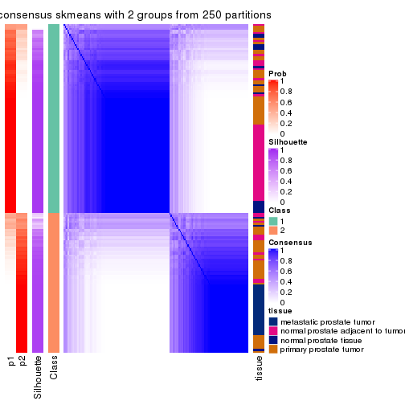</p>

</div>
<div id='tab-MAD-skmeans-consensus-heatmap-2'>
<pre><code class="r">consensus_heatmap(res, k = 3)
</code></pre>

<p>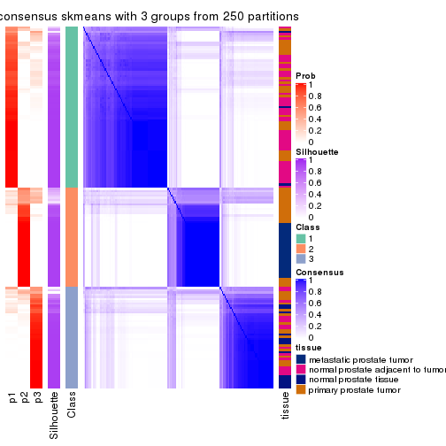</p>

</div>
<div id='tab-MAD-skmeans-consensus-heatmap-3'>
<pre><code class="r">consensus_heatmap(res, k = 4)
</code></pre>

<p>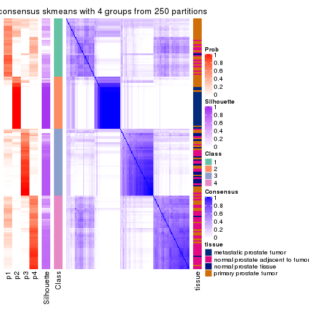</p>

</div>
<div id='tab-MAD-skmeans-consensus-heatmap-4'>
<pre><code class="r">consensus_heatmap(res, k = 5)
</code></pre>

<p>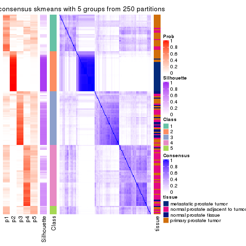</p>

</div>
<div id='tab-MAD-skmeans-consensus-heatmap-5'>
<pre><code class="r">consensus_heatmap(res, k = 6)
</code></pre>

<p>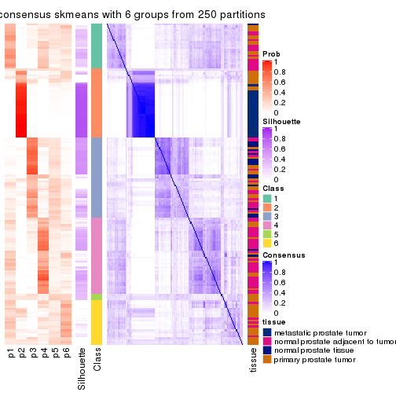</p>

</div>
</div>

Heatmaps for the membership of samples in all partitions to see how consistent they are:


<script>
$( function() {
	$( '#tabs-MAD-skmeans-membership-heatmap' ).tabs();
} );
</script>
<div id='tabs-MAD-skmeans-membership-heatmap'>
<ul>
<li><a href='#tab-MAD-skmeans-membership-heatmap-1'>k = 2</a></li>
<li><a href='#tab-MAD-skmeans-membership-heatmap-2'>k = 3</a></li>
<li><a href='#tab-MAD-skmeans-membership-heatmap-3'>k = 4</a></li>
<li><a href='#tab-MAD-skmeans-membership-heatmap-4'>k = 5</a></li>
<li><a href='#tab-MAD-skmeans-membership-heatmap-5'>k = 6</a></li>
</ul>
<div id='tab-MAD-skmeans-membership-heatmap-1'>
<pre><code class="r">membership_heatmap(res, k = 2)
</code></pre>

<p>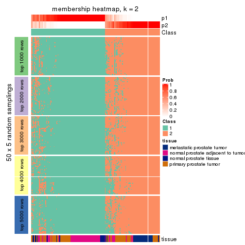</p>

</div>
<div id='tab-MAD-skmeans-membership-heatmap-2'>
<pre><code class="r">membership_heatmap(res, k = 3)
</code></pre>

<p>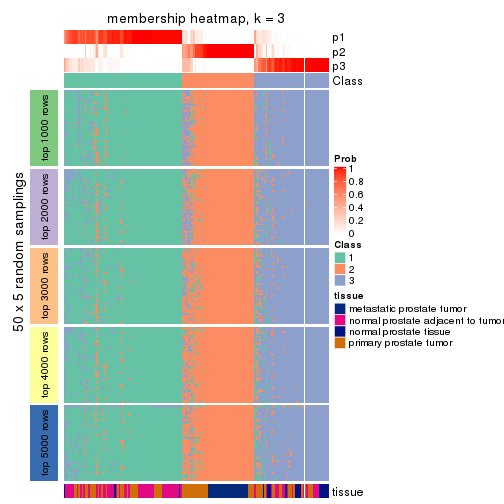</p>

</div>
<div id='tab-MAD-skmeans-membership-heatmap-3'>
<pre><code class="r">membership_heatmap(res, k = 4)
</code></pre>

<p>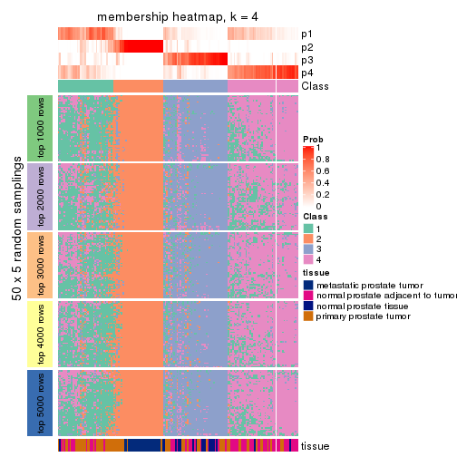</p>

</div>
<div id='tab-MAD-skmeans-membership-heatmap-4'>
<pre><code class="r">membership_heatmap(res, k = 5)
</code></pre>

<p>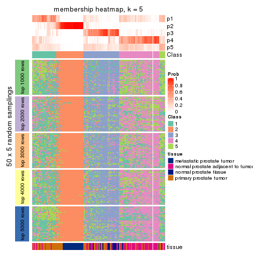</p>

</div>
<div id='tab-MAD-skmeans-membership-heatmap-5'>
<pre><code class="r">membership_heatmap(res, k = 6)
</code></pre>

<p>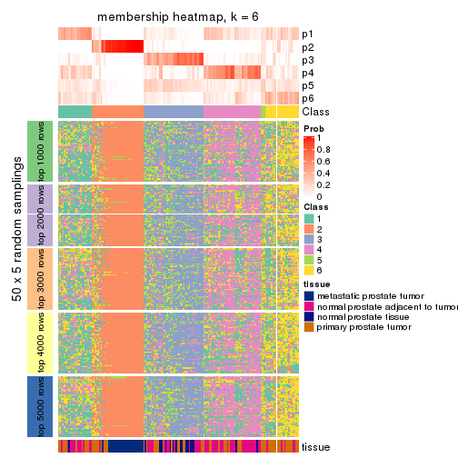</p>

</div>
</div>

As soon as we have had the classes for columns, we can look for signatures
which are significantly different between classes which can be candidate marks
for certain classes. Following are the heatmaps for signatures.


Signature heatmaps where rows are scaled:


<script>
$( function() {
	$( '#tabs-MAD-skmeans-get-signatures' ).tabs();
} );
</script>
<div id='tabs-MAD-skmeans-get-signatures'>
<ul>
<li><a href='#tab-MAD-skmeans-get-signatures-1'>k = 2</a></li>
<li><a href='#tab-MAD-skmeans-get-signatures-2'>k = 3</a></li>
<li><a href='#tab-MAD-skmeans-get-signatures-3'>k = 4</a></li>
<li><a href='#tab-MAD-skmeans-get-signatures-4'>k = 5</a></li>
<li><a href='#tab-MAD-skmeans-get-signatures-5'>k = 6</a></li>
</ul>
<div id='tab-MAD-skmeans-get-signatures-1'>
<pre><code class="r">get_signatures(res, k = 2)
</code></pre>

<p>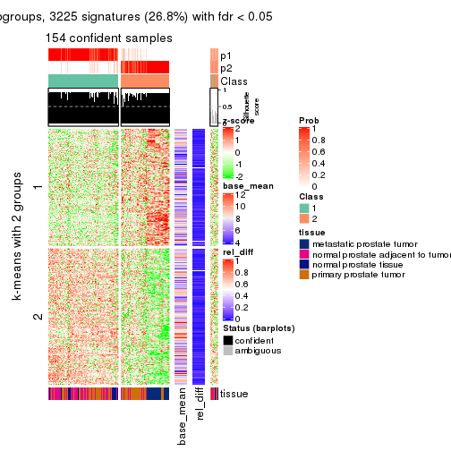</p>

</div>
<div id='tab-MAD-skmeans-get-signatures-2'>
<pre><code class="r">get_signatures(res, k = 3)
</code></pre>

<p>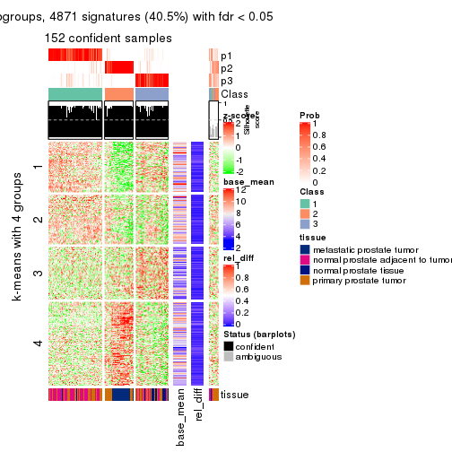</p>

</div>
<div id='tab-MAD-skmeans-get-signatures-3'>
<pre><code class="r">get_signatures(res, k = 4)
</code></pre>

<p>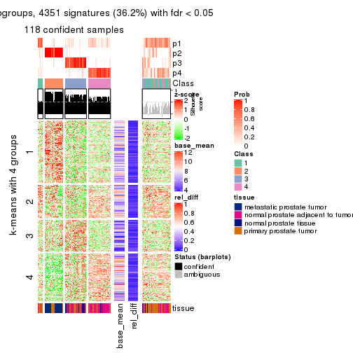</p>

</div>
<div id='tab-MAD-skmeans-get-signatures-4'>
<pre><code class="r">get_signatures(res, k = 5)
</code></pre>

<p>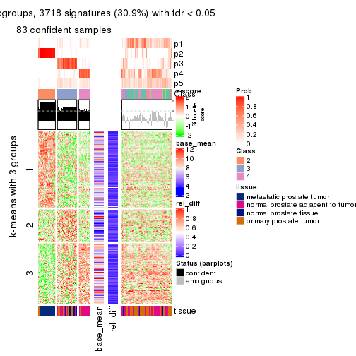</p>

</div>
<div id='tab-MAD-skmeans-get-signatures-5'>
<pre><code class="r">get_signatures(res, k = 6)
</code></pre>

<p>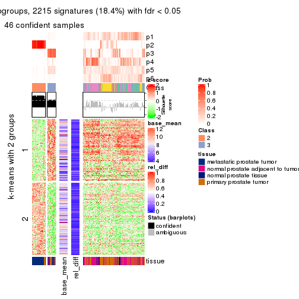</p>

</div>
</div>


Signature heatmaps where rows are not scaled:


<script>
$( function() {
	$( '#tabs-MAD-skmeans-get-signatures-no-scale' ).tabs();
} );
</script>
<div id='tabs-MAD-skmeans-get-signatures-no-scale'>
<ul>
<li><a href='#tab-MAD-skmeans-get-signatures-no-scale-1'>k = 2</a></li>
<li><a href='#tab-MAD-skmeans-get-signatures-no-scale-2'>k = 3</a></li>
<li><a href='#tab-MAD-skmeans-get-signatures-no-scale-3'>k = 4</a></li>
<li><a href='#tab-MAD-skmeans-get-signatures-no-scale-4'>k = 5</a></li>
<li><a href='#tab-MAD-skmeans-get-signatures-no-scale-5'>k = 6</a></li>
</ul>
<div id='tab-MAD-skmeans-get-signatures-no-scale-1'>
<pre><code class="r">get_signatures(res, k = 2, scale_rows = FALSE)
</code></pre>

<p>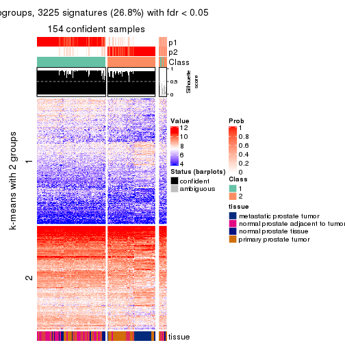</p>

</div>
<div id='tab-MAD-skmeans-get-signatures-no-scale-2'>
<pre><code class="r">get_signatures(res, k = 3, scale_rows = FALSE)
</code></pre>

<p>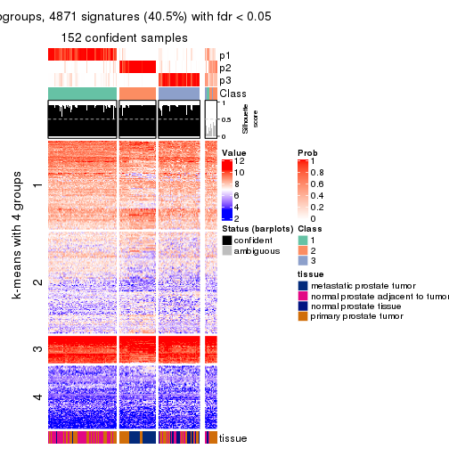</p>

</div>
<div id='tab-MAD-skmeans-get-signatures-no-scale-3'>
<pre><code class="r">get_signatures(res, k = 4, scale_rows = FALSE)
</code></pre>

<p>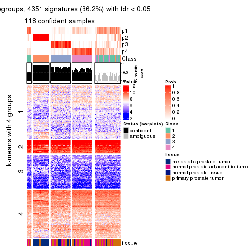</p>

</div>
<div id='tab-MAD-skmeans-get-signatures-no-scale-4'>
<pre><code class="r">get_signatures(res, k = 5, scale_rows = FALSE)
</code></pre>

<p>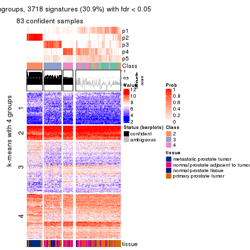</p>

</div>
<div id='tab-MAD-skmeans-get-signatures-no-scale-5'>
<pre><code class="r">get_signatures(res, k = 6, scale_rows = FALSE)
</code></pre>

<p>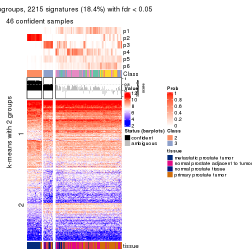</p>

</div>
</div>


Compare the overlap of signatures from different k:

```r
compare_signatures(res)
```

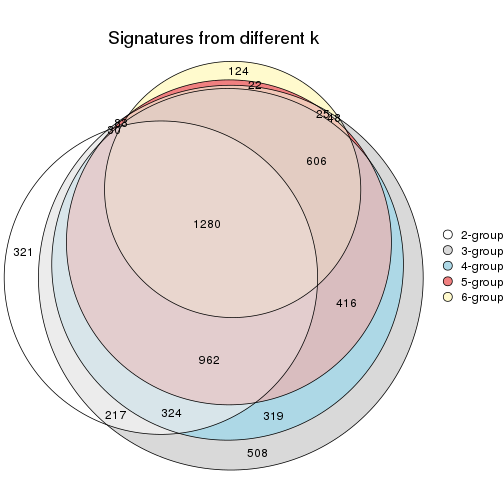

`get_signature()` returns a data frame invisibly. TO get the list of signatures, the function
call should be assigned to a variable explicitly. In following code, if `plot` argument is set
to `FALSE`, no heatmap is plotted while only the differential analysis is performed.

```r
# code only for demonstration
tb = get_signature(res, k = ..., plot = FALSE)
```

An example of the output of `tb` is:

```
#>   which_row         fdr    mean_1    mean_2 scaled_mean_1 scaled_mean_2 km
#> 1        38 0.042760348  8.373488  9.131774    -0.5533452     0.5164555  1
#> 2        40 0.018707592  7.106213  8.469186    -0.6173731     0.5762149  1
#> 3        55 0.019134737 10.221463 11.207825    -0.6159697     0.5749050  1
#> 4        59 0.006059896  5.921854  7.869574    -0.6899429     0.6439467  1
#> 5        60 0.018055526  8.928898 10.211722    -0.6204761     0.5791110  1
#> 6        98 0.009384629 15.714769 14.887706     0.6635654    -0.6193277  2
...
```

The columns in `tb` are:

1. `which_row`: row indices corresponding to the input matrix.
2. `fdr`: FDR for the differential test. 
3. `mean_x`: The mean value in group x.
4. `scaled_mean_x`: The mean value in group x after rows are scaled.
5. `km`: Row groups if k-means clustering is applied to rows.


UMAP plot which shows how samples are separated.


<script>
$( function() {
	$( '#tabs-MAD-skmeans-dimension-reduction' ).tabs();
} );
</script>
<div id='tabs-MAD-skmeans-dimension-reduction'>
<ul>
<li><a href='#tab-MAD-skmeans-dimension-reduction-1'>k = 2</a></li>
<li><a href='#tab-MAD-skmeans-dimension-reduction-2'>k = 3</a></li>
<li><a href='#tab-MAD-skmeans-dimension-reduction-3'>k = 4</a></li>
<li><a href='#tab-MAD-skmeans-dimension-reduction-4'>k = 5</a></li>
<li><a href='#tab-MAD-skmeans-dimension-reduction-5'>k = 6</a></li>
</ul>
<div id='tab-MAD-skmeans-dimension-reduction-1'>
<pre><code class="r">dimension_reduction(res, k = 2, method = &quot;UMAP&quot;)
</code></pre>

<p>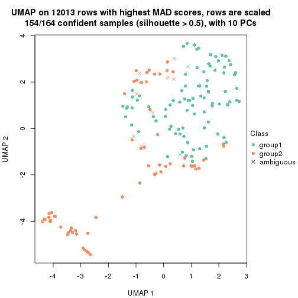</p>

</div>
<div id='tab-MAD-skmeans-dimension-reduction-2'>
<pre><code class="r">dimension_reduction(res, k = 3, method = &quot;UMAP&quot;)
</code></pre>

<p>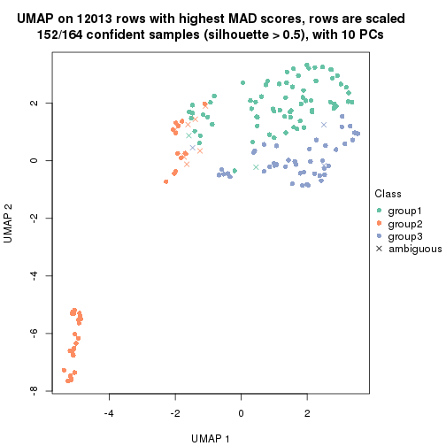</p>

</div>
<div id='tab-MAD-skmeans-dimension-reduction-3'>
<pre><code class="r">dimension_reduction(res, k = 4, method = &quot;UMAP&quot;)
</code></pre>

<p>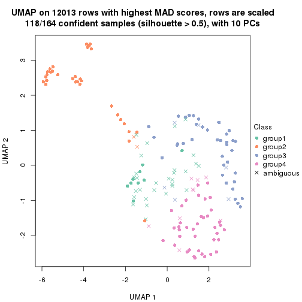</p>

</div>
<div id='tab-MAD-skmeans-dimension-reduction-4'>
<pre><code class="r">dimension_reduction(res, k = 5, method = &quot;UMAP&quot;)
</code></pre>

<p>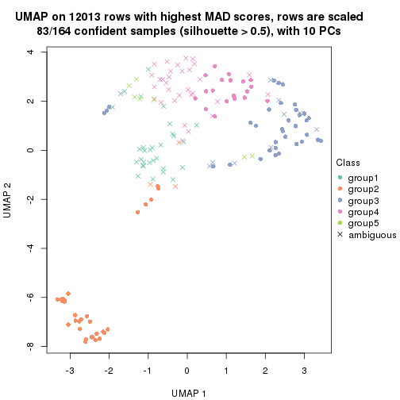</p>

</div>
<div id='tab-MAD-skmeans-dimension-reduction-5'>
<pre><code class="r">dimension_reduction(res, k = 6, method = &quot;UMAP&quot;)
</code></pre>

<p>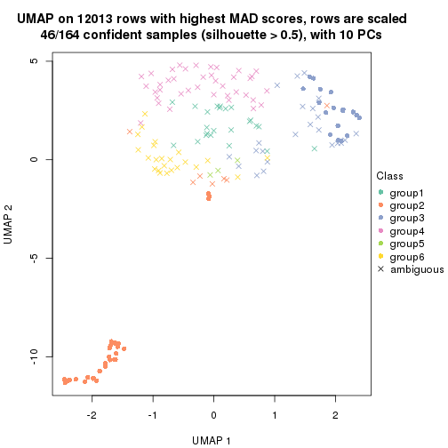</p>

</div>
</div>


Following heatmap shows how subgroups are split when increasing `k`:

```r
collect_classes(res)
```

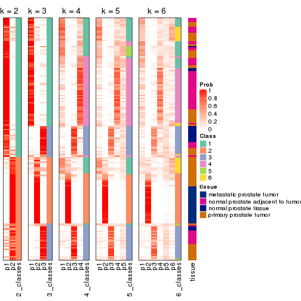


Test correlation between subgroups and known annotations. If the known
annotation is numeric, one-way ANOVA test is applied, and if the known
annotation is discrete, chi-squared contingency table test is applied.

```r
test_to_known_factors(res)
```

```
#>               n tissue(p) k
#> MAD:skmeans 154  1.42e-13 2
#> MAD:skmeans 152  4.40e-25 3
#> MAD:skmeans 118  1.91e-20 4
#> MAD:skmeans  83  1.50e-15 5
#> MAD:skmeans  46  2.66e-08 6
```


If matrix rows can be associated to genes, consider to use `functional_enrichment(res,
...)` to perform function enrichment for the signature genes. See [this vignette](http://bioconductor.org/packages/devel/bioc/vignettes/cola/inst/doc/functional_enrichment.html) for more detailed explanations.


 

---------------------------------------------------


### MAD:pam*


The object with results only for a single top-value method and a single partition method 
can be extracted as:

```r
res = res_list["MAD", "pam"]
# you can also extract it by
# res = res_list["MAD:pam"]
```

A summary of `res` and all the functions that can be applied to it:

```r
res
```

```
#> A 'ConsensusPartition' object with k = 2, 3, 4, 5, 6.
#>   On a matrix with 12013 rows and 164 columns.
#>   Top rows (1000, 2000, 3000, 4000, 5000) are extracted by 'MAD' method.
#>   Subgroups are detected by 'pam' method.
#>   Performed in total 1250 partitions by row resampling.
#>   Best k for subgroups seems to be 2.
#> 
#> Following methods can be applied to this 'ConsensusPartition' object:
#>  [1] "cola_report"             "collect_classes"         "collect_plots"          
#>  [4] "collect_stats"           "colnames"                "compare_signatures"     
#>  [7] "consensus_heatmap"       "dimension_reduction"     "functional_enrichment"  
#> [10] "get_anno_col"            "get_anno"                "get_classes"            
#> [13] "get_consensus"           "get_matrix"              "get_membership"         
#> [16] "get_param"               "get_signatures"          "get_stats"              
#> [19] "is_best_k"               "is_stable_k"             "membership_heatmap"     
#> [22] "ncol"                    "nrow"                    "plot_ecdf"              
#> [25] "rownames"                "select_partition_number" "show"                   
#> [28] "suggest_best_k"          "test_to_known_factors"
```

`collect_plots()` function collects all the plots made from `res` for all `k` (number of partitions)
into one single page to provide an easy and fast comparison between different `k`.

```r
collect_plots(res)
```

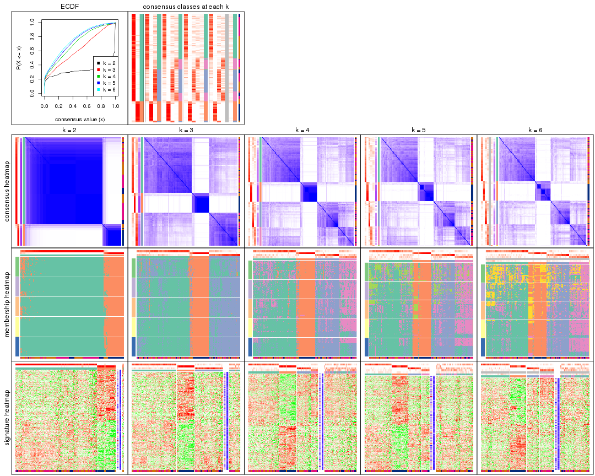

The plots are:

- The first row: a plot of the ECDF (empirical cumulative distribution
  function) curves of the consensus matrix for each `k` and the heatmap of
  predicted classes for each `k`.
- The second row: heatmaps of the consensus matrix for each `k`.
- The third row: heatmaps of the membership matrix for each `k`.
- The fouth row: heatmaps of the signatures for each `k`.

All the plots in panels can be made by individual functions and they are
plotted later in this section.

`select_partition_number()` produces several plots showing different
statistics for choosing "optimized" `k`. There are following statistics:

- ECDF curves of the consensus matrix for each `k`;
- 1-PAC. [The PAC
  score](https://en.wikipedia.org/wiki/Consensus_clustering#Over-interpretation_potential_of_consensus_clustering)
  measures the proportion of the ambiguous subgrouping.
- Mean silhouette score.
- Concordance. The mean probability of fiting the consensus class ids in all
  partitions.
- Area increased. Denote $A_k$ as the area under the ECDF curve for current
  `k`, the area increased is defined as $A_k - A_{k-1}$.
- Rand index. The percent of pairs of samples that are both in a same cluster
  or both are not in a same cluster in the partition of k and k-1.
- Jaccard index. The ratio of pairs of samples are both in a same cluster in
  the partition of k and k-1 and the pairs of samples are both in a same
  cluster in the partition k or k-1.

The detailed explanations of these statistics can be found in [the _cola_
vignette](http://bioconductor.org/packages/devel/bioc/vignettes/cola/inst/doc/cola.html#toc_13).

Generally speaking, lower PAC score, higher mean silhouette score or higher
concordance corresponds to better partition. Rand index and Jaccard index
measure how similar the current partition is compared to partition with `k-1`.
If they are too similar, we won't accept `k` is better than `k-1`.

```r
select_partition_number(res)
```

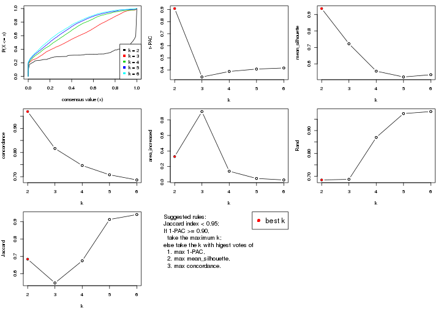

The numeric values for all these statistics can be obtained by `get_stats()`.

```r
get_stats(res)
```

```
#>   k 1-PAC mean_silhouette concordance area_increased  Rand Jaccard
#> 2 2 0.908           0.936       0.969         0.3278 0.684   0.684
#> 3 3 0.342           0.722       0.817         0.9089 0.687   0.547
#> 4 4 0.387           0.556       0.746         0.1382 0.870   0.675
#> 5 5 0.407           0.520       0.708         0.0450 0.974   0.913
#> 6 6 0.416           0.534       0.687         0.0255 0.983   0.942
```

`suggest_best_k()` suggests the best $k$ based on these statistics. The rules are as follows:

- All $k$ with Jaccard index larger than 0.95 are removed because increasing
  $k$ does not provide enough extra information. If all $k$ are removed, it is
  marked as no subgroup is detected.
- For all $k$ with 1-PAC score larger than 0.9, the maximal $k$ is taken as
  the best $k$, and other $k$ are marked as optional $k$.
- If it does not fit the second rule. The $k$ with the maximal vote of the
  highest 1-PAC score, highest mean silhouette, and highest concordance is
  taken as the best $k$.

```r
suggest_best_k(res)
```

```
#> [1] 2
```


Following shows the table of the partitions (You need to click the **show/hide
code output** link to see it). The membership matrix (columns with name `p*`)
is inferred by
[`clue::cl_consensus()`](https://www.rdocumentation.org/link/cl_consensus?package=clue)
function with the `SE` method. Basically the value in the membership matrix
represents the probability to belong to a certain group. The finall class
label for an item is determined with the group with highest probability it
belongs to.

In `get_classes()` function, the entropy is calculated from the membership
matrix and the silhouette score is calculated from the consensus matrix.


<script>
$( function() {
	$( '#tabs-MAD-pam-get-classes' ).tabs();
} );
</script>
<div id='tabs-MAD-pam-get-classes'>
<ul>
<li><a href='#tab-MAD-pam-get-classes-1'>k = 2</a></li>
<li><a href='#tab-MAD-pam-get-classes-2'>k = 3</a></li>
<li><a href='#tab-MAD-pam-get-classes-3'>k = 4</a></li>
<li><a href='#tab-MAD-pam-get-classes-4'>k = 5</a></li>
<li><a href='#tab-MAD-pam-get-classes-5'>k = 6</a></li>
</ul>

<div id='tab-MAD-pam-get-classes-1'>
<p><a id='tab-MAD-pam-get-classes-1-a' style='color:#0366d6' href='#'>show/hide code output</a></p>
<pre><code class="r">cbind(get_classes(res, k = 2), get_membership(res, k = 2))
</code></pre>

<pre><code>#&gt;           class entropy silhouette    p1    p2
#&gt; GSM152839     1  0.0000     0.9731 1.000 0.000
#&gt; GSM152840     1  0.0376     0.9732 0.996 0.004
#&gt; GSM152841     1  0.0000     0.9731 1.000 0.000
#&gt; GSM152842     1  0.0376     0.9732 0.996 0.004
#&gt; GSM152843     1  0.0376     0.9732 0.996 0.004
#&gt; GSM152844     1  0.0376     0.9732 0.996 0.004
#&gt; GSM152845     1  0.0000     0.9731 1.000 0.000
#&gt; GSM152846     1  0.0376     0.9732 0.996 0.004
#&gt; GSM152847     1  0.0376     0.9732 0.996 0.004
#&gt; GSM152848     1  0.0376     0.9732 0.996 0.004
#&gt; GSM152849     1  0.0376     0.9732 0.996 0.004
#&gt; GSM152850     1  0.0376     0.9732 0.996 0.004
#&gt; GSM152851     1  0.0000     0.9731 1.000 0.000
#&gt; GSM152852     1  0.0000     0.9731 1.000 0.000
#&gt; GSM152853     1  0.0000     0.9731 1.000 0.000
#&gt; GSM152854     1  0.4939     0.8814 0.892 0.108
#&gt; GSM152855     1  0.0000     0.9731 1.000 0.000
#&gt; GSM153238     1  0.3584     0.9242 0.932 0.068
#&gt; GSM153239     1  0.0376     0.9732 0.996 0.004
#&gt; GSM153240     1  0.0000     0.9731 1.000 0.000
#&gt; GSM153241     1  0.0376     0.9732 0.996 0.004
#&gt; GSM153242     1  0.0376     0.9719 0.996 0.004
#&gt; GSM153243     1  0.5059     0.8783 0.888 0.112
#&gt; GSM153244     1  0.3114     0.9354 0.944 0.056
#&gt; GSM153245     1  0.0376     0.9732 0.996 0.004
#&gt; GSM153246     1  0.2778     0.9433 0.952 0.048
#&gt; GSM153247     1  0.2043     0.9556 0.968 0.032
#&gt; GSM153248     1  0.2236     0.9529 0.964 0.036
#&gt; GSM153249     1  0.0376     0.9720 0.996 0.004
#&gt; GSM153250     1  0.0376     0.9732 0.996 0.004
#&gt; GSM153251     1  0.0672     0.9718 0.992 0.008
#&gt; GSM153252     1  0.0000     0.9731 1.000 0.000
#&gt; GSM153253     1  0.0376     0.9732 0.996 0.004
#&gt; GSM153254     1  0.0000     0.9731 1.000 0.000
#&gt; GSM153255     1  0.0000     0.9731 1.000 0.000
#&gt; GSM153256     1  0.0376     0.9732 0.996 0.004
#&gt; GSM153257     1  0.0000     0.9731 1.000 0.000
#&gt; GSM153258     1  0.0376     0.9732 0.996 0.004
#&gt; GSM153259     1  0.0376     0.9732 0.996 0.004
#&gt; GSM153260     1  0.0672     0.9717 0.992 0.008
#&gt; GSM153261     1  0.0376     0.9732 0.996 0.004
#&gt; GSM153262     1  0.0000     0.9731 1.000 0.000
#&gt; GSM153263     1  0.0376     0.9732 0.996 0.004
#&gt; GSM153264     1  0.0376     0.9732 0.996 0.004
#&gt; GSM153265     1  0.0376     0.9732 0.996 0.004
#&gt; GSM153266     1  0.0376     0.9732 0.996 0.004
#&gt; GSM153267     1  0.0000     0.9731 1.000 0.000
#&gt; GSM153268     1  0.0000     0.9731 1.000 0.000
#&gt; GSM153269     1  0.0376     0.9732 0.996 0.004
#&gt; GSM153270     1  0.0376     0.9732 0.996 0.004
#&gt; GSM153271     1  0.0376     0.9732 0.996 0.004
#&gt; GSM153272     1  0.0000     0.9731 1.000 0.000
#&gt; GSM153273     1  0.0376     0.9720 0.996 0.004
#&gt; GSM153274     1  0.0376     0.9732 0.996 0.004
#&gt; GSM153275     1  0.0000     0.9731 1.000 0.000
#&gt; GSM153276     1  0.0376     0.9732 0.996 0.004
#&gt; GSM153277     1  0.0000     0.9731 1.000 0.000
#&gt; GSM153278     1  0.0376     0.9732 0.996 0.004
#&gt; GSM153279     1  0.0000     0.9731 1.000 0.000
#&gt; GSM153280     1  0.0000     0.9731 1.000 0.000
#&gt; GSM153281     1  0.0000     0.9731 1.000 0.000
#&gt; GSM153282     1  0.0000     0.9731 1.000 0.000
#&gt; GSM153283     1  0.0000     0.9731 1.000 0.000
#&gt; GSM153284     1  0.0000     0.9731 1.000 0.000
#&gt; GSM153285     1  0.0000     0.9731 1.000 0.000
#&gt; GSM153286     1  0.0000     0.9731 1.000 0.000
#&gt; GSM153287     1  0.0000     0.9731 1.000 0.000
#&gt; GSM153288     1  0.0000     0.9731 1.000 0.000
#&gt; GSM153289     1  0.0000     0.9731 1.000 0.000
#&gt; GSM153290     1  0.0000     0.9731 1.000 0.000
#&gt; GSM153291     1  0.0000     0.9731 1.000 0.000
#&gt; GSM153292     1  0.0000     0.9731 1.000 0.000
#&gt; GSM153293     1  0.0000     0.9731 1.000 0.000
#&gt; GSM153294     1  0.8267     0.6567 0.740 0.260
#&gt; GSM153295     1  0.0376     0.9732 0.996 0.004
#&gt; GSM153054     1  0.0672     0.9718 0.992 0.008
#&gt; GSM153055     1  0.0376     0.9719 0.996 0.004
#&gt; GSM153056     1  0.0000     0.9731 1.000 0.000
#&gt; GSM153057     1  0.1843     0.9586 0.972 0.028
#&gt; GSM153058     1  0.0376     0.9732 0.996 0.004
#&gt; GSM153059     1  0.0376     0.9732 0.996 0.004
#&gt; GSM153060     1  0.0000     0.9731 1.000 0.000
#&gt; GSM153061     1  0.0672     0.9717 0.992 0.008
#&gt; GSM153062     1  0.3274     0.9326 0.940 0.060
#&gt; GSM153063     1  0.0000     0.9731 1.000 0.000
#&gt; GSM153064     1  0.0376     0.9732 0.996 0.004
#&gt; GSM153065     1  0.3274     0.9310 0.940 0.060
#&gt; GSM153066     2  0.6623     0.8017 0.172 0.828
#&gt; GSM153067     1  0.0376     0.9718 0.996 0.004
#&gt; GSM153068     1  0.0376     0.9732 0.996 0.004
#&gt; GSM153069     1  0.0000     0.9731 1.000 0.000
#&gt; GSM153070     1  0.0376     0.9732 0.996 0.004
#&gt; GSM153071     1  0.0938     0.9696 0.988 0.012
#&gt; GSM153072     1  0.7299     0.7521 0.796 0.204
#&gt; GSM153073     1  0.1184     0.9672 0.984 0.016
#&gt; GSM153074     1  0.0000     0.9731 1.000 0.000
#&gt; GSM153075     1  0.0000     0.9731 1.000 0.000
#&gt; GSM153076     1  0.0376     0.9720 0.996 0.004
#&gt; GSM153077     1  0.0376     0.9732 0.996 0.004
#&gt; GSM153078     1  0.0376     0.9732 0.996 0.004
#&gt; GSM153079     1  0.0672     0.9717 0.992 0.008
#&gt; GSM153080     1  0.0376     0.9732 0.996 0.004
#&gt; GSM153081     1  0.0376     0.9732 0.996 0.004
#&gt; GSM153082     2  0.9427     0.4592 0.360 0.640
#&gt; GSM153083     1  0.7883     0.7083 0.764 0.236
#&gt; GSM153084     1  0.7674     0.7280 0.776 0.224
#&gt; GSM153085     1  0.1843     0.9586 0.972 0.028
#&gt; GSM153086     1  0.4022     0.9129 0.920 0.080
#&gt; GSM153087     1  0.0376     0.9732 0.996 0.004
#&gt; GSM153088     1  0.0376     0.9732 0.996 0.004
#&gt; GSM153089     1  0.2043     0.9547 0.968 0.032
#&gt; GSM153090     1  0.0376     0.9732 0.996 0.004
#&gt; GSM153091     1  0.8763     0.5980 0.704 0.296
#&gt; GSM153092     1  0.1184     0.9672 0.984 0.016
#&gt; GSM153093     1  0.0376     0.9732 0.996 0.004
#&gt; GSM153094     1  0.6712     0.7968 0.824 0.176
#&gt; GSM153095     1  0.1184     0.9647 0.984 0.016
#&gt; GSM153096     1  0.0000     0.9731 1.000 0.000
#&gt; GSM153097     1  0.7950     0.6987 0.760 0.240
#&gt; GSM153098     1  0.0000     0.9731 1.000 0.000
#&gt; GSM153099     1  0.0376     0.9732 0.996 0.004
#&gt; GSM153100     1  0.0000     0.9731 1.000 0.000
#&gt; GSM153101     1  0.0376     0.9732 0.996 0.004
#&gt; GSM153102     1  0.3584     0.9175 0.932 0.068
#&gt; GSM153103     1  0.1414     0.9647 0.980 0.020
#&gt; GSM153104     1  0.0000     0.9731 1.000 0.000
#&gt; GSM153106     1  0.0000     0.9731 1.000 0.000
#&gt; GSM153107     1  0.0000     0.9731 1.000 0.000
#&gt; GSM153108     1  0.0376     0.9732 0.996 0.004
#&gt; GSM153109     1  0.9996     0.0279 0.512 0.488
#&gt; GSM153110     1  0.2603     0.9460 0.956 0.044
#&gt; GSM153111     1  0.4562     0.8957 0.904 0.096
#&gt; GSM153112     1  0.3274     0.9323 0.940 0.060
#&gt; GSM153113     2  0.7139     0.7741 0.196 0.804
#&gt; GSM153114     1  0.0000     0.9731 1.000 0.000
#&gt; GSM187532     2  0.2948     0.9176 0.052 0.948
#&gt; GSM187533     2  0.7453     0.7488 0.212 0.788
#&gt; GSM187534     2  0.5519     0.8512 0.128 0.872
#&gt; GSM187535     2  0.9427     0.4900 0.360 0.640
#&gt; GSM152906     2  0.0000     0.9486 0.000 1.000
#&gt; GSM152907     2  0.0000     0.9486 0.000 1.000
#&gt; GSM152908     2  0.0000     0.9486 0.000 1.000
#&gt; GSM152909     2  0.0000     0.9486 0.000 1.000
#&gt; GSM152910     2  0.0000     0.9486 0.000 1.000
#&gt; GSM152911     2  0.0000     0.9486 0.000 1.000
#&gt; GSM152912     2  0.0000     0.9486 0.000 1.000
#&gt; GSM152913     2  0.0000     0.9486 0.000 1.000
#&gt; GSM152914     2  0.0000     0.9486 0.000 1.000
#&gt; GSM152915     2  0.0000     0.9486 0.000 1.000
#&gt; GSM152916     2  0.0000     0.9486 0.000 1.000
#&gt; GSM152917     2  0.0000     0.9486 0.000 1.000
#&gt; GSM152918     2  0.0000     0.9486 0.000 1.000
#&gt; GSM152919     2  0.0000     0.9486 0.000 1.000
#&gt; GSM152920     2  0.0000     0.9486 0.000 1.000
#&gt; GSM152921     2  0.0000     0.9486 0.000 1.000
#&gt; GSM152922     2  0.0000     0.9486 0.000 1.000
#&gt; GSM152923     2  0.0000     0.9486 0.000 1.000
#&gt; GSM152924     2  0.0000     0.9486 0.000 1.000
#&gt; GSM152925     2  0.0376     0.9458 0.004 0.996
#&gt; GSM152926     2  0.1843     0.9348 0.028 0.972
#&gt; GSM152927     2  0.0000     0.9486 0.000 1.000
#&gt; GSM152928     2  0.2423     0.9259 0.040 0.960
#&gt; GSM152929     2  0.0000     0.9486 0.000 1.000
#&gt; GSM152930     2  0.0000     0.9486 0.000 1.000
</code></pre>

<script>
$('#tab-MAD-pam-get-classes-1-a').parent().next().next().hide();
$('#tab-MAD-pam-get-classes-1-a').click(function(){
  $('#tab-MAD-pam-get-classes-1-a').parent().next().next().toggle();
  return(false);
});
</script>
</div>

<div id='tab-MAD-pam-get-classes-2'>
<p><a id='tab-MAD-pam-get-classes-2-a' style='color:#0366d6' href='#'>show/hide code output</a></p>
<pre><code class="r">cbind(get_classes(res, k = 3), get_membership(res, k = 3))
</code></pre>

<pre><code>#&gt;           class entropy silhouette    p1    p2    p3
#&gt; GSM152839     1  0.5497      0.551 0.708 0.000 0.292
#&gt; GSM152840     3  0.5733      0.659 0.324 0.000 0.676
#&gt; GSM152841     3  0.6111      0.480 0.396 0.000 0.604
#&gt; GSM152842     1  0.3267      0.795 0.884 0.000 0.116
#&gt; GSM152843     1  0.1860      0.784 0.948 0.000 0.052
#&gt; GSM152844     3  0.5905      0.605 0.352 0.000 0.648
#&gt; GSM152845     3  0.2796      0.802 0.092 0.000 0.908
#&gt; GSM152846     3  0.5138      0.761 0.252 0.000 0.748
#&gt; GSM152847     1  0.3619      0.780 0.864 0.000 0.136
#&gt; GSM152848     1  0.6274      0.308 0.544 0.000 0.456
#&gt; GSM152849     3  0.5835      0.504 0.340 0.000 0.660
#&gt; GSM152850     1  0.5785      0.633 0.668 0.000 0.332
#&gt; GSM152851     3  0.2878      0.801 0.096 0.000 0.904
#&gt; GSM152852     3  0.2537      0.803 0.080 0.000 0.920
#&gt; GSM152853     3  0.5882      0.582 0.348 0.000 0.652
#&gt; GSM152854     3  0.5147      0.765 0.180 0.020 0.800
#&gt; GSM152855     3  0.0592      0.788 0.012 0.000 0.988
#&gt; GSM153238     1  0.2564      0.783 0.936 0.036 0.028
#&gt; GSM153239     1  0.5810      0.511 0.664 0.000 0.336
#&gt; GSM153240     3  0.6267      0.243 0.452 0.000 0.548
#&gt; GSM153241     1  0.6111      0.506 0.604 0.000 0.396
#&gt; GSM153242     1  0.5988      0.499 0.632 0.000 0.368
#&gt; GSM153243     1  0.2590      0.783 0.924 0.004 0.072
#&gt; GSM153244     3  0.3482      0.792 0.128 0.000 0.872
#&gt; GSM153245     1  0.6062      0.439 0.616 0.000 0.384
#&gt; GSM153246     1  0.2116      0.789 0.948 0.012 0.040
#&gt; GSM153247     1  0.2066      0.784 0.940 0.000 0.060
#&gt; GSM153248     1  0.4346      0.785 0.816 0.000 0.184
#&gt; GSM153249     1  0.3752      0.767 0.856 0.000 0.144
#&gt; GSM153250     1  0.2448      0.787 0.924 0.000 0.076
#&gt; GSM153251     1  0.5465      0.567 0.712 0.000 0.288
#&gt; GSM153252     1  0.6062      0.580 0.616 0.000 0.384
#&gt; GSM153253     1  0.6168      0.278 0.588 0.000 0.412
#&gt; GSM153254     3  0.5560      0.680 0.300 0.000 0.700
#&gt; GSM153255     1  0.5397      0.720 0.720 0.000 0.280
#&gt; GSM153256     1  0.2165      0.790 0.936 0.000 0.064
#&gt; GSM153257     1  0.2959      0.786 0.900 0.000 0.100
#&gt; GSM153258     1  0.4605      0.757 0.796 0.000 0.204
#&gt; GSM153259     1  0.4504      0.769 0.804 0.000 0.196
#&gt; GSM153260     1  0.3686      0.788 0.860 0.000 0.140
#&gt; GSM153261     3  0.2066      0.795 0.060 0.000 0.940
#&gt; GSM153262     3  0.4178      0.775 0.172 0.000 0.828
#&gt; GSM153263     3  0.4399      0.760 0.188 0.000 0.812
#&gt; GSM153264     1  0.6280      0.248 0.540 0.000 0.460
#&gt; GSM153265     3  0.3340      0.791 0.120 0.000 0.880
#&gt; GSM153266     1  0.4062      0.777 0.836 0.000 0.164
#&gt; GSM153267     3  0.6168      0.202 0.412 0.000 0.588
#&gt; GSM153268     3  0.4974      0.743 0.236 0.000 0.764
#&gt; GSM153269     1  0.5733      0.661 0.676 0.000 0.324
#&gt; GSM153270     1  0.2711      0.791 0.912 0.000 0.088
#&gt; GSM153271     1  0.2261      0.788 0.932 0.000 0.068
#&gt; GSM153272     1  0.5098      0.736 0.752 0.000 0.248
#&gt; GSM153273     1  0.5138      0.732 0.748 0.000 0.252
#&gt; GSM153274     1  0.5216      0.716 0.740 0.000 0.260
#&gt; GSM153275     1  0.6215      0.495 0.572 0.000 0.428
#&gt; GSM153276     1  0.4931      0.764 0.768 0.000 0.232
#&gt; GSM153277     3  0.2959      0.787 0.100 0.000 0.900
#&gt; GSM153278     1  0.4931      0.737 0.768 0.000 0.232
#&gt; GSM153279     1  0.5254      0.689 0.736 0.000 0.264
#&gt; GSM153280     3  0.2796      0.801 0.092 0.000 0.908
#&gt; GSM153281     1  0.5016      0.733 0.760 0.000 0.240
#&gt; GSM153282     3  0.4291      0.784 0.180 0.000 0.820
#&gt; GSM153283     1  0.5497      0.672 0.708 0.000 0.292
#&gt; GSM153284     1  0.3116      0.790 0.892 0.000 0.108
#&gt; GSM153285     3  0.6140      0.447 0.404 0.000 0.596
#&gt; GSM153286     1  0.2796      0.784 0.908 0.000 0.092
#&gt; GSM153287     1  0.4062      0.771 0.836 0.000 0.164
#&gt; GSM153288     1  0.6180      0.379 0.584 0.000 0.416
#&gt; GSM153289     3  0.0592      0.788 0.012 0.000 0.988
#&gt; GSM153290     3  0.2711      0.795 0.088 0.000 0.912
#&gt; GSM153291     3  0.2261      0.802 0.068 0.000 0.932
#&gt; GSM153292     1  0.5988      0.582 0.632 0.000 0.368
#&gt; GSM153293     3  0.5363      0.639 0.276 0.000 0.724
#&gt; GSM153294     1  0.3637      0.767 0.892 0.084 0.024
#&gt; GSM153295     3  0.2356      0.801 0.072 0.000 0.928
#&gt; GSM153054     1  0.2301      0.783 0.936 0.004 0.060
#&gt; GSM153055     3  0.5650      0.603 0.312 0.000 0.688
#&gt; GSM153056     1  0.4931      0.737 0.768 0.000 0.232
#&gt; GSM153057     3  0.2261      0.789 0.068 0.000 0.932
#&gt; GSM153058     1  0.6168      0.243 0.588 0.000 0.412
#&gt; GSM153059     3  0.5497      0.646 0.292 0.000 0.708
#&gt; GSM153060     1  0.2448      0.793 0.924 0.000 0.076
#&gt; GSM153061     3  0.6126      0.533 0.400 0.000 0.600
#&gt; GSM153062     1  0.5028      0.774 0.828 0.040 0.132
#&gt; GSM153063     1  0.6267      0.257 0.548 0.000 0.452
#&gt; GSM153064     1  0.4842      0.765 0.776 0.000 0.224
#&gt; GSM153065     3  0.4249      0.793 0.108 0.028 0.864
#&gt; GSM153066     2  0.6079      0.738 0.128 0.784 0.088
#&gt; GSM153067     1  0.2711      0.783 0.912 0.000 0.088
#&gt; GSM153068     1  0.5098      0.726 0.752 0.000 0.248
#&gt; GSM153069     3  0.5733      0.666 0.324 0.000 0.676
#&gt; GSM153070     1  0.1411      0.783 0.964 0.000 0.036
#&gt; GSM153071     1  0.3551      0.783 0.868 0.000 0.132
#&gt; GSM153072     1  0.5407      0.780 0.804 0.040 0.156
#&gt; GSM153073     1  0.1163      0.778 0.972 0.000 0.028
#&gt; GSM153074     3  0.5621      0.684 0.308 0.000 0.692
#&gt; GSM153075     3  0.2165      0.801 0.064 0.000 0.936
#&gt; GSM153076     1  0.3267      0.788 0.884 0.000 0.116
#&gt; GSM153077     1  0.2711      0.794 0.912 0.000 0.088
#&gt; GSM153078     1  0.6045      0.605 0.620 0.000 0.380
#&gt; GSM153079     3  0.1860      0.786 0.052 0.000 0.948
#&gt; GSM153080     3  0.6291      0.174 0.468 0.000 0.532
#&gt; GSM153081     3  0.2261      0.794 0.068 0.000 0.932
#&gt; GSM153082     2  0.7671      0.184 0.048 0.544 0.408
#&gt; GSM153083     1  0.4683      0.729 0.836 0.140 0.024
#&gt; GSM153084     1  0.9203      0.120 0.476 0.156 0.368
#&gt; GSM153085     1  0.3826      0.798 0.868 0.008 0.124
#&gt; GSM153086     1  0.2959      0.794 0.900 0.000 0.100
#&gt; GSM153087     1  0.2537      0.790 0.920 0.000 0.080
#&gt; GSM153088     1  0.3412      0.784 0.876 0.000 0.124
#&gt; GSM153089     3  0.4346      0.789 0.184 0.000 0.816
#&gt; GSM153090     1  0.3038      0.784 0.896 0.000 0.104
#&gt; GSM153091     1  0.3846      0.750 0.876 0.108 0.016
#&gt; GSM153092     1  0.3112      0.796 0.900 0.004 0.096
#&gt; GSM153093     1  0.3267      0.790 0.884 0.000 0.116
#&gt; GSM153094     1  0.8222      0.439 0.592 0.100 0.308
#&gt; GSM153095     1  0.5378      0.714 0.756 0.008 0.236
#&gt; GSM153096     1  0.5905      0.516 0.648 0.000 0.352
#&gt; GSM153097     1  0.8371      0.579 0.624 0.164 0.212
#&gt; GSM153098     1  0.3551      0.792 0.868 0.000 0.132
#&gt; GSM153099     1  0.2537      0.795 0.920 0.000 0.080
#&gt; GSM153100     3  0.5254      0.681 0.264 0.000 0.736
#&gt; GSM153101     3  0.3619      0.801 0.136 0.000 0.864
#&gt; GSM153102     3  0.3965      0.787 0.132 0.008 0.860
#&gt; GSM153103     1  0.2537      0.787 0.920 0.000 0.080
#&gt; GSM153104     1  0.2878      0.784 0.904 0.000 0.096
#&gt; GSM153106     3  0.0592      0.788 0.012 0.000 0.988
#&gt; GSM153107     3  0.0747      0.788 0.016 0.000 0.984
#&gt; GSM153108     3  0.3340      0.796 0.120 0.000 0.880
#&gt; GSM153109     1  0.9120      0.363 0.504 0.340 0.156
#&gt; GSM153110     1  0.3618      0.776 0.884 0.012 0.104
#&gt; GSM153111     1  0.3765      0.784 0.888 0.028 0.084
#&gt; GSM153112     1  0.5223      0.779 0.800 0.024 0.176
#&gt; GSM153113     2  0.7339      0.629 0.144 0.708 0.148
#&gt; GSM153114     3  0.0892      0.788 0.020 0.000 0.980
#&gt; GSM187532     2  0.5610      0.734 0.028 0.776 0.196
#&gt; GSM187533     3  0.5138      0.586 0.000 0.252 0.748
#&gt; GSM187534     2  0.6473      0.501 0.016 0.652 0.332
#&gt; GSM187535     3  0.1878      0.775 0.004 0.044 0.952
#&gt; GSM152906     2  0.0000      0.943 0.000 1.000 0.000
#&gt; GSM152907     2  0.0000      0.943 0.000 1.000 0.000
#&gt; GSM152908     2  0.0000      0.943 0.000 1.000 0.000
#&gt; GSM152909     2  0.0000      0.943 0.000 1.000 0.000
#&gt; GSM152910     2  0.0000      0.943 0.000 1.000 0.000
#&gt; GSM152911     2  0.0000      0.943 0.000 1.000 0.000
#&gt; GSM152912     2  0.0000      0.943 0.000 1.000 0.000
#&gt; GSM152913     2  0.0000      0.943 0.000 1.000 0.000
#&gt; GSM152914     2  0.0000      0.943 0.000 1.000 0.000
#&gt; GSM152915     2  0.0000      0.943 0.000 1.000 0.000
#&gt; GSM152916     2  0.0000      0.943 0.000 1.000 0.000
#&gt; GSM152917     2  0.0000      0.943 0.000 1.000 0.000
#&gt; GSM152918     2  0.0000      0.943 0.000 1.000 0.000
#&gt; GSM152919     2  0.0000      0.943 0.000 1.000 0.000
#&gt; GSM152920     2  0.0000      0.943 0.000 1.000 0.000
#&gt; GSM152921     2  0.0000      0.943 0.000 1.000 0.000
#&gt; GSM152922     2  0.0237      0.940 0.004 0.996 0.000
#&gt; GSM152923     2  0.0000      0.943 0.000 1.000 0.000
#&gt; GSM152924     2  0.0747      0.932 0.000 0.984 0.016
#&gt; GSM152925     2  0.0000      0.943 0.000 1.000 0.000
#&gt; GSM152926     2  0.0892      0.929 0.020 0.980 0.000
#&gt; GSM152927     2  0.0000      0.943 0.000 1.000 0.000
#&gt; GSM152928     2  0.1999      0.909 0.036 0.952 0.012
#&gt; GSM152929     2  0.0000      0.943 0.000 1.000 0.000
#&gt; GSM152930     2  0.0000      0.943 0.000 1.000 0.000
</code></pre>

<script>
$('#tab-MAD-pam-get-classes-2-a').parent().next().next().hide();
$('#tab-MAD-pam-get-classes-2-a').click(function(){
  $('#tab-MAD-pam-get-classes-2-a').parent().next().next().toggle();
  return(false);
});
</script>
</div>

<div id='tab-MAD-pam-get-classes-3'>
<p><a id='tab-MAD-pam-get-classes-3-a' style='color:#0366d6' href='#'>show/hide code output</a></p>
<pre><code class="r">cbind(get_classes(res, k = 4), get_membership(res, k = 4))
</code></pre>

<pre><code>#&gt;           class entropy silhouette    p1    p2    p3    p4
#&gt; GSM152839     1  0.6054    0.46006 0.656 0.000 0.256 0.088
#&gt; GSM152840     4  0.5833    0.55236 0.096 0.000 0.212 0.692
#&gt; GSM152841     4  0.7232    0.41654 0.164 0.000 0.320 0.516
#&gt; GSM152842     4  0.6042    0.35784 0.368 0.000 0.052 0.580
#&gt; GSM152843     1  0.1890    0.68680 0.936 0.000 0.008 0.056
#&gt; GSM152844     4  0.5392    0.43873 0.040 0.000 0.280 0.680
#&gt; GSM152845     3  0.3731    0.64224 0.036 0.000 0.844 0.120
#&gt; GSM152846     3  0.6652    0.37988 0.108 0.000 0.576 0.316
#&gt; GSM152847     1  0.3198    0.69771 0.880 0.000 0.080 0.040
#&gt; GSM152848     1  0.7332    0.08558 0.448 0.000 0.396 0.156
#&gt; GSM152849     3  0.4790    0.32305 0.380 0.000 0.620 0.000
#&gt; GSM152850     1  0.5936    0.49785 0.620 0.000 0.324 0.056
#&gt; GSM152851     3  0.6009    0.02216 0.040 0.000 0.492 0.468
#&gt; GSM152852     3  0.3978    0.60972 0.012 0.000 0.796 0.192
#&gt; GSM152853     4  0.6681    0.48667 0.120 0.000 0.292 0.588
#&gt; GSM152854     3  0.5253    0.61109 0.132 0.012 0.772 0.084
#&gt; GSM152855     3  0.0188    0.66277 0.000 0.000 0.996 0.004
#&gt; GSM153238     1  0.4178    0.67931 0.824 0.020 0.016 0.140
#&gt; GSM153239     4  0.6674    0.57834 0.300 0.000 0.116 0.584
#&gt; GSM153240     3  0.7715   -0.06494 0.324 0.000 0.436 0.240
#&gt; GSM153241     1  0.6678    0.28578 0.500 0.000 0.412 0.088
#&gt; GSM153242     1  0.7743   -0.09193 0.436 0.000 0.256 0.308
#&gt; GSM153243     1  0.2623    0.69227 0.908 0.000 0.028 0.064
#&gt; GSM153244     3  0.3598    0.63530 0.124 0.000 0.848 0.028
#&gt; GSM153245     4  0.5511    0.62207 0.196 0.000 0.084 0.720
#&gt; GSM153246     1  0.5085    0.59534 0.716 0.008 0.020 0.256
#&gt; GSM153247     1  0.3384    0.68762 0.860 0.000 0.024 0.116
#&gt; GSM153248     1  0.4127    0.68799 0.824 0.000 0.124 0.052
#&gt; GSM153249     4  0.6253    0.41877 0.372 0.000 0.064 0.564
#&gt; GSM153250     1  0.1629    0.68612 0.952 0.000 0.024 0.024
#&gt; GSM153251     1  0.7377    0.20020 0.520 0.000 0.216 0.264
#&gt; GSM153252     4  0.7575    0.40020 0.356 0.000 0.200 0.444
#&gt; GSM153253     4  0.6635    0.54716 0.152 0.000 0.228 0.620
#&gt; GSM153254     3  0.7228    0.13857 0.156 0.000 0.504 0.340
#&gt; GSM153255     4  0.7220    0.35502 0.384 0.000 0.144 0.472
#&gt; GSM153256     1  0.5106    0.56349 0.720 0.000 0.040 0.240
#&gt; GSM153257     1  0.4055    0.68992 0.832 0.000 0.060 0.108
#&gt; GSM153258     1  0.3945    0.66107 0.780 0.000 0.216 0.004
#&gt; GSM153259     1  0.4285    0.68569 0.820 0.000 0.076 0.104
#&gt; GSM153260     1  0.4462    0.67585 0.804 0.000 0.064 0.132
#&gt; GSM153261     3  0.2408    0.67035 0.044 0.000 0.920 0.036
#&gt; GSM153262     3  0.4459    0.60731 0.032 0.000 0.780 0.188
#&gt; GSM153263     3  0.4740    0.62034 0.080 0.000 0.788 0.132
#&gt; GSM153264     1  0.7098    0.19039 0.472 0.000 0.400 0.128
#&gt; GSM153265     4  0.5167   -0.01066 0.004 0.000 0.488 0.508
#&gt; GSM153266     1  0.6357    0.53658 0.644 0.000 0.124 0.232
#&gt; GSM153267     3  0.5708    0.11807 0.416 0.000 0.556 0.028
#&gt; GSM153268     4  0.4993    0.45906 0.028 0.000 0.260 0.712
#&gt; GSM153269     1  0.4983    0.60095 0.704 0.000 0.272 0.024
#&gt; GSM153270     1  0.3962    0.68732 0.820 0.000 0.028 0.152
#&gt; GSM153271     1  0.1677    0.68529 0.948 0.000 0.012 0.040
#&gt; GSM153272     4  0.7253    0.17448 0.428 0.000 0.144 0.428
#&gt; GSM153273     1  0.6404    0.54543 0.644 0.000 0.136 0.220
#&gt; GSM153274     1  0.6835    0.36352 0.592 0.000 0.156 0.252
#&gt; GSM153275     1  0.7576    0.09118 0.464 0.000 0.324 0.212
#&gt; GSM153276     1  0.4669    0.67053 0.780 0.000 0.168 0.052
#&gt; GSM153277     3  0.4907    0.26268 0.000 0.000 0.580 0.420
#&gt; GSM153278     1  0.6075    0.59877 0.680 0.000 0.192 0.128
#&gt; GSM153279     4  0.6828    0.51346 0.264 0.000 0.148 0.588
#&gt; GSM153280     3  0.4579    0.58383 0.032 0.000 0.768 0.200
#&gt; GSM153281     4  0.6015    0.55575 0.268 0.000 0.080 0.652
#&gt; GSM153282     4  0.5366    0.42632 0.040 0.000 0.276 0.684
#&gt; GSM153283     1  0.6714    0.50029 0.612 0.000 0.228 0.160
#&gt; GSM153284     1  0.4677    0.61147 0.768 0.000 0.040 0.192
#&gt; GSM153285     4  0.5906    0.45453 0.064 0.000 0.292 0.644
#&gt; GSM153286     1  0.4284    0.66113 0.780 0.000 0.020 0.200
#&gt; GSM153287     4  0.4453    0.54771 0.244 0.000 0.012 0.744
#&gt; GSM153288     4  0.6840    0.59658 0.220 0.000 0.180 0.600
#&gt; GSM153289     3  0.0336    0.66239 0.000 0.000 0.992 0.008
#&gt; GSM153290     4  0.4866    0.24065 0.000 0.000 0.404 0.596
#&gt; GSM153291     3  0.4874    0.56852 0.056 0.000 0.764 0.180
#&gt; GSM153292     4  0.7463    0.54099 0.272 0.000 0.224 0.504
#&gt; GSM153293     3  0.6490    0.43101 0.204 0.000 0.640 0.156
#&gt; GSM153294     1  0.3104    0.68746 0.892 0.044 0.004 0.060
#&gt; GSM153295     3  0.2928    0.65621 0.012 0.000 0.880 0.108
#&gt; GSM153054     1  0.3221    0.69348 0.876 0.004 0.020 0.100
#&gt; GSM153055     3  0.7647   -0.07536 0.220 0.000 0.444 0.336
#&gt; GSM153056     1  0.6407    0.57362 0.648 0.000 0.204 0.148
#&gt; GSM153057     3  0.1398    0.66685 0.040 0.000 0.956 0.004
#&gt; GSM153058     1  0.7392    0.04952 0.472 0.000 0.356 0.172
#&gt; GSM153059     3  0.7084    0.32661 0.264 0.000 0.560 0.176
#&gt; GSM153060     1  0.5383    0.53830 0.672 0.000 0.036 0.292
#&gt; GSM153061     3  0.7640    0.11492 0.252 0.000 0.468 0.280
#&gt; GSM153062     4  0.7625   -0.18879 0.424 0.048 0.072 0.456
#&gt; GSM153063     4  0.7901    0.35055 0.312 0.000 0.316 0.372
#&gt; GSM153064     1  0.6432    0.54094 0.636 0.000 0.128 0.236
#&gt; GSM153065     3  0.4316    0.64942 0.100 0.024 0.836 0.040
#&gt; GSM153066     2  0.6627    0.64485 0.124 0.708 0.092 0.076
#&gt; GSM153067     4  0.5244    0.36559 0.388 0.000 0.012 0.600
#&gt; GSM153068     1  0.6353    0.54444 0.652 0.000 0.140 0.208
#&gt; GSM153069     4  0.5031    0.50401 0.048 0.000 0.212 0.740
#&gt; GSM153070     1  0.0921    0.68136 0.972 0.000 0.000 0.028
#&gt; GSM153071     1  0.6570    0.50949 0.604 0.000 0.116 0.280
#&gt; GSM153072     1  0.4037    0.69286 0.848 0.024 0.100 0.028
#&gt; GSM153073     1  0.1867    0.68558 0.928 0.000 0.000 0.072
#&gt; GSM153074     3  0.7076    0.04503 0.124 0.000 0.460 0.416
#&gt; GSM153075     3  0.2861    0.65720 0.016 0.000 0.888 0.096
#&gt; GSM153076     1  0.2882    0.68638 0.892 0.000 0.024 0.084
#&gt; GSM153077     1  0.2840    0.69717 0.900 0.000 0.056 0.044
#&gt; GSM153078     1  0.5613    0.46750 0.592 0.000 0.380 0.028
#&gt; GSM153079     3  0.0469    0.66282 0.012 0.000 0.988 0.000
#&gt; GSM153080     4  0.7036    0.54529 0.212 0.000 0.212 0.576
#&gt; GSM153081     3  0.1557    0.66417 0.056 0.000 0.944 0.000
#&gt; GSM153082     2  0.7834   -0.06369 0.052 0.452 0.412 0.084
#&gt; GSM153083     1  0.3316    0.68051 0.888 0.064 0.028 0.020
#&gt; GSM153084     1  0.8843    0.07019 0.416 0.128 0.356 0.100
#&gt; GSM153085     1  0.5649    0.66380 0.728 0.004 0.100 0.168
#&gt; GSM153086     1  0.4296    0.69526 0.824 0.004 0.060 0.112
#&gt; GSM153087     1  0.4655    0.65055 0.760 0.000 0.032 0.208
#&gt; GSM153088     1  0.1629    0.68485 0.952 0.000 0.024 0.024
#&gt; GSM153089     4  0.6991    0.31770 0.128 0.000 0.348 0.524
#&gt; GSM153090     1  0.2048    0.68960 0.928 0.000 0.064 0.008
#&gt; GSM153091     1  0.1631    0.68492 0.956 0.020 0.008 0.016
#&gt; GSM153092     1  0.2300    0.69595 0.924 0.000 0.048 0.028
#&gt; GSM153093     1  0.5787    0.50152 0.680 0.000 0.076 0.244
#&gt; GSM153094     1  0.5963    0.46360 0.660 0.040 0.284 0.016
#&gt; GSM153095     1  0.7027    0.40739 0.576 0.004 0.144 0.276
#&gt; GSM153096     1  0.7344    0.28884 0.524 0.000 0.268 0.208
#&gt; GSM153097     1  0.7544    0.51850 0.624 0.112 0.192 0.072
#&gt; GSM153098     1  0.5750    0.62682 0.696 0.000 0.088 0.216
#&gt; GSM153099     1  0.4123    0.68713 0.820 0.000 0.044 0.136
#&gt; GSM153100     3  0.7456    0.00257 0.196 0.000 0.488 0.316
#&gt; GSM153101     3  0.6274    0.43153 0.088 0.000 0.620 0.292
#&gt; GSM153102     3  0.6179    0.35041 0.060 0.004 0.612 0.324
#&gt; GSM153103     1  0.3694    0.67816 0.844 0.000 0.032 0.124
#&gt; GSM153104     1  0.5901    0.09174 0.532 0.000 0.036 0.432
#&gt; GSM153106     3  0.0188    0.66277 0.000 0.000 0.996 0.004
#&gt; GSM153107     3  0.0188    0.66277 0.000 0.000 0.996 0.004
#&gt; GSM153108     3  0.5337    0.51966 0.044 0.000 0.696 0.260
#&gt; GSM153109     1  0.7557    0.32201 0.556 0.300 0.108 0.036
#&gt; GSM153110     1  0.2131    0.68740 0.932 0.000 0.032 0.036
#&gt; GSM153111     1  0.3313    0.69913 0.880 0.008 0.028 0.084
#&gt; GSM153112     1  0.7013    0.44473 0.604 0.016 0.116 0.264
#&gt; GSM153113     2  0.7567    0.51207 0.148 0.636 0.124 0.092
#&gt; GSM153114     3  0.0188    0.66277 0.000 0.000 0.996 0.004
#&gt; GSM187532     2  0.5166    0.71520 0.044 0.756 0.188 0.012
#&gt; GSM187533     3  0.3764    0.52211 0.000 0.216 0.784 0.000
#&gt; GSM187534     2  0.5220    0.45941 0.016 0.632 0.352 0.000
#&gt; GSM187535     3  0.0336    0.66124 0.000 0.008 0.992 0.000
#&gt; GSM152906     2  0.0000    0.92903 0.000 1.000 0.000 0.000
#&gt; GSM152907     2  0.0000    0.92903 0.000 1.000 0.000 0.000
#&gt; GSM152908     2  0.0592    0.92657 0.000 0.984 0.000 0.016
#&gt; GSM152909     2  0.0592    0.92657 0.000 0.984 0.000 0.016
#&gt; GSM152910     2  0.0592    0.92657 0.000 0.984 0.000 0.016
#&gt; GSM152911     2  0.0000    0.92903 0.000 1.000 0.000 0.000
#&gt; GSM152912     2  0.0592    0.92657 0.000 0.984 0.000 0.016
#&gt; GSM152913     2  0.0188    0.92854 0.000 0.996 0.000 0.004
#&gt; GSM152914     2  0.0000    0.92903 0.000 1.000 0.000 0.000
#&gt; GSM152915     2  0.0000    0.92903 0.000 1.000 0.000 0.000
#&gt; GSM152916     2  0.0376    0.92754 0.004 0.992 0.000 0.004
#&gt; GSM152917     2  0.0000    0.92903 0.000 1.000 0.000 0.000
#&gt; GSM152918     2  0.0000    0.92903 0.000 1.000 0.000 0.000
#&gt; GSM152919     2  0.0000    0.92903 0.000 1.000 0.000 0.000
#&gt; GSM152920     2  0.0592    0.92657 0.000 0.984 0.000 0.016
#&gt; GSM152921     2  0.0592    0.92657 0.000 0.984 0.000 0.016
#&gt; GSM152922     2  0.0779    0.92496 0.004 0.980 0.000 0.016
#&gt; GSM152923     2  0.0000    0.92903 0.000 1.000 0.000 0.000
#&gt; GSM152924     2  0.0817    0.91703 0.000 0.976 0.024 0.000
#&gt; GSM152925     2  0.0000    0.92903 0.000 1.000 0.000 0.000
#&gt; GSM152926     2  0.1938    0.89018 0.052 0.936 0.000 0.012
#&gt; GSM152927     2  0.0000    0.92903 0.000 1.000 0.000 0.000
#&gt; GSM152928     2  0.2032    0.89021 0.036 0.936 0.000 0.028
#&gt; GSM152929     2  0.0000    0.92903 0.000 1.000 0.000 0.000
#&gt; GSM152930     2  0.0000    0.92903 0.000 1.000 0.000 0.000
</code></pre>

<script>
$('#tab-MAD-pam-get-classes-3-a').parent().next().next().hide();
$('#tab-MAD-pam-get-classes-3-a').click(function(){
  $('#tab-MAD-pam-get-classes-3-a').parent().next().next().toggle();
  return(false);
});
</script>
</div>

<div id='tab-MAD-pam-get-classes-4'>
<p><a id='tab-MAD-pam-get-classes-4-a' style='color:#0366d6' href='#'>show/hide code output</a></p>
<pre><code class="r">cbind(get_classes(res, k = 5), get_membership(res, k = 5))
</code></pre>

<pre><code>#&gt;           class entropy silhouette    p1    p2    p3    p4    p5
#&gt; GSM152839     1  0.7066    0.39663 0.540 0.000 0.240 0.060 0.160
#&gt; GSM152840     4  0.5328    0.57608 0.084 0.000 0.160 0.720 0.036
#&gt; GSM152841     4  0.6366    0.45516 0.124 0.000 0.300 0.556 0.020
#&gt; GSM152842     4  0.5748    0.40609 0.300 0.000 0.036 0.616 0.048
#&gt; GSM152843     1  0.2075    0.64387 0.924 0.000 0.004 0.040 0.032
#&gt; GSM152844     4  0.5049    0.51503 0.020 0.000 0.232 0.700 0.048
#&gt; GSM152845     3  0.4848    0.60527 0.016 0.000 0.752 0.116 0.116
#&gt; GSM152846     3  0.6834    0.32465 0.088 0.000 0.524 0.320 0.068
#&gt; GSM152847     1  0.3546    0.65385 0.852 0.000 0.060 0.024 0.064
#&gt; GSM152848     1  0.7837    0.17335 0.400 0.000 0.340 0.112 0.148
#&gt; GSM152849     3  0.5278    0.31518 0.344 0.000 0.600 0.004 0.052
#&gt; GSM152850     1  0.5680    0.47464 0.612 0.000 0.308 0.056 0.024
#&gt; GSM152851     4  0.6326    0.14726 0.016 0.000 0.436 0.448 0.100
#&gt; GSM152852     3  0.4062    0.59472 0.016 0.000 0.796 0.152 0.036
#&gt; GSM152853     4  0.5659    0.56362 0.084 0.000 0.232 0.660 0.024
#&gt; GSM152854     3  0.4952    0.60038 0.128 0.008 0.764 0.072 0.028
#&gt; GSM152855     3  0.0000    0.64148 0.000 0.000 1.000 0.000 0.000
#&gt; GSM153238     1  0.5475    0.62035 0.704 0.016 0.004 0.148 0.128
#&gt; GSM153239     4  0.6341    0.54070 0.208 0.000 0.084 0.632 0.076
#&gt; GSM153240     3  0.7152    0.04039 0.296 0.000 0.444 0.236 0.024
#&gt; GSM153241     1  0.6582    0.31000 0.476 0.000 0.400 0.080 0.044
#&gt; GSM153242     1  0.7569   -0.04183 0.400 0.000 0.240 0.312 0.048
#&gt; GSM153243     1  0.3934    0.64591 0.824 0.000 0.020 0.064 0.092
#&gt; GSM153244     3  0.3919    0.62131 0.108 0.000 0.820 0.016 0.056
#&gt; GSM153245     4  0.4361    0.56305 0.144 0.000 0.052 0.784 0.020
#&gt; GSM153246     1  0.6267    0.29050 0.556 0.008 0.012 0.328 0.096
#&gt; GSM153247     1  0.3753    0.64807 0.832 0.000 0.012 0.080 0.076
#&gt; GSM153248     1  0.5599    0.61304 0.680 0.000 0.080 0.032 0.208
#&gt; GSM153249     4  0.7095    0.40424 0.272 0.000 0.056 0.520 0.152
#&gt; GSM153250     1  0.0981    0.63450 0.972 0.000 0.012 0.008 0.008
#&gt; GSM153251     1  0.7925    0.24162 0.444 0.000 0.204 0.236 0.116
#&gt; GSM153252     4  0.7726    0.40911 0.292 0.000 0.140 0.452 0.116
#&gt; GSM153253     4  0.5435    0.56102 0.112 0.000 0.180 0.692 0.016
#&gt; GSM153254     3  0.7332    0.00014 0.140 0.000 0.440 0.356 0.064
#&gt; GSM153255     4  0.7408    0.40993 0.316 0.000 0.120 0.472 0.092
#&gt; GSM153256     1  0.5657    0.51130 0.664 0.000 0.032 0.232 0.072
#&gt; GSM153257     1  0.3126    0.64638 0.868 0.000 0.028 0.088 0.016
#&gt; GSM153258     1  0.3421    0.62284 0.788 0.000 0.204 0.000 0.008
#&gt; GSM153259     1  0.5843    0.58809 0.672 0.000 0.040 0.100 0.188
#&gt; GSM153260     1  0.5105    0.62735 0.748 0.000 0.040 0.104 0.108
#&gt; GSM153261     3  0.2897    0.64911 0.024 0.000 0.884 0.020 0.072
#&gt; GSM153262     3  0.3650    0.59482 0.028 0.000 0.796 0.176 0.000
#&gt; GSM153263     3  0.4155    0.60694 0.048 0.000 0.796 0.140 0.016
#&gt; GSM153264     1  0.7197    0.23120 0.456 0.000 0.364 0.100 0.080
#&gt; GSM153265     4  0.4833    0.26218 0.000 0.000 0.412 0.564 0.024
#&gt; GSM153266     1  0.6942    0.53456 0.588 0.000 0.092 0.172 0.148
#&gt; GSM153267     3  0.5096    0.13253 0.400 0.000 0.568 0.016 0.016
#&gt; GSM153268     4  0.3719    0.53491 0.004 0.000 0.208 0.776 0.012
#&gt; GSM153269     1  0.4798    0.57098 0.684 0.000 0.272 0.008 0.036
#&gt; GSM153270     1  0.3996    0.64152 0.808 0.000 0.016 0.132 0.044
#&gt; GSM153271     1  0.1243    0.63405 0.960 0.000 0.004 0.008 0.028
#&gt; GSM153272     1  0.7378   -0.14095 0.400 0.000 0.136 0.396 0.068
#&gt; GSM153273     1  0.7235    0.49677 0.492 0.000 0.060 0.152 0.296
#&gt; GSM153274     1  0.7075    0.39117 0.564 0.000 0.140 0.208 0.088
#&gt; GSM153275     1  0.8112    0.03858 0.388 0.000 0.276 0.220 0.116
#&gt; GSM153276     1  0.4325    0.62920 0.776 0.000 0.168 0.032 0.024
#&gt; GSM153277     3  0.6202    0.04352 0.004 0.000 0.464 0.412 0.120
#&gt; GSM153278     1  0.6103    0.55772 0.652 0.000 0.184 0.120 0.044
#&gt; GSM153279     4  0.6412    0.47065 0.212 0.000 0.124 0.616 0.048
#&gt; GSM153280     3  0.4520    0.54871 0.032 0.000 0.760 0.180 0.028
#&gt; GSM153281     4  0.5299    0.50935 0.232 0.000 0.064 0.684 0.020
#&gt; GSM153282     4  0.5437    0.53815 0.012 0.000 0.204 0.680 0.104
#&gt; GSM153283     1  0.7648    0.46334 0.508 0.000 0.188 0.148 0.156
#&gt; GSM153284     1  0.5472    0.56013 0.696 0.000 0.024 0.180 0.100
#&gt; GSM153285     4  0.5898    0.55437 0.044 0.000 0.228 0.652 0.076
#&gt; GSM153286     1  0.4290    0.62724 0.768 0.000 0.016 0.184 0.032
#&gt; GSM153287     4  0.4550    0.52816 0.188 0.000 0.004 0.744 0.064
#&gt; GSM153288     4  0.6967    0.54013 0.168 0.000 0.144 0.588 0.100
#&gt; GSM153289     3  0.0290    0.64208 0.000 0.000 0.992 0.000 0.008
#&gt; GSM153290     4  0.4620    0.43052 0.000 0.000 0.320 0.652 0.028
#&gt; GSM153291     3  0.5231    0.52138 0.036 0.000 0.716 0.188 0.060
#&gt; GSM153292     4  0.7569    0.47915 0.212 0.000 0.180 0.504 0.104
#&gt; GSM153293     3  0.6724    0.43798 0.164 0.000 0.612 0.136 0.088
#&gt; GSM153294     1  0.3753    0.64196 0.832 0.020 0.000 0.044 0.104
#&gt; GSM153295     3  0.2907    0.63153 0.008 0.000 0.864 0.116 0.012
#&gt; GSM153054     1  0.3823    0.64998 0.808 0.004 0.000 0.048 0.140
#&gt; GSM153055     3  0.8016   -0.15901 0.188 0.000 0.388 0.312 0.112
#&gt; GSM153056     1  0.5661    0.55696 0.644 0.000 0.208 0.144 0.004
#&gt; GSM153057     3  0.1822    0.64973 0.024 0.000 0.936 0.004 0.036
#&gt; GSM153058     1  0.7411    0.04532 0.428 0.000 0.352 0.160 0.060
#&gt; GSM153059     3  0.7733    0.30655 0.192 0.000 0.484 0.116 0.208
#&gt; GSM153060     1  0.6333    0.53714 0.592 0.000 0.024 0.244 0.140
#&gt; GSM153061     3  0.8338    0.13776 0.208 0.000 0.380 0.232 0.180
#&gt; GSM153062     5  0.7806    0.00000 0.176 0.048 0.048 0.200 0.528
#&gt; GSM153063     4  0.7623    0.31120 0.276 0.000 0.288 0.388 0.048
#&gt; GSM153064     1  0.6950    0.50666 0.512 0.000 0.048 0.132 0.308
#&gt; GSM153065     3  0.5316    0.59988 0.080 0.012 0.752 0.048 0.108
#&gt; GSM153066     2  0.7374    0.34137 0.088 0.560 0.068 0.036 0.248
#&gt; GSM153067     4  0.5437    0.44138 0.324 0.000 0.008 0.608 0.060
#&gt; GSM153068     1  0.7047    0.50763 0.584 0.000 0.124 0.156 0.136
#&gt; GSM153069     4  0.4413    0.56025 0.032 0.000 0.160 0.776 0.032
#&gt; GSM153070     1  0.0579    0.62814 0.984 0.000 0.000 0.008 0.008
#&gt; GSM153071     1  0.6837    0.47354 0.552 0.000 0.088 0.280 0.080
#&gt; GSM153072     1  0.3768    0.64509 0.840 0.020 0.048 0.004 0.088
#&gt; GSM153073     1  0.1331    0.63658 0.952 0.000 0.000 0.040 0.008
#&gt; GSM153074     3  0.7270   -0.05341 0.088 0.000 0.420 0.396 0.096
#&gt; GSM153075     3  0.2990    0.63394 0.012 0.000 0.876 0.080 0.032
#&gt; GSM153076     1  0.2459    0.63990 0.904 0.000 0.004 0.052 0.040
#&gt; GSM153077     1  0.2086    0.64618 0.924 0.000 0.048 0.008 0.020
#&gt; GSM153078     1  0.5029    0.46664 0.592 0.000 0.376 0.012 0.020
#&gt; GSM153079     3  0.1205    0.64428 0.000 0.000 0.956 0.004 0.040
#&gt; GSM153080     4  0.7572    0.45505 0.168 0.000 0.200 0.512 0.120
#&gt; GSM153081     3  0.1872    0.64599 0.052 0.000 0.928 0.000 0.020
#&gt; GSM153082     3  0.8121    0.00301 0.032 0.356 0.392 0.060 0.160
#&gt; GSM153083     1  0.3346    0.63417 0.856 0.036 0.004 0.008 0.096
#&gt; GSM153084     1  0.8955    0.00235 0.348 0.088 0.328 0.084 0.152
#&gt; GSM153085     1  0.5627    0.62938 0.696 0.000 0.096 0.168 0.040
#&gt; GSM153086     1  0.5309    0.62631 0.724 0.000 0.040 0.080 0.156
#&gt; GSM153087     1  0.4858    0.62561 0.740 0.000 0.032 0.184 0.044
#&gt; GSM153088     1  0.1186    0.63381 0.964 0.000 0.008 0.008 0.020
#&gt; GSM153089     4  0.7381    0.41191 0.096 0.000 0.264 0.508 0.132
#&gt; GSM153090     1  0.1205    0.63717 0.956 0.000 0.040 0.004 0.000
#&gt; GSM153091     1  0.3421    0.64306 0.824 0.016 0.000 0.008 0.152
#&gt; GSM153092     1  0.3938    0.63120 0.796 0.000 0.016 0.024 0.164
#&gt; GSM153093     1  0.6049    0.45802 0.636 0.000 0.072 0.240 0.052
#&gt; GSM153094     1  0.5103    0.41699 0.668 0.008 0.284 0.016 0.024
#&gt; GSM153095     1  0.7805    0.34263 0.464 0.000 0.120 0.168 0.248
#&gt; GSM153096     1  0.8025    0.30344 0.440 0.000 0.236 0.168 0.156
#&gt; GSM153097     1  0.7676    0.45162 0.556 0.056 0.160 0.048 0.180
#&gt; GSM153098     1  0.6786    0.58040 0.588 0.000 0.060 0.168 0.184
#&gt; GSM153099     1  0.4600    0.64761 0.776 0.000 0.020 0.108 0.096
#&gt; GSM153100     3  0.7837   -0.17066 0.112 0.000 0.400 0.340 0.148
#&gt; GSM153101     3  0.7637    0.20040 0.064 0.000 0.432 0.284 0.220
#&gt; GSM153102     3  0.7255    0.21044 0.036 0.004 0.480 0.292 0.188
#&gt; GSM153103     1  0.4353    0.63303 0.792 0.000 0.016 0.100 0.092
#&gt; GSM153104     4  0.5844    0.11775 0.464 0.000 0.028 0.468 0.040
#&gt; GSM153106     3  0.1041    0.64345 0.000 0.000 0.964 0.004 0.032
#&gt; GSM153107     3  0.0404    0.64270 0.000 0.000 0.988 0.000 0.012
#&gt; GSM153108     3  0.5832    0.47536 0.008 0.000 0.624 0.240 0.128
#&gt; GSM153109     1  0.7414    0.22915 0.560 0.240 0.080 0.032 0.088
#&gt; GSM153110     1  0.3759    0.61681 0.792 0.000 0.004 0.024 0.180
#&gt; GSM153111     1  0.4472    0.64532 0.776 0.004 0.012 0.056 0.152
#&gt; GSM153112     1  0.7706    0.36185 0.444 0.008 0.052 0.216 0.280
#&gt; GSM153113     2  0.7938    0.18085 0.116 0.568 0.116 0.080 0.120
#&gt; GSM153114     3  0.0000    0.64148 0.000 0.000 1.000 0.000 0.000
#&gt; GSM187532     2  0.6164    0.57658 0.068 0.672 0.156 0.004 0.100
#&gt; GSM187533     3  0.3912    0.49428 0.000 0.208 0.768 0.004 0.020
#&gt; GSM187534     2  0.5355    0.39240 0.016 0.624 0.316 0.000 0.044
#&gt; GSM187535     3  0.0000    0.64148 0.000 0.000 1.000 0.000 0.000
#&gt; GSM152906     2  0.0290    0.88238 0.000 0.992 0.000 0.000 0.008
#&gt; GSM152907     2  0.0000    0.88301 0.000 1.000 0.000 0.000 0.000
#&gt; GSM152908     2  0.2773    0.82680 0.000 0.836 0.000 0.000 0.164
#&gt; GSM152909     2  0.2732    0.82869 0.000 0.840 0.000 0.000 0.160
#&gt; GSM152910     2  0.2773    0.82680 0.000 0.836 0.000 0.000 0.164
#&gt; GSM152911     2  0.0000    0.88301 0.000 1.000 0.000 0.000 0.000
#&gt; GSM152912     2  0.2813    0.82684 0.000 0.832 0.000 0.000 0.168
#&gt; GSM152913     2  0.0609    0.88227 0.000 0.980 0.000 0.000 0.020
#&gt; GSM152914     2  0.0000    0.88301 0.000 1.000 0.000 0.000 0.000
#&gt; GSM152915     2  0.0000    0.88301 0.000 1.000 0.000 0.000 0.000
#&gt; GSM152916     2  0.1124    0.87813 0.004 0.960 0.000 0.000 0.036
#&gt; GSM152917     2  0.0000    0.88301 0.000 1.000 0.000 0.000 0.000
#&gt; GSM152918     2  0.0000    0.88301 0.000 1.000 0.000 0.000 0.000
#&gt; GSM152919     2  0.0000    0.88301 0.000 1.000 0.000 0.000 0.000
#&gt; GSM152920     2  0.2773    0.82680 0.000 0.836 0.000 0.000 0.164
#&gt; GSM152921     2  0.2773    0.82680 0.000 0.836 0.000 0.000 0.164
#&gt; GSM152922     2  0.2852    0.82692 0.000 0.828 0.000 0.000 0.172
#&gt; GSM152923     2  0.0290    0.88238 0.000 0.992 0.000 0.000 0.008
#&gt; GSM152924     2  0.0833    0.87502 0.004 0.976 0.016 0.000 0.004
#&gt; GSM152925     2  0.0290    0.88238 0.000 0.992 0.000 0.000 0.008
#&gt; GSM152926     2  0.2554    0.83240 0.036 0.892 0.000 0.000 0.072
#&gt; GSM152927     2  0.0290    0.88238 0.000 0.992 0.000 0.000 0.008
#&gt; GSM152928     2  0.2699    0.80899 0.012 0.880 0.000 0.008 0.100
#&gt; GSM152929     2  0.0290    0.88238 0.000 0.992 0.000 0.000 0.008
#&gt; GSM152930     2  0.0290    0.88238 0.000 0.992 0.000 0.000 0.008
</code></pre>

<script>
$('#tab-MAD-pam-get-classes-4-a').parent().next().next().hide();
$('#tab-MAD-pam-get-classes-4-a').click(function(){
  $('#tab-MAD-pam-get-classes-4-a').parent().next().next().toggle();
  return(false);
});
</script>
</div>

<div id='tab-MAD-pam-get-classes-5'>
<p><a id='tab-MAD-pam-get-classes-5-a' style='color:#0366d6' href='#'>show/hide code output</a></p>
<pre><code class="r">cbind(get_classes(res, k = 6), get_membership(res, k = 6))
</code></pre>

<pre><code>#&gt;           class entropy silhouette    p1    p2    p3    p4 p5    p6
#&gt; GSM152839     1  0.6769     0.4719 0.520 0.000 0.244 0.040 NA 0.168
#&gt; GSM152840     4  0.4107     0.6294 0.056 0.000 0.120 0.788 NA 0.032
#&gt; GSM152841     4  0.5437     0.5279 0.092 0.000 0.256 0.624 NA 0.024
#&gt; GSM152842     4  0.5155     0.4948 0.268 0.000 0.028 0.636 NA 0.068
#&gt; GSM152843     1  0.1931     0.6798 0.924 0.000 0.004 0.028 NA 0.040
#&gt; GSM152844     4  0.4564     0.5927 0.020 0.000 0.168 0.744 NA 0.052
#&gt; GSM152845     3  0.4698     0.6192 0.012 0.000 0.740 0.120 NA 0.112
#&gt; GSM152846     3  0.6470     0.2904 0.084 0.000 0.492 0.348 NA 0.060
#&gt; GSM152847     1  0.3456     0.6892 0.844 0.000 0.064 0.020 NA 0.060
#&gt; GSM152848     1  0.7473     0.2085 0.396 0.000 0.336 0.100 NA 0.140
#&gt; GSM152849     3  0.4897     0.3120 0.344 0.000 0.588 0.000 NA 0.064
#&gt; GSM152850     1  0.5200     0.5584 0.628 0.000 0.292 0.044 NA 0.024
#&gt; GSM152851     4  0.6288     0.2798 0.008 0.000 0.384 0.464 NA 0.104
#&gt; GSM152852     3  0.4026     0.6034 0.008 0.000 0.784 0.148 NA 0.036
#&gt; GSM152853     4  0.4617     0.6113 0.052 0.000 0.188 0.728 NA 0.024
#&gt; GSM152854     3  0.4607     0.6202 0.128 0.008 0.760 0.076 NA 0.016
#&gt; GSM152855     3  0.0000     0.6590 0.000 0.000 1.000 0.000 NA 0.000
#&gt; GSM153238     1  0.5452     0.6488 0.676 0.016 0.004 0.152 NA 0.136
#&gt; GSM153239     4  0.5187     0.6261 0.156 0.000 0.048 0.704 NA 0.084
#&gt; GSM153240     3  0.6791     0.1154 0.288 0.000 0.432 0.240 NA 0.028
#&gt; GSM153241     1  0.6191     0.3760 0.472 0.000 0.384 0.092 NA 0.048
#&gt; GSM153242     1  0.6973     0.0897 0.404 0.000 0.228 0.308 NA 0.056
#&gt; GSM153243     1  0.3809     0.6874 0.820 0.000 0.016 0.056 NA 0.088
#&gt; GSM153244     3  0.3870     0.6391 0.104 0.000 0.808 0.020 NA 0.060
#&gt; GSM153245     4  0.3044     0.6239 0.088 0.000 0.032 0.860 NA 0.012
#&gt; GSM153246     1  0.7365    -0.2589 0.352 0.000 0.004 0.224 NA 0.100
#&gt; GSM153247     1  0.3726     0.6858 0.824 0.000 0.012 0.084 NA 0.060
#&gt; GSM153248     1  0.5463     0.6554 0.640 0.000 0.084 0.024 NA 0.240
#&gt; GSM153249     4  0.6631     0.5023 0.220 0.000 0.024 0.536 NA 0.184
#&gt; GSM153250     1  0.1129     0.6761 0.964 0.000 0.012 0.004 NA 0.012
#&gt; GSM153251     1  0.7449     0.2774 0.432 0.000 0.196 0.236 NA 0.124
#&gt; GSM153252     4  0.7271     0.5569 0.224 0.000 0.120 0.508 NA 0.108
#&gt; GSM153253     4  0.4381     0.6279 0.096 0.000 0.108 0.768 NA 0.020
#&gt; GSM153254     3  0.7332    -0.1100 0.120 0.000 0.396 0.368 NA 0.076
#&gt; GSM153255     4  0.7153     0.5603 0.240 0.000 0.104 0.516 NA 0.096
#&gt; GSM153256     1  0.5631     0.3836 0.592 0.000 0.032 0.296 NA 0.072
#&gt; GSM153257     1  0.3017     0.6789 0.872 0.000 0.024 0.064 NA 0.024
#&gt; GSM153258     1  0.3110     0.6718 0.792 0.000 0.196 0.000 NA 0.012
#&gt; GSM153259     1  0.5481     0.6271 0.644 0.000 0.028 0.116 NA 0.208
#&gt; GSM153260     1  0.4640     0.6760 0.752 0.000 0.032 0.088 NA 0.120
#&gt; GSM153261     3  0.2865     0.6651 0.032 0.000 0.868 0.020 NA 0.080
#&gt; GSM153262     3  0.3550     0.6079 0.024 0.000 0.788 0.176 NA 0.000
#&gt; GSM153263     3  0.3929     0.6275 0.036 0.000 0.796 0.136 NA 0.020
#&gt; GSM153264     1  0.6685     0.2334 0.448 0.000 0.376 0.080 NA 0.080
#&gt; GSM153265     4  0.4365     0.4445 0.000 0.000 0.332 0.636 NA 0.024
#&gt; GSM153266     1  0.6795     0.5675 0.556 0.000 0.104 0.168 NA 0.156
#&gt; GSM153267     3  0.4804     0.1369 0.396 0.000 0.564 0.016 NA 0.016
#&gt; GSM153268     4  0.2680     0.5966 0.000 0.000 0.124 0.856 NA 0.016
#&gt; GSM153269     1  0.4605     0.6190 0.672 0.000 0.272 0.012 NA 0.040
#&gt; GSM153270     1  0.3785     0.6749 0.800 0.000 0.016 0.140 NA 0.036
#&gt; GSM153271     1  0.1307     0.6737 0.952 0.000 0.000 0.008 NA 0.032
#&gt; GSM153272     4  0.7350     0.1789 0.356 0.000 0.132 0.400 NA 0.076
#&gt; GSM153273     1  0.6635     0.5388 0.480 0.000 0.044 0.120 NA 0.336
#&gt; GSM153274     1  0.6985     0.3939 0.536 0.000 0.128 0.204 NA 0.108
#&gt; GSM153275     1  0.7823    -0.0677 0.352 0.000 0.240 0.260 NA 0.128
#&gt; GSM153276     1  0.4242     0.6750 0.768 0.000 0.160 0.036 NA 0.016
#&gt; GSM153277     4  0.6009     0.0955 0.000 0.000 0.400 0.444 NA 0.136
#&gt; GSM153278     1  0.5574     0.6385 0.660 0.000 0.180 0.096 NA 0.060
#&gt; GSM153279     4  0.5447     0.5842 0.164 0.000 0.104 0.680 NA 0.040
#&gt; GSM153280     3  0.4889     0.5202 0.028 0.000 0.716 0.192 NA 0.028
#&gt; GSM153281     4  0.4424     0.6179 0.176 0.000 0.044 0.748 NA 0.016
#&gt; GSM153282     4  0.4960     0.6036 0.008 0.000 0.116 0.728 NA 0.108
#&gt; GSM153283     1  0.7567     0.4299 0.456 0.000 0.200 0.156 NA 0.164
#&gt; GSM153284     1  0.5756     0.5154 0.644 0.000 0.016 0.192 NA 0.112
#&gt; GSM153285     4  0.5511     0.6214 0.028 0.000 0.160 0.688 NA 0.084
#&gt; GSM153286     1  0.4179     0.6490 0.756 0.000 0.012 0.184 NA 0.036
#&gt; GSM153287     4  0.4061     0.6226 0.104 0.000 0.004 0.796 NA 0.060
#&gt; GSM153288     4  0.6612     0.6175 0.144 0.000 0.100 0.608 NA 0.104
#&gt; GSM153289     3  0.0551     0.6603 0.000 0.000 0.984 0.004 NA 0.008
#&gt; GSM153290     4  0.3719     0.5517 0.000 0.000 0.248 0.728 NA 0.024
#&gt; GSM153291     3  0.5196     0.4947 0.032 0.000 0.680 0.216 NA 0.056
#&gt; GSM153292     4  0.7118     0.5738 0.176 0.000 0.132 0.540 NA 0.116
#&gt; GSM153293     3  0.6315     0.4736 0.160 0.000 0.608 0.128 NA 0.092
#&gt; GSM153294     1  0.3471     0.6848 0.832 0.016 0.000 0.040 NA 0.104
#&gt; GSM153295     3  0.2466     0.6507 0.008 0.000 0.872 0.112 NA 0.008
#&gt; GSM153054     1  0.3845     0.6903 0.800 0.000 0.000 0.048 NA 0.120
#&gt; GSM153055     3  0.7907    -0.2346 0.176 0.000 0.340 0.328 NA 0.116
#&gt; GSM153056     1  0.5464     0.5893 0.628 0.000 0.200 0.156 NA 0.004
#&gt; GSM153057     3  0.1899     0.6680 0.028 0.000 0.928 0.008 NA 0.032
#&gt; GSM153058     1  0.7022     0.1031 0.416 0.000 0.332 0.176 NA 0.068
#&gt; GSM153059     3  0.7362     0.3891 0.188 0.000 0.468 0.096 NA 0.224
#&gt; GSM153060     1  0.6116     0.5692 0.588 0.000 0.020 0.220 NA 0.148
#&gt; GSM153061     3  0.7834     0.2223 0.200 0.000 0.376 0.216 NA 0.192
#&gt; GSM153062     6  0.6572     0.0000 0.060 0.036 0.024 0.108 NA 0.636
#&gt; GSM153063     4  0.7115     0.3686 0.236 0.000 0.264 0.432 NA 0.052
#&gt; GSM153064     1  0.6331     0.5345 0.476 0.000 0.032 0.116 NA 0.364
#&gt; GSM153065     3  0.5252     0.6104 0.084 0.008 0.720 0.044 NA 0.132
#&gt; GSM153066     2  0.8047     0.2727 0.088 0.496 0.076 0.032 NA 0.136
#&gt; GSM153067     4  0.4907     0.5750 0.244 0.000 0.000 0.668 NA 0.064
#&gt; GSM153068     1  0.6619     0.5659 0.584 0.000 0.128 0.132 NA 0.140
#&gt; GSM153069     4  0.3441     0.6103 0.020 0.000 0.100 0.836 NA 0.036
#&gt; GSM153070     1  0.0665     0.6705 0.980 0.000 0.000 0.008 NA 0.004
#&gt; GSM153071     1  0.6472     0.4578 0.524 0.000 0.088 0.296 NA 0.084
#&gt; GSM153072     1  0.3754     0.6894 0.832 0.020 0.052 0.012 NA 0.076
#&gt; GSM153073     1  0.1074     0.6743 0.960 0.000 0.000 0.028 NA 0.000
#&gt; GSM153074     3  0.6960    -0.0587 0.080 0.000 0.400 0.392 NA 0.112
#&gt; GSM153075     3  0.3129     0.6499 0.008 0.000 0.864 0.064 NA 0.036
#&gt; GSM153076     1  0.2415     0.6758 0.904 0.000 0.004 0.036 NA 0.032
#&gt; GSM153077     1  0.2309     0.6880 0.908 0.000 0.052 0.012 NA 0.016
#&gt; GSM153078     1  0.4992     0.5234 0.580 0.000 0.368 0.016 NA 0.020
#&gt; GSM153079     3  0.1555     0.6599 0.000 0.000 0.940 0.008 NA 0.040
#&gt; GSM153080     4  0.6900     0.5540 0.144 0.000 0.164 0.552 NA 0.120
#&gt; GSM153081     3  0.1718     0.6659 0.044 0.000 0.932 0.000 NA 0.016
#&gt; GSM153082     3  0.7472     0.0424 0.032 0.360 0.384 0.056 NA 0.160
#&gt; GSM153083     1  0.3243     0.6870 0.844 0.036 0.004 0.008 NA 0.104
#&gt; GSM153084     1  0.8628     0.0983 0.340 0.076 0.308 0.080 NA 0.156
#&gt; GSM153085     1  0.5053     0.6644 0.700 0.000 0.096 0.160 NA 0.044
#&gt; GSM153086     1  0.5014     0.6687 0.712 0.000 0.040 0.072 NA 0.168
#&gt; GSM153087     1  0.4671     0.6471 0.724 0.000 0.032 0.192 NA 0.044
#&gt; GSM153088     1  0.1381     0.6731 0.952 0.000 0.004 0.004 NA 0.020
#&gt; GSM153089     4  0.6486     0.5404 0.084 0.000 0.192 0.572 NA 0.144
#&gt; GSM153090     1  0.0713     0.6756 0.972 0.000 0.028 0.000 NA 0.000
#&gt; GSM153091     1  0.3087     0.6866 0.808 0.012 0.000 0.004 NA 0.176
#&gt; GSM153092     1  0.4076     0.6754 0.768 0.000 0.016 0.024 NA 0.176
#&gt; GSM153093     1  0.5643     0.4189 0.608 0.000 0.060 0.276 NA 0.048
#&gt; GSM153094     1  0.4593     0.4943 0.672 0.004 0.280 0.008 NA 0.028
#&gt; GSM153095     1  0.7326     0.4241 0.444 0.000 0.104 0.164 NA 0.272
#&gt; GSM153096     1  0.7730     0.3804 0.436 0.000 0.232 0.136 NA 0.160
#&gt; GSM153097     1  0.7180     0.5409 0.532 0.064 0.148 0.048 NA 0.204
#&gt; GSM153098     1  0.6337     0.6120 0.560 0.000 0.060 0.148 NA 0.228
#&gt; GSM153099     1  0.4686     0.6825 0.756 0.000 0.020 0.104 NA 0.096
#&gt; GSM153100     4  0.7368     0.3281 0.092 0.000 0.332 0.400 NA 0.156
#&gt; GSM153101     3  0.7092     0.1282 0.056 0.000 0.392 0.308 NA 0.236
#&gt; GSM153102     3  0.6858     0.1755 0.024 0.008 0.448 0.300 NA 0.208
#&gt; GSM153103     1  0.4015     0.6774 0.796 0.000 0.008 0.084 NA 0.096
#&gt; GSM153104     4  0.5531     0.3549 0.384 0.000 0.024 0.536 NA 0.032
#&gt; GSM153106     3  0.1194     0.6597 0.000 0.000 0.956 0.004 NA 0.032
#&gt; GSM153107     3  0.0363     0.6602 0.000 0.000 0.988 0.000 NA 0.012
#&gt; GSM153108     3  0.5583     0.4933 0.008 0.000 0.612 0.236 NA 0.132
#&gt; GSM153109     1  0.7129     0.3881 0.544 0.240 0.084 0.032 NA 0.076
#&gt; GSM153110     1  0.3430     0.6665 0.772 0.000 0.004 0.016 NA 0.208
#&gt; GSM153111     1  0.4348     0.6857 0.772 0.004 0.016 0.048 NA 0.144
#&gt; GSM153112     1  0.7260     0.3083 0.392 0.012 0.056 0.220 NA 0.316
#&gt; GSM153113     2  0.7471     0.1512 0.116 0.548 0.112 0.084 NA 0.132
#&gt; GSM153114     3  0.0000     0.6590 0.000 0.000 1.000 0.000 NA 0.000
#&gt; GSM187532     2  0.6332     0.5471 0.056 0.636 0.128 0.004 NA 0.040
#&gt; GSM187533     3  0.4110     0.5097 0.000 0.208 0.744 0.004 NA 0.020
#&gt; GSM187534     2  0.5734     0.3765 0.004 0.572 0.280 0.000 NA 0.016
#&gt; GSM187535     3  0.0000     0.6590 0.000 0.000 1.000 0.000 NA 0.000
#&gt; GSM152906     2  0.1327     0.7811 0.000 0.936 0.000 0.000 NA 0.000
#&gt; GSM152907     2  0.0713     0.7845 0.000 0.972 0.000 0.000 NA 0.000
#&gt; GSM152908     2  0.3747     0.5887 0.000 0.604 0.000 0.000 NA 0.000
#&gt; GSM152909     2  0.3684     0.6074 0.000 0.628 0.000 0.000 NA 0.000
#&gt; GSM152910     2  0.3727     0.5907 0.000 0.612 0.000 0.000 NA 0.000
#&gt; GSM152911     2  0.0260     0.7838 0.000 0.992 0.000 0.000 NA 0.000
#&gt; GSM152912     2  0.3756     0.5905 0.000 0.600 0.000 0.000 NA 0.000
#&gt; GSM152913     2  0.1267     0.7855 0.000 0.940 0.000 0.000 NA 0.000
#&gt; GSM152914     2  0.0260     0.7838 0.000 0.992 0.000 0.000 NA 0.000
#&gt; GSM152915     2  0.0260     0.7838 0.000 0.992 0.000 0.000 NA 0.000
#&gt; GSM152916     2  0.2378     0.7724 0.000 0.848 0.000 0.000 NA 0.000
#&gt; GSM152917     2  0.0260     0.7838 0.000 0.992 0.000 0.000 NA 0.000
#&gt; GSM152918     2  0.0260     0.7838 0.000 0.992 0.000 0.000 NA 0.000
#&gt; GSM152919     2  0.0260     0.7838 0.000 0.992 0.000 0.000 NA 0.000
#&gt; GSM152920     2  0.3747     0.5887 0.000 0.604 0.000 0.000 NA 0.000
#&gt; GSM152921     2  0.3747     0.5902 0.000 0.604 0.000 0.000 NA 0.000
#&gt; GSM152922     2  0.3817     0.5866 0.000 0.568 0.000 0.000 NA 0.000
#&gt; GSM152923     2  0.1814     0.7708 0.000 0.900 0.000 0.000 NA 0.000
#&gt; GSM152924     2  0.1657     0.7785 0.000 0.928 0.016 0.000 NA 0.000
#&gt; GSM152925     2  0.1957     0.7769 0.000 0.888 0.000 0.000 NA 0.000
#&gt; GSM152926     2  0.3300     0.7562 0.012 0.816 0.000 0.000 NA 0.024
#&gt; GSM152927     2  0.1814     0.7701 0.000 0.900 0.000 0.000 NA 0.000
#&gt; GSM152928     2  0.3291     0.7388 0.004 0.828 0.000 0.000 NA 0.064
#&gt; GSM152929     2  0.1910     0.7750 0.000 0.892 0.000 0.000 NA 0.000
#&gt; GSM152930     2  0.2003     0.7732 0.000 0.884 0.000 0.000 NA 0.000
</code></pre>

<script>
$('#tab-MAD-pam-get-classes-5-a').parent().next().next().hide();
$('#tab-MAD-pam-get-classes-5-a').click(function(){
  $('#tab-MAD-pam-get-classes-5-a').parent().next().next().toggle();
  return(false);
});
</script>
</div>
</div>

Heatmaps for the consensus matrix. It visualizes the probability of two
samples to be in a same group.


<script>
$( function() {
	$( '#tabs-MAD-pam-consensus-heatmap' ).tabs();
} );
</script>
<div id='tabs-MAD-pam-consensus-heatmap'>
<ul>
<li><a href='#tab-MAD-pam-consensus-heatmap-1'>k = 2</a></li>
<li><a href='#tab-MAD-pam-consensus-heatmap-2'>k = 3</a></li>
<li><a href='#tab-MAD-pam-consensus-heatmap-3'>k = 4</a></li>
<li><a href='#tab-MAD-pam-consensus-heatmap-4'>k = 5</a></li>
<li><a href='#tab-MAD-pam-consensus-heatmap-5'>k = 6</a></li>
</ul>
<div id='tab-MAD-pam-consensus-heatmap-1'>
<pre><code class="r">consensus_heatmap(res, k = 2)
</code></pre>

<p>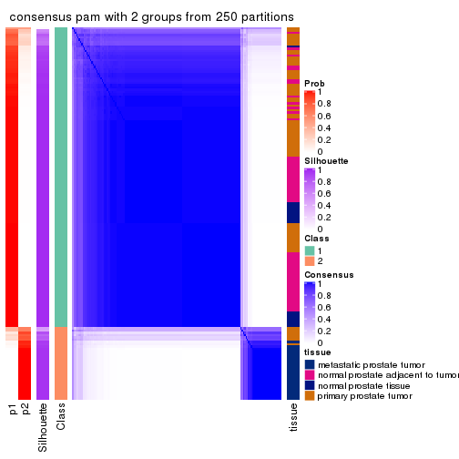</p>

</div>
<div id='tab-MAD-pam-consensus-heatmap-2'>
<pre><code class="r">consensus_heatmap(res, k = 3)
</code></pre>

<p>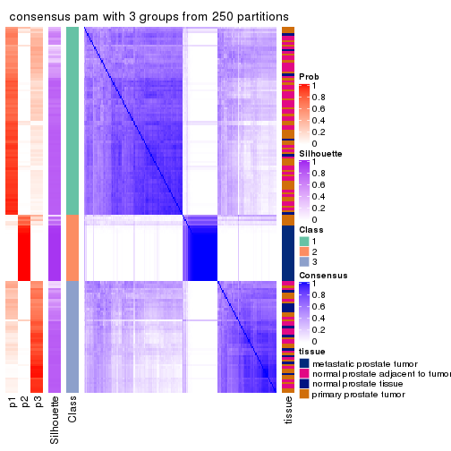</p>

</div>
<div id='tab-MAD-pam-consensus-heatmap-3'>
<pre><code class="r">consensus_heatmap(res, k = 4)
</code></pre>

<p>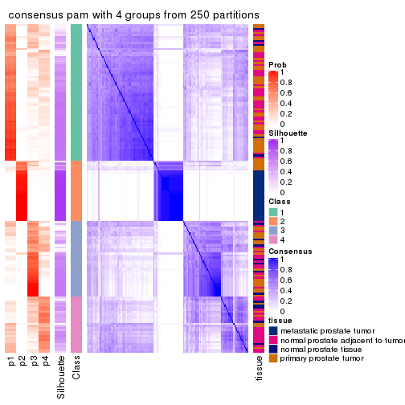</p>

</div>
<div id='tab-MAD-pam-consensus-heatmap-4'>
<pre><code class="r">consensus_heatmap(res, k = 5)
</code></pre>

<p>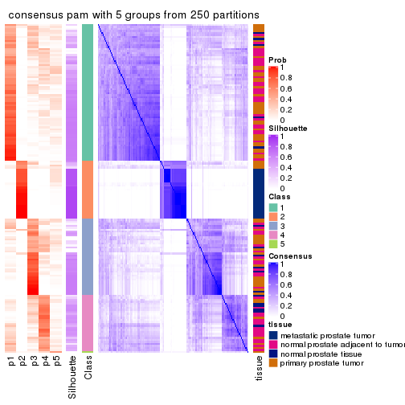</p>

</div>
<div id='tab-MAD-pam-consensus-heatmap-5'>
<pre><code class="r">consensus_heatmap(res, k = 6)
</code></pre>

<p>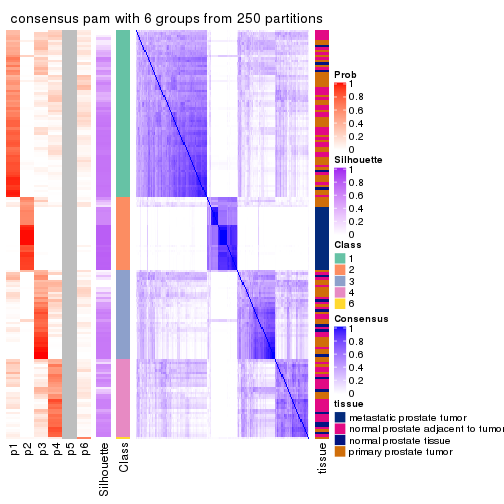</p>

</div>
</div>

Heatmaps for the membership of samples in all partitions to see how consistent they are:


<script>
$( function() {
	$( '#tabs-MAD-pam-membership-heatmap' ).tabs();
} );
</script>
<div id='tabs-MAD-pam-membership-heatmap'>
<ul>
<li><a href='#tab-MAD-pam-membership-heatmap-1'>k = 2</a></li>
<li><a href='#tab-MAD-pam-membership-heatmap-2'>k = 3</a></li>
<li><a href='#tab-MAD-pam-membership-heatmap-3'>k = 4</a></li>
<li><a href='#tab-MAD-pam-membership-heatmap-4'>k = 5</a></li>
<li><a href='#tab-MAD-pam-membership-heatmap-5'>k = 6</a></li>
</ul>
<div id='tab-MAD-pam-membership-heatmap-1'>
<pre><code class="r">membership_heatmap(res, k = 2)
</code></pre>

<p>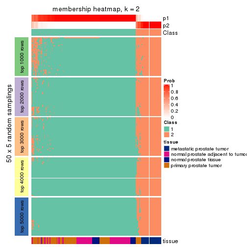</p>

</div>
<div id='tab-MAD-pam-membership-heatmap-2'>
<pre><code class="r">membership_heatmap(res, k = 3)
</code></pre>

<p>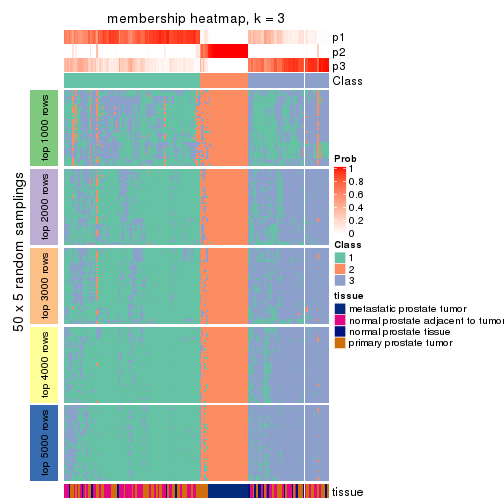</p>

</div>
<div id='tab-MAD-pam-membership-heatmap-3'>
<pre><code class="r">membership_heatmap(res, k = 4)
</code></pre>

<p>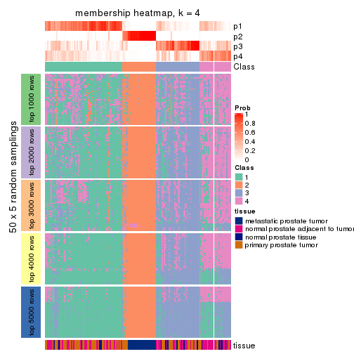</p>

</div>
<div id='tab-MAD-pam-membership-heatmap-4'>
<pre><code class="r">membership_heatmap(res, k = 5)
</code></pre>

<p>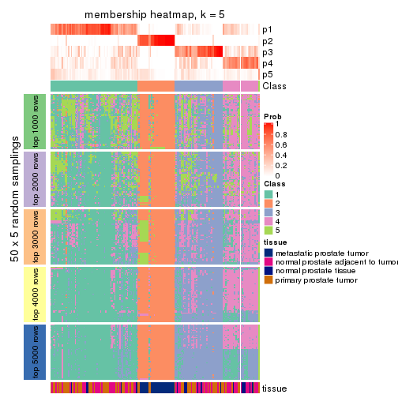</p>

</div>
<div id='tab-MAD-pam-membership-heatmap-5'>
<pre><code class="r">membership_heatmap(res, k = 6)
</code></pre>

<p>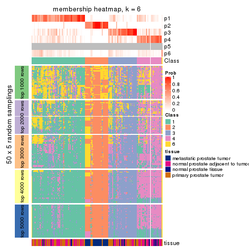</p>

</div>
</div>

As soon as we have had the classes for columns, we can look for signatures
which are significantly different between classes which can be candidate marks
for certain classes. Following are the heatmaps for signatures.


Signature heatmaps where rows are scaled:


<script>
$( function() {
	$( '#tabs-MAD-pam-get-signatures' ).tabs();
} );
</script>
<div id='tabs-MAD-pam-get-signatures'>
<ul>
<li><a href='#tab-MAD-pam-get-signatures-1'>k = 2</a></li>
<li><a href='#tab-MAD-pam-get-signatures-2'>k = 3</a></li>
<li><a href='#tab-MAD-pam-get-signatures-3'>k = 4</a></li>
<li><a href='#tab-MAD-pam-get-signatures-4'>k = 5</a></li>
<li><a href='#tab-MAD-pam-get-signatures-5'>k = 6</a></li>
</ul>
<div id='tab-MAD-pam-get-signatures-1'>
<pre><code class="r">get_signatures(res, k = 2)
</code></pre>

<p>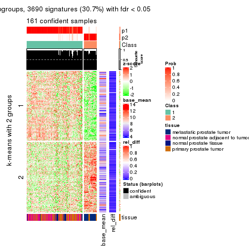</p>

</div>
<div id='tab-MAD-pam-get-signatures-2'>
<pre><code class="r">get_signatures(res, k = 3)
</code></pre>

<p>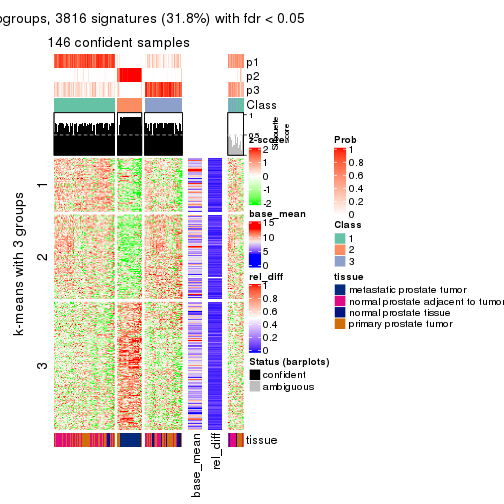</p>

</div>
<div id='tab-MAD-pam-get-signatures-3'>
<pre><code class="r">get_signatures(res, k = 4)
</code></pre>

<p>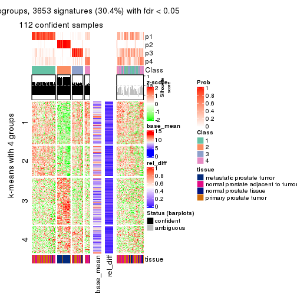</p>

</div>
<div id='tab-MAD-pam-get-signatures-4'>
<pre><code class="r">get_signatures(res, k = 5)
</code></pre>

<p>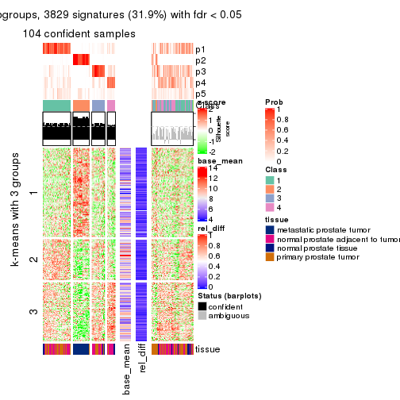</p>

</div>
<div id='tab-MAD-pam-get-signatures-5'>
<pre><code class="r">get_signatures(res, k = 6)
</code></pre>

<p>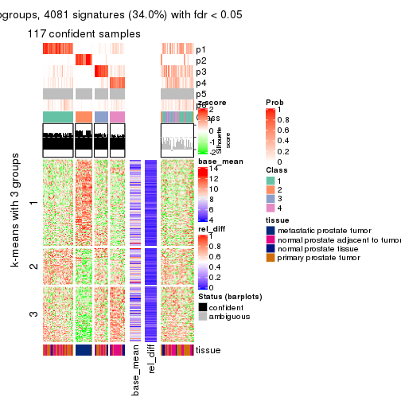</p>

</div>
</div>


Signature heatmaps where rows are not scaled:


<script>
$( function() {
	$( '#tabs-MAD-pam-get-signatures-no-scale' ).tabs();
} );
</script>
<div id='tabs-MAD-pam-get-signatures-no-scale'>
<ul>
<li><a href='#tab-MAD-pam-get-signatures-no-scale-1'>k = 2</a></li>
<li><a href='#tab-MAD-pam-get-signatures-no-scale-2'>k = 3</a></li>
<li><a href='#tab-MAD-pam-get-signatures-no-scale-3'>k = 4</a></li>
<li><a href='#tab-MAD-pam-get-signatures-no-scale-4'>k = 5</a></li>
<li><a href='#tab-MAD-pam-get-signatures-no-scale-5'>k = 6</a></li>
</ul>
<div id='tab-MAD-pam-get-signatures-no-scale-1'>
<pre><code class="r">get_signatures(res, k = 2, scale_rows = FALSE)
</code></pre>

<p>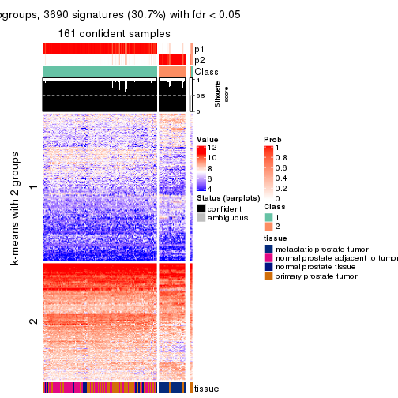</p>

</div>
<div id='tab-MAD-pam-get-signatures-no-scale-2'>
<pre><code class="r">get_signatures(res, k = 3, scale_rows = FALSE)
</code></pre>

<p>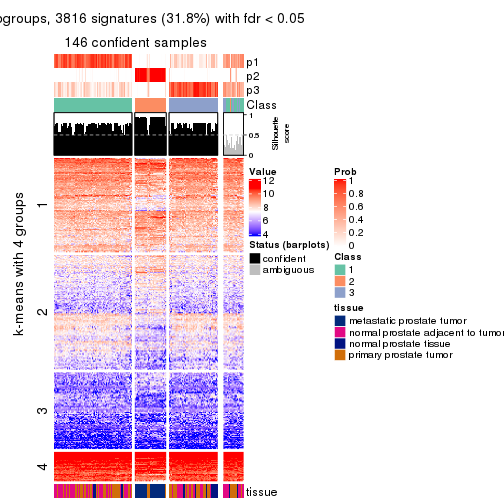</p>

</div>
<div id='tab-MAD-pam-get-signatures-no-scale-3'>
<pre><code class="r">get_signatures(res, k = 4, scale_rows = FALSE)
</code></pre>

<p>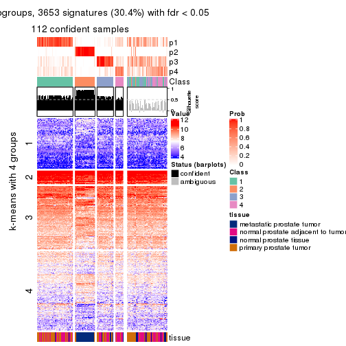</p>

</div>
<div id='tab-MAD-pam-get-signatures-no-scale-4'>
<pre><code class="r">get_signatures(res, k = 5, scale_rows = FALSE)
</code></pre>

<p>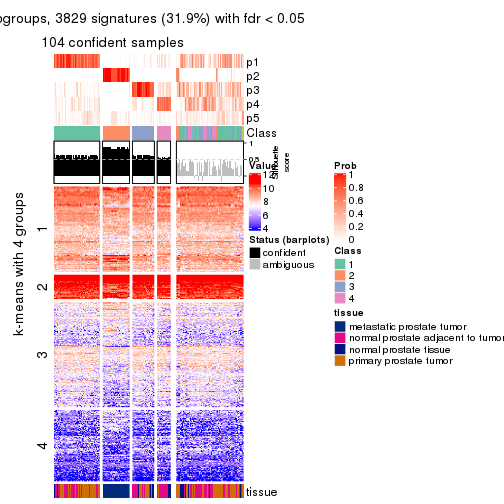</p>

</div>
<div id='tab-MAD-pam-get-signatures-no-scale-5'>
<pre><code class="r">get_signatures(res, k = 6, scale_rows = FALSE)
</code></pre>

<p>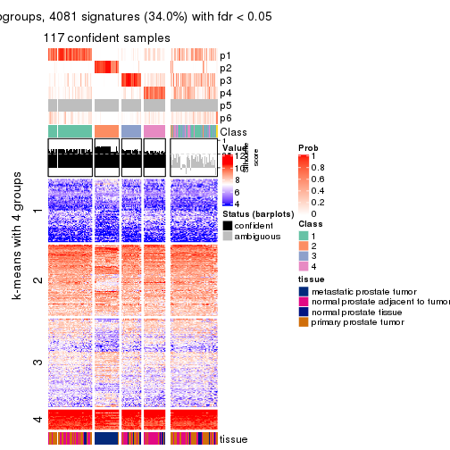</p>

</div>
</div>


Compare the overlap of signatures from different k:

```r
compare_signatures(res)
```

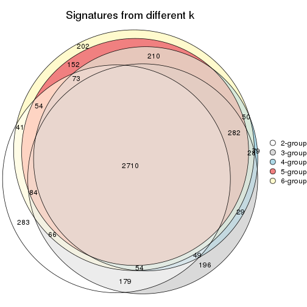

`get_signature()` returns a data frame invisibly. TO get the list of signatures, the function
call should be assigned to a variable explicitly. In following code, if `plot` argument is set
to `FALSE`, no heatmap is plotted while only the differential analysis is performed.

```r
# code only for demonstration
tb = get_signature(res, k = ..., plot = FALSE)
```

An example of the output of `tb` is:

```
#>   which_row         fdr    mean_1    mean_2 scaled_mean_1 scaled_mean_2 km
#> 1        38 0.042760348  8.373488  9.131774    -0.5533452     0.5164555  1
#> 2        40 0.018707592  7.106213  8.469186    -0.6173731     0.5762149  1
#> 3        55 0.019134737 10.221463 11.207825    -0.6159697     0.5749050  1
#> 4        59 0.006059896  5.921854  7.869574    -0.6899429     0.6439467  1
#> 5        60 0.018055526  8.928898 10.211722    -0.6204761     0.5791110  1
#> 6        98 0.009384629 15.714769 14.887706     0.6635654    -0.6193277  2
...
```

The columns in `tb` are:

1. `which_row`: row indices corresponding to the input matrix.
2. `fdr`: FDR for the differential test. 
3. `mean_x`: The mean value in group x.
4. `scaled_mean_x`: The mean value in group x after rows are scaled.
5. `km`: Row groups if k-means clustering is applied to rows.


UMAP plot which shows how samples are separated.


<script>
$( function() {
	$( '#tabs-MAD-pam-dimension-reduction' ).tabs();
} );
</script>
<div id='tabs-MAD-pam-dimension-reduction'>
<ul>
<li><a href='#tab-MAD-pam-dimension-reduction-1'>k = 2</a></li>
<li><a href='#tab-MAD-pam-dimension-reduction-2'>k = 3</a></li>
<li><a href='#tab-MAD-pam-dimension-reduction-3'>k = 4</a></li>
<li><a href='#tab-MAD-pam-dimension-reduction-4'>k = 5</a></li>
<li><a href='#tab-MAD-pam-dimension-reduction-5'>k = 6</a></li>
</ul>
<div id='tab-MAD-pam-dimension-reduction-1'>
<pre><code class="r">dimension_reduction(res, k = 2, method = &quot;UMAP&quot;)
</code></pre>

<p>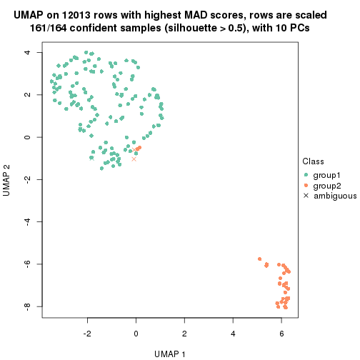</p>

</div>
<div id='tab-MAD-pam-dimension-reduction-2'>
<pre><code class="r">dimension_reduction(res, k = 3, method = &quot;UMAP&quot;)
</code></pre>

<p>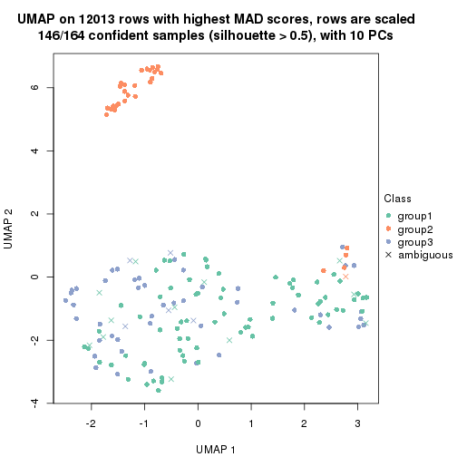</p>

</div>
<div id='tab-MAD-pam-dimension-reduction-3'>
<pre><code class="r">dimension_reduction(res, k = 4, method = &quot;UMAP&quot;)
</code></pre>

<p>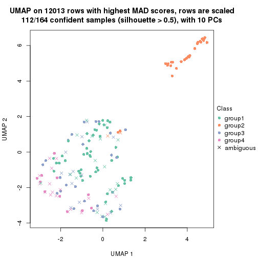</p>

</div>
<div id='tab-MAD-pam-dimension-reduction-4'>
<pre><code class="r">dimension_reduction(res, k = 5, method = &quot;UMAP&quot;)
</code></pre>

<p>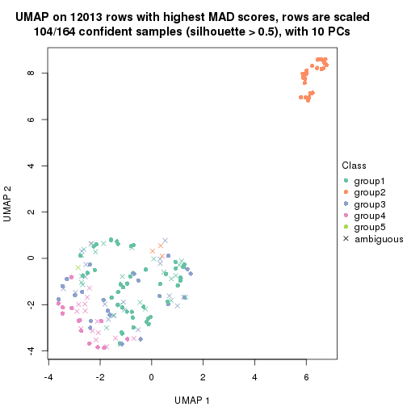</p>

</div>
<div id='tab-MAD-pam-dimension-reduction-5'>
<pre><code class="r">dimension_reduction(res, k = 6, method = &quot;UMAP&quot;)
</code></pre>

<p>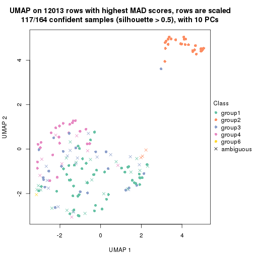</p>

</div>
</div>


Following heatmap shows how subgroups are split when increasing `k`:

```r
collect_classes(res)
```

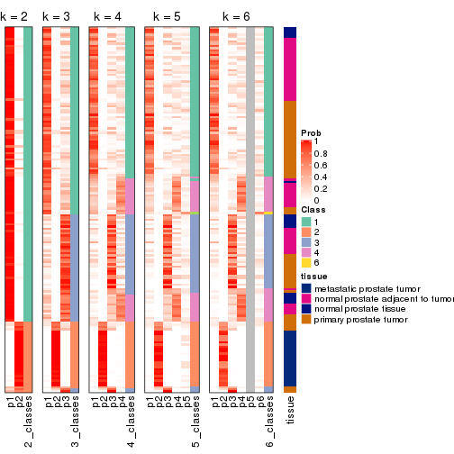


Test correlation between subgroups and known annotations. If the known
annotation is numeric, one-way ANOVA test is applied, and if the known
annotation is discrete, chi-squared contingency table test is applied.

```r
test_to_known_factors(res)
```

```
#>           n tissue(p) k
#> MAD:pam 161  3.77e-28 2
#> MAD:pam 146  9.94e-26 3
#> MAD:pam 112  4.41e-19 4
#> MAD:pam 104  3.14e-20 5
#> MAD:pam 117  1.59e-22 6
```


If matrix rows can be associated to genes, consider to use `functional_enrichment(res,
...)` to perform function enrichment for the signature genes. See [this vignette](http://bioconductor.org/packages/devel/bioc/vignettes/cola/inst/doc/functional_enrichment.html) for more detailed explanations.


 

---------------------------------------------------


### MAD:mclust**


The object with results only for a single top-value method and a single partition method 
can be extracted as:

```r
res = res_list["MAD", "mclust"]
# you can also extract it by
# res = res_list["MAD:mclust"]
```

A summary of `res` and all the functions that can be applied to it:

```r
res
```

```
#> A 'ConsensusPartition' object with k = 2, 3, 4, 5, 6.
#>   On a matrix with 12013 rows and 164 columns.
#>   Top rows (1000, 2000, 3000, 4000, 5000) are extracted by 'MAD' method.
#>   Subgroups are detected by 'mclust' method.
#>   Performed in total 1250 partitions by row resampling.
#>   Best k for subgroups seems to be 2.
#> 
#> Following methods can be applied to this 'ConsensusPartition' object:
#>  [1] "cola_report"             "collect_classes"         "collect_plots"          
#>  [4] "collect_stats"           "colnames"                "compare_signatures"     
#>  [7] "consensus_heatmap"       "dimension_reduction"     "functional_enrichment"  
#> [10] "get_anno_col"            "get_anno"                "get_classes"            
#> [13] "get_consensus"           "get_matrix"              "get_membership"         
#> [16] "get_param"               "get_signatures"          "get_stats"              
#> [19] "is_best_k"               "is_stable_k"             "membership_heatmap"     
#> [22] "ncol"                    "nrow"                    "plot_ecdf"              
#> [25] "rownames"                "select_partition_number" "show"                   
#> [28] "suggest_best_k"          "test_to_known_factors"
```

`collect_plots()` function collects all the plots made from `res` for all `k` (number of partitions)
into one single page to provide an easy and fast comparison between different `k`.

```r
collect_plots(res)
```

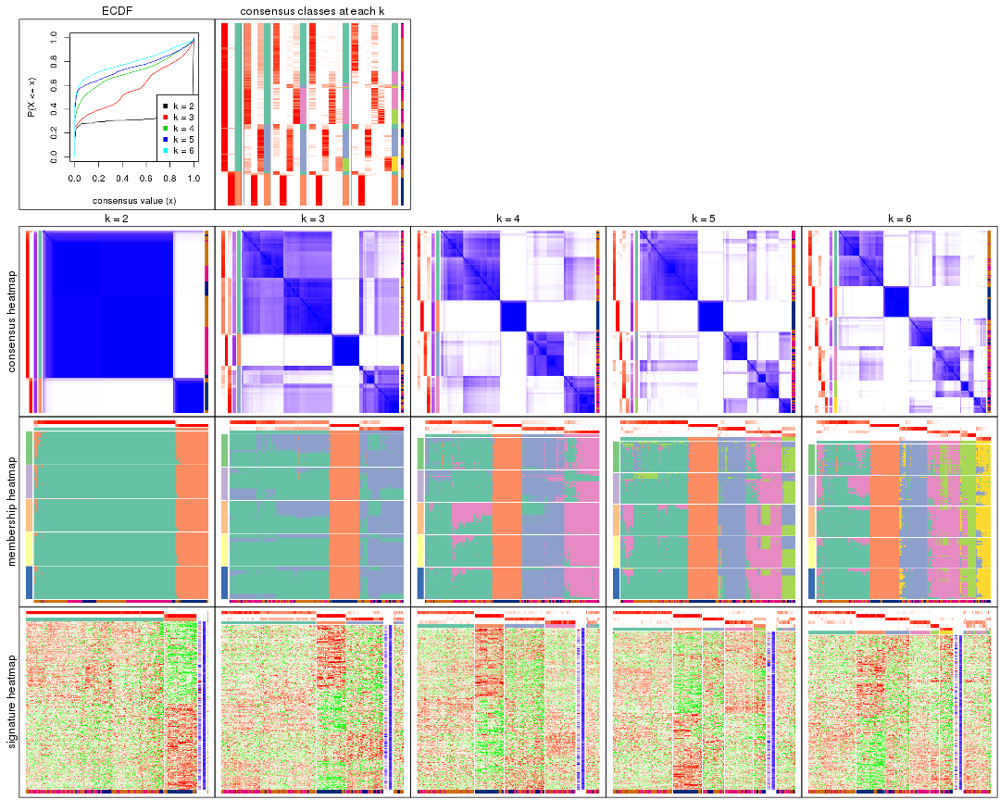

The plots are:

- The first row: a plot of the ECDF (empirical cumulative distribution
  function) curves of the consensus matrix for each `k` and the heatmap of
  predicted classes for each `k`.
- The second row: heatmaps of the consensus matrix for each `k`.
- The third row: heatmaps of the membership matrix for each `k`.
- The fouth row: heatmaps of the signatures for each `k`.

All the plots in panels can be made by individual functions and they are
plotted later in this section.

`select_partition_number()` produces several plots showing different
statistics for choosing "optimized" `k`. There are following statistics:

- ECDF curves of the consensus matrix for each `k`;
- 1-PAC. [The PAC
  score](https://en.wikipedia.org/wiki/Consensus_clustering#Over-interpretation_potential_of_consensus_clustering)
  measures the proportion of the ambiguous subgrouping.
- Mean silhouette score.
- Concordance. The mean probability of fiting the consensus class ids in all
  partitions.
- Area increased. Denote $A_k$ as the area under the ECDF curve for current
  `k`, the area increased is defined as $A_k - A_{k-1}$.
- Rand index. The percent of pairs of samples that are both in a same cluster
  or both are not in a same cluster in the partition of k and k-1.
- Jaccard index. The ratio of pairs of samples are both in a same cluster in
  the partition of k and k-1 and the pairs of samples are both in a same
  cluster in the partition k or k-1.

The detailed explanations of these statistics can be found in [the _cola_
vignette](http://bioconductor.org/packages/devel/bioc/vignettes/cola/inst/doc/cola.html#toc_13).

Generally speaking, lower PAC score, higher mean silhouette score or higher
concordance corresponds to better partition. Rand index and Jaccard index
measure how similar the current partition is compared to partition with `k-1`.
If they are too similar, we won't accept `k` is better than `k-1`.

```r
select_partition_number(res)
```

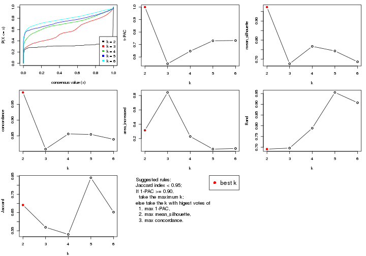

The numeric values for all these statistics can be obtained by `get_stats()`.

```r
get_stats(res)
```

```
#>   k 1-PAC mean_silhouette concordance area_increased  Rand Jaccard
#> 2 2 1.000           0.973       0.988         0.3155 0.692   0.692
#> 3 3 0.546           0.676       0.808         0.8429 0.696   0.569
#> 4 4 0.647           0.767       0.856         0.2293 0.789   0.530
#> 5 5 0.730           0.743       0.855         0.0536 0.955   0.841
#> 6 6 0.732           0.687       0.839         0.0616 0.907   0.652
```

`suggest_best_k()` suggests the best $k$ based on these statistics. The rules are as follows:

- All $k$ with Jaccard index larger than 0.95 are removed because increasing
  $k$ does not provide enough extra information. If all $k$ are removed, it is
  marked as no subgroup is detected.
- For all $k$ with 1-PAC score larger than 0.9, the maximal $k$ is taken as
  the best $k$, and other $k$ are marked as optional $k$.
- If it does not fit the second rule. The $k$ with the maximal vote of the
  highest 1-PAC score, highest mean silhouette, and highest concordance is
  taken as the best $k$.

```r
suggest_best_k(res)
```

```
#> [1] 2
```


Following shows the table of the partitions (You need to click the **show/hide
code output** link to see it). The membership matrix (columns with name `p*`)
is inferred by
[`clue::cl_consensus()`](https://www.rdocumentation.org/link/cl_consensus?package=clue)
function with the `SE` method. Basically the value in the membership matrix
represents the probability to belong to a certain group. The finall class
label for an item is determined with the group with highest probability it
belongs to.

In `get_classes()` function, the entropy is calculated from the membership
matrix and the silhouette score is calculated from the consensus matrix.


<script>
$( function() {
	$( '#tabs-MAD-mclust-get-classes' ).tabs();
} );
</script>
<div id='tabs-MAD-mclust-get-classes'>
<ul>
<li><a href='#tab-MAD-mclust-get-classes-1'>k = 2</a></li>
<li><a href='#tab-MAD-mclust-get-classes-2'>k = 3</a></li>
<li><a href='#tab-MAD-mclust-get-classes-3'>k = 4</a></li>
<li><a href='#tab-MAD-mclust-get-classes-4'>k = 5</a></li>
<li><a href='#tab-MAD-mclust-get-classes-5'>k = 6</a></li>
</ul>

<div id='tab-MAD-mclust-get-classes-1'>
<p><a id='tab-MAD-mclust-get-classes-1-a' style='color:#0366d6' href='#'>show/hide code output</a></p>
<pre><code class="r">cbind(get_classes(res, k = 2), get_membership(res, k = 2))
</code></pre>

<pre><code>#&gt;           class entropy silhouette    p1    p2
#&gt; GSM152839     1  0.0376      0.988 0.996 0.004
#&gt; GSM152840     1  0.0376      0.988 0.996 0.004
#&gt; GSM152841     1  0.0000      0.988 1.000 0.000
#&gt; GSM152842     1  0.0376      0.988 0.996 0.004
#&gt; GSM152843     1  0.0376      0.988 0.996 0.004
#&gt; GSM152844     1  0.0376      0.988 0.996 0.004
#&gt; GSM152845     1  0.3274      0.934 0.940 0.060
#&gt; GSM152846     1  0.0376      0.988 0.996 0.004
#&gt; GSM152847     1  0.0376      0.988 0.996 0.004
#&gt; GSM152848     1  0.0000      0.988 1.000 0.000
#&gt; GSM152849     1  0.0376      0.988 0.996 0.004
#&gt; GSM152850     1  0.0376      0.988 0.996 0.004
#&gt; GSM152851     1  0.0376      0.988 0.996 0.004
#&gt; GSM152852     1  0.0376      0.988 0.996 0.004
#&gt; GSM152853     1  0.0376      0.988 0.996 0.004
#&gt; GSM152854     1  0.0376      0.988 0.996 0.004
#&gt; GSM152855     1  0.0000      0.988 1.000 0.000
#&gt; GSM153238     1  0.1414      0.975 0.980 0.020
#&gt; GSM153239     1  0.0376      0.988 0.996 0.004
#&gt; GSM153240     1  0.0000      0.988 1.000 0.000
#&gt; GSM153241     1  0.0376      0.988 0.996 0.004
#&gt; GSM153242     1  0.0376      0.988 0.996 0.004
#&gt; GSM153243     1  0.0376      0.988 0.996 0.004
#&gt; GSM153244     1  0.0376      0.988 0.996 0.004
#&gt; GSM153245     1  0.0376      0.988 0.996 0.004
#&gt; GSM153246     1  0.0376      0.988 0.996 0.004
#&gt; GSM153247     1  0.0376      0.988 0.996 0.004
#&gt; GSM153248     1  0.0000      0.988 1.000 0.000
#&gt; GSM153249     1  0.0000      0.988 1.000 0.000
#&gt; GSM153250     1  0.0000      0.988 1.000 0.000
#&gt; GSM153251     1  0.0376      0.988 0.996 0.004
#&gt; GSM153252     1  0.0000      0.988 1.000 0.000
#&gt; GSM153253     1  0.0000      0.988 1.000 0.000
#&gt; GSM153254     1  0.0376      0.988 0.996 0.004
#&gt; GSM153255     1  0.0000      0.988 1.000 0.000
#&gt; GSM153256     1  0.0000      0.988 1.000 0.000
#&gt; GSM153257     1  0.0000      0.988 1.000 0.000
#&gt; GSM153258     1  0.0000      0.988 1.000 0.000
#&gt; GSM153259     1  0.0000      0.988 1.000 0.000
#&gt; GSM153260     1  0.0376      0.988 0.996 0.004
#&gt; GSM153261     1  0.0376      0.988 0.996 0.004
#&gt; GSM153262     1  0.0000      0.988 1.000 0.000
#&gt; GSM153263     1  0.0000      0.988 1.000 0.000
#&gt; GSM153264     1  0.0000      0.988 1.000 0.000
#&gt; GSM153265     1  0.0000      0.988 1.000 0.000
#&gt; GSM153266     1  0.0000      0.988 1.000 0.000
#&gt; GSM153267     1  0.0000      0.988 1.000 0.000
#&gt; GSM153268     1  0.0000      0.988 1.000 0.000
#&gt; GSM153269     1  0.0000      0.988 1.000 0.000
#&gt; GSM153270     1  0.0000      0.988 1.000 0.000
#&gt; GSM153271     1  0.0000      0.988 1.000 0.000
#&gt; GSM153272     1  0.0000      0.988 1.000 0.000
#&gt; GSM153273     1  0.0000      0.988 1.000 0.000
#&gt; GSM153274     1  0.0000      0.988 1.000 0.000
#&gt; GSM153275     1  0.0000      0.988 1.000 0.000
#&gt; GSM153276     1  0.0000      0.988 1.000 0.000
#&gt; GSM153277     1  0.0000      0.988 1.000 0.000
#&gt; GSM153278     1  0.0376      0.988 0.996 0.004
#&gt; GSM153279     1  0.0000      0.988 1.000 0.000
#&gt; GSM153280     1  0.0000      0.988 1.000 0.000
#&gt; GSM153281     1  0.0000      0.988 1.000 0.000
#&gt; GSM153282     1  0.0000      0.988 1.000 0.000
#&gt; GSM153283     1  0.0000      0.988 1.000 0.000
#&gt; GSM153284     1  0.0000      0.988 1.000 0.000
#&gt; GSM153285     1  0.0000      0.988 1.000 0.000
#&gt; GSM153286     1  0.0000      0.988 1.000 0.000
#&gt; GSM153287     1  0.0000      0.988 1.000 0.000
#&gt; GSM153288     1  0.0000      0.988 1.000 0.000
#&gt; GSM153289     1  0.0000      0.988 1.000 0.000
#&gt; GSM153290     1  0.0000      0.988 1.000 0.000
#&gt; GSM153291     1  0.0000      0.988 1.000 0.000
#&gt; GSM153292     1  0.0000      0.988 1.000 0.000
#&gt; GSM153293     1  0.0000      0.988 1.000 0.000
#&gt; GSM153294     1  0.0000      0.988 1.000 0.000
#&gt; GSM153295     1  0.0376      0.988 0.996 0.004
#&gt; GSM153054     1  0.0376      0.988 0.996 0.004
#&gt; GSM153055     1  0.0000      0.988 1.000 0.000
#&gt; GSM153056     1  0.0376      0.988 0.996 0.004
#&gt; GSM153057     1  0.0376      0.988 0.996 0.004
#&gt; GSM153058     1  0.0376      0.988 0.996 0.004
#&gt; GSM153059     1  0.0376      0.988 0.996 0.004
#&gt; GSM153060     1  0.0376      0.988 0.996 0.004
#&gt; GSM153061     1  0.0376      0.988 0.996 0.004
#&gt; GSM153062     1  0.0376      0.988 0.996 0.004
#&gt; GSM153063     1  0.0376      0.988 0.996 0.004
#&gt; GSM153064     1  0.0000      0.988 1.000 0.000
#&gt; GSM153065     1  0.0376      0.988 0.996 0.004
#&gt; GSM153066     1  0.9087      0.523 0.676 0.324
#&gt; GSM153067     1  0.0000      0.988 1.000 0.000
#&gt; GSM153068     1  0.0376      0.988 0.996 0.004
#&gt; GSM153069     1  0.0000      0.988 1.000 0.000
#&gt; GSM153070     1  0.0000      0.988 1.000 0.000
#&gt; GSM153071     1  0.0376      0.988 0.996 0.004
#&gt; GSM153072     1  0.0376      0.988 0.996 0.004
#&gt; GSM153073     1  0.0000      0.988 1.000 0.000
#&gt; GSM153074     1  0.0000      0.988 1.000 0.000
#&gt; GSM153075     1  0.0000      0.988 1.000 0.000
#&gt; GSM153076     1  0.0000      0.988 1.000 0.000
#&gt; GSM153077     1  0.0000      0.988 1.000 0.000
#&gt; GSM153078     1  0.0376      0.988 0.996 0.004
#&gt; GSM153079     1  0.0376      0.988 0.996 0.004
#&gt; GSM153080     1  0.0376      0.988 0.996 0.004
#&gt; GSM153081     1  0.0000      0.988 1.000 0.000
#&gt; GSM153082     1  0.7139      0.760 0.804 0.196
#&gt; GSM153083     1  0.2778      0.948 0.952 0.048
#&gt; GSM153084     1  0.9850      0.254 0.572 0.428
#&gt; GSM153085     1  0.0672      0.985 0.992 0.008
#&gt; GSM153086     1  0.0000      0.988 1.000 0.000
#&gt; GSM153087     1  0.0000      0.988 1.000 0.000
#&gt; GSM153088     1  0.0000      0.988 1.000 0.000
#&gt; GSM153089     1  0.0376      0.988 0.996 0.004
#&gt; GSM153090     1  0.0000      0.988 1.000 0.000
#&gt; GSM153091     1  0.3274      0.933 0.940 0.060
#&gt; GSM153092     1  0.0000      0.988 1.000 0.000
#&gt; GSM153093     1  0.0000      0.988 1.000 0.000
#&gt; GSM153094     1  0.4690      0.890 0.900 0.100
#&gt; GSM153095     1  0.0376      0.988 0.996 0.004
#&gt; GSM153096     1  0.0000      0.988 1.000 0.000
#&gt; GSM153097     1  0.2423      0.953 0.960 0.040
#&gt; GSM153098     1  0.0000      0.988 1.000 0.000
#&gt; GSM153099     1  0.0000      0.988 1.000 0.000
#&gt; GSM153100     1  0.0000      0.988 1.000 0.000
#&gt; GSM153101     1  0.0376      0.988 0.996 0.004
#&gt; GSM153102     1  0.0376      0.988 0.996 0.004
#&gt; GSM153103     1  0.0672      0.985 0.992 0.008
#&gt; GSM153104     1  0.0000      0.988 1.000 0.000
#&gt; GSM153106     1  0.0000      0.988 1.000 0.000
#&gt; GSM153107     1  0.0000      0.988 1.000 0.000
#&gt; GSM153108     1  0.0000      0.988 1.000 0.000
#&gt; GSM153109     2  0.8207      0.662 0.256 0.744
#&gt; GSM153110     1  0.0000      0.988 1.000 0.000
#&gt; GSM153111     1  0.2778      0.945 0.952 0.048
#&gt; GSM153112     1  0.0000      0.988 1.000 0.000
#&gt; GSM153113     2  0.6343      0.811 0.160 0.840
#&gt; GSM153114     1  0.0000      0.988 1.000 0.000
#&gt; GSM187532     2  0.1414      0.968 0.020 0.980
#&gt; GSM187533     2  0.0000      0.983 0.000 1.000
#&gt; GSM187534     2  0.0000      0.983 0.000 1.000
#&gt; GSM187535     2  0.2603      0.946 0.044 0.956
#&gt; GSM152906     2  0.0000      0.983 0.000 1.000
#&gt; GSM152907     2  0.0000      0.983 0.000 1.000
#&gt; GSM152908     2  0.0000      0.983 0.000 1.000
#&gt; GSM152909     2  0.0000      0.983 0.000 1.000
#&gt; GSM152910     2  0.0000      0.983 0.000 1.000
#&gt; GSM152911     2  0.0000      0.983 0.000 1.000
#&gt; GSM152912     2  0.0000      0.983 0.000 1.000
#&gt; GSM152913     2  0.0000      0.983 0.000 1.000
#&gt; GSM152914     2  0.0000      0.983 0.000 1.000
#&gt; GSM152915     2  0.0000      0.983 0.000 1.000
#&gt; GSM152916     2  0.0000      0.983 0.000 1.000
#&gt; GSM152917     2  0.0000      0.983 0.000 1.000
#&gt; GSM152918     2  0.0000      0.983 0.000 1.000
#&gt; GSM152919     2  0.0000      0.983 0.000 1.000
#&gt; GSM152920     2  0.0000      0.983 0.000 1.000
#&gt; GSM152921     2  0.0000      0.983 0.000 1.000
#&gt; GSM152922     2  0.0000      0.983 0.000 1.000
#&gt; GSM152923     2  0.0000      0.983 0.000 1.000
#&gt; GSM152924     2  0.0000      0.983 0.000 1.000
#&gt; GSM152925     2  0.0000      0.983 0.000 1.000
#&gt; GSM152926     2  0.0000      0.983 0.000 1.000
#&gt; GSM152927     2  0.0000      0.983 0.000 1.000
#&gt; GSM152928     2  0.1633      0.965 0.024 0.976
#&gt; GSM152929     2  0.0000      0.983 0.000 1.000
#&gt; GSM152930     2  0.0000      0.983 0.000 1.000
</code></pre>

<script>
$('#tab-MAD-mclust-get-classes-1-a').parent().next().next().hide();
$('#tab-MAD-mclust-get-classes-1-a').click(function(){
  $('#tab-MAD-mclust-get-classes-1-a').parent().next().next().toggle();
  return(false);
});
</script>
</div>

<div id='tab-MAD-mclust-get-classes-2'>
<p><a id='tab-MAD-mclust-get-classes-2-a' style='color:#0366d6' href='#'>show/hide code output</a></p>
<pre><code class="r">cbind(get_classes(res, k = 3), get_membership(res, k = 3))
</code></pre>

<pre><code>#&gt;           class entropy silhouette    p1    p2    p3
#&gt; GSM152839     3  0.5497     0.1393 0.292 0.000 0.708
#&gt; GSM152840     3  0.6095     0.5283 0.392 0.000 0.608
#&gt; GSM152841     1  0.1529     0.6107 0.960 0.000 0.040
#&gt; GSM152842     3  0.0237     0.7292 0.004 0.000 0.996
#&gt; GSM152843     3  0.0892     0.7241 0.020 0.000 0.980
#&gt; GSM152844     3  0.5988     0.5445 0.368 0.000 0.632
#&gt; GSM152845     3  0.3784     0.6865 0.132 0.004 0.864
#&gt; GSM152846     3  0.5948     0.5480 0.360 0.000 0.640
#&gt; GSM152847     3  0.0592     0.7278 0.012 0.000 0.988
#&gt; GSM152848     1  0.6215     0.6854 0.572 0.000 0.428
#&gt; GSM152849     3  0.0000     0.7287 0.000 0.000 1.000
#&gt; GSM152850     3  0.1163     0.7187 0.028 0.000 0.972
#&gt; GSM152851     1  0.5706     0.0407 0.680 0.000 0.320
#&gt; GSM152852     3  0.5988     0.5449 0.368 0.000 0.632
#&gt; GSM152853     3  0.5988     0.5445 0.368 0.000 0.632
#&gt; GSM152854     3  0.2165     0.7206 0.064 0.000 0.936
#&gt; GSM152855     1  0.3686     0.6971 0.860 0.000 0.140
#&gt; GSM153238     3  0.0000     0.7287 0.000 0.000 1.000
#&gt; GSM153239     3  0.5988     0.5445 0.368 0.000 0.632
#&gt; GSM153240     1  0.1163     0.6296 0.972 0.000 0.028
#&gt; GSM153241     3  0.0237     0.7292 0.004 0.000 0.996
#&gt; GSM153242     3  0.5859     0.5591 0.344 0.000 0.656
#&gt; GSM153243     3  0.0000     0.7287 0.000 0.000 1.000
#&gt; GSM153244     1  0.3412     0.5696 0.876 0.000 0.124
#&gt; GSM153245     3  0.5988     0.5445 0.368 0.000 0.632
#&gt; GSM153246     3  0.1289     0.7284 0.032 0.000 0.968
#&gt; GSM153247     3  0.1411     0.7254 0.036 0.000 0.964
#&gt; GSM153248     1  0.6079     0.7156 0.612 0.000 0.388
#&gt; GSM153249     1  0.0592     0.6262 0.988 0.000 0.012
#&gt; GSM153250     1  0.5968     0.7225 0.636 0.000 0.364
#&gt; GSM153251     3  0.4796     0.6398 0.220 0.000 0.780
#&gt; GSM153252     1  0.1753     0.6538 0.952 0.000 0.048
#&gt; GSM153253     1  0.1753     0.6048 0.952 0.000 0.048
#&gt; GSM153254     1  0.6095     0.4718 0.608 0.000 0.392
#&gt; GSM153255     1  0.0747     0.6296 0.984 0.000 0.016
#&gt; GSM153256     1  0.4931     0.7204 0.768 0.000 0.232
#&gt; GSM153257     1  0.2066     0.6616 0.940 0.000 0.060
#&gt; GSM153258     1  0.5988     0.7214 0.632 0.000 0.368
#&gt; GSM153259     1  0.5988     0.7212 0.632 0.000 0.368
#&gt; GSM153260     3  0.0237     0.7276 0.004 0.000 0.996
#&gt; GSM153261     3  0.0000     0.7287 0.000 0.000 1.000
#&gt; GSM153262     1  0.1529     0.6420 0.960 0.000 0.040
#&gt; GSM153263     1  0.5968     0.7225 0.636 0.000 0.364
#&gt; GSM153264     1  0.6062     0.7193 0.616 0.000 0.384
#&gt; GSM153265     1  0.1411     0.6132 0.964 0.000 0.036
#&gt; GSM153266     1  0.6008     0.7233 0.628 0.000 0.372
#&gt; GSM153267     1  0.5905     0.7265 0.648 0.000 0.352
#&gt; GSM153268     1  0.2448     0.5802 0.924 0.000 0.076
#&gt; GSM153269     1  0.5760     0.7297 0.672 0.000 0.328
#&gt; GSM153270     1  0.4750     0.7137 0.784 0.000 0.216
#&gt; GSM153271     1  0.5968     0.7225 0.636 0.000 0.364
#&gt; GSM153272     1  0.0892     0.6329 0.980 0.000 0.020
#&gt; GSM153273     1  0.6045     0.7181 0.620 0.000 0.380
#&gt; GSM153274     1  0.5810     0.7303 0.664 0.000 0.336
#&gt; GSM153275     1  0.4178     0.7061 0.828 0.000 0.172
#&gt; GSM153276     1  0.5178     0.7237 0.744 0.000 0.256
#&gt; GSM153277     1  0.1031     0.6210 0.976 0.000 0.024
#&gt; GSM153278     3  0.1753     0.6918 0.048 0.000 0.952
#&gt; GSM153279     1  0.2959     0.5665 0.900 0.000 0.100
#&gt; GSM153280     1  0.1964     0.5996 0.944 0.000 0.056
#&gt; GSM153281     1  0.1411     0.6132 0.964 0.000 0.036
#&gt; GSM153282     1  0.2066     0.5958 0.940 0.000 0.060
#&gt; GSM153283     1  0.5968     0.7225 0.636 0.000 0.364
#&gt; GSM153284     1  0.3192     0.6866 0.888 0.000 0.112
#&gt; GSM153285     1  0.1529     0.6107 0.960 0.000 0.040
#&gt; GSM153286     1  0.2796     0.6812 0.908 0.000 0.092
#&gt; GSM153287     1  0.0592     0.6262 0.988 0.000 0.012
#&gt; GSM153288     1  0.2625     0.6773 0.916 0.000 0.084
#&gt; GSM153289     1  0.5291     0.7259 0.732 0.000 0.268
#&gt; GSM153290     1  0.2356     0.5872 0.928 0.000 0.072
#&gt; GSM153291     1  0.0892     0.6346 0.980 0.000 0.020
#&gt; GSM153292     1  0.1031     0.6203 0.976 0.000 0.024
#&gt; GSM153293     1  0.4121     0.7070 0.832 0.000 0.168
#&gt; GSM153294     1  0.6079     0.7174 0.612 0.000 0.388
#&gt; GSM153295     1  0.5733     0.7282 0.676 0.000 0.324
#&gt; GSM153054     3  0.6307    -0.5596 0.488 0.000 0.512
#&gt; GSM153055     1  0.5968     0.7264 0.636 0.000 0.364
#&gt; GSM153056     3  0.1163     0.7186 0.028 0.000 0.972
#&gt; GSM153057     3  0.4931     0.3520 0.232 0.000 0.768
#&gt; GSM153058     3  0.0592     0.7300 0.012 0.000 0.988
#&gt; GSM153059     3  0.3752     0.5434 0.144 0.000 0.856
#&gt; GSM153060     3  0.2537     0.7128 0.080 0.000 0.920
#&gt; GSM153061     3  0.0000     0.7287 0.000 0.000 1.000
#&gt; GSM153062     3  0.1860     0.7241 0.052 0.000 0.948
#&gt; GSM153063     3  0.5327     0.6071 0.272 0.000 0.728
#&gt; GSM153064     1  0.6026     0.7201 0.624 0.000 0.376
#&gt; GSM153065     3  0.0000     0.7287 0.000 0.000 1.000
#&gt; GSM153066     3  0.6348     0.3438 0.212 0.048 0.740
#&gt; GSM153067     1  0.0747     0.6296 0.984 0.000 0.016
#&gt; GSM153068     3  0.0000     0.7287 0.000 0.000 1.000
#&gt; GSM153069     1  0.0747     0.6244 0.984 0.000 0.016
#&gt; GSM153070     1  0.6045     0.7217 0.620 0.000 0.380
#&gt; GSM153071     3  0.6267    -0.4756 0.452 0.000 0.548
#&gt; GSM153072     1  0.6291     0.6294 0.532 0.000 0.468
#&gt; GSM153073     1  0.6026     0.7179 0.624 0.000 0.376
#&gt; GSM153074     1  0.2796     0.6806 0.908 0.000 0.092
#&gt; GSM153075     1  0.1964     0.6381 0.944 0.000 0.056
#&gt; GSM153076     1  0.5968     0.7225 0.636 0.000 0.364
#&gt; GSM153077     1  0.6079     0.7156 0.612 0.000 0.388
#&gt; GSM153078     3  0.6286    -0.5059 0.464 0.000 0.536
#&gt; GSM153079     1  0.6154     0.7016 0.592 0.000 0.408
#&gt; GSM153080     3  0.3267     0.6829 0.116 0.000 0.884
#&gt; GSM153081     1  0.6062     0.7193 0.616 0.000 0.384
#&gt; GSM153082     1  0.6848     0.6832 0.568 0.016 0.416
#&gt; GSM153083     1  0.6192     0.6900 0.580 0.000 0.420
#&gt; GSM153084     3  0.7657    -0.4965 0.448 0.044 0.508
#&gt; GSM153085     1  0.6252     0.6629 0.556 0.000 0.444
#&gt; GSM153086     1  0.6215     0.6833 0.572 0.000 0.428
#&gt; GSM153087     1  0.2959     0.6751 0.900 0.000 0.100
#&gt; GSM153088     1  0.5988     0.7231 0.632 0.000 0.368
#&gt; GSM153089     3  0.4605     0.6531 0.204 0.000 0.796
#&gt; GSM153090     1  0.5968     0.7225 0.636 0.000 0.364
#&gt; GSM153091     1  0.6140     0.7053 0.596 0.000 0.404
#&gt; GSM153092     1  0.6095     0.7128 0.608 0.000 0.392
#&gt; GSM153093     1  0.2261     0.6688 0.932 0.000 0.068
#&gt; GSM153094     1  0.6192     0.6900 0.580 0.000 0.420
#&gt; GSM153095     1  0.6215     0.6743 0.572 0.000 0.428
#&gt; GSM153096     1  0.6062     0.7183 0.616 0.000 0.384
#&gt; GSM153097     1  0.6154     0.7021 0.592 0.000 0.408
#&gt; GSM153098     1  0.5968     0.7274 0.636 0.000 0.364
#&gt; GSM153099     1  0.5835     0.7289 0.660 0.000 0.340
#&gt; GSM153100     1  0.6026     0.7227 0.624 0.000 0.376
#&gt; GSM153101     1  0.6295     0.6249 0.528 0.000 0.472
#&gt; GSM153102     1  0.6215     0.6830 0.572 0.000 0.428
#&gt; GSM153103     1  0.6244     0.6674 0.560 0.000 0.440
#&gt; GSM153104     1  0.1529     0.6116 0.960 0.000 0.040
#&gt; GSM153106     1  0.5706     0.7296 0.680 0.000 0.320
#&gt; GSM153107     1  0.6008     0.7198 0.628 0.000 0.372
#&gt; GSM153108     1  0.3879     0.6943 0.848 0.000 0.152
#&gt; GSM153109     1  0.7542     0.6392 0.528 0.040 0.432
#&gt; GSM153110     1  0.6079     0.7156 0.612 0.000 0.388
#&gt; GSM153111     1  0.6154     0.7024 0.592 0.000 0.408
#&gt; GSM153112     1  0.6079     0.7174 0.612 0.000 0.388
#&gt; GSM153113     1  0.9263     0.5172 0.476 0.164 0.360
#&gt; GSM153114     1  0.3192     0.6873 0.888 0.000 0.112
#&gt; GSM187532     2  0.2537     0.8886 0.000 0.920 0.080
#&gt; GSM187533     2  0.0000     0.9661 0.000 1.000 0.000
#&gt; GSM187534     2  0.0000     0.9661 0.000 1.000 0.000
#&gt; GSM187535     2  0.9878    -0.2518 0.264 0.396 0.340
#&gt; GSM152906     2  0.0000     0.9661 0.000 1.000 0.000
#&gt; GSM152907     2  0.0000     0.9661 0.000 1.000 0.000
#&gt; GSM152908     2  0.0000     0.9661 0.000 1.000 0.000
#&gt; GSM152909     2  0.0000     0.9661 0.000 1.000 0.000
#&gt; GSM152910     2  0.0000     0.9661 0.000 1.000 0.000
#&gt; GSM152911     2  0.0000     0.9661 0.000 1.000 0.000
#&gt; GSM152912     2  0.0000     0.9661 0.000 1.000 0.000
#&gt; GSM152913     2  0.0000     0.9661 0.000 1.000 0.000
#&gt; GSM152914     2  0.0000     0.9661 0.000 1.000 0.000
#&gt; GSM152915     2  0.0000     0.9661 0.000 1.000 0.000
#&gt; GSM152916     2  0.0000     0.9661 0.000 1.000 0.000
#&gt; GSM152917     2  0.0000     0.9661 0.000 1.000 0.000
#&gt; GSM152918     2  0.0000     0.9661 0.000 1.000 0.000
#&gt; GSM152919     2  0.0000     0.9661 0.000 1.000 0.000
#&gt; GSM152920     2  0.0000     0.9661 0.000 1.000 0.000
#&gt; GSM152921     2  0.0000     0.9661 0.000 1.000 0.000
#&gt; GSM152922     2  0.0000     0.9661 0.000 1.000 0.000
#&gt; GSM152923     2  0.0000     0.9661 0.000 1.000 0.000
#&gt; GSM152924     2  0.0000     0.9661 0.000 1.000 0.000
#&gt; GSM152925     2  0.0000     0.9661 0.000 1.000 0.000
#&gt; GSM152926     2  0.0000     0.9661 0.000 1.000 0.000
#&gt; GSM152927     2  0.0000     0.9661 0.000 1.000 0.000
#&gt; GSM152928     2  0.3377     0.8417 0.012 0.896 0.092
#&gt; GSM152929     2  0.0000     0.9661 0.000 1.000 0.000
#&gt; GSM152930     2  0.0000     0.9661 0.000 1.000 0.000
</code></pre>

<script>
$('#tab-MAD-mclust-get-classes-2-a').parent().next().next().hide();
$('#tab-MAD-mclust-get-classes-2-a').click(function(){
  $('#tab-MAD-mclust-get-classes-2-a').parent().next().next().toggle();
  return(false);
});
</script>
</div>

<div id='tab-MAD-mclust-get-classes-3'>
<p><a id='tab-MAD-mclust-get-classes-3-a' style='color:#0366d6' href='#'>show/hide code output</a></p>
<pre><code class="r">cbind(get_classes(res, k = 4), get_membership(res, k = 4))
</code></pre>

<pre><code>#&gt;           class entropy silhouette    p1    p2    p3    p4
#&gt; GSM152839     1  0.5483    -0.0970 0.536 0.000 0.448 0.016
#&gt; GSM152840     3  0.4193     0.6696 0.000 0.000 0.732 0.268
#&gt; GSM152841     4  0.0000     0.8196 0.000 0.000 0.000 1.000
#&gt; GSM152842     3  0.2973     0.8924 0.144 0.000 0.856 0.000
#&gt; GSM152843     3  0.3444     0.8801 0.184 0.000 0.816 0.000
#&gt; GSM152844     3  0.2469     0.8293 0.000 0.000 0.892 0.108
#&gt; GSM152845     3  0.1284     0.8696 0.012 0.000 0.964 0.024
#&gt; GSM152846     3  0.1557     0.8579 0.000 0.000 0.944 0.056
#&gt; GSM152847     3  0.3444     0.8814 0.184 0.000 0.816 0.000
#&gt; GSM152848     1  0.3691     0.7513 0.856 0.000 0.068 0.076
#&gt; GSM152849     3  0.2973     0.8924 0.144 0.000 0.856 0.000
#&gt; GSM152850     3  0.3801     0.8533 0.220 0.000 0.780 0.000
#&gt; GSM152851     3  0.3400     0.7813 0.000 0.000 0.820 0.180
#&gt; GSM152852     3  0.2408     0.8322 0.000 0.000 0.896 0.104
#&gt; GSM152853     3  0.2704     0.8197 0.000 0.000 0.876 0.124
#&gt; GSM152854     3  0.1297     0.8732 0.020 0.000 0.964 0.016
#&gt; GSM152855     4  0.5159     0.4574 0.364 0.000 0.012 0.624
#&gt; GSM153238     3  0.3123     0.8909 0.156 0.000 0.844 0.000
#&gt; GSM153239     3  0.2469     0.8312 0.000 0.000 0.892 0.108
#&gt; GSM153240     4  0.1716     0.8228 0.064 0.000 0.000 0.936
#&gt; GSM153241     3  0.3356     0.8859 0.176 0.000 0.824 0.000
#&gt; GSM153242     3  0.1356     0.8664 0.008 0.000 0.960 0.032
#&gt; GSM153243     3  0.3123     0.8909 0.156 0.000 0.844 0.000
#&gt; GSM153244     3  0.5943     0.4433 0.048 0.000 0.592 0.360
#&gt; GSM153245     3  0.2868     0.8117 0.000 0.000 0.864 0.136
#&gt; GSM153246     3  0.2973     0.8924 0.144 0.000 0.856 0.000
#&gt; GSM153247     3  0.3494     0.8896 0.172 0.000 0.824 0.004
#&gt; GSM153248     1  0.3486     0.7712 0.864 0.000 0.044 0.092
#&gt; GSM153249     4  0.0817     0.8292 0.024 0.000 0.000 0.976
#&gt; GSM153250     1  0.3870     0.7346 0.788 0.000 0.004 0.208
#&gt; GSM153251     3  0.1388     0.8684 0.012 0.000 0.960 0.028
#&gt; GSM153252     4  0.4917     0.4995 0.336 0.000 0.008 0.656
#&gt; GSM153253     4  0.0000     0.8196 0.000 0.000 0.000 1.000
#&gt; GSM153254     3  0.3435     0.8555 0.100 0.000 0.864 0.036
#&gt; GSM153255     4  0.0921     0.8297 0.028 0.000 0.000 0.972
#&gt; GSM153256     1  0.5075     0.5304 0.644 0.000 0.012 0.344
#&gt; GSM153257     4  0.4222     0.6400 0.272 0.000 0.000 0.728
#&gt; GSM153258     1  0.2921     0.7709 0.860 0.000 0.000 0.140
#&gt; GSM153259     1  0.3545     0.7679 0.828 0.000 0.008 0.164
#&gt; GSM153260     3  0.3444     0.8819 0.184 0.000 0.816 0.000
#&gt; GSM153261     3  0.3219     0.8902 0.164 0.000 0.836 0.000
#&gt; GSM153262     4  0.3498     0.7630 0.160 0.000 0.008 0.832
#&gt; GSM153263     1  0.3688     0.7375 0.792 0.000 0.000 0.208
#&gt; GSM153264     1  0.4206     0.7768 0.816 0.000 0.048 0.136
#&gt; GSM153265     4  0.0469     0.8250 0.012 0.000 0.000 0.988
#&gt; GSM153266     1  0.3768     0.7584 0.808 0.000 0.008 0.184
#&gt; GSM153267     1  0.4485     0.6901 0.740 0.000 0.012 0.248
#&gt; GSM153268     4  0.1389     0.7892 0.000 0.000 0.048 0.952
#&gt; GSM153269     1  0.4647     0.6361 0.704 0.000 0.008 0.288
#&gt; GSM153270     1  0.5244     0.2807 0.556 0.000 0.008 0.436
#&gt; GSM153271     1  0.4353     0.7073 0.756 0.000 0.012 0.232
#&gt; GSM153272     4  0.2530     0.7992 0.112 0.000 0.000 0.888
#&gt; GSM153273     1  0.2999     0.7734 0.864 0.000 0.004 0.132
#&gt; GSM153274     1  0.4372     0.6702 0.728 0.000 0.004 0.268
#&gt; GSM153275     4  0.5407    -0.0100 0.484 0.000 0.012 0.504
#&gt; GSM153276     1  0.4936     0.4726 0.624 0.000 0.004 0.372
#&gt; GSM153277     4  0.1302     0.8284 0.044 0.000 0.000 0.956
#&gt; GSM153278     3  0.4277     0.7732 0.280 0.000 0.720 0.000
#&gt; GSM153279     4  0.3271     0.7317 0.012 0.000 0.132 0.856
#&gt; GSM153280     4  0.0000     0.8196 0.000 0.000 0.000 1.000
#&gt; GSM153281     4  0.0921     0.8297 0.028 0.000 0.000 0.972
#&gt; GSM153282     4  0.0000     0.8196 0.000 0.000 0.000 1.000
#&gt; GSM153283     1  0.3852     0.7497 0.800 0.000 0.008 0.192
#&gt; GSM153284     4  0.4761     0.5385 0.332 0.000 0.004 0.664
#&gt; GSM153285     4  0.0000     0.8196 0.000 0.000 0.000 1.000
#&gt; GSM153286     4  0.5402     0.0403 0.472 0.000 0.012 0.516
#&gt; GSM153287     4  0.0921     0.8297 0.028 0.000 0.000 0.972
#&gt; GSM153288     1  0.5407     0.0817 0.504 0.000 0.012 0.484
#&gt; GSM153289     1  0.4795     0.6279 0.696 0.000 0.012 0.292
#&gt; GSM153290     4  0.0000     0.8196 0.000 0.000 0.000 1.000
#&gt; GSM153291     4  0.1211     0.8290 0.040 0.000 0.000 0.960
#&gt; GSM153292     4  0.0592     0.8271 0.016 0.000 0.000 0.984
#&gt; GSM153293     1  0.5268     0.4160 0.592 0.000 0.012 0.396
#&gt; GSM153294     1  0.3597     0.7759 0.836 0.000 0.016 0.148
#&gt; GSM153295     1  0.5972     0.6465 0.640 0.000 0.068 0.292
#&gt; GSM153054     1  0.3257     0.6551 0.844 0.000 0.152 0.004
#&gt; GSM153055     1  0.3945     0.7350 0.780 0.000 0.004 0.216
#&gt; GSM153056     3  0.3444     0.8806 0.184 0.000 0.816 0.000
#&gt; GSM153057     3  0.4122     0.8358 0.236 0.000 0.760 0.004
#&gt; GSM153058     3  0.2412     0.8900 0.084 0.000 0.908 0.008
#&gt; GSM153059     3  0.3626     0.8840 0.184 0.000 0.812 0.004
#&gt; GSM153060     3  0.2814     0.8932 0.132 0.000 0.868 0.000
#&gt; GSM153061     3  0.2973     0.8924 0.144 0.000 0.856 0.000
#&gt; GSM153062     3  0.1356     0.8789 0.032 0.000 0.960 0.008
#&gt; GSM153063     3  0.1388     0.8682 0.012 0.000 0.960 0.028
#&gt; GSM153064     1  0.3400     0.7585 0.820 0.000 0.000 0.180
#&gt; GSM153065     3  0.2973     0.8924 0.144 0.000 0.856 0.000
#&gt; GSM153066     3  0.3539     0.8857 0.176 0.004 0.820 0.000
#&gt; GSM153067     4  0.2053     0.8181 0.072 0.000 0.004 0.924
#&gt; GSM153068     3  0.2973     0.8924 0.144 0.000 0.856 0.000
#&gt; GSM153069     4  0.0921     0.8297 0.028 0.000 0.000 0.972
#&gt; GSM153070     1  0.3969     0.7636 0.804 0.000 0.016 0.180
#&gt; GSM153071     1  0.4500     0.3311 0.684 0.000 0.316 0.000
#&gt; GSM153072     1  0.2589     0.6871 0.884 0.000 0.116 0.000
#&gt; GSM153073     1  0.2999     0.7734 0.864 0.000 0.004 0.132
#&gt; GSM153074     4  0.4891     0.5788 0.308 0.000 0.012 0.680
#&gt; GSM153075     4  0.3731     0.7697 0.120 0.000 0.036 0.844
#&gt; GSM153076     1  0.4049     0.7285 0.780 0.000 0.008 0.212
#&gt; GSM153077     1  0.4070     0.7768 0.824 0.000 0.044 0.132
#&gt; GSM153078     1  0.3831     0.5873 0.792 0.000 0.204 0.004
#&gt; GSM153079     1  0.2300     0.7477 0.924 0.000 0.048 0.028
#&gt; GSM153080     3  0.3441     0.8809 0.120 0.000 0.856 0.024
#&gt; GSM153081     1  0.4123     0.7770 0.820 0.000 0.044 0.136
#&gt; GSM153082     1  0.1576     0.7307 0.948 0.004 0.048 0.000
#&gt; GSM153083     1  0.1722     0.7368 0.944 0.000 0.048 0.008
#&gt; GSM153084     1  0.5444    -0.1052 0.560 0.016 0.424 0.000
#&gt; GSM153085     1  0.2011     0.7142 0.920 0.000 0.080 0.000
#&gt; GSM153086     1  0.3617     0.7632 0.860 0.000 0.064 0.076
#&gt; GSM153087     4  0.5085     0.5436 0.304 0.000 0.020 0.676
#&gt; GSM153088     1  0.3751     0.7490 0.800 0.000 0.004 0.196
#&gt; GSM153089     3  0.1388     0.8684 0.012 0.000 0.960 0.028
#&gt; GSM153090     1  0.3945     0.7344 0.780 0.000 0.004 0.216
#&gt; GSM153091     1  0.2111     0.7472 0.932 0.000 0.044 0.024
#&gt; GSM153092     1  0.3856     0.7783 0.832 0.000 0.032 0.136
#&gt; GSM153093     4  0.4663     0.6366 0.272 0.000 0.012 0.716
#&gt; GSM153094     1  0.1302     0.7333 0.956 0.000 0.044 0.000
#&gt; GSM153095     1  0.2988     0.6923 0.876 0.000 0.112 0.012
#&gt; GSM153096     1  0.3032     0.7769 0.868 0.000 0.008 0.124
#&gt; GSM153097     1  0.1975     0.7414 0.936 0.000 0.048 0.016
#&gt; GSM153098     1  0.3852     0.7577 0.800 0.000 0.008 0.192
#&gt; GSM153099     1  0.4746     0.6162 0.688 0.000 0.008 0.304
#&gt; GSM153100     1  0.3123     0.7655 0.844 0.000 0.000 0.156
#&gt; GSM153101     1  0.2011     0.7155 0.920 0.000 0.080 0.000
#&gt; GSM153102     1  0.3464     0.7066 0.860 0.000 0.108 0.032
#&gt; GSM153103     1  0.1867     0.7195 0.928 0.000 0.072 0.000
#&gt; GSM153104     4  0.0817     0.8293 0.024 0.000 0.000 0.976
#&gt; GSM153106     1  0.3768     0.7626 0.808 0.000 0.008 0.184
#&gt; GSM153107     1  0.2704     0.7738 0.876 0.000 0.000 0.124
#&gt; GSM153108     1  0.5906     0.3380 0.528 0.000 0.036 0.436
#&gt; GSM153109     1  0.1978     0.7224 0.928 0.004 0.068 0.000
#&gt; GSM153110     1  0.3205     0.7767 0.872 0.000 0.024 0.104
#&gt; GSM153111     1  0.3081     0.7623 0.888 0.000 0.048 0.064
#&gt; GSM153112     1  0.3913     0.7769 0.824 0.000 0.028 0.148
#&gt; GSM153113     1  0.3697     0.6685 0.852 0.100 0.048 0.000
#&gt; GSM153114     4  0.4914     0.5724 0.312 0.000 0.012 0.676
#&gt; GSM187532     2  0.4883     0.5321 0.016 0.696 0.288 0.000
#&gt; GSM187533     2  0.0000     0.9835 0.000 1.000 0.000 0.000
#&gt; GSM187534     2  0.0000     0.9835 0.000 1.000 0.000 0.000
#&gt; GSM187535     1  0.4356     0.6330 0.812 0.140 0.044 0.004
#&gt; GSM152906     2  0.0000     0.9835 0.000 1.000 0.000 0.000
#&gt; GSM152907     2  0.0000     0.9835 0.000 1.000 0.000 0.000
#&gt; GSM152908     2  0.0000     0.9835 0.000 1.000 0.000 0.000
#&gt; GSM152909     2  0.0336     0.9757 0.000 0.992 0.008 0.000
#&gt; GSM152910     2  0.0000     0.9835 0.000 1.000 0.000 0.000
#&gt; GSM152911     2  0.0000     0.9835 0.000 1.000 0.000 0.000
#&gt; GSM152912     2  0.0000     0.9835 0.000 1.000 0.000 0.000
#&gt; GSM152913     2  0.0000     0.9835 0.000 1.000 0.000 0.000
#&gt; GSM152914     2  0.0000     0.9835 0.000 1.000 0.000 0.000
#&gt; GSM152915     2  0.0000     0.9835 0.000 1.000 0.000 0.000
#&gt; GSM152916     2  0.0000     0.9835 0.000 1.000 0.000 0.000
#&gt; GSM152917     2  0.0000     0.9835 0.000 1.000 0.000 0.000
#&gt; GSM152918     2  0.0000     0.9835 0.000 1.000 0.000 0.000
#&gt; GSM152919     2  0.0000     0.9835 0.000 1.000 0.000 0.000
#&gt; GSM152920     2  0.0000     0.9835 0.000 1.000 0.000 0.000
#&gt; GSM152921     2  0.0000     0.9835 0.000 1.000 0.000 0.000
#&gt; GSM152922     2  0.0000     0.9835 0.000 1.000 0.000 0.000
#&gt; GSM152923     2  0.0000     0.9835 0.000 1.000 0.000 0.000
#&gt; GSM152924     2  0.0000     0.9835 0.000 1.000 0.000 0.000
#&gt; GSM152925     2  0.0000     0.9835 0.000 1.000 0.000 0.000
#&gt; GSM152926     2  0.0000     0.9835 0.000 1.000 0.000 0.000
#&gt; GSM152927     2  0.0000     0.9835 0.000 1.000 0.000 0.000
#&gt; GSM152928     2  0.2926     0.8762 0.048 0.896 0.056 0.000
#&gt; GSM152929     2  0.0000     0.9835 0.000 1.000 0.000 0.000
#&gt; GSM152930     2  0.0000     0.9835 0.000 1.000 0.000 0.000
</code></pre>

<script>
$('#tab-MAD-mclust-get-classes-3-a').parent().next().next().hide();
$('#tab-MAD-mclust-get-classes-3-a').click(function(){
  $('#tab-MAD-mclust-get-classes-3-a').parent().next().next().toggle();
  return(false);
});
</script>
</div>

<div id='tab-MAD-mclust-get-classes-4'>
<p><a id='tab-MAD-mclust-get-classes-4-a' style='color:#0366d6' href='#'>show/hide code output</a></p>
<pre><code class="r">cbind(get_classes(res, k = 5), get_membership(res, k = 5))
</code></pre>

<pre><code>#&gt;           class entropy silhouette    p1    p2    p3    p4    p5
#&gt; GSM152839     1  0.4537     0.3474 0.592 0.000 0.396 0.000 0.012
#&gt; GSM152840     5  0.5813     0.7773 0.000 0.000 0.328 0.112 0.560
#&gt; GSM152841     4  0.3612     0.6255 0.000 0.000 0.000 0.732 0.268
#&gt; GSM152842     3  0.0162     0.8027 0.004 0.000 0.996 0.000 0.000
#&gt; GSM152843     3  0.0510     0.8014 0.016 0.000 0.984 0.000 0.000
#&gt; GSM152844     5  0.4451     0.8855 0.000 0.000 0.340 0.016 0.644
#&gt; GSM152845     5  0.4287     0.7571 0.000 0.000 0.460 0.000 0.540
#&gt; GSM152846     5  0.4211     0.8852 0.000 0.000 0.360 0.004 0.636
#&gt; GSM152847     3  0.0510     0.8014 0.016 0.000 0.984 0.000 0.000
#&gt; GSM152848     1  0.1173     0.8580 0.964 0.000 0.004 0.020 0.012
#&gt; GSM152849     3  0.0162     0.8027 0.004 0.000 0.996 0.000 0.000
#&gt; GSM152850     3  0.0693     0.8008 0.012 0.000 0.980 0.000 0.008
#&gt; GSM152851     5  0.6923     0.4767 0.004 0.000 0.340 0.284 0.372
#&gt; GSM152852     5  0.4430     0.8856 0.000 0.000 0.360 0.012 0.628
#&gt; GSM152853     5  0.4451     0.8855 0.000 0.000 0.340 0.016 0.644
#&gt; GSM152854     3  0.3999    -0.1545 0.000 0.000 0.656 0.000 0.344
#&gt; GSM152855     4  0.4946     0.4193 0.368 0.000 0.000 0.596 0.036
#&gt; GSM153238     3  0.0451     0.7990 0.004 0.000 0.988 0.000 0.008
#&gt; GSM153239     5  0.4467     0.8872 0.000 0.000 0.344 0.016 0.640
#&gt; GSM153240     4  0.1211     0.7340 0.024 0.000 0.000 0.960 0.016
#&gt; GSM153241     3  0.0290     0.8038 0.008 0.000 0.992 0.000 0.000
#&gt; GSM153242     5  0.4088     0.8813 0.000 0.000 0.368 0.000 0.632
#&gt; GSM153243     3  0.0566     0.8006 0.004 0.000 0.984 0.000 0.012
#&gt; GSM153244     4  0.5071     0.2092 0.040 0.000 0.340 0.616 0.004
#&gt; GSM153245     5  0.4555     0.8867 0.000 0.000 0.344 0.020 0.636
#&gt; GSM153246     3  0.2329     0.6291 0.000 0.000 0.876 0.000 0.124
#&gt; GSM153247     3  0.1281     0.7803 0.012 0.000 0.956 0.000 0.032
#&gt; GSM153248     1  0.1357     0.8510 0.948 0.000 0.004 0.000 0.048
#&gt; GSM153249     4  0.0162     0.7309 0.000 0.000 0.000 0.996 0.004
#&gt; GSM153250     1  0.1485     0.8493 0.948 0.000 0.000 0.032 0.020
#&gt; GSM153251     5  0.4171     0.8630 0.000 0.000 0.396 0.000 0.604
#&gt; GSM153252     4  0.4540     0.4692 0.340 0.000 0.000 0.640 0.020
#&gt; GSM153253     4  0.3612     0.6255 0.000 0.000 0.000 0.732 0.268
#&gt; GSM153254     3  0.6452     0.1059 0.192 0.000 0.540 0.260 0.008
#&gt; GSM153255     4  0.0451     0.7322 0.008 0.000 0.000 0.988 0.004
#&gt; GSM153256     1  0.4657     0.5344 0.668 0.000 0.000 0.296 0.036
#&gt; GSM153257     4  0.3910     0.5958 0.272 0.000 0.000 0.720 0.008
#&gt; GSM153258     1  0.0865     0.8558 0.972 0.000 0.000 0.024 0.004
#&gt; GSM153259     1  0.1012     0.8581 0.968 0.000 0.000 0.020 0.012
#&gt; GSM153260     3  0.0566     0.8007 0.004 0.000 0.984 0.000 0.012
#&gt; GSM153261     3  0.0290     0.8038 0.008 0.000 0.992 0.000 0.000
#&gt; GSM153262     4  0.3039     0.7064 0.152 0.000 0.000 0.836 0.012
#&gt; GSM153263     1  0.1041     0.8522 0.964 0.000 0.000 0.032 0.004
#&gt; GSM153264     1  0.0912     0.8574 0.972 0.000 0.012 0.000 0.016
#&gt; GSM153265     4  0.1704     0.7172 0.004 0.000 0.000 0.928 0.068
#&gt; GSM153266     1  0.1082     0.8556 0.964 0.000 0.000 0.028 0.008
#&gt; GSM153267     1  0.3615     0.7465 0.808 0.000 0.000 0.156 0.036
#&gt; GSM153268     4  0.3967     0.6178 0.000 0.000 0.012 0.724 0.264
#&gt; GSM153269     1  0.4197     0.6283 0.728 0.000 0.000 0.244 0.028
#&gt; GSM153270     1  0.4752     0.2523 0.568 0.000 0.000 0.412 0.020
#&gt; GSM153271     1  0.1830     0.8453 0.932 0.000 0.000 0.040 0.028
#&gt; GSM153272     4  0.2513     0.7170 0.116 0.000 0.000 0.876 0.008
#&gt; GSM153273     1  0.0609     0.8583 0.980 0.000 0.000 0.000 0.020
#&gt; GSM153274     1  0.3438     0.7383 0.808 0.000 0.000 0.172 0.020
#&gt; GSM153275     1  0.5096     0.1035 0.520 0.000 0.000 0.444 0.036
#&gt; GSM153276     1  0.4422     0.5016 0.664 0.000 0.004 0.320 0.012
#&gt; GSM153277     4  0.0854     0.7325 0.012 0.000 0.008 0.976 0.004
#&gt; GSM153278     3  0.3280     0.5347 0.176 0.000 0.812 0.000 0.012
#&gt; GSM153279     4  0.4303     0.4942 0.020 0.000 0.216 0.748 0.016
#&gt; GSM153280     4  0.3612     0.6255 0.000 0.000 0.000 0.732 0.268
#&gt; GSM153281     4  0.0671     0.7304 0.004 0.000 0.000 0.980 0.016
#&gt; GSM153282     4  0.3612     0.6255 0.000 0.000 0.000 0.732 0.268
#&gt; GSM153283     1  0.1168     0.8515 0.960 0.000 0.000 0.032 0.008
#&gt; GSM153284     4  0.4697     0.5141 0.320 0.000 0.000 0.648 0.032
#&gt; GSM153285     4  0.3534     0.6337 0.000 0.000 0.000 0.744 0.256
#&gt; GSM153286     4  0.4979     0.0196 0.480 0.000 0.000 0.492 0.028
#&gt; GSM153287     4  0.0510     0.7286 0.000 0.000 0.000 0.984 0.016
#&gt; GSM153288     1  0.5111     0.0418 0.500 0.000 0.000 0.464 0.036
#&gt; GSM153289     1  0.4404     0.5935 0.704 0.000 0.000 0.264 0.032
#&gt; GSM153290     4  0.3612     0.6255 0.000 0.000 0.000 0.732 0.268
#&gt; GSM153291     4  0.0807     0.7335 0.012 0.000 0.000 0.976 0.012
#&gt; GSM153292     4  0.3480     0.6371 0.000 0.000 0.000 0.752 0.248
#&gt; GSM153293     1  0.4851     0.4510 0.624 0.000 0.000 0.340 0.036
#&gt; GSM153294     1  0.1211     0.8579 0.960 0.000 0.000 0.016 0.024
#&gt; GSM153295     1  0.3780     0.7808 0.812 0.000 0.072 0.116 0.000
#&gt; GSM153054     1  0.3733     0.7534 0.804 0.000 0.160 0.004 0.032
#&gt; GSM153055     1  0.2536     0.7963 0.868 0.000 0.000 0.128 0.004
#&gt; GSM153056     3  0.0609     0.7989 0.020 0.000 0.980 0.000 0.000
#&gt; GSM153057     3  0.3551     0.4553 0.220 0.000 0.772 0.000 0.008
#&gt; GSM153058     3  0.2763     0.5990 0.004 0.000 0.848 0.000 0.148
#&gt; GSM153059     3  0.0807     0.7978 0.012 0.000 0.976 0.000 0.012
#&gt; GSM153060     3  0.2561     0.5864 0.000 0.000 0.856 0.000 0.144
#&gt; GSM153061     3  0.0162     0.8027 0.004 0.000 0.996 0.000 0.000
#&gt; GSM153062     3  0.4302    -0.6397 0.000 0.000 0.520 0.000 0.480
#&gt; GSM153063     5  0.4425     0.7623 0.000 0.000 0.452 0.004 0.544
#&gt; GSM153064     1  0.1485     0.8514 0.948 0.000 0.000 0.032 0.020
#&gt; GSM153065     3  0.0162     0.8027 0.004 0.000 0.996 0.000 0.000
#&gt; GSM153066     3  0.0771     0.7956 0.004 0.000 0.976 0.000 0.020
#&gt; GSM153067     4  0.1282     0.7312 0.044 0.000 0.000 0.952 0.004
#&gt; GSM153068     3  0.0162     0.8027 0.004 0.000 0.996 0.000 0.000
#&gt; GSM153069     4  0.0609     0.7279 0.000 0.000 0.000 0.980 0.020
#&gt; GSM153070     1  0.1300     0.8573 0.956 0.000 0.000 0.028 0.016
#&gt; GSM153071     1  0.4691     0.5874 0.680 0.000 0.276 0.000 0.044
#&gt; GSM153072     1  0.3201     0.8064 0.852 0.000 0.096 0.000 0.052
#&gt; GSM153073     1  0.0162     0.8578 0.996 0.000 0.000 0.004 0.000
#&gt; GSM153074     4  0.4541     0.5734 0.288 0.000 0.000 0.680 0.032
#&gt; GSM153075     4  0.2835     0.7177 0.112 0.000 0.016 0.868 0.004
#&gt; GSM153076     1  0.1485     0.8493 0.948 0.000 0.000 0.032 0.020
#&gt; GSM153077     1  0.1205     0.8532 0.956 0.000 0.004 0.000 0.040
#&gt; GSM153078     1  0.4114     0.6146 0.712 0.000 0.272 0.000 0.016
#&gt; GSM153079     1  0.1430     0.8498 0.944 0.000 0.004 0.000 0.052
#&gt; GSM153080     3  0.4829     0.4176 0.200 0.000 0.724 0.008 0.068
#&gt; GSM153081     1  0.0960     0.8584 0.972 0.000 0.008 0.004 0.016
#&gt; GSM153082     1  0.1787     0.8497 0.936 0.016 0.004 0.000 0.044
#&gt; GSM153083     1  0.1430     0.8498 0.944 0.000 0.004 0.000 0.052
#&gt; GSM153084     1  0.5177     0.6032 0.676 0.024 0.260 0.000 0.040
#&gt; GSM153085     1  0.2221     0.8414 0.912 0.000 0.036 0.000 0.052
#&gt; GSM153086     1  0.3437     0.7825 0.832 0.000 0.120 0.000 0.048
#&gt; GSM153087     4  0.4416     0.4285 0.356 0.000 0.000 0.632 0.012
#&gt; GSM153088     1  0.1041     0.8522 0.964 0.000 0.000 0.032 0.004
#&gt; GSM153089     5  0.4161     0.8687 0.000 0.000 0.392 0.000 0.608
#&gt; GSM153090     1  0.1043     0.8512 0.960 0.000 0.000 0.040 0.000
#&gt; GSM153091     1  0.1357     0.8508 0.948 0.000 0.004 0.000 0.048
#&gt; GSM153092     1  0.1074     0.8597 0.968 0.000 0.004 0.016 0.012
#&gt; GSM153093     4  0.4315     0.5918 0.276 0.000 0.000 0.700 0.024
#&gt; GSM153094     1  0.1430     0.8498 0.944 0.000 0.004 0.000 0.052
#&gt; GSM153095     1  0.3445     0.8165 0.856 0.000 0.072 0.020 0.052
#&gt; GSM153096     1  0.0290     0.8580 0.992 0.000 0.000 0.000 0.008
#&gt; GSM153097     1  0.1430     0.8498 0.944 0.000 0.004 0.000 0.052
#&gt; GSM153098     1  0.2351     0.8267 0.896 0.000 0.000 0.088 0.016
#&gt; GSM153099     1  0.3476     0.7409 0.804 0.000 0.000 0.176 0.020
#&gt; GSM153100     1  0.1281     0.8564 0.956 0.000 0.000 0.032 0.012
#&gt; GSM153101     1  0.1484     0.8503 0.944 0.000 0.008 0.000 0.048
#&gt; GSM153102     1  0.3089     0.8202 0.872 0.000 0.076 0.012 0.040
#&gt; GSM153103     1  0.2522     0.8323 0.896 0.000 0.052 0.000 0.052
#&gt; GSM153104     4  0.0324     0.7316 0.004 0.000 0.000 0.992 0.004
#&gt; GSM153106     1  0.2915     0.7950 0.860 0.000 0.000 0.116 0.024
#&gt; GSM153107     1  0.0865     0.8588 0.972 0.000 0.000 0.004 0.024
#&gt; GSM153108     4  0.4994     0.0487 0.464 0.000 0.016 0.512 0.008
#&gt; GSM153109     1  0.2339     0.8464 0.912 0.008 0.028 0.000 0.052
#&gt; GSM153110     1  0.1041     0.8564 0.964 0.000 0.004 0.000 0.032
#&gt; GSM153111     1  0.1430     0.8498 0.944 0.000 0.004 0.000 0.052
#&gt; GSM153112     1  0.1442     0.8595 0.952 0.000 0.004 0.012 0.032
#&gt; GSM153113     1  0.3570     0.7755 0.828 0.124 0.004 0.000 0.044
#&gt; GSM153114     4  0.4616     0.5820 0.288 0.000 0.000 0.676 0.036
#&gt; GSM187532     2  0.3809     0.6176 0.000 0.736 0.256 0.000 0.008
#&gt; GSM187533     2  0.0000     0.9852 0.000 1.000 0.000 0.000 0.000
#&gt; GSM187534     2  0.0000     0.9852 0.000 1.000 0.000 0.000 0.000
#&gt; GSM187535     1  0.2952     0.8194 0.872 0.088 0.004 0.000 0.036
#&gt; GSM152906     2  0.0000     0.9852 0.000 1.000 0.000 0.000 0.000
#&gt; GSM152907     2  0.0000     0.9852 0.000 1.000 0.000 0.000 0.000
#&gt; GSM152908     2  0.0000     0.9852 0.000 1.000 0.000 0.000 0.000
#&gt; GSM152909     2  0.0162     0.9806 0.000 0.996 0.004 0.000 0.000
#&gt; GSM152910     2  0.0000     0.9852 0.000 1.000 0.000 0.000 0.000
#&gt; GSM152911     2  0.0000     0.9852 0.000 1.000 0.000 0.000 0.000
#&gt; GSM152912     2  0.0000     0.9852 0.000 1.000 0.000 0.000 0.000
#&gt; GSM152913     2  0.0000     0.9852 0.000 1.000 0.000 0.000 0.000
#&gt; GSM152914     2  0.0000     0.9852 0.000 1.000 0.000 0.000 0.000
#&gt; GSM152915     2  0.0000     0.9852 0.000 1.000 0.000 0.000 0.000
#&gt; GSM152916     2  0.0000     0.9852 0.000 1.000 0.000 0.000 0.000
#&gt; GSM152917     2  0.0000     0.9852 0.000 1.000 0.000 0.000 0.000
#&gt; GSM152918     2  0.0000     0.9852 0.000 1.000 0.000 0.000 0.000
#&gt; GSM152919     2  0.0000     0.9852 0.000 1.000 0.000 0.000 0.000
#&gt; GSM152920     2  0.0000     0.9852 0.000 1.000 0.000 0.000 0.000
#&gt; GSM152921     2  0.0000     0.9852 0.000 1.000 0.000 0.000 0.000
#&gt; GSM152922     2  0.0000     0.9852 0.000 1.000 0.000 0.000 0.000
#&gt; GSM152923     2  0.0000     0.9852 0.000 1.000 0.000 0.000 0.000
#&gt; GSM152924     2  0.0000     0.9852 0.000 1.000 0.000 0.000 0.000
#&gt; GSM152925     2  0.0000     0.9852 0.000 1.000 0.000 0.000 0.000
#&gt; GSM152926     2  0.0000     0.9852 0.000 1.000 0.000 0.000 0.000
#&gt; GSM152927     2  0.0000     0.9852 0.000 1.000 0.000 0.000 0.000
#&gt; GSM152928     2  0.2291     0.8884 0.008 0.908 0.072 0.000 0.012
#&gt; GSM152929     2  0.0000     0.9852 0.000 1.000 0.000 0.000 0.000
#&gt; GSM152930     2  0.0000     0.9852 0.000 1.000 0.000 0.000 0.000
</code></pre>

<script>
$('#tab-MAD-mclust-get-classes-4-a').parent().next().next().hide();
$('#tab-MAD-mclust-get-classes-4-a').click(function(){
  $('#tab-MAD-mclust-get-classes-4-a').parent().next().next().toggle();
  return(false);
});
</script>
</div>

<div id='tab-MAD-mclust-get-classes-5'>
<p><a id='tab-MAD-mclust-get-classes-5-a' style='color:#0366d6' href='#'>show/hide code output</a></p>
<pre><code class="r">cbind(get_classes(res, k = 6), get_membership(res, k = 6))
</code></pre>

<pre><code>#&gt;           class entropy silhouette    p1    p2    p3    p4    p5    p6
#&gt; GSM152839     3  0.5423     0.0590 0.392 0.000 0.488 0.120 0.000 0.000
#&gt; GSM152840     6  0.2520     0.6619 0.000 0.000 0.000 0.004 0.152 0.844
#&gt; GSM152841     5  0.0363     0.7030 0.000 0.000 0.000 0.012 0.988 0.000
#&gt; GSM152842     3  0.0291     0.8292 0.000 0.000 0.992 0.004 0.000 0.004
#&gt; GSM152843     3  0.0820     0.8252 0.012 0.000 0.972 0.016 0.000 0.000
#&gt; GSM152844     6  0.0458     0.7771 0.000 0.000 0.000 0.000 0.016 0.984
#&gt; GSM152845     6  0.3607     0.5629 0.000 0.000 0.348 0.000 0.000 0.652
#&gt; GSM152846     6  0.0937     0.8058 0.000 0.000 0.040 0.000 0.000 0.960
#&gt; GSM152847     3  0.0146     0.8306 0.000 0.000 0.996 0.004 0.000 0.000
#&gt; GSM152848     1  0.2841     0.7889 0.824 0.000 0.012 0.164 0.000 0.000
#&gt; GSM152849     3  0.0405     0.8305 0.000 0.000 0.988 0.008 0.000 0.004
#&gt; GSM152850     3  0.0291     0.8313 0.004 0.000 0.992 0.004 0.000 0.000
#&gt; GSM152851     6  0.4982     0.6824 0.000 0.000 0.172 0.000 0.180 0.648
#&gt; GSM152852     6  0.1461     0.8039 0.000 0.000 0.044 0.000 0.016 0.940
#&gt; GSM152853     6  0.0632     0.7751 0.000 0.000 0.000 0.000 0.024 0.976
#&gt; GSM152854     3  0.3847    -0.0780 0.000 0.000 0.544 0.000 0.000 0.456
#&gt; GSM152855     4  0.1257     0.6990 0.028 0.000 0.000 0.952 0.020 0.000
#&gt; GSM153238     3  0.0870     0.8296 0.012 0.000 0.972 0.000 0.004 0.012
#&gt; GSM153239     6  0.1657     0.8106 0.000 0.000 0.056 0.000 0.016 0.928
#&gt; GSM153240     4  0.3874     0.2401 0.008 0.000 0.000 0.636 0.356 0.000
#&gt; GSM153241     3  0.0146     0.8306 0.000 0.000 0.996 0.004 0.000 0.000
#&gt; GSM153242     6  0.1556     0.8039 0.000 0.000 0.080 0.000 0.000 0.920
#&gt; GSM153243     3  0.0777     0.8281 0.024 0.000 0.972 0.000 0.000 0.004
#&gt; GSM153244     5  0.7363    -0.1799 0.024 0.000 0.184 0.068 0.368 0.356
#&gt; GSM153245     6  0.1829     0.8094 0.000 0.000 0.056 0.000 0.024 0.920
#&gt; GSM153246     3  0.2981     0.6914 0.000 0.000 0.820 0.020 0.000 0.160
#&gt; GSM153247     3  0.2316     0.8011 0.028 0.000 0.900 0.004 0.004 0.064
#&gt; GSM153248     1  0.0935     0.7891 0.964 0.000 0.004 0.032 0.000 0.000
#&gt; GSM153249     5  0.3857     0.2942 0.000 0.000 0.000 0.468 0.532 0.000
#&gt; GSM153250     1  0.3830     0.6371 0.620 0.000 0.000 0.376 0.004 0.000
#&gt; GSM153251     6  0.2912     0.7329 0.000 0.000 0.216 0.000 0.000 0.784
#&gt; GSM153252     4  0.1829     0.6994 0.024 0.000 0.000 0.920 0.056 0.000
#&gt; GSM153253     5  0.0363     0.7030 0.000 0.000 0.000 0.012 0.988 0.000
#&gt; GSM153254     3  0.6701     0.0593 0.092 0.000 0.492 0.044 0.040 0.332
#&gt; GSM153255     4  0.3774     0.0434 0.000 0.000 0.000 0.592 0.408 0.000
#&gt; GSM153256     4  0.1075     0.6954 0.048 0.000 0.000 0.952 0.000 0.000
#&gt; GSM153257     4  0.2538     0.6686 0.016 0.000 0.000 0.860 0.124 0.000
#&gt; GSM153258     1  0.2996     0.7634 0.772 0.000 0.000 0.228 0.000 0.000
#&gt; GSM153259     1  0.2738     0.7851 0.820 0.000 0.004 0.176 0.000 0.000
#&gt; GSM153260     3  0.0260     0.8309 0.008 0.000 0.992 0.000 0.000 0.000
#&gt; GSM153261     3  0.0000     0.8293 0.000 0.000 1.000 0.000 0.000 0.000
#&gt; GSM153262     4  0.3487     0.5657 0.020 0.000 0.000 0.756 0.224 0.000
#&gt; GSM153263     1  0.3547     0.6788 0.668 0.000 0.000 0.332 0.000 0.000
#&gt; GSM153264     1  0.2355     0.7942 0.876 0.000 0.008 0.112 0.004 0.000
#&gt; GSM153265     5  0.3578     0.4987 0.000 0.000 0.000 0.340 0.660 0.000
#&gt; GSM153266     1  0.3052     0.7709 0.780 0.000 0.004 0.216 0.000 0.000
#&gt; GSM153267     4  0.3563     0.1429 0.336 0.000 0.000 0.664 0.000 0.000
#&gt; GSM153268     5  0.0725     0.6978 0.000 0.000 0.000 0.012 0.976 0.012
#&gt; GSM153269     4  0.2491     0.6396 0.164 0.000 0.000 0.836 0.000 0.000
#&gt; GSM153270     4  0.2573     0.6723 0.112 0.000 0.000 0.864 0.024 0.000
#&gt; GSM153271     1  0.3944     0.5725 0.568 0.000 0.000 0.428 0.004 0.000
#&gt; GSM153272     4  0.3163     0.5308 0.004 0.000 0.000 0.764 0.232 0.000
#&gt; GSM153273     1  0.3101     0.7624 0.756 0.000 0.000 0.244 0.000 0.000
#&gt; GSM153274     4  0.3620     0.2217 0.352 0.000 0.000 0.648 0.000 0.000
#&gt; GSM153275     4  0.0993     0.7012 0.024 0.000 0.000 0.964 0.012 0.000
#&gt; GSM153276     4  0.2879     0.6388 0.176 0.000 0.004 0.816 0.004 0.000
#&gt; GSM153277     4  0.3838    -0.0760 0.000 0.000 0.000 0.552 0.448 0.000
#&gt; GSM153278     3  0.2066     0.7816 0.072 0.000 0.904 0.024 0.000 0.000
#&gt; GSM153279     5  0.6169     0.2458 0.000 0.000 0.044 0.416 0.432 0.108
#&gt; GSM153280     5  0.0363     0.7030 0.000 0.000 0.000 0.012 0.988 0.000
#&gt; GSM153281     5  0.3857     0.2822 0.000 0.000 0.000 0.468 0.532 0.000
#&gt; GSM153282     5  0.0363     0.7030 0.000 0.000 0.000 0.012 0.988 0.000
#&gt; GSM153283     1  0.3646     0.7295 0.700 0.000 0.004 0.292 0.004 0.000
#&gt; GSM153284     4  0.1657     0.6954 0.016 0.000 0.000 0.928 0.056 0.000
#&gt; GSM153285     5  0.0713     0.7068 0.000 0.000 0.000 0.028 0.972 0.000
#&gt; GSM153286     4  0.1408     0.7030 0.036 0.000 0.000 0.944 0.020 0.000
#&gt; GSM153287     5  0.3817     0.3702 0.000 0.000 0.000 0.432 0.568 0.000
#&gt; GSM153288     4  0.0858     0.6995 0.028 0.000 0.000 0.968 0.004 0.000
#&gt; GSM153289     4  0.1700     0.6849 0.080 0.000 0.000 0.916 0.004 0.000
#&gt; GSM153290     5  0.0363     0.7030 0.000 0.000 0.000 0.012 0.988 0.000
#&gt; GSM153291     4  0.3672     0.1635 0.000 0.000 0.000 0.632 0.368 0.000
#&gt; GSM153292     5  0.1444     0.6984 0.000 0.000 0.000 0.072 0.928 0.000
#&gt; GSM153293     4  0.0972     0.7009 0.028 0.000 0.000 0.964 0.008 0.000
#&gt; GSM153294     1  0.3925     0.6963 0.656 0.000 0.008 0.332 0.004 0.000
#&gt; GSM153295     1  0.5241     0.4146 0.492 0.000 0.028 0.440 0.040 0.000
#&gt; GSM153054     1  0.3831     0.7254 0.776 0.000 0.168 0.048 0.004 0.004
#&gt; GSM153055     1  0.4080     0.3713 0.536 0.000 0.008 0.456 0.000 0.000
#&gt; GSM153056     3  0.1461     0.8045 0.016 0.000 0.940 0.044 0.000 0.000
#&gt; GSM153057     3  0.3766     0.6667 0.188 0.000 0.772 0.028 0.004 0.008
#&gt; GSM153058     3  0.2527     0.7005 0.000 0.000 0.832 0.000 0.000 0.168
#&gt; GSM153059     3  0.2734     0.7399 0.148 0.000 0.840 0.000 0.004 0.008
#&gt; GSM153060     3  0.3253     0.6484 0.000 0.000 0.788 0.020 0.000 0.192
#&gt; GSM153061     3  0.0622     0.8278 0.000 0.000 0.980 0.012 0.000 0.008
#&gt; GSM153062     6  0.4338     0.1497 0.000 0.000 0.488 0.020 0.000 0.492
#&gt; GSM153063     6  0.3547     0.6441 0.000 0.000 0.300 0.000 0.004 0.696
#&gt; GSM153064     1  0.3756     0.6707 0.644 0.000 0.000 0.352 0.004 0.000
#&gt; GSM153065     3  0.0291     0.8292 0.000 0.000 0.992 0.004 0.000 0.004
#&gt; GSM153066     3  0.2504     0.7523 0.136 0.004 0.856 0.000 0.004 0.000
#&gt; GSM153067     4  0.3330     0.4481 0.000 0.000 0.000 0.716 0.284 0.000
#&gt; GSM153068     3  0.0692     0.8269 0.000 0.000 0.976 0.020 0.000 0.004
#&gt; GSM153069     5  0.3797     0.3912 0.000 0.000 0.000 0.420 0.580 0.000
#&gt; GSM153070     1  0.3012     0.7793 0.796 0.000 0.008 0.196 0.000 0.000
#&gt; GSM153071     1  0.4311     0.5718 0.692 0.000 0.268 0.024 0.004 0.012
#&gt; GSM153072     1  0.1908     0.7507 0.900 0.000 0.096 0.000 0.004 0.000
#&gt; GSM153073     1  0.2631     0.7855 0.820 0.000 0.000 0.180 0.000 0.000
#&gt; GSM153074     4  0.1657     0.6921 0.016 0.000 0.000 0.928 0.056 0.000
#&gt; GSM153075     4  0.4278     0.2579 0.016 0.000 0.008 0.624 0.352 0.000
#&gt; GSM153076     1  0.3852     0.6228 0.612 0.000 0.000 0.384 0.004 0.000
#&gt; GSM153077     1  0.0935     0.7907 0.964 0.000 0.004 0.032 0.000 0.000
#&gt; GSM153078     1  0.3727     0.6798 0.748 0.000 0.216 0.036 0.000 0.000
#&gt; GSM153079     1  0.0260     0.7819 0.992 0.000 0.008 0.000 0.000 0.000
#&gt; GSM153080     3  0.5132     0.5822 0.032 0.000 0.696 0.112 0.004 0.156
#&gt; GSM153081     1  0.2355     0.7942 0.876 0.000 0.008 0.112 0.004 0.000
#&gt; GSM153082     1  0.1065     0.7817 0.964 0.020 0.008 0.008 0.000 0.000
#&gt; GSM153083     1  0.0260     0.7819 0.992 0.000 0.008 0.000 0.000 0.000
#&gt; GSM153084     1  0.3909     0.4414 0.688 0.008 0.296 0.004 0.004 0.000
#&gt; GSM153085     1  0.1285     0.7710 0.944 0.000 0.052 0.000 0.004 0.000
#&gt; GSM153086     1  0.1471     0.7667 0.932 0.000 0.064 0.000 0.004 0.000
#&gt; GSM153087     4  0.3042     0.6685 0.032 0.000 0.004 0.836 0.128 0.000
#&gt; GSM153088     1  0.3360     0.7468 0.732 0.000 0.004 0.264 0.000 0.000
#&gt; GSM153089     6  0.3288     0.6690 0.000 0.000 0.276 0.000 0.000 0.724
#&gt; GSM153090     1  0.3371     0.7190 0.708 0.000 0.000 0.292 0.000 0.000
#&gt; GSM153091     1  0.0622     0.7845 0.980 0.000 0.008 0.012 0.000 0.000
#&gt; GSM153092     1  0.2697     0.7849 0.812 0.000 0.000 0.188 0.000 0.000
#&gt; GSM153093     4  0.2019     0.6862 0.012 0.000 0.000 0.900 0.088 0.000
#&gt; GSM153094     1  0.0405     0.7831 0.988 0.000 0.008 0.004 0.000 0.000
#&gt; GSM153095     1  0.2575     0.7600 0.888 0.000 0.072 0.020 0.016 0.004
#&gt; GSM153096     1  0.2980     0.7818 0.800 0.000 0.008 0.192 0.000 0.000
#&gt; GSM153097     1  0.0260     0.7819 0.992 0.000 0.008 0.000 0.000 0.000
#&gt; GSM153098     1  0.4338     0.3804 0.492 0.000 0.000 0.488 0.020 0.000
#&gt; GSM153099     4  0.4131     0.1555 0.356 0.000 0.000 0.624 0.020 0.000
#&gt; GSM153100     1  0.3499     0.6993 0.680 0.000 0.000 0.320 0.000 0.000
#&gt; GSM153101     1  0.0458     0.7797 0.984 0.000 0.016 0.000 0.000 0.000
#&gt; GSM153102     1  0.2350     0.7673 0.896 0.000 0.076 0.016 0.008 0.004
#&gt; GSM153103     1  0.1082     0.7730 0.956 0.000 0.040 0.000 0.004 0.000
#&gt; GSM153104     4  0.3869    -0.2580 0.000 0.000 0.000 0.500 0.500 0.000
#&gt; GSM153106     4  0.3838    -0.2034 0.448 0.000 0.000 0.552 0.000 0.000
#&gt; GSM153107     1  0.3330     0.7335 0.716 0.000 0.000 0.284 0.000 0.000
#&gt; GSM153108     4  0.3198     0.6826 0.060 0.000 0.012 0.844 0.084 0.000
#&gt; GSM153109     1  0.1293     0.7788 0.956 0.016 0.020 0.004 0.004 0.000
#&gt; GSM153110     1  0.2100     0.7963 0.884 0.000 0.004 0.112 0.000 0.000
#&gt; GSM153111     1  0.0405     0.7810 0.988 0.000 0.008 0.000 0.004 0.000
#&gt; GSM153112     1  0.3595     0.7392 0.704 0.000 0.008 0.288 0.000 0.000
#&gt; GSM153113     1  0.2544     0.7066 0.852 0.140 0.000 0.004 0.004 0.000
#&gt; GSM153114     4  0.3101     0.6217 0.032 0.000 0.000 0.820 0.148 0.000
#&gt; GSM187532     2  0.3337     0.7281 0.004 0.796 0.184 0.004 0.004 0.008
#&gt; GSM187533     2  0.0146     0.9850 0.000 0.996 0.000 0.004 0.000 0.000
#&gt; GSM187534     2  0.0146     0.9850 0.000 0.996 0.000 0.004 0.000 0.000
#&gt; GSM187535     1  0.4550     0.5702 0.676 0.240 0.000 0.084 0.000 0.000
#&gt; GSM152906     2  0.0000     0.9859 0.000 1.000 0.000 0.000 0.000 0.000
#&gt; GSM152907     2  0.0000     0.9859 0.000 1.000 0.000 0.000 0.000 0.000
#&gt; GSM152908     2  0.0000     0.9859 0.000 1.000 0.000 0.000 0.000 0.000
#&gt; GSM152909     2  0.0291     0.9816 0.000 0.992 0.004 0.004 0.000 0.000
#&gt; GSM152910     2  0.0146     0.9850 0.000 0.996 0.000 0.004 0.000 0.000
#&gt; GSM152911     2  0.0000     0.9859 0.000 1.000 0.000 0.000 0.000 0.000
#&gt; GSM152912     2  0.0000     0.9859 0.000 1.000 0.000 0.000 0.000 0.000
#&gt; GSM152913     2  0.0146     0.9850 0.000 0.996 0.000 0.004 0.000 0.000
#&gt; GSM152914     2  0.0000     0.9859 0.000 1.000 0.000 0.000 0.000 0.000
#&gt; GSM152915     2  0.0000     0.9859 0.000 1.000 0.000 0.000 0.000 0.000
#&gt; GSM152916     2  0.0146     0.9850 0.000 0.996 0.000 0.004 0.000 0.000
#&gt; GSM152917     2  0.0000     0.9859 0.000 1.000 0.000 0.000 0.000 0.000
#&gt; GSM152918     2  0.0000     0.9859 0.000 1.000 0.000 0.000 0.000 0.000
#&gt; GSM152919     2  0.0000     0.9859 0.000 1.000 0.000 0.000 0.000 0.000
#&gt; GSM152920     2  0.0000     0.9859 0.000 1.000 0.000 0.000 0.000 0.000
#&gt; GSM152921     2  0.0000     0.9859 0.000 1.000 0.000 0.000 0.000 0.000
#&gt; GSM152922     2  0.0146     0.9850 0.000 0.996 0.000 0.004 0.000 0.000
#&gt; GSM152923     2  0.0000     0.9859 0.000 1.000 0.000 0.000 0.000 0.000
#&gt; GSM152924     2  0.0146     0.9850 0.000 0.996 0.000 0.004 0.000 0.000
#&gt; GSM152925     2  0.0146     0.9850 0.000 0.996 0.000 0.004 0.000 0.000
#&gt; GSM152926     2  0.0000     0.9859 0.000 1.000 0.000 0.000 0.000 0.000
#&gt; GSM152927     2  0.0146     0.9850 0.000 0.996 0.000 0.004 0.000 0.000
#&gt; GSM152928     2  0.2340     0.8800 0.044 0.896 0.056 0.004 0.000 0.000
#&gt; GSM152929     2  0.0000     0.9859 0.000 1.000 0.000 0.000 0.000 0.000
#&gt; GSM152930     2  0.0000     0.9859 0.000 1.000 0.000 0.000 0.000 0.000
</code></pre>

<script>
$('#tab-MAD-mclust-get-classes-5-a').parent().next().next().hide();
$('#tab-MAD-mclust-get-classes-5-a').click(function(){
  $('#tab-MAD-mclust-get-classes-5-a').parent().next().next().toggle();
  return(false);
});
</script>
</div>
</div>

Heatmaps for the consensus matrix. It visualizes the probability of two
samples to be in a same group.


<script>
$( function() {
	$( '#tabs-MAD-mclust-consensus-heatmap' ).tabs();
} );
</script>
<div id='tabs-MAD-mclust-consensus-heatmap'>
<ul>
<li><a href='#tab-MAD-mclust-consensus-heatmap-1'>k = 2</a></li>
<li><a href='#tab-MAD-mclust-consensus-heatmap-2'>k = 3</a></li>
<li><a href='#tab-MAD-mclust-consensus-heatmap-3'>k = 4</a></li>
<li><a href='#tab-MAD-mclust-consensus-heatmap-4'>k = 5</a></li>
<li><a href='#tab-MAD-mclust-consensus-heatmap-5'>k = 6</a></li>
</ul>
<div id='tab-MAD-mclust-consensus-heatmap-1'>
<pre><code class="r">consensus_heatmap(res, k = 2)
</code></pre>

<p>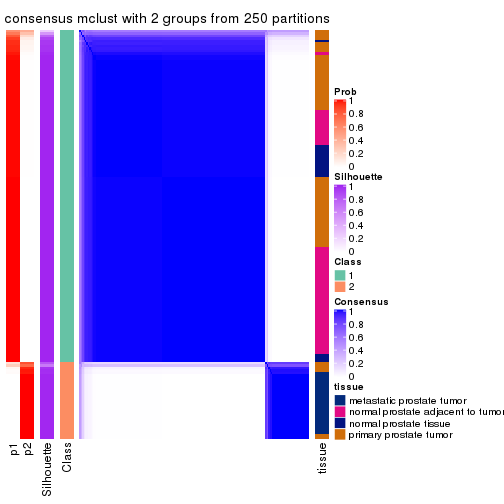</p>

</div>
<div id='tab-MAD-mclust-consensus-heatmap-2'>
<pre><code class="r">consensus_heatmap(res, k = 3)
</code></pre>

<p>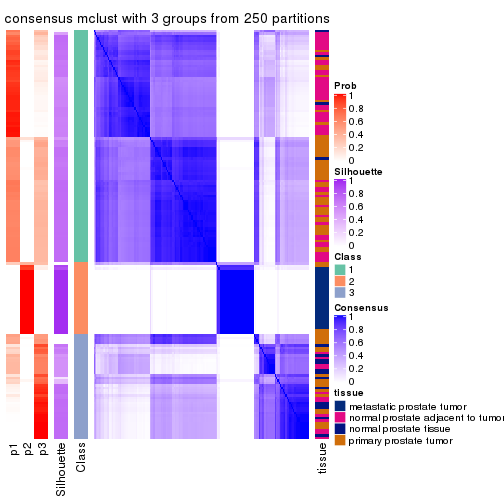</p>

</div>
<div id='tab-MAD-mclust-consensus-heatmap-3'>
<pre><code class="r">consensus_heatmap(res, k = 4)
</code></pre>

<p>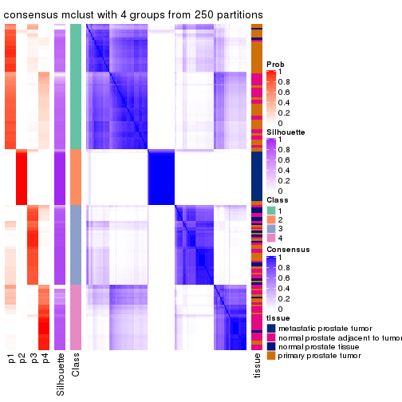</p>

</div>
<div id='tab-MAD-mclust-consensus-heatmap-4'>
<pre><code class="r">consensus_heatmap(res, k = 5)
</code></pre>

<p>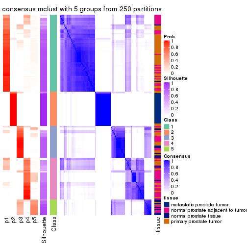</p>

</div>
<div id='tab-MAD-mclust-consensus-heatmap-5'>
<pre><code class="r">consensus_heatmap(res, k = 6)
</code></pre>

<p>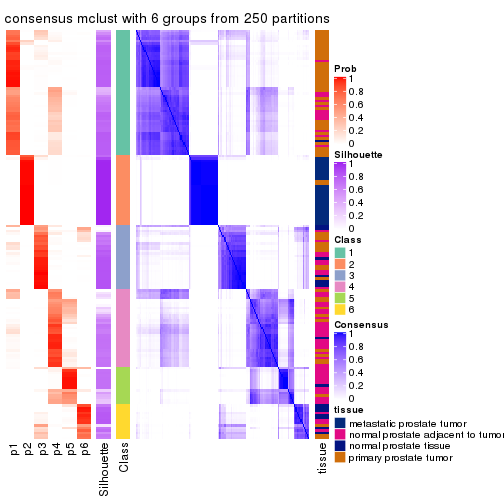</p>

</div>
</div>

Heatmaps for the membership of samples in all partitions to see how consistent they are:


<script>
$( function() {
	$( '#tabs-MAD-mclust-membership-heatmap' ).tabs();
} );
</script>
<div id='tabs-MAD-mclust-membership-heatmap'>
<ul>
<li><a href='#tab-MAD-mclust-membership-heatmap-1'>k = 2</a></li>
<li><a href='#tab-MAD-mclust-membership-heatmap-2'>k = 3</a></li>
<li><a href='#tab-MAD-mclust-membership-heatmap-3'>k = 4</a></li>
<li><a href='#tab-MAD-mclust-membership-heatmap-4'>k = 5</a></li>
<li><a href='#tab-MAD-mclust-membership-heatmap-5'>k = 6</a></li>
</ul>
<div id='tab-MAD-mclust-membership-heatmap-1'>
<pre><code class="r">membership_heatmap(res, k = 2)
</code></pre>

<p>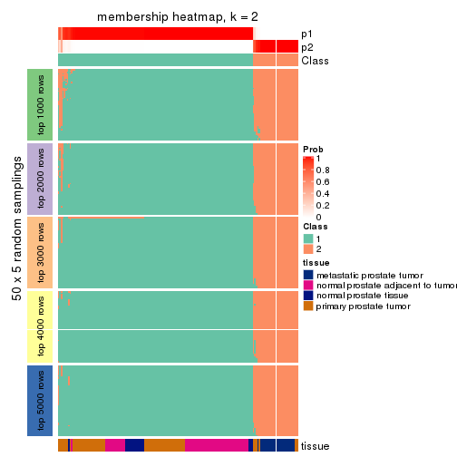</p>

</div>
<div id='tab-MAD-mclust-membership-heatmap-2'>
<pre><code class="r">membership_heatmap(res, k = 3)
</code></pre>

<p>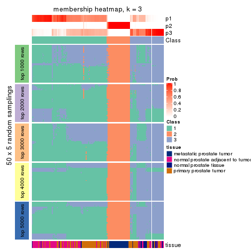</p>

</div>
<div id='tab-MAD-mclust-membership-heatmap-3'>
<pre><code class="r">membership_heatmap(res, k = 4)
</code></pre>

<p>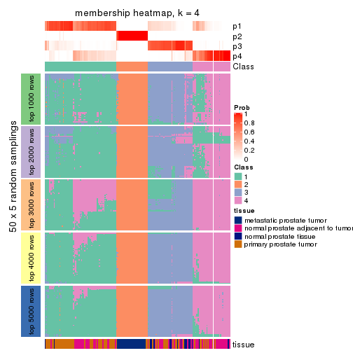</p>

</div>
<div id='tab-MAD-mclust-membership-heatmap-4'>
<pre><code class="r">membership_heatmap(res, k = 5)
</code></pre>

<p>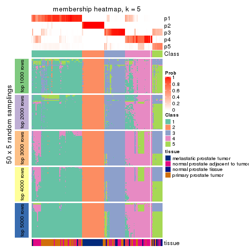</p>

</div>
<div id='tab-MAD-mclust-membership-heatmap-5'>
<pre><code class="r">membership_heatmap(res, k = 6)
</code></pre>

<p>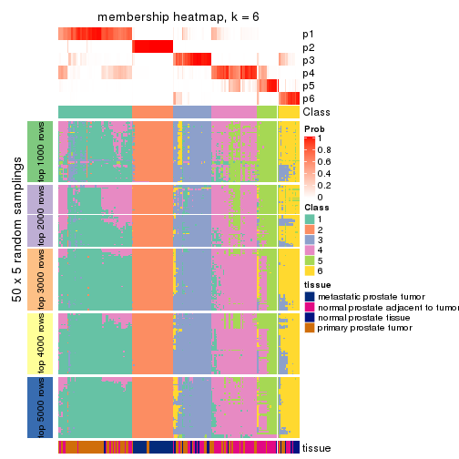</p>

</div>
</div>

As soon as we have had the classes for columns, we can look for signatures
which are significantly different between classes which can be candidate marks
for certain classes. Following are the heatmaps for signatures.


Signature heatmaps where rows are scaled:


<script>
$( function() {
	$( '#tabs-MAD-mclust-get-signatures' ).tabs();
} );
</script>
<div id='tabs-MAD-mclust-get-signatures'>
<ul>
<li><a href='#tab-MAD-mclust-get-signatures-1'>k = 2</a></li>
<li><a href='#tab-MAD-mclust-get-signatures-2'>k = 3</a></li>
<li><a href='#tab-MAD-mclust-get-signatures-3'>k = 4</a></li>
<li><a href='#tab-MAD-mclust-get-signatures-4'>k = 5</a></li>
<li><a href='#tab-MAD-mclust-get-signatures-5'>k = 6</a></li>
</ul>
<div id='tab-MAD-mclust-get-signatures-1'>
<pre><code class="r">get_signatures(res, k = 2)
</code></pre>

<pre><code>#&gt; Error in mat[ceiling(1:nr/h_ratio), ceiling(1:nc/w_ratio), drop = FALSE]: subscript out of bounds
</code></pre>

<p>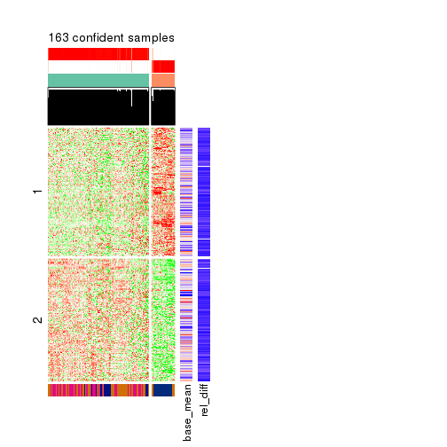</p>

</div>
<div id='tab-MAD-mclust-get-signatures-2'>
<pre><code class="r">get_signatures(res, k = 3)
</code></pre>

<p>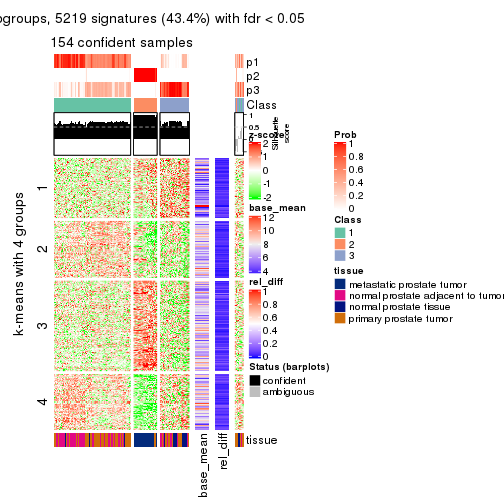</p>

</div>
<div id='tab-MAD-mclust-get-signatures-3'>
<pre><code class="r">get_signatures(res, k = 4)
</code></pre>

<p>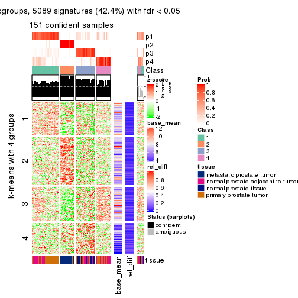</p>

</div>
<div id='tab-MAD-mclust-get-signatures-4'>
<pre><code class="r">get_signatures(res, k = 5)
</code></pre>

<p>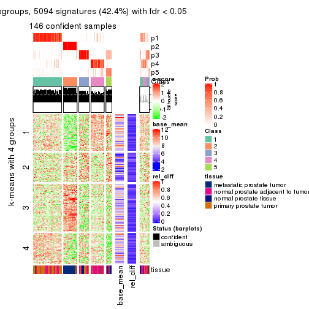</p>

</div>
<div id='tab-MAD-mclust-get-signatures-5'>
<pre><code class="r">get_signatures(res, k = 6)
</code></pre>

<p>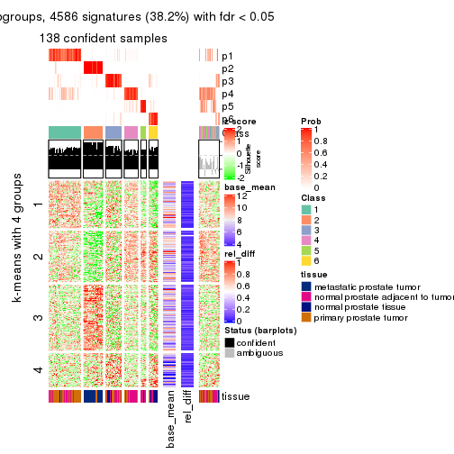</p>

</div>
</div>


Signature heatmaps where rows are not scaled:


<script>
$( function() {
	$( '#tabs-MAD-mclust-get-signatures-no-scale' ).tabs();
} );
</script>
<div id='tabs-MAD-mclust-get-signatures-no-scale'>
<ul>
<li><a href='#tab-MAD-mclust-get-signatures-no-scale-1'>k = 2</a></li>
<li><a href='#tab-MAD-mclust-get-signatures-no-scale-2'>k = 3</a></li>
<li><a href='#tab-MAD-mclust-get-signatures-no-scale-3'>k = 4</a></li>
<li><a href='#tab-MAD-mclust-get-signatures-no-scale-4'>k = 5</a></li>
<li><a href='#tab-MAD-mclust-get-signatures-no-scale-5'>k = 6</a></li>
</ul>
<div id='tab-MAD-mclust-get-signatures-no-scale-1'>
<pre><code class="r">get_signatures(res, k = 2, scale_rows = FALSE)
</code></pre>

<p>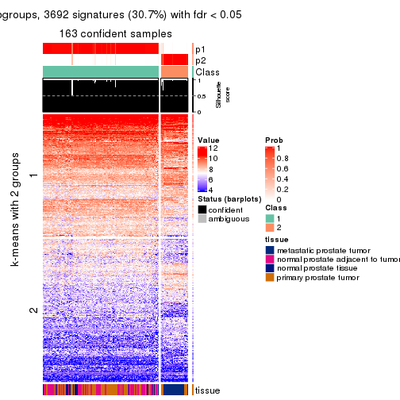</p>

</div>
<div id='tab-MAD-mclust-get-signatures-no-scale-2'>
<pre><code class="r">get_signatures(res, k = 3, scale_rows = FALSE)
</code></pre>

<p>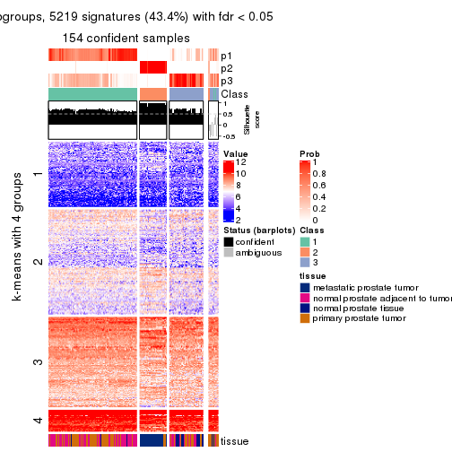</p>

</div>
<div id='tab-MAD-mclust-get-signatures-no-scale-3'>
<pre><code class="r">get_signatures(res, k = 4, scale_rows = FALSE)
</code></pre>

<p>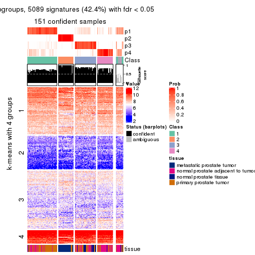</p>

</div>
<div id='tab-MAD-mclust-get-signatures-no-scale-4'>
<pre><code class="r">get_signatures(res, k = 5, scale_rows = FALSE)
</code></pre>

<p>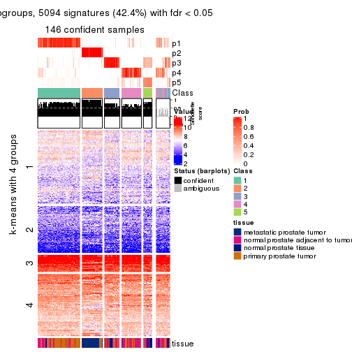</p>

</div>
<div id='tab-MAD-mclust-get-signatures-no-scale-5'>
<pre><code class="r">get_signatures(res, k = 6, scale_rows = FALSE)
</code></pre>

<p>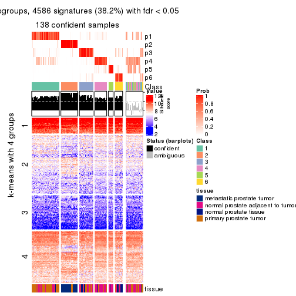</p>

</div>
</div>


Compare the overlap of signatures from different k:

```r
compare_signatures(res)
```

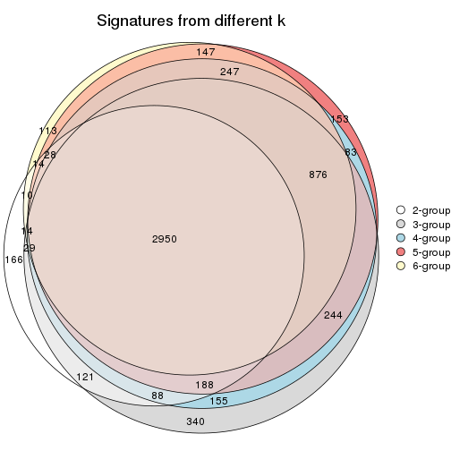

`get_signature()` returns a data frame invisibly. TO get the list of signatures, the function
call should be assigned to a variable explicitly. In following code, if `plot` argument is set
to `FALSE`, no heatmap is plotted while only the differential analysis is performed.

```r
# code only for demonstration
tb = get_signature(res, k = ..., plot = FALSE)
```

An example of the output of `tb` is:

```
#>   which_row         fdr    mean_1    mean_2 scaled_mean_1 scaled_mean_2 km
#> 1        38 0.042760348  8.373488  9.131774    -0.5533452     0.5164555  1
#> 2        40 0.018707592  7.106213  8.469186    -0.6173731     0.5762149  1
#> 3        55 0.019134737 10.221463 11.207825    -0.6159697     0.5749050  1
#> 4        59 0.006059896  5.921854  7.869574    -0.6899429     0.6439467  1
#> 5        60 0.018055526  8.928898 10.211722    -0.6204761     0.5791110  1
#> 6        98 0.009384629 15.714769 14.887706     0.6635654    -0.6193277  2
...
```

The columns in `tb` are:

1. `which_row`: row indices corresponding to the input matrix.
2. `fdr`: FDR for the differential test. 
3. `mean_x`: The mean value in group x.
4. `scaled_mean_x`: The mean value in group x after rows are scaled.
5. `km`: Row groups if k-means clustering is applied to rows.


UMAP plot which shows how samples are separated.


<script>
$( function() {
	$( '#tabs-MAD-mclust-dimension-reduction' ).tabs();
} );
</script>
<div id='tabs-MAD-mclust-dimension-reduction'>
<ul>
<li><a href='#tab-MAD-mclust-dimension-reduction-1'>k = 2</a></li>
<li><a href='#tab-MAD-mclust-dimension-reduction-2'>k = 3</a></li>
<li><a href='#tab-MAD-mclust-dimension-reduction-3'>k = 4</a></li>
<li><a href='#tab-MAD-mclust-dimension-reduction-4'>k = 5</a></li>
<li><a href='#tab-MAD-mclust-dimension-reduction-5'>k = 6</a></li>
</ul>
<div id='tab-MAD-mclust-dimension-reduction-1'>
<pre><code class="r">dimension_reduction(res, k = 2, method = &quot;UMAP&quot;)
</code></pre>

<p>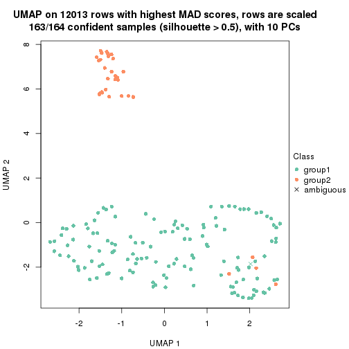</p>

</div>
<div id='tab-MAD-mclust-dimension-reduction-2'>
<pre><code class="r">dimension_reduction(res, k = 3, method = &quot;UMAP&quot;)
</code></pre>

<p>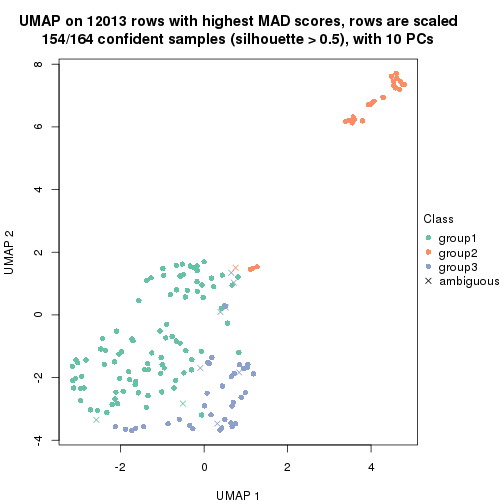</p>

</div>
<div id='tab-MAD-mclust-dimension-reduction-3'>
<pre><code class="r">dimension_reduction(res, k = 4, method = &quot;UMAP&quot;)
</code></pre>

<p>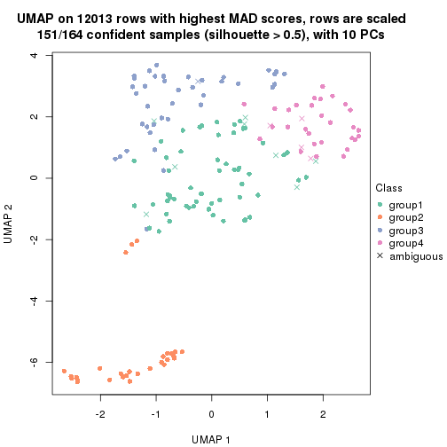</p>

</div>
<div id='tab-MAD-mclust-dimension-reduction-4'>
<pre><code class="r">dimension_reduction(res, k = 5, method = &quot;UMAP&quot;)
</code></pre>

<p>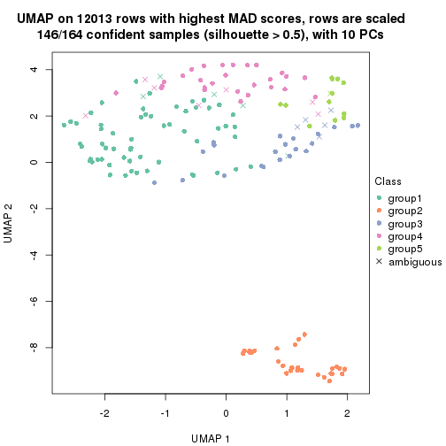</p>

</div>
<div id='tab-MAD-mclust-dimension-reduction-5'>
<pre><code class="r">dimension_reduction(res, k = 6, method = &quot;UMAP&quot;)
</code></pre>

<p>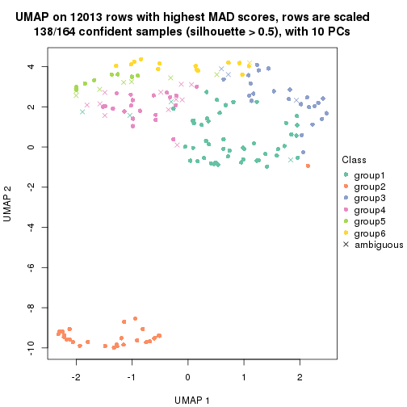</p>

</div>
</div>


Following heatmap shows how subgroups are split when increasing `k`:

```r
collect_classes(res)
```

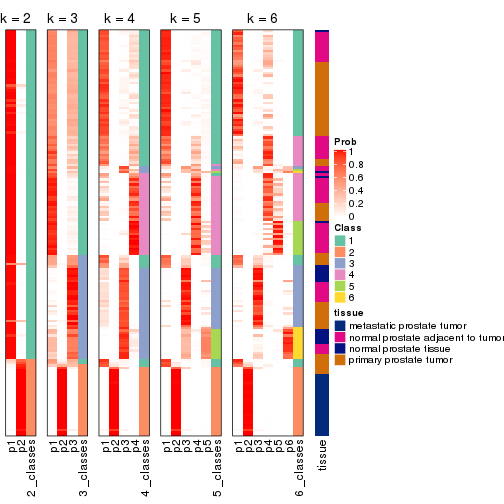


Test correlation between subgroups and known annotations. If the known
annotation is numeric, one-way ANOVA test is applied, and if the known
annotation is discrete, chi-squared contingency table test is applied.

```r
test_to_known_factors(res)
```

```
#>              n tissue(p) k
#> MAD:mclust 163  1.65e-27 2
#> MAD:mclust 154  1.31e-32 3
#> MAD:mclust 151  1.96e-33 4
#> MAD:mclust 146  4.05e-32 5
#> MAD:mclust 138  7.04e-31 6
```


If matrix rows can be associated to genes, consider to use `functional_enrichment(res,
...)` to perform function enrichment for the signature genes. See [this vignette](http://bioconductor.org/packages/devel/bioc/vignettes/cola/inst/doc/functional_enrichment.html) for more detailed explanations.


 

---------------------------------------------------


### MAD:NMF


The object with results only for a single top-value method and a single partition method 
can be extracted as:

```r
res = res_list["MAD", "NMF"]
# you can also extract it by
# res = res_list["MAD:NMF"]
```

A summary of `res` and all the functions that can be applied to it:

```r
res
```

```
#> A 'ConsensusPartition' object with k = 2, 3, 4, 5, 6.
#>   On a matrix with 12013 rows and 164 columns.
#>   Top rows (1000, 2000, 3000, 4000, 5000) are extracted by 'MAD' method.
#>   Subgroups are detected by 'NMF' method.
#>   Performed in total 1250 partitions by row resampling.
#>   Best k for subgroups seems to be 2.
#> 
#> Following methods can be applied to this 'ConsensusPartition' object:
#>  [1] "cola_report"             "collect_classes"         "collect_plots"          
#>  [4] "collect_stats"           "colnames"                "compare_signatures"     
#>  [7] "consensus_heatmap"       "dimension_reduction"     "functional_enrichment"  
#> [10] "get_anno_col"            "get_anno"                "get_classes"            
#> [13] "get_consensus"           "get_matrix"              "get_membership"         
#> [16] "get_param"               "get_signatures"          "get_stats"              
#> [19] "is_best_k"               "is_stable_k"             "membership_heatmap"     
#> [22] "ncol"                    "nrow"                    "plot_ecdf"              
#> [25] "rownames"                "select_partition_number" "show"                   
#> [28] "suggest_best_k"          "test_to_known_factors"
```

`collect_plots()` function collects all the plots made from `res` for all `k` (number of partitions)
into one single page to provide an easy and fast comparison between different `k`.

```r
collect_plots(res)
```

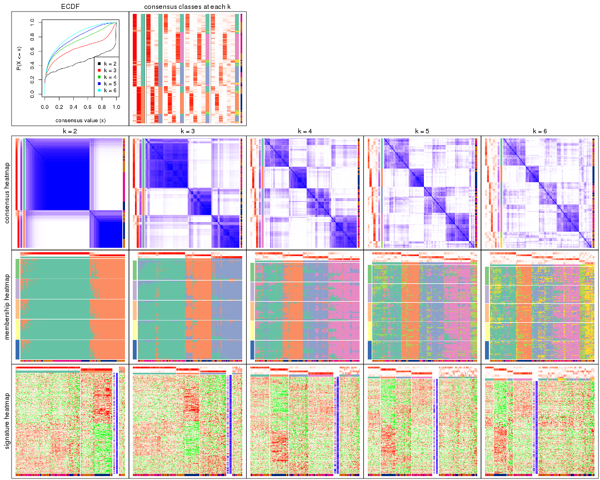

The plots are:

- The first row: a plot of the ECDF (empirical cumulative distribution
  function) curves of the consensus matrix for each `k` and the heatmap of
  predicted classes for each `k`.
- The second row: heatmaps of the consensus matrix for each `k`.
- The third row: heatmaps of the membership matrix for each `k`.
- The fouth row: heatmaps of the signatures for each `k`.

All the plots in panels can be made by individual functions and they are
plotted later in this section.

`select_partition_number()` produces several plots showing different
statistics for choosing "optimized" `k`. There are following statistics:

- ECDF curves of the consensus matrix for each `k`;
- 1-PAC. [The PAC
  score](https://en.wikipedia.org/wiki/Consensus_clustering#Over-interpretation_potential_of_consensus_clustering)
  measures the proportion of the ambiguous subgrouping.
- Mean silhouette score.
- Concordance. The mean probability of fiting the consensus class ids in all
  partitions.
- Area increased. Denote $A_k$ as the area under the ECDF curve for current
  `k`, the area increased is defined as $A_k - A_{k-1}$.
- Rand index. The percent of pairs of samples that are both in a same cluster
  or both are not in a same cluster in the partition of k and k-1.
- Jaccard index. The ratio of pairs of samples are both in a same cluster in
  the partition of k and k-1 and the pairs of samples are both in a same
  cluster in the partition k or k-1.

The detailed explanations of these statistics can be found in [the _cola_
vignette](http://bioconductor.org/packages/devel/bioc/vignettes/cola/inst/doc/cola.html#toc_13).

Generally speaking, lower PAC score, higher mean silhouette score or higher
concordance corresponds to better partition. Rand index and Jaccard index
measure how similar the current partition is compared to partition with `k-1`.
If they are too similar, we won't accept `k` is better than `k-1`.

```r
select_partition_number(res)
```

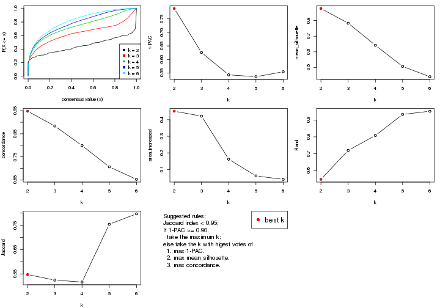

The numeric values for all these statistics can be obtained by `get_stats()`.

```r
get_stats(res)
```

```
#>   k 1-PAC mean_silhouette concordance area_increased  Rand Jaccard
#> 2 2 0.788           0.877       0.948         0.4513 0.548   0.548
#> 3 3 0.626           0.783       0.884         0.4216 0.720   0.525
#> 4 4 0.543           0.642       0.799         0.1619 0.808   0.517
#> 5 5 0.536           0.507       0.707         0.0610 0.933   0.754
#> 6 6 0.555           0.441       0.652         0.0401 0.952   0.797
```

`suggest_best_k()` suggests the best $k$ based on these statistics. The rules are as follows:

- All $k$ with Jaccard index larger than 0.95 are removed because increasing
  $k$ does not provide enough extra information. If all $k$ are removed, it is
  marked as no subgroup is detected.
- For all $k$ with 1-PAC score larger than 0.9, the maximal $k$ is taken as
  the best $k$, and other $k$ are marked as optional $k$.
- If it does not fit the second rule. The $k$ with the maximal vote of the
  highest 1-PAC score, highest mean silhouette, and highest concordance is
  taken as the best $k$.

```r
suggest_best_k(res)
```

```
#> [1] 2
```


Following shows the table of the partitions (You need to click the **show/hide
code output** link to see it). The membership matrix (columns with name `p*`)
is inferred by
[`clue::cl_consensus()`](https://www.rdocumentation.org/link/cl_consensus?package=clue)
function with the `SE` method. Basically the value in the membership matrix
represents the probability to belong to a certain group. The finall class
label for an item is determined with the group with highest probability it
belongs to.

In `get_classes()` function, the entropy is calculated from the membership
matrix and the silhouette score is calculated from the consensus matrix.


<script>
$( function() {
	$( '#tabs-MAD-NMF-get-classes' ).tabs();
} );
</script>
<div id='tabs-MAD-NMF-get-classes'>
<ul>
<li><a href='#tab-MAD-NMF-get-classes-1'>k = 2</a></li>
<li><a href='#tab-MAD-NMF-get-classes-2'>k = 3</a></li>
<li><a href='#tab-MAD-NMF-get-classes-3'>k = 4</a></li>
<li><a href='#tab-MAD-NMF-get-classes-4'>k = 5</a></li>
<li><a href='#tab-MAD-NMF-get-classes-5'>k = 6</a></li>
</ul>

<div id='tab-MAD-NMF-get-classes-1'>
<p><a id='tab-MAD-NMF-get-classes-1-a' style='color:#0366d6' href='#'>show/hide code output</a></p>
<pre><code class="r">cbind(get_classes(res, k = 2), get_membership(res, k = 2))
</code></pre>

<pre><code>#&gt;           class entropy silhouette    p1    p2
#&gt; GSM152839     1  0.0000     0.9537 1.000 0.000
#&gt; GSM152840     1  0.0000     0.9537 1.000 0.000
#&gt; GSM152841     1  0.0000     0.9537 1.000 0.000
#&gt; GSM152842     1  0.0000     0.9537 1.000 0.000
#&gt; GSM152843     1  0.0000     0.9537 1.000 0.000
#&gt; GSM152844     1  0.0000     0.9537 1.000 0.000
#&gt; GSM152845     2  0.3584     0.8804 0.068 0.932
#&gt; GSM152846     1  0.0672     0.9493 0.992 0.008
#&gt; GSM152847     1  0.0000     0.9537 1.000 0.000
#&gt; GSM152848     1  0.0000     0.9537 1.000 0.000
#&gt; GSM152849     1  0.0000     0.9537 1.000 0.000
#&gt; GSM152850     1  0.0000     0.9537 1.000 0.000
#&gt; GSM152851     1  0.0376     0.9516 0.996 0.004
#&gt; GSM152852     1  0.0000     0.9537 1.000 0.000
#&gt; GSM152853     1  0.0000     0.9537 1.000 0.000
#&gt; GSM152854     1  0.2778     0.9202 0.952 0.048
#&gt; GSM152855     1  0.0000     0.9537 1.000 0.000
#&gt; GSM153238     2  0.9248     0.5174 0.340 0.660
#&gt; GSM153239     1  0.0000     0.9537 1.000 0.000
#&gt; GSM153240     1  0.0000     0.9537 1.000 0.000
#&gt; GSM153241     1  0.0000     0.9537 1.000 0.000
#&gt; GSM153242     1  0.6247     0.8015 0.844 0.156
#&gt; GSM153243     2  0.2043     0.9049 0.032 0.968
#&gt; GSM153244     2  0.8327     0.6595 0.264 0.736
#&gt; GSM153245     1  0.0000     0.9537 1.000 0.000
#&gt; GSM153246     1  0.0938     0.9471 0.988 0.012
#&gt; GSM153247     1  0.7674     0.7072 0.776 0.224
#&gt; GSM153248     2  0.9732     0.3638 0.404 0.596
#&gt; GSM153249     1  0.0000     0.9537 1.000 0.000
#&gt; GSM153250     1  0.0000     0.9537 1.000 0.000
#&gt; GSM153251     2  0.8909     0.5870 0.308 0.692
#&gt; GSM153252     1  0.0000     0.9537 1.000 0.000
#&gt; GSM153253     1  0.0000     0.9537 1.000 0.000
#&gt; GSM153254     1  0.8713     0.5772 0.708 0.292
#&gt; GSM153255     1  0.0000     0.9537 1.000 0.000
#&gt; GSM153256     1  0.0000     0.9537 1.000 0.000
#&gt; GSM153257     1  0.0000     0.9537 1.000 0.000
#&gt; GSM153258     1  0.0000     0.9537 1.000 0.000
#&gt; GSM153259     1  0.0376     0.9516 0.996 0.004
#&gt; GSM153260     1  0.7815     0.6916 0.768 0.232
#&gt; GSM153261     1  0.2423     0.9251 0.960 0.040
#&gt; GSM153262     1  0.0000     0.9537 1.000 0.000
#&gt; GSM153263     1  0.0000     0.9537 1.000 0.000
#&gt; GSM153264     1  0.0000     0.9537 1.000 0.000
#&gt; GSM153265     1  0.0000     0.9537 1.000 0.000
#&gt; GSM153266     1  0.0000     0.9537 1.000 0.000
#&gt; GSM153267     1  0.0000     0.9537 1.000 0.000
#&gt; GSM153268     1  0.0000     0.9537 1.000 0.000
#&gt; GSM153269     1  0.0000     0.9537 1.000 0.000
#&gt; GSM153270     1  0.0000     0.9537 1.000 0.000
#&gt; GSM153271     1  0.0000     0.9537 1.000 0.000
#&gt; GSM153272     1  0.0000     0.9537 1.000 0.000
#&gt; GSM153273     1  0.4022     0.8897 0.920 0.080
#&gt; GSM153274     1  0.0000     0.9537 1.000 0.000
#&gt; GSM153275     1  0.0000     0.9537 1.000 0.000
#&gt; GSM153276     1  0.0000     0.9537 1.000 0.000
#&gt; GSM153277     1  0.0000     0.9537 1.000 0.000
#&gt; GSM153278     1  0.0000     0.9537 1.000 0.000
#&gt; GSM153279     1  0.0000     0.9537 1.000 0.000
#&gt; GSM153280     1  0.0000     0.9537 1.000 0.000
#&gt; GSM153281     1  0.0000     0.9537 1.000 0.000
#&gt; GSM153282     1  0.0000     0.9537 1.000 0.000
#&gt; GSM153283     1  0.0000     0.9537 1.000 0.000
#&gt; GSM153284     1  0.0000     0.9537 1.000 0.000
#&gt; GSM153285     1  0.0000     0.9537 1.000 0.000
#&gt; GSM153286     1  0.0000     0.9537 1.000 0.000
#&gt; GSM153287     1  0.0000     0.9537 1.000 0.000
#&gt; GSM153288     1  0.0000     0.9537 1.000 0.000
#&gt; GSM153289     1  0.0000     0.9537 1.000 0.000
#&gt; GSM153290     1  0.0000     0.9537 1.000 0.000
#&gt; GSM153291     1  0.0000     0.9537 1.000 0.000
#&gt; GSM153292     1  0.0000     0.9537 1.000 0.000
#&gt; GSM153293     1  0.0000     0.9537 1.000 0.000
#&gt; GSM153294     1  0.9248     0.4840 0.660 0.340
#&gt; GSM153295     1  0.0000     0.9537 1.000 0.000
#&gt; GSM153054     1  0.2423     0.9269 0.960 0.040
#&gt; GSM153055     1  0.0672     0.9497 0.992 0.008
#&gt; GSM153056     1  0.0000     0.9537 1.000 0.000
#&gt; GSM153057     1  0.8861     0.5602 0.696 0.304
#&gt; GSM153058     1  0.1414     0.9419 0.980 0.020
#&gt; GSM153059     2  0.1633     0.9097 0.024 0.976
#&gt; GSM153060     1  0.0000     0.9537 1.000 0.000
#&gt; GSM153061     1  0.1843     0.9359 0.972 0.028
#&gt; GSM153062     2  0.6247     0.8032 0.156 0.844
#&gt; GSM153063     1  0.0672     0.9494 0.992 0.008
#&gt; GSM153064     1  0.0376     0.9516 0.996 0.004
#&gt; GSM153065     2  0.4562     0.8587 0.096 0.904
#&gt; GSM153066     2  0.0000     0.9224 0.000 1.000
#&gt; GSM153067     1  0.0000     0.9537 1.000 0.000
#&gt; GSM153068     2  0.9850     0.3109 0.428 0.572
#&gt; GSM153069     1  0.0000     0.9537 1.000 0.000
#&gt; GSM153070     1  0.1184     0.9441 0.984 0.016
#&gt; GSM153071     1  0.8081     0.6697 0.752 0.248
#&gt; GSM153072     1  0.9833     0.2314 0.576 0.424
#&gt; GSM153073     1  0.1414     0.9419 0.980 0.020
#&gt; GSM153074     1  0.0000     0.9537 1.000 0.000
#&gt; GSM153075     1  0.0000     0.9537 1.000 0.000
#&gt; GSM153076     1  0.0000     0.9537 1.000 0.000
#&gt; GSM153077     1  0.1843     0.9362 0.972 0.028
#&gt; GSM153078     1  0.0376     0.9515 0.996 0.004
#&gt; GSM153079     2  0.6801     0.7787 0.180 0.820
#&gt; GSM153080     1  0.0000     0.9537 1.000 0.000
#&gt; GSM153081     1  0.0000     0.9537 1.000 0.000
#&gt; GSM153082     2  0.0000     0.9224 0.000 1.000
#&gt; GSM153083     2  0.0000     0.9224 0.000 1.000
#&gt; GSM153084     2  0.0000     0.9224 0.000 1.000
#&gt; GSM153085     2  0.6712     0.7805 0.176 0.824
#&gt; GSM153086     2  0.9686     0.3899 0.396 0.604
#&gt; GSM153087     1  0.0000     0.9537 1.000 0.000
#&gt; GSM153088     1  0.0000     0.9537 1.000 0.000
#&gt; GSM153089     2  0.9754     0.3644 0.408 0.592
#&gt; GSM153090     1  0.0000     0.9537 1.000 0.000
#&gt; GSM153091     2  0.0000     0.9224 0.000 1.000
#&gt; GSM153092     1  0.5946     0.8193 0.856 0.144
#&gt; GSM153093     1  0.0000     0.9537 1.000 0.000
#&gt; GSM153094     2  0.0000     0.9224 0.000 1.000
#&gt; GSM153095     1  1.0000    -0.0605 0.500 0.500
#&gt; GSM153096     1  0.2043     0.9331 0.968 0.032
#&gt; GSM153097     2  0.0376     0.9203 0.004 0.996
#&gt; GSM153098     1  0.3733     0.8981 0.928 0.072
#&gt; GSM153099     1  0.0000     0.9537 1.000 0.000
#&gt; GSM153100     1  0.3114     0.9131 0.944 0.056
#&gt; GSM153101     2  0.9954     0.1889 0.460 0.540
#&gt; GSM153102     2  0.6973     0.7697 0.188 0.812
#&gt; GSM153103     2  0.3879     0.8739 0.076 0.924
#&gt; GSM153104     1  0.0000     0.9537 1.000 0.000
#&gt; GSM153106     1  0.9635     0.3396 0.612 0.388
#&gt; GSM153107     1  0.7453     0.7232 0.788 0.212
#&gt; GSM153108     1  0.0938     0.9469 0.988 0.012
#&gt; GSM153109     2  0.0000     0.9224 0.000 1.000
#&gt; GSM153110     1  0.5178     0.8521 0.884 0.116
#&gt; GSM153111     2  0.0000     0.9224 0.000 1.000
#&gt; GSM153112     1  0.9896     0.1927 0.560 0.440
#&gt; GSM153113     2  0.0000     0.9224 0.000 1.000
#&gt; GSM153114     1  0.0000     0.9537 1.000 0.000
#&gt; GSM187532     2  0.0000     0.9224 0.000 1.000
#&gt; GSM187533     2  0.0000     0.9224 0.000 1.000
#&gt; GSM187534     2  0.0000     0.9224 0.000 1.000
#&gt; GSM187535     2  0.0000     0.9224 0.000 1.000
#&gt; GSM152906     2  0.0000     0.9224 0.000 1.000
#&gt; GSM152907     2  0.0000     0.9224 0.000 1.000
#&gt; GSM152908     2  0.0000     0.9224 0.000 1.000
#&gt; GSM152909     2  0.0000     0.9224 0.000 1.000
#&gt; GSM152910     2  0.0000     0.9224 0.000 1.000
#&gt; GSM152911     2  0.0000     0.9224 0.000 1.000
#&gt; GSM152912     2  0.0000     0.9224 0.000 1.000
#&gt; GSM152913     2  0.0000     0.9224 0.000 1.000
#&gt; GSM152914     2  0.0000     0.9224 0.000 1.000
#&gt; GSM152915     2  0.0000     0.9224 0.000 1.000
#&gt; GSM152916     2  0.0000     0.9224 0.000 1.000
#&gt; GSM152917     2  0.0000     0.9224 0.000 1.000
#&gt; GSM152918     2  0.0000     0.9224 0.000 1.000
#&gt; GSM152919     2  0.0000     0.9224 0.000 1.000
#&gt; GSM152920     2  0.0000     0.9224 0.000 1.000
#&gt; GSM152921     2  0.0000     0.9224 0.000 1.000
#&gt; GSM152922     2  0.0000     0.9224 0.000 1.000
#&gt; GSM152923     2  0.0000     0.9224 0.000 1.000
#&gt; GSM152924     2  0.0000     0.9224 0.000 1.000
#&gt; GSM152925     2  0.0000     0.9224 0.000 1.000
#&gt; GSM152926     2  0.0000     0.9224 0.000 1.000
#&gt; GSM152927     2  0.0000     0.9224 0.000 1.000
#&gt; GSM152928     2  0.0000     0.9224 0.000 1.000
#&gt; GSM152929     2  0.0000     0.9224 0.000 1.000
#&gt; GSM152930     2  0.0000     0.9224 0.000 1.000
</code></pre>

<script>
$('#tab-MAD-NMF-get-classes-1-a').parent().next().next().hide();
$('#tab-MAD-NMF-get-classes-1-a').click(function(){
  $('#tab-MAD-NMF-get-classes-1-a').parent().next().next().toggle();
  return(false);
});
</script>
</div>

<div id='tab-MAD-NMF-get-classes-2'>
<p><a id='tab-MAD-NMF-get-classes-2-a' style='color:#0366d6' href='#'>show/hide code output</a></p>
<pre><code class="r">cbind(get_classes(res, k = 3), get_membership(res, k = 3))
</code></pre>

<pre><code>#&gt;           class entropy silhouette    p1    p2    p3
#&gt; GSM152839     3  0.6140     0.3427 0.404 0.000 0.596
#&gt; GSM152840     3  0.4796     0.7243 0.220 0.000 0.780
#&gt; GSM152841     1  0.1643     0.9051 0.956 0.000 0.044
#&gt; GSM152842     3  0.1643     0.8359 0.044 0.000 0.956
#&gt; GSM152843     3  0.4555     0.7497 0.200 0.000 0.800
#&gt; GSM152844     3  0.1529     0.8361 0.040 0.000 0.960
#&gt; GSM152845     3  0.2796     0.7733 0.000 0.092 0.908
#&gt; GSM152846     3  0.1315     0.8330 0.020 0.008 0.972
#&gt; GSM152847     3  0.4555     0.7504 0.200 0.000 0.800
#&gt; GSM152848     1  0.5465     0.6299 0.712 0.000 0.288
#&gt; GSM152849     3  0.1411     0.8356 0.036 0.000 0.964
#&gt; GSM152850     3  0.2537     0.8280 0.080 0.000 0.920
#&gt; GSM152851     3  0.3116     0.8168 0.108 0.000 0.892
#&gt; GSM152852     3  0.1163     0.8347 0.028 0.000 0.972
#&gt; GSM152853     3  0.1964     0.8350 0.056 0.000 0.944
#&gt; GSM152854     3  0.1315     0.8287 0.008 0.020 0.972
#&gt; GSM152855     1  0.1170     0.8947 0.976 0.008 0.016
#&gt; GSM153238     3  0.2165     0.7969 0.000 0.064 0.936
#&gt; GSM153239     3  0.2066     0.8342 0.060 0.000 0.940
#&gt; GSM153240     1  0.2165     0.9000 0.936 0.000 0.064
#&gt; GSM153241     3  0.2625     0.8266 0.084 0.000 0.916
#&gt; GSM153242     3  0.1711     0.8196 0.008 0.032 0.960
#&gt; GSM153243     3  0.2448     0.7867 0.000 0.076 0.924
#&gt; GSM153244     3  0.8969     0.3437 0.140 0.348 0.512
#&gt; GSM153245     3  0.3116     0.8164 0.108 0.000 0.892
#&gt; GSM153246     3  0.1182     0.8311 0.012 0.012 0.976
#&gt; GSM153247     3  0.1482     0.8330 0.020 0.012 0.968
#&gt; GSM153248     2  0.7188     0.0175 0.484 0.492 0.024
#&gt; GSM153249     1  0.1129     0.8945 0.976 0.004 0.020
#&gt; GSM153250     1  0.0983     0.9004 0.980 0.004 0.016
#&gt; GSM153251     3  0.1860     0.8056 0.000 0.052 0.948
#&gt; GSM153252     1  0.2066     0.9012 0.940 0.000 0.060
#&gt; GSM153253     1  0.3038     0.8787 0.896 0.000 0.104
#&gt; GSM153254     3  0.2902     0.8341 0.064 0.016 0.920
#&gt; GSM153255     1  0.0592     0.9034 0.988 0.000 0.012
#&gt; GSM153256     1  0.0592     0.9031 0.988 0.000 0.012
#&gt; GSM153257     1  0.1163     0.9072 0.972 0.000 0.028
#&gt; GSM153258     1  0.1411     0.9077 0.964 0.000 0.036
#&gt; GSM153259     1  0.1015     0.9041 0.980 0.008 0.012
#&gt; GSM153260     3  0.1182     0.8311 0.012 0.012 0.976
#&gt; GSM153261     3  0.1267     0.8346 0.024 0.004 0.972
#&gt; GSM153262     1  0.2537     0.8939 0.920 0.000 0.080
#&gt; GSM153263     1  0.0592     0.9064 0.988 0.000 0.012
#&gt; GSM153264     1  0.2796     0.8869 0.908 0.000 0.092
#&gt; GSM153265     1  0.3686     0.8507 0.860 0.000 0.140
#&gt; GSM153266     1  0.3619     0.8560 0.864 0.000 0.136
#&gt; GSM153267     1  0.1031     0.9068 0.976 0.000 0.024
#&gt; GSM153268     1  0.5560     0.6039 0.700 0.000 0.300
#&gt; GSM153269     1  0.0592     0.9064 0.988 0.000 0.012
#&gt; GSM153270     1  0.3752     0.8451 0.856 0.000 0.144
#&gt; GSM153271     1  0.1129     0.8945 0.976 0.004 0.020
#&gt; GSM153272     1  0.1031     0.9076 0.976 0.000 0.024
#&gt; GSM153273     1  0.1877     0.8895 0.956 0.032 0.012
#&gt; GSM153274     1  0.2261     0.8995 0.932 0.000 0.068
#&gt; GSM153275     1  0.1411     0.9067 0.964 0.000 0.036
#&gt; GSM153276     1  0.3267     0.8722 0.884 0.000 0.116
#&gt; GSM153277     1  0.4002     0.8310 0.840 0.000 0.160
#&gt; GSM153278     3  0.4002     0.7856 0.160 0.000 0.840
#&gt; GSM153279     1  0.6260     0.1923 0.552 0.000 0.448
#&gt; GSM153280     1  0.3551     0.8568 0.868 0.000 0.132
#&gt; GSM153281     1  0.2537     0.8930 0.920 0.000 0.080
#&gt; GSM153282     1  0.3482     0.8605 0.872 0.000 0.128
#&gt; GSM153283     1  0.0747     0.9066 0.984 0.000 0.016
#&gt; GSM153284     1  0.1163     0.9076 0.972 0.000 0.028
#&gt; GSM153285     1  0.2625     0.8916 0.916 0.000 0.084
#&gt; GSM153286     1  0.0747     0.9066 0.984 0.000 0.016
#&gt; GSM153287     1  0.1031     0.9071 0.976 0.000 0.024
#&gt; GSM153288     1  0.0592     0.9053 0.988 0.000 0.012
#&gt; GSM153289     1  0.1129     0.8945 0.976 0.004 0.020
#&gt; GSM153290     1  0.3879     0.8372 0.848 0.000 0.152
#&gt; GSM153291     1  0.0592     0.9062 0.988 0.000 0.012
#&gt; GSM153292     1  0.1163     0.9078 0.972 0.000 0.028
#&gt; GSM153293     1  0.0237     0.9030 0.996 0.000 0.004
#&gt; GSM153294     1  0.6673     0.4351 0.636 0.344 0.020
#&gt; GSM153295     1  0.2711     0.8902 0.912 0.000 0.088
#&gt; GSM153054     3  0.5431     0.6251 0.284 0.000 0.716
#&gt; GSM153055     1  0.4110     0.8353 0.844 0.004 0.152
#&gt; GSM153056     3  0.4555     0.7501 0.200 0.000 0.800
#&gt; GSM153057     3  0.1774     0.8347 0.024 0.016 0.960
#&gt; GSM153058     3  0.1315     0.8330 0.020 0.008 0.972
#&gt; GSM153059     3  0.3038     0.7607 0.000 0.104 0.896
#&gt; GSM153060     3  0.0892     0.8339 0.020 0.000 0.980
#&gt; GSM153061     3  0.1482     0.8314 0.020 0.012 0.968
#&gt; GSM153062     3  0.1860     0.8056 0.000 0.052 0.948
#&gt; GSM153063     3  0.1860     0.8351 0.052 0.000 0.948
#&gt; GSM153064     1  0.0983     0.8970 0.980 0.004 0.016
#&gt; GSM153065     3  0.2537     0.7836 0.000 0.080 0.920
#&gt; GSM153066     3  0.6280    -0.0410 0.000 0.460 0.540
#&gt; GSM153067     1  0.1129     0.8945 0.976 0.004 0.020
#&gt; GSM153068     3  0.1643     0.8105 0.000 0.044 0.956
#&gt; GSM153069     1  0.1031     0.9071 0.976 0.000 0.024
#&gt; GSM153070     1  0.3183     0.8927 0.908 0.016 0.076
#&gt; GSM153071     3  0.5455     0.7478 0.204 0.020 0.776
#&gt; GSM153072     3  0.8223     0.5644 0.288 0.108 0.604
#&gt; GSM153073     1  0.1781     0.9003 0.960 0.020 0.020
#&gt; GSM153074     1  0.0829     0.8985 0.984 0.004 0.012
#&gt; GSM153075     1  0.3941     0.8350 0.844 0.000 0.156
#&gt; GSM153076     1  0.0592     0.9002 0.988 0.000 0.012
#&gt; GSM153077     1  0.1905     0.9063 0.956 0.016 0.028
#&gt; GSM153078     3  0.4555     0.7534 0.200 0.000 0.800
#&gt; GSM153079     2  0.7003     0.5947 0.248 0.692 0.060
#&gt; GSM153080     3  0.3686     0.7969 0.140 0.000 0.860
#&gt; GSM153081     1  0.2165     0.9009 0.936 0.000 0.064
#&gt; GSM153082     2  0.2651     0.8328 0.060 0.928 0.012
#&gt; GSM153083     2  0.1170     0.8635 0.008 0.976 0.016
#&gt; GSM153084     2  0.5465     0.6586 0.000 0.712 0.288
#&gt; GSM153085     3  0.8311     0.4669 0.112 0.292 0.596
#&gt; GSM153086     1  0.9910    -0.0748 0.384 0.344 0.272
#&gt; GSM153087     1  0.1529     0.9057 0.960 0.000 0.040
#&gt; GSM153088     1  0.0892     0.9074 0.980 0.000 0.020
#&gt; GSM153089     3  0.1643     0.8105 0.000 0.044 0.956
#&gt; GSM153090     1  0.1411     0.9071 0.964 0.000 0.036
#&gt; GSM153091     2  0.4663     0.7447 0.156 0.828 0.016
#&gt; GSM153092     1  0.4830     0.8434 0.848 0.084 0.068
#&gt; GSM153093     1  0.1411     0.9067 0.964 0.000 0.036
#&gt; GSM153094     2  0.2584     0.8336 0.064 0.928 0.008
#&gt; GSM153095     3  0.9810     0.2041 0.372 0.240 0.388
#&gt; GSM153096     1  0.1267     0.9020 0.972 0.024 0.004
#&gt; GSM153097     2  0.2804     0.8365 0.060 0.924 0.016
#&gt; GSM153098     1  0.3141     0.8578 0.912 0.068 0.020
#&gt; GSM153099     1  0.2537     0.8935 0.920 0.000 0.080
#&gt; GSM153100     1  0.1711     0.8958 0.960 0.032 0.008
#&gt; GSM153101     3  0.9319     0.4627 0.296 0.196 0.508
#&gt; GSM153102     2  0.7533     0.4060 0.052 0.600 0.348
#&gt; GSM153103     2  0.8069     0.0579 0.064 0.476 0.460
#&gt; GSM153104     1  0.3192     0.8751 0.888 0.000 0.112
#&gt; GSM153106     1  0.6255     0.4832 0.668 0.320 0.012
#&gt; GSM153107     1  0.5147     0.7297 0.800 0.180 0.020
#&gt; GSM153108     1  0.3112     0.8822 0.900 0.004 0.096
#&gt; GSM153109     2  0.1753     0.8561 0.000 0.952 0.048
#&gt; GSM153110     1  0.1999     0.8974 0.952 0.036 0.012
#&gt; GSM153111     2  0.3295     0.8066 0.096 0.896 0.008
#&gt; GSM153112     1  0.6814     0.3656 0.608 0.372 0.020
#&gt; GSM153113     2  0.0848     0.8595 0.008 0.984 0.008
#&gt; GSM153114     1  0.0661     0.9032 0.988 0.004 0.008
#&gt; GSM187532     3  0.6295    -0.0853 0.000 0.472 0.528
#&gt; GSM187533     2  0.2537     0.8454 0.000 0.920 0.080
#&gt; GSM187534     2  0.0592     0.8662 0.000 0.988 0.012
#&gt; GSM187535     2  0.2297     0.8425 0.036 0.944 0.020
#&gt; GSM152906     2  0.0000     0.8643 0.000 1.000 0.000
#&gt; GSM152907     2  0.0829     0.8649 0.004 0.984 0.012
#&gt; GSM152908     2  0.0592     0.8661 0.000 0.988 0.012
#&gt; GSM152909     2  0.6140     0.4318 0.000 0.596 0.404
#&gt; GSM152910     2  0.5178     0.7044 0.000 0.744 0.256
#&gt; GSM152911     2  0.1753     0.8580 0.000 0.952 0.048
#&gt; GSM152912     2  0.1163     0.8634 0.000 0.972 0.028
#&gt; GSM152913     2  0.5650     0.6205 0.000 0.688 0.312
#&gt; GSM152914     2  0.0592     0.8661 0.000 0.988 0.012
#&gt; GSM152915     2  0.0424     0.8659 0.000 0.992 0.008
#&gt; GSM152916     2  0.4291     0.7818 0.000 0.820 0.180
#&gt; GSM152917     2  0.0424     0.8659 0.000 0.992 0.008
#&gt; GSM152918     2  0.0475     0.8625 0.004 0.992 0.004
#&gt; GSM152919     2  0.0424     0.8659 0.000 0.992 0.008
#&gt; GSM152920     2  0.0747     0.8657 0.000 0.984 0.016
#&gt; GSM152921     2  0.0424     0.8659 0.000 0.992 0.008
#&gt; GSM152922     2  0.3619     0.8147 0.000 0.864 0.136
#&gt; GSM152923     2  0.0592     0.8662 0.000 0.988 0.012
#&gt; GSM152924     2  0.4002     0.7980 0.000 0.840 0.160
#&gt; GSM152925     2  0.4178     0.7882 0.000 0.828 0.172
#&gt; GSM152926     2  0.0000     0.8643 0.000 1.000 0.000
#&gt; GSM152927     2  0.5138     0.7079 0.000 0.748 0.252
#&gt; GSM152928     2  0.4931     0.7318 0.000 0.768 0.232
#&gt; GSM152929     2  0.0424     0.8659 0.000 0.992 0.008
#&gt; GSM152930     2  0.0424     0.8659 0.000 0.992 0.008
</code></pre>

<script>
$('#tab-MAD-NMF-get-classes-2-a').parent().next().next().hide();
$('#tab-MAD-NMF-get-classes-2-a').click(function(){
  $('#tab-MAD-NMF-get-classes-2-a').parent().next().next().toggle();
  return(false);
});
</script>
</div>

<div id='tab-MAD-NMF-get-classes-3'>
<p><a id='tab-MAD-NMF-get-classes-3-a' style='color:#0366d6' href='#'>show/hide code output</a></p>
<pre><code class="r">cbind(get_classes(res, k = 4), get_membership(res, k = 4))
</code></pre>

<pre><code>#&gt;           class entropy silhouette    p1    p2    p3    p4
#&gt; GSM152839     3  0.6038     0.2845 0.424 0.000 0.532 0.044
#&gt; GSM152840     4  0.5060     0.2533 0.000 0.004 0.412 0.584
#&gt; GSM152841     4  0.2076     0.7858 0.004 0.008 0.056 0.932
#&gt; GSM152842     3  0.4304     0.5661 0.284 0.000 0.716 0.000
#&gt; GSM152843     3  0.4655     0.6561 0.208 0.000 0.760 0.032
#&gt; GSM152844     3  0.4936     0.4373 0.000 0.008 0.652 0.340
#&gt; GSM152845     3  0.4174     0.6419 0.000 0.140 0.816 0.044
#&gt; GSM152846     3  0.4761     0.6381 0.000 0.044 0.764 0.192
#&gt; GSM152847     3  0.5284     0.4201 0.368 0.000 0.616 0.016
#&gt; GSM152848     1  0.5256     0.6014 0.732 0.000 0.204 0.064
#&gt; GSM152849     3  0.2412     0.7218 0.084 0.000 0.908 0.008
#&gt; GSM152850     1  0.5168    -0.0952 0.504 0.000 0.492 0.004
#&gt; GSM152851     4  0.6314    -0.0260 0.004 0.048 0.464 0.484
#&gt; GSM152852     3  0.5453     0.4603 0.000 0.032 0.648 0.320
#&gt; GSM152853     3  0.5203     0.2532 0.000 0.008 0.576 0.416
#&gt; GSM152854     3  0.3436     0.7096 0.008 0.036 0.876 0.080
#&gt; GSM152855     4  0.4318     0.6821 0.208 0.012 0.004 0.776
#&gt; GSM153238     3  0.4158     0.6369 0.224 0.008 0.768 0.000
#&gt; GSM153239     3  0.4387     0.6042 0.000 0.012 0.752 0.236
#&gt; GSM153240     4  0.1624     0.7995 0.028 0.000 0.020 0.952
#&gt; GSM153241     3  0.3166     0.7131 0.116 0.000 0.868 0.016
#&gt; GSM153242     3  0.5003     0.6521 0.000 0.084 0.768 0.148
#&gt; GSM153243     3  0.4348     0.6593 0.196 0.024 0.780 0.000
#&gt; GSM153244     4  0.8133     0.0825 0.012 0.276 0.280 0.432
#&gt; GSM153245     3  0.4722     0.5128 0.000 0.008 0.692 0.300
#&gt; GSM153246     3  0.1792     0.7225 0.068 0.000 0.932 0.000
#&gt; GSM153247     3  0.3445     0.7174 0.112 0.012 0.864 0.012
#&gt; GSM153248     1  0.1635     0.7245 0.948 0.044 0.008 0.000
#&gt; GSM153249     4  0.1305     0.7973 0.036 0.000 0.004 0.960
#&gt; GSM153250     1  0.4153     0.6518 0.784 0.008 0.004 0.204
#&gt; GSM153251     3  0.4610     0.6607 0.000 0.100 0.800 0.100
#&gt; GSM153252     4  0.3547     0.7572 0.144 0.000 0.016 0.840
#&gt; GSM153253     4  0.2839     0.7574 0.004 0.004 0.108 0.884
#&gt; GSM153254     3  0.7146     0.5658 0.028 0.128 0.624 0.220
#&gt; GSM153255     4  0.1302     0.7965 0.044 0.000 0.000 0.956
#&gt; GSM153256     4  0.4624     0.5007 0.340 0.000 0.000 0.660
#&gt; GSM153257     4  0.2737     0.7866 0.104 0.000 0.008 0.888
#&gt; GSM153258     1  0.4018     0.6940 0.812 0.004 0.016 0.168
#&gt; GSM153259     1  0.2222     0.7368 0.928 0.008 0.008 0.056
#&gt; GSM153260     3  0.5097     0.2834 0.428 0.004 0.568 0.000
#&gt; GSM153261     3  0.3074     0.6954 0.152 0.000 0.848 0.000
#&gt; GSM153262     4  0.1798     0.8011 0.040 0.000 0.016 0.944
#&gt; GSM153263     1  0.3937     0.6715 0.800 0.000 0.012 0.188
#&gt; GSM153264     1  0.3301     0.6999 0.876 0.004 0.092 0.028
#&gt; GSM153265     4  0.2281     0.7713 0.000 0.000 0.096 0.904
#&gt; GSM153266     1  0.4608     0.7127 0.800 0.000 0.096 0.104
#&gt; GSM153267     4  0.5269     0.2640 0.428 0.004 0.004 0.564
#&gt; GSM153268     4  0.3249     0.7381 0.008 0.000 0.140 0.852
#&gt; GSM153269     4  0.5161     0.1427 0.476 0.004 0.000 0.520
#&gt; GSM153270     4  0.3653     0.7704 0.128 0.000 0.028 0.844
#&gt; GSM153271     1  0.4875     0.5100 0.692 0.008 0.004 0.296
#&gt; GSM153272     4  0.2053     0.7940 0.072 0.000 0.004 0.924
#&gt; GSM153273     1  0.3557     0.7248 0.856 0.036 0.000 0.108
#&gt; GSM153274     1  0.5590     0.0774 0.524 0.000 0.020 0.456
#&gt; GSM153275     4  0.3494     0.7347 0.172 0.000 0.004 0.824
#&gt; GSM153276     4  0.4057     0.7571 0.152 0.000 0.032 0.816
#&gt; GSM153277     4  0.2334     0.7789 0.004 0.000 0.088 0.908
#&gt; GSM153278     3  0.4914     0.5174 0.312 0.000 0.676 0.012
#&gt; GSM153279     4  0.3907     0.6255 0.000 0.000 0.232 0.768
#&gt; GSM153280     4  0.3161     0.7428 0.000 0.012 0.124 0.864
#&gt; GSM153281     4  0.1833     0.7975 0.024 0.000 0.032 0.944
#&gt; GSM153282     4  0.2408     0.7655 0.000 0.000 0.104 0.896
#&gt; GSM153283     1  0.3278     0.7331 0.864 0.000 0.020 0.116
#&gt; GSM153284     4  0.1940     0.7942 0.076 0.000 0.000 0.924
#&gt; GSM153285     4  0.2401     0.7720 0.004 0.000 0.092 0.904
#&gt; GSM153286     4  0.3266     0.7335 0.168 0.000 0.000 0.832
#&gt; GSM153287     4  0.0895     0.7981 0.020 0.000 0.004 0.976
#&gt; GSM153288     4  0.3355     0.7364 0.160 0.004 0.000 0.836
#&gt; GSM153289     4  0.5349     0.4199 0.368 0.012 0.004 0.616
#&gt; GSM153290     4  0.3375     0.7488 0.008 0.012 0.116 0.864
#&gt; GSM153291     4  0.1398     0.7997 0.040 0.000 0.004 0.956
#&gt; GSM153292     4  0.1661     0.7891 0.004 0.000 0.052 0.944
#&gt; GSM153293     4  0.4509     0.5819 0.288 0.004 0.000 0.708
#&gt; GSM153294     1  0.6140     0.6209 0.684 0.196 0.004 0.116
#&gt; GSM153295     1  0.6120     0.1939 0.520 0.000 0.048 0.432
#&gt; GSM153054     1  0.4995     0.3727 0.648 0.004 0.344 0.004
#&gt; GSM153055     4  0.6187     0.3440 0.388 0.008 0.040 0.564
#&gt; GSM153056     3  0.4781     0.6464 0.212 0.000 0.752 0.036
#&gt; GSM153057     3  0.2909     0.7259 0.052 0.036 0.904 0.008
#&gt; GSM153058     3  0.2708     0.7263 0.076 0.004 0.904 0.016
#&gt; GSM153059     3  0.3555     0.7143 0.048 0.080 0.868 0.004
#&gt; GSM153060     3  0.1958     0.7259 0.028 0.008 0.944 0.020
#&gt; GSM153061     3  0.3219     0.6860 0.164 0.000 0.836 0.000
#&gt; GSM153062     3  0.2153     0.7185 0.008 0.036 0.936 0.020
#&gt; GSM153063     3  0.4267     0.6504 0.000 0.024 0.788 0.188
#&gt; GSM153064     1  0.4082     0.6836 0.812 0.020 0.004 0.164
#&gt; GSM153065     3  0.3925     0.6778 0.176 0.016 0.808 0.000
#&gt; GSM153066     3  0.6140     0.5522 0.252 0.096 0.652 0.000
#&gt; GSM153067     4  0.1902     0.7946 0.064 0.000 0.004 0.932
#&gt; GSM153068     3  0.2271     0.7203 0.076 0.008 0.916 0.000
#&gt; GSM153069     4  0.1059     0.7978 0.016 0.000 0.012 0.972
#&gt; GSM153070     1  0.4613     0.7070 0.792 0.008 0.036 0.164
#&gt; GSM153071     3  0.5281     0.1682 0.464 0.008 0.528 0.000
#&gt; GSM153072     1  0.4963     0.4813 0.696 0.020 0.284 0.000
#&gt; GSM153073     1  0.2096     0.7337 0.940 0.016 0.016 0.028
#&gt; GSM153074     4  0.2281     0.7840 0.096 0.000 0.000 0.904
#&gt; GSM153075     4  0.2597     0.7798 0.008 0.004 0.084 0.904
#&gt; GSM153076     1  0.2976     0.7194 0.872 0.000 0.008 0.120
#&gt; GSM153077     1  0.2474     0.7148 0.920 0.008 0.056 0.016
#&gt; GSM153078     3  0.5615     0.2666 0.424 0.004 0.556 0.016
#&gt; GSM153079     1  0.4108     0.7056 0.848 0.080 0.056 0.016
#&gt; GSM153080     3  0.3447     0.7023 0.020 0.000 0.852 0.128
#&gt; GSM153081     1  0.3056     0.7128 0.888 0.000 0.072 0.040
#&gt; GSM153082     1  0.5159     0.3869 0.624 0.364 0.012 0.000
#&gt; GSM153083     1  0.4856     0.6523 0.780 0.136 0.084 0.000
#&gt; GSM153084     1  0.8080    -0.0679 0.336 0.324 0.336 0.004
#&gt; GSM153085     1  0.5548     0.3603 0.628 0.032 0.340 0.000
#&gt; GSM153086     1  0.3969     0.6215 0.804 0.016 0.180 0.000
#&gt; GSM153087     4  0.2011     0.7927 0.080 0.000 0.000 0.920
#&gt; GSM153088     1  0.2775     0.7359 0.896 0.000 0.020 0.084
#&gt; GSM153089     3  0.4300     0.6744 0.000 0.088 0.820 0.092
#&gt; GSM153090     1  0.3048     0.7329 0.876 0.000 0.016 0.108
#&gt; GSM153091     1  0.3583     0.6703 0.816 0.180 0.004 0.000
#&gt; GSM153092     1  0.6516     0.5433 0.644 0.092 0.012 0.252
#&gt; GSM153093     4  0.2466     0.7877 0.096 0.000 0.004 0.900
#&gt; GSM153094     2  0.5446     0.4298 0.340 0.636 0.020 0.004
#&gt; GSM153095     1  0.6908     0.3490 0.576 0.052 0.336 0.036
#&gt; GSM153096     1  0.2915     0.7362 0.892 0.016 0.004 0.088
#&gt; GSM153097     1  0.3805     0.6897 0.856 0.072 0.068 0.004
#&gt; GSM153098     4  0.6719     0.0980 0.440 0.076 0.004 0.480
#&gt; GSM153099     4  0.4776     0.6272 0.244 0.000 0.024 0.732
#&gt; GSM153100     1  0.6028     0.3379 0.596 0.044 0.004 0.356
#&gt; GSM153101     1  0.5005     0.5032 0.712 0.020 0.264 0.004
#&gt; GSM153102     2  0.7431     0.4084 0.052 0.552 0.328 0.068
#&gt; GSM153103     1  0.5291     0.4069 0.652 0.024 0.324 0.000
#&gt; GSM153104     4  0.1902     0.7883 0.004 0.000 0.064 0.932
#&gt; GSM153106     4  0.7688     0.2639 0.252 0.252 0.004 0.492
#&gt; GSM153107     1  0.6414     0.5619 0.648 0.112 0.004 0.236
#&gt; GSM153108     4  0.3150     0.7951 0.036 0.004 0.072 0.888
#&gt; GSM153109     2  0.3414     0.8623 0.048 0.876 0.072 0.004
#&gt; GSM153110     1  0.2188     0.7329 0.936 0.012 0.020 0.032
#&gt; GSM153111     1  0.3587     0.6938 0.856 0.104 0.040 0.000
#&gt; GSM153112     1  0.7566     0.3536 0.488 0.324 0.004 0.184
#&gt; GSM153113     2  0.4192     0.7038 0.208 0.780 0.008 0.004
#&gt; GSM153114     4  0.2311     0.7939 0.076 0.004 0.004 0.916
#&gt; GSM187532     3  0.5925    -0.0428 0.036 0.452 0.512 0.000
#&gt; GSM187533     2  0.2707     0.8770 0.016 0.908 0.068 0.008
#&gt; GSM187534     2  0.1520     0.8872 0.024 0.956 0.020 0.000
#&gt; GSM187535     2  0.3172     0.8231 0.112 0.872 0.004 0.012
#&gt; GSM152906     2  0.1474     0.8715 0.052 0.948 0.000 0.000
#&gt; GSM152907     2  0.1509     0.8827 0.008 0.960 0.020 0.012
#&gt; GSM152908     2  0.0657     0.8862 0.004 0.984 0.012 0.000
#&gt; GSM152909     2  0.5386     0.5470 0.008 0.636 0.344 0.012
#&gt; GSM152910     2  0.3836     0.8025 0.016 0.816 0.168 0.000
#&gt; GSM152911     2  0.1398     0.8832 0.004 0.956 0.040 0.000
#&gt; GSM152912     2  0.1042     0.8857 0.008 0.972 0.020 0.000
#&gt; GSM152913     2  0.4770     0.6524 0.000 0.700 0.288 0.012
#&gt; GSM152914     2  0.0657     0.8866 0.004 0.984 0.012 0.000
#&gt; GSM152915     2  0.0188     0.8859 0.000 0.996 0.004 0.000
#&gt; GSM152916     2  0.2928     0.8595 0.012 0.880 0.108 0.000
#&gt; GSM152917     2  0.0707     0.8844 0.020 0.980 0.000 0.000
#&gt; GSM152918     2  0.1489     0.8733 0.044 0.952 0.004 0.000
#&gt; GSM152919     2  0.0707     0.8844 0.020 0.980 0.000 0.000
#&gt; GSM152920     2  0.0927     0.8858 0.008 0.976 0.016 0.000
#&gt; GSM152921     2  0.0376     0.8860 0.004 0.992 0.004 0.000
#&gt; GSM152922     2  0.2731     0.8624 0.008 0.896 0.092 0.004
#&gt; GSM152923     2  0.1284     0.8864 0.024 0.964 0.012 0.000
#&gt; GSM152924     2  0.3292     0.8572 0.016 0.868 0.112 0.004
#&gt; GSM152925     2  0.3224     0.8535 0.016 0.864 0.120 0.000
#&gt; GSM152926     2  0.1492     0.8809 0.036 0.956 0.004 0.004
#&gt; GSM152927     2  0.4284     0.7554 0.012 0.764 0.224 0.000
#&gt; GSM152928     2  0.5252     0.7451 0.052 0.736 0.208 0.004
#&gt; GSM152929     2  0.1389     0.8764 0.048 0.952 0.000 0.000
#&gt; GSM152930     2  0.1004     0.8854 0.024 0.972 0.004 0.000
</code></pre>

<script>
$('#tab-MAD-NMF-get-classes-3-a').parent().next().next().hide();
$('#tab-MAD-NMF-get-classes-3-a').click(function(){
  $('#tab-MAD-NMF-get-classes-3-a').parent().next().next().toggle();
  return(false);
});
</script>
</div>

<div id='tab-MAD-NMF-get-classes-4'>
<p><a id='tab-MAD-NMF-get-classes-4-a' style='color:#0366d6' href='#'>show/hide code output</a></p>
<pre><code class="r">cbind(get_classes(res, k = 5), get_membership(res, k = 5))
</code></pre>

<pre><code>#&gt;           class entropy silhouette    p1    p2    p3    p4    p5
#&gt; GSM152839     1  0.5496    -0.0711 0.472 0.000 0.472 0.004 0.052
#&gt; GSM152840     4  0.5351     0.2860 0.000 0.000 0.380 0.560 0.060
#&gt; GSM152841     4  0.2446     0.7101 0.000 0.000 0.056 0.900 0.044
#&gt; GSM152842     3  0.4623     0.4813 0.304 0.000 0.664 0.000 0.032
#&gt; GSM152843     3  0.4935     0.5873 0.212 0.000 0.720 0.028 0.040
#&gt; GSM152844     3  0.5701     0.4388 0.000 0.000 0.604 0.272 0.124
#&gt; GSM152845     3  0.5661     0.4530 0.000 0.032 0.600 0.040 0.328
#&gt; GSM152846     3  0.5647     0.5359 0.000 0.012 0.668 0.156 0.164
#&gt; GSM152847     3  0.5033     0.3244 0.400 0.000 0.568 0.004 0.028
#&gt; GSM152848     1  0.4580     0.5384 0.772 0.000 0.144 0.024 0.060
#&gt; GSM152849     3  0.4055     0.6541 0.108 0.004 0.808 0.004 0.076
#&gt; GSM152850     1  0.5151     0.1155 0.560 0.000 0.396 0.000 0.044
#&gt; GSM152851     4  0.6010     0.2181 0.000 0.028 0.392 0.524 0.056
#&gt; GSM152852     3  0.6846     0.3322 0.000 0.012 0.476 0.232 0.280
#&gt; GSM152853     3  0.5853     0.0470 0.000 0.000 0.472 0.432 0.096
#&gt; GSM152854     3  0.5271     0.6058 0.024 0.008 0.728 0.072 0.168
#&gt; GSM152855     5  0.6593     0.2722 0.216 0.000 0.000 0.352 0.432
#&gt; GSM153238     3  0.5457     0.5553 0.172 0.004 0.672 0.000 0.152
#&gt; GSM153239     3  0.4477     0.5141 0.000 0.000 0.708 0.252 0.040
#&gt; GSM153240     4  0.3267     0.7228 0.064 0.000 0.024 0.868 0.044
#&gt; GSM153241     3  0.3975     0.6576 0.116 0.000 0.816 0.020 0.048
#&gt; GSM153242     3  0.4761     0.5890 0.000 0.020 0.760 0.136 0.084
#&gt; GSM153243     3  0.5223     0.5559 0.240 0.012 0.680 0.000 0.068
#&gt; GSM153244     4  0.7567     0.2972 0.000 0.168 0.244 0.492 0.096
#&gt; GSM153245     3  0.4735     0.4598 0.000 0.000 0.672 0.284 0.044
#&gt; GSM153246     3  0.3002     0.6539 0.048 0.004 0.872 0.000 0.076
#&gt; GSM153247     3  0.5183     0.6117 0.136 0.008 0.728 0.008 0.120
#&gt; GSM153248     1  0.4733     0.5391 0.720 0.020 0.012 0.012 0.236
#&gt; GSM153249     4  0.2171     0.7213 0.024 0.000 0.000 0.912 0.064
#&gt; GSM153250     1  0.3488     0.5199 0.808 0.000 0.000 0.168 0.024
#&gt; GSM153251     3  0.3981     0.6118 0.000 0.028 0.820 0.108 0.044
#&gt; GSM153252     4  0.4544     0.6726 0.156 0.000 0.012 0.764 0.068
#&gt; GSM153253     4  0.2795     0.6980 0.000 0.000 0.100 0.872 0.028
#&gt; GSM153254     3  0.8149     0.2978 0.028 0.056 0.428 0.224 0.264
#&gt; GSM153255     4  0.2130     0.7163 0.080 0.000 0.000 0.908 0.012
#&gt; GSM153256     4  0.4930     0.3195 0.388 0.000 0.000 0.580 0.032
#&gt; GSM153257     4  0.4480     0.6807 0.128 0.000 0.012 0.776 0.084
#&gt; GSM153258     1  0.5293     0.4698 0.692 0.000 0.016 0.080 0.212
#&gt; GSM153259     1  0.4961     0.4465 0.660 0.004 0.004 0.036 0.296
#&gt; GSM153260     3  0.6557     0.0922 0.404 0.004 0.420 0.000 0.172
#&gt; GSM153261     3  0.6176     0.4606 0.128 0.004 0.560 0.004 0.304
#&gt; GSM153262     4  0.4147     0.6954 0.064 0.000 0.016 0.804 0.116
#&gt; GSM153263     1  0.4548     0.5339 0.752 0.000 0.000 0.120 0.128
#&gt; GSM153264     1  0.2888     0.5667 0.880 0.000 0.056 0.004 0.060
#&gt; GSM153265     4  0.3526     0.6829 0.000 0.000 0.096 0.832 0.072
#&gt; GSM153266     1  0.4220     0.5639 0.808 0.000 0.056 0.032 0.104
#&gt; GSM153267     1  0.4980    -0.0777 0.488 0.000 0.000 0.484 0.028
#&gt; GSM153268     4  0.4199     0.6308 0.000 0.000 0.180 0.764 0.056
#&gt; GSM153269     1  0.5107     0.3238 0.620 0.000 0.004 0.332 0.044
#&gt; GSM153270     4  0.5380     0.6448 0.188 0.000 0.048 0.708 0.056
#&gt; GSM153271     1  0.4736     0.4664 0.712 0.000 0.000 0.216 0.072
#&gt; GSM153272     4  0.2678     0.7120 0.100 0.000 0.004 0.880 0.016
#&gt; GSM153273     1  0.5234     0.5437 0.728 0.028 0.004 0.072 0.168
#&gt; GSM153274     1  0.5956     0.2531 0.560 0.000 0.044 0.356 0.040
#&gt; GSM153275     4  0.4197     0.5863 0.244 0.000 0.000 0.728 0.028
#&gt; GSM153276     4  0.5776     0.5318 0.280 0.000 0.056 0.628 0.036
#&gt; GSM153277     4  0.5532     0.5408 0.016 0.000 0.092 0.668 0.224
#&gt; GSM153278     3  0.6074     0.3255 0.340 0.004 0.536 0.000 0.120
#&gt; GSM153279     4  0.4750     0.5665 0.000 0.004 0.260 0.692 0.044
#&gt; GSM153280     4  0.4743     0.6209 0.000 0.004 0.136 0.744 0.116
#&gt; GSM153281     4  0.1787     0.7268 0.016 0.000 0.032 0.940 0.012
#&gt; GSM153282     4  0.3141     0.6914 0.000 0.000 0.108 0.852 0.040
#&gt; GSM153283     1  0.3424     0.5752 0.856 0.000 0.016 0.064 0.064
#&gt; GSM153284     4  0.3497     0.7139 0.108 0.000 0.008 0.840 0.044
#&gt; GSM153285     4  0.2905     0.7035 0.000 0.000 0.096 0.868 0.036
#&gt; GSM153286     4  0.4254     0.5947 0.220 0.000 0.000 0.740 0.040
#&gt; GSM153287     4  0.1731     0.7243 0.008 0.000 0.012 0.940 0.040
#&gt; GSM153288     4  0.3841     0.6349 0.188 0.000 0.000 0.780 0.032
#&gt; GSM153289     5  0.6703     0.1211 0.360 0.000 0.000 0.244 0.396
#&gt; GSM153290     4  0.4183     0.6477 0.000 0.000 0.136 0.780 0.084
#&gt; GSM153291     4  0.3559     0.6963 0.064 0.000 0.004 0.836 0.096
#&gt; GSM153292     4  0.2067     0.7183 0.000 0.004 0.044 0.924 0.028
#&gt; GSM153293     4  0.5639     0.3243 0.340 0.000 0.000 0.568 0.092
#&gt; GSM153294     1  0.7890     0.2343 0.440 0.176 0.000 0.116 0.268
#&gt; GSM153295     1  0.5524     0.3665 0.608 0.000 0.012 0.320 0.060
#&gt; GSM153054     1  0.7032     0.2846 0.504 0.016 0.288 0.012 0.180
#&gt; GSM153055     1  0.6805     0.1932 0.500 0.004 0.068 0.364 0.064
#&gt; GSM153056     3  0.5166     0.5560 0.256 0.000 0.680 0.032 0.032
#&gt; GSM153057     3  0.4406     0.6511 0.072 0.016 0.804 0.012 0.096
#&gt; GSM153058     3  0.3171     0.6610 0.072 0.008 0.876 0.016 0.028
#&gt; GSM153059     3  0.5382     0.6219 0.056 0.056 0.736 0.008 0.144
#&gt; GSM153060     3  0.3912     0.6547 0.080 0.008 0.832 0.012 0.068
#&gt; GSM153061     3  0.3734     0.6338 0.128 0.000 0.812 0.000 0.060
#&gt; GSM153062     3  0.1969     0.6510 0.004 0.008 0.932 0.012 0.044
#&gt; GSM153063     3  0.4581     0.5667 0.004 0.004 0.744 0.196 0.052
#&gt; GSM153064     1  0.5546     0.4971 0.656 0.008 0.000 0.108 0.228
#&gt; GSM153065     3  0.4965     0.6149 0.112 0.012 0.736 0.000 0.140
#&gt; GSM153066     3  0.7056     0.4550 0.156 0.060 0.540 0.000 0.244
#&gt; GSM153067     4  0.3968     0.6930 0.076 0.016 0.000 0.820 0.088
#&gt; GSM153068     3  0.3372     0.6534 0.088 0.008 0.852 0.000 0.052
#&gt; GSM153069     4  0.0740     0.7238 0.008 0.000 0.004 0.980 0.008
#&gt; GSM153070     1  0.4677     0.5607 0.788 0.008 0.032 0.108 0.064
#&gt; GSM153071     3  0.7499     0.1496 0.348 0.020 0.428 0.024 0.180
#&gt; GSM153072     1  0.6769     0.3236 0.540 0.024 0.276 0.004 0.156
#&gt; GSM153073     1  0.4320     0.5697 0.804 0.016 0.040 0.016 0.124
#&gt; GSM153074     4  0.3152     0.6890 0.136 0.000 0.000 0.840 0.024
#&gt; GSM153075     4  0.6341     0.4020 0.016 0.012 0.096 0.580 0.296
#&gt; GSM153076     1  0.3375     0.5499 0.840 0.000 0.000 0.104 0.056
#&gt; GSM153077     1  0.2149     0.5740 0.916 0.000 0.048 0.000 0.036
#&gt; GSM153078     1  0.6295     0.0544 0.508 0.012 0.392 0.012 0.076
#&gt; GSM153079     5  0.6093    -0.0840 0.448 0.028 0.040 0.008 0.476
#&gt; GSM153080     3  0.4264     0.6173 0.020 0.000 0.788 0.148 0.044
#&gt; GSM153081     1  0.4739     0.3736 0.652 0.000 0.016 0.012 0.320
#&gt; GSM153082     1  0.7042     0.0818 0.392 0.348 0.012 0.000 0.248
#&gt; GSM153083     1  0.6142     0.4414 0.612 0.048 0.072 0.000 0.268
#&gt; GSM153084     3  0.8577    -0.0141 0.264 0.208 0.280 0.000 0.248
#&gt; GSM153085     1  0.6490     0.2563 0.540 0.024 0.312 0.000 0.124
#&gt; GSM153086     1  0.5504     0.5099 0.676 0.008 0.168 0.000 0.148
#&gt; GSM153087     4  0.5417     0.6651 0.112 0.008 0.048 0.740 0.092
#&gt; GSM153088     1  0.2507     0.5797 0.908 0.000 0.028 0.044 0.020
#&gt; GSM153089     3  0.4982     0.5859 0.000 0.024 0.748 0.116 0.112
#&gt; GSM153090     1  0.3084     0.5765 0.880 0.004 0.016 0.064 0.036
#&gt; GSM153091     1  0.5189     0.5154 0.720 0.124 0.008 0.004 0.144
#&gt; GSM153092     1  0.7162     0.1846 0.516 0.028 0.024 0.124 0.308
#&gt; GSM153093     4  0.3037     0.7076 0.100 0.000 0.000 0.860 0.040
#&gt; GSM153094     2  0.6999    -0.1686 0.340 0.424 0.008 0.004 0.224
#&gt; GSM153095     1  0.7995     0.3062 0.420 0.044 0.232 0.024 0.280
#&gt; GSM153096     1  0.4558     0.5258 0.740 0.000 0.000 0.080 0.180
#&gt; GSM153097     1  0.5173     0.5295 0.708 0.028 0.056 0.000 0.208
#&gt; GSM153098     4  0.7886     0.0722 0.268 0.084 0.000 0.408 0.240
#&gt; GSM153099     4  0.5819     0.4072 0.336 0.000 0.048 0.584 0.032
#&gt; GSM153100     1  0.6924     0.2285 0.456 0.012 0.000 0.248 0.284
#&gt; GSM153101     1  0.6756     0.2962 0.448 0.008 0.200 0.000 0.344
#&gt; GSM153102     5  0.6851     0.3565 0.024 0.148 0.164 0.044 0.620
#&gt; GSM153103     1  0.6691     0.3789 0.540 0.020 0.228 0.000 0.212
#&gt; GSM153104     4  0.2554     0.7183 0.000 0.000 0.072 0.892 0.036
#&gt; GSM153106     5  0.6708     0.4889 0.136 0.080 0.004 0.156 0.624
#&gt; GSM153107     5  0.6196     0.3554 0.268 0.028 0.004 0.092 0.608
#&gt; GSM153108     4  0.5081     0.6316 0.036 0.000 0.064 0.736 0.164
#&gt; GSM153109     5  0.6109     0.0434 0.036 0.432 0.040 0.004 0.488
#&gt; GSM153110     1  0.4534     0.5312 0.728 0.008 0.012 0.016 0.236
#&gt; GSM153111     1  0.4971     0.5314 0.716 0.036 0.032 0.000 0.216
#&gt; GSM153112     1  0.8407     0.1214 0.356 0.208 0.000 0.184 0.252
#&gt; GSM153113     2  0.4983     0.5263 0.064 0.664 0.000 0.000 0.272
#&gt; GSM153114     5  0.6138     0.1021 0.112 0.004 0.000 0.420 0.464
#&gt; GSM187532     3  0.7140     0.0164 0.016 0.252 0.372 0.000 0.360
#&gt; GSM187533     5  0.5324     0.0318 0.008 0.420 0.036 0.000 0.536
#&gt; GSM187534     2  0.4360     0.5232 0.020 0.680 0.000 0.000 0.300
#&gt; GSM187535     5  0.5630     0.1076 0.044 0.412 0.000 0.016 0.528
#&gt; GSM152906     2  0.2331     0.8008 0.020 0.900 0.000 0.000 0.080
#&gt; GSM152907     2  0.1571     0.8148 0.000 0.936 0.004 0.000 0.060
#&gt; GSM152908     2  0.1410     0.8085 0.000 0.940 0.000 0.000 0.060
#&gt; GSM152909     2  0.6476     0.2923 0.000 0.524 0.240 0.004 0.232
#&gt; GSM152910     2  0.3620     0.7532 0.000 0.824 0.068 0.000 0.108
#&gt; GSM152911     2  0.1557     0.8095 0.000 0.940 0.008 0.000 0.052
#&gt; GSM152912     2  0.1952     0.7993 0.000 0.912 0.004 0.000 0.084
#&gt; GSM152913     2  0.4231     0.6846 0.000 0.776 0.160 0.004 0.060
#&gt; GSM152914     2  0.0162     0.8164 0.000 0.996 0.000 0.000 0.004
#&gt; GSM152915     2  0.0794     0.8153 0.000 0.972 0.000 0.000 0.028
#&gt; GSM152916     2  0.1997     0.8127 0.000 0.924 0.036 0.000 0.040
#&gt; GSM152917     2  0.1168     0.8155 0.008 0.960 0.000 0.000 0.032
#&gt; GSM152918     2  0.1211     0.8140 0.016 0.960 0.000 0.000 0.024
#&gt; GSM152919     2  0.0898     0.8170 0.008 0.972 0.000 0.000 0.020
#&gt; GSM152920     2  0.1892     0.8013 0.000 0.916 0.004 0.000 0.080
#&gt; GSM152921     2  0.1410     0.8082 0.000 0.940 0.000 0.000 0.060
#&gt; GSM152922     2  0.2722     0.7827 0.000 0.872 0.020 0.000 0.108
#&gt; GSM152923     2  0.1522     0.8168 0.012 0.944 0.000 0.000 0.044
#&gt; GSM152924     2  0.3735     0.7624 0.004 0.816 0.048 0.000 0.132
#&gt; GSM152925     2  0.4152     0.7323 0.000 0.772 0.060 0.000 0.168
#&gt; GSM152926     2  0.3421     0.7447 0.016 0.816 0.000 0.004 0.164
#&gt; GSM152927     2  0.4866     0.6976 0.004 0.732 0.116 0.000 0.148
#&gt; GSM152928     2  0.6741     0.4804 0.048 0.564 0.132 0.000 0.256
#&gt; GSM152929     2  0.2669     0.7846 0.020 0.876 0.000 0.000 0.104
#&gt; GSM152930     2  0.1597     0.8134 0.012 0.940 0.000 0.000 0.048
</code></pre>

<script>
$('#tab-MAD-NMF-get-classes-4-a').parent().next().next().hide();
$('#tab-MAD-NMF-get-classes-4-a').click(function(){
  $('#tab-MAD-NMF-get-classes-4-a').parent().next().next().toggle();
  return(false);
});
</script>
</div>

<div id='tab-MAD-NMF-get-classes-5'>
<p><a id='tab-MAD-NMF-get-classes-5-a' style='color:#0366d6' href='#'>show/hide code output</a></p>
<pre><code class="r">cbind(get_classes(res, k = 6), get_membership(res, k = 6))
</code></pre>

<pre><code>#&gt;           class entropy silhouette    p1    p2    p3    p4    p5    p6
#&gt; GSM152839     1   0.602    0.07996 0.492 0.000 0.372 0.000 0.084 0.052
#&gt; GSM152840     4   0.533    0.35323 0.000 0.000 0.328 0.584 0.044 0.044
#&gt; GSM152841     4   0.157    0.71207 0.004 0.000 0.016 0.944 0.008 0.028
#&gt; GSM152842     3   0.532    0.44344 0.244 0.000 0.632 0.000 0.100 0.024
#&gt; GSM152843     3   0.568    0.52895 0.180 0.000 0.668 0.024 0.076 0.052
#&gt; GSM152844     3   0.649    0.28642 0.000 0.000 0.520 0.260 0.072 0.148
#&gt; GSM152845     6   0.579    0.02682 0.000 0.020 0.360 0.016 0.072 0.532
#&gt; GSM152846     3   0.582    0.37828 0.000 0.004 0.620 0.108 0.052 0.216
#&gt; GSM152847     3   0.601    0.30833 0.368 0.000 0.512 0.016 0.072 0.032
#&gt; GSM152848     1   0.586    0.47197 0.652 0.000 0.144 0.008 0.088 0.108
#&gt; GSM152849     3   0.649    0.42770 0.104 0.008 0.564 0.000 0.100 0.224
#&gt; GSM152850     1   0.594    0.06843 0.508 0.004 0.364 0.000 0.092 0.032
#&gt; GSM152851     4   0.602    0.27302 0.004 0.004 0.332 0.540 0.048 0.072
#&gt; GSM152852     6   0.636    0.02710 0.000 0.000 0.360 0.120 0.056 0.464
#&gt; GSM152853     3   0.653    0.20245 0.004 0.000 0.464 0.328 0.040 0.164
#&gt; GSM152854     3   0.633    0.34745 0.016 0.040 0.568 0.024 0.060 0.292
#&gt; GSM152855     6   0.655    0.31464 0.164 0.004 0.000 0.220 0.072 0.540
#&gt; GSM153238     3   0.673    0.28009 0.124 0.012 0.480 0.004 0.328 0.052
#&gt; GSM153239     3   0.460    0.47904 0.016 0.000 0.724 0.204 0.024 0.032
#&gt; GSM153240     4   0.522    0.68623 0.144 0.000 0.044 0.716 0.024 0.072
#&gt; GSM153241     3   0.466    0.58000 0.084 0.000 0.772 0.028 0.072 0.044
#&gt; GSM153242     3   0.569    0.44083 0.000 0.028 0.676 0.092 0.048 0.156
#&gt; GSM153243     3   0.736    0.40252 0.176 0.044 0.516 0.000 0.124 0.140
#&gt; GSM153244     4   0.815    0.10707 0.000 0.192 0.232 0.388 0.068 0.120
#&gt; GSM153245     3   0.542    0.42344 0.004 0.000 0.612 0.260 0.112 0.012
#&gt; GSM153246     3   0.434    0.53797 0.024 0.008 0.756 0.004 0.176 0.032
#&gt; GSM153247     3   0.562    0.40774 0.068 0.004 0.612 0.020 0.280 0.016
#&gt; GSM153248     1   0.494    0.32349 0.612 0.004 0.004 0.000 0.316 0.064
#&gt; GSM153249     4   0.297    0.71720 0.040 0.000 0.008 0.868 0.072 0.012
#&gt; GSM153250     1   0.318    0.54238 0.844 0.008 0.008 0.116 0.004 0.020
#&gt; GSM153251     3   0.543    0.49275 0.000 0.032 0.716 0.076 0.080 0.096
#&gt; GSM153252     4   0.483    0.68685 0.100 0.000 0.048 0.748 0.092 0.012
#&gt; GSM153253     4   0.261    0.69214 0.000 0.000 0.092 0.876 0.020 0.012
#&gt; GSM153254     6   0.809   -0.06175 0.020 0.076 0.344 0.112 0.076 0.372
#&gt; GSM153255     4   0.225    0.71617 0.092 0.000 0.000 0.888 0.000 0.020
#&gt; GSM153256     4   0.459    0.17172 0.480 0.000 0.000 0.484 0.000 0.036
#&gt; GSM153257     4   0.461    0.69870 0.108 0.000 0.036 0.752 0.100 0.004
#&gt; GSM153258     1   0.698    0.39364 0.540 0.032 0.044 0.024 0.100 0.260
#&gt; GSM153259     1   0.543    0.44886 0.624 0.000 0.004 0.012 0.132 0.228
#&gt; GSM153260     3   0.739    0.16396 0.316 0.000 0.340 0.000 0.128 0.216
#&gt; GSM153261     6   0.669   -0.06700 0.048 0.004 0.380 0.000 0.164 0.404
#&gt; GSM153262     4   0.596    0.61247 0.064 0.000 0.028 0.660 0.124 0.124
#&gt; GSM153263     1   0.435    0.54675 0.784 0.000 0.008 0.088 0.052 0.068
#&gt; GSM153264     1   0.298    0.55466 0.868 0.000 0.044 0.000 0.052 0.036
#&gt; GSM153265     4   0.337    0.69796 0.000 0.000 0.048 0.840 0.032 0.080
#&gt; GSM153266     1   0.439    0.56699 0.784 0.004 0.040 0.016 0.040 0.116
#&gt; GSM153267     1   0.514    0.04513 0.544 0.004 0.004 0.400 0.028 0.020
#&gt; GSM153268     4   0.327    0.66895 0.000 0.000 0.128 0.828 0.016 0.028
#&gt; GSM153269     1   0.486    0.45192 0.692 0.000 0.016 0.228 0.016 0.048
#&gt; GSM153270     4   0.670    0.55357 0.220 0.000 0.060 0.568 0.108 0.044
#&gt; GSM153271     1   0.438    0.50766 0.756 0.012 0.008 0.176 0.032 0.016
#&gt; GSM153272     4   0.320    0.70645 0.148 0.000 0.008 0.824 0.012 0.008
#&gt; GSM153273     1   0.483    0.50946 0.736 0.012 0.004 0.056 0.160 0.032
#&gt; GSM153274     1   0.561    0.25237 0.580 0.000 0.048 0.324 0.028 0.020
#&gt; GSM153275     4   0.489    0.51434 0.328 0.000 0.000 0.612 0.028 0.032
#&gt; GSM153276     4   0.700    0.23841 0.372 0.000 0.084 0.432 0.036 0.076
#&gt; GSM153277     4   0.679    0.31205 0.040 0.000 0.096 0.484 0.048 0.332
#&gt; GSM153278     3   0.697    0.23206 0.320 0.000 0.424 0.004 0.072 0.180
#&gt; GSM153279     4   0.465    0.62462 0.000 0.000 0.152 0.736 0.064 0.048
#&gt; GSM153280     4   0.443    0.63982 0.004 0.000 0.076 0.752 0.020 0.148
#&gt; GSM153281     4   0.267    0.72508 0.064 0.000 0.020 0.888 0.016 0.012
#&gt; GSM153282     4   0.262    0.69728 0.000 0.000 0.068 0.884 0.020 0.028
#&gt; GSM153283     1   0.288    0.57077 0.884 0.000 0.024 0.024 0.028 0.040
#&gt; GSM153284     4   0.492    0.68029 0.164 0.000 0.020 0.728 0.044 0.044
#&gt; GSM153285     4   0.252    0.70557 0.000 0.000 0.068 0.888 0.032 0.012
#&gt; GSM153286     4   0.489    0.51077 0.304 0.000 0.004 0.624 0.004 0.064
#&gt; GSM153287     4   0.207    0.72136 0.024 0.000 0.012 0.920 0.040 0.004
#&gt; GSM153288     4   0.399    0.63270 0.240 0.000 0.000 0.724 0.008 0.028
#&gt; GSM153289     6   0.695    0.17021 0.268 0.004 0.000 0.192 0.076 0.460
#&gt; GSM153290     4   0.380    0.66366 0.000 0.004 0.080 0.800 0.008 0.108
#&gt; GSM153291     4   0.379    0.69831 0.044 0.000 0.004 0.816 0.040 0.096
#&gt; GSM153292     4   0.168    0.71417 0.000 0.000 0.016 0.936 0.036 0.012
#&gt; GSM153293     4   0.564    0.35448 0.352 0.000 0.000 0.536 0.028 0.084
#&gt; GSM153294     5   0.680    0.25241 0.288 0.072 0.000 0.080 0.520 0.040
#&gt; GSM153295     1   0.675    0.38406 0.564 0.000 0.044 0.224 0.096 0.072
#&gt; GSM153054     1   0.705    0.00540 0.388 0.012 0.248 0.004 0.316 0.032
#&gt; GSM153055     1   0.745    0.34871 0.528 0.020 0.092 0.224 0.072 0.064
#&gt; GSM153056     3   0.596    0.44243 0.292 0.000 0.576 0.012 0.064 0.056
#&gt; GSM153057     3   0.621    0.49102 0.064 0.040 0.648 0.008 0.072 0.168
#&gt; GSM153058     3   0.348    0.57659 0.064 0.004 0.852 0.020 0.032 0.028
#&gt; GSM153059     3   0.746    0.29394 0.036 0.108 0.480 0.004 0.120 0.252
#&gt; GSM153060     3   0.489    0.55705 0.044 0.008 0.752 0.040 0.132 0.024
#&gt; GSM153061     3   0.515    0.52182 0.068 0.008 0.704 0.000 0.168 0.052
#&gt; GSM153062     3   0.341    0.56992 0.008 0.008 0.848 0.016 0.084 0.036
#&gt; GSM153063     3   0.540    0.43731 0.000 0.000 0.624 0.224 0.136 0.016
#&gt; GSM153064     1   0.569    0.42889 0.620 0.000 0.000 0.056 0.228 0.096
#&gt; GSM153065     3   0.620    0.43535 0.068 0.008 0.584 0.000 0.104 0.236
#&gt; GSM153066     3   0.749   -0.00663 0.044 0.048 0.356 0.000 0.348 0.204
#&gt; GSM153067     4   0.344    0.71191 0.068 0.004 0.000 0.824 0.100 0.004
#&gt; GSM153068     3   0.418    0.57369 0.040 0.008 0.792 0.000 0.104 0.056
#&gt; GSM153069     4   0.118    0.72138 0.024 0.000 0.004 0.960 0.008 0.004
#&gt; GSM153070     1   0.590    0.51728 0.700 0.040 0.084 0.016 0.080 0.080
#&gt; GSM153071     3   0.730    0.05850 0.152 0.020 0.392 0.036 0.376 0.024
#&gt; GSM153072     1   0.682   -0.08200 0.392 0.008 0.236 0.000 0.332 0.032
#&gt; GSM153073     1   0.522    0.51611 0.752 0.052 0.060 0.028 0.084 0.024
#&gt; GSM153074     4   0.356    0.68648 0.180 0.000 0.000 0.784 0.008 0.028
#&gt; GSM153075     4   0.623    0.20058 0.028 0.004 0.056 0.456 0.032 0.424
#&gt; GSM153076     1   0.240    0.56087 0.900 0.000 0.000 0.048 0.028 0.024
#&gt; GSM153077     1   0.374    0.53018 0.820 0.000 0.068 0.008 0.084 0.020
#&gt; GSM153078     1   0.763   -0.01326 0.396 0.024 0.320 0.004 0.112 0.144
#&gt; GSM153079     6   0.559    0.14941 0.316 0.008 0.020 0.000 0.080 0.576
#&gt; GSM153080     3   0.549    0.52665 0.012 0.000 0.668 0.132 0.160 0.028
#&gt; GSM153081     1   0.546    0.34322 0.544 0.000 0.016 0.000 0.088 0.352
#&gt; GSM153082     5   0.631    0.37010 0.200 0.256 0.016 0.000 0.516 0.012
#&gt; GSM153083     1   0.701    0.35711 0.504 0.044 0.040 0.000 0.240 0.172
#&gt; GSM153084     5   0.836    0.19673 0.088 0.124 0.208 0.000 0.364 0.216
#&gt; GSM153085     5   0.737    0.06433 0.312 0.016 0.276 0.000 0.336 0.060
#&gt; GSM153086     1   0.585    0.38316 0.620 0.000 0.088 0.000 0.204 0.088
#&gt; GSM153087     4   0.504    0.67552 0.108 0.000 0.096 0.728 0.060 0.008
#&gt; GSM153088     1   0.225    0.56071 0.916 0.004 0.028 0.020 0.028 0.004
#&gt; GSM153089     3   0.676    0.37901 0.000 0.028 0.560 0.068 0.156 0.188
#&gt; GSM153090     1   0.241    0.56052 0.900 0.000 0.024 0.044 0.032 0.000
#&gt; GSM153091     1   0.512    0.47109 0.712 0.108 0.008 0.000 0.132 0.040
#&gt; GSM153092     1   0.737    0.31833 0.492 0.048 0.032 0.044 0.092 0.292
#&gt; GSM153093     4   0.341    0.71579 0.128 0.000 0.000 0.820 0.036 0.016
#&gt; GSM153094     1   0.711    0.13291 0.420 0.276 0.008 0.000 0.064 0.232
#&gt; GSM153095     5   0.633    0.38539 0.176 0.008 0.160 0.012 0.600 0.044
#&gt; GSM153096     1   0.492    0.53418 0.720 0.008 0.004 0.024 0.076 0.168
#&gt; GSM153097     1   0.563    0.44507 0.640 0.012 0.044 0.000 0.228 0.076
#&gt; GSM153098     5   0.756    0.11770 0.224 0.056 0.000 0.304 0.376 0.040
#&gt; GSM153099     4   0.607    0.30922 0.380 0.000 0.036 0.500 0.064 0.020
#&gt; GSM153100     1   0.734    0.30653 0.456 0.012 0.000 0.140 0.152 0.240
#&gt; GSM153101     5   0.738    0.23047 0.212 0.004 0.124 0.000 0.408 0.252
#&gt; GSM153102     6   0.504    0.41052 0.024 0.024 0.100 0.028 0.068 0.756
#&gt; GSM153103     1   0.695    0.25677 0.484 0.000 0.140 0.000 0.144 0.232
#&gt; GSM153104     4   0.377    0.70419 0.016 0.000 0.060 0.824 0.080 0.020
#&gt; GSM153106     6   0.510    0.41341 0.092 0.028 0.000 0.076 0.064 0.740
#&gt; GSM153107     6   0.588    0.36691 0.112 0.028 0.000 0.064 0.128 0.668
#&gt; GSM153108     4   0.623    0.48108 0.044 0.004 0.032 0.580 0.064 0.276
#&gt; GSM153109     6   0.577    0.33470 0.028 0.168 0.040 0.008 0.080 0.676
#&gt; GSM153110     1   0.534    0.47329 0.648 0.000 0.008 0.008 0.184 0.152
#&gt; GSM153111     1   0.587    0.42332 0.620 0.008 0.044 0.000 0.212 0.116
#&gt; GSM153112     1   0.810   -0.04732 0.352 0.124 0.000 0.144 0.312 0.068
#&gt; GSM153113     5   0.673    0.18092 0.032 0.308 0.008 0.004 0.460 0.188
#&gt; GSM153114     6   0.588    0.35808 0.080 0.012 0.000 0.244 0.052 0.612
#&gt; GSM187532     6   0.708    0.20163 0.000 0.172 0.284 0.000 0.112 0.432
#&gt; GSM187533     6   0.621    0.20975 0.004 0.248 0.032 0.000 0.172 0.544
#&gt; GSM187534     2   0.644    0.09764 0.000 0.424 0.016 0.004 0.224 0.332
#&gt; GSM187535     6   0.721    0.05907 0.048 0.212 0.000 0.032 0.256 0.452
#&gt; GSM152906     2   0.379    0.70327 0.012 0.772 0.004 0.000 0.188 0.024
#&gt; GSM152907     2   0.304    0.74757 0.000 0.836 0.000 0.008 0.132 0.024
#&gt; GSM152908     2   0.123    0.75168 0.000 0.956 0.004 0.000 0.024 0.016
#&gt; GSM152909     2   0.700    0.05661 0.000 0.424 0.164 0.000 0.100 0.312
#&gt; GSM152910     2   0.396    0.66997 0.000 0.804 0.064 0.000 0.064 0.068
#&gt; GSM152911     2   0.158    0.75394 0.004 0.944 0.008 0.000 0.020 0.024
#&gt; GSM152912     2   0.233    0.73515 0.000 0.900 0.008 0.000 0.044 0.048
#&gt; GSM152913     2   0.486    0.64599 0.000 0.720 0.100 0.000 0.140 0.040
#&gt; GSM152914     2   0.169    0.76072 0.000 0.924 0.000 0.000 0.064 0.012
#&gt; GSM152915     2   0.141    0.75786 0.000 0.944 0.000 0.000 0.036 0.020
#&gt; GSM152916     2   0.392    0.70519 0.000 0.748 0.016 0.000 0.212 0.024
#&gt; GSM152917     2   0.127    0.75922 0.000 0.940 0.000 0.000 0.060 0.000
#&gt; GSM152918     2   0.159    0.75703 0.004 0.924 0.000 0.000 0.072 0.000
#&gt; GSM152919     2   0.141    0.76063 0.000 0.936 0.000 0.000 0.060 0.004
#&gt; GSM152920     2   0.222    0.73673 0.004 0.908 0.004 0.000 0.040 0.044
#&gt; GSM152921     2   0.161    0.75461 0.000 0.936 0.004 0.000 0.044 0.016
#&gt; GSM152922     2   0.342    0.70046 0.000 0.840 0.040 0.000 0.056 0.064
#&gt; GSM152923     2   0.333    0.71629 0.004 0.792 0.004 0.000 0.188 0.012
#&gt; GSM152924     2   0.528    0.42880 0.004 0.516 0.024 0.000 0.416 0.040
#&gt; GSM152925     2   0.519    0.35703 0.004 0.496 0.048 0.000 0.440 0.012
#&gt; GSM152926     2   0.427    0.56251 0.012 0.628 0.000 0.000 0.348 0.012
#&gt; GSM152927     2   0.530    0.50301 0.004 0.560 0.048 0.000 0.364 0.024
#&gt; GSM152928     5   0.604   -0.13907 0.008 0.360 0.076 0.000 0.512 0.044
#&gt; GSM152929     2   0.389    0.62878 0.004 0.692 0.008 0.000 0.292 0.004
#&gt; GSM152930     2   0.293    0.73873 0.008 0.844 0.004 0.000 0.132 0.012
</code></pre>

<script>
$('#tab-MAD-NMF-get-classes-5-a').parent().next().next().hide();
$('#tab-MAD-NMF-get-classes-5-a').click(function(){
  $('#tab-MAD-NMF-get-classes-5-a').parent().next().next().toggle();
  return(false);
});
</script>
</div>
</div>

Heatmaps for the consensus matrix. It visualizes the probability of two
samples to be in a same group.


<script>
$( function() {
	$( '#tabs-MAD-NMF-consensus-heatmap' ).tabs();
} );
</script>
<div id='tabs-MAD-NMF-consensus-heatmap'>
<ul>
<li><a href='#tab-MAD-NMF-consensus-heatmap-1'>k = 2</a></li>
<li><a href='#tab-MAD-NMF-consensus-heatmap-2'>k = 3</a></li>
<li><a href='#tab-MAD-NMF-consensus-heatmap-3'>k = 4</a></li>
<li><a href='#tab-MAD-NMF-consensus-heatmap-4'>k = 5</a></li>
<li><a href='#tab-MAD-NMF-consensus-heatmap-5'>k = 6</a></li>
</ul>
<div id='tab-MAD-NMF-consensus-heatmap-1'>
<pre><code class="r">consensus_heatmap(res, k = 2)
</code></pre>

<p>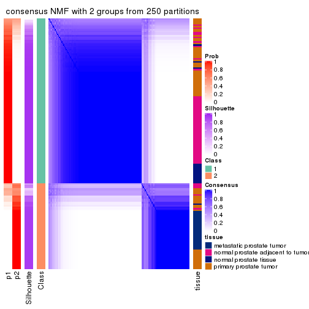</p>

</div>
<div id='tab-MAD-NMF-consensus-heatmap-2'>
<pre><code class="r">consensus_heatmap(res, k = 3)
</code></pre>

<p>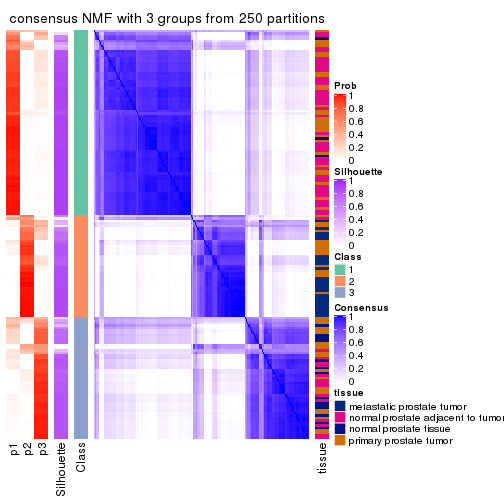</p>

</div>
<div id='tab-MAD-NMF-consensus-heatmap-3'>
<pre><code class="r">consensus_heatmap(res, k = 4)
</code></pre>

<p>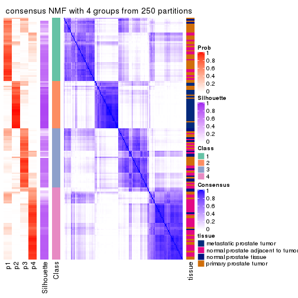</p>

</div>
<div id='tab-MAD-NMF-consensus-heatmap-4'>
<pre><code class="r">consensus_heatmap(res, k = 5)
</code></pre>

<p>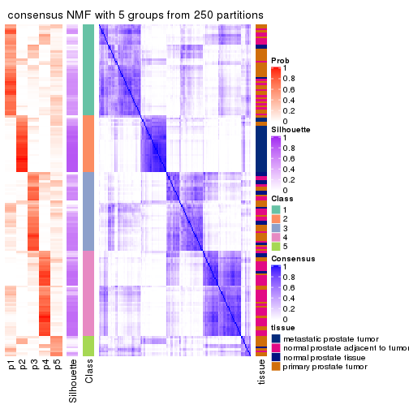</p>

</div>
<div id='tab-MAD-NMF-consensus-heatmap-5'>
<pre><code class="r">consensus_heatmap(res, k = 6)
</code></pre>

<p>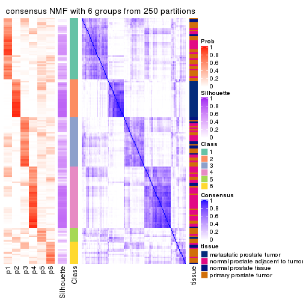</p>

</div>
</div>

Heatmaps for the membership of samples in all partitions to see how consistent they are:


<script>
$( function() {
	$( '#tabs-MAD-NMF-membership-heatmap' ).tabs();
} );
</script>
<div id='tabs-MAD-NMF-membership-heatmap'>
<ul>
<li><a href='#tab-MAD-NMF-membership-heatmap-1'>k = 2</a></li>
<li><a href='#tab-MAD-NMF-membership-heatmap-2'>k = 3</a></li>
<li><a href='#tab-MAD-NMF-membership-heatmap-3'>k = 4</a></li>
<li><a href='#tab-MAD-NMF-membership-heatmap-4'>k = 5</a></li>
<li><a href='#tab-MAD-NMF-membership-heatmap-5'>k = 6</a></li>
</ul>
<div id='tab-MAD-NMF-membership-heatmap-1'>
<pre><code class="r">membership_heatmap(res, k = 2)
</code></pre>

<p>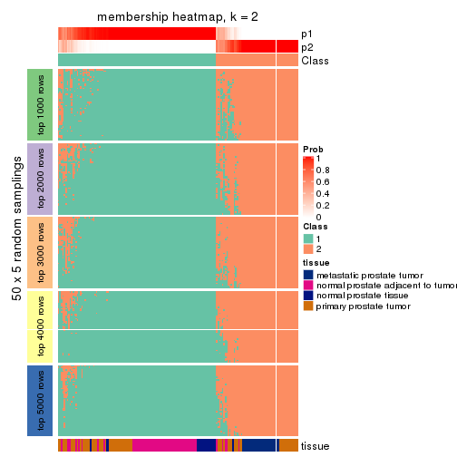</p>

</div>
<div id='tab-MAD-NMF-membership-heatmap-2'>
<pre><code class="r">membership_heatmap(res, k = 3)
</code></pre>

<p>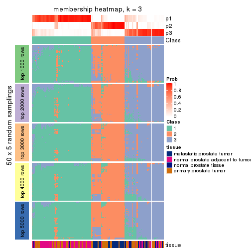</p>

</div>
<div id='tab-MAD-NMF-membership-heatmap-3'>
<pre><code class="r">membership_heatmap(res, k = 4)
</code></pre>

<p>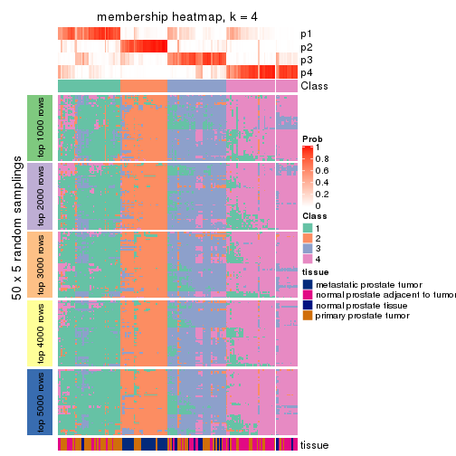</p>

</div>
<div id='tab-MAD-NMF-membership-heatmap-4'>
<pre><code class="r">membership_heatmap(res, k = 5)
</code></pre>

<p>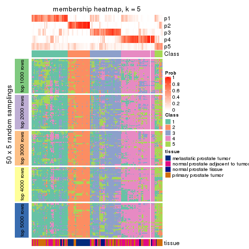</p>

</div>
<div id='tab-MAD-NMF-membership-heatmap-5'>
<pre><code class="r">membership_heatmap(res, k = 6)
</code></pre>

<p>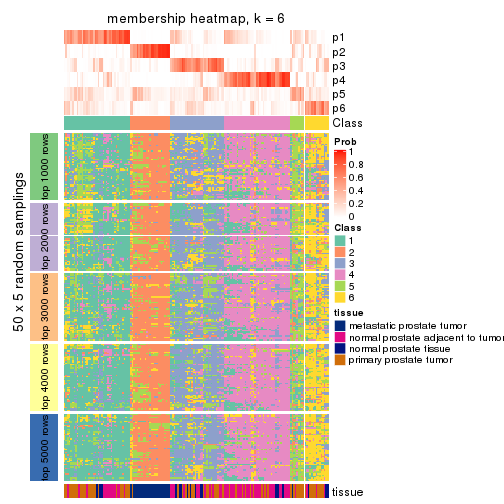</p>

</div>
</div>

As soon as we have had the classes for columns, we can look for signatures
which are significantly different between classes which can be candidate marks
for certain classes. Following are the heatmaps for signatures.


Signature heatmaps where rows are scaled:


<script>
$( function() {
	$( '#tabs-MAD-NMF-get-signatures' ).tabs();
} );
</script>
<div id='tabs-MAD-NMF-get-signatures'>
<ul>
<li><a href='#tab-MAD-NMF-get-signatures-1'>k = 2</a></li>
<li><a href='#tab-MAD-NMF-get-signatures-2'>k = 3</a></li>
<li><a href='#tab-MAD-NMF-get-signatures-3'>k = 4</a></li>
<li><a href='#tab-MAD-NMF-get-signatures-4'>k = 5</a></li>
<li><a href='#tab-MAD-NMF-get-signatures-5'>k = 6</a></li>
</ul>
<div id='tab-MAD-NMF-get-signatures-1'>
<pre><code class="r">get_signatures(res, k = 2)
</code></pre>

<p>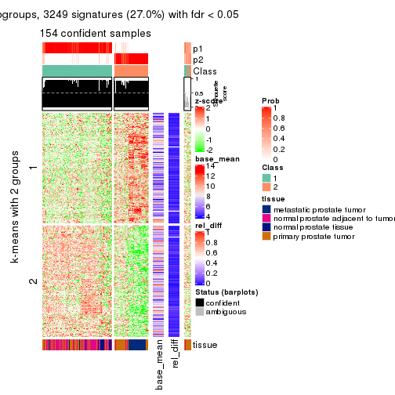</p>

</div>
<div id='tab-MAD-NMF-get-signatures-2'>
<pre><code class="r">get_signatures(res, k = 3)
</code></pre>

<p>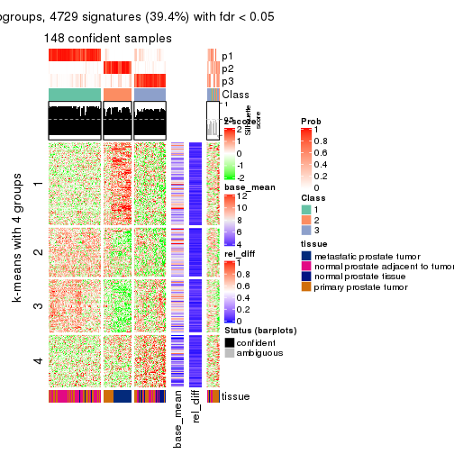</p>

</div>
<div id='tab-MAD-NMF-get-signatures-3'>
<pre><code class="r">get_signatures(res, k = 4)
</code></pre>

<p>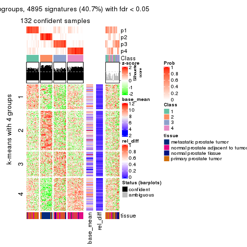</p>

</div>
<div id='tab-MAD-NMF-get-signatures-4'>
<pre><code class="r">get_signatures(res, k = 5)
</code></pre>

<p>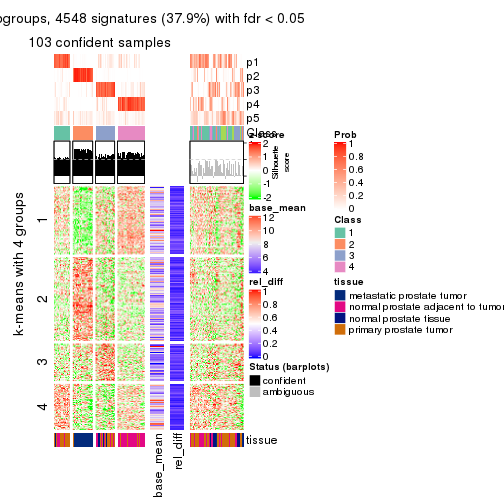</p>

</div>
<div id='tab-MAD-NMF-get-signatures-5'>
<pre><code class="r">get_signatures(res, k = 6)
</code></pre>

<p>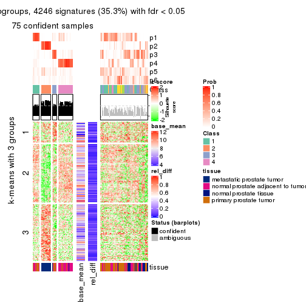</p>

</div>
</div>


Signature heatmaps where rows are not scaled:


<script>
$( function() {
	$( '#tabs-MAD-NMF-get-signatures-no-scale' ).tabs();
} );
</script>
<div id='tabs-MAD-NMF-get-signatures-no-scale'>
<ul>
<li><a href='#tab-MAD-NMF-get-signatures-no-scale-1'>k = 2</a></li>
<li><a href='#tab-MAD-NMF-get-signatures-no-scale-2'>k = 3</a></li>
<li><a href='#tab-MAD-NMF-get-signatures-no-scale-3'>k = 4</a></li>
<li><a href='#tab-MAD-NMF-get-signatures-no-scale-4'>k = 5</a></li>
<li><a href='#tab-MAD-NMF-get-signatures-no-scale-5'>k = 6</a></li>
</ul>
<div id='tab-MAD-NMF-get-signatures-no-scale-1'>
<pre><code class="r">get_signatures(res, k = 2, scale_rows = FALSE)
</code></pre>

<p>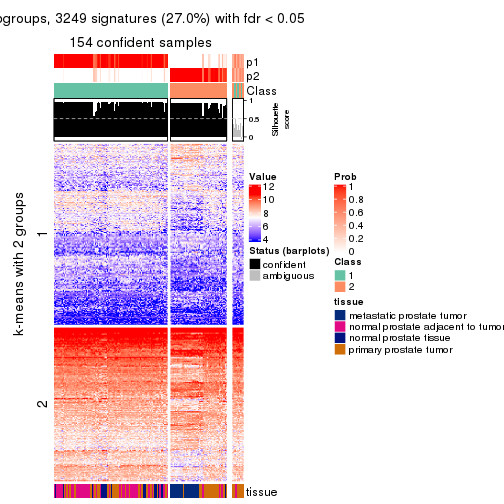</p>

</div>
<div id='tab-MAD-NMF-get-signatures-no-scale-2'>
<pre><code class="r">get_signatures(res, k = 3, scale_rows = FALSE)
</code></pre>

<p>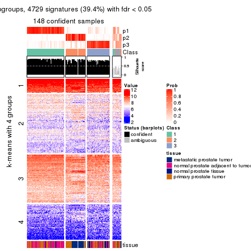</p>

</div>
<div id='tab-MAD-NMF-get-signatures-no-scale-3'>
<pre><code class="r">get_signatures(res, k = 4, scale_rows = FALSE)
</code></pre>

<p>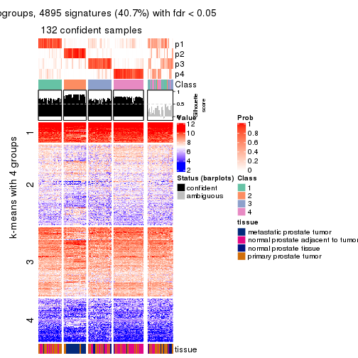</p>

</div>
<div id='tab-MAD-NMF-get-signatures-no-scale-4'>
<pre><code class="r">get_signatures(res, k = 5, scale_rows = FALSE)
</code></pre>

<p>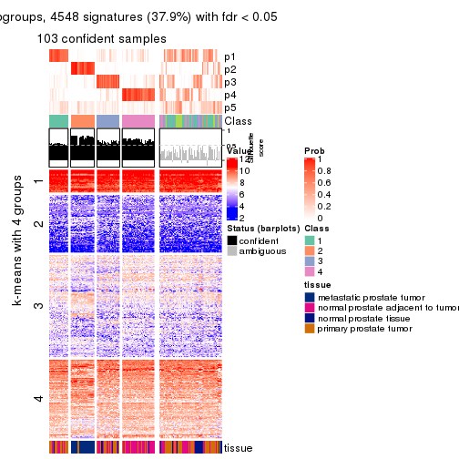</p>

</div>
<div id='tab-MAD-NMF-get-signatures-no-scale-5'>
<pre><code class="r">get_signatures(res, k = 6, scale_rows = FALSE)
</code></pre>

<p>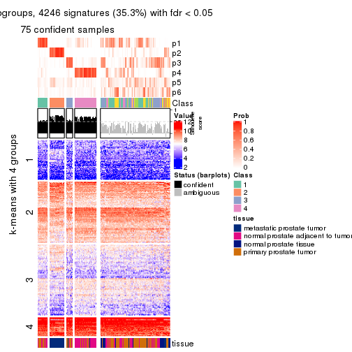</p>

</div>
</div>


Compare the overlap of signatures from different k:

```r
compare_signatures(res)
```

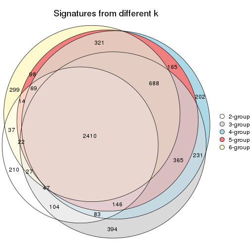

`get_signature()` returns a data frame invisibly. TO get the list of signatures, the function
call should be assigned to a variable explicitly. In following code, if `plot` argument is set
to `FALSE`, no heatmap is plotted while only the differential analysis is performed.

```r
# code only for demonstration
tb = get_signature(res, k = ..., plot = FALSE)
```

An example of the output of `tb` is:

```
#>   which_row         fdr    mean_1    mean_2 scaled_mean_1 scaled_mean_2 km
#> 1        38 0.042760348  8.373488  9.131774    -0.5533452     0.5164555  1
#> 2        40 0.018707592  7.106213  8.469186    -0.6173731     0.5762149  1
#> 3        55 0.019134737 10.221463 11.207825    -0.6159697     0.5749050  1
#> 4        59 0.006059896  5.921854  7.869574    -0.6899429     0.6439467  1
#> 5        60 0.018055526  8.928898 10.211722    -0.6204761     0.5791110  1
#> 6        98 0.009384629 15.714769 14.887706     0.6635654    -0.6193277  2
...
```

The columns in `tb` are:

1. `which_row`: row indices corresponding to the input matrix.
2. `fdr`: FDR for the differential test. 
3. `mean_x`: The mean value in group x.
4. `scaled_mean_x`: The mean value in group x after rows are scaled.
5. `km`: Row groups if k-means clustering is applied to rows.


UMAP plot which shows how samples are separated.


<script>
$( function() {
	$( '#tabs-MAD-NMF-dimension-reduction' ).tabs();
} );
</script>
<div id='tabs-MAD-NMF-dimension-reduction'>
<ul>
<li><a href='#tab-MAD-NMF-dimension-reduction-1'>k = 2</a></li>
<li><a href='#tab-MAD-NMF-dimension-reduction-2'>k = 3</a></li>
<li><a href='#tab-MAD-NMF-dimension-reduction-3'>k = 4</a></li>
<li><a href='#tab-MAD-NMF-dimension-reduction-4'>k = 5</a></li>
<li><a href='#tab-MAD-NMF-dimension-reduction-5'>k = 6</a></li>
</ul>
<div id='tab-MAD-NMF-dimension-reduction-1'>
<pre><code class="r">dimension_reduction(res, k = 2, method = &quot;UMAP&quot;)
</code></pre>

<p>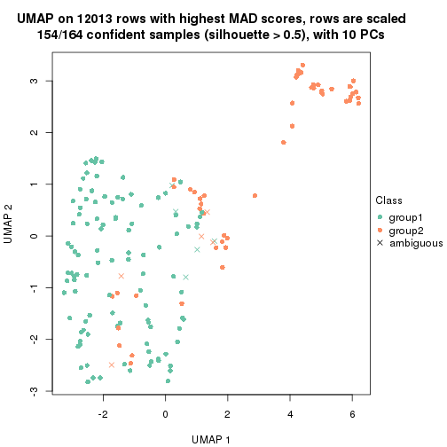</p>

</div>
<div id='tab-MAD-NMF-dimension-reduction-2'>
<pre><code class="r">dimension_reduction(res, k = 3, method = &quot;UMAP&quot;)
</code></pre>

<p>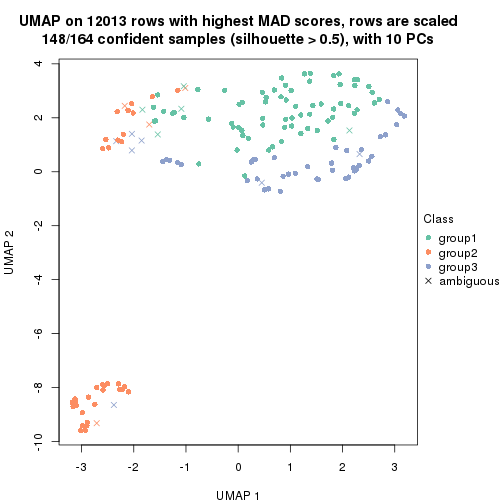</p>

</div>
<div id='tab-MAD-NMF-dimension-reduction-3'>
<pre><code class="r">dimension_reduction(res, k = 4, method = &quot;UMAP&quot;)
</code></pre>

<p>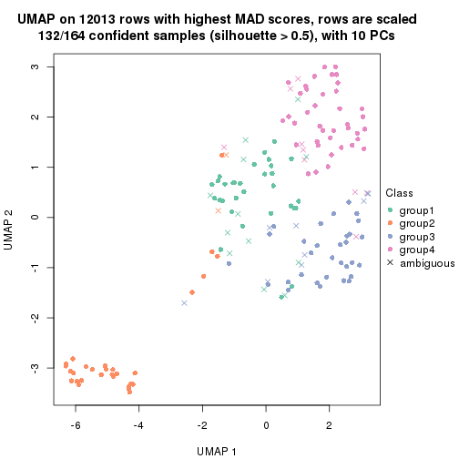</p>

</div>
<div id='tab-MAD-NMF-dimension-reduction-4'>
<pre><code class="r">dimension_reduction(res, k = 5, method = &quot;UMAP&quot;)
</code></pre>

<p>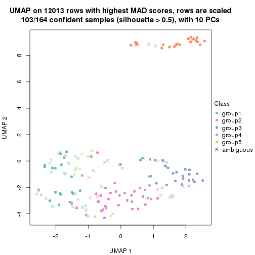</p>

</div>
<div id='tab-MAD-NMF-dimension-reduction-5'>
<pre><code class="r">dimension_reduction(res, k = 6, method = &quot;UMAP&quot;)
</code></pre>

<p>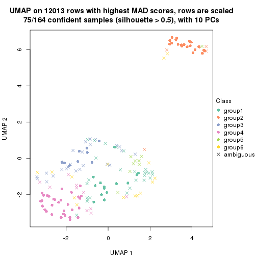</p>

</div>
</div>


Following heatmap shows how subgroups are split when increasing `k`:

```r
collect_classes(res)
```

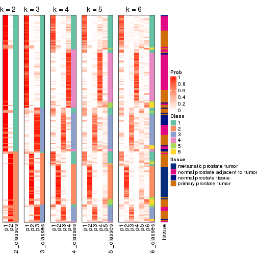


Test correlation between subgroups and known annotations. If the known
annotation is numeric, one-way ANOVA test is applied, and if the known
annotation is discrete, chi-squared contingency table test is applied.

```r
test_to_known_factors(res)
```

```
#>           n tissue(p) k
#> MAD:NMF 154  6.80e-16 2
#> MAD:NMF 148  3.75e-23 3
#> MAD:NMF 132  4.45e-23 4
#> MAD:NMF 103  2.76e-20 5
#> MAD:NMF  75  1.15e-15 6
```


If matrix rows can be associated to genes, consider to use `functional_enrichment(res,
...)` to perform function enrichment for the signature genes. See [this vignette](http://bioconductor.org/packages/devel/bioc/vignettes/cola/inst/doc/functional_enrichment.html) for more detailed explanations.


 

---------------------------------------------------


### ATC:hclust**


The object with results only for a single top-value method and a single partition method 
can be extracted as:

```r
res = res_list["ATC", "hclust"]
# you can also extract it by
# res = res_list["ATC:hclust"]
```

A summary of `res` and all the functions that can be applied to it:

```r
res
```

```
#> A 'ConsensusPartition' object with k = 2, 3, 4, 5, 6.
#>   On a matrix with 12013 rows and 164 columns.
#>   Top rows (1000, 2000, 3000, 4000, 5000) are extracted by 'ATC' method.
#>   Subgroups are detected by 'hclust' method.
#>   Performed in total 1250 partitions by row resampling.
#>   Best k for subgroups seems to be 2.
#> 
#> Following methods can be applied to this 'ConsensusPartition' object:
#>  [1] "cola_report"             "collect_classes"         "collect_plots"          
#>  [4] "collect_stats"           "colnames"                "compare_signatures"     
#>  [7] "consensus_heatmap"       "dimension_reduction"     "functional_enrichment"  
#> [10] "get_anno_col"            "get_anno"                "get_classes"            
#> [13] "get_consensus"           "get_matrix"              "get_membership"         
#> [16] "get_param"               "get_signatures"          "get_stats"              
#> [19] "is_best_k"               "is_stable_k"             "membership_heatmap"     
#> [22] "ncol"                    "nrow"                    "plot_ecdf"              
#> [25] "rownames"                "select_partition_number" "show"                   
#> [28] "suggest_best_k"          "test_to_known_factors"
```

`collect_plots()` function collects all the plots made from `res` for all `k` (number of partitions)
into one single page to provide an easy and fast comparison between different `k`.

```r
collect_plots(res)
```

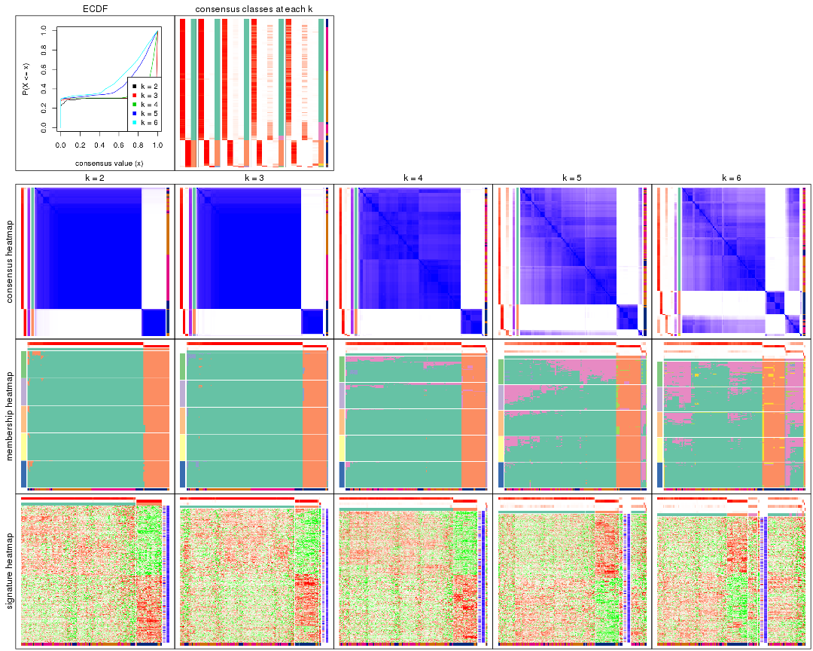

The plots are:

- The first row: a plot of the ECDF (empirical cumulative distribution
  function) curves of the consensus matrix for each `k` and the heatmap of
  predicted classes for each `k`.
- The second row: heatmaps of the consensus matrix for each `k`.
- The third row: heatmaps of the membership matrix for each `k`.
- The fouth row: heatmaps of the signatures for each `k`.

All the plots in panels can be made by individual functions and they are
plotted later in this section.

`select_partition_number()` produces several plots showing different
statistics for choosing "optimized" `k`. There are following statistics:

- ECDF curves of the consensus matrix for each `k`;
- 1-PAC. [The PAC
  score](https://en.wikipedia.org/wiki/Consensus_clustering#Over-interpretation_potential_of_consensus_clustering)
  measures the proportion of the ambiguous subgrouping.
- Mean silhouette score.
- Concordance. The mean probability of fiting the consensus class ids in all
  partitions.
- Area increased. Denote $A_k$ as the area under the ECDF curve for current
  `k`, the area increased is defined as $A_k - A_{k-1}$.
- Rand index. The percent of pairs of samples that are both in a same cluster
  or both are not in a same cluster in the partition of k and k-1.
- Jaccard index. The ratio of pairs of samples are both in a same cluster in
  the partition of k and k-1 and the pairs of samples are both in a same
  cluster in the partition k or k-1.

The detailed explanations of these statistics can be found in [the _cola_
vignette](http://bioconductor.org/packages/devel/bioc/vignettes/cola/inst/doc/cola.html#toc_13).

Generally speaking, lower PAC score, higher mean silhouette score or higher
concordance corresponds to better partition. Rand index and Jaccard index
measure how similar the current partition is compared to partition with `k-1`.
If they are too similar, we won't accept `k` is better than `k-1`.

```r
select_partition_number(res)
```

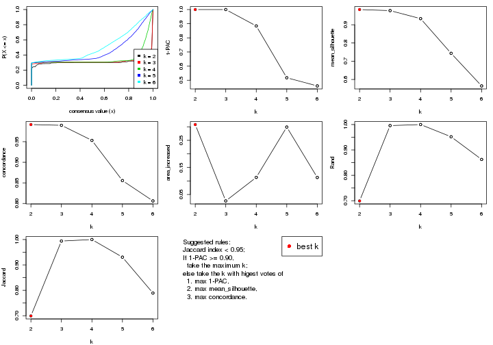

The numeric values for all these statistics can be obtained by `get_stats()`.

```r
get_stats(res)
```

```
#>   k 1-PAC mean_silhouette concordance area_increased  Rand Jaccard
#> 2 2 1.000           0.983       0.992         0.3082 0.699   0.699
#> 3 3 1.000           0.977       0.990         0.0262 0.996   0.994
#> 4 4 0.884           0.933       0.953         0.1131 1.000   1.000
#> 5 5 0.518           0.743       0.856         0.2990 0.952   0.931
#> 6 6 0.460           0.565       0.806         0.1128 0.863   0.789
```

`suggest_best_k()` suggests the best $k$ based on these statistics. The rules are as follows:

- All $k$ with Jaccard index larger than 0.95 are removed because increasing
  $k$ does not provide enough extra information. If all $k$ are removed, it is
  marked as no subgroup is detected.
- For all $k$ with 1-PAC score larger than 0.9, the maximal $k$ is taken as
  the best $k$, and other $k$ are marked as optional $k$.
- If it does not fit the second rule. The $k$ with the maximal vote of the
  highest 1-PAC score, highest mean silhouette, and highest concordance is
  taken as the best $k$.

```r
suggest_best_k(res)
```

```
#> [1] 2
```


Following shows the table of the partitions (You need to click the **show/hide
code output** link to see it). The membership matrix (columns with name `p*`)
is inferred by
[`clue::cl_consensus()`](https://www.rdocumentation.org/link/cl_consensus?package=clue)
function with the `SE` method. Basically the value in the membership matrix
represents the probability to belong to a certain group. The finall class
label for an item is determined with the group with highest probability it
belongs to.

In `get_classes()` function, the entropy is calculated from the membership
matrix and the silhouette score is calculated from the consensus matrix.


<script>
$( function() {
	$( '#tabs-ATC-hclust-get-classes' ).tabs();
} );
</script>
<div id='tabs-ATC-hclust-get-classes'>
<ul>
<li><a href='#tab-ATC-hclust-get-classes-1'>k = 2</a></li>
<li><a href='#tab-ATC-hclust-get-classes-2'>k = 3</a></li>
<li><a href='#tab-ATC-hclust-get-classes-3'>k = 4</a></li>
<li><a href='#tab-ATC-hclust-get-classes-4'>k = 5</a></li>
<li><a href='#tab-ATC-hclust-get-classes-5'>k = 6</a></li>
</ul>

<div id='tab-ATC-hclust-get-classes-1'>
<p><a id='tab-ATC-hclust-get-classes-1-a' style='color:#0366d6' href='#'>show/hide code output</a></p>
<pre><code class="r">cbind(get_classes(res, k = 2), get_membership(res, k = 2))
</code></pre>

<pre><code>#&gt;           class entropy silhouette    p1    p2
#&gt; GSM152839     1  0.0000      0.991 1.000 0.000
#&gt; GSM152840     1  0.2603      0.955 0.956 0.044
#&gt; GSM152841     1  0.0376      0.989 0.996 0.004
#&gt; GSM152842     1  0.0000      0.991 1.000 0.000
#&gt; GSM152843     1  0.0000      0.991 1.000 0.000
#&gt; GSM152844     1  0.2603      0.955 0.956 0.044
#&gt; GSM152845     2  0.3114      0.938 0.056 0.944
#&gt; GSM152846     1  0.8207      0.669 0.744 0.256
#&gt; GSM152847     1  0.0000      0.991 1.000 0.000
#&gt; GSM152848     1  0.0000      0.991 1.000 0.000
#&gt; GSM152849     1  0.0000      0.991 1.000 0.000
#&gt; GSM152850     1  0.0000      0.991 1.000 0.000
#&gt; GSM152851     1  0.0000      0.991 1.000 0.000
#&gt; GSM152852     1  0.7376      0.749 0.792 0.208
#&gt; GSM152853     1  0.2603      0.955 0.956 0.044
#&gt; GSM152854     1  0.1414      0.976 0.980 0.020
#&gt; GSM152855     1  0.0000      0.991 1.000 0.000
#&gt; GSM153238     1  0.0000      0.991 1.000 0.000
#&gt; GSM153239     1  0.0000      0.991 1.000 0.000
#&gt; GSM153240     1  0.0000      0.991 1.000 0.000
#&gt; GSM153241     1  0.0000      0.991 1.000 0.000
#&gt; GSM153242     1  0.3114      0.944 0.944 0.056
#&gt; GSM153243     1  0.0672      0.986 0.992 0.008
#&gt; GSM153244     1  0.2043      0.967 0.968 0.032
#&gt; GSM153245     1  0.0000      0.991 1.000 0.000
#&gt; GSM153246     1  0.0000      0.991 1.000 0.000
#&gt; GSM153247     1  0.0000      0.991 1.000 0.000
#&gt; GSM153248     1  0.0000      0.991 1.000 0.000
#&gt; GSM153249     1  0.0000      0.991 1.000 0.000
#&gt; GSM153250     1  0.0000      0.991 1.000 0.000
#&gt; GSM153251     1  0.2236      0.963 0.964 0.036
#&gt; GSM153252     1  0.0000      0.991 1.000 0.000
#&gt; GSM153253     1  0.0376      0.989 0.996 0.004
#&gt; GSM153254     1  0.0000      0.991 1.000 0.000
#&gt; GSM153255     1  0.0000      0.991 1.000 0.000
#&gt; GSM153256     1  0.0000      0.991 1.000 0.000
#&gt; GSM153257     1  0.0000      0.991 1.000 0.000
#&gt; GSM153258     1  0.0000      0.991 1.000 0.000
#&gt; GSM153259     1  0.0000      0.991 1.000 0.000
#&gt; GSM153260     1  0.0000      0.991 1.000 0.000
#&gt; GSM153261     1  0.0000      0.991 1.000 0.000
#&gt; GSM153262     1  0.0000      0.991 1.000 0.000
#&gt; GSM153263     1  0.0000      0.991 1.000 0.000
#&gt; GSM153264     1  0.0000      0.991 1.000 0.000
#&gt; GSM153265     1  0.0000      0.991 1.000 0.000
#&gt; GSM153266     1  0.0000      0.991 1.000 0.000
#&gt; GSM153267     1  0.0000      0.991 1.000 0.000
#&gt; GSM153268     1  0.0376      0.989 0.996 0.004
#&gt; GSM153269     1  0.0000      0.991 1.000 0.000
#&gt; GSM153270     1  0.0000      0.991 1.000 0.000
#&gt; GSM153271     1  0.0000      0.991 1.000 0.000
#&gt; GSM153272     1  0.0000      0.991 1.000 0.000
#&gt; GSM153273     1  0.0000      0.991 1.000 0.000
#&gt; GSM153274     1  0.0000      0.991 1.000 0.000
#&gt; GSM153275     1  0.0000      0.991 1.000 0.000
#&gt; GSM153276     1  0.0000      0.991 1.000 0.000
#&gt; GSM153277     1  0.0000      0.991 1.000 0.000
#&gt; GSM153278     1  0.0000      0.991 1.000 0.000
#&gt; GSM153279     1  0.0000      0.991 1.000 0.000
#&gt; GSM153280     1  0.0000      0.991 1.000 0.000
#&gt; GSM153281     1  0.0000      0.991 1.000 0.000
#&gt; GSM153282     1  0.0376      0.989 0.996 0.004
#&gt; GSM153283     1  0.0000      0.991 1.000 0.000
#&gt; GSM153284     1  0.0000      0.991 1.000 0.000
#&gt; GSM153285     1  0.0000      0.991 1.000 0.000
#&gt; GSM153286     1  0.0000      0.991 1.000 0.000
#&gt; GSM153287     1  0.0000      0.991 1.000 0.000
#&gt; GSM153288     1  0.0000      0.991 1.000 0.000
#&gt; GSM153289     1  0.0000      0.991 1.000 0.000
#&gt; GSM153290     1  0.0000      0.991 1.000 0.000
#&gt; GSM153291     1  0.0000      0.991 1.000 0.000
#&gt; GSM153292     1  0.0000      0.991 1.000 0.000
#&gt; GSM153293     1  0.0000      0.991 1.000 0.000
#&gt; GSM153294     1  0.0000      0.991 1.000 0.000
#&gt; GSM153295     1  0.0000      0.991 1.000 0.000
#&gt; GSM153054     1  0.0000      0.991 1.000 0.000
#&gt; GSM153055     1  0.0000      0.991 1.000 0.000
#&gt; GSM153056     1  0.0000      0.991 1.000 0.000
#&gt; GSM153057     1  0.2043      0.967 0.968 0.032
#&gt; GSM153058     1  0.2236      0.963 0.964 0.036
#&gt; GSM153059     1  0.2043      0.967 0.968 0.032
#&gt; GSM153060     1  0.2043      0.966 0.968 0.032
#&gt; GSM153061     1  0.0000      0.991 1.000 0.000
#&gt; GSM153062     2  0.6148      0.823 0.152 0.848
#&gt; GSM153063     1  0.0000      0.991 1.000 0.000
#&gt; GSM153064     1  0.0000      0.991 1.000 0.000
#&gt; GSM153065     1  0.0000      0.991 1.000 0.000
#&gt; GSM153066     1  0.4298      0.907 0.912 0.088
#&gt; GSM153067     1  0.0000      0.991 1.000 0.000
#&gt; GSM153068     1  0.0672      0.986 0.992 0.008
#&gt; GSM153069     1  0.0000      0.991 1.000 0.000
#&gt; GSM153070     1  0.0000      0.991 1.000 0.000
#&gt; GSM153071     1  0.0000      0.991 1.000 0.000
#&gt; GSM153072     1  0.0000      0.991 1.000 0.000
#&gt; GSM153073     1  0.0000      0.991 1.000 0.000
#&gt; GSM153074     1  0.0000      0.991 1.000 0.000
#&gt; GSM153075     1  0.0000      0.991 1.000 0.000
#&gt; GSM153076     1  0.0000      0.991 1.000 0.000
#&gt; GSM153077     1  0.0000      0.991 1.000 0.000
#&gt; GSM153078     1  0.0000      0.991 1.000 0.000
#&gt; GSM153079     1  0.0000      0.991 1.000 0.000
#&gt; GSM153080     1  0.0000      0.991 1.000 0.000
#&gt; GSM153081     1  0.0000      0.991 1.000 0.000
#&gt; GSM153082     1  0.0938      0.983 0.988 0.012
#&gt; GSM153083     1  0.0000      0.991 1.000 0.000
#&gt; GSM153084     1  0.2236      0.962 0.964 0.036
#&gt; GSM153085     1  0.0376      0.989 0.996 0.004
#&gt; GSM153086     1  0.0000      0.991 1.000 0.000
#&gt; GSM153087     1  0.0000      0.991 1.000 0.000
#&gt; GSM153088     1  0.0000      0.991 1.000 0.000
#&gt; GSM153089     1  0.2236      0.963 0.964 0.036
#&gt; GSM153090     1  0.0000      0.991 1.000 0.000
#&gt; GSM153091     1  0.0000      0.991 1.000 0.000
#&gt; GSM153092     1  0.0000      0.991 1.000 0.000
#&gt; GSM153093     1  0.0000      0.991 1.000 0.000
#&gt; GSM153094     1  0.0000      0.991 1.000 0.000
#&gt; GSM153095     1  0.0000      0.991 1.000 0.000
#&gt; GSM153096     1  0.0000      0.991 1.000 0.000
#&gt; GSM153097     1  0.0000      0.991 1.000 0.000
#&gt; GSM153098     1  0.0000      0.991 1.000 0.000
#&gt; GSM153099     1  0.0000      0.991 1.000 0.000
#&gt; GSM153100     1  0.0000      0.991 1.000 0.000
#&gt; GSM153101     1  0.0000      0.991 1.000 0.000
#&gt; GSM153102     1  0.0672      0.986 0.992 0.008
#&gt; GSM153103     1  0.0376      0.989 0.996 0.004
#&gt; GSM153104     1  0.0000      0.991 1.000 0.000
#&gt; GSM153106     1  0.0000      0.991 1.000 0.000
#&gt; GSM153107     1  0.0000      0.991 1.000 0.000
#&gt; GSM153108     1  0.0000      0.991 1.000 0.000
#&gt; GSM153109     1  0.0672      0.986 0.992 0.008
#&gt; GSM153110     1  0.0000      0.991 1.000 0.000
#&gt; GSM153111     1  0.0000      0.991 1.000 0.000
#&gt; GSM153112     1  0.0000      0.991 1.000 0.000
#&gt; GSM153113     1  0.2236      0.963 0.964 0.036
#&gt; GSM153114     1  0.0000      0.991 1.000 0.000
#&gt; GSM187532     2  0.0000      0.993 0.000 1.000
#&gt; GSM187533     2  0.0000      0.993 0.000 1.000
#&gt; GSM187534     2  0.0000      0.993 0.000 1.000
#&gt; GSM187535     1  0.2236      0.963 0.964 0.036
#&gt; GSM152906     2  0.0000      0.993 0.000 1.000
#&gt; GSM152907     2  0.0000      0.993 0.000 1.000
#&gt; GSM152908     2  0.0000      0.993 0.000 1.000
#&gt; GSM152909     2  0.0000      0.993 0.000 1.000
#&gt; GSM152910     2  0.0000      0.993 0.000 1.000
#&gt; GSM152911     2  0.0000      0.993 0.000 1.000
#&gt; GSM152912     2  0.0000      0.993 0.000 1.000
#&gt; GSM152913     2  0.0000      0.993 0.000 1.000
#&gt; GSM152914     2  0.0000      0.993 0.000 1.000
#&gt; GSM152915     2  0.0000      0.993 0.000 1.000
#&gt; GSM152916     2  0.0000      0.993 0.000 1.000
#&gt; GSM152917     2  0.0000      0.993 0.000 1.000
#&gt; GSM152918     2  0.0000      0.993 0.000 1.000
#&gt; GSM152919     2  0.0000      0.993 0.000 1.000
#&gt; GSM152920     2  0.0000      0.993 0.000 1.000
#&gt; GSM152921     2  0.0000      0.993 0.000 1.000
#&gt; GSM152922     2  0.0000      0.993 0.000 1.000
#&gt; GSM152923     2  0.0000      0.993 0.000 1.000
#&gt; GSM152924     2  0.0000      0.993 0.000 1.000
#&gt; GSM152925     2  0.0000      0.993 0.000 1.000
#&gt; GSM152926     2  0.0000      0.993 0.000 1.000
#&gt; GSM152927     2  0.0000      0.993 0.000 1.000
#&gt; GSM152928     2  0.0000      0.993 0.000 1.000
#&gt; GSM152929     2  0.0000      0.993 0.000 1.000
#&gt; GSM152930     2  0.0000      0.993 0.000 1.000
</code></pre>

<script>
$('#tab-ATC-hclust-get-classes-1-a').parent().next().next().hide();
$('#tab-ATC-hclust-get-classes-1-a').click(function(){
  $('#tab-ATC-hclust-get-classes-1-a').parent().next().next().toggle();
  return(false);
});
</script>
</div>

<div id='tab-ATC-hclust-get-classes-2'>
<p><a id='tab-ATC-hclust-get-classes-2-a' style='color:#0366d6' href='#'>show/hide code output</a></p>
<pre><code class="r">cbind(get_classes(res, k = 3), get_membership(res, k = 3))
</code></pre>

<pre><code>#&gt;           class entropy silhouette    p1    p2    p3
#&gt; GSM152839     1  0.0000      0.990 1.000 0.000 0.000
#&gt; GSM152840     1  0.1643      0.952 0.956 0.000 0.044
#&gt; GSM152841     1  0.0237      0.988 0.996 0.000 0.004
#&gt; GSM152842     1  0.0000      0.990 1.000 0.000 0.000
#&gt; GSM152843     1  0.0000      0.990 1.000 0.000 0.000
#&gt; GSM152844     1  0.1860      0.944 0.948 0.000 0.052
#&gt; GSM152845     3  0.0237      0.802 0.000 0.004 0.996
#&gt; GSM152846     1  0.5397      0.607 0.720 0.000 0.280
#&gt; GSM152847     1  0.0000      0.990 1.000 0.000 0.000
#&gt; GSM152848     1  0.0000      0.990 1.000 0.000 0.000
#&gt; GSM152849     1  0.0000      0.990 1.000 0.000 0.000
#&gt; GSM152850     1  0.0000      0.990 1.000 0.000 0.000
#&gt; GSM152851     1  0.0000      0.990 1.000 0.000 0.000
#&gt; GSM152852     1  0.4931      0.697 0.768 0.000 0.232
#&gt; GSM152853     1  0.1643      0.952 0.956 0.000 0.044
#&gt; GSM152854     1  0.0892      0.975 0.980 0.000 0.020
#&gt; GSM152855     1  0.0000      0.990 1.000 0.000 0.000
#&gt; GSM153238     1  0.0000      0.990 1.000 0.000 0.000
#&gt; GSM153239     1  0.0000      0.990 1.000 0.000 0.000
#&gt; GSM153240     1  0.0000      0.990 1.000 0.000 0.000
#&gt; GSM153241     1  0.0000      0.990 1.000 0.000 0.000
#&gt; GSM153242     1  0.1964      0.942 0.944 0.000 0.056
#&gt; GSM153243     1  0.0424      0.985 0.992 0.000 0.008
#&gt; GSM153244     1  0.1289      0.965 0.968 0.000 0.032
#&gt; GSM153245     1  0.0000      0.990 1.000 0.000 0.000
#&gt; GSM153246     1  0.0000      0.990 1.000 0.000 0.000
#&gt; GSM153247     1  0.0000      0.990 1.000 0.000 0.000
#&gt; GSM153248     1  0.0000      0.990 1.000 0.000 0.000
#&gt; GSM153249     1  0.0000      0.990 1.000 0.000 0.000
#&gt; GSM153250     1  0.0000      0.990 1.000 0.000 0.000
#&gt; GSM153251     1  0.1411      0.961 0.964 0.000 0.036
#&gt; GSM153252     1  0.0000      0.990 1.000 0.000 0.000
#&gt; GSM153253     1  0.0237      0.988 0.996 0.000 0.004
#&gt; GSM153254     1  0.0000      0.990 1.000 0.000 0.000
#&gt; GSM153255     1  0.0000      0.990 1.000 0.000 0.000
#&gt; GSM153256     1  0.0000      0.990 1.000 0.000 0.000
#&gt; GSM153257     1  0.0000      0.990 1.000 0.000 0.000
#&gt; GSM153258     1  0.0000      0.990 1.000 0.000 0.000
#&gt; GSM153259     1  0.0000      0.990 1.000 0.000 0.000
#&gt; GSM153260     1  0.0000      0.990 1.000 0.000 0.000
#&gt; GSM153261     1  0.0000      0.990 1.000 0.000 0.000
#&gt; GSM153262     1  0.0000      0.990 1.000 0.000 0.000
#&gt; GSM153263     1  0.0000      0.990 1.000 0.000 0.000
#&gt; GSM153264     1  0.0000      0.990 1.000 0.000 0.000
#&gt; GSM153265     1  0.0000      0.990 1.000 0.000 0.000
#&gt; GSM153266     1  0.0000      0.990 1.000 0.000 0.000
#&gt; GSM153267     1  0.0000      0.990 1.000 0.000 0.000
#&gt; GSM153268     1  0.0237      0.988 0.996 0.000 0.004
#&gt; GSM153269     1  0.0000      0.990 1.000 0.000 0.000
#&gt; GSM153270     1  0.0000      0.990 1.000 0.000 0.000
#&gt; GSM153271     1  0.0000      0.990 1.000 0.000 0.000
#&gt; GSM153272     1  0.0000      0.990 1.000 0.000 0.000
#&gt; GSM153273     1  0.0000      0.990 1.000 0.000 0.000
#&gt; GSM153274     1  0.0000      0.990 1.000 0.000 0.000
#&gt; GSM153275     1  0.0000      0.990 1.000 0.000 0.000
#&gt; GSM153276     1  0.0000      0.990 1.000 0.000 0.000
#&gt; GSM153277     1  0.0000      0.990 1.000 0.000 0.000
#&gt; GSM153278     1  0.0000      0.990 1.000 0.000 0.000
#&gt; GSM153279     1  0.0000      0.990 1.000 0.000 0.000
#&gt; GSM153280     1  0.0000      0.990 1.000 0.000 0.000
#&gt; GSM153281     1  0.0000      0.990 1.000 0.000 0.000
#&gt; GSM153282     1  0.0237      0.988 0.996 0.000 0.004
#&gt; GSM153283     1  0.0000      0.990 1.000 0.000 0.000
#&gt; GSM153284     1  0.0000      0.990 1.000 0.000 0.000
#&gt; GSM153285     1  0.0000      0.990 1.000 0.000 0.000
#&gt; GSM153286     1  0.0000      0.990 1.000 0.000 0.000
#&gt; GSM153287     1  0.0000      0.990 1.000 0.000 0.000
#&gt; GSM153288     1  0.0000      0.990 1.000 0.000 0.000
#&gt; GSM153289     1  0.0000      0.990 1.000 0.000 0.000
#&gt; GSM153290     1  0.0000      0.990 1.000 0.000 0.000
#&gt; GSM153291     1  0.0000      0.990 1.000 0.000 0.000
#&gt; GSM153292     1  0.0000      0.990 1.000 0.000 0.000
#&gt; GSM153293     1  0.0000      0.990 1.000 0.000 0.000
#&gt; GSM153294     1  0.0000      0.990 1.000 0.000 0.000
#&gt; GSM153295     1  0.0000      0.990 1.000 0.000 0.000
#&gt; GSM153054     1  0.0000      0.990 1.000 0.000 0.000
#&gt; GSM153055     1  0.0000      0.990 1.000 0.000 0.000
#&gt; GSM153056     1  0.0000      0.990 1.000 0.000 0.000
#&gt; GSM153057     1  0.1289      0.965 0.968 0.000 0.032
#&gt; GSM153058     1  0.1411      0.961 0.964 0.000 0.036
#&gt; GSM153059     1  0.1289      0.965 0.968 0.000 0.032
#&gt; GSM153060     1  0.1289      0.964 0.968 0.000 0.032
#&gt; GSM153061     1  0.0000      0.990 1.000 0.000 0.000
#&gt; GSM153062     3  0.2796      0.807 0.092 0.000 0.908
#&gt; GSM153063     1  0.0000      0.990 1.000 0.000 0.000
#&gt; GSM153064     1  0.0000      0.990 1.000 0.000 0.000
#&gt; GSM153065     1  0.0000      0.990 1.000 0.000 0.000
#&gt; GSM153066     1  0.2860      0.893 0.912 0.084 0.004
#&gt; GSM153067     1  0.0000      0.990 1.000 0.000 0.000
#&gt; GSM153068     1  0.0424      0.985 0.992 0.000 0.008
#&gt; GSM153069     1  0.0000      0.990 1.000 0.000 0.000
#&gt; GSM153070     1  0.0000      0.990 1.000 0.000 0.000
#&gt; GSM153071     1  0.0000      0.990 1.000 0.000 0.000
#&gt; GSM153072     1  0.0000      0.990 1.000 0.000 0.000
#&gt; GSM153073     1  0.0000      0.990 1.000 0.000 0.000
#&gt; GSM153074     1  0.0000      0.990 1.000 0.000 0.000
#&gt; GSM153075     1  0.0000      0.990 1.000 0.000 0.000
#&gt; GSM153076     1  0.0000      0.990 1.000 0.000 0.000
#&gt; GSM153077     1  0.0000      0.990 1.000 0.000 0.000
#&gt; GSM153078     1  0.0000      0.990 1.000 0.000 0.000
#&gt; GSM153079     1  0.0000      0.990 1.000 0.000 0.000
#&gt; GSM153080     1  0.0000      0.990 1.000 0.000 0.000
#&gt; GSM153081     1  0.0000      0.990 1.000 0.000 0.000
#&gt; GSM153082     1  0.0592      0.980 0.988 0.012 0.000
#&gt; GSM153083     1  0.0000      0.990 1.000 0.000 0.000
#&gt; GSM153084     1  0.1525      0.957 0.964 0.032 0.004
#&gt; GSM153085     1  0.0237      0.987 0.996 0.000 0.004
#&gt; GSM153086     1  0.0000      0.990 1.000 0.000 0.000
#&gt; GSM153087     1  0.0000      0.990 1.000 0.000 0.000
#&gt; GSM153088     1  0.0000      0.990 1.000 0.000 0.000
#&gt; GSM153089     1  0.1411      0.961 0.964 0.000 0.036
#&gt; GSM153090     1  0.0000      0.990 1.000 0.000 0.000
#&gt; GSM153091     1  0.0000      0.990 1.000 0.000 0.000
#&gt; GSM153092     1  0.0000      0.990 1.000 0.000 0.000
#&gt; GSM153093     1  0.0000      0.990 1.000 0.000 0.000
#&gt; GSM153094     1  0.0000      0.990 1.000 0.000 0.000
#&gt; GSM153095     1  0.0000      0.990 1.000 0.000 0.000
#&gt; GSM153096     1  0.0000      0.990 1.000 0.000 0.000
#&gt; GSM153097     1  0.0000      0.990 1.000 0.000 0.000
#&gt; GSM153098     1  0.0000      0.990 1.000 0.000 0.000
#&gt; GSM153099     1  0.0000      0.990 1.000 0.000 0.000
#&gt; GSM153100     1  0.0000      0.990 1.000 0.000 0.000
#&gt; GSM153101     1  0.0000      0.990 1.000 0.000 0.000
#&gt; GSM153102     1  0.0475      0.984 0.992 0.004 0.004
#&gt; GSM153103     1  0.0237      0.987 0.996 0.000 0.004
#&gt; GSM153104     1  0.0000      0.990 1.000 0.000 0.000
#&gt; GSM153106     1  0.0000      0.990 1.000 0.000 0.000
#&gt; GSM153107     1  0.0000      0.990 1.000 0.000 0.000
#&gt; GSM153108     1  0.0000      0.990 1.000 0.000 0.000
#&gt; GSM153109     1  0.0475      0.984 0.992 0.004 0.004
#&gt; GSM153110     1  0.0000      0.990 1.000 0.000 0.000
#&gt; GSM153111     1  0.0000      0.990 1.000 0.000 0.000
#&gt; GSM153112     1  0.0000      0.990 1.000 0.000 0.000
#&gt; GSM153113     1  0.1525      0.957 0.964 0.032 0.004
#&gt; GSM153114     1  0.0000      0.990 1.000 0.000 0.000
#&gt; GSM187532     2  0.3879      0.832 0.000 0.848 0.152
#&gt; GSM187533     2  0.0000      0.987 0.000 1.000 0.000
#&gt; GSM187534     2  0.0000      0.987 0.000 1.000 0.000
#&gt; GSM187535     1  0.1525      0.957 0.964 0.032 0.004
#&gt; GSM152906     2  0.0237      0.985 0.000 0.996 0.004
#&gt; GSM152907     2  0.0237      0.985 0.000 0.996 0.004
#&gt; GSM152908     2  0.0000      0.987 0.000 1.000 0.000
#&gt; GSM152909     2  0.3879      0.832 0.000 0.848 0.152
#&gt; GSM152910     2  0.0000      0.987 0.000 1.000 0.000
#&gt; GSM152911     2  0.0000      0.987 0.000 1.000 0.000
#&gt; GSM152912     2  0.0000      0.987 0.000 1.000 0.000
#&gt; GSM152913     2  0.1031      0.967 0.000 0.976 0.024
#&gt; GSM152914     2  0.0000      0.987 0.000 1.000 0.000
#&gt; GSM152915     2  0.0000      0.987 0.000 1.000 0.000
#&gt; GSM152916     2  0.0000      0.987 0.000 1.000 0.000
#&gt; GSM152917     2  0.0000      0.987 0.000 1.000 0.000
#&gt; GSM152918     2  0.0000      0.987 0.000 1.000 0.000
#&gt; GSM152919     2  0.0000      0.987 0.000 1.000 0.000
#&gt; GSM152920     2  0.0000      0.987 0.000 1.000 0.000
#&gt; GSM152921     2  0.0000      0.987 0.000 1.000 0.000
#&gt; GSM152922     2  0.0000      0.987 0.000 1.000 0.000
#&gt; GSM152923     2  0.0000      0.987 0.000 1.000 0.000
#&gt; GSM152924     2  0.0000      0.987 0.000 1.000 0.000
#&gt; GSM152925     2  0.0000      0.987 0.000 1.000 0.000
#&gt; GSM152926     2  0.0237      0.985 0.000 0.996 0.004
#&gt; GSM152927     2  0.0000      0.987 0.000 1.000 0.000
#&gt; GSM152928     2  0.0237      0.985 0.000 0.996 0.004
#&gt; GSM152929     2  0.0237      0.985 0.000 0.996 0.004
#&gt; GSM152930     2  0.0237      0.985 0.000 0.996 0.004
</code></pre>

<script>
$('#tab-ATC-hclust-get-classes-2-a').parent().next().next().hide();
$('#tab-ATC-hclust-get-classes-2-a').click(function(){
  $('#tab-ATC-hclust-get-classes-2-a').parent().next().next().toggle();
  return(false);
});
</script>
</div>

<div id='tab-ATC-hclust-get-classes-3'>
<p><a id='tab-ATC-hclust-get-classes-3-a' style='color:#0366d6' href='#'>show/hide code output</a></p>
<pre><code class="r">cbind(get_classes(res, k = 4), get_membership(res, k = 4))
</code></pre>

<pre><code>#&gt;           class entropy silhouette    p1    p2    p3    p4
#&gt; GSM152839     1  0.0921      0.956 0.972 0.000 0.028 0.000
#&gt; GSM152840     1  0.3164      0.900 0.884 0.000 0.064 0.052
#&gt; GSM152841     1  0.1902      0.937 0.932 0.000 0.064 0.004
#&gt; GSM152842     1  0.0921      0.956 0.972 0.000 0.028 0.000
#&gt; GSM152843     1  0.0921      0.956 0.972 0.000 0.028 0.000
#&gt; GSM152844     1  0.3400      0.888 0.872 0.000 0.064 0.064
#&gt; GSM152845     4  0.0469      0.000 0.000 0.000 0.012 0.988
#&gt; GSM152846     1  0.5546      0.577 0.664 0.000 0.044 0.292
#&gt; GSM152847     1  0.0921      0.956 0.972 0.000 0.028 0.000
#&gt; GSM152848     1  0.0921      0.956 0.972 0.000 0.028 0.000
#&gt; GSM152849     1  0.0921      0.956 0.972 0.000 0.028 0.000
#&gt; GSM152850     1  0.0921      0.956 0.972 0.000 0.028 0.000
#&gt; GSM152851     1  0.1474      0.946 0.948 0.000 0.052 0.000
#&gt; GSM152852     1  0.5374      0.658 0.704 0.000 0.052 0.244
#&gt; GSM152853     1  0.3164      0.900 0.884 0.000 0.064 0.052
#&gt; GSM152854     1  0.2011      0.931 0.920 0.000 0.080 0.000
#&gt; GSM152855     1  0.0921      0.953 0.972 0.000 0.028 0.000
#&gt; GSM153238     1  0.1389      0.952 0.952 0.000 0.048 0.000
#&gt; GSM153239     1  0.1637      0.941 0.940 0.000 0.060 0.000
#&gt; GSM153240     1  0.1118      0.951 0.964 0.000 0.036 0.000
#&gt; GSM153241     1  0.0921      0.959 0.972 0.000 0.028 0.000
#&gt; GSM153242     1  0.2949      0.905 0.888 0.000 0.088 0.024
#&gt; GSM153243     1  0.1743      0.949 0.940 0.000 0.056 0.004
#&gt; GSM153244     1  0.2197      0.933 0.916 0.000 0.080 0.004
#&gt; GSM153245     1  0.1637      0.941 0.940 0.000 0.060 0.000
#&gt; GSM153246     1  0.1022      0.953 0.968 0.000 0.032 0.000
#&gt; GSM153247     1  0.1302      0.953 0.956 0.000 0.044 0.000
#&gt; GSM153248     1  0.1211      0.954 0.960 0.000 0.040 0.000
#&gt; GSM153249     1  0.1389      0.946 0.952 0.000 0.048 0.000
#&gt; GSM153250     1  0.0592      0.958 0.984 0.000 0.016 0.000
#&gt; GSM153251     1  0.2401      0.920 0.904 0.000 0.092 0.004
#&gt; GSM153252     1  0.0817      0.954 0.976 0.000 0.024 0.000
#&gt; GSM153253     1  0.1902      0.937 0.932 0.000 0.064 0.004
#&gt; GSM153254     1  0.1474      0.946 0.948 0.000 0.052 0.000
#&gt; GSM153255     1  0.1118      0.951 0.964 0.000 0.036 0.000
#&gt; GSM153256     1  0.0336      0.958 0.992 0.000 0.008 0.000
#&gt; GSM153257     1  0.0921      0.953 0.972 0.000 0.028 0.000
#&gt; GSM153258     1  0.0707      0.958 0.980 0.000 0.020 0.000
#&gt; GSM153259     1  0.1557      0.950 0.944 0.000 0.056 0.000
#&gt; GSM153260     1  0.1389      0.953 0.952 0.000 0.048 0.000
#&gt; GSM153261     1  0.1389      0.953 0.952 0.000 0.048 0.000
#&gt; GSM153262     1  0.1474      0.945 0.948 0.000 0.052 0.000
#&gt; GSM153263     1  0.0817      0.958 0.976 0.000 0.024 0.000
#&gt; GSM153264     1  0.1022      0.956 0.968 0.000 0.032 0.000
#&gt; GSM153265     1  0.1637      0.941 0.940 0.000 0.060 0.000
#&gt; GSM153266     1  0.0817      0.957 0.976 0.000 0.024 0.000
#&gt; GSM153267     1  0.0592      0.957 0.984 0.000 0.016 0.000
#&gt; GSM153268     1  0.1902      0.937 0.932 0.000 0.064 0.004
#&gt; GSM153269     1  0.0469      0.958 0.988 0.000 0.012 0.000
#&gt; GSM153270     1  0.0469      0.957 0.988 0.000 0.012 0.000
#&gt; GSM153271     1  0.0592      0.958 0.984 0.000 0.016 0.000
#&gt; GSM153272     1  0.0336      0.958 0.992 0.000 0.008 0.000
#&gt; GSM153273     1  0.1211      0.954 0.960 0.000 0.040 0.000
#&gt; GSM153274     1  0.0707      0.955 0.980 0.000 0.020 0.000
#&gt; GSM153275     1  0.0817      0.955 0.976 0.000 0.024 0.000
#&gt; GSM153276     1  0.0469      0.958 0.988 0.000 0.012 0.000
#&gt; GSM153277     1  0.0921      0.953 0.972 0.000 0.028 0.000
#&gt; GSM153278     1  0.1557      0.950 0.944 0.000 0.056 0.000
#&gt; GSM153279     1  0.1474      0.946 0.948 0.000 0.052 0.000
#&gt; GSM153280     1  0.1637      0.941 0.940 0.000 0.060 0.000
#&gt; GSM153281     1  0.1118      0.951 0.964 0.000 0.036 0.000
#&gt; GSM153282     1  0.1902      0.937 0.932 0.000 0.064 0.004
#&gt; GSM153283     1  0.1022      0.956 0.968 0.000 0.032 0.000
#&gt; GSM153284     1  0.0592      0.958 0.984 0.000 0.016 0.000
#&gt; GSM153285     1  0.1211      0.949 0.960 0.000 0.040 0.000
#&gt; GSM153286     1  0.0469      0.958 0.988 0.000 0.012 0.000
#&gt; GSM153287     1  0.1118      0.951 0.964 0.000 0.036 0.000
#&gt; GSM153288     1  0.0817      0.954 0.976 0.000 0.024 0.000
#&gt; GSM153289     1  0.0707      0.955 0.980 0.000 0.020 0.000
#&gt; GSM153290     1  0.1637      0.941 0.940 0.000 0.060 0.000
#&gt; GSM153291     1  0.0817      0.954 0.976 0.000 0.024 0.000
#&gt; GSM153292     1  0.1302      0.949 0.956 0.000 0.044 0.000
#&gt; GSM153293     1  0.0469      0.958 0.988 0.000 0.012 0.000
#&gt; GSM153294     1  0.1211      0.954 0.960 0.000 0.040 0.000
#&gt; GSM153295     1  0.1022      0.956 0.968 0.000 0.032 0.000
#&gt; GSM153054     1  0.1389      0.952 0.952 0.000 0.048 0.000
#&gt; GSM153055     1  0.0707      0.958 0.980 0.000 0.020 0.000
#&gt; GSM153056     1  0.0921      0.959 0.972 0.000 0.028 0.000
#&gt; GSM153057     1  0.2197      0.933 0.916 0.000 0.080 0.004
#&gt; GSM153058     1  0.2401      0.920 0.904 0.000 0.092 0.004
#&gt; GSM153059     1  0.2197      0.939 0.916 0.000 0.080 0.004
#&gt; GSM153060     1  0.2216      0.923 0.908 0.000 0.092 0.000
#&gt; GSM153061     1  0.1474      0.952 0.948 0.000 0.052 0.000
#&gt; GSM153062     3  0.3444      0.000 0.000 0.000 0.816 0.184
#&gt; GSM153063     1  0.1474      0.946 0.948 0.000 0.052 0.000
#&gt; GSM153064     1  0.1557      0.950 0.944 0.000 0.056 0.000
#&gt; GSM153065     1  0.1637      0.948 0.940 0.000 0.060 0.000
#&gt; GSM153066     1  0.3697      0.872 0.852 0.048 0.100 0.000
#&gt; GSM153067     1  0.1302      0.949 0.956 0.000 0.044 0.000
#&gt; GSM153068     1  0.1792      0.952 0.932 0.000 0.068 0.000
#&gt; GSM153069     1  0.1118      0.951 0.964 0.000 0.036 0.000
#&gt; GSM153070     1  0.0817      0.957 0.976 0.000 0.024 0.000
#&gt; GSM153071     1  0.1302      0.953 0.956 0.000 0.044 0.000
#&gt; GSM153072     1  0.1302      0.953 0.956 0.000 0.044 0.000
#&gt; GSM153073     1  0.1302      0.953 0.956 0.000 0.044 0.000
#&gt; GSM153074     1  0.1022      0.952 0.968 0.000 0.032 0.000
#&gt; GSM153075     1  0.0469      0.957 0.988 0.000 0.012 0.000
#&gt; GSM153076     1  0.0592      0.958 0.984 0.000 0.016 0.000
#&gt; GSM153077     1  0.1022      0.956 0.968 0.000 0.032 0.000
#&gt; GSM153078     1  0.0921      0.956 0.972 0.000 0.028 0.000
#&gt; GSM153079     1  0.1474      0.950 0.948 0.000 0.052 0.000
#&gt; GSM153080     1  0.1118      0.959 0.964 0.000 0.036 0.000
#&gt; GSM153081     1  0.1022      0.956 0.968 0.000 0.032 0.000
#&gt; GSM153082     1  0.1637      0.948 0.940 0.000 0.060 0.000
#&gt; GSM153083     1  0.1557      0.950 0.944 0.000 0.056 0.000
#&gt; GSM153084     1  0.2281      0.925 0.904 0.000 0.096 0.000
#&gt; GSM153085     1  0.1637      0.948 0.940 0.000 0.060 0.000
#&gt; GSM153086     1  0.1557      0.950 0.944 0.000 0.056 0.000
#&gt; GSM153087     1  0.1302      0.950 0.956 0.000 0.044 0.000
#&gt; GSM153088     1  0.0592      0.958 0.984 0.000 0.016 0.000
#&gt; GSM153089     1  0.2401      0.920 0.904 0.000 0.092 0.004
#&gt; GSM153090     1  0.0469      0.958 0.988 0.000 0.012 0.000
#&gt; GSM153091     1  0.1557      0.950 0.944 0.000 0.056 0.000
#&gt; GSM153092     1  0.0592      0.958 0.984 0.000 0.016 0.000
#&gt; GSM153093     1  0.1118      0.951 0.964 0.000 0.036 0.000
#&gt; GSM153094     1  0.1557      0.950 0.944 0.000 0.056 0.000
#&gt; GSM153095     1  0.1474      0.951 0.948 0.000 0.052 0.000
#&gt; GSM153096     1  0.1211      0.954 0.960 0.000 0.040 0.000
#&gt; GSM153097     1  0.1557      0.950 0.944 0.000 0.056 0.000
#&gt; GSM153098     1  0.0921      0.957 0.972 0.000 0.028 0.000
#&gt; GSM153099     1  0.0336      0.958 0.992 0.000 0.008 0.000
#&gt; GSM153100     1  0.1211      0.954 0.960 0.000 0.040 0.000
#&gt; GSM153101     1  0.1211      0.954 0.960 0.000 0.040 0.000
#&gt; GSM153102     1  0.1792      0.944 0.932 0.000 0.068 0.000
#&gt; GSM153103     1  0.1637      0.948 0.940 0.000 0.060 0.000
#&gt; GSM153104     1  0.1302      0.949 0.956 0.000 0.044 0.000
#&gt; GSM153106     1  0.1211      0.954 0.960 0.000 0.040 0.000
#&gt; GSM153107     1  0.1211      0.954 0.960 0.000 0.040 0.000
#&gt; GSM153108     1  0.0921      0.957 0.972 0.000 0.028 0.000
#&gt; GSM153109     1  0.1792      0.944 0.932 0.000 0.068 0.000
#&gt; GSM153110     1  0.1557      0.950 0.944 0.000 0.056 0.000
#&gt; GSM153111     1  0.1557      0.950 0.944 0.000 0.056 0.000
#&gt; GSM153112     1  0.1211      0.954 0.960 0.000 0.040 0.000
#&gt; GSM153113     1  0.2401      0.925 0.904 0.004 0.092 0.000
#&gt; GSM153114     1  0.1022      0.952 0.968 0.000 0.032 0.000
#&gt; GSM187532     2  0.3647      0.808 0.000 0.832 0.016 0.152
#&gt; GSM187533     2  0.0188      0.970 0.000 0.996 0.004 0.000
#&gt; GSM187534     2  0.0188      0.971 0.000 0.996 0.004 0.000
#&gt; GSM187535     1  0.2281      0.925 0.904 0.000 0.096 0.000
#&gt; GSM152906     2  0.1389      0.957 0.000 0.952 0.048 0.000
#&gt; GSM152907     2  0.1389      0.957 0.000 0.952 0.048 0.000
#&gt; GSM152908     2  0.0000      0.971 0.000 1.000 0.000 0.000
#&gt; GSM152909     2  0.3647      0.808 0.000 0.832 0.016 0.152
#&gt; GSM152910     2  0.0000      0.971 0.000 1.000 0.000 0.000
#&gt; GSM152911     2  0.0000      0.971 0.000 1.000 0.000 0.000
#&gt; GSM152912     2  0.0000      0.971 0.000 1.000 0.000 0.000
#&gt; GSM152913     2  0.0817      0.958 0.000 0.976 0.000 0.024
#&gt; GSM152914     2  0.0000      0.971 0.000 1.000 0.000 0.000
#&gt; GSM152915     2  0.0000      0.971 0.000 1.000 0.000 0.000
#&gt; GSM152916     2  0.0817      0.967 0.000 0.976 0.024 0.000
#&gt; GSM152917     2  0.0000      0.971 0.000 1.000 0.000 0.000
#&gt; GSM152918     2  0.0000      0.971 0.000 1.000 0.000 0.000
#&gt; GSM152919     2  0.0000      0.971 0.000 1.000 0.000 0.000
#&gt; GSM152920     2  0.0000      0.971 0.000 1.000 0.000 0.000
#&gt; GSM152921     2  0.0000      0.971 0.000 1.000 0.000 0.000
#&gt; GSM152922     2  0.0000      0.971 0.000 1.000 0.000 0.000
#&gt; GSM152923     2  0.0921      0.966 0.000 0.972 0.028 0.000
#&gt; GSM152924     2  0.0817      0.967 0.000 0.976 0.024 0.000
#&gt; GSM152925     2  0.0817      0.967 0.000 0.976 0.024 0.000
#&gt; GSM152926     2  0.1389      0.957 0.000 0.952 0.048 0.000
#&gt; GSM152927     2  0.0817      0.967 0.000 0.976 0.024 0.000
#&gt; GSM152928     2  0.1389      0.957 0.000 0.952 0.048 0.000
#&gt; GSM152929     2  0.1389      0.957 0.000 0.952 0.048 0.000
#&gt; GSM152930     2  0.1389      0.957 0.000 0.952 0.048 0.000
</code></pre>

<script>
$('#tab-ATC-hclust-get-classes-3-a').parent().next().next().hide();
$('#tab-ATC-hclust-get-classes-3-a').click(function(){
  $('#tab-ATC-hclust-get-classes-3-a').parent().next().next().toggle();
  return(false);
});
</script>
</div>

<div id='tab-ATC-hclust-get-classes-4'>
<p><a id='tab-ATC-hclust-get-classes-4-a' style='color:#0366d6' href='#'>show/hide code output</a></p>
<pre><code class="r">cbind(get_classes(res, k = 5), get_membership(res, k = 5))
</code></pre>

<pre><code>#&gt;           class entropy silhouette    p1    p2    p3    p4    p5
#&gt; GSM152839     1  0.0404      0.810 0.988 0.000 0.000 0.012 0.000
#&gt; GSM152840     4  0.3857      0.786 0.312 0.000 0.000 0.688 0.000
#&gt; GSM152841     1  0.4138      0.411 0.616 0.000 0.000 0.384 0.000
#&gt; GSM152842     1  0.0290      0.809 0.992 0.000 0.000 0.008 0.000
#&gt; GSM152843     1  0.0290      0.809 0.992 0.000 0.000 0.008 0.000
#&gt; GSM152844     4  0.3752      0.792 0.292 0.000 0.000 0.708 0.000
#&gt; GSM152845     5  0.3527      0.000 0.000 0.000 0.056 0.116 0.828
#&gt; GSM152846     4  0.4799      0.445 0.120 0.000 0.016 0.756 0.108
#&gt; GSM152847     1  0.0404      0.810 0.988 0.000 0.000 0.012 0.000
#&gt; GSM152848     1  0.0290      0.809 0.992 0.000 0.000 0.008 0.000
#&gt; GSM152849     1  0.0404      0.810 0.988 0.000 0.000 0.012 0.000
#&gt; GSM152850     1  0.0404      0.810 0.988 0.000 0.000 0.012 0.000
#&gt; GSM152851     1  0.3949      0.553 0.668 0.000 0.000 0.332 0.000
#&gt; GSM152852     4  0.4604      0.593 0.156 0.000 0.012 0.760 0.072
#&gt; GSM152853     4  0.3857      0.786 0.312 0.000 0.000 0.688 0.000
#&gt; GSM152854     1  0.4341      0.358 0.592 0.000 0.004 0.404 0.000
#&gt; GSM152855     1  0.3210      0.724 0.788 0.000 0.000 0.212 0.000
#&gt; GSM153238     1  0.1251      0.794 0.956 0.000 0.008 0.036 0.000
#&gt; GSM153239     1  0.4074      0.468 0.636 0.000 0.000 0.364 0.000
#&gt; GSM153240     1  0.3242      0.719 0.784 0.000 0.000 0.216 0.000
#&gt; GSM153241     1  0.1851      0.805 0.912 0.000 0.000 0.088 0.000
#&gt; GSM153242     1  0.4706     -0.135 0.496 0.000 0.008 0.492 0.004
#&gt; GSM153243     1  0.3396      0.744 0.832 0.000 0.028 0.136 0.004
#&gt; GSM153244     1  0.3928      0.621 0.700 0.000 0.004 0.296 0.000
#&gt; GSM153245     1  0.4074      0.468 0.636 0.000 0.000 0.364 0.000
#&gt; GSM153246     1  0.3662      0.668 0.744 0.000 0.000 0.252 0.004
#&gt; GSM153247     1  0.1106      0.799 0.964 0.000 0.012 0.024 0.000
#&gt; GSM153248     1  0.1106      0.798 0.964 0.000 0.012 0.024 0.000
#&gt; GSM153249     1  0.3480      0.683 0.752 0.000 0.000 0.248 0.000
#&gt; GSM153250     1  0.0703      0.811 0.976 0.000 0.000 0.024 0.000
#&gt; GSM153251     1  0.4341      0.355 0.592 0.000 0.004 0.404 0.000
#&gt; GSM153252     1  0.2891      0.754 0.824 0.000 0.000 0.176 0.000
#&gt; GSM153253     1  0.4126      0.424 0.620 0.000 0.000 0.380 0.000
#&gt; GSM153254     1  0.3816      0.609 0.696 0.000 0.000 0.304 0.000
#&gt; GSM153255     1  0.3586      0.661 0.736 0.000 0.000 0.264 0.000
#&gt; GSM153256     1  0.1544      0.807 0.932 0.000 0.000 0.068 0.000
#&gt; GSM153257     1  0.2891      0.754 0.824 0.000 0.000 0.176 0.000
#&gt; GSM153258     1  0.1197      0.813 0.952 0.000 0.000 0.048 0.000
#&gt; GSM153259     1  0.1522      0.789 0.944 0.000 0.012 0.044 0.000
#&gt; GSM153260     1  0.2450      0.784 0.896 0.000 0.028 0.076 0.000
#&gt; GSM153261     1  0.2450      0.784 0.896 0.000 0.028 0.076 0.000
#&gt; GSM153262     1  0.3796      0.605 0.700 0.000 0.000 0.300 0.000
#&gt; GSM153263     1  0.1270      0.815 0.948 0.000 0.000 0.052 0.000
#&gt; GSM153264     1  0.0510      0.808 0.984 0.000 0.000 0.016 0.000
#&gt; GSM153265     1  0.4030      0.497 0.648 0.000 0.000 0.352 0.000
#&gt; GSM153266     1  0.0880      0.812 0.968 0.000 0.000 0.032 0.000
#&gt; GSM153267     1  0.2074      0.796 0.896 0.000 0.000 0.104 0.000
#&gt; GSM153268     1  0.4235      0.270 0.576 0.000 0.000 0.424 0.000
#&gt; GSM153269     1  0.2127      0.794 0.892 0.000 0.000 0.108 0.000
#&gt; GSM153270     1  0.2471      0.786 0.864 0.000 0.000 0.136 0.000
#&gt; GSM153271     1  0.0703      0.811 0.976 0.000 0.000 0.024 0.000
#&gt; GSM153272     1  0.1478      0.808 0.936 0.000 0.000 0.064 0.000
#&gt; GSM153273     1  0.1106      0.798 0.964 0.000 0.012 0.024 0.000
#&gt; GSM153274     1  0.2127      0.794 0.892 0.000 0.000 0.108 0.000
#&gt; GSM153275     1  0.2891      0.756 0.824 0.000 0.000 0.176 0.000
#&gt; GSM153276     1  0.2127      0.794 0.892 0.000 0.000 0.108 0.000
#&gt; GSM153277     1  0.3074      0.741 0.804 0.000 0.000 0.196 0.000
#&gt; GSM153278     1  0.1626      0.798 0.940 0.000 0.016 0.044 0.000
#&gt; GSM153279     1  0.3876      0.576 0.684 0.000 0.000 0.316 0.000
#&gt; GSM153280     1  0.4045      0.487 0.644 0.000 0.000 0.356 0.000
#&gt; GSM153281     1  0.3242      0.719 0.784 0.000 0.000 0.216 0.000
#&gt; GSM153282     1  0.4126      0.423 0.620 0.000 0.000 0.380 0.000
#&gt; GSM153283     1  0.0510      0.808 0.984 0.000 0.000 0.016 0.000
#&gt; GSM153284     1  0.2377      0.787 0.872 0.000 0.000 0.128 0.000
#&gt; GSM153285     1  0.3774      0.612 0.704 0.000 0.000 0.296 0.000
#&gt; GSM153286     1  0.1608      0.807 0.928 0.000 0.000 0.072 0.000
#&gt; GSM153287     1  0.3586      0.661 0.736 0.000 0.000 0.264 0.000
#&gt; GSM153288     1  0.2813      0.760 0.832 0.000 0.000 0.168 0.000
#&gt; GSM153289     1  0.2852      0.757 0.828 0.000 0.000 0.172 0.000
#&gt; GSM153290     1  0.4045      0.487 0.644 0.000 0.000 0.356 0.000
#&gt; GSM153291     1  0.2891      0.754 0.824 0.000 0.000 0.176 0.000
#&gt; GSM153292     1  0.3636      0.654 0.728 0.000 0.000 0.272 0.000
#&gt; GSM153293     1  0.1270      0.810 0.948 0.000 0.000 0.052 0.000
#&gt; GSM153294     1  0.1106      0.798 0.964 0.000 0.012 0.024 0.000
#&gt; GSM153295     1  0.2516      0.778 0.860 0.000 0.000 0.140 0.000
#&gt; GSM153054     1  0.1251      0.794 0.956 0.000 0.008 0.036 0.000
#&gt; GSM153055     1  0.1792      0.807 0.916 0.000 0.000 0.084 0.000
#&gt; GSM153056     1  0.1851      0.805 0.912 0.000 0.000 0.088 0.000
#&gt; GSM153057     1  0.3715      0.680 0.736 0.000 0.004 0.260 0.000
#&gt; GSM153058     1  0.4375      0.295 0.576 0.000 0.004 0.420 0.000
#&gt; GSM153059     1  0.3700      0.699 0.752 0.000 0.008 0.240 0.000
#&gt; GSM153060     1  0.4225      0.480 0.632 0.000 0.004 0.364 0.000
#&gt; GSM153061     1  0.1830      0.783 0.932 0.000 0.028 0.040 0.000
#&gt; GSM153062     3  0.0794      0.000 0.000 0.000 0.972 0.028 0.000
#&gt; GSM153063     1  0.3684      0.648 0.720 0.000 0.000 0.280 0.000
#&gt; GSM153064     1  0.1522      0.789 0.944 0.000 0.012 0.044 0.000
#&gt; GSM153065     1  0.1981      0.775 0.924 0.000 0.028 0.048 0.000
#&gt; GSM153066     1  0.4005      0.672 0.836 0.048 0.028 0.076 0.012
#&gt; GSM153067     1  0.3636      0.654 0.728 0.000 0.000 0.272 0.000
#&gt; GSM153068     1  0.2873      0.787 0.860 0.000 0.020 0.120 0.000
#&gt; GSM153069     1  0.3586      0.661 0.736 0.000 0.000 0.264 0.000
#&gt; GSM153070     1  0.0609      0.811 0.980 0.000 0.000 0.020 0.000
#&gt; GSM153071     1  0.0898      0.801 0.972 0.000 0.008 0.020 0.000
#&gt; GSM153072     1  0.1106      0.799 0.964 0.000 0.012 0.024 0.000
#&gt; GSM153073     1  0.0898      0.801 0.972 0.000 0.008 0.020 0.000
#&gt; GSM153074     1  0.2929      0.752 0.820 0.000 0.000 0.180 0.000
#&gt; GSM153075     1  0.2561      0.783 0.856 0.000 0.000 0.144 0.000
#&gt; GSM153076     1  0.1043      0.812 0.960 0.000 0.000 0.040 0.000
#&gt; GSM153077     1  0.0510      0.808 0.984 0.000 0.000 0.016 0.000
#&gt; GSM153078     1  0.0404      0.810 0.988 0.000 0.000 0.012 0.000
#&gt; GSM153079     1  0.1818      0.787 0.932 0.000 0.024 0.044 0.000
#&gt; GSM153080     1  0.2127      0.801 0.892 0.000 0.000 0.108 0.000
#&gt; GSM153081     1  0.0510      0.810 0.984 0.000 0.000 0.016 0.000
#&gt; GSM153082     1  0.1854      0.786 0.936 0.000 0.020 0.036 0.008
#&gt; GSM153083     1  0.1626      0.787 0.940 0.000 0.016 0.044 0.000
#&gt; GSM153084     1  0.2784      0.740 0.888 0.000 0.028 0.072 0.012
#&gt; GSM153085     1  0.1978      0.779 0.928 0.000 0.024 0.044 0.004
#&gt; GSM153086     1  0.1522      0.789 0.944 0.000 0.012 0.044 0.000
#&gt; GSM153087     1  0.3452      0.691 0.756 0.000 0.000 0.244 0.000
#&gt; GSM153088     1  0.0703      0.811 0.976 0.000 0.000 0.024 0.000
#&gt; GSM153089     1  0.4341      0.355 0.592 0.000 0.004 0.404 0.000
#&gt; GSM153090     1  0.1608      0.807 0.928 0.000 0.000 0.072 0.000
#&gt; GSM153091     1  0.1626      0.787 0.940 0.000 0.016 0.044 0.000
#&gt; GSM153092     1  0.1544      0.811 0.932 0.000 0.000 0.068 0.000
#&gt; GSM153093     1  0.3074      0.739 0.804 0.000 0.000 0.196 0.000
#&gt; GSM153094     1  0.1626      0.787 0.940 0.000 0.016 0.044 0.000
#&gt; GSM153095     1  0.1648      0.793 0.940 0.000 0.020 0.040 0.000
#&gt; GSM153096     1  0.1106      0.798 0.964 0.000 0.012 0.024 0.000
#&gt; GSM153097     1  0.1626      0.787 0.940 0.000 0.016 0.044 0.000
#&gt; GSM153098     1  0.2249      0.807 0.896 0.000 0.008 0.096 0.000
#&gt; GSM153099     1  0.1544      0.807 0.932 0.000 0.000 0.068 0.000
#&gt; GSM153100     1  0.1281      0.803 0.956 0.000 0.012 0.032 0.000
#&gt; GSM153101     1  0.1399      0.802 0.952 0.000 0.020 0.028 0.000
#&gt; GSM153102     1  0.2214      0.769 0.916 0.000 0.028 0.052 0.004
#&gt; GSM153103     1  0.1978      0.779 0.928 0.000 0.024 0.044 0.004
#&gt; GSM153104     1  0.3636      0.654 0.728 0.000 0.000 0.272 0.000
#&gt; GSM153106     1  0.1106      0.803 0.964 0.000 0.012 0.024 0.000
#&gt; GSM153107     1  0.1106      0.803 0.964 0.000 0.012 0.024 0.000
#&gt; GSM153108     1  0.2136      0.809 0.904 0.000 0.008 0.088 0.000
#&gt; GSM153109     1  0.2214      0.769 0.916 0.000 0.028 0.052 0.004
#&gt; GSM153110     1  0.1522      0.789 0.944 0.000 0.012 0.044 0.000
#&gt; GSM153111     1  0.1626      0.787 0.940 0.000 0.016 0.044 0.000
#&gt; GSM153112     1  0.1281      0.803 0.956 0.000 0.012 0.032 0.000
#&gt; GSM153113     1  0.2880      0.742 0.888 0.004 0.028 0.068 0.012
#&gt; GSM153114     1  0.3274      0.716 0.780 0.000 0.000 0.220 0.000
#&gt; GSM187532     2  0.3796      0.638 0.000 0.700 0.000 0.000 0.300
#&gt; GSM187533     2  0.2377      0.859 0.000 0.872 0.000 0.000 0.128
#&gt; GSM187534     2  0.2488      0.863 0.000 0.872 0.000 0.004 0.124
#&gt; GSM187535     1  0.2790      0.748 0.892 0.000 0.028 0.060 0.020
#&gt; GSM152906     2  0.1399      0.939 0.000 0.952 0.000 0.028 0.020
#&gt; GSM152907     2  0.1399      0.939 0.000 0.952 0.000 0.028 0.020
#&gt; GSM152908     2  0.0290      0.950 0.000 0.992 0.000 0.000 0.008
#&gt; GSM152909     2  0.3796      0.638 0.000 0.700 0.000 0.000 0.300
#&gt; GSM152910     2  0.0290      0.950 0.000 0.992 0.000 0.000 0.008
#&gt; GSM152911     2  0.0000      0.951 0.000 1.000 0.000 0.000 0.000
#&gt; GSM152912     2  0.0290      0.950 0.000 0.992 0.000 0.000 0.008
#&gt; GSM152913     2  0.0794      0.941 0.000 0.972 0.000 0.000 0.028
#&gt; GSM152914     2  0.0000      0.951 0.000 1.000 0.000 0.000 0.000
#&gt; GSM152915     2  0.0000      0.951 0.000 1.000 0.000 0.000 0.000
#&gt; GSM152916     2  0.0798      0.948 0.000 0.976 0.000 0.016 0.008
#&gt; GSM152917     2  0.0000      0.951 0.000 1.000 0.000 0.000 0.000
#&gt; GSM152918     2  0.0000      0.951 0.000 1.000 0.000 0.000 0.000
#&gt; GSM152919     2  0.0000      0.951 0.000 1.000 0.000 0.000 0.000
#&gt; GSM152920     2  0.0290      0.950 0.000 0.992 0.000 0.000 0.008
#&gt; GSM152921     2  0.0290      0.950 0.000 0.992 0.000 0.000 0.008
#&gt; GSM152922     2  0.0290      0.950 0.000 0.992 0.000 0.000 0.008
#&gt; GSM152923     2  0.0912      0.947 0.000 0.972 0.000 0.016 0.012
#&gt; GSM152924     2  0.0798      0.948 0.000 0.976 0.000 0.016 0.008
#&gt; GSM152925     2  0.0798      0.948 0.000 0.976 0.000 0.016 0.008
#&gt; GSM152926     2  0.1399      0.939 0.000 0.952 0.000 0.028 0.020
#&gt; GSM152927     2  0.0798      0.948 0.000 0.976 0.000 0.016 0.008
#&gt; GSM152928     2  0.1399      0.939 0.000 0.952 0.000 0.028 0.020
#&gt; GSM152929     2  0.1399      0.939 0.000 0.952 0.000 0.028 0.020
#&gt; GSM152930     2  0.1399      0.939 0.000 0.952 0.000 0.028 0.020
</code></pre>

<script>
$('#tab-ATC-hclust-get-classes-4-a').parent().next().next().hide();
$('#tab-ATC-hclust-get-classes-4-a').click(function(){
  $('#tab-ATC-hclust-get-classes-4-a').parent().next().next().toggle();
  return(false);
});
</script>
</div>

<div id='tab-ATC-hclust-get-classes-5'>
<p><a id='tab-ATC-hclust-get-classes-5-a' style='color:#0366d6' href='#'>show/hide code output</a></p>
<pre><code class="r">cbind(get_classes(res, k = 6), get_membership(res, k = 6))
</code></pre>

<pre><code>#&gt;           class entropy silhouette    p1    p2    p3    p4    p5    p6
#&gt; GSM152839     1  0.1049     0.7318 0.960 0.000 0.000 0.032 0.008 0.000
#&gt; GSM152840     4  0.2815     0.2683 0.120 0.000 0.000 0.848 0.032 0.000
#&gt; GSM152841     4  0.3979     0.5530 0.456 0.000 0.000 0.540 0.004 0.000
#&gt; GSM152842     1  0.0972     0.7312 0.964 0.000 0.000 0.028 0.008 0.000
#&gt; GSM152843     1  0.0972     0.7312 0.964 0.000 0.000 0.028 0.008 0.000
#&gt; GSM152844     4  0.2609     0.1853 0.096 0.000 0.000 0.868 0.036 0.000
#&gt; GSM152845     5  0.1444     0.0000 0.000 0.000 0.000 0.000 0.928 0.072
#&gt; GSM152846     4  0.3886    -0.4097 0.028 0.000 0.000 0.708 0.264 0.000
#&gt; GSM152847     1  0.1196     0.7311 0.952 0.000 0.000 0.040 0.008 0.000
#&gt; GSM152848     1  0.0972     0.7312 0.964 0.000 0.000 0.028 0.008 0.000
#&gt; GSM152849     1  0.1049     0.7318 0.960 0.000 0.000 0.032 0.008 0.000
#&gt; GSM152850     1  0.1049     0.7318 0.960 0.000 0.000 0.032 0.008 0.000
#&gt; GSM152851     1  0.3862    -0.3715 0.524 0.000 0.000 0.476 0.000 0.000
#&gt; GSM152852     4  0.3980    -0.3128 0.052 0.000 0.000 0.732 0.216 0.000
#&gt; GSM152853     4  0.2815     0.2683 0.120 0.000 0.000 0.848 0.032 0.000
#&gt; GSM152854     4  0.4488     0.5644 0.432 0.000 0.004 0.544 0.016 0.004
#&gt; GSM152855     1  0.3578     0.3068 0.660 0.000 0.000 0.340 0.000 0.000
#&gt; GSM153238     1  0.0881     0.7230 0.972 0.000 0.000 0.008 0.008 0.012
#&gt; GSM153239     4  0.3860     0.5208 0.472 0.000 0.000 0.528 0.000 0.000
#&gt; GSM153240     1  0.3620     0.2655 0.648 0.000 0.000 0.352 0.000 0.000
#&gt; GSM153241     1  0.2558     0.6750 0.840 0.000 0.000 0.156 0.004 0.000
#&gt; GSM153242     4  0.4528     0.5543 0.340 0.000 0.008 0.624 0.024 0.004
#&gt; GSM153243     1  0.3582     0.6299 0.812 0.000 0.020 0.140 0.012 0.016
#&gt; GSM153244     1  0.4371    -0.0530 0.576 0.000 0.008 0.404 0.008 0.004
#&gt; GSM153245     4  0.3860     0.5208 0.472 0.000 0.000 0.528 0.000 0.000
#&gt; GSM153246     1  0.6178    -0.1843 0.492 0.000 0.000 0.308 0.024 0.176
#&gt; GSM153247     1  0.0810     0.7285 0.976 0.000 0.004 0.004 0.008 0.008
#&gt; GSM153248     1  0.0798     0.7268 0.976 0.000 0.004 0.004 0.012 0.004
#&gt; GSM153249     1  0.3727     0.1030 0.612 0.000 0.000 0.388 0.000 0.000
#&gt; GSM153250     1  0.1643     0.7245 0.924 0.000 0.000 0.068 0.008 0.000
#&gt; GSM153251     4  0.4598     0.5300 0.440 0.000 0.008 0.532 0.016 0.004
#&gt; GSM153252     1  0.3508     0.4422 0.704 0.000 0.000 0.292 0.004 0.000
#&gt; GSM153253     4  0.3982     0.5478 0.460 0.000 0.000 0.536 0.004 0.000
#&gt; GSM153254     1  0.3833    -0.2196 0.556 0.000 0.000 0.444 0.000 0.000
#&gt; GSM153255     1  0.3737     0.0791 0.608 0.000 0.000 0.392 0.000 0.000
#&gt; GSM153256     1  0.2513     0.6812 0.852 0.000 0.000 0.140 0.008 0.000
#&gt; GSM153257     1  0.3508     0.4403 0.704 0.000 0.000 0.292 0.004 0.000
#&gt; GSM153258     1  0.1663     0.7204 0.912 0.000 0.000 0.088 0.000 0.000
#&gt; GSM153259     1  0.1223     0.7174 0.960 0.000 0.004 0.016 0.008 0.012
#&gt; GSM153260     1  0.2459     0.7012 0.900 0.000 0.020 0.056 0.012 0.012
#&gt; GSM153261     1  0.2459     0.7012 0.900 0.000 0.020 0.056 0.012 0.012
#&gt; GSM153262     1  0.3950    -0.1553 0.564 0.000 0.000 0.432 0.004 0.000
#&gt; GSM153263     1  0.2165     0.7121 0.884 0.000 0.000 0.108 0.008 0.000
#&gt; GSM153264     1  0.0972     0.7321 0.964 0.000 0.000 0.028 0.008 0.000
#&gt; GSM153265     4  0.3866     0.4848 0.484 0.000 0.000 0.516 0.000 0.000
#&gt; GSM153266     1  0.1531     0.7255 0.928 0.000 0.000 0.068 0.004 0.000
#&gt; GSM153267     1  0.2871     0.6257 0.804 0.000 0.000 0.192 0.004 0.000
#&gt; GSM153268     4  0.3907     0.5804 0.408 0.000 0.000 0.588 0.004 0.000
#&gt; GSM153269     1  0.3023     0.5972 0.784 0.000 0.000 0.212 0.004 0.000
#&gt; GSM153270     1  0.3050     0.5619 0.764 0.000 0.000 0.236 0.000 0.000
#&gt; GSM153271     1  0.1643     0.7245 0.924 0.000 0.000 0.068 0.008 0.000
#&gt; GSM153272     1  0.2473     0.6847 0.856 0.000 0.000 0.136 0.008 0.000
#&gt; GSM153273     1  0.0798     0.7268 0.976 0.000 0.004 0.004 0.012 0.004
#&gt; GSM153274     1  0.2964     0.6092 0.792 0.000 0.000 0.204 0.004 0.000
#&gt; GSM153275     1  0.3547     0.4265 0.696 0.000 0.000 0.300 0.004 0.000
#&gt; GSM153276     1  0.3023     0.5972 0.784 0.000 0.000 0.212 0.004 0.000
#&gt; GSM153277     1  0.3531     0.3557 0.672 0.000 0.000 0.328 0.000 0.000
#&gt; GSM153278     1  0.1476     0.7308 0.948 0.000 0.008 0.028 0.012 0.004
#&gt; GSM153279     1  0.3854    -0.3045 0.536 0.000 0.000 0.464 0.000 0.000
#&gt; GSM153280     4  0.3864     0.4991 0.480 0.000 0.000 0.520 0.000 0.000
#&gt; GSM153281     1  0.3647     0.2364 0.640 0.000 0.000 0.360 0.000 0.000
#&gt; GSM153282     4  0.3982     0.5479 0.460 0.000 0.000 0.536 0.004 0.000
#&gt; GSM153283     1  0.0972     0.7321 0.964 0.000 0.000 0.028 0.008 0.000
#&gt; GSM153284     1  0.3163     0.5707 0.764 0.000 0.000 0.232 0.004 0.000
#&gt; GSM153285     1  0.3810    -0.1273 0.572 0.000 0.000 0.428 0.000 0.000
#&gt; GSM153286     1  0.2553     0.6790 0.848 0.000 0.000 0.144 0.008 0.000
#&gt; GSM153287     1  0.3737     0.0791 0.608 0.000 0.000 0.392 0.000 0.000
#&gt; GSM153288     1  0.3426     0.4798 0.720 0.000 0.000 0.276 0.004 0.000
#&gt; GSM153289     1  0.3489     0.4529 0.708 0.000 0.000 0.288 0.004 0.000
#&gt; GSM153290     4  0.3864     0.4991 0.480 0.000 0.000 0.520 0.000 0.000
#&gt; GSM153291     1  0.3390     0.4370 0.704 0.000 0.000 0.296 0.000 0.000
#&gt; GSM153292     1  0.3756     0.0504 0.600 0.000 0.000 0.400 0.000 0.000
#&gt; GSM153293     1  0.2346     0.6948 0.868 0.000 0.000 0.124 0.008 0.000
#&gt; GSM153294     1  0.0798     0.7268 0.976 0.000 0.004 0.004 0.012 0.004
#&gt; GSM153295     1  0.3314     0.5220 0.740 0.000 0.000 0.256 0.004 0.000
#&gt; GSM153054     1  0.0881     0.7230 0.972 0.000 0.000 0.008 0.008 0.012
#&gt; GSM153055     1  0.2378     0.6743 0.848 0.000 0.000 0.152 0.000 0.000
#&gt; GSM153056     1  0.2558     0.6750 0.840 0.000 0.000 0.156 0.004 0.000
#&gt; GSM153057     1  0.4316     0.2261 0.628 0.000 0.008 0.348 0.012 0.004
#&gt; GSM153058     4  0.4589     0.5287 0.432 0.000 0.008 0.540 0.016 0.004
#&gt; GSM153059     1  0.4291     0.3154 0.656 0.000 0.012 0.316 0.012 0.004
#&gt; GSM153060     4  0.4354     0.4656 0.476 0.000 0.008 0.508 0.004 0.004
#&gt; GSM153061     1  0.1895     0.7107 0.932 0.000 0.020 0.024 0.012 0.012
#&gt; GSM153062     3  0.0547     0.0000 0.000 0.000 0.980 0.020 0.000 0.000
#&gt; GSM153063     1  0.3797    -0.0838 0.580 0.000 0.000 0.420 0.000 0.000
#&gt; GSM153064     1  0.1223     0.7174 0.960 0.000 0.004 0.016 0.008 0.012
#&gt; GSM153065     1  0.1723     0.7023 0.940 0.000 0.020 0.016 0.012 0.012
#&gt; GSM153066     1  0.3480     0.6151 0.852 0.028 0.020 0.016 0.012 0.072
#&gt; GSM153067     1  0.3756     0.0504 0.600 0.000 0.000 0.400 0.000 0.000
#&gt; GSM153068     1  0.3193     0.6696 0.836 0.000 0.012 0.128 0.012 0.012
#&gt; GSM153069     1  0.3737     0.0791 0.608 0.000 0.000 0.392 0.000 0.000
#&gt; GSM153070     1  0.1462     0.7284 0.936 0.000 0.000 0.056 0.008 0.000
#&gt; GSM153071     1  0.0551     0.7306 0.984 0.000 0.000 0.004 0.004 0.008
#&gt; GSM153072     1  0.0810     0.7285 0.976 0.000 0.004 0.004 0.008 0.008
#&gt; GSM153073     1  0.0551     0.7306 0.984 0.000 0.000 0.004 0.004 0.008
#&gt; GSM153074     1  0.3565     0.4145 0.692 0.000 0.000 0.304 0.004 0.000
#&gt; GSM153075     1  0.3101     0.5519 0.756 0.000 0.000 0.244 0.000 0.000
#&gt; GSM153076     1  0.1970     0.7145 0.900 0.000 0.000 0.092 0.008 0.000
#&gt; GSM153077     1  0.0972     0.7321 0.964 0.000 0.000 0.028 0.008 0.000
#&gt; GSM153078     1  0.1124     0.7312 0.956 0.000 0.000 0.036 0.008 0.000
#&gt; GSM153079     1  0.1533     0.7142 0.948 0.000 0.016 0.016 0.008 0.012
#&gt; GSM153080     1  0.2703     0.6601 0.824 0.000 0.000 0.172 0.004 0.000
#&gt; GSM153081     1  0.1124     0.7325 0.956 0.000 0.000 0.036 0.008 0.000
#&gt; GSM153082     1  0.1414     0.7192 0.952 0.000 0.012 0.004 0.012 0.020
#&gt; GSM153083     1  0.1337     0.7150 0.956 0.000 0.008 0.016 0.008 0.012
#&gt; GSM153084     1  0.2425     0.6841 0.904 0.000 0.020 0.016 0.012 0.048
#&gt; GSM153085     1  0.1627     0.7083 0.944 0.000 0.016 0.016 0.008 0.016
#&gt; GSM153086     1  0.1223     0.7174 0.960 0.000 0.004 0.016 0.008 0.012
#&gt; GSM153087     1  0.3684     0.1801 0.628 0.000 0.000 0.372 0.000 0.000
#&gt; GSM153088     1  0.1643     0.7245 0.924 0.000 0.000 0.068 0.008 0.000
#&gt; GSM153089     4  0.4598     0.5300 0.440 0.000 0.008 0.532 0.016 0.004
#&gt; GSM153090     1  0.2558     0.6683 0.840 0.000 0.000 0.156 0.004 0.000
#&gt; GSM153091     1  0.1337     0.7146 0.956 0.000 0.008 0.016 0.008 0.012
#&gt; GSM153092     1  0.1957     0.7071 0.888 0.000 0.000 0.112 0.000 0.000
#&gt; GSM153093     1  0.3547     0.3407 0.668 0.000 0.000 0.332 0.000 0.000
#&gt; GSM153094     1  0.1337     0.7146 0.956 0.000 0.008 0.016 0.008 0.012
#&gt; GSM153095     1  0.1242     0.7235 0.960 0.000 0.012 0.008 0.008 0.012
#&gt; GSM153096     1  0.0798     0.7268 0.976 0.000 0.004 0.004 0.012 0.004
#&gt; GSM153097     1  0.1337     0.7146 0.956 0.000 0.008 0.016 0.008 0.012
#&gt; GSM153098     1  0.2504     0.6775 0.856 0.000 0.000 0.136 0.004 0.004
#&gt; GSM153099     1  0.2593     0.6759 0.844 0.000 0.000 0.148 0.008 0.000
#&gt; GSM153100     1  0.1015     0.7303 0.968 0.000 0.004 0.012 0.012 0.004
#&gt; GSM153101     1  0.1026     0.7287 0.968 0.000 0.012 0.008 0.008 0.004
#&gt; GSM153102     1  0.1905     0.7017 0.932 0.000 0.020 0.016 0.012 0.020
#&gt; GSM153103     1  0.1627     0.7083 0.944 0.000 0.016 0.016 0.008 0.016
#&gt; GSM153104     1  0.3756     0.0504 0.600 0.000 0.000 0.400 0.000 0.000
#&gt; GSM153106     1  0.0696     0.7301 0.980 0.000 0.004 0.004 0.008 0.004
#&gt; GSM153107     1  0.0696     0.7301 0.980 0.000 0.004 0.004 0.008 0.004
#&gt; GSM153108     1  0.2420     0.6863 0.864 0.000 0.000 0.128 0.004 0.004
#&gt; GSM153109     1  0.1905     0.7017 0.932 0.000 0.020 0.016 0.012 0.020
#&gt; GSM153110     1  0.1223     0.7174 0.960 0.000 0.004 0.016 0.008 0.012
#&gt; GSM153111     1  0.1337     0.7146 0.956 0.000 0.008 0.016 0.008 0.012
#&gt; GSM153112     1  0.1015     0.7303 0.968 0.000 0.004 0.012 0.012 0.004
#&gt; GSM153113     1  0.2502     0.6842 0.904 0.004 0.020 0.016 0.012 0.044
#&gt; GSM153114     1  0.3634     0.2508 0.644 0.000 0.000 0.356 0.000 0.000
#&gt; GSM187532     6  0.3198     1.0000 0.000 0.260 0.000 0.000 0.000 0.740
#&gt; GSM187533     2  0.3862    -0.3975 0.000 0.524 0.000 0.000 0.000 0.476
#&gt; GSM187534     2  0.3862    -0.3831 0.000 0.524 0.000 0.000 0.000 0.476
#&gt; GSM187535     1  0.2332     0.6910 0.908 0.000 0.020 0.012 0.012 0.048
#&gt; GSM152906     2  0.1387     0.8758 0.000 0.932 0.000 0.000 0.000 0.068
#&gt; GSM152907     2  0.1387     0.8758 0.000 0.932 0.000 0.000 0.000 0.068
#&gt; GSM152908     2  0.1141     0.8649 0.000 0.948 0.000 0.000 0.000 0.052
#&gt; GSM152909     6  0.3198     1.0000 0.000 0.260 0.000 0.000 0.000 0.740
#&gt; GSM152910     2  0.1141     0.8649 0.000 0.948 0.000 0.000 0.000 0.052
#&gt; GSM152911     2  0.0000     0.8885 0.000 1.000 0.000 0.000 0.000 0.000
#&gt; GSM152912     2  0.1141     0.8649 0.000 0.948 0.000 0.000 0.000 0.052
#&gt; GSM152913     2  0.1910     0.8023 0.000 0.892 0.000 0.000 0.000 0.108
#&gt; GSM152914     2  0.0000     0.8885 0.000 1.000 0.000 0.000 0.000 0.000
#&gt; GSM152915     2  0.0000     0.8885 0.000 1.000 0.000 0.000 0.000 0.000
#&gt; GSM152916     2  0.1007     0.8867 0.000 0.956 0.000 0.000 0.000 0.044
#&gt; GSM152917     2  0.0000     0.8885 0.000 1.000 0.000 0.000 0.000 0.000
#&gt; GSM152918     2  0.0000     0.8885 0.000 1.000 0.000 0.000 0.000 0.000
#&gt; GSM152919     2  0.0000     0.8885 0.000 1.000 0.000 0.000 0.000 0.000
#&gt; GSM152920     2  0.1141     0.8649 0.000 0.948 0.000 0.000 0.000 0.052
#&gt; GSM152921     2  0.1141     0.8649 0.000 0.948 0.000 0.000 0.000 0.052
#&gt; GSM152922     2  0.1141     0.8649 0.000 0.948 0.000 0.000 0.000 0.052
#&gt; GSM152923     2  0.1075     0.8853 0.000 0.952 0.000 0.000 0.000 0.048
#&gt; GSM152924     2  0.1007     0.8867 0.000 0.956 0.000 0.000 0.000 0.044
#&gt; GSM152925     2  0.1007     0.8867 0.000 0.956 0.000 0.000 0.000 0.044
#&gt; GSM152926     2  0.1387     0.8758 0.000 0.932 0.000 0.000 0.000 0.068
#&gt; GSM152927     2  0.1007     0.8867 0.000 0.956 0.000 0.000 0.000 0.044
#&gt; GSM152928     2  0.1387     0.8758 0.000 0.932 0.000 0.000 0.000 0.068
#&gt; GSM152929     2  0.1387     0.8758 0.000 0.932 0.000 0.000 0.000 0.068
#&gt; GSM152930     2  0.1387     0.8758 0.000 0.932 0.000 0.000 0.000 0.068
</code></pre>

<script>
$('#tab-ATC-hclust-get-classes-5-a').parent().next().next().hide();
$('#tab-ATC-hclust-get-classes-5-a').click(function(){
  $('#tab-ATC-hclust-get-classes-5-a').parent().next().next().toggle();
  return(false);
});
</script>
</div>
</div>

Heatmaps for the consensus matrix. It visualizes the probability of two
samples to be in a same group.


<script>
$( function() {
	$( '#tabs-ATC-hclust-consensus-heatmap' ).tabs();
} );
</script>
<div id='tabs-ATC-hclust-consensus-heatmap'>
<ul>
<li><a href='#tab-ATC-hclust-consensus-heatmap-1'>k = 2</a></li>
<li><a href='#tab-ATC-hclust-consensus-heatmap-2'>k = 3</a></li>
<li><a href='#tab-ATC-hclust-consensus-heatmap-3'>k = 4</a></li>
<li><a href='#tab-ATC-hclust-consensus-heatmap-4'>k = 5</a></li>
<li><a href='#tab-ATC-hclust-consensus-heatmap-5'>k = 6</a></li>
</ul>
<div id='tab-ATC-hclust-consensus-heatmap-1'>
<pre><code class="r">consensus_heatmap(res, k = 2)
</code></pre>

<p>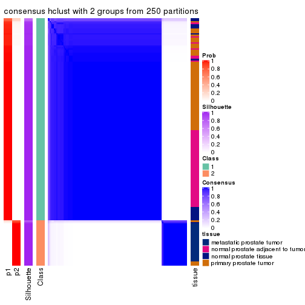</p>

</div>
<div id='tab-ATC-hclust-consensus-heatmap-2'>
<pre><code class="r">consensus_heatmap(res, k = 3)
</code></pre>

<p>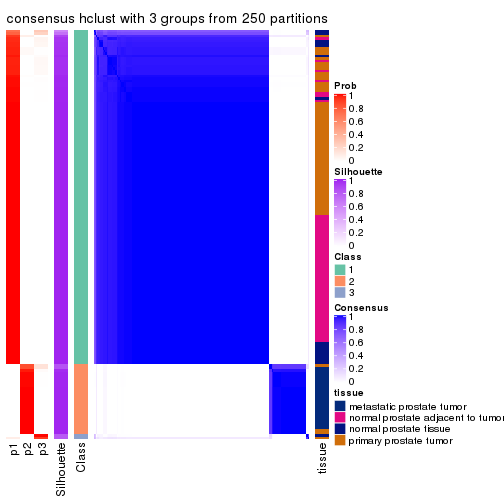</p>

</div>
<div id='tab-ATC-hclust-consensus-heatmap-3'>
<pre><code class="r">consensus_heatmap(res, k = 4)
</code></pre>

<p>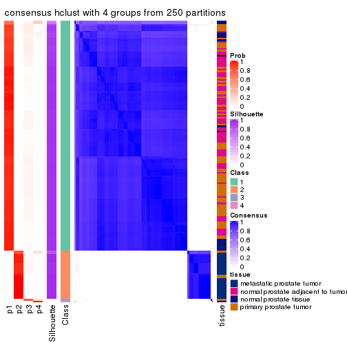</p>

</div>
<div id='tab-ATC-hclust-consensus-heatmap-4'>
<pre><code class="r">consensus_heatmap(res, k = 5)
</code></pre>

<p>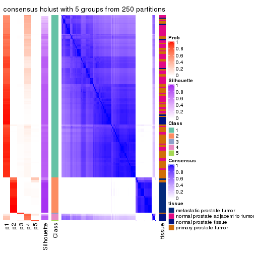</p>

</div>
<div id='tab-ATC-hclust-consensus-heatmap-5'>
<pre><code class="r">consensus_heatmap(res, k = 6)
</code></pre>

<p>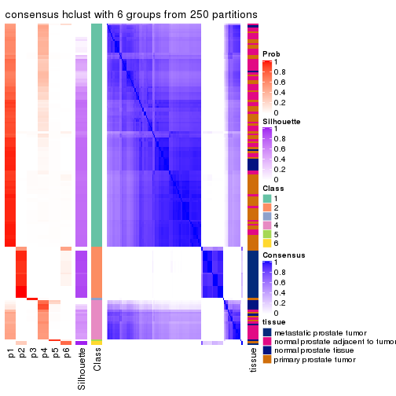</p>

</div>
</div>

Heatmaps for the membership of samples in all partitions to see how consistent they are:


<script>
$( function() {
	$( '#tabs-ATC-hclust-membership-heatmap' ).tabs();
} );
</script>
<div id='tabs-ATC-hclust-membership-heatmap'>
<ul>
<li><a href='#tab-ATC-hclust-membership-heatmap-1'>k = 2</a></li>
<li><a href='#tab-ATC-hclust-membership-heatmap-2'>k = 3</a></li>
<li><a href='#tab-ATC-hclust-membership-heatmap-3'>k = 4</a></li>
<li><a href='#tab-ATC-hclust-membership-heatmap-4'>k = 5</a></li>
<li><a href='#tab-ATC-hclust-membership-heatmap-5'>k = 6</a></li>
</ul>
<div id='tab-ATC-hclust-membership-heatmap-1'>
<pre><code class="r">membership_heatmap(res, k = 2)
</code></pre>

<p>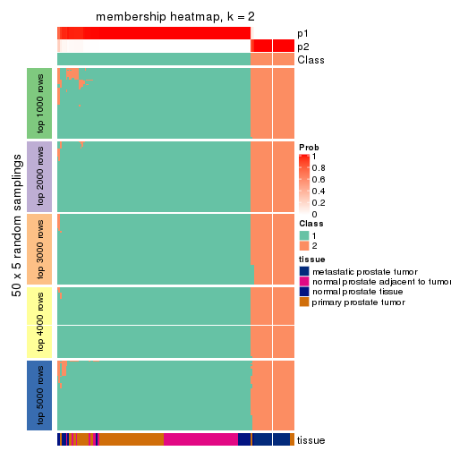</p>

</div>
<div id='tab-ATC-hclust-membership-heatmap-2'>
<pre><code class="r">membership_heatmap(res, k = 3)
</code></pre>

<p>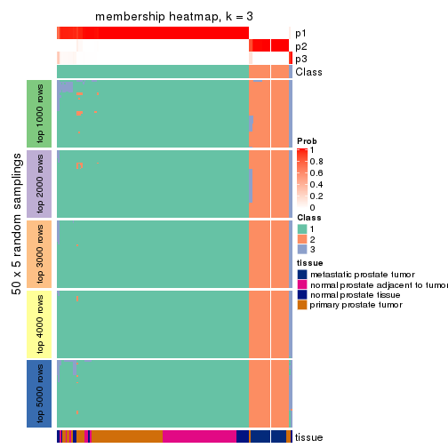</p>

</div>
<div id='tab-ATC-hclust-membership-heatmap-3'>
<pre><code class="r">membership_heatmap(res, k = 4)
</code></pre>

<p>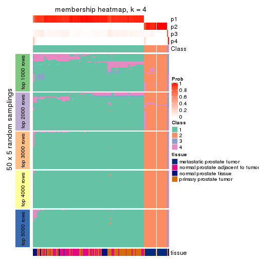</p>

</div>
<div id='tab-ATC-hclust-membership-heatmap-4'>
<pre><code class="r">membership_heatmap(res, k = 5)
</code></pre>

<p>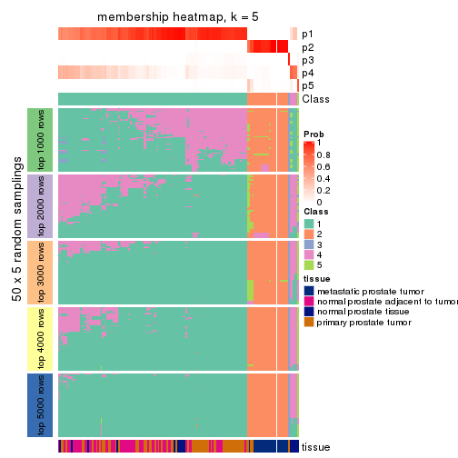</p>

</div>
<div id='tab-ATC-hclust-membership-heatmap-5'>
<pre><code class="r">membership_heatmap(res, k = 6)
</code></pre>

<p>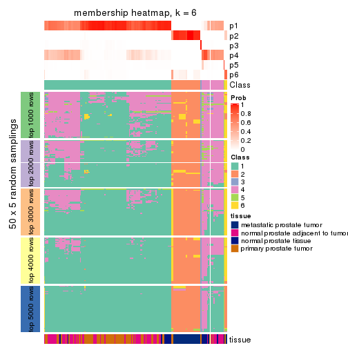</p>

</div>
</div>

As soon as we have had the classes for columns, we can look for signatures
which are significantly different between classes which can be candidate marks
for certain classes. Following are the heatmaps for signatures.


Signature heatmaps where rows are scaled:


<script>
$( function() {
	$( '#tabs-ATC-hclust-get-signatures' ).tabs();
} );
</script>
<div id='tabs-ATC-hclust-get-signatures'>
<ul>
<li><a href='#tab-ATC-hclust-get-signatures-1'>k = 2</a></li>
<li><a href='#tab-ATC-hclust-get-signatures-2'>k = 3</a></li>
<li><a href='#tab-ATC-hclust-get-signatures-3'>k = 4</a></li>
<li><a href='#tab-ATC-hclust-get-signatures-4'>k = 5</a></li>
<li><a href='#tab-ATC-hclust-get-signatures-5'>k = 6</a></li>
</ul>
<div id='tab-ATC-hclust-get-signatures-1'>
<pre><code class="r">get_signatures(res, k = 2)
</code></pre>

<p>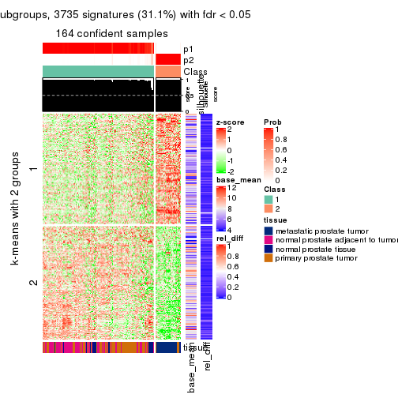</p>

</div>
<div id='tab-ATC-hclust-get-signatures-2'>
<pre><code class="r">get_signatures(res, k = 3)
</code></pre>

<p>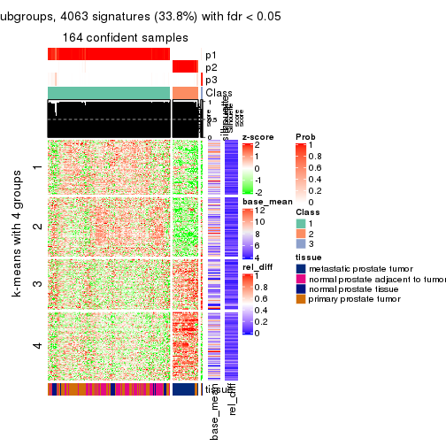</p>

</div>
<div id='tab-ATC-hclust-get-signatures-3'>
<pre><code class="r">get_signatures(res, k = 4)
</code></pre>

<p>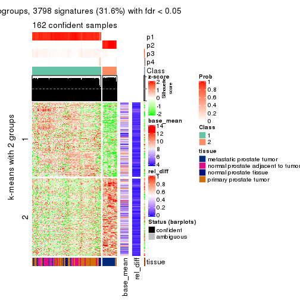</p>

</div>
<div id='tab-ATC-hclust-get-signatures-4'>
<pre><code class="r">get_signatures(res, k = 5)
</code></pre>

<p>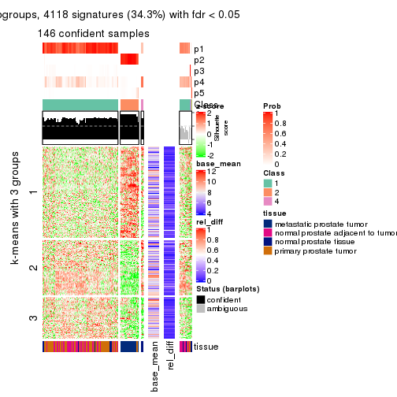</p>

</div>
<div id='tab-ATC-hclust-get-signatures-5'>
<pre><code class="r">get_signatures(res, k = 6)
</code></pre>

<p>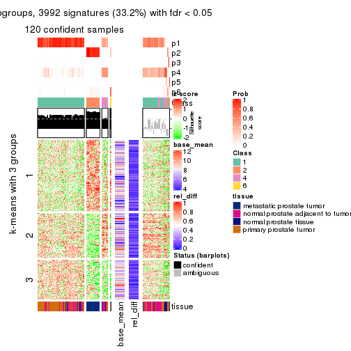</p>

</div>
</div>


Signature heatmaps where rows are not scaled:


<script>
$( function() {
	$( '#tabs-ATC-hclust-get-signatures-no-scale' ).tabs();
} );
</script>
<div id='tabs-ATC-hclust-get-signatures-no-scale'>
<ul>
<li><a href='#tab-ATC-hclust-get-signatures-no-scale-1'>k = 2</a></li>
<li><a href='#tab-ATC-hclust-get-signatures-no-scale-2'>k = 3</a></li>
<li><a href='#tab-ATC-hclust-get-signatures-no-scale-3'>k = 4</a></li>
<li><a href='#tab-ATC-hclust-get-signatures-no-scale-4'>k = 5</a></li>
<li><a href='#tab-ATC-hclust-get-signatures-no-scale-5'>k = 6</a></li>
</ul>
<div id='tab-ATC-hclust-get-signatures-no-scale-1'>
<pre><code class="r">get_signatures(res, k = 2, scale_rows = FALSE)
</code></pre>

<p>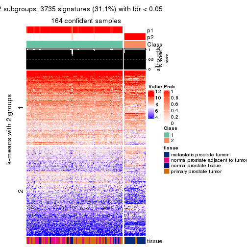</p>

</div>
<div id='tab-ATC-hclust-get-signatures-no-scale-2'>
<pre><code class="r">get_signatures(res, k = 3, scale_rows = FALSE)
</code></pre>

<p>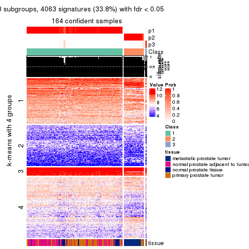</p>

</div>
<div id='tab-ATC-hclust-get-signatures-no-scale-3'>
<pre><code class="r">get_signatures(res, k = 4, scale_rows = FALSE)
</code></pre>

<p>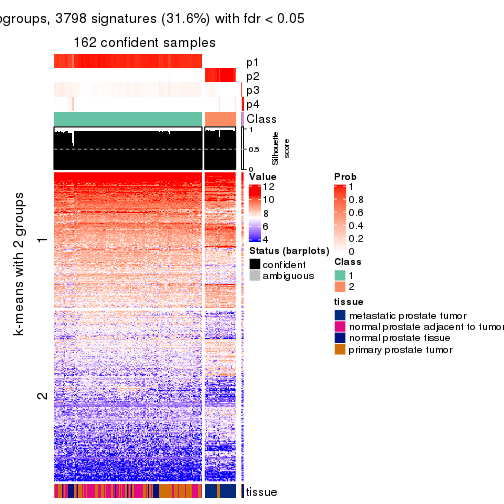</p>

</div>
<div id='tab-ATC-hclust-get-signatures-no-scale-4'>
<pre><code class="r">get_signatures(res, k = 5, scale_rows = FALSE)
</code></pre>

<p>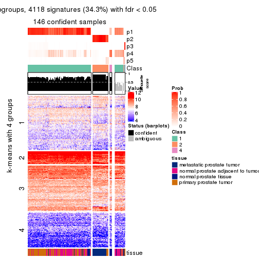</p>

</div>
<div id='tab-ATC-hclust-get-signatures-no-scale-5'>
<pre><code class="r">get_signatures(res, k = 6, scale_rows = FALSE)
</code></pre>

<p>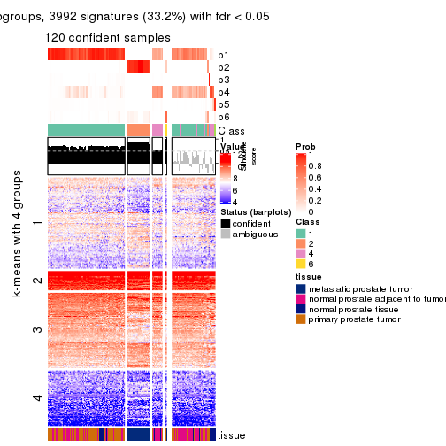</p>

</div>
</div>


Compare the overlap of signatures from different k:

```r
compare_signatures(res)
```

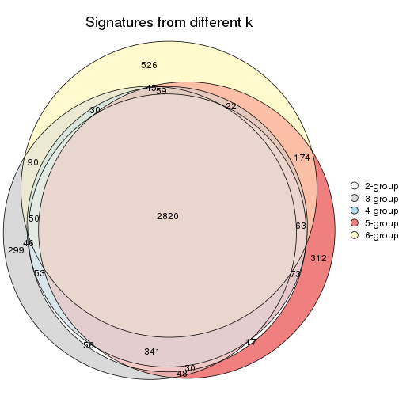

`get_signature()` returns a data frame invisibly. TO get the list of signatures, the function
call should be assigned to a variable explicitly. In following code, if `plot` argument is set
to `FALSE`, no heatmap is plotted while only the differential analysis is performed.

```r
# code only for demonstration
tb = get_signature(res, k = ..., plot = FALSE)
```

An example of the output of `tb` is:

```
#>   which_row         fdr    mean_1    mean_2 scaled_mean_1 scaled_mean_2 km
#> 1        38 0.042760348  8.373488  9.131774    -0.5533452     0.5164555  1
#> 2        40 0.018707592  7.106213  8.469186    -0.6173731     0.5762149  1
#> 3        55 0.019134737 10.221463 11.207825    -0.6159697     0.5749050  1
#> 4        59 0.006059896  5.921854  7.869574    -0.6899429     0.6439467  1
#> 5        60 0.018055526  8.928898 10.211722    -0.6204761     0.5791110  1
#> 6        98 0.009384629 15.714769 14.887706     0.6635654    -0.6193277  2
...
```

The columns in `tb` are:

1. `which_row`: row indices corresponding to the input matrix.
2. `fdr`: FDR for the differential test. 
3. `mean_x`: The mean value in group x.
4. `scaled_mean_x`: The mean value in group x after rows are scaled.
5. `km`: Row groups if k-means clustering is applied to rows.


UMAP plot which shows how samples are separated.


<script>
$( function() {
	$( '#tabs-ATC-hclust-dimension-reduction' ).tabs();
} );
</script>
<div id='tabs-ATC-hclust-dimension-reduction'>
<ul>
<li><a href='#tab-ATC-hclust-dimension-reduction-1'>k = 2</a></li>
<li><a href='#tab-ATC-hclust-dimension-reduction-2'>k = 3</a></li>
<li><a href='#tab-ATC-hclust-dimension-reduction-3'>k = 4</a></li>
<li><a href='#tab-ATC-hclust-dimension-reduction-4'>k = 5</a></li>
<li><a href='#tab-ATC-hclust-dimension-reduction-5'>k = 6</a></li>
</ul>
<div id='tab-ATC-hclust-dimension-reduction-1'>
<pre><code class="r">dimension_reduction(res, k = 2, method = &quot;UMAP&quot;)
</code></pre>

<p>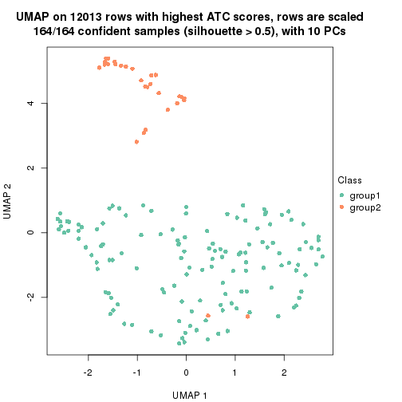</p>

</div>
<div id='tab-ATC-hclust-dimension-reduction-2'>
<pre><code class="r">dimension_reduction(res, k = 3, method = &quot;UMAP&quot;)
</code></pre>

<p>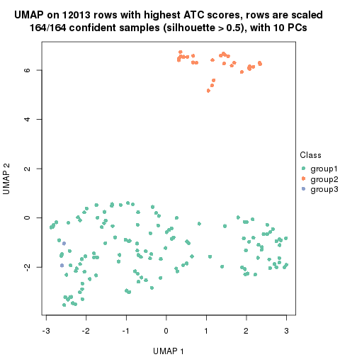</p>

</div>
<div id='tab-ATC-hclust-dimension-reduction-3'>
<pre><code class="r">dimension_reduction(res, k = 4, method = &quot;UMAP&quot;)
</code></pre>

<p>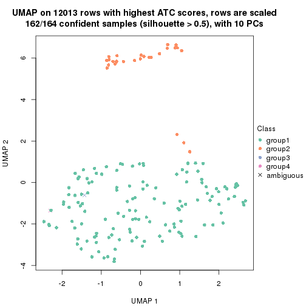</p>

</div>
<div id='tab-ATC-hclust-dimension-reduction-4'>
<pre><code class="r">dimension_reduction(res, k = 5, method = &quot;UMAP&quot;)
</code></pre>

<p>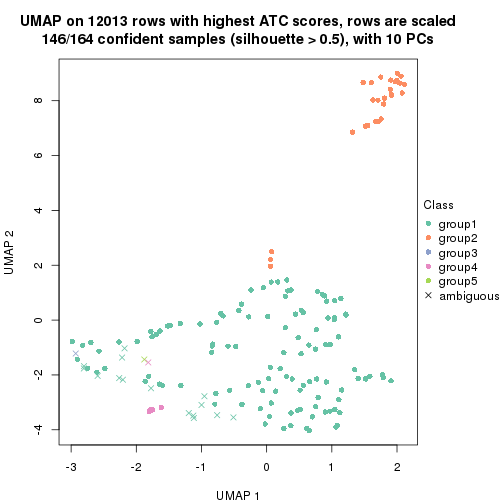</p>

</div>
<div id='tab-ATC-hclust-dimension-reduction-5'>
<pre><code class="r">dimension_reduction(res, k = 6, method = &quot;UMAP&quot;)
</code></pre>

<p>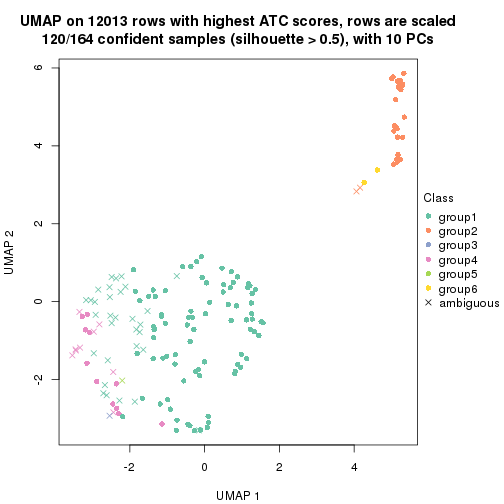</p>

</div>
</div>


Following heatmap shows how subgroups are split when increasing `k`:

```r
collect_classes(res)
```

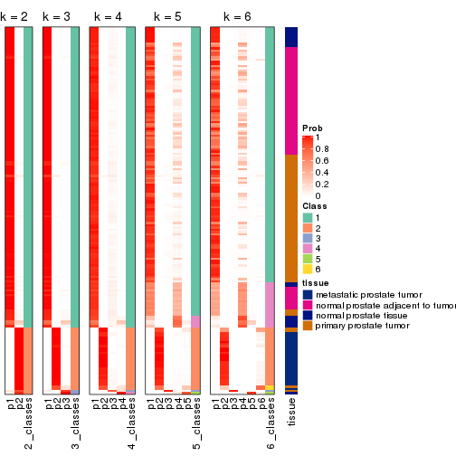


Test correlation between subgroups and known annotations. If the known
annotation is numeric, one-way ANOVA test is applied, and if the known
annotation is discrete, chi-squared contingency table test is applied.

```r
test_to_known_factors(res)
```

```
#>              n tissue(p) k
#> ATC:hclust 164  1.48e-28 2
#> ATC:hclust 164  2.47e-29 3
#> ATC:hclust 162  1.39e-30 4
#> ATC:hclust 146  7.83e-34 5
#> ATC:hclust 120  1.33e-22 6
```


If matrix rows can be associated to genes, consider to use `functional_enrichment(res,
...)` to perform function enrichment for the signature genes. See [this vignette](http://bioconductor.org/packages/devel/bioc/vignettes/cola/inst/doc/functional_enrichment.html) for more detailed explanations.


 

---------------------------------------------------


### ATC:kmeans**


The object with results only for a single top-value method and a single partition method 
can be extracted as:

```r
res = res_list["ATC", "kmeans"]
# you can also extract it by
# res = res_list["ATC:kmeans"]
```

A summary of `res` and all the functions that can be applied to it:

```r
res
```

```
#> A 'ConsensusPartition' object with k = 2, 3, 4, 5, 6.
#>   On a matrix with 12013 rows and 164 columns.
#>   Top rows (1000, 2000, 3000, 4000, 5000) are extracted by 'ATC' method.
#>   Subgroups are detected by 'kmeans' method.
#>   Performed in total 1250 partitions by row resampling.
#>   Best k for subgroups seems to be 2.
#> 
#> Following methods can be applied to this 'ConsensusPartition' object:
#>  [1] "cola_report"             "collect_classes"         "collect_plots"          
#>  [4] "collect_stats"           "colnames"                "compare_signatures"     
#>  [7] "consensus_heatmap"       "dimension_reduction"     "functional_enrichment"  
#> [10] "get_anno_col"            "get_anno"                "get_classes"            
#> [13] "get_consensus"           "get_matrix"              "get_membership"         
#> [16] "get_param"               "get_signatures"          "get_stats"              
#> [19] "is_best_k"               "is_stable_k"             "membership_heatmap"     
#> [22] "ncol"                    "nrow"                    "plot_ecdf"              
#> [25] "rownames"                "select_partition_number" "show"                   
#> [28] "suggest_best_k"          "test_to_known_factors"
```

`collect_plots()` function collects all the plots made from `res` for all `k` (number of partitions)
into one single page to provide an easy and fast comparison between different `k`.

```r
collect_plots(res)
```

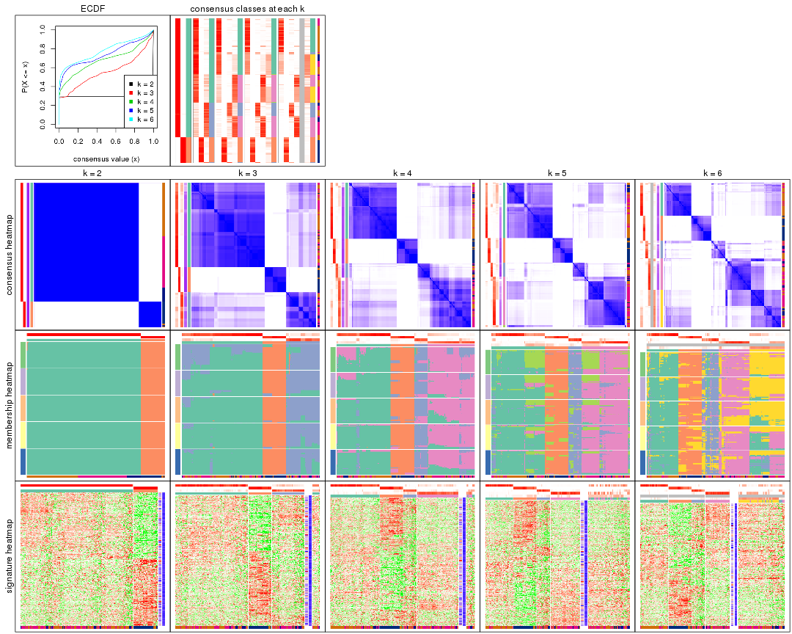

The plots are:

- The first row: a plot of the ECDF (empirical cumulative distribution
  function) curves of the consensus matrix for each `k` and the heatmap of
  predicted classes for each `k`.
- The second row: heatmaps of the consensus matrix for each `k`.
- The third row: heatmaps of the membership matrix for each `k`.
- The fouth row: heatmaps of the signatures for each `k`.

All the plots in panels can be made by individual functions and they are
plotted later in this section.

`select_partition_number()` produces several plots showing different
statistics for choosing "optimized" `k`. There are following statistics:

- ECDF curves of the consensus matrix for each `k`;
- 1-PAC. [The PAC
  score](https://en.wikipedia.org/wiki/Consensus_clustering#Over-interpretation_potential_of_consensus_clustering)
  measures the proportion of the ambiguous subgrouping.
- Mean silhouette score.
- Concordance. The mean probability of fiting the consensus class ids in all
  partitions.
- Area increased. Denote $A_k$ as the area under the ECDF curve for current
  `k`, the area increased is defined as $A_k - A_{k-1}$.
- Rand index. The percent of pairs of samples that are both in a same cluster
  or both are not in a same cluster in the partition of k and k-1.
- Jaccard index. The ratio of pairs of samples are both in a same cluster in
  the partition of k and k-1 and the pairs of samples are both in a same
  cluster in the partition k or k-1.

The detailed explanations of these statistics can be found in [the _cola_
vignette](http://bioconductor.org/packages/devel/bioc/vignettes/cola/inst/doc/cola.html#toc_13).

Generally speaking, lower PAC score, higher mean silhouette score or higher
concordance corresponds to better partition. Rand index and Jaccard index
measure how similar the current partition is compared to partition with `k-1`.
If they are too similar, we won't accept `k` is better than `k-1`.

```r
select_partition_number(res)
```

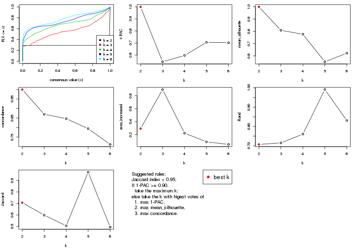

The numeric values for all these statistics can be obtained by `get_stats()`.

```r
get_stats(res)
```

```
#>   k 1-PAC mean_silhouette concordance area_increased  Rand Jaccard
#> 2 2 1.000           0.999       1.000         0.2942 0.707   0.707
#> 3 3 0.544           0.809       0.870         0.8955 0.715   0.598
#> 4 4 0.596           0.776       0.847         0.2241 0.761   0.507
#> 5 5 0.705           0.553       0.795         0.0901 0.991   0.971
#> 6 6 0.702           0.623       0.712         0.0502 0.831   0.495
```

`suggest_best_k()` suggests the best $k$ based on these statistics. The rules are as follows:

- All $k$ with Jaccard index larger than 0.95 are removed because increasing
  $k$ does not provide enough extra information. If all $k$ are removed, it is
  marked as no subgroup is detected.
- For all $k$ with 1-PAC score larger than 0.9, the maximal $k$ is taken as
  the best $k$, and other $k$ are marked as optional $k$.
- If it does not fit the second rule. The $k$ with the maximal vote of the
  highest 1-PAC score, highest mean silhouette, and highest concordance is
  taken as the best $k$.

```r
suggest_best_k(res)
```

```
#> [1] 2
```


Following shows the table of the partitions (You need to click the **show/hide
code output** link to see it). The membership matrix (columns with name `p*`)
is inferred by
[`clue::cl_consensus()`](https://www.rdocumentation.org/link/cl_consensus?package=clue)
function with the `SE` method. Basically the value in the membership matrix
represents the probability to belong to a certain group. The finall class
label for an item is determined with the group with highest probability it
belongs to.

In `get_classes()` function, the entropy is calculated from the membership
matrix and the silhouette score is calculated from the consensus matrix.


<script>
$( function() {
	$( '#tabs-ATC-kmeans-get-classes' ).tabs();
} );
</script>
<div id='tabs-ATC-kmeans-get-classes'>
<ul>
<li><a href='#tab-ATC-kmeans-get-classes-1'>k = 2</a></li>
<li><a href='#tab-ATC-kmeans-get-classes-2'>k = 3</a></li>
<li><a href='#tab-ATC-kmeans-get-classes-3'>k = 4</a></li>
<li><a href='#tab-ATC-kmeans-get-classes-4'>k = 5</a></li>
<li><a href='#tab-ATC-kmeans-get-classes-5'>k = 6</a></li>
</ul>

<div id='tab-ATC-kmeans-get-classes-1'>
<p><a id='tab-ATC-kmeans-get-classes-1-a' style='color:#0366d6' href='#'>show/hide code output</a></p>
<pre><code class="r">cbind(get_classes(res, k = 2), get_membership(res, k = 2))
</code></pre>

<pre><code>#&gt;           class entropy silhouette    p1    p2
#&gt; GSM152839     1  0.0000      0.999 1.000 0.000
#&gt; GSM152840     1  0.0000      0.999 1.000 0.000
#&gt; GSM152841     1  0.0000      0.999 1.000 0.000
#&gt; GSM152842     1  0.0000      0.999 1.000 0.000
#&gt; GSM152843     1  0.0000      0.999 1.000 0.000
#&gt; GSM152844     1  0.0000      0.999 1.000 0.000
#&gt; GSM152845     2  0.0000      1.000 0.000 1.000
#&gt; GSM152846     1  0.0000      0.999 1.000 0.000
#&gt; GSM152847     1  0.0000      0.999 1.000 0.000
#&gt; GSM152848     1  0.0000      0.999 1.000 0.000
#&gt; GSM152849     1  0.0000      0.999 1.000 0.000
#&gt; GSM152850     1  0.0000      0.999 1.000 0.000
#&gt; GSM152851     1  0.0000      0.999 1.000 0.000
#&gt; GSM152852     1  0.0000      0.999 1.000 0.000
#&gt; GSM152853     1  0.0000      0.999 1.000 0.000
#&gt; GSM152854     1  0.0000      0.999 1.000 0.000
#&gt; GSM152855     1  0.0000      0.999 1.000 0.000
#&gt; GSM153238     1  0.0000      0.999 1.000 0.000
#&gt; GSM153239     1  0.0000      0.999 1.000 0.000
#&gt; GSM153240     1  0.0000      0.999 1.000 0.000
#&gt; GSM153241     1  0.0000      0.999 1.000 0.000
#&gt; GSM153242     1  0.0000      0.999 1.000 0.000
#&gt; GSM153243     1  0.0000      0.999 1.000 0.000
#&gt; GSM153244     1  0.0000      0.999 1.000 0.000
#&gt; GSM153245     1  0.0000      0.999 1.000 0.000
#&gt; GSM153246     1  0.0000      0.999 1.000 0.000
#&gt; GSM153247     1  0.0000      0.999 1.000 0.000
#&gt; GSM153248     1  0.0000      0.999 1.000 0.000
#&gt; GSM153249     1  0.0000      0.999 1.000 0.000
#&gt; GSM153250     1  0.0000      0.999 1.000 0.000
#&gt; GSM153251     1  0.0000      0.999 1.000 0.000
#&gt; GSM153252     1  0.0000      0.999 1.000 0.000
#&gt; GSM153253     1  0.0000      0.999 1.000 0.000
#&gt; GSM153254     1  0.0000      0.999 1.000 0.000
#&gt; GSM153255     1  0.0000      0.999 1.000 0.000
#&gt; GSM153256     1  0.0000      0.999 1.000 0.000
#&gt; GSM153257     1  0.0000      0.999 1.000 0.000
#&gt; GSM153258     1  0.0000      0.999 1.000 0.000
#&gt; GSM153259     1  0.0000      0.999 1.000 0.000
#&gt; GSM153260     1  0.0000      0.999 1.000 0.000
#&gt; GSM153261     1  0.0000      0.999 1.000 0.000
#&gt; GSM153262     1  0.0000      0.999 1.000 0.000
#&gt; GSM153263     1  0.0000      0.999 1.000 0.000
#&gt; GSM153264     1  0.0000      0.999 1.000 0.000
#&gt; GSM153265     1  0.0000      0.999 1.000 0.000
#&gt; GSM153266     1  0.0000      0.999 1.000 0.000
#&gt; GSM153267     1  0.0000      0.999 1.000 0.000
#&gt; GSM153268     1  0.0000      0.999 1.000 0.000
#&gt; GSM153269     1  0.0000      0.999 1.000 0.000
#&gt; GSM153270     1  0.0000      0.999 1.000 0.000
#&gt; GSM153271     1  0.0000      0.999 1.000 0.000
#&gt; GSM153272     1  0.0000      0.999 1.000 0.000
#&gt; GSM153273     1  0.0000      0.999 1.000 0.000
#&gt; GSM153274     1  0.0000      0.999 1.000 0.000
#&gt; GSM153275     1  0.0000      0.999 1.000 0.000
#&gt; GSM153276     1  0.0000      0.999 1.000 0.000
#&gt; GSM153277     1  0.0000      0.999 1.000 0.000
#&gt; GSM153278     1  0.0000      0.999 1.000 0.000
#&gt; GSM153279     1  0.0000      0.999 1.000 0.000
#&gt; GSM153280     1  0.0000      0.999 1.000 0.000
#&gt; GSM153281     1  0.0000      0.999 1.000 0.000
#&gt; GSM153282     1  0.0000      0.999 1.000 0.000
#&gt; GSM153283     1  0.0000      0.999 1.000 0.000
#&gt; GSM153284     1  0.0000      0.999 1.000 0.000
#&gt; GSM153285     1  0.0000      0.999 1.000 0.000
#&gt; GSM153286     1  0.0000      0.999 1.000 0.000
#&gt; GSM153287     1  0.0000      0.999 1.000 0.000
#&gt; GSM153288     1  0.0000      0.999 1.000 0.000
#&gt; GSM153289     1  0.0000      0.999 1.000 0.000
#&gt; GSM153290     1  0.0000      0.999 1.000 0.000
#&gt; GSM153291     1  0.0000      0.999 1.000 0.000
#&gt; GSM153292     1  0.0000      0.999 1.000 0.000
#&gt; GSM153293     1  0.0000      0.999 1.000 0.000
#&gt; GSM153294     1  0.0000      0.999 1.000 0.000
#&gt; GSM153295     1  0.0000      0.999 1.000 0.000
#&gt; GSM153054     1  0.0000      0.999 1.000 0.000
#&gt; GSM153055     1  0.0000      0.999 1.000 0.000
#&gt; GSM153056     1  0.0000      0.999 1.000 0.000
#&gt; GSM153057     1  0.0000      0.999 1.000 0.000
#&gt; GSM153058     1  0.0000      0.999 1.000 0.000
#&gt; GSM153059     1  0.0000      0.999 1.000 0.000
#&gt; GSM153060     1  0.0000      0.999 1.000 0.000
#&gt; GSM153061     1  0.0000      0.999 1.000 0.000
#&gt; GSM153062     1  0.3879      0.918 0.924 0.076
#&gt; GSM153063     1  0.0000      0.999 1.000 0.000
#&gt; GSM153064     1  0.0000      0.999 1.000 0.000
#&gt; GSM153065     1  0.0000      0.999 1.000 0.000
#&gt; GSM153066     1  0.0376      0.995 0.996 0.004
#&gt; GSM153067     1  0.0000      0.999 1.000 0.000
#&gt; GSM153068     1  0.0000      0.999 1.000 0.000
#&gt; GSM153069     1  0.0000      0.999 1.000 0.000
#&gt; GSM153070     1  0.0000      0.999 1.000 0.000
#&gt; GSM153071     1  0.0000      0.999 1.000 0.000
#&gt; GSM153072     1  0.0000      0.999 1.000 0.000
#&gt; GSM153073     1  0.0000      0.999 1.000 0.000
#&gt; GSM153074     1  0.0000      0.999 1.000 0.000
#&gt; GSM153075     1  0.0000      0.999 1.000 0.000
#&gt; GSM153076     1  0.0000      0.999 1.000 0.000
#&gt; GSM153077     1  0.0000      0.999 1.000 0.000
#&gt; GSM153078     1  0.0000      0.999 1.000 0.000
#&gt; GSM153079     1  0.0000      0.999 1.000 0.000
#&gt; GSM153080     1  0.0000      0.999 1.000 0.000
#&gt; GSM153081     1  0.0000      0.999 1.000 0.000
#&gt; GSM153082     1  0.0000      0.999 1.000 0.000
#&gt; GSM153083     1  0.0000      0.999 1.000 0.000
#&gt; GSM153084     1  0.0000      0.999 1.000 0.000
#&gt; GSM153085     1  0.0000      0.999 1.000 0.000
#&gt; GSM153086     1  0.0000      0.999 1.000 0.000
#&gt; GSM153087     1  0.0000      0.999 1.000 0.000
#&gt; GSM153088     1  0.0000      0.999 1.000 0.000
#&gt; GSM153089     1  0.0000      0.999 1.000 0.000
#&gt; GSM153090     1  0.0000      0.999 1.000 0.000
#&gt; GSM153091     1  0.0000      0.999 1.000 0.000
#&gt; GSM153092     1  0.0000      0.999 1.000 0.000
#&gt; GSM153093     1  0.0000      0.999 1.000 0.000
#&gt; GSM153094     1  0.0000      0.999 1.000 0.000
#&gt; GSM153095     1  0.0000      0.999 1.000 0.000
#&gt; GSM153096     1  0.0000      0.999 1.000 0.000
#&gt; GSM153097     1  0.0000      0.999 1.000 0.000
#&gt; GSM153098     1  0.0000      0.999 1.000 0.000
#&gt; GSM153099     1  0.0000      0.999 1.000 0.000
#&gt; GSM153100     1  0.0000      0.999 1.000 0.000
#&gt; GSM153101     1  0.0000      0.999 1.000 0.000
#&gt; GSM153102     1  0.0000      0.999 1.000 0.000
#&gt; GSM153103     1  0.0000      0.999 1.000 0.000
#&gt; GSM153104     1  0.0000      0.999 1.000 0.000
#&gt; GSM153106     1  0.0000      0.999 1.000 0.000
#&gt; GSM153107     1  0.0000      0.999 1.000 0.000
#&gt; GSM153108     1  0.0000      0.999 1.000 0.000
#&gt; GSM153109     1  0.0000      0.999 1.000 0.000
#&gt; GSM153110     1  0.0000      0.999 1.000 0.000
#&gt; GSM153111     1  0.0000      0.999 1.000 0.000
#&gt; GSM153112     1  0.0000      0.999 1.000 0.000
#&gt; GSM153113     1  0.0000      0.999 1.000 0.000
#&gt; GSM153114     1  0.0000      0.999 1.000 0.000
#&gt; GSM187532     2  0.0000      1.000 0.000 1.000
#&gt; GSM187533     2  0.0000      1.000 0.000 1.000
#&gt; GSM187534     2  0.0000      1.000 0.000 1.000
#&gt; GSM187535     1  0.0000      0.999 1.000 0.000
#&gt; GSM152906     2  0.0000      1.000 0.000 1.000
#&gt; GSM152907     2  0.0000      1.000 0.000 1.000
#&gt; GSM152908     2  0.0000      1.000 0.000 1.000
#&gt; GSM152909     2  0.0000      1.000 0.000 1.000
#&gt; GSM152910     2  0.0000      1.000 0.000 1.000
#&gt; GSM152911     2  0.0000      1.000 0.000 1.000
#&gt; GSM152912     2  0.0000      1.000 0.000 1.000
#&gt; GSM152913     2  0.0000      1.000 0.000 1.000
#&gt; GSM152914     2  0.0000      1.000 0.000 1.000
#&gt; GSM152915     2  0.0000      1.000 0.000 1.000
#&gt; GSM152916     2  0.0000      1.000 0.000 1.000
#&gt; GSM152917     2  0.0000      1.000 0.000 1.000
#&gt; GSM152918     2  0.0000      1.000 0.000 1.000
#&gt; GSM152919     2  0.0000      1.000 0.000 1.000
#&gt; GSM152920     2  0.0000      1.000 0.000 1.000
#&gt; GSM152921     2  0.0000      1.000 0.000 1.000
#&gt; GSM152922     2  0.0000      1.000 0.000 1.000
#&gt; GSM152923     2  0.0000      1.000 0.000 1.000
#&gt; GSM152924     2  0.0000      1.000 0.000 1.000
#&gt; GSM152925     2  0.0000      1.000 0.000 1.000
#&gt; GSM152926     2  0.0000      1.000 0.000 1.000
#&gt; GSM152927     2  0.0000      1.000 0.000 1.000
#&gt; GSM152928     2  0.0000      1.000 0.000 1.000
#&gt; GSM152929     2  0.0000      1.000 0.000 1.000
#&gt; GSM152930     2  0.0000      1.000 0.000 1.000
</code></pre>

<script>
$('#tab-ATC-kmeans-get-classes-1-a').parent().next().next().hide();
$('#tab-ATC-kmeans-get-classes-1-a').click(function(){
  $('#tab-ATC-kmeans-get-classes-1-a').parent().next().next().toggle();
  return(false);
});
</script>
</div>

<div id='tab-ATC-kmeans-get-classes-2'>
<p><a id='tab-ATC-kmeans-get-classes-2-a' style='color:#0366d6' href='#'>show/hide code output</a></p>
<pre><code class="r">cbind(get_classes(res, k = 3), get_membership(res, k = 3))
</code></pre>

<pre><code>#&gt;           class entropy silhouette    p1    p2    p3
#&gt; GSM152839     1  0.1031      0.865 0.976 0.000 0.024
#&gt; GSM152840     3  0.3941      0.833 0.156 0.000 0.844
#&gt; GSM152841     3  0.5363      0.779 0.276 0.000 0.724
#&gt; GSM152842     1  0.0000      0.868 1.000 0.000 0.000
#&gt; GSM152843     1  0.0747      0.867 0.984 0.000 0.016
#&gt; GSM152844     3  0.3941      0.833 0.156 0.000 0.844
#&gt; GSM152845     3  0.4784      0.427 0.004 0.200 0.796
#&gt; GSM152846     3  0.2796      0.824 0.092 0.000 0.908
#&gt; GSM152847     1  0.0237      0.868 0.996 0.000 0.004
#&gt; GSM152848     1  0.0892      0.866 0.980 0.000 0.020
#&gt; GSM152849     1  0.1643      0.861 0.956 0.000 0.044
#&gt; GSM152850     1  0.0000      0.868 1.000 0.000 0.000
#&gt; GSM152851     3  0.5178      0.796 0.256 0.000 0.744
#&gt; GSM152852     3  0.2796      0.824 0.092 0.000 0.908
#&gt; GSM152853     3  0.3941      0.833 0.156 0.000 0.844
#&gt; GSM152854     3  0.2959      0.826 0.100 0.000 0.900
#&gt; GSM152855     1  0.5016      0.650 0.760 0.000 0.240
#&gt; GSM153238     1  0.1964      0.848 0.944 0.000 0.056
#&gt; GSM153239     3  0.3941      0.833 0.156 0.000 0.844
#&gt; GSM153240     1  0.5882      0.395 0.652 0.000 0.348
#&gt; GSM153241     1  0.4750      0.701 0.784 0.000 0.216
#&gt; GSM153242     3  0.2796      0.824 0.092 0.000 0.908
#&gt; GSM153243     1  0.4452      0.695 0.808 0.000 0.192
#&gt; GSM153244     3  0.2711      0.824 0.088 0.000 0.912
#&gt; GSM153245     3  0.3941      0.833 0.156 0.000 0.844
#&gt; GSM153246     3  0.3192      0.822 0.112 0.000 0.888
#&gt; GSM153247     1  0.0237      0.867 0.996 0.000 0.004
#&gt; GSM153248     1  0.0237      0.867 0.996 0.000 0.004
#&gt; GSM153249     3  0.6192      0.528 0.420 0.000 0.580
#&gt; GSM153250     1  0.0892      0.866 0.980 0.000 0.020
#&gt; GSM153251     3  0.2796      0.824 0.092 0.000 0.908
#&gt; GSM153252     1  0.3752      0.788 0.856 0.000 0.144
#&gt; GSM153253     3  0.5397      0.775 0.280 0.000 0.720
#&gt; GSM153254     3  0.2878      0.826 0.096 0.000 0.904
#&gt; GSM153255     1  0.5621      0.504 0.692 0.000 0.308
#&gt; GSM153256     1  0.3038      0.822 0.896 0.000 0.104
#&gt; GSM153257     1  0.3752      0.788 0.856 0.000 0.144
#&gt; GSM153258     1  0.0237      0.867 0.996 0.000 0.004
#&gt; GSM153259     1  0.0892      0.863 0.980 0.000 0.020
#&gt; GSM153260     1  0.4931      0.633 0.768 0.000 0.232
#&gt; GSM153261     3  0.5733      0.592 0.324 0.000 0.676
#&gt; GSM153262     3  0.5678      0.731 0.316 0.000 0.684
#&gt; GSM153263     1  0.0892      0.866 0.980 0.000 0.020
#&gt; GSM153264     1  0.0000      0.868 1.000 0.000 0.000
#&gt; GSM153265     3  0.5529      0.758 0.296 0.000 0.704
#&gt; GSM153266     1  0.0000      0.868 1.000 0.000 0.000
#&gt; GSM153267     1  0.2448      0.841 0.924 0.000 0.076
#&gt; GSM153268     3  0.3941      0.833 0.156 0.000 0.844
#&gt; GSM153269     1  0.3752      0.788 0.856 0.000 0.144
#&gt; GSM153270     1  0.5678      0.486 0.684 0.000 0.316
#&gt; GSM153271     1  0.0892      0.866 0.980 0.000 0.020
#&gt; GSM153272     1  0.3752      0.788 0.856 0.000 0.144
#&gt; GSM153273     1  0.0237      0.867 0.996 0.000 0.004
#&gt; GSM153274     1  0.3752      0.788 0.856 0.000 0.144
#&gt; GSM153275     1  0.3752      0.788 0.856 0.000 0.144
#&gt; GSM153276     1  0.3816      0.784 0.852 0.000 0.148
#&gt; GSM153277     3  0.5621      0.743 0.308 0.000 0.692
#&gt; GSM153278     1  0.2448      0.835 0.924 0.000 0.076
#&gt; GSM153279     3  0.5291      0.787 0.268 0.000 0.732
#&gt; GSM153280     3  0.4702      0.819 0.212 0.000 0.788
#&gt; GSM153281     3  0.6168      0.548 0.412 0.000 0.588
#&gt; GSM153282     3  0.5216      0.793 0.260 0.000 0.740
#&gt; GSM153283     1  0.0000      0.868 1.000 0.000 0.000
#&gt; GSM153284     1  0.3752      0.788 0.856 0.000 0.144
#&gt; GSM153285     3  0.6180      0.539 0.416 0.000 0.584
#&gt; GSM153286     1  0.3752      0.788 0.856 0.000 0.144
#&gt; GSM153287     1  0.5882      0.394 0.652 0.000 0.348
#&gt; GSM153288     1  0.3752      0.788 0.856 0.000 0.144
#&gt; GSM153289     1  0.3340      0.809 0.880 0.000 0.120
#&gt; GSM153290     3  0.5138      0.799 0.252 0.000 0.748
#&gt; GSM153291     1  0.5529      0.533 0.704 0.000 0.296
#&gt; GSM153292     3  0.6168      0.549 0.412 0.000 0.588
#&gt; GSM153293     1  0.2537      0.838 0.920 0.000 0.080
#&gt; GSM153294     1  0.0237      0.867 0.996 0.000 0.004
#&gt; GSM153295     1  0.3412      0.806 0.876 0.000 0.124
#&gt; GSM153054     1  0.0237      0.867 0.996 0.000 0.004
#&gt; GSM153055     1  0.1964      0.852 0.944 0.000 0.056
#&gt; GSM153056     1  0.4887      0.674 0.772 0.000 0.228
#&gt; GSM153057     3  0.2796      0.824 0.092 0.000 0.908
#&gt; GSM153058     3  0.2796      0.824 0.092 0.000 0.908
#&gt; GSM153059     3  0.4887      0.719 0.228 0.000 0.772
#&gt; GSM153060     3  0.2796      0.824 0.092 0.000 0.908
#&gt; GSM153061     1  0.4931      0.633 0.768 0.000 0.232
#&gt; GSM153062     3  0.2806      0.695 0.040 0.032 0.928
#&gt; GSM153063     3  0.4346      0.829 0.184 0.000 0.816
#&gt; GSM153064     1  0.0000      0.868 1.000 0.000 0.000
#&gt; GSM153065     1  0.4931      0.633 0.768 0.000 0.232
#&gt; GSM153066     1  0.4288      0.783 0.872 0.060 0.068
#&gt; GSM153067     1  0.4178      0.755 0.828 0.000 0.172
#&gt; GSM153068     3  0.5138      0.693 0.252 0.000 0.748
#&gt; GSM153069     1  0.5988      0.328 0.632 0.000 0.368
#&gt; GSM153070     1  0.0424      0.868 0.992 0.000 0.008
#&gt; GSM153071     1  0.0892      0.866 0.980 0.000 0.020
#&gt; GSM153072     1  0.0892      0.863 0.980 0.000 0.020
#&gt; GSM153073     1  0.0592      0.867 0.988 0.000 0.012
#&gt; GSM153074     1  0.5810      0.429 0.664 0.000 0.336
#&gt; GSM153075     3  0.6215      0.504 0.428 0.000 0.572
#&gt; GSM153076     1  0.0892      0.866 0.980 0.000 0.020
#&gt; GSM153077     1  0.0000      0.868 1.000 0.000 0.000
#&gt; GSM153078     1  0.0000      0.868 1.000 0.000 0.000
#&gt; GSM153079     1  0.2261      0.839 0.932 0.000 0.068
#&gt; GSM153080     1  0.4346      0.775 0.816 0.000 0.184
#&gt; GSM153081     1  0.0237      0.867 0.996 0.000 0.004
#&gt; GSM153082     1  0.1964      0.848 0.944 0.000 0.056
#&gt; GSM153083     1  0.1964      0.848 0.944 0.000 0.056
#&gt; GSM153084     1  0.2261      0.839 0.932 0.000 0.068
#&gt; GSM153085     1  0.2261      0.839 0.932 0.000 0.068
#&gt; GSM153086     1  0.1964      0.848 0.944 0.000 0.056
#&gt; GSM153087     1  0.5882      0.394 0.652 0.000 0.348
#&gt; GSM153088     1  0.0892      0.866 0.980 0.000 0.020
#&gt; GSM153089     3  0.3116      0.815 0.108 0.000 0.892
#&gt; GSM153090     1  0.2959      0.825 0.900 0.000 0.100
#&gt; GSM153091     1  0.1964      0.848 0.944 0.000 0.056
#&gt; GSM153092     1  0.1860      0.850 0.948 0.000 0.052
#&gt; GSM153093     1  0.5905      0.382 0.648 0.000 0.352
#&gt; GSM153094     1  0.1964      0.848 0.944 0.000 0.056
#&gt; GSM153095     1  0.1860      0.850 0.948 0.000 0.052
#&gt; GSM153096     1  0.0237      0.867 0.996 0.000 0.004
#&gt; GSM153097     1  0.1964      0.848 0.944 0.000 0.056
#&gt; GSM153098     1  0.1031      0.865 0.976 0.000 0.024
#&gt; GSM153099     1  0.3038      0.822 0.896 0.000 0.104
#&gt; GSM153100     1  0.0237      0.867 0.996 0.000 0.004
#&gt; GSM153101     1  0.1964      0.848 0.944 0.000 0.056
#&gt; GSM153102     1  0.2261      0.839 0.932 0.000 0.068
#&gt; GSM153103     1  0.1964      0.848 0.944 0.000 0.056
#&gt; GSM153104     1  0.5948      0.356 0.640 0.000 0.360
#&gt; GSM153106     1  0.2066      0.845 0.940 0.000 0.060
#&gt; GSM153107     1  0.0592      0.866 0.988 0.000 0.012
#&gt; GSM153108     1  0.0237      0.867 0.996 0.000 0.004
#&gt; GSM153109     1  0.2261      0.839 0.932 0.000 0.068
#&gt; GSM153110     1  0.0747      0.865 0.984 0.000 0.016
#&gt; GSM153111     1  0.1964      0.848 0.944 0.000 0.056
#&gt; GSM153112     1  0.0424      0.868 0.992 0.000 0.008
#&gt; GSM153113     1  0.2261      0.839 0.932 0.000 0.068
#&gt; GSM153114     3  0.5591      0.748 0.304 0.000 0.696
#&gt; GSM187532     2  0.2261      0.966 0.000 0.932 0.068
#&gt; GSM187533     2  0.2261      0.966 0.000 0.932 0.068
#&gt; GSM187534     2  0.0000      0.976 0.000 1.000 0.000
#&gt; GSM187535     1  0.3899      0.799 0.888 0.056 0.056
#&gt; GSM152906     2  0.0747      0.975 0.000 0.984 0.016
#&gt; GSM152907     2  0.0747      0.975 0.000 0.984 0.016
#&gt; GSM152908     2  0.2356      0.966 0.000 0.928 0.072
#&gt; GSM152909     2  0.2356      0.966 0.000 0.928 0.072
#&gt; GSM152910     2  0.2356      0.966 0.000 0.928 0.072
#&gt; GSM152911     2  0.1753      0.971 0.000 0.952 0.048
#&gt; GSM152912     2  0.2356      0.966 0.000 0.928 0.072
#&gt; GSM152913     2  0.2356      0.966 0.000 0.928 0.072
#&gt; GSM152914     2  0.0237      0.976 0.000 0.996 0.004
#&gt; GSM152915     2  0.0592      0.976 0.000 0.988 0.012
#&gt; GSM152916     2  0.0747      0.975 0.000 0.984 0.016
#&gt; GSM152917     2  0.0237      0.976 0.000 0.996 0.004
#&gt; GSM152918     2  0.0237      0.976 0.000 0.996 0.004
#&gt; GSM152919     2  0.0237      0.976 0.000 0.996 0.004
#&gt; GSM152920     2  0.2356      0.966 0.000 0.928 0.072
#&gt; GSM152921     2  0.2356      0.966 0.000 0.928 0.072
#&gt; GSM152922     2  0.2356      0.966 0.000 0.928 0.072
#&gt; GSM152923     2  0.0747      0.975 0.000 0.984 0.016
#&gt; GSM152924     2  0.0747      0.975 0.000 0.984 0.016
#&gt; GSM152925     2  0.0747      0.975 0.000 0.984 0.016
#&gt; GSM152926     2  0.0747      0.975 0.000 0.984 0.016
#&gt; GSM152927     2  0.0747      0.975 0.000 0.984 0.016
#&gt; GSM152928     2  0.0747      0.975 0.000 0.984 0.016
#&gt; GSM152929     2  0.0747      0.975 0.000 0.984 0.016
#&gt; GSM152930     2  0.0747      0.975 0.000 0.984 0.016
</code></pre>

<script>
$('#tab-ATC-kmeans-get-classes-2-a').parent().next().next().hide();
$('#tab-ATC-kmeans-get-classes-2-a').click(function(){
  $('#tab-ATC-kmeans-get-classes-2-a').parent().next().next().toggle();
  return(false);
});
</script>
</div>

<div id='tab-ATC-kmeans-get-classes-3'>
<p><a id='tab-ATC-kmeans-get-classes-3-a' style='color:#0366d6' href='#'>show/hide code output</a></p>
<pre><code class="r">cbind(get_classes(res, k = 4), get_membership(res, k = 4))
</code></pre>

<pre><code>#&gt;           class entropy silhouette    p1    p2    p3    p4
#&gt; GSM152839     1  0.4500     0.7909 0.776 0.000 0.032 0.192
#&gt; GSM152840     4  0.3982     0.4951 0.004 0.000 0.220 0.776
#&gt; GSM152841     4  0.3679     0.6958 0.060 0.000 0.084 0.856
#&gt; GSM152842     1  0.4105     0.8253 0.812 0.000 0.032 0.156
#&gt; GSM152843     1  0.4323     0.7997 0.788 0.000 0.028 0.184
#&gt; GSM152844     4  0.5155    -0.2457 0.004 0.000 0.468 0.528
#&gt; GSM152845     3  0.3229     0.7760 0.000 0.048 0.880 0.072
#&gt; GSM152846     3  0.3810     0.9191 0.008 0.000 0.804 0.188
#&gt; GSM152847     1  0.4152     0.8223 0.808 0.000 0.032 0.160
#&gt; GSM152848     1  0.3539     0.8001 0.820 0.000 0.004 0.176
#&gt; GSM152849     1  0.4579     0.7812 0.768 0.000 0.032 0.200
#&gt; GSM152850     1  0.3907     0.8367 0.828 0.000 0.032 0.140
#&gt; GSM152851     4  0.4378     0.6003 0.040 0.000 0.164 0.796
#&gt; GSM152852     3  0.3810     0.9191 0.008 0.000 0.804 0.188
#&gt; GSM152853     4  0.5119    -0.1465 0.004 0.000 0.440 0.556
#&gt; GSM152854     3  0.3831     0.9138 0.004 0.000 0.792 0.204
#&gt; GSM152855     4  0.3172     0.7765 0.160 0.000 0.000 0.840
#&gt; GSM153238     1  0.1305     0.8630 0.960 0.000 0.036 0.004
#&gt; GSM153239     4  0.4837     0.1929 0.004 0.000 0.348 0.648
#&gt; GSM153240     4  0.2921     0.7773 0.140 0.000 0.000 0.860
#&gt; GSM153241     1  0.5337     0.6977 0.696 0.000 0.044 0.260
#&gt; GSM153242     3  0.3810     0.9191 0.008 0.000 0.804 0.188
#&gt; GSM153243     1  0.4401     0.5689 0.724 0.000 0.272 0.004
#&gt; GSM153244     3  0.4594     0.8173 0.008 0.000 0.712 0.280
#&gt; GSM153245     4  0.3583     0.5583 0.004 0.000 0.180 0.816
#&gt; GSM153246     3  0.3681     0.9068 0.008 0.000 0.816 0.176
#&gt; GSM153247     1  0.1837     0.8746 0.944 0.000 0.028 0.028
#&gt; GSM153248     1  0.0469     0.8783 0.988 0.000 0.000 0.012
#&gt; GSM153249     4  0.3793     0.7597 0.112 0.000 0.044 0.844
#&gt; GSM153250     1  0.3583     0.7958 0.816 0.000 0.004 0.180
#&gt; GSM153251     3  0.3893     0.9182 0.008 0.000 0.796 0.196
#&gt; GSM153252     4  0.3982     0.7596 0.220 0.000 0.004 0.776
#&gt; GSM153253     4  0.3400     0.7131 0.064 0.000 0.064 0.872
#&gt; GSM153254     4  0.5204     0.0815 0.012 0.000 0.376 0.612
#&gt; GSM153255     4  0.2868     0.7773 0.136 0.000 0.000 0.864
#&gt; GSM153256     4  0.4477     0.6602 0.312 0.000 0.000 0.688
#&gt; GSM153257     4  0.3982     0.7596 0.220 0.000 0.004 0.776
#&gt; GSM153258     1  0.2216     0.8581 0.908 0.000 0.000 0.092
#&gt; GSM153259     1  0.0188     0.8781 0.996 0.000 0.000 0.004
#&gt; GSM153260     1  0.5229     0.1887 0.564 0.000 0.428 0.008
#&gt; GSM153261     3  0.5608     0.6503 0.256 0.000 0.684 0.060
#&gt; GSM153262     4  0.3421     0.7453 0.088 0.000 0.044 0.868
#&gt; GSM153263     1  0.3583     0.7958 0.816 0.000 0.004 0.180
#&gt; GSM153264     1  0.3105     0.8304 0.856 0.000 0.004 0.140
#&gt; GSM153265     4  0.3761     0.7037 0.068 0.000 0.080 0.852
#&gt; GSM153266     1  0.2647     0.8442 0.880 0.000 0.000 0.120
#&gt; GSM153267     4  0.4543     0.6405 0.324 0.000 0.000 0.676
#&gt; GSM153268     4  0.3831     0.5164 0.004 0.000 0.204 0.792
#&gt; GSM153269     4  0.4193     0.7206 0.268 0.000 0.000 0.732
#&gt; GSM153270     4  0.3710     0.7724 0.192 0.000 0.004 0.804
#&gt; GSM153271     1  0.3668     0.7862 0.808 0.000 0.004 0.188
#&gt; GSM153272     4  0.3907     0.7537 0.232 0.000 0.000 0.768
#&gt; GSM153273     1  0.0592     0.8781 0.984 0.000 0.000 0.016
#&gt; GSM153274     4  0.4193     0.7206 0.268 0.000 0.000 0.732
#&gt; GSM153275     4  0.3907     0.7537 0.232 0.000 0.000 0.768
#&gt; GSM153276     4  0.4193     0.7206 0.268 0.000 0.000 0.732
#&gt; GSM153277     4  0.3156     0.7278 0.068 0.000 0.048 0.884
#&gt; GSM153278     1  0.1305     0.8610 0.960 0.000 0.036 0.004
#&gt; GSM153279     4  0.4415     0.6366 0.056 0.000 0.140 0.804
#&gt; GSM153280     4  0.4225     0.5649 0.024 0.000 0.184 0.792
#&gt; GSM153281     4  0.3734     0.7580 0.108 0.000 0.044 0.848
#&gt; GSM153282     4  0.4123     0.6374 0.044 0.000 0.136 0.820
#&gt; GSM153283     1  0.3257     0.8213 0.844 0.000 0.004 0.152
#&gt; GSM153284     4  0.3837     0.7590 0.224 0.000 0.000 0.776
#&gt; GSM153285     4  0.3734     0.7580 0.108 0.000 0.044 0.848
#&gt; GSM153286     4  0.3975     0.7472 0.240 0.000 0.000 0.760
#&gt; GSM153287     4  0.2814     0.7768 0.132 0.000 0.000 0.868
#&gt; GSM153288     4  0.3942     0.7507 0.236 0.000 0.000 0.764
#&gt; GSM153289     4  0.4222     0.7162 0.272 0.000 0.000 0.728
#&gt; GSM153290     4  0.4332     0.6060 0.040 0.000 0.160 0.800
#&gt; GSM153291     4  0.2973     0.7774 0.144 0.000 0.000 0.856
#&gt; GSM153292     4  0.3734     0.7580 0.108 0.000 0.044 0.848
#&gt; GSM153293     4  0.4500     0.6538 0.316 0.000 0.000 0.684
#&gt; GSM153294     1  0.1302     0.8739 0.956 0.000 0.000 0.044
#&gt; GSM153295     4  0.4401     0.7119 0.272 0.000 0.004 0.724
#&gt; GSM153054     1  0.1209     0.8766 0.964 0.000 0.004 0.032
#&gt; GSM153055     4  0.4761     0.5434 0.372 0.000 0.000 0.628
#&gt; GSM153056     4  0.5659     0.4549 0.368 0.000 0.032 0.600
#&gt; GSM153057     3  0.3893     0.9182 0.008 0.000 0.796 0.196
#&gt; GSM153058     3  0.3893     0.9182 0.008 0.000 0.796 0.196
#&gt; GSM153059     3  0.4969     0.8612 0.088 0.000 0.772 0.140
#&gt; GSM153060     3  0.3636     0.9121 0.008 0.000 0.820 0.172
#&gt; GSM153061     1  0.5290     0.2577 0.584 0.000 0.404 0.012
#&gt; GSM153062     3  0.3324     0.8962 0.012 0.000 0.852 0.136
#&gt; GSM153063     4  0.4121     0.5628 0.020 0.000 0.184 0.796
#&gt; GSM153064     1  0.1716     0.8688 0.936 0.000 0.000 0.064
#&gt; GSM153065     1  0.5203     0.2239 0.576 0.000 0.416 0.008
#&gt; GSM153066     1  0.1585     0.8579 0.952 0.004 0.040 0.004
#&gt; GSM153067     4  0.3444     0.7727 0.184 0.000 0.000 0.816
#&gt; GSM153068     3  0.4840     0.8218 0.116 0.000 0.784 0.100
#&gt; GSM153069     4  0.2814     0.7768 0.132 0.000 0.000 0.868
#&gt; GSM153070     1  0.3266     0.8082 0.832 0.000 0.000 0.168
#&gt; GSM153071     1  0.3539     0.8003 0.820 0.000 0.004 0.176
#&gt; GSM153072     1  0.0524     0.8781 0.988 0.000 0.008 0.004
#&gt; GSM153073     1  0.3448     0.8079 0.828 0.000 0.004 0.168
#&gt; GSM153074     4  0.2868     0.7773 0.136 0.000 0.000 0.864
#&gt; GSM153075     4  0.4401     0.7435 0.112 0.000 0.076 0.812
#&gt; GSM153076     1  0.3583     0.7958 0.816 0.000 0.004 0.180
#&gt; GSM153077     1  0.2714     0.8484 0.884 0.000 0.004 0.112
#&gt; GSM153078     1  0.3749     0.8423 0.840 0.000 0.032 0.128
#&gt; GSM153079     1  0.1209     0.8634 0.964 0.000 0.032 0.004
#&gt; GSM153080     1  0.3919     0.7869 0.840 0.000 0.056 0.104
#&gt; GSM153081     1  0.2197     0.8734 0.928 0.000 0.024 0.048
#&gt; GSM153082     1  0.0376     0.8760 0.992 0.000 0.004 0.004
#&gt; GSM153083     1  0.0188     0.8770 0.996 0.000 0.004 0.000
#&gt; GSM153084     1  0.1489     0.8583 0.952 0.000 0.044 0.004
#&gt; GSM153085     1  0.0779     0.8717 0.980 0.000 0.016 0.004
#&gt; GSM153086     1  0.0188     0.8770 0.996 0.000 0.004 0.000
#&gt; GSM153087     4  0.4070     0.7680 0.132 0.000 0.044 0.824
#&gt; GSM153088     1  0.3668     0.7862 0.808 0.000 0.004 0.188
#&gt; GSM153089     3  0.3852     0.9189 0.008 0.000 0.800 0.192
#&gt; GSM153090     4  0.4624     0.6126 0.340 0.000 0.000 0.660
#&gt; GSM153091     1  0.0188     0.8770 0.996 0.000 0.004 0.000
#&gt; GSM153092     1  0.0376     0.8760 0.992 0.000 0.004 0.004
#&gt; GSM153093     4  0.2868     0.7773 0.136 0.000 0.000 0.864
#&gt; GSM153094     1  0.0188     0.8770 0.996 0.000 0.004 0.000
#&gt; GSM153095     1  0.0524     0.8752 0.988 0.000 0.008 0.004
#&gt; GSM153096     1  0.0469     0.8783 0.988 0.000 0.000 0.012
#&gt; GSM153097     1  0.0188     0.8770 0.996 0.000 0.004 0.000
#&gt; GSM153098     4  0.4761     0.5433 0.372 0.000 0.000 0.628
#&gt; GSM153099     4  0.4679     0.5891 0.352 0.000 0.000 0.648
#&gt; GSM153100     1  0.1716     0.8693 0.936 0.000 0.000 0.064
#&gt; GSM153101     1  0.0376     0.8760 0.992 0.000 0.004 0.004
#&gt; GSM153102     1  0.0779     0.8723 0.980 0.000 0.016 0.004
#&gt; GSM153103     1  0.0469     0.8756 0.988 0.000 0.012 0.000
#&gt; GSM153104     4  0.4070     0.7680 0.132 0.000 0.044 0.824
#&gt; GSM153106     1  0.0672     0.8746 0.984 0.000 0.008 0.008
#&gt; GSM153107     1  0.0188     0.8781 0.996 0.000 0.000 0.004
#&gt; GSM153108     1  0.4866     0.2515 0.596 0.000 0.000 0.404
#&gt; GSM153109     1  0.0524     0.8744 0.988 0.000 0.008 0.004
#&gt; GSM153110     1  0.0188     0.8781 0.996 0.000 0.000 0.004
#&gt; GSM153111     1  0.0188     0.8770 0.996 0.000 0.004 0.000
#&gt; GSM153112     1  0.1474     0.8727 0.948 0.000 0.000 0.052
#&gt; GSM153113     1  0.0524     0.8744 0.988 0.000 0.008 0.004
#&gt; GSM153114     4  0.4022     0.6900 0.068 0.000 0.096 0.836
#&gt; GSM187532     2  0.4224     0.8916 0.000 0.812 0.144 0.044
#&gt; GSM187533     2  0.4017     0.8997 0.000 0.828 0.128 0.044
#&gt; GSM187534     2  0.1004     0.9344 0.000 0.972 0.024 0.004
#&gt; GSM187535     1  0.0712     0.8728 0.984 0.004 0.008 0.004
#&gt; GSM152906     2  0.1182     0.9345 0.000 0.968 0.016 0.016
#&gt; GSM152907     2  0.1182     0.9345 0.000 0.968 0.016 0.016
#&gt; GSM152908     2  0.4017     0.8997 0.000 0.828 0.128 0.044
#&gt; GSM152909     2  0.4224     0.8916 0.000 0.812 0.144 0.044
#&gt; GSM152910     2  0.4017     0.8997 0.000 0.828 0.128 0.044
#&gt; GSM152911     2  0.1807     0.9291 0.000 0.940 0.052 0.008
#&gt; GSM152912     2  0.4017     0.8997 0.000 0.828 0.128 0.044
#&gt; GSM152913     2  0.2859     0.9148 0.000 0.880 0.112 0.008
#&gt; GSM152914     2  0.0524     0.9359 0.000 0.988 0.008 0.004
#&gt; GSM152915     2  0.0524     0.9359 0.000 0.988 0.008 0.004
#&gt; GSM152916     2  0.1182     0.9345 0.000 0.968 0.016 0.016
#&gt; GSM152917     2  0.0000     0.9363 0.000 1.000 0.000 0.000
#&gt; GSM152918     2  0.0000     0.9363 0.000 1.000 0.000 0.000
#&gt; GSM152919     2  0.0000     0.9363 0.000 1.000 0.000 0.000
#&gt; GSM152920     2  0.4017     0.8997 0.000 0.828 0.128 0.044
#&gt; GSM152921     2  0.4017     0.8997 0.000 0.828 0.128 0.044
#&gt; GSM152922     2  0.4017     0.8997 0.000 0.828 0.128 0.044
#&gt; GSM152923     2  0.1182     0.9345 0.000 0.968 0.016 0.016
#&gt; GSM152924     2  0.1182     0.9345 0.000 0.968 0.016 0.016
#&gt; GSM152925     2  0.1182     0.9345 0.000 0.968 0.016 0.016
#&gt; GSM152926     2  0.1182     0.9345 0.000 0.968 0.016 0.016
#&gt; GSM152927     2  0.1182     0.9345 0.000 0.968 0.016 0.016
#&gt; GSM152928     2  0.1182     0.9345 0.000 0.968 0.016 0.016
#&gt; GSM152929     2  0.1182     0.9345 0.000 0.968 0.016 0.016
#&gt; GSM152930     2  0.1182     0.9345 0.000 0.968 0.016 0.016
</code></pre>

<script>
$('#tab-ATC-kmeans-get-classes-3-a').parent().next().next().hide();
$('#tab-ATC-kmeans-get-classes-3-a').click(function(){
  $('#tab-ATC-kmeans-get-classes-3-a').parent().next().next().toggle();
  return(false);
});
</script>
</div>

<div id='tab-ATC-kmeans-get-classes-4'>
<p><a id='tab-ATC-kmeans-get-classes-4-a' style='color:#0366d6' href='#'>show/hide code output</a></p>
<pre><code class="r">cbind(get_classes(res, k = 5), get_membership(res, k = 5))
</code></pre>

<pre><code>#&gt;           class entropy silhouette    p1    p2    p3    p4    p5
#&gt; GSM152839     1  0.6031    -0.2828 0.480 0.000 0.012 0.080 0.428
#&gt; GSM152840     4  0.5054     0.4988 0.004 0.000 0.184 0.708 0.104
#&gt; GSM152841     4  0.1990     0.6979 0.008 0.000 0.068 0.920 0.004
#&gt; GSM152842     1  0.5891    -0.2336 0.492 0.000 0.012 0.068 0.428
#&gt; GSM152843     1  0.5721    -0.1939 0.492 0.000 0.000 0.084 0.424
#&gt; GSM152844     4  0.6265    -0.0897 0.004 0.000 0.380 0.484 0.132
#&gt; GSM152845     3  0.3274     0.8270 0.000 0.000 0.780 0.000 0.220
#&gt; GSM152846     3  0.3224     0.8576 0.000 0.000 0.824 0.016 0.160
#&gt; GSM152847     1  0.5979    -0.2473 0.488 0.000 0.016 0.068 0.428
#&gt; GSM152848     1  0.5779    -0.1129 0.508 0.000 0.000 0.092 0.400
#&gt; GSM152849     1  0.6523    -0.3793 0.452 0.000 0.036 0.084 0.428
#&gt; GSM152850     1  0.5841    -0.2194 0.496 0.000 0.012 0.064 0.428
#&gt; GSM152851     4  0.2575     0.6759 0.012 0.000 0.100 0.884 0.004
#&gt; GSM152852     3  0.3224     0.8576 0.000 0.000 0.824 0.016 0.160
#&gt; GSM152853     4  0.6203    -0.0198 0.004 0.000 0.364 0.504 0.128
#&gt; GSM152854     3  0.1369     0.8986 0.008 0.000 0.956 0.028 0.008
#&gt; GSM152855     4  0.1211     0.7119 0.016 0.000 0.000 0.960 0.024
#&gt; GSM153238     1  0.2179     0.5927 0.896 0.000 0.000 0.004 0.100
#&gt; GSM153239     4  0.4775     0.3316 0.008 0.000 0.332 0.640 0.020
#&gt; GSM153240     4  0.4090     0.5301 0.016 0.000 0.000 0.716 0.268
#&gt; GSM153241     5  0.7156     0.0765 0.400 0.000 0.088 0.084 0.428
#&gt; GSM153242     3  0.2172     0.8844 0.000 0.000 0.908 0.016 0.076
#&gt; GSM153243     1  0.5018     0.3110 0.664 0.000 0.268 0.000 0.068
#&gt; GSM153244     3  0.3353     0.7416 0.008 0.000 0.796 0.196 0.000
#&gt; GSM153245     4  0.3474     0.6257 0.008 0.000 0.148 0.824 0.020
#&gt; GSM153246     3  0.3639     0.8474 0.016 0.000 0.828 0.028 0.128
#&gt; GSM153247     1  0.2723     0.5835 0.864 0.000 0.000 0.012 0.124
#&gt; GSM153248     1  0.1018     0.6409 0.968 0.000 0.000 0.016 0.016
#&gt; GSM153249     4  0.1018     0.7164 0.016 0.000 0.016 0.968 0.000
#&gt; GSM153250     1  0.5672     0.1036 0.584 0.000 0.000 0.104 0.312
#&gt; GSM153251     3  0.1483     0.8990 0.008 0.000 0.952 0.028 0.012
#&gt; GSM153252     4  0.4326     0.5202 0.028 0.000 0.000 0.708 0.264
#&gt; GSM153253     4  0.1788     0.7034 0.008 0.000 0.056 0.932 0.004
#&gt; GSM153254     4  0.4664     0.1444 0.008 0.000 0.436 0.552 0.004
#&gt; GSM153255     4  0.1018     0.7141 0.016 0.000 0.000 0.968 0.016
#&gt; GSM153256     4  0.5086     0.3773 0.060 0.000 0.000 0.636 0.304
#&gt; GSM153257     4  0.4374     0.5105 0.028 0.000 0.000 0.700 0.272
#&gt; GSM153258     1  0.5409     0.1679 0.604 0.000 0.000 0.080 0.316
#&gt; GSM153259     1  0.0912     0.6419 0.972 0.000 0.000 0.016 0.012
#&gt; GSM153260     1  0.5648    -0.1426 0.476 0.000 0.448 0.000 0.076
#&gt; GSM153261     3  0.4736     0.6742 0.216 0.000 0.712 0.000 0.072
#&gt; GSM153262     4  0.1356     0.7134 0.012 0.000 0.028 0.956 0.004
#&gt; GSM153263     1  0.5568     0.1363 0.596 0.000 0.000 0.096 0.308
#&gt; GSM153264     1  0.5393     0.1756 0.608 0.000 0.000 0.080 0.312
#&gt; GSM153265     4  0.1901     0.7043 0.012 0.000 0.056 0.928 0.004
#&gt; GSM153266     1  0.5443     0.1645 0.604 0.000 0.000 0.084 0.312
#&gt; GSM153267     4  0.5005     0.4332 0.064 0.000 0.000 0.660 0.276
#&gt; GSM153268     4  0.3513     0.6309 0.004 0.000 0.132 0.828 0.036
#&gt; GSM153269     4  0.4668     0.4860 0.044 0.000 0.000 0.684 0.272
#&gt; GSM153270     4  0.4292     0.5173 0.024 0.000 0.000 0.704 0.272
#&gt; GSM153271     1  0.6036    -0.0407 0.548 0.000 0.000 0.144 0.308
#&gt; GSM153272     4  0.4527     0.4996 0.036 0.000 0.000 0.692 0.272
#&gt; GSM153273     1  0.1211     0.6393 0.960 0.000 0.000 0.016 0.024
#&gt; GSM153274     4  0.4668     0.4860 0.044 0.000 0.000 0.684 0.272
#&gt; GSM153275     4  0.4452     0.5059 0.032 0.000 0.000 0.696 0.272
#&gt; GSM153276     4  0.4668     0.4860 0.044 0.000 0.000 0.684 0.272
#&gt; GSM153277     4  0.1356     0.7155 0.012 0.000 0.028 0.956 0.004
#&gt; GSM153278     1  0.4430     0.4572 0.752 0.000 0.076 0.000 0.172
#&gt; GSM153279     4  0.2407     0.6889 0.012 0.000 0.088 0.896 0.004
#&gt; GSM153280     4  0.2575     0.6812 0.012 0.000 0.100 0.884 0.004
#&gt; GSM153281     4  0.0912     0.7167 0.016 0.000 0.012 0.972 0.000
#&gt; GSM153282     4  0.2054     0.6958 0.008 0.000 0.072 0.916 0.004
#&gt; GSM153283     1  0.5491     0.1523 0.600 0.000 0.000 0.088 0.312
#&gt; GSM153284     4  0.4397     0.5054 0.028 0.000 0.000 0.696 0.276
#&gt; GSM153285     4  0.0960     0.7167 0.016 0.000 0.008 0.972 0.004
#&gt; GSM153286     4  0.4599     0.4936 0.040 0.000 0.000 0.688 0.272
#&gt; GSM153287     4  0.0912     0.7147 0.016 0.000 0.000 0.972 0.012
#&gt; GSM153288     4  0.4452     0.5058 0.032 0.000 0.000 0.696 0.272
#&gt; GSM153289     4  0.4758     0.4701 0.048 0.000 0.000 0.676 0.276
#&gt; GSM153290     4  0.2520     0.6837 0.012 0.000 0.096 0.888 0.004
#&gt; GSM153291     4  0.1117     0.7131 0.016 0.000 0.000 0.964 0.020
#&gt; GSM153292     4  0.1117     0.7157 0.016 0.000 0.020 0.964 0.000
#&gt; GSM153293     4  0.5200     0.3533 0.068 0.000 0.000 0.628 0.304
#&gt; GSM153294     1  0.2491     0.6071 0.896 0.000 0.000 0.036 0.068
#&gt; GSM153295     4  0.4969     0.4178 0.056 0.000 0.000 0.652 0.292
#&gt; GSM153054     1  0.3229     0.5687 0.840 0.000 0.000 0.032 0.128
#&gt; GSM153055     4  0.5325     0.3636 0.088 0.000 0.000 0.636 0.276
#&gt; GSM153056     5  0.7223     0.2864 0.172 0.000 0.040 0.360 0.428
#&gt; GSM153057     3  0.2170     0.8938 0.020 0.000 0.924 0.036 0.020
#&gt; GSM153058     3  0.0992     0.8991 0.008 0.000 0.968 0.024 0.000
#&gt; GSM153059     3  0.2313     0.8861 0.040 0.000 0.916 0.012 0.032
#&gt; GSM153060     3  0.2333     0.8925 0.016 0.000 0.916 0.028 0.040
#&gt; GSM153061     1  0.5965     0.1600 0.544 0.000 0.328 0.000 0.128
#&gt; GSM153062     3  0.2660     0.8703 0.000 0.000 0.864 0.008 0.128
#&gt; GSM153063     4  0.2497     0.6676 0.004 0.000 0.112 0.880 0.004
#&gt; GSM153064     1  0.4548     0.3874 0.716 0.000 0.000 0.052 0.232
#&gt; GSM153065     1  0.5569     0.1294 0.556 0.000 0.364 0.000 0.080
#&gt; GSM153066     1  0.1300     0.6175 0.956 0.000 0.016 0.000 0.028
#&gt; GSM153067     4  0.1216     0.7111 0.020 0.000 0.000 0.960 0.020
#&gt; GSM153068     3  0.3021     0.8583 0.060 0.000 0.872 0.004 0.064
#&gt; GSM153069     4  0.0798     0.7153 0.016 0.000 0.000 0.976 0.008
#&gt; GSM153070     1  0.5644     0.1069 0.584 0.000 0.000 0.100 0.316
#&gt; GSM153071     1  0.5748     0.1064 0.584 0.000 0.000 0.116 0.300
#&gt; GSM153072     1  0.1018     0.6420 0.968 0.000 0.000 0.016 0.016
#&gt; GSM153073     1  0.5697     0.0175 0.548 0.000 0.000 0.092 0.360
#&gt; GSM153074     4  0.1211     0.7119 0.016 0.000 0.000 0.960 0.024
#&gt; GSM153075     4  0.1787     0.7164 0.016 0.000 0.032 0.940 0.012
#&gt; GSM153076     1  0.5896     0.0254 0.564 0.000 0.000 0.128 0.308
#&gt; GSM153077     1  0.5393     0.1756 0.608 0.000 0.000 0.080 0.312
#&gt; GSM153078     1  0.5770    -0.1419 0.516 0.000 0.012 0.060 0.412
#&gt; GSM153079     1  0.0981     0.6346 0.972 0.000 0.012 0.008 0.008
#&gt; GSM153080     1  0.3429     0.5427 0.848 0.000 0.040 0.100 0.012
#&gt; GSM153081     1  0.4467     0.2351 0.640 0.000 0.000 0.016 0.344
#&gt; GSM153082     1  0.1087     0.6395 0.968 0.000 0.008 0.016 0.008
#&gt; GSM153083     1  0.0671     0.6419 0.980 0.000 0.000 0.016 0.004
#&gt; GSM153084     1  0.2054     0.5876 0.920 0.000 0.052 0.000 0.028
#&gt; GSM153085     1  0.1405     0.6272 0.956 0.000 0.016 0.008 0.020
#&gt; GSM153086     1  0.0510     0.6423 0.984 0.000 0.000 0.016 0.000
#&gt; GSM153087     4  0.1179     0.7161 0.016 0.000 0.004 0.964 0.016
#&gt; GSM153088     1  0.5982    -0.0180 0.552 0.000 0.000 0.136 0.312
#&gt; GSM153089     3  0.1982     0.8985 0.012 0.000 0.932 0.028 0.028
#&gt; GSM153090     4  0.5144     0.3642 0.064 0.000 0.000 0.632 0.304
#&gt; GSM153091     1  0.0671     0.6419 0.980 0.000 0.000 0.016 0.004
#&gt; GSM153092     1  0.1960     0.6285 0.928 0.000 0.004 0.020 0.048
#&gt; GSM153093     4  0.1018     0.7141 0.016 0.000 0.000 0.968 0.016
#&gt; GSM153094     1  0.0833     0.6411 0.976 0.000 0.004 0.016 0.004
#&gt; GSM153095     1  0.0854     0.6421 0.976 0.000 0.004 0.012 0.008
#&gt; GSM153096     1  0.1117     0.6402 0.964 0.000 0.000 0.016 0.020
#&gt; GSM153097     1  0.0510     0.6423 0.984 0.000 0.000 0.016 0.000
#&gt; GSM153098     4  0.5607     0.2889 0.228 0.000 0.000 0.632 0.140
#&gt; GSM153099     4  0.5359     0.3102 0.080 0.000 0.000 0.616 0.304
#&gt; GSM153100     1  0.3339     0.5516 0.836 0.000 0.000 0.040 0.124
#&gt; GSM153101     1  0.1074     0.6394 0.968 0.000 0.004 0.016 0.012
#&gt; GSM153102     1  0.1419     0.6344 0.956 0.000 0.012 0.016 0.016
#&gt; GSM153103     1  0.0290     0.6409 0.992 0.000 0.000 0.008 0.000
#&gt; GSM153104     4  0.0912     0.7168 0.016 0.000 0.012 0.972 0.000
#&gt; GSM153106     1  0.1518     0.6330 0.952 0.000 0.012 0.020 0.016
#&gt; GSM153107     1  0.0510     0.6423 0.984 0.000 0.000 0.016 0.000
#&gt; GSM153108     1  0.5962    -0.3006 0.468 0.000 0.000 0.424 0.108
#&gt; GSM153109     1  0.1419     0.6344 0.956 0.000 0.012 0.016 0.016
#&gt; GSM153110     1  0.0912     0.6419 0.972 0.000 0.000 0.016 0.012
#&gt; GSM153111     1  0.0510     0.6423 0.984 0.000 0.000 0.016 0.000
#&gt; GSM153112     1  0.2782     0.5918 0.880 0.000 0.000 0.048 0.072
#&gt; GSM153113     1  0.1716     0.6290 0.944 0.000 0.016 0.016 0.024
#&gt; GSM153114     4  0.1877     0.7028 0.012 0.000 0.064 0.924 0.000
#&gt; GSM187532     2  0.4365     0.7960 0.000 0.676 0.012 0.004 0.308
#&gt; GSM187533     2  0.3895     0.8293 0.000 0.728 0.004 0.004 0.264
#&gt; GSM187534     2  0.2474     0.8782 0.000 0.896 0.008 0.012 0.084
#&gt; GSM187535     1  0.1405     0.6351 0.956 0.000 0.008 0.016 0.020
#&gt; GSM152906     2  0.1608     0.8776 0.000 0.928 0.000 0.000 0.072
#&gt; GSM152907     2  0.1608     0.8776 0.000 0.928 0.000 0.000 0.072
#&gt; GSM152908     2  0.3452     0.8415 0.000 0.756 0.000 0.000 0.244
#&gt; GSM152909     2  0.4251     0.7924 0.000 0.672 0.012 0.000 0.316
#&gt; GSM152910     2  0.3452     0.8415 0.000 0.756 0.000 0.000 0.244
#&gt; GSM152911     2  0.3362     0.8637 0.000 0.824 0.008 0.012 0.156
#&gt; GSM152912     2  0.3452     0.8415 0.000 0.756 0.000 0.000 0.244
#&gt; GSM152913     2  0.3443     0.8618 0.000 0.816 0.008 0.012 0.164
#&gt; GSM152914     2  0.1569     0.8830 0.000 0.948 0.008 0.012 0.032
#&gt; GSM152915     2  0.1731     0.8827 0.000 0.940 0.008 0.012 0.040
#&gt; GSM152916     2  0.1608     0.8776 0.000 0.928 0.000 0.000 0.072
#&gt; GSM152917     2  0.0693     0.8837 0.000 0.980 0.008 0.012 0.000
#&gt; GSM152918     2  0.0693     0.8837 0.000 0.980 0.008 0.012 0.000
#&gt; GSM152919     2  0.0693     0.8837 0.000 0.980 0.008 0.012 0.000
#&gt; GSM152920     2  0.3452     0.8415 0.000 0.756 0.000 0.000 0.244
#&gt; GSM152921     2  0.3452     0.8415 0.000 0.756 0.000 0.000 0.244
#&gt; GSM152922     2  0.3452     0.8415 0.000 0.756 0.000 0.000 0.244
#&gt; GSM152923     2  0.1608     0.8776 0.000 0.928 0.000 0.000 0.072
#&gt; GSM152924     2  0.1608     0.8776 0.000 0.928 0.000 0.000 0.072
#&gt; GSM152925     2  0.1608     0.8776 0.000 0.928 0.000 0.000 0.072
#&gt; GSM152926     2  0.1608     0.8776 0.000 0.928 0.000 0.000 0.072
#&gt; GSM152927     2  0.1608     0.8776 0.000 0.928 0.000 0.000 0.072
#&gt; GSM152928     2  0.1608     0.8776 0.000 0.928 0.000 0.000 0.072
#&gt; GSM152929     2  0.1608     0.8776 0.000 0.928 0.000 0.000 0.072
#&gt; GSM152930     2  0.1608     0.8776 0.000 0.928 0.000 0.000 0.072
</code></pre>

<script>
$('#tab-ATC-kmeans-get-classes-4-a').parent().next().next().hide();
$('#tab-ATC-kmeans-get-classes-4-a').click(function(){
  $('#tab-ATC-kmeans-get-classes-4-a').parent().next().next().toggle();
  return(false);
});
</script>
</div>

<div id='tab-ATC-kmeans-get-classes-5'>
<p><a id='tab-ATC-kmeans-get-classes-5-a' style='color:#0366d6' href='#'>show/hide code output</a></p>
<pre><code class="r">cbind(get_classes(res, k = 6), get_membership(res, k = 6))
</code></pre>

<pre><code>#&gt;           class entropy silhouette    p1    p2    p3    p4 p5    p6
#&gt; GSM152839     6  0.5598     0.4140 0.248 0.000 0.024 0.004 NA 0.612
#&gt; GSM152840     4  0.5692     0.4300 0.000 0.000 0.080 0.636 NA 0.084
#&gt; GSM152841     4  0.1672     0.7996 0.004 0.000 0.016 0.932 NA 0.000
#&gt; GSM152842     6  0.5560     0.4137 0.248 0.000 0.024 0.004 NA 0.616
#&gt; GSM152843     6  0.5127     0.4411 0.252 0.000 0.004 0.008 NA 0.640
#&gt; GSM152844     4  0.6212     0.3114 0.000 0.000 0.120 0.580 NA 0.088
#&gt; GSM152845     3  0.5486     0.5903 0.000 0.000 0.496 0.000 NA 0.132
#&gt; GSM152846     3  0.5830     0.6029 0.000 0.000 0.508 0.016 NA 0.132
#&gt; GSM152847     6  0.5674     0.4109 0.236 0.000 0.032 0.004 NA 0.616
#&gt; GSM152848     6  0.4912     0.4657 0.272 0.000 0.000 0.012 NA 0.644
#&gt; GSM152849     6  0.5717     0.4118 0.232 0.000 0.036 0.004 NA 0.616
#&gt; GSM152850     6  0.5385     0.4240 0.252 0.000 0.020 0.004 NA 0.628
#&gt; GSM152851     4  0.1777     0.7975 0.004 0.000 0.024 0.928 NA 0.000
#&gt; GSM152852     3  0.5828     0.6025 0.000 0.000 0.508 0.020 NA 0.120
#&gt; GSM152853     4  0.6147     0.3277 0.000 0.000 0.120 0.588 NA 0.084
#&gt; GSM152854     3  0.2798     0.7509 0.000 0.000 0.876 0.048 NA 0.020
#&gt; GSM152855     4  0.2662     0.7135 0.004 0.000 0.000 0.840 NA 0.152
#&gt; GSM153238     1  0.3725     0.7005 0.776 0.000 0.004 0.000 NA 0.172
#&gt; GSM153239     4  0.4647     0.5579 0.000 0.000 0.172 0.724 NA 0.028
#&gt; GSM153240     4  0.4225    -0.2374 0.004 0.000 0.000 0.508 NA 0.480
#&gt; GSM153241     6  0.6375     0.3969 0.136 0.000 0.120 0.016 NA 0.612
#&gt; GSM153242     3  0.3382     0.7265 0.000 0.000 0.820 0.008 NA 0.048
#&gt; GSM153243     1  0.4985    -0.1881 0.476 0.000 0.464 0.000 NA 0.056
#&gt; GSM153244     3  0.3187     0.6778 0.004 0.000 0.796 0.188 NA 0.000
#&gt; GSM153245     4  0.3094     0.7400 0.000 0.000 0.048 0.860 NA 0.032
#&gt; GSM153246     3  0.4638     0.6778 0.000 0.000 0.708 0.008 NA 0.172
#&gt; GSM153247     1  0.3494     0.7215 0.792 0.000 0.000 0.004 NA 0.168
#&gt; GSM153248     1  0.1411     0.8266 0.936 0.000 0.000 0.000 NA 0.060
#&gt; GSM153249     4  0.0922     0.8043 0.004 0.000 0.000 0.968 NA 0.024
#&gt; GSM153250     6  0.4141     0.4574 0.388 0.000 0.000 0.016 NA 0.596
#&gt; GSM153251     3  0.2293     0.7496 0.004 0.000 0.896 0.080 NA 0.004
#&gt; GSM153252     4  0.4264    -0.2821 0.016 0.000 0.000 0.500 NA 0.484
#&gt; GSM153253     4  0.1536     0.8019 0.004 0.000 0.016 0.940 NA 0.000
#&gt; GSM153254     3  0.4597     0.0537 0.004 0.000 0.488 0.484 NA 0.004
#&gt; GSM153255     4  0.2234     0.7447 0.004 0.000 0.000 0.872 NA 0.124
#&gt; GSM153256     6  0.4787     0.3929 0.052 0.000 0.000 0.432 NA 0.516
#&gt; GSM153257     6  0.4264     0.2777 0.016 0.000 0.000 0.488 NA 0.496
#&gt; GSM153258     6  0.4614     0.4164 0.400 0.000 0.008 0.004 NA 0.568
#&gt; GSM153259     1  0.1010     0.8403 0.960 0.000 0.000 0.000 NA 0.036
#&gt; GSM153260     3  0.5365     0.4868 0.308 0.000 0.596 0.000 NA 0.056
#&gt; GSM153261     3  0.4518     0.6755 0.164 0.000 0.740 0.000 NA 0.056
#&gt; GSM153262     4  0.1155     0.8057 0.004 0.000 0.004 0.956 NA 0.000
#&gt; GSM153263     6  0.4310     0.4346 0.404 0.000 0.000 0.016 NA 0.576
#&gt; GSM153264     6  0.4351     0.4077 0.416 0.000 0.000 0.008 NA 0.564
#&gt; GSM153265     4  0.1413     0.8051 0.004 0.000 0.008 0.948 NA 0.004
#&gt; GSM153266     6  0.4724     0.4129 0.404 0.000 0.008 0.008 NA 0.560
#&gt; GSM153267     6  0.5101     0.3989 0.068 0.000 0.000 0.424 NA 0.504
#&gt; GSM153268     4  0.3869     0.6755 0.000 0.000 0.040 0.796 NA 0.036
#&gt; GSM153269     6  0.4927     0.3525 0.044 0.000 0.000 0.452 NA 0.496
#&gt; GSM153270     6  0.4967     0.2866 0.020 0.000 0.012 0.472 NA 0.484
#&gt; GSM153271     6  0.4389     0.4764 0.372 0.000 0.000 0.032 NA 0.596
#&gt; GSM153272     6  0.4591     0.3388 0.036 0.000 0.000 0.464 NA 0.500
#&gt; GSM153273     1  0.1644     0.8146 0.920 0.000 0.000 0.000 NA 0.076
#&gt; GSM153274     6  0.4927     0.3525 0.044 0.000 0.000 0.452 NA 0.496
#&gt; GSM153275     6  0.4492     0.2795 0.016 0.000 0.000 0.480 NA 0.496
#&gt; GSM153276     6  0.4874     0.3438 0.040 0.000 0.000 0.456 NA 0.496
#&gt; GSM153277     4  0.1931     0.7875 0.004 0.000 0.004 0.916 NA 0.068
#&gt; GSM153278     1  0.6862     0.2071 0.452 0.000 0.156 0.000 NA 0.300
#&gt; GSM153279     4  0.1663     0.8059 0.004 0.000 0.024 0.940 NA 0.008
#&gt; GSM153280     4  0.1844     0.7953 0.000 0.000 0.024 0.924 NA 0.004
#&gt; GSM153281     4  0.1226     0.8017 0.004 0.000 0.000 0.952 NA 0.040
#&gt; GSM153282     4  0.1536     0.8019 0.004 0.000 0.016 0.940 NA 0.000
#&gt; GSM153283     6  0.4419     0.4292 0.404 0.000 0.000 0.012 NA 0.572
#&gt; GSM153284     6  0.4097     0.2619 0.008 0.000 0.000 0.492 NA 0.500
#&gt; GSM153285     4  0.1194     0.8068 0.004 0.000 0.000 0.956 NA 0.008
#&gt; GSM153286     6  0.4591     0.3388 0.036 0.000 0.000 0.464 NA 0.500
#&gt; GSM153287     4  0.1668     0.7927 0.004 0.000 0.000 0.928 NA 0.060
#&gt; GSM153288     6  0.4532     0.3297 0.032 0.000 0.000 0.468 NA 0.500
#&gt; GSM153289     6  0.4751     0.3642 0.048 0.000 0.000 0.452 NA 0.500
#&gt; GSM153290     4  0.1768     0.8005 0.004 0.000 0.020 0.932 NA 0.004
#&gt; GSM153291     4  0.2278     0.7405 0.004 0.000 0.000 0.868 NA 0.128
#&gt; GSM153292     4  0.1194     0.8032 0.004 0.000 0.000 0.956 NA 0.032
#&gt; GSM153293     6  0.4878     0.4040 0.060 0.000 0.000 0.424 NA 0.516
#&gt; GSM153294     1  0.2400     0.7632 0.872 0.000 0.000 0.008 NA 0.116
#&gt; GSM153295     6  0.4695     0.3690 0.044 0.000 0.000 0.448 NA 0.508
#&gt; GSM153054     1  0.3168     0.7094 0.804 0.000 0.000 0.000 NA 0.172
#&gt; GSM153055     6  0.5283     0.4028 0.076 0.000 0.000 0.420 NA 0.496
#&gt; GSM153056     6  0.6340     0.4698 0.080 0.000 0.044 0.124 NA 0.636
#&gt; GSM153057     3  0.1870     0.7567 0.012 0.000 0.928 0.044 NA 0.012
#&gt; GSM153058     3  0.0862     0.7551 0.004 0.000 0.972 0.016 NA 0.000
#&gt; GSM153059     3  0.1370     0.7519 0.036 0.000 0.948 0.004 NA 0.012
#&gt; GSM153060     3  0.2537     0.7509 0.000 0.000 0.888 0.016 NA 0.068
#&gt; GSM153061     3  0.6983     0.3120 0.336 0.000 0.412 0.000 NA 0.144
#&gt; GSM153062     3  0.4764     0.6692 0.000 0.000 0.660 0.000 NA 0.108
#&gt; GSM153063     4  0.1693     0.8016 0.000 0.000 0.044 0.932 NA 0.004
#&gt; GSM153064     1  0.3918     0.2450 0.632 0.000 0.000 0.004 NA 0.360
#&gt; GSM153065     3  0.5168     0.2292 0.440 0.000 0.488 0.000 NA 0.064
#&gt; GSM153066     1  0.1624     0.8268 0.936 0.000 0.044 0.000 NA 0.012
#&gt; GSM153067     4  0.2595     0.7012 0.004 0.000 0.000 0.836 NA 0.160
#&gt; GSM153068     3  0.2245     0.7465 0.040 0.000 0.908 0.000 NA 0.036
#&gt; GSM153069     4  0.1668     0.7927 0.004 0.000 0.000 0.928 NA 0.060
#&gt; GSM153070     6  0.4486     0.4415 0.396 0.000 0.000 0.016 NA 0.576
#&gt; GSM153071     6  0.4814     0.4267 0.412 0.000 0.000 0.056 NA 0.532
#&gt; GSM153072     1  0.1010     0.8394 0.960 0.000 0.000 0.004 NA 0.036
#&gt; GSM153073     6  0.4512     0.4585 0.348 0.000 0.000 0.012 NA 0.616
#&gt; GSM153074     4  0.2573     0.7362 0.004 0.000 0.000 0.856 NA 0.132
#&gt; GSM153075     4  0.2609     0.7585 0.004 0.000 0.008 0.868 NA 0.112
#&gt; GSM153076     6  0.4273     0.4679 0.380 0.000 0.000 0.024 NA 0.596
#&gt; GSM153077     6  0.4357     0.4028 0.420 0.000 0.000 0.008 NA 0.560
#&gt; GSM153078     6  0.5588     0.4055 0.276 0.000 0.028 0.000 NA 0.592
#&gt; GSM153079     1  0.1003     0.8404 0.964 0.000 0.028 0.000 NA 0.004
#&gt; GSM153080     1  0.4826     0.6075 0.716 0.000 0.068 0.184 NA 0.012
#&gt; GSM153081     6  0.5523     0.2717 0.420 0.000 0.020 0.000 NA 0.484
#&gt; GSM153082     1  0.0291     0.8492 0.992 0.000 0.000 0.000 NA 0.004
#&gt; GSM153083     1  0.0260     0.8491 0.992 0.000 0.000 0.000 NA 0.008
#&gt; GSM153084     1  0.2466     0.7561 0.872 0.000 0.112 0.000 NA 0.008
#&gt; GSM153085     1  0.1542     0.8264 0.936 0.000 0.052 0.000 NA 0.004
#&gt; GSM153086     1  0.0363     0.8482 0.988 0.000 0.000 0.000 NA 0.012
#&gt; GSM153087     4  0.2531     0.7398 0.004 0.000 0.000 0.860 NA 0.128
#&gt; GSM153088     6  0.4333     0.4726 0.376 0.000 0.000 0.028 NA 0.596
#&gt; GSM153089     3  0.2358     0.7511 0.012 0.000 0.896 0.076 NA 0.004
#&gt; GSM153090     6  0.4921     0.4057 0.064 0.000 0.000 0.420 NA 0.516
#&gt; GSM153091     1  0.0260     0.8487 0.992 0.000 0.000 0.000 NA 0.008
#&gt; GSM153092     1  0.3567     0.6662 0.796 0.000 0.016 0.008 NA 0.168
#&gt; GSM153093     4  0.2420     0.7429 0.004 0.000 0.000 0.864 NA 0.128
#&gt; GSM153094     1  0.0000     0.8487 1.000 0.000 0.000 0.000 NA 0.000
#&gt; GSM153095     1  0.0508     0.8496 0.984 0.000 0.000 0.000 NA 0.004
#&gt; GSM153096     1  0.1349     0.8294 0.940 0.000 0.000 0.000 NA 0.056
#&gt; GSM153097     1  0.0363     0.8482 0.988 0.000 0.000 0.000 NA 0.012
#&gt; GSM153098     4  0.5990    -0.1761 0.264 0.000 0.000 0.440 NA 0.296
#&gt; GSM153099     6  0.4916     0.4101 0.064 0.000 0.000 0.416 NA 0.520
#&gt; GSM153100     1  0.3430     0.6112 0.772 0.000 0.000 0.016 NA 0.208
#&gt; GSM153101     1  0.0000     0.8487 1.000 0.000 0.000 0.000 NA 0.000
#&gt; GSM153102     1  0.1285     0.8286 0.944 0.000 0.052 0.000 NA 0.004
#&gt; GSM153103     1  0.0260     0.8491 0.992 0.000 0.000 0.000 NA 0.008
#&gt; GSM153104     4  0.1080     0.8025 0.004 0.000 0.000 0.960 NA 0.032
#&gt; GSM153106     1  0.1265     0.8318 0.948 0.000 0.044 0.000 NA 0.008
#&gt; GSM153107     1  0.0405     0.8493 0.988 0.000 0.000 0.000 NA 0.008
#&gt; GSM153108     1  0.6214    -0.2375 0.428 0.000 0.000 0.308 NA 0.256
#&gt; GSM153109     1  0.1152     0.8330 0.952 0.000 0.044 0.000 NA 0.004
#&gt; GSM153110     1  0.0935     0.8415 0.964 0.000 0.000 0.000 NA 0.032
#&gt; GSM153111     1  0.0363     0.8482 0.988 0.000 0.000 0.000 NA 0.012
#&gt; GSM153112     1  0.3361     0.6491 0.788 0.000 0.000 0.020 NA 0.188
#&gt; GSM153113     1  0.1340     0.8323 0.948 0.000 0.040 0.000 NA 0.004
#&gt; GSM153114     4  0.1690     0.8080 0.004 0.000 0.016 0.940 NA 0.020
#&gt; GSM187532     2  0.4570     0.7076 0.000 0.588 0.008 0.000 NA 0.028
#&gt; GSM187533     2  0.4230     0.7525 0.000 0.648 0.004 0.000 NA 0.024
#&gt; GSM187534     2  0.2575     0.8313 0.000 0.872 0.004 0.000 NA 0.024
#&gt; GSM187535     1  0.0603     0.8451 0.980 0.000 0.016 0.000 NA 0.000
#&gt; GSM152906     2  0.2221     0.8302 0.000 0.896 0.000 0.000 NA 0.032
#&gt; GSM152907     2  0.2221     0.8302 0.000 0.896 0.000 0.000 NA 0.032
#&gt; GSM152908     2  0.3482     0.7721 0.000 0.684 0.000 0.000 NA 0.000
#&gt; GSM152909     2  0.4455     0.7050 0.000 0.584 0.008 0.000 NA 0.020
#&gt; GSM152910     2  0.3482     0.7721 0.000 0.684 0.000 0.000 NA 0.000
#&gt; GSM152911     2  0.2848     0.8208 0.000 0.828 0.000 0.004 NA 0.008
#&gt; GSM152912     2  0.3482     0.7721 0.000 0.684 0.000 0.000 NA 0.000
#&gt; GSM152913     2  0.3056     0.8155 0.000 0.804 0.000 0.004 NA 0.008
#&gt; GSM152914     2  0.1477     0.8388 0.000 0.940 0.000 0.004 NA 0.008
#&gt; GSM152915     2  0.1728     0.8377 0.000 0.924 0.000 0.004 NA 0.008
#&gt; GSM152916     2  0.2277     0.8297 0.000 0.892 0.000 0.000 NA 0.032
#&gt; GSM152917     2  0.0436     0.8406 0.000 0.988 0.000 0.004 NA 0.004
#&gt; GSM152918     2  0.0436     0.8406 0.000 0.988 0.000 0.004 NA 0.004
#&gt; GSM152919     2  0.0436     0.8406 0.000 0.988 0.000 0.004 NA 0.004
#&gt; GSM152920     2  0.3482     0.7721 0.000 0.684 0.000 0.000 NA 0.000
#&gt; GSM152921     2  0.3482     0.7721 0.000 0.684 0.000 0.000 NA 0.000
#&gt; GSM152922     2  0.3482     0.7721 0.000 0.684 0.000 0.000 NA 0.000
#&gt; GSM152923     2  0.2221     0.8302 0.000 0.896 0.000 0.000 NA 0.032
#&gt; GSM152924     2  0.2277     0.8297 0.000 0.892 0.000 0.000 NA 0.032
#&gt; GSM152925     2  0.2277     0.8297 0.000 0.892 0.000 0.000 NA 0.032
#&gt; GSM152926     2  0.2221     0.8302 0.000 0.896 0.000 0.000 NA 0.032
#&gt; GSM152927     2  0.2277     0.8297 0.000 0.892 0.000 0.000 NA 0.032
#&gt; GSM152928     2  0.2221     0.8302 0.000 0.896 0.000 0.000 NA 0.032
#&gt; GSM152929     2  0.2221     0.8302 0.000 0.896 0.000 0.000 NA 0.032
#&gt; GSM152930     2  0.2221     0.8302 0.000 0.896 0.000 0.000 NA 0.032
</code></pre>

<script>
$('#tab-ATC-kmeans-get-classes-5-a').parent().next().next().hide();
$('#tab-ATC-kmeans-get-classes-5-a').click(function(){
  $('#tab-ATC-kmeans-get-classes-5-a').parent().next().next().toggle();
  return(false);
});
</script>
</div>
</div>

Heatmaps for the consensus matrix. It visualizes the probability of two
samples to be in a same group.


<script>
$( function() {
	$( '#tabs-ATC-kmeans-consensus-heatmap' ).tabs();
} );
</script>
<div id='tabs-ATC-kmeans-consensus-heatmap'>
<ul>
<li><a href='#tab-ATC-kmeans-consensus-heatmap-1'>k = 2</a></li>
<li><a href='#tab-ATC-kmeans-consensus-heatmap-2'>k = 3</a></li>
<li><a href='#tab-ATC-kmeans-consensus-heatmap-3'>k = 4</a></li>
<li><a href='#tab-ATC-kmeans-consensus-heatmap-4'>k = 5</a></li>
<li><a href='#tab-ATC-kmeans-consensus-heatmap-5'>k = 6</a></li>
</ul>
<div id='tab-ATC-kmeans-consensus-heatmap-1'>
<pre><code class="r">consensus_heatmap(res, k = 2)
</code></pre>

<p>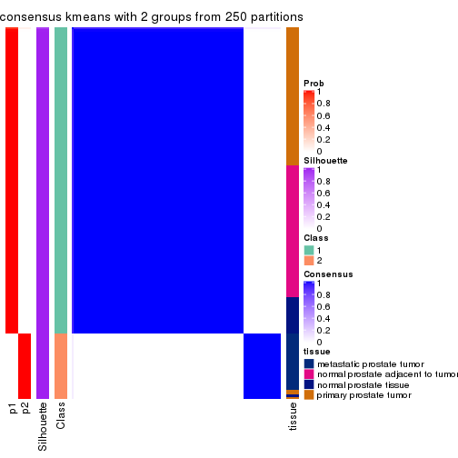</p>

</div>
<div id='tab-ATC-kmeans-consensus-heatmap-2'>
<pre><code class="r">consensus_heatmap(res, k = 3)
</code></pre>

<p>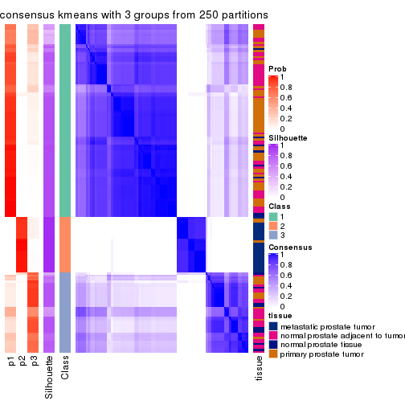</p>

</div>
<div id='tab-ATC-kmeans-consensus-heatmap-3'>
<pre><code class="r">consensus_heatmap(res, k = 4)
</code></pre>

<p>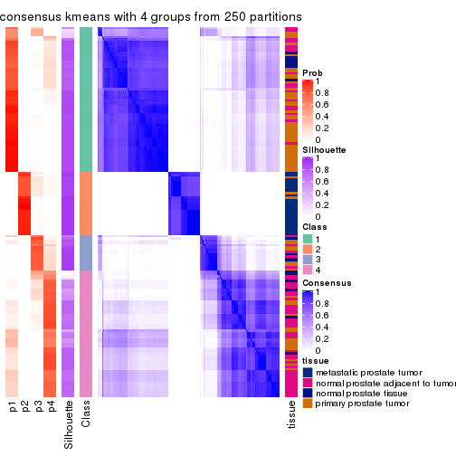</p>

</div>
<div id='tab-ATC-kmeans-consensus-heatmap-4'>
<pre><code class="r">consensus_heatmap(res, k = 5)
</code></pre>

<p>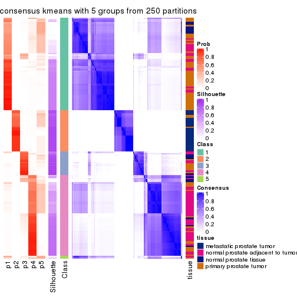</p>

</div>
<div id='tab-ATC-kmeans-consensus-heatmap-5'>
<pre><code class="r">consensus_heatmap(res, k = 6)
</code></pre>

<p>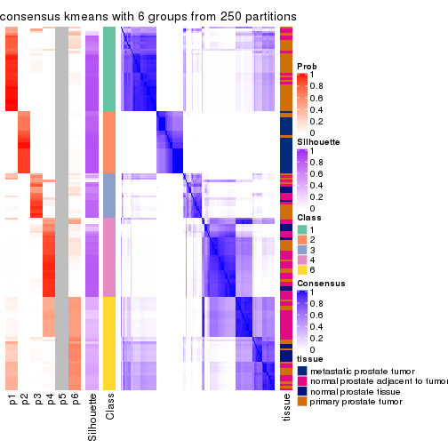</p>

</div>
</div>

Heatmaps for the membership of samples in all partitions to see how consistent they are:


<script>
$( function() {
	$( '#tabs-ATC-kmeans-membership-heatmap' ).tabs();
} );
</script>
<div id='tabs-ATC-kmeans-membership-heatmap'>
<ul>
<li><a href='#tab-ATC-kmeans-membership-heatmap-1'>k = 2</a></li>
<li><a href='#tab-ATC-kmeans-membership-heatmap-2'>k = 3</a></li>
<li><a href='#tab-ATC-kmeans-membership-heatmap-3'>k = 4</a></li>
<li><a href='#tab-ATC-kmeans-membership-heatmap-4'>k = 5</a></li>
<li><a href='#tab-ATC-kmeans-membership-heatmap-5'>k = 6</a></li>
</ul>
<div id='tab-ATC-kmeans-membership-heatmap-1'>
<pre><code class="r">membership_heatmap(res, k = 2)
</code></pre>

<p>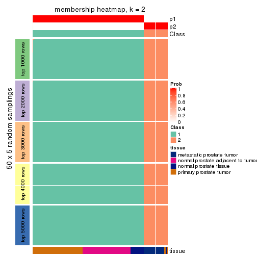</p>

</div>
<div id='tab-ATC-kmeans-membership-heatmap-2'>
<pre><code class="r">membership_heatmap(res, k = 3)
</code></pre>

<p>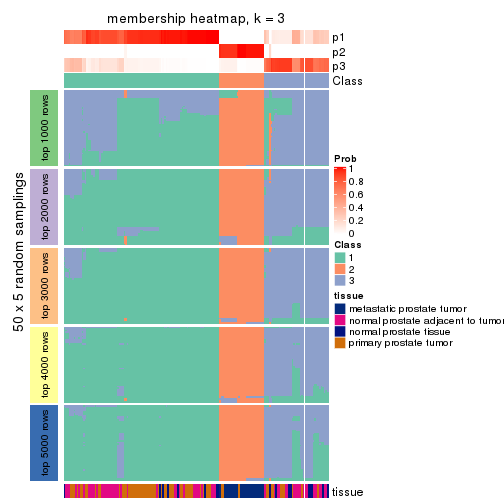</p>

</div>
<div id='tab-ATC-kmeans-membership-heatmap-3'>
<pre><code class="r">membership_heatmap(res, k = 4)
</code></pre>

<p>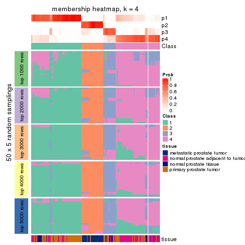</p>

</div>
<div id='tab-ATC-kmeans-membership-heatmap-4'>
<pre><code class="r">membership_heatmap(res, k = 5)
</code></pre>

<p>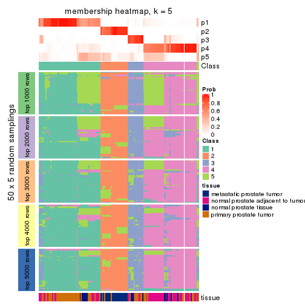</p>

</div>
<div id='tab-ATC-kmeans-membership-heatmap-5'>
<pre><code class="r">membership_heatmap(res, k = 6)
</code></pre>

<p>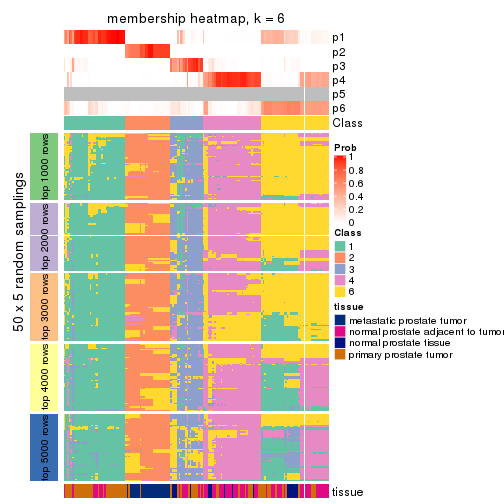</p>

</div>
</div>

As soon as we have had the classes for columns, we can look for signatures
which are significantly different between classes which can be candidate marks
for certain classes. Following are the heatmaps for signatures.


Signature heatmaps where rows are scaled:


<script>
$( function() {
	$( '#tabs-ATC-kmeans-get-signatures' ).tabs();
} );
</script>
<div id='tabs-ATC-kmeans-get-signatures'>
<ul>
<li><a href='#tab-ATC-kmeans-get-signatures-1'>k = 2</a></li>
<li><a href='#tab-ATC-kmeans-get-signatures-2'>k = 3</a></li>
<li><a href='#tab-ATC-kmeans-get-signatures-3'>k = 4</a></li>
<li><a href='#tab-ATC-kmeans-get-signatures-4'>k = 5</a></li>
<li><a href='#tab-ATC-kmeans-get-signatures-5'>k = 6</a></li>
</ul>
<div id='tab-ATC-kmeans-get-signatures-1'>
<pre><code class="r">get_signatures(res, k = 2)
</code></pre>

<p>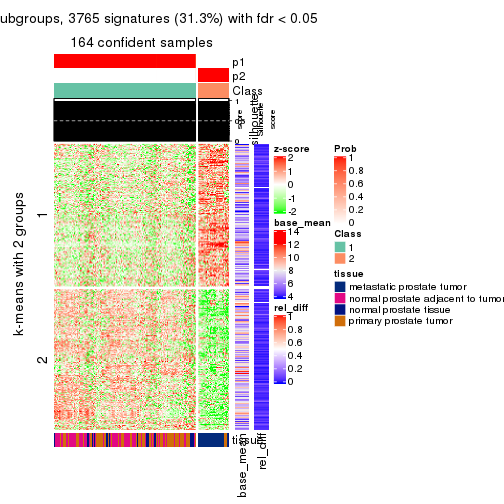</p>

</div>
<div id='tab-ATC-kmeans-get-signatures-2'>
<pre><code class="r">get_signatures(res, k = 3)
</code></pre>

<p>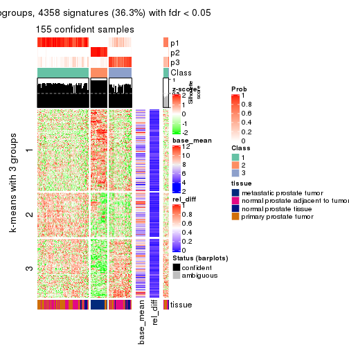</p>

</div>
<div id='tab-ATC-kmeans-get-signatures-3'>
<pre><code class="r">get_signatures(res, k = 4)
</code></pre>

<p>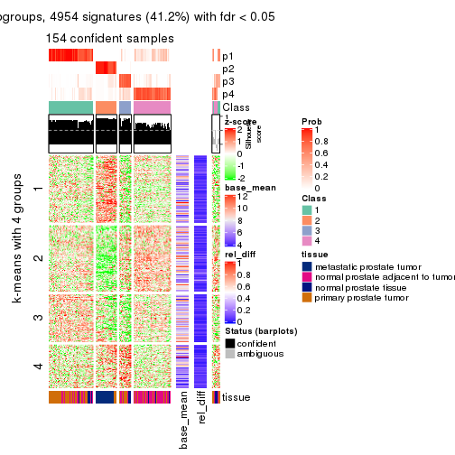</p>

</div>
<div id='tab-ATC-kmeans-get-signatures-4'>
<pre><code class="r">get_signatures(res, k = 5)
</code></pre>

<p>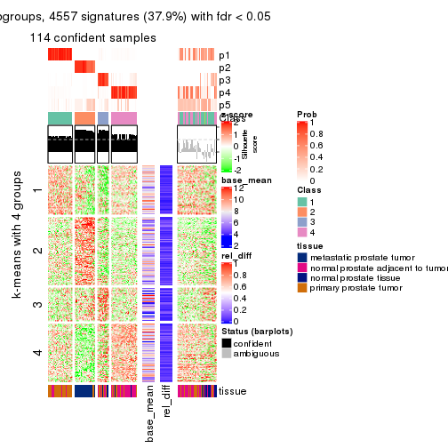</p>

</div>
<div id='tab-ATC-kmeans-get-signatures-5'>
<pre><code class="r">get_signatures(res, k = 6)
</code></pre>

<p>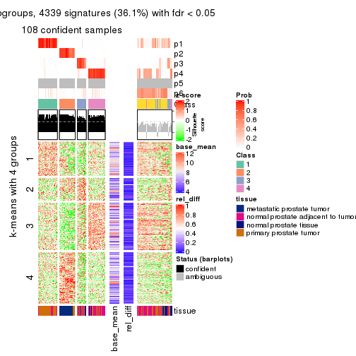</p>

</div>
</div>


Signature heatmaps where rows are not scaled:


<script>
$( function() {
	$( '#tabs-ATC-kmeans-get-signatures-no-scale' ).tabs();
} );
</script>
<div id='tabs-ATC-kmeans-get-signatures-no-scale'>
<ul>
<li><a href='#tab-ATC-kmeans-get-signatures-no-scale-1'>k = 2</a></li>
<li><a href='#tab-ATC-kmeans-get-signatures-no-scale-2'>k = 3</a></li>
<li><a href='#tab-ATC-kmeans-get-signatures-no-scale-3'>k = 4</a></li>
<li><a href='#tab-ATC-kmeans-get-signatures-no-scale-4'>k = 5</a></li>
<li><a href='#tab-ATC-kmeans-get-signatures-no-scale-5'>k = 6</a></li>
</ul>
<div id='tab-ATC-kmeans-get-signatures-no-scale-1'>
<pre><code class="r">get_signatures(res, k = 2, scale_rows = FALSE)
</code></pre>

<p>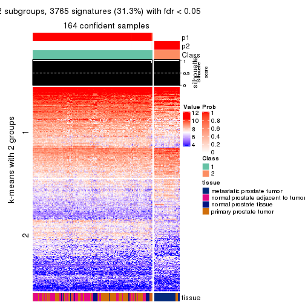</p>

</div>
<div id='tab-ATC-kmeans-get-signatures-no-scale-2'>
<pre><code class="r">get_signatures(res, k = 3, scale_rows = FALSE)
</code></pre>

<p>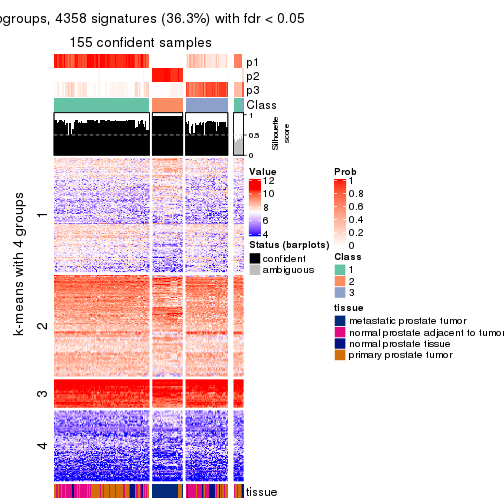</p>

</div>
<div id='tab-ATC-kmeans-get-signatures-no-scale-3'>
<pre><code class="r">get_signatures(res, k = 4, scale_rows = FALSE)
</code></pre>

<p>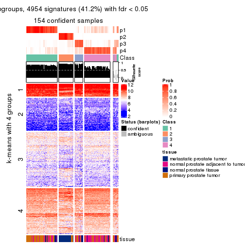</p>

</div>
<div id='tab-ATC-kmeans-get-signatures-no-scale-4'>
<pre><code class="r">get_signatures(res, k = 5, scale_rows = FALSE)
</code></pre>

<p>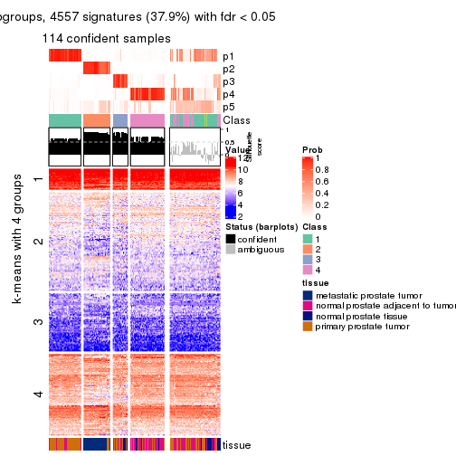</p>

</div>
<div id='tab-ATC-kmeans-get-signatures-no-scale-5'>
<pre><code class="r">get_signatures(res, k = 6, scale_rows = FALSE)
</code></pre>

<p>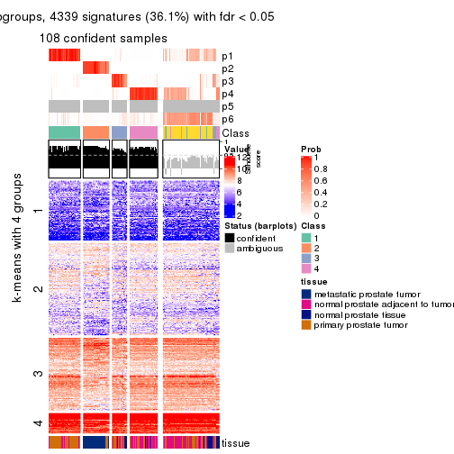</p>

</div>
</div>


Compare the overlap of signatures from different k:

```r
compare_signatures(res)
```

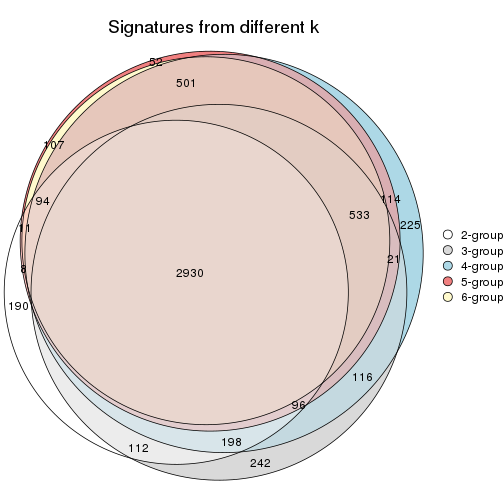

`get_signature()` returns a data frame invisibly. TO get the list of signatures, the function
call should be assigned to a variable explicitly. In following code, if `plot` argument is set
to `FALSE`, no heatmap is plotted while only the differential analysis is performed.

```r
# code only for demonstration
tb = get_signature(res, k = ..., plot = FALSE)
```

An example of the output of `tb` is:

```
#>   which_row         fdr    mean_1    mean_2 scaled_mean_1 scaled_mean_2 km
#> 1        38 0.042760348  8.373488  9.131774    -0.5533452     0.5164555  1
#> 2        40 0.018707592  7.106213  8.469186    -0.6173731     0.5762149  1
#> 3        55 0.019134737 10.221463 11.207825    -0.6159697     0.5749050  1
#> 4        59 0.006059896  5.921854  7.869574    -0.6899429     0.6439467  1
#> 5        60 0.018055526  8.928898 10.211722    -0.6204761     0.5791110  1
#> 6        98 0.009384629 15.714769 14.887706     0.6635654    -0.6193277  2
...
```

The columns in `tb` are:

1. `which_row`: row indices corresponding to the input matrix.
2. `fdr`: FDR for the differential test. 
3. `mean_x`: The mean value in group x.
4. `scaled_mean_x`: The mean value in group x after rows are scaled.
5. `km`: Row groups if k-means clustering is applied to rows.


UMAP plot which shows how samples are separated.


<script>
$( function() {
	$( '#tabs-ATC-kmeans-dimension-reduction' ).tabs();
} );
</script>
<div id='tabs-ATC-kmeans-dimension-reduction'>
<ul>
<li><a href='#tab-ATC-kmeans-dimension-reduction-1'>k = 2</a></li>
<li><a href='#tab-ATC-kmeans-dimension-reduction-2'>k = 3</a></li>
<li><a href='#tab-ATC-kmeans-dimension-reduction-3'>k = 4</a></li>
<li><a href='#tab-ATC-kmeans-dimension-reduction-4'>k = 5</a></li>
<li><a href='#tab-ATC-kmeans-dimension-reduction-5'>k = 6</a></li>
</ul>
<div id='tab-ATC-kmeans-dimension-reduction-1'>
<pre><code class="r">dimension_reduction(res, k = 2, method = &quot;UMAP&quot;)
</code></pre>

<p>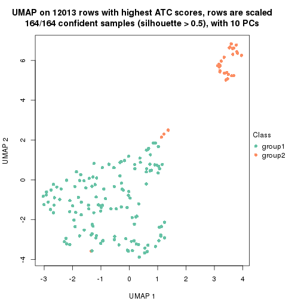</p>

</div>
<div id='tab-ATC-kmeans-dimension-reduction-2'>
<pre><code class="r">dimension_reduction(res, k = 3, method = &quot;UMAP&quot;)
</code></pre>

<p>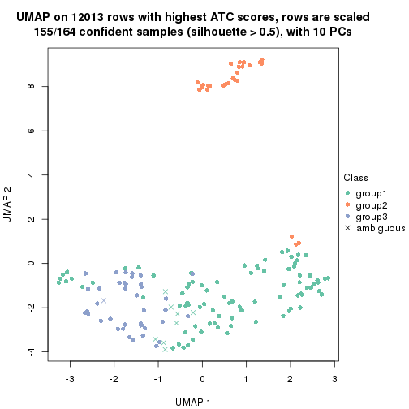</p>

</div>
<div id='tab-ATC-kmeans-dimension-reduction-3'>
<pre><code class="r">dimension_reduction(res, k = 4, method = &quot;UMAP&quot;)
</code></pre>

<p>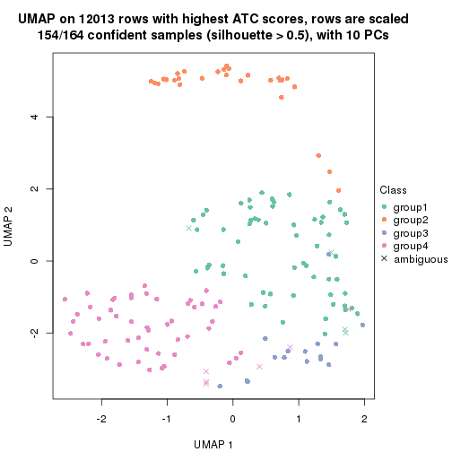</p>

</div>
<div id='tab-ATC-kmeans-dimension-reduction-4'>
<pre><code class="r">dimension_reduction(res, k = 5, method = &quot;UMAP&quot;)
</code></pre>

<p>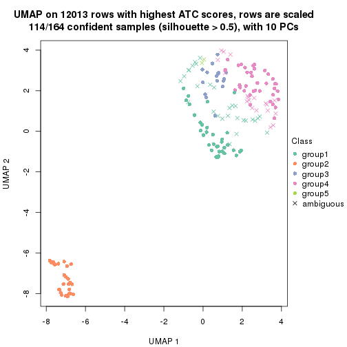</p>

</div>
<div id='tab-ATC-kmeans-dimension-reduction-5'>
<pre><code class="r">dimension_reduction(res, k = 6, method = &quot;UMAP&quot;)
</code></pre>

<p>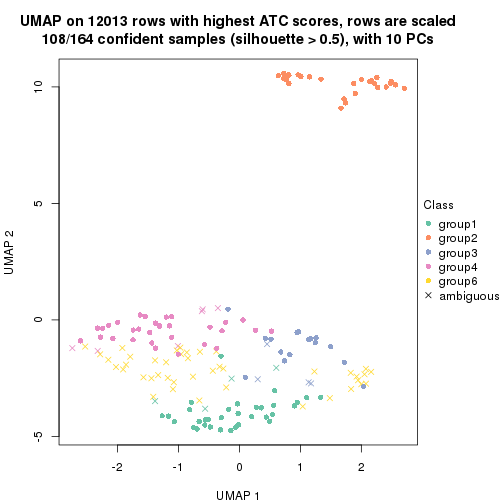</p>

</div>
</div>


Following heatmap shows how subgroups are split when increasing `k`:

```r
collect_classes(res)
```

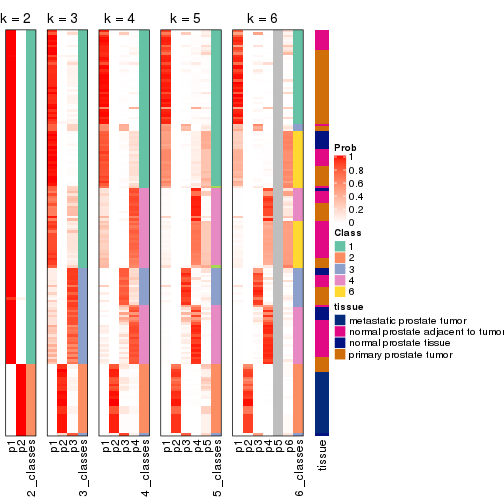


Test correlation between subgroups and known annotations. If the known
annotation is numeric, one-way ANOVA test is applied, and if the known
annotation is discrete, chi-squared contingency table test is applied.

```r
test_to_known_factors(res)
```

```
#>              n tissue(p) k
#> ATC:kmeans 164  1.08e-29 2
#> ATC:kmeans 155  5.49e-29 3
#> ATC:kmeans 154  2.31e-30 4
#> ATC:kmeans 114  2.22e-25 5
#> ATC:kmeans 108  1.03e-22 6
```


If matrix rows can be associated to genes, consider to use `functional_enrichment(res,
...)` to perform function enrichment for the signature genes. See [this vignette](http://bioconductor.org/packages/devel/bioc/vignettes/cola/inst/doc/functional_enrichment.html) for more detailed explanations.


 

---------------------------------------------------


### ATC:skmeans*


The object with results only for a single top-value method and a single partition method 
can be extracted as:

```r
res = res_list["ATC", "skmeans"]
# you can also extract it by
# res = res_list["ATC:skmeans"]
```

A summary of `res` and all the functions that can be applied to it:

```r
res
```

```
#> A 'ConsensusPartition' object with k = 2, 3, 4, 5, 6.
#>   On a matrix with 12013 rows and 164 columns.
#>   Top rows (1000, 2000, 3000, 4000, 5000) are extracted by 'ATC' method.
#>   Subgroups are detected by 'skmeans' method.
#>   Performed in total 1250 partitions by row resampling.
#>   Best k for subgroups seems to be 2.
#> 
#> Following methods can be applied to this 'ConsensusPartition' object:
#>  [1] "cola_report"             "collect_classes"         "collect_plots"          
#>  [4] "collect_stats"           "colnames"                "compare_signatures"     
#>  [7] "consensus_heatmap"       "dimension_reduction"     "functional_enrichment"  
#> [10] "get_anno_col"            "get_anno"                "get_classes"            
#> [13] "get_consensus"           "get_matrix"              "get_membership"         
#> [16] "get_param"               "get_signatures"          "get_stats"              
#> [19] "is_best_k"               "is_stable_k"             "membership_heatmap"     
#> [22] "ncol"                    "nrow"                    "plot_ecdf"              
#> [25] "rownames"                "select_partition_number" "show"                   
#> [28] "suggest_best_k"          "test_to_known_factors"
```

`collect_plots()` function collects all the plots made from `res` for all `k` (number of partitions)
into one single page to provide an easy and fast comparison between different `k`.

```r
collect_plots(res)
```

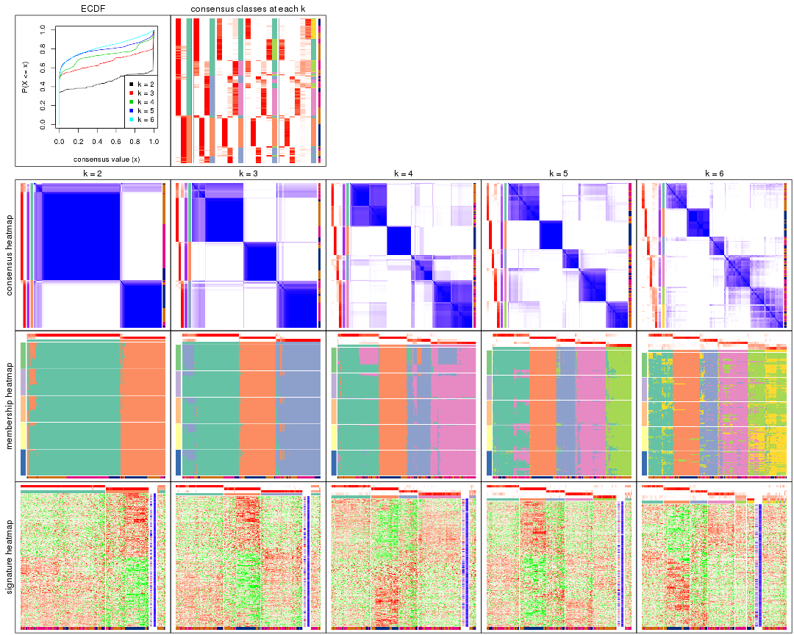

The plots are:

- The first row: a plot of the ECDF (empirical cumulative distribution
  function) curves of the consensus matrix for each `k` and the heatmap of
  predicted classes for each `k`.
- The second row: heatmaps of the consensus matrix for each `k`.
- The third row: heatmaps of the membership matrix for each `k`.
- The fouth row: heatmaps of the signatures for each `k`.

All the plots in panels can be made by individual functions and they are
plotted later in this section.

`select_partition_number()` produces several plots showing different
statistics for choosing "optimized" `k`. There are following statistics:

- ECDF curves of the consensus matrix for each `k`;
- 1-PAC. [The PAC
  score](https://en.wikipedia.org/wiki/Consensus_clustering#Over-interpretation_potential_of_consensus_clustering)
  measures the proportion of the ambiguous subgrouping.
- Mean silhouette score.
- Concordance. The mean probability of fiting the consensus class ids in all
  partitions.
- Area increased. Denote $A_k$ as the area under the ECDF curve for current
  `k`, the area increased is defined as $A_k - A_{k-1}$.
- Rand index. The percent of pairs of samples that are both in a same cluster
  or both are not in a same cluster in the partition of k and k-1.
- Jaccard index. The ratio of pairs of samples are both in a same cluster in
  the partition of k and k-1 and the pairs of samples are both in a same
  cluster in the partition k or k-1.

The detailed explanations of these statistics can be found in [the _cola_
vignette](http://bioconductor.org/packages/devel/bioc/vignettes/cola/inst/doc/cola.html#toc_13).

Generally speaking, lower PAC score, higher mean silhouette score or higher
concordance corresponds to better partition. Rand index and Jaccard index
measure how similar the current partition is compared to partition with `k-1`.
If they are too similar, we won't accept `k` is better than `k-1`.

```r
select_partition_number(res)
```

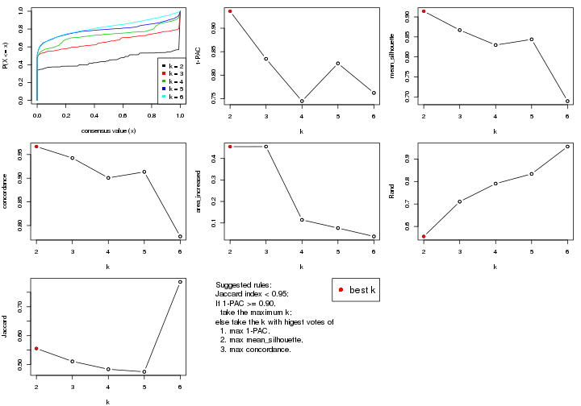

The numeric values for all these statistics can be obtained by `get_stats()`.

```r
get_stats(res)
```

```
#>   k 1-PAC mean_silhouette concordance area_increased  Rand Jaccard
#> 2 2 0.936           0.914       0.967         0.4549 0.556   0.556
#> 3 3 0.835           0.867       0.943         0.4552 0.710   0.511
#> 4 4 0.745           0.830       0.901         0.1143 0.791   0.484
#> 5 5 0.825           0.844       0.913         0.0761 0.834   0.475
#> 6 6 0.762           0.689       0.777         0.0371 0.955   0.786
```

`suggest_best_k()` suggests the best $k$ based on these statistics. The rules are as follows:

- All $k$ with Jaccard index larger than 0.95 are removed because increasing
  $k$ does not provide enough extra information. If all $k$ are removed, it is
  marked as no subgroup is detected.
- For all $k$ with 1-PAC score larger than 0.9, the maximal $k$ is taken as
  the best $k$, and other $k$ are marked as optional $k$.
- If it does not fit the second rule. The $k$ with the maximal vote of the
  highest 1-PAC score, highest mean silhouette, and highest concordance is
  taken as the best $k$.

```r
suggest_best_k(res)
```

```
#> [1] 2
```


Following shows the table of the partitions (You need to click the **show/hide
code output** link to see it). The membership matrix (columns with name `p*`)
is inferred by
[`clue::cl_consensus()`](https://www.rdocumentation.org/link/cl_consensus?package=clue)
function with the `SE` method. Basically the value in the membership matrix
represents the probability to belong to a certain group. The finall class
label for an item is determined with the group with highest probability it
belongs to.

In `get_classes()` function, the entropy is calculated from the membership
matrix and the silhouette score is calculated from the consensus matrix.


<script>
$( function() {
	$( '#tabs-ATC-skmeans-get-classes' ).tabs();
} );
</script>
<div id='tabs-ATC-skmeans-get-classes'>
<ul>
<li><a href='#tab-ATC-skmeans-get-classes-1'>k = 2</a></li>
<li><a href='#tab-ATC-skmeans-get-classes-2'>k = 3</a></li>
<li><a href='#tab-ATC-skmeans-get-classes-3'>k = 4</a></li>
<li><a href='#tab-ATC-skmeans-get-classes-4'>k = 5</a></li>
<li><a href='#tab-ATC-skmeans-get-classes-5'>k = 6</a></li>
</ul>

<div id='tab-ATC-skmeans-get-classes-1'>
<p><a id='tab-ATC-skmeans-get-classes-1-a' style='color:#0366d6' href='#'>show/hide code output</a></p>
<pre><code class="r">cbind(get_classes(res, k = 2), get_membership(res, k = 2))
</code></pre>

<pre><code>#&gt;           class entropy silhouette    p1    p2
#&gt; GSM152839     1  0.0000     0.9611 1.000 0.000
#&gt; GSM152840     1  0.0000     0.9611 1.000 0.000
#&gt; GSM152841     1  0.0000     0.9611 1.000 0.000
#&gt; GSM152842     1  0.0000     0.9611 1.000 0.000
#&gt; GSM152843     1  0.0000     0.9611 1.000 0.000
#&gt; GSM152844     1  0.0000     0.9611 1.000 0.000
#&gt; GSM152845     2  0.0000     0.9716 0.000 1.000
#&gt; GSM152846     2  0.0938     0.9614 0.012 0.988
#&gt; GSM152847     1  0.0000     0.9611 1.000 0.000
#&gt; GSM152848     1  0.0000     0.9611 1.000 0.000
#&gt; GSM152849     1  0.0000     0.9611 1.000 0.000
#&gt; GSM152850     1  0.0000     0.9611 1.000 0.000
#&gt; GSM152851     1  0.0000     0.9611 1.000 0.000
#&gt; GSM152852     2  0.8661     0.5879 0.288 0.712
#&gt; GSM152853     1  0.0000     0.9611 1.000 0.000
#&gt; GSM152854     1  0.9866     0.2154 0.568 0.432
#&gt; GSM152855     1  0.0000     0.9611 1.000 0.000
#&gt; GSM153238     1  0.0000     0.9611 1.000 0.000
#&gt; GSM153239     1  0.0000     0.9611 1.000 0.000
#&gt; GSM153240     1  0.0000     0.9611 1.000 0.000
#&gt; GSM153241     1  0.0000     0.9611 1.000 0.000
#&gt; GSM153242     2  0.0000     0.9716 0.000 1.000
#&gt; GSM153243     2  0.0000     0.9716 0.000 1.000
#&gt; GSM153244     2  0.3584     0.9071 0.068 0.932
#&gt; GSM153245     1  0.0000     0.9611 1.000 0.000
#&gt; GSM153246     1  0.2043     0.9319 0.968 0.032
#&gt; GSM153247     1  0.0000     0.9611 1.000 0.000
#&gt; GSM153248     1  0.0000     0.9611 1.000 0.000
#&gt; GSM153249     1  0.0000     0.9611 1.000 0.000
#&gt; GSM153250     1  0.0000     0.9611 1.000 0.000
#&gt; GSM153251     2  0.0000     0.9716 0.000 1.000
#&gt; GSM153252     1  0.0000     0.9611 1.000 0.000
#&gt; GSM153253     1  0.0000     0.9611 1.000 0.000
#&gt; GSM153254     2  0.9393     0.4437 0.356 0.644
#&gt; GSM153255     1  0.0000     0.9611 1.000 0.000
#&gt; GSM153256     1  0.0000     0.9611 1.000 0.000
#&gt; GSM153257     1  0.0000     0.9611 1.000 0.000
#&gt; GSM153258     1  0.0000     0.9611 1.000 0.000
#&gt; GSM153259     1  0.0000     0.9611 1.000 0.000
#&gt; GSM153260     2  0.0000     0.9716 0.000 1.000
#&gt; GSM153261     2  0.0000     0.9716 0.000 1.000
#&gt; GSM153262     1  0.0000     0.9611 1.000 0.000
#&gt; GSM153263     1  0.0000     0.9611 1.000 0.000
#&gt; GSM153264     1  0.0000     0.9611 1.000 0.000
#&gt; GSM153265     1  0.0000     0.9611 1.000 0.000
#&gt; GSM153266     1  0.0000     0.9611 1.000 0.000
#&gt; GSM153267     1  0.0000     0.9611 1.000 0.000
#&gt; GSM153268     1  0.0000     0.9611 1.000 0.000
#&gt; GSM153269     1  0.0000     0.9611 1.000 0.000
#&gt; GSM153270     1  0.0000     0.9611 1.000 0.000
#&gt; GSM153271     1  0.0000     0.9611 1.000 0.000
#&gt; GSM153272     1  0.0000     0.9611 1.000 0.000
#&gt; GSM153273     1  0.0000     0.9611 1.000 0.000
#&gt; GSM153274     1  0.0000     0.9611 1.000 0.000
#&gt; GSM153275     1  0.0000     0.9611 1.000 0.000
#&gt; GSM153276     1  0.0000     0.9611 1.000 0.000
#&gt; GSM153277     1  0.0000     0.9611 1.000 0.000
#&gt; GSM153278     1  0.0000     0.9611 1.000 0.000
#&gt; GSM153279     1  0.0000     0.9611 1.000 0.000
#&gt; GSM153280     1  0.0000     0.9611 1.000 0.000
#&gt; GSM153281     1  0.0000     0.9611 1.000 0.000
#&gt; GSM153282     1  0.0000     0.9611 1.000 0.000
#&gt; GSM153283     1  0.0000     0.9611 1.000 0.000
#&gt; GSM153284     1  0.0000     0.9611 1.000 0.000
#&gt; GSM153285     1  0.0000     0.9611 1.000 0.000
#&gt; GSM153286     1  0.0000     0.9611 1.000 0.000
#&gt; GSM153287     1  0.0000     0.9611 1.000 0.000
#&gt; GSM153288     1  0.0000     0.9611 1.000 0.000
#&gt; GSM153289     1  0.0000     0.9611 1.000 0.000
#&gt; GSM153290     1  0.0000     0.9611 1.000 0.000
#&gt; GSM153291     1  0.0000     0.9611 1.000 0.000
#&gt; GSM153292     1  0.0000     0.9611 1.000 0.000
#&gt; GSM153293     1  0.0000     0.9611 1.000 0.000
#&gt; GSM153294     1  0.0000     0.9611 1.000 0.000
#&gt; GSM153295     1  0.0000     0.9611 1.000 0.000
#&gt; GSM153054     1  0.0000     0.9611 1.000 0.000
#&gt; GSM153055     1  0.0000     0.9611 1.000 0.000
#&gt; GSM153056     1  0.0000     0.9611 1.000 0.000
#&gt; GSM153057     2  0.2603     0.9316 0.044 0.956
#&gt; GSM153058     2  0.0000     0.9716 0.000 1.000
#&gt; GSM153059     2  0.0000     0.9716 0.000 1.000
#&gt; GSM153060     1  1.0000    -0.0126 0.504 0.496
#&gt; GSM153061     2  0.6531     0.7868 0.168 0.832
#&gt; GSM153062     2  0.0000     0.9716 0.000 1.000
#&gt; GSM153063     1  0.0000     0.9611 1.000 0.000
#&gt; GSM153064     1  0.0000     0.9611 1.000 0.000
#&gt; GSM153065     2  0.0000     0.9716 0.000 1.000
#&gt; GSM153066     2  0.0000     0.9716 0.000 1.000
#&gt; GSM153067     1  0.0000     0.9611 1.000 0.000
#&gt; GSM153068     2  0.0000     0.9716 0.000 1.000
#&gt; GSM153069     1  0.0000     0.9611 1.000 0.000
#&gt; GSM153070     1  0.0000     0.9611 1.000 0.000
#&gt; GSM153071     1  0.0000     0.9611 1.000 0.000
#&gt; GSM153072     1  0.0000     0.9611 1.000 0.000
#&gt; GSM153073     1  0.0000     0.9611 1.000 0.000
#&gt; GSM153074     1  0.0000     0.9611 1.000 0.000
#&gt; GSM153075     1  0.0000     0.9611 1.000 0.000
#&gt; GSM153076     1  0.0000     0.9611 1.000 0.000
#&gt; GSM153077     1  0.0000     0.9611 1.000 0.000
#&gt; GSM153078     1  0.0000     0.9611 1.000 0.000
#&gt; GSM153079     1  0.8713     0.5927 0.708 0.292
#&gt; GSM153080     1  0.0000     0.9611 1.000 0.000
#&gt; GSM153081     1  0.0000     0.9611 1.000 0.000
#&gt; GSM153082     2  0.9988     0.0104 0.480 0.520
#&gt; GSM153083     1  0.9815     0.3075 0.580 0.420
#&gt; GSM153084     2  0.0000     0.9716 0.000 1.000
#&gt; GSM153085     2  0.0000     0.9716 0.000 1.000
#&gt; GSM153086     1  0.4431     0.8726 0.908 0.092
#&gt; GSM153087     1  0.0000     0.9611 1.000 0.000
#&gt; GSM153088     1  0.0000     0.9611 1.000 0.000
#&gt; GSM153089     2  0.0000     0.9716 0.000 1.000
#&gt; GSM153090     1  0.0000     0.9611 1.000 0.000
#&gt; GSM153091     1  0.9608     0.4011 0.616 0.384
#&gt; GSM153092     1  0.0000     0.9611 1.000 0.000
#&gt; GSM153093     1  0.0000     0.9611 1.000 0.000
#&gt; GSM153094     1  0.9896     0.2496 0.560 0.440
#&gt; GSM153095     1  0.0000     0.9611 1.000 0.000
#&gt; GSM153096     1  0.0000     0.9611 1.000 0.000
#&gt; GSM153097     1  0.9393     0.4656 0.644 0.356
#&gt; GSM153098     1  0.0000     0.9611 1.000 0.000
#&gt; GSM153099     1  0.0000     0.9611 1.000 0.000
#&gt; GSM153100     1  0.0000     0.9611 1.000 0.000
#&gt; GSM153101     1  0.2948     0.9135 0.948 0.052
#&gt; GSM153102     2  0.0000     0.9716 0.000 1.000
#&gt; GSM153103     1  0.9427     0.4568 0.640 0.360
#&gt; GSM153104     1  0.0000     0.9611 1.000 0.000
#&gt; GSM153106     1  0.8608     0.6085 0.716 0.284
#&gt; GSM153107     1  0.0000     0.9611 1.000 0.000
#&gt; GSM153108     1  0.0000     0.9611 1.000 0.000
#&gt; GSM153109     2  0.0000     0.9716 0.000 1.000
#&gt; GSM153110     1  0.0000     0.9611 1.000 0.000
#&gt; GSM153111     1  0.9608     0.4012 0.616 0.384
#&gt; GSM153112     1  0.0000     0.9611 1.000 0.000
#&gt; GSM153113     2  0.0000     0.9716 0.000 1.000
#&gt; GSM153114     1  0.0000     0.9611 1.000 0.000
#&gt; GSM187532     2  0.0000     0.9716 0.000 1.000
#&gt; GSM187533     2  0.0000     0.9716 0.000 1.000
#&gt; GSM187534     2  0.0000     0.9716 0.000 1.000
#&gt; GSM187535     2  0.0000     0.9716 0.000 1.000
#&gt; GSM152906     2  0.0000     0.9716 0.000 1.000
#&gt; GSM152907     2  0.0000     0.9716 0.000 1.000
#&gt; GSM152908     2  0.0000     0.9716 0.000 1.000
#&gt; GSM152909     2  0.0000     0.9716 0.000 1.000
#&gt; GSM152910     2  0.0000     0.9716 0.000 1.000
#&gt; GSM152911     2  0.0000     0.9716 0.000 1.000
#&gt; GSM152912     2  0.0000     0.9716 0.000 1.000
#&gt; GSM152913     2  0.0000     0.9716 0.000 1.000
#&gt; GSM152914     2  0.0000     0.9716 0.000 1.000
#&gt; GSM152915     2  0.0000     0.9716 0.000 1.000
#&gt; GSM152916     2  0.0000     0.9716 0.000 1.000
#&gt; GSM152917     2  0.0000     0.9716 0.000 1.000
#&gt; GSM152918     2  0.0000     0.9716 0.000 1.000
#&gt; GSM152919     2  0.0000     0.9716 0.000 1.000
#&gt; GSM152920     2  0.0000     0.9716 0.000 1.000
#&gt; GSM152921     2  0.0000     0.9716 0.000 1.000
#&gt; GSM152922     2  0.0000     0.9716 0.000 1.000
#&gt; GSM152923     2  0.0000     0.9716 0.000 1.000
#&gt; GSM152924     2  0.0000     0.9716 0.000 1.000
#&gt; GSM152925     2  0.0000     0.9716 0.000 1.000
#&gt; GSM152926     2  0.0000     0.9716 0.000 1.000
#&gt; GSM152927     2  0.0000     0.9716 0.000 1.000
#&gt; GSM152928     2  0.0000     0.9716 0.000 1.000
#&gt; GSM152929     2  0.0000     0.9716 0.000 1.000
#&gt; GSM152930     2  0.0000     0.9716 0.000 1.000
</code></pre>

<script>
$('#tab-ATC-skmeans-get-classes-1-a').parent().next().next().hide();
$('#tab-ATC-skmeans-get-classes-1-a').click(function(){
  $('#tab-ATC-skmeans-get-classes-1-a').parent().next().next().toggle();
  return(false);
});
</script>
</div>

<div id='tab-ATC-skmeans-get-classes-2'>
<p><a id='tab-ATC-skmeans-get-classes-2-a' style='color:#0366d6' href='#'>show/hide code output</a></p>
<pre><code class="r">cbind(get_classes(res, k = 3), get_membership(res, k = 3))
</code></pre>

<pre><code>#&gt;           class entropy silhouette    p1    p2    p3
#&gt; GSM152839     1  0.0424      0.897 0.992 0.000 0.008
#&gt; GSM152840     3  0.0000      0.946 0.000 0.000 1.000
#&gt; GSM152841     3  0.0000      0.946 0.000 0.000 1.000
#&gt; GSM152842     1  0.0000      0.901 1.000 0.000 0.000
#&gt; GSM152843     1  0.0000      0.901 1.000 0.000 0.000
#&gt; GSM152844     3  0.0000      0.946 0.000 0.000 1.000
#&gt; GSM152845     2  0.0000      0.981 0.000 1.000 0.000
#&gt; GSM152846     3  0.0237      0.943 0.000 0.004 0.996
#&gt; GSM152847     1  0.0000      0.901 1.000 0.000 0.000
#&gt; GSM152848     1  0.0000      0.901 1.000 0.000 0.000
#&gt; GSM152849     1  0.0424      0.897 0.992 0.000 0.008
#&gt; GSM152850     1  0.0000      0.901 1.000 0.000 0.000
#&gt; GSM152851     3  0.0000      0.946 0.000 0.000 1.000
#&gt; GSM152852     3  0.0000      0.946 0.000 0.000 1.000
#&gt; GSM152853     3  0.0000      0.946 0.000 0.000 1.000
#&gt; GSM152854     3  0.0000      0.946 0.000 0.000 1.000
#&gt; GSM152855     3  0.0237      0.943 0.004 0.000 0.996
#&gt; GSM153238     1  0.0000      0.901 1.000 0.000 0.000
#&gt; GSM153239     3  0.0000      0.946 0.000 0.000 1.000
#&gt; GSM153240     3  0.0000      0.946 0.000 0.000 1.000
#&gt; GSM153241     3  0.3619      0.814 0.136 0.000 0.864
#&gt; GSM153242     3  0.4654      0.714 0.000 0.208 0.792
#&gt; GSM153243     2  0.0000      0.981 0.000 1.000 0.000
#&gt; GSM153244     3  0.0592      0.937 0.000 0.012 0.988
#&gt; GSM153245     3  0.0000      0.946 0.000 0.000 1.000
#&gt; GSM153246     3  0.1964      0.898 0.056 0.000 0.944
#&gt; GSM153247     1  0.0000      0.901 1.000 0.000 0.000
#&gt; GSM153248     1  0.0000      0.901 1.000 0.000 0.000
#&gt; GSM153249     3  0.0000      0.946 0.000 0.000 1.000
#&gt; GSM153250     1  0.0000      0.901 1.000 0.000 0.000
#&gt; GSM153251     3  0.6180      0.265 0.000 0.416 0.584
#&gt; GSM153252     1  0.6308      0.201 0.508 0.000 0.492
#&gt; GSM153253     3  0.0000      0.946 0.000 0.000 1.000
#&gt; GSM153254     3  0.0000      0.946 0.000 0.000 1.000
#&gt; GSM153255     3  0.0000      0.946 0.000 0.000 1.000
#&gt; GSM153256     1  0.4974      0.704 0.764 0.000 0.236
#&gt; GSM153257     1  0.6215      0.385 0.572 0.000 0.428
#&gt; GSM153258     1  0.0000      0.901 1.000 0.000 0.000
#&gt; GSM153259     1  0.0000      0.901 1.000 0.000 0.000
#&gt; GSM153260     2  0.2448      0.914 0.076 0.924 0.000
#&gt; GSM153261     2  0.7338      0.528 0.060 0.652 0.288
#&gt; GSM153262     3  0.0000      0.946 0.000 0.000 1.000
#&gt; GSM153263     1  0.0000      0.901 1.000 0.000 0.000
#&gt; GSM153264     1  0.0000      0.901 1.000 0.000 0.000
#&gt; GSM153265     3  0.0000      0.946 0.000 0.000 1.000
#&gt; GSM153266     1  0.0000      0.901 1.000 0.000 0.000
#&gt; GSM153267     1  0.5810      0.566 0.664 0.000 0.336
#&gt; GSM153268     3  0.0000      0.946 0.000 0.000 1.000
#&gt; GSM153269     1  0.6286      0.289 0.536 0.000 0.464
#&gt; GSM153270     3  0.0000      0.946 0.000 0.000 1.000
#&gt; GSM153271     1  0.0000      0.901 1.000 0.000 0.000
#&gt; GSM153272     1  0.6204      0.395 0.576 0.000 0.424
#&gt; GSM153273     1  0.0000      0.901 1.000 0.000 0.000
#&gt; GSM153274     3  0.3879      0.775 0.152 0.000 0.848
#&gt; GSM153275     3  0.4750      0.668 0.216 0.000 0.784
#&gt; GSM153276     3  0.3412      0.815 0.124 0.000 0.876
#&gt; GSM153277     3  0.0000      0.946 0.000 0.000 1.000
#&gt; GSM153278     1  0.0424      0.896 0.992 0.000 0.008
#&gt; GSM153279     3  0.0000      0.946 0.000 0.000 1.000
#&gt; GSM153280     3  0.0000      0.946 0.000 0.000 1.000
#&gt; GSM153281     3  0.0000      0.946 0.000 0.000 1.000
#&gt; GSM153282     3  0.0000      0.946 0.000 0.000 1.000
#&gt; GSM153283     1  0.0000      0.901 1.000 0.000 0.000
#&gt; GSM153284     3  0.6307     -0.159 0.488 0.000 0.512
#&gt; GSM153285     3  0.0000      0.946 0.000 0.000 1.000
#&gt; GSM153286     1  0.6192      0.404 0.580 0.000 0.420
#&gt; GSM153287     3  0.0000      0.946 0.000 0.000 1.000
#&gt; GSM153288     1  0.6267      0.323 0.548 0.000 0.452
#&gt; GSM153289     1  0.6180      0.413 0.584 0.000 0.416
#&gt; GSM153290     3  0.0000      0.946 0.000 0.000 1.000
#&gt; GSM153291     3  0.0000      0.946 0.000 0.000 1.000
#&gt; GSM153292     3  0.0000      0.946 0.000 0.000 1.000
#&gt; GSM153293     1  0.4002      0.783 0.840 0.000 0.160
#&gt; GSM153294     1  0.0000      0.901 1.000 0.000 0.000
#&gt; GSM153295     1  0.5733      0.581 0.676 0.000 0.324
#&gt; GSM153054     1  0.0000      0.901 1.000 0.000 0.000
#&gt; GSM153055     1  0.6154      0.431 0.592 0.000 0.408
#&gt; GSM153056     3  0.1529      0.916 0.040 0.000 0.960
#&gt; GSM153057     3  0.4121      0.772 0.000 0.168 0.832
#&gt; GSM153058     3  0.6192      0.253 0.000 0.420 0.580
#&gt; GSM153059     2  0.0000      0.981 0.000 1.000 0.000
#&gt; GSM153060     3  0.0424      0.940 0.000 0.008 0.992
#&gt; GSM153061     1  0.3192      0.798 0.888 0.112 0.000
#&gt; GSM153062     2  0.0000      0.981 0.000 1.000 0.000
#&gt; GSM153063     3  0.0000      0.946 0.000 0.000 1.000
#&gt; GSM153064     1  0.0000      0.901 1.000 0.000 0.000
#&gt; GSM153065     2  0.0237      0.978 0.004 0.996 0.000
#&gt; GSM153066     2  0.0000      0.981 0.000 1.000 0.000
#&gt; GSM153067     3  0.1031      0.927 0.024 0.000 0.976
#&gt; GSM153068     2  0.0000      0.981 0.000 1.000 0.000
#&gt; GSM153069     3  0.0000      0.946 0.000 0.000 1.000
#&gt; GSM153070     1  0.0000      0.901 1.000 0.000 0.000
#&gt; GSM153071     1  0.0000      0.901 1.000 0.000 0.000
#&gt; GSM153072     1  0.0000      0.901 1.000 0.000 0.000
#&gt; GSM153073     1  0.0000      0.901 1.000 0.000 0.000
#&gt; GSM153074     3  0.0000      0.946 0.000 0.000 1.000
#&gt; GSM153075     3  0.0000      0.946 0.000 0.000 1.000
#&gt; GSM153076     1  0.0000      0.901 1.000 0.000 0.000
#&gt; GSM153077     1  0.0000      0.901 1.000 0.000 0.000
#&gt; GSM153078     1  0.0000      0.901 1.000 0.000 0.000
#&gt; GSM153079     1  0.0000      0.901 1.000 0.000 0.000
#&gt; GSM153080     3  0.0592      0.937 0.012 0.000 0.988
#&gt; GSM153081     1  0.0000      0.901 1.000 0.000 0.000
#&gt; GSM153082     1  0.0000      0.901 1.000 0.000 0.000
#&gt; GSM153083     1  0.0000      0.901 1.000 0.000 0.000
#&gt; GSM153084     2  0.0000      0.981 0.000 1.000 0.000
#&gt; GSM153085     2  0.5016      0.697 0.240 0.760 0.000
#&gt; GSM153086     1  0.0000      0.901 1.000 0.000 0.000
#&gt; GSM153087     3  0.0000      0.946 0.000 0.000 1.000
#&gt; GSM153088     1  0.0000      0.901 1.000 0.000 0.000
#&gt; GSM153089     2  0.0892      0.964 0.000 0.980 0.020
#&gt; GSM153090     1  0.5529      0.622 0.704 0.000 0.296
#&gt; GSM153091     1  0.0000      0.901 1.000 0.000 0.000
#&gt; GSM153092     1  0.0000      0.901 1.000 0.000 0.000
#&gt; GSM153093     3  0.0000      0.946 0.000 0.000 1.000
#&gt; GSM153094     1  0.0000      0.901 1.000 0.000 0.000
#&gt; GSM153095     1  0.0000      0.901 1.000 0.000 0.000
#&gt; GSM153096     1  0.0000      0.901 1.000 0.000 0.000
#&gt; GSM153097     1  0.0000      0.901 1.000 0.000 0.000
#&gt; GSM153098     1  0.4931      0.711 0.768 0.000 0.232
#&gt; GSM153099     1  0.5431      0.640 0.716 0.000 0.284
#&gt; GSM153100     1  0.0000      0.901 1.000 0.000 0.000
#&gt; GSM153101     1  0.0000      0.901 1.000 0.000 0.000
#&gt; GSM153102     2  0.2066      0.929 0.060 0.940 0.000
#&gt; GSM153103     1  0.0000      0.901 1.000 0.000 0.000
#&gt; GSM153104     3  0.0000      0.946 0.000 0.000 1.000
#&gt; GSM153106     1  0.7083      0.401 0.592 0.028 0.380
#&gt; GSM153107     1  0.0000      0.901 1.000 0.000 0.000
#&gt; GSM153108     1  0.4399      0.757 0.812 0.000 0.188
#&gt; GSM153109     2  0.2165      0.926 0.064 0.936 0.000
#&gt; GSM153110     1  0.0000      0.901 1.000 0.000 0.000
#&gt; GSM153111     1  0.0000      0.901 1.000 0.000 0.000
#&gt; GSM153112     1  0.0000      0.901 1.000 0.000 0.000
#&gt; GSM153113     2  0.0000      0.981 0.000 1.000 0.000
#&gt; GSM153114     3  0.0000      0.946 0.000 0.000 1.000
#&gt; GSM187532     2  0.0000      0.981 0.000 1.000 0.000
#&gt; GSM187533     2  0.0000      0.981 0.000 1.000 0.000
#&gt; GSM187534     2  0.0000      0.981 0.000 1.000 0.000
#&gt; GSM187535     2  0.0000      0.981 0.000 1.000 0.000
#&gt; GSM152906     2  0.0000      0.981 0.000 1.000 0.000
#&gt; GSM152907     2  0.0000      0.981 0.000 1.000 0.000
#&gt; GSM152908     2  0.0000      0.981 0.000 1.000 0.000
#&gt; GSM152909     2  0.0000      0.981 0.000 1.000 0.000
#&gt; GSM152910     2  0.0000      0.981 0.000 1.000 0.000
#&gt; GSM152911     2  0.0000      0.981 0.000 1.000 0.000
#&gt; GSM152912     2  0.0000      0.981 0.000 1.000 0.000
#&gt; GSM152913     2  0.0000      0.981 0.000 1.000 0.000
#&gt; GSM152914     2  0.0000      0.981 0.000 1.000 0.000
#&gt; GSM152915     2  0.0000      0.981 0.000 1.000 0.000
#&gt; GSM152916     2  0.0000      0.981 0.000 1.000 0.000
#&gt; GSM152917     2  0.0000      0.981 0.000 1.000 0.000
#&gt; GSM152918     2  0.0000      0.981 0.000 1.000 0.000
#&gt; GSM152919     2  0.0000      0.981 0.000 1.000 0.000
#&gt; GSM152920     2  0.0000      0.981 0.000 1.000 0.000
#&gt; GSM152921     2  0.0000      0.981 0.000 1.000 0.000
#&gt; GSM152922     2  0.0000      0.981 0.000 1.000 0.000
#&gt; GSM152923     2  0.0000      0.981 0.000 1.000 0.000
#&gt; GSM152924     2  0.0000      0.981 0.000 1.000 0.000
#&gt; GSM152925     2  0.0000      0.981 0.000 1.000 0.000
#&gt; GSM152926     2  0.0000      0.981 0.000 1.000 0.000
#&gt; GSM152927     2  0.0000      0.981 0.000 1.000 0.000
#&gt; GSM152928     2  0.0000      0.981 0.000 1.000 0.000
#&gt; GSM152929     2  0.0000      0.981 0.000 1.000 0.000
#&gt; GSM152930     2  0.0000      0.981 0.000 1.000 0.000
</code></pre>

<script>
$('#tab-ATC-skmeans-get-classes-2-a').parent().next().next().hide();
$('#tab-ATC-skmeans-get-classes-2-a').click(function(){
  $('#tab-ATC-skmeans-get-classes-2-a').parent().next().next().toggle();
  return(false);
});
</script>
</div>

<div id='tab-ATC-skmeans-get-classes-3'>
<p><a id='tab-ATC-skmeans-get-classes-3-a' style='color:#0366d6' href='#'>show/hide code output</a></p>
<pre><code class="r">cbind(get_classes(res, k = 4), get_membership(res, k = 4))
</code></pre>

<pre><code>#&gt;           class entropy silhouette    p1    p2    p3    p4
#&gt; GSM152839     1  0.4996     0.8261 0.752 0.000 0.056 0.192
#&gt; GSM152840     4  0.4585     0.6406 0.000 0.000 0.332 0.668
#&gt; GSM152841     4  0.3356     0.8274 0.000 0.000 0.176 0.824
#&gt; GSM152842     1  0.3991     0.8703 0.808 0.000 0.020 0.172
#&gt; GSM152843     1  0.3356     0.8766 0.824 0.000 0.000 0.176
#&gt; GSM152844     3  0.4454     0.3968 0.000 0.000 0.692 0.308
#&gt; GSM152845     3  0.3172     0.7418 0.000 0.160 0.840 0.000
#&gt; GSM152846     3  0.0000     0.8147 0.000 0.000 1.000 0.000
#&gt; GSM152847     1  0.4633     0.8509 0.780 0.000 0.048 0.172
#&gt; GSM152848     1  0.3400     0.8748 0.820 0.000 0.000 0.180
#&gt; GSM152849     1  0.7475     0.2548 0.448 0.000 0.372 0.180
#&gt; GSM152850     1  0.3636     0.8764 0.820 0.000 0.008 0.172
#&gt; GSM152851     4  0.3764     0.7973 0.000 0.000 0.216 0.784
#&gt; GSM152852     3  0.0000     0.8147 0.000 0.000 1.000 0.000
#&gt; GSM152853     3  0.4746     0.2388 0.000 0.000 0.632 0.368
#&gt; GSM152854     3  0.0000     0.8147 0.000 0.000 1.000 0.000
#&gt; GSM152855     4  0.0817     0.8625 0.000 0.000 0.024 0.976
#&gt; GSM153238     1  0.0000     0.8766 1.000 0.000 0.000 0.000
#&gt; GSM153239     3  0.4643     0.3085 0.000 0.000 0.656 0.344
#&gt; GSM153240     4  0.0188     0.8596 0.000 0.000 0.004 0.996
#&gt; GSM153241     3  0.5228     0.5658 0.024 0.000 0.664 0.312
#&gt; GSM153242     3  0.0000     0.8147 0.000 0.000 1.000 0.000
#&gt; GSM153243     3  0.4956     0.7412 0.108 0.116 0.776 0.000
#&gt; GSM153244     3  0.0188     0.8127 0.000 0.000 0.996 0.004
#&gt; GSM153245     4  0.4855     0.5029 0.000 0.000 0.400 0.600
#&gt; GSM153246     3  0.1302     0.8044 0.000 0.000 0.956 0.044
#&gt; GSM153247     1  0.3448     0.8790 0.828 0.000 0.004 0.168
#&gt; GSM153248     1  0.0188     0.8776 0.996 0.000 0.000 0.004
#&gt; GSM153249     4  0.3172     0.8357 0.000 0.000 0.160 0.840
#&gt; GSM153250     1  0.3400     0.8748 0.820 0.000 0.000 0.180
#&gt; GSM153251     3  0.0000     0.8147 0.000 0.000 1.000 0.000
#&gt; GSM153252     4  0.0000     0.8583 0.000 0.000 0.000 1.000
#&gt; GSM153253     4  0.3311     0.8294 0.000 0.000 0.172 0.828
#&gt; GSM153254     3  0.0000     0.8147 0.000 0.000 1.000 0.000
#&gt; GSM153255     4  0.0592     0.8618 0.000 0.000 0.016 0.984
#&gt; GSM153256     4  0.1211     0.8343 0.040 0.000 0.000 0.960
#&gt; GSM153257     4  0.0188     0.8576 0.004 0.000 0.000 0.996
#&gt; GSM153258     1  0.3123     0.8823 0.844 0.000 0.000 0.156
#&gt; GSM153259     1  0.0000     0.8766 1.000 0.000 0.000 0.000
#&gt; GSM153260     3  0.3636     0.7561 0.172 0.008 0.820 0.000
#&gt; GSM153261     3  0.2868     0.7804 0.136 0.000 0.864 0.000
#&gt; GSM153262     4  0.3311     0.8294 0.000 0.000 0.172 0.828
#&gt; GSM153263     1  0.3400     0.8748 0.820 0.000 0.000 0.180
#&gt; GSM153264     1  0.3311     0.8782 0.828 0.000 0.000 0.172
#&gt; GSM153265     4  0.3356     0.8274 0.000 0.000 0.176 0.824
#&gt; GSM153266     1  0.3024     0.8836 0.852 0.000 0.000 0.148
#&gt; GSM153267     4  0.0469     0.8536 0.012 0.000 0.000 0.988
#&gt; GSM153268     4  0.3444     0.8224 0.000 0.000 0.184 0.816
#&gt; GSM153269     4  0.0188     0.8576 0.004 0.000 0.000 0.996
#&gt; GSM153270     4  0.2814     0.8467 0.000 0.000 0.132 0.868
#&gt; GSM153271     1  0.3400     0.8748 0.820 0.000 0.000 0.180
#&gt; GSM153272     4  0.0188     0.8576 0.004 0.000 0.000 0.996
#&gt; GSM153273     1  0.0000     0.8766 1.000 0.000 0.000 0.000
#&gt; GSM153274     4  0.0000     0.8583 0.000 0.000 0.000 1.000
#&gt; GSM153275     4  0.0188     0.8576 0.004 0.000 0.000 0.996
#&gt; GSM153276     4  0.0188     0.8576 0.004 0.000 0.000 0.996
#&gt; GSM153277     4  0.3356     0.8274 0.000 0.000 0.176 0.824
#&gt; GSM153278     3  0.4319     0.7056 0.228 0.000 0.760 0.012
#&gt; GSM153279     4  0.3444     0.8226 0.000 0.000 0.184 0.816
#&gt; GSM153280     4  0.3400     0.8248 0.000 0.000 0.180 0.820
#&gt; GSM153281     4  0.3172     0.8357 0.000 0.000 0.160 0.840
#&gt; GSM153282     4  0.3400     0.8248 0.000 0.000 0.180 0.820
#&gt; GSM153283     1  0.3311     0.8782 0.828 0.000 0.000 0.172
#&gt; GSM153284     4  0.0188     0.8576 0.004 0.000 0.000 0.996
#&gt; GSM153285     4  0.3074     0.8387 0.000 0.000 0.152 0.848
#&gt; GSM153286     4  0.0188     0.8576 0.004 0.000 0.000 0.996
#&gt; GSM153287     4  0.0707     0.8623 0.000 0.000 0.020 0.980
#&gt; GSM153288     4  0.0188     0.8576 0.004 0.000 0.000 0.996
#&gt; GSM153289     4  0.0188     0.8576 0.004 0.000 0.000 0.996
#&gt; GSM153290     4  0.3400     0.8248 0.000 0.000 0.180 0.820
#&gt; GSM153291     4  0.0707     0.8623 0.000 0.000 0.020 0.980
#&gt; GSM153292     4  0.3172     0.8357 0.000 0.000 0.160 0.840
#&gt; GSM153293     4  0.1389     0.8276 0.048 0.000 0.000 0.952
#&gt; GSM153294     1  0.2760     0.8845 0.872 0.000 0.000 0.128
#&gt; GSM153295     4  0.1118     0.8381 0.036 0.000 0.000 0.964
#&gt; GSM153054     1  0.0817     0.8815 0.976 0.000 0.000 0.024
#&gt; GSM153055     4  0.0592     0.8515 0.016 0.000 0.000 0.984
#&gt; GSM153056     4  0.5263    -0.0553 0.008 0.000 0.448 0.544
#&gt; GSM153057     3  0.0000     0.8147 0.000 0.000 1.000 0.000
#&gt; GSM153058     3  0.0188     0.8149 0.000 0.004 0.996 0.000
#&gt; GSM153059     3  0.3219     0.7380 0.000 0.164 0.836 0.000
#&gt; GSM153060     3  0.0000     0.8147 0.000 0.000 1.000 0.000
#&gt; GSM153061     3  0.3610     0.7390 0.200 0.000 0.800 0.000
#&gt; GSM153062     3  0.3172     0.7418 0.000 0.160 0.840 0.000
#&gt; GSM153063     4  0.4134     0.7497 0.000 0.000 0.260 0.740
#&gt; GSM153064     1  0.0592     0.8801 0.984 0.000 0.000 0.016
#&gt; GSM153065     3  0.4849     0.7449 0.164 0.064 0.772 0.000
#&gt; GSM153066     2  0.0000     0.9874 0.000 1.000 0.000 0.000
#&gt; GSM153067     4  0.0592     0.8618 0.000 0.000 0.016 0.984
#&gt; GSM153068     3  0.3172     0.7418 0.000 0.160 0.840 0.000
#&gt; GSM153069     4  0.1022     0.8625 0.000 0.000 0.032 0.968
#&gt; GSM153070     1  0.3356     0.8766 0.824 0.000 0.000 0.176
#&gt; GSM153071     1  0.3486     0.8690 0.812 0.000 0.000 0.188
#&gt; GSM153072     1  0.0707     0.8805 0.980 0.000 0.000 0.020
#&gt; GSM153073     1  0.3400     0.8748 0.820 0.000 0.000 0.180
#&gt; GSM153074     4  0.1557     0.8607 0.000 0.000 0.056 0.944
#&gt; GSM153075     4  0.3400     0.8248 0.000 0.000 0.180 0.820
#&gt; GSM153076     1  0.3400     0.8748 0.820 0.000 0.000 0.180
#&gt; GSM153077     1  0.3311     0.8782 0.828 0.000 0.000 0.172
#&gt; GSM153078     1  0.3836     0.8745 0.816 0.000 0.016 0.168
#&gt; GSM153079     1  0.0000     0.8766 1.000 0.000 0.000 0.000
#&gt; GSM153080     3  0.5582     0.0946 0.024 0.000 0.576 0.400
#&gt; GSM153081     1  0.1302     0.8832 0.956 0.000 0.000 0.044
#&gt; GSM153082     1  0.0336     0.8719 0.992 0.008 0.000 0.000
#&gt; GSM153083     1  0.0000     0.8766 1.000 0.000 0.000 0.000
#&gt; GSM153084     2  0.0000     0.9874 0.000 1.000 0.000 0.000
#&gt; GSM153085     1  0.4018     0.6317 0.772 0.224 0.004 0.000
#&gt; GSM153086     1  0.0000     0.8766 1.000 0.000 0.000 0.000
#&gt; GSM153087     4  0.3123     0.8374 0.000 0.000 0.156 0.844
#&gt; GSM153088     1  0.3400     0.8748 0.820 0.000 0.000 0.180
#&gt; GSM153089     3  0.3688     0.6965 0.000 0.208 0.792 0.000
#&gt; GSM153090     4  0.1557     0.8204 0.056 0.000 0.000 0.944
#&gt; GSM153091     1  0.0000     0.8766 1.000 0.000 0.000 0.000
#&gt; GSM153092     1  0.3142     0.8287 0.860 0.000 0.008 0.132
#&gt; GSM153093     4  0.1389     0.8616 0.000 0.000 0.048 0.952
#&gt; GSM153094     1  0.0000     0.8766 1.000 0.000 0.000 0.000
#&gt; GSM153095     1  0.0000     0.8766 1.000 0.000 0.000 0.000
#&gt; GSM153096     1  0.0000     0.8766 1.000 0.000 0.000 0.000
#&gt; GSM153097     1  0.0000     0.8766 1.000 0.000 0.000 0.000
#&gt; GSM153098     4  0.1474     0.8219 0.052 0.000 0.000 0.948
#&gt; GSM153099     4  0.2530     0.7566 0.112 0.000 0.000 0.888
#&gt; GSM153100     1  0.3172     0.8814 0.840 0.000 0.000 0.160
#&gt; GSM153101     1  0.0188     0.8740 0.996 0.004 0.000 0.000
#&gt; GSM153102     3  0.7904     0.1901 0.308 0.324 0.368 0.000
#&gt; GSM153103     1  0.0000     0.8766 1.000 0.000 0.000 0.000
#&gt; GSM153104     4  0.3219     0.8337 0.000 0.000 0.164 0.836
#&gt; GSM153106     4  0.7659     0.1075 0.296 0.000 0.244 0.460
#&gt; GSM153107     1  0.0000     0.8766 1.000 0.000 0.000 0.000
#&gt; GSM153108     4  0.2469     0.7934 0.108 0.000 0.000 0.892
#&gt; GSM153109     2  0.4643     0.5165 0.344 0.656 0.000 0.000
#&gt; GSM153110     1  0.0000     0.8766 1.000 0.000 0.000 0.000
#&gt; GSM153111     1  0.0000     0.8766 1.000 0.000 0.000 0.000
#&gt; GSM153112     1  0.2216     0.8856 0.908 0.000 0.000 0.092
#&gt; GSM153113     2  0.0000     0.9874 0.000 1.000 0.000 0.000
#&gt; GSM153114     4  0.3400     0.8248 0.000 0.000 0.180 0.820
#&gt; GSM187532     2  0.0000     0.9874 0.000 1.000 0.000 0.000
#&gt; GSM187533     2  0.0000     0.9874 0.000 1.000 0.000 0.000
#&gt; GSM187534     2  0.0000     0.9874 0.000 1.000 0.000 0.000
#&gt; GSM187535     2  0.0000     0.9874 0.000 1.000 0.000 0.000
#&gt; GSM152906     2  0.0000     0.9874 0.000 1.000 0.000 0.000
#&gt; GSM152907     2  0.0000     0.9874 0.000 1.000 0.000 0.000
#&gt; GSM152908     2  0.0000     0.9874 0.000 1.000 0.000 0.000
#&gt; GSM152909     2  0.0000     0.9874 0.000 1.000 0.000 0.000
#&gt; GSM152910     2  0.0000     0.9874 0.000 1.000 0.000 0.000
#&gt; GSM152911     2  0.0000     0.9874 0.000 1.000 0.000 0.000
#&gt; GSM152912     2  0.0000     0.9874 0.000 1.000 0.000 0.000
#&gt; GSM152913     2  0.0000     0.9874 0.000 1.000 0.000 0.000
#&gt; GSM152914     2  0.0000     0.9874 0.000 1.000 0.000 0.000
#&gt; GSM152915     2  0.0000     0.9874 0.000 1.000 0.000 0.000
#&gt; GSM152916     2  0.0000     0.9874 0.000 1.000 0.000 0.000
#&gt; GSM152917     2  0.0000     0.9874 0.000 1.000 0.000 0.000
#&gt; GSM152918     2  0.0000     0.9874 0.000 1.000 0.000 0.000
#&gt; GSM152919     2  0.0000     0.9874 0.000 1.000 0.000 0.000
#&gt; GSM152920     2  0.0000     0.9874 0.000 1.000 0.000 0.000
#&gt; GSM152921     2  0.0000     0.9874 0.000 1.000 0.000 0.000
#&gt; GSM152922     2  0.0000     0.9874 0.000 1.000 0.000 0.000
#&gt; GSM152923     2  0.0000     0.9874 0.000 1.000 0.000 0.000
#&gt; GSM152924     2  0.0000     0.9874 0.000 1.000 0.000 0.000
#&gt; GSM152925     2  0.0000     0.9874 0.000 1.000 0.000 0.000
#&gt; GSM152926     2  0.0000     0.9874 0.000 1.000 0.000 0.000
#&gt; GSM152927     2  0.0000     0.9874 0.000 1.000 0.000 0.000
#&gt; GSM152928     2  0.0000     0.9874 0.000 1.000 0.000 0.000
#&gt; GSM152929     2  0.0000     0.9874 0.000 1.000 0.000 0.000
#&gt; GSM152930     2  0.0000     0.9874 0.000 1.000 0.000 0.000
</code></pre>

<script>
$('#tab-ATC-skmeans-get-classes-3-a').parent().next().next().hide();
$('#tab-ATC-skmeans-get-classes-3-a').click(function(){
  $('#tab-ATC-skmeans-get-classes-3-a').parent().next().next().toggle();
  return(false);
});
</script>
</div>

<div id='tab-ATC-skmeans-get-classes-4'>
<p><a id='tab-ATC-skmeans-get-classes-4-a' style='color:#0366d6' href='#'>show/hide code output</a></p>
<pre><code class="r">cbind(get_classes(res, k = 5), get_membership(res, k = 5))
</code></pre>

<pre><code>#&gt;           class entropy silhouette    p1    p2    p3    p4    p5
#&gt; GSM152839     1  0.0404     0.8379 0.988 0.000 0.012 0.000 0.000
#&gt; GSM152840     4  0.2127     0.8475 0.000 0.000 0.108 0.892 0.000
#&gt; GSM152841     4  0.0510     0.9020 0.000 0.000 0.016 0.984 0.000
#&gt; GSM152842     1  0.0579     0.8381 0.984 0.000 0.008 0.000 0.008
#&gt; GSM152843     1  0.0451     0.8390 0.988 0.000 0.004 0.000 0.008
#&gt; GSM152844     4  0.3707     0.6252 0.000 0.000 0.284 0.716 0.000
#&gt; GSM152845     3  0.0451     0.9269 0.000 0.008 0.988 0.004 0.000
#&gt; GSM152846     3  0.0162     0.9276 0.000 0.000 0.996 0.004 0.000
#&gt; GSM152847     1  0.0566     0.8370 0.984 0.000 0.012 0.000 0.004
#&gt; GSM152848     1  0.0290     0.8401 0.992 0.000 0.000 0.000 0.008
#&gt; GSM152849     1  0.1671     0.8085 0.924 0.000 0.076 0.000 0.000
#&gt; GSM152850     1  0.0579     0.8381 0.984 0.000 0.008 0.000 0.008
#&gt; GSM152851     4  0.1671     0.8734 0.000 0.000 0.076 0.924 0.000
#&gt; GSM152852     3  0.0162     0.9276 0.000 0.000 0.996 0.004 0.000
#&gt; GSM152853     4  0.3143     0.7405 0.000 0.000 0.204 0.796 0.000
#&gt; GSM152854     3  0.0162     0.9276 0.000 0.000 0.996 0.004 0.000
#&gt; GSM152855     4  0.0404     0.9007 0.012 0.000 0.000 0.988 0.000
#&gt; GSM153238     5  0.3452     0.7692 0.244 0.000 0.000 0.000 0.756
#&gt; GSM153239     4  0.4074     0.4736 0.000 0.000 0.364 0.636 0.000
#&gt; GSM153240     1  0.4283     0.3986 0.544 0.000 0.000 0.456 0.000
#&gt; GSM153241     1  0.4014     0.5998 0.728 0.000 0.256 0.016 0.000
#&gt; GSM153242     3  0.0162     0.9276 0.000 0.000 0.996 0.004 0.000
#&gt; GSM153243     3  0.5490     0.7487 0.036 0.128 0.712 0.000 0.124
#&gt; GSM153244     3  0.1270     0.8986 0.000 0.000 0.948 0.052 0.000
#&gt; GSM153245     4  0.2424     0.8251 0.000 0.000 0.132 0.868 0.000
#&gt; GSM153246     3  0.0880     0.9159 0.032 0.000 0.968 0.000 0.000
#&gt; GSM153247     1  0.4201     0.0713 0.592 0.000 0.000 0.000 0.408
#&gt; GSM153248     5  0.2127     0.8665 0.108 0.000 0.000 0.000 0.892
#&gt; GSM153249     4  0.0162     0.9030 0.004 0.000 0.000 0.996 0.000
#&gt; GSM153250     1  0.0798     0.8417 0.976 0.000 0.000 0.008 0.016
#&gt; GSM153251     3  0.0404     0.9245 0.000 0.000 0.988 0.012 0.000
#&gt; GSM153252     4  0.4305    -0.2476 0.488 0.000 0.000 0.512 0.000
#&gt; GSM153253     4  0.0290     0.9032 0.000 0.000 0.008 0.992 0.000
#&gt; GSM153254     3  0.2280     0.8284 0.000 0.000 0.880 0.120 0.000
#&gt; GSM153255     4  0.0510     0.8987 0.016 0.000 0.000 0.984 0.000
#&gt; GSM153256     1  0.2690     0.8189 0.844 0.000 0.000 0.156 0.000
#&gt; GSM153257     1  0.3752     0.7136 0.708 0.000 0.000 0.292 0.000
#&gt; GSM153258     1  0.1768     0.8174 0.924 0.000 0.004 0.000 0.072
#&gt; GSM153259     5  0.0404     0.8929 0.012 0.000 0.000 0.000 0.988
#&gt; GSM153260     3  0.3400     0.8462 0.040 0.004 0.840 0.000 0.116
#&gt; GSM153261     3  0.1469     0.9099 0.016 0.000 0.948 0.000 0.036
#&gt; GSM153262     4  0.0451     0.9036 0.004 0.000 0.008 0.988 0.000
#&gt; GSM153263     1  0.1168     0.8375 0.960 0.000 0.000 0.008 0.032
#&gt; GSM153264     1  0.0510     0.8398 0.984 0.000 0.000 0.000 0.016
#&gt; GSM153265     4  0.0162     0.9033 0.000 0.000 0.004 0.996 0.000
#&gt; GSM153266     1  0.1952     0.8126 0.912 0.000 0.004 0.000 0.084
#&gt; GSM153267     1  0.3177     0.7892 0.792 0.000 0.000 0.208 0.000
#&gt; GSM153268     4  0.1671     0.8733 0.000 0.000 0.076 0.924 0.000
#&gt; GSM153269     1  0.3480     0.7582 0.752 0.000 0.000 0.248 0.000
#&gt; GSM153270     4  0.5142     0.4941 0.244 0.000 0.088 0.668 0.000
#&gt; GSM153271     1  0.0912     0.8421 0.972 0.000 0.000 0.012 0.016
#&gt; GSM153272     1  0.3274     0.7788 0.780 0.000 0.000 0.220 0.000
#&gt; GSM153273     5  0.1965     0.8715 0.096 0.000 0.000 0.000 0.904
#&gt; GSM153274     1  0.4227     0.4896 0.580 0.000 0.000 0.420 0.000
#&gt; GSM153275     1  0.4192     0.5236 0.596 0.000 0.000 0.404 0.000
#&gt; GSM153276     1  0.3636     0.7328 0.728 0.000 0.000 0.272 0.000
#&gt; GSM153277     4  0.0510     0.9024 0.000 0.000 0.016 0.984 0.000
#&gt; GSM153278     3  0.5519     0.6514 0.204 0.000 0.648 0.000 0.148
#&gt; GSM153279     4  0.1270     0.8881 0.000 0.000 0.052 0.948 0.000
#&gt; GSM153280     4  0.1341     0.8862 0.000 0.000 0.056 0.944 0.000
#&gt; GSM153281     4  0.0162     0.9030 0.004 0.000 0.000 0.996 0.000
#&gt; GSM153282     4  0.0963     0.8959 0.000 0.000 0.036 0.964 0.000
#&gt; GSM153283     1  0.0510     0.8398 0.984 0.000 0.000 0.000 0.016
#&gt; GSM153284     1  0.3837     0.6901 0.692 0.000 0.000 0.308 0.000
#&gt; GSM153285     4  0.0162     0.9030 0.004 0.000 0.000 0.996 0.000
#&gt; GSM153286     1  0.3336     0.7734 0.772 0.000 0.000 0.228 0.000
#&gt; GSM153287     4  0.0290     0.9022 0.008 0.000 0.000 0.992 0.000
#&gt; GSM153288     1  0.3752     0.7137 0.708 0.000 0.000 0.292 0.000
#&gt; GSM153289     1  0.3661     0.7312 0.724 0.000 0.000 0.276 0.000
#&gt; GSM153290     4  0.0963     0.8960 0.000 0.000 0.036 0.964 0.000
#&gt; GSM153291     4  0.0510     0.8984 0.016 0.000 0.000 0.984 0.000
#&gt; GSM153292     4  0.0162     0.9030 0.004 0.000 0.000 0.996 0.000
#&gt; GSM153293     1  0.2732     0.8170 0.840 0.000 0.000 0.160 0.000
#&gt; GSM153294     5  0.3039     0.8113 0.192 0.000 0.000 0.000 0.808
#&gt; GSM153295     1  0.2690     0.8203 0.844 0.000 0.000 0.156 0.000
#&gt; GSM153054     5  0.3661     0.7242 0.276 0.000 0.000 0.000 0.724
#&gt; GSM153055     1  0.3752     0.7127 0.708 0.000 0.000 0.292 0.000
#&gt; GSM153056     1  0.2426     0.8202 0.900 0.000 0.064 0.036 0.000
#&gt; GSM153057     3  0.0162     0.9276 0.000 0.000 0.996 0.004 0.000
#&gt; GSM153058     3  0.0162     0.9276 0.000 0.000 0.996 0.004 0.000
#&gt; GSM153059     3  0.0566     0.9256 0.000 0.012 0.984 0.004 0.000
#&gt; GSM153060     3  0.0451     0.9269 0.008 0.000 0.988 0.004 0.000
#&gt; GSM153061     3  0.4136     0.7696 0.048 0.000 0.764 0.000 0.188
#&gt; GSM153062     3  0.0451     0.9269 0.000 0.008 0.988 0.004 0.000
#&gt; GSM153063     4  0.2230     0.8439 0.000 0.000 0.116 0.884 0.000
#&gt; GSM153064     5  0.2929     0.8239 0.180 0.000 0.000 0.000 0.820
#&gt; GSM153065     3  0.5128     0.7238 0.020 0.064 0.708 0.000 0.208
#&gt; GSM153066     2  0.0880     0.9621 0.000 0.968 0.000 0.000 0.032
#&gt; GSM153067     4  0.0404     0.9007 0.012 0.000 0.000 0.988 0.000
#&gt; GSM153068     3  0.0566     0.9245 0.012 0.004 0.984 0.000 0.000
#&gt; GSM153069     4  0.0290     0.9022 0.008 0.000 0.000 0.992 0.000
#&gt; GSM153070     1  0.0404     0.8408 0.988 0.000 0.000 0.000 0.012
#&gt; GSM153071     1  0.1399     0.8413 0.952 0.000 0.000 0.028 0.020
#&gt; GSM153072     5  0.2605     0.8459 0.148 0.000 0.000 0.000 0.852
#&gt; GSM153073     1  0.0404     0.8402 0.988 0.000 0.000 0.000 0.012
#&gt; GSM153074     4  0.0404     0.9009 0.012 0.000 0.000 0.988 0.000
#&gt; GSM153075     4  0.0703     0.9013 0.000 0.000 0.024 0.976 0.000
#&gt; GSM153076     1  0.1012     0.8414 0.968 0.000 0.000 0.012 0.020
#&gt; GSM153077     1  0.0510     0.8398 0.984 0.000 0.000 0.000 0.016
#&gt; GSM153078     1  0.0992     0.8346 0.968 0.000 0.008 0.000 0.024
#&gt; GSM153079     5  0.0290     0.8883 0.008 0.000 0.000 0.000 0.992
#&gt; GSM153080     4  0.5532     0.6165 0.048 0.000 0.216 0.684 0.052
#&gt; GSM153081     1  0.2068     0.8041 0.904 0.000 0.004 0.000 0.092
#&gt; GSM153082     5  0.0510     0.8919 0.016 0.000 0.000 0.000 0.984
#&gt; GSM153083     5  0.0000     0.8907 0.000 0.000 0.000 0.000 1.000
#&gt; GSM153084     2  0.0963     0.9602 0.000 0.964 0.000 0.000 0.036
#&gt; GSM153085     5  0.0566     0.8856 0.004 0.012 0.000 0.000 0.984
#&gt; GSM153086     5  0.0000     0.8907 0.000 0.000 0.000 0.000 1.000
#&gt; GSM153087     4  0.0290     0.9025 0.008 0.000 0.000 0.992 0.000
#&gt; GSM153088     1  0.0798     0.8417 0.976 0.000 0.000 0.008 0.016
#&gt; GSM153089     3  0.1168     0.9144 0.000 0.032 0.960 0.008 0.000
#&gt; GSM153090     1  0.2516     0.8264 0.860 0.000 0.000 0.140 0.000
#&gt; GSM153091     5  0.0000     0.8907 0.000 0.000 0.000 0.000 1.000
#&gt; GSM153092     5  0.4675     0.2927 0.380 0.000 0.000 0.020 0.600
#&gt; GSM153093     4  0.0290     0.9023 0.008 0.000 0.000 0.992 0.000
#&gt; GSM153094     5  0.0000     0.8907 0.000 0.000 0.000 0.000 1.000
#&gt; GSM153095     5  0.1965     0.8754 0.096 0.000 0.000 0.000 0.904
#&gt; GSM153096     5  0.1732     0.8771 0.080 0.000 0.000 0.000 0.920
#&gt; GSM153097     5  0.0290     0.8926 0.008 0.000 0.000 0.000 0.992
#&gt; GSM153098     4  0.4998     0.5686 0.196 0.000 0.000 0.700 0.104
#&gt; GSM153099     1  0.2074     0.8363 0.896 0.000 0.000 0.104 0.000
#&gt; GSM153100     5  0.3884     0.6527 0.288 0.000 0.000 0.004 0.708
#&gt; GSM153101     5  0.0290     0.8923 0.008 0.000 0.000 0.000 0.992
#&gt; GSM153102     5  0.0451     0.8862 0.000 0.004 0.008 0.000 0.988
#&gt; GSM153103     5  0.0290     0.8924 0.008 0.000 0.000 0.000 0.992
#&gt; GSM153104     4  0.0162     0.9030 0.004 0.000 0.000 0.996 0.000
#&gt; GSM153106     5  0.0798     0.8810 0.000 0.000 0.008 0.016 0.976
#&gt; GSM153107     5  0.0000     0.8907 0.000 0.000 0.000 0.000 1.000
#&gt; GSM153108     5  0.6290     0.3180 0.168 0.000 0.000 0.332 0.500
#&gt; GSM153109     5  0.0290     0.8871 0.000 0.008 0.000 0.000 0.992
#&gt; GSM153110     5  0.0510     0.8923 0.016 0.000 0.000 0.000 0.984
#&gt; GSM153111     5  0.0290     0.8927 0.008 0.000 0.000 0.000 0.992
#&gt; GSM153112     5  0.2424     0.8530 0.132 0.000 0.000 0.000 0.868
#&gt; GSM153113     2  0.2516     0.8366 0.000 0.860 0.000 0.000 0.140
#&gt; GSM153114     4  0.0609     0.9012 0.000 0.000 0.020 0.980 0.000
#&gt; GSM187532     2  0.0000     0.9928 0.000 1.000 0.000 0.000 0.000
#&gt; GSM187533     2  0.0000     0.9928 0.000 1.000 0.000 0.000 0.000
#&gt; GSM187534     2  0.0000     0.9928 0.000 1.000 0.000 0.000 0.000
#&gt; GSM187535     2  0.0000     0.9928 0.000 1.000 0.000 0.000 0.000
#&gt; GSM152906     2  0.0000     0.9928 0.000 1.000 0.000 0.000 0.000
#&gt; GSM152907     2  0.0000     0.9928 0.000 1.000 0.000 0.000 0.000
#&gt; GSM152908     2  0.0000     0.9928 0.000 1.000 0.000 0.000 0.000
#&gt; GSM152909     2  0.0000     0.9928 0.000 1.000 0.000 0.000 0.000
#&gt; GSM152910     2  0.0000     0.9928 0.000 1.000 0.000 0.000 0.000
#&gt; GSM152911     2  0.0000     0.9928 0.000 1.000 0.000 0.000 0.000
#&gt; GSM152912     2  0.0000     0.9928 0.000 1.000 0.000 0.000 0.000
#&gt; GSM152913     2  0.0000     0.9928 0.000 1.000 0.000 0.000 0.000
#&gt; GSM152914     2  0.0000     0.9928 0.000 1.000 0.000 0.000 0.000
#&gt; GSM152915     2  0.0000     0.9928 0.000 1.000 0.000 0.000 0.000
#&gt; GSM152916     2  0.0000     0.9928 0.000 1.000 0.000 0.000 0.000
#&gt; GSM152917     2  0.0000     0.9928 0.000 1.000 0.000 0.000 0.000
#&gt; GSM152918     2  0.0000     0.9928 0.000 1.000 0.000 0.000 0.000
#&gt; GSM152919     2  0.0000     0.9928 0.000 1.000 0.000 0.000 0.000
#&gt; GSM152920     2  0.0000     0.9928 0.000 1.000 0.000 0.000 0.000
#&gt; GSM152921     2  0.0000     0.9928 0.000 1.000 0.000 0.000 0.000
#&gt; GSM152922     2  0.0000     0.9928 0.000 1.000 0.000 0.000 0.000
#&gt; GSM152923     2  0.0000     0.9928 0.000 1.000 0.000 0.000 0.000
#&gt; GSM152924     2  0.0000     0.9928 0.000 1.000 0.000 0.000 0.000
#&gt; GSM152925     2  0.0000     0.9928 0.000 1.000 0.000 0.000 0.000
#&gt; GSM152926     2  0.0000     0.9928 0.000 1.000 0.000 0.000 0.000
#&gt; GSM152927     2  0.0000     0.9928 0.000 1.000 0.000 0.000 0.000
#&gt; GSM152928     2  0.0000     0.9928 0.000 1.000 0.000 0.000 0.000
#&gt; GSM152929     2  0.0000     0.9928 0.000 1.000 0.000 0.000 0.000
#&gt; GSM152930     2  0.0000     0.9928 0.000 1.000 0.000 0.000 0.000
</code></pre>

<script>
$('#tab-ATC-skmeans-get-classes-4-a').parent().next().next().hide();
$('#tab-ATC-skmeans-get-classes-4-a').click(function(){
  $('#tab-ATC-skmeans-get-classes-4-a').parent().next().next().toggle();
  return(false);
});
</script>
</div>

<div id='tab-ATC-skmeans-get-classes-5'>
<p><a id='tab-ATC-skmeans-get-classes-5-a' style='color:#0366d6' href='#'>show/hide code output</a></p>
<pre><code class="r">cbind(get_classes(res, k = 6), get_membership(res, k = 6))
</code></pre>

<pre><code>#&gt;           class entropy silhouette    p1    p2    p3    p4    p5    p6
#&gt; GSM152839     6  0.0692    0.57746 0.000 0.000 0.004 0.000 0.020 0.976
#&gt; GSM152840     4  0.1866    0.77731 0.000 0.000 0.084 0.908 0.008 0.000
#&gt; GSM152841     4  0.0622    0.80160 0.000 0.000 0.012 0.980 0.008 0.000
#&gt; GSM152842     6  0.0937    0.58395 0.000 0.000 0.000 0.000 0.040 0.960
#&gt; GSM152843     6  0.1814    0.57560 0.000 0.000 0.000 0.000 0.100 0.900
#&gt; GSM152844     4  0.3642    0.61014 0.000 0.000 0.236 0.744 0.012 0.008
#&gt; GSM152845     3  0.0767    0.86493 0.000 0.008 0.976 0.004 0.012 0.000
#&gt; GSM152846     3  0.1434    0.85787 0.000 0.000 0.940 0.048 0.012 0.000
#&gt; GSM152847     6  0.0777    0.57650 0.000 0.000 0.004 0.000 0.024 0.972
#&gt; GSM152848     6  0.2402    0.55723 0.004 0.000 0.000 0.000 0.140 0.856
#&gt; GSM152849     6  0.1572    0.56110 0.000 0.000 0.036 0.000 0.028 0.936
#&gt; GSM152850     6  0.0790    0.58548 0.000 0.000 0.000 0.000 0.032 0.968
#&gt; GSM152851     4  0.1838    0.78426 0.000 0.000 0.068 0.916 0.016 0.000
#&gt; GSM152852     3  0.1779    0.85288 0.000 0.000 0.920 0.064 0.016 0.000
#&gt; GSM152853     4  0.2946    0.69284 0.000 0.000 0.176 0.812 0.012 0.000
#&gt; GSM152854     3  0.1555    0.86004 0.000 0.000 0.940 0.040 0.012 0.008
#&gt; GSM152855     4  0.3371    0.66067 0.000 0.000 0.000 0.708 0.292 0.000
#&gt; GSM153238     1  0.5549    0.45519 0.484 0.000 0.000 0.000 0.140 0.376
#&gt; GSM153239     4  0.4636    0.39761 0.000 0.000 0.336 0.620 0.024 0.020
#&gt; GSM153240     5  0.6069    0.48390 0.000 0.000 0.000 0.308 0.404 0.288
#&gt; GSM153241     6  0.3660    0.43025 0.000 0.000 0.160 0.000 0.060 0.780
#&gt; GSM153242     3  0.0520    0.86434 0.000 0.000 0.984 0.008 0.008 0.000
#&gt; GSM153243     3  0.7122    0.50724 0.236 0.060 0.516 0.000 0.136 0.052
#&gt; GSM153244     3  0.1780    0.85543 0.000 0.000 0.924 0.048 0.028 0.000
#&gt; GSM153245     4  0.2358    0.75837 0.000 0.000 0.108 0.876 0.016 0.000
#&gt; GSM153246     3  0.3280    0.78926 0.000 0.000 0.808 0.004 0.028 0.160
#&gt; GSM153247     6  0.6186    0.18648 0.248 0.000 0.004 0.004 0.292 0.452
#&gt; GSM153248     1  0.3815    0.77415 0.776 0.000 0.000 0.000 0.132 0.092
#&gt; GSM153249     4  0.1444    0.79703 0.000 0.000 0.000 0.928 0.072 0.000
#&gt; GSM153250     6  0.3954    0.25543 0.012 0.000 0.000 0.000 0.352 0.636
#&gt; GSM153251     3  0.1863    0.85488 0.000 0.000 0.920 0.044 0.036 0.000
#&gt; GSM153252     5  0.5899    0.49212 0.000 0.000 0.000 0.360 0.432 0.208
#&gt; GSM153253     4  0.0717    0.80226 0.000 0.000 0.008 0.976 0.016 0.000
#&gt; GSM153254     3  0.3727    0.71058 0.000 0.000 0.768 0.188 0.040 0.004
#&gt; GSM153255     4  0.3288    0.63692 0.000 0.000 0.000 0.724 0.276 0.000
#&gt; GSM153256     5  0.5194    0.55015 0.004 0.000 0.000 0.076 0.488 0.432
#&gt; GSM153257     5  0.5779    0.62515 0.000 0.000 0.000 0.188 0.472 0.340
#&gt; GSM153258     6  0.4280    0.46046 0.056 0.000 0.000 0.004 0.232 0.708
#&gt; GSM153259     1  0.1890    0.82272 0.916 0.000 0.000 0.000 0.024 0.060
#&gt; GSM153260     3  0.6445    0.61463 0.120 0.000 0.564 0.000 0.188 0.128
#&gt; GSM153261     3  0.5150    0.72702 0.048 0.000 0.688 0.000 0.176 0.088
#&gt; GSM153262     4  0.0717    0.80279 0.000 0.000 0.008 0.976 0.016 0.000
#&gt; GSM153263     6  0.4658    0.19931 0.040 0.000 0.000 0.004 0.376 0.580
#&gt; GSM153264     6  0.3566    0.49131 0.020 0.000 0.000 0.000 0.236 0.744
#&gt; GSM153265     4  0.1082    0.80410 0.000 0.000 0.004 0.956 0.040 0.000
#&gt; GSM153266     6  0.4616    0.45197 0.080 0.000 0.000 0.004 0.236 0.680
#&gt; GSM153267     5  0.4899    0.54928 0.000 0.000 0.000 0.064 0.532 0.404
#&gt; GSM153268     4  0.1391    0.79573 0.000 0.000 0.040 0.944 0.016 0.000
#&gt; GSM153269     5  0.5300    0.59085 0.000 0.000 0.000 0.108 0.516 0.376
#&gt; GSM153270     4  0.6799   -0.00983 0.000 0.000 0.068 0.412 0.348 0.172
#&gt; GSM153271     6  0.4093    0.06632 0.012 0.000 0.000 0.000 0.404 0.584
#&gt; GSM153272     5  0.5205    0.58716 0.000 0.000 0.000 0.092 0.496 0.412
#&gt; GSM153273     1  0.3072    0.80044 0.840 0.000 0.000 0.000 0.076 0.084
#&gt; GSM153274     5  0.5837    0.58593 0.000 0.000 0.000 0.224 0.484 0.292
#&gt; GSM153275     5  0.5816    0.58161 0.000 0.000 0.000 0.212 0.484 0.304
#&gt; GSM153276     5  0.5495    0.55811 0.000 0.000 0.000 0.128 0.468 0.404
#&gt; GSM153277     4  0.2734    0.76291 0.000 0.000 0.008 0.840 0.148 0.004
#&gt; GSM153278     6  0.7069   -0.10195 0.096 0.000 0.232 0.000 0.236 0.436
#&gt; GSM153279     4  0.1498    0.79761 0.000 0.000 0.032 0.940 0.028 0.000
#&gt; GSM153280     4  0.1257    0.79924 0.000 0.000 0.028 0.952 0.020 0.000
#&gt; GSM153281     4  0.2053    0.79209 0.000 0.000 0.004 0.888 0.108 0.000
#&gt; GSM153282     4  0.0603    0.80102 0.000 0.000 0.016 0.980 0.004 0.000
#&gt; GSM153283     6  0.3558    0.47719 0.016 0.000 0.000 0.000 0.248 0.736
#&gt; GSM153284     5  0.5861    0.63772 0.000 0.000 0.000 0.220 0.472 0.308
#&gt; GSM153285     4  0.1556    0.79486 0.000 0.000 0.000 0.920 0.080 0.000
#&gt; GSM153286     5  0.5175    0.57752 0.000 0.000 0.000 0.088 0.492 0.420
#&gt; GSM153287     4  0.2912    0.70459 0.000 0.000 0.000 0.784 0.216 0.000
#&gt; GSM153288     5  0.5818    0.63992 0.000 0.000 0.000 0.192 0.456 0.352
#&gt; GSM153289     5  0.5916    0.62813 0.004 0.000 0.000 0.196 0.476 0.324
#&gt; GSM153290     4  0.1088    0.80022 0.000 0.000 0.024 0.960 0.016 0.000
#&gt; GSM153291     4  0.3198    0.65617 0.000 0.000 0.000 0.740 0.260 0.000
#&gt; GSM153292     4  0.2003    0.78015 0.000 0.000 0.000 0.884 0.116 0.000
#&gt; GSM153293     5  0.5136    0.57384 0.000 0.000 0.000 0.084 0.496 0.420
#&gt; GSM153294     1  0.4863    0.63673 0.624 0.000 0.000 0.000 0.284 0.092
#&gt; GSM153295     5  0.5203    0.49979 0.004 0.000 0.000 0.076 0.464 0.456
#&gt; GSM153054     1  0.5498    0.46544 0.528 0.000 0.000 0.000 0.148 0.324
#&gt; GSM153055     5  0.5668    0.61621 0.004 0.000 0.000 0.152 0.516 0.328
#&gt; GSM153056     6  0.2257    0.53791 0.000 0.000 0.048 0.008 0.040 0.904
#&gt; GSM153057     3  0.0146    0.86478 0.000 0.000 0.996 0.000 0.004 0.000
#&gt; GSM153058     3  0.0146    0.86478 0.000 0.000 0.996 0.000 0.004 0.000
#&gt; GSM153059     3  0.0520    0.86371 0.000 0.008 0.984 0.000 0.008 0.000
#&gt; GSM153060     3  0.1092    0.86300 0.000 0.000 0.960 0.000 0.020 0.020
#&gt; GSM153061     3  0.6903    0.53532 0.128 0.000 0.488 0.000 0.148 0.236
#&gt; GSM153062     3  0.0520    0.86365 0.000 0.008 0.984 0.000 0.008 0.000
#&gt; GSM153063     4  0.2489    0.76235 0.000 0.000 0.128 0.860 0.012 0.000
#&gt; GSM153064     1  0.4396    0.66574 0.704 0.000 0.000 0.000 0.088 0.208
#&gt; GSM153065     3  0.6731    0.51284 0.252 0.032 0.540 0.000 0.120 0.056
#&gt; GSM153066     2  0.2712    0.87511 0.048 0.864 0.000 0.000 0.088 0.000
#&gt; GSM153067     4  0.3601    0.56580 0.000 0.000 0.000 0.684 0.312 0.004
#&gt; GSM153068     3  0.1552    0.85851 0.000 0.004 0.940 0.000 0.036 0.020
#&gt; GSM153069     4  0.2597    0.74086 0.000 0.000 0.000 0.824 0.176 0.000
#&gt; GSM153070     6  0.3240    0.47935 0.004 0.000 0.000 0.000 0.244 0.752
#&gt; GSM153071     5  0.5163   -0.06855 0.056 0.000 0.000 0.012 0.488 0.444
#&gt; GSM153072     1  0.4443    0.72695 0.704 0.000 0.000 0.004 0.216 0.076
#&gt; GSM153073     6  0.3634    0.42595 0.008 0.000 0.000 0.000 0.296 0.696
#&gt; GSM153074     4  0.3288    0.67965 0.000 0.000 0.000 0.724 0.276 0.000
#&gt; GSM153075     4  0.3874    0.72255 0.000 0.000 0.028 0.752 0.208 0.012
#&gt; GSM153076     6  0.4452    0.12500 0.024 0.000 0.000 0.004 0.400 0.572
#&gt; GSM153077     6  0.3688    0.47995 0.020 0.000 0.000 0.000 0.256 0.724
#&gt; GSM153078     6  0.1462    0.57348 0.000 0.000 0.008 0.000 0.056 0.936
#&gt; GSM153079     1  0.2494    0.79001 0.864 0.000 0.000 0.000 0.120 0.016
#&gt; GSM153080     4  0.6211    0.53824 0.028 0.000 0.124 0.640 0.120 0.088
#&gt; GSM153081     6  0.4166    0.49620 0.088 0.000 0.004 0.000 0.160 0.748
#&gt; GSM153082     1  0.2588    0.80873 0.860 0.004 0.000 0.000 0.124 0.012
#&gt; GSM153083     1  0.1327    0.81099 0.936 0.000 0.000 0.000 0.064 0.000
#&gt; GSM153084     2  0.2888    0.87949 0.068 0.860 0.004 0.000 0.068 0.000
#&gt; GSM153085     1  0.3385    0.75963 0.816 0.016 0.008 0.000 0.148 0.012
#&gt; GSM153086     1  0.0291    0.82070 0.992 0.000 0.000 0.000 0.004 0.004
#&gt; GSM153087     4  0.3245    0.69927 0.000 0.000 0.000 0.764 0.228 0.008
#&gt; GSM153088     6  0.3979    0.22536 0.012 0.000 0.000 0.000 0.360 0.628
#&gt; GSM153089     3  0.2316    0.85214 0.000 0.016 0.904 0.040 0.040 0.000
#&gt; GSM153090     5  0.4855    0.48371 0.000 0.000 0.000 0.056 0.484 0.460
#&gt; GSM153091     1  0.0865    0.81594 0.964 0.000 0.000 0.000 0.036 0.000
#&gt; GSM153092     1  0.6243    0.30453 0.448 0.000 0.004 0.016 0.360 0.172
#&gt; GSM153093     4  0.3076    0.70257 0.000 0.000 0.000 0.760 0.240 0.000
#&gt; GSM153094     1  0.1007    0.82121 0.956 0.000 0.000 0.000 0.044 0.000
#&gt; GSM153095     1  0.4318    0.76269 0.728 0.000 0.000 0.000 0.132 0.140
#&gt; GSM153096     1  0.2554    0.81176 0.876 0.000 0.000 0.000 0.048 0.076
#&gt; GSM153097     1  0.0777    0.82078 0.972 0.000 0.000 0.000 0.024 0.004
#&gt; GSM153098     4  0.6546   -0.05838 0.112 0.000 0.000 0.412 0.400 0.076
#&gt; GSM153099     6  0.4723   -0.44286 0.004 0.000 0.000 0.036 0.476 0.484
#&gt; GSM153100     1  0.5349    0.52455 0.608 0.000 0.000 0.004 0.216 0.172
#&gt; GSM153101     1  0.2714    0.80394 0.848 0.004 0.000 0.000 0.136 0.012
#&gt; GSM153102     1  0.2531    0.78121 0.856 0.000 0.012 0.000 0.132 0.000
#&gt; GSM153103     1  0.1462    0.81406 0.936 0.000 0.000 0.000 0.056 0.008
#&gt; GSM153104     4  0.1863    0.78669 0.000 0.000 0.000 0.896 0.104 0.000
#&gt; GSM153106     1  0.3296    0.74806 0.792 0.000 0.012 0.008 0.188 0.000
#&gt; GSM153107     1  0.1643    0.82055 0.924 0.000 0.000 0.000 0.068 0.008
#&gt; GSM153108     5  0.7029    0.15660 0.276 0.000 0.000 0.296 0.364 0.064
#&gt; GSM153109     1  0.1765    0.80026 0.904 0.000 0.000 0.000 0.096 0.000
#&gt; GSM153110     1  0.1049    0.82263 0.960 0.000 0.000 0.000 0.008 0.032
#&gt; GSM153111     1  0.0692    0.82147 0.976 0.000 0.000 0.000 0.020 0.004
#&gt; GSM153112     1  0.4293    0.69845 0.716 0.000 0.000 0.000 0.200 0.084
#&gt; GSM153113     2  0.4094    0.70890 0.168 0.744 0.000 0.000 0.088 0.000
#&gt; GSM153114     4  0.2312    0.78102 0.000 0.000 0.012 0.876 0.112 0.000
#&gt; GSM187532     2  0.0790    0.96213 0.000 0.968 0.000 0.000 0.032 0.000
#&gt; GSM187533     2  0.0790    0.96357 0.000 0.968 0.000 0.000 0.032 0.000
#&gt; GSM187534     2  0.0547    0.96551 0.000 0.980 0.000 0.000 0.020 0.000
#&gt; GSM187535     2  0.0713    0.96447 0.000 0.972 0.000 0.000 0.028 0.000
#&gt; GSM152906     2  0.0713    0.96447 0.000 0.972 0.000 0.000 0.028 0.000
#&gt; GSM152907     2  0.0547    0.96519 0.000 0.980 0.000 0.000 0.020 0.000
#&gt; GSM152908     2  0.0865    0.96113 0.000 0.964 0.000 0.000 0.036 0.000
#&gt; GSM152909     2  0.0865    0.96113 0.000 0.964 0.000 0.000 0.036 0.000
#&gt; GSM152910     2  0.0865    0.96113 0.000 0.964 0.000 0.000 0.036 0.000
#&gt; GSM152911     2  0.0458    0.96506 0.000 0.984 0.000 0.000 0.016 0.000
#&gt; GSM152912     2  0.0865    0.96113 0.000 0.964 0.000 0.000 0.036 0.000
#&gt; GSM152913     2  0.0547    0.96455 0.000 0.980 0.000 0.000 0.020 0.000
#&gt; GSM152914     2  0.0000    0.96658 0.000 1.000 0.000 0.000 0.000 0.000
#&gt; GSM152915     2  0.0000    0.96658 0.000 1.000 0.000 0.000 0.000 0.000
#&gt; GSM152916     2  0.0713    0.96447 0.000 0.972 0.000 0.000 0.028 0.000
#&gt; GSM152917     2  0.0000    0.96658 0.000 1.000 0.000 0.000 0.000 0.000
#&gt; GSM152918     2  0.0000    0.96658 0.000 1.000 0.000 0.000 0.000 0.000
#&gt; GSM152919     2  0.0000    0.96658 0.000 1.000 0.000 0.000 0.000 0.000
#&gt; GSM152920     2  0.0865    0.96113 0.000 0.964 0.000 0.000 0.036 0.000
#&gt; GSM152921     2  0.0865    0.96113 0.000 0.964 0.000 0.000 0.036 0.000
#&gt; GSM152922     2  0.0865    0.96113 0.000 0.964 0.000 0.000 0.036 0.000
#&gt; GSM152923     2  0.0713    0.96447 0.000 0.972 0.000 0.000 0.028 0.000
#&gt; GSM152924     2  0.0713    0.96447 0.000 0.972 0.000 0.000 0.028 0.000
#&gt; GSM152925     2  0.0713    0.96447 0.000 0.972 0.000 0.000 0.028 0.000
#&gt; GSM152926     2  0.0713    0.96447 0.000 0.972 0.000 0.000 0.028 0.000
#&gt; GSM152927     2  0.0713    0.96447 0.000 0.972 0.000 0.000 0.028 0.000
#&gt; GSM152928     2  0.0713    0.96447 0.000 0.972 0.000 0.000 0.028 0.000
#&gt; GSM152929     2  0.0713    0.96447 0.000 0.972 0.000 0.000 0.028 0.000
#&gt; GSM152930     2  0.0713    0.96447 0.000 0.972 0.000 0.000 0.028 0.000
</code></pre>

<script>
$('#tab-ATC-skmeans-get-classes-5-a').parent().next().next().hide();
$('#tab-ATC-skmeans-get-classes-5-a').click(function(){
  $('#tab-ATC-skmeans-get-classes-5-a').parent().next().next().toggle();
  return(false);
});
</script>
</div>
</div>

Heatmaps for the consensus matrix. It visualizes the probability of two
samples to be in a same group.


<script>
$( function() {
	$( '#tabs-ATC-skmeans-consensus-heatmap' ).tabs();
} );
</script>
<div id='tabs-ATC-skmeans-consensus-heatmap'>
<ul>
<li><a href='#tab-ATC-skmeans-consensus-heatmap-1'>k = 2</a></li>
<li><a href='#tab-ATC-skmeans-consensus-heatmap-2'>k = 3</a></li>
<li><a href='#tab-ATC-skmeans-consensus-heatmap-3'>k = 4</a></li>
<li><a href='#tab-ATC-skmeans-consensus-heatmap-4'>k = 5</a></li>
<li><a href='#tab-ATC-skmeans-consensus-heatmap-5'>k = 6</a></li>
</ul>
<div id='tab-ATC-skmeans-consensus-heatmap-1'>
<pre><code class="r">consensus_heatmap(res, k = 2)
</code></pre>

<p>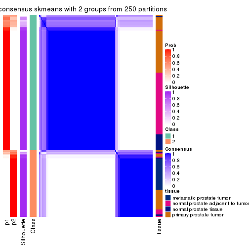</p>

</div>
<div id='tab-ATC-skmeans-consensus-heatmap-2'>
<pre><code class="r">consensus_heatmap(res, k = 3)
</code></pre>

<p>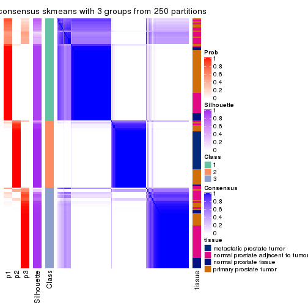</p>

</div>
<div id='tab-ATC-skmeans-consensus-heatmap-3'>
<pre><code class="r">consensus_heatmap(res, k = 4)
</code></pre>

<p>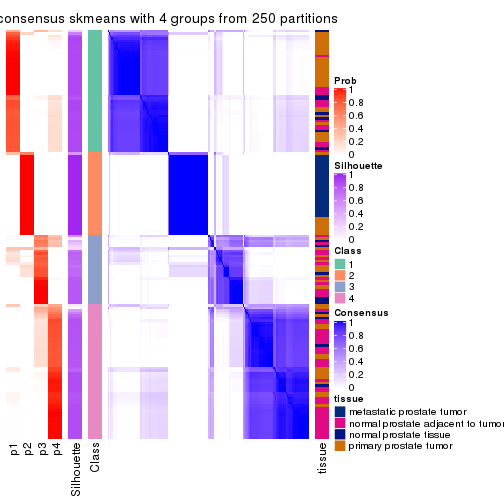</p>

</div>
<div id='tab-ATC-skmeans-consensus-heatmap-4'>
<pre><code class="r">consensus_heatmap(res, k = 5)
</code></pre>

<p>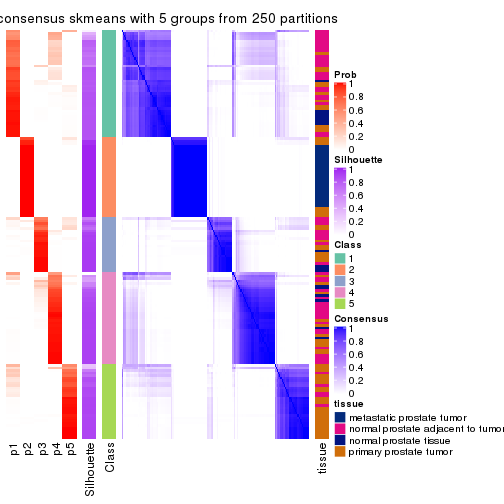</p>

</div>
<div id='tab-ATC-skmeans-consensus-heatmap-5'>
<pre><code class="r">consensus_heatmap(res, k = 6)
</code></pre>

<p>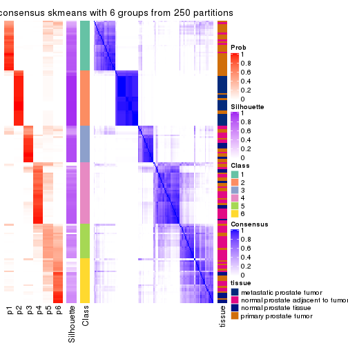</p>

</div>
</div>

Heatmaps for the membership of samples in all partitions to see how consistent they are:


<script>
$( function() {
	$( '#tabs-ATC-skmeans-membership-heatmap' ).tabs();
} );
</script>
<div id='tabs-ATC-skmeans-membership-heatmap'>
<ul>
<li><a href='#tab-ATC-skmeans-membership-heatmap-1'>k = 2</a></li>
<li><a href='#tab-ATC-skmeans-membership-heatmap-2'>k = 3</a></li>
<li><a href='#tab-ATC-skmeans-membership-heatmap-3'>k = 4</a></li>
<li><a href='#tab-ATC-skmeans-membership-heatmap-4'>k = 5</a></li>
<li><a href='#tab-ATC-skmeans-membership-heatmap-5'>k = 6</a></li>
</ul>
<div id='tab-ATC-skmeans-membership-heatmap-1'>
<pre><code class="r">membership_heatmap(res, k = 2)
</code></pre>

<p>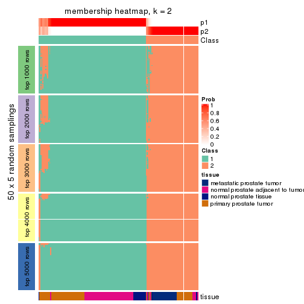</p>

</div>
<div id='tab-ATC-skmeans-membership-heatmap-2'>
<pre><code class="r">membership_heatmap(res, k = 3)
</code></pre>

<p>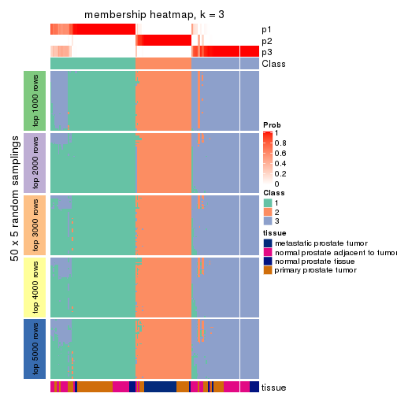</p>

</div>
<div id='tab-ATC-skmeans-membership-heatmap-3'>
<pre><code class="r">membership_heatmap(res, k = 4)
</code></pre>

<p>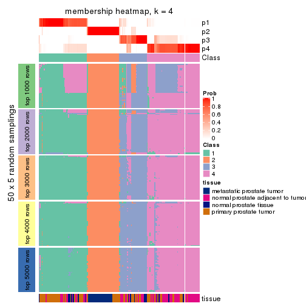</p>

</div>
<div id='tab-ATC-skmeans-membership-heatmap-4'>
<pre><code class="r">membership_heatmap(res, k = 5)
</code></pre>

<p>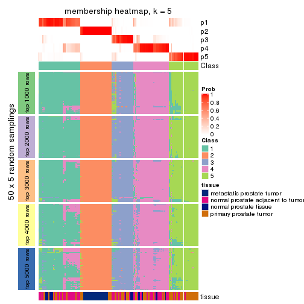</p>

</div>
<div id='tab-ATC-skmeans-membership-heatmap-5'>
<pre><code class="r">membership_heatmap(res, k = 6)
</code></pre>

<p>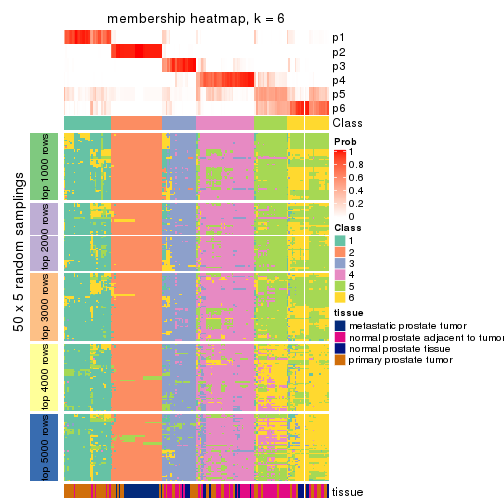</p>

</div>
</div>

As soon as we have had the classes for columns, we can look for signatures
which are significantly different between classes which can be candidate marks
for certain classes. Following are the heatmaps for signatures.


Signature heatmaps where rows are scaled:


<script>
$( function() {
	$( '#tabs-ATC-skmeans-get-signatures' ).tabs();
} );
</script>
<div id='tabs-ATC-skmeans-get-signatures'>
<ul>
<li><a href='#tab-ATC-skmeans-get-signatures-1'>k = 2</a></li>
<li><a href='#tab-ATC-skmeans-get-signatures-2'>k = 3</a></li>
<li><a href='#tab-ATC-skmeans-get-signatures-3'>k = 4</a></li>
<li><a href='#tab-ATC-skmeans-get-signatures-4'>k = 5</a></li>
<li><a href='#tab-ATC-skmeans-get-signatures-5'>k = 6</a></li>
</ul>
<div id='tab-ATC-skmeans-get-signatures-1'>
<pre><code class="r">get_signatures(res, k = 2)
</code></pre>

<p>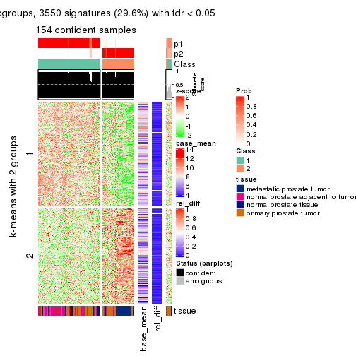</p>

</div>
<div id='tab-ATC-skmeans-get-signatures-2'>
<pre><code class="r">get_signatures(res, k = 3)
</code></pre>

<p>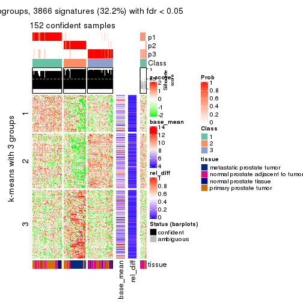</p>

</div>
<div id='tab-ATC-skmeans-get-signatures-3'>
<pre><code class="r">get_signatures(res, k = 4)
</code></pre>

<p>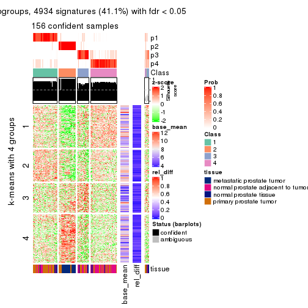</p>

</div>
<div id='tab-ATC-skmeans-get-signatures-4'>
<pre><code class="r">get_signatures(res, k = 5)
</code></pre>

<p>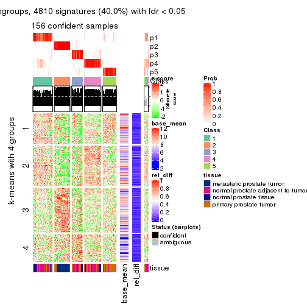</p>

</div>
<div id='tab-ATC-skmeans-get-signatures-5'>
<pre><code class="r">get_signatures(res, k = 6)
</code></pre>

<p>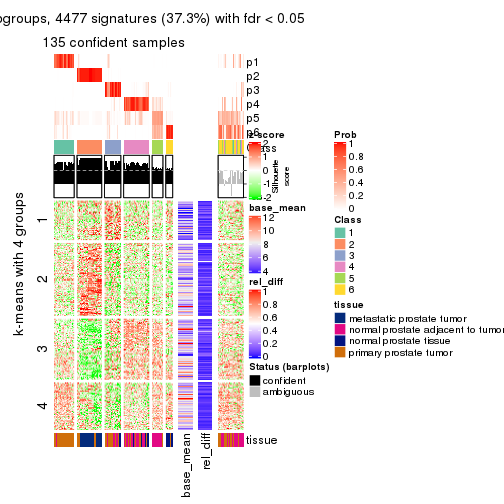</p>

</div>
</div>


Signature heatmaps where rows are not scaled:


<script>
$( function() {
	$( '#tabs-ATC-skmeans-get-signatures-no-scale' ).tabs();
} );
</script>
<div id='tabs-ATC-skmeans-get-signatures-no-scale'>
<ul>
<li><a href='#tab-ATC-skmeans-get-signatures-no-scale-1'>k = 2</a></li>
<li><a href='#tab-ATC-skmeans-get-signatures-no-scale-2'>k = 3</a></li>
<li><a href='#tab-ATC-skmeans-get-signatures-no-scale-3'>k = 4</a></li>
<li><a href='#tab-ATC-skmeans-get-signatures-no-scale-4'>k = 5</a></li>
<li><a href='#tab-ATC-skmeans-get-signatures-no-scale-5'>k = 6</a></li>
</ul>
<div id='tab-ATC-skmeans-get-signatures-no-scale-1'>
<pre><code class="r">get_signatures(res, k = 2, scale_rows = FALSE)
</code></pre>

<p>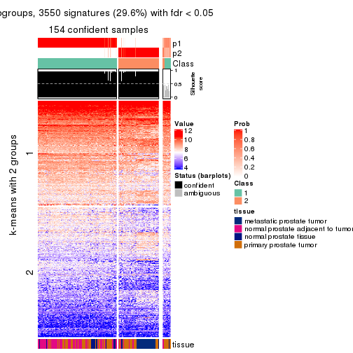</p>

</div>
<div id='tab-ATC-skmeans-get-signatures-no-scale-2'>
<pre><code class="r">get_signatures(res, k = 3, scale_rows = FALSE)
</code></pre>

<p>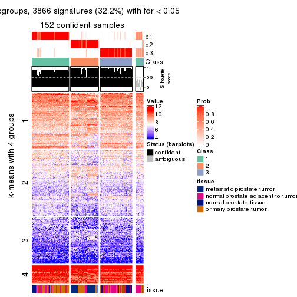</p>

</div>
<div id='tab-ATC-skmeans-get-signatures-no-scale-3'>
<pre><code class="r">get_signatures(res, k = 4, scale_rows = FALSE)
</code></pre>

<p>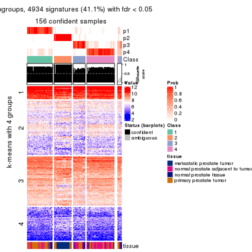</p>

</div>
<div id='tab-ATC-skmeans-get-signatures-no-scale-4'>
<pre><code class="r">get_signatures(res, k = 5, scale_rows = FALSE)
</code></pre>

<p>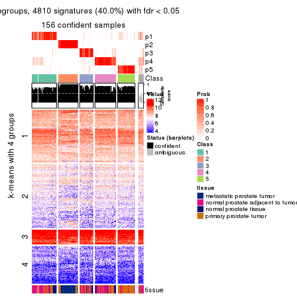</p>

</div>
<div id='tab-ATC-skmeans-get-signatures-no-scale-5'>
<pre><code class="r">get_signatures(res, k = 6, scale_rows = FALSE)
</code></pre>

<p>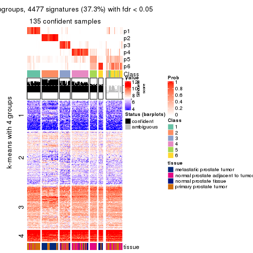</p>

</div>
</div>


Compare the overlap of signatures from different k:

```r
compare_signatures(res)
```

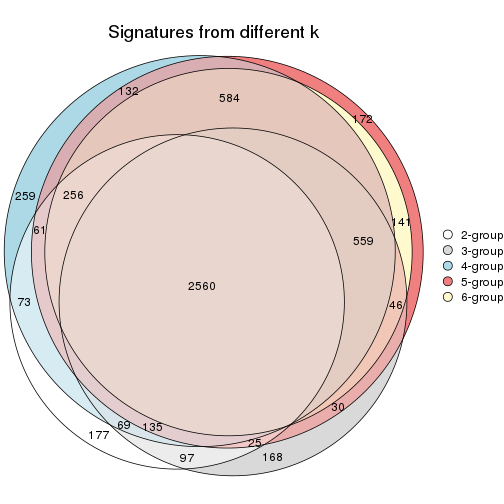

`get_signature()` returns a data frame invisibly. TO get the list of signatures, the function
call should be assigned to a variable explicitly. In following code, if `plot` argument is set
to `FALSE`, no heatmap is plotted while only the differential analysis is performed.

```r
# code only for demonstration
tb = get_signature(res, k = ..., plot = FALSE)
```

An example of the output of `tb` is:

```
#>   which_row         fdr    mean_1    mean_2 scaled_mean_1 scaled_mean_2 km
#> 1        38 0.042760348  8.373488  9.131774    -0.5533452     0.5164555  1
#> 2        40 0.018707592  7.106213  8.469186    -0.6173731     0.5762149  1
#> 3        55 0.019134737 10.221463 11.207825    -0.6159697     0.5749050  1
#> 4        59 0.006059896  5.921854  7.869574    -0.6899429     0.6439467  1
#> 5        60 0.018055526  8.928898 10.211722    -0.6204761     0.5791110  1
#> 6        98 0.009384629 15.714769 14.887706     0.6635654    -0.6193277  2
...
```

The columns in `tb` are:

1. `which_row`: row indices corresponding to the input matrix.
2. `fdr`: FDR for the differential test. 
3. `mean_x`: The mean value in group x.
4. `scaled_mean_x`: The mean value in group x after rows are scaled.
5. `km`: Row groups if k-means clustering is applied to rows.


UMAP plot which shows how samples are separated.


<script>
$( function() {
	$( '#tabs-ATC-skmeans-dimension-reduction' ).tabs();
} );
</script>
<div id='tabs-ATC-skmeans-dimension-reduction'>
<ul>
<li><a href='#tab-ATC-skmeans-dimension-reduction-1'>k = 2</a></li>
<li><a href='#tab-ATC-skmeans-dimension-reduction-2'>k = 3</a></li>
<li><a href='#tab-ATC-skmeans-dimension-reduction-3'>k = 4</a></li>
<li><a href='#tab-ATC-skmeans-dimension-reduction-4'>k = 5</a></li>
<li><a href='#tab-ATC-skmeans-dimension-reduction-5'>k = 6</a></li>
</ul>
<div id='tab-ATC-skmeans-dimension-reduction-1'>
<pre><code class="r">dimension_reduction(res, k = 2, method = &quot;UMAP&quot;)
</code></pre>

<p>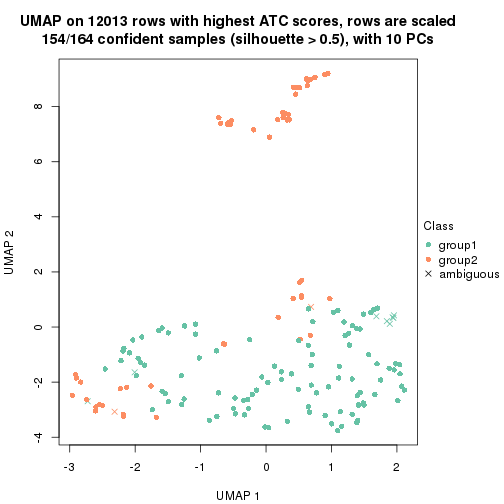</p>

</div>
<div id='tab-ATC-skmeans-dimension-reduction-2'>
<pre><code class="r">dimension_reduction(res, k = 3, method = &quot;UMAP&quot;)
</code></pre>

<p>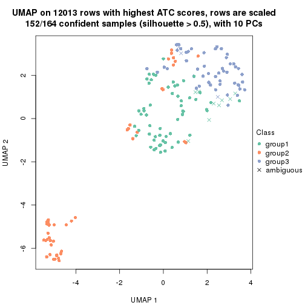</p>

</div>
<div id='tab-ATC-skmeans-dimension-reduction-3'>
<pre><code class="r">dimension_reduction(res, k = 4, method = &quot;UMAP&quot;)
</code></pre>

<p>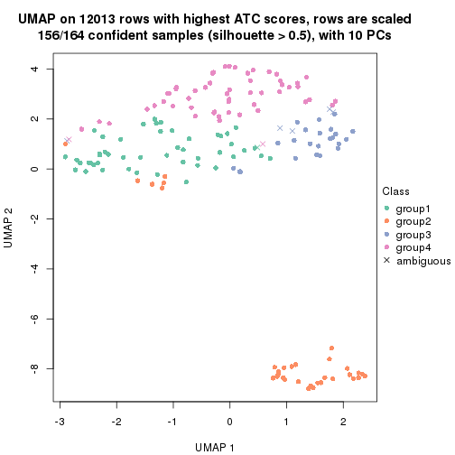</p>

</div>
<div id='tab-ATC-skmeans-dimension-reduction-4'>
<pre><code class="r">dimension_reduction(res, k = 5, method = &quot;UMAP&quot;)
</code></pre>

<p>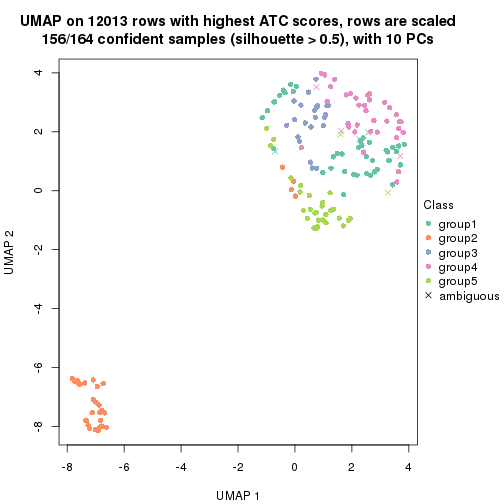</p>

</div>
<div id='tab-ATC-skmeans-dimension-reduction-5'>
<pre><code class="r">dimension_reduction(res, k = 6, method = &quot;UMAP&quot;)
</code></pre>

<p>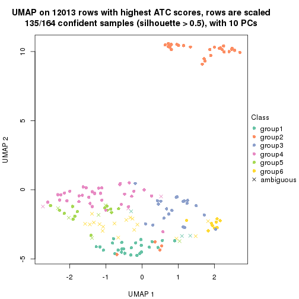</p>

</div>
</div>


Following heatmap shows how subgroups are split when increasing `k`:

```r
collect_classes(res)
```

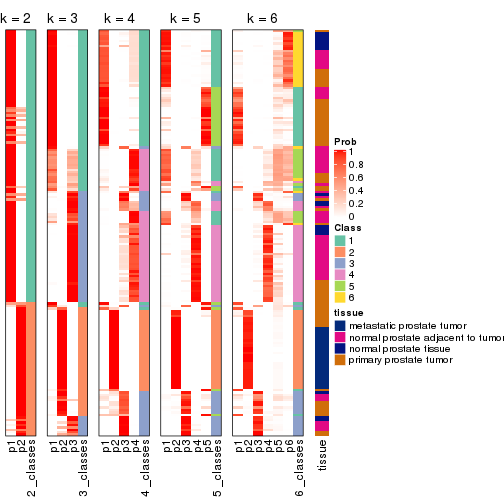


Test correlation between subgroups and known annotations. If the known
annotation is numeric, one-way ANOVA test is applied, and if the known
annotation is discrete, chi-squared contingency table test is applied.

```r
test_to_known_factors(res)
```

```
#>               n tissue(p) k
#> ATC:skmeans 154  6.47e-14 2
#> ATC:skmeans 152  1.74e-17 3
#> ATC:skmeans 156  2.10e-24 4
#> ATC:skmeans 156  7.48e-25 5
#> ATC:skmeans 135  2.30e-30 6
```


If matrix rows can be associated to genes, consider to use `functional_enrichment(res,
...)` to perform function enrichment for the signature genes. See [this vignette](http://bioconductor.org/packages/devel/bioc/vignettes/cola/inst/doc/functional_enrichment.html) for more detailed explanations.


 

---------------------------------------------------


### ATC:pam**


The object with results only for a single top-value method and a single partition method 
can be extracted as:

```r
res = res_list["ATC", "pam"]
# you can also extract it by
# res = res_list["ATC:pam"]
```

A summary of `res` and all the functions that can be applied to it:

```r
res
```

```
#> A 'ConsensusPartition' object with k = 2, 3, 4, 5, 6.
#>   On a matrix with 12013 rows and 164 columns.
#>   Top rows (1000, 2000, 3000, 4000, 5000) are extracted by 'ATC' method.
#>   Subgroups are detected by 'pam' method.
#>   Performed in total 1250 partitions by row resampling.
#>   Best k for subgroups seems to be 2.
#> 
#> Following methods can be applied to this 'ConsensusPartition' object:
#>  [1] "cola_report"             "collect_classes"         "collect_plots"          
#>  [4] "collect_stats"           "colnames"                "compare_signatures"     
#>  [7] "consensus_heatmap"       "dimension_reduction"     "functional_enrichment"  
#> [10] "get_anno_col"            "get_anno"                "get_classes"            
#> [13] "get_consensus"           "get_matrix"              "get_membership"         
#> [16] "get_param"               "get_signatures"          "get_stats"              
#> [19] "is_best_k"               "is_stable_k"             "membership_heatmap"     
#> [22] "ncol"                    "nrow"                    "plot_ecdf"              
#> [25] "rownames"                "select_partition_number" "show"                   
#> [28] "suggest_best_k"          "test_to_known_factors"
```

`collect_plots()` function collects all the plots made from `res` for all `k` (number of partitions)
into one single page to provide an easy and fast comparison between different `k`.

```r
collect_plots(res)
```

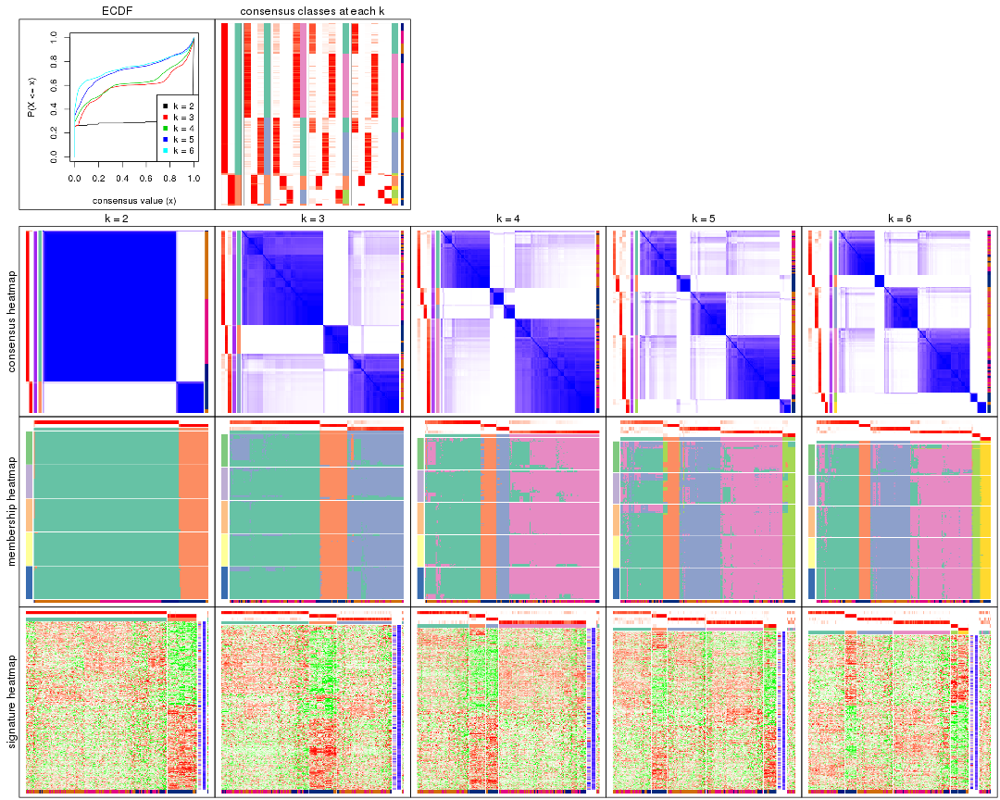

The plots are:

- The first row: a plot of the ECDF (empirical cumulative distribution
  function) curves of the consensus matrix for each `k` and the heatmap of
  predicted classes for each `k`.
- The second row: heatmaps of the consensus matrix for each `k`.
- The third row: heatmaps of the membership matrix for each `k`.
- The fouth row: heatmaps of the signatures for each `k`.

All the plots in panels can be made by individual functions and they are
plotted later in this section.

`select_partition_number()` produces several plots showing different
statistics for choosing "optimized" `k`. There are following statistics:

- ECDF curves of the consensus matrix for each `k`;
- 1-PAC. [The PAC
  score](https://en.wikipedia.org/wiki/Consensus_clustering#Over-interpretation_potential_of_consensus_clustering)
  measures the proportion of the ambiguous subgrouping.
- Mean silhouette score.
- Concordance. The mean probability of fiting the consensus class ids in all
  partitions.
- Area increased. Denote $A_k$ as the area under the ECDF curve for current
  `k`, the area increased is defined as $A_k - A_{k-1}$.
- Rand index. The percent of pairs of samples that are both in a same cluster
  or both are not in a same cluster in the partition of k and k-1.
- Jaccard index. The ratio of pairs of samples are both in a same cluster in
  the partition of k and k-1 and the pairs of samples are both in a same
  cluster in the partition k or k-1.

The detailed explanations of these statistics can be found in [the _cola_
vignette](http://bioconductor.org/packages/devel/bioc/vignettes/cola/inst/doc/cola.html#toc_13).

Generally speaking, lower PAC score, higher mean silhouette score or higher
concordance corresponds to better partition. Rand index and Jaccard index
measure how similar the current partition is compared to partition with `k-1`.
If they are too similar, we won't accept `k` is better than `k-1`.

```r
select_partition_number(res)
```

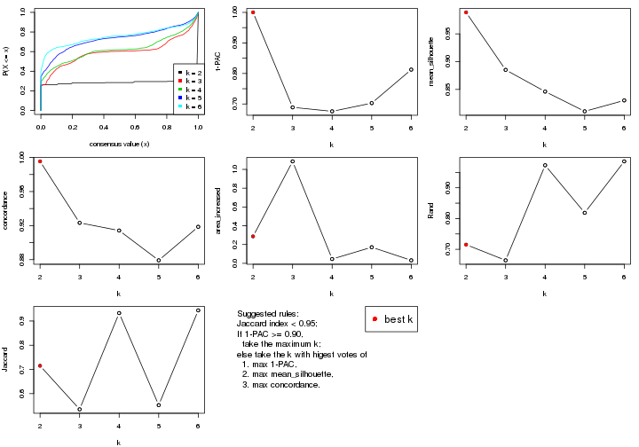

The numeric values for all these statistics can be obtained by `get_stats()`.

```r
get_stats(res)
```

```
#>   k 1-PAC mean_silhouette concordance area_increased  Rand Jaccard
#> 2 2 1.000           0.989       0.995         0.2867 0.715   0.715
#> 3 3 0.689           0.885       0.923         1.0854 0.664   0.535
#> 4 4 0.676           0.846       0.914         0.0456 0.973   0.933
#> 5 5 0.703           0.811       0.879         0.1712 0.819   0.553
#> 6 6 0.813           0.830       0.919         0.0317 0.986   0.944
```

`suggest_best_k()` suggests the best $k$ based on these statistics. The rules are as follows:

- All $k$ with Jaccard index larger than 0.95 are removed because increasing
  $k$ does not provide enough extra information. If all $k$ are removed, it is
  marked as no subgroup is detected.
- For all $k$ with 1-PAC score larger than 0.9, the maximal $k$ is taken as
  the best $k$, and other $k$ are marked as optional $k$.
- If it does not fit the second rule. The $k$ with the maximal vote of the
  highest 1-PAC score, highest mean silhouette, and highest concordance is
  taken as the best $k$.

```r
suggest_best_k(res)
```

```
#> [1] 2
```


Following shows the table of the partitions (You need to click the **show/hide
code output** link to see it). The membership matrix (columns with name `p*`)
is inferred by
[`clue::cl_consensus()`](https://www.rdocumentation.org/link/cl_consensus?package=clue)
function with the `SE` method. Basically the value in the membership matrix
represents the probability to belong to a certain group. The finall class
label for an item is determined with the group with highest probability it
belongs to.

In `get_classes()` function, the entropy is calculated from the membership
matrix and the silhouette score is calculated from the consensus matrix.


<script>
$( function() {
	$( '#tabs-ATC-pam-get-classes' ).tabs();
} );
</script>
<div id='tabs-ATC-pam-get-classes'>
<ul>
<li><a href='#tab-ATC-pam-get-classes-1'>k = 2</a></li>
<li><a href='#tab-ATC-pam-get-classes-2'>k = 3</a></li>
<li><a href='#tab-ATC-pam-get-classes-3'>k = 4</a></li>
<li><a href='#tab-ATC-pam-get-classes-4'>k = 5</a></li>
<li><a href='#tab-ATC-pam-get-classes-5'>k = 6</a></li>
</ul>

<div id='tab-ATC-pam-get-classes-1'>
<p><a id='tab-ATC-pam-get-classes-1-a' style='color:#0366d6' href='#'>show/hide code output</a></p>
<pre><code class="r">cbind(get_classes(res, k = 2), get_membership(res, k = 2))
</code></pre>

<pre><code>#&gt;           class entropy silhouette    p1    p2
#&gt; GSM152839     1  0.0000      0.997 1.000 0.000
#&gt; GSM152840     1  0.0000      0.997 1.000 0.000
#&gt; GSM152841     1  0.0000      0.997 1.000 0.000
#&gt; GSM152842     1  0.0000      0.997 1.000 0.000
#&gt; GSM152843     1  0.0000      0.997 1.000 0.000
#&gt; GSM152844     1  0.0000      0.997 1.000 0.000
#&gt; GSM152845     1  0.9775      0.283 0.588 0.412
#&gt; GSM152846     1  0.0000      0.997 1.000 0.000
#&gt; GSM152847     1  0.0000      0.997 1.000 0.000
#&gt; GSM152848     1  0.0000      0.997 1.000 0.000
#&gt; GSM152849     1  0.0000      0.997 1.000 0.000
#&gt; GSM152850     1  0.0000      0.997 1.000 0.000
#&gt; GSM152851     1  0.0000      0.997 1.000 0.000
#&gt; GSM152852     1  0.0000      0.997 1.000 0.000
#&gt; GSM152853     1  0.0000      0.997 1.000 0.000
#&gt; GSM152854     1  0.0000      0.997 1.000 0.000
#&gt; GSM152855     1  0.0000      0.997 1.000 0.000
#&gt; GSM153238     1  0.0000      0.997 1.000 0.000
#&gt; GSM153239     1  0.0000      0.997 1.000 0.000
#&gt; GSM153240     1  0.0000      0.997 1.000 0.000
#&gt; GSM153241     1  0.0000      0.997 1.000 0.000
#&gt; GSM153242     1  0.0000      0.997 1.000 0.000
#&gt; GSM153243     1  0.0000      0.997 1.000 0.000
#&gt; GSM153244     1  0.0000      0.997 1.000 0.000
#&gt; GSM153245     1  0.0000      0.997 1.000 0.000
#&gt; GSM153246     1  0.0000      0.997 1.000 0.000
#&gt; GSM153247     1  0.0000      0.997 1.000 0.000
#&gt; GSM153248     1  0.0000      0.997 1.000 0.000
#&gt; GSM153249     1  0.0000      0.997 1.000 0.000
#&gt; GSM153250     1  0.0000      0.997 1.000 0.000
#&gt; GSM153251     1  0.0000      0.997 1.000 0.000
#&gt; GSM153252     1  0.0000      0.997 1.000 0.000
#&gt; GSM153253     1  0.0000      0.997 1.000 0.000
#&gt; GSM153254     1  0.0000      0.997 1.000 0.000
#&gt; GSM153255     1  0.0000      0.997 1.000 0.000
#&gt; GSM153256     1  0.0000      0.997 1.000 0.000
#&gt; GSM153257     1  0.0000      0.997 1.000 0.000
#&gt; GSM153258     1  0.0000      0.997 1.000 0.000
#&gt; GSM153259     1  0.0000      0.997 1.000 0.000
#&gt; GSM153260     1  0.0000      0.997 1.000 0.000
#&gt; GSM153261     1  0.0000      0.997 1.000 0.000
#&gt; GSM153262     1  0.0000      0.997 1.000 0.000
#&gt; GSM153263     1  0.0000      0.997 1.000 0.000
#&gt; GSM153264     1  0.0000      0.997 1.000 0.000
#&gt; GSM153265     1  0.0000      0.997 1.000 0.000
#&gt; GSM153266     1  0.0000      0.997 1.000 0.000
#&gt; GSM153267     1  0.0000      0.997 1.000 0.000
#&gt; GSM153268     1  0.0000      0.997 1.000 0.000
#&gt; GSM153269     1  0.0000      0.997 1.000 0.000
#&gt; GSM153270     1  0.0000      0.997 1.000 0.000
#&gt; GSM153271     1  0.0000      0.997 1.000 0.000
#&gt; GSM153272     1  0.0000      0.997 1.000 0.000
#&gt; GSM153273     1  0.0000      0.997 1.000 0.000
#&gt; GSM153274     1  0.0000      0.997 1.000 0.000
#&gt; GSM153275     1  0.0000      0.997 1.000 0.000
#&gt; GSM153276     1  0.0000      0.997 1.000 0.000
#&gt; GSM153277     1  0.0000      0.997 1.000 0.000
#&gt; GSM153278     1  0.0000      0.997 1.000 0.000
#&gt; GSM153279     1  0.0000      0.997 1.000 0.000
#&gt; GSM153280     1  0.0000      0.997 1.000 0.000
#&gt; GSM153281     1  0.0000      0.997 1.000 0.000
#&gt; GSM153282     1  0.0000      0.997 1.000 0.000
#&gt; GSM153283     1  0.0000      0.997 1.000 0.000
#&gt; GSM153284     1  0.0000      0.997 1.000 0.000
#&gt; GSM153285     1  0.0000      0.997 1.000 0.000
#&gt; GSM153286     1  0.0000      0.997 1.000 0.000
#&gt; GSM153287     1  0.0000      0.997 1.000 0.000
#&gt; GSM153288     1  0.0000      0.997 1.000 0.000
#&gt; GSM153289     1  0.0000      0.997 1.000 0.000
#&gt; GSM153290     1  0.0000      0.997 1.000 0.000
#&gt; GSM153291     1  0.0000      0.997 1.000 0.000
#&gt; GSM153292     1  0.0000      0.997 1.000 0.000
#&gt; GSM153293     1  0.0000      0.997 1.000 0.000
#&gt; GSM153294     1  0.0000      0.997 1.000 0.000
#&gt; GSM153295     1  0.0000      0.997 1.000 0.000
#&gt; GSM153054     1  0.0000      0.997 1.000 0.000
#&gt; GSM153055     1  0.0000      0.997 1.000 0.000
#&gt; GSM153056     1  0.0000      0.997 1.000 0.000
#&gt; GSM153057     1  0.0000      0.997 1.000 0.000
#&gt; GSM153058     1  0.0000      0.997 1.000 0.000
#&gt; GSM153059     1  0.0000      0.997 1.000 0.000
#&gt; GSM153060     1  0.0000      0.997 1.000 0.000
#&gt; GSM153061     1  0.0000      0.997 1.000 0.000
#&gt; GSM153062     1  0.0000      0.997 1.000 0.000
#&gt; GSM153063     1  0.0000      0.997 1.000 0.000
#&gt; GSM153064     1  0.0000      0.997 1.000 0.000
#&gt; GSM153065     1  0.0000      0.997 1.000 0.000
#&gt; GSM153066     1  0.1414      0.977 0.980 0.020
#&gt; GSM153067     1  0.0000      0.997 1.000 0.000
#&gt; GSM153068     1  0.0000      0.997 1.000 0.000
#&gt; GSM153069     1  0.0000      0.997 1.000 0.000
#&gt; GSM153070     1  0.0000      0.997 1.000 0.000
#&gt; GSM153071     1  0.0000      0.997 1.000 0.000
#&gt; GSM153072     1  0.0000      0.997 1.000 0.000
#&gt; GSM153073     1  0.0000      0.997 1.000 0.000
#&gt; GSM153074     1  0.0000      0.997 1.000 0.000
#&gt; GSM153075     1  0.0000      0.997 1.000 0.000
#&gt; GSM153076     1  0.0000      0.997 1.000 0.000
#&gt; GSM153077     1  0.0000      0.997 1.000 0.000
#&gt; GSM153078     1  0.0000      0.997 1.000 0.000
#&gt; GSM153079     1  0.0000      0.997 1.000 0.000
#&gt; GSM153080     1  0.0000      0.997 1.000 0.000
#&gt; GSM153081     1  0.0000      0.997 1.000 0.000
#&gt; GSM153082     1  0.0000      0.997 1.000 0.000
#&gt; GSM153083     1  0.0000      0.997 1.000 0.000
#&gt; GSM153084     1  0.0000      0.997 1.000 0.000
#&gt; GSM153085     1  0.0000      0.997 1.000 0.000
#&gt; GSM153086     1  0.0000      0.997 1.000 0.000
#&gt; GSM153087     1  0.0000      0.997 1.000 0.000
#&gt; GSM153088     1  0.0000      0.997 1.000 0.000
#&gt; GSM153089     1  0.0000      0.997 1.000 0.000
#&gt; GSM153090     1  0.0000      0.997 1.000 0.000
#&gt; GSM153091     1  0.0000      0.997 1.000 0.000
#&gt; GSM153092     1  0.0000      0.997 1.000 0.000
#&gt; GSM153093     1  0.0000      0.997 1.000 0.000
#&gt; GSM153094     1  0.0000      0.997 1.000 0.000
#&gt; GSM153095     1  0.0000      0.997 1.000 0.000
#&gt; GSM153096     1  0.0000      0.997 1.000 0.000
#&gt; GSM153097     1  0.0000      0.997 1.000 0.000
#&gt; GSM153098     1  0.0000      0.997 1.000 0.000
#&gt; GSM153099     1  0.0000      0.997 1.000 0.000
#&gt; GSM153100     1  0.0000      0.997 1.000 0.000
#&gt; GSM153101     1  0.0000      0.997 1.000 0.000
#&gt; GSM153102     1  0.0000      0.997 1.000 0.000
#&gt; GSM153103     1  0.0000      0.997 1.000 0.000
#&gt; GSM153104     1  0.0000      0.997 1.000 0.000
#&gt; GSM153106     1  0.0000      0.997 1.000 0.000
#&gt; GSM153107     1  0.0000      0.997 1.000 0.000
#&gt; GSM153108     1  0.0000      0.997 1.000 0.000
#&gt; GSM153109     1  0.0000      0.997 1.000 0.000
#&gt; GSM153110     1  0.0000      0.997 1.000 0.000
#&gt; GSM153111     1  0.0000      0.997 1.000 0.000
#&gt; GSM153112     1  0.0000      0.997 1.000 0.000
#&gt; GSM153113     1  0.0376      0.993 0.996 0.004
#&gt; GSM153114     1  0.0000      0.997 1.000 0.000
#&gt; GSM187532     2  0.0000      0.989 0.000 1.000
#&gt; GSM187533     2  0.0000      0.989 0.000 1.000
#&gt; GSM187534     2  0.0000      0.989 0.000 1.000
#&gt; GSM187535     1  0.1184      0.981 0.984 0.016
#&gt; GSM152906     2  0.0000      0.989 0.000 1.000
#&gt; GSM152907     2  0.0000      0.989 0.000 1.000
#&gt; GSM152908     2  0.0000      0.989 0.000 1.000
#&gt; GSM152909     2  0.0000      0.989 0.000 1.000
#&gt; GSM152910     2  0.0000      0.989 0.000 1.000
#&gt; GSM152911     2  0.0000      0.989 0.000 1.000
#&gt; GSM152912     2  0.0000      0.989 0.000 1.000
#&gt; GSM152913     2  0.0000      0.989 0.000 1.000
#&gt; GSM152914     2  0.0000      0.989 0.000 1.000
#&gt; GSM152915     2  0.0000      0.989 0.000 1.000
#&gt; GSM152916     2  0.0000      0.989 0.000 1.000
#&gt; GSM152917     2  0.0000      0.989 0.000 1.000
#&gt; GSM152918     2  0.0000      0.989 0.000 1.000
#&gt; GSM152919     2  0.0000      0.989 0.000 1.000
#&gt; GSM152920     2  0.0000      0.989 0.000 1.000
#&gt; GSM152921     2  0.0000      0.989 0.000 1.000
#&gt; GSM152922     2  0.0000      0.989 0.000 1.000
#&gt; GSM152923     2  0.0000      0.989 0.000 1.000
#&gt; GSM152924     2  0.0000      0.989 0.000 1.000
#&gt; GSM152925     2  0.0000      0.989 0.000 1.000
#&gt; GSM152926     2  0.7139      0.760 0.196 0.804
#&gt; GSM152927     2  0.0000      0.989 0.000 1.000
#&gt; GSM152928     2  0.4939      0.879 0.108 0.892
#&gt; GSM152929     2  0.0000      0.989 0.000 1.000
#&gt; GSM152930     2  0.0000      0.989 0.000 1.000
</code></pre>

<script>
$('#tab-ATC-pam-get-classes-1-a').parent().next().next().hide();
$('#tab-ATC-pam-get-classes-1-a').click(function(){
  $('#tab-ATC-pam-get-classes-1-a').parent().next().next().toggle();
  return(false);
});
</script>
</div>

<div id='tab-ATC-pam-get-classes-2'>
<p><a id='tab-ATC-pam-get-classes-2-a' style='color:#0366d6' href='#'>show/hide code output</a></p>
<pre><code class="r">cbind(get_classes(res, k = 3), get_membership(res, k = 3))
</code></pre>

<pre><code>#&gt;           class entropy silhouette    p1    p2    p3
#&gt; GSM152839     1  0.4062      0.844 0.836 0.000 0.164
#&gt; GSM152840     1  0.0000      0.919 1.000 0.000 0.000
#&gt; GSM152841     1  0.0000      0.919 1.000 0.000 0.000
#&gt; GSM152842     1  0.5058      0.774 0.756 0.000 0.244
#&gt; GSM152843     1  0.5016      0.778 0.760 0.000 0.240
#&gt; GSM152844     1  0.0000      0.919 1.000 0.000 0.000
#&gt; GSM152845     3  0.5944      0.711 0.064 0.152 0.784
#&gt; GSM152846     1  0.1411      0.915 0.964 0.000 0.036
#&gt; GSM152847     1  0.4887      0.790 0.772 0.000 0.228
#&gt; GSM152848     1  0.4654      0.805 0.792 0.000 0.208
#&gt; GSM152849     1  0.5058      0.774 0.756 0.000 0.244
#&gt; GSM152850     1  0.5529      0.697 0.704 0.000 0.296
#&gt; GSM152851     1  0.1411      0.916 0.964 0.000 0.036
#&gt; GSM152852     1  0.0747      0.921 0.984 0.000 0.016
#&gt; GSM152853     1  0.0000      0.919 1.000 0.000 0.000
#&gt; GSM152854     1  0.1411      0.916 0.964 0.000 0.036
#&gt; GSM152855     1  0.0237      0.920 0.996 0.000 0.004
#&gt; GSM153238     3  0.1289      0.906 0.032 0.000 0.968
#&gt; GSM153239     1  0.0424      0.921 0.992 0.000 0.008
#&gt; GSM153240     1  0.0000      0.919 1.000 0.000 0.000
#&gt; GSM153241     1  0.3619      0.872 0.864 0.000 0.136
#&gt; GSM153242     1  0.0237      0.920 0.996 0.000 0.004
#&gt; GSM153243     3  0.1411      0.907 0.036 0.000 0.964
#&gt; GSM153244     1  0.0892      0.920 0.980 0.000 0.020
#&gt; GSM153245     1  0.0237      0.920 0.996 0.000 0.004
#&gt; GSM153246     1  0.2066      0.918 0.940 0.000 0.060
#&gt; GSM153247     3  0.1860      0.905 0.052 0.000 0.948
#&gt; GSM153248     3  0.1411      0.906 0.036 0.000 0.964
#&gt; GSM153249     1  0.0000      0.919 1.000 0.000 0.000
#&gt; GSM153250     1  0.4605      0.807 0.796 0.000 0.204
#&gt; GSM153251     1  0.4555      0.733 0.800 0.000 0.200
#&gt; GSM153252     1  0.0424      0.921 0.992 0.000 0.008
#&gt; GSM153253     1  0.0000      0.919 1.000 0.000 0.000
#&gt; GSM153254     1  0.2261      0.899 0.932 0.000 0.068
#&gt; GSM153255     1  0.0892      0.920 0.980 0.000 0.020
#&gt; GSM153256     1  0.2261      0.911 0.932 0.000 0.068
#&gt; GSM153257     1  0.2448      0.905 0.924 0.000 0.076
#&gt; GSM153258     3  0.2448      0.901 0.076 0.000 0.924
#&gt; GSM153259     3  0.4346      0.782 0.184 0.000 0.816
#&gt; GSM153260     3  0.2066      0.903 0.060 0.000 0.940
#&gt; GSM153261     3  0.3267      0.881 0.116 0.000 0.884
#&gt; GSM153262     1  0.0000      0.919 1.000 0.000 0.000
#&gt; GSM153263     1  0.5058      0.774 0.756 0.000 0.244
#&gt; GSM153264     3  0.4121      0.807 0.168 0.000 0.832
#&gt; GSM153265     1  0.0000      0.919 1.000 0.000 0.000
#&gt; GSM153266     3  0.2711      0.897 0.088 0.000 0.912
#&gt; GSM153267     1  0.2711      0.906 0.912 0.000 0.088
#&gt; GSM153268     1  0.0000      0.919 1.000 0.000 0.000
#&gt; GSM153269     1  0.1964      0.914 0.944 0.000 0.056
#&gt; GSM153270     1  0.1643      0.914 0.956 0.000 0.044
#&gt; GSM153271     1  0.4555      0.810 0.800 0.000 0.200
#&gt; GSM153272     1  0.1860      0.914 0.948 0.000 0.052
#&gt; GSM153273     3  0.1289      0.906 0.032 0.000 0.968
#&gt; GSM153274     1  0.0892      0.922 0.980 0.000 0.020
#&gt; GSM153275     1  0.0237      0.920 0.996 0.000 0.004
#&gt; GSM153276     1  0.2066      0.915 0.940 0.000 0.060
#&gt; GSM153277     1  0.0237      0.920 0.996 0.000 0.004
#&gt; GSM153278     3  0.2537      0.901 0.080 0.000 0.920
#&gt; GSM153279     1  0.1163      0.918 0.972 0.000 0.028
#&gt; GSM153280     1  0.0000      0.919 1.000 0.000 0.000
#&gt; GSM153281     1  0.0000      0.919 1.000 0.000 0.000
#&gt; GSM153282     1  0.0000      0.919 1.000 0.000 0.000
#&gt; GSM153283     3  0.5859      0.454 0.344 0.000 0.656
#&gt; GSM153284     1  0.1411      0.919 0.964 0.000 0.036
#&gt; GSM153285     1  0.0237      0.920 0.996 0.000 0.004
#&gt; GSM153286     1  0.1860      0.914 0.948 0.000 0.052
#&gt; GSM153287     1  0.1163      0.919 0.972 0.000 0.028
#&gt; GSM153288     1  0.1163      0.919 0.972 0.000 0.028
#&gt; GSM153289     1  0.1411      0.919 0.964 0.000 0.036
#&gt; GSM153290     1  0.0000      0.919 1.000 0.000 0.000
#&gt; GSM153291     1  0.0424      0.921 0.992 0.000 0.008
#&gt; GSM153292     1  0.0000      0.919 1.000 0.000 0.000
#&gt; GSM153293     1  0.4452      0.817 0.808 0.000 0.192
#&gt; GSM153294     3  0.1529      0.906 0.040 0.000 0.960
#&gt; GSM153295     1  0.2711      0.898 0.912 0.000 0.088
#&gt; GSM153054     3  0.5591      0.552 0.304 0.000 0.696
#&gt; GSM153055     1  0.2878      0.893 0.904 0.000 0.096
#&gt; GSM153056     1  0.2165      0.914 0.936 0.000 0.064
#&gt; GSM153057     1  0.3192      0.862 0.888 0.000 0.112
#&gt; GSM153058     1  0.1163      0.918 0.972 0.000 0.028
#&gt; GSM153059     3  0.4796      0.789 0.220 0.000 0.780
#&gt; GSM153060     1  0.1860      0.917 0.948 0.000 0.052
#&gt; GSM153061     3  0.1289      0.906 0.032 0.000 0.968
#&gt; GSM153062     3  0.4887      0.782 0.228 0.000 0.772
#&gt; GSM153063     1  0.0747      0.920 0.984 0.000 0.016
#&gt; GSM153064     1  0.5178      0.759 0.744 0.000 0.256
#&gt; GSM153065     3  0.1753      0.907 0.048 0.000 0.952
#&gt; GSM153066     3  0.1289      0.906 0.032 0.000 0.968
#&gt; GSM153067     1  0.1163      0.919 0.972 0.000 0.028
#&gt; GSM153068     3  0.4452      0.816 0.192 0.000 0.808
#&gt; GSM153069     1  0.0000      0.919 1.000 0.000 0.000
#&gt; GSM153070     1  0.5138      0.764 0.748 0.000 0.252
#&gt; GSM153071     1  0.4887      0.791 0.772 0.000 0.228
#&gt; GSM153072     3  0.1289      0.906 0.032 0.000 0.968
#&gt; GSM153073     1  0.4842      0.794 0.776 0.000 0.224
#&gt; GSM153074     1  0.0237      0.920 0.996 0.000 0.004
#&gt; GSM153075     1  0.1529      0.914 0.960 0.000 0.040
#&gt; GSM153076     1  0.4452      0.817 0.808 0.000 0.192
#&gt; GSM153077     3  0.1860      0.903 0.052 0.000 0.948
#&gt; GSM153078     3  0.2711      0.883 0.088 0.000 0.912
#&gt; GSM153079     3  0.2066      0.903 0.060 0.000 0.940
#&gt; GSM153080     3  0.5016      0.779 0.240 0.000 0.760
#&gt; GSM153081     3  0.2066      0.900 0.060 0.000 0.940
#&gt; GSM153082     3  0.1529      0.908 0.040 0.000 0.960
#&gt; GSM153083     3  0.1289      0.906 0.032 0.000 0.968
#&gt; GSM153084     3  0.2066      0.903 0.060 0.000 0.940
#&gt; GSM153085     3  0.1753      0.907 0.048 0.000 0.952
#&gt; GSM153086     3  0.1289      0.906 0.032 0.000 0.968
#&gt; GSM153087     1  0.1289      0.921 0.968 0.000 0.032
#&gt; GSM153088     1  0.4555      0.810 0.800 0.000 0.200
#&gt; GSM153089     3  0.4887      0.782 0.228 0.000 0.772
#&gt; GSM153090     1  0.2625      0.907 0.916 0.000 0.084
#&gt; GSM153091     3  0.1529      0.908 0.040 0.000 0.960
#&gt; GSM153092     3  0.5497      0.714 0.292 0.000 0.708
#&gt; GSM153093     1  0.0424      0.921 0.992 0.000 0.008
#&gt; GSM153094     3  0.1411      0.907 0.036 0.000 0.964
#&gt; GSM153095     3  0.1529      0.908 0.040 0.000 0.960
#&gt; GSM153096     3  0.1289      0.906 0.032 0.000 0.968
#&gt; GSM153097     3  0.1289      0.906 0.032 0.000 0.968
#&gt; GSM153098     1  0.2878      0.901 0.904 0.000 0.096
#&gt; GSM153099     1  0.2625      0.908 0.916 0.000 0.084
#&gt; GSM153100     3  0.4750      0.767 0.216 0.000 0.784
#&gt; GSM153101     3  0.3192      0.878 0.112 0.000 0.888
#&gt; GSM153102     3  0.4796      0.789 0.220 0.000 0.780
#&gt; GSM153103     3  0.1289      0.906 0.032 0.000 0.968
#&gt; GSM153104     1  0.0424      0.921 0.992 0.000 0.008
#&gt; GSM153106     3  0.4796      0.789 0.220 0.000 0.780
#&gt; GSM153107     3  0.2448      0.902 0.076 0.000 0.924
#&gt; GSM153108     1  0.1860      0.910 0.948 0.000 0.052
#&gt; GSM153109     3  0.1753      0.907 0.048 0.000 0.952
#&gt; GSM153110     3  0.1289      0.906 0.032 0.000 0.968
#&gt; GSM153111     3  0.1289      0.906 0.032 0.000 0.968
#&gt; GSM153112     1  0.6154      0.429 0.592 0.000 0.408
#&gt; GSM153113     3  0.1529      0.908 0.040 0.000 0.960
#&gt; GSM153114     1  0.0000      0.919 1.000 0.000 0.000
#&gt; GSM187532     2  0.0424      0.980 0.000 0.992 0.008
#&gt; GSM187533     2  0.0592      0.979 0.000 0.988 0.012
#&gt; GSM187534     2  0.0237      0.980 0.000 0.996 0.004
#&gt; GSM187535     3  0.1964      0.904 0.056 0.000 0.944
#&gt; GSM152906     2  0.2448      0.931 0.000 0.924 0.076
#&gt; GSM152907     2  0.1031      0.976 0.000 0.976 0.024
#&gt; GSM152908     2  0.0424      0.980 0.000 0.992 0.008
#&gt; GSM152909     2  0.0424      0.980 0.000 0.992 0.008
#&gt; GSM152910     2  0.0424      0.980 0.000 0.992 0.008
#&gt; GSM152911     2  0.0424      0.980 0.000 0.992 0.008
#&gt; GSM152912     2  0.0424      0.980 0.000 0.992 0.008
#&gt; GSM152913     2  0.0237      0.981 0.000 0.996 0.004
#&gt; GSM152914     2  0.0000      0.981 0.000 1.000 0.000
#&gt; GSM152915     2  0.0000      0.981 0.000 1.000 0.000
#&gt; GSM152916     2  0.1031      0.976 0.000 0.976 0.024
#&gt; GSM152917     2  0.0000      0.981 0.000 1.000 0.000
#&gt; GSM152918     2  0.0237      0.980 0.000 0.996 0.004
#&gt; GSM152919     2  0.0237      0.980 0.000 0.996 0.004
#&gt; GSM152920     2  0.0424      0.980 0.000 0.992 0.008
#&gt; GSM152921     2  0.0424      0.980 0.000 0.992 0.008
#&gt; GSM152922     2  0.0424      0.980 0.000 0.992 0.008
#&gt; GSM152923     2  0.1031      0.976 0.000 0.976 0.024
#&gt; GSM152924     2  0.1031      0.976 0.000 0.976 0.024
#&gt; GSM152925     2  0.1031      0.976 0.000 0.976 0.024
#&gt; GSM152926     3  0.4504      0.685 0.000 0.196 0.804
#&gt; GSM152927     2  0.1031      0.976 0.000 0.976 0.024
#&gt; GSM152928     3  0.4346      0.705 0.000 0.184 0.816
#&gt; GSM152929     2  0.5216      0.675 0.000 0.740 0.260
#&gt; GSM152930     2  0.1031      0.976 0.000 0.976 0.024
</code></pre>

<script>
$('#tab-ATC-pam-get-classes-2-a').parent().next().next().hide();
$('#tab-ATC-pam-get-classes-2-a').click(function(){
  $('#tab-ATC-pam-get-classes-2-a').parent().next().next().toggle();
  return(false);
});
</script>
</div>

<div id='tab-ATC-pam-get-classes-3'>
<p><a id='tab-ATC-pam-get-classes-3-a' style='color:#0366d6' href='#'>show/hide code output</a></p>
<pre><code class="r">cbind(get_classes(res, k = 4), get_membership(res, k = 4))
</code></pre>

<pre><code>#&gt;           class entropy silhouette    p1    p2    p3    p4
#&gt; GSM152839     4  0.3873      0.777 0.228 0.000 0.000 0.772
#&gt; GSM152840     4  0.0000      0.893 0.000 0.000 0.000 1.000
#&gt; GSM152841     4  0.0000      0.893 0.000 0.000 0.000 1.000
#&gt; GSM152842     4  0.4564      0.676 0.328 0.000 0.000 0.672
#&gt; GSM152843     4  0.4500      0.690 0.316 0.000 0.000 0.684
#&gt; GSM152844     4  0.0000      0.893 0.000 0.000 0.000 1.000
#&gt; GSM152845     1  0.7596      0.504 0.616 0.200 0.116 0.068
#&gt; GSM152846     4  0.1118      0.895 0.036 0.000 0.000 0.964
#&gt; GSM152847     4  0.4406      0.709 0.300 0.000 0.000 0.700
#&gt; GSM152848     4  0.4304      0.723 0.284 0.000 0.000 0.716
#&gt; GSM152849     4  0.4522      0.685 0.320 0.000 0.000 0.680
#&gt; GSM152850     4  0.4730      0.612 0.364 0.000 0.000 0.636
#&gt; GSM152851     4  0.1211      0.894 0.040 0.000 0.000 0.960
#&gt; GSM152852     4  0.0817      0.897 0.024 0.000 0.000 0.976
#&gt; GSM152853     4  0.0000      0.893 0.000 0.000 0.000 1.000
#&gt; GSM152854     4  0.1389      0.892 0.048 0.000 0.000 0.952
#&gt; GSM152855     4  0.0469      0.896 0.012 0.000 0.000 0.988
#&gt; GSM153238     1  0.0000      0.884 1.000 0.000 0.000 0.000
#&gt; GSM153239     4  0.0336      0.895 0.008 0.000 0.000 0.992
#&gt; GSM153240     4  0.0000      0.893 0.000 0.000 0.000 1.000
#&gt; GSM153241     4  0.3444      0.824 0.184 0.000 0.000 0.816
#&gt; GSM153242     4  0.0469      0.896 0.012 0.000 0.000 0.988
#&gt; GSM153243     1  0.0188      0.885 0.996 0.000 0.000 0.004
#&gt; GSM153244     4  0.0921      0.896 0.028 0.000 0.000 0.972
#&gt; GSM153245     4  0.0188      0.894 0.004 0.000 0.000 0.996
#&gt; GSM153246     4  0.2216      0.887 0.092 0.000 0.000 0.908
#&gt; GSM153247     1  0.0817      0.883 0.976 0.000 0.000 0.024
#&gt; GSM153248     1  0.0188      0.885 0.996 0.000 0.000 0.004
#&gt; GSM153249     4  0.0000      0.893 0.000 0.000 0.000 1.000
#&gt; GSM153250     4  0.4277      0.726 0.280 0.000 0.000 0.720
#&gt; GSM153251     4  0.3444      0.756 0.184 0.000 0.000 0.816
#&gt; GSM153252     4  0.0469      0.896 0.012 0.000 0.000 0.988
#&gt; GSM153253     4  0.0000      0.893 0.000 0.000 0.000 1.000
#&gt; GSM153254     4  0.1940      0.879 0.076 0.000 0.000 0.924
#&gt; GSM153255     4  0.0707      0.895 0.020 0.000 0.000 0.980
#&gt; GSM153256     4  0.2149      0.884 0.088 0.000 0.000 0.912
#&gt; GSM153257     4  0.2408      0.872 0.104 0.000 0.000 0.896
#&gt; GSM153258     1  0.1211      0.883 0.960 0.000 0.000 0.040
#&gt; GSM153259     1  0.2868      0.771 0.864 0.000 0.000 0.136
#&gt; GSM153260     1  0.1211      0.880 0.960 0.000 0.000 0.040
#&gt; GSM153261     1  0.2281      0.849 0.904 0.000 0.000 0.096
#&gt; GSM153262     4  0.0000      0.893 0.000 0.000 0.000 1.000
#&gt; GSM153263     4  0.4564      0.676 0.328 0.000 0.000 0.672
#&gt; GSM153264     1  0.2760      0.788 0.872 0.000 0.000 0.128
#&gt; GSM153265     4  0.0000      0.893 0.000 0.000 0.000 1.000
#&gt; GSM153266     1  0.1474      0.879 0.948 0.000 0.000 0.052
#&gt; GSM153267     4  0.2647      0.873 0.120 0.000 0.000 0.880
#&gt; GSM153268     4  0.0000      0.893 0.000 0.000 0.000 1.000
#&gt; GSM153269     4  0.1867      0.890 0.072 0.000 0.000 0.928
#&gt; GSM153270     4  0.1867      0.885 0.072 0.000 0.000 0.928
#&gt; GSM153271     4  0.4250      0.730 0.276 0.000 0.000 0.724
#&gt; GSM153272     4  0.1637      0.889 0.060 0.000 0.000 0.940
#&gt; GSM153273     1  0.0188      0.885 0.996 0.000 0.000 0.004
#&gt; GSM153274     4  0.0921      0.898 0.028 0.000 0.000 0.972
#&gt; GSM153275     4  0.0469      0.896 0.012 0.000 0.000 0.988
#&gt; GSM153276     4  0.2081      0.889 0.084 0.000 0.000 0.916
#&gt; GSM153277     4  0.0469      0.896 0.012 0.000 0.000 0.988
#&gt; GSM153278     1  0.1389      0.879 0.952 0.000 0.000 0.048
#&gt; GSM153279     4  0.1118      0.895 0.036 0.000 0.000 0.964
#&gt; GSM153280     4  0.0000      0.893 0.000 0.000 0.000 1.000
#&gt; GSM153281     4  0.0000      0.893 0.000 0.000 0.000 1.000
#&gt; GSM153282     4  0.0000      0.893 0.000 0.000 0.000 1.000
#&gt; GSM153283     1  0.4406      0.485 0.700 0.000 0.000 0.300
#&gt; GSM153284     4  0.1389      0.895 0.048 0.000 0.000 0.952
#&gt; GSM153285     4  0.0188      0.894 0.004 0.000 0.000 0.996
#&gt; GSM153286     4  0.1637      0.889 0.060 0.000 0.000 0.940
#&gt; GSM153287     4  0.1022      0.893 0.032 0.000 0.000 0.968
#&gt; GSM153288     4  0.1022      0.893 0.032 0.000 0.000 0.968
#&gt; GSM153289     4  0.1637      0.894 0.060 0.000 0.000 0.940
#&gt; GSM153290     4  0.0336      0.895 0.008 0.000 0.000 0.992
#&gt; GSM153291     4  0.0336      0.895 0.008 0.000 0.000 0.992
#&gt; GSM153292     4  0.0000      0.893 0.000 0.000 0.000 1.000
#&gt; GSM153293     4  0.3975      0.765 0.240 0.000 0.000 0.760
#&gt; GSM153294     1  0.0336      0.885 0.992 0.000 0.000 0.008
#&gt; GSM153295     4  0.2589      0.865 0.116 0.000 0.000 0.884
#&gt; GSM153054     1  0.4193      0.554 0.732 0.000 0.000 0.268
#&gt; GSM153055     4  0.2760      0.858 0.128 0.000 0.000 0.872
#&gt; GSM153056     4  0.2281      0.883 0.096 0.000 0.000 0.904
#&gt; GSM153057     4  0.2469      0.856 0.108 0.000 0.000 0.892
#&gt; GSM153058     4  0.1118      0.895 0.036 0.000 0.000 0.964
#&gt; GSM153059     1  0.3907      0.707 0.768 0.000 0.000 0.232
#&gt; GSM153060     4  0.1637      0.895 0.060 0.000 0.000 0.940
#&gt; GSM153061     1  0.0000      0.884 1.000 0.000 0.000 0.000
#&gt; GSM153062     1  0.4222      0.658 0.728 0.000 0.000 0.272
#&gt; GSM153063     4  0.0817      0.896 0.024 0.000 0.000 0.976
#&gt; GSM153064     4  0.4605      0.663 0.336 0.000 0.000 0.664
#&gt; GSM153065     1  0.0592      0.885 0.984 0.000 0.000 0.016
#&gt; GSM153066     1  0.0336      0.883 0.992 0.008 0.000 0.000
#&gt; GSM153067     4  0.1022      0.893 0.032 0.000 0.000 0.968
#&gt; GSM153068     1  0.3649      0.742 0.796 0.000 0.000 0.204
#&gt; GSM153069     4  0.0000      0.893 0.000 0.000 0.000 1.000
#&gt; GSM153070     4  0.4564      0.673 0.328 0.000 0.000 0.672
#&gt; GSM153071     4  0.4277      0.734 0.280 0.000 0.000 0.720
#&gt; GSM153072     1  0.0000      0.884 1.000 0.000 0.000 0.000
#&gt; GSM153073     4  0.4382      0.714 0.296 0.000 0.000 0.704
#&gt; GSM153074     4  0.0469      0.896 0.012 0.000 0.000 0.988
#&gt; GSM153075     4  0.1302      0.894 0.044 0.000 0.000 0.956
#&gt; GSM153076     4  0.4072      0.754 0.252 0.000 0.000 0.748
#&gt; GSM153077     1  0.0592      0.884 0.984 0.000 0.000 0.016
#&gt; GSM153078     1  0.1389      0.866 0.952 0.000 0.000 0.048
#&gt; GSM153079     1  0.1022      0.880 0.968 0.000 0.000 0.032
#&gt; GSM153080     1  0.4008      0.701 0.756 0.000 0.000 0.244
#&gt; GSM153081     1  0.0817      0.881 0.976 0.000 0.000 0.024
#&gt; GSM153082     1  0.0336      0.886 0.992 0.000 0.000 0.008
#&gt; GSM153083     1  0.0000      0.884 1.000 0.000 0.000 0.000
#&gt; GSM153084     1  0.1022      0.880 0.968 0.000 0.000 0.032
#&gt; GSM153085     1  0.0921      0.885 0.972 0.000 0.000 0.028
#&gt; GSM153086     1  0.0000      0.884 1.000 0.000 0.000 0.000
#&gt; GSM153087     4  0.1302      0.897 0.044 0.000 0.000 0.956
#&gt; GSM153088     4  0.4250      0.730 0.276 0.000 0.000 0.724
#&gt; GSM153089     1  0.4250      0.656 0.724 0.000 0.000 0.276
#&gt; GSM153090     4  0.2973      0.859 0.144 0.000 0.000 0.856
#&gt; GSM153091     1  0.0336      0.886 0.992 0.000 0.000 0.008
#&gt; GSM153092     1  0.4331      0.659 0.712 0.000 0.000 0.288
#&gt; GSM153093     4  0.0592      0.897 0.016 0.000 0.000 0.984
#&gt; GSM153094     1  0.0188      0.885 0.996 0.000 0.000 0.004
#&gt; GSM153095     1  0.0469      0.887 0.988 0.000 0.000 0.012
#&gt; GSM153096     1  0.0000      0.884 1.000 0.000 0.000 0.000
#&gt; GSM153097     1  0.0000      0.884 1.000 0.000 0.000 0.000
#&gt; GSM153098     4  0.2704      0.873 0.124 0.000 0.000 0.876
#&gt; GSM153099     4  0.3074      0.854 0.152 0.000 0.000 0.848
#&gt; GSM153100     1  0.3311      0.759 0.828 0.000 0.000 0.172
#&gt; GSM153101     1  0.2469      0.834 0.892 0.000 0.000 0.108
#&gt; GSM153102     1  0.3873      0.709 0.772 0.000 0.000 0.228
#&gt; GSM153103     1  0.0000      0.884 1.000 0.000 0.000 0.000
#&gt; GSM153104     4  0.0336      0.895 0.008 0.000 0.000 0.992
#&gt; GSM153106     1  0.3907      0.707 0.768 0.000 0.000 0.232
#&gt; GSM153107     1  0.0921      0.884 0.972 0.000 0.000 0.028
#&gt; GSM153108     4  0.2011      0.883 0.080 0.000 0.000 0.920
#&gt; GSM153109     1  0.0707      0.885 0.980 0.000 0.000 0.020
#&gt; GSM153110     1  0.0000      0.884 1.000 0.000 0.000 0.000
#&gt; GSM153111     1  0.0000      0.884 1.000 0.000 0.000 0.000
#&gt; GSM153112     4  0.4977      0.368 0.460 0.000 0.000 0.540
#&gt; GSM153113     1  0.0336      0.886 0.992 0.000 0.000 0.008
#&gt; GSM153114     4  0.0336      0.895 0.008 0.000 0.000 0.992
#&gt; GSM187532     3  0.0188      0.965 0.000 0.004 0.996 0.000
#&gt; GSM187533     3  0.2760      0.779 0.128 0.000 0.872 0.000
#&gt; GSM187534     1  0.6158      0.404 0.628 0.080 0.292 0.000
#&gt; GSM187535     1  0.0921      0.882 0.972 0.000 0.000 0.028
#&gt; GSM152906     2  0.0000      0.930 0.000 1.000 0.000 0.000
#&gt; GSM152907     2  0.0000      0.930 0.000 1.000 0.000 0.000
#&gt; GSM152908     3  0.0000      0.967 0.000 0.000 1.000 0.000
#&gt; GSM152909     3  0.0000      0.967 0.000 0.000 1.000 0.000
#&gt; GSM152910     3  0.0000      0.967 0.000 0.000 1.000 0.000
#&gt; GSM152911     3  0.0188      0.965 0.000 0.004 0.996 0.000
#&gt; GSM152912     3  0.0000      0.967 0.000 0.000 1.000 0.000
#&gt; GSM152913     3  0.1557      0.923 0.000 0.056 0.944 0.000
#&gt; GSM152914     2  0.3975      0.735 0.000 0.760 0.240 0.000
#&gt; GSM152915     3  0.1867      0.906 0.000 0.072 0.928 0.000
#&gt; GSM152916     2  0.0000      0.930 0.000 1.000 0.000 0.000
#&gt; GSM152917     2  0.3837      0.757 0.000 0.776 0.224 0.000
#&gt; GSM152918     2  0.3688      0.775 0.000 0.792 0.208 0.000
#&gt; GSM152919     2  0.3688      0.775 0.000 0.792 0.208 0.000
#&gt; GSM152920     3  0.0000      0.967 0.000 0.000 1.000 0.000
#&gt; GSM152921     3  0.0000      0.967 0.000 0.000 1.000 0.000
#&gt; GSM152922     3  0.0000      0.967 0.000 0.000 1.000 0.000
#&gt; GSM152923     2  0.0000      0.930 0.000 1.000 0.000 0.000
#&gt; GSM152924     2  0.0000      0.930 0.000 1.000 0.000 0.000
#&gt; GSM152925     2  0.0000      0.930 0.000 1.000 0.000 0.000
#&gt; GSM152926     2  0.0000      0.930 0.000 1.000 0.000 0.000
#&gt; GSM152927     2  0.0000      0.930 0.000 1.000 0.000 0.000
#&gt; GSM152928     2  0.0000      0.930 0.000 1.000 0.000 0.000
#&gt; GSM152929     2  0.0000      0.930 0.000 1.000 0.000 0.000
#&gt; GSM152930     2  0.0000      0.930 0.000 1.000 0.000 0.000
</code></pre>

<script>
$('#tab-ATC-pam-get-classes-3-a').parent().next().next().hide();
$('#tab-ATC-pam-get-classes-3-a').click(function(){
  $('#tab-ATC-pam-get-classes-3-a').parent().next().next().toggle();
  return(false);
});
</script>
</div>

<div id='tab-ATC-pam-get-classes-4'>
<p><a id='tab-ATC-pam-get-classes-4-a' style='color:#0366d6' href='#'>show/hide code output</a></p>
<pre><code class="r">cbind(get_classes(res, k = 5), get_membership(res, k = 5))
</code></pre>

<pre><code>#&gt;           class entropy silhouette    p1    p2    p3    p4    p5
#&gt; GSM152839     1  0.5583     0.5528 0.564 0.000 0.084 0.352 0.000
#&gt; GSM152840     4  0.0162     0.9110 0.004 0.000 0.000 0.996 0.000
#&gt; GSM152841     4  0.0162     0.9110 0.004 0.000 0.000 0.996 0.000
#&gt; GSM152842     1  0.3375     0.8359 0.840 0.000 0.104 0.056 0.000
#&gt; GSM152843     1  0.3323     0.8367 0.844 0.000 0.100 0.056 0.000
#&gt; GSM152844     4  0.0162     0.9110 0.004 0.000 0.000 0.996 0.000
#&gt; GSM152845     3  0.6448     0.5010 0.000 0.160 0.616 0.044 0.180
#&gt; GSM152846     4  0.1211     0.9055 0.016 0.000 0.024 0.960 0.000
#&gt; GSM152847     1  0.3362     0.8369 0.844 0.000 0.080 0.076 0.000
#&gt; GSM152848     1  0.3354     0.8339 0.844 0.000 0.068 0.088 0.000
#&gt; GSM152849     1  0.3336     0.8373 0.844 0.000 0.096 0.060 0.000
#&gt; GSM152850     1  0.3323     0.8368 0.844 0.000 0.100 0.056 0.000
#&gt; GSM152851     4  0.1106     0.9055 0.012 0.000 0.024 0.964 0.000
#&gt; GSM152852     4  0.0912     0.9095 0.012 0.000 0.016 0.972 0.000
#&gt; GSM152853     4  0.0162     0.9110 0.004 0.000 0.000 0.996 0.000
#&gt; GSM152854     4  0.1469     0.8981 0.016 0.000 0.036 0.948 0.000
#&gt; GSM152855     4  0.0609     0.9114 0.020 0.000 0.000 0.980 0.000
#&gt; GSM153238     3  0.3534     0.5677 0.256 0.000 0.744 0.000 0.000
#&gt; GSM153239     4  0.0609     0.9121 0.020 0.000 0.000 0.980 0.000
#&gt; GSM153240     4  0.0609     0.9121 0.020 0.000 0.000 0.980 0.000
#&gt; GSM153241     4  0.5591     0.0273 0.396 0.000 0.076 0.528 0.000
#&gt; GSM153242     4  0.0566     0.9116 0.012 0.000 0.004 0.984 0.000
#&gt; GSM153243     3  0.0000     0.8884 0.000 0.000 1.000 0.000 0.000
#&gt; GSM153244     4  0.1018     0.9090 0.016 0.000 0.016 0.968 0.000
#&gt; GSM153245     4  0.0162     0.9110 0.004 0.000 0.000 0.996 0.000
#&gt; GSM153246     4  0.3309     0.8135 0.128 0.000 0.036 0.836 0.000
#&gt; GSM153247     1  0.4904     0.2639 0.504 0.000 0.472 0.024 0.000
#&gt; GSM153248     1  0.4088     0.5374 0.632 0.000 0.368 0.000 0.000
#&gt; GSM153249     4  0.0290     0.9116 0.008 0.000 0.000 0.992 0.000
#&gt; GSM153250     1  0.3359     0.8351 0.844 0.000 0.072 0.084 0.000
#&gt; GSM153251     4  0.3039     0.7833 0.012 0.000 0.152 0.836 0.000
#&gt; GSM153252     4  0.1331     0.8979 0.040 0.000 0.008 0.952 0.000
#&gt; GSM153253     4  0.0162     0.9110 0.004 0.000 0.000 0.996 0.000
#&gt; GSM153254     4  0.1981     0.8815 0.016 0.000 0.064 0.920 0.000
#&gt; GSM153255     4  0.1792     0.8679 0.084 0.000 0.000 0.916 0.000
#&gt; GSM153256     1  0.3596     0.7693 0.784 0.000 0.016 0.200 0.000
#&gt; GSM153257     4  0.4714     0.4329 0.324 0.000 0.032 0.644 0.000
#&gt; GSM153258     1  0.5638     0.6851 0.632 0.000 0.152 0.216 0.000
#&gt; GSM153259     1  0.3074     0.7756 0.804 0.000 0.196 0.000 0.000
#&gt; GSM153260     3  0.0451     0.8883 0.008 0.000 0.988 0.004 0.000
#&gt; GSM153261     3  0.1701     0.8641 0.016 0.000 0.936 0.048 0.000
#&gt; GSM153262     4  0.0162     0.9110 0.004 0.000 0.000 0.996 0.000
#&gt; GSM153263     1  0.3442     0.8371 0.836 0.000 0.104 0.060 0.000
#&gt; GSM153264     1  0.2953     0.8108 0.844 0.000 0.144 0.012 0.000
#&gt; GSM153265     4  0.0162     0.9110 0.004 0.000 0.000 0.996 0.000
#&gt; GSM153266     1  0.6111     0.5780 0.560 0.000 0.260 0.180 0.000
#&gt; GSM153267     1  0.4876     0.4699 0.576 0.000 0.028 0.396 0.000
#&gt; GSM153268     4  0.0162     0.9110 0.004 0.000 0.000 0.996 0.000
#&gt; GSM153269     1  0.3177     0.7629 0.792 0.000 0.000 0.208 0.000
#&gt; GSM153270     4  0.2426     0.8740 0.064 0.000 0.036 0.900 0.000
#&gt; GSM153271     1  0.3346     0.8322 0.844 0.000 0.064 0.092 0.000
#&gt; GSM153272     1  0.2929     0.7770 0.820 0.000 0.000 0.180 0.000
#&gt; GSM153273     3  0.0963     0.8785 0.036 0.000 0.964 0.000 0.000
#&gt; GSM153274     4  0.2966     0.7562 0.184 0.000 0.000 0.816 0.000
#&gt; GSM153275     4  0.0703     0.9106 0.024 0.000 0.000 0.976 0.000
#&gt; GSM153276     1  0.4084     0.6191 0.668 0.000 0.004 0.328 0.000
#&gt; GSM153277     4  0.0703     0.9106 0.024 0.000 0.000 0.976 0.000
#&gt; GSM153278     3  0.4370     0.6367 0.040 0.000 0.724 0.236 0.000
#&gt; GSM153279     4  0.1018     0.9087 0.016 0.000 0.016 0.968 0.000
#&gt; GSM153280     4  0.0290     0.9118 0.008 0.000 0.000 0.992 0.000
#&gt; GSM153281     4  0.0404     0.9114 0.012 0.000 0.000 0.988 0.000
#&gt; GSM153282     4  0.0162     0.9110 0.004 0.000 0.000 0.996 0.000
#&gt; GSM153283     1  0.3061     0.8169 0.844 0.000 0.136 0.020 0.000
#&gt; GSM153284     4  0.3636     0.6458 0.272 0.000 0.000 0.728 0.000
#&gt; GSM153285     4  0.0162     0.9110 0.004 0.000 0.000 0.996 0.000
#&gt; GSM153286     1  0.3949     0.5827 0.668 0.000 0.000 0.332 0.000
#&gt; GSM153287     4  0.3003     0.7511 0.188 0.000 0.000 0.812 0.000
#&gt; GSM153288     4  0.3480     0.6655 0.248 0.000 0.000 0.752 0.000
#&gt; GSM153289     4  0.3621     0.7259 0.192 0.000 0.020 0.788 0.000
#&gt; GSM153290     4  0.0290     0.9118 0.008 0.000 0.000 0.992 0.000
#&gt; GSM153291     4  0.0703     0.9088 0.024 0.000 0.000 0.976 0.000
#&gt; GSM153292     4  0.0290     0.9116 0.008 0.000 0.000 0.992 0.000
#&gt; GSM153293     1  0.3875     0.8007 0.792 0.000 0.048 0.160 0.000
#&gt; GSM153294     1  0.3752     0.6767 0.708 0.000 0.292 0.000 0.000
#&gt; GSM153295     1  0.5047     0.1714 0.496 0.000 0.032 0.472 0.000
#&gt; GSM153054     1  0.3123     0.7895 0.812 0.000 0.184 0.004 0.000
#&gt; GSM153055     4  0.2304     0.8747 0.044 0.000 0.048 0.908 0.000
#&gt; GSM153056     4  0.3732     0.7317 0.176 0.000 0.032 0.792 0.000
#&gt; GSM153057     4  0.2473     0.8662 0.032 0.000 0.072 0.896 0.000
#&gt; GSM153058     4  0.1117     0.9076 0.016 0.000 0.020 0.964 0.000
#&gt; GSM153059     3  0.1357     0.8600 0.004 0.000 0.948 0.048 0.000
#&gt; GSM153060     4  0.2079     0.8859 0.064 0.000 0.020 0.916 0.000
#&gt; GSM153061     3  0.0510     0.8869 0.016 0.000 0.984 0.000 0.000
#&gt; GSM153062     3  0.3123     0.7352 0.004 0.000 0.812 0.184 0.000
#&gt; GSM153063     4  0.0992     0.9097 0.024 0.000 0.008 0.968 0.000
#&gt; GSM153064     1  0.3375     0.8359 0.840 0.000 0.104 0.056 0.000
#&gt; GSM153065     3  0.0162     0.8885 0.004 0.000 0.996 0.000 0.000
#&gt; GSM153066     3  0.0290     0.8888 0.008 0.000 0.992 0.000 0.000
#&gt; GSM153067     4  0.2929     0.7627 0.180 0.000 0.000 0.820 0.000
#&gt; GSM153068     3  0.1282     0.8654 0.004 0.000 0.952 0.044 0.000
#&gt; GSM153069     4  0.0290     0.9116 0.008 0.000 0.000 0.992 0.000
#&gt; GSM153070     1  0.3346     0.8377 0.844 0.000 0.092 0.064 0.000
#&gt; GSM153071     1  0.3749     0.8320 0.816 0.000 0.080 0.104 0.000
#&gt; GSM153072     1  0.4015     0.6011 0.652 0.000 0.348 0.000 0.000
#&gt; GSM153073     1  0.3359     0.8355 0.844 0.000 0.072 0.084 0.000
#&gt; GSM153074     4  0.0703     0.9106 0.024 0.000 0.000 0.976 0.000
#&gt; GSM153075     4  0.1579     0.9007 0.024 0.000 0.032 0.944 0.000
#&gt; GSM153076     1  0.3307     0.8262 0.844 0.000 0.052 0.104 0.000
#&gt; GSM153077     1  0.2806     0.8037 0.844 0.000 0.152 0.004 0.000
#&gt; GSM153078     1  0.2997     0.8102 0.840 0.000 0.148 0.012 0.000
#&gt; GSM153079     3  0.0510     0.8869 0.016 0.000 0.984 0.000 0.000
#&gt; GSM153080     3  0.4141     0.6510 0.028 0.000 0.736 0.236 0.000
#&gt; GSM153081     1  0.2886     0.8071 0.844 0.000 0.148 0.008 0.000
#&gt; GSM153082     3  0.0290     0.8888 0.008 0.000 0.992 0.000 0.000
#&gt; GSM153083     3  0.0510     0.8869 0.016 0.000 0.984 0.000 0.000
#&gt; GSM153084     3  0.0000     0.8884 0.000 0.000 1.000 0.000 0.000
#&gt; GSM153085     3  0.0451     0.8871 0.004 0.000 0.988 0.008 0.000
#&gt; GSM153086     3  0.0404     0.8877 0.012 0.000 0.988 0.000 0.000
#&gt; GSM153087     4  0.4045     0.3563 0.356 0.000 0.000 0.644 0.000
#&gt; GSM153088     1  0.3346     0.8322 0.844 0.000 0.064 0.092 0.000
#&gt; GSM153089     3  0.2763     0.7766 0.004 0.000 0.848 0.148 0.000
#&gt; GSM153090     1  0.3507     0.8226 0.828 0.000 0.052 0.120 0.000
#&gt; GSM153091     3  0.0162     0.8877 0.000 0.000 0.996 0.004 0.000
#&gt; GSM153092     3  0.5696     0.4060 0.096 0.000 0.560 0.344 0.000
#&gt; GSM153093     4  0.0609     0.9114 0.020 0.000 0.000 0.980 0.000
#&gt; GSM153094     3  0.0000     0.8884 0.000 0.000 1.000 0.000 0.000
#&gt; GSM153095     3  0.0794     0.8834 0.028 0.000 0.972 0.000 0.000
#&gt; GSM153096     3  0.0290     0.8888 0.008 0.000 0.992 0.000 0.000
#&gt; GSM153097     3  0.0290     0.8888 0.008 0.000 0.992 0.000 0.000
#&gt; GSM153098     4  0.3847     0.7530 0.180 0.000 0.036 0.784 0.000
#&gt; GSM153099     1  0.4885     0.6952 0.668 0.000 0.056 0.276 0.000
#&gt; GSM153100     3  0.4827     0.6372 0.116 0.000 0.724 0.160 0.000
#&gt; GSM153101     3  0.0798     0.8839 0.008 0.000 0.976 0.016 0.000
#&gt; GSM153102     3  0.1197     0.8606 0.000 0.000 0.952 0.048 0.000
#&gt; GSM153103     3  0.0290     0.8888 0.008 0.000 0.992 0.000 0.000
#&gt; GSM153104     4  0.0290     0.9116 0.008 0.000 0.000 0.992 0.000
#&gt; GSM153106     3  0.1270     0.8594 0.000 0.000 0.948 0.052 0.000
#&gt; GSM153107     3  0.2914     0.8203 0.076 0.000 0.872 0.052 0.000
#&gt; GSM153108     4  0.2300     0.8770 0.040 0.000 0.052 0.908 0.000
#&gt; GSM153109     3  0.0000     0.8884 0.000 0.000 1.000 0.000 0.000
#&gt; GSM153110     3  0.0794     0.8830 0.028 0.000 0.972 0.000 0.000
#&gt; GSM153111     3  0.3305     0.6283 0.224 0.000 0.776 0.000 0.000
#&gt; GSM153112     1  0.4509     0.8127 0.752 0.000 0.152 0.096 0.000
#&gt; GSM153113     3  0.0000     0.8884 0.000 0.000 1.000 0.000 0.000
#&gt; GSM153114     4  0.0290     0.9118 0.008 0.000 0.000 0.992 0.000
#&gt; GSM187532     5  0.2389     0.8855 0.116 0.004 0.000 0.000 0.880
#&gt; GSM187533     5  0.5126     0.7054 0.152 0.000 0.152 0.000 0.696
#&gt; GSM187534     3  0.6148     0.4753 0.152 0.040 0.648 0.000 0.160
#&gt; GSM187535     3  0.0290     0.8888 0.008 0.000 0.992 0.000 0.000
#&gt; GSM152906     2  0.0000     0.9065 0.000 1.000 0.000 0.000 0.000
#&gt; GSM152907     2  0.0000     0.9065 0.000 1.000 0.000 0.000 0.000
#&gt; GSM152908     5  0.0000     0.9175 0.000 0.000 0.000 0.000 1.000
#&gt; GSM152909     5  0.0000     0.9175 0.000 0.000 0.000 0.000 1.000
#&gt; GSM152910     5  0.0000     0.9175 0.000 0.000 0.000 0.000 1.000
#&gt; GSM152911     5  0.2806     0.8686 0.152 0.004 0.000 0.000 0.844
#&gt; GSM152912     5  0.0000     0.9175 0.000 0.000 0.000 0.000 1.000
#&gt; GSM152913     5  0.3723     0.8426 0.152 0.044 0.000 0.000 0.804
#&gt; GSM152914     2  0.5372     0.6432 0.152 0.668 0.000 0.000 0.180
#&gt; GSM152915     5  0.3995     0.8273 0.152 0.060 0.000 0.000 0.788
#&gt; GSM152916     2  0.0000     0.9065 0.000 1.000 0.000 0.000 0.000
#&gt; GSM152917     2  0.5271     0.6619 0.152 0.680 0.000 0.000 0.168
#&gt; GSM152918     2  0.5163     0.6768 0.152 0.692 0.000 0.000 0.156
#&gt; GSM152919     2  0.5163     0.6768 0.152 0.692 0.000 0.000 0.156
#&gt; GSM152920     5  0.0000     0.9175 0.000 0.000 0.000 0.000 1.000
#&gt; GSM152921     5  0.0000     0.9175 0.000 0.000 0.000 0.000 1.000
#&gt; GSM152922     5  0.0000     0.9175 0.000 0.000 0.000 0.000 1.000
#&gt; GSM152923     2  0.0000     0.9065 0.000 1.000 0.000 0.000 0.000
#&gt; GSM152924     2  0.0000     0.9065 0.000 1.000 0.000 0.000 0.000
#&gt; GSM152925     2  0.0000     0.9065 0.000 1.000 0.000 0.000 0.000
#&gt; GSM152926     2  0.0000     0.9065 0.000 1.000 0.000 0.000 0.000
#&gt; GSM152927     2  0.0000     0.9065 0.000 1.000 0.000 0.000 0.000
#&gt; GSM152928     2  0.0000     0.9065 0.000 1.000 0.000 0.000 0.000
#&gt; GSM152929     2  0.0000     0.9065 0.000 1.000 0.000 0.000 0.000
#&gt; GSM152930     2  0.0000     0.9065 0.000 1.000 0.000 0.000 0.000
</code></pre>

<script>
$('#tab-ATC-pam-get-classes-4-a').parent().next().next().hide();
$('#tab-ATC-pam-get-classes-4-a').click(function(){
  $('#tab-ATC-pam-get-classes-4-a').parent().next().next().toggle();
  return(false);
});
</script>
</div>

<div id='tab-ATC-pam-get-classes-5'>
<p><a id='tab-ATC-pam-get-classes-5-a' style='color:#0366d6' href='#'>show/hide code output</a></p>
<pre><code class="r">cbind(get_classes(res, k = 6), get_membership(res, k = 6))
</code></pre>

<pre><code>#&gt;           class entropy silhouette    p1  p2    p3    p4    p5    p6
#&gt; GSM152839     1  0.4026      0.417 0.612 0.0 0.012 0.376 0.000 0.000
#&gt; GSM152840     4  0.0508      0.901 0.012 0.0 0.000 0.984 0.004 0.000
#&gt; GSM152841     4  0.0508      0.901 0.012 0.0 0.000 0.984 0.004 0.000
#&gt; GSM152842     1  0.0547      0.854 0.980 0.0 0.020 0.000 0.000 0.000
#&gt; GSM152843     1  0.0458      0.856 0.984 0.0 0.016 0.000 0.000 0.000
#&gt; GSM152844     4  0.0603      0.902 0.016 0.0 0.000 0.980 0.004 0.000
#&gt; GSM152845     5  0.5419      0.141 0.000 0.1 0.428 0.004 0.468 0.000
#&gt; GSM152846     4  0.1003      0.900 0.016 0.0 0.020 0.964 0.000 0.000
#&gt; GSM152847     1  0.0363      0.858 0.988 0.0 0.012 0.000 0.000 0.000
#&gt; GSM152848     1  0.0363      0.858 0.988 0.0 0.012 0.000 0.000 0.000
#&gt; GSM152849     1  0.0508      0.858 0.984 0.0 0.012 0.004 0.000 0.000
#&gt; GSM152850     1  0.0363      0.858 0.988 0.0 0.012 0.000 0.000 0.000
#&gt; GSM152851     4  0.0725      0.903 0.012 0.0 0.012 0.976 0.000 0.000
#&gt; GSM152852     4  0.0820      0.902 0.012 0.0 0.016 0.972 0.000 0.000
#&gt; GSM152853     4  0.0508      0.901 0.012 0.0 0.000 0.984 0.004 0.000
#&gt; GSM152854     4  0.1003      0.900 0.016 0.0 0.020 0.964 0.000 0.000
#&gt; GSM152855     4  0.0777      0.905 0.024 0.0 0.004 0.972 0.000 0.000
#&gt; GSM153238     3  0.3221      0.596 0.264 0.0 0.736 0.000 0.000 0.000
#&gt; GSM153239     4  0.0858      0.906 0.028 0.0 0.004 0.968 0.000 0.000
#&gt; GSM153240     4  0.0713      0.906 0.028 0.0 0.000 0.972 0.000 0.000
#&gt; GSM153241     4  0.4361      0.219 0.424 0.0 0.024 0.552 0.000 0.000
#&gt; GSM153242     4  0.0622      0.904 0.012 0.0 0.008 0.980 0.000 0.000
#&gt; GSM153243     3  0.0146      0.895 0.004 0.0 0.996 0.000 0.000 0.000
#&gt; GSM153244     4  0.1003      0.900 0.016 0.0 0.020 0.964 0.000 0.000
#&gt; GSM153245     4  0.0603      0.902 0.016 0.0 0.000 0.980 0.004 0.000
#&gt; GSM153246     4  0.2553      0.830 0.144 0.0 0.008 0.848 0.000 0.000
#&gt; GSM153247     1  0.4242      0.211 0.536 0.0 0.448 0.016 0.000 0.000
#&gt; GSM153248     1  0.3482      0.535 0.684 0.0 0.316 0.000 0.000 0.000
#&gt; GSM153249     4  0.0405      0.905 0.008 0.0 0.000 0.988 0.004 0.000
#&gt; GSM153250     1  0.0363      0.858 0.988 0.0 0.012 0.000 0.000 0.000
#&gt; GSM153251     4  0.2692      0.778 0.012 0.0 0.148 0.840 0.000 0.000
#&gt; GSM153252     4  0.1411      0.888 0.060 0.0 0.000 0.936 0.004 0.000
#&gt; GSM153253     4  0.0603      0.902 0.016 0.0 0.000 0.980 0.004 0.000
#&gt; GSM153254     4  0.1391      0.893 0.016 0.0 0.040 0.944 0.000 0.000
#&gt; GSM153255     4  0.2100      0.847 0.112 0.0 0.000 0.884 0.004 0.000
#&gt; GSM153256     1  0.1714      0.803 0.908 0.0 0.000 0.092 0.000 0.000
#&gt; GSM153257     4  0.3899      0.382 0.404 0.0 0.000 0.592 0.004 0.000
#&gt; GSM153258     1  0.3629      0.599 0.712 0.0 0.012 0.276 0.000 0.000
#&gt; GSM153259     1  0.1204      0.837 0.944 0.0 0.056 0.000 0.000 0.000
#&gt; GSM153260     3  0.0547      0.893 0.020 0.0 0.980 0.000 0.000 0.000
#&gt; GSM153261     3  0.1807      0.842 0.020 0.0 0.920 0.060 0.000 0.000
#&gt; GSM153262     4  0.0603      0.902 0.016 0.0 0.000 0.980 0.004 0.000
#&gt; GSM153263     1  0.0777      0.855 0.972 0.0 0.024 0.004 0.000 0.000
#&gt; GSM153264     1  0.0363      0.858 0.988 0.0 0.012 0.000 0.000 0.000
#&gt; GSM153265     4  0.0291      0.904 0.004 0.0 0.000 0.992 0.004 0.000
#&gt; GSM153266     1  0.5309      0.493 0.596 0.0 0.176 0.228 0.000 0.000
#&gt; GSM153267     1  0.3923      0.423 0.620 0.0 0.008 0.372 0.000 0.000
#&gt; GSM153268     4  0.0508      0.901 0.012 0.0 0.000 0.984 0.004 0.000
#&gt; GSM153269     1  0.1588      0.825 0.924 0.0 0.004 0.072 0.000 0.000
#&gt; GSM153270     4  0.1913      0.879 0.080 0.0 0.012 0.908 0.000 0.000
#&gt; GSM153271     1  0.0363      0.858 0.988 0.0 0.012 0.000 0.000 0.000
#&gt; GSM153272     1  0.0937      0.834 0.960 0.0 0.000 0.040 0.000 0.000
#&gt; GSM153273     3  0.0937      0.882 0.040 0.0 0.960 0.000 0.000 0.000
#&gt; GSM153274     4  0.3023      0.728 0.212 0.0 0.004 0.784 0.000 0.000
#&gt; GSM153275     4  0.0858      0.904 0.028 0.0 0.004 0.968 0.000 0.000
#&gt; GSM153276     1  0.3081      0.691 0.776 0.0 0.004 0.220 0.000 0.000
#&gt; GSM153277     4  0.0777      0.904 0.024 0.0 0.004 0.972 0.000 0.000
#&gt; GSM153278     3  0.4386      0.491 0.048 0.0 0.652 0.300 0.000 0.000
#&gt; GSM153279     4  0.0820      0.903 0.016 0.0 0.012 0.972 0.000 0.000
#&gt; GSM153280     4  0.0405      0.904 0.008 0.0 0.004 0.988 0.000 0.000
#&gt; GSM153281     4  0.0603      0.906 0.016 0.0 0.000 0.980 0.004 0.000
#&gt; GSM153282     4  0.0508      0.901 0.012 0.0 0.000 0.984 0.004 0.000
#&gt; GSM153283     1  0.0363      0.858 0.988 0.0 0.012 0.000 0.000 0.000
#&gt; GSM153284     4  0.3578      0.555 0.340 0.0 0.000 0.660 0.000 0.000
#&gt; GSM153285     4  0.0603      0.902 0.016 0.0 0.000 0.980 0.004 0.000
#&gt; GSM153286     1  0.3109      0.656 0.772 0.0 0.000 0.224 0.004 0.000
#&gt; GSM153287     4  0.3360      0.662 0.264 0.0 0.000 0.732 0.004 0.000
#&gt; GSM153288     4  0.3515      0.567 0.324 0.0 0.000 0.676 0.000 0.000
#&gt; GSM153289     4  0.3360      0.663 0.264 0.0 0.000 0.732 0.004 0.000
#&gt; GSM153290     4  0.0405      0.904 0.008 0.0 0.004 0.988 0.000 0.000
#&gt; GSM153291     4  0.1010      0.900 0.036 0.0 0.000 0.960 0.004 0.000
#&gt; GSM153292     4  0.0692      0.903 0.020 0.0 0.000 0.976 0.004 0.000
#&gt; GSM153293     1  0.1500      0.837 0.936 0.0 0.012 0.052 0.000 0.000
#&gt; GSM153294     1  0.2730      0.718 0.808 0.0 0.192 0.000 0.000 0.000
#&gt; GSM153295     1  0.3756      0.268 0.600 0.0 0.000 0.400 0.000 0.000
#&gt; GSM153054     1  0.1007      0.846 0.956 0.0 0.044 0.000 0.000 0.000
#&gt; GSM153055     4  0.1349      0.895 0.056 0.0 0.004 0.940 0.000 0.000
#&gt; GSM153056     4  0.2703      0.787 0.172 0.0 0.004 0.824 0.000 0.000
#&gt; GSM153057     4  0.1789      0.885 0.032 0.0 0.044 0.924 0.000 0.000
#&gt; GSM153058     4  0.0914      0.902 0.016 0.0 0.016 0.968 0.000 0.000
#&gt; GSM153059     3  0.0508      0.886 0.004 0.0 0.984 0.012 0.000 0.000
#&gt; GSM153060     4  0.1745      0.886 0.068 0.0 0.012 0.920 0.000 0.000
#&gt; GSM153061     3  0.0632      0.892 0.024 0.0 0.976 0.000 0.000 0.000
#&gt; GSM153062     3  0.2915      0.691 0.008 0.0 0.808 0.184 0.000 0.000
#&gt; GSM153063     4  0.0972      0.904 0.028 0.0 0.008 0.964 0.000 0.000
#&gt; GSM153064     1  0.0547      0.854 0.980 0.0 0.020 0.000 0.000 0.000
#&gt; GSM153065     3  0.0260      0.895 0.008 0.0 0.992 0.000 0.000 0.000
#&gt; GSM153066     3  0.0363      0.895 0.012 0.0 0.988 0.000 0.000 0.000
#&gt; GSM153067     4  0.3314      0.675 0.256 0.0 0.000 0.740 0.004 0.000
#&gt; GSM153068     3  0.0520      0.888 0.008 0.0 0.984 0.008 0.000 0.000
#&gt; GSM153069     4  0.0692      0.903 0.020 0.0 0.000 0.976 0.004 0.000
#&gt; GSM153070     1  0.0458      0.857 0.984 0.0 0.016 0.000 0.000 0.000
#&gt; GSM153071     1  0.1088      0.851 0.960 0.0 0.016 0.024 0.000 0.000
#&gt; GSM153072     1  0.3023      0.676 0.768 0.0 0.232 0.000 0.000 0.000
#&gt; GSM153073     1  0.0363      0.858 0.988 0.0 0.012 0.000 0.000 0.000
#&gt; GSM153074     4  0.0858      0.904 0.028 0.0 0.004 0.968 0.000 0.000
#&gt; GSM153075     4  0.1088      0.902 0.024 0.0 0.016 0.960 0.000 0.000
#&gt; GSM153076     1  0.0363      0.858 0.988 0.0 0.012 0.000 0.000 0.000
#&gt; GSM153077     1  0.0458      0.857 0.984 0.0 0.016 0.000 0.000 0.000
#&gt; GSM153078     1  0.0458      0.858 0.984 0.0 0.016 0.000 0.000 0.000
#&gt; GSM153079     3  0.0632      0.892 0.024 0.0 0.976 0.000 0.000 0.000
#&gt; GSM153080     3  0.3745      0.592 0.028 0.0 0.732 0.240 0.000 0.000
#&gt; GSM153081     1  0.0363      0.858 0.988 0.0 0.012 0.000 0.000 0.000
#&gt; GSM153082     3  0.0363      0.895 0.012 0.0 0.988 0.000 0.000 0.000
#&gt; GSM153083     3  0.0632      0.892 0.024 0.0 0.976 0.000 0.000 0.000
#&gt; GSM153084     3  0.0146      0.895 0.004 0.0 0.996 0.000 0.000 0.000
#&gt; GSM153085     3  0.0260      0.892 0.008 0.0 0.992 0.000 0.000 0.000
#&gt; GSM153086     3  0.0458      0.894 0.016 0.0 0.984 0.000 0.000 0.000
#&gt; GSM153087     4  0.3862      0.333 0.388 0.0 0.004 0.608 0.000 0.000
#&gt; GSM153088     1  0.0363      0.858 0.988 0.0 0.012 0.000 0.000 0.000
#&gt; GSM153089     3  0.2070      0.805 0.008 0.0 0.892 0.100 0.000 0.000
#&gt; GSM153090     1  0.1010      0.843 0.960 0.0 0.004 0.036 0.000 0.000
#&gt; GSM153091     3  0.0146      0.895 0.004 0.0 0.996 0.000 0.000 0.000
#&gt; GSM153092     3  0.5182      0.315 0.096 0.0 0.532 0.372 0.000 0.000
#&gt; GSM153093     4  0.0777      0.905 0.024 0.0 0.004 0.972 0.000 0.000
#&gt; GSM153094     3  0.0146      0.895 0.004 0.0 0.996 0.000 0.000 0.000
#&gt; GSM153095     3  0.0865      0.887 0.036 0.0 0.964 0.000 0.000 0.000
#&gt; GSM153096     3  0.0363      0.895 0.012 0.0 0.988 0.000 0.000 0.000
#&gt; GSM153097     3  0.0363      0.895 0.012 0.0 0.988 0.000 0.000 0.000
#&gt; GSM153098     4  0.3534      0.697 0.244 0.0 0.016 0.740 0.000 0.000
#&gt; GSM153099     1  0.3189      0.676 0.760 0.0 0.004 0.236 0.000 0.000
#&gt; GSM153100     3  0.4416      0.597 0.124 0.0 0.716 0.160 0.000 0.000
#&gt; GSM153101     3  0.0363      0.895 0.012 0.0 0.988 0.000 0.000 0.000
#&gt; GSM153102     3  0.0363      0.886 0.000 0.0 0.988 0.012 0.000 0.000
#&gt; GSM153103     3  0.0363      0.895 0.012 0.0 0.988 0.000 0.000 0.000
#&gt; GSM153104     4  0.0692      0.903 0.020 0.0 0.000 0.976 0.004 0.000
#&gt; GSM153106     3  0.0508      0.886 0.004 0.0 0.984 0.012 0.000 0.000
#&gt; GSM153107     3  0.2956      0.786 0.088 0.0 0.848 0.064 0.000 0.000
#&gt; GSM153108     4  0.1528      0.895 0.048 0.0 0.016 0.936 0.000 0.000
#&gt; GSM153109     3  0.0146      0.895 0.004 0.0 0.996 0.000 0.000 0.000
#&gt; GSM153110     3  0.0865      0.886 0.036 0.0 0.964 0.000 0.000 0.000
#&gt; GSM153111     3  0.3023      0.645 0.232 0.0 0.768 0.000 0.000 0.000
#&gt; GSM153112     1  0.2384      0.818 0.888 0.0 0.048 0.064 0.000 0.000
#&gt; GSM153113     3  0.0146      0.895 0.004 0.0 0.996 0.000 0.000 0.000
#&gt; GSM153114     4  0.0405      0.904 0.008 0.0 0.004 0.988 0.000 0.000
#&gt; GSM187532     6  0.1663      0.903 0.000 0.0 0.000 0.000 0.088 0.912
#&gt; GSM187533     6  0.0146      0.986 0.000 0.0 0.000 0.000 0.004 0.996
#&gt; GSM187534     6  0.0146      0.984 0.000 0.0 0.004 0.000 0.000 0.996
#&gt; GSM187535     3  0.0363      0.895 0.012 0.0 0.988 0.000 0.000 0.000
#&gt; GSM152906     2  0.0000      1.000 0.000 1.0 0.000 0.000 0.000 0.000
#&gt; GSM152907     2  0.0000      1.000 0.000 1.0 0.000 0.000 0.000 0.000
#&gt; GSM152908     5  0.0146      0.897 0.000 0.0 0.000 0.000 0.996 0.004
#&gt; GSM152909     5  0.0146      0.897 0.000 0.0 0.000 0.000 0.996 0.004
#&gt; GSM152910     5  0.0146      0.897 0.000 0.0 0.000 0.000 0.996 0.004
#&gt; GSM152911     6  0.0000      0.989 0.000 0.0 0.000 0.000 0.000 1.000
#&gt; GSM152912     5  0.0146      0.897 0.000 0.0 0.000 0.000 0.996 0.004
#&gt; GSM152913     6  0.0000      0.989 0.000 0.0 0.000 0.000 0.000 1.000
#&gt; GSM152914     6  0.0000      0.989 0.000 0.0 0.000 0.000 0.000 1.000
#&gt; GSM152915     6  0.0000      0.989 0.000 0.0 0.000 0.000 0.000 1.000
#&gt; GSM152916     2  0.0000      1.000 0.000 1.0 0.000 0.000 0.000 0.000
#&gt; GSM152917     6  0.0000      0.989 0.000 0.0 0.000 0.000 0.000 1.000
#&gt; GSM152918     6  0.0000      0.989 0.000 0.0 0.000 0.000 0.000 1.000
#&gt; GSM152919     6  0.0000      0.989 0.000 0.0 0.000 0.000 0.000 1.000
#&gt; GSM152920     5  0.0146      0.897 0.000 0.0 0.000 0.000 0.996 0.004
#&gt; GSM152921     5  0.0146      0.897 0.000 0.0 0.000 0.000 0.996 0.004
#&gt; GSM152922     5  0.0146      0.897 0.000 0.0 0.000 0.000 0.996 0.004
#&gt; GSM152923     2  0.0000      1.000 0.000 1.0 0.000 0.000 0.000 0.000
#&gt; GSM152924     2  0.0000      1.000 0.000 1.0 0.000 0.000 0.000 0.000
#&gt; GSM152925     2  0.0000      1.000 0.000 1.0 0.000 0.000 0.000 0.000
#&gt; GSM152926     2  0.0000      1.000 0.000 1.0 0.000 0.000 0.000 0.000
#&gt; GSM152927     2  0.0000      1.000 0.000 1.0 0.000 0.000 0.000 0.000
#&gt; GSM152928     2  0.0000      1.000 0.000 1.0 0.000 0.000 0.000 0.000
#&gt; GSM152929     2  0.0000      1.000 0.000 1.0 0.000 0.000 0.000 0.000
#&gt; GSM152930     2  0.0000      1.000 0.000 1.0 0.000 0.000 0.000 0.000
</code></pre>

<script>
$('#tab-ATC-pam-get-classes-5-a').parent().next().next().hide();
$('#tab-ATC-pam-get-classes-5-a').click(function(){
  $('#tab-ATC-pam-get-classes-5-a').parent().next().next().toggle();
  return(false);
});
</script>
</div>
</div>

Heatmaps for the consensus matrix. It visualizes the probability of two
samples to be in a same group.


<script>
$( function() {
	$( '#tabs-ATC-pam-consensus-heatmap' ).tabs();
} );
</script>
<div id='tabs-ATC-pam-consensus-heatmap'>
<ul>
<li><a href='#tab-ATC-pam-consensus-heatmap-1'>k = 2</a></li>
<li><a href='#tab-ATC-pam-consensus-heatmap-2'>k = 3</a></li>
<li><a href='#tab-ATC-pam-consensus-heatmap-3'>k = 4</a></li>
<li><a href='#tab-ATC-pam-consensus-heatmap-4'>k = 5</a></li>
<li><a href='#tab-ATC-pam-consensus-heatmap-5'>k = 6</a></li>
</ul>
<div id='tab-ATC-pam-consensus-heatmap-1'>
<pre><code class="r">consensus_heatmap(res, k = 2)
</code></pre>

<p>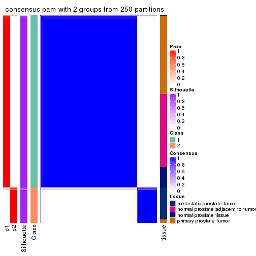</p>

</div>
<div id='tab-ATC-pam-consensus-heatmap-2'>
<pre><code class="r">consensus_heatmap(res, k = 3)
</code></pre>

<p>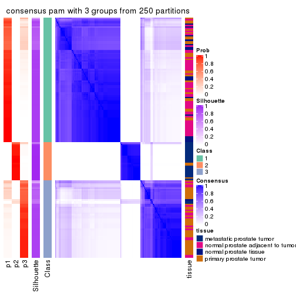</p>

</div>
<div id='tab-ATC-pam-consensus-heatmap-3'>
<pre><code class="r">consensus_heatmap(res, k = 4)
</code></pre>

<p>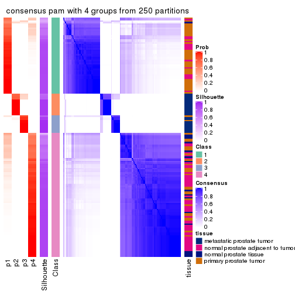</p>

</div>
<div id='tab-ATC-pam-consensus-heatmap-4'>
<pre><code class="r">consensus_heatmap(res, k = 5)
</code></pre>

<p>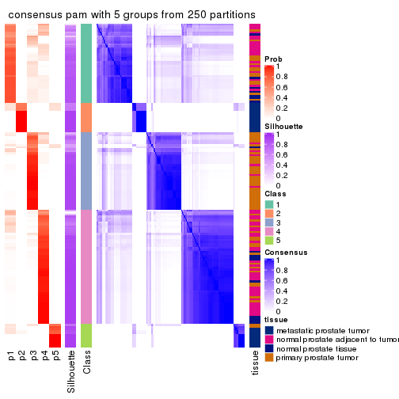</p>

</div>
<div id='tab-ATC-pam-consensus-heatmap-5'>
<pre><code class="r">consensus_heatmap(res, k = 6)
</code></pre>

<p>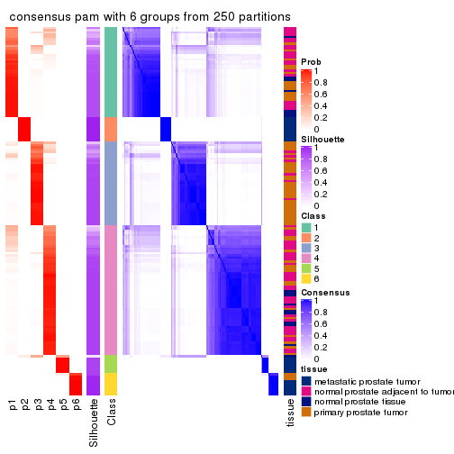</p>

</div>
</div>

Heatmaps for the membership of samples in all partitions to see how consistent they are:


<script>
$( function() {
	$( '#tabs-ATC-pam-membership-heatmap' ).tabs();
} );
</script>
<div id='tabs-ATC-pam-membership-heatmap'>
<ul>
<li><a href='#tab-ATC-pam-membership-heatmap-1'>k = 2</a></li>
<li><a href='#tab-ATC-pam-membership-heatmap-2'>k = 3</a></li>
<li><a href='#tab-ATC-pam-membership-heatmap-3'>k = 4</a></li>
<li><a href='#tab-ATC-pam-membership-heatmap-4'>k = 5</a></li>
<li><a href='#tab-ATC-pam-membership-heatmap-5'>k = 6</a></li>
</ul>
<div id='tab-ATC-pam-membership-heatmap-1'>
<pre><code class="r">membership_heatmap(res, k = 2)
</code></pre>

<p>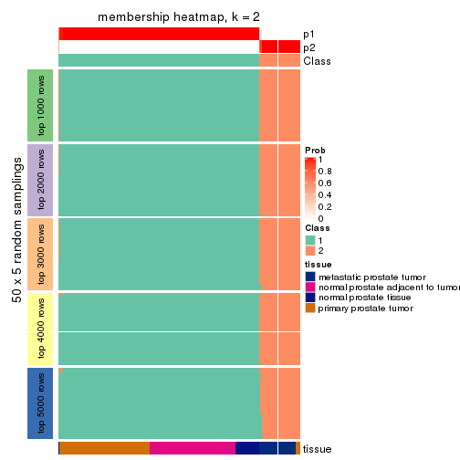</p>

</div>
<div id='tab-ATC-pam-membership-heatmap-2'>
<pre><code class="r">membership_heatmap(res, k = 3)
</code></pre>

<p>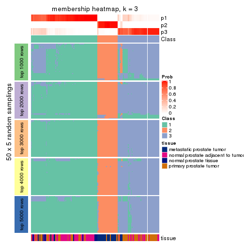</p>

</div>
<div id='tab-ATC-pam-membership-heatmap-3'>
<pre><code class="r">membership_heatmap(res, k = 4)
</code></pre>

<p>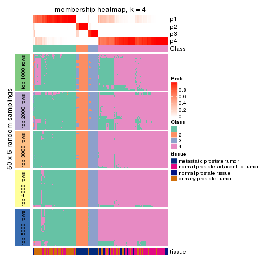</p>

</div>
<div id='tab-ATC-pam-membership-heatmap-4'>
<pre><code class="r">membership_heatmap(res, k = 5)
</code></pre>

<p>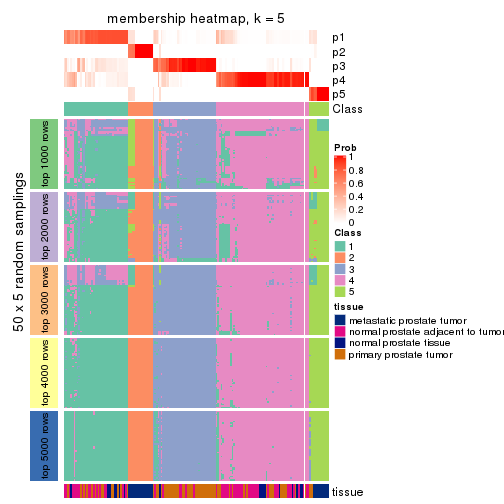</p>

</div>
<div id='tab-ATC-pam-membership-heatmap-5'>
<pre><code class="r">membership_heatmap(res, k = 6)
</code></pre>

<p></p>

</div>
</div>

As soon as we have had the classes for columns, we can look for signatures
which are significantly different between classes which can be candidate marks
for certain classes. Following are the heatmaps for signatures.


Signature heatmaps where rows are scaled:


<script>
$( function() {
	$( '#tabs-ATC-pam-get-signatures' ).tabs();
} );
</script>
<div id='tabs-ATC-pam-get-signatures'>
<ul>
<li><a href='#tab-ATC-pam-get-signatures-1'>k = 2</a></li>
<li><a href='#tab-ATC-pam-get-signatures-2'>k = 3</a></li>
<li><a href='#tab-ATC-pam-get-signatures-3'>k = 4</a></li>
<li><a href='#tab-ATC-pam-get-signatures-4'>k = 5</a></li>
<li><a href='#tab-ATC-pam-get-signatures-5'>k = 6</a></li>
</ul>
<div id='tab-ATC-pam-get-signatures-1'>
<pre><code class="r">get_signatures(res, k = 2)
</code></pre>

<pre><code>#&gt; Error in mat[ceiling(1:nr/h_ratio), ceiling(1:nc/w_ratio), drop = FALSE]: subscript out of bounds
</code></pre>

<p>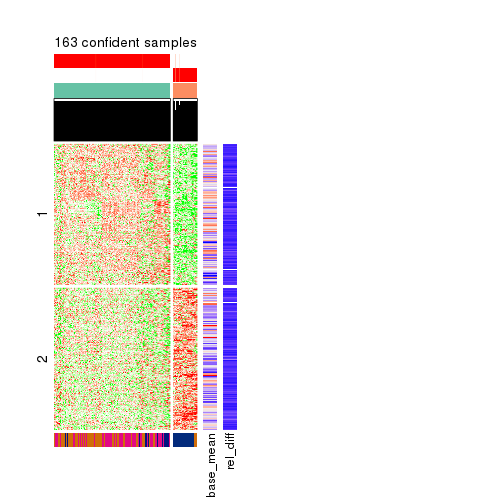</p>

</div>
<div id='tab-ATC-pam-get-signatures-2'>
<pre><code class="r">get_signatures(res, k = 3)
</code></pre>

<p>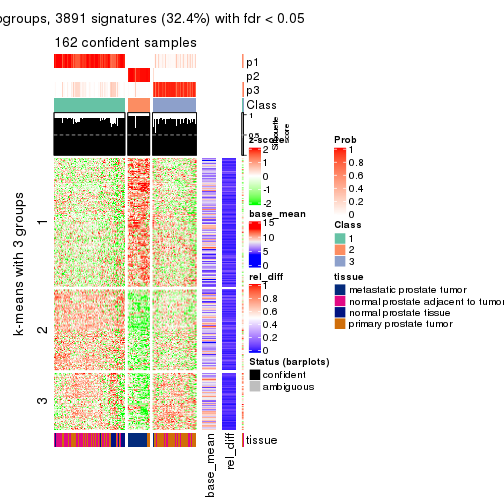</p>

</div>
<div id='tab-ATC-pam-get-signatures-3'>
<pre><code class="r">get_signatures(res, k = 4)
</code></pre>

<p>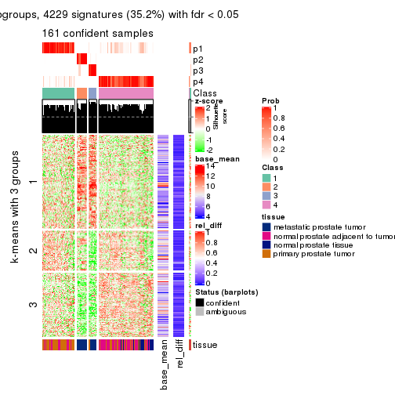</p>

</div>
<div id='tab-ATC-pam-get-signatures-4'>
<pre><code class="r">get_signatures(res, k = 5)
</code></pre>

<p>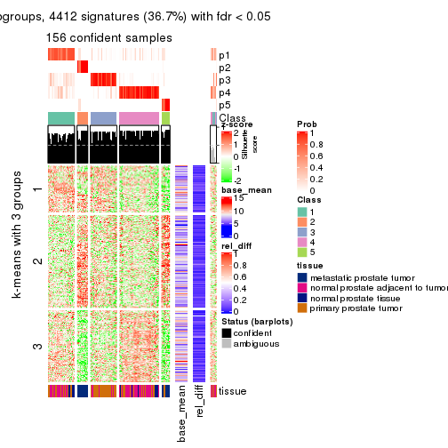</p>

</div>
<div id='tab-ATC-pam-get-signatures-5'>
<pre><code class="r">get_signatures(res, k = 6)
</code></pre>

<p>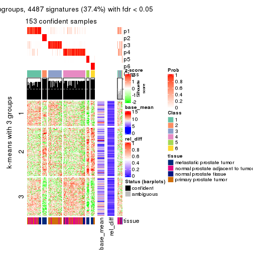</p>

</div>
</div>


Signature heatmaps where rows are not scaled:


<script>
$( function() {
	$( '#tabs-ATC-pam-get-signatures-no-scale' ).tabs();
} );
</script>
<div id='tabs-ATC-pam-get-signatures-no-scale'>
<ul>
<li><a href='#tab-ATC-pam-get-signatures-no-scale-1'>k = 2</a></li>
<li><a href='#tab-ATC-pam-get-signatures-no-scale-2'>k = 3</a></li>
<li><a href='#tab-ATC-pam-get-signatures-no-scale-3'>k = 4</a></li>
<li><a href='#tab-ATC-pam-get-signatures-no-scale-4'>k = 5</a></li>
<li><a href='#tab-ATC-pam-get-signatures-no-scale-5'>k = 6</a></li>
</ul>
<div id='tab-ATC-pam-get-signatures-no-scale-1'>
<pre><code class="r">get_signatures(res, k = 2, scale_rows = FALSE)
</code></pre>

<p>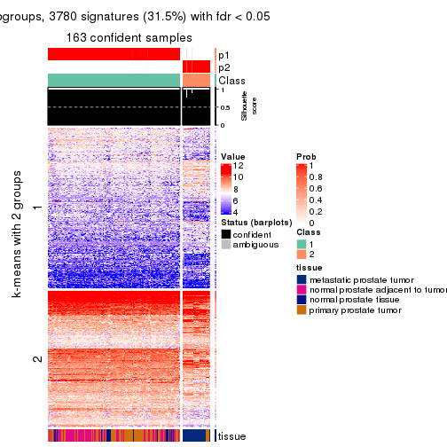</p>

</div>
<div id='tab-ATC-pam-get-signatures-no-scale-2'>
<pre><code class="r">get_signatures(res, k = 3, scale_rows = FALSE)
</code></pre>

<p>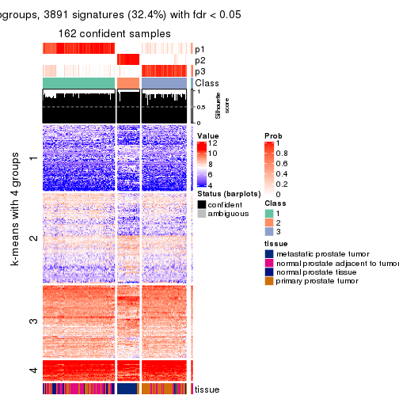</p>

</div>
<div id='tab-ATC-pam-get-signatures-no-scale-3'>
<pre><code class="r">get_signatures(res, k = 4, scale_rows = FALSE)
</code></pre>

<p>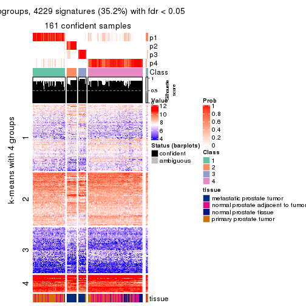</p>

</div>
<div id='tab-ATC-pam-get-signatures-no-scale-4'>
<pre><code class="r">get_signatures(res, k = 5, scale_rows = FALSE)
</code></pre>

<p>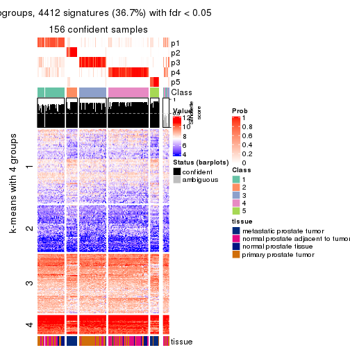</p>

</div>
<div id='tab-ATC-pam-get-signatures-no-scale-5'>
<pre><code class="r">get_signatures(res, k = 6, scale_rows = FALSE)
</code></pre>

<p>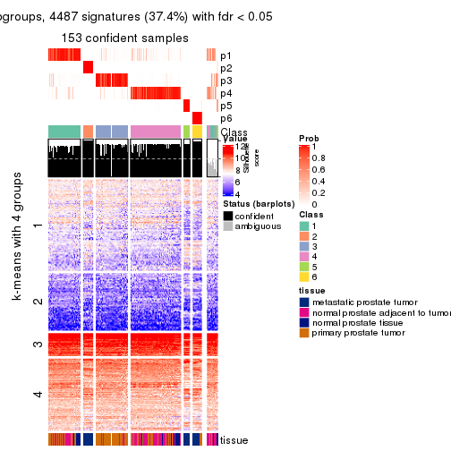</p>

</div>
</div>


Compare the overlap of signatures from different k:

```r
compare_signatures(res)
```

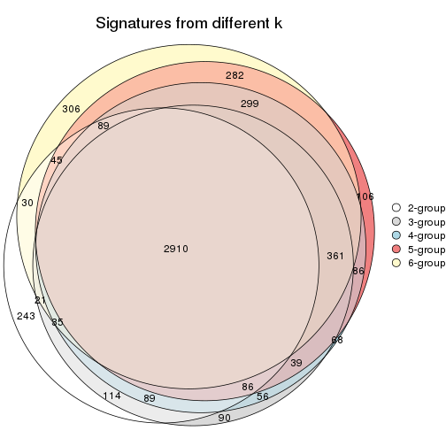

`get_signature()` returns a data frame invisibly. TO get the list of signatures, the function
call should be assigned to a variable explicitly. In following code, if `plot` argument is set
to `FALSE`, no heatmap is plotted while only the differential analysis is performed.

```r
# code only for demonstration
tb = get_signature(res, k = ..., plot = FALSE)
```

An example of the output of `tb` is:

```
#>   which_row         fdr    mean_1    mean_2 scaled_mean_1 scaled_mean_2 km
#> 1        38 0.042760348  8.373488  9.131774    -0.5533452     0.5164555  1
#> 2        40 0.018707592  7.106213  8.469186    -0.6173731     0.5762149  1
#> 3        55 0.019134737 10.221463 11.207825    -0.6159697     0.5749050  1
#> 4        59 0.006059896  5.921854  7.869574    -0.6899429     0.6439467  1
#> 5        60 0.018055526  8.928898 10.211722    -0.6204761     0.5791110  1
#> 6        98 0.009384629 15.714769 14.887706     0.6635654    -0.6193277  2
...
```

The columns in `tb` are:

1. `which_row`: row indices corresponding to the input matrix.
2. `fdr`: FDR for the differential test. 
3. `mean_x`: The mean value in group x.
4. `scaled_mean_x`: The mean value in group x after rows are scaled.
5. `km`: Row groups if k-means clustering is applied to rows.


UMAP plot which shows how samples are separated.


<script>
$( function() {
	$( '#tabs-ATC-pam-dimension-reduction' ).tabs();
} );
</script>
<div id='tabs-ATC-pam-dimension-reduction'>
<ul>
<li><a href='#tab-ATC-pam-dimension-reduction-1'>k = 2</a></li>
<li><a href='#tab-ATC-pam-dimension-reduction-2'>k = 3</a></li>
<li><a href='#tab-ATC-pam-dimension-reduction-3'>k = 4</a></li>
<li><a href='#tab-ATC-pam-dimension-reduction-4'>k = 5</a></li>
<li><a href='#tab-ATC-pam-dimension-reduction-5'>k = 6</a></li>
</ul>
<div id='tab-ATC-pam-dimension-reduction-1'>
<pre><code class="r">dimension_reduction(res, k = 2, method = &quot;UMAP&quot;)
</code></pre>

<p>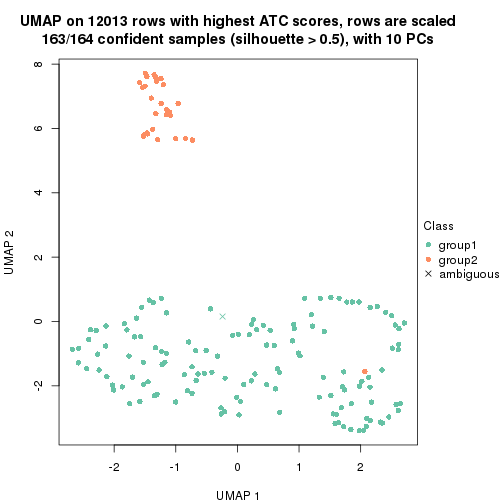</p>

</div>
<div id='tab-ATC-pam-dimension-reduction-2'>
<pre><code class="r">dimension_reduction(res, k = 3, method = &quot;UMAP&quot;)
</code></pre>

<p>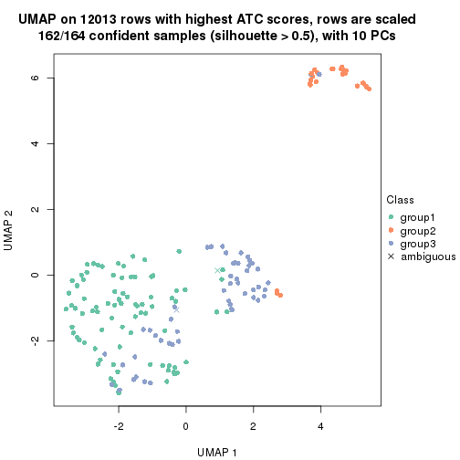</p>

</div>
<div id='tab-ATC-pam-dimension-reduction-3'>
<pre><code class="r">dimension_reduction(res, k = 4, method = &quot;UMAP&quot;)
</code></pre>

<p>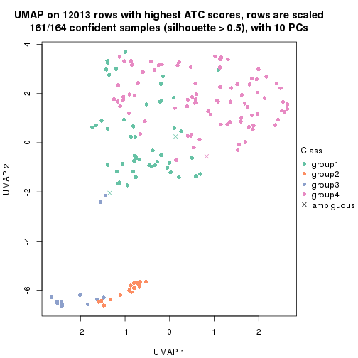</p>

</div>
<div id='tab-ATC-pam-dimension-reduction-4'>
<pre><code class="r">dimension_reduction(res, k = 5, method = &quot;UMAP&quot;)
</code></pre>

<p>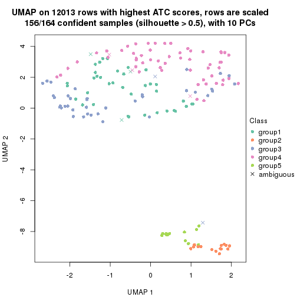</p>

</div>
<div id='tab-ATC-pam-dimension-reduction-5'>
<pre><code class="r">dimension_reduction(res, k = 6, method = &quot;UMAP&quot;)
</code></pre>

<p>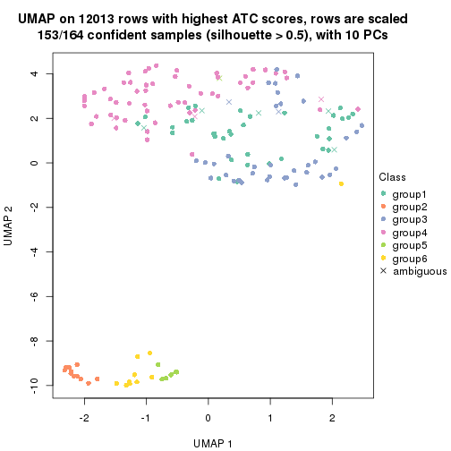</p>

</div>
</div>


Following heatmap shows how subgroups are split when increasing `k`:

```r
collect_classes(res)
```

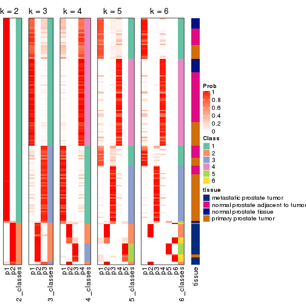


Test correlation between subgroups and known annotations. If the known
annotation is numeric, one-way ANOVA test is applied, and if the known
annotation is discrete, chi-squared contingency table test is applied.

```r
test_to_known_factors(res)
```

```
#>           n tissue(p) k
#> ATC:pam 163  8.95e-31 2
#> ATC:pam 162  2.66e-31 3
#> ATC:pam 161  8.41e-34 4
#> ATC:pam 156  1.57e-31 5
#> ATC:pam 153  1.45e-29 6
```


If matrix rows can be associated to genes, consider to use `functional_enrichment(res,
...)` to perform function enrichment for the signature genes. See [this vignette](http://bioconductor.org/packages/devel/bioc/vignettes/cola/inst/doc/functional_enrichment.html) for more detailed explanations.


 

---------------------------------------------------


### ATC:mclust**


The object with results only for a single top-value method and a single partition method 
can be extracted as:

```r
res = res_list["ATC", "mclust"]
# you can also extract it by
# res = res_list["ATC:mclust"]
```

A summary of `res` and all the functions that can be applied to it:

```r
res
```

```
#> A 'ConsensusPartition' object with k = 2, 3, 4, 5, 6.
#>   On a matrix with 12013 rows and 164 columns.
#>   Top rows (1000, 2000, 3000, 4000, 5000) are extracted by 'ATC' method.
#>   Subgroups are detected by 'mclust' method.
#>   Performed in total 1250 partitions by row resampling.
#>   Best k for subgroups seems to be 2.
#> 
#> Following methods can be applied to this 'ConsensusPartition' object:
#>  [1] "cola_report"             "collect_classes"         "collect_plots"          
#>  [4] "collect_stats"           "colnames"                "compare_signatures"     
#>  [7] "consensus_heatmap"       "dimension_reduction"     "functional_enrichment"  
#> [10] "get_anno_col"            "get_anno"                "get_classes"            
#> [13] "get_consensus"           "get_matrix"              "get_membership"         
#> [16] "get_param"               "get_signatures"          "get_stats"              
#> [19] "is_best_k"               "is_stable_k"             "membership_heatmap"     
#> [22] "ncol"                    "nrow"                    "plot_ecdf"              
#> [25] "rownames"                "select_partition_number" "show"                   
#> [28] "suggest_best_k"          "test_to_known_factors"
```

`collect_plots()` function collects all the plots made from `res` for all `k` (number of partitions)
into one single page to provide an easy and fast comparison between different `k`.

```r
collect_plots(res)
```

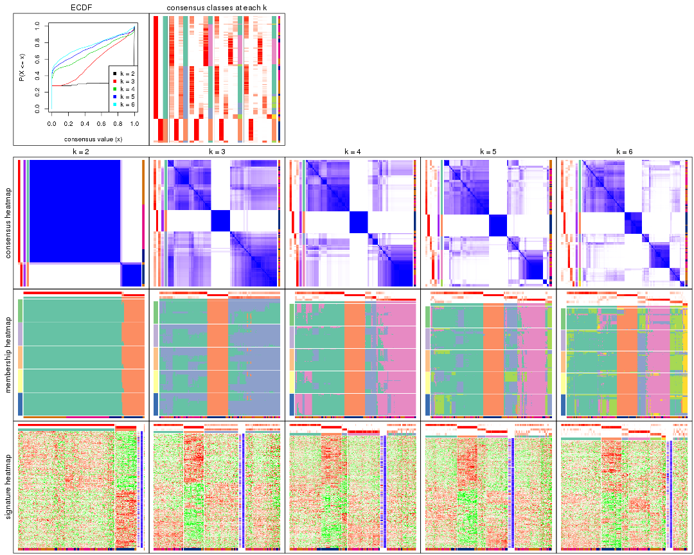

The plots are:

- The first row: a plot of the ECDF (empirical cumulative distribution
  function) curves of the consensus matrix for each `k` and the heatmap of
  predicted classes for each `k`.
- The second row: heatmaps of the consensus matrix for each `k`.
- The third row: heatmaps of the membership matrix for each `k`.
- The fouth row: heatmaps of the signatures for each `k`.

All the plots in panels can be made by individual functions and they are
plotted later in this section.

`select_partition_number()` produces several plots showing different
statistics for choosing "optimized" `k`. There are following statistics:

- ECDF curves of the consensus matrix for each `k`;
- 1-PAC. [The PAC
  score](https://en.wikipedia.org/wiki/Consensus_clustering#Over-interpretation_potential_of_consensus_clustering)
  measures the proportion of the ambiguous subgrouping.
- Mean silhouette score.
- Concordance. The mean probability of fiting the consensus class ids in all
  partitions.
- Area increased. Denote $A_k$ as the area under the ECDF curve for current
  `k`, the area increased is defined as $A_k - A_{k-1}$.
- Rand index. The percent of pairs of samples that are both in a same cluster
  or both are not in a same cluster in the partition of k and k-1.
- Jaccard index. The ratio of pairs of samples are both in a same cluster in
  the partition of k and k-1 and the pairs of samples are both in a same
  cluster in the partition k or k-1.

The detailed explanations of these statistics can be found in [the _cola_
vignette](http://bioconductor.org/packages/devel/bioc/vignettes/cola/inst/doc/cola.html#toc_13).

Generally speaking, lower PAC score, higher mean silhouette score or higher
concordance corresponds to better partition. Rand index and Jaccard index
measure how similar the current partition is compared to partition with `k-1`.
If they are too similar, we won't accept `k` is better than `k-1`.

```r
select_partition_number(res)
```

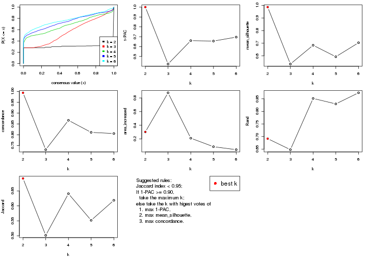

The numeric values for all these statistics can be obtained by `get_stats()`.

```r
get_stats(res)
```

```
#>   k 1-PAC mean_silhouette concordance area_increased  Rand Jaccard
#> 2 2 1.000           0.986       0.994         0.3016 0.692   0.692
#> 3 3 0.424           0.536       0.731         0.8756 0.648   0.502
#> 4 4 0.660           0.684       0.867         0.2097 0.851   0.641
#> 5 5 0.656           0.593       0.811         0.0848 0.830   0.552
#> 6 6 0.696           0.704       0.806         0.0414 0.874   0.619
```

`suggest_best_k()` suggests the best $k$ based on these statistics. The rules are as follows:

- All $k$ with Jaccard index larger than 0.95 are removed because increasing
  $k$ does not provide enough extra information. If all $k$ are removed, it is
  marked as no subgroup is detected.
- For all $k$ with 1-PAC score larger than 0.9, the maximal $k$ is taken as
  the best $k$, and other $k$ are marked as optional $k$.
- If it does not fit the second rule. The $k$ with the maximal vote of the
  highest 1-PAC score, highest mean silhouette, and highest concordance is
  taken as the best $k$.

```r
suggest_best_k(res)
```

```
#> [1] 2
```


Following shows the table of the partitions (You need to click the **show/hide
code output** link to see it). The membership matrix (columns with name `p*`)
is inferred by
[`clue::cl_consensus()`](https://www.rdocumentation.org/link/cl_consensus?package=clue)
function with the `SE` method. Basically the value in the membership matrix
represents the probability to belong to a certain group. The finall class
label for an item is determined with the group with highest probability it
belongs to.

In `get_classes()` function, the entropy is calculated from the membership
matrix and the silhouette score is calculated from the consensus matrix.


<script>
$( function() {
	$( '#tabs-ATC-mclust-get-classes' ).tabs();
} );
</script>
<div id='tabs-ATC-mclust-get-classes'>
<ul>
<li><a href='#tab-ATC-mclust-get-classes-1'>k = 2</a></li>
<li><a href='#tab-ATC-mclust-get-classes-2'>k = 3</a></li>
<li><a href='#tab-ATC-mclust-get-classes-3'>k = 4</a></li>
<li><a href='#tab-ATC-mclust-get-classes-4'>k = 5</a></li>
<li><a href='#tab-ATC-mclust-get-classes-5'>k = 6</a></li>
</ul>

<div id='tab-ATC-mclust-get-classes-1'>
<p><a id='tab-ATC-mclust-get-classes-1-a' style='color:#0366d6' href='#'>show/hide code output</a></p>
<pre><code class="r">cbind(get_classes(res, k = 2), get_membership(res, k = 2))
</code></pre>

<pre><code>#&gt;           class entropy silhouette    p1    p2
#&gt; GSM152839     1   0.000      1.000 1.000 0.000
#&gt; GSM152840     1   0.000      1.000 1.000 0.000
#&gt; GSM152841     1   0.000      1.000 1.000 0.000
#&gt; GSM152842     1   0.000      1.000 1.000 0.000
#&gt; GSM152843     1   0.000      1.000 1.000 0.000
#&gt; GSM152844     1   0.000      1.000 1.000 0.000
#&gt; GSM152845     1   0.000      1.000 1.000 0.000
#&gt; GSM152846     1   0.000      1.000 1.000 0.000
#&gt; GSM152847     1   0.000      1.000 1.000 0.000
#&gt; GSM152848     1   0.000      1.000 1.000 0.000
#&gt; GSM152849     1   0.000      1.000 1.000 0.000
#&gt; GSM152850     1   0.000      1.000 1.000 0.000
#&gt; GSM152851     1   0.000      1.000 1.000 0.000
#&gt; GSM152852     1   0.000      1.000 1.000 0.000
#&gt; GSM152853     1   0.000      1.000 1.000 0.000
#&gt; GSM152854     1   0.000      1.000 1.000 0.000
#&gt; GSM152855     1   0.000      1.000 1.000 0.000
#&gt; GSM153238     1   0.000      1.000 1.000 0.000
#&gt; GSM153239     1   0.000      1.000 1.000 0.000
#&gt; GSM153240     1   0.000      1.000 1.000 0.000
#&gt; GSM153241     1   0.000      1.000 1.000 0.000
#&gt; GSM153242     1   0.000      1.000 1.000 0.000
#&gt; GSM153243     1   0.000      1.000 1.000 0.000
#&gt; GSM153244     1   0.000      1.000 1.000 0.000
#&gt; GSM153245     1   0.000      1.000 1.000 0.000
#&gt; GSM153246     1   0.000      1.000 1.000 0.000
#&gt; GSM153247     1   0.000      1.000 1.000 0.000
#&gt; GSM153248     1   0.000      1.000 1.000 0.000
#&gt; GSM153249     1   0.000      1.000 1.000 0.000
#&gt; GSM153250     1   0.000      1.000 1.000 0.000
#&gt; GSM153251     1   0.000      1.000 1.000 0.000
#&gt; GSM153252     1   0.000      1.000 1.000 0.000
#&gt; GSM153253     1   0.000      1.000 1.000 0.000
#&gt; GSM153254     1   0.000      1.000 1.000 0.000
#&gt; GSM153255     1   0.000      1.000 1.000 0.000
#&gt; GSM153256     1   0.000      1.000 1.000 0.000
#&gt; GSM153257     1   0.000      1.000 1.000 0.000
#&gt; GSM153258     1   0.000      1.000 1.000 0.000
#&gt; GSM153259     1   0.000      1.000 1.000 0.000
#&gt; GSM153260     1   0.000      1.000 1.000 0.000
#&gt; GSM153261     1   0.000      1.000 1.000 0.000
#&gt; GSM153262     1   0.000      1.000 1.000 0.000
#&gt; GSM153263     1   0.000      1.000 1.000 0.000
#&gt; GSM153264     1   0.000      1.000 1.000 0.000
#&gt; GSM153265     1   0.000      1.000 1.000 0.000
#&gt; GSM153266     1   0.000      1.000 1.000 0.000
#&gt; GSM153267     1   0.000      1.000 1.000 0.000
#&gt; GSM153268     1   0.000      1.000 1.000 0.000
#&gt; GSM153269     1   0.000      1.000 1.000 0.000
#&gt; GSM153270     1   0.000      1.000 1.000 0.000
#&gt; GSM153271     1   0.000      1.000 1.000 0.000
#&gt; GSM153272     1   0.000      1.000 1.000 0.000
#&gt; GSM153273     1   0.000      1.000 1.000 0.000
#&gt; GSM153274     1   0.000      1.000 1.000 0.000
#&gt; GSM153275     1   0.000      1.000 1.000 0.000
#&gt; GSM153276     1   0.000      1.000 1.000 0.000
#&gt; GSM153277     1   0.000      1.000 1.000 0.000
#&gt; GSM153278     1   0.000      1.000 1.000 0.000
#&gt; GSM153279     1   0.000      1.000 1.000 0.000
#&gt; GSM153280     1   0.000      1.000 1.000 0.000
#&gt; GSM153281     1   0.000      1.000 1.000 0.000
#&gt; GSM153282     1   0.000      1.000 1.000 0.000
#&gt; GSM153283     1   0.000      1.000 1.000 0.000
#&gt; GSM153284     1   0.000      1.000 1.000 0.000
#&gt; GSM153285     1   0.000      1.000 1.000 0.000
#&gt; GSM153286     1   0.000      1.000 1.000 0.000
#&gt; GSM153287     1   0.000      1.000 1.000 0.000
#&gt; GSM153288     1   0.000      1.000 1.000 0.000
#&gt; GSM153289     1   0.000      1.000 1.000 0.000
#&gt; GSM153290     1   0.000      1.000 1.000 0.000
#&gt; GSM153291     1   0.000      1.000 1.000 0.000
#&gt; GSM153292     1   0.000      1.000 1.000 0.000
#&gt; GSM153293     1   0.000      1.000 1.000 0.000
#&gt; GSM153294     1   0.000      1.000 1.000 0.000
#&gt; GSM153295     1   0.000      1.000 1.000 0.000
#&gt; GSM153054     1   0.000      1.000 1.000 0.000
#&gt; GSM153055     1   0.000      1.000 1.000 0.000
#&gt; GSM153056     1   0.000      1.000 1.000 0.000
#&gt; GSM153057     1   0.000      1.000 1.000 0.000
#&gt; GSM153058     1   0.000      1.000 1.000 0.000
#&gt; GSM153059     1   0.000      1.000 1.000 0.000
#&gt; GSM153060     1   0.000      1.000 1.000 0.000
#&gt; GSM153061     1   0.000      1.000 1.000 0.000
#&gt; GSM153062     1   0.000      1.000 1.000 0.000
#&gt; GSM153063     1   0.000      1.000 1.000 0.000
#&gt; GSM153064     1   0.000      1.000 1.000 0.000
#&gt; GSM153065     1   0.000      1.000 1.000 0.000
#&gt; GSM153066     2   0.983      0.298 0.424 0.576
#&gt; GSM153067     1   0.000      1.000 1.000 0.000
#&gt; GSM153068     1   0.000      1.000 1.000 0.000
#&gt; GSM153069     1   0.000      1.000 1.000 0.000
#&gt; GSM153070     1   0.000      1.000 1.000 0.000
#&gt; GSM153071     1   0.000      1.000 1.000 0.000
#&gt; GSM153072     1   0.000      1.000 1.000 0.000
#&gt; GSM153073     1   0.000      1.000 1.000 0.000
#&gt; GSM153074     1   0.000      1.000 1.000 0.000
#&gt; GSM153075     1   0.000      1.000 1.000 0.000
#&gt; GSM153076     1   0.000      1.000 1.000 0.000
#&gt; GSM153077     1   0.000      1.000 1.000 0.000
#&gt; GSM153078     1   0.000      1.000 1.000 0.000
#&gt; GSM153079     1   0.000      1.000 1.000 0.000
#&gt; GSM153080     1   0.000      1.000 1.000 0.000
#&gt; GSM153081     1   0.000      1.000 1.000 0.000
#&gt; GSM153082     1   0.000      1.000 1.000 0.000
#&gt; GSM153083     1   0.000      1.000 1.000 0.000
#&gt; GSM153084     1   0.000      1.000 1.000 0.000
#&gt; GSM153085     1   0.000      1.000 1.000 0.000
#&gt; GSM153086     1   0.000      1.000 1.000 0.000
#&gt; GSM153087     1   0.000      1.000 1.000 0.000
#&gt; GSM153088     1   0.000      1.000 1.000 0.000
#&gt; GSM153089     1   0.000      1.000 1.000 0.000
#&gt; GSM153090     1   0.000      1.000 1.000 0.000
#&gt; GSM153091     1   0.000      1.000 1.000 0.000
#&gt; GSM153092     1   0.000      1.000 1.000 0.000
#&gt; GSM153093     1   0.000      1.000 1.000 0.000
#&gt; GSM153094     1   0.000      1.000 1.000 0.000
#&gt; GSM153095     1   0.000      1.000 1.000 0.000
#&gt; GSM153096     1   0.000      1.000 1.000 0.000
#&gt; GSM153097     1   0.000      1.000 1.000 0.000
#&gt; GSM153098     1   0.000      1.000 1.000 0.000
#&gt; GSM153099     1   0.000      1.000 1.000 0.000
#&gt; GSM153100     1   0.000      1.000 1.000 0.000
#&gt; GSM153101     1   0.000      1.000 1.000 0.000
#&gt; GSM153102     1   0.000      1.000 1.000 0.000
#&gt; GSM153103     1   0.000      1.000 1.000 0.000
#&gt; GSM153104     1   0.000      1.000 1.000 0.000
#&gt; GSM153106     1   0.000      1.000 1.000 0.000
#&gt; GSM153107     1   0.000      1.000 1.000 0.000
#&gt; GSM153108     1   0.000      1.000 1.000 0.000
#&gt; GSM153109     1   0.000      1.000 1.000 0.000
#&gt; GSM153110     1   0.000      1.000 1.000 0.000
#&gt; GSM153111     1   0.000      1.000 1.000 0.000
#&gt; GSM153112     1   0.000      1.000 1.000 0.000
#&gt; GSM153113     2   0.891      0.576 0.308 0.692
#&gt; GSM153114     1   0.000      1.000 1.000 0.000
#&gt; GSM187532     2   0.000      0.968 0.000 1.000
#&gt; GSM187533     2   0.000      0.968 0.000 1.000
#&gt; GSM187534     2   0.000      0.968 0.000 1.000
#&gt; GSM187535     2   0.788      0.700 0.236 0.764
#&gt; GSM152906     2   0.000      0.968 0.000 1.000
#&gt; GSM152907     2   0.000      0.968 0.000 1.000
#&gt; GSM152908     2   0.000      0.968 0.000 1.000
#&gt; GSM152909     2   0.000      0.968 0.000 1.000
#&gt; GSM152910     2   0.000      0.968 0.000 1.000
#&gt; GSM152911     2   0.000      0.968 0.000 1.000
#&gt; GSM152912     2   0.000      0.968 0.000 1.000
#&gt; GSM152913     2   0.000      0.968 0.000 1.000
#&gt; GSM152914     2   0.000      0.968 0.000 1.000
#&gt; GSM152915     2   0.000      0.968 0.000 1.000
#&gt; GSM152916     2   0.000      0.968 0.000 1.000
#&gt; GSM152917     2   0.000      0.968 0.000 1.000
#&gt; GSM152918     2   0.000      0.968 0.000 1.000
#&gt; GSM152919     2   0.000      0.968 0.000 1.000
#&gt; GSM152920     2   0.000      0.968 0.000 1.000
#&gt; GSM152921     2   0.000      0.968 0.000 1.000
#&gt; GSM152922     2   0.000      0.968 0.000 1.000
#&gt; GSM152923     2   0.000      0.968 0.000 1.000
#&gt; GSM152924     2   0.000      0.968 0.000 1.000
#&gt; GSM152925     2   0.000      0.968 0.000 1.000
#&gt; GSM152926     2   0.000      0.968 0.000 1.000
#&gt; GSM152927     2   0.000      0.968 0.000 1.000
#&gt; GSM152928     2   0.000      0.968 0.000 1.000
#&gt; GSM152929     2   0.000      0.968 0.000 1.000
#&gt; GSM152930     2   0.000      0.968 0.000 1.000
</code></pre>

<script>
$('#tab-ATC-mclust-get-classes-1-a').parent().next().next().hide();
$('#tab-ATC-mclust-get-classes-1-a').click(function(){
  $('#tab-ATC-mclust-get-classes-1-a').parent().next().next().toggle();
  return(false);
});
</script>
</div>

<div id='tab-ATC-mclust-get-classes-2'>
<p><a id='tab-ATC-mclust-get-classes-2-a' style='color:#0366d6' href='#'>show/hide code output</a></p>
<pre><code class="r">cbind(get_classes(res, k = 3), get_membership(res, k = 3))
</code></pre>

<pre><code>#&gt;           class entropy silhouette    p1    p2    p3
#&gt; GSM152839     3  0.6244     0.5775 0.440 0.000 0.560
#&gt; GSM152840     1  0.3879     0.5754 0.848 0.000 0.152
#&gt; GSM152841     1  0.2537     0.6466 0.920 0.000 0.080
#&gt; GSM152842     3  0.4887     0.5600 0.228 0.000 0.772
#&gt; GSM152843     3  0.6286     0.5425 0.464 0.000 0.536
#&gt; GSM152844     1  0.6140     0.2964 0.596 0.000 0.404
#&gt; GSM152845     3  0.5138     0.1669 0.252 0.000 0.748
#&gt; GSM152846     3  0.6235    -0.1519 0.436 0.000 0.564
#&gt; GSM152847     3  0.3412     0.4857 0.124 0.000 0.876
#&gt; GSM152848     3  0.6302     0.5200 0.480 0.000 0.520
#&gt; GSM152849     3  0.4887     0.4148 0.228 0.000 0.772
#&gt; GSM152850     3  0.6192     0.6036 0.420 0.000 0.580
#&gt; GSM152851     1  0.2878     0.6476 0.904 0.000 0.096
#&gt; GSM152852     3  0.6235    -0.1519 0.436 0.000 0.564
#&gt; GSM152853     1  0.4002     0.5660 0.840 0.000 0.160
#&gt; GSM152854     1  0.6295     0.1940 0.528 0.000 0.472
#&gt; GSM152855     1  0.1031     0.6496 0.976 0.000 0.024
#&gt; GSM153238     3  0.6026     0.6312 0.376 0.000 0.624
#&gt; GSM153239     1  0.3038     0.6255 0.896 0.000 0.104
#&gt; GSM153240     1  0.2537     0.6519 0.920 0.000 0.080
#&gt; GSM153241     3  0.6154     0.3044 0.408 0.000 0.592
#&gt; GSM153242     3  0.6235    -0.1519 0.436 0.000 0.564
#&gt; GSM153243     3  0.6111     0.4188 0.396 0.000 0.604
#&gt; GSM153244     1  0.5431     0.3982 0.716 0.000 0.284
#&gt; GSM153245     1  0.2537     0.6466 0.920 0.000 0.080
#&gt; GSM153246     3  0.4842     0.3189 0.224 0.000 0.776
#&gt; GSM153247     3  0.6267     0.5583 0.452 0.000 0.548
#&gt; GSM153248     3  0.6215     0.5920 0.428 0.000 0.572
#&gt; GSM153249     1  0.1643     0.6554 0.956 0.000 0.044
#&gt; GSM153250     3  0.6305     0.5123 0.484 0.000 0.516
#&gt; GSM153251     1  0.5560     0.3952 0.700 0.000 0.300
#&gt; GSM153252     1  0.2959     0.5911 0.900 0.000 0.100
#&gt; GSM153253     1  0.2448     0.6484 0.924 0.000 0.076
#&gt; GSM153254     1  0.5835     0.2634 0.660 0.000 0.340
#&gt; GSM153255     1  0.0892     0.6515 0.980 0.000 0.020
#&gt; GSM153256     1  0.4702     0.4400 0.788 0.000 0.212
#&gt; GSM153257     1  0.1643     0.6390 0.956 0.000 0.044
#&gt; GSM153258     3  0.6095     0.6268 0.392 0.000 0.608
#&gt; GSM153259     3  0.6026     0.6312 0.376 0.000 0.624
#&gt; GSM153260     3  0.5098     0.3511 0.248 0.000 0.752
#&gt; GSM153261     3  0.4796     0.2658 0.220 0.000 0.780
#&gt; GSM153262     1  0.2448     0.6484 0.924 0.000 0.076
#&gt; GSM153263     3  0.6309     0.4846 0.496 0.000 0.504
#&gt; GSM153264     3  0.6267     0.5583 0.452 0.000 0.548
#&gt; GSM153265     1  0.2537     0.6466 0.920 0.000 0.080
#&gt; GSM153266     3  0.6111     0.6243 0.396 0.000 0.604
#&gt; GSM153267     1  0.6235    -0.3144 0.564 0.000 0.436
#&gt; GSM153268     1  0.3752     0.5851 0.856 0.000 0.144
#&gt; GSM153269     1  0.5216     0.3327 0.740 0.000 0.260
#&gt; GSM153270     1  0.6280    -0.1850 0.540 0.000 0.460
#&gt; GSM153271     1  0.6302    -0.4396 0.520 0.000 0.480
#&gt; GSM153272     1  0.3412     0.5658 0.876 0.000 0.124
#&gt; GSM153273     3  0.6260     0.5648 0.448 0.000 0.552
#&gt; GSM153274     1  0.6045    -0.1226 0.620 0.000 0.380
#&gt; GSM153275     1  0.4002     0.5266 0.840 0.000 0.160
#&gt; GSM153276     1  0.4121     0.5043 0.832 0.000 0.168
#&gt; GSM153277     1  0.2537     0.6466 0.920 0.000 0.080
#&gt; GSM153278     3  0.4796     0.3425 0.220 0.000 0.780
#&gt; GSM153279     1  0.2625     0.6473 0.916 0.000 0.084
#&gt; GSM153280     1  0.2537     0.6466 0.920 0.000 0.080
#&gt; GSM153281     1  0.2165     0.6522 0.936 0.000 0.064
#&gt; GSM153282     1  0.2537     0.6466 0.920 0.000 0.080
#&gt; GSM153283     3  0.6260     0.5648 0.448 0.000 0.552
#&gt; GSM153284     1  0.3686     0.5474 0.860 0.000 0.140
#&gt; GSM153285     1  0.0000     0.6554 1.000 0.000 0.000
#&gt; GSM153286     1  0.4062     0.5117 0.836 0.000 0.164
#&gt; GSM153287     1  0.0237     0.6554 0.996 0.000 0.004
#&gt; GSM153288     1  0.3619     0.5507 0.864 0.000 0.136
#&gt; GSM153289     1  0.4702     0.4403 0.788 0.000 0.212
#&gt; GSM153290     1  0.2537     0.6466 0.920 0.000 0.080
#&gt; GSM153291     1  0.0892     0.6515 0.980 0.000 0.020
#&gt; GSM153292     1  0.1753     0.6550 0.952 0.000 0.048
#&gt; GSM153293     1  0.4931     0.4000 0.768 0.000 0.232
#&gt; GSM153294     3  0.6267     0.5583 0.452 0.000 0.548
#&gt; GSM153295     1  0.5591     0.3113 0.696 0.000 0.304
#&gt; GSM153054     3  0.6154     0.6129 0.408 0.000 0.592
#&gt; GSM153055     1  0.6286    -0.3993 0.536 0.000 0.464
#&gt; GSM153056     3  0.5835     0.3254 0.340 0.000 0.660
#&gt; GSM153057     1  0.6295    -0.1927 0.528 0.000 0.472
#&gt; GSM153058     3  0.5431     0.1443 0.284 0.000 0.716
#&gt; GSM153059     3  0.6252     0.2271 0.444 0.000 0.556
#&gt; GSM153060     3  0.5926     0.1860 0.356 0.000 0.644
#&gt; GSM153061     3  0.5098     0.3589 0.248 0.000 0.752
#&gt; GSM153062     3  0.5138     0.1669 0.252 0.000 0.748
#&gt; GSM153063     1  0.2537     0.6466 0.920 0.000 0.080
#&gt; GSM153064     3  0.6140     0.6197 0.404 0.000 0.596
#&gt; GSM153065     3  0.5733     0.3902 0.324 0.000 0.676
#&gt; GSM153066     3  0.7804     0.5347 0.216 0.120 0.664
#&gt; GSM153067     1  0.2711     0.6054 0.912 0.000 0.088
#&gt; GSM153068     3  0.5859     0.2388 0.344 0.000 0.656
#&gt; GSM153069     1  0.0000     0.6554 1.000 0.000 0.000
#&gt; GSM153070     3  0.6299     0.5273 0.476 0.000 0.524
#&gt; GSM153071     3  0.6299     0.5247 0.476 0.000 0.524
#&gt; GSM153072     3  0.6204     0.5963 0.424 0.000 0.576
#&gt; GSM153073     3  0.6305     0.5123 0.484 0.000 0.516
#&gt; GSM153074     1  0.0747     0.6525 0.984 0.000 0.016
#&gt; GSM153075     1  0.4121     0.5811 0.832 0.000 0.168
#&gt; GSM153076     1  0.6252    -0.3883 0.556 0.000 0.444
#&gt; GSM153077     3  0.6267     0.5583 0.452 0.000 0.548
#&gt; GSM153078     3  0.6111     0.6252 0.396 0.000 0.604
#&gt; GSM153079     3  0.5760     0.6122 0.328 0.000 0.672
#&gt; GSM153080     1  0.6140    -0.0785 0.596 0.000 0.404
#&gt; GSM153081     3  0.5178     0.5737 0.256 0.000 0.744
#&gt; GSM153082     3  0.5948     0.6308 0.360 0.000 0.640
#&gt; GSM153083     3  0.6008     0.6317 0.372 0.000 0.628
#&gt; GSM153084     3  0.5621     0.5744 0.308 0.000 0.692
#&gt; GSM153085     3  0.5785     0.6115 0.332 0.000 0.668
#&gt; GSM153086     3  0.5988     0.6316 0.368 0.000 0.632
#&gt; GSM153087     1  0.1529     0.6478 0.960 0.000 0.040
#&gt; GSM153088     1  0.6309    -0.4897 0.500 0.000 0.500
#&gt; GSM153089     1  0.6244    -0.0341 0.560 0.000 0.440
#&gt; GSM153090     1  0.6225    -0.3001 0.568 0.000 0.432
#&gt; GSM153091     3  0.5988     0.6316 0.368 0.000 0.632
#&gt; GSM153092     3  0.6299     0.5046 0.476 0.000 0.524
#&gt; GSM153093     1  0.0424     0.6544 0.992 0.000 0.008
#&gt; GSM153094     3  0.5988     0.6316 0.368 0.000 0.632
#&gt; GSM153095     3  0.6045     0.6303 0.380 0.000 0.620
#&gt; GSM153096     3  0.6126     0.6195 0.400 0.000 0.600
#&gt; GSM153097     3  0.5988     0.6316 0.368 0.000 0.632
#&gt; GSM153098     1  0.4974     0.4045 0.764 0.000 0.236
#&gt; GSM153099     1  0.6008    -0.0777 0.628 0.000 0.372
#&gt; GSM153100     3  0.6295     0.5339 0.472 0.000 0.528
#&gt; GSM153101     3  0.6062     0.6267 0.384 0.000 0.616
#&gt; GSM153102     3  0.6215     0.4015 0.428 0.000 0.572
#&gt; GSM153103     3  0.6008     0.6317 0.372 0.000 0.628
#&gt; GSM153104     1  0.0592     0.6546 0.988 0.000 0.012
#&gt; GSM153106     3  0.6291     0.3400 0.468 0.000 0.532
#&gt; GSM153107     3  0.6095     0.6248 0.392 0.000 0.608
#&gt; GSM153108     1  0.6305    -0.4539 0.516 0.000 0.484
#&gt; GSM153109     3  0.5650     0.5981 0.312 0.000 0.688
#&gt; GSM153110     3  0.6026     0.6312 0.376 0.000 0.624
#&gt; GSM153111     3  0.5988     0.6316 0.368 0.000 0.632
#&gt; GSM153112     3  0.6267     0.5583 0.452 0.000 0.548
#&gt; GSM153113     3  0.7865     0.5359 0.216 0.124 0.660
#&gt; GSM153114     1  0.2537     0.6466 0.920 0.000 0.080
#&gt; GSM187532     2  0.0000     0.9996 0.000 1.000 0.000
#&gt; GSM187533     2  0.0000     0.9996 0.000 1.000 0.000
#&gt; GSM187534     2  0.0000     0.9996 0.000 1.000 0.000
#&gt; GSM187535     3  0.7796     0.4242 0.112 0.228 0.660
#&gt; GSM152906     2  0.0000     0.9996 0.000 1.000 0.000
#&gt; GSM152907     2  0.0747     0.9893 0.000 0.984 0.016
#&gt; GSM152908     2  0.0000     0.9996 0.000 1.000 0.000
#&gt; GSM152909     2  0.0000     0.9996 0.000 1.000 0.000
#&gt; GSM152910     2  0.0000     0.9996 0.000 1.000 0.000
#&gt; GSM152911     2  0.0000     0.9996 0.000 1.000 0.000
#&gt; GSM152912     2  0.0000     0.9996 0.000 1.000 0.000
#&gt; GSM152913     2  0.0000     0.9996 0.000 1.000 0.000
#&gt; GSM152914     2  0.0000     0.9996 0.000 1.000 0.000
#&gt; GSM152915     2  0.0000     0.9996 0.000 1.000 0.000
#&gt; GSM152916     2  0.0000     0.9996 0.000 1.000 0.000
#&gt; GSM152917     2  0.0000     0.9996 0.000 1.000 0.000
#&gt; GSM152918     2  0.0000     0.9996 0.000 1.000 0.000
#&gt; GSM152919     2  0.0000     0.9996 0.000 1.000 0.000
#&gt; GSM152920     2  0.0000     0.9996 0.000 1.000 0.000
#&gt; GSM152921     2  0.0000     0.9996 0.000 1.000 0.000
#&gt; GSM152922     2  0.0000     0.9996 0.000 1.000 0.000
#&gt; GSM152923     2  0.0000     0.9996 0.000 1.000 0.000
#&gt; GSM152924     2  0.0000     0.9996 0.000 1.000 0.000
#&gt; GSM152925     2  0.0000     0.9996 0.000 1.000 0.000
#&gt; GSM152926     2  0.0000     0.9996 0.000 1.000 0.000
#&gt; GSM152927     2  0.0000     0.9996 0.000 1.000 0.000
#&gt; GSM152928     2  0.0000     0.9996 0.000 1.000 0.000
#&gt; GSM152929     2  0.0000     0.9996 0.000 1.000 0.000
#&gt; GSM152930     2  0.0000     0.9996 0.000 1.000 0.000
</code></pre>

<script>
$('#tab-ATC-mclust-get-classes-2-a').parent().next().next().hide();
$('#tab-ATC-mclust-get-classes-2-a').click(function(){
  $('#tab-ATC-mclust-get-classes-2-a').parent().next().next().toggle();
  return(false);
});
</script>
</div>

<div id='tab-ATC-mclust-get-classes-3'>
<p><a id='tab-ATC-mclust-get-classes-3-a' style='color:#0366d6' href='#'>show/hide code output</a></p>
<pre><code class="r">cbind(get_classes(res, k = 4), get_membership(res, k = 4))
</code></pre>

<pre><code>#&gt;           class entropy silhouette    p1 p2    p3    p4
#&gt; GSM152839     1  0.1022     0.7355 0.968  0 0.000 0.032
#&gt; GSM152840     4  0.3444     0.6682 0.000  0 0.184 0.816
#&gt; GSM152841     4  0.0000     0.8438 0.000  0 0.000 1.000
#&gt; GSM152842     1  0.0336     0.7220 0.992  0 0.008 0.000
#&gt; GSM152843     1  0.1867     0.7241 0.928  0 0.000 0.072
#&gt; GSM152844     4  0.4843     0.3227 0.000  0 0.396 0.604
#&gt; GSM152845     3  0.0000     0.6095 0.000  0 1.000 0.000
#&gt; GSM152846     3  0.0000     0.6095 0.000  0 1.000 0.000
#&gt; GSM152847     1  0.3024     0.5768 0.852  0 0.148 0.000
#&gt; GSM152848     1  0.1940     0.7232 0.924  0 0.000 0.076
#&gt; GSM152849     1  0.4516     0.4578 0.736  0 0.252 0.012
#&gt; GSM152850     1  0.0592     0.7338 0.984  0 0.000 0.016
#&gt; GSM152851     4  0.0188     0.8426 0.000  0 0.004 0.996
#&gt; GSM152852     3  0.0000     0.6095 0.000  0 1.000 0.000
#&gt; GSM152853     4  0.3444     0.6682 0.000  0 0.184 0.816
#&gt; GSM152854     3  0.5080     0.1037 0.004  0 0.576 0.420
#&gt; GSM152855     4  0.0000     0.8438 0.000  0 0.000 1.000
#&gt; GSM153238     1  0.0000     0.7242 1.000  0 0.000 0.000
#&gt; GSM153239     4  0.3311     0.6810 0.000  0 0.172 0.828
#&gt; GSM153240     4  0.0657     0.8388 0.012  0 0.004 0.984
#&gt; GSM153241     1  0.5297     0.3669 0.676  0 0.292 0.032
#&gt; GSM153242     3  0.0336     0.6092 0.000  0 0.992 0.008
#&gt; GSM153243     1  0.6970     0.2233 0.576  0 0.256 0.168
#&gt; GSM153244     4  0.4250     0.5729 0.000  0 0.276 0.724
#&gt; GSM153245     4  0.1557     0.8045 0.000  0 0.056 0.944
#&gt; GSM153246     3  0.5132     0.4749 0.448  0 0.548 0.004
#&gt; GSM153247     1  0.2589     0.6987 0.884  0 0.000 0.116
#&gt; GSM153248     1  0.0336     0.7300 0.992  0 0.000 0.008
#&gt; GSM153249     4  0.0000     0.8438 0.000  0 0.000 1.000
#&gt; GSM153250     1  0.4304     0.5804 0.716  0 0.000 0.284
#&gt; GSM153251     4  0.4304     0.5617 0.000  0 0.284 0.716
#&gt; GSM153252     4  0.0000     0.8438 0.000  0 0.000 1.000
#&gt; GSM153253     4  0.0000     0.8438 0.000  0 0.000 1.000
#&gt; GSM153254     4  0.4868     0.5710 0.024  0 0.256 0.720
#&gt; GSM153255     4  0.0000     0.8438 0.000  0 0.000 1.000
#&gt; GSM153256     4  0.3942     0.6019 0.236  0 0.000 0.764
#&gt; GSM153257     4  0.0000     0.8438 0.000  0 0.000 1.000
#&gt; GSM153258     1  0.0817     0.7360 0.976  0 0.000 0.024
#&gt; GSM153259     1  0.0469     0.7321 0.988  0 0.000 0.012
#&gt; GSM153260     3  0.4967     0.4743 0.452  0 0.548 0.000
#&gt; GSM153261     3  0.4967     0.4743 0.452  0 0.548 0.000
#&gt; GSM153262     4  0.0188     0.8426 0.000  0 0.004 0.996
#&gt; GSM153263     1  0.4382     0.5689 0.704  0 0.000 0.296
#&gt; GSM153264     1  0.0921     0.7355 0.972  0 0.000 0.028
#&gt; GSM153265     4  0.0000     0.8438 0.000  0 0.000 1.000
#&gt; GSM153266     1  0.0817     0.7354 0.976  0 0.000 0.024
#&gt; GSM153267     1  0.4855     0.4346 0.600  0 0.000 0.400
#&gt; GSM153268     4  0.3266     0.6888 0.000  0 0.168 0.832
#&gt; GSM153269     4  0.4967     0.0296 0.452  0 0.000 0.548
#&gt; GSM153270     1  0.4624     0.4986 0.660  0 0.000 0.340
#&gt; GSM153271     1  0.4888     0.4203 0.588  0 0.000 0.412
#&gt; GSM153272     4  0.0000     0.8438 0.000  0 0.000 1.000
#&gt; GSM153273     1  0.0336     0.7300 0.992  0 0.000 0.008
#&gt; GSM153274     4  0.4996    -0.0962 0.484  0 0.000 0.516
#&gt; GSM153275     4  0.4356     0.5138 0.292  0 0.000 0.708
#&gt; GSM153276     4  0.4925     0.1303 0.428  0 0.000 0.572
#&gt; GSM153277     4  0.1109     0.8290 0.028  0 0.004 0.968
#&gt; GSM153278     3  0.4967     0.4743 0.452  0 0.548 0.000
#&gt; GSM153279     4  0.0188     0.8426 0.000  0 0.004 0.996
#&gt; GSM153280     4  0.0188     0.8426 0.000  0 0.004 0.996
#&gt; GSM153281     4  0.0188     0.8426 0.000  0 0.004 0.996
#&gt; GSM153282     4  0.0000     0.8438 0.000  0 0.000 1.000
#&gt; GSM153283     1  0.0921     0.7355 0.972  0 0.000 0.028
#&gt; GSM153284     4  0.0336     0.8405 0.008  0 0.000 0.992
#&gt; GSM153285     4  0.0000     0.8438 0.000  0 0.000 1.000
#&gt; GSM153286     4  0.0592     0.8362 0.016  0 0.000 0.984
#&gt; GSM153287     4  0.0000     0.8438 0.000  0 0.000 1.000
#&gt; GSM153288     4  0.0000     0.8438 0.000  0 0.000 1.000
#&gt; GSM153289     4  0.3024     0.7182 0.148  0 0.000 0.852
#&gt; GSM153290     4  0.0188     0.8426 0.000  0 0.004 0.996
#&gt; GSM153291     4  0.0000     0.8438 0.000  0 0.000 1.000
#&gt; GSM153292     4  0.0000     0.8438 0.000  0 0.000 1.000
#&gt; GSM153293     4  0.4585     0.3847 0.332  0 0.000 0.668
#&gt; GSM153294     1  0.1940     0.7137 0.924  0 0.000 0.076
#&gt; GSM153295     4  0.5151     0.1240 0.464  0 0.004 0.532
#&gt; GSM153054     1  0.0707     0.7352 0.980  0 0.000 0.020
#&gt; GSM153055     1  0.4898     0.3974 0.584  0 0.000 0.416
#&gt; GSM153056     1  0.5590     0.4423 0.692  0 0.244 0.064
#&gt; GSM153057     4  0.7519     0.1086 0.248  0 0.256 0.496
#&gt; GSM153058     3  0.3554     0.5641 0.020  0 0.844 0.136
#&gt; GSM153059     1  0.7752     0.0218 0.436  0 0.264 0.300
#&gt; GSM153060     3  0.6851     0.5129 0.300  0 0.568 0.132
#&gt; GSM153061     3  0.4967     0.4743 0.452  0 0.548 0.000
#&gt; GSM153062     3  0.0000     0.6095 0.000  0 1.000 0.000
#&gt; GSM153063     4  0.0000     0.8438 0.000  0 0.000 1.000
#&gt; GSM153064     1  0.1211     0.7353 0.960  0 0.000 0.040
#&gt; GSM153065     3  0.4967     0.4743 0.452  0 0.548 0.000
#&gt; GSM153066     1  0.4072     0.3732 0.748  0 0.252 0.000
#&gt; GSM153067     4  0.0376     0.8418 0.004  0 0.004 0.992
#&gt; GSM153068     3  0.5257     0.4746 0.444  0 0.548 0.008
#&gt; GSM153069     4  0.0000     0.8438 0.000  0 0.000 1.000
#&gt; GSM153070     1  0.1716     0.7300 0.936  0 0.000 0.064
#&gt; GSM153071     1  0.3726     0.6417 0.788  0 0.000 0.212
#&gt; GSM153072     1  0.1389     0.7274 0.952  0 0.000 0.048
#&gt; GSM153073     1  0.4134     0.6011 0.740  0 0.000 0.260
#&gt; GSM153074     4  0.0000     0.8438 0.000  0 0.000 1.000
#&gt; GSM153075     4  0.3907     0.6340 0.232  0 0.000 0.768
#&gt; GSM153076     1  0.4866     0.4319 0.596  0 0.000 0.404
#&gt; GSM153077     1  0.0817     0.7360 0.976  0 0.000 0.024
#&gt; GSM153078     1  0.0592     0.7337 0.984  0 0.000 0.016
#&gt; GSM153079     1  0.4008     0.3916 0.756  0 0.244 0.000
#&gt; GSM153080     1  0.5105     0.3451 0.564  0 0.004 0.432
#&gt; GSM153081     1  0.0707     0.7156 0.980  0 0.020 0.000
#&gt; GSM153082     1  0.1182     0.7270 0.968  0 0.016 0.016
#&gt; GSM153083     1  0.3172     0.5554 0.840  0 0.160 0.000
#&gt; GSM153084     1  0.4072     0.3732 0.748  0 0.252 0.000
#&gt; GSM153085     1  0.3764     0.4496 0.784  0 0.216 0.000
#&gt; GSM153086     1  0.0672     0.7281 0.984  0 0.008 0.008
#&gt; GSM153087     4  0.0188     0.8426 0.000  0 0.004 0.996
#&gt; GSM153088     1  0.4382     0.5689 0.704  0 0.000 0.296
#&gt; GSM153089     4  0.5497     0.4952 0.044  0 0.284 0.672
#&gt; GSM153090     1  0.4981     0.2561 0.536  0 0.000 0.464
#&gt; GSM153091     1  0.0469     0.7200 0.988  0 0.012 0.000
#&gt; GSM153092     1  0.3837     0.6204 0.776  0 0.000 0.224
#&gt; GSM153093     4  0.0000     0.8438 0.000  0 0.000 1.000
#&gt; GSM153094     1  0.0592     0.7180 0.984  0 0.016 0.000
#&gt; GSM153095     1  0.0336     0.7300 0.992  0 0.000 0.008
#&gt; GSM153096     1  0.0469     0.7321 0.988  0 0.000 0.012
#&gt; GSM153097     1  0.0188     0.7230 0.996  0 0.004 0.000
#&gt; GSM153098     4  0.4819     0.4042 0.344  0 0.004 0.652
#&gt; GSM153099     1  0.4898     0.3937 0.584  0 0.000 0.416
#&gt; GSM153100     1  0.3801     0.6337 0.780  0 0.000 0.220
#&gt; GSM153101     1  0.0707     0.7355 0.980  0 0.000 0.020
#&gt; GSM153102     1  0.7672     0.0482 0.460  0 0.256 0.284
#&gt; GSM153103     1  0.1302     0.6967 0.956  0 0.044 0.000
#&gt; GSM153104     4  0.0000     0.8438 0.000  0 0.000 1.000
#&gt; GSM153106     1  0.5090     0.4990 0.660  0 0.016 0.324
#&gt; GSM153107     1  0.0817     0.7360 0.976  0 0.000 0.024
#&gt; GSM153108     1  0.4746     0.4848 0.632  0 0.000 0.368
#&gt; GSM153109     1  0.4072     0.3732 0.748  0 0.252 0.000
#&gt; GSM153110     1  0.0921     0.7355 0.972  0 0.000 0.028
#&gt; GSM153111     1  0.0707     0.7156 0.980  0 0.020 0.000
#&gt; GSM153112     1  0.1940     0.7224 0.924  0 0.000 0.076
#&gt; GSM153113     1  0.4072     0.3732 0.748  0 0.252 0.000
#&gt; GSM153114     4  0.0000     0.8438 0.000  0 0.000 1.000
#&gt; GSM187532     2  0.0000     1.0000 0.000  1 0.000 0.000
#&gt; GSM187533     2  0.0000     1.0000 0.000  1 0.000 0.000
#&gt; GSM187534     2  0.0000     1.0000 0.000  1 0.000 0.000
#&gt; GSM187535     1  0.4072     0.3732 0.748  0 0.252 0.000
#&gt; GSM152906     2  0.0000     1.0000 0.000  1 0.000 0.000
#&gt; GSM152907     2  0.0000     1.0000 0.000  1 0.000 0.000
#&gt; GSM152908     2  0.0000     1.0000 0.000  1 0.000 0.000
#&gt; GSM152909     2  0.0000     1.0000 0.000  1 0.000 0.000
#&gt; GSM152910     2  0.0000     1.0000 0.000  1 0.000 0.000
#&gt; GSM152911     2  0.0000     1.0000 0.000  1 0.000 0.000
#&gt; GSM152912     2  0.0000     1.0000 0.000  1 0.000 0.000
#&gt; GSM152913     2  0.0000     1.0000 0.000  1 0.000 0.000
#&gt; GSM152914     2  0.0000     1.0000 0.000  1 0.000 0.000
#&gt; GSM152915     2  0.0000     1.0000 0.000  1 0.000 0.000
#&gt; GSM152916     2  0.0000     1.0000 0.000  1 0.000 0.000
#&gt; GSM152917     2  0.0000     1.0000 0.000  1 0.000 0.000
#&gt; GSM152918     2  0.0000     1.0000 0.000  1 0.000 0.000
#&gt; GSM152919     2  0.0000     1.0000 0.000  1 0.000 0.000
#&gt; GSM152920     2  0.0000     1.0000 0.000  1 0.000 0.000
#&gt; GSM152921     2  0.0000     1.0000 0.000  1 0.000 0.000
#&gt; GSM152922     2  0.0000     1.0000 0.000  1 0.000 0.000
#&gt; GSM152923     2  0.0000     1.0000 0.000  1 0.000 0.000
#&gt; GSM152924     2  0.0000     1.0000 0.000  1 0.000 0.000
#&gt; GSM152925     2  0.0000     1.0000 0.000  1 0.000 0.000
#&gt; GSM152926     2  0.0000     1.0000 0.000  1 0.000 0.000
#&gt; GSM152927     2  0.0000     1.0000 0.000  1 0.000 0.000
#&gt; GSM152928     2  0.0000     1.0000 0.000  1 0.000 0.000
#&gt; GSM152929     2  0.0000     1.0000 0.000  1 0.000 0.000
#&gt; GSM152930     2  0.0000     1.0000 0.000  1 0.000 0.000
</code></pre>

<script>
$('#tab-ATC-mclust-get-classes-3-a').parent().next().next().hide();
$('#tab-ATC-mclust-get-classes-3-a').click(function(){
  $('#tab-ATC-mclust-get-classes-3-a').parent().next().next().toggle();
  return(false);
});
</script>
</div>

<div id='tab-ATC-mclust-get-classes-4'>
<p><a id='tab-ATC-mclust-get-classes-4-a' style='color:#0366d6' href='#'>show/hide code output</a></p>
<pre><code class="r">cbind(get_classes(res, k = 5), get_membership(res, k = 5))
</code></pre>

<pre><code>#&gt;           class entropy silhouette    p1    p2    p3    p4    p5
#&gt; GSM152839     1  0.1357    0.67356 0.948 0.000 0.048 0.000 0.004
#&gt; GSM152840     4  0.0000    0.82554 0.000 0.000 0.000 1.000 0.000
#&gt; GSM152841     4  0.0000    0.82554 0.000 0.000 0.000 1.000 0.000
#&gt; GSM152842     1  0.3635    0.52435 0.748 0.000 0.248 0.000 0.004
#&gt; GSM152843     1  0.0404    0.67981 0.988 0.000 0.012 0.000 0.000
#&gt; GSM152844     4  0.3809    0.54917 0.000 0.000 0.256 0.736 0.008
#&gt; GSM152845     5  0.4126    0.46004 0.000 0.000 0.380 0.000 0.620
#&gt; GSM152846     5  0.4126    0.46004 0.000 0.000 0.380 0.000 0.620
#&gt; GSM152847     1  0.4473    0.23162 0.580 0.000 0.412 0.000 0.008
#&gt; GSM152848     1  0.1121    0.67837 0.956 0.000 0.000 0.000 0.044
#&gt; GSM152849     1  0.3783    0.50401 0.740 0.000 0.252 0.000 0.008
#&gt; GSM152850     1  0.0510    0.67649 0.984 0.000 0.016 0.000 0.000
#&gt; GSM152851     4  0.0000    0.82554 0.000 0.000 0.000 1.000 0.000
#&gt; GSM152852     5  0.4126    0.46004 0.000 0.000 0.380 0.000 0.620
#&gt; GSM152853     4  0.0000    0.82554 0.000 0.000 0.000 1.000 0.000
#&gt; GSM152854     4  0.7366   -0.01995 0.160 0.000 0.356 0.428 0.056
#&gt; GSM152855     4  0.6805   -0.10995 0.296 0.000 0.000 0.360 0.344
#&gt; GSM153238     1  0.3336    0.42241 0.772 0.000 0.228 0.000 0.000
#&gt; GSM153239     4  0.0963    0.80207 0.000 0.000 0.036 0.964 0.000
#&gt; GSM153240     4  0.6357    0.21199 0.276 0.000 0.004 0.536 0.184
#&gt; GSM153241     1  0.3196    0.57066 0.804 0.000 0.192 0.000 0.004
#&gt; GSM153242     5  0.4276    0.45827 0.000 0.000 0.380 0.004 0.616
#&gt; GSM153243     3  0.2773    0.64156 0.164 0.000 0.836 0.000 0.000
#&gt; GSM153244     4  0.3890    0.54911 0.012 0.000 0.252 0.736 0.000
#&gt; GSM153245     4  0.0000    0.82554 0.000 0.000 0.000 1.000 0.000
#&gt; GSM153246     1  0.5246    0.04451 0.512 0.000 0.448 0.004 0.036
#&gt; GSM153247     1  0.0162    0.67894 0.996 0.000 0.004 0.000 0.000
#&gt; GSM153248     1  0.1851    0.62739 0.912 0.000 0.088 0.000 0.000
#&gt; GSM153249     4  0.0000    0.82554 0.000 0.000 0.000 1.000 0.000
#&gt; GSM153250     1  0.1851    0.66790 0.912 0.000 0.000 0.000 0.088
#&gt; GSM153251     4  0.4283    0.48313 0.004 0.000 0.292 0.692 0.012
#&gt; GSM153252     5  0.6738   -0.03662 0.256 0.000 0.000 0.364 0.380
#&gt; GSM153253     4  0.0000    0.82554 0.000 0.000 0.000 1.000 0.000
#&gt; GSM153254     4  0.6987   -0.06612 0.316 0.000 0.276 0.400 0.008
#&gt; GSM153255     4  0.1106    0.80899 0.012 0.000 0.000 0.964 0.024
#&gt; GSM153256     1  0.4980    0.43634 0.584 0.000 0.000 0.036 0.380
#&gt; GSM153257     4  0.6407    0.18127 0.204 0.000 0.000 0.500 0.296
#&gt; GSM153258     1  0.0794    0.67587 0.972 0.000 0.028 0.000 0.000
#&gt; GSM153259     1  0.0963    0.67550 0.964 0.000 0.036 0.000 0.000
#&gt; GSM153260     3  0.2006    0.55208 0.072 0.000 0.916 0.000 0.012
#&gt; GSM153261     3  0.4866    0.37167 0.344 0.000 0.620 0.000 0.036
#&gt; GSM153262     4  0.0000    0.82554 0.000 0.000 0.000 1.000 0.000
#&gt; GSM153263     1  0.2970    0.63373 0.828 0.000 0.000 0.004 0.168
#&gt; GSM153264     1  0.0510    0.67649 0.984 0.000 0.016 0.000 0.000
#&gt; GSM153265     4  0.0000    0.82554 0.000 0.000 0.000 1.000 0.000
#&gt; GSM153266     1  0.0963    0.67620 0.964 0.000 0.036 0.000 0.000
#&gt; GSM153267     1  0.4608    0.50371 0.640 0.000 0.000 0.024 0.336
#&gt; GSM153268     4  0.0000    0.82554 0.000 0.000 0.000 1.000 0.000
#&gt; GSM153269     1  0.4921    0.46163 0.604 0.000 0.000 0.036 0.360
#&gt; GSM153270     1  0.3007    0.63327 0.864 0.000 0.104 0.028 0.004
#&gt; GSM153271     1  0.3086    0.62786 0.816 0.000 0.000 0.004 0.180
#&gt; GSM153272     5  0.6790   -0.00939 0.352 0.000 0.000 0.284 0.364
#&gt; GSM153273     1  0.0703    0.67481 0.976 0.000 0.024 0.000 0.000
#&gt; GSM153274     1  0.4498    0.54976 0.688 0.000 0.000 0.032 0.280
#&gt; GSM153275     1  0.5316    0.43935 0.588 0.000 0.000 0.064 0.348
#&gt; GSM153276     1  0.5218    0.46009 0.604 0.000 0.000 0.060 0.336
#&gt; GSM153277     4  0.1943    0.77271 0.056 0.000 0.000 0.924 0.020
#&gt; GSM153278     3  0.4444    0.36743 0.364 0.000 0.624 0.000 0.012
#&gt; GSM153279     4  0.0000    0.82554 0.000 0.000 0.000 1.000 0.000
#&gt; GSM153280     4  0.0000    0.82554 0.000 0.000 0.000 1.000 0.000
#&gt; GSM153281     4  0.0162    0.82379 0.004 0.000 0.000 0.996 0.000
#&gt; GSM153282     4  0.0000    0.82554 0.000 0.000 0.000 1.000 0.000
#&gt; GSM153283     1  0.0794    0.67709 0.972 0.000 0.028 0.000 0.000
#&gt; GSM153284     1  0.6377    0.16425 0.452 0.000 0.000 0.168 0.380
#&gt; GSM153285     4  0.0000    0.82554 0.000 0.000 0.000 1.000 0.000
#&gt; GSM153286     1  0.5868    0.31423 0.516 0.000 0.000 0.104 0.380
#&gt; GSM153287     4  0.0162    0.82379 0.004 0.000 0.000 0.996 0.000
#&gt; GSM153288     5  0.6719   -0.06564 0.372 0.000 0.000 0.248 0.380
#&gt; GSM153289     1  0.5386    0.40130 0.564 0.000 0.000 0.064 0.372
#&gt; GSM153290     4  0.0000    0.82554 0.000 0.000 0.000 1.000 0.000
#&gt; GSM153291     4  0.4158    0.63819 0.092 0.000 0.000 0.784 0.124
#&gt; GSM153292     4  0.0000    0.82554 0.000 0.000 0.000 1.000 0.000
#&gt; GSM153293     1  0.5048    0.43178 0.580 0.000 0.000 0.040 0.380
#&gt; GSM153294     1  0.1981    0.65588 0.920 0.000 0.064 0.000 0.016
#&gt; GSM153295     1  0.6659    0.47191 0.612 0.000 0.144 0.072 0.172
#&gt; GSM153054     1  0.0609    0.67606 0.980 0.000 0.020 0.000 0.000
#&gt; GSM153055     1  0.3098    0.64193 0.836 0.000 0.000 0.016 0.148
#&gt; GSM153056     1  0.3578    0.55661 0.784 0.000 0.204 0.004 0.008
#&gt; GSM153057     1  0.6840   -0.14123 0.444 0.000 0.320 0.228 0.008
#&gt; GSM153058     5  0.4759    0.43684 0.004 0.000 0.388 0.016 0.592
#&gt; GSM153059     3  0.3146    0.61213 0.128 0.000 0.844 0.000 0.028
#&gt; GSM153060     3  0.7258    0.12761 0.376 0.000 0.400 0.188 0.036
#&gt; GSM153061     3  0.4130    0.44663 0.292 0.000 0.696 0.000 0.012
#&gt; GSM153062     5  0.4126    0.46004 0.000 0.000 0.380 0.000 0.620
#&gt; GSM153063     4  0.0451    0.81994 0.008 0.000 0.000 0.988 0.004
#&gt; GSM153064     1  0.0609    0.67606 0.980 0.000 0.020 0.000 0.000
#&gt; GSM153065     3  0.1628    0.54509 0.056 0.000 0.936 0.000 0.008
#&gt; GSM153066     3  0.3353    0.64406 0.196 0.008 0.796 0.000 0.000
#&gt; GSM153067     4  0.2953    0.65756 0.144 0.000 0.000 0.844 0.012
#&gt; GSM153068     3  0.3656    0.53077 0.168 0.000 0.800 0.000 0.032
#&gt; GSM153069     4  0.0162    0.82379 0.004 0.000 0.000 0.996 0.000
#&gt; GSM153070     1  0.0290    0.67862 0.992 0.000 0.008 0.000 0.000
#&gt; GSM153071     1  0.1430    0.67749 0.944 0.000 0.004 0.000 0.052
#&gt; GSM153072     1  0.3336    0.42590 0.772 0.000 0.228 0.000 0.000
#&gt; GSM153073     1  0.1952    0.66865 0.912 0.000 0.004 0.000 0.084
#&gt; GSM153074     4  0.5491    0.43640 0.104 0.000 0.000 0.624 0.272
#&gt; GSM153075     1  0.5408    0.11676 0.516 0.000 0.020 0.440 0.024
#&gt; GSM153076     1  0.3010    0.63180 0.824 0.000 0.000 0.004 0.172
#&gt; GSM153077     1  0.0609    0.67606 0.980 0.000 0.020 0.000 0.000
#&gt; GSM153078     1  0.1121    0.67399 0.956 0.000 0.044 0.000 0.000
#&gt; GSM153079     3  0.4434    0.33264 0.460 0.000 0.536 0.000 0.004
#&gt; GSM153080     1  0.1243    0.67831 0.960 0.000 0.004 0.028 0.008
#&gt; GSM153081     1  0.3689    0.51456 0.740 0.000 0.256 0.000 0.004
#&gt; GSM153082     1  0.4171   -0.00305 0.604 0.000 0.396 0.000 0.000
#&gt; GSM153083     1  0.4306   -0.26146 0.508 0.000 0.492 0.000 0.000
#&gt; GSM153084     3  0.3242    0.64150 0.216 0.000 0.784 0.000 0.000
#&gt; GSM153085     3  0.4307    0.24096 0.496 0.000 0.504 0.000 0.000
#&gt; GSM153086     1  0.4304   -0.24360 0.516 0.000 0.484 0.000 0.000
#&gt; GSM153087     4  0.6172    0.21677 0.280 0.000 0.000 0.544 0.176
#&gt; GSM153088     1  0.2890    0.63797 0.836 0.000 0.000 0.004 0.160
#&gt; GSM153089     3  0.5653    0.20972 0.088 0.000 0.632 0.268 0.012
#&gt; GSM153090     1  0.4774    0.47237 0.612 0.000 0.000 0.028 0.360
#&gt; GSM153091     1  0.4305   -0.25263 0.512 0.000 0.488 0.000 0.000
#&gt; GSM153092     1  0.0609    0.67523 0.980 0.000 0.020 0.000 0.000
#&gt; GSM153093     4  0.0798    0.81554 0.008 0.000 0.000 0.976 0.016
#&gt; GSM153094     1  0.4305   -0.25263 0.512 0.000 0.488 0.000 0.000
#&gt; GSM153095     1  0.1544    0.64608 0.932 0.000 0.068 0.000 0.000
#&gt; GSM153096     1  0.0609    0.67606 0.980 0.000 0.020 0.000 0.000
#&gt; GSM153097     1  0.4304   -0.24360 0.516 0.000 0.484 0.000 0.000
#&gt; GSM153098     1  0.5468    0.35754 0.608 0.000 0.016 0.328 0.048
#&gt; GSM153099     1  0.4774    0.47237 0.612 0.000 0.000 0.028 0.360
#&gt; GSM153100     1  0.0324    0.67942 0.992 0.000 0.004 0.000 0.004
#&gt; GSM153101     1  0.2020    0.61675 0.900 0.000 0.100 0.000 0.000
#&gt; GSM153102     3  0.3534    0.62720 0.256 0.000 0.744 0.000 0.000
#&gt; GSM153103     1  0.4305   -0.25219 0.512 0.000 0.488 0.000 0.000
#&gt; GSM153104     4  0.0000    0.82554 0.000 0.000 0.000 1.000 0.000
#&gt; GSM153106     1  0.3109    0.45562 0.800 0.000 0.200 0.000 0.000
#&gt; GSM153107     1  0.0609    0.67606 0.980 0.000 0.020 0.000 0.000
#&gt; GSM153108     1  0.3282    0.62730 0.804 0.000 0.000 0.008 0.188
#&gt; GSM153109     3  0.3336    0.64208 0.228 0.000 0.772 0.000 0.000
#&gt; GSM153110     1  0.0963    0.66835 0.964 0.000 0.036 0.000 0.000
#&gt; GSM153111     1  0.4306   -0.26146 0.508 0.000 0.492 0.000 0.000
#&gt; GSM153112     1  0.0566    0.67898 0.984 0.000 0.012 0.000 0.004
#&gt; GSM153113     3  0.4096    0.61181 0.144 0.072 0.784 0.000 0.000
#&gt; GSM153114     4  0.0000    0.82554 0.000 0.000 0.000 1.000 0.000
#&gt; GSM187532     2  0.0000    0.99829 0.000 1.000 0.000 0.000 0.000
#&gt; GSM187533     2  0.0000    0.99829 0.000 1.000 0.000 0.000 0.000
#&gt; GSM187534     2  0.0000    0.99829 0.000 1.000 0.000 0.000 0.000
#&gt; GSM187535     3  0.4210    0.58510 0.124 0.096 0.780 0.000 0.000
#&gt; GSM152906     2  0.0000    0.99829 0.000 1.000 0.000 0.000 0.000
#&gt; GSM152907     2  0.0609    0.98123 0.000 0.980 0.020 0.000 0.000
#&gt; GSM152908     2  0.0000    0.99829 0.000 1.000 0.000 0.000 0.000
#&gt; GSM152909     2  0.0000    0.99829 0.000 1.000 0.000 0.000 0.000
#&gt; GSM152910     2  0.0000    0.99829 0.000 1.000 0.000 0.000 0.000
#&gt; GSM152911     2  0.0000    0.99829 0.000 1.000 0.000 0.000 0.000
#&gt; GSM152912     2  0.0000    0.99829 0.000 1.000 0.000 0.000 0.000
#&gt; GSM152913     2  0.0000    0.99829 0.000 1.000 0.000 0.000 0.000
#&gt; GSM152914     2  0.0000    0.99829 0.000 1.000 0.000 0.000 0.000
#&gt; GSM152915     2  0.0000    0.99829 0.000 1.000 0.000 0.000 0.000
#&gt; GSM152916     2  0.0000    0.99829 0.000 1.000 0.000 0.000 0.000
#&gt; GSM152917     2  0.0000    0.99829 0.000 1.000 0.000 0.000 0.000
#&gt; GSM152918     2  0.0000    0.99829 0.000 1.000 0.000 0.000 0.000
#&gt; GSM152919     2  0.0000    0.99829 0.000 1.000 0.000 0.000 0.000
#&gt; GSM152920     2  0.0000    0.99829 0.000 1.000 0.000 0.000 0.000
#&gt; GSM152921     2  0.0000    0.99829 0.000 1.000 0.000 0.000 0.000
#&gt; GSM152922     2  0.0000    0.99829 0.000 1.000 0.000 0.000 0.000
#&gt; GSM152923     2  0.0000    0.99829 0.000 1.000 0.000 0.000 0.000
#&gt; GSM152924     2  0.0000    0.99829 0.000 1.000 0.000 0.000 0.000
#&gt; GSM152925     2  0.0000    0.99829 0.000 1.000 0.000 0.000 0.000
#&gt; GSM152926     2  0.0609    0.98123 0.000 0.980 0.020 0.000 0.000
#&gt; GSM152927     2  0.0000    0.99829 0.000 1.000 0.000 0.000 0.000
#&gt; GSM152928     2  0.0290    0.99241 0.000 0.992 0.008 0.000 0.000
#&gt; GSM152929     2  0.0000    0.99829 0.000 1.000 0.000 0.000 0.000
#&gt; GSM152930     2  0.0000    0.99829 0.000 1.000 0.000 0.000 0.000
</code></pre>

<script>
$('#tab-ATC-mclust-get-classes-4-a').parent().next().next().hide();
$('#tab-ATC-mclust-get-classes-4-a').click(function(){
  $('#tab-ATC-mclust-get-classes-4-a').parent().next().next().toggle();
  return(false);
});
</script>
</div>

<div id='tab-ATC-mclust-get-classes-5'>
<p><a id='tab-ATC-mclust-get-classes-5-a' style='color:#0366d6' href='#'>show/hide code output</a></p>
<pre><code class="r">cbind(get_classes(res, k = 6), get_membership(res, k = 6))
</code></pre>

<pre><code>#&gt;           class entropy silhouette    p1    p2    p3    p4    p5    p6
#&gt; GSM152839     1  0.2765     0.6883 0.840 0.000 0.004 0.004 0.148 0.004
#&gt; GSM152840     4  0.0458     0.8734 0.000 0.000 0.000 0.984 0.000 0.016
#&gt; GSM152841     4  0.1082     0.8747 0.000 0.000 0.004 0.956 0.000 0.040
#&gt; GSM152842     3  0.6394     0.4503 0.352 0.000 0.420 0.000 0.204 0.024
#&gt; GSM152843     1  0.2001     0.6985 0.900 0.000 0.004 0.004 0.092 0.000
#&gt; GSM152844     4  0.2350     0.7882 0.000 0.000 0.000 0.880 0.020 0.100
#&gt; GSM152845     6  0.2066     0.8260 0.000 0.000 0.052 0.000 0.040 0.908
#&gt; GSM152846     6  0.1267     0.8460 0.000 0.000 0.000 0.000 0.060 0.940
#&gt; GSM152847     3  0.6244     0.6842 0.156 0.000 0.500 0.000 0.308 0.036
#&gt; GSM152848     1  0.1668     0.7000 0.928 0.000 0.008 0.004 0.060 0.000
#&gt; GSM152849     1  0.6612    -0.4641 0.360 0.000 0.360 0.004 0.256 0.020
#&gt; GSM152850     1  0.2070     0.6918 0.896 0.000 0.012 0.000 0.092 0.000
#&gt; GSM152851     4  0.0291     0.8749 0.000 0.000 0.004 0.992 0.000 0.004
#&gt; GSM152852     6  0.1267     0.8460 0.000 0.000 0.000 0.000 0.060 0.940
#&gt; GSM152853     4  0.0458     0.8734 0.000 0.000 0.000 0.984 0.000 0.016
#&gt; GSM152854     6  0.6818     0.3569 0.176 0.000 0.000 0.200 0.116 0.508
#&gt; GSM152855     1  0.5633     0.5168 0.532 0.000 0.272 0.196 0.000 0.000
#&gt; GSM153238     1  0.3872     0.0134 0.604 0.000 0.004 0.000 0.392 0.000
#&gt; GSM153239     4  0.0146     0.8768 0.000 0.000 0.000 0.996 0.000 0.004
#&gt; GSM153240     1  0.5174     0.3846 0.536 0.000 0.096 0.368 0.000 0.000
#&gt; GSM153241     1  0.3993     0.6447 0.764 0.000 0.012 0.012 0.188 0.024
#&gt; GSM153242     6  0.1890     0.8412 0.000 0.000 0.000 0.024 0.060 0.916
#&gt; GSM153243     5  0.3948     0.6192 0.124 0.000 0.052 0.000 0.792 0.032
#&gt; GSM153244     4  0.3350     0.7315 0.008 0.000 0.004 0.836 0.064 0.088
#&gt; GSM153245     4  0.0000     0.8771 0.000 0.000 0.000 1.000 0.000 0.000
#&gt; GSM153246     3  0.6010     0.7539 0.056 0.000 0.496 0.008 0.384 0.056
#&gt; GSM153247     1  0.0547     0.7046 0.980 0.000 0.000 0.000 0.020 0.000
#&gt; GSM153248     1  0.3531     0.1976 0.672 0.000 0.000 0.000 0.328 0.000
#&gt; GSM153249     4  0.1297     0.8738 0.000 0.000 0.012 0.948 0.000 0.040
#&gt; GSM153250     1  0.1370     0.7083 0.948 0.000 0.012 0.004 0.036 0.000
#&gt; GSM153251     4  0.4390     0.5766 0.000 0.000 0.004 0.724 0.096 0.176
#&gt; GSM153252     1  0.4958     0.5698 0.560 0.000 0.364 0.076 0.000 0.000
#&gt; GSM153253     4  0.1082     0.8747 0.000 0.000 0.004 0.956 0.000 0.040
#&gt; GSM153254     1  0.6511     0.3824 0.504 0.000 0.004 0.304 0.120 0.068
#&gt; GSM153255     4  0.2212     0.8167 0.008 0.000 0.112 0.880 0.000 0.000
#&gt; GSM153256     1  0.3756     0.6323 0.644 0.000 0.352 0.004 0.000 0.000
#&gt; GSM153257     4  0.6089     0.0144 0.308 0.000 0.300 0.392 0.000 0.000
#&gt; GSM153258     1  0.1625     0.6895 0.928 0.000 0.012 0.000 0.060 0.000
#&gt; GSM153259     1  0.2499     0.6619 0.880 0.000 0.048 0.000 0.072 0.000
#&gt; GSM153260     3  0.4776     0.7569 0.004 0.000 0.496 0.000 0.460 0.040
#&gt; GSM153261     3  0.4974     0.7527 0.004 0.000 0.500 0.000 0.440 0.056
#&gt; GSM153262     4  0.0547     0.8775 0.000 0.000 0.020 0.980 0.000 0.000
#&gt; GSM153263     1  0.0935     0.7152 0.964 0.000 0.032 0.004 0.000 0.000
#&gt; GSM153264     1  0.1643     0.6872 0.924 0.000 0.008 0.000 0.068 0.000
#&gt; GSM153265     4  0.0146     0.8778 0.000 0.000 0.004 0.996 0.000 0.000
#&gt; GSM153266     1  0.2491     0.6846 0.868 0.000 0.020 0.000 0.112 0.000
#&gt; GSM153267     1  0.3215     0.6814 0.756 0.000 0.240 0.004 0.000 0.000
#&gt; GSM153268     4  0.0458     0.8734 0.000 0.000 0.000 0.984 0.000 0.016
#&gt; GSM153269     1  0.3684     0.6424 0.664 0.000 0.332 0.004 0.000 0.000
#&gt; GSM153270     1  0.4345     0.6422 0.740 0.000 0.000 0.180 0.060 0.020
#&gt; GSM153271     1  0.1411     0.7169 0.936 0.000 0.060 0.004 0.000 0.000
#&gt; GSM153272     1  0.5042     0.5831 0.576 0.000 0.332 0.092 0.000 0.000
#&gt; GSM153273     1  0.2362     0.6178 0.860 0.000 0.004 0.000 0.136 0.000
#&gt; GSM153274     1  0.3766     0.6788 0.736 0.000 0.232 0.032 0.000 0.000
#&gt; GSM153275     1  0.3778     0.6596 0.696 0.000 0.288 0.016 0.000 0.000
#&gt; GSM153276     1  0.4495     0.6429 0.660 0.000 0.276 0.064 0.000 0.000
#&gt; GSM153277     4  0.3817     0.0502 0.432 0.000 0.000 0.568 0.000 0.000
#&gt; GSM153278     3  0.5399     0.7688 0.044 0.000 0.504 0.000 0.416 0.036
#&gt; GSM153279     4  0.0146     0.8756 0.000 0.000 0.004 0.996 0.000 0.000
#&gt; GSM153280     4  0.0000     0.8771 0.000 0.000 0.000 1.000 0.000 0.000
#&gt; GSM153281     4  0.1219     0.8661 0.004 0.000 0.048 0.948 0.000 0.000
#&gt; GSM153282     4  0.0000     0.8771 0.000 0.000 0.000 1.000 0.000 0.000
#&gt; GSM153283     1  0.1643     0.6872 0.924 0.000 0.008 0.000 0.068 0.000
#&gt; GSM153284     1  0.3899     0.6240 0.628 0.000 0.364 0.008 0.000 0.000
#&gt; GSM153285     4  0.1297     0.8738 0.000 0.000 0.012 0.948 0.000 0.040
#&gt; GSM153286     1  0.4230     0.6131 0.612 0.000 0.364 0.024 0.000 0.000
#&gt; GSM153287     4  0.1297     0.8738 0.000 0.000 0.012 0.948 0.000 0.040
#&gt; GSM153288     1  0.4664     0.5920 0.584 0.000 0.364 0.052 0.000 0.000
#&gt; GSM153289     1  0.3742     0.6347 0.648 0.000 0.348 0.004 0.000 0.000
#&gt; GSM153290     4  0.0000     0.8771 0.000 0.000 0.000 1.000 0.000 0.000
#&gt; GSM153291     4  0.3506     0.7248 0.052 0.000 0.156 0.792 0.000 0.000
#&gt; GSM153292     4  0.1082     0.8747 0.000 0.000 0.004 0.956 0.000 0.040
#&gt; GSM153293     1  0.3714     0.6398 0.656 0.000 0.340 0.004 0.000 0.000
#&gt; GSM153294     1  0.3109     0.4599 0.772 0.000 0.004 0.000 0.224 0.000
#&gt; GSM153295     1  0.5367     0.6634 0.712 0.000 0.104 0.100 0.064 0.020
#&gt; GSM153054     1  0.2402     0.6360 0.856 0.000 0.004 0.000 0.140 0.000
#&gt; GSM153055     1  0.2520     0.7089 0.844 0.000 0.152 0.004 0.000 0.000
#&gt; GSM153056     1  0.4538     0.6345 0.728 0.000 0.012 0.040 0.200 0.020
#&gt; GSM153057     1  0.6669     0.4020 0.524 0.000 0.004 0.232 0.160 0.080
#&gt; GSM153058     6  0.3337     0.7731 0.000 0.000 0.004 0.064 0.108 0.824
#&gt; GSM153059     5  0.4534     0.2261 0.072 0.000 0.096 0.000 0.760 0.072
#&gt; GSM153060     1  0.8310    -0.2707 0.336 0.000 0.204 0.088 0.272 0.100
#&gt; GSM153061     3  0.4775     0.7572 0.004 0.000 0.500 0.000 0.456 0.040
#&gt; GSM153062     6  0.2066     0.8288 0.000 0.000 0.052 0.000 0.040 0.908
#&gt; GSM153063     4  0.0547     0.8711 0.020 0.000 0.000 0.980 0.000 0.000
#&gt; GSM153064     1  0.1588     0.6864 0.924 0.000 0.004 0.000 0.072 0.000
#&gt; GSM153065     3  0.4779     0.7546 0.004 0.000 0.488 0.000 0.468 0.040
#&gt; GSM153066     5  0.4386     0.6743 0.124 0.016 0.068 0.000 0.772 0.020
#&gt; GSM153067     4  0.2190     0.8551 0.008 0.000 0.044 0.908 0.000 0.040
#&gt; GSM153068     3  0.5904     0.6868 0.064 0.000 0.504 0.000 0.372 0.060
#&gt; GSM153069     4  0.1297     0.8738 0.000 0.000 0.012 0.948 0.000 0.040
#&gt; GSM153070     1  0.0291     0.7067 0.992 0.000 0.004 0.000 0.004 0.000
#&gt; GSM153071     1  0.0622     0.7105 0.980 0.000 0.012 0.000 0.008 0.000
#&gt; GSM153072     1  0.3864    -0.4334 0.520 0.000 0.000 0.000 0.480 0.000
#&gt; GSM153073     1  0.0603     0.7114 0.980 0.000 0.016 0.000 0.004 0.000
#&gt; GSM153074     4  0.5839     0.2350 0.276 0.000 0.236 0.488 0.000 0.000
#&gt; GSM153075     1  0.4436     0.5208 0.632 0.000 0.000 0.332 0.028 0.008
#&gt; GSM153076     1  0.1219     0.7166 0.948 0.000 0.048 0.004 0.000 0.000
#&gt; GSM153077     1  0.1349     0.6934 0.940 0.000 0.004 0.000 0.056 0.000
#&gt; GSM153078     1  0.3381     0.6481 0.800 0.000 0.044 0.000 0.156 0.000
#&gt; GSM153079     3  0.6404     0.3765 0.204 0.000 0.452 0.000 0.316 0.028
#&gt; GSM153080     1  0.2728     0.7059 0.864 0.000 0.004 0.100 0.032 0.000
#&gt; GSM153081     3  0.6296     0.6037 0.240 0.000 0.500 0.000 0.232 0.028
#&gt; GSM153082     5  0.3659     0.6803 0.364 0.000 0.000 0.000 0.636 0.000
#&gt; GSM153083     5  0.3109     0.7497 0.224 0.000 0.004 0.000 0.772 0.000
#&gt; GSM153084     5  0.3455     0.7074 0.200 0.000 0.004 0.000 0.776 0.020
#&gt; GSM153085     5  0.3175     0.7432 0.256 0.000 0.000 0.000 0.744 0.000
#&gt; GSM153086     5  0.3309     0.7311 0.280 0.000 0.000 0.000 0.720 0.000
#&gt; GSM153087     1  0.5777     0.4667 0.500 0.000 0.216 0.284 0.000 0.000
#&gt; GSM153088     1  0.1194     0.7161 0.956 0.000 0.032 0.004 0.008 0.000
#&gt; GSM153089     1  0.7236     0.2543 0.440 0.000 0.004 0.228 0.216 0.112
#&gt; GSM153090     1  0.3668     0.6447 0.668 0.000 0.328 0.004 0.000 0.000
#&gt; GSM153091     5  0.3371     0.7435 0.292 0.000 0.000 0.000 0.708 0.000
#&gt; GSM153092     1  0.1285     0.7061 0.944 0.000 0.004 0.000 0.052 0.000
#&gt; GSM153093     4  0.2480     0.8080 0.024 0.000 0.104 0.872 0.000 0.000
#&gt; GSM153094     5  0.3499     0.7338 0.320 0.000 0.000 0.000 0.680 0.000
#&gt; GSM153095     1  0.1957     0.6392 0.888 0.000 0.000 0.000 0.112 0.000
#&gt; GSM153096     1  0.2703     0.5934 0.824 0.000 0.004 0.000 0.172 0.000
#&gt; GSM153097     5  0.3482     0.6976 0.316 0.000 0.000 0.000 0.684 0.000
#&gt; GSM153098     1  0.4373     0.6592 0.736 0.000 0.080 0.172 0.000 0.012
#&gt; GSM153099     1  0.3668     0.6447 0.668 0.000 0.328 0.004 0.000 0.000
#&gt; GSM153100     1  0.0260     0.7056 0.992 0.000 0.000 0.000 0.008 0.000
#&gt; GSM153101     1  0.2219     0.6347 0.864 0.000 0.000 0.000 0.136 0.000
#&gt; GSM153102     5  0.3593     0.7149 0.208 0.000 0.004 0.000 0.764 0.024
#&gt; GSM153103     5  0.3314     0.7445 0.256 0.000 0.004 0.000 0.740 0.000
#&gt; GSM153104     4  0.1075     0.8682 0.000 0.000 0.048 0.952 0.000 0.000
#&gt; GSM153106     1  0.3078     0.6076 0.796 0.000 0.000 0.000 0.192 0.012
#&gt; GSM153107     1  0.1285     0.6962 0.944 0.000 0.004 0.000 0.052 0.000
#&gt; GSM153108     1  0.2772     0.7018 0.816 0.000 0.180 0.004 0.000 0.000
#&gt; GSM153109     5  0.2830     0.7060 0.144 0.000 0.000 0.000 0.836 0.020
#&gt; GSM153110     1  0.4449     0.4182 0.712 0.000 0.088 0.000 0.196 0.004
#&gt; GSM153111     5  0.3198     0.7447 0.260 0.000 0.000 0.000 0.740 0.000
#&gt; GSM153112     1  0.0363     0.7053 0.988 0.000 0.000 0.000 0.012 0.000
#&gt; GSM153113     5  0.4426     0.5019 0.016 0.128 0.068 0.000 0.768 0.020
#&gt; GSM153114     4  0.0000     0.8771 0.000 0.000 0.000 1.000 0.000 0.000
#&gt; GSM187532     2  0.0363     0.9694 0.000 0.988 0.012 0.000 0.000 0.000
#&gt; GSM187533     2  0.0363     0.9694 0.000 0.988 0.012 0.000 0.000 0.000
#&gt; GSM187534     2  0.0146     0.9702 0.000 0.996 0.000 0.000 0.004 0.000
#&gt; GSM187535     5  0.4376     0.4938 0.012 0.132 0.068 0.000 0.768 0.020
#&gt; GSM152906     2  0.1471     0.9543 0.000 0.932 0.064 0.000 0.004 0.000
#&gt; GSM152907     2  0.0146     0.9701 0.000 0.996 0.000 0.000 0.004 0.000
#&gt; GSM152908     2  0.0363     0.9694 0.000 0.988 0.012 0.000 0.000 0.000
#&gt; GSM152909     2  0.0622     0.9675 0.000 0.980 0.012 0.000 0.000 0.008
#&gt; GSM152910     2  0.0363     0.9694 0.000 0.988 0.012 0.000 0.000 0.000
#&gt; GSM152911     2  0.0363     0.9694 0.000 0.988 0.012 0.000 0.000 0.000
#&gt; GSM152912     2  0.0363     0.9694 0.000 0.988 0.012 0.000 0.000 0.000
#&gt; GSM152913     2  0.0363     0.9694 0.000 0.988 0.012 0.000 0.000 0.000
#&gt; GSM152914     2  0.0146     0.9702 0.000 0.996 0.000 0.000 0.004 0.000
#&gt; GSM152915     2  0.0146     0.9703 0.000 0.996 0.004 0.000 0.000 0.000
#&gt; GSM152916     2  0.0146     0.9703 0.000 0.996 0.004 0.000 0.000 0.000
#&gt; GSM152917     2  0.0603     0.9676 0.000 0.980 0.016 0.000 0.004 0.000
#&gt; GSM152918     2  0.1471     0.9543 0.000 0.932 0.064 0.000 0.004 0.000
#&gt; GSM152919     2  0.1471     0.9543 0.000 0.932 0.064 0.000 0.004 0.000
#&gt; GSM152920     2  0.0146     0.9703 0.000 0.996 0.004 0.000 0.000 0.000
#&gt; GSM152921     2  0.0363     0.9694 0.000 0.988 0.012 0.000 0.000 0.000
#&gt; GSM152922     2  0.0363     0.9694 0.000 0.988 0.012 0.000 0.000 0.000
#&gt; GSM152923     2  0.1471     0.9543 0.000 0.932 0.064 0.000 0.004 0.000
#&gt; GSM152924     2  0.1471     0.9543 0.000 0.932 0.064 0.000 0.004 0.000
#&gt; GSM152925     2  0.0146     0.9702 0.000 0.996 0.000 0.000 0.004 0.000
#&gt; GSM152926     2  0.1584     0.9521 0.000 0.928 0.064 0.000 0.008 0.000
#&gt; GSM152927     2  0.1471     0.9543 0.000 0.932 0.064 0.000 0.004 0.000
#&gt; GSM152928     2  0.1643     0.9497 0.000 0.924 0.068 0.000 0.008 0.000
#&gt; GSM152929     2  0.1471     0.9543 0.000 0.932 0.064 0.000 0.004 0.000
#&gt; GSM152930     2  0.1471     0.9543 0.000 0.932 0.064 0.000 0.004 0.000
</code></pre>

<script>
$('#tab-ATC-mclust-get-classes-5-a').parent().next().next().hide();
$('#tab-ATC-mclust-get-classes-5-a').click(function(){
  $('#tab-ATC-mclust-get-classes-5-a').parent().next().next().toggle();
  return(false);
});
</script>
</div>
</div>

Heatmaps for the consensus matrix. It visualizes the probability of two
samples to be in a same group.


<script>
$( function() {
	$( '#tabs-ATC-mclust-consensus-heatmap' ).tabs();
} );
</script>
<div id='tabs-ATC-mclust-consensus-heatmap'>
<ul>
<li><a href='#tab-ATC-mclust-consensus-heatmap-1'>k = 2</a></li>
<li><a href='#tab-ATC-mclust-consensus-heatmap-2'>k = 3</a></li>
<li><a href='#tab-ATC-mclust-consensus-heatmap-3'>k = 4</a></li>
<li><a href='#tab-ATC-mclust-consensus-heatmap-4'>k = 5</a></li>
<li><a href='#tab-ATC-mclust-consensus-heatmap-5'>k = 6</a></li>
</ul>
<div id='tab-ATC-mclust-consensus-heatmap-1'>
<pre><code class="r">consensus_heatmap(res, k = 2)
</code></pre>

<p>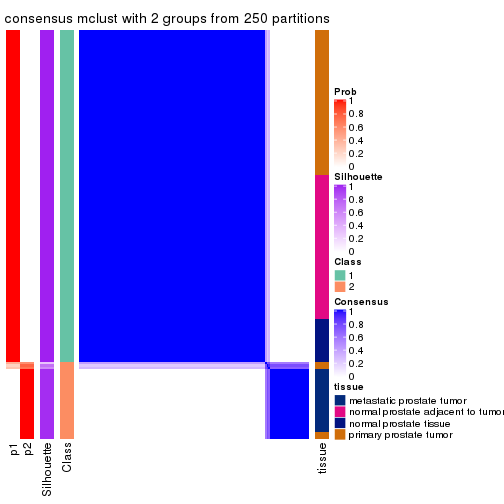</p>

</div>
<div id='tab-ATC-mclust-consensus-heatmap-2'>
<pre><code class="r">consensus_heatmap(res, k = 3)
</code></pre>

<p>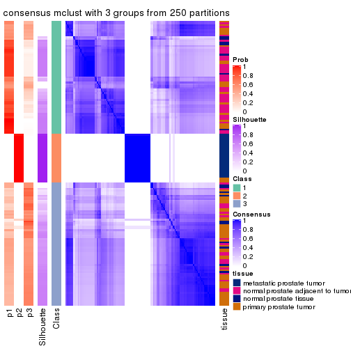</p>

</div>
<div id='tab-ATC-mclust-consensus-heatmap-3'>
<pre><code class="r">consensus_heatmap(res, k = 4)
</code></pre>

<p>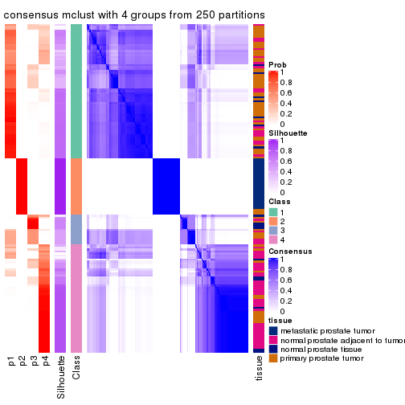</p>

</div>
<div id='tab-ATC-mclust-consensus-heatmap-4'>
<pre><code class="r">consensus_heatmap(res, k = 5)
</code></pre>

<p>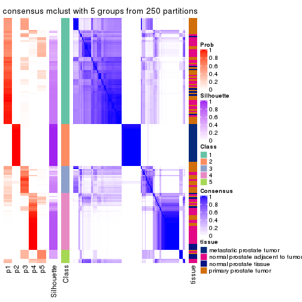</p>

</div>
<div id='tab-ATC-mclust-consensus-heatmap-5'>
<pre><code class="r">consensus_heatmap(res, k = 6)
</code></pre>

<p>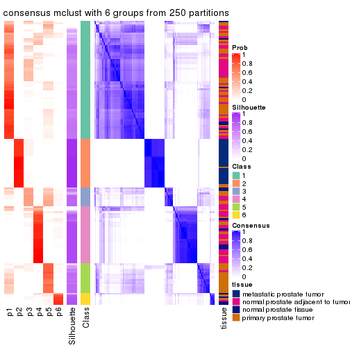</p>

</div>
</div>

Heatmaps for the membership of samples in all partitions to see how consistent they are:


<script>
$( function() {
	$( '#tabs-ATC-mclust-membership-heatmap' ).tabs();
} );
</script>
<div id='tabs-ATC-mclust-membership-heatmap'>
<ul>
<li><a href='#tab-ATC-mclust-membership-heatmap-1'>k = 2</a></li>
<li><a href='#tab-ATC-mclust-membership-heatmap-2'>k = 3</a></li>
<li><a href='#tab-ATC-mclust-membership-heatmap-3'>k = 4</a></li>
<li><a href='#tab-ATC-mclust-membership-heatmap-4'>k = 5</a></li>
<li><a href='#tab-ATC-mclust-membership-heatmap-5'>k = 6</a></li>
</ul>
<div id='tab-ATC-mclust-membership-heatmap-1'>
<pre><code class="r">membership_heatmap(res, k = 2)
</code></pre>

<p>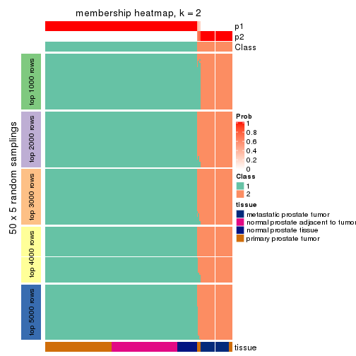</p>

</div>
<div id='tab-ATC-mclust-membership-heatmap-2'>
<pre><code class="r">membership_heatmap(res, k = 3)
</code></pre>

<p>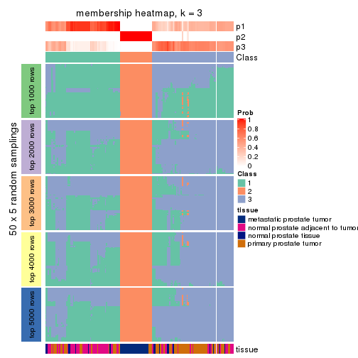</p>

</div>
<div id='tab-ATC-mclust-membership-heatmap-3'>
<pre><code class="r">membership_heatmap(res, k = 4)
</code></pre>

<p>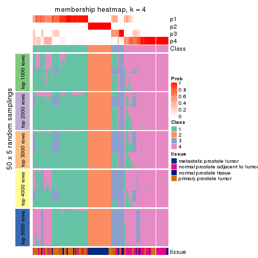</p>

</div>
<div id='tab-ATC-mclust-membership-heatmap-4'>
<pre><code class="r">membership_heatmap(res, k = 5)
</code></pre>

<p></p>

</div>
<div id='tab-ATC-mclust-membership-heatmap-5'>
<pre><code class="r">membership_heatmap(res, k = 6)
</code></pre>

<p>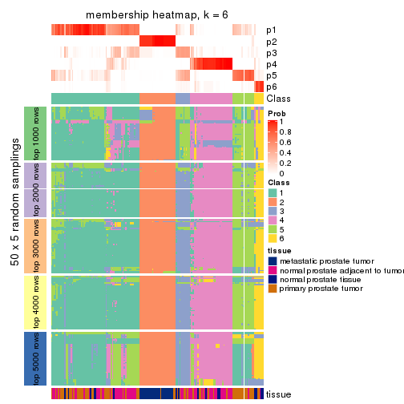</p>

</div>
</div>

As soon as we have had the classes for columns, we can look for signatures
which are significantly different between classes which can be candidate marks
for certain classes. Following are the heatmaps for signatures.


Signature heatmaps where rows are scaled:


<script>
$( function() {
	$( '#tabs-ATC-mclust-get-signatures' ).tabs();
} );
</script>
<div id='tabs-ATC-mclust-get-signatures'>
<ul>
<li><a href='#tab-ATC-mclust-get-signatures-1'>k = 2</a></li>
<li><a href='#tab-ATC-mclust-get-signatures-2'>k = 3</a></li>
<li><a href='#tab-ATC-mclust-get-signatures-3'>k = 4</a></li>
<li><a href='#tab-ATC-mclust-get-signatures-4'>k = 5</a></li>
<li><a href='#tab-ATC-mclust-get-signatures-5'>k = 6</a></li>
</ul>
<div id='tab-ATC-mclust-get-signatures-1'>
<pre><code class="r">get_signatures(res, k = 2)
</code></pre>

<pre><code>#&gt; Error in mat[ceiling(1:nr/h_ratio), ceiling(1:nc/w_ratio), drop = FALSE]: subscript out of bounds
</code></pre>

<p>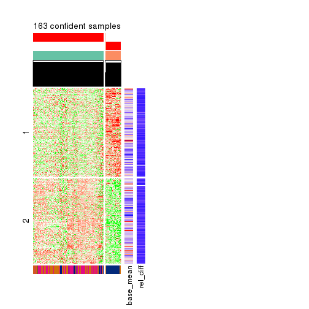</p>

</div>
<div id='tab-ATC-mclust-get-signatures-2'>
<pre><code class="r">get_signatures(res, k = 3)
</code></pre>

<p>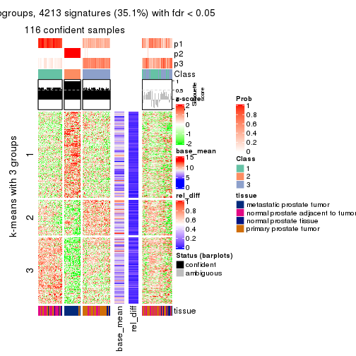</p>

</div>
<div id='tab-ATC-mclust-get-signatures-3'>
<pre><code class="r">get_signatures(res, k = 4)
</code></pre>

<p>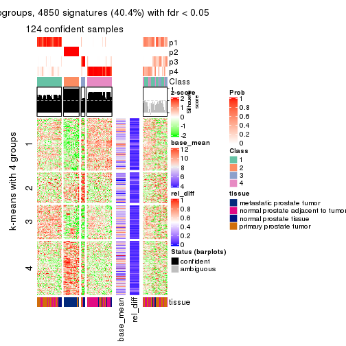</p>

</div>
<div id='tab-ATC-mclust-get-signatures-4'>
<pre><code class="r">get_signatures(res, k = 5)
</code></pre>

<p>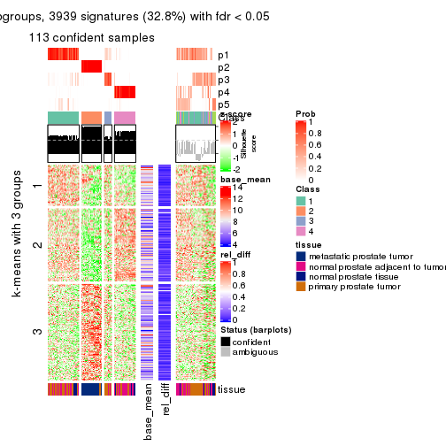</p>

</div>
<div id='tab-ATC-mclust-get-signatures-5'>
<pre><code class="r">get_signatures(res, k = 6)
</code></pre>

<p>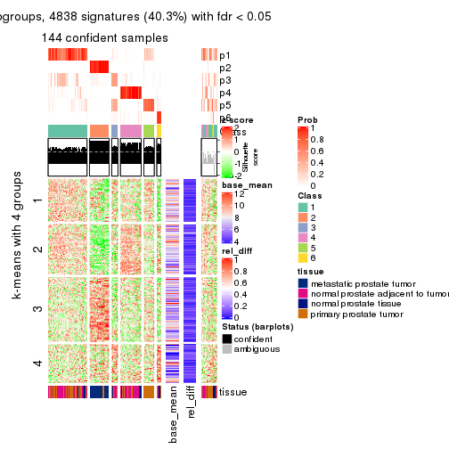</p>

</div>
</div>


Signature heatmaps where rows are not scaled:


<script>
$( function() {
	$( '#tabs-ATC-mclust-get-signatures-no-scale' ).tabs();
} );
</script>
<div id='tabs-ATC-mclust-get-signatures-no-scale'>
<ul>
<li><a href='#tab-ATC-mclust-get-signatures-no-scale-1'>k = 2</a></li>
<li><a href='#tab-ATC-mclust-get-signatures-no-scale-2'>k = 3</a></li>
<li><a href='#tab-ATC-mclust-get-signatures-no-scale-3'>k = 4</a></li>
<li><a href='#tab-ATC-mclust-get-signatures-no-scale-4'>k = 5</a></li>
<li><a href='#tab-ATC-mclust-get-signatures-no-scale-5'>k = 6</a></li>
</ul>
<div id='tab-ATC-mclust-get-signatures-no-scale-1'>
<pre><code class="r">get_signatures(res, k = 2, scale_rows = FALSE)
</code></pre>

<p>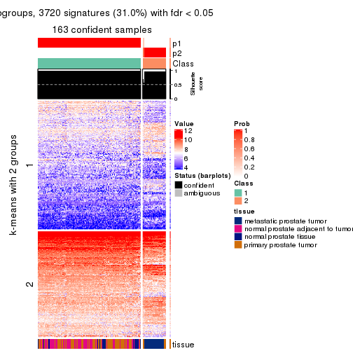</p>

</div>
<div id='tab-ATC-mclust-get-signatures-no-scale-2'>
<pre><code class="r">get_signatures(res, k = 3, scale_rows = FALSE)
</code></pre>

<p>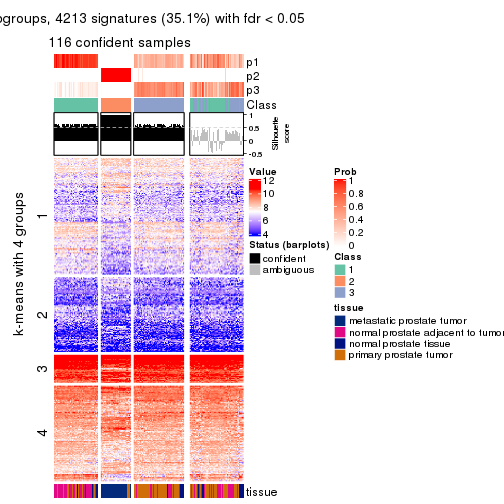</p>

</div>
<div id='tab-ATC-mclust-get-signatures-no-scale-3'>
<pre><code class="r">get_signatures(res, k = 4, scale_rows = FALSE)
</code></pre>

<p>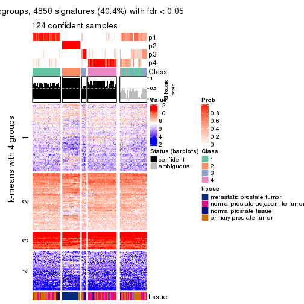</p>

</div>
<div id='tab-ATC-mclust-get-signatures-no-scale-4'>
<pre><code class="r">get_signatures(res, k = 5, scale_rows = FALSE)
</code></pre>

<p>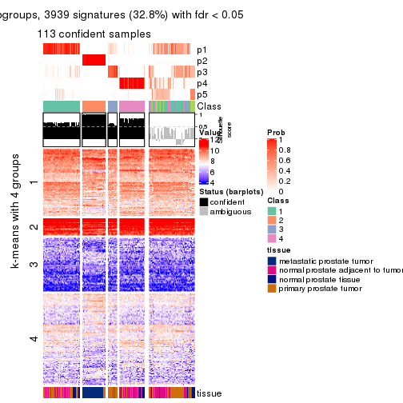</p>

</div>
<div id='tab-ATC-mclust-get-signatures-no-scale-5'>
<pre><code class="r">get_signatures(res, k = 6, scale_rows = FALSE)
</code></pre>

<p>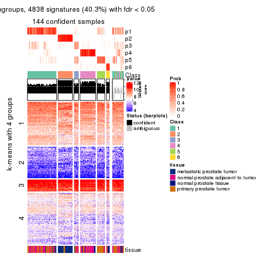</p>

</div>
</div>


Compare the overlap of signatures from different k:

```r
compare_signatures(res)
```

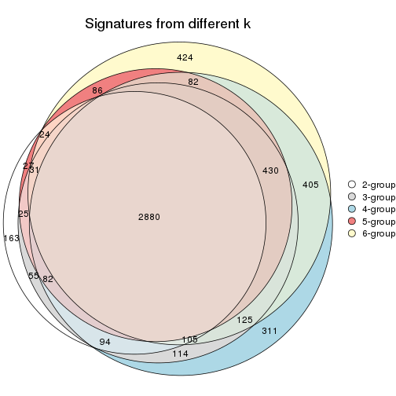

`get_signature()` returns a data frame invisibly. TO get the list of signatures, the function
call should be assigned to a variable explicitly. In following code, if `plot` argument is set
to `FALSE`, no heatmap is plotted while only the differential analysis is performed.

```r
# code only for demonstration
tb = get_signature(res, k = ..., plot = FALSE)
```

An example of the output of `tb` is:

```
#>   which_row         fdr    mean_1    mean_2 scaled_mean_1 scaled_mean_2 km
#> 1        38 0.042760348  8.373488  9.131774    -0.5533452     0.5164555  1
#> 2        40 0.018707592  7.106213  8.469186    -0.6173731     0.5762149  1
#> 3        55 0.019134737 10.221463 11.207825    -0.6159697     0.5749050  1
#> 4        59 0.006059896  5.921854  7.869574    -0.6899429     0.6439467  1
#> 5        60 0.018055526  8.928898 10.211722    -0.6204761     0.5791110  1
#> 6        98 0.009384629 15.714769 14.887706     0.6635654    -0.6193277  2
...
```

The columns in `tb` are:

1. `which_row`: row indices corresponding to the input matrix.
2. `fdr`: FDR for the differential test. 
3. `mean_x`: The mean value in group x.
4. `scaled_mean_x`: The mean value in group x after rows are scaled.
5. `km`: Row groups if k-means clustering is applied to rows.


UMAP plot which shows how samples are separated.


<script>
$( function() {
	$( '#tabs-ATC-mclust-dimension-reduction' ).tabs();
} );
</script>
<div id='tabs-ATC-mclust-dimension-reduction'>
<ul>
<li><a href='#tab-ATC-mclust-dimension-reduction-1'>k = 2</a></li>
<li><a href='#tab-ATC-mclust-dimension-reduction-2'>k = 3</a></li>
<li><a href='#tab-ATC-mclust-dimension-reduction-3'>k = 4</a></li>
<li><a href='#tab-ATC-mclust-dimension-reduction-4'>k = 5</a></li>
<li><a href='#tab-ATC-mclust-dimension-reduction-5'>k = 6</a></li>
</ul>
<div id='tab-ATC-mclust-dimension-reduction-1'>
<pre><code class="r">dimension_reduction(res, k = 2, method = &quot;UMAP&quot;)
</code></pre>

<p>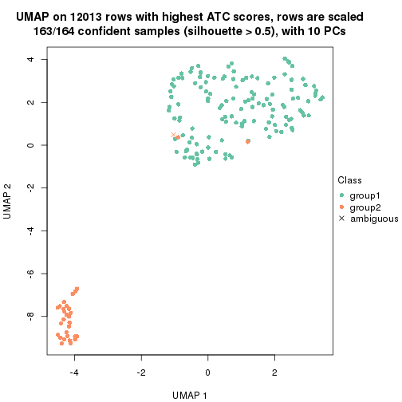</p>

</div>
<div id='tab-ATC-mclust-dimension-reduction-2'>
<pre><code class="r">dimension_reduction(res, k = 3, method = &quot;UMAP&quot;)
</code></pre>

<p>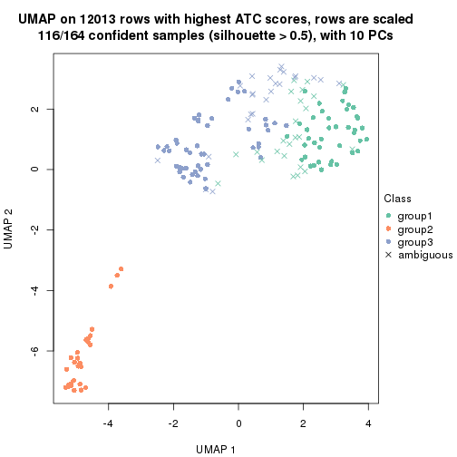</p>

</div>
<div id='tab-ATC-mclust-dimension-reduction-3'>
<pre><code class="r">dimension_reduction(res, k = 4, method = &quot;UMAP&quot;)
</code></pre>

<p>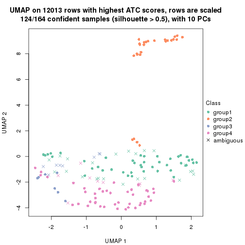</p>

</div>
<div id='tab-ATC-mclust-dimension-reduction-4'>
<pre><code class="r">dimension_reduction(res, k = 5, method = &quot;UMAP&quot;)
</code></pre>

<p>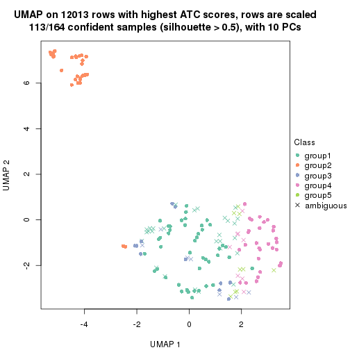</p>

</div>
<div id='tab-ATC-mclust-dimension-reduction-5'>
<pre><code class="r">dimension_reduction(res, k = 6, method = &quot;UMAP&quot;)
</code></pre>

<p>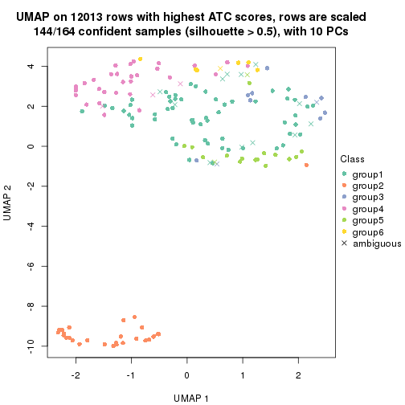</p>

</div>
</div>


Following heatmap shows how subgroups are split when increasing `k`:

```r
collect_classes(res)
```

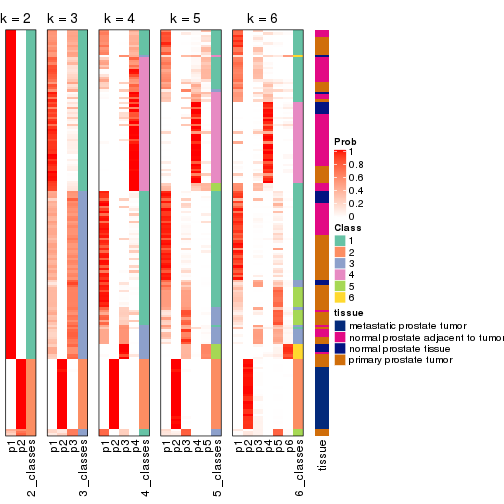


Test correlation between subgroups and known annotations. If the known
annotation is numeric, one-way ANOVA test is applied, and if the known
annotation is discrete, chi-squared contingency table test is applied.

```r
test_to_known_factors(res)
```

```
#>              n tissue(p) k
#> ATC:mclust 163  1.69e-28 2
#> ATC:mclust 116  2.03e-24 3
#> ATC:mclust 124  4.61e-25 4
#> ATC:mclust 113  6.43e-21 5
#> ATC:mclust 144  5.57e-27 6
```


If matrix rows can be associated to genes, consider to use `functional_enrichment(res,
...)` to perform function enrichment for the signature genes. See [this vignette](http://bioconductor.org/packages/devel/bioc/vignettes/cola/inst/doc/functional_enrichment.html) for more detailed explanations.


 

---------------------------------------------------


### ATC:NMF*


The object with results only for a single top-value method and a single partition method 
can be extracted as:

```r
res = res_list["ATC", "NMF"]
# you can also extract it by
# res = res_list["ATC:NMF"]
```

A summary of `res` and all the functions that can be applied to it:

```r
res
```

```
#> A 'ConsensusPartition' object with k = 2, 3, 4, 5, 6.
#>   On a matrix with 12013 rows and 164 columns.
#>   Top rows (1000, 2000, 3000, 4000, 5000) are extracted by 'ATC' method.
#>   Subgroups are detected by 'NMF' method.
#>   Performed in total 1250 partitions by row resampling.
#>   Best k for subgroups seems to be 2.
#> 
#> Following methods can be applied to this 'ConsensusPartition' object:
#>  [1] "cola_report"             "collect_classes"         "collect_plots"          
#>  [4] "collect_stats"           "colnames"                "compare_signatures"     
#>  [7] "consensus_heatmap"       "dimension_reduction"     "functional_enrichment"  
#> [10] "get_anno_col"            "get_anno"                "get_classes"            
#> [13] "get_consensus"           "get_matrix"              "get_membership"         
#> [16] "get_param"               "get_signatures"          "get_stats"              
#> [19] "is_best_k"               "is_stable_k"             "membership_heatmap"     
#> [22] "ncol"                    "nrow"                    "plot_ecdf"              
#> [25] "rownames"                "select_partition_number" "show"                   
#> [28] "suggest_best_k"          "test_to_known_factors"
```

`collect_plots()` function collects all the plots made from `res` for all `k` (number of partitions)
into one single page to provide an easy and fast comparison between different `k`.

```r
collect_plots(res)
```

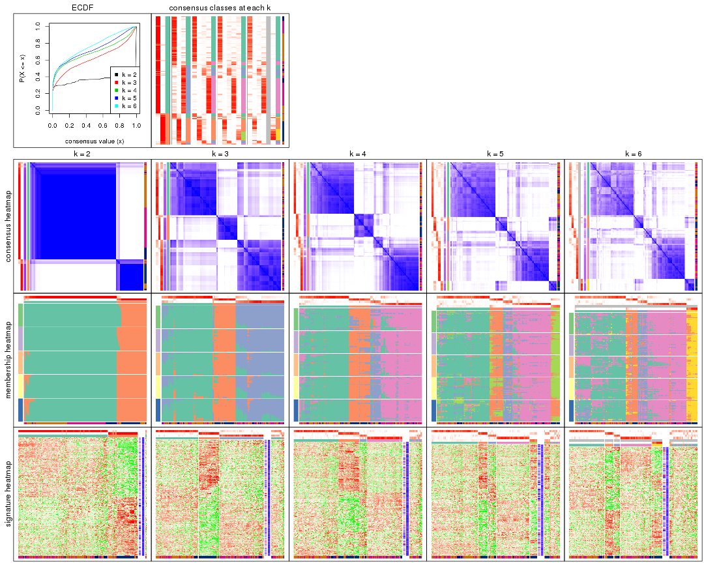

The plots are:

- The first row: a plot of the ECDF (empirical cumulative distribution
  function) curves of the consensus matrix for each `k` and the heatmap of
  predicted classes for each `k`.
- The second row: heatmaps of the consensus matrix for each `k`.
- The third row: heatmaps of the membership matrix for each `k`.
- The fouth row: heatmaps of the signatures for each `k`.

All the plots in panels can be made by individual functions and they are
plotted later in this section.

`select_partition_number()` produces several plots showing different
statistics for choosing "optimized" `k`. There are following statistics:

- ECDF curves of the consensus matrix for each `k`;
- 1-PAC. [The PAC
  score](https://en.wikipedia.org/wiki/Consensus_clustering#Over-interpretation_potential_of_consensus_clustering)
  measures the proportion of the ambiguous subgrouping.
- Mean silhouette score.
- Concordance. The mean probability of fiting the consensus class ids in all
  partitions.
- Area increased. Denote $A_k$ as the area under the ECDF curve for current
  `k`, the area increased is defined as $A_k - A_{k-1}$.
- Rand index. The percent of pairs of samples that are both in a same cluster
  or both are not in a same cluster in the partition of k and k-1.
- Jaccard index. The ratio of pairs of samples are both in a same cluster in
  the partition of k and k-1 and the pairs of samples are both in a same
  cluster in the partition k or k-1.

The detailed explanations of these statistics can be found in [the _cola_
vignette](http://bioconductor.org/packages/devel/bioc/vignettes/cola/inst/doc/cola.html#toc_13).

Generally speaking, lower PAC score, higher mean silhouette score or higher
concordance corresponds to better partition. Rand index and Jaccard index
measure how similar the current partition is compared to partition with `k-1`.
If they are too similar, we won't accept `k` is better than `k-1`.

```r
select_partition_number(res)
```

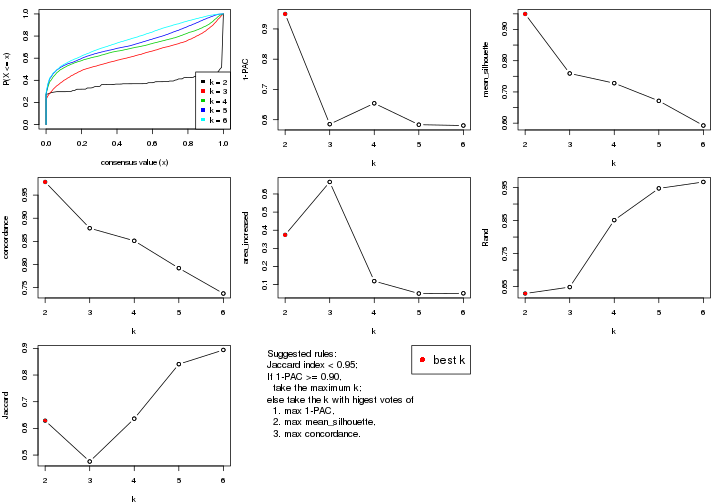

The numeric values for all these statistics can be obtained by `get_stats()`.

```r
get_stats(res)
```

```
#>   k 1-PAC mean_silhouette concordance area_increased  Rand Jaccard
#> 2 2 0.949           0.950       0.978         0.3744 0.629   0.629
#> 3 3 0.585           0.759       0.878         0.6662 0.648   0.476
#> 4 4 0.654           0.728       0.851         0.1191 0.851   0.636
#> 5 5 0.584           0.671       0.792         0.0507 0.947   0.841
#> 6 6 0.581           0.592       0.737         0.0519 0.967   0.894
```

`suggest_best_k()` suggests the best $k$ based on these statistics. The rules are as follows:

- All $k$ with Jaccard index larger than 0.95 are removed because increasing
  $k$ does not provide enough extra information. If all $k$ are removed, it is
  marked as no subgroup is detected.
- For all $k$ with 1-PAC score larger than 0.9, the maximal $k$ is taken as
  the best $k$, and other $k$ are marked as optional $k$.
- If it does not fit the second rule. The $k$ with the maximal vote of the
  highest 1-PAC score, highest mean silhouette, and highest concordance is
  taken as the best $k$.

```r
suggest_best_k(res)
```

```
#> [1] 2
```


Following shows the table of the partitions (You need to click the **show/hide
code output** link to see it). The membership matrix (columns with name `p*`)
is inferred by
[`clue::cl_consensus()`](https://www.rdocumentation.org/link/cl_consensus?package=clue)
function with the `SE` method. Basically the value in the membership matrix
represents the probability to belong to a certain group. The finall class
label for an item is determined with the group with highest probability it
belongs to.

In `get_classes()` function, the entropy is calculated from the membership
matrix and the silhouette score is calculated from the consensus matrix.


<script>
$( function() {
	$( '#tabs-ATC-NMF-get-classes' ).tabs();
} );
</script>
<div id='tabs-ATC-NMF-get-classes'>
<ul>
<li><a href='#tab-ATC-NMF-get-classes-1'>k = 2</a></li>
<li><a href='#tab-ATC-NMF-get-classes-2'>k = 3</a></li>
<li><a href='#tab-ATC-NMF-get-classes-3'>k = 4</a></li>
<li><a href='#tab-ATC-NMF-get-classes-4'>k = 5</a></li>
<li><a href='#tab-ATC-NMF-get-classes-5'>k = 6</a></li>
</ul>

<div id='tab-ATC-NMF-get-classes-1'>
<p><a id='tab-ATC-NMF-get-classes-1-a' style='color:#0366d6' href='#'>show/hide code output</a></p>
<pre><code class="r">cbind(get_classes(res, k = 2), get_membership(res, k = 2))
</code></pre>

<pre><code>#&gt;           class entropy silhouette    p1    p2
#&gt; GSM152839     1  0.0000      0.982 1.000 0.000
#&gt; GSM152840     1  0.0000      0.982 1.000 0.000
#&gt; GSM152841     1  0.0000      0.982 1.000 0.000
#&gt; GSM152842     1  0.0000      0.982 1.000 0.000
#&gt; GSM152843     1  0.0000      0.982 1.000 0.000
#&gt; GSM152844     1  0.0000      0.982 1.000 0.000
#&gt; GSM152845     2  0.0000      0.962 0.000 1.000
#&gt; GSM152846     1  0.1633      0.962 0.976 0.024
#&gt; GSM152847     1  0.0000      0.982 1.000 0.000
#&gt; GSM152848     1  0.0000      0.982 1.000 0.000
#&gt; GSM152849     1  0.0000      0.982 1.000 0.000
#&gt; GSM152850     1  0.0000      0.982 1.000 0.000
#&gt; GSM152851     1  0.0000      0.982 1.000 0.000
#&gt; GSM152852     1  0.0000      0.982 1.000 0.000
#&gt; GSM152853     1  0.0000      0.982 1.000 0.000
#&gt; GSM152854     1  0.0000      0.982 1.000 0.000
#&gt; GSM152855     1  0.0000      0.982 1.000 0.000
#&gt; GSM153238     1  0.0000      0.982 1.000 0.000
#&gt; GSM153239     1  0.0000      0.982 1.000 0.000
#&gt; GSM153240     1  0.0000      0.982 1.000 0.000
#&gt; GSM153241     1  0.0000      0.982 1.000 0.000
#&gt; GSM153242     1  0.9866      0.219 0.568 0.432
#&gt; GSM153243     2  0.8327      0.663 0.264 0.736
#&gt; GSM153244     1  0.5294      0.857 0.880 0.120
#&gt; GSM153245     1  0.0000      0.982 1.000 0.000
#&gt; GSM153246     1  0.0000      0.982 1.000 0.000
#&gt; GSM153247     1  0.0000      0.982 1.000 0.000
#&gt; GSM153248     1  0.0000      0.982 1.000 0.000
#&gt; GSM153249     1  0.0000      0.982 1.000 0.000
#&gt; GSM153250     1  0.0000      0.982 1.000 0.000
#&gt; GSM153251     2  0.8955      0.572 0.312 0.688
#&gt; GSM153252     1  0.0000      0.982 1.000 0.000
#&gt; GSM153253     1  0.0000      0.982 1.000 0.000
#&gt; GSM153254     1  0.1184      0.969 0.984 0.016
#&gt; GSM153255     1  0.0000      0.982 1.000 0.000
#&gt; GSM153256     1  0.0000      0.982 1.000 0.000
#&gt; GSM153257     1  0.0000      0.982 1.000 0.000
#&gt; GSM153258     1  0.0000      0.982 1.000 0.000
#&gt; GSM153259     1  0.0000      0.982 1.000 0.000
#&gt; GSM153260     1  0.6438      0.799 0.836 0.164
#&gt; GSM153261     1  0.0672      0.975 0.992 0.008
#&gt; GSM153262     1  0.0000      0.982 1.000 0.000
#&gt; GSM153263     1  0.0000      0.982 1.000 0.000
#&gt; GSM153264     1  0.0000      0.982 1.000 0.000
#&gt; GSM153265     1  0.0000      0.982 1.000 0.000
#&gt; GSM153266     1  0.0000      0.982 1.000 0.000
#&gt; GSM153267     1  0.0000      0.982 1.000 0.000
#&gt; GSM153268     1  0.0000      0.982 1.000 0.000
#&gt; GSM153269     1  0.0000      0.982 1.000 0.000
#&gt; GSM153270     1  0.0000      0.982 1.000 0.000
#&gt; GSM153271     1  0.0000      0.982 1.000 0.000
#&gt; GSM153272     1  0.0000      0.982 1.000 0.000
#&gt; GSM153273     1  0.0000      0.982 1.000 0.000
#&gt; GSM153274     1  0.0000      0.982 1.000 0.000
#&gt; GSM153275     1  0.0000      0.982 1.000 0.000
#&gt; GSM153276     1  0.0000      0.982 1.000 0.000
#&gt; GSM153277     1  0.0000      0.982 1.000 0.000
#&gt; GSM153278     1  0.0000      0.982 1.000 0.000
#&gt; GSM153279     1  0.0000      0.982 1.000 0.000
#&gt; GSM153280     1  0.0000      0.982 1.000 0.000
#&gt; GSM153281     1  0.0000      0.982 1.000 0.000
#&gt; GSM153282     1  0.0000      0.982 1.000 0.000
#&gt; GSM153283     1  0.0000      0.982 1.000 0.000
#&gt; GSM153284     1  0.0000      0.982 1.000 0.000
#&gt; GSM153285     1  0.0000      0.982 1.000 0.000
#&gt; GSM153286     1  0.0000      0.982 1.000 0.000
#&gt; GSM153287     1  0.0000      0.982 1.000 0.000
#&gt; GSM153288     1  0.0000      0.982 1.000 0.000
#&gt; GSM153289     1  0.0000      0.982 1.000 0.000
#&gt; GSM153290     1  0.0000      0.982 1.000 0.000
#&gt; GSM153291     1  0.0000      0.982 1.000 0.000
#&gt; GSM153292     1  0.0000      0.982 1.000 0.000
#&gt; GSM153293     1  0.0000      0.982 1.000 0.000
#&gt; GSM153294     1  0.0000      0.982 1.000 0.000
#&gt; GSM153295     1  0.0000      0.982 1.000 0.000
#&gt; GSM153054     1  0.0000      0.982 1.000 0.000
#&gt; GSM153055     1  0.0000      0.982 1.000 0.000
#&gt; GSM153056     1  0.0000      0.982 1.000 0.000
#&gt; GSM153057     1  0.2778      0.938 0.952 0.048
#&gt; GSM153058     1  0.8499      0.615 0.724 0.276
#&gt; GSM153059     2  0.6438      0.806 0.164 0.836
#&gt; GSM153060     1  0.0000      0.982 1.000 0.000
#&gt; GSM153061     1  0.0000      0.982 1.000 0.000
#&gt; GSM153062     2  0.0000      0.962 0.000 1.000
#&gt; GSM153063     1  0.0000      0.982 1.000 0.000
#&gt; GSM153064     1  0.0000      0.982 1.000 0.000
#&gt; GSM153065     2  0.8861      0.589 0.304 0.696
#&gt; GSM153066     2  0.0000      0.962 0.000 1.000
#&gt; GSM153067     1  0.0000      0.982 1.000 0.000
#&gt; GSM153068     1  0.9635      0.353 0.612 0.388
#&gt; GSM153069     1  0.0000      0.982 1.000 0.000
#&gt; GSM153070     1  0.0000      0.982 1.000 0.000
#&gt; GSM153071     1  0.0000      0.982 1.000 0.000
#&gt; GSM153072     1  0.0000      0.982 1.000 0.000
#&gt; GSM153073     1  0.0000      0.982 1.000 0.000
#&gt; GSM153074     1  0.0000      0.982 1.000 0.000
#&gt; GSM153075     1  0.0000      0.982 1.000 0.000
#&gt; GSM153076     1  0.0000      0.982 1.000 0.000
#&gt; GSM153077     1  0.0000      0.982 1.000 0.000
#&gt; GSM153078     1  0.0000      0.982 1.000 0.000
#&gt; GSM153079     1  0.0000      0.982 1.000 0.000
#&gt; GSM153080     1  0.0000      0.982 1.000 0.000
#&gt; GSM153081     1  0.0000      0.982 1.000 0.000
#&gt; GSM153082     1  0.1843      0.958 0.972 0.028
#&gt; GSM153083     1  0.1633      0.962 0.976 0.024
#&gt; GSM153084     2  0.0000      0.962 0.000 1.000
#&gt; GSM153085     1  0.8207      0.652 0.744 0.256
#&gt; GSM153086     1  0.0000      0.982 1.000 0.000
#&gt; GSM153087     1  0.0000      0.982 1.000 0.000
#&gt; GSM153088     1  0.0000      0.982 1.000 0.000
#&gt; GSM153089     2  0.7815      0.714 0.232 0.768
#&gt; GSM153090     1  0.0000      0.982 1.000 0.000
#&gt; GSM153091     1  0.2236      0.950 0.964 0.036
#&gt; GSM153092     1  0.0000      0.982 1.000 0.000
#&gt; GSM153093     1  0.0000      0.982 1.000 0.000
#&gt; GSM153094     1  0.3274      0.926 0.940 0.060
#&gt; GSM153095     1  0.0000      0.982 1.000 0.000
#&gt; GSM153096     1  0.0000      0.982 1.000 0.000
#&gt; GSM153097     1  0.0376      0.979 0.996 0.004
#&gt; GSM153098     1  0.0000      0.982 1.000 0.000
#&gt; GSM153099     1  0.0000      0.982 1.000 0.000
#&gt; GSM153100     1  0.0000      0.982 1.000 0.000
#&gt; GSM153101     1  0.0000      0.982 1.000 0.000
#&gt; GSM153102     1  0.7674      0.708 0.776 0.224
#&gt; GSM153103     1  0.0000      0.982 1.000 0.000
#&gt; GSM153104     1  0.0000      0.982 1.000 0.000
#&gt; GSM153106     1  0.0000      0.982 1.000 0.000
#&gt; GSM153107     1  0.0000      0.982 1.000 0.000
#&gt; GSM153108     1  0.0000      0.982 1.000 0.000
#&gt; GSM153109     2  0.6048      0.825 0.148 0.852
#&gt; GSM153110     1  0.0000      0.982 1.000 0.000
#&gt; GSM153111     1  0.1184      0.969 0.984 0.016
#&gt; GSM153112     1  0.0000      0.982 1.000 0.000
#&gt; GSM153113     2  0.0000      0.962 0.000 1.000
#&gt; GSM153114     1  0.0000      0.982 1.000 0.000
#&gt; GSM187532     2  0.0000      0.962 0.000 1.000
#&gt; GSM187533     2  0.0000      0.962 0.000 1.000
#&gt; GSM187534     2  0.0000      0.962 0.000 1.000
#&gt; GSM187535     2  0.0000      0.962 0.000 1.000
#&gt; GSM152906     2  0.0000      0.962 0.000 1.000
#&gt; GSM152907     2  0.0000      0.962 0.000 1.000
#&gt; GSM152908     2  0.0000      0.962 0.000 1.000
#&gt; GSM152909     2  0.0000      0.962 0.000 1.000
#&gt; GSM152910     2  0.0000      0.962 0.000 1.000
#&gt; GSM152911     2  0.0000      0.962 0.000 1.000
#&gt; GSM152912     2  0.0000      0.962 0.000 1.000
#&gt; GSM152913     2  0.0000      0.962 0.000 1.000
#&gt; GSM152914     2  0.0000      0.962 0.000 1.000
#&gt; GSM152915     2  0.0000      0.962 0.000 1.000
#&gt; GSM152916     2  0.0000      0.962 0.000 1.000
#&gt; GSM152917     2  0.0000      0.962 0.000 1.000
#&gt; GSM152918     2  0.0000      0.962 0.000 1.000
#&gt; GSM152919     2  0.0000      0.962 0.000 1.000
#&gt; GSM152920     2  0.0000      0.962 0.000 1.000
#&gt; GSM152921     2  0.0000      0.962 0.000 1.000
#&gt; GSM152922     2  0.0000      0.962 0.000 1.000
#&gt; GSM152923     2  0.0000      0.962 0.000 1.000
#&gt; GSM152924     2  0.0000      0.962 0.000 1.000
#&gt; GSM152925     2  0.0000      0.962 0.000 1.000
#&gt; GSM152926     2  0.0000      0.962 0.000 1.000
#&gt; GSM152927     2  0.0000      0.962 0.000 1.000
#&gt; GSM152928     2  0.0000      0.962 0.000 1.000
#&gt; GSM152929     2  0.0000      0.962 0.000 1.000
#&gt; GSM152930     2  0.0000      0.962 0.000 1.000
</code></pre>

<script>
$('#tab-ATC-NMF-get-classes-1-a').parent().next().next().hide();
$('#tab-ATC-NMF-get-classes-1-a').click(function(){
  $('#tab-ATC-NMF-get-classes-1-a').parent().next().next().toggle();
  return(false);
});
</script>
</div>

<div id='tab-ATC-NMF-get-classes-2'>
<p><a id='tab-ATC-NMF-get-classes-2-a' style='color:#0366d6' href='#'>show/hide code output</a></p>
<pre><code class="r">cbind(get_classes(res, k = 3), get_membership(res, k = 3))
</code></pre>

<pre><code>#&gt;           class entropy silhouette    p1    p2    p3
#&gt; GSM152839     1  0.6305    -0.0532 0.516 0.000 0.484
#&gt; GSM152840     3  0.1031     0.8414 0.024 0.000 0.976
#&gt; GSM152841     3  0.1753     0.8490 0.048 0.000 0.952
#&gt; GSM152842     1  0.1753     0.8523 0.952 0.000 0.048
#&gt; GSM152843     1  0.1964     0.8479 0.944 0.000 0.056
#&gt; GSM152844     3  0.0424     0.8334 0.008 0.000 0.992
#&gt; GSM152845     2  0.6204     0.3754 0.000 0.576 0.424
#&gt; GSM152846     3  0.1860     0.7915 0.000 0.052 0.948
#&gt; GSM152847     1  0.4555     0.7105 0.800 0.000 0.200
#&gt; GSM152848     1  0.2165     0.8432 0.936 0.000 0.064
#&gt; GSM152849     3  0.5621     0.6501 0.308 0.000 0.692
#&gt; GSM152850     1  0.1411     0.8573 0.964 0.000 0.036
#&gt; GSM152851     3  0.0829     0.8341 0.012 0.004 0.984
#&gt; GSM152852     3  0.1529     0.8001 0.000 0.040 0.960
#&gt; GSM152853     3  0.0000     0.8285 0.000 0.000 1.000
#&gt; GSM152854     3  0.0892     0.8148 0.000 0.020 0.980
#&gt; GSM152855     3  0.4235     0.8133 0.176 0.000 0.824
#&gt; GSM153238     1  0.0000     0.8559 1.000 0.000 0.000
#&gt; GSM153239     3  0.1031     0.8414 0.024 0.000 0.976
#&gt; GSM153240     3  0.3816     0.8315 0.148 0.000 0.852
#&gt; GSM153241     3  0.4605     0.7866 0.204 0.000 0.796
#&gt; GSM153242     3  0.3267     0.7297 0.000 0.116 0.884
#&gt; GSM153243     1  0.3941     0.7133 0.844 0.156 0.000
#&gt; GSM153244     3  0.2066     0.7854 0.000 0.060 0.940
#&gt; GSM153245     3  0.1163     0.8431 0.028 0.000 0.972
#&gt; GSM153246     3  0.2261     0.8518 0.068 0.000 0.932
#&gt; GSM153247     1  0.1411     0.8581 0.964 0.000 0.036
#&gt; GSM153248     1  0.0592     0.8508 0.988 0.012 0.000
#&gt; GSM153249     3  0.3038     0.8479 0.104 0.000 0.896
#&gt; GSM153250     1  0.1289     0.8575 0.968 0.000 0.032
#&gt; GSM153251     3  0.4504     0.6226 0.000 0.196 0.804
#&gt; GSM153252     3  0.5560     0.6660 0.300 0.000 0.700
#&gt; GSM153253     3  0.1964     0.8500 0.056 0.000 0.944
#&gt; GSM153254     3  0.0424     0.8235 0.000 0.008 0.992
#&gt; GSM153255     3  0.4002     0.8248 0.160 0.000 0.840
#&gt; GSM153256     1  0.5810     0.4460 0.664 0.000 0.336
#&gt; GSM153257     3  0.6252     0.3309 0.444 0.000 0.556
#&gt; GSM153258     1  0.1643     0.8542 0.956 0.000 0.044
#&gt; GSM153259     1  0.0424     0.8581 0.992 0.000 0.008
#&gt; GSM153260     1  0.1647     0.8575 0.960 0.004 0.036
#&gt; GSM153261     3  0.2878     0.8468 0.096 0.000 0.904
#&gt; GSM153262     3  0.2796     0.8498 0.092 0.000 0.908
#&gt; GSM153263     1  0.1643     0.8540 0.956 0.000 0.044
#&gt; GSM153264     1  0.0892     0.8587 0.980 0.000 0.020
#&gt; GSM153265     3  0.1860     0.8496 0.052 0.000 0.948
#&gt; GSM153266     1  0.2625     0.8290 0.916 0.000 0.084
#&gt; GSM153267     1  0.6095     0.2952 0.608 0.000 0.392
#&gt; GSM153268     3  0.0424     0.8334 0.008 0.000 0.992
#&gt; GSM153269     3  0.5968     0.5413 0.364 0.000 0.636
#&gt; GSM153270     3  0.3686     0.8362 0.140 0.000 0.860
#&gt; GSM153271     1  0.1411     0.8567 0.964 0.000 0.036
#&gt; GSM153272     3  0.6252     0.3294 0.444 0.000 0.556
#&gt; GSM153273     1  0.0424     0.8528 0.992 0.008 0.000
#&gt; GSM153274     3  0.5706     0.6325 0.320 0.000 0.680
#&gt; GSM153275     3  0.5138     0.7331 0.252 0.000 0.748
#&gt; GSM153276     3  0.4796     0.7710 0.220 0.000 0.780
#&gt; GSM153277     3  0.2448     0.8508 0.076 0.000 0.924
#&gt; GSM153278     1  0.6140     0.2777 0.596 0.000 0.404
#&gt; GSM153279     3  0.1529     0.8473 0.040 0.000 0.960
#&gt; GSM153280     3  0.0892     0.8148 0.000 0.020 0.980
#&gt; GSM153281     3  0.2959     0.8485 0.100 0.000 0.900
#&gt; GSM153282     3  0.1289     0.8447 0.032 0.000 0.968
#&gt; GSM153283     1  0.1411     0.8567 0.964 0.000 0.036
#&gt; GSM153284     3  0.5591     0.6591 0.304 0.000 0.696
#&gt; GSM153285     3  0.3116     0.8468 0.108 0.000 0.892
#&gt; GSM153286     3  0.6026     0.5139 0.376 0.000 0.624
#&gt; GSM153287     3  0.3686     0.8357 0.140 0.000 0.860
#&gt; GSM153288     3  0.5835     0.5952 0.340 0.000 0.660
#&gt; GSM153289     1  0.6309    -0.1287 0.504 0.000 0.496
#&gt; GSM153290     3  0.0592     0.8356 0.012 0.000 0.988
#&gt; GSM153291     3  0.4002     0.8245 0.160 0.000 0.840
#&gt; GSM153292     3  0.2711     0.8503 0.088 0.000 0.912
#&gt; GSM153293     1  0.4605     0.6972 0.796 0.000 0.204
#&gt; GSM153294     1  0.0592     0.8508 0.988 0.012 0.000
#&gt; GSM153295     1  0.6302    -0.0519 0.520 0.000 0.480
#&gt; GSM153054     1  0.0000     0.8559 1.000 0.000 0.000
#&gt; GSM153055     3  0.6295     0.2219 0.472 0.000 0.528
#&gt; GSM153056     3  0.4121     0.8188 0.168 0.000 0.832
#&gt; GSM153057     3  0.0661     0.8266 0.004 0.008 0.988
#&gt; GSM153058     3  0.2796     0.7564 0.000 0.092 0.908
#&gt; GSM153059     2  0.6299     0.2099 0.000 0.524 0.476
#&gt; GSM153060     3  0.0237     0.8316 0.004 0.000 0.996
#&gt; GSM153061     1  0.3482     0.7941 0.872 0.000 0.128
#&gt; GSM153062     3  0.5706     0.3827 0.000 0.320 0.680
#&gt; GSM153063     3  0.1964     0.8503 0.056 0.000 0.944
#&gt; GSM153064     1  0.0747     0.8589 0.984 0.000 0.016
#&gt; GSM153065     1  0.4062     0.7107 0.836 0.164 0.000
#&gt; GSM153066     1  0.5216     0.5381 0.740 0.260 0.000
#&gt; GSM153067     3  0.5397     0.6989 0.280 0.000 0.720
#&gt; GSM153068     3  0.4324     0.7537 0.028 0.112 0.860
#&gt; GSM153069     3  0.3482     0.8408 0.128 0.000 0.872
#&gt; GSM153070     1  0.2261     0.8409 0.932 0.000 0.068
#&gt; GSM153071     1  0.1860     0.8515 0.948 0.000 0.052
#&gt; GSM153072     1  0.1031     0.8435 0.976 0.024 0.000
#&gt; GSM153073     1  0.0892     0.8587 0.980 0.000 0.020
#&gt; GSM153074     3  0.3941     0.8269 0.156 0.000 0.844
#&gt; GSM153075     3  0.2878     0.8493 0.096 0.000 0.904
#&gt; GSM153076     1  0.1529     0.8555 0.960 0.000 0.040
#&gt; GSM153077     1  0.0237     0.8545 0.996 0.004 0.000
#&gt; GSM153078     1  0.3482     0.7912 0.872 0.000 0.128
#&gt; GSM153079     1  0.0592     0.8508 0.988 0.012 0.000
#&gt; GSM153080     3  0.4842     0.7665 0.224 0.000 0.776
#&gt; GSM153081     1  0.1289     0.8578 0.968 0.000 0.032
#&gt; GSM153082     1  0.1643     0.8297 0.956 0.044 0.000
#&gt; GSM153083     1  0.1860     0.8231 0.948 0.052 0.000
#&gt; GSM153084     2  0.6280     0.2400 0.460 0.540 0.000
#&gt; GSM153085     1  0.1860     0.8234 0.948 0.052 0.000
#&gt; GSM153086     1  0.1411     0.8354 0.964 0.036 0.000
#&gt; GSM153087     3  0.4062     0.8219 0.164 0.000 0.836
#&gt; GSM153088     1  0.1529     0.8555 0.960 0.000 0.040
#&gt; GSM153089     3  0.5431     0.4680 0.000 0.284 0.716
#&gt; GSM153090     1  0.6154     0.2383 0.592 0.000 0.408
#&gt; GSM153091     1  0.1860     0.8231 0.948 0.052 0.000
#&gt; GSM153092     1  0.4750     0.6808 0.784 0.000 0.216
#&gt; GSM153093     3  0.3551     0.8392 0.132 0.000 0.868
#&gt; GSM153094     1  0.1753     0.8265 0.952 0.048 0.000
#&gt; GSM153095     1  0.0237     0.8545 0.996 0.004 0.000
#&gt; GSM153096     1  0.0237     0.8545 0.996 0.004 0.000
#&gt; GSM153097     1  0.1860     0.8231 0.948 0.052 0.000
#&gt; GSM153098     1  0.3879     0.7625 0.848 0.000 0.152
#&gt; GSM153099     1  0.6140     0.2572 0.596 0.000 0.404
#&gt; GSM153100     1  0.1529     0.8566 0.960 0.000 0.040
#&gt; GSM153101     1  0.0424     0.8581 0.992 0.000 0.008
#&gt; GSM153102     1  0.1989     0.8494 0.948 0.004 0.048
#&gt; GSM153103     1  0.1753     0.8265 0.952 0.048 0.000
#&gt; GSM153104     3  0.3482     0.8409 0.128 0.000 0.872
#&gt; GSM153106     1  0.6111     0.2842 0.604 0.000 0.396
#&gt; GSM153107     1  0.0747     0.8589 0.984 0.000 0.016
#&gt; GSM153108     1  0.5098     0.6280 0.752 0.000 0.248
#&gt; GSM153109     1  0.3340     0.7475 0.880 0.120 0.000
#&gt; GSM153110     1  0.0237     0.8545 0.996 0.004 0.000
#&gt; GSM153111     1  0.1860     0.8231 0.948 0.052 0.000
#&gt; GSM153112     1  0.0747     0.8589 0.984 0.000 0.016
#&gt; GSM153113     1  0.5760     0.3887 0.672 0.328 0.000
#&gt; GSM153114     3  0.2066     0.8504 0.060 0.000 0.940
#&gt; GSM187532     2  0.1529     0.8934 0.000 0.960 0.040
#&gt; GSM187533     2  0.0475     0.9102 0.004 0.992 0.004
#&gt; GSM187534     2  0.1163     0.9117 0.028 0.972 0.000
#&gt; GSM187535     1  0.4750     0.6124 0.784 0.216 0.000
#&gt; GSM152906     2  0.3551     0.8526 0.132 0.868 0.000
#&gt; GSM152907     2  0.0424     0.9087 0.000 0.992 0.008
#&gt; GSM152908     2  0.0237     0.9091 0.000 0.996 0.004
#&gt; GSM152909     2  0.2448     0.8699 0.000 0.924 0.076
#&gt; GSM152910     2  0.0892     0.9037 0.000 0.980 0.020
#&gt; GSM152911     2  0.0592     0.9115 0.012 0.988 0.000
#&gt; GSM152912     2  0.1031     0.9020 0.000 0.976 0.024
#&gt; GSM152913     2  0.1163     0.9000 0.000 0.972 0.028
#&gt; GSM152914     2  0.1289     0.9112 0.032 0.968 0.000
#&gt; GSM152915     2  0.0892     0.9118 0.020 0.980 0.000
#&gt; GSM152916     2  0.1031     0.9119 0.024 0.976 0.000
#&gt; GSM152917     2  0.1860     0.9050 0.052 0.948 0.000
#&gt; GSM152918     2  0.3482     0.8562 0.128 0.872 0.000
#&gt; GSM152919     2  0.2625     0.8890 0.084 0.916 0.000
#&gt; GSM152920     2  0.0000     0.9099 0.000 1.000 0.000
#&gt; GSM152921     2  0.0237     0.9091 0.000 0.996 0.004
#&gt; GSM152922     2  0.1031     0.9020 0.000 0.976 0.024
#&gt; GSM152923     2  0.2356     0.8961 0.072 0.928 0.000
#&gt; GSM152924     2  0.1411     0.9103 0.036 0.964 0.000
#&gt; GSM152925     2  0.1163     0.9117 0.028 0.972 0.000
#&gt; GSM152926     2  0.3038     0.8753 0.104 0.896 0.000
#&gt; GSM152927     2  0.1289     0.9112 0.032 0.968 0.000
#&gt; GSM152928     2  0.4346     0.7977 0.184 0.816 0.000
#&gt; GSM152929     2  0.4178     0.8117 0.172 0.828 0.000
#&gt; GSM152930     2  0.2261     0.8982 0.068 0.932 0.000
</code></pre>

<script>
$('#tab-ATC-NMF-get-classes-2-a').parent().next().next().hide();
$('#tab-ATC-NMF-get-classes-2-a').click(function(){
  $('#tab-ATC-NMF-get-classes-2-a').parent().next().next().toggle();
  return(false);
});
</script>
</div>

<div id='tab-ATC-NMF-get-classes-3'>
<p><a id='tab-ATC-NMF-get-classes-3-a' style='color:#0366d6' href='#'>show/hide code output</a></p>
<pre><code class="r">cbind(get_classes(res, k = 4), get_membership(res, k = 4))
</code></pre>

<pre><code>#&gt;           class entropy silhouette    p1    p2    p3    p4
#&gt; GSM152839     1  0.2761    0.83605 0.904 0.000 0.048 0.048
#&gt; GSM152840     4  0.1022    0.81979 0.000 0.000 0.032 0.968
#&gt; GSM152841     4  0.0707    0.82543 0.000 0.000 0.020 0.980
#&gt; GSM152842     1  0.1389    0.85264 0.952 0.000 0.048 0.000
#&gt; GSM152843     1  0.1109    0.86035 0.968 0.000 0.028 0.004
#&gt; GSM152844     4  0.2704    0.73581 0.000 0.000 0.124 0.876
#&gt; GSM152845     3  0.4071    0.56867 0.000 0.104 0.832 0.064
#&gt; GSM152846     3  0.5161    0.51411 0.000 0.008 0.592 0.400
#&gt; GSM152847     1  0.1867    0.84440 0.928 0.000 0.072 0.000
#&gt; GSM152848     1  0.1297    0.86041 0.964 0.000 0.016 0.020
#&gt; GSM152849     1  0.4916    0.68590 0.760 0.000 0.184 0.056
#&gt; GSM152850     1  0.1109    0.85681 0.968 0.000 0.028 0.004
#&gt; GSM152851     4  0.0817    0.82531 0.000 0.000 0.024 0.976
#&gt; GSM152852     3  0.4888    0.48862 0.000 0.000 0.588 0.412
#&gt; GSM152853     4  0.2081    0.77753 0.000 0.000 0.084 0.916
#&gt; GSM152854     3  0.4837    0.59670 0.004 0.000 0.648 0.348
#&gt; GSM152855     4  0.1209    0.82270 0.032 0.000 0.004 0.964
#&gt; GSM153238     1  0.1022    0.85779 0.968 0.000 0.032 0.000
#&gt; GSM153239     4  0.2921    0.71884 0.000 0.000 0.140 0.860
#&gt; GSM153240     4  0.1284    0.82598 0.012 0.000 0.024 0.964
#&gt; GSM153241     1  0.6134    0.57972 0.668 0.000 0.216 0.116
#&gt; GSM153242     3  0.4933    0.65241 0.000 0.016 0.688 0.296
#&gt; GSM153243     1  0.3105    0.79867 0.856 0.004 0.140 0.000
#&gt; GSM153244     4  0.2466    0.76463 0.000 0.004 0.096 0.900
#&gt; GSM153245     4  0.1211    0.81668 0.000 0.000 0.040 0.960
#&gt; GSM153246     3  0.7180    0.35328 0.348 0.000 0.504 0.148
#&gt; GSM153247     1  0.5193    0.72382 0.772 0.024 0.044 0.160
#&gt; GSM153248     1  0.1975    0.84714 0.936 0.016 0.048 0.000
#&gt; GSM153249     4  0.0657    0.82667 0.004 0.000 0.012 0.984
#&gt; GSM153250     1  0.1443    0.85611 0.960 0.004 0.008 0.028
#&gt; GSM153251     4  0.5856   -0.01784 0.000 0.036 0.408 0.556
#&gt; GSM153252     4  0.2021    0.80700 0.056 0.000 0.012 0.932
#&gt; GSM153253     4  0.0921    0.82518 0.000 0.000 0.028 0.972
#&gt; GSM153254     4  0.3982    0.58554 0.000 0.004 0.220 0.776
#&gt; GSM153255     4  0.1182    0.82700 0.016 0.000 0.016 0.968
#&gt; GSM153256     4  0.5222    0.51804 0.280 0.000 0.032 0.688
#&gt; GSM153257     4  0.2521    0.79653 0.064 0.000 0.024 0.912
#&gt; GSM153258     1  0.0779    0.85782 0.980 0.000 0.016 0.004
#&gt; GSM153259     1  0.1302    0.85262 0.956 0.000 0.044 0.000
#&gt; GSM153260     1  0.4428    0.62328 0.720 0.000 0.276 0.004
#&gt; GSM153261     3  0.5990    0.39506 0.336 0.000 0.608 0.056
#&gt; GSM153262     4  0.0707    0.82431 0.000 0.000 0.020 0.980
#&gt; GSM153263     1  0.2174    0.84570 0.928 0.000 0.020 0.052
#&gt; GSM153264     1  0.0524    0.85867 0.988 0.000 0.008 0.004
#&gt; GSM153265     4  0.0592    0.82493 0.000 0.000 0.016 0.984
#&gt; GSM153266     1  0.0817    0.85664 0.976 0.000 0.024 0.000
#&gt; GSM153267     1  0.5174    0.42830 0.620 0.000 0.012 0.368
#&gt; GSM153268     4  0.1302    0.81088 0.000 0.000 0.044 0.956
#&gt; GSM153269     4  0.5161    0.06355 0.476 0.000 0.004 0.520
#&gt; GSM153270     4  0.7505    0.09845 0.324 0.000 0.200 0.476
#&gt; GSM153271     1  0.3940    0.80152 0.848 0.008 0.044 0.100
#&gt; GSM153272     4  0.2563    0.79216 0.072 0.000 0.020 0.908
#&gt; GSM153273     1  0.1004    0.85735 0.972 0.004 0.024 0.000
#&gt; GSM153274     4  0.3908    0.64144 0.212 0.000 0.004 0.784
#&gt; GSM153275     4  0.3108    0.76323 0.112 0.000 0.016 0.872
#&gt; GSM153276     4  0.5936    0.32776 0.380 0.000 0.044 0.576
#&gt; GSM153277     4  0.1389    0.81298 0.000 0.000 0.048 0.952
#&gt; GSM153278     1  0.4214    0.70938 0.780 0.000 0.204 0.016
#&gt; GSM153279     4  0.0592    0.82589 0.000 0.000 0.016 0.984
#&gt; GSM153280     4  0.0921    0.82138 0.000 0.000 0.028 0.972
#&gt; GSM153281     4  0.0592    0.82493 0.000 0.000 0.016 0.984
#&gt; GSM153282     4  0.0592    0.82493 0.000 0.000 0.016 0.984
#&gt; GSM153283     1  0.0779    0.85782 0.980 0.000 0.016 0.004
#&gt; GSM153284     4  0.1722    0.81883 0.048 0.000 0.008 0.944
#&gt; GSM153285     4  0.0707    0.82550 0.000 0.000 0.020 0.980
#&gt; GSM153286     4  0.2999    0.74211 0.132 0.000 0.004 0.864
#&gt; GSM153287     4  0.1406    0.82196 0.016 0.000 0.024 0.960
#&gt; GSM153288     4  0.2522    0.79197 0.076 0.000 0.016 0.908
#&gt; GSM153289     4  0.3925    0.68245 0.176 0.000 0.016 0.808
#&gt; GSM153290     4  0.0817    0.82305 0.000 0.000 0.024 0.976
#&gt; GSM153291     4  0.1388    0.82197 0.028 0.000 0.012 0.960
#&gt; GSM153292     4  0.0817    0.82431 0.000 0.000 0.024 0.976
#&gt; GSM153293     4  0.5790    0.41261 0.340 0.000 0.044 0.616
#&gt; GSM153294     1  0.7394    0.59605 0.644 0.172 0.096 0.088
#&gt; GSM153295     4  0.5273    0.13217 0.456 0.000 0.008 0.536
#&gt; GSM153054     1  0.3117    0.82113 0.880 0.028 0.092 0.000
#&gt; GSM153055     1  0.5119    0.22024 0.556 0.000 0.004 0.440
#&gt; GSM153056     1  0.7062    0.38310 0.572 0.000 0.204 0.224
#&gt; GSM153057     3  0.5030    0.69396 0.024 0.008 0.732 0.236
#&gt; GSM153058     3  0.4595    0.66984 0.000 0.040 0.776 0.184
#&gt; GSM153059     3  0.4352    0.58040 0.020 0.088 0.836 0.056
#&gt; GSM153060     3  0.6065    0.64658 0.080 0.000 0.644 0.276
#&gt; GSM153061     1  0.3257    0.78268 0.844 0.004 0.152 0.000
#&gt; GSM153062     3  0.3970    0.59496 0.000 0.084 0.840 0.076
#&gt; GSM153063     4  0.0707    0.82543 0.000 0.000 0.020 0.980
#&gt; GSM153064     1  0.1489    0.85559 0.952 0.004 0.044 0.000
#&gt; GSM153065     1  0.3831    0.73814 0.792 0.004 0.204 0.000
#&gt; GSM153066     1  0.4990    0.68898 0.756 0.184 0.060 0.000
#&gt; GSM153067     4  0.2214    0.80735 0.044 0.000 0.028 0.928
#&gt; GSM153068     3  0.5803    0.58241 0.216 0.012 0.708 0.064
#&gt; GSM153069     4  0.0657    0.82682 0.004 0.000 0.012 0.984
#&gt; GSM153070     1  0.1182    0.85792 0.968 0.000 0.016 0.016
#&gt; GSM153071     1  0.7511    0.47923 0.584 0.064 0.076 0.276
#&gt; GSM153072     1  0.6556    0.64302 0.692 0.176 0.092 0.040
#&gt; GSM153073     1  0.1811    0.85448 0.948 0.004 0.020 0.028
#&gt; GSM153074     4  0.1042    0.82734 0.020 0.000 0.008 0.972
#&gt; GSM153075     4  0.1824    0.80789 0.004 0.000 0.060 0.936
#&gt; GSM153076     1  0.3156    0.82748 0.884 0.000 0.048 0.068
#&gt; GSM153077     1  0.0564    0.85866 0.988 0.004 0.004 0.004
#&gt; GSM153078     1  0.1209    0.85655 0.964 0.000 0.032 0.004
#&gt; GSM153079     1  0.1389    0.85252 0.952 0.000 0.048 0.000
#&gt; GSM153080     4  0.4986    0.59411 0.216 0.000 0.044 0.740
#&gt; GSM153081     1  0.1022    0.85566 0.968 0.000 0.032 0.000
#&gt; GSM153082     1  0.3970    0.81193 0.856 0.084 0.036 0.024
#&gt; GSM153083     1  0.0707    0.85815 0.980 0.000 0.020 0.000
#&gt; GSM153084     1  0.4237    0.73761 0.808 0.152 0.040 0.000
#&gt; GSM153085     1  0.0712    0.85910 0.984 0.004 0.008 0.004
#&gt; GSM153086     1  0.1661    0.85310 0.944 0.004 0.052 0.000
#&gt; GSM153087     4  0.1209    0.82496 0.032 0.000 0.004 0.964
#&gt; GSM153088     1  0.1305    0.85432 0.960 0.004 0.000 0.036
#&gt; GSM153089     4  0.6732   -0.00336 0.000 0.108 0.336 0.556
#&gt; GSM153090     1  0.4836    0.53351 0.672 0.000 0.008 0.320
#&gt; GSM153091     1  0.0804    0.85890 0.980 0.012 0.008 0.000
#&gt; GSM153092     1  0.1837    0.85490 0.944 0.000 0.028 0.028
#&gt; GSM153093     4  0.0336    0.82815 0.008 0.000 0.000 0.992
#&gt; GSM153094     1  0.0859    0.85874 0.980 0.008 0.008 0.004
#&gt; GSM153095     1  0.1674    0.85471 0.952 0.012 0.032 0.004
#&gt; GSM153096     1  0.1305    0.85690 0.960 0.004 0.036 0.000
#&gt; GSM153097     1  0.0657    0.85861 0.984 0.004 0.012 0.000
#&gt; GSM153098     4  0.6428    0.60913 0.100 0.080 0.096 0.724
#&gt; GSM153099     1  0.4836    0.53635 0.672 0.000 0.008 0.320
#&gt; GSM153100     1  0.3540    0.81857 0.872 0.012 0.032 0.084
#&gt; GSM153101     1  0.5873    0.74125 0.760 0.076 0.088 0.076
#&gt; GSM153102     1  0.2674    0.84420 0.908 0.004 0.068 0.020
#&gt; GSM153103     1  0.0707    0.85795 0.980 0.000 0.020 0.000
#&gt; GSM153104     4  0.1182    0.82463 0.016 0.000 0.016 0.968
#&gt; GSM153106     1  0.4271    0.76904 0.816 0.004 0.040 0.140
#&gt; GSM153107     1  0.0469    0.85825 0.988 0.000 0.012 0.000
#&gt; GSM153108     1  0.6211    0.07681 0.488 0.000 0.052 0.460
#&gt; GSM153109     1  0.1767    0.85432 0.944 0.012 0.044 0.000
#&gt; GSM153110     1  0.1557    0.84995 0.944 0.000 0.056 0.000
#&gt; GSM153111     1  0.1824    0.85161 0.936 0.004 0.060 0.000
#&gt; GSM153112     1  0.4191    0.81127 0.848 0.024 0.060 0.068
#&gt; GSM153113     2  0.4874    0.65527 0.172 0.776 0.044 0.008
#&gt; GSM153114     4  0.0921    0.82233 0.000 0.000 0.028 0.972
#&gt; GSM187532     2  0.4992    0.41967 0.000 0.524 0.476 0.000
#&gt; GSM187533     2  0.4072    0.77762 0.000 0.748 0.252 0.000
#&gt; GSM187534     2  0.2814    0.83832 0.000 0.868 0.132 0.000
#&gt; GSM187535     2  0.4227    0.75190 0.060 0.820 0.120 0.000
#&gt; GSM152906     2  0.3266    0.79747 0.024 0.868 0.108 0.000
#&gt; GSM152907     2  0.1792    0.84973 0.000 0.932 0.068 0.000
#&gt; GSM152908     2  0.3610    0.81390 0.000 0.800 0.200 0.000
#&gt; GSM152909     3  0.4989   -0.35998 0.000 0.472 0.528 0.000
#&gt; GSM152910     2  0.4193    0.76361 0.000 0.732 0.268 0.000
#&gt; GSM152911     2  0.3219    0.82709 0.000 0.836 0.164 0.000
#&gt; GSM152912     2  0.4277    0.75107 0.000 0.720 0.280 0.000
#&gt; GSM152913     2  0.3801    0.80029 0.000 0.780 0.220 0.000
#&gt; GSM152914     2  0.1867    0.84870 0.000 0.928 0.072 0.000
#&gt; GSM152915     2  0.2281    0.84580 0.000 0.904 0.096 0.000
#&gt; GSM152916     2  0.2345    0.84562 0.000 0.900 0.100 0.000
#&gt; GSM152917     2  0.1488    0.84335 0.012 0.956 0.032 0.000
#&gt; GSM152918     2  0.2060    0.83023 0.016 0.932 0.052 0.000
#&gt; GSM152919     2  0.1388    0.83816 0.012 0.960 0.028 0.000
#&gt; GSM152920     2  0.3764    0.80788 0.000 0.784 0.216 0.000
#&gt; GSM152921     2  0.3873    0.79801 0.000 0.772 0.228 0.000
#&gt; GSM152922     2  0.4134    0.77301 0.000 0.740 0.260 0.000
#&gt; GSM152923     2  0.1807    0.83392 0.008 0.940 0.052 0.000
#&gt; GSM152924     2  0.1557    0.84446 0.000 0.944 0.056 0.000
#&gt; GSM152925     2  0.0817    0.84826 0.000 0.976 0.024 0.000
#&gt; GSM152926     2  0.3280    0.79315 0.016 0.860 0.124 0.000
#&gt; GSM152927     2  0.1118    0.84754 0.000 0.964 0.036 0.000
#&gt; GSM152928     2  0.3616    0.78587 0.036 0.852 0.112 0.000
#&gt; GSM152929     2  0.3160    0.79997 0.020 0.872 0.108 0.000
#&gt; GSM152930     2  0.1890    0.83242 0.008 0.936 0.056 0.000
</code></pre>

<script>
$('#tab-ATC-NMF-get-classes-3-a').parent().next().next().hide();
$('#tab-ATC-NMF-get-classes-3-a').click(function(){
  $('#tab-ATC-NMF-get-classes-3-a').parent().next().next().toggle();
  return(false);
});
</script>
</div>

<div id='tab-ATC-NMF-get-classes-4'>
<p><a id='tab-ATC-NMF-get-classes-4-a' style='color:#0366d6' href='#'>show/hide code output</a></p>
<pre><code class="r">cbind(get_classes(res, k = 5), get_membership(res, k = 5))
</code></pre>

<pre><code>#&gt;           class entropy silhouette    p1    p2    p3    p4    p5
#&gt; GSM152839     1  0.3689     0.7666 0.836 0.000 0.068 0.012 0.084
#&gt; GSM152840     4  0.2921     0.7467 0.000 0.000 0.124 0.856 0.020
#&gt; GSM152841     4  0.1386     0.8073 0.000 0.000 0.032 0.952 0.016
#&gt; GSM152842     1  0.3608     0.7521 0.812 0.000 0.040 0.000 0.148
#&gt; GSM152843     1  0.3774     0.7607 0.804 0.000 0.028 0.008 0.160
#&gt; GSM152844     4  0.3795     0.6620 0.000 0.000 0.192 0.780 0.028
#&gt; GSM152845     3  0.4719     0.6337 0.000 0.168 0.756 0.040 0.036
#&gt; GSM152846     3  0.4240     0.6786 0.000 0.004 0.732 0.240 0.024
#&gt; GSM152847     1  0.3569     0.7539 0.828 0.000 0.068 0.000 0.104
#&gt; GSM152848     1  0.2864     0.7796 0.864 0.000 0.024 0.000 0.112
#&gt; GSM152849     1  0.5086     0.6252 0.688 0.000 0.228 0.004 0.080
#&gt; GSM152850     1  0.2932     0.7752 0.864 0.000 0.032 0.000 0.104
#&gt; GSM152851     4  0.1300     0.8076 0.000 0.000 0.028 0.956 0.016
#&gt; GSM152852     3  0.4725     0.6238 0.000 0.004 0.680 0.280 0.036
#&gt; GSM152853     4  0.3197     0.7279 0.000 0.000 0.140 0.836 0.024
#&gt; GSM152854     3  0.3981     0.6869 0.004 0.008 0.748 0.236 0.004
#&gt; GSM152855     4  0.3256     0.7639 0.084 0.000 0.024 0.864 0.028
#&gt; GSM153238     1  0.3016     0.7712 0.848 0.000 0.020 0.000 0.132
#&gt; GSM153239     4  0.3844     0.6808 0.000 0.000 0.164 0.792 0.044
#&gt; GSM153240     4  0.2378     0.8043 0.048 0.000 0.048 0.904 0.000
#&gt; GSM153241     1  0.4488     0.6893 0.748 0.000 0.188 0.004 0.060
#&gt; GSM153242     3  0.4132     0.6941 0.000 0.032 0.760 0.204 0.004
#&gt; GSM153243     1  0.5336     0.5309 0.648 0.000 0.252 0.000 0.100
#&gt; GSM153244     4  0.3292     0.7405 0.000 0.004 0.120 0.844 0.032
#&gt; GSM153245     4  0.3141     0.7458 0.000 0.000 0.108 0.852 0.040
#&gt; GSM153246     3  0.6909     0.4613 0.292 0.000 0.536 0.068 0.104
#&gt; GSM153247     1  0.7054     0.5770 0.584 0.000 0.128 0.140 0.148
#&gt; GSM153248     1  0.2047     0.8038 0.928 0.000 0.020 0.012 0.040
#&gt; GSM153249     4  0.0290     0.8154 0.000 0.000 0.008 0.992 0.000
#&gt; GSM153250     1  0.1393     0.8013 0.956 0.000 0.008 0.024 0.012
#&gt; GSM153251     4  0.7087    -0.0369 0.000 0.264 0.244 0.468 0.024
#&gt; GSM153252     4  0.2437     0.7917 0.032 0.000 0.060 0.904 0.004
#&gt; GSM153253     4  0.1211     0.8095 0.000 0.000 0.024 0.960 0.016
#&gt; GSM153254     4  0.4492     0.6290 0.000 0.052 0.204 0.740 0.004
#&gt; GSM153255     4  0.0798     0.8148 0.016 0.000 0.008 0.976 0.000
#&gt; GSM153256     4  0.5759     0.3336 0.344 0.000 0.064 0.576 0.016
#&gt; GSM153257     4  0.2173     0.7996 0.016 0.000 0.052 0.920 0.012
#&gt; GSM153258     1  0.2060     0.8012 0.928 0.000 0.012 0.024 0.036
#&gt; GSM153259     1  0.2297     0.8030 0.912 0.000 0.020 0.008 0.060
#&gt; GSM153260     1  0.5001     0.6525 0.700 0.004 0.216 0.000 0.080
#&gt; GSM153261     3  0.5633     0.4164 0.316 0.016 0.612 0.004 0.052
#&gt; GSM153262     4  0.1041     0.8111 0.000 0.000 0.032 0.964 0.004
#&gt; GSM153263     1  0.1764     0.8016 0.940 0.000 0.012 0.036 0.012
#&gt; GSM153264     1  0.0798     0.7980 0.976 0.000 0.008 0.000 0.016
#&gt; GSM153265     4  0.1329     0.8142 0.008 0.000 0.032 0.956 0.004
#&gt; GSM153266     1  0.1617     0.8013 0.948 0.000 0.012 0.020 0.020
#&gt; GSM153267     1  0.4691     0.6943 0.740 0.000 0.028 0.200 0.032
#&gt; GSM153268     4  0.2130     0.7840 0.000 0.000 0.080 0.908 0.012
#&gt; GSM153269     1  0.4873     0.6080 0.676 0.000 0.012 0.280 0.032
#&gt; GSM153270     1  0.5681     0.6633 0.696 0.004 0.048 0.184 0.068
#&gt; GSM153271     1  0.4053     0.7595 0.816 0.000 0.056 0.104 0.024
#&gt; GSM153272     4  0.3257     0.7676 0.052 0.000 0.080 0.860 0.008
#&gt; GSM153273     1  0.1569     0.8033 0.944 0.000 0.004 0.008 0.044
#&gt; GSM153274     4  0.5975     0.2008 0.384 0.004 0.036 0.540 0.036
#&gt; GSM153275     4  0.4766     0.5427 0.272 0.000 0.016 0.688 0.024
#&gt; GSM153276     1  0.4883     0.6542 0.712 0.000 0.020 0.228 0.040
#&gt; GSM153277     4  0.3893     0.7701 0.048 0.000 0.084 0.832 0.036
#&gt; GSM153278     1  0.4549     0.6728 0.728 0.000 0.220 0.004 0.048
#&gt; GSM153279     4  0.0771     0.8159 0.000 0.000 0.020 0.976 0.004
#&gt; GSM153280     4  0.1717     0.8063 0.004 0.000 0.052 0.936 0.008
#&gt; GSM153281     4  0.0955     0.8116 0.000 0.000 0.028 0.968 0.004
#&gt; GSM153282     4  0.1740     0.7968 0.000 0.000 0.056 0.932 0.012
#&gt; GSM153283     1  0.0854     0.7993 0.976 0.000 0.008 0.004 0.012
#&gt; GSM153284     4  0.1106     0.8164 0.024 0.000 0.012 0.964 0.000
#&gt; GSM153285     4  0.1300     0.8117 0.000 0.000 0.028 0.956 0.016
#&gt; GSM153286     4  0.4552     0.6398 0.184 0.000 0.052 0.752 0.012
#&gt; GSM153287     4  0.1356     0.8122 0.004 0.000 0.028 0.956 0.012
#&gt; GSM153288     4  0.3727     0.7314 0.104 0.000 0.068 0.824 0.004
#&gt; GSM153289     4  0.5700     0.5282 0.236 0.000 0.092 0.652 0.020
#&gt; GSM153290     4  0.1041     0.8124 0.000 0.000 0.032 0.964 0.004
#&gt; GSM153291     4  0.1399     0.8097 0.020 0.000 0.028 0.952 0.000
#&gt; GSM153292     4  0.0693     0.8147 0.000 0.000 0.012 0.980 0.008
#&gt; GSM153293     4  0.5881     0.2874 0.356 0.000 0.064 0.560 0.020
#&gt; GSM153294     1  0.7002     0.5970 0.616 0.016 0.144 0.140 0.084
#&gt; GSM153295     1  0.5325     0.2381 0.524 0.000 0.020 0.436 0.020
#&gt; GSM153054     1  0.5014     0.4351 0.540 0.000 0.024 0.004 0.432
#&gt; GSM153055     1  0.5118     0.6894 0.724 0.004 0.036 0.196 0.040
#&gt; GSM153056     1  0.5987     0.6046 0.664 0.000 0.196 0.072 0.068
#&gt; GSM153057     3  0.7233     0.6563 0.048 0.160 0.588 0.172 0.032
#&gt; GSM153058     3  0.4308     0.6777 0.000 0.128 0.788 0.072 0.012
#&gt; GSM153059     3  0.4600     0.5796 0.036 0.212 0.736 0.000 0.016
#&gt; GSM153060     3  0.6392     0.6807 0.112 0.004 0.652 0.160 0.072
#&gt; GSM153061     1  0.4876     0.6212 0.700 0.000 0.220 0.000 0.080
#&gt; GSM153062     3  0.4198     0.6381 0.000 0.172 0.780 0.024 0.024
#&gt; GSM153063     4  0.1965     0.7950 0.000 0.000 0.052 0.924 0.024
#&gt; GSM153064     1  0.2331     0.8021 0.908 0.000 0.016 0.008 0.068
#&gt; GSM153065     1  0.5073     0.6146 0.688 0.000 0.212 0.000 0.100
#&gt; GSM153066     1  0.7203     0.2214 0.464 0.148 0.052 0.000 0.336
#&gt; GSM153067     4  0.2644     0.7811 0.012 0.000 0.088 0.888 0.012
#&gt; GSM153068     3  0.5591     0.5560 0.256 0.040 0.656 0.000 0.048
#&gt; GSM153069     4  0.0451     0.8149 0.000 0.000 0.004 0.988 0.008
#&gt; GSM153070     1  0.1026     0.8004 0.968 0.000 0.004 0.004 0.024
#&gt; GSM153071     1  0.7725     0.3756 0.476 0.000 0.136 0.252 0.136
#&gt; GSM153072     1  0.7159     0.5423 0.560 0.004 0.120 0.088 0.228
#&gt; GSM153073     1  0.3632     0.7856 0.836 0.000 0.028 0.024 0.112
#&gt; GSM153074     4  0.2677     0.7845 0.064 0.000 0.020 0.896 0.020
#&gt; GSM153075     4  0.4786     0.7057 0.132 0.004 0.056 0.772 0.036
#&gt; GSM153076     1  0.3454     0.7812 0.856 0.000 0.044 0.076 0.024
#&gt; GSM153077     1  0.1329     0.7993 0.956 0.000 0.008 0.004 0.032
#&gt; GSM153078     1  0.1915     0.7918 0.928 0.000 0.040 0.000 0.032
#&gt; GSM153079     1  0.2074     0.7996 0.920 0.000 0.044 0.000 0.036
#&gt; GSM153080     4  0.5450     0.2389 0.392 0.004 0.032 0.560 0.012
#&gt; GSM153081     1  0.1836     0.7999 0.932 0.000 0.032 0.000 0.036
#&gt; GSM153082     1  0.5545     0.7337 0.740 0.016 0.112 0.072 0.060
#&gt; GSM153083     1  0.1300     0.8013 0.956 0.000 0.016 0.000 0.028
#&gt; GSM153084     1  0.6143     0.4421 0.576 0.320 0.044 0.000 0.060
#&gt; GSM153085     1  0.3012     0.7924 0.880 0.004 0.040 0.008 0.068
#&gt; GSM153086     1  0.2448     0.7964 0.892 0.000 0.020 0.000 0.088
#&gt; GSM153087     4  0.1612     0.8127 0.016 0.000 0.024 0.948 0.012
#&gt; GSM153088     1  0.1588     0.8017 0.948 0.000 0.016 0.028 0.008
#&gt; GSM153089     4  0.6882     0.0303 0.000 0.240 0.256 0.488 0.016
#&gt; GSM153090     1  0.4219     0.7167 0.772 0.000 0.020 0.184 0.024
#&gt; GSM153091     1  0.2680     0.7993 0.904 0.008 0.016 0.024 0.048
#&gt; GSM153092     1  0.3762     0.7840 0.848 0.008 0.044 0.028 0.072
#&gt; GSM153093     4  0.0510     0.8158 0.016 0.000 0.000 0.984 0.000
#&gt; GSM153094     1  0.2404     0.7983 0.916 0.004 0.024 0.016 0.040
#&gt; GSM153095     1  0.3053     0.8037 0.872 0.000 0.044 0.008 0.076
#&gt; GSM153096     1  0.2304     0.8010 0.908 0.000 0.020 0.004 0.068
#&gt; GSM153097     1  0.0771     0.8006 0.976 0.000 0.000 0.004 0.020
#&gt; GSM153098     4  0.4541     0.7025 0.056 0.004 0.140 0.780 0.020
#&gt; GSM153099     1  0.4208     0.7032 0.760 0.000 0.020 0.204 0.016
#&gt; GSM153100     1  0.4111     0.7687 0.824 0.004 0.044 0.088 0.040
#&gt; GSM153101     1  0.6741     0.6268 0.636 0.008 0.120 0.124 0.112
#&gt; GSM153102     1  0.6591     0.5111 0.592 0.020 0.256 0.020 0.112
#&gt; GSM153103     1  0.1012     0.7975 0.968 0.000 0.012 0.000 0.020
#&gt; GSM153104     4  0.1168     0.8116 0.000 0.000 0.032 0.960 0.008
#&gt; GSM153106     1  0.6369     0.7091 0.696 0.044 0.088 0.080 0.092
#&gt; GSM153107     1  0.3172     0.7939 0.876 0.004 0.028 0.024 0.068
#&gt; GSM153108     1  0.6860     0.3259 0.496 0.008 0.100 0.360 0.036
#&gt; GSM153109     1  0.3415     0.7865 0.848 0.012 0.024 0.004 0.112
#&gt; GSM153110     1  0.2208     0.7965 0.908 0.000 0.020 0.000 0.072
#&gt; GSM153111     1  0.2777     0.7869 0.864 0.000 0.016 0.000 0.120
#&gt; GSM153112     1  0.5031     0.7424 0.768 0.004 0.072 0.092 0.064
#&gt; GSM153113     2  0.6003     0.4400 0.072 0.712 0.124 0.028 0.064
#&gt; GSM153114     4  0.3310     0.7902 0.036 0.000 0.056 0.868 0.040
#&gt; GSM187532     2  0.4163     0.5542 0.000 0.740 0.228 0.000 0.032
#&gt; GSM187533     2  0.2054     0.7135 0.000 0.920 0.052 0.000 0.028
#&gt; GSM187534     2  0.2104     0.7019 0.000 0.916 0.024 0.000 0.060
#&gt; GSM187535     5  0.4347     0.8051 0.024 0.256 0.004 0.000 0.716
#&gt; GSM152906     5  0.3630     0.7904 0.016 0.204 0.000 0.000 0.780
#&gt; GSM152907     2  0.4679    -0.1168 0.000 0.596 0.008 0.008 0.388
#&gt; GSM152908     2  0.0807     0.7174 0.000 0.976 0.012 0.000 0.012
#&gt; GSM152909     2  0.3596     0.5656 0.000 0.776 0.212 0.000 0.012
#&gt; GSM152910     2  0.0955     0.7160 0.000 0.968 0.028 0.000 0.004
#&gt; GSM152911     2  0.2006     0.6997 0.000 0.916 0.012 0.000 0.072
#&gt; GSM152912     2  0.1282     0.7084 0.000 0.952 0.044 0.000 0.004
#&gt; GSM152913     2  0.2685     0.6825 0.000 0.880 0.028 0.000 0.092
#&gt; GSM152914     2  0.3884     0.3223 0.000 0.708 0.004 0.000 0.288
#&gt; GSM152915     2  0.3143     0.5307 0.000 0.796 0.000 0.000 0.204
#&gt; GSM152916     5  0.4659     0.4688 0.000 0.488 0.012 0.000 0.500
#&gt; GSM152917     2  0.4415    -0.3208 0.000 0.552 0.004 0.000 0.444
#&gt; GSM152918     5  0.4448     0.4902 0.000 0.480 0.004 0.000 0.516
#&gt; GSM152919     2  0.4452    -0.4987 0.000 0.500 0.004 0.000 0.496
#&gt; GSM152920     2  0.1522     0.7070 0.000 0.944 0.044 0.000 0.012
#&gt; GSM152921     2  0.0671     0.7186 0.000 0.980 0.016 0.000 0.004
#&gt; GSM152922     2  0.0880     0.7168 0.000 0.968 0.032 0.000 0.000
#&gt; GSM152923     5  0.3838     0.8266 0.000 0.280 0.004 0.000 0.716
#&gt; GSM152924     5  0.4088     0.8133 0.000 0.304 0.008 0.000 0.688
#&gt; GSM152925     5  0.4510     0.6286 0.000 0.432 0.008 0.000 0.560
#&gt; GSM152926     5  0.3579     0.8203 0.004 0.240 0.000 0.000 0.756
#&gt; GSM152927     5  0.4251     0.7993 0.000 0.316 0.012 0.000 0.672
#&gt; GSM152928     5  0.3280     0.7622 0.012 0.176 0.000 0.000 0.812
#&gt; GSM152929     5  0.3596     0.8026 0.012 0.212 0.000 0.000 0.776
#&gt; GSM152930     5  0.3684     0.8263 0.000 0.280 0.000 0.000 0.720
</code></pre>

<script>
$('#tab-ATC-NMF-get-classes-4-a').parent().next().next().hide();
$('#tab-ATC-NMF-get-classes-4-a').click(function(){
  $('#tab-ATC-NMF-get-classes-4-a').parent().next().next().toggle();
  return(false);
});
</script>
</div>

<div id='tab-ATC-NMF-get-classes-5'>
<p><a id='tab-ATC-NMF-get-classes-5-a' style='color:#0366d6' href='#'>show/hide code output</a></p>
<pre><code class="r">cbind(get_classes(res, k = 6), get_membership(res, k = 6))
</code></pre>

<pre><code>#&gt;           class entropy silhouette    p1    p2    p3    p4 p5    p6
#&gt; GSM152839     1  0.4046     0.6027 0.748 0.000 0.036 0.016 NA 0.000
#&gt; GSM152840     4  0.2909     0.7011 0.000 0.000 0.136 0.836 NA 0.000
#&gt; GSM152841     4  0.1461     0.7715 0.000 0.000 0.044 0.940 NA 0.000
#&gt; GSM152842     1  0.4552     0.5283 0.668 0.000 0.024 0.000 NA 0.028
#&gt; GSM152843     1  0.4620     0.5422 0.664 0.004 0.016 0.000 NA 0.032
#&gt; GSM152844     4  0.3978     0.5438 0.000 0.000 0.268 0.700 NA 0.000
#&gt; GSM152845     3  0.4094     0.5511 0.000 0.076 0.780 0.024 NA 0.000
#&gt; GSM152846     3  0.2911     0.6111 0.000 0.008 0.856 0.100 NA 0.000
#&gt; GSM152847     1  0.4460     0.5535 0.700 0.000 0.040 0.000 NA 0.020
#&gt; GSM152848     1  0.4080     0.5896 0.704 0.000 0.016 0.000 NA 0.016
#&gt; GSM152849     1  0.5711     0.3798 0.544 0.000 0.204 0.000 NA 0.004
#&gt; GSM152850     1  0.3812     0.5685 0.712 0.000 0.016 0.000 NA 0.004
#&gt; GSM152851     4  0.1682     0.7688 0.000 0.000 0.052 0.928 NA 0.000
#&gt; GSM152852     3  0.3382     0.6062 0.000 0.004 0.820 0.112 NA 0.000
#&gt; GSM152853     4  0.2988     0.6929 0.000 0.000 0.144 0.828 NA 0.000
#&gt; GSM152854     3  0.4366     0.5762 0.000 0.012 0.708 0.232 NA 0.000
#&gt; GSM152855     4  0.3887     0.7007 0.104 0.000 0.004 0.780 NA 0.000
#&gt; GSM153238     1  0.4452     0.5481 0.664 0.000 0.028 0.000 NA 0.016
#&gt; GSM153239     4  0.4982     0.4641 0.008 0.000 0.228 0.656 NA 0.000
#&gt; GSM153240     4  0.2743     0.7741 0.060 0.000 0.028 0.880 NA 0.000
#&gt; GSM153241     1  0.5360     0.4708 0.604 0.000 0.116 0.012 NA 0.000
#&gt; GSM153242     3  0.4383     0.5925 0.000 0.028 0.732 0.196 NA 0.000
#&gt; GSM153243     1  0.6484     0.3561 0.536 0.000 0.208 0.000 NA 0.072
#&gt; GSM153244     4  0.4234     0.6522 0.000 0.048 0.132 0.772 NA 0.000
#&gt; GSM153245     4  0.3946     0.6333 0.004 0.000 0.152 0.768 NA 0.000
#&gt; GSM153246     1  0.7136    -0.1441 0.332 0.008 0.328 0.032 NA 0.008
#&gt; GSM153247     1  0.6493     0.4219 0.504 0.024 0.028 0.084 NA 0.012
#&gt; GSM153248     1  0.3718     0.6651 0.800 0.000 0.008 0.028 NA 0.016
#&gt; GSM153249     4  0.1251     0.7897 0.008 0.000 0.012 0.956 NA 0.000
#&gt; GSM153250     1  0.2147     0.6855 0.912 0.000 0.012 0.032 NA 0.000
#&gt; GSM153251     4  0.6880    -0.0626 0.000 0.372 0.128 0.408 NA 0.004
#&gt; GSM153252     4  0.2307     0.7816 0.024 0.000 0.012 0.900 NA 0.000
#&gt; GSM153253     4  0.1320     0.7744 0.000 0.000 0.036 0.948 NA 0.000
#&gt; GSM153254     4  0.5031     0.5450 0.004 0.180 0.132 0.676 NA 0.000
#&gt; GSM153255     4  0.0951     0.7886 0.008 0.000 0.004 0.968 NA 0.000
#&gt; GSM153256     4  0.5248     0.4494 0.292 0.000 0.004 0.600 NA 0.004
#&gt; GSM153257     4  0.1921     0.7836 0.012 0.000 0.012 0.920 NA 0.000
#&gt; GSM153258     1  0.2468     0.6848 0.884 0.000 0.008 0.012 NA 0.004
#&gt; GSM153259     1  0.3434     0.6695 0.808 0.000 0.004 0.000 NA 0.048
#&gt; GSM153260     1  0.5727     0.4033 0.520 0.020 0.108 0.000 NA 0.000
#&gt; GSM153261     3  0.6525     0.3139 0.264 0.020 0.436 0.004 NA 0.000
#&gt; GSM153262     4  0.1793     0.7874 0.004 0.000 0.032 0.928 NA 0.000
#&gt; GSM153263     1  0.3282     0.6814 0.844 0.000 0.008 0.052 NA 0.008
#&gt; GSM153264     1  0.0858     0.6803 0.968 0.000 0.000 0.000 NA 0.004
#&gt; GSM153265     4  0.1405     0.7857 0.004 0.000 0.024 0.948 NA 0.000
#&gt; GSM153266     1  0.1956     0.6797 0.908 0.000 0.000 0.008 NA 0.004
#&gt; GSM153267     1  0.5322     0.5021 0.604 0.000 0.004 0.244 NA 0.000
#&gt; GSM153268     4  0.2039     0.7531 0.000 0.000 0.076 0.904 NA 0.000
#&gt; GSM153269     1  0.5540     0.3291 0.520 0.000 0.004 0.348 NA 0.000
#&gt; GSM153270     1  0.6813     0.3896 0.496 0.004 0.076 0.236 NA 0.000
#&gt; GSM153271     1  0.4262     0.6611 0.768 0.004 0.016 0.088 NA 0.000
#&gt; GSM153272     4  0.2577     0.7758 0.040 0.000 0.016 0.888 NA 0.000
#&gt; GSM153273     1  0.1976     0.6834 0.920 0.000 0.008 0.008 NA 0.008
#&gt; GSM153274     4  0.5751     0.3020 0.312 0.000 0.008 0.524 NA 0.000
#&gt; GSM153275     4  0.4777     0.5443 0.240 0.000 0.004 0.664 NA 0.000
#&gt; GSM153276     1  0.5081     0.4740 0.608 0.000 0.008 0.300 NA 0.000
#&gt; GSM153277     4  0.4871     0.6853 0.080 0.000 0.108 0.732 NA 0.000
#&gt; GSM153278     1  0.5286     0.5256 0.620 0.000 0.136 0.000 NA 0.008
#&gt; GSM153279     4  0.2285     0.7872 0.008 0.000 0.028 0.900 NA 0.000
#&gt; GSM153280     4  0.1793     0.7844 0.004 0.000 0.036 0.928 NA 0.000
#&gt; GSM153281     4  0.0922     0.7845 0.004 0.000 0.024 0.968 NA 0.000
#&gt; GSM153282     4  0.1367     0.7731 0.000 0.000 0.044 0.944 NA 0.000
#&gt; GSM153283     1  0.1333     0.6792 0.944 0.000 0.000 0.008 NA 0.000
#&gt; GSM153284     4  0.2547     0.7728 0.036 0.000 0.000 0.880 NA 0.004
#&gt; GSM153285     4  0.1549     0.7725 0.000 0.000 0.044 0.936 NA 0.000
#&gt; GSM153286     4  0.4400     0.6525 0.164 0.000 0.008 0.732 NA 0.000
#&gt; GSM153287     4  0.1555     0.7858 0.008 0.000 0.012 0.940 NA 0.000
#&gt; GSM153288     4  0.3475     0.7400 0.084 0.000 0.012 0.824 NA 0.000
#&gt; GSM153289     4  0.6041     0.4696 0.216 0.004 0.024 0.564 NA 0.000
#&gt; GSM153290     4  0.1138     0.7843 0.004 0.000 0.024 0.960 NA 0.000
#&gt; GSM153291     4  0.1767     0.7847 0.020 0.000 0.012 0.932 NA 0.000
#&gt; GSM153292     4  0.0665     0.7883 0.004 0.000 0.008 0.980 NA 0.000
#&gt; GSM153293     4  0.5667     0.4093 0.284 0.000 0.012 0.572 NA 0.004
#&gt; GSM153294     1  0.6105     0.5493 0.564 0.008 0.024 0.100 NA 0.012
#&gt; GSM153295     4  0.5370     0.0564 0.428 0.000 0.008 0.480 NA 0.000
#&gt; GSM153054     1  0.5914     0.3873 0.524 0.004 0.004 0.000 NA 0.260
#&gt; GSM153055     1  0.5731     0.4655 0.556 0.000 0.008 0.240 NA 0.000
#&gt; GSM153056     1  0.6431     0.3826 0.544 0.000 0.172 0.072 NA 0.000
#&gt; GSM153057     3  0.7835     0.4740 0.036 0.208 0.420 0.200 NA 0.000
#&gt; GSM153058     3  0.5771     0.5942 0.012 0.128 0.664 0.068 NA 0.000
#&gt; GSM153059     3  0.4584     0.5337 0.036 0.160 0.736 0.000 NA 0.000
#&gt; GSM153060     3  0.7896     0.4299 0.184 0.028 0.352 0.140 NA 0.000
#&gt; GSM153061     1  0.5626     0.4305 0.592 0.004 0.140 0.000 NA 0.012
#&gt; GSM153062     3  0.4780     0.5738 0.000 0.128 0.708 0.016 NA 0.000
#&gt; GSM153063     4  0.2641     0.7499 0.004 0.000 0.072 0.876 NA 0.000
#&gt; GSM153064     1  0.3705     0.6718 0.816 0.000 0.008 0.012 NA 0.064
#&gt; GSM153065     1  0.5452     0.4748 0.616 0.000 0.140 0.000 NA 0.016
#&gt; GSM153066     1  0.7738     0.1465 0.376 0.144 0.016 0.000 NA 0.200
#&gt; GSM153067     4  0.2230     0.7787 0.016 0.000 0.016 0.904 NA 0.000
#&gt; GSM153068     3  0.6967     0.3712 0.252 0.068 0.412 0.000 NA 0.000
#&gt; GSM153069     4  0.0551     0.7871 0.004 0.000 0.008 0.984 NA 0.000
#&gt; GSM153070     1  0.2679     0.6698 0.872 0.000 0.008 0.012 NA 0.008
#&gt; GSM153071     1  0.6978     0.3337 0.444 0.020 0.020 0.192 NA 0.012
#&gt; GSM153072     1  0.6366     0.5198 0.548 0.008 0.024 0.044 NA 0.068
#&gt; GSM153073     1  0.4264     0.5783 0.688 0.004 0.012 0.004 NA 0.012
#&gt; GSM153074     4  0.3052     0.7466 0.068 0.000 0.004 0.848 NA 0.000
#&gt; GSM153075     4  0.4392     0.6869 0.120 0.000 0.032 0.760 NA 0.000
#&gt; GSM153076     1  0.3175     0.6819 0.852 0.000 0.012 0.056 NA 0.004
#&gt; GSM153077     1  0.3122     0.6584 0.816 0.000 0.004 0.020 NA 0.000
#&gt; GSM153078     1  0.2692     0.6472 0.840 0.000 0.012 0.000 NA 0.000
#&gt; GSM153079     1  0.3845     0.6427 0.756 0.000 0.028 0.000 NA 0.012
#&gt; GSM153080     4  0.6690     0.2149 0.244 0.012 0.032 0.480 NA 0.000
#&gt; GSM153081     1  0.2377     0.6768 0.868 0.000 0.004 0.004 NA 0.000
#&gt; GSM153082     1  0.5496     0.5529 0.604 0.008 0.024 0.060 NA 0.004
#&gt; GSM153083     1  0.2376     0.6794 0.884 0.000 0.008 0.000 NA 0.012
#&gt; GSM153084     2  0.6083     0.1135 0.316 0.476 0.012 0.000 NA 0.000
#&gt; GSM153085     1  0.5148     0.5478 0.612 0.024 0.024 0.020 NA 0.000
#&gt; GSM153086     1  0.3624     0.6636 0.812 0.000 0.016 0.000 NA 0.060
#&gt; GSM153087     4  0.1873     0.7863 0.008 0.000 0.020 0.924 NA 0.000
#&gt; GSM153088     1  0.2715     0.6784 0.872 0.000 0.012 0.028 NA 0.000
#&gt; GSM153089     4  0.8137    -0.1252 0.000 0.240 0.160 0.372 NA 0.048
#&gt; GSM153090     1  0.5228     0.5138 0.620 0.000 0.008 0.252 NA 0.000
#&gt; GSM153091     1  0.3505     0.6660 0.816 0.004 0.004 0.024 NA 0.012
#&gt; GSM153092     1  0.5252     0.5663 0.640 0.008 0.032 0.052 NA 0.000
#&gt; GSM153093     4  0.1088     0.7880 0.016 0.000 0.000 0.960 NA 0.000
#&gt; GSM153094     1  0.3657     0.6419 0.768 0.000 0.012 0.012 NA 0.004
#&gt; GSM153095     1  0.5364     0.5528 0.608 0.004 0.020 0.016 NA 0.040
#&gt; GSM153096     1  0.2775     0.6805 0.876 0.000 0.012 0.004 NA 0.032
#&gt; GSM153097     1  0.1453     0.6811 0.944 0.000 0.008 0.000 NA 0.008
#&gt; GSM153098     4  0.5082     0.6296 0.052 0.004 0.036 0.696 NA 0.008
#&gt; GSM153099     1  0.4663     0.5399 0.664 0.000 0.000 0.244 NA 0.000
#&gt; GSM153100     1  0.4552     0.6022 0.700 0.000 0.000 0.128 NA 0.000
#&gt; GSM153101     1  0.7201     0.3989 0.448 0.012 0.024 0.096 NA 0.076
#&gt; GSM153102     3  0.6985     0.2174 0.256 0.020 0.380 0.012 NA 0.008
#&gt; GSM153103     1  0.1644     0.6782 0.920 0.000 0.000 0.000 NA 0.004
#&gt; GSM153104     4  0.1577     0.7870 0.008 0.000 0.016 0.940 NA 0.000
#&gt; GSM153106     1  0.6664     0.3073 0.420 0.028 0.060 0.076 NA 0.000
#&gt; GSM153107     1  0.4837     0.5930 0.656 0.004 0.020 0.032 NA 0.004
#&gt; GSM153108     1  0.6772     0.1899 0.368 0.004 0.020 0.304 NA 0.004
#&gt; GSM153109     1  0.5451     0.5374 0.612 0.016 0.056 0.004 NA 0.016
#&gt; GSM153110     1  0.2803     0.6767 0.864 0.000 0.004 0.000 NA 0.048
#&gt; GSM153111     1  0.3127     0.6697 0.840 0.000 0.004 0.000 NA 0.100
#&gt; GSM153112     1  0.6037     0.5332 0.592 0.004 0.020 0.148 NA 0.012
#&gt; GSM153113     2  0.7198     0.3653 0.116 0.480 0.020 0.012 NA 0.076
#&gt; GSM153114     4  0.3716     0.7491 0.044 0.000 0.068 0.820 NA 0.000
#&gt; GSM187532     2  0.5373     0.5934 0.000 0.672 0.176 0.000 NA 0.064
#&gt; GSM187533     2  0.4192     0.6877 0.000 0.776 0.028 0.000 NA 0.088
#&gt; GSM187534     2  0.5126     0.6131 0.000 0.668 0.016 0.000 NA 0.152
#&gt; GSM187535     6  0.2106     0.8097 0.000 0.064 0.000 0.000 NA 0.904
#&gt; GSM152906     6  0.1049     0.8048 0.000 0.008 0.000 0.000 NA 0.960
#&gt; GSM152907     6  0.3607     0.5652 0.000 0.348 0.000 0.000 NA 0.652
#&gt; GSM152908     2  0.1737     0.7270 0.000 0.932 0.008 0.000 NA 0.040
#&gt; GSM152909     2  0.3300     0.6788 0.000 0.832 0.116 0.000 NA 0.020
#&gt; GSM152910     2  0.1074     0.7298 0.000 0.960 0.000 0.000 NA 0.028
#&gt; GSM152911     2  0.2669     0.6659 0.000 0.836 0.000 0.000 NA 0.156
#&gt; GSM152912     2  0.1074     0.7298 0.000 0.960 0.000 0.000 NA 0.028
#&gt; GSM152913     2  0.3692     0.5613 0.000 0.736 0.012 0.000 NA 0.244
#&gt; GSM152914     2  0.4183    -0.1309 0.000 0.508 0.000 0.000 NA 0.480
#&gt; GSM152915     2  0.3911     0.2847 0.000 0.624 0.000 0.000 NA 0.368
#&gt; GSM152916     6  0.3394     0.7134 0.000 0.236 0.000 0.000 NA 0.752
#&gt; GSM152917     6  0.3965     0.4700 0.000 0.388 0.000 0.000 NA 0.604
#&gt; GSM152918     6  0.3508     0.6554 0.000 0.292 0.000 0.000 NA 0.704
#&gt; GSM152919     6  0.3390     0.6524 0.000 0.296 0.000 0.000 NA 0.704
#&gt; GSM152920     2  0.2245     0.7205 0.000 0.908 0.016 0.000 NA 0.036
#&gt; GSM152921     2  0.1901     0.7260 0.000 0.924 0.008 0.000 NA 0.040
#&gt; GSM152922     2  0.1116     0.7294 0.000 0.960 0.004 0.000 NA 0.028
#&gt; GSM152923     6  0.0790     0.8244 0.000 0.032 0.000 0.000 NA 0.968
#&gt; GSM152924     6  0.1007     0.8243 0.000 0.044 0.000 0.000 NA 0.956
#&gt; GSM152925     6  0.3133     0.7398 0.000 0.212 0.000 0.000 NA 0.780
#&gt; GSM152926     6  0.1003     0.8148 0.000 0.016 0.000 0.000 NA 0.964
#&gt; GSM152927     6  0.0937     0.8244 0.000 0.040 0.000 0.000 NA 0.960
#&gt; GSM152928     6  0.0547     0.8027 0.000 0.000 0.000 0.000 NA 0.980
#&gt; GSM152929     6  0.0717     0.8113 0.000 0.008 0.000 0.000 NA 0.976
#&gt; GSM152930     6  0.1151     0.8228 0.000 0.032 0.000 0.000 NA 0.956
</code></pre>

<script>
$('#tab-ATC-NMF-get-classes-5-a').parent().next().next().hide();
$('#tab-ATC-NMF-get-classes-5-a').click(function(){
  $('#tab-ATC-NMF-get-classes-5-a').parent().next().next().toggle();
  return(false);
});
</script>
</div>
</div>

Heatmaps for the consensus matrix. It visualizes the probability of two
samples to be in a same group.


<script>
$( function() {
	$( '#tabs-ATC-NMF-consensus-heatmap' ).tabs();
} );
</script>
<div id='tabs-ATC-NMF-consensus-heatmap'>
<ul>
<li><a href='#tab-ATC-NMF-consensus-heatmap-1'>k = 2</a></li>
<li><a href='#tab-ATC-NMF-consensus-heatmap-2'>k = 3</a></li>
<li><a href='#tab-ATC-NMF-consensus-heatmap-3'>k = 4</a></li>
<li><a href='#tab-ATC-NMF-consensus-heatmap-4'>k = 5</a></li>
<li><a href='#tab-ATC-NMF-consensus-heatmap-5'>k = 6</a></li>
</ul>
<div id='tab-ATC-NMF-consensus-heatmap-1'>
<pre><code class="r">consensus_heatmap(res, k = 2)
</code></pre>

<p>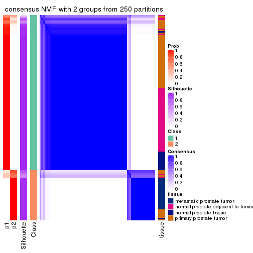</p>

</div>
<div id='tab-ATC-NMF-consensus-heatmap-2'>
<pre><code class="r">consensus_heatmap(res, k = 3)
</code></pre>

<p>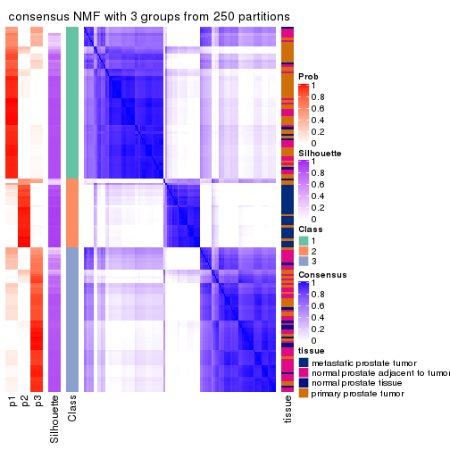</p>

</div>
<div id='tab-ATC-NMF-consensus-heatmap-3'>
<pre><code class="r">consensus_heatmap(res, k = 4)
</code></pre>

<p>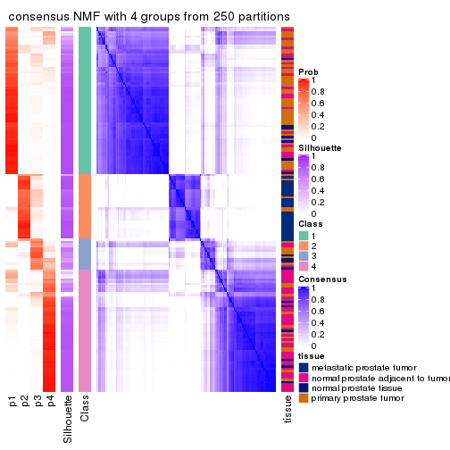</p>

</div>
<div id='tab-ATC-NMF-consensus-heatmap-4'>
<pre><code class="r">consensus_heatmap(res, k = 5)
</code></pre>

<p>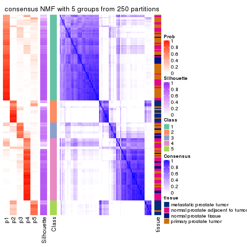</p>

</div>
<div id='tab-ATC-NMF-consensus-heatmap-5'>
<pre><code class="r">consensus_heatmap(res, k = 6)
</code></pre>

<p>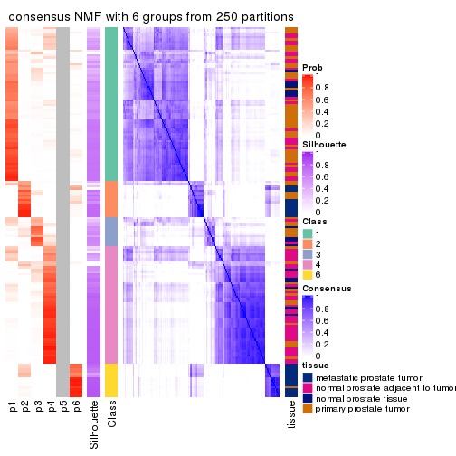</p>

</div>
</div>

Heatmaps for the membership of samples in all partitions to see how consistent they are:


<script>
$( function() {
	$( '#tabs-ATC-NMF-membership-heatmap' ).tabs();
} );
</script>
<div id='tabs-ATC-NMF-membership-heatmap'>
<ul>
<li><a href='#tab-ATC-NMF-membership-heatmap-1'>k = 2</a></li>
<li><a href='#tab-ATC-NMF-membership-heatmap-2'>k = 3</a></li>
<li><a href='#tab-ATC-NMF-membership-heatmap-3'>k = 4</a></li>
<li><a href='#tab-ATC-NMF-membership-heatmap-4'>k = 5</a></li>
<li><a href='#tab-ATC-NMF-membership-heatmap-5'>k = 6</a></li>
</ul>
<div id='tab-ATC-NMF-membership-heatmap-1'>
<pre><code class="r">membership_heatmap(res, k = 2)
</code></pre>

<p>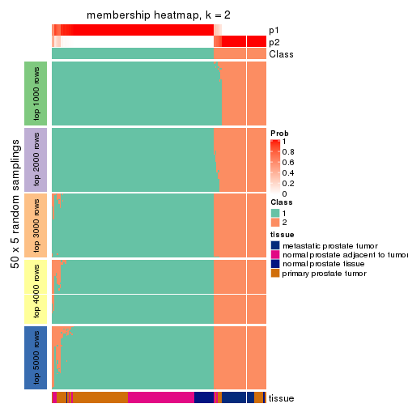</p>

</div>
<div id='tab-ATC-NMF-membership-heatmap-2'>
<pre><code class="r">membership_heatmap(res, k = 3)
</code></pre>

<p>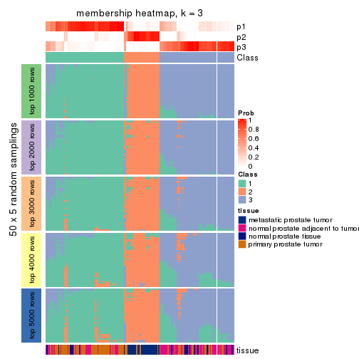</p>

</div>
<div id='tab-ATC-NMF-membership-heatmap-3'>
<pre><code class="r">membership_heatmap(res, k = 4)
</code></pre>

<p>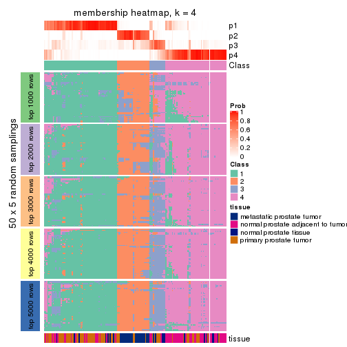</p>

</div>
<div id='tab-ATC-NMF-membership-heatmap-4'>
<pre><code class="r">membership_heatmap(res, k = 5)
</code></pre>

<p>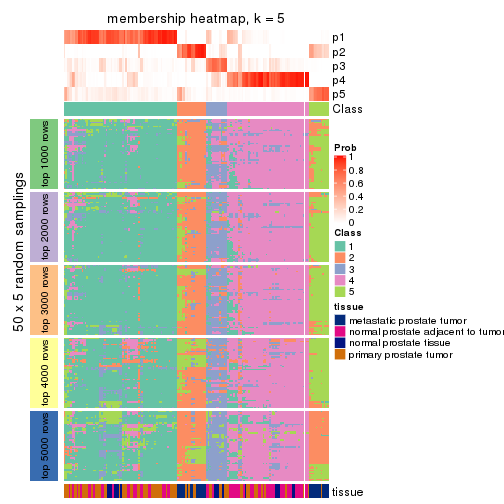</p>

</div>
<div id='tab-ATC-NMF-membership-heatmap-5'>
<pre><code class="r">membership_heatmap(res, k = 6)
</code></pre>

<p>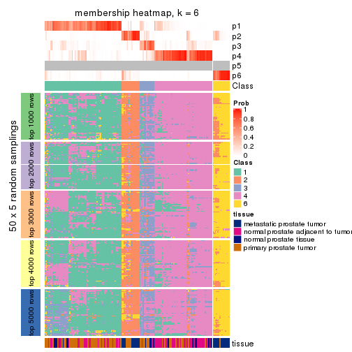</p>

</div>
</div>

As soon as we have had the classes for columns, we can look for signatures
which are significantly different between classes which can be candidate marks
for certain classes. Following are the heatmaps for signatures.


Signature heatmaps where rows are scaled:


<script>
$( function() {
	$( '#tabs-ATC-NMF-get-signatures' ).tabs();
} );
</script>
<div id='tabs-ATC-NMF-get-signatures'>
<ul>
<li><a href='#tab-ATC-NMF-get-signatures-1'>k = 2</a></li>
<li><a href='#tab-ATC-NMF-get-signatures-2'>k = 3</a></li>
<li><a href='#tab-ATC-NMF-get-signatures-3'>k = 4</a></li>
<li><a href='#tab-ATC-NMF-get-signatures-4'>k = 5</a></li>
<li><a href='#tab-ATC-NMF-get-signatures-5'>k = 6</a></li>
</ul>
<div id='tab-ATC-NMF-get-signatures-1'>
<pre><code class="r">get_signatures(res, k = 2)
</code></pre>

<p>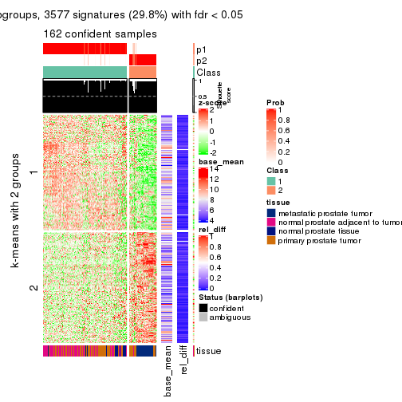</p>

</div>
<div id='tab-ATC-NMF-get-signatures-2'>
<pre><code class="r">get_signatures(res, k = 3)
</code></pre>

<p>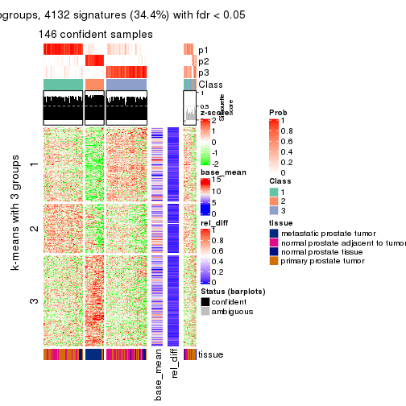</p>

</div>
<div id='tab-ATC-NMF-get-signatures-3'>
<pre><code class="r">get_signatures(res, k = 4)
</code></pre>

<p>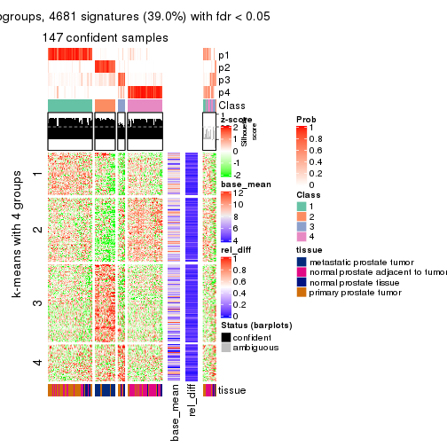</p>

</div>
<div id='tab-ATC-NMF-get-signatures-4'>
<pre><code class="r">get_signatures(res, k = 5)
</code></pre>

<p>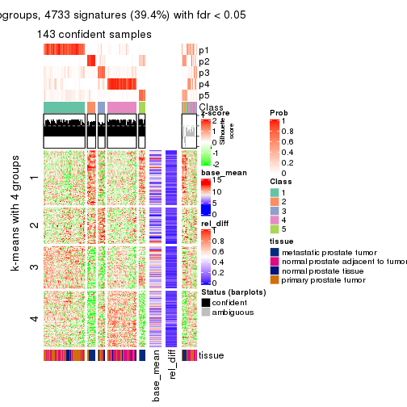</p>

</div>
<div id='tab-ATC-NMF-get-signatures-5'>
<pre><code class="r">get_signatures(res, k = 6)
</code></pre>

<p>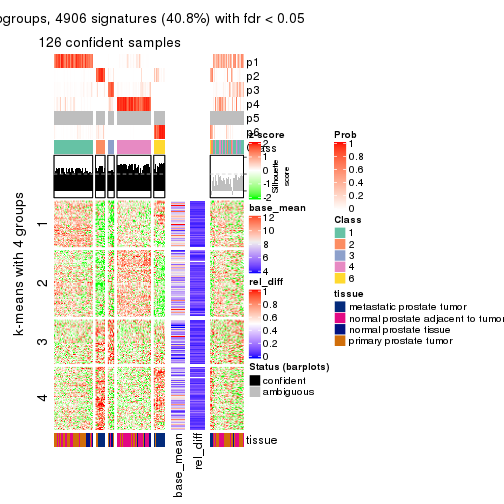</p>

</div>
</div>


Signature heatmaps where rows are not scaled:


<script>
$( function() {
	$( '#tabs-ATC-NMF-get-signatures-no-scale' ).tabs();
} );
</script>
<div id='tabs-ATC-NMF-get-signatures-no-scale'>
<ul>
<li><a href='#tab-ATC-NMF-get-signatures-no-scale-1'>k = 2</a></li>
<li><a href='#tab-ATC-NMF-get-signatures-no-scale-2'>k = 3</a></li>
<li><a href='#tab-ATC-NMF-get-signatures-no-scale-3'>k = 4</a></li>
<li><a href='#tab-ATC-NMF-get-signatures-no-scale-4'>k = 5</a></li>
<li><a href='#tab-ATC-NMF-get-signatures-no-scale-5'>k = 6</a></li>
</ul>
<div id='tab-ATC-NMF-get-signatures-no-scale-1'>
<pre><code class="r">get_signatures(res, k = 2, scale_rows = FALSE)
</code></pre>

<p>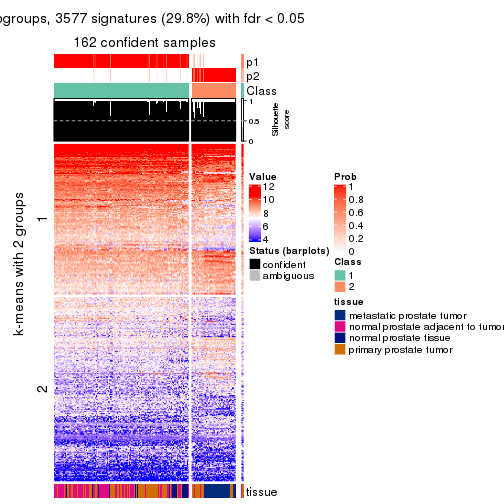</p>

</div>
<div id='tab-ATC-NMF-get-signatures-no-scale-2'>
<pre><code class="r">get_signatures(res, k = 3, scale_rows = FALSE)
</code></pre>

<p>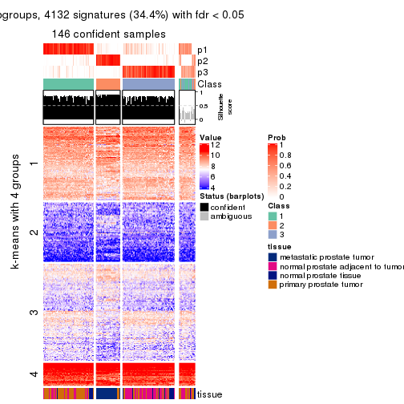</p>

</div>
<div id='tab-ATC-NMF-get-signatures-no-scale-3'>
<pre><code class="r">get_signatures(res, k = 4, scale_rows = FALSE)
</code></pre>

<p>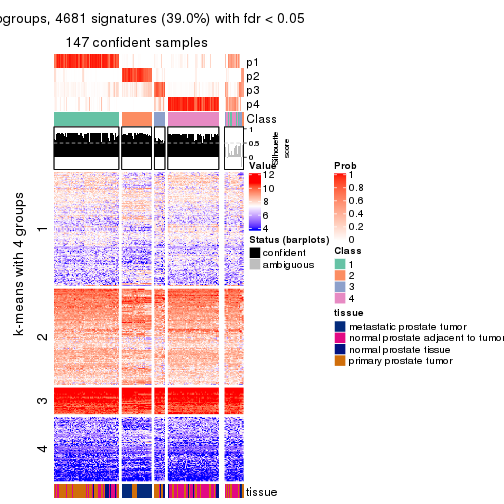</p>

</div>
<div id='tab-ATC-NMF-get-signatures-no-scale-4'>
<pre><code class="r">get_signatures(res, k = 5, scale_rows = FALSE)
</code></pre>

<p>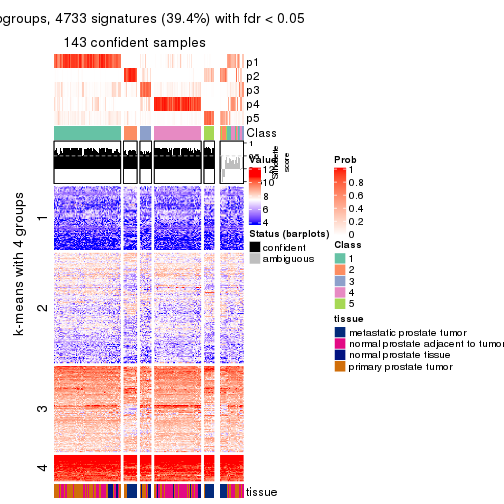</p>

</div>
<div id='tab-ATC-NMF-get-signatures-no-scale-5'>
<pre><code class="r">get_signatures(res, k = 6, scale_rows = FALSE)
</code></pre>

<p>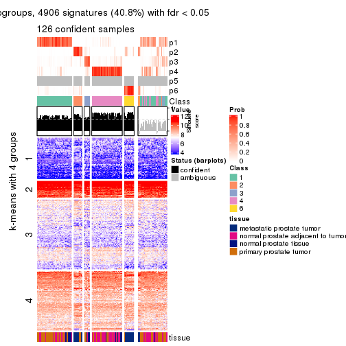</p>

</div>
</div>


Compare the overlap of signatures from different k:

```r
compare_signatures(res)
```

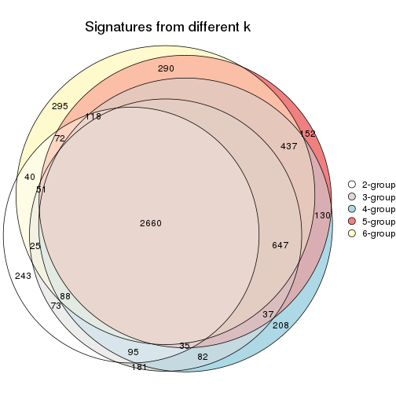

`get_signature()` returns a data frame invisibly. TO get the list of signatures, the function
call should be assigned to a variable explicitly. In following code, if `plot` argument is set
to `FALSE`, no heatmap is plotted while only the differential analysis is performed.

```r
# code only for demonstration
tb = get_signature(res, k = ..., plot = FALSE)
```

An example of the output of `tb` is:

```
#>   which_row         fdr    mean_1    mean_2 scaled_mean_1 scaled_mean_2 km
#> 1        38 0.042760348  8.373488  9.131774    -0.5533452     0.5164555  1
#> 2        40 0.018707592  7.106213  8.469186    -0.6173731     0.5762149  1
#> 3        55 0.019134737 10.221463 11.207825    -0.6159697     0.5749050  1
#> 4        59 0.006059896  5.921854  7.869574    -0.6899429     0.6439467  1
#> 5        60 0.018055526  8.928898 10.211722    -0.6204761     0.5791110  1
#> 6        98 0.009384629 15.714769 14.887706     0.6635654    -0.6193277  2
...
```

The columns in `tb` are:

1. `which_row`: row indices corresponding to the input matrix.
2. `fdr`: FDR for the differential test. 
3. `mean_x`: The mean value in group x.
4. `scaled_mean_x`: The mean value in group x after rows are scaled.
5. `km`: Row groups if k-means clustering is applied to rows.


UMAP plot which shows how samples are separated.


<script>
$( function() {
	$( '#tabs-ATC-NMF-dimension-reduction' ).tabs();
} );
</script>
<div id='tabs-ATC-NMF-dimension-reduction'>
<ul>
<li><a href='#tab-ATC-NMF-dimension-reduction-1'>k = 2</a></li>
<li><a href='#tab-ATC-NMF-dimension-reduction-2'>k = 3</a></li>
<li><a href='#tab-ATC-NMF-dimension-reduction-3'>k = 4</a></li>
<li><a href='#tab-ATC-NMF-dimension-reduction-4'>k = 5</a></li>
<li><a href='#tab-ATC-NMF-dimension-reduction-5'>k = 6</a></li>
</ul>
<div id='tab-ATC-NMF-dimension-reduction-1'>
<pre><code class="r">dimension_reduction(res, k = 2, method = &quot;UMAP&quot;)
</code></pre>

<p>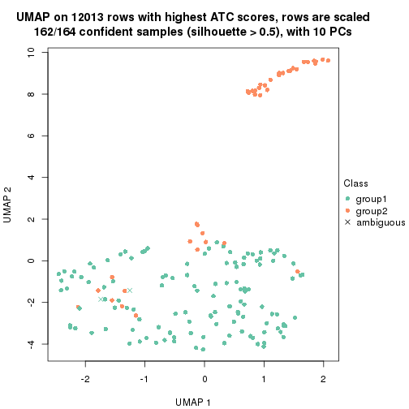</p>

</div>
<div id='tab-ATC-NMF-dimension-reduction-2'>
<pre><code class="r">dimension_reduction(res, k = 3, method = &quot;UMAP&quot;)
</code></pre>

<p>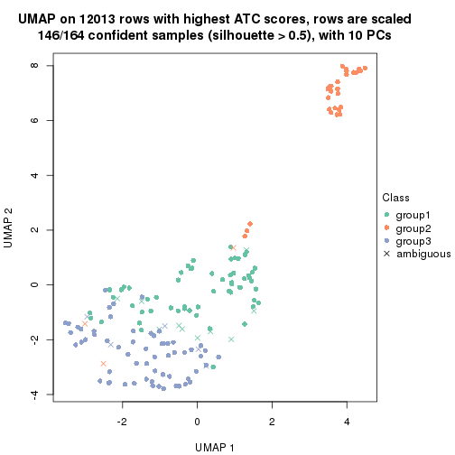</p>

</div>
<div id='tab-ATC-NMF-dimension-reduction-3'>
<pre><code class="r">dimension_reduction(res, k = 4, method = &quot;UMAP&quot;)
</code></pre>

<p>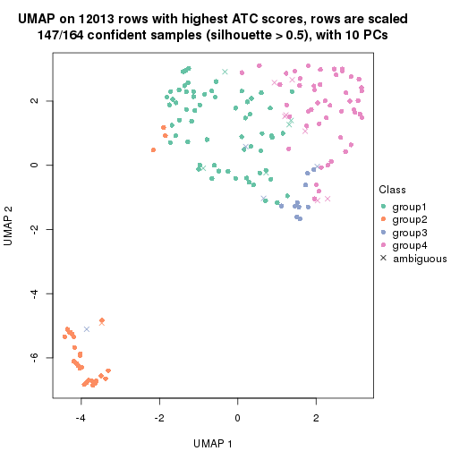</p>

</div>
<div id='tab-ATC-NMF-dimension-reduction-4'>
<pre><code class="r">dimension_reduction(res, k = 5, method = &quot;UMAP&quot;)
</code></pre>

<p>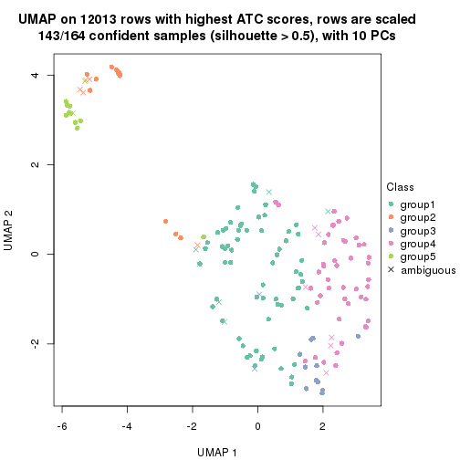</p>

</div>
<div id='tab-ATC-NMF-dimension-reduction-5'>
<pre><code class="r">dimension_reduction(res, k = 6, method = &quot;UMAP&quot;)
</code></pre>

<p>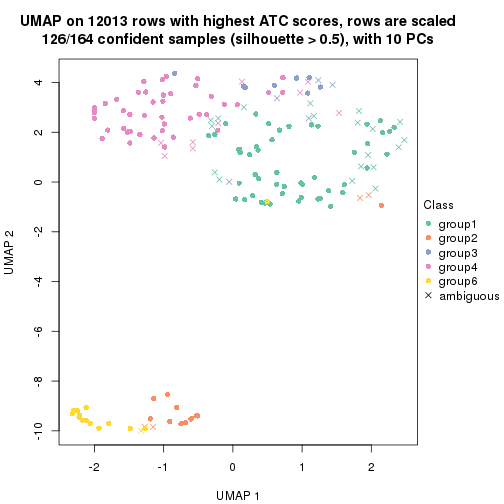</p>

</div>
</div>


Following heatmap shows how subgroups are split when increasing `k`:

```r
collect_classes(res)
```

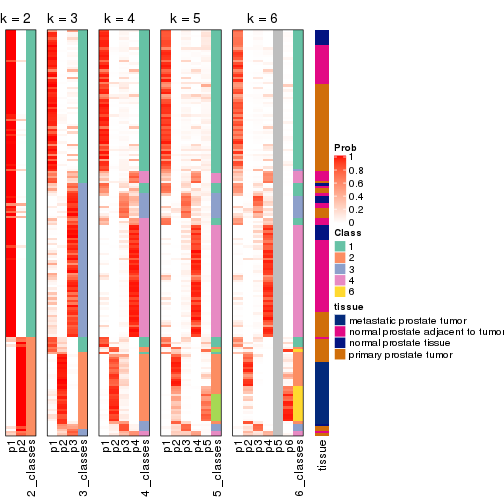


Test correlation between subgroups and known annotations. If the known
annotation is numeric, one-way ANOVA test is applied, and if the known
annotation is discrete, chi-squared contingency table test is applied.

```r
test_to_known_factors(res)
```

```
#>           n tissue(p) k
#> ATC:NMF 162  2.59e-20 2
#> ATC:NMF 146  1.08e-29 3
#> ATC:NMF 147  9.00e-28 4
#> ATC:NMF 143  3.75e-24 5
#> ATC:NMF 126  2.60e-22 6
```


If matrix rows can be associated to genes, consider to use `functional_enrichment(res,
...)` to perform function enrichment for the signature genes. See [this vignette](http://bioconductor.org/packages/devel/bioc/vignettes/cola/inst/doc/functional_enrichment.html) for more detailed explanations.


 

## Session info


```r
sessionInfo()
```

```
#> R version 3.6.0 (2019-04-26)
#> Platform: x86_64-pc-linux-gnu (64-bit)
#> Running under: CentOS Linux 7 (Core)
#> 
#> Matrix products: default
#> BLAS:   /usr/lib64/libblas.so.3.4.2
#> LAPACK: /usr/lib64/liblapack.so.3.4.2
#> 
#> locale:
#>  [1] LC_CTYPE=en_GB.UTF-8       LC_NUMERIC=C               LC_TIME=en_GB.UTF-8       
#>  [4] LC_COLLATE=en_GB.UTF-8     LC_MONETARY=en_GB.UTF-8    LC_MESSAGES=en_GB.UTF-8   
#>  [7] LC_PAPER=en_GB.UTF-8       LC_NAME=C                  LC_ADDRESS=C              
#> [10] LC_TELEPHONE=C             LC_MEASUREMENT=en_GB.UTF-8 LC_IDENTIFICATION=C       
#> 
#> attached base packages:
#> [1] grid      stats     graphics  grDevices utils     datasets  methods   base     
#> 
#> other attached packages:
#> [1] genefilter_1.66.0    ComplexHeatmap_2.3.1 markdown_1.1         knitr_1.26          
#> [5] GetoptLong_0.1.7     cola_1.3.2          
#> 
#> loaded via a namespace (and not attached):
#>  [1] circlize_0.4.8       shape_1.4.4          xfun_0.11            slam_0.1-46         
#>  [5] lattice_0.20-38      splines_3.6.0        colorspace_1.4-1     vctrs_0.2.0         
#>  [9] stats4_3.6.0         blob_1.2.0           XML_3.98-1.20        survival_2.44-1.1   
#> [13] rlang_0.4.2          pillar_1.4.2         DBI_1.0.0            BiocGenerics_0.30.0 
#> [17] bit64_0.9-7          RColorBrewer_1.1-2   matrixStats_0.55.0   stringr_1.4.0       
#> [21] GlobalOptions_0.1.1  evaluate_0.14        memoise_1.1.0        Biobase_2.44.0      
#> [25] IRanges_2.18.3       parallel_3.6.0       AnnotationDbi_1.46.1 highr_0.8           
#> [29] Rcpp_1.0.3           xtable_1.8-4         backports_1.1.5      S4Vectors_0.22.1    
#> [33] annotate_1.62.0      skmeans_0.2-11       bit_1.1-14           microbenchmark_1.4-7
#> [37] brew_1.0-6           impute_1.58.0        rjson_0.2.20         png_0.1-7           
#> [41] digest_0.6.23        stringi_1.4.3        polyclip_1.10-0      clue_0.3-57         
#> [45] tools_3.6.0          bitops_1.0-6         magrittr_1.5         eulerr_6.0.0        
#> [49] RCurl_1.95-4.12      RSQLite_2.1.4        tibble_2.1.3         cluster_2.1.0       
#> [53] crayon_1.3.4         pkgconfig_2.0.3      zeallot_0.1.0        Matrix_1.2-17       
#> [57] xml2_1.2.2           httr_1.4.1           R6_2.4.1             mclust_5.4.5        
#> [61] compiler_3.6.0
```


